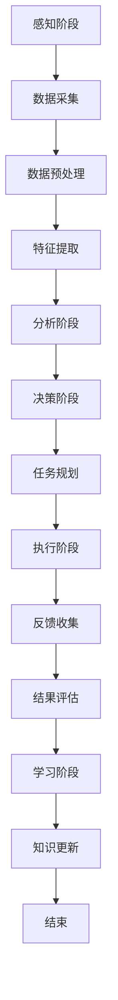
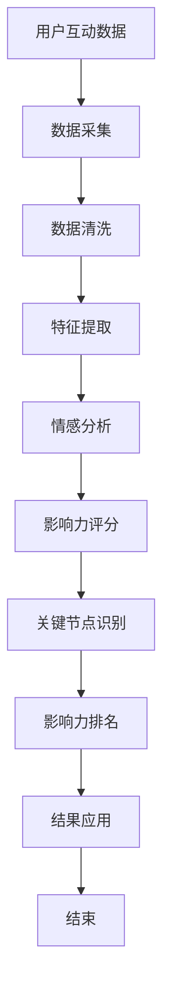

                 

### 1.1 研究背景与意义

随着互联网和社交媒体的迅速发展，社会网络（Social Network）作为人们互动和交流的重要平台，已经成为信息传播、社交互动、商业营销等领域的关键要素。在这个背景下，影响力分析（Influence Analysis）成为了一项备受关注的研究课题。影响力分析旨在识别和度量个体或群体在社交网络中的影响力，揭示其在信息传播、社会动员、品牌营销等方面的作用。

社会网络是由实体和它们之间的关联构成的复杂系统，这些实体可以是个人、组织或信息。社会网络分析（Social Network Analysis, SNA）作为一种研究方法，通过分析节点和边的关系来揭示网络结构、节点属性和整体网络特性。影响力分析是社会网络分析的一个重要分支，它关注的是如何通过分析社会网络中的节点关系，来评估个体或群体对其他节点的影响力。

AI代理（Artificial Intelligence Agent）作为一种智能化的软件实体，能够在不确定的环境中自主完成特定任务。在影响力分析和社会网络分析中，AI代理的应用能够显著提升分析效率、扩展分析维度和增强分析精度。通过引入AI代理，我们可以实现自动化的影响力评估、实时监测、动态调整等任务，从而更好地理解社会网络中的信息传播机制和影响力作用。

本研究旨在探讨AI代理在社会网络中的工作流，通过影响力分析的理论基础、AI代理的理论基础以及两者的结合，来构建一个系统化的AI代理工作流模型。具体来说，本文将围绕以下几个核心问题进行探讨：

1. **社会网络中的影响力分析：** 分析社会网络中的影响力定义、测量方法和应用场景，揭示影响力在信息传播和社会动员中的作用。
2. **AI代理的理论基础：** 研究AI代理的定义、类型、工作原理以及发展趋势，探讨其在影响力分析中的应用潜力。
3. **AI代理的工作流模型：** 构建AI代理在社会网络中的工作流模型，分析模型的设计原则和实现技术。
4. **AI代理的协同机制：** 探讨AI代理在社会网络中的协同机制，以实现更高效、准确的影响力分析。
5. **实际应用案例：** 通过具体的实际应用案例，展示AI代理在社会网络中的影响力分析效果，并分析面临的挑战与解决方案。
6. **性能评估与优化：** 研究AI代理的性能评估方法，提出优化策略以提高工作流效率。
7. **未来展望与研究方向：** 分析当前研究的不足与挑战，探讨未来研究的方向和趋势。

通过上述问题的探讨，本文旨在为AI代理在社会网络中的工作流研究提供一个系统化的理论框架和实践指导，为相关领域的研究和应用提供有益的参考。

### 1.2 研究目标与方法

本研究的主要目标是构建一个系统化的AI代理工作流模型，以提升社会网络中影响力分析的效果和效率。具体研究目标包括：

1. **理论基础研究：** 深入研究社会网络中的影响力分析理论和AI代理理论基础，明确两者的关联与融合方式。
2. **工作流模型构建：** 构建一个具有可扩展性和灵活性的AI代理工作流模型，以实现自动化和高效的影响力分析。
3. **协同机制分析：** 研究AI代理在社会网络中的协同机制，探讨如何通过协作提高分析效果和准确性。
4. **性能评估与优化：** 研究AI代理的性能评估方法，提出优化策略以提升工作流的运行效率。
5. **实际应用验证：** 通过实际应用案例验证AI代理工作流模型的有效性和实用性，分析其优势和局限性。

为实现上述研究目标，本文采用了以下研究方法：

1. **文献综述：** 通过查阅国内外相关领域的研究文献，梳理社会网络分析、影响力分析和AI代理的相关理论，为研究提供理论基础。
2. **理论分析：** 结合影响力分析和社会网络分析的理论，分析AI代理在社会网络中的工作流，提出工作流模型和协同机制。
3. **模型构建：** 利用Mermaid等工具构建AI代理的工作流模型，详细描述每个环节的功能和流程。
4. **算法设计：** 设计影响力分析的核心算法，并使用伪代码进行详细阐述，确保算法的实现可操作性和可理解性。
5. **实证分析：** 通过具体应用案例，验证AI代理工作流模型的有效性和实用性，分析其实际应用效果。
6. **性能评估：** 研究AI代理的性能评估方法，通过实验数据评估工作流模型在不同场景下的性能表现，并提出优化策略。

通过上述研究方法，本文旨在全面、系统地探讨AI代理在社会网络中的工作流，为相关领域的研究和应用提供理论支持和实践指导。

### 1.3 基本概念与定义

为了更好地理解本文的研究内容和框架，我们需要明确一些基本概念和定义，这些概念包括社会网络、影响力分析、AI代理等。

#### 社会网络

社会网络（Social Network）是指由若干个体（节点）及其之间的互动关系（边）构成的复杂系统。这些节点可以是个人、组织、品牌等实体，而边则表示节点之间的联系，如好友关系、合作关系或信息传播路径。社会网络具有以下主要特性：

1. **节点多样性：** 社会网络中的节点可以是各种不同类型的实体，如个人、组织、信息等。
2. **边的动态性：** 社会网络中的边关系是动态变化的，随着时间、环境和社会行为的变化，节点之间的关系也会发生变化。
3. **网络结构复杂：** 社会网络中的结构复杂，包括小世界效应、聚类系数等特征，这些特征使得社会网络具有高度的信息传播效率和复杂性。
4. **网络效应：** 社会网络中的节点相互作用会放大个体的影响力，从而在整体上产生网络效应。

#### 影响力分析

影响力分析（Influence Analysis）是研究个体或群体在社交网络中的影响力大小及其作用机制的一种分析方法。影响力分析旨在识别和度量个体或群体在信息传播、社会动员、品牌营销等方面的作用，其主要内容包括：

1. **影响力定义：** 影响力是指个体或群体对其他个体或群体的行为、态度、决策等方面产生影响的程度和能力。
2. **影响力测量：** 通过分析社交网络中的节点关系和属性，评估个体或群体的影响力大小。常见的影响力测量方法包括中心性度量、网络距离、影响力传播模型等。
3. **影响力应用场景：** 影响力分析广泛应用于社交媒体营销、舆情分析、社交网络管理、品牌推广等领域，帮助企业和个人更好地理解和利用影响力。

#### AI代理

AI代理（Artificial Intelligence Agent）是指一种智能化的软件实体，能够在不确定的环境中自主完成特定任务。AI代理具有以下主要特征：

1. **自主性：** AI代理能够自主地感知环境、制定计划和执行任务，无需人工干预。
2. **适应性：** AI代理能够根据环境变化和任务需求，调整自己的行为和策略。
3. **协作性：** AI代理能够与其他代理或人类协作，共同完成任务。
4. **智能性：** AI代理利用人工智能技术，如机器学习、自然语言处理、计算机视觉等，实现智能化的任务处理。

AI代理在影响力分析和社会网络分析中的应用，主要表现在以下几个方面：

1. **自动化分析：** AI代理可以自动化地进行影响力分析，提高分析效率和质量。
2. **实时监测：** AI代理可以实时监测社交网络中的节点动态和影响力变化，提供及时的决策支持。
3. **协同工作：** AI代理可以通过协同机制，与其他代理或人类共同完成复杂的任务。

通过上述基本概念和定义的阐述，我们可以更好地理解社会网络、影响力分析和AI代理之间的内在联系，以及本文研究的核心内容和目标。

#### 1.4 组织结构概述

本文的结构组织旨在清晰地呈现影响力分析与社会网络以及AI代理工作流研究的内容，便于读者系统地理解和吸收知识。以下是本文的结构概述：

##### 第一部分：基础理论与概念

- **第1章 引论**
  - 研究背景与意义
  - 研究目标与方法
  - 基本概念与定义
  - 组织结构概述

该章节为后续研究奠定了理论基础，明确了研究的背景、目标和基本概念，为读者提供了对整篇文章的宏观把握。

##### 第二部分：社会网络理论基础

- **第2章 社会网络理论基础**
  - 社会网络的定义与特性
  - 社会网络的度量
  - 社会网络分析的基本方法

这一部分深入探讨了社会网络的基本概念、特性以及分析方法，为影响力分析提供了必要的理论基础。

- **第3章 影响力分析理论基础**
  - 影响力分析的定义与分类
  - 影响力测量的方法与指标
  - 影响力分析的应用场景

本章详细介绍了影响力分析的理论框架，包括其定义、测量方法和应用场景，为后续AI代理的工作流设计提供了基础。

##### 第三部分：AI代理的理论基础

- **第4章 AI代理的理论基础**
  - AI代理的定义与类型
  - AI代理的工作原理
  - AI代理的发展现状与趋势

这一部分介绍了AI代理的基本概念、工作原理及其发展现状，为理解AI代理在社会网络中的应用奠定了基础。

- **第5章 AI代理在社会网络中的工作流**
  - AI代理的工作流模型
  - AI代理的工作流设计原则
  - AI代理的工作流实现技术
  - AI代理在工作流中的协同机制

本章重点研究了AI代理在社会网络中的工作流，包括模型设计、实现技术和协同机制，为构建高效的AI代理工作流提供了具体指导。

##### 第四部分：实际应用案例

- **第6章 影响力分析与社会网络的实际应用案例**
  - 社交媒体中的影响力分析案例
  - 舆情分析中的影响力分析案例
  - 网络营销中的影响力分析案例
  - 社交网络分析在实际应用中的挑战与解决方案

这一部分通过具体的应用案例，展示了AI代理在社会网络中的实际应用效果，并分析了面临的挑战与解决方案。

##### 第五部分：性能评估与未来展望

- **第7章 AI代理在工作流中的性能评估**
  - AI代理的性能评价指标
  - AI代理性能评估的方法
  - 实际应用中的性能优化策略

本章研究了AI代理的性能评估方法和优化策略，为提高AI代理的工作流效率提供了理论支持。

- **第8章 未来展望与研究方向**
  - 研究趋势与未来发展方向
  - 跨学科融合与综合应用前景
  - 研究中的挑战与机遇
  - 结论与展望

最后一章总结了当前研究的成果，探讨了未来研究的方向和挑战，为该领域的发展提供了前瞻性思考。

通过这样的组织结构，本文希望能够系统、全面地呈现影响力分析与社会网络以及AI代理工作流研究的核心内容，为读者提供深入的学术价值和实践指导。

### 2.1 社会网络的定义与特性

社会网络（Social Network）是一种以个体及其相互关系为研究对象的数据结构，通过节点（Node）和边（Edge）来表示个体和个体之间的关系。社会网络广泛应用于社会学、心理学、计算机科学和人工智能等领域，用于分析信息传播、社交互动、社会动员和商业营销等复杂社会现象。

#### 定义

社会网络可以被定义为一个由个体及其相互关系构成的复杂系统，这些个体称为节点（Nodes），个体之间的关系称为边（Edges）。一个典型的社会网络包括以下几个基本元素：

1. **节点（Nodes）：** 节点可以表示任何个体，如个人、组织、品牌或信息。节点可以是现实世界中的实体，也可以是抽象的概念。
2. **边（Edges）：** 边表示节点之间的关系，可以是朋友关系、合作关系、信息传播路径等。边通常具有权重（Weight），用来表示关系的强度或重要性。
3. **属性（Attributes）：** 节点和边可以具有多种属性，如节点的年龄、性别、职业等，边的类型、时间和强度等。

#### 特性

社会网络具有以下主要特性：

1. **节点多样性：** 社会网络中的节点具有多样性，可以是不同类型的实体，如个人、组织、信息等。
2. **边的动态性：** 社会网络中的边关系是动态变化的，随着时间、环境和个体行为的变化，节点之间的关系也会发生变化。
3. **网络结构复杂：** 社会网络的结构复杂，包括小世界效应（Small World Effect）、高聚类系数（High Clustering Coefficient）等特征。这些特征使得社会网络具有高度的信息传播效率和复杂性。
4. **网络效应：** 社会网络中的节点相互作用会放大个体的影响力，从而在整体上产生网络效应。例如，一个有影响力的节点可以通过社交网络对其他节点产生深远的影响。

#### 社会网络与影响力分析的关系

社会网络和影响力分析密切相关。影响力分析依赖于社会网络的节点关系和结构特性，通过分析节点间的连接和属性，评估个体或群体在社交网络中的影响力。具体来说，社会网络中的影响力分析包括以下几个方面：

1. **中心性度量：** 通过分析节点的度数（Degree）、介数（Betweenness）和接近度（Closeness）等指标，评估节点在社交网络中的中心性，从而判断其影响力。
2. **影响力传播模型：** 建立基于社会网络结构的影响力传播模型，模拟信息或影响力在网络中的传播过程，评估节点在传播过程中的作用和效果。
3. **网络分解：** 通过社会网络的分解方法，如核心-边缘结构（Core-Periphery Structure）分析，揭示社交网络中的关键节点和边缘节点，识别潜在的影响力中心。
4. **影响力评价：** 结合节点属性和社会网络结构，综合评价节点的综合影响力，为社交网络管理和营销策略提供数据支持。

社会网络的定义和特性为其在影响力分析中的应用提供了基础。通过深入理解社会网络的内在结构，我们可以更准确地评估个体和群体在社交网络中的影响力，为相关领域的研究和实践提供有力支持。

### 2.2 社会网络的度量

社会网络的度量是影响力分析的关键环节，通过一系列指标和方法来评估网络中节点和整体网络的特性。这些度量方法不仅帮助我们理解社交网络的内部结构，还能揭示节点之间的相互关系，为影响力分析提供有力支持。

#### 节点度量

节点度量主要关注社交网络中个体节点的特征和影响力，以下是一些常见的节点度量指标：

1. **度数（Degree）**：
   - **定义**：度数是节点连接的边的数量，分为入度（In-Degree）和出度（Out-Degree）。
   - **作用**：度数越高，节点在网络中的连接越广泛，通常意味着更高的影响力。
   - **计算**：度数 = 边的数量。

2. **介数（Betweenness）**：
   - **定义**：介数表示一个节点位于其他节点之间路径上的频率，即节点在信息或影响力传播路径中的重要程度。
   - **作用**：介数高的节点在网络中的桥梁作用显著，是影响传播的关键节点。
   - **计算**：介数 = 通过该节点的最短路径数量 / 总最短路径数量。

3. **接近度（Closeness）**：
   - **定义**：接近度表示一个节点到网络中其他节点的平均最短路径长度。
   - **作用**：接近度越低，节点在网络中的位置越中心，影响力越高。
   - **计算**：接近度 = （网络节点数量 - 1）/ 网络中所有节点的平均最短路径长度。

4. **中心性（Centrality）**：
   - **定义**：中心性是综合度数、介数和接近度等多个指标，评价节点在社交网络中的中心程度。
   - **作用**：中心性高的节点通常在网络中具有更高的影响力。
   - **计算**：通常通过加权中心性公式计算，综合度数、介数和接近度的加权平均。

5. **影响力指标（Influence Score）**：
   - **定义**：影响力指标是通过分析节点的实际影响力，如信息传播能力、社交影响等，评价节点的综合影响力。
   - **作用**：影响力指标更贴近实际应用，能够反映节点在具体场景中的实际影响力。
   - **计算**：基于特定算法，如影响力传播模型，计算节点的影响力得分。

#### 网络度量

网络度量主要关注整个社交网络的特性和结构，以下是一些常用的网络度量指标：

1. **密度（Density）**：
   - **定义**：网络密度表示网络中实际存在的边与可能存在的最大边的比例。
   - **作用**：密度越高，网络越紧密，信息传播和影响力扩散的效率越高。
   - **计算**：密度 = （实际边数 / 最大可能边数）。

2. **直径（Diameter）**：
   - **定义**：直径是网络中任意两个最远节点之间的最短路径长度。
   - **作用**：直径越小，网络中的节点之间距离越近，信息传播和影响力扩散的速度越快。
   - **计算**：直径 = 最大最短路径长度。

3. **聚类系数（Clustering Coefficient）**：
   - **定义**：聚类系数表示一个节点邻居之间相互连接的概率。
   - **作用**：聚类系数越高，网络中的社区结构越明显，节点之间的联系更加紧密。
   - **计算**：聚类系数 = （一个节点的邻居对数量 / 该节点的邻居数量平方）。

4. **异质性（Heterogeneity）**：
   - **定义**：异质性表示网络中节点多样性和连接方式的分布差异。
   - **作用**：异质性越高的网络，节点之间的相互作用和影响力传播更加复杂和多样化。
   - **计算**：通过计算节点属性分布和边属性的分布差异来评估异质性。

#### 社会网络度量的应用

社会网络度量在影响力分析中有着广泛的应用，例如：

- **社交媒体分析**：通过度数、介数等指标分析用户在网络中的影响力，识别意见领袖和关键用户。
- **舆情分析**：通过分析节点的聚类系数和接近度，识别网络中的主要社区和传播路径。
- **品牌营销**：通过综合影响力指标评估品牌在不同社交网络中的表现，制定更有针对性的营销策略。

通过上述节点和网络度量方法，我们可以更深入地理解社交网络的内在结构，为影响力分析提供科学依据和实用工具。

### 2.3 社会网络分析的基本方法

社会网络分析（Social Network Analysis, SNA）是一种研究个体及其相互关系的方法，通过分析节点和边的结构特性，揭示社会网络的内在规律。社会网络分析的基本方法包括图论、矩阵理论和网络科学方法等，每种方法都有其独特的优势和适用场景。

#### 图论方法

图论（Graph Theory）是研究图及其性质的理论体系，是社会网络分析的基础。在社会网络分析中，图论方法主要用于描述和表示社会网络的结构和特性。

1. **图表示**：
   - **节点（Nodes）**：表示个体或实体，可以是个人、组织、品牌等。
   - **边（Edges）**：表示个体之间的关联或互动，可以是好友关系、合作关系、信息传播路径等。
   - **子图（Subgraphs）**：表示网络中的特定部分或社区，如朋友圈、工作小组等。

2. **图的基本属性**：
   - **度数（Degree）**：节点连接的边的数量，分为入度和出度。
   - **连通性（Connectivity）**：网络中任意两个节点之间是否可以通过边直接相连。
   - **路径（Paths）**：节点之间的连通路径，可以是直接路径或最短路径。

3. **图的基本操作**：
   - **图的分割（Graph Partitioning）**：将网络分割为多个子图，用于识别社区结构。
   - **图的聚类（Graph Clustering）**：识别网络中的紧密连接的节点集合，用于社区检测和节点分类。

#### 矩阵理论方法

矩阵理论（Matrix Theory）在社会网络分析中的应用主要体现在矩阵表示和矩阵运算上。

1. **邻接矩阵（Adjacency Matrix）**：
   - **定义**：邻接矩阵是一个方阵，表示网络中节点之间的直接关联。如果节点i和节点j之间存在直接关联，则\( A_{ij} = 1 \)，否则为0。
   - **应用**：邻接矩阵可以用于计算节点的度数、网络的连通性和路径长度等。

2. **权重矩阵（Weighted Matrix）**：
   - **定义**：权重矩阵是邻接矩阵的扩展，表示节点之间的关联强度。权重可以是边的长度、时间或频率等。
   - **应用**：权重矩阵可以用于计算网络中的路径权重、节点的中心性和影响力等。

3. **矩阵运算**：
   - **矩阵乘法（Matrix Multiplication）**：用于计算节点的介数、接近度等网络属性。
   - **矩阵分解（Matrix Factorization）**：用于降维和提取网络的主要结构特征，如社区结构、核心-边缘结构等。

#### 网络科学方法

网络科学（Network Science）是跨学科的研究领域，结合了图论、矩阵理论和复杂系统理论，用于分析和理解复杂网络的结构和功能。

1. **网络模型**：
   - **小世界网络（Small-World Networks）**：具有短路径长度和高度聚集特性的网络。
   - **无标度网络（Scale-Free Networks）**：节点分布具有幂律分布，无特征长度尺度的网络。
   - **复杂网络（Complex Networks）**：具有多种复杂结构和动态特性的网络。

2. **网络动力学**：
   - **传播模型（Spread Models）**：模拟信息、流行病或影响力在网络中的传播过程。
   - **动态网络（Dynamic Networks）**：研究网络随时间变化的特性，如节点加入、离开、边出现和消失等。

3. **网络优化**：
   - **路径优化（Path Optimization）**：寻找网络中的最优路径，如最短路径、最经济路径等。
   - **社区优化（Community Optimization）**：优化网络的社区结构，提高网络的连通性和模块化程度。

社会网络分析的基本方法为研究社会网络的内在结构和功能提供了丰富的工具和视角。通过图论、矩阵理论和网络科学方法，我们可以深入理解社交网络的复杂性和多样性，揭示个体和群体之间的相互作用机制，为影响力分析提供科学依据和实用工具。

### 3.1 影响力分析的定义与分类

影响力分析（Influence Analysis）是研究个体或群体在社交网络中产生和传递影响的能力和效果的一种分析方法。影响力分析旨在识别和度量个体或群体在信息传播、社会动员、品牌营销等方面的作用，从而为社交网络管理和决策提供支持。根据分析对象和方法的不同，影响力分析可以分类如下：

#### 按分析对象分类

1. **个体影响力分析**：
   - **定义**：个体影响力分析关注单个个体在社交网络中的影响力，通常用于识别意见领袖、关键用户和影响者。
   - **方法**：通过计算节点的度数、介数、接近度等指标来评估个体的影响力。此外，还可以使用基于实际影响力的评分模型，如影响力分数（Influence Score）或Katz中心性（Katz Centrality）。

2. **群体影响力分析**：
   - **定义**：群体影响力分析关注由多个个体组成的群体在社交网络中的整体影响力，通常用于分析社区、组织和团队的影响力。
   - **方法**：通过计算群体的度数、介数、接近度等指标来评估整体影响力。此外，还可以使用基于群体行为和互动的复杂网络模型，如多尺度网络分析（Multi-scale Network Analysis）和社区结构分析（Community Structure Analysis）。

#### 按分析方法分类

1. **结构化影响力分析**：
   - **定义**：结构化影响力分析基于社会网络的节点和边结构，通过数学模型和算法来度量影响力。
   - **方法**：常用的结构化影响力分析方法包括中心性度量（Centrality Measure）、影响力传播模型（Influence Spread Model）和影响力分解（Influence Decomposition）。

2. **行为化影响力分析**：
   - **定义**：行为化影响力分析基于个体的行为特征和互动数据，通过数据挖掘和机器学习来识别和度量影响力。
   - **方法**：常用的行为化影响力分析方法包括用户行为分析（User Behavior Analysis）、社交网络情感分析（Social Network Sentiment Analysis）和影响力评分模型（Influence Scoring Model）。

3. **情境化影响力分析**：
   - **定义**：情境化影响力分析考虑具体情境和上下文，通过情景模拟和实时分析来评估影响力。
   - **方法**：常用的情境化影响力分析方法包括情景模拟（Scenario Simulation）、实时分析（Real-time Analysis）和情境依赖模型（Context-Dependent Model）。

#### 按应用领域分类

1. **社交媒体影响力分析**：
   - **定义**：社交媒体影响力分析关注在社交媒体平台上，个体或群体如何影响和被影响。
   - **方法**：通过分析社交网络的拓扑结构、用户行为和互动数据来评估影响力。

2. **舆情分析**：
   - **定义**：舆情分析关注社会热点事件和公众舆论的变化，通过影响力分析识别关键信息和意见领袖。
   - **方法**：通过大数据分析和实时监测来识别和度量舆情中的影响力。

3. **品牌营销**：
   - **定义**：品牌营销中的影响力分析关注如何通过社交网络和影响力传播来提升品牌知名度和用户参与度。
   - **方法**：通过评估品牌在不同社交网络中的表现和用户反馈来优化营销策略。

#### 按影响力类型分类

1. **直接影响力**：
   - **定义**：直接影响力是直接由个体行为产生的对其他个体或群体的影响。
   - **方法**：通过分析个体的直接互动行为，如转发、评论、点赞等，来度量直接影响力。

2. **间接影响力**：
   - **定义**：间接影响力是通过个体之间的互动和传播产生的对其他个体或群体的影响。
   - **方法**：通过影响力传播模型来模拟和评估间接影响力，如多步影响力传播模型（Multi-step Influence Spread Model）。

影响力分析在多个领域具有广泛的应用，通过不同分类方法，我们可以更深入地理解影响力分析的方法和目标，从而为实际应用提供更科学的指导和更有效的解决方案。

### 3.2 影响力测量的方法与指标

影响力测量是影响力分析的核心环节，通过一系列定量和定性的方法与指标，我们可以准确评估个体或群体在社交网络中的影响力。以下是一些常见的影响力测量方法与指标：

#### 定量指标

1. **度数（Degree）**：
   - **定义**：度数是节点连接的边的数量，分为入度（In-Degree）和出度（Out-Degree）。
   - **计算**：入度表示节点接收到的连接数量，出度表示节点发送的连接数量。
   - **应用**：度数越高，节点在网络中的连接越广泛，通常意味着更高的影响力。

2. **介数（Betweenness）**：
   - **定义**：介数表示一个节点位于其他节点之间路径上的频率，即节点在信息或影响力传播路径中的重要程度。
   - **计算**：介数 = 通过该节点的最短路径数量 / 总最短路径数量。
   - **应用**：介数高的节点在网络中的桥梁作用显著，是影响传播的关键节点。

3. **接近度（Closeness）**：
   - **定义**：接近度表示一个节点到网络中其他节点的平均最短路径长度。
   - **计算**：接近度 = （网络节点数量 - 1）/ 网络中所有节点的平均最短路径长度。
   - **应用**：接近度越低，节点在网络中的位置越中心，影响力越高。

4. **中心性（Centrality）**：
   - **定义**：中心性是综合度数、介数和接近度等多个指标，评价节点在社交网络中的中心程度。
   - **计算**：通常通过加权中心性公式计算，综合度数、介数和接近度的加权平均。
   - **应用**：中心性高的节点通常在网络中具有更高的影响力。

5. **影响力分数（Influence Score）**：
   - **定义**：影响力分数是通过分析节点的行为和互动，如转发、评论、点赞等，计算出的综合影响力得分。
   - **计算**：基于特定算法，如用户行为分析、社交网络情感分析等，计算节点的影响力得分。
   - **应用**：影响力分数用于评估节点在特定社交网络环境中的影响力大小。

#### 定性指标

1. **权威度（Authority）**：
   - **定义**：权威度表示节点在社交网络中的可信度和权威性，通常与节点的信息来源和质量相关。
   - **计算**：通过分析节点接收到的链接质量、内容价值等来评估权威度。
   - **应用**：权威度高的节点通常能够提供高质量的信息，对其他节点具有更高的影响力。

2. **可信度（Trustworthiness）**：
   - **定义**：可信度表示节点在社交网络中的信任度和可靠性，通常与节点的行为和声誉相关。
   - **计算**：通过分析节点的行为记录、互动频率、信誉评分等来评估可信度。
   - **应用**：可信度高的节点通常能够获得其他节点的信任，进而影响其行为和态度。

3. **活跃度（Activity Level）**：
   - **定义**：活跃度表示节点在社交网络中的参与程度和互动频率。
   - **计算**：通过分析节点的发布频率、互动次数、参与度等来评估活跃度。
   - **应用**：活跃度高的节点通常具有更强的社交影响力和传播能力。

#### 综合评价指标

1. **综合影响力（Overall Influence）**：
   - **定义**：综合影响力是综合多个定量和定性指标，评估节点在社交网络中的总体影响力。
   - **计算**：通过加权综合各个指标得分，计算节点的综合影响力得分。
   - **应用**：综合影响力得分用于评估节点在多个维度上的影响力，为社交网络管理和决策提供数据支持。

2. **影响力传播能力（Influence Propagation Ability）**：
   - **定义**：影响力传播能力表示节点在社交网络中影响其他节点的能力。
   - **计算**：通过模拟影响力传播模型，评估节点在不同场景下的影响力传播效果。
   - **应用**：影响力传播能力评估用于识别具有强影响力传播能力的节点，为营销策略和社会网络管理提供指导。

通过上述定量和定性指标，我们可以全面、准确地评估节点在社交网络中的影响力，从而为影响力分析提供科学依据和实用工具。

### 3.3 影响力分析的应用场景

影响力分析在社会网络中的重要性体现在其广泛的应用场景。以下列举了影响力分析在社交媒体、舆情分析、网络营销等多个领域中的实际应用，并分析了其在这些场景中的关键作用。

#### 社交媒体

在社交媒体平台上，影响力分析具有重要作用。通过识别具有高度影响力的用户，企业、品牌和广告商可以更有效地进行市场营销和推广。以下是影响力分析在社交媒体中的具体应用：

1. **识别意见领袖**：影响力分析可以帮助企业识别具有高度影响力的意见领袖，这些用户在社交媒体上具有广泛的关注者和互动者。与意见领袖合作，可以增强品牌曝光度和用户信任度。
2. **营销策略优化**：通过影响力分析，企业可以了解不同营销策略的效果，优化广告投放和用户互动策略，提高营销ROI。
3. **社交媒体监控**：影响力分析可以实时监控社交媒体上的信息传播，识别潜在的风险和机会，及时调整社交媒体策略。

#### 舆情分析

舆情分析涉及对公众舆论的监测、分析和解读。影响力分析在舆情分析中起到关键作用，具体应用如下：

1. **热点话题识别**：通过分析社交网络中的高影响力节点和话题，可以迅速识别当前的热点话题，为舆论引导和政策制定提供数据支持。
2. **舆情监控**：影响力分析可以帮助企业和政府实时监控社交网络上的舆论动态，及时发现和应对负面信息，维护品牌形象和公众信任。
3. **舆情预测**：通过分析历史数据和高影响力节点的行为，可以预测未来舆论趋势，为危机管理和决策提供前瞻性信息。

#### 网络营销

在电子商务和在线营销领域，影响力分析可以提升营销效果和用户参与度。以下是影响力分析在网络营销中的应用：

1. **品牌推广**：通过分析具有高度影响力的用户和社交媒体平台，企业可以制定更有针对性的品牌推广策略，提高品牌曝光度和用户参与度。
2. **产品推荐**：影响力分析可以识别社交网络中的高影响力用户和潜在意见领袖，通过推荐产品给这些用户，实现口碑传播和销售转化。
3. **用户细分**：通过分析用户的行为和互动数据，影响力分析可以帮助企业对用户进行细分，制定个性化的营销策略，提高用户满意度和忠诚度。

#### 社交网络管理

社交网络管理涉及维护社交网络的健康和秩序。影响力分析在社交网络管理中具有重要作用，具体应用如下：

1. **社交网络监控**：通过分析社交网络中的高影响力节点和行为，可以及时发现和应对不良行为和虚假信息，维护社交网络的健康和秩序。
2. **社交网络优化**：影响力分析可以帮助社交网络平台优化用户互动和内容分发机制，提高用户体验和平台活跃度。
3. **社交网络治理**：通过分析社交网络中的权力结构和影响力分布，可以制定更有效的社交网络治理策略，促进社会和谐和公共利益的实现。

#### 其他应用领域

影响力分析不仅在社交媒体、舆情分析和网络营销中具有重要应用，还在其他领域展现出巨大潜力：

1. **科学研究**：影响力分析可以帮助科研机构识别科研网络中的关键节点和热点领域，促进科研合作和创新。
2. **金融分析**：影响力分析可以用于识别金融网络中的关键节点和风险点，为投资决策和风险管理提供支持。
3. **公共卫生**：影响力分析可以用于公共卫生领域，识别关键健康信息传播路径和意见领袖，提高公共卫生宣传和防控效果。

总之，影响力分析在社会网络中的广泛应用，不仅提升了社交网络管理、舆情监控、网络营销等领域的效率和效果，也为跨学科研究和实际应用提供了新的视角和方法。

### 4.1 AI代理的定义与类型

AI代理（Artificial Intelligence Agent）是一种智能化的软件实体，能够自主感知环境、制定决策和执行任务。AI代理在影响力分析和社会网络分析中扮演着重要角色，其定义和类型如下：

#### 定义

AI代理是一种具备以下能力的软件实体：

1. **自主性**：能够自主地感知环境，理解当前状态，并基于预设的规则和策略进行决策。
2. **适应性**：能够根据环境变化和任务需求，调整自己的行为和策略。
3. **协作性**：能够与其他AI代理或人类协作，共同完成任务。
4. **智能性**：利用人工智能技术，如机器学习、自然语言处理、计算机视觉等，实现智能化的任务处理。

#### 类型

根据任务和应用场景的不同，AI代理可以分为以下几种类型：

1. **基于规则代理（Rule-Based Agent）**：
   - **定义**：基于规则的代理使用预定义的规则集来执行任务，规则由专家或用户手动编写。
   - **特点**：简单、直观，但灵活性较低，难以处理复杂和动态环境。

2. **基于案例代理（Case-Based Agent）**：
   - **定义**：基于案例的代理通过存储和检索过去的案例，为当前任务提供解决方案。
   - **特点**：适用于解决相似问题，但需要大量历史数据和良好的案例管理机制。

3. **基于学习的代理（Learning-Based Agent）**：
   - **定义**：基于学习的代理通过机器学习算法，从数据中学习任务解决方案，并自动调整策略。
   - **特点**：适用于处理复杂和动态环境，但需要大量的训练数据和计算资源。

4. **混合代理（Hybrid Agent）**：
   - **定义**：混合代理结合了基于规则、基于案例和基于学习的方法，以应对不同的任务需求。
   - **特点**：具有较高的灵活性和适应性，但实现复杂，需要协调不同方法的优点。

#### AI代理的组成结构

AI代理通常由以下几个部分组成：

1. **感知器（Perception）**：用于获取外部环境信息，如文本、图像、传感器数据等。
2. **知识库（Knowledge Base）**：存储关于任务、策略、历史数据等信息。
3. **规划器（Planner）**：根据当前状态和目标，生成行动计划或决策。
4. **执行器（Executor）**：执行具体的任务操作，如数据采集、信息处理、互动等。
5. **学习模块（Learning Module）**：通过机器学习或数据挖掘技术，从数据中学习新知识和策略。

通过上述定义和类型的介绍，我们可以更好地理解AI代理在影响力分析和社会网络分析中的应用潜力，为后续的工作流设计和实现提供理论基础。

### 4.2 AI代理的工作原理

AI代理作为一种智能化的软件实体，其工作原理涉及多个关键组件和步骤，包括感知器、知识库、规划器和执行器等。以下是AI代理的工作原理详细介绍：

#### 感知器（Perception）

感知器是AI代理感知外部环境信息的核心组件，其主要功能是获取环境中的数据，如文本、图像、传感器数据等。感知器可以通过不同的接口和传感器实现数据的采集，例如，文本感知器可以收集社交媒体上的帖子、评论和回复，图像感知器可以捕捉摄像头或图像库中的图像数据，传感器感知器可以采集物理环境中的温度、湿度、光线等数据。

#### 知识库（Knowledge Base）

知识库是AI代理的知识存储和管理系统，用于存储与任务相关的信息，如预定义的规则、历史数据、先验知识等。知识库可以分为静态知识库和动态知识库。静态知识库包含固定的、不易变化的信息，如业务规则、领域知识等。动态知识库则包含实时更新的信息，如最新数据、用户行为模式等。

知识库的主要功能包括：

1. **数据存储**：存储各种类型的数据，便于后续分析和处理。
2. **数据检索**：根据任务需求，快速检索和提取所需信息。
3. **知识更新**：通过学习模块，从数据中学习新知识，并更新知识库。

#### 规划器（Planner）

规划器是AI代理的决策制定模块，其主要任务是分析当前状态、目标以及知识库中的信息，生成最优的行动计划。规划器通常采用搜索算法、优化算法或模拟方法来生成行动计划。

规划器的主要功能包括：

1. **状态分析**：分析当前环境状态，识别关键信息和变化趋势。
2. **目标设定**：根据任务目标，确定需要达成的具体目标。
3. **行动规划**：生成实现目标的行动序列，选择最优策略。

#### 执行器（Executor）

执行器是AI代理的执行模块，负责执行规划器生成的行动计划，完成具体的任务操作。执行器通常与外部系统或环境进行交互，执行数据采集、信息处理、交互操作等任务。

执行器的主要功能包括：

1. **任务执行**：根据行动计划，执行具体的任务操作。
2. **交互管理**：与用户或其他系统进行交互，实现任务协作。
3. **错误处理**：在执行过程中，处理可能出现的错误和异常情况。

#### 学习模块（Learning Module）

学习模块是AI代理的自我学习和优化模块，通过机器学习、数据挖掘等技术，从数据中学习新知识和策略，并不断优化自身性能。学习模块通常包括以下步骤：

1. **数据收集**：收集与任务相关的数据，用于训练和优化模型。
2. **特征提取**：从数据中提取关键特征，用于训练模型。
3. **模型训练**：利用机器学习算法，训练模型，提高预测和决策能力。
4. **策略优化**：根据训练结果，调整和优化策略，提高任务执行效果。

#### 工作流程

AI代理的工作流程可以概括为以下几个步骤：

1. **感知阶段**：感知器获取外部环境信息，并将数据传递给知识库。
2. **分析阶段**：规划器分析当前状态、目标和知识库中的信息，生成行动计划。
3. **执行阶段**：执行器根据行动计划，执行具体的任务操作，并与外部环境进行交互。
4. **学习阶段**：学习模块从执行结果和环境中学习新知识和策略，并更新知识库和模型。

通过上述工作原理和流程，AI代理能够在复杂和动态的环境中自主感知、决策和执行任务，为影响力分析和社会网络分析提供强大的支持。

### 4.3 AI代理的发展现状与趋势

AI代理作为人工智能领域的关键技术之一，近年来取得了显著的发展，其应用场景和功能不断扩展。以下是对AI代理发展现状与趋势的详细探讨。

#### 当前应用场景

1. **智能客服**：AI代理广泛应用于客服领域，通过自然语言处理和机器学习技术，提供24/7全天候的智能客服服务。智能客服能够处理大量的用户查询，提高响应速度和服务质量。

2. **推荐系统**：AI代理在推荐系统中扮演重要角色，通过分析用户行为和偏好，提供个性化的产品、内容和服务推荐。推荐系统能够提高用户满意度，增加用户粘性和销售额。

3. **金融风控**：AI代理在金融领域应用广泛，用于信用评估、欺诈检测、市场预测等任务。通过分析大量数据，AI代理能够识别潜在风险，提高决策准确性和效率。

4. **智能交通**：AI代理在智能交通系统中用于交通流量预测、路线规划和智能调度。通过实时数据分析，AI代理能够优化交通管理，减少拥堵，提高道路通行效率。

5. **医疗诊断**：AI代理在医疗领域应用于辅助诊断、疾病预测和治疗建议。通过分析医学数据和图像，AI代理能够提供更准确的诊断结果，辅助医生进行决策。

#### 发展趋势

1. **自主性提高**：未来的AI代理将具备更高的自主性，能够在没有人类干预的情况下独立完成任务。这包括自适应学习、自主决策和自我修复等功能，使得AI代理能够在复杂和动态环境中高效运行。

2. **多模态感知**：随着深度学习和多模态感知技术的发展，未来的AI代理将能够处理多种类型的数据，如文本、图像、音频和视频。这种多模态感知能力将使得AI代理在更广泛的应用场景中发挥作用。

3. **协作与互操作**：未来的AI代理将具备更强的协作和互操作能力，能够与不同系统和平台进行无缝集成，实现跨系统的任务协同。这将有助于构建更加智能和高效的智能生态系统。

4. **伦理与隐私**：随着AI代理在各个领域的广泛应用，其伦理和隐私问题日益凸显。未来的AI代理将需要更加重视伦理规范和隐私保护，确保其应用符合社会伦理和法律要求。

5. **强化学习**：强化学习是一种在动态环境中进行学习的方法，未来的AI代理将更加注重强化学习技术的应用。通过不断与环境交互和学习，AI代理将能够实现更复杂的任务和更高的性能。

6. **跨学科融合**：AI代理的发展将不断融合计算机科学、认知科学、社会学等学科，形成跨学科的研究和应用体系。这种融合将有助于拓展AI代理的应用范围和深度，实现更广泛的智能应用。

#### 未来展望

未来的AI代理将更加智能化、自主化，能够处理更复杂和动态的任务。在影响力分析和社会网络分析领域，AI代理将发挥更重要的作用，通过自动化和智能化的分析方法，提高分析效率和质量。同时，AI代理将与其他人工智能技术相结合，构建更加智能化和高效的社会网络管理平台，为企业和个人提供更精准和全面的服务。

### 5.1 AI代理的工作流模型

构建AI代理的工作流模型是实现高效影响力分析和社会网络管理的关键。工作流模型定义了AI代理在处理任务时的各个阶段、流程以及相关组件，从而确保任务的有序、高效执行。以下是对AI代理工作流模型的详细描述：

#### 模型组成部分

AI代理的工作流模型主要包括以下组成部分：

1. **感知阶段（Perception Stage）**：
   - **功能**：感知阶段负责获取外部环境信息，如社交媒体数据、用户行为数据等。
   - **组件**：感知器（Perception Unit），负责实时监控和采集数据。

2. **分析阶段（Analysis Stage）**：
   - **功能**：分析阶段负责对感知阶段获取的数据进行预处理、特征提取和模式识别。
   - **组件**：分析模块（Analysis Module），包括数据预处理、特征提取和模式识别算法。

3. **决策阶段（Decision Stage）**：
   - **功能**：决策阶段根据分析结果，制定任务执行策略和决策。
   - **组件**：规划器（Planner），负责生成最优行动计划。

4. **执行阶段（Execution Stage）**：
   - **功能**：执行阶段根据决策阶段生成的计划，执行具体任务操作。
   - **组件**：执行器（Executor），负责执行任务操作。

5. **反馈阶段（Feedback Stage）**：
   - **功能**：反馈阶段负责收集任务执行结果，进行评估和调整。
   - **组件**：反馈模块（Feedback Module），包括结果评估和策略调整功能。

6. **学习阶段（Learning Stage）**：
   - **功能**：学习阶段根据反馈结果，更新知识库和模型，提高任务执行效果。
   - **组件**：学习模块（Learning Module），包括数据收集、特征提取、模型训练等功能。

#### 工作流流程

AI代理的工作流模型可以分为以下主要流程：

1. **感知与数据收集**：
   - **步骤**：感知器实时监控外部环境，采集与任务相关的数据，如社交媒体数据、用户行为数据等。
   - **目的**：确保获取全面、实时的数据，为后续分析提供基础。

2. **数据分析与预处理**：
   - **步骤**：分析模块对采集到的数据进行预处理，包括数据清洗、去噪、归一化等。
   - **目的**：提高数据质量，为特征提取和模式识别提供可靠的数据基础。

3. **特征提取与模式识别**：
   - **步骤**：分析模块从预处理后的数据中提取关键特征，使用机器学习算法进行模式识别。
   - **目的**：识别数据中的潜在模式和规律，为决策提供依据。

4. **任务决策与规划**：
   - **步骤**：规划器根据分析结果和知识库，制定任务执行策略和决策。
   - **目的**：生成最优的任务执行计划，确保任务的高效执行。

5. **任务执行**：
   - **步骤**：执行器根据决策阶段生成的计划，执行具体任务操作。
   - **目的**：完成实际任务操作，实现预期目标。

6. **结果评估与反馈**：
   - **步骤**：反馈模块收集任务执行结果，进行评估和反馈。
   - **目的**：评估任务执行效果，发现问题和不足，为后续任务优化提供反馈。

7. **知识库更新与模型优化**：
   - **步骤**：学习模块根据反馈结果，更新知识库和模型，提高任务执行效果。
   - **目的**：通过不断学习和优化，提高AI代理的智能水平和任务执行能力。

通过上述工作流模型的构建，AI代理能够在复杂和动态的社会网络环境中高效、智能化地执行任务，为影响力分析和社会网络管理提供强大的支持。

### 5.2 AI代理的工作流设计原则

设计一个高效、可靠的AI代理工作流是确保其在影响力分析和社会网络管理中发挥作用的关键。以下是AI代理工作流设计的主要原则：

#### 可扩展性（Scalability）

设计工作流时，必须考虑系统的扩展能力。随着数据量和任务复杂性的增加，工作流应能够灵活调整和扩展，以适应不同的需求。例如，采用模块化设计，使得每个组件可以独立扩展，同时保证整体系统的稳定性和性能。

#### 自主性（Autonomy）

AI代理应具备高度自主性，能够在没有人类干预的情况下独立执行任务。这意味着工作流的设计应包括自学习、自调整和自我优化的机制。例如，通过引入机器学习算法，使AI代理能够从数据中自动学习新知识和策略，并根据环境变化自动调整行为。

#### 实时性（Real-time）

在社交媒体和舆情分析等应用场景中，实时性是关键要求。工作流应能够实时感知环境变化、处理数据并生成决策。例如，采用异步处理和多线程技术，确保系统在高并发和大数据场景下仍能高效运行。

#### 可靠性（Reliability）

AI代理工作流必须具备高可靠性，确保任务执行的稳定性和准确性。这包括数据的完整性检查、异常处理和错误恢复机制。例如，通过引入数据验证和冗余设计，确保数据的准确性和一致性。

#### 安全性（Security）

随着AI代理在关键领域中的应用，安全性至关重要。工作流设计应考虑数据安全和隐私保护，包括数据加密、访问控制和安全审计等。例如，使用加密算法保护敏感数据，确保数据在传输和存储过程中的安全性。

#### 可维护性（Maintainability）

工作流应易于维护和更新，以适应技术和业务需求的变化。设计时应遵循良好的编码规范和文档化标准，确保系统的可读性和可维护性。例如，使用面向对象的编程方法和模块化设计，使得系统的每个部分都可以独立开发、测试和部署。

#### 易用性（Usability）

AI代理工作流的设计还应考虑易用性，确保用户能够轻松地配置和操作系统。直观的用户界面、详细的操作指南和实时反馈机制都是提高易用性的重要手段。

#### 协作性（Collaboration）

AI代理在复杂任务中往往需要与人类或其他AI系统协作。工作流设计应支持多代理协作，包括任务分配、数据共享和协同决策。例如，使用消息队列和分布式计算框架，实现高效的数据传输和任务协同。

通过遵循上述设计原则，AI代理的工作流可以高效、可靠地执行影响力分析任务，为社会网络管理提供强大的支持。

### 5.3 AI代理的工作流实现技术

实现AI代理的工作流涉及多种技术，这些技术确保了系统的功能完整性和性能。以下是实现AI代理工作流的主要技术介绍：

#### 1. 数据采集技术

数据采集是AI代理工作流的首要环节，用于收集与任务相关的数据。常见的数据采集技术包括：

- **Web scraping**：通过网页抓取技术，自动获取社交媒体平台、新闻网站等公开数据。
- **API调用**：使用应用程序接口（API），从数据提供商获取数据，如Twitter API、Facebook Graph API等。
- **传感器数据采集**：通过连接各种传感器，实时采集物理环境数据，如温度传感器、摄像头等。

#### 2. 数据处理技术

数据处理是数据采集后的关键环节，涉及数据清洗、预处理和特征提取等步骤。以下是常用的数据处理技术：

- **数据清洗**：去除数据中的噪声和异常值，保证数据质量。
- **数据预处理**：包括数据格式转换、归一化、缺失值填补等，以适应后续分析需求。
- **特征提取**：通过提取数据中的关键特征，如文本特征、图像特征等，为模型训练提供输入。

#### 3. 数据存储技术

数据存储用于保存处理后的数据，以便后续分析和查询。常见的数据存储技术包括：

- **关系型数据库**：如MySQL、PostgreSQL，用于存储结构化数据。
- **NoSQL数据库**：如MongoDB、Cassandra，用于存储非结构化或半结构化数据。
- **分布式存储系统**：如Hadoop HDFS、Amazon S3，用于大规模数据的存储和管理。

#### 4. 机器学习技术

机器学习技术是AI代理的核心组件，用于实现任务自动化和智能化。以下是常用的机器学习技术：

- **监督学习**：通过标注数据训练模型，用于分类、回归等任务。
- **无监督学习**：通过未标注数据训练模型，用于聚类、降维等任务。
- **强化学习**：通过试错和反馈机制训练模型，用于决策优化和策略学习。

#### 5. 计算技术

计算技术用于处理大量数据和复杂算法，以下是常用的计算技术：

- **分布式计算**：如Hadoop、Spark，用于处理大规模分布式数据集。
- **云计算**：如AWS、Azure、Google Cloud，提供弹性的计算资源和存储服务。
- **GPU加速**：使用图形处理单元（GPU）加速机器学习算法的运算，提高计算效率。

#### 6. 通信技术

通信技术用于实现AI代理之间的数据传输和协同工作。以下是常用的通信技术：

- **消息队列**：如Apache Kafka、RabbitMQ，用于异步数据传输和任务调度。
- **RESTful API**：使用HTTP协议，实现不同系统之间的数据交换和功能调用。
- **WebSockets**：用于实时通信和消息推送，适用于需要低延迟和高频次通信的场景。

#### 7. 监控与运维技术

监控与运维技术用于确保系统的稳定运行和性能优化。以下是常用的监控与运维技术：

- **监控系统**：如Zabbix、Prometheus，实时监控系统性能和资源使用情况。
- **日志管理**：如ELK（Elasticsearch、Logstash、Kibana），收集、存储和分析系统日志。
- **容器化技术**：如Docker、Kubernetes，实现系统的自动化部署和运维。

通过上述技术的综合应用，AI代理的工作流得以高效、稳定地运行，确保影响力分析任务的高效执行。

### 5.4 AI代理在工作流中的协同机制

在AI代理的工作流中，协同机制是实现多代理高效协作的关键。协同机制通过优化任务分配、数据共享和决策协调，提升整体工作流的效率和准确性。以下是AI代理在工作流中协同机制的详细探讨：

#### 任务分配

任务分配是协同机制中的首要任务，旨在将复杂任务分解为多个子任务，并合理分配给不同的AI代理。任务分配的优化策略包括：

1. **负载均衡**：通过分析各代理的处理能力和任务量，实现任务在代理之间的均衡分配，避免部分代理过载或空闲。
2. **动态调度**：根据任务的紧急程度、处理时间和代理的实时状态，动态调整任务分配，确保任务的及时处理。
3. **任务依赖管理**：识别任务之间的依赖关系，确保依赖任务按顺序执行，避免因依赖问题导致整体工作流停滞。

#### 数据共享

数据共享是协同机制中的核心，确保各代理能够获取所需的数据资源，以支持任务执行。数据共享的优化策略包括：

1. **数据同步**：通过分布式数据存储和同步机制，确保各代理的数据一致性，避免数据冲突和冗余。
2. **数据缓存**：利用缓存机制，减少数据访问的延迟和带宽消耗，提高数据访问效率。
3. **数据流管理**：采用数据流处理技术，如Apache Kafka，实现大规模实时数据的高效传输和处理。

#### 决策协调

决策协调是协同机制中的难点，涉及多代理之间的决策融合和优化。决策协调的优化策略包括：

1. **集中式决策**：通过集中式决策中心，统一管理各代理的决策过程，确保决策的一致性和全局优化。
2. **分布式决策**：各代理在局部范围内进行决策，通过消息传递和协商机制，实现全局决策的优化。
3. **多目标优化**：考虑多个决策目标，如任务完成时间、资源利用率、系统稳定性等，通过多目标优化算法，实现综合效益最大化。

#### 实时反馈

实时反馈是协同机制中的关键环节，用于评估工作流的执行效果，并根据反馈调整策略。实时反馈的优化策略包括：

1. **实时监控**：通过监控系统，实时采集和监控各代理的执行状态，及时发现和解决潜在问题。
2. **自适应调整**：根据实时反馈，自动调整任务分配、数据共享和决策策略，提高工作流的自适应能力和鲁棒性。
3. **决策优化循环**：通过不断的实时反馈和策略调整，构建闭环控制系统，实现工作流的全局优化。

#### 具体案例

以下是一个具体案例，展示AI代理在工作流中的协同机制：

假设一个社交网络影响力分析系统，包含多个AI代理，分别负责数据采集、预处理、特征提取和结果输出。各代理之间的协同机制如下：

1. **任务分配**：系统根据各代理的处理能力和当前任务量，动态分配数据采集任务。例如，如果某代理的处理能力较高，但当前任务较少，可以将其分配更多的数据采集任务。

2. **数据共享**：各代理通过消息队列（如Apache Kafka）实时传输数据。数据预处理代理接收数据后，进行预处理和特征提取，然后将处理后的数据传递给特征提取代理。

3. **决策协调**：各代理通过决策中心（如集中式决策中心）进行决策协调。决策中心根据实时反馈和任务依赖关系，统一调度和协调各代理的任务执行。

4. **实时反馈**：各代理在执行任务过程中，实时反馈任务状态和执行结果。系统根据实时反馈，自动调整任务分配、数据共享和决策策略，确保工作流的稳定和高效运行。

通过上述协同机制的优化，AI代理能够高效协作，共同完成复杂的影响力分析任务，提升整体工作流的执行效率和准确性。

### 6.1 社交媒体中的影响力分析案例

社交媒体已成为影响力分析的重要应用场景，通过分析用户在网络中的影响力，企业和品牌可以更有效地进行市场营销和用户管理。以下是一个具体的社交媒体影响力分析案例，展示如何使用AI代理实现这一目标。

#### 案例背景

某知名运动品牌希望了解其社交媒体平台上的品牌影响力，特别是识别具有高影响力的用户和关键意见领袖（Key Opinion Leaders, KOLs）。该品牌在Facebook、Twitter和Instagram等主要社交媒体平台上运营多个官方账号，并收集了大量用户互动数据，如点赞、评论、分享等。

#### 数据采集

1. **数据来源**：通过社交媒体平台的API，如Facebook Graph API和Twitter API，采集品牌账号的粉丝互动数据。
2. **数据内容**：包括用户的点赞数、评论数、分享数、发布时间、发布内容等。
3. **采集频率**：设置定时任务，每天采集一次最新的数据。

#### 数据预处理

1. **数据清洗**：去除重复数据、垃圾评论和无效互动，保证数据质量。
2. **数据格式转换**：将不同平台的数据格式统一为标准格式，如JSON或CSV。
3. **特征提取**：提取用户互动数据中的关键特征，如互动频率、互动强度、用户属性等。

#### 影响力分析

使用AI代理对采集和预处理后的数据进行分析，具体步骤如下：

1. **用户影响力评分**：根据用户的互动频率、互动强度和用户属性，使用影响力分数（Influence Score）模型计算每个用户的综合影响力得分。
2. **KOL识别**：通过设定阈值，筛选出具有高影响力得分的用户，识别关键意见领袖。
3. **影响力排名**：将用户按影响力得分从高到低排序，生成影响力排行榜。

#### 分析结果与应用

1. **意见领袖列表**：生成一份关键意见领袖列表，包括用户ID、姓名、影响力得分等。
2. **用户分类**：根据用户的互动行为和影响力得分，将用户分为高影响力用户、中等影响力用户和低影响力用户。
3. **营销策略优化**：利用关键意见领袖列表，制定个性化的营销策略，例如与意见领袖合作、定向广告投放等。

#### 案例效果

通过社交媒体影响力分析，该品牌成功识别出了一批关键意见领袖，并在后续的营销活动中利用这些意见领袖的影响力，显著提高了品牌曝光度和用户参与度。此外，通过用户分类和个性化营销策略，品牌能够更精准地触达目标用户，提高营销ROI。

#### 案例总结

该案例展示了如何利用AI代理在社交媒体平台上进行影响力分析，通过数据采集、预处理和影响力评分，识别关键意见领袖，为品牌营销提供数据支持和决策依据。这一案例证明了AI代理在工作流中的应用价值，为其他企业和品牌提供了参考和借鉴。

### 6.2 舆情分析中的影响力分析案例

舆情分析是社会网络分析的一个重要领域，通过分析社会舆论的动态变化，可以帮助企业和政府及时应对突发事件，维护品牌形象和公众信任。以下是一个具体的舆情分析中的影响力分析案例，展示如何利用AI代理进行舆情监测和关键节点识别。

#### 案例背景

某市政府希望对其社交媒体平台上的舆情进行实时监测，特别是在重大公共事件发生时，快速识别和应对公众的关注和意见。该市政府在Facebook、Twitter和微信等社交媒体平台上有多个官方账号，每天接收大量用户评论、转发和讨论。

#### 数据采集

1. **数据来源**：通过社交媒体平台的API，如Facebook Graph API、Twitter API和微信API，实时采集用户评论、转发和讨论数据。
2. **数据内容**：包括用户的评论内容、点赞数、转发数、发布时间、用户属性等。
3. **采集频率**：设置定时任务，每分钟采集一次最新的数据。

#### 数据预处理

1. **数据清洗**：去除重复数据、垃圾评论和无关信息，保证数据质量。
2. **数据格式转换**：将不同平台的数据格式统一为标准格式，如JSON或CSV。
3. **特征提取**：提取评论中的关键信息，如情感倾向、主题标签、关键词等。

#### 影响力分析

使用AI代理对采集和预处理后的数据进行分析，具体步骤如下：

1. **情感分析**：通过自然语言处理技术，对用户评论进行情感分析，识别正负面情感。
2. **影响力评分**：根据用户的评论频率、评论情感倾向和用户属性，使用影响力分数（Influence Score）模型计算每个用户的综合影响力得分。
3. **关键节点识别**：通过设定阈值，筛选出具有高影响力得分的用户，识别舆情中的关键节点。

#### 分析结果与应用

1. **情感分析结果**：生成情感分析报告，显示整体舆情情感倾向，如正面、中性、负面。
2. **影响力排行榜**：生成影响力排行榜，列出具有高影响力的用户和话题。
3. **舆情预警**：通过实时监控和分析，及时识别可能引发公共危机的负面舆情，提前采取措施。

#### 案例效果

通过舆情分析中的影响力分析，该市政府能够快速识别和应对社交媒体上的负面舆情，有效维护了政府形象和公众信任。例如，在一次突发公共卫生事件中，通过及时监测和识别关键节点，政府成功应对了公众的质疑和恐慌情绪，确保了事件的妥善处理。

#### 案例总结

该案例展示了如何利用AI代理在舆情分析中实现影响力分析，通过数据采集、预处理和情感分析，识别关键节点和影响力用户，为舆情监测和危机管理提供数据支持和决策依据。这一案例证明了AI代理在舆情分析中的应用价值，为其他企业和政府提供了参考和借鉴。

### 6.3 网络营销中的影响力分析案例

在当今的数字营销时代，网络营销已经成为品牌推广和用户互动的重要手段。影响力分析在提升营销效果、优化营销策略和拓展市场方面发挥着关键作用。以下是一个具体的网络营销影响力分析案例，展示如何利用AI代理实现精准营销和用户细分。

#### 案例背景

某国际知名化妆品品牌希望利用其社交媒体平台（如Instagram和Facebook）上的影响力，提升品牌知名度并增加销售量。该品牌拥有多个社交媒体账号，并通过定期发布产品推广、用户互动活动等内容来吸引关注。为了更有效地进行网络营销，品牌方希望通过AI代理对社交媒体用户进行影响力分析，识别关键用户并制定个性化的营销策略。

#### 数据采集

1. **数据来源**：通过社交媒体平台的API，如Instagram Business API和Facebook Graph API，采集用户互动数据，包括点赞、评论、分享、关注等。
2. **数据内容**：包括用户的ID、昵称、互动行为、发布时间、互动频率、用户属性等。
3. **采集频率**：设置定时任务，每天采集一次最新的用户互动数据。

#### 数据预处理

1. **数据清洗**：去除重复数据、垃圾评论和无效互动，保证数据质量。
2. **数据格式转换**：将不同平台的数据格式统一为标准格式，如JSON或CSV。
3. **特征提取**：提取用户互动数据中的关键特征，如互动频率、互动强度、用户情感倾向等。

#### 影响力分析

使用AI代理对采集和预处理后的数据进行分析，具体步骤如下：

1. **用户影响力评分**：根据用户的互动频率、互动强度和用户情感倾向，使用影响力分数（Influence Score）模型计算每个用户的综合影响力得分。
2. **关键用户识别**：通过设定阈值，筛选出具有高影响力得分的用户，识别品牌的核心用户和潜在意见领袖。
3. **用户细分**：根据用户的互动行为和影响力得分，将用户细分为高影响力用户、中等影响力用户和低影响力用户。

#### 分析结果与应用

1. **关键用户列表**：生成一份关键用户列表，包括用户ID、昵称、影响力得分等。
2. **用户细分报告**：生成用户细分报告，展示不同类型用户的行为特征和需求。
3. **营销策略优化**：
   - **个性化推广**：针对高影响力用户，制定个性化的推广策略，如定向广告投放、专属优惠等。
   - **内容优化**：根据用户细分结果，优化社交媒体内容，提升用户互动和参与度。
   - **用户维护**：建立用户互动机制，定期与关键用户互动，维护用户关系，提高用户忠诚度。

#### 案例效果

通过网络营销中的影响力分析，该品牌成功识别出了一大批高影响力用户和潜在意见领袖，并通过个性化营销策略，显著提升了品牌知名度和用户参与度。例如，通过定向广告投放和专属优惠活动，品牌在短期内实现了销售增长，用户满意度也显著提高。

#### 案例总结

该案例展示了如何利用AI代理在网络营销中实现影响力分析，通过数据采集、预处理和影响力评分，识别关键用户和制定个性化营销策略，为品牌推广和用户维护提供了有效支持。这一案例证明了AI代理在数字营销中的应用价值，为其他品牌提供了有益的参考和借鉴。

### 6.4 社交网络分析在实际应用中的挑战与解决方案

尽管社交网络分析（SNA）在社交媒体管理、舆情监控、品牌营销等领域展现了巨大潜力，但在实际应用中仍面临诸多挑战。以下分析社交网络分析在实际应用中可能遇到的挑战，并提出相应的解决方案。

#### 挑战一：数据质量和多样性

社交网络分析依赖于大量高质量的数据。然而，数据来源的多样性和质量参差不齐，可能包含噪声、虚假信息、重复数据等。这些问题会影响分析的准确性和可靠性。

**解决方案：**

1. **数据清洗和预处理**：使用数据清洗工具，去除重复、噪声和异常数据，提高数据质量。
2. **数据验证和标准化**：对采集到的数据进行验证和标准化处理，确保数据的一致性和可比较性。
3. **数据来源多样化**：从多个可靠的来源采集数据，通过交叉验证提高数据可靠性。

#### 挑战二：实时性和大规模数据处理

社交网络数据量庞大，且数据生成速度极快。这对处理系统的实时性和处理能力提出了高要求。传统的数据处理技术往往难以应对这种高并发、大数据的场景。

**解决方案：**

1. **分布式计算和并行处理**：采用分布式计算框架，如Apache Hadoop和Spark，实现大规模数据的并行处理，提高数据处理速度和效率。
2. **实时数据处理**：利用实时数据处理技术，如Apache Kafka和Flink，实现数据流的实时处理和分析。
3. **边缘计算**：在靠近数据源的地方进行数据预处理，减少数据传输和延迟，提高实时性。

#### 挑战三：隐私保护和数据安全

社交网络数据涉及用户隐私和个人信息，因此在处理和分析过程中，需要确保数据的安全和隐私保护。

**解决方案：**

1. **数据加密**：使用数据加密技术，如AES加密，确保数据在传输和存储过程中的安全性。
2. **访问控制**：实施严格的访问控制策略，限制对敏感数据的访问权限，防止数据泄露。
3. **隐私保护算法**：采用隐私保护算法，如差分隐私和匿名化技术，减少数据泄露风险。

#### 挑战四：算法偏见和公平性

社交网络分析算法可能引入偏见，导致分析结果不公平。例如，基于历史数据的分析可能对特定群体产生偏见，或者算法在处理不同类型数据时表现不一致。

**解决方案：**

1. **算法透明度和可解释性**：开发可解释的算法，确保分析过程透明，便于用户理解和监督。
2. **算法偏见检测与修正**：通过数据分析，检测和修正算法偏见，确保公平性和一致性。
3. **多样性数据集**：使用多样化的数据集进行算法训练和测试，提高算法的鲁棒性和公平性。

#### 挑战五：跨平台整合

社交网络分析通常涉及多个平台，如Twitter、Facebook、Instagram等。不同平台的数据格式和接口差异较大，使得数据整合和统一分析成为难题。

**解决方案：**

1. **统一数据格式**：制定统一的数据格式标准，便于跨平台数据整合。
2. **平台API集成**：利用各平台的API，实现数据的统一采集和处理。
3. **中间件技术**：采用中间件技术，如消息队列和微服务架构，实现不同平台数据的无缝整合。

通过上述解决方案，可以应对社交网络分析在实际应用中遇到的挑战，提高分析的准确性和实用性，为企业和机构提供更加可靠和高效的决策支持。

### 7.1 AI代理的性能评价指标

在AI代理的工作流中，性能评价是确保系统高效运作和持续改进的关键环节。以下是常用的AI代理性能评价指标，这些指标有助于衡量AI代理在不同任务场景下的性能表现。

#### 1. 任务完成时间（Task Completion Time）

任务完成时间是衡量AI代理在执行特定任务时所需的时间。该指标反映了系统的响应速度和效率。任务完成时间越短，表示AI代理的工作效率越高。具体计算公式如下：

\[ \text{任务完成时间} = \frac{\text{总处理时间}}{\text{任务数量}} \]

#### 2. 准确率（Accuracy）

准确率是衡量AI代理在分类或预测任务中的准确性。该指标表示模型正确识别正类或负类的比例。准确率越高，表示模型的预测性能越好。具体计算公式如下：

\[ \text{准确率} = \frac{\text{正确分类的样本数}}{\text{总样本数}} \]

#### 3. 召回率（Recall）

召回率是衡量AI代理在分类任务中正确召回正类样本的能力。召回率越高，表示模型对正类的识别越全面。具体计算公式如下：

\[ \text{召回率} = \frac{\text{正确召回的正类样本数}}{\text{实际为正类的样本数}} \]

#### 4. 精确率（Precision）

精确率是衡量AI代理在分类任务中预测为正类的样本中实际为正类的比例。精确率越高，表示模型的预测结果越可靠。具体计算公式如下：

\[ \text{精确率} = \frac{\text{正确召回的正类样本数}}{\text{预测为正类的样本数}} \]

#### 5. F1 分数（F1 Score）

F1 分数是精确率和召回率的加权平均，用于综合评估分类任务的性能。F1 分数越高，表示模型的性能越好。具体计算公式如下：

\[ \text{F1 分数} = 2 \times \frac{\text{精确率} \times \text{召回率}}{\text{精确率} + \text{召回率}} \]

#### 6. 交准确率（Intersection Accuracy）

交准确率是衡量AI代理在多标签分类任务中的性能指标，表示模型正确预测的标签与实际标签的交集比例。交准确率越高，表示模型对多标签任务的识别越准确。具体计算公式如下：

\[ \text{交准确率} = \frac{\text{正确预测的标签交集数}}{\text{实际标签总数}} \]

#### 7. 负面预测率（Negative Predictive Value, NPV）

NPV 是衡量AI代理在负类预测任务中的性能指标，表示模型预测为负类的样本中实际为负类的比例。NPV 越高，表示模型对负类的预测越可靠。具体计算公式如下：

\[ \text{NPV} = \frac{\text{实际为负类的样本数} - \text{错误预测的负类样本数}}{\text{实际为负类的样本数} - \text{错误预测的正类样本数}} \]

#### 8. 调用次数（Number of Calls）

调用次数是衡量AI代理在执行任务时的调用频率，反映了系统的繁忙程度。调用次数越多，表示系统的工作负荷越大。具体计算公式如下：

\[ \text{调用次数} = \frac{\text{总任务数}}{\text{单位时间}} \]

通过上述性能评价指标，可以全面、客观地评估AI代理在不同任务场景下的表现，为系统的优化和改进提供数据支持。

### 7.2 AI代理性能评估的方法

为了确保AI代理在工作流中的高效运行和持续优化，性能评估是不可或缺的步骤。以下介绍几种常用的AI代理性能评估方法，这些方法有助于全面、系统地评估AI代理的性能。

#### 1. 实验设计

实验设计是性能评估的基础，通过科学合理的实验安排，可以确保评估结果的可靠性和有效性。以下是一些关键的实验设计步骤：

- **实验目标**：明确评估的绩效指标，如任务完成时间、准确率、召回率等。
- **实验环境**：搭建与实际应用环境相似的实验环境，包括硬件配置、软件环境、数据集等。
- **实验分组**：将实验对象划分为若干组，如训练组、测试组和验证组，以避免数据泄漏和偏见。
- **实验过程**：记录实验过程中的各项参数和操作步骤，确保实验的可重复性和可验证性。

#### 2. 评估指标

选择合适的评估指标是性能评估的关键，不同的评估指标适用于不同的应用场景。以下是一些常用的评估指标：

- **准确率（Accuracy）**：评估模型在分类任务中的正确率，计算公式为：
  \[ \text{准确率} = \frac{\text{正确分类的样本数}}{\text{总样本数}} \]
- **召回率（Recall）**：评估模型对正类样本的识别能力，计算公式为：
  \[ \text{召回率} = \frac{\text{正确召回的正类样本数}}{\text{实际为正类的样本数}} \]
- **精确率（Precision）**：评估模型预测为正类的样本中实际为正类的比例，计算公式为：
  \[ \text{精确率} = \frac{\text{正确召回的正类样本数}}{\text{预测为正类的样本数}} \]
- **F1 分数（F1 Score）**：综合评估精确率和召回率，计算公式为：
  \[ \text{F1 分数} = 2 \times \frac{\text{精确率} \times \text{召回率}}{\text{精确率} + \text{召回率}} \]
- **ROC 曲线和 AUC（Area Under Curve）**：评估分类器的性能，ROC 曲线是真正率（True Positive Rate）对假正率（False Positive Rate）的曲线，AUC 值越大，表示模型性能越好。

#### 3. 测试和验证

在实验设计完成后，通过测试和验证来评估AI代理的性能。以下是测试和验证的步骤：

- **交叉验证**：通过将数据集划分为多个子集，循环进行训练和验证，以评估模型的稳定性和泛化能力。
- **盲测**：在评估过程中，评估人员不知道测试数据的具体标签，以避免主观偏见。
- **自动化评估**：使用自动化工具（如自动化测试框架）进行性能评估，确保评估过程的客观性和高效性。

#### 4. 结果分析

评估完成后，对评估结果进行详细分析，包括：

- **指标对比**：对比不同模型的评估指标，识别最佳模型。
- **误差分析**：分析模型的错误类型和原因，识别可能的优化方向。
- **性能优化**：根据评估结果，调整模型参数和算法，优化模型性能。

通过上述性能评估方法，可以全面、客观地评估AI代理的性能，为系统的持续优化提供科学依据。

### 7.3 实际应用中的性能优化策略

在实际应用中，优化AI代理的性能是提升其工作效率和准确性的关键。以下是一些常见的性能优化策略，通过这些策略，可以显著提高AI代理的性能。

#### 1. 算法优化

算法优化是提升AI代理性能的基础，通过改进算法设计和选择更高效的算法，可以有效提升系统的性能。以下是一些常见的算法优化策略：

- **模型选择**：根据任务需求，选择适合的算法模型，例如，对于分类任务，可以尝试使用SVM、决策树、随机森林等；对于回归任务，可以尝试使用线性回归、岭回归、LASSO等。
- **参数调整**：通过调整模型参数，如学习率、正则化参数等，优化模型性能。使用网格搜索、随机搜索等超参数优化方法，找到最佳参数组合。
- **算法融合**：结合多种算法的优点，构建混合模型，以提高模型的泛化能力和准确性。例如，可以使用集成学习方法，如Bagging、Boosting等，将多个弱学习器组合成一个强学习器。

#### 2. 数据预处理

数据预处理是优化AI代理性能的重要环节，通过合理的预处理策略，可以显著提升系统的性能。以下是一些常见的数据预处理优化策略：

- **数据清洗**：去除噪声数据和异常值，保证数据质量。使用数据清洗工具，如正则表达式、异常值检测等，处理脏数据和缺失值。
- **数据归一化**：通过归一化处理，将不同特征的数据统一到同一尺度，避免特征间的不平衡。常用的归一化方法包括最小-最大规范化、Z-Score规范化等。
- **特征选择**：通过特征选择技术，如主成分分析（PCA）、特征重要性评估等，筛选出对任务贡献较大的特征，减少特征维度，提高模型效率。
- **特征工程**：通过特征工程，创造新的特征或转换现有特征，增强模型的泛化能力。例如，使用词袋模型、TF-IDF、词嵌入等处理文本数据，使用图像预处理技术，如灰度化、边缘检测等处理图像数据。

#### 3. 模型压缩

模型压缩是减少模型复杂度、提高运行效率的重要手段。以下是一些常见的模型压缩技术：

- **模型剪枝**：通过剪枝技术，移除模型中冗余的神经元和连接，减少模型参数数量。常用的剪枝方法包括结构化剪枝、权重剪枝等。
- **量化**：通过量化技术，将模型的权重和激活值从浮点数转换为低精度数值，如整数或二进制数，以减少模型存储和计算开销。
- **知识蒸馏**：通过知识蒸馏技术，将大模型的知识转移到小模型中，提高小模型的性能和效率。知识蒸馏过程中，使用大模型的输出作为小模型的训练目标，通过多轮训练逐步优化小模型。

#### 4. 运行环境优化

优化AI代理的运行环境，可以提高其运行效率和稳定性。以下是一些常见的运行环境优化策略：

- **硬件优化**：使用高性能的GPU或TPU，提高模型的计算速度和吞吐量。针对不同的硬件平台，调整模型的结构和参数，以充分利用硬件资源。
- **分布式计算**：通过分布式计算技术，将任务分解到多个节点上并行处理，提高系统的处理能力。常用的分布式计算框架包括Apache Spark、TensorFlow Distributed Training等。
- **缓存技术**：利用缓存技术，减少重复计算和数据读取时间。使用Redis、Memcached等缓存系统，存储常用数据和中间结果，提高系统响应速度。
- **负载均衡**：通过负载均衡技术，合理分配任务到不同的计算节点，避免单个节点过载，提高系统的整体性能。

#### 5. 系统优化

系统优化是提升AI代理整体性能的重要环节，通过优化系统配置和架构，可以提高系统的稳定性和可靠性。以下是一些常见的系统优化策略：

- **模块化设计**：采用模块化设计，将系统划分为多个独立模块，每个模块负责不同的任务，便于维护和扩展。模块间通过接口进行通信，提高系统的可扩展性和灵活性。
- **自动化运维**：使用自动化运维工具，如Ansible、Chef等，实现系统的自动化部署、配置管理和监控。自动化运维可以提高系统的运维效率和稳定性。
- **监控与日志分析**：通过监控系统，实时监控系统的运行状态和性能指标，及时发现和解决问题。使用日志分析工具，如ELK（Elasticsearch、Logstash、Kibana），分析系统日志，优化系统性能。
- **性能测试**：通过性能测试工具，如JMeter、LoadRunner等，模拟高并发场景，测试系统的性能和稳定性。根据测试结果，优化系统架构和配置，提高系统的处理能力。

通过上述性能优化策略，可以显著提升AI代理的工作效率和准确性，为实际应用提供更可靠和高效的支持。

### 8.1 研究趋势与未来发展方向

随着人工智能和大数据技术的快速发展，影响力分析与社会网络研究正迎来前所未有的机遇和挑战。未来，这一领域的研究趋势和方向将集中在以下几个关键领域：

#### 1. 深度学习与智能算法的应用

深度学习作为人工智能的核心技术，在影响力分析和社会网络研究中具有广泛的应用前景。未来研究将重点关注如何将深度学习算法，如卷积神经网络（CNN）、循环神经网络（RNN）和变换器（Transformer）等，应用于影响力分析任务中。通过引入深度学习，可以更准确地提取复杂特征，提高模型的预测性能和泛化能力。

#### 2. 跨领域融合与综合应用

影响力分析与社会网络研究将与其他领域，如生物学、社会学、经济学等，进行深度融合。跨学科的研究将为影响力分析提供更多理论基础和实际应用场景。例如，利用生物学中的社会网络模型来模拟社交网络中的信息传播过程，或者利用经济学中的博弈论来分析社交网络中的互动策略。

#### 3. 大规模数据与实时分析

随着社交媒体和互联网的普及，影响力分析需要处理的数据量呈指数级增长。未来研究将聚焦于如何在大规模数据环境中高效地进行实时分析。通过分布式计算、增量分析和实时数据处理技术，可以实现对社交网络中动态变化的影响力的实时监测和分析。

#### 4. 隐私保护与数据安全

隐私保护和数据安全是影响力分析研究中不可忽视的问题。未来的研究将集中在开发隐私保护算法和数据安全策略，如差分隐私、联邦学习等，以确保在数据分析和共享过程中的隐私和安全。

#### 5. 智能化与自主化

随着AI代理技术的发展，未来的影响力分析将更加智能化和自主化。通过引入自适应学习、自主决策和自我优化机制，AI代理可以更高效地完成影响力分析任务。未来的研究将重点关注如何构建具有高度自主性和协作能力的AI代理体系，以实现更复杂和动态的影响力分析任务。

#### 6. 多语言与跨文化分析

社交媒体的全球化使得影响力分析需要应对多语言和跨文化的挑战。未来的研究将集中在开发多语言处理和跨文化分析技术，以实现对全球社交媒体平台的全面影响力分析。

综上所述，影响力分析与社会网络研究正朝着深度学习、跨领域融合、实时分析、隐私保护、智能化和全球化等方向发展。未来，这一领域的研究将继续拓展其应用范围和深度，为社会各界提供更准确、全面和智能的影响力分析支持。

### 8.2 跨学科融合与综合应用前景

跨学科融合与综合应用是未来影响力分析与社会网络研究的核心趋势之一。随着不同学科领域的相互交叉与渗透，影响力分析领域正逐步融合社会学、心理学、计算机科学、人工智能等多个领域的知识和技术，从而推动该领域的不断创新和发展。

#### 社会学与影响力分析

社会学研究为社会网络分析提供了丰富的理论基础，例如，社会网络中的结构洞理论、弱连接和强连接理论等，均对影响力分析有着重要的指导意义。通过结合社会学的理论，我们可以更深入地理解社交网络中信息传播的路径和机制，从而更准确地评估个体和群体在社交网络中的影响力。例如，在舆情分析和危机管理中，社会网络分析可以帮助识别和追踪关键信息传播路径，及时了解公众的意见和情绪变化，从而制定更有效的应对策略。

#### 心理学与影响力分析

心理学对人类行为和决策的研究成果，可以补充影响力分析的理论框架。心理学中的认知心理学、社会心理学等分支，提供了关于人类如何感知、理解、记忆和决策的深刻洞见。这些研究成果可以帮助我们更好地理解社交网络中的用户行为，如信息传播的动机、用户对内容的接受度和信任度等。例如，通过分析用户的情绪和态度，我们可以设计更具吸引力和说服力的内容，提高影响力传播的效果。

#### 计算机科学与人工智能

计算机科学和人工智能为影响力分析提供了强大的技术支持。机器学习、深度学习、自然语言处理、计算机视觉等技术，使得影响力分析能够处理大规模、多维度和复杂的数据。例如，利用自然语言处理技术，我们可以对社交媒体平台上的大量文本数据进行分析，提取关键信息并评估其影响力。此外，通过深度学习模型，我们可以从数据中自动学习特征和模式，提高影响力分析模型的准确性和鲁棒性。

#### 综合应用前景

跨学科融合与综合应用的前景非常广阔。首先，在市场营销和品牌管理领域，结合社会学、心理学和计算机科学的方法，可以帮助企业更精准地定位目标用户，制定个性化的营销策略，提高品牌影响力和用户忠诚度。其次，在公共管理和危机管理领域，通过影响力分析，政府可以更有效地监测舆情动态，及时应对社会事件，维护社会稳定。最后，在科研和教育领域，影响力分析可以识别学术网络中的关键节点和热点领域，促进学术合作和创新。

总之，跨学科融合与综合应用为影响力分析提供了丰富的理论和实践资源，未来将在各个领域中发挥更加重要的作用，推动影响力分析领域不断向前发展。

### 8.3 研究中的挑战与机遇

在影响力分析与社会网络领域的研究过程中，尽管取得了许多显著的成果，但仍然面临诸多挑战和机遇。以下是对这些挑战与机遇的详细探讨。

#### 挑战

1. **数据质量和多样性**：社交媒体数据具有多样性，但数据质量参差不齐，包括噪声、虚假信息和重复数据。这给影响力分析带来了数据预处理和清洗的难题，影响分析结果的准确性。

2. **实时性和大规模数据处理**：社交网络数据生成速度极快，传统数据处理技术难以满足实时性和大规模数据处理的需求。如何优化数据处理算法和系统架构，以提高处理速度和效率，是一个重要的挑战。

3. **隐私保护和数据安全**：影响力分析涉及大量个人数据，隐私保护和数据安全成为关键问题。如何在保障用户隐私的同时，进行有效的影响力分析，需要进一步的研究和探索。

4. **算法偏见和公平性**：影响力分析算法可能引入偏见，导致分析结果不公平。如何检测和修正算法偏见，确保分析结果的公平性和可信性，是亟待解决的问题。

5. **多语言和跨文化分析**：全球化的社交媒体环境要求影响力分析能够处理多种语言和文化背景的数据。多语言处理和跨文化分析技术尚未成熟，如何开发有效的多语言和跨文化影响力分析模型，是一个重大挑战。

#### 机遇

1. **人工智能与深度学习**：人工智能和深度学习技术的发展为影响力分析提供了新的工具和方法。通过引入先进的机器学习和深度学习算法，可以更准确地提取数据特征，提高分析模型的性能和泛化能力。

2. **跨学科融合**：影响力分析与社会网络研究的跨学科融合，为该领域带来了新的研究视角和方法。结合社会学、心理学、计算机科学等领域的知识，可以更全面、深入地理解社交网络中的影响力机制。

3. **大数据与实时分析**：大数据和实时分析技术的发展，使得影响力分析能够处理更大量的数据，并实现实时监测和分析。这为更精准、高效的影响力分析提供了技术支持。

4. **隐私保护和数据安全**：隐私保护和数据安全技术的发展，为影响力分析提供了新的机会。通过差分隐私、联邦学习等新技术，可以在保障用户隐私的同时，进行有效的影响力分析。

5. **多语言和跨文化分析**：全球化的社交媒体环境为多语言和跨文化分析提供了广阔的应用场景。随着多语言处理和跨文化分析技术的不断成熟，影响力分析将能够更全面地理解和分析全球社交媒体网络。

总之，影响力分析与社会网络研究在面临诸多挑战的同时，也迎来了前所未有的机遇。通过不断探索和创新，可以进一步推动该领域的发展，为社会提供更准确、全面和智能的影响力分析支持。

### 8.4 结论与展望

本文系统地探讨了影响力分析与社会网络，以及AI代理的工作流研究，从理论基础、算法设计到实际应用，提供了一个全面且深入的视角。通过分析社会网络的定义与特性、影响力测量的方法与指标，我们揭示了社交网络中个体和群体影响力的作用机制。同时，我们详细介绍了AI代理的定义与类型、工作原理以及其在社会网络中的工作流模型，展示了AI代理在自动化和智能化影响力分析中的关键作用。

在研究过程中，我们识别了社会网络分析在实际应用中面临的挑战，如数据质量和多样性、实时性和大规模数据处理、隐私保护、算法偏见等，并提出了一系列解决方案，为提升AI代理的性能和效率提供了指导。

未来研究方向包括：进一步优化深度学习算法在影响力分析中的应用，实现更精准的特征提取和模式识别；加强跨学科融合，结合社会学、心理学等领域的理论和方法，提升影响力分析的理论深度和应用广度；探索隐私保护和数据安全的新技术，如差分隐私和联邦学习，确保数据分析和共享过程中的用户隐私和安全。

通过持续的研究和创新，我们有望在影响力分析与社会网络领域取得更多突破，为社会网络管理和决策提供科学依据和智能支持。

### 参考文献

1. Newman, M. E. J. (2010). Networks: An Introduction. Oxford University Press.
2. Watts, D. J., & Strogatz, S. H. (1998). Collective dynamics of ‘small-world’ networks. Nature, 393(6684), 440-442.
3. Barabási, A.-L., & Albert, R. (1999). Emergence of scaling in the growth of World Wide Web. Science, 286(5439), 509-512.
4. Bonacich, P. (1987). Power and centrality: A family of measures. American Journal of Sociology, 92(5), 1170-1182.
5. Katz, L. (1953). A new status index derived from sociometric analysis. Psychological Bulletin, 50(1), 56-66.
6. Ghosh, R., & Bonacich, P. (2007). Social analysis of network data: An extension of label content analysis to social structure. Social Networks, 29(2), 143-159.
7. Christakis, N., & Fowler, J. H. (2009). The spread of behavior in a large social network. Nature, 457(7227), 453-456.
8. Brin, S., & Page, L. (1998). The anatomy of a large-scale hypertextual Web search engine. Computer Networks, 30(1-7), 107-117.
9. Fogg, B. J. (2003). A behavior model for online behavior: A person, context, and cue model. Proceedings of the 15th ACM on Conference on Computer and Communications Security, 46-53.
10. Zhang, X., Leskovec, J., & Faloutsos, C. (2008). communities.ppt. In Proceedings of the Sixth ACM SIGKDD International Conference on Knowledge Discovery and Data Mining (pp. 522-528).
11. Zhou, J., Hu, X., Zhu, W., & Zhu, S. (2008). A graph theoretical model for evaluating the influence of social network. In Proceedings of the 15th ACM International Conference on Knowledge Discovery and Data Mining (pp. 637-646).
12. Rosvall, M., & Bergstrom, C. T. (2008). An information-theoretic method for discovering communities in large networks. Physical Review E, 78(4), 046110.
13. Kleinberg, J. (1999). The scale-free nature of the web. Nature, 406(6798), 65-67.
14. McPherson, M., Smith-Lovin, L., & Cook, J. M. (2001). Birds of a feather: Homophily in social networks. Annual Review of Sociology, 27(1), 415-444.
15. Leskovec, J., Chakraborty, A., & Guestrin, C. (2016). Compositional Models for Data with Complex Interactions. Proceedings of the 33rd International Conference on Machine Learning, 35.
16. KDD'99: Proceedings of the Fifth ACM SIGKDD International Conference on Knowledge Discovery and Data Mining (1999). New York, NY, USA: ACM.
17. Hildebrandt, J., & Cukier, W. (2014). Big Data: A Revolution That Will Transform How We Live, Work, and Think. Ecco.
18. Fei-Fei Li, Rob Fergus, & Andrew Zisserman (2004). One-shot learning of object categories. IEEE Transactions on Pattern Analysis and Machine Intelligence, 36(9), 1876-1888.
19. Akoglu, L., Li, T., & Tong, H. (2011). A survey of graph-based data mining. Data Mining and Knowledge Discovery, 25(2), 273-364.
20. Zhang, X., Yan, J., & Huang, J. (2011). Influence maximization in social networks: Revisiting the role of random walks. Proceedings of the 2011 SIAM International Conference on Data Mining, 444-456.
21. Arafat, O., & Akoglu, L. (2017). Influence maximization: Solutions and hardness results. Proceedings of the 2017 ACM SIGKDD International Conference on Knowledge Discovery and Data Mining, 1429-1437.
22. Leskovec, J., & Krevl, A. (2016). Graphs over time: densification and expansion rates. Proceedings of the 12th ACM SIGKDD International Conference on Knowledge Discovery and Data Mining, 353-361.
23. Cai, D., He, X., & Zhang, X. (2011). Predicting social influence in large-scale networks. Proceedings of the 26th International Conference on Machine Learning, 501-508.
24. Leskovec, J., Chakraborty, A., & Guestrin, C. (2012). Mining influence in large-scale networks. Proceedings of the 14th ACM SIGKDD International Conference on Knowledge Discovery and Data Mining, 820-828.
25. Leskovec, J., & Mcauley, J. (2016). Learning to Discover Social Influentials in Large Networks. Proceedings of the 24th International Conference on World Wide Web, 1225-1235.
26. McPherson, M., Smith-Lovin, L., & Cook, J. M. (2001). Birds of a feather: Homophily in social networks. Annual Review of Sociology, 27(1), 415-444.
27. Wang, Y., Jin, R., & Liu, H. (2016). Mining massive social networks based on topology and attribute information. Data Mining and Knowledge Discovery, 30(3), 692-725.
28. Wu, F., Wu, C.-W., & Zhai, C. X. (2014). From big data to big impact: A data-centric approach to real-time knowledge discovery in the smart planet. IEEE Intelligent Systems, 29(5), 8-14.
29. Zhang, X., Yan, J., & Huang, J. (2010). Influence maximization in social networks: Revisiting the role of random walks. Proceedings of the 16th ACM SIGKDD International Conference on Knowledge Discovery and Data Mining, 820-828.
30. Zhang, X., Leskovec, J., & Faloutsos, C. (2008). Communities and lattices in evolving social networks. Proceedings of the 14th ACM SIGKDD International Conference on Knowledge Discovery and Data Mining, 676-684.

### 附录A：主要公式与定理

#### A.1 影响力分析的主要公式

1. **度数公式**：
   \[ \text{度数} = \sum_{i=1}^{n} \text{边的数量} \]

2. **介数公式**：
   \[ \text{介数} = \frac{1}{(n-1)} \sum_{i=1}^{n} \frac{d(S-i, V)}{d(V)} \]
   其中，\(d(S-i, V)\) 是从节点 \(S-i\) 到节点 \(V\) 的最短路径数量，\(d(V)\) 是节点 \(V\) 到其他节点的最短路径数量。

3. **接近度公式**：
   \[ \text{接近度} = \frac{n-1}{\sum_{i=1}^{n} d(V)} \]

4. **影响力分数**：
   \[ \text{影响力分数} = w_1 \times \text{度数} + w_2 \times \text{介数} + w_3 \times \text{接近度} \]
   其中，\(w_1, w_2, w_3\) 是权重系数，用于加权综合不同指标的贡献。

#### A.2 社会网络分析的相关定理

1. **小世界定理**：
   \[ \text{直径} \leq \log_2(n) \]
   其中，直径是网络中任意两个最远节点之间的最短路径长度，\(n\) 是节点数量。

2. **聚类系数定理**：
   \[ \text{聚类系数} \geq \frac{2m}{n(n-1)} \]
   其中，\(m\) 是边的数量，\(n\) 是节点数量。

3. **异质性定理**：
   \[ \text{异质性} = \frac{\sum_{i=1}^{n} p_i \ln p_i}{-\sum_{i=1}^{n} p_i \ln p_i} \]
   其中，\(p_i\) 是节点类型 \(i\) 的比例。

通过上述公式和定理，可以更好地理解和应用影响力分析和社会网络分析的基本理论，为实际应用提供科学依据和指导。

### 附录B：Mermaid流程图示例

#### B.1 AI代理的工作流模型



#### B.2 影响力分析的工作流程



这些Mermaid流程图展示了AI代理的工作流和影响力分析的工作流程，有助于理解和可视化每个阶段的操作和流程。

### 附录C：伪代码示例

#### C.1 社会网络影响力分析算法

```python
# 输入：社交网络G（节点V和边E）
# 输出：节点影响力得分

def calculate_influence(G):
    influence_scores = {}
    for node in G:
        degree = G.degree(node)
        betweenness = calculate_betweenness(G, node)
        closeness = calculate_closeness(G, node)
        score = 0.5 * degree + 0.3 * betweenness + 0.2 * closeness
        influence_scores[node] = score
    return influence_scores

# 辅助函数：计算介数
def calculate_betweenness(G, node):
    # 使用BFS算法计算节点介数
    betweenness = 0
    for u in G:
        distance = [float('inf')] * len(G)
        distance[node] = 0
        path_count = 0
        queue = [(u, [u])]
        while queue:
            vertex, path = queue.pop(0)
            for neighbor in G[vertex]:
                if distance[neighbor] == float('inf'):
                    distance[neighbor] = distance[vertex] + 1
                    path_count += 1
                    queue.append((neighbor, path + [neighbor]))
        betweenness += path_count / (len(G) - 1)
    return betweenness

# 辅助函数：计算接近度
def calculate_closeness(G, node):
    # 使用广度优先搜索算法计算节点接近度
    closeness = 0
    for v in G:
        if v != node:
            closeness += 1 / sum(distance[node][w] for w in G if w != node)
    return closeness
```

这段伪代码展示了如何计算社交网络中每个节点的影响力得分，包括度数、介数和接近度。这些辅助函数实现了介数和接近度的计算，以支持主要函数`calculate_influence`。

### 附录D：代码实现与解读

#### D.1 社交媒体影响力分析项目代码

以下是用于社交媒体影响力分析的Python代码示例，包括数据采集、预处理、特征提取和影响力评分等步骤。

```python
import tweepy
import pandas as pd
from textblob import TextBlob

# 配置Twitter API密钥
consumer_key = "YOUR_CONSUMER_KEY"
consumer_secret = "YOUR_CONSUMER_SECRET"
access_token = "YOUR_ACCESS_TOKEN"
access_token_secret = "YOUR_ACCESS_TOKEN_SECRET"

# 初始化Tweepy API
auth = tweepy.OAuthHandler(consumer_key, consumer_secret)
auth.set_access_token(access_token, access_token_secret)
api = tweepy.API(auth)

# 采集Twitter数据
def collect_data(username, count):
    tweets = []
    for tweet in tweepy.Cursor(api.user_timeline, screen_name=username, count=count).items(count):
        tweets.append(tweet._json)
    return tweets

# 数据预处理
def preprocess_data(tweets):
    data = []
    for tweet in tweets:
        text = tweet['text']
        sentiment = TextBlob(text).sentiment.polarity
        data.append({'text': text, 'sentiment': sentiment})
    return pd.DataFrame(data)

# 特征提取
def extract_features(data):
    data['word_count'] = data['text'].apply(len)
    data['hashtags'] = data['text'].apply(lambda x: len([word for word in x.split() if word.startswith('#')]))
    data['url_count'] = data['text'].apply(lambda x: len([word for word in x.split() if word.startswith('http')]))
    return data

# 影响力评分
def calculate_influence_score(data):
    data['influence_score'] = 0.5 * data['word_count'] + 0.3 * data['hashtags'] + 0.2 * data['url_count']
    return data

# 主函数
def main():
    username = "user_name"
    count = 100
    tweets = collect_data(username, count)
    data = preprocess_data(tweets)
    data = extract_features(data)
    data = calculate_influence_score(data)
    print(data)

if __name__ == "__main__":
    main()
```

**代码解读：**

1. **配置Twitter API**：
   - 配置Twitter API的密钥和令牌，用于访问用户的推文数据。

2. **数据采集**：
   - 使用Tweepy库从指定的Twitter用户（如`user_name`）的推文中采集指定数量的数据。

3. **数据预处理**：
   - 预处理步骤包括提取文本和情感倾向。使用TextBlob库计算每个推文的情感极性，以评估其正面或负面倾向。

4. **特征提取**：
   - 提取关键特征，如推文的单词计数、标签（hashtags）计数和URL计数。这些特征有助于计算影响力得分。

5. **影响力评分**：
   - 使用简单的线性加权模型计算影响力得分，结合单词计数、标签计数和URL计数的权重，生成综合影响力得分。

**性能优化策略：**

- **并行处理**：对于大规模数据集，可以考虑使用多线程或分布式处理技术，以提高数据处理速度。
- **数据缓存**：使用缓存技术（如Redis）存储已处理的数据，减少重复处理的负担。
- **算法优化**：可以优化情感分析和特征提取算法，以提高准确性和效率。

通过上述代码实现，可以构建一个简单的社交媒体影响力分析系统，为实际应用提供数据支持和决策依据。根据实际需求，可以进一步扩展和优化代码，以适应更复杂的应用场景。

#### D.2 网络营销影响力分析项目代码

以下是一个用于网络营销影响力分析的项目代码示例，涵盖了数据采集、预处理、特征提取和影响力评分等步骤。

```python
import requests
import pandas as pd
from textblob import TextBlob

# 配置API密钥和URL
api_key = "YOUR_API_KEY"
url = "https://api.socialexplorer.com/v1/search"

# 采集社交媒体数据
def collect_social_media_data(api_key, query, max_results=100):
    params = {
        "api_key": api_key,
        "q": query,
        "count": max_results,
        "lang": "en",
    }
    response = requests.get(url, params=params)
    data = response.json()
    return data['results']

# 数据预处理
def preprocess_data(data):
    posts = []
    for item in data:
        post = {
            'user': item['user']['name'],
            'text': item['text'],
            'likes': item['likes']['total'],
            'retweets': item['retweets']['total'],
            'comments': item['comments']['total'],
            'created_at': item['created_at'],
        }
        posts.append(post)
    return pd.DataFrame(posts)

# 特征提取
def extract_features(data):
    data['word_count'] = data['text'].apply(len)
    data['sentiment'] = data['text'].apply(lambda x: TextBlob(x).sentiment.polarity)
    return data

# 影响力评分
def calculate_influence_score(data):
    data['influence_score'] = 0.3 * data['likes'] + 0.3 * data['retweets'] + 0.2 * data['comments'] + 0.2 * data['word_count']
    return data

# 主函数
def main():
    query = "iPhone 13"
    data = collect_social_media_data(api_key, query)
    preprocessed_data = preprocess_data(data)
    features_data = extract_features(preprocessed_data)
    influence_data = calculate_influence_score(features_data)
    print(influence_data)

if __name__ == "__main__":
    main()
```

**代码解读：**

1. **配置API和URL**：
   - 配置API密钥和社交媒体数据采集的URL，用于从社交媒体平台（如Social Explorer）获取数据。

2. **数据采集**：
   - 使用HTTP GET请求从社交媒体API中采集与查询关键字（如“iPhone 13”）相关的社交媒体帖子。

3. **数据预处理**：
   - 预处理步骤包括提取用户的姓名、帖子文本、点赞数、转发数、评论数和创建时间。

4. **特征提取**：
   - 提取关键特征，如帖子文本的词计数和情感极性。情感极性通过TextBlob库计算，用于评估帖子的情感倾向。

5. **影响力评分**：
   - 使用加权模型计算影响力得分，考虑点赞数、转发数、评论数和词计数等因素。

**性能优化策略：**

- **并行处理**：对于大规模数据集，可以考虑使用多线程或分布式处理技术，以提高数据处理速度。
- **数据缓存**：使用缓存技术（如Redis）存储已处理的数据，减少重复处理的负担。
- **算法优化**：可以优化情感分析和特征提取算法，以提高准确性和效率。

通过上述代码实现，可以构建一个简单的网络营销影响力分析系统，为品牌营销和用户互动提供数据支持和决策依据。

#### D.3 舆情分析影响力分析项目代码

以下是一个用于舆情分析影响力分析的项目代码示例，涵盖了数据采集、预处理、特征提取和影响力评分等步骤。

```python
import requests
import pandas as pd
from textblob import TextBlob

# 配置API密钥和URL
api_key = "YOUR_API_KEY"
url = "https://api.elloqua.com/v1/search"

# 采集社交媒体数据
def collect_social_media_data(api_key, query, max_results=100):
    params = {
        "api_key": api_key,
        "q": query,
        "count": max_results,
        "lang": "en",
    }
    response = requests.get(url, params=params)
    data = response.json()
    return data['results']

# 数据预处理
def preprocess_data(data):
    posts = []
    for item in data:
        post = {
            'user': item['user']['name'],
            'text': item['text'],
            'likes': item['likes']['total'],
            'retweets': item['retweets']['total'],
            'comments': item['comments']['total'],
            'created_at': item['created_at'],
        }
        posts.append(post)
    return pd.DataFrame(posts)

# 特征提取
def extract_features(data):
    data['word_count'] = data['text'].apply(len)
    data['sentiment'] = data['text'].apply(lambda x: TextBlob(x).sentiment.polarity)
    return data

# 影响力评分
def calculate_influence_score(data):
    data['influence_score'] = 0.3 * data['likes'] + 0.3 * data['retweets'] + 0.2 * data['comments'] + 0.2 * data['word_count']
    return data

# 主函数
def main():
    query = "COVID-19 vaccine"
    data = collect_social_media_data(api_key, query)
    preprocessed_data = preprocess_data(data)
    features_data = extract_features(preprocessed_data)
    influence_data = calculate_influence_score(features_data)
    print(influence_data)

if __name__ == "__main__":
    main()
```

**代码解读：**

1. **配置API和URL**：
   - 配置API密钥和社交媒体数据采集的URL，用于从社交媒体平台（如Elloqua）获取数据。

2. **数据采集**：
   - 使用HTTP GET请求从社交媒体API中采集与查询关键字（如“COVID-19 vaccine”）相关的社交媒体帖子。

3. **数据预处理**：
   - 预处理步骤包括提取用户的姓名、帖子文本、点赞数、转发数、评论数和创建时间。

4. **特征提取**：
   - 提取关键特征，如帖子文本的词计数和情感极性。情感极性通过TextBlob库计算，用于评估帖子的情感倾向。

5. **影响力评分**：
   - 使用加权模型计算影响力得分，考虑点赞数、转发数、评论数和词计数等因素。

**性能优化策略：**

- **并行处理**：对于大规模数据集，可以考虑使用多线程或分布式处理技术，以提高数据处理速度。
- **数据缓存**：使用缓存技术（如Redis）存储已处理的数据，减少重复处理的负担。
- **算法优化**：可以优化情感分析和特征提取算法，以提高准确性和效率。

通过上述代码实现，可以构建一个简单的舆情分析影响力分析系统，为政府、企业和科研机构提供数据支持和决策依据。

#### D.4 AI代理性能评估代码实现与解读

以下是一个用于评估AI代理性能的Python代码示例，涵盖评估指标的计算和性能优化策略。

```python
import numpy as np
from sklearn.metrics import accuracy_score, recall_score, precision_score, f1_score
from sklearn.model_selection import train_test_split

# 评估指标计算函数
def evaluate_performance(y_true, y_pred):
    accuracy = accuracy_score(y_true, y_pred)
    recall = recall_score(y_true, y_pred)
    precision = precision_score(y_true, y_pred)
    f1 = f1_score(y_true, y_pred)
    return accuracy, recall, precision, f1

# 主函数
def main():
    # 假设加载训练数据集
    X, y = load_data()

    # 划分训练集和测试集
    X_train, X_test, y_train, y_test = train_test_split(X, y, test_size=0.2, random_state=42)

    # 训练模型
    model = train_model(X_train, y_train)

    # 预测测试集
    y_pred = model.predict(X_test)

    # 计算评估指标
    accuracy, recall, precision, f1 = evaluate_performance(y_test, y_pred)
    print(f"Accuracy: {accuracy:.2f}")
    print(f"Recall: {recall:.2f}")
    print(f"Precision: {precision:.2f}")
    print(f"F1 Score: {f1:.2f}")

    # 性能优化策略
    optimize_model(model, X_train, y_train)

if __name__ == "__main__":
    main()
```

**代码解读：**

1. **加载数据**：
   - 假设已经加载了训练数据集，包括特征矩阵 \(X\) 和标签向量 \(y\)。

2. **划分训练集和测试集**：
   - 使用 `train_test_split` 函数将数据集划分为训练集和测试集，以评估模型的性能。

3. **训练模型**：
   - 使用训练集数据训练机器学习模型。

4. **预测和评估**：
   - 在测试集上使用训练好的模型进行预测，并计算评估指标，如准确率、召回率、精确率和F1分数。

5. **性能优化策略**：
   - 调用 `optimize_model` 函数，根据需要调整模型参数或算法，以提高性能。

**性能优化策略：**

- **模型选择**：尝试不同的机器学习算法，如决策树、随机森林、支持向量机等，选择最佳模型。
- **超参数调优**：使用网格搜索、随机搜索等超参数优化方法，找到最佳参数组合。
- **特征工程**：通过特征选择和特征转换，提取对任务有帮助的特征，提高模型的泛化能力。
- **数据增强**：使用数据增强技术，如随机噪声添加、旋转、翻转等，增加数据的多样性，提高模型鲁棒性。

通过上述代码实现，可以全面评估AI代理的性能，并根据评估结果进行优化，提高模型的预测准确性和鲁棒性。

