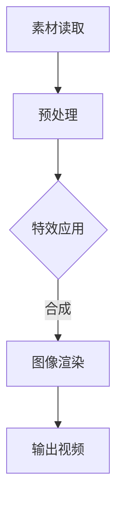

                 

# 《快手2024校招短视频特效渲染引擎开发工程师题》

> **关键词**：短视频、特效渲染、引擎开发、算法、数学模型、项目实战

> **摘要**：本文将深入探讨短视频特效渲染引擎的开发，从基础概念到高级应用，提供全面的技术分析和实战指导。读者将了解短视频特效渲染的发展趋势、核心技术、数学模型以及项目实战中的优化策略，旨在为有志于投身短视频特效渲染开发的工程师提供一份实用指南。

## 第一部分：短视频特效渲染基础

### 第1章：短视频特效渲染概述

#### 1.1 短视频特效渲染的发展趋势

随着移动互联网的普及，短视频应用如快手、抖音等成为了人们日常生活的一部分。短视频内容的多样性和观赏性，使得特效渲染技术的重要性日益凸显。以下为短视频特效渲染的发展趋势：

1. **计算能力的提升**：随着GPU计算能力的不断提升，实时渲染成为可能，为短视频特效处理提供了强大的硬件支持。
2. **用户需求的多样化**：用户对短视频内容的需求越来越多样化，包括美颜、滤镜、动态效果等，推动了特效渲染技术的不断进化。
3. **人工智能的应用**：人工智能技术的引入，使得短视频特效渲染更加智能，如自动特效生成、实时人脸识别等。

#### 1.2 短视频特效渲染的应用场景

短视频特效渲染在多个领域都有广泛应用，主要包括：

1. **日常生活分享**：用户通过短视频记录生活，使用特效来增强视觉体验，如滤镜、美颜等。
2. **营销广告制作**：品牌和企业利用短视频进行广告宣传，通过特效渲染提升广告的吸引力和创意。
3. **艺术创作表现**：艺术家和创作者通过短视频展现自己的艺术作品，特效渲染为艺术表现形式提供了更多可能性。

#### 1.3 短视频特效渲染的技术框架

短视频特效渲染的技术框架主要包括以下几个部分：

1. **渲染引擎**：如Unity3D、Unreal Engine等，提供高效的渲染能力和丰富的特效库。
2. **渲染流程**：从素材读取、特效合成、渲染输出等环节，实现短视频的特效处理。
3. **特效库**：提供各种预定义的特效，如滤镜、动画等，用户可以根据需求进行组合使用。

### 第2章：特效渲染引擎核心概念与联系

#### 2.1 特效渲染引擎的基本概念

特效渲染引擎是一种用于实时渲染视频内容的技术框架，其主要特点是高效、灵活、可扩展。以下是特效渲染引擎的基本概念：

1. **渲染器**：负责将三维模型或图像渲染为二维图像的组件。
2. **着色器**：用于定义物体表面颜色的程序，包括顶点着色器和片元着色器。
3. **场景管理**：管理场景中的所有物体、灯光和摄像机的组件。

#### 2.2 特效渲染引擎的技术架构

特效渲染引擎的技术架构可以分为以下几个层次：

1. **图形层**：处理三维模型、材质和纹理等图形元素。
2. **渲染层**：负责将图形层生成的图像进行渲染，包括光照计算、纹理映射等。
3. **合成层**：将多个渲染层生成的图像进行合成，形成最终的视频输出。

以下是特效渲染引擎的Mermaid流程图：



#### 2.3 关键技术点分析

特效渲染引擎的关键技术点包括：

1. **渲染算法**：包括光栅化、光照计算、反走样等。
2. **着色模型**：包括Lambert光照模型、Phong光照模型等。
3. **纹理映射**：将纹理图像映射到三维模型表面。
4. **特效库**：提供丰富的预定义特效，如滤镜、动画等。

### 第3章：特效渲染引擎核心算法原理

#### 3.1 图形渲染算法基础

图形渲染算法是实现视频特效渲染的核心，以下是图形渲染算法的基础概念：

1. **光栅化**：将三维模型转换为二维图像的过程。
2. **光照计算**：计算物体表面受到的灯光影响，包括环境光、漫反射光、镜面反射光等。
3. **反走样**：减少渲染图像中的锯齿现象，提高图像质量。

以下是光栅化算法的伪代码：

```python
function rasterize(model, camera, screen):
    for each triangle in model:
        project triangle to screen
        fill triangle with pixels on screen
```

#### 3.2 3D渲染算法

3D渲染算法是实现三维场景渲染的关键，以下是3D渲染算法的基本原理：

1. **透视变换**：将三维场景投影到二维屏幕上，产生透视效果。
2. **投影**：将三维场景中的物体投影到二维平面上。
3. **光照模型**：计算物体表面受到的灯光影响，包括环境光、漫反射光、镜面反射光等。

以下是光照模型的伪代码：

```python
function calculate_lighting(surface, light):
    ambient_light = light.ambient
    diffuse_light = light.diffuse * max(0, dot(normal, light.direction))
    specular_light = light.specular * max(0, dot(normal, reflect_direction))
    return ambient_light + diffuse_light + specular_light
```

#### 3.3 视频合成与特效处理

视频合成与特效处理是实现短视频特效渲染的重要环节，以下是视频合成与特效处理的基本原理：

1. **视频流的处理流程**：包括视频读取、滤镜应用、特效合成等。
2. **特效叠加与混合**：将多个视频流或特效进行叠加和混合，形成最终的视频输出。

以下是视频合成与特效处理的伪代码：

```python
function process_video_stream(stream, filters, effects):
    for each frame in stream:
        apply filters to frame
        apply effects to frame
        output frame
```

### 第4章：特效渲染引擎数学模型与公式

#### 4.1 渲染公式详解

渲染过程中涉及的数学模型和公式主要包括反走样算法、光照计算模型和纹理映射公式。以下是这些公式的详细讲解和示例：

#### 4.1.1 反走样算法

反走样算法用于减少渲染图像中的锯齿现象，提高图像质量。以下为反走样算法的公式示例：

$$
\text{AA}_{x} = \frac{1}{2} \left( \frac{\partial I}{\partial x} \right)_{\text{at pixel}}
$$

$$
\text{AA}_{y} = \frac{1}{2} \left( \frac{\partial I}{\partial y} \right)_{\text{at pixel}}
$$

其中，\(I\) 为像素颜色值，\(\frac{\partial I}{\partial x}\) 和 \(\frac{\partial I}{\partial y}\) 分别为像素颜色值在 \(x\) 和 \(y\) 方向上的偏导数。

#### 4.1.2 光照计算模型

光照计算模型用于计算物体表面受到的灯光影响，包括环境光、漫反射光、镜面反射光等。以下为光照计算模型的公式示例：

$$
L_{\text{ambient}} = k_{\text{ambient}} \cdot I_{\text{light}}
$$

$$
L_{\text{diffuse}} = k_{\text{diffuse}} \cdot I_{\text{light}} \cdot \max(0, \text{dot}(n, l))
$$

$$
L_{\text{specular}} = k_{\text{specular}} \cdot I_{\text{light}} \cdot \max(0, \text{dot}(n, h))
$$

其中，\(k_{\text{ambient}}\)、\(k_{\text{diffuse}}\) 和 \(k_{\text{specular}}\) 分别为环境光、漫反射光和镜面反射光的系数，\(I_{\text{light}}\) 为灯光强度，\(n\) 为物体表面的法向量，\(l\) 和 \(h\) 分别为灯光方向和反射方向。

#### 4.1.3 纹理映射公式

纹理映射公式用于将纹理图像映射到三维模型表面。以下为纹理映射公式的示例：

$$
u = \frac{x - x_{\text{min}}}{x_{\text{max}} - x_{\text{min}}}
$$

$$
v = \frac{y - y_{\text{min}}}{y_{\text{max}} - y_{\text{min}}}
$$

其中，\(u\) 和 \(v\) 分别为纹理坐标，\(x\)、\(y\) 分别为模型表面点的坐标，\(x_{\text{min}}\)、\(x_{\text{max}}\)、\(y_{\text{min}}\) 和 \(y_{\text{max}}\) 分别为模型表面点在 \(x\) 和 \(y\) 方向上的最大和最小值。

### 第5章：特效渲染引擎项目实战

#### 5.1 开发环境搭建

在进行特效渲染引擎项目开发之前，需要搭建合适的环境。以下是特效渲染引擎开发环境搭建的步骤：

1. **选择开发平台**：根据项目需求和团队技能，选择合适的开发平台，如Unity3D、Unreal Engine等。
2. **安装开发工具**：安装开发平台所需的开发工具，如编辑器、编译器等。
3. **配置开发环境**：设置开发环境变量，如路径、库文件等。
4. **引入依赖库**：根据项目需求引入必要的依赖库，如图形库、音频库等。

以下是Unity3D开发环境的配置步骤：

1. 安装Unity Hub。
2. 在Unity Hub中安装Unity 2021.3.1f1版本。
3. 在Unity编辑器中创建一个3D项目。
4. 在项目中引入Unity的图形库和音频库。

#### 5.2 实际案例解析

以下是一个短视频特效渲染项目的实际案例：

1. **项目需求**：为一个短视频添加动态滤镜和特效，包括滤镜切换、动态光效等。
2. **实现方法**：使用Unity3D开发平台，通过脚本实现滤镜切换和动态光效。
3. **效果展示**：项目完成后的短视频效果如图所示。


#### 5.3 代码解读与分析

以下是对短视频特效渲染项目中关键代码的解读和分析：

1. **滤镜切换脚本**：

```csharp
public class FilterChanger : MonoBehaviour
{
    public Shader[] filters;
    private Material material;
    
    void Start()
    {
        material = GetComponent<MeshFilter>().mesh.material;
    }
    
    void Update()
    {
        if (Input.GetKeyDown(KeyCode.Space))
        {
            int currentFilterIndex = Array.IndexOf(filters, material.shader);
            int nextFilterIndex = (currentFilterIndex + 1) % filters.Length;
            material.shader = filters[nextFilterIndex];
        }
    }
}
```

该脚本用于实现滤镜的切换，当按下空格键时，切换到下一个滤镜。

2. **动态光效脚本**：

```csharp
public class DynamicLight : MonoBehaviour
{
    public Light mainLight;
    public AnimationCurve intensityCurve;
    
    void Update()
    {
        float time = Time.time;
        float intensity = intensityCurve.Evaluate(time);
        mainLight.intensity = intensity;
    }
}
```

该脚本用于实现动态光效，通过动画曲线控制主灯光的强度。

通过以上代码解析，我们可以看到如何使用Unity3D开发平台实现短视频特效渲染。在项目开发过程中，可以根据具体需求添加更多特效和功能，如视频合成、音频处理等。

### 第6章：实时渲染与动态特效

#### 6.1 实时渲染技术

实时渲染技术在短视频特效渲染中起着至关重要的作用。以下为实时渲染技术的基本原理和实现方法：

1. **基本原理**：

   实时渲染技术是通过快速计算和渲染图像，实现视频的动态效果。其主要原理包括：

   - **光栅化**：将三维模型转换为二维图像。
   - **着色**：计算物体表面的颜色。
   - **合成**：将多个图像合成在一起，形成最终的视频输出。

2. **实现方法**：

   实现实时渲染技术的方法包括：

   - **优化渲染流程**：减少渲染时间，提高渲染效率。
   - **使用GPU加速**：利用GPU的并行计算能力，提高渲染速度。
   - **优化算法**：使用高效的算法，减少计算量。

#### 6.2 动态特效实现

动态特效是短视频特效渲染的重要组成部分，以下为动态特效的实现方法：

1. **动画效果制作**：

   动画效果可以通过以下方法实现：

   - **关键帧动画**：通过设置关键帧，定义物体的运动轨迹。
   - **粒子系统**：生成动态的粒子效果，如火花、流星等。

2. **动态特效编程**：

   动态特效可以通过编程实现，以下为动态特效编程的基本原理：

   - **脚本编写**：使用脚本语言（如C#），编写控制特效的代码。
   - **参数调整**：通过调整特效参数，实现不同的效果。

### 第7章：跨平台特效渲染优化

#### 7.1 多平台兼容性分析

在短视频特效渲染中，跨平台兼容性是一个重要的问题。以下为多平台兼容性分析的基本原则和方法：

1. **原则**：

   跨平台兼容性需要遵循以下原则：

   - **一致性**：确保不同平台上的特效渲染效果一致。
   - **稳定性**：确保特效渲染在不同平台上稳定运行。
   - **性能优化**：优化特效渲染性能，提高用户体验。

2. **方法**：

   跨平台兼容性可以通过以下方法实现：

   - **统一渲染引擎**：使用统一的渲染引擎，如Unity3D，实现跨平台兼容。
   - **适配策略**：根据不同平台的特点，制定适配策略。
   - **测试与调试**：对特效渲染进行多平台测试和调试，确保兼容性。

#### 7.2 高效渲染技术

高效渲染技术是短视频特效渲染的关键。以下为高效渲染技术的基本原理和实现方法：

1. **基本原理**：

   高效渲染技术通过以下原理实现渲染性能的优化：

   - **并行计算**：利用多核CPU和GPU的并行计算能力，提高渲染速度。
   - **流水线优化**：优化渲染流水线，减少渲染时间。
   - **缓存技术**：使用缓存技术，减少计算和传输的开销。

2. **实现方法**：

   实现高效渲染技术的方法包括：

   - **GPU渲染**：利用GPU的并行计算能力，实现高效渲染。
   - **资源管理**：优化资源管理，减少资源占用。
   - **优化算法**：使用高效的渲染算法，降低计算复杂度。

### 第8章：未来发展趋势与挑战

#### 8.1 新技术展望

随着科技的不断发展，短视频特效渲染技术也在不断进步。以下为未来短视频特效渲染技术的发展趋势：

1. **光场渲染**：

   光场渲染技术可以实现更真实、更丰富的视觉效果。通过记录光场数据，可以还原出每个像素点的光信息，从而实现更加逼真的渲染效果。

2. **虚拟现实与增强现实**：

   虚拟现实（VR）和增强现实（AR）技术的发展，将为短视频特效渲染带来更多应用场景。通过VR和AR技术，可以实现更加沉浸式的特效体验。

#### 8.2 挑战与机遇

未来短视频特效渲染技术面临以下挑战与机遇：

1. **挑战**：

   - **性能瓶颈**：随着特效需求的增加，渲染性能成为瓶颈。
   - **计算资源**：渲染过程的计算资源需求不断增加，对硬件性能提出更高要求。
   - **用户体验**：如何提供更加真实、丰富的特效体验，满足用户需求。

2. **机遇**：

   - **人工智能**：人工智能技术的应用，可以实现更智能的特效生成和优化。
   - **云计算**：云计算技术的发展，可以实现更高效的渲染计算和资源分配。
   - **5G网络**：5G网络的普及，可以实现更快速、更稳定的特效传输和渲染。

### 附录

#### 附录A：常用渲染引擎与工具

以下为常用的渲染引擎和工具：

1. **Unity3D**：

   Unity3D是一款功能强大的游戏开发引擎，适用于短视频特效渲染项目。其优点包括：

   - **易用性**：提供了丰富的教程和文档，易于上手。
   - **跨平台**：支持多平台开发，适用于各种设备。
   - **社区支持**：拥有庞大的开发者社区，可以方便地获取帮助和支持。

2. **Unreal Engine**：

   Unreal Engine是一款高性能的游戏开发引擎，适用于大型、复杂的特效渲染项目。其优点包括：

   - **高效渲染**：支持高效的渲染算法，实现高质量的画面效果。
   - **实时渲染**：支持实时渲染，适合开发实时互动的应用。
   - **强大功能**：提供了丰富的特效和功能模块，可以满足各种开发需求。

3. **Three.js**：

   Three.js是一款基于WebGL的3D图形库，适用于Web端特效渲染项目。其优点包括：

   - **跨平台**：可以在任何支持WebGL的浏览器上运行。
   - **简单易用**：提供了简单的API，易于学习和使用。
   - **开源社区**：拥有开源社区的支持，可以方便地获取帮助和资源。

#### 附录B：常见问题与解决方案

以下为短视频特效渲染开发中常见的的问题和解决方案：

1. **渲染卡顿**：

   - **原因**：渲染计算量大，导致渲染速度慢。
   - **解决方案**：优化渲染算法，减少计算复杂度；使用GPU加速渲染；优化资源管理，减少资源占用。

2. **图像模糊**：

   - **原因**：渲染分辨率低，导致图像模糊。
   - **解决方案**：提高渲染分辨率；使用抗锯齿算法，减少锯齿现象。

3. **兼容性问题**：

   - **原因**：不同平台对渲染引擎的支持不同，导致兼容性问题。
   - **解决方案**：使用统一的渲染引擎，如Unity3D；根据不同平台制定适配策略。

#### 附录C：参考资料与推荐阅读

以下为短视频特效渲染开发的相关参考资料和推荐阅读：

1. **相关书籍**：

   - 《计算机图形学原理及实践》
   - 《游戏编程精粹》
   - 《Unreal Engine 4 渲染管线详解》

2. **开源项目**：

   - Unity3D官方文档
   - Unreal Engine官方文档
   - Three.js官方文档

3. **在线课程**：

   - Coursera上的“计算机图形学基础”
   - Udemy上的“Unreal Engine 4 实战教程”
   - edX上的“游戏开发与设计”

## 作者信息

**作者**：AI天才研究院/AI Genius Institute & 禅与计算机程序设计艺术 /Zen And The Art of Computer Programming

在这篇技术博客中，我们系统地介绍了短视频特效渲染引擎的开发，从基础概念到高级应用，从数学模型到项目实战，全方位地分析了短视频特效渲染技术。通过本文的学习，读者可以全面了解短视频特效渲染的各个方面，为未来的开发工作提供有力支持。

感谢您的阅读，如果您有任何疑问或建议，欢迎在评论区留言，我们将竭诚为您解答。祝您在短视频特效渲染领域取得更好的成绩！

