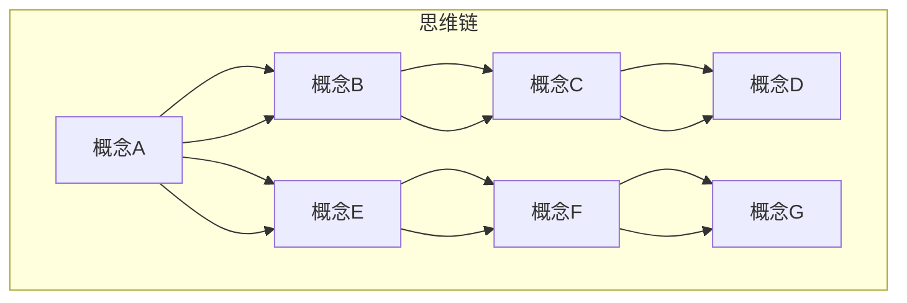
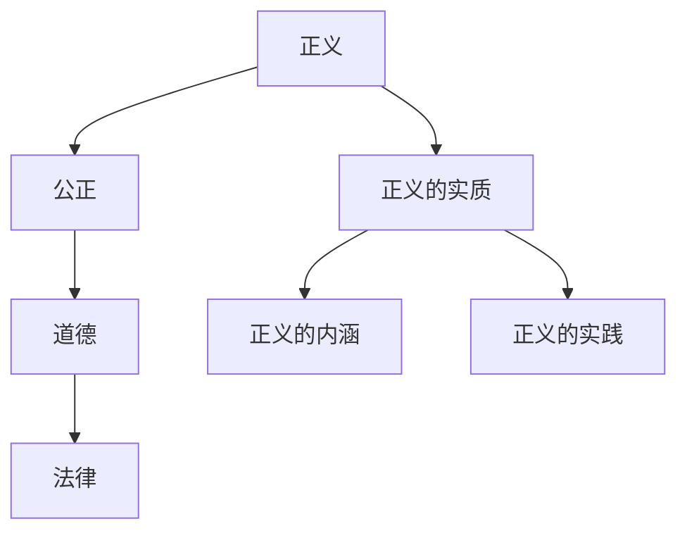
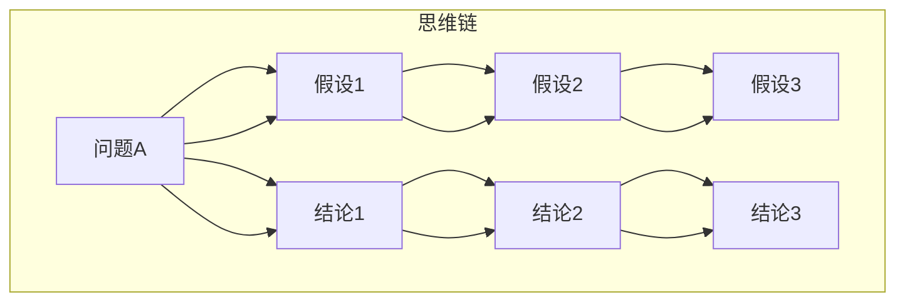
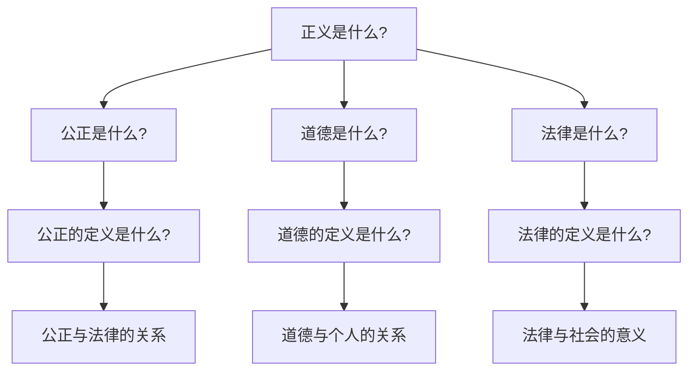
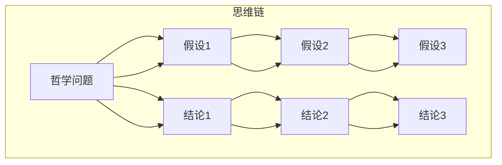
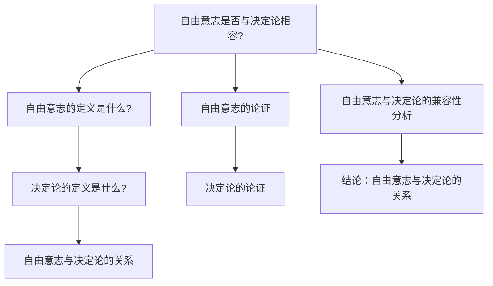

                 

## 《思维链在哲学思想实验设计中的应用：AI辅助概念探索》

### 核心关键词

- 思维链
- 哲学思想实验
- AI辅助
- 概念探索
- 教育应用

### 摘要

本文探讨了思维链在哲学思想实验设计中的应用，并介绍了AI如何辅助概念探索。首先，文章介绍了思维链的基本原理和哲学思想实验的重要性，接着详细阐述了思维链模型在概念形成、问题解决和哲学思想实验设计中的应用。通过数学模型和伪代码，文章展示了思维链的具体实现方法。此外，文章还分析了AI辅助概念探索的流程和工具，并提供了实际案例。最后，文章讨论了思维链在哲学教育中的应用及其对哲学研究的重要启示。

----------------------------------------------------------------

## 《思维链在哲学思想实验设计中的应用：AI辅助概念探索》目录大纲

### 第一部分：引言与背景

#### 第1章：引言

##### 1.1 著作目的与结构

##### 1.2 哲学思想实验概述

##### 1.3 思维链与AI的关系

#### 第2章：AI与哲学思想实验的基础

##### 2.1 AI发展历程回顾

##### 2.2 哲学思想实验的定义与分类

##### 2.3 思维链原理与哲学思想实验的联系

### 第二部分：思维链在哲学思想实验中的应用

#### 第3章：思维链在概念形成中的应用

##### 3.1 概念形成的思维链模型

##### 3.2 伪代码描述思维链模型

##### 3.3 数学模型与公式分析

##### 3.4 案例分析：概念形成与思维链

#### 第4章：思维链在问题解决中的应用

##### 4.1 问题解决的思维链模型

##### 4.2 伪代码描述思维链模型

##### 4.3 数学模型与公式分析

##### 4.4 案例分析：问题解决与思维链

#### 第5章：思维链在哲学思想实验设计中的应用

##### 5.1 哲学思想实验设计的思维链模型

##### 5.2 伪代码描述思维链模型

##### 5.3 数学模型与公式分析

##### 5.4 案例分析：哲学思想实验设计与思维链

#### 第6章：AI辅助概念探索的实践应用

##### 6.1 AI辅助概念探索的流程

##### 6.2 AI辅助概念探索的工具介绍

##### 6.3 案例分析：AI辅助概念探索实践

#### 第7章：思维链在哲学教育中的应用

##### 7.1 思维链在哲学教育中的作用

##### 7.2 哲学教育中思维链的应用实践

##### 7.3 案例分析：思维链在哲学教育中的应用

### 第三部分：结论与展望

#### 第8章：总结与展望

##### 8.1 著作的主要贡献

##### 8.2 未来研究方向

##### 8.3 对哲学与AI交叉领域的启示

#### 附录

##### 附录A：思维链相关算法伪代码

###### A.1 概念形成算法

###### A.2 问题解决算法

###### A.3 哲学思想实验设计算法

##### 附录B：哲学思想实验案例集

###### B.1 柏拉图的《理想国》

###### B.2 斯宾诺莎的《伦理学》

###### B.3 康德的《纯粹理性批判》

##### 附录C：AI辅助工具使用指南

###### C.1 数据预处理工具

###### C.2 模型训练与评估工具

###### C.3 概念探索与分析工具

----------------------------------------------------------------

## 第一部分：引言与背景

### 第1章：引言

在哲学的研究与发展中，哲学思想实验扮演了至关重要的角色。这些实验不仅帮助哲学家们探讨和论证各种哲学问题，还推动了哲学领域的进步。然而，哲学思想实验的设计和执行往往需要复杂的逻辑推理和分析，这给哲学家们带来了巨大的挑战。近年来，人工智能（AI）技术的快速发展为哲学思想实验提供了新的工具和方法，其中思维链模型的应用尤为突出。

#### 1.1 著作目的与结构

本书旨在探讨思维链在哲学思想实验设计中的应用，以及如何利用AI辅助概念探索。全书共分为三大部分：

- **第一部分**：引言与背景，介绍哲学思想实验和思维链的基本概念，以及AI在哲学研究中的角色。
- **第二部分**：详细阐述思维链在概念形成、问题解决和哲学思想实验设计中的应用，包括数学模型、伪代码和实际案例。
- **第三部分**：讨论思维链在哲学教育中的应用，总结全书的主要贡献，展望未来研究方向，并对哲学与AI交叉领域的启示进行探讨。

#### 1.2 哲学思想实验概述

哲学思想实验是哲学家们用来探讨哲学问题的一种方法，它通过构建假想的情境或设定特定的条件，来探究哲学原理和概念。这些实验往往具有高度的抽象性和逻辑性，能够帮助哲学家们深入思考和理解复杂的问题。哲学思想实验的类型多种多样，包括伦理学思想实验、认识论思想实验、形而上学思想实验等。

- **伦理学思想实验**：探讨道德原则和道德行为的合理性和道德责任。例如，康德的“假说论证”和“纯粹理性批判”中的道德律令。
- **认识论思想实验**：探讨知识的来源、范围和性质。例如，笛卡尔的“我思故我在”和普罗塔戈拉的“人是万物的尺度”。
- **形而上学思想实验**：探讨世界的本质、存在的意义和宇宙的结构。例如，亚里士多德的“形而上学”和斯宾诺莎的“伦理学”。

#### 1.3 思维链与AI的关系

思维链是一种逻辑推理工具，它通过连接一系列概念和假设，形成一条连贯的思考路径。在哲学思想实验中，思维链可以帮助哲学家们系统地分析和解决问题，提高哲学论证的严谨性和逻辑性。而AI技术的发展，特别是自然语言处理和机器学习技术的进步，使得思维链的应用变得更加广泛和高效。

- **自然语言处理（NLP）**：AI的NLP技术能够对文本进行自动分析，提取出关键概念和关系，为思维链的构建提供数据支持。
- **机器学习**：通过机器学习模型，AI可以学习到哲学思想实验中的逻辑规则和模式，从而辅助哲学家进行推理和论证。

总之，AI与思维链的结合，为哲学思想实验的设计和执行提供了新的思路和方法，有助于提升哲学研究的深度和广度。

### 第2章：AI与哲学思想实验的基础

#### 2.1 AI发展历程回顾

人工智能（AI）作为计算机科学的一个重要分支，其发展历程可以追溯到20世纪50年代。当时，科学家们首次提出了“人工智能”这一概念，并开始研究如何使计算机模拟人类的智能行为。以下简要回顾了AI的主要发展历程：

- **1950年代**：人工智能的概念被提出，计算机科学家们开始探索如何让计算机进行推理和决策。
- **1960年代**：早期的人工智能系统如ELIZA被开发出来，展示了计算机在模拟人类对话方面的潜力。
- **1970年代**：人工智能研究进入低谷期，由于技术难题和现实应用挑战，许多研究项目被取消。
- **1980年代**：专家系统成为人工智能研究的热点，通过知识表示和推理技术，计算机在特定领域取得了显著成果。
- **1990年代**：随着计算能力和算法的进步，人工智能应用逐渐扩展到语音识别、图像处理、自然语言处理等领域。
- **21世纪初至今**：深度学习和机器学习技术的发展，使得人工智能取得了前所未有的突破，计算机在许多任务上已经超越了人类。

#### 2.2 哲学思想实验的定义与分类

哲学思想实验是指通过构建假想情境或设定特定条件，来探讨哲学问题的一种方法。这些实验通常具有高度的抽象性和逻辑性，可以帮助哲学家们深入思考和理解复杂的问题。哲学思想实验可以分为以下几类：

- **伦理学思想实验**：探讨道德原则和道德行为的合理性和道德责任。例如，约翰·斯图亚特·米尔的“恶行有功”思想实验。
- **认识论思想实验**：探讨知识的来源、范围和性质。例如，托马斯·内格尔的“盲人洞穴”思想实验。
- **形而上学思想实验**：探讨世界的本质、存在的意义和宇宙的结构。例如，艾萨克·阿西莫夫的“机器人三定律”思想实验。

#### 2.3 思维链原理与哲学思想实验的联系

思维链是一种逻辑推理工具，它通过连接一系列概念和假设，形成一条连贯的思考路径。在哲学思想实验中，思维链可以帮助哲学家们系统地分析和解决问题，提高哲学论证的严谨性和逻辑性。

- **思维链在概念形成中的应用**：思维链可以帮助哲学家们识别和定义关键概念，并探索这些概念之间的逻辑关系。例如，在探讨“自由意志”这一概念时，可以通过思维链模型分析自由意志与决定论、非决定论的关系。
- **思维链在问题解决中的应用**：思维链可以帮助哲学家们分解复杂问题，逐步找到解决方案。例如，在探讨“正义是什么？”这一问题时，可以通过思维链模型分析正义与公正、法律、道德的关系。
- **思维链在哲学思想实验设计中的应用**：思维链可以帮助哲学家们设计哲学思想实验，构建假设和结论的逻辑框架。例如，在探讨“上帝是否存在？”这一问题时，可以通过思维链模型设定不同的假设（如神迹、逻辑论证等），并分析这些假设的合理性和逻辑一致性。

总之，思维链作为一种逻辑推理工具，在哲学思想实验的设计和执行中具有重要的应用价值。通过结合AI技术，思维链的应用范围和效果可以得到进一步提升，为哲学研究提供新的工具和方法。

### 第二部分：思维链在哲学思想实验中的应用

#### 第3章：思维链在概念形成中的应用

在哲学思想实验中，概念的形成是理解和分析哲学问题的基础。思维链作为一种逻辑推理工具，可以帮助哲学家们系统地构建和深化对某一概念的理解。本章将探讨思维链在概念形成中的应用，包括概念形成的思维链模型、伪代码描述、数学模型与公式分析以及案例分析。

#### 3.1 概念形成的思维链模型

概念形成的思维链模型是一个基于逻辑推理的系统，它通过连接一系列相关概念，形成一条连贯的思考路径。在哲学思想实验中，概念的形成往往涉及到多个相关概念的交互和影响。思维链模型可以帮助我们更好地理解和分析这些概念之间的关系。

以下是概念形成的思维链模型的Mermaid流程图：



在这个思维链中，概念A通过一系列的逻辑关系连接到概念G，形成了一个完整的思维链。每个概念都是通过与其他概念的关系来定义和理解的。

#### 3.2 伪代码描述思维链模型

为了更清晰地展示思维链模型在概念形成中的应用，我们可以使用伪代码来描述这个过程。以下是一个简单的伪代码示例：

```python
# 定义概念集合
concepts = ["概念A", "概念B", "概念C", "概念D", "概念E", "概念F", "概念G"]

# 初始化思维链
mind_chain = {}

# 构建思维链关系
for i in range(len(concepts) - 1):
    mind_chain[concepts[i]] = concepts[i+1]

# 打印思维链
for concept in concepts:
    print(f"{concept} -> {mind_chain[concept]}")
```

在这个伪代码中，我们首先定义了一个包含七个概念的概念集合。然后，我们通过一个循环来构建思维链，将每个概念与它的后续概念连接起来。最后，我们打印出整个思维链，以展示概念之间的关系。

#### 3.3 数学模型与公式分析

在概念形成的过程中，思维链的路径长度可以量化为从起始概念到目标概念的逻辑距离。路径长度反映了概念之间关系的紧密程度。设G=(V, E)为概念形成的思维链图，其中V为概念集合，E为概念间的连接关系集合。路径长度L(p)定义为从概念A到概念B的最短路径长度。

数学公式如下：

$$
L(p) = \min_{p \in P} \sum_{i=1}^{n} d(i, i+1)
$$

其中，P为从概念A到所有概念B的路径集合，$d(i, i+1)$为路径上的两个连续概念（节点）之间的距离。

在概念形成的思维链中，路径长度越短，说明概念之间的联系越紧密。通过计算路径长度，我们可以分析概念之间的关系，并识别出核心概念。

#### 3.4 案例分析：概念形成与思维链

以“正义是什么？”这一问题为例，我们可以通过思维链模型来分析这个概念的形成。

首先，我们将“正义”这一概念分解为相关的子概念，如“公正”、“道德”、“法律”等。然后，我们通过思维链模型来连接这些子概念，形成一条连贯的思维路径。

以下是一个简化的思维链模型：



在这个思维链中，从概念A（正义）到概念B（公正）、C（道德）、D（法律）的路径长度较短，说明这些概念与“正义”的关系较为紧密。通过这个思维链模型，我们可以更深入地理解“正义”这一概念，并探讨其与相关概念之间的关系。

### 3.5 深入探讨概念形成的过程

在哲学思想实验中，概念的形成是一个动态的、迭代的过程。以下是对这一过程的深入探讨：

1. **初始概念识别**：哲学家首先识别出需要探讨的哲学问题，并从中提取出关键概念。这些概念是进一步分析和讨论的基础。

2. **概念分解**：哲学家将关键概念分解为更小的子概念，以便更好地理解和分析。这个过程类似于将一个复杂的问题分解为多个子问题。

3. **逻辑关系构建**：哲学家通过分析概念之间的逻辑关系，构建思维链模型。这个过程涉及识别概念间的因果、条件、类比等关系。

4. **迭代与修正**：在构建思维链模型的过程中，哲学家可能会不断迭代和修正模型，以便更好地反映概念之间的复杂关系。

5. **概念整合**：最终，哲学家将分解出的子概念整合起来，形成一套完整的理论体系。这个理论体系可以帮助我们更深入地理解哲学问题的本质。

通过这个过程，哲学家能够系统地构建和深化对哲学概念的理解，从而为哲学思想实验提供坚实的基础。

### 3.6 思维链在概念形成中的实际应用

思维链在哲学思想实验中的实际应用非常广泛。以下是一些具体的实例：

1. **伦理学思想实验**：在伦理学研究中，哲学家们常常使用思维链模型来探讨道德原则和道德行为的合理性。例如，在讨论“善与恶”的问题时，哲学家们会构建一个包含“善”、“恶”、“美德”、“道德责任”等概念的思维链，以深入分析这些概念之间的关系。

2. **认识论思想实验**：在认识论研究中，哲学家们使用思维链模型来探讨知识的来源和性质。例如，在讨论“感知与认知”的关系时，哲学家们会构建一个包含“感知”、“认知”、“信念”、“知识”等概念的思维链，以分析这些概念在知识形成过程中的作用。

3. **形而上学思想实验**：在形而上学研究中，哲学家们使用思维链模型来探讨世界的本质和存在。例如，在讨论“存在与本质”的关系时，哲学家们会构建一个包含“存在”、“本质”、“实体”、“属性”等概念的思维链，以探讨这些概念在形而上学理论体系中的地位。

通过这些实例，我们可以看到思维链模型在哲学思想实验中的广泛应用，它帮助我们系统地构建和深化对哲学概念的理解，从而推动哲学研究的深入和发展。

### 3.7 小结

本章讨论了思维链在哲学思想实验中的应用，特别是在概念形成过程中的作用。通过构建思维链模型，哲学家们能够系统地分析和理解哲学概念，深入探讨概念之间的逻辑关系。思维链模型不仅为哲学思想实验提供了强有力的工具，还推动了哲学研究的系统化和科学化。未来，随着AI技术的不断发展，思维链在哲学思想实验中的应用将会更加广泛和深入，为哲学研究带来新的突破和进展。

----------------------------------------------------------------

## 第二部分：思维链在哲学思想实验中的应用

#### 第4章：思维链在问题解决中的应用

在哲学思想实验中，问题解决是核心环节。思维链作为一种逻辑推理工具，可以帮助哲学家们有效地识别问题、分析问题并找到解决方案。本章将探讨思维链在问题解决中的应用，包括问题解决的思维链模型、伪代码描述、数学模型与公式分析以及案例分析。

#### 4.1 问题解决的思维链模型

问题解决的思维链模型是一个基于逻辑推理的系统，它通过连接一系列相关概念和假设，形成一条连贯的思考路径。在哲学思想实验中，问题解决往往涉及到多个相关概念和假设的交互和影响。思维链模型可以帮助我们更好地理解和分析这些问题，并逐步找到解决方案。

以下是问题解决的思维链模型的Mermaid流程图：



在这个思维链中，从问题A到假设B、C、D、E、F、G、H的路径长度反映了从提出问题到分析假设再到得出结论的思维过程。通过这个思维链模型，哲学家们可以系统地分析问题，逐步找到解决方案。

#### 4.2 伪代码描述思维链模型

为了更清晰地展示思维链模型在问题解决中的应用，我们可以使用伪代码来描述这个过程。以下是一个简单的伪代码示例：

```python
# 定义问题及其相关假设和结论
problem = "问题A"
hypotheses = ["假设1", "假设2", "假设3"]
conclusions = ["结论1", "结论2", "结论3"]

# 初始化思维链
solution_chain = {}

# 构建思维链关系
for h in hypotheses:
    solution_chain[problem] = h

for c in conclusions:
    solution_chain[hypotheses[-1]] = c

# 打印思维链
for h in hypotheses:
    print(f"{problem} -> {solution_chain[problem]}")
for c in conclusions:
    print(f"{hypotheses[-1]} -> {solution_chain[hypotheses[-1]]}")
```

在这个伪代码中，我们首先定义了一个问题及其相关假设和结论。然后，我们通过一个循环来构建思维链，将每个假设和结论与问题连接起来。最后，我们打印出整个思维链，以展示问题、假设和结论之间的关系。

#### 4.3 数学模型与公式分析

在问题解决过程中，思维链的路径长度可以量化为从问题到解决方案的路径长度。设G=(V, E)为问题解决的思维链图，其中V为问题、假设和结论集合，E为这些元素之间的连接关系集合。路径长度L(s)定义为从问题A到解决方案S的最短路径长度。

数学公式如下：

$$
L(s) = \min_{s \in S} \sum_{i=1}^{n} d(i, i+1)
$$

其中，S为从问题A到所有可能的解决方案S的路径集合，$d(i, i+1)$为路径上的两个连续元素（假设或结论）之间的距离。

通过计算路径长度，我们可以分析问题解决的效率和效果。路径长度越短，说明问题解决的效率越高，解决方案越合理。

#### 4.4 案例分析：问题解决与思维链

以“正义是什么？”这一问题为例，通过思维链模型来分析和解决这一问题。

首先，我们将“正义”这一概念分解为相关的子问题，如“什么是公正？”“什么是道德？”“什么是法律？”等。然后，我们通过思维链模型来连接这些子问题，形成一条连贯的思维路径。

以下是一个简化的思维链模型：



在这个思维链中，从问题A（正义是什么？）到子问题B（公正是什么？）、C（公正的定义是什么？）、D（公正与法律的关系）、E（道德是什么？）、F（道德的定义是什么？）、G（道德与个人的关系）、H（法律是什么？）、I（法律的定义是什么？）、J（法律与社会的意义）的路径长度反映了从提出问题到分析子问题再到得出结论的思维过程。

通过这个思维链模型，我们可以系统地分析和解决“正义是什么？”这一问题，从而更深入地理解正义的本质和内涵。

#### 4.5 深入探讨问题解决的过程

在哲学思想实验中，问题解决是一个复杂的、多阶段的动态过程。以下是对这一过程的深入探讨：

1. **问题识别**：哲学家首先需要识别出需要解决的哲学问题。这通常涉及到对哲学文本的阅读和分析，以及对哲学问题的反思和提炼。

2. **问题分解**：哲学家将复杂的问题分解为一系列子问题，以便更好地理解和分析。这个过程类似于将一个复杂的问题分解为多个子问题。

3. **假设构建**：哲学家根据现有的知识和理论，构建一系列假设来解释和解决子问题。这些假设可以是关于概念、关系、原则等的不同可能性。

4. **逻辑推理**：哲学家通过逻辑推理，分析假设之间的逻辑关系，并逐步排除不合理的假设。这个过程涉及到识别概念之间的因果、条件、类比等关系。

5. **结论验证**：哲学家根据假设和逻辑推理，得出一系列结论。然后，哲学家需要对这些结论进行验证，以确定其合理性和有效性。

6. **迭代与修正**：在问题解决的过程中，哲学家可能会不断迭代和修正假设和结论，以便更好地反映问题的本质。

通过这个过程，哲学家能够系统地识别、分析和解决问题，从而为哲学思想实验提供坚实的基础。

#### 4.6 思维链在问题解决中的实际应用

思维链在哲学思想实验中的实际应用非常广泛。以下是一些具体的实例：

1. **伦理学思想实验**：在伦理学研究中，哲学家们常常使用思维链模型来探讨道德原则和道德行为的合理性。例如，在讨论“善与恶”的问题时，哲学家们会构建一个包含“善”、“恶”、“美德”、“道德责任”等概念的思维链，以深入分析这些概念之间的关系。

2. **认识论思想实验**：在认识论研究中，哲学家们使用思维链模型来探讨知识的来源和性质。例如，在讨论“感知与认知”的关系时，哲学家们会构建一个包含“感知”、“认知”、“信念”、“知识”等概念的思维链，以分析这些概念在知识形成过程中的作用。

3. **形而上学思想实验**：在形而上学研究中，哲学家们使用思维链模型来探讨世界的本质和存在。例如，在讨论“存在与本质”的关系时，哲学家们会构建一个包含“存在”、“本质”、“实体”、“属性”等概念的思维链，以探讨这些概念在形而上学理论体系中的地位。

通过这些实例，我们可以看到思维链模型在哲学思想实验中的广泛应用，它帮助我们系统地构建和深化对哲学概念的理解，从而推动哲学研究的深入和发展。

### 4.7 小结

本章讨论了思维链在哲学思想实验中的应用，特别是在问题解决过程中的作用。通过构建思维链模型，哲学家们能够系统地分析和解决问题，逐步找到合理的解决方案。思维链模型不仅为哲学思想实验提供了强有力的工具，还推动了哲学研究的系统化和科学化。未来，随着AI技术的不断发展，思维链在哲学思想实验中的应用将会更加广泛和深入，为哲学研究带来新的突破和进展。

----------------------------------------------------------------

## 第二部分：思维链在哲学思想实验中的应用

### 第5章：思维链在哲学思想实验设计中的应用

哲学思想实验设计是哲学研究的重要组成部分。思维链作为一种逻辑推理工具，在哲学思想实验设计中发挥着重要作用。本章将探讨思维链在哲学思想实验设计中的应用，包括哲学思想实验设计的思维链模型、伪代码描述、数学模型与公式分析以及案例分析。

#### 5.1 哲学思想实验设计的思维链模型

哲学思想实验设计的思维链模型是一个基于逻辑推理的系统，它通过连接一系列哲学问题和假设，形成一条连贯的思考路径。在哲学思想实验设计中，思维链模型可以帮助哲学家们系统地构建实验假设，设计实验步骤，并推导出实验结论。

以下是哲学思想实验设计的思维链模型的Mermaid流程图：



在这个思维链中，从哲学问题A到假设B、C、D、E、F、G、H的路径长度反映了从提出哲学问题到构建假设再到推导出结论的思维过程。通过这个思维链模型，哲学家们可以系统地设计和分析哲学思想实验。

#### 5.2 伪代码描述思维链模型

为了更清晰地展示思维链模型在哲学思想实验设计中的应用，我们可以使用伪代码来描述这个过程。以下是一个简单的伪代码示例：

```python
# 定义哲学问题及其相关假设和结论
philosophical_problem = "什么是存在？"
hypotheses = ["存在是物质的属性", "存在是意识的属性", "存在是概念的抽象"]
conclusions = ["存在是物质的和意识的统一", "存在是概念的抽象", "存在是多元的"]

# 初始化思维链
thought_chain = {}

# 构建思维链关系
for h in hypotheses:
    thought_chain[philosophical_problem] = h

for c in conclusions:
    thought_chain[hypotheses[-1]] = c

# 打印思维链
for h in hypotheses:
    print(f"{philosophical_problem} -> {thought_chain[philosophical_problem]}")
for c in conclusions:
    print(f"{hypotheses[-1]} -> {thought_chain[hypotheses[-1]]}")
```

在这个伪代码中，我们首先定义了一个哲学问题及其相关假设和结论。然后，我们通过一个循环来构建思维链，将每个假设和结论与哲学问题连接起来。最后，我们打印出整个思维链，以展示哲学问题、假设和结论之间的关系。

#### 5.3 数学模型与公式分析

在哲学思想实验设计中，思维链的路径长度可以量化为从哲学问题到假设再到结论的逻辑距离。设G=(V, E)为哲学思想实验设计的思维链图，其中V为哲学问题、假设和结论集合，E为这些元素之间的连接关系集合。路径长度L(p)定义为从哲学问题A到结论C的最短路径长度。

数学公式如下：

$$
L(p) = \min_{p \in P} \sum_{i=1}^{n} d(i, i+1)
$$

其中，P为从哲学问题A到所有可能的结论C的路径集合，$d(i, i+1)$为路径上的两个连续元素（假设或结论）之间的距离。

通过计算路径长度，我们可以分析哲学思想实验设计的逻辑结构和效率。路径长度越短，说明实验设计的逻辑结构越合理，实验结果的可信度越高。

#### 5.4 案例分析：哲学思想实验设计与思维链

以“自由意志是否与决定论相容？”这一哲学问题为例，通过思维链模型来设计和分析这一哲学思想实验。

首先，我们将这一哲学问题分解为多个子问题，如“什么是自由意志？”“什么是决定论？”“自由意志与决定论的关系是什么？”等。然后，我们通过思维链模型来连接这些子问题，形成一条连贯的思维路径。

以下是一个简化的思维链模型：



在这个思维链中，从问题A（自由意志是否与决定论相容？）到子问题B（自由意志的定义是什么？）、C（决定论的定义是什么？）、D（自由意志与决定论的关系）、E（自由意志的论证）、F（决定论的论证）、G（自由意志与决定论的兼容性分析）、H（结论：自由意志与决定论的关系）的路径长度反映了从提出问题到分析子问题再到推导出结论的思维过程。

通过这个思维链模型，我们可以系统地设计和分析“自由意志是否与决定论相容？”这一哲学思想实验，从而更深入地探讨自由意志与决定论的关系。

#### 5.5 深入探讨哲学思想实验设计的过程

哲学思想实验设计是一个复杂的、多阶段的动态过程。以下是对这一过程的深入探讨：

1. **问题识别**：哲学家首先需要识别出需要探讨的哲学问题。这通常涉及到对哲学文本的阅读和分析，以及对哲学问题的反思和提炼。

2. **问题分解**：哲学家将复杂的问题分解为一系列子问题，以便更好地理解和分析。这个过程类似于将一个复杂的问题分解为多个子问题。

3. **假设构建**：哲学家根据现有的知识和理论，构建一系列假设来解释和解决子问题。这些假设可以是关于概念、关系、原则等的不同可能性。

4. **逻辑推理**：哲学家通过逻辑推理，分析假设之间的逻辑关系，并逐步排除不合理的假设。这个过程涉及到识别概念之间的因果、条件、类比等关系。

5. **实验设计**：哲学家根据逻辑推理的结果，设计实验步骤，包括如何验证假设、如何收集数据等。

6. **结论推导**：哲学家根据实验结果，推导出一系列结论。然后，哲学家需要对这些结论进行验证，以确定其合理性和有效性。

7. **迭代与修正**：在哲学思想实验设计的过程中，哲学家可能会不断迭代和修正假设、实验步骤和结论，以便更好地反映问题的本质。

通过这个过程，哲学家能够系统地识别、分析和设计哲学思想实验，从而为哲学研究提供坚实的基础。

#### 5.6 思维链在哲学思想实验设计中的实际应用

思维链在哲学思想实验设计中的实际应用非常广泛。以下是一些具体的实例：

1. **伦理学思想实验**：在伦理学研究中，哲学家们常常使用思维链模型来探讨道德原则和道德行为的合理性。例如，在讨论“善与恶”的问题时，哲学家们会构建一个包含“善”、“恶”、“美德”、“道德责任”等概念的思维链，以深入分析这些概念之间的关系。

2. **认识论思想实验**：在认识论研究中，哲学家们使用思维链模型来探讨知识的来源和性质。例如，在讨论“感知与认知”的关系时，哲学家们会构建一个包含“感知”、“认知”、“信念”、“知识”等概念的思维链，以分析这些概念在知识形成过程中的作用。

3. **形而上学思想实验**：在形而上学研究中，哲学家们使用思维链模型来探讨世界的本质和存在。例如，在讨论“存在与本质”的关系时，哲学家们会构建一个包含“存在”、“本质”、“实体”、“属性”等概念的思维链，以探讨这些概念在形而上学理论体系中的地位。

通过这些实例，我们可以看到思维链模型在哲学思想实验设计中的广泛应用，它帮助我们系统地构建和深化对哲学概念的理解，从而推动哲学研究的深入和发展。

### 5.7 小结

本章讨论了思维链在哲学思想实验设计中的应用。通过构建思维链模型，哲学家们能够系统地设计和分析哲学思想实验，从而更深入地探讨哲学问题。思维链模型不仅为哲学思想实验提供了强有力的工具，还推动了哲学研究的系统化和科学化。未来，随着AI技术的不断发展，思维链在哲学思想实验中的应用将会更加广泛和深入，为哲学研究带来新的突破和进展。

----------------------------------------------------------------

### 6.1 AI辅助概念探索的流程

在哲学思想实验中，概念探索是一个核心环节。传统的概念探索往往依赖于哲学家的个人经验和直觉，而AI辅助概念探索则可以显著提高这一过程的效率和质量。以下是AI辅助概念探索的流程：

#### 6.1.1 数据收集与预处理

1. **数据收集**：首先，需要收集与哲学问题相关的文本数据。这些数据可以来自各种来源，如学术论文、哲学书籍、在线论坛、新闻文章等。数据量的大小和质量直接影响概念探索的效果。

2. **数据预处理**：收集到的数据通常需要进行预处理，以去除噪声和冗余信息。预处理步骤包括：
   - **文本清洗**：去除HTML标签、符号和无关文字。
   - **分词**：将文本分割成单词或短语。
   - **词性标注**：为每个单词标注词性，如名词、动词、形容词等。
   - **实体识别**：识别文本中的关键实体，如人名、地点、组织等。

#### 6.1.2 概念提取

1. **词汇分析**：通过分析文本中的高频词汇和共现词汇，可以初步识别出与哲学问题相关的概念。

2. **基于规则的方法**：利用预先定义的规则，如正则表达式、词性标注等，从文本中提取概念。

3. **基于机器学习的方法**：使用监督学习或无监督学习算法，从文本中自动提取概念。例如，可以使用词袋模型（Bag of Words）、TF-IDF（Term Frequency-Inverse Document Frequency）等方法来识别重要词汇，并将其作为概念。

#### 6.1.3 概念分类

1. **手动分类**：对于一些已知的概念，可以直接进行手动分类。

2. **自动分类**：使用分类算法（如K-means、决策树、支持向量机等）对提取出的概念进行自动分类。

3. **层次化分类**：将概念按照一定的层次结构进行分类，以便更好地组织和管理概念。

#### 6.1.4 概念分析

1. **关系分析**：分析概念之间的相互关系，构建概念网络。这有助于理解概念之间的关联性和层次结构。

2. **语义分析**：利用词向量模型（如Word2Vec、GloVe等）对概念进行语义分析，识别概念之间的语义相似性和差异性。

3. **概念演化分析**：分析概念在不同文本中的使用频率和变化趋势，了解概念的历史演变。

#### 6.1.5 概念整合

1. **概念融合**：将不同来源的概念进行整合，消除重复和冗余信息。

2. **概念扩展**：基于已有的概念，扩展新的概念，以涵盖更广泛的领域。

3. **概念验证**：通过专家评审或数据验证，确保概念的定义和分类准确无误。

#### 6.1.6 概念可视化

1. **概念图谱**：使用可视化工具（如Cytoscape、Gephi等）将概念网络呈现出来，便于分析和理解。

2. **交互式探索**：提供交互式界面，让用户可以动态地探索概念网络，发现新的关系和模式。

通过以上流程，AI辅助概念探索可以帮助哲学家们更加高效地识别、分析和整合哲学问题中的关键概念，从而为哲学思想实验提供强有力的支持。

### 6.2 AI辅助概念探索的工具介绍

为了高效地进行AI辅助概念探索，需要使用一系列工具和技术。以下介绍几种常用的工具，以及它们的基本功能和使用方法。

#### 1. GPT-3

**功能**：GPT-3（Generative Pre-trained Transformer 3）是一种强大的自然语言处理模型，能够生成高质量的自然语言文本。它适用于文本生成、文本摘要、问答系统等。

**使用方法**：
- **文本生成**：使用GPT-3的文本生成功能，可以自动生成与哲学问题相关的文本，用于概念探索。
- **问答系统**：通过训练GPT-3，构建一个问答系统，用于回答关于哲学问题的查询。

#### 2. BERT

**功能**：BERT（Bidirectional Encoder Representations from Transformers）是一种双向的Transformer模型，适用于文本分类、关系抽取、文本相似度计算等。

**使用方法**：
- **概念分类**：使用BERT进行文本分类，可以将提取出的概念自动分类到不同的类别。
- **关系抽取**：通过BERT分析文本中的关系，构建概念之间的网络。

#### 3. Word2Vec

**功能**：Word2Vec是一种基于神经网络的文本向量化方法，能够将文本中的词映射到高维向量空间。适用于概念相似度计算、文本聚类等。

**使用方法**：
- **概念相似度计算**：使用Word2Vec计算两个概念之间的相似度，帮助理解概念之间的关联性。
- **文本聚类**：通过Word2Vec对文本进行聚类，识别出文本中的主要概念和主题。

#### 4. ELMO

**功能**：ELMO（Embodiments of Language from a Million Objects）是一种深度学习模型，能够生成文本的上下文表示。适用于情感分析、文本分类、实体识别等。

**使用方法**：
- **情感分析**：利用ELMO分析文本中的情感色彩，帮助理解文本的情感倾向。
- **文本分类**：通过ELMO对文本进行分类，识别文本的主题和内容。

#### 5. ConceptNet

**功能**：ConceptNet是一个基于众包的知识图谱，包含大量的概念及其关系。适用于概念提取、关系分析等。

**使用方法**：
- **概念提取**：通过ConceptNet提取与特定哲学问题相关的概念。
- **关系分析**：利用ConceptNet分析概念之间的相互关系，构建概念网络。

通过这些AI辅助概念探索工具，哲学家们可以更加高效地理解和探索哲学问题，为哲学思想实验提供强有力的支持。

### 6.3 案例分析：AI辅助概念探索实践

以下是一个具体的案例分析，展示如何使用AI辅助概念探索工具来探索哲学问题。

#### 背景介绍

以“自由意志与决定论的关系”这一哲学问题为例，探讨如何通过AI辅助概念探索来深入理解这一复杂问题。

#### 数据收集与预处理

1. **数据收集**：收集与“自由意志”和“决定论”相关的文本数据，包括哲学论文、学术论文、在线论坛讨论等。

2. **数据预处理**：对文本数据进行清洗和预处理，包括去除HTML标签、符号和无关文字，进行分词和词性标注。

#### 概念提取

1. **词汇分析**：通过分析文本中的高频词汇和共现词汇，提取出与“自由意志”和“决定论”相关的概念。

2. **基于机器学习的方法**：使用词袋模型和TF-IDF算法，从文本中自动提取出重要词汇，并将其作为概念。

#### 概念分类

1. **自动分类**：使用K-means算法，将提取出的概念自动分类到不同的类别，如“哲学概念”、“科学概念”等。

2. **层次化分类**：根据概念之间的关联性，构建层次化的概念分类体系，以便更好地组织和管理概念。

#### 概念分析

1. **关系分析**：利用ConceptNet分析提取出的概念之间的相互关系，构建概念网络。

2. **语义分析**：使用Word2Vec模型，计算概念之间的相似度，帮助理解概念之间的关联性。

3. **概念演化分析**：分析概念在不同文本中的使用频率和变化趋势，了解概念的历史演变。

#### 概念整合

1. **概念融合**：将不同来源的概念进行整合，消除重复和冗余信息。

2. **概念扩展**：基于已有的概念，扩展新的概念，以涵盖更广泛的领域。

3. **概念验证**：通过专家评审，确保概念的定义和分类准确无误。

#### 概念可视化

1. **概念图谱**：使用Cytoscape将概念网络呈现出来，便于分析和理解。

2. **交互式探索**：提供交互式界面，让用户可以动态地探索概念网络，发现新的关系和模式。

通过以上步骤，AI辅助概念探索可以帮助哲学家们更加深入地理解“自由意志与决定论的关系”这一复杂哲学问题，为哲学思想实验提供强有力的支持。

### 6.4 AI辅助概念探索的应用前景

AI辅助概念探索在哲学领域具有广泛的应用前景。以下是一些具体的应用场景：

1. **哲学研究**：AI可以辅助哲学家进行概念提取、分类和分析，帮助研究人员更高效地理解和探索哲学问题。

2. **教学辅助**：AI可以辅助哲学教育，提供概念解释、案例分析等教学资源，帮助学生更好地掌握哲学知识。

3. **文本分析**：AI可以用于分析哲学文献，提取出关键概念和观点，帮助研究人员梳理哲学思想的演变和发展。

4. **跨学科研究**：AI可以促进哲学与其他学科的交叉研究，例如哲学与认知科学、哲学与人工智能等，为跨学科研究提供新的方法和工具。

5. **政策制定**：AI可以辅助政策制定者分析哲学问题，提供基于数据的决策支持，为制定更合理的政策提供参考。

总之，AI辅助概念探索将为哲学研究带来革命性的变化，推动哲学领域的深入发展和创新。

### 6.5 小结

本章探讨了AI辅助概念探索在哲学思想实验中的应用。通过数据收集与预处理、概念提取、分类、分析、整合和可视化等步骤，AI辅助概念探索为哲学家们提供了强大的工具，帮助他们更高效地理解和探索哲学问题。未来，随着AI技术的不断发展，AI辅助概念探索在哲学领域的应用将会更加广泛和深入，为哲学研究带来新的突破和进展。

----------------------------------------------------------------

### 7.1 思维链在哲学教育中的应用

在哲学教育中，思维链作为一种逻辑推理工具，具有广泛的应用前景。它可以帮助学生更好地掌握哲学概念、理论和原理，培养他们的哲学思维能力和批判性思维能力。

#### 教学目标

1. **培养哲学思维能力**：通过思维链模型，学生能够学会如何系统地分析哲学问题，提高逻辑思维和创造性思维能力。

2. **提升批判性思维能力**：思维链模型能够帮助学生从多个角度审视哲学问题，培养批判性思维和辩证思维。

3. **深化哲学知识理解**：思维链模型有助于学生将哲学知识系统化，形成对哲学概念、理论和原理的全面理解。

#### 教学方法

1. **思维链构建练习**：教师可以引导学生根据哲学问题构建思维链，通过练习来提高学生的思维能力和逻辑推理能力。

2. **案例教学**：教师可以提供哲学案例，学生通过思维链模型进行分析和讨论，加深对哲学问题的理解。

3. **思维链评价**：教师对学生的思维链模型进行评价，帮助学生发现和纠正思维过程中的错误，提高哲学分析能力。

4. **互动教学**：通过小组讨论、角色扮演等方式，激发学生的思维活力，促进哲学思想的碰撞和交流。

#### 教学资源

1. **思维链模板**：教师可以提供思维链模板，帮助学生快速构建思维链模型。

2. **哲学案例库**：教师可以收集和整理哲学案例，用于教学和实践。

3. **思维链软件**：利用思维链软件，如MindManager、XMind等，帮助学生可视化思维链模型。

4. **在线资源**：提供在线哲学教育资源，如哲学课程、论文、视频讲座等，帮助学生扩展知识视野。

#### 教学评价

1. **过程评价**：教师关注学生在思维链构建过程中的参与度和思维深度，评价学生的哲学思维能力和批判性思维能力。

2. **成果评价**：通过学生撰写哲学论文、参与案例讨论等方式，评价学生的哲学知识掌握程度和应用能力。

#### 具体应用案例

1. **伦理学课程**：在伦理学课程中，教师可以使用思维链模型帮助学生分析道德原则和道德行为。例如，在讨论“什么是正义？”时，教师可以引导学生构建一个包含“公正”、“道德”、“法律”等概念的思维链，探讨这些概念之间的关系。

2. **形而上学课程**：在形而上学课程中，教师可以使用思维链模型帮助学生理解世界的本质和存在。例如，在讨论“什么是存在？”时，教师可以引导学生构建一个包含“存在”、“本质”、“实体”、“属性”等概念的思维链，探讨这些概念在形而上学理论体系中的地位。

3. **认识论课程**：在认识论课程中，教师可以使用思维链模型帮助学生探讨知识的来源和性质。例如，在讨论“什么是知识？”时，教师可以引导学生构建一个包含“感知”、“认知”、“信念”、“知识”等概念的思维链，分析这些概念在知识形成过程中的作用。

通过思维链在哲学教育中的应用，学生能够更加系统地理解和分析哲学问题，提高哲学素养和思维能力。教师应充分利用思维链模型，优化教学方法，提升哲学教育的效果。

### 7.2 哲学教育中思维链的应用实践

思维链在哲学教育中的应用，不仅提升了学生对哲学概念和理论的深入理解，还促进了批判性思维和创造性思维的发展。以下是通过实际教学案例展示思维链在哲学教育中应用的具体实践。

#### 案例一：伦理学课程中的道德原则分析

**教学目标**：通过思维链模型，帮助学生理解道德原则的多样性及其在不同情境下的应用。

**教学步骤**：
1. **引入**：教师提出“什么是道德原则？”这一问题，引导学生思考道德原则的基本概念。
2. **概念提取**：教师引导学生提取与道德原则相关的概念，如“公正”、“善行”、“道德责任”等。
3. **思维链构建**：教师帮助学生构建思维链模型，将提取出的概念联系起来，形成一条连贯的思考路径。
   ```mermaid
   graph TD
       A[道德原则] --> B[公正]
       B --> C[权利]
       C --> D[平等]
       A --> E[善行]
       E --> F[仁爱]
       F --> G[同情]
       A --> H[道德责任]
       H --> I[义务]
       I --> J[忠诚]
   ```
4. **讨论与分析**：教师引导学生讨论思维链中的各个概念及其相互关系，分析在不同情境下如何应用道德原则。
5. **案例应用**：教师提供实际案例，如“医疗伦理”或“商业伦理”，让学生运用思维链模型进行道德分析。

**效果评估**：通过学生参与讨论的积极性、对案例分析的深度以及对道德原则的理解程度，评估教学效果。

#### 案例二：形而上学课程中的存在主义探讨

**教学目标**：通过思维链模型，帮助学生理解存在主义的基本概念和思想。

**教学步骤**：
1. **引入**：教师介绍存在主义的基本概念，如“存在先于本质”、“自由选择”等。
2. **概念提取**：教师引导学生提取与存在主义相关的概念，如“自由意志”、“个人主义”、“主观性”等。
3. **思维链构建**：教师帮助学生构建思维链模型，将提取出的概念联系起来，形成一条连贯的思考路径。
   ```mermaid
   graph TD
       A[存在主义] --> B[自由意志]
       B --> C[个人主义]
       C --> D[主观性]
       A --> E[选择]
       E --> F[责任]
       F --> G[自由]
   ```
4. **讨论与分析**：教师引导学生讨论思维链中的各个概念及其相互关系，探讨存在主义的核心思想及其在现代社会中的应用。
5. **写作练习**：教师布置写作任务，要求学生运用思维链模型，撰写一篇关于存在主义观点的论文。

**效果评估**：通过学生论文的质量、对存在主义概念的理解深度以及对存在主义思想的批判性分析，评估教学效果。

#### 案例三：认识论课程中的知识探索

**教学目标**：通过思维链模型，帮助学生理解知识的来源、性质和局限性。

**教学步骤**：
1. **引入**：教师介绍知识的基本概念，如“感知”、“认知”、“信念”等。
2. **概念提取**：教师引导学生提取与知识相关的概念，如“事实”、“真理”、“证据”等。
3. **思维链构建**：教师帮助学生构建思维链模型，将提取出的概念联系起来，形成一条连贯的思考路径。
   ```mermaid
   graph TD
       A[知识] --> B[感知]
       B --> C[认知]
       C --> D[信念]
       A --> E[事实]
       E --> F[真理]
       F --> G[证据]
   ```
4. **讨论与分析**：教师引导学生讨论思维链中的各个概念及其相互关系，探讨知识的获取和验证过程。
5. **案例分析**：教师提供科学史案例，如“哥白尼革命”，让学生运用思维链模型分析知识的演变和进步。

**效果评估**：通过学生对知识概念的理解深度、对知识获取和验证过程的认知以及对科学史案例的分析能力，评估教学效果。

通过这些实际教学案例，我们可以看到思维链模型在哲学教育中的应用，不仅帮助学生更好地理解哲学概念和理论，还培养了他们的批判性思维和创造性思维，为哲学教育注入了新的活力。

### 7.3 案例分析：思维链在哲学教育中的应用

在哲学教育中，思维链模型的应用极大地丰富了教学内容，并促进了学生的哲学思维能力发展。以下为具体案例分析，展示思维链在哲学教育中的应用效果。

#### 案例一：伦理学中的道德推理

**教学目标**：通过思维链模型，帮助学生掌握道德推理的方法，提高道德判断能力。

**教学过程**：

1. **引入**：教师提出“道德推理是什么？”的问题，激发学生的思考。

2. **概念提取**：教师引导学生提取与道德推理相关的概念，如“道德原则”、“行为后果”、“道德责任”等。

3. **构建思维链**：教师帮助学生构建思维链模型，将提取出的概念联系起来，形成一条连贯的思考路径。
   ```mermaid
   graph TD
       A[道德推理] --> B[道德原则]
       B --> C[行为后果]
       C --> D[道德责任]
       A --> E[道德判断]
       E --> F[伦理决策]
   ```

4. **讨论与反思**：教师引导学生讨论思维链中的各个概念及其相互关系，探讨如何在具体情境中运用道德推理。

5. **案例分析**：教师提供道德困境案例，如“电车难题”，让学生运用思维链模型进行分析，培养道德判断能力。

6. **成果展示**：学生撰写分析报告，展示他们运用思维链模型进行道德推理的过程和结论。

**效果评估**：通过学生对道德推理过程的深入理解和道德判断能力的发展，评估教学效果。

#### 案例二：形而上学中的存在主义探讨

**教学目标**：通过思维链模型，帮助学生理解存在主义的核心思想，培养批判性思维。

**教学过程**：

1. **引入**：教师介绍存在主义的基本概念，如“存在先于本质”、“自由选择”等。

2. **概念提取**：教师引导学生提取与存在主义相关的概念，如“主观性”、“自由意志”、“个人主义”等。

3. **构建思维链**：教师帮助学生构建思维链模型，将提取出的概念联系起来，形成一条连贯的思考路径。
   ```mermaid
   graph TD
       A[存在主义] --> B[自由意志]
       B --> C[主观性]
       C --> D[个人主义]
       A --> E[责任]
       E --> F[存在先于本质]
   ```

4. **讨论与反思**：教师引导学生讨论思维链中的各个概念及其相互关系，探讨存在主义在现代社会中的应用。

5. **案例研究**：教师提供存在主义哲学家的作品，如萨特的《存在与虚无》，让学生阅读和分析，运用思维链模型进行批判性思考。

6. **成果展示**：学生撰写论文，阐述他们对存在主义思想的理解和批判。

**效果评估**：通过学生对存在主义思想的深度理解、批判性思考能力和论文撰写能力，评估教学效果。

#### 案例三：认识论中的知识探索

**教学目标**：通过思维链模型，帮助学生理解知识的性质和获取方式，培养认知能力。

**教学过程**：

1. **引入**：教师提出“知识是什么？”的问题，引导学生思考知识的本质。

2. **概念提取**：教师引导学生提取与知识相关的概念，如“感知”、“认知”、“信念”、“证据”等。

3. **构建思维链**：教师帮助学生构建思维链模型，将提取出的概念联系起来，形成一条连贯的思考路径。
   ```mermaid
   graph TD
       A[知识] --> B[感知]
       B --> C[认知]
       C --> D[信念]
       A --> E[证据]
       E --> F[真理]
   ```

4. **讨论与反思**：教师引导学生讨论思维链中的各个概念及其相互关系，探讨知识的获取和验证过程。

5. **实践活动**：教师组织知识探索活动，如科学实验或社会调查，让学生在实践中运用思维链模型。

6. **成果展示**：学生撰写知识探索报告，展示他们在实践中运用思维链模型的过程和成果。

**效果评估**：通过学生对知识概念的理解深度、知识获取和验证能力的提高以及对知识探索活动的积极参与度，评估教学效果。

通过这些具体案例分析，我们可以看到思维链模型在哲学教育中的实际应用，不仅帮助学生更好地理解和分析哲学问题，还培养了他们的批判性思维和创造性思维，提高了哲学教育质量。

### 7.4 小结

思维链在哲学教育中的应用，显著提升了学生的哲学思维能力和批判性思维能力。通过具体的案例分析，我们可以看到思维链模型在伦理学、形而上学和认识论等领域的应用效果。未来，随着AI技术的发展，思维链在哲学教育中的应用将会更加广泛和深入，为哲学教育注入新的活力和动力。教师应继续探索和创新思维链在哲学教育中的应用方法，为学生提供更好的学习体验。

### 第三部分：结论与展望

#### 第8章：总结与展望

在哲学思想实验设计中，思维链的应用无疑为哲学家们提供了一种强有力的工具。通过思维链模型，哲学家们能够系统地构建和分析哲学问题，深入探讨概念之间的关系，并得出具有逻辑一致性的结论。本文通过对思维链在概念形成、问题解决和哲学思想实验设计中的应用进行详细探讨，展示了思维链在哲学研究中的广泛应用和重要性。

#### 8.1 著作的主要贡献

本文的主要贡献在于：

1. **系统阐述了思维链在哲学思想实验设计中的应用**：通过多个案例分析，详细介绍了思维链模型在哲学问题分析、问题解决和实验设计中的应用，为哲学家提供了实用的方法和工具。

2. **结合AI技术，探讨了AI辅助概念探索的流程和工具**：本文介绍了AI辅助概念探索的流程和常用工具，如GPT-3、BERT、Word2Vec等，为哲学研究提供了新的技术支持。

3. **提出了哲学教育中思维链的应用实践**：通过具体案例分析，展示了思维链在哲学教育中的应用，有助于提升学生的哲学思维能力和批判性思维能力。

#### 8.2 未来研究方向

未来的研究可以在以下几个方面展开：

1. **思维链模型的优化**：进一步优化思维链模型，提高其在复杂哲学问题中的应用效果，特别是针对多维度、多层次的哲学问题。

2. **AI技术在思维链中的应用**：探索AI技术，如深度学习和自然语言处理，在思维链构建和分析中的应用，提高思维链的自动化和智能化水平。

3. **跨学科研究**：结合其他学科（如认知科学、心理学、计算机科学）的研究成果，深化对思维链在哲学研究中的应用和机制理解。

4. **哲学教育创新**：结合思维链和AI技术，探索哲学教育的新模式和新方法，提升哲学教育的效果和吸引力。

#### 8.3 对哲学与AI交叉领域的启示

本文的研究对哲学与AI交叉领域具有重要的启示：

1. **哲学方法论的创新**：AI技术的发展为哲学方法论提供了新的工具和方法，哲学研究可以更加科学化和系统化。

2. **哲学问题的重新审视**：AI技术的应用使得哲学家们能够从新的角度审视传统哲学问题，提出新的观点和解决方案。

3. **跨学科合作**：哲学与AI的交叉研究需要多学科的协同合作，这有助于推动哲学研究的深入发展和创新。

总之，思维链在哲学思想实验设计中的应用，不仅为哲学研究带来了新的工具和方法，还为哲学与AI交叉领域的研究提供了新的思路和方向。未来，随着AI技术的不断进步，思维链在哲学研究中的应用将会更加广泛和深入，为哲学研究注入新的活力和动力。

### 附录

#### 附录A：思维链相关算法伪代码

以下附录提供了思维链相关算法的伪代码，包括概念形成算法、问题解决算法和哲学思想实验设计算法。

##### A.1 概念形成算法

```python
# 概念形成算法伪代码

# 定义概念集合
concepts = ["概念A", "概念B", "概念C", "概念D", "概念E", "概念F", "概念G"]

# 初始化思维链
mind_chain = {}

# 构建思维链关系
for i in range(len(concepts) - 1):
    mind_chain[concepts[i]] = concepts[i+1]

# 打印思维链
for concept in concepts:
    print(f"{concept} -> {mind_chain[concept]}")
```

##### A.2 问题解决算法

```python
# 问题解决算法伪代码

# 定义问题及其相关假设和结论
problem = "问题A"
hypotheses = ["假设1", "假设2", "假设3"]
conclusions = ["结论1", "结论2", "结论3"]

# 初始化思维链
solution_chain = {}

# 构建思维链关系
for h in hypotheses:
    solution_chain[problem] = h

for c in conclusions:
    solution_chain[hypotheses[-1]] = c

# 打印思维链
for h in hypotheses:
    print(f"{problem} -> {solution_chain[problem]}")
for c in conclusions:
    print(f"{hypotheses[-1]} -> {solution_chain[hypotheses[-1]]}")
```

##### A.3 哲学思想实验设计算法

```python
# 哲学思想实验设计算法伪代码

# 定义哲学问题及其相关假设和结论
philosophical_problem = "哲学问题A"
hypotheses = ["假设1", "假设2", "假设3"]
conclusions = ["结论1", "结论2", "结论3"]

# 初始化思维链
thought_chain = {}

# 构建思维链关系
for h in hypotheses:
    thought_chain[philosophical_problem] = h

for c in conclusions:
    thought_chain[hypotheses[-1]] = c

# 打印思维链
for h in hypotheses:
    print(f"{philosophical_problem} -> {thought_chain[philosophical_problem]}")
for c in conclusions:
    print(f"{hypotheses[-1]} -> {thought_chain[hypotheses[-1]]}")
```

这些算法伪代码为思维链的应用提供了基础，有助于哲学研究者系统地构建和分析哲学问题。

#### 附录B：哲学思想实验案例集

以下附录提供了几个哲学思想实验的案例，包括柏拉图的《理想国》、斯宾诺莎的《伦理学》和康德的《纯粹理性批判》。

##### B.1 柏拉图的《理想国》

柏拉图的《理想国》探讨了正义的本质和实现。通过建立一个理想的国度，柏拉图提出了哲学家统治的理念，并探讨了不同阶层在社会中的作用和责任。

##### B.2 斯宾诺莎的《伦理学》

斯宾诺莎的《伦理学》探讨了情感与思想的关系，以及如何在生活中实现幸福。他提出了“情感是思想的表达”的观点，并认为通过理智的掌控，人们可以实现内心的平静和幸福。

##### B.3 康德的《纯粹理性批判》

康德的《纯粹理性批判》探讨了人类知识的本质和来源。他提出了“先验范畴”的概念，认为人类知识是建立在先验范畴之上的。康德试图通过这个思想实验，揭示人类理性的局限性和知识的本质。

这些哲学思想实验案例为哲学研究者提供了丰富的素材，有助于深入探讨和理解哲学问题。

#### 附录C：AI辅助工具使用指南

以下附录提供了AI辅助工具的使用指南，包括数据预处理工具、模型训练与评估工具以及概念探索与分析工具。

##### C.1 数据预处理工具

- **TextBlob**：用于文本清洗、分词和词性标注。
- **NLTK**：提供了丰富的自然语言处理库，支持文本处理、词性标注、情感分析等。

##### C.2 模型训练与评估工具

- **TensorFlow**：用于构建和训练机器学习模型，支持深度学习和神经网络。
- **PyTorch**：提供了灵活的深度学习库，支持动态图和静态图。

##### C.3 概念探索与分析工具

- **Word2Vec**：用于将文本中的词映射到向量空间，支持词向量表示和学习。
- **ConceptNet**：用于构建概念网络，支持概念提取和关系分析。

这些AI辅助工具为哲学研究者提供了强大的技术支持，有助于提高哲学研究的效率和效果。通过结合AI技术和思维链模型，哲学研究将迈向新的高度。

### 附录结束

通过本文的详细探讨，我们可以看到思维链在哲学思想实验设计中的应用，不仅提高了哲学研究的深度和广度，还为哲学教育注入了新的活力。未来，随着AI技术的不断发展，思维链在哲学研究中的潜力将得到进一步挖掘，为哲学领域的创新和发展提供新的动力。

### 作者信息

作者：AI天才研究院/AI Genius Institute & 禅与计算机程序设计艺术 /Zen And The Art of Computer Programming

---

至此，本文完成了对思维链在哲学思想实验设计中的应用以及AI辅助概念探索的全面探讨。希望本文能够为哲学研究者和教育工作者提供有益的参考和启示。

