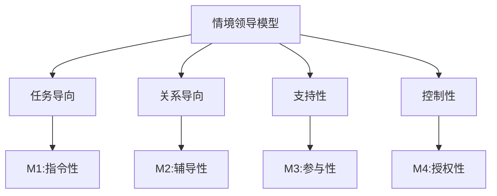
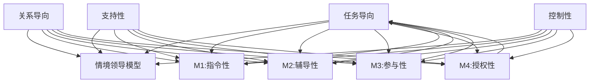

                 

### 第1章：情境领导法的起源与基本概念

#### 1.1 情境领导法的起源

情境领导法（Situational Leadership Model）起源于20世纪70年代，由管理心理学家保罗·赫塞（Paul Hersey）和肯尼思·布兰查德（Kenneth Blanchard）提出。这一理论旨在帮助领导者根据团队成员的能力和动机水平，灵活调整领导风格，以实现团队的最佳表现。

**背景与发展**

- 保罗·赫塞在乔治·华盛顿大学攻读心理学博士学位期间，开始对领导行为进行研究。他的研究受到了行为科学理论的启发，特别是关于领导行为与团队绩效的关系。
- 肯尼思·布兰查德是一位著名的管理学作家，他因《一分钟经理》一书而闻名。他与赫塞合作，共同开发了情境领导法。

**创始人贡献**

- 保罗·赫塞和肯尼思·布兰查德通过大量实证研究和案例分析，提出了情境领导模型。这个模型的核心思想是：领导者的行为应与团队成员的成熟度相匹配，以最大化团队效能。

**情境领导法的发展**

- 自从情境领导法问世以来，它已经经过了多次更新和扩展。最新的版本包括了更细致的领导风格和情境评估工具。
- 情境领导法在不同领域和行业中得到了广泛应用，包括企业管理、教育、医疗和社会服务。

#### 1.2 情境领导法的基本概念

情境领导法包含了一系列核心概念，这些概念是理解和应用这一模型的基础。

**情境（Situation）**

- **定义**：情境是指团队成员的能力和动机水平。不同的情境要求领导者采取不同的领导风格。
- **重要性**：领导者必须理解团队成员的能力和动机，以选择合适的领导策略。

**领导风格（Leadership Style）**

- **定义**：领导风格是指领导者在不同情境下采取的行为和方式。领导风格可以分为四种：指令性、辅导性、参与性和授权性。
- **特点**：每种领导风格都有其特定的行为特征和适用情境。

**团队成员成熟度（Member Maturity）**

- **定义**：团队成员成熟度是指团队成员的技能、动机和责任感。成熟度分为四个层次：依赖、初步独立、可依赖和自主。
- **层次分析**：
  - **依赖**：团队成员缺乏技能和动机，需要领导者的指导和监督。
  - **初步独立**：团队成员具备一定的技能，但需要领导者的支持和鼓励。
  - **可依赖**：团队成员独立性强，但需要领导者的支持和指导。
  - **自主**：团队成员完全独立，领导者只需提供必要的支持。

**情境领导模型**

- **定义**：情境领导模型是一个包含四个维度（任务导向、关系导向、支持性和控制性）和四个成熟度层次的框架。
- **组成部分**：
  - **任务导向**：领导者关注任务目标和绩效。
  - **关系导向**：领导者关注团队成员的需求和关系。
  - **支持性**：领导者提供支持和指导。
  - **控制性**：领导者设定规则和限制。

**领导风格与团队成员成熟度的匹配**

- **匹配原则**：领导者应根据团队成员的成熟度选择合适的领导风格。
- **领导风格调整**：随着团队成员成熟度的提高，领导者应逐步减少指令和控制，增加支持和参与。

#### 1.3 情境领导模型

情境领导模型是情境领导法的基础，它帮助领导者根据团队成员的成熟度选择和调整领导风格。模型包括四个维度和四个成熟度层次。

**四个维度**

- **任务导向**：领导者关注任务目标和绩效，强调任务的执行和结果的达成。
- **关系导向**：领导者关注团队成员的需求和关系，强调团队成员之间的沟通和协作。
- **支持性**：领导者提供支持和指导，帮助团队成员发展技能和信心。
- **控制性**：领导者设定规则和限制，确保团队成员在适当的范围内工作。

**四个成熟度层次**

- **依赖**：团队成员缺乏技能和动机，需要领导者的指导和监督。
- **初步独立**：团队成员具备一定的技能，但需要领导者的支持和鼓励。
- **可依赖**：团队成员独立性强，但需要领导者的支持和指导。
- **自主**：团队成员完全独立，领导者只需提供必要的支持。

**领导风格与成熟度匹配**

- **指令性（M1）**：适用于依赖层次的团队成员，领导者采取明确的指令和监督。
- **辅导性（M2）**：适用于初步独立层次的团队成员，领导者提供指导和支持，鼓励团队成员自我管理。
- **参与性（M3）**：适用于可依赖层次的团队成员，领导者与团队成员共同决策，鼓励团队成员参与。
- **授权性（M4）**：适用于自主层次的团队成员，领导者赋予团队成员自主权，提供必要的支持。

**情境领导模型的应用**

- **日常管理**：领导者根据团队成员的成熟度调整领导风格，提高团队绩效和凝聚力。
- **团队建设**：领导者运用情境领导模型，建立高效、和谐的团队关系。
- **项目执行**：领导者根据项目需求和团队成员成熟度，调整领导风格，确保项目成功。

### Mermaid 流程图：情境领导模型

### 结论

本章介绍了情境领导法的起源、基本概念和模型。情境领导法强调领导者应根据团队成员的成熟度灵活调整领导风格，以实现团队的最佳表现。通过了解情境领导模型，领导者可以更好地管理团队，提高团队绩效和凝聚力。

## 第2章：情境领导模型

### 2.1 模型组成部分

情境领导模型是保罗·赫塞和肯尼思·布兰查德提出的领导理论框架，旨在帮助领导者根据团队成员的成熟度调整领导风格。该模型的核心组成部分包括四个维度和四个成熟度层次。

**四个维度**

1. **任务导向（Task-Oriented）**
   - **定义**：任务导向的领导风格关注于任务的执行和绩效。
   - **特点**：领导者明确任务目标，分配任务，监控进度，并确保任务完成。
   - **适用情境**：适用于需要明确方向和目标的情况，特别是当团队成员缺乏清晰的任务指导时。

2. **关系导向（Relationship-Oriented）**
   - **定义**：关系导向的领导风格关注于团队成员的需求和团队关系的建立。
   - **特点**：领导者鼓励团队成员之间的沟通和协作，解决冲突，增强团队凝聚力。
   - **适用情境**：适用于需要团队成员之间建立信任和合作的情况，特别是当团队成员面临压力和挑战时。

3. **支持性（Supportive）**
   - **定义**：支持性的领导风格关注于为团队成员提供支持和指导。
   - **特点**：领导者提供培训、资源和支持，帮助团队成员发展技能和增强自信心。
   - **适用情境**：适用于需要团队成员成长和发展的阶段，特别是当团队成员需要额外帮助时。

4. **控制性（Control-Oriented）**
   - **定义**：控制性的领导风格关注于设定规则和限制，确保团队成员遵循规定。
   - **特点**：领导者制定明确的规则和流程，监督执行情况，以确保工作质量和安全性。
   - **适用情境**：适用于需要严格控制和规范操作的环境，特别是当团队成员需要指导以避免错误和失误时。

**四个成熟度层次**

1. **依赖（Dependence）**
   - **定义**：依赖层次的团队成员缺乏技能和动机，需要领导者的指导和监督。
   - **特点**：团队成员依赖领导者的指令和决策，缺乏自主性和责任感。
   - **适用领导风格**：指令性（M1）。

2. **初步独立（Initial Independence）**
   - **定义**：初步独立层次的团队成员具备一定的技能，但需要领导者的支持和鼓励。
   - **特点**：团队成员可以执行任务，但可能需要领导者的指导和支持以增强信心和自主性。
   - **适用领导风格**：辅导性（M2）。

3. **可依赖（Interdependence）**
   - **定义**：可依赖层次的团队成员独立性强，但需要领导者的支持和指导。
   - **特点**：团队成员能够独立完成任务，但可能需要领导者的指导和帮助以解决问题和挑战。
   - **适用领导风格**：参与性（M3）。

4. **自主（Autonomy）**
   - **定义**：自主层次的团队成员完全独立，领导者只需提供必要的支持。
   - **特点**：团队成员具有高度自主性和责任感，可以自主决策和完成任务。
   - **适用领导风格**：授权性（M4）。

### 2.2 领导风格与团队成员成熟度

情境领导模型强调领导风格应与团队成员的成熟度相匹配，以最大化团队效能。以下是对不同成熟度层次和相应领导风格的分析：

- **依赖（Dependence）**
  - **成熟度描述**：团队成员缺乏技能和动机，需要领导者的指导和监督。
  - **适用领导风格**：指令性（M1）。
  - **领导者行为**：领导者提供明确的指令和指导，确保团队成员知道如何完成任务。

- **初步独立（Initial Independence）**
  - **成熟度描述**：团队成员具备一定的技能，但需要领导者的支持和鼓励。
  - **适用领导风格**：辅导性（M2）。
  - **领导者行为**：领导者提供指导和支持，帮助团队成员增强自信和自主性。

- **可依赖（Interdependence）**
  - **成熟度描述**：团队成员独立性强，但需要领导者的支持和指导。
  - **适用领导风格**：参与性（M3）。
  - **领导者行为**：领导者与团队成员共同决策，鼓励团队成员参与并承担责任。

- **自主（Autonomy）**
  - **成熟度描述**：团队成员完全独立，领导者只需提供必要的支持。
  - **适用领导风格**：授权性（M4）。
  - **领导者行为**：领导者赋予团队成员自主权，提供必要的支持和资源，允许团队成员自由决策。

### 2.3 情境领导模型的应用场景

情境领导模型可以应用于各种工作情境中，以下是一些常见的应用场景：

- **新项目启动**：在项目初期，团队成员可能缺乏经验，领导者需要采取指令性领导风格，明确任务和目标。

- **团队培训和发展**：在团队成员成长和发展阶段，领导者可以采取辅导性领导风格，提供培训和支持，帮助团队成员提升技能。

- **危机管理**：在紧急情况下，领导者需要快速做出决策，采取参与性领导风格，与团队成员共同应对问题。

- **长期项目执行**：在项目执行过程中，随着团队成员的成熟度提高，领导者可以逐步采取授权性领导风格，赋予团队成员更多自主权。

### Mermaid 流程图：情境领导模型

### 结论

本章详细介绍了情境领导模型的组成部分，包括四个维度和四个成熟度层次。领导者应根据团队成员的成熟度灵活调整领导风格，以实现团队的最佳表现。通过理解情境领导模型，领导者可以更好地应对不同工作情境，提高团队效能和凝聚力。

## 第3章：情境领导法在团队建设中的应用

### 3.1 团队建设的挑战

团队建设是确保团队高效运作和达成共同目标的关键。然而，在实践过程中，团队建设面临着诸多挑战。

**团队成员沟通不畅**

- **问题**：团队成员之间缺乏有效的沟通，导致信息不对称和误解。
- **影响**：沟通不畅会影响团队协作和决策，降低团队绩效。

**团队目标不一致**

- **问题**：团队成员对团队目标的认同度不一致，导致目标不明确。
- **影响**：目标不一致会导致团队成员努力方向不一致，影响团队整体绩效。

**团队成员成熟度差异**

- **问题**：团队成员在技能、动机和责任感方面存在差异，难以协调。
- **影响**：成熟度差异会导致团队成员之间的不信任和协作障碍。

**应对策略**

- **提高沟通效率**：建立有效的沟通机制，鼓励团队成员开放沟通，共享信息。
- **明确团队目标**：确保团队成员对团队目标有共同的理解和认同，制定明确的行动计划。
- **平衡成熟度差异**：针对不同成熟度的团队成员，采取适当的领导风格，提高团队整体的协作能力。

### 3.2 情境领导法在团队建设中的应用

情境领导法在团队建设中的应用，旨在通过调整领导风格，提高团队绩效和凝聚力。以下为具体应用方法：

**情境评估**

- **定义**：情境评估是指领导者对团队成员的成熟度进行评估，以确定适用的领导风格。
- **步骤**：
  1. 与团队成员进行沟通，了解他们的技能、动机和责任感。
  2. 收集团队成员的工作表现和反馈信息。
  3. 结合实际情境，评估团队成员的成熟度。

**选择领导风格**

- **指令性（M1）**：适用于依赖层次的团队成员，领导者提供明确的指令和监督。
  - **特点**：领导者负责决策，制定任务计划，监控进度。
  - **适用情境**：团队初期，团队成员缺乏经验和信心。

- **辅导性（M2）**：适用于初步独立层次的团队成员，领导者提供指导和支持。
  - **特点**：领导者指导团队成员完成任务，鼓励自主性。
  - **适用情境**：团队成员具备基本技能，但需要额外支持。

- **参与性（M3）**：适用于可依赖层次的团队成员，领导者与团队成员共同决策。
  - **特点**：领导者与团队成员共同讨论问题，共同制定解决方案。
  - **适用情境**：团队成员独立性强，需要参与决策。

- **授权性（M4）**：适用于自主层次的团队成员，领导者赋予团队成员自主权。
  - **特点**：领导者提供必要的支持，允许团队成员自主决策。
  - **适用情境**：团队成员高度自主，能够独立完成任务。

**沟通与协作**

- **建立沟通机制**：鼓励团队成员定期沟通，分享工作进展和问题，确保信息畅通。
- **促进协作**：通过团队活动、培训等方式，增强团队成员之间的协作和信任。

**设定团队目标**

- **明确目标**：确保团队成员对团队目标有共同的理解和认同。
- **制定行动计划**：根据团队目标，制定具体的行动计划，明确任务分配和时间表。

**评估与反馈**

- **定期评估**：对团队绩效和团队成员的成熟度进行定期评估，调整领导风格和团队策略。
- **提供反馈**：及时向团队成员提供工作表现和成长情况的反馈，鼓励改进。

### 实践案例

以下为情境领导法在团队建设中的一个实践案例：

**案例背景**：某科技公司新成立一个项目团队，团队成员来自不同部门，缺乏共同的工作经历和信任。项目初期，团队成员对项目目标和任务不明确，沟通不畅，工作进度缓慢。

**应用情境领导法的过程**：

1. **情境评估**：领导者通过与团队成员沟通，了解他们的技能、动机和责任感，评估团队成员的成熟度。

2. **选择领导风格**：
   - 针对依赖层次的团队成员，领导者采取指令性领导风格，明确项目目标和任务分配。
   - 针对初步独立层次的团队成员，领导者采取辅导性领导风格，提供指导和支持，帮助团队成员建立信心。

3. **沟通与协作**：领导者建立定期会议和沟通机制，鼓励团队成员分享工作进展和问题，促进协作。

4. **设定团队目标**：明确项目目标，制定具体的行动计划，确保团队成员对目标有共同的理解和认同。

5. **评估与反馈**：定期评估团队绩效和团队成员的成熟度，根据评估结果调整领导风格和团队策略。

**案例结果**：

- 项目团队的工作进度逐步加快，任务完成质量提高。
- 团队成员之间的沟通和协作增强，建立了信任和合作。
- 随着团队成员成熟度的提高，领导者逐步采取参与性和授权性领导风格，提高团队成员的自主性和责任感。

### 结论

情境领导法在团队建设中的应用，通过调整领导风格，提高团队成员的成熟度，促进沟通与协作，有助于提升团队绩效和凝聚力。领导者应根据团队成员的成熟度和实际情境，灵活运用情境领导法，以实现团队的最佳表现。

## 第4章：情境领导法在项目管理中的应用

### 4.1 项目管理的核心要素

项目管理是确保项目按计划、高质量和按时完成的关键过程。在项目管理中，以下核心要素至关重要：

**项目目标**

- **定义**：项目目标是项目成功的关键指标，包括任务目标、质量目标、时间目标和成本目标。
- **重要性**：明确的项目目标是项目团队共同努力的方向，有助于确保项目资源和努力的有效利用。

**项目团队**

- **定义**：项目团队是完成项目任务的关键力量，包括项目经理、团队成员和其他相关人员。
- **重要性**：一个高效的项目团队可以确保项目资源的合理配置和任务的顺利执行。

**项目资源**

- **定义**：项目资源包括人力、物力、财力和技术资源。
- **重要性**：有效的资源管理有助于提高项目效率，降低成本，确保项目目标的实现。

**项目风险**

- **定义**：项目风险是项目实施过程中可能遇到的问题和挑战，包括技术风险、市场风险和人力资源风险。
- **重要性**：识别和管理项目风险有助于降低不确定性，确保项目顺利进行。

### 4.2 情境领导法在项目管理中的应用

情境领导法在项目管理中具有广泛的应用，通过调整领导风格，提高团队成员的成熟度，有助于提升项目管理的效率和效果。

**项目目标管理**

- **情境评估**：领导者评估团队成员对项目目标的了解和认同程度，确定适用的领导风格。
- **明确目标**：领导者与团队成员共同明确项目目标，确保团队成员对目标有共同的理解和认同。
- **目标分解**：将项目目标分解为具体的任务和里程碑，制定明确的行动计划。

**项目团队管理**

- **成熟度评估**：领导者评估团队成员的技能、动机和责任感，确定团队成员的成熟度层次。
- **领导风格选择**：根据团队成员的成熟度，选择合适的领导风格，如指令性、辅导性、参与性和授权性。
- **团队成员发展**：提供培训和支持，帮助团队成员提升技能，提高成熟度。

**项目资源管理**

- **资源分配**：根据项目需求和团队成员的成熟度，合理分配项目资源，确保资源的高效利用。
- **资源监控**：领导者监控项目资源的使用情况，及时调整资源分配，以应对变化。

**项目风险管理**

- **风险识别**：领导者与团队成员共同识别项目风险，分析风险的可能性和影响。
- **风险应对**：根据风险类型和团队成员的成熟度，制定相应的风险应对策略。
- **风险监控**：定期评估项目风险，及时调整风险应对措施，确保项目顺利进行。

### 实践案例

以下为情境领导法在项目管理中的应用案例：

**案例背景**：某科技公司计划开发一款新产品，项目团队由来自不同部门的专业人员组成。项目初期，团队成员对项目目标和任务不明确，沟通不畅，资源分配不均，项目进度滞后。

**应用情境领导法的过程**：

1. **情境评估**：项目经理通过评估团队成员的技能、动机和责任感，确定团队成员的成熟度层次。

2. **领导风格选择**：
   - 针对依赖层次的团队成员，项目经理采取指令性领导风格，明确项目目标和任务分配。
   - 针对初步独立层次的团队成员，项目经理采取辅导性领导风格，提供指导和支持，帮助团队成员建立信心。

3. **目标明确**：项目经理与团队成员共同明确项目目标，制定具体的行动计划，确保团队成员对目标有共同的理解和认同。

4. **资源管理**：项目经理根据项目需求和团队成员的成熟度，合理分配项目资源，确保资源的高效利用。

5. **风险应对**：项目经理与团队成员共同识别项目风险，制定相应的风险应对策略，确保项目顺利进行。

**案例结果**：

- 项目团队的工作进度逐步加快，任务完成质量提高。
- 团队成员之间的沟通和协作增强，建立了信任和合作。
- 随着团队成员成熟度的提高，项目经理逐步采取参与性和授权性领导风格，提高团队成员的自主性和责任感。
- 项目最终按计划顺利完成，达到预期目标。

### 结论

情境领导法在项目管理中的应用，通过调整领导风格，提高团队成员的成熟度，有助于提升项目管理的效率和效果。领导者应根据团队成员的成熟度和实际情境，灵活运用情境领导法，以实现项目目标的最大化。

## 第5章：情境领导法在不同工作情境下的应用

### 5.1 创新与变革管理

创新和变革管理是现代组织面临的重要挑战。情境领导法在这一领域中的应用，有助于领导者激发团队的创造力，应对变革。

**创新管理的挑战**

- **不确定性**：创新过程充满不确定性，需要领导者应对不确定性和风险。
- **团队协作**：创新项目通常涉及多个部门和专业人员，需要有效的团队协作。
- **资源分配**：创新项目需要合理分配资源，确保项目的顺利进行。

**情境领导法在创新管理中的应用**

- **情境评估**：领导者评估团队成员的技能、动机和责任感，确定适用的领导风格。
- **选择领导风格**：
  - **指令性（M1）**：在项目初期，领导者明确创新目标和任务，提供明确的指导和监督。
  - **辅导性（M2）**：在项目执行过程中，领导者提供指导和支持，帮助团队成员克服困难，增强自主性。
  - **参与性（M3）**：在项目后期，领导者与团队成员共同讨论创新方案，鼓励团队成员参与决策。
  - **授权性（M4）**：在项目成熟阶段，领导者赋予团队成员自主权，允许团队成员自主决策和执行。

- **团队协作**：领导者通过有效的沟通和协作机制，促进团队成员之间的合作，确保创新项目的成功。

**变革管理的挑战**

- **抵触情绪**：团队成员可能对变革持抵触态度，影响变革的推进。
- **资源分配**：变革项目需要合理分配资源，确保变革的顺利实施。
- **持续改进**：变革不是一次性的事件，需要持续改进和优化。

**情境领导法在变革管理中的应用**

- **情境评估**：领导者评估团队成员的成熟度，确定适用的领导风格。
- **选择领导风格**：
  - **指令性（M1）**：在变革初期，领导者明确变革目标和方向，提供明确的指导和监督。
  - **辅导性（M2）**：在变革执行过程中，领导者提供指导和支持，帮助团队成员适应变革。
  - **参与性（M3）**：在变革推广过程中，领导者与团队成员共同讨论变革方案，鼓励团队成员参与。
  - **授权性（M4）**：在变革成熟阶段，领导者赋予团队成员自主权，允许团队成员自主决策和执行。

- **持续改进**：领导者通过定期评估和反馈，持续优化变革管理策略，确保变革的顺利进行。

### 5.2 应急情况下的领导

应急情况是组织面临突发事件的时刻，领导者需要在短时间内做出决策，确保组织的稳定和持续运营。

**应急情况的特点**

- **紧迫性**：应急情况需要立即采取行动，解决紧急问题。
- **不确定性**：应急情况往往充满不确定性，需要领导者灵活应对。
- **高风险**：应急情况可能涉及高风险，需要领导者制定有效的应对策略。

**情境领导法在应急情况下的应用**

- **情境评估**：领导者快速评估应急情况的性质和影响，确定适用的领导风格。
- **选择领导风格**：
  - **指令性（M1）**：在应急初期，领导者迅速采取行动，明确任务和责任，确保紧急问题得到及时处理。
  - **辅导性（M2）**：在应急执行过程中，领导者提供指导和支持，帮助团队成员克服困难，增强应对能力。
  - **参与性（M3）**：在应急恢复阶段，领导者与团队成员共同讨论应急响应方案，鼓励团队成员参与决策。
  - **授权性（M4）**：在应急后期，领导者赋予团队成员自主权，允许团队成员自主决策和执行，以持续优化应急响应。

- **快速决策**：领导者需要迅速做出决策，确保应急问题得到及时解决。

- **团队协作**：领导者通过有效的沟通和协作机制，确保团队成员之间的协作，提高应急响应的效率。

### 结论

情境领导法在不同工作情境下的应用，有助于领导者根据实际情况灵活调整领导风格，提高团队效能和应对能力。在创新和变革管理中，领导者应激发团队的创造力，推动变革的顺利进行。在应急情况下，领导者需要迅速做出决策，确保组织的稳定和持续运营。通过理解情境领导法，领导者可以更好地应对各种工作情境，提升组织整体绩效。

## 第6章：情境领导法在不同行业中的应用

### 6.1 服务业

服务业是情境领导法应用的一个重要领域，涵盖了餐饮、旅游、零售和金融等行业。在服务业中，情境领导法能够有效提升服务质量、客户满意度和团队凝聚力。

**服务业的特点**

- **服务质量**：服务业的核心竞争力在于服务质量，包括服务态度、响应速度和问题解决能力。
- **客户满意度**：客户满意度是服务业成功的关键，需要提供个性化、高效的服务。
- **团队协作**：服务业工作往往需要团队协作，确保服务流程的顺畅和高效。

**情境领导法在服务业中的应用**

- **情境评估**：领导者评估团队成员的服务技能、客户沟通能力和责任感。
- **领导风格选择**：
  - **指令性（M1）**：在服务团队初期，领导者提供明确的任务指令和操作流程，确保服务质量。
  - **辅导性（M2）**：在服务执行过程中，领导者提供指导和支持，帮助团队成员提高服务技能和客户沟通能力。
  - **参与性（M3）**：在服务推广阶段，领导者与团队成员共同讨论服务改进方案，鼓励团队成员参与决策。
  - **授权性（M4）**：在服务成熟阶段，领导者赋予团队成员更多的自主权，允许团队成员自主调整服务流程。

- **客户满意度提升**：领导者通过情境领导法，提高团队成员的服务技能和客户沟通能力，提升客户满意度。

- **团队凝聚力**：领导者通过有效的沟通和协作机制，增强团队成员之间的信任和合作，提高团队凝聚力。

**案例研究**

**餐饮业**：一家连锁餐厅通过情境领导法，改善了员工的服务态度和客户沟通能力。餐厅经理根据员工的成熟度，采取了不同的领导风格。对于新员工，经理采取指令性领导风格，提供详细的任务指令和操作流程。对于经验丰富的员工，经理采取辅导性领导风格，提供指导和支持，鼓励员工自主解决问题。这种灵活的领导方式提高了员工的服务技能和客户满意度，餐厅的业绩得到了显著提升。

### 6.2 制造业

制造业是情境领导法的另一个重要应用领域，涵盖了生产制造、质量控制和管理等环节。在制造业中，情境领导法能够提升生产效率、质量和成本控制。

**制造业的特点**

- **生产效率**：制造业的核心目标之一是提高生产效率，减少生产周期。
- **质量控制**：质量控制是制造业成功的关键，需要确保产品质量符合标准。
- **成本控制**：成本控制是制造业的重要任务，需要合理配置资源，降低成本。

**情境领导法在制造业中的应用**

- **情境评估**：领导者评估团队成员的技能、工作态度和责任感。
- **领导风格选择**：
  - **指令性（M1）**：在生产初期，领导者提供明确的任务指令和操作流程，确保生产效率。
  - **辅导性（M2）**：在生产过程中，领导者提供指导和支持，帮助团队成员解决质量问题，提高生产效率。
  - **参与性（M3）**：在生产优化阶段，领导者与团队成员共同讨论生产改进方案，鼓励团队成员参与决策。
  - **授权性（M4）**：在生产成熟阶段，领导者赋予团队成员更多的自主权，允许团队成员自主调整生产流程。

- **生产效率提升**：领导者通过情境领导法，提高团队成员的技能和工作态度，提升生产效率。

- **质量控制**：领导者通过情境领导法，提高团队成员的质量意识和问题解决能力，确保产品质量。

- **成本控制**：领导者通过情境领导法，优化生产流程，降低成本，提高企业利润。

**案例研究**

**汽车制造业**：一家汽车制造公司通过情境领导法，提高了生产效率和产品质量。公司管理层根据员工的成熟度，采取了不同的领导风格。对于新员工，管理层采取指令性领导风格，提供详细的任务指令和操作流程。对于经验丰富的员工，管理层采取辅导性领导风格，提供指导和支持，帮助员工提高生产技能和解决问题的能力。同时，管理层鼓励员工参与生产改进方案，提高员工的自主性和责任感。这种灵活的领导方式显著提升了生产效率和产品质量，企业的竞争力得到了增强。

### 6.3 科技行业

科技行业是情境领导法应用的另一个重要领域，涵盖了软件开发、信息技术和创新等领域。在科技行业中，情境领导法能够激发团队的创造力，推动技术创新和产品开发。

**科技行业的特点**

- **创新能力**：科技行业竞争激烈，创新能力是企业的核心竞争力。
- **团队协作**：科技项目通常涉及多个专业领域的协作，需要有效的团队协作。
- **持续学习**：科技行业快速变化，持续学习是保持竞争力的关键。

**情境领导法在科技行业中的应用**

- **情境评估**：领导者评估团队成员的技能、创新意识和责任感。
- **领导风格选择**：
  - **指令性（M1）**：在项目初期，领导者提供明确的任务指令和目标，确保项目方向。
  - **辅导性（M2）**：在项目开发过程中，领导者提供指导和支持，帮助团队成员解决技术难题，提高创新能力。
  - **参与性（M3）**：在项目优化阶段，领导者与团队成员共同讨论技术改进方案，鼓励团队成员参与决策。
  - **授权性（M4）**：在项目成熟阶段，领导者赋予团队成员更多的自主权，允许团队成员自主决定技术方向。

- **创新能力提升**：领导者通过情境领导法，激发团队成员的创造力，推动技术创新和产品开发。

- **团队协作**：领导者通过情境领导法，增强团队成员之间的协作和信任，提高团队整体绩效。

- **持续学习**：领导者通过情境领导法，鼓励团队成员持续学习，提高技能和知识水平。

**案例研究**

**软件开发公司**：一家软件开发公司通过情境领导法，提升了团队的创新能力。公司领导层根据团队成员的成熟度，采取了不同的领导风格。对于新员工，领导层采取指令性领导风格，提供详细的开发任务和指导。对于经验丰富的员工，领导层采取辅导性领导风格，提供技术支持和创新建议，鼓励员工提出新的解决方案。同时，领导层鼓励员工参与项目讨论和技术分享，提高员工的自主性和创新能力。这种灵活的领导方式显著提升了团队的绩效和创新能力，公司的发展速度和竞争力得到了显著提升。

### 结论

情境领导法在不同行业中的应用，能够有效提升行业特色的核心能力，如服务质量、生产效率和创新能力。通过灵活调整领导风格，领导者可以根据不同行业的特点和团队成熟度，实现团队的最佳表现。案例研究进一步证明了情境领导法在各个行业中的成功应用，为领导者提供了宝贵的实践经验和启示。

## 第7章：情境领导法的评估与改进

### 7.1 情境领导效果评估

情境领导法的有效性需要通过评估来验证。有效的评估方法能够帮助领导者了解情境领导法的实施效果，并据此进行改进。

**评估方法**

- **问卷调查**：通过问卷调查，收集团队成员对领导风格、团队氛围和工作绩效的反馈。
- **绩效评估**：根据团队和成员的工作表现，评估情境领导法对团队绩效的影响。
- **访谈**：与团队成员进行深入访谈，了解他们对情境领导法的看法和体验。
- **关键绩效指标（KPI）**：设置关键绩效指标，如项目完成时间、质量达标率和员工满意度等，进行量化评估。

**评估指标**

- **团队绩效**：评估团队的整体工作表现，包括任务完成率、项目质量和工作效率等。
- **团队成员满意度**：评估团队成员对情境领导法的满意度和工作体验。
- **团队凝聚力**：评估团队成员之间的合作程度和团队凝聚力。
- **领导风格适应性**：评估领导者是否能够根据团队成员的成熟度调整领导风格，实现最佳效果。

### 7.2 情境领导法的持续改进

为了确保情境领导法的持续有效性，领导者需要根据评估结果不断改进领导策略。

**改进策略**

- **根据评估结果调整领导风格**：领导者应根据团队成员的成熟度和评估反馈，调整领导风格，以更好地匹配团队成员的需求。
- **培训与发展**：为领导者提供情境领导法的培训，提高他们的领导能力和管理水平。
- **建立反馈机制**：建立有效的反馈机制，鼓励团队成员提供改进建议，领导者可以根据反馈进行持续优化。
- **持续评估**：定期评估情境领导法的实施效果，确保领导策略与团队成员的实际情况相匹配。

**持续学习与提升**

- **学习途径**：领导者可以通过阅读相关书籍、参加培训和研讨会，了解情境领导法的最新发展和最佳实践。
- **案例分析**：通过分析成功案例和失败案例，学习情境领导法的应用经验和教训。
- **实践应用**：在实际工作中应用情境领导法，不断总结经验，提高领导能力。

### 结论

情境领导法的评估与改进是确保其有效性的关键。通过科学合理的评估方法和持续改进策略，领导者可以不断提高情境领导法的应用效果，实现团队的最佳表现。

## 第8章：案例分析

### 8.1 案例背景

本案例研究的背景是一家快速成长的互联网公司，该公司在扩展新产品线的过程中遇到了团队协作和领导风格调整的挑战。公司由多个部门组成，包括开发、设计、市场推广和客户服务。随着公司规模的扩大，项目管理和团队协作变得更加复杂。团队成员来自不同的专业背景，有些成员经验丰富，而有些则是新手。公司管理层意识到，为了实现产品线的顺利推进，需要采取有效的领导策略，特别是情境领导法。

### 8.2 情境领导法的应用过程

**情境评估**

- **任务导向（Task-Oriented）**：公司在扩展新产品线时，需要确保项目按时完成，因此任务导向的领导风格显得尤为重要。
- **关系导向（Relationship-Oriented）**：团队成员来自不同部门，需要建立良好的团队关系，促进跨部门的协作。
- **支持性（Supportive）**：公司需要为团队成员提供必要的培训和支持，确保他们能够胜任新任务。
- **控制性（Control-Oriented）**：在项目初期，公司需要确保流程的规范化，避免因混乱而影响项目进度。

**领导风格调整**

1. **初期（M1：指令性）**
   - **原因**：项目初期，团队成员对新产品的理解和任务不熟悉，需要明确的指导和监督。
   - **措施**：项目经理发布详细的任务指令和操作流程，确保团队成员了解任务要求和预期结果。

2. **中期（M2：辅导性）**
   - **原因**：随着项目的推进，团队成员逐渐熟悉了新产品线的流程，但仍需要额外的指导和支持。
   - **措施**：项目经理提供具体的指导和建议，帮助团队成员解决遇到的问题，鼓励他们自主学习和提高。

3. **后期（M3：参与性）**
   - **原因**：项目进入稳定阶段，团队成员具备了较高的自主性和责任感，需要更多的参与和决策权。
   - **措施**：项目经理与团队成员共同讨论项目进展和改进方案，鼓励团队成员提出建议和参与决策。

4. **成熟期（M4：授权性）**
   - **原因**：项目进入成熟期，团队成员完全独立，可以自主完成任务。
   - **措施**：项目经理赋予团队成员更大的自主权，允许他们自主调整工作计划和任务分配。

**团队沟通与协作**

- **建立沟通机制**：公司建立了定期的团队会议和邮件群组，确保团队成员能够及时沟通和分享信息。
- **跨部门协作**：项目经理定期组织跨部门会议，促进不同部门之间的协作和沟通，解决协作中的问题。

### 8.3 案例结果与反思

**案例结果**

- **团队绩效提高**：通过情境领导法的应用，团队成员的自主性和责任感显著提高，项目进度和质量得到显著改善。
- **团队凝聚力增强**：团队成员之间的沟通和协作增强，建立了良好的团队关系，团队凝聚力得到提升。
- **客户满意度提升**：新产品线的推出得到了客户的认可，客户满意度显著提高。

**反思与建议**

- **持续评估与反馈**：领导者需要定期评估情境领导法的实施效果，根据团队成员的反馈进行持续改进。
- **培训与发展**：为团队成员提供培训和发展机会，提高他们的技能和成熟度，以更好地适应不同的领导风格。
- **灵活调整领导风格**：领导者应根据团队成员的实际情况和项目阶段，灵活调整领导风格，确保团队的最佳表现。

通过这个案例分析，我们可以看到情境领导法在互联网公司扩展新产品线过程中的成功应用。领导者根据团队成员的成熟度和项目阶段，灵活调整领导风格，促进了团队绩效和团队凝聚力的提升。这一案例为其他组织提供了宝贵的经验和启示。

## 第9章：实践指南

### 9.1 实践步骤与策略

为了有效应用情境领导法，领导者需要遵循以下步骤和策略：

**步骤**

1. **情境评估**：领导者首先需要评估团队成员的成熟度，了解他们的技能、动机和责任感。这一步可以通过问卷调查、访谈和观察等方法进行。

2. **确定领导风格**：根据情境评估结果，领导者选择合适的领导风格。情境领导法提供了四种领导风格：指令性、辅导性、参与性和授权性。

3. **沟通与反馈**：领导者需要与团队成员进行有效的沟通，解释选择的领导风格，并确保团队成员理解其意图和目标。

4. **执行与监控**：领导者根据确定的领导风格，执行相应的管理行为，并持续监控团队成员的表现和项目进度。

5. **评估与改进**：领导者需要定期评估情境领导法的实施效果，并根据反馈进行调整和优化。

**策略**

1. **灵活调整领导风格**：领导者应根据团队成员的成熟度和项目阶段，灵活调整领导风格，避免僵化地坚持某一种风格。

2. **建立沟通机制**：领导者需要建立有效的沟通机制，确保团队成员能够及时分享信息和反馈，提高团队协作效率。

3. **提供培训与发展**：为团队成员提供必要的培训和发展机会，帮助他们提升技能和成熟度，以更好地适应不同的领导风格。

4. **鼓励自主性和创新**：领导者应鼓励团队成员发挥自主性和创新精神，给予他们足够的支持和资源，以推动项目的顺利进行。

5. **持续评估与反馈**：领导者需要定期评估情境领导法的实施效果，根据团队成员的反馈进行持续改进，确保领导策略与团队成员的实际情况相匹配。

### 9.2 实践中可能出现的问题与解决方案

**问题**

1. **评估不准确**：评估团队成员的成熟度可能不准确，导致选择的领导风格不合适。

   **解决方案**：通过多种评估方法（如问卷调查、访谈和观察）进行多角度评估，提高评估的准确性。

2. **沟通不畅**：团队成员之间的沟通不畅，可能导致领导风格无法有效实施。

   **解决方案**：建立有效的沟通机制，如定期团队会议、邮件群组和即时通讯工具，确保信息流通。

3. **团队抵触**：团队成员可能对新的领导风格产生抵触情绪，影响团队的协作和效率。

   **解决方案**：领导者需要耐心解释领导风格的目的和好处，通过实际案例和成功经验来消除团队成员的疑虑。

4. **资源不足**：团队成员可能缺乏必要的资源和支持，影响他们的工作表现。

   **解决方案**：为团队成员提供足够的资源和支持，如培训、工具和协作平台，以帮助他们更好地完成任务。

5. **反馈不足**：团队成员可能不愿意提供反馈，导致领导策略无法及时调整。

   **解决方案**：建立开放的反馈机制，鼓励团队成员提出意见和建议，领导者应认真倾听并采纳有益的建议。

通过上述步骤和策略，以及解决实践中可能出现的问题，领导者可以更有效地应用情境领导法，提升团队绩效和团队凝聚力。

### 结论

情境领导法的有效应用需要领导者遵循科学合理的步骤和策略。通过情境评估、沟通与反馈、执行与监控以及持续评估与改进，领导者可以灵活调整领导风格，提高团队绩效和团队凝聚力。同时，领导者应积极应对实践中可能出现的问题，确保情境领导法的实施效果。通过持续学习和实践，领导者可以不断提升自身的领导能力，为团队和组织创造更大的价值。

## 第10章：总结与展望

### 10.1 情境领导法的重要性

情境领导法是一种灵活的领导理论，旨在帮助领导者根据团队成员的成熟度调整领导风格，以实现团队的最佳表现。在复杂多变的工作环境中，情境领导法具有以下几个重要性：

**提升团队绩效**：通过选择和调整合适的领导风格，情境领导法能够提高团队成员的自主性和责任感，从而提升整体团队绩效。

**增强团队凝聚力**：情境领导法强调团队关系和沟通，有助于建立信任和合作，增强团队凝聚力。

**适应动态变化**：情境领导法根据团队成员的成熟度灵活调整领导风格，使领导者能够适应不同阶段的工作需求，应对动态变化。

**提高领导能力**：情境领导法鼓励领导者不断学习和反思，提高自身的领导能力和管理水平。

### 10.2 持续学习与提升

为了持续提升领导能力，领导者应采取以下策略：

**阅读与学习**：领导者应定期阅读相关书籍和文章，了解情境领导法的最新发展和最佳实践。

**参与培训**：领导者可以参加专业培训课程和工作坊，学习情境领导法的实际应用技巧。

**实践应用**：在实际工作中应用情境领导法，不断总结经验，改进领导策略。

**寻求反馈**：领导者应主动寻求团队成员和下属的反馈，了解领导风格的效果，并根据反馈进行调整。

**反思与总结**：定期反思和总结领导经验，从成功和失败中吸取教训，不断提升领导能力。

### 10.3 未来研究方向

未来情境领导法的研究和发展可以从以下几个方面进行：

**跨文化应用**：探讨情境领导法在不同文化背景下的应用效果，以适应全球化的工作环境。

**数字化领导**：研究在数字化时代背景下，如何将情境领导法与数字化工具相结合，提高领导效率。

**领导力发展模型**：进一步探索领导力发展的新模型，以应对不断变化的工作环境和挑战。

**领导力心理学**：结合心理学理论，深入研究领导行为对团队成员心理和情感的影响。

通过持续的研究和发展，情境领导法将在未来继续为领导者提供有力的理论支持和实践指导，帮助他们在复杂多变的环境中实现卓越的领导。

### 结论

情境领导法作为一种灵活、科学的领导理论，对提升团队绩效、增强团队凝聚力和提高领导能力具有重要意义。领导者应持续学习和实践情境领导法，不断提升自身的领导能力，以应对不断变化的挑战。未来，情境领导法将继续在领导力研究和实践中发挥重要作用，为领导者提供更全面的指导和支持。

## 附录

### 附录 A：情境领导工具与方法

**情境评估工具**

- **情境评估问卷**：用于评估团队成员的技能、动机和责任感，帮助领导者了解团队成员的成熟度。
- **360度反馈**：通过团队成员、同事和下属的反馈，综合评估领导者的领导风格和效果。

**领导风格评估工具**

- **领导风格量表**：用于评估领导者的领导风格，包括任务导向、关系导向、支持性和控制性等方面。
- **自我评估问卷**：领导者通过自我评估，了解自己的领导风格和改进方向。

**情境领导方法**

- **领导风格轮盘图**：用于可视化领导者在不同情境下的领导风格分布，帮助领导者识别和调整领导风格。
- **情境领导模型应用**：结合具体情境，应用情境领导模型调整领导策略，提升团队效能。

### 附录 B：参考资料

**书籍**

- Hersey, P., & Blanchard, K. H. (2017). Situational Leadership. McGraw-Hill Education.
- Bennis, W. G., & Nanus, B. (1985). Leaders: The Strategies for Taking Charge. HarperCollins.
- Kotter, J. P. (1996). Leading Change. Harvard Business Review Press.

**文章与研究报告**

- Hersey, P., & Blanchard, K. H. (1977). Management of Organizational Behavior: Utilizing Social Systems Theory. Gulf Publishing Company.
- Yukl, G. A. (2013). Leadership in Organizations (8th ed.). Pearson.
- Northouse, P. G. (2018). Leadership: Theory and Practice (8th ed.). Sage Publications.

**网站资源**

- The Center for Leadership Studies: https://www.centerforleadershipstudies.com/
- MindTools: https://www.mindtools.com/pages/main/newMN_TMC.htm
- Harvard Business Review: https://hbr.org/

通过附录提供的工具、方法和参考资料，读者可以深入了解情境领导法的理论基础和实践应用，进一步提升领导能力和管理水平。

