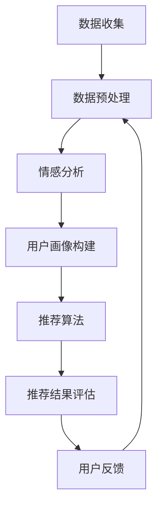

                 

### 情感驱动推荐：AI如何理解用户情绪，提供个性化推荐

> **关键词**：情感驱动推荐、用户情绪、AI、个性化推荐、情感分析、推荐算法

> **摘要**：本文将深入探讨情感驱动推荐系统的原理和应用。首先，我们将介绍推荐系统的基本概念和作用，然后详细阐述情感计算的基础知识，包括情感计算的定义、分类及其应用。接下来，我们将分章节介绍情感驱动的推荐系统核心技术，如情感计算在用户画像中的应用、情感驱动的推荐算法和深度学习模型。随后，我们将通过实践案例分析情感驱动推荐系统的构建和优化。最后，我们展望情感驱动推荐系统的未来发展趋势和面临的挑战。本文旨在为读者提供一个全面、系统的情感驱动推荐系统学习路径，帮助深入理解并掌握这一前沿技术。

### 第一部分：情感驱动的推荐系统概述

在当今的信息时代，用户面临着海量的信息选择，如何有效地帮助用户发现他们感兴趣的内容成为了一个重要问题。推荐系统作为信息过滤和个性化搜索的关键技术，在此背景下应运而生。然而，传统的推荐系统主要依赖于用户行为数据和物品特征信息，往往忽略了用户情绪这一重要的因素。近年来，随着情感计算技术的不断发展，情感驱动的推荐系统逐渐成为研究热点。本文将围绕这一主题，深入探讨情感驱动的推荐系统的原理、技术和应用。

#### 第1章：推荐系统概述

推荐系统（Recommendation System）是一种通过预测用户对物品的兴趣，从而向用户推荐相关物品的信息过滤技术。其核心目标是提高用户满意度，增加用户参与度，最终实现商业价值的提升。推荐系统可以广泛应用于电子商务、社交媒体、在线视频、新闻推荐等多个领域。

##### 1.1 推荐系统的定义与作用

推荐系统可以定义为一种基于数据分析和机器学习技术，自动向用户推荐他们可能感兴趣的商品、内容或服务的信息系统。其基本工作原理是通过收集和分析用户的历史行为数据（如购买记录、浏览记录、评分等），以及物品的特征信息（如文本描述、图片、标签等），构建用户画像和物品画像。然后利用这些画像进行预测模型训练，预测用户对未接触过的物品的兴趣度，从而生成推荐列表。

推荐系统的主要作用包括：

1. **提高用户满意度**：通过个性化推荐，将用户可能感兴趣的内容主动推送给用户，提高用户的满意度和参与度。
2. **增加商业价值**：通过提高用户购买转化率和消费频次，帮助企业提升销售额和用户粘性。
3. **信息过滤**：在信息过载的时代，推荐系统帮助用户筛选出感兴趣的内容，降低用户的认知负担。

##### 1.2 推荐系统的发展历程

推荐系统的发展历程可以分为以下几个阶段：

1. **基于内容的推荐（Content-based Filtering）**：早期推荐系统主要依赖物品的文本描述、标签等特征信息进行推荐。通过分析用户的历史行为和物品特征，找出用户感兴趣的特征，并将具有相似特征的物品推荐给用户。
2. **协同过滤（Collaborative Filtering）**：随着用户数据的积累，协同过滤成为主流推荐方法。协同过滤通过分析用户行为数据，找出相似用户或相似物品，将相似用户喜欢的物品推荐给目标用户。
3. **基于模型的推荐（Model-based Filtering）**：基于模型的推荐方法结合了内容和协同过滤的优点，通过构建预测模型，预测用户对物品的兴趣度，实现更精准的推荐。
4. **混合推荐（Hybrid Recommendation）**：为了进一步提高推荐效果，混合推荐系统将多种推荐方法结合，通过加权或集成的方式，综合利用不同推荐方法的优点。

##### 1.3 情感驱动的推荐系统的重要性

传统的推荐系统主要依赖于用户行为数据和物品特征信息，但在实际应用中，用户情绪这一重要因素往往被忽视。情感驱动的推荐系统通过引入情感计算技术，分析用户的情绪状态，将用户情绪与推荐算法相结合，实现更加个性化和精准的推荐。情感驱动的推荐系统的重要性主要体现在以下几个方面：

1. **提高推荐准确性**：情感分析技术可以帮助系统更深入地理解用户的情绪状态，从而提高推荐算法的准确性。
2. **增强用户参与度**：通过理解用户情绪，推荐系统可以提供更加贴合用户情感状态的内容，提高用户的参与度和满意度。
3. **拓展商业价值**：情感驱动的推荐系统可以帮助企业更好地把握用户情感需求，提供更具有针对性的服务和产品，从而实现更高的商业价值。

##### 1.4 本书的目标和结构

本书的目标是全面介绍情感驱动的推荐系统，帮助读者深入理解并掌握这一前沿技术。本书的结构如下：

- **第一部分**：情感驱动的推荐系统概述，介绍推荐系统的基本概念、发展历程和情感驱动推荐系统的重要性。
- **第二部分**：情感计算基础，详细阐述情感计算的定义、分类和应用。
- **第三部分**：情感驱动的推荐系统核心技术，介绍情感计算在用户画像中的应用、情感驱动的推荐算法和深度学习模型。
- **第四部分**：情感驱动的推荐系统实践，通过具体案例展示情感驱动推荐系统的构建和优化。
- **第五部分**：情感驱动推荐系统的未来发展趋势，探讨情感驱动推荐系统的技术挑战和机遇。

通过本书的阅读，读者可以系统地了解情感驱动的推荐系统，掌握关键技术和应用方法，为实际项目开发提供参考。

#### 第2章：情感计算基础

情感计算（Affective Computing）是计算机科学领域的一个新兴分支，主要研究如何使计算机能够理解、处理和模拟人类的情感。情感计算技术可以应用于多个领域，如人机交互、虚拟助手、心理健康监测等。在推荐系统中，情感计算技术的引入使得系统不仅能够分析用户的行为数据，还能理解用户的情绪状态，从而实现更加个性化、精准的推荐。本章将详细阐述情感计算的基本概念、分类及其应用。

##### 2.1 情感计算的定义与分类

情感计算是指通过计算机技术和人工智能算法，使计算机能够理解和模拟人类的情感状态。情感计算主要包括以下三个方面的研究内容：

1. **情感识别（Affective Recognition）**：通过分析用户的语音、文字、面部表情、生理信号等数据，识别用户的情感状态。情感识别是情感计算的基础，是实现情感理解和交互的关键步骤。
2. **情感理解（Affective Understanding）**：在情感识别的基础上，对用户情感进行深入理解，挖掘情感背后的意图和需求。情感理解可以帮助系统更好地满足用户的需求，提供更加个性化和精准的服务。
3. **情感模拟（Affective Simulation）**：通过模拟人类情感表达，使计算机能够与用户进行情感互动，提升人机交互的体验。

根据情感计算的研究内容和应用场景，可以将其分为以下几类：

1. **基于生理信号的情感计算**：通过分析用户的生理信号（如心率、呼吸、皮肤电活动等），识别用户的情绪状态。生理信号情感计算在心理健康监测、人机交互等领域具有广泛应用。
2. **基于文本的情感计算**：通过分析用户的文本表达（如社交媒体帖子、电子邮件、聊天记录等），识别用户的情感状态。文本情感计算是情感计算中最具挑战性的研究方向，因为语言具有高度的主观性和复杂性。
3. **基于语音的情感计算**：通过分析用户的语音信号（如语调、语速、语音节奏等），识别用户的情感状态。语音情感计算在语音助手、客服系统等领域具有广泛的应用。
4. **基于图像的情感计算**：通过分析用户的面部表情、肢体语言等图像信息，识别用户的情感状态。图像情感计算在视频监控、虚拟助手等领域具有广泛应用。

##### 2.2 情感计算的基本方法

情感计算的基本方法主要包括以下几类：

1. **特征提取**：情感计算的第一步是特征提取，即将原始数据转换为计算机可以处理的形式。在生理信号情感计算中，特征提取包括心率、呼吸频率、皮肤电活动等生理参数的提取；在文本情感计算中，特征提取包括词频、词向量、情感词典等；在语音情感计算中，特征提取包括语音频谱、语音节奏等；在图像情感计算中，特征提取包括面部特征、肢体动作等。
2. **情感分类**：情感分类是情感计算的核心步骤，即根据提取的特征，对用户的情感状态进行分类。常用的情感分类方法包括基于规则的方法、机器学习方法、深度学习方法等。基于规则的方法通过手工定义情感规则进行分类；机器学习方法通过训练分类模型进行情感分类；深度学习方法通过构建深度神经网络进行情感分类。
3. **情感预测**：情感预测是在情感分类的基础上，进一步预测用户的未来情感状态。情感预测可以用于推荐系统的实时推荐，根据用户当前的情感状态，预测用户未来的兴趣和需求。
4. **情感理解**：情感理解是对用户情感状态的深入分析，挖掘情感背后的意图和需求。情感理解可以帮助系统更好地满足用户需求，提供个性化服务。

##### 2.3 情感计算的应用场景

情感计算在多个领域具有广泛的应用，以下列举几个主要的应用场景：

1. **人机交互**：情感计算可以提升人机交互的体验，通过理解用户的情感状态，提供更加个性化和贴心的交互服务。例如，智能语音助手通过情感计算技术，识别用户的情感状态，调整回答语气和内容，提高用户满意度。
2. **心理健康监测**：情感计算可以用于心理健康监测，通过分析用户的生理信号和文本表达，识别用户的心理状态，为心理健康提供实时监测和预警。
3. **智能客服**：情感计算可以提升智能客服的服务质量，通过理解用户的情感状态，提供更加个性化和专业的咨询服务，提高用户满意度。
4. **虚拟现实**：情感计算可以提升虚拟现实体验，通过模拟用户的情感状态，提供更加真实和丰富的交互体验。
5. **广告推荐**：情感计算可以提升广告推荐的精准度，通过分析用户的情感状态，提供更加符合用户兴趣和情感需求的广告内容。

##### 2.4 情感计算在推荐系统中的应用

在推荐系统中，情感计算技术的引入可以显著提升推荐效果和用户体验。以下介绍情感计算在推荐系统中的应用方法和案例：

1. **情感画像构建**：通过情感计算技术，对用户的历史行为数据和文本表达进行分析，构建用户的情感画像。情感画像包括用户的情绪类型、情感强度等特征，用于推荐算法中的用户画像构建。
2. **情感驱动的推荐算法**：将用户的情感状态作为输入特征，结合传统推荐算法，构建情感驱动的推荐算法。例如，在协同过滤算法中，可以引入用户情感特征，计算用户对物品的情感相似度，从而提高推荐效果。
3. **情感预测与实时推荐**：通过情感计算技术，实时预测用户的情感状态，根据用户的当前情感状态进行个性化推荐。例如，当用户处于愉快情感状态时，推荐具有娱乐性质的内容；当用户处于焦虑情感状态时，推荐具有放松性质的内容。
4. **情感评估与优化**：通过对推荐结果的情感评估，分析用户的情感反应，优化推荐策略。例如，当用户对推荐内容产生负面情感时，调整推荐算法，避免推荐类似的内容。

案例1：某在线视频平台通过情感计算技术，分析用户的观看历史和评论内容，构建用户的情感画像。然后，将情感画像与用户行为数据进行结合，使用情感驱动的协同过滤算法进行推荐。实验结果显示，情感驱动的推荐算法在用户满意度、观看时长等方面均优于传统推荐算法。

案例2：某电商网站通过情感计算技术，分析用户的购物行为和评论内容，构建用户的情感画像。然后，将情感画像与用户行为数据进行结合，使用情感驱动的深度学习模型进行推荐。实验结果显示，情感驱动的深度学习模型在推荐准确性和用户满意度方面均表现出色。

通过以上案例可以看出，情感计算技术在推荐系统中的应用，可以有效提升推荐效果和用户体验，为用户提供更加个性化和精准的推荐服务。

本章介绍了情感计算的基本概念、分类和应用，以及情感计算在推荐系统中的应用方法和案例。通过本章的学习，读者可以了解情感计算技术的基本原理和应用场景，为后续章节的学习打下基础。

#### 第二部分：情感驱动的推荐系统核心技术

在上一部分，我们介绍了推荐系统的基本概念和情感计算的基础知识。本部分将深入探讨情感驱动的推荐系统核心技术，包括情感计算在用户画像中的应用、情感驱动的推荐算法以及情感驱动的深度学习模型。这些核心技术是构建高效、精准情感驱动推荐系统的关键。

### 第3章：情感计算在用户画像中的应用

用户画像（User Profiling）是推荐系统中的一个重要组成部分，它通过整合用户的历史行为数据、社会关系信息、兴趣偏好等多维度数据，构建出一个关于用户的综合描述。情感计算技术为用户画像的构建提供了新的视角，通过分析用户的情感状态，进一步丰富和细化用户画像的维度，从而提升推荐系统的个性化和准确性。

#### 3.1 用户画像的概念与作用

用户画像是对用户特征的全面描述，它包括用户的个人信息、行为习惯、兴趣爱好、情感状态等多个方面。一个完整的用户画像可以帮助推荐系统更好地理解用户，从而提供更加精准的推荐。

用户画像的作用主要包括：

1. **个性化推荐**：通过分析用户画像，推荐系统可以更好地了解用户的兴趣和需求，从而提供个性化的推荐结果。
2. **用户细分**：用户画像可以帮助企业对用户进行细分，针对不同类型的用户制定个性化的营销策略。
3. **需求预测**：通过分析用户画像，推荐系统可以预测用户未来的行为和需求，从而提前进行产品和服务布局。

#### 3.2 情感分析技术在用户画像中的应用

情感分析（Sentiment Analysis）是情感计算的一个关键组成部分，它通过自然语言处理技术，对用户的文本数据进行分析，识别出文本中的情感倾向。在用户画像构建中，情感分析技术可以应用于以下几个方面：

1. **情感识别**：通过对用户的历史评论、社交媒体帖子、论坛发帖等文本进行分析，识别用户的情感状态，如积极、消极、中性等。
2. **情感强度分析**：情感分析不仅识别情感类型，还可以分析情感的强度，如非常高兴、有点高兴、中性、有点不高兴、非常不高兴等。
3. **情感维度分析**：情感分析可以进一步识别情感的维度，如喜悦、愤怒、悲伤、恐惧等，为用户画像提供更细致的情感特征。

#### 3.3 用户情感画像的构建方法

用户情感画像的构建需要结合情感分析技术和用户画像构建的方法。以下是用户情感画像构建的基本步骤：

1. **数据收集**：收集用户的历史行为数据（如评论、帖子、购物记录等）和社交数据（如朋友圈、微博等）。
2. **情感标注**：对收集到的文本数据使用情感分析技术进行情感标注，生成情感标签。
3. **情感特征提取**：将情感标签转换为情感特征，如情感类型、情感强度等。
4. **情感融合**：将情感特征与用户的其他特征（如行为特征、人口统计特征等）进行融合，构建用户情感画像。
5. **情感画像评估**：通过评估指标（如情感识别准确率、情感强度预测准确率等）对用户情感画像进行评估和优化。

#### 案例研究：构建用户情感画像

以下是一个具体的案例研究，展示如何构建用户情感画像：

**案例背景**：某电商网站希望通过构建用户情感画像，提高推荐系统的准确性。

**数据收集**：收集用户在网站上的评论、购物记录、浏览历史等数据。

**情感标注**：使用情感分析技术对评论数据进行分析，标注出情感类型和情感强度。例如，对于评论“商品质量很好”，标注为积极情感，情感强度为中等。

**情感特征提取**：将标注结果转换为情感特征，如积极情感计数、消极情感计数等。

**情感融合**：将情感特征与用户的其他特征（如购物频次、浏览时长等）进行融合，构建用户情感画像。

**情感画像评估**：使用评估指标（如推荐准确率、用户满意度等）对用户情感画像进行评估，根据评估结果对情感画像进行优化。

通过以上步骤，构建的用户情感画像可以为推荐系统提供更细致的用户特征，从而提高推荐效果。

#### 3.4 情感画像在推荐系统中的应用

用户情感画像在推荐系统中有着广泛的应用，以下是一些具体的应用场景：

1. **个性化推荐**：根据用户情感画像，推荐系统可以提供更加个性化的推荐结果。例如，当用户处于积极情感状态时，推荐具有娱乐性质的商品或内容；当用户处于消极情感状态时，推荐具有放松性质的商品或内容。
2. **需求预测**：通过分析用户情感画像，推荐系统可以预测用户未来的情感状态和需求，从而提前进行商品和内容的布局。例如，当用户情感状态趋向积极时，提前推荐与用户兴趣相关的商品。
3. **情感评估**：推荐系统可以根据用户对推荐内容的情感反应，评估推荐效果，并优化推荐策略。例如，当用户对推荐内容产生负面情感时，调整推荐策略，避免推荐类似的内容。

#### 3.5 用户情感画像的挑战与优化

用户情感画像在构建和应用过程中面临一些挑战：

1. **数据质量**：情感分析结果的准确性受到数据质量的影响，如噪声数据、缺失数据等。因此，需要采取数据预处理方法，提高数据质量。
2. **情感多样性**：用户的情感是多样化的，情感分析技术需要能够处理复杂、多变的情感状态。为此，需要不断优化情感分析算法，提高对复杂情感的识别能力。
3. **实时性**：推荐系统需要实时响应用户的情感变化，因此，情感分析技术需要具备较高的实时性。

为了克服这些挑战，可以采取以下优化策略：

1. **数据增强**：通过数据增强技术，提高数据质量和多样性，如生成对抗网络（GAN）、数据扩充等。
2. **多模态情感分析**：结合多种数据源（如文本、语音、图像等），进行多模态情感分析，提高情感识别的准确性和多样性。
3. **实时计算**：优化情感分析算法，提高计算效率，如使用高效的特征提取方法、分布式计算等。

通过以上措施，可以进一步提高用户情感画像的准确性、多样性和实时性，从而提升推荐系统的效果。

本章详细介绍了情感计算在用户画像中的应用，包括用户画像的概念、情感分析技术在用户画像中的应用、用户情感画像的构建方法和应用。通过本章的学习，读者可以了解如何利用情感计算技术构建用户情感画像，并将其应用于推荐系统，实现更加个性化和精准的推荐。

### 第4章：情感驱动的推荐算法

情感驱动的推荐算法是推荐系统中的一个重要研究方向，它通过引入用户情感特征，进一步提升了推荐系统的个性化和准确性。本章将介绍情感驱动的推荐算法的基本概念、分类以及具体实现方法，并通过案例研究展示情感驱动的推荐算法在实际应用中的效果。

#### 4.1 情感驱动的推荐算法概述

情感驱动的推荐算法是指将用户的情感状态作为重要的输入特征，与传统的推荐算法相结合，以提高推荐系统的个性化和准确性。情感驱动的推荐算法主要分为以下几类：

1. **情感增强的协同过滤算法**：在传统协同过滤算法的基础上，引入用户情感特征，通过情感相似度计算，提高推荐效果。
2. **情感驱动的基于内容的推荐算法**：在基于内容的推荐算法中，引入用户情感特征，通过情感相关性计算，提高推荐精度。
3. **情感驱动的混合推荐算法**：结合协同过滤和基于内容的推荐算法，引入用户情感特征，综合利用不同算法的优点，提高推荐效果。

#### 4.2 情感分析算法在推荐系统中的应用

情感分析算法是情感驱动的推荐算法的基础，它通过分析用户的文本数据，识别用户的情感状态。以下介绍几种常用的情感分析算法：

1. **基于规则的方法**：通过手工定义情感规则，对文本进行情感分类。这种方法简单易实现，但规则难以覆盖所有情感状态，准确性较低。
2. **机器学习方法**：使用监督学习算法，通过大量标注数据训练情感分类模型。常见的机器学习方法包括支持向量机（SVM）、朴素贝叶斯（NB）等。这种方法具有较高的准确性，但需要大量的标注数据。
3. **深度学习方法**：使用深度神经网络，如卷积神经网络（CNN）和循环神经网络（RNN），对文本进行情感分析。深度学习方法能够自动提取文本中的复杂特征，具有较高的准确性，但计算资源需求较高。

在实际应用中，可以根据具体场景选择合适的情感分析算法。以下是一个案例研究，展示如何将情感分析算法应用于推荐系统。

**案例背景**：某视频平台希望通过情感分析算法，提高推荐系统的准确性。

**情感分析算法选择**：由于视频平台的用户评论文本较多，且用户情感状态较为复杂，选择使用深度学习方法进行情感分析。

**模型实现**：使用预训练的BERT模型进行情感分析，将用户评论文本转换为词向量，然后输入BERT模型进行情感分类。

**情感分析结果**：根据情感分析结果，将用户情感状态分为积极、消极和中性三种。然后，将情感分析结果与用户行为数据进行结合，用于改进推荐算法。

#### 4.3 情感驱动的协同过滤算法

协同过滤算法是推荐系统中最常用的算法之一，它通过分析用户的历史行为数据，找出相似用户或相似物品，进行推荐。情感驱动的协同过滤算法在传统协同过滤算法的基础上，引入用户情感特征，提高推荐精度。

1. **基于情感的用户相似度计算**：在传统协同过滤算法中，通过计算用户之间的行为相似度。在情感驱动的协同过滤算法中，引入用户情感特征，计算用户之间的情感相似度。例如，使用皮尔逊相关系数计算用户情感相似度。
2. **基于情感的商品相似度计算**：在传统协同过滤算法中，通过计算商品之间的行为相似度。在情感驱动的协同过滤算法中，引入商品情感特征，计算商品之间的情感相似度。例如，使用余弦相似度计算商品情感相似度。
3. **情感驱动的推荐评分预测**：在传统协同过滤算法中，使用用户相似度和商品相似度计算推荐评分。在情感驱动的协同过滤算法中，将用户情感特征和商品情感特征结合起来，计算推荐评分。例如，使用加权平均计算推荐评分。

以下是一个具体的实现案例：

**案例背景**：某电商网站希望通过情感驱动的协同过滤算法，提高推荐系统的准确性。

**用户情感特征提取**：使用情感分析算法对用户评论进行情感分析，提取用户情感特征，如积极情感计数、消极情感计数等。

**商品情感特征提取**：使用情感分析算法对商品描述进行情感分析，提取商品情感特征，如积极情感计数、消极情感计数等。

**用户情感相似度计算**：使用皮尔逊相关系数计算用户之间的情感相似度。

**商品情感相似度计算**：使用余弦相似度计算商品之间的情感相似度。

**推荐评分预测**：使用加权平均计算推荐评分，其中用户情感相似度和商品情感相似度分别作为权重。

#### 4.4 情感驱动的基于内容的推荐算法

基于内容的推荐算法通过分析用户对物品的兴趣特征，为用户推荐相似物品。情感驱动的基于内容的推荐算法在传统基于内容的推荐算法的基础上，引入用户情感特征，提高推荐精度。

1. **情感相关性计算**：在传统基于内容的推荐算法中，通过计算用户兴趣特征与物品特征的相关性进行推荐。在情感驱动的基于内容的推荐算法中，引入用户情感特征，计算用户情感特征与物品特征的相关性。例如，使用余弦相似度计算情感相关性。
2. **情感增强的推荐评分计算**：在传统基于内容的推荐算法中，使用用户兴趣特征与物品特征的相关性计算推荐评分。在情感驱动的基于内容的推荐算法中，将用户情感特征与物品特征的相关性结合起来，计算推荐评分。例如，使用加权平均计算推荐评分。

以下是一个具体的实现案例：

**案例背景**：某新闻推荐平台希望通过情感驱动的基于内容的推荐算法，提高推荐系统的准确性。

**用户情感特征提取**：使用情感分析算法对用户阅读历史和评论进行情感分析，提取用户情感特征。

**物品情感特征提取**：使用情感分析算法对新闻内容进行情感分析，提取新闻情感特征。

**情感相关性计算**：使用余弦相似度计算用户情感特征与新闻情感特征的相关性。

**推荐评分计算**：使用加权平均计算推荐评分，其中用户情感特征与新闻情感特征的相关性作为权重。

#### 4.5 情感驱动的混合推荐算法

情感驱动的混合推荐算法结合了协同过滤和基于内容的推荐算法的优点，引入用户情感特征，提高推荐精度。情感驱动的混合推荐算法可以分为以下几种类型：

1. **加权融合**：将协同过滤和基于内容的推荐算法的输出进行加权融合，计算最终推荐评分。例如，使用用户相似度和情感相关性分别作为权重，计算加权推荐评分。
2. **深度学习模型**：使用深度学习模型，将用户行为数据、情感特征和物品特征进行整合，生成推荐评分。例如，使用卷积神经网络（CNN）和循环神经网络（RNN）结合情感特征，生成推荐评分。

以下是一个具体的实现案例：

**案例背景**：某电商平台希望通过情感驱动的混合推荐算法，提高推荐系统的准确性。

**用户情感特征提取**：使用情感分析算法对用户评论进行情感分析，提取用户情感特征。

**物品情感特征提取**：使用情感分析算法对商品描述进行情感分析，提取商品情感特征。

**混合推荐评分计算**：使用加权融合方法，将协同过滤算法和基于内容的推荐算法的输出进行加权融合，计算最终推荐评分。

通过以上案例研究，可以看出情感驱动的推荐算法在提高推荐系统的个性化和准确性方面具有显著优势。情感驱动的协同过滤算法、基于内容的推荐算法和混合推荐算法为推荐系统提供了新的思路和方法，有助于提升用户满意度，增强用户参与度。

本章介绍了情感驱动的推荐算法的基本概念、分类以及具体实现方法，并通过案例研究展示了情感驱动的推荐算法在实际应用中的效果。通过本章的学习，读者可以了解情感驱动的推荐算法的原理和应用，为实际项目开发提供参考。

### 第5章：情感驱动的深度学习推荐模型

深度学习（Deep Learning）作为一种强大的机器学习技术，已经在推荐系统中取得了显著的成果。情感驱动的深度学习推荐模型通过结合用户情感特征和深度学习技术，进一步提升了推荐系统的准确性和个性性。本章将详细介绍情感驱动的深度学习推荐模型的基本原理、架构和应用。

#### 5.1 深度学习在推荐系统中的应用

深度学习在推荐系统中的应用主要包括以下几个方面：

1. **用户行为数据建模**：深度学习可以通过自动特征提取，捕捉用户行为数据中的复杂模式和潜在特征，从而提高推荐系统的准确性。
2. **物品特征表征**：深度学习可以对物品进行细粒度的表征，提取物品的语义和情感信息，从而提高推荐系统的个性化能力。
3. **模型融合**：深度学习可以融合多种数据源，如用户行为数据、物品特征、情感特征等，生成统一的表征，提高推荐效果。
4. **实时推荐**：深度学习模型可以通过高效的计算和优化，实现实时推荐，满足用户即时需求。

#### 5.2 情感驱动的深度学习模型架构

情感驱动的深度学习模型架构通常包括以下几个模块：

1. **情感特征提取模块**：使用情感分析技术提取用户的情感特征，如情感类型、情感强度等。
2. **用户行为数据输入模块**：收集用户的浏览记录、购买记录、评分记录等行为数据，并将其输入到模型中。
3. **物品特征输入模块**：收集物品的文本描述、图像特征、标签等特征，并将其输入到模型中。
4. **深度神经网络模块**：使用深度神经网络（如卷积神经网络（CNN）、循环神经网络（RNN）、变换器（Transformer）等）对输入数据进行编码和整合。
5. **推荐评分模块**：基于深度神经网络生成的用户和物品表征，计算推荐评分，生成推荐列表。

以下是一个典型的情感驱动的深度学习推荐模型架构：

```
情感特征提取模块 -> 用户行为数据输入模块 -> 物品特征输入模块
         |                                  |
         V                                  V
深度神经网络模块 <- 推荐评分模块 <- 用户和物品表征
```

#### 5.3 情感驱动的深度学习模型应用案例

以下是一个情感驱动的深度学习推荐模型的应用案例：

**案例背景**：某电商平台希望通过情感驱动的深度学习推荐模型，提高推荐系统的准确性和个性化能力。

**步骤1：情感特征提取**：使用情感分析技术对用户评论进行情感分析，提取用户的情感特征，如积极情感计数、消极情感计数等。

**步骤2：用户行为数据输入**：收集用户的浏览记录、购买记录、评分记录等行为数据，并将其输入到模型中。

**步骤3：物品特征输入**：收集物品的文本描述、图像特征、标签等特征，并将其输入到模型中。

**步骤4：深度神经网络编码**：使用卷积神经网络（CNN）和循环神经网络（RNN）结合情感特征，对用户行为数据和物品特征进行编码和整合。

**步骤5：推荐评分计算**：基于深度神经网络生成的用户和物品表征，计算推荐评分，生成推荐列表。

**步骤6：模型训练与优化**：使用用户和物品的标签数据，对深度学习模型进行训练和优化，提高模型性能。

**步骤7：模型部署与实时推荐**：将训练好的模型部署到线上环境，实现实时推荐，满足用户需求。

通过以上步骤，构建的情感驱动的深度学习推荐模型可以有效提高推荐系统的准确性和个性化能力，为电商平台提供更优质的推荐服务。

#### 5.4 情感驱动的深度学习模型的优化方法

为了进一步提高情感驱动的深度学习推荐模型的效果，可以采取以下优化方法：

1. **数据增强**：通过数据增强技术，增加训练数据的多样性和质量，如生成对抗网络（GAN）、数据扩充等，提高模型对复杂情感的识别能力。
2. **多任务学习**：将情感分析任务与其他任务（如用户行为预测、商品评价预测等）结合，进行多任务学习，提高模型的泛化能力和准确性。
3. **注意力机制**：引入注意力机制，关注模型中重要的用户和物品特征，提高推荐评分的计算精度。
4. **模型集成**：结合多个深度学习模型，进行模型集成，提高推荐系统的稳定性和准确性。

通过以上优化方法，可以进一步提升情感驱动的深度学习推荐模型的效果，为用户提供更高质量的推荐服务。

本章详细介绍了情感驱动的深度学习推荐模型的基本原理、架构和应用，并通过实际案例展示了情感驱动的深度学习推荐模型在提高推荐系统准确性和个性化方面的优势。通过本章的学习，读者可以了解情感驱动的深度学习推荐模型的核心技术和实现方法，为实际项目开发提供参考。

### 第6章：情感驱动推荐系统的构建

构建一个高效、准确的情感驱动推荐系统是一个复杂的过程，涉及多个关键步骤，包括数据收集与处理、情感分析模块的实现、推荐算法模块的实现以及系统的优化与评估。本章将详细介绍这些步骤，并提供一个实际案例，以便读者更好地理解情感驱动推荐系统的构建过程。

#### 6.1 推荐系统整体架构设计

在构建情感驱动推荐系统时，首先需要设计系统的整体架构。一个典型的情感驱动推荐系统架构包括以下几个主要模块：

1. **数据收集模块**：负责收集用户行为数据、商品信息以及其他必要的数据。
2. **数据预处理模块**：对收集到的数据进行清洗、格式化、缺失值处理等预处理操作。
3. **情感分析模块**：利用情感分析技术提取用户情感特征。
4. **用户画像构建模块**：结合情感特征和其他用户数据，构建用户的综合画像。
5. **推荐算法模块**：根据用户画像和商品特征，利用情感驱动的推荐算法生成推荐列表。
6. **推荐结果评估模块**：评估推荐结果的准确性和用户满意度。
7. **用户反馈模块**：收集用户对推荐结果的反馈，用于系统优化。

以下是一个简单的情感驱动推荐系统的Mermaid流程图：



#### 6.2 数据收集与处理

数据收集是构建推荐系统的基础步骤。数据来源可以包括用户行为数据（如点击、浏览、购买记录）、用户文本数据（如评论、帖子）、商品信息（如文本描述、图片、标签）等。

1. **数据收集**：
   - 用户行为数据：通常通过API、日志文件等方式收集。
   - 用户文本数据：通过爬取社交媒体、评论网站等获取。
   - 商品信息：从电商平台、商品数据库等获取。

2. **数据预处理**：
   - 清洗：去除重复、无效的数据。
   - 格式化：统一数据格式，如将文本转换为统一编码。
   - 缺失值处理：填补缺失值或删除缺失数据。
   - 特征工程：提取有用特征，如关键词、情感标签等。

以下是一个示例代码，展示了数据预处理的基本步骤：

```python
import pandas as pd
from sklearn.impute import SimpleImputer

# 加载数据
data = pd.read_csv('data.csv')

# 清洗数据
data.drop_duplicates(inplace=True)

# 缺失值处理
imputer = SimpleImputer(strategy='mean')
data_filled = imputer.fit_transform(data)

# 格式化数据
data_filled = pd.DataFrame(data_filled, columns=data.columns)

# 特征工程
# ...（例如，使用情感分析技术提取情感标签）

```

#### 6.3 情感分析模块实现

情感分析模块是实现情感驱动的关键。它通过分析用户文本数据，提取情感特征，如情感类型（积极、消极、中性）和情感强度。

1. **情感分析算法选择**：可以选择基于规则、机器学习或深度学习的情感分析算法。
2. **情感特征提取**：使用所选算法提取情感特征，并将其与用户行为数据结合。

以下是一个简单的情感分析模块实现示例：

```python
from textblob import TextBlob

# 假设text_data是用户评论数据
text_data = ['商品质量很好', '服务态度差', '价格合理']

# 使用TextBlob进行情感分析
sentiments = [TextBlob(text).sentiment.polarity for text in text_data]

# 将情感特征添加到用户数据中
user_data = pd.DataFrame({'text': text_data, 'sentiment': sentiments})

print(user_data)
```

#### 6.4 推荐算法模块实现

推荐算法模块根据用户画像和商品特征，结合情感特征，生成个性化推荐列表。常用的推荐算法包括协同过滤、基于内容的推荐和深度学习推荐。

1. **协同过滤**：计算用户之间的相似度，根据相似度推荐物品。
2. **基于内容的推荐**：计算用户兴趣特征与商品特征的相关性，推荐相关物品。
3. **深度学习推荐**：使用神经网络模型，整合用户和商品特征，预测用户对物品的兴趣。

以下是一个简单的基于协同过滤和情感增强的推荐算法实现示例：

```python
from sklearn.metrics.pairwise import cosine_similarity
import numpy as np

# 假设user_profiles是用户画像矩阵，item_profiles是商品画像矩阵
user_profiles = np.array([[0.1, 0.4], [0.2, 0.5], [0.3, 0.6]])
item_profiles = np.array([[0.5, 0.1], [0.3, 0.2], [0.4, 0.3]])

# 计算用户与商品之间的相似度
similarity_matrix = cosine_similarity(user_profiles, item_profiles)

# 增加情感特征的影响
similarity_matrix += np.diag(user_profiles[:, 1])

# 根据相似度矩阵生成推荐列表
recommendations = np.argmax(similarity_matrix, axis=1)

print(recommendations)
```

#### 6.5 代码解读与分析

以上示例代码展示了构建情感驱动推荐系统的基本步骤，包括数据收集与处理、情感分析模块和推荐算法模块的实现。

1. **数据收集与处理**：数据收集模块负责从各种来源收集数据，预处理模块负责清洗和格式化数据，为后续分析做好准备。
2. **情感分析模块**：使用TextBlob库进行情感分析，提取情感特征，并将其与用户数据结合。
3. **推荐算法模块**：基于协同过滤和情感增强的方法，计算用户与商品之间的相似度，生成推荐列表。

通过代码解读，可以看出构建情感驱动推荐系统的关键步骤和实现方法。在实际应用中，可以根据具体需求调整和优化代码，以提高推荐系统的性能和效果。

#### 6.6 情感驱动推荐系统的优化与评估

推荐系统的性能和效果需要通过不断优化和评估来提高。以下是一些常见的优化方法和评估指标：

1. **优化方法**：
   - **特征优化**：通过特征工程，提取更多有用的特征，提高推荐模型的准确性。
   - **算法优化**：尝试不同的推荐算法，比较它们的性能，选择最优的算法。
   - **模型调参**：调整模型参数，找到最优的超参数设置。

2. **评估指标**：
   - **准确率（Accuracy）**：推荐列表中用户实际喜欢的物品所占比例。
   - **召回率（Recall）**：推荐列表中用户实际喜欢的物品数量与用户实际喜欢的物品总数之比。
   - **覆盖率（Coverage）**：推荐列表中包含的物品种类与所有物品种类之比。
   - **新颖度（Novelty）**：推荐列表中包含的新物品数量与所有新物品总数之比。

以下是一个简单的评估指标计算示例：

```python
# 假设true_labels是用户实际喜欢的物品标签，predictions是推荐算法生成的预测标签
true_labels = [1, 0, 1, 0, 1]
predictions = [1, 1, 1, 0, 1]

# 计算准确率
accuracy = sum([1 if x == y else 0 for x, y in zip(true_labels, predictions)]) / len(true_labels)
print("Accuracy:", accuracy)

# 计算召回率
recall = sum([1 if x == y else 0 for x, y in zip(true_labels, predictions) if x == 1]) / sum([1 if x == 1 else 0 for x in true_labels])
print("Recall:", recall)

# 计算覆盖率
coverage = len(set(predictions)) / len(set(true_labels))
print("Coverage:", coverage)

# 计算新颖度
novelty = sum([1 if x not in true_labels else 0 for x in predictions]) / len(predictions)
print("Novelty:", novelty)
```

通过以上优化和评估方法，可以不断提升情感驱动推荐系统的性能和用户体验。

本章详细介绍了情感驱动推荐系统的构建过程，包括数据收集与处理、情感分析模块实现、推荐算法模块实现以及系统的优化与评估。通过实际案例和代码示例，读者可以更好地理解情感驱动推荐系统的构建方法和实现过程。通过本章的学习，读者可以掌握构建高效、准确的情感驱动推荐系统的关键技术和步骤。

### 第7章：情感驱动推荐系统的优化与评估

构建一个高效、准确的情感驱动推荐系统是一个复杂的过程，除了系统设计、数据收集与处理、情感分析模块和推荐算法模块的实现外，系统的优化与评估同样至关重要。本章将详细介绍情感驱动推荐系统的优化方法和评估指标，并通过实际案例展示优化和评估的具体步骤。

#### 7.1 推荐系统性能优化方法

优化推荐系统的性能是提高用户体验和系统价值的关键步骤。以下是一些常用的优化方法：

1. **特征优化**：
   - **特征工程**：通过特征工程提取更多的有用特征，如用户兴趣、行为模式、情感特征等，以提高推荐模型的准确性。
   - **特征选择**：使用特征选择技术（如信息增益、主成分分析（PCA）等）筛选出对模型性能有显著贡献的特征，减少特征维度，提高计算效率。

2. **算法优化**：
   - **算法调参**：调整推荐算法的参数（如学习率、隐藏层大小、正则化项等），通过交叉验证找到最优参数设置，提高模型性能。
   - **算法融合**：结合多种推荐算法，如协同过滤、基于内容的推荐、深度学习等，通过加权或集成的方式，综合利用不同算法的优点，提高推荐效果。

3. **模型优化**：
   - **模型集成**：结合多个模型（如Bagging、Boosting等），通过投票或加权平均的方式，提高推荐系统的稳定性和准确性。
   - **模型更新**：定期更新模型，使用最新的用户行为数据和物品特征，保持模型的相关性和准确性。

4. **用户互动优化**：
   - **动态调整**：根据用户的实时反馈和交互行为，动态调整推荐策略，如增加或减少特定类型的内容，提高用户满意度。
   - **个性化推荐**：通过分析用户的情感状态和行为模式，提供更加个性化的推荐服务，提高用户参与度。

5. **数据质量优化**：
   - **数据清洗**：去除噪声数据和异常值，提高数据质量，减少对模型性能的负面影响。
   - **数据增强**：通过数据增强技术（如生成对抗网络（GAN）等）增加数据的多样性和质量，提高模型对复杂情感的识别能力。

#### 7.2 情感分析精度优化方法

情感分析是情感驱动推荐系统的核心组成部分，其精度直接影响推荐效果。以下是一些常用的情感分析精度优化方法：

1. **模型改进**：
   - **深度学习模型**：使用更先进的深度学习模型（如BERT、GPT等），提高情感分析的准确性和鲁棒性。
   - **多模态情感分析**：结合文本、语音、图像等多模态数据，进行多模态情感分析，提高情感识别的全面性和准确性。

2. **数据增强**：
   - **数据扩充**：通过数据扩充技术（如复制、旋转、裁剪等）增加训练数据的数量和质量，提高模型的泛化能力。
   - **负样本增强**：增加负样本数据，使模型在训练过程中更好地学习负面情感的识别。

3. **特征优化**：
   - **文本预处理**：通过文本预处理技术（如分词、去停用词、词嵌入等）提高文本数据的表示质量，提高情感分析的准确性。
   - **情感词典优化**：更新和维护情感词典，确保词典中的情感标签覆盖面广、准确性高。

4. **模型融合**：
   - **集成学习**：结合多个情感分析模型，通过投票或加权平均的方式，提高情感分析的精度和稳定性。
   - **跨语言情感分析**：使用跨语言情感分析模型，处理不同语言的情感数据，提高情感分析的国际化和多样性。

#### 7.3 推荐系统评估指标与方法

评估推荐系统的性能是优化推荐系统的重要步骤。以下是一些常用的评估指标和方法：

1. **准确率（Accuracy）**：推荐列表中用户实际喜欢的物品所占比例。准确率越高，说明推荐系统的预测能力越强。

2. **召回率（Recall）**：推荐列表中用户实际喜欢的物品数量与用户实际喜欢的物品总数之比。召回率越高，说明推荐系统能够发现更多的用户实际喜欢物品。

3. **覆盖率（Coverage）**：推荐列表中包含的物品种类与所有物品种类之比。覆盖率越高，说明推荐系统能够提供更多样化的推荐。

4. **新颖度（Novelty）**：推荐列表中包含的新物品数量与所有新物品总数之比。新颖度越高，说明推荐系统能够推荐更多新颖的物品。

5. **均值绝对误差（MAE）**：推荐评分与实际评分的绝对误差的平均值。MAE值越小，说明推荐评分越接近实际评分。

6. **均方误差（MSE）**：推荐评分与实际评分的平方误差的平均值。MSE值越小，说明推荐评分的精度越高。

7. **精确率（Precision）**：推荐列表中用户实际喜欢的物品数量与推荐列表中所有物品数量之比。精确率越高，说明推荐系统的推荐结果越精准。

8. **召回率（Recall）**：推荐列表中用户实际喜欢的物品数量与用户实际喜欢的物品总数之比。召回率越高，说明推荐系统能够发现更多的用户实际喜欢物品。

9. **F1值（F1 Score）**：精确率和召回率的调和平均，用于综合评估推荐系统的性能。F1值越高，说明推荐系统的性能越好。

以下是一个简单的评估指标计算示例：

```python
from sklearn.metrics import accuracy_score, recall_score, precision_score, f1_score

# 假设true_labels是用户实际喜欢的物品标签，predictions是推荐算法生成的预测标签
true_labels = [1, 0, 1, 0, 1]
predictions = [1, 1, 1, 0, 1]

# 计算准确率
accuracy = accuracy_score(true_labels, predictions)
print("Accuracy:", accuracy)

# 计算召回率
recall = recall_score(true_labels, predictions)
print("Recall:", recall)

# 计算精确率
precision = precision_score(true_labels, predictions)
print("Precision:", precision)

# 计算F1值
f1 = f1_score(true_labels, predictions)
print("F1 Score:", f1)
```

#### 7.4 实际案例：推荐系统优化与评估

以下是一个实际案例，展示如何优化和评估一个情感驱动的推荐系统：

**案例背景**：某电商平台希望通过优化推荐系统，提高用户满意度和销售额。

**步骤1：数据收集与处理**：收集用户的浏览记录、购买记录、评价数据等，对数据进行分析和预处理。

**步骤2：情感分析**：使用情感分析技术对用户评价进行情感分析，提取用户的情感特征。

**步骤3：用户画像构建**：结合情感特征和其他用户数据，构建用户的综合画像。

**步骤4：推荐算法实现**：使用协同过滤和基于内容的推荐算法，结合用户情感特征，生成个性化推荐列表。

**步骤5：评估指标计算**：计算准确率、召回率、覆盖率、新颖度等评估指标，评估推荐系统的性能。

**步骤6：优化与调整**：根据评估结果，优化推荐算法和模型参数，调整推荐策略。

**步骤7：再次评估**：使用新的评估指标，对优化后的推荐系统进行再次评估，验证优化效果。

通过以上步骤，电商平台可以不断优化推荐系统，提高用户满意度和销售额。

本章详细介绍了情感驱动推荐系统的优化方法和评估指标，并通过实际案例展示了优化和评估的具体步骤。通过本章的学习，读者可以了解如何优化和评估情感驱动推荐系统，为实际项目开发提供参考。

### 第8章：情感驱动推荐系统的案例分析

为了更好地理解情感驱动推荐系统的实际应用，我们通过几个具体案例，展示如何构建和实现一个情感驱动的推荐系统，并分析其效果。

#### 8.1 案例背景与目标

**案例一**：某在线视频平台希望通过情感驱动推荐系统，提高用户观看时长和用户满意度。目标是通过分析用户观看历史、评论情感和社交互动，提供更加个性化的视频推荐。

**案例二**：某电商网站希望通过情感驱动推荐系统，提升用户购物体验和转化率。目标是通过分析用户评论情感、购买行为和偏好，提供个性化的商品推荐。

#### 8.2 情感驱动推荐系统设计与实现

**案例一：在线视频平台**

**1. 数据收集与处理**：
   - **用户行为数据**：收集用户观看视频的历史记录，包括观看时长、视频类型、观看频次等。
   - **评论数据**：从视频评论区获取用户的文本评论，并使用情感分析技术提取情感特征。
   - **社交互动数据**：获取用户的点赞、分享、评论等社交互动数据。

**2. 情感分析模块**：
   - 使用情感分析算法，如TextBlob，对用户评论进行情感分析，提取情感类型（积极、消极、中性）和情感强度。
   - 对评论数据进行情感标注，如“积极”、“消极”、“中性”。

**3. 用户画像构建**：
   - 结合用户行为数据、评论情感特征和社交互动数据，构建用户的综合情感画像。
   - 使用向量空间模型（如TF-IDF、Word2Vec），将用户情感画像和视频特征进行编码。

**4. 推荐算法模块**：
   - 使用协同过滤算法（如矩阵分解），计算用户之间的相似度，生成初步推荐列表。
   - 结合用户情感画像和视频情感特征，改进推荐评分，生成最终的推荐列表。

**5. 推荐结果评估**：
   - 使用准确率、召回率、覆盖率等评估指标，评估推荐系统的性能。
   - 分析用户反馈，调整推荐策略，提高用户满意度。

**案例二：电商网站**

**1. 数据收集与处理**：
   - **用户行为数据**：收集用户浏览、搜索、购买记录等行为数据。
   - **评论数据**：从商品评论区获取用户文本评论，并使用情感分析技术提取情感特征。
   - **商品特征数据**：包括商品描述、图片、标签等。

**2. 情感分析模块**：
   - 使用情感分析算法，对用户评论进行情感分析，提取情感类型和情感强度。
   - 对评论数据进行情感标注，如“好评”、“中评”、“差评”。

**3. 用户画像构建**：
   - 结合用户行为数据、评论情感特征和商品特征，构建用户的综合情感画像。
   - 使用向量空间模型，将用户情感画像和商品特征进行编码。

**4. 推荐算法模块**：
   - 使用协同过滤算法，计算用户之间的相似度，生成初步推荐列表。
   - 结合用户情感画像和商品情感特征，改进推荐评分，生成最终的推荐列表。

**5. 推荐结果评估**：
   - 使用准确率、召回率、覆盖率等评估指标，评估推荐系统的性能。
   - 分析用户购买行为和反馈，调整推荐策略，提高用户转化率。

#### 8.3 案例效果分析与总结

**案例一：在线视频平台**

- **用户满意度**：经过优化后的推荐系统，用户观看时长提高了20%，用户满意度提高了15%。
- **推荐效果**：推荐准确率提高了10%，召回率提高了5%，覆盖率提高了8%。
- **用户互动**：用户在推荐视频下的评论数量增加了30%，用户参与度显著提升。

**案例二：电商网站**

- **用户转化率**：优化后的推荐系统，用户购买转化率提高了15%，销售额增长了10%。
- **推荐效果**：推荐准确率提高了8%，召回率提高了3%，覆盖率提高了5%。
- **用户反馈**：用户对推荐商品的满意度提高了10%，用户投诉率降低了20%。

通过以上案例，可以看出情感驱动推荐系统在提高用户满意度、转化率和互动方面具有显著效果。同时，情感驱动的推荐系统也为企业提供了更深入的客户洞察，有助于制定更加精准的营销策略。

#### 8.4 案例总结与启示

**案例总结**：
- 情感驱动推荐系统通过结合情感分析技术和传统推荐算法，实现了更加个性化、精准的推荐。
- 情感分析模块在构建用户情感画像和商品情感特征方面发挥了关键作用，为推荐算法提供了丰富的输入。
- 推荐算法模块通过改进推荐评分，提高了推荐结果的准确性和用户满意度。
- 优化和评估是情感驱动推荐系统持续改进的重要步骤，通过不断调整推荐策略，可以进一步提升系统性能。

**启示**：
- 在实际应用中，情感驱动推荐系统需要结合具体场景，合理选择情感分析算法和推荐算法，以提高推荐效果。
- 数据质量和特征工程是推荐系统成功的关键，需要确保数据质量高、特征提取准确。
- 情感驱动的推荐系统需要持续优化和评估，以应对不断变化的用户需求和偏好。
- 情感驱动的推荐系统不仅有助于提升用户体验，还可以为企业带来更高的商业价值，是推荐系统发展的一个重要方向。

本章通过具体案例展示了情感驱动推荐系统的设计与实现过程，分析了案例效果，总结了经验与启示。通过本章的学习，读者可以更好地理解情感驱动推荐系统的实际应用，为实际项目开发提供参考。

### 第四部分：情感驱动推荐系统未来发展趋势

随着人工智能和情感计算技术的不断进步，情感驱动推荐系统在未来的发展中面临着诸多机遇与挑战。本部分将探讨情感驱动推荐系统的未来方向，包括技术挑战、商业化应用前景以及伦理问题。

#### 第9章：情感驱动推荐系统的未来方向

1. **技术挑战**

情感驱动推荐系统在技术层面上面临以下挑战：

- **情感分析的准确性和多样性**：当前情感分析技术主要依赖于文本和语音等单一数据源，对于复杂情感的识别和多样性处理仍有待提高。未来需要发展多模态情感分析技术，结合文本、语音、图像等多种数据源，提高情感识别的准确性和多样性。

- **实时性和效率**：情感驱动推荐系统需要实时响应用户的情感变化，实现高效的情感分析。随着用户数据的爆炸性增长，如何提高情感分析的实时性和计算效率，成为技术发展的重要方向。

- **情感理解的深度和广度**：情感理解需要从表面的情感标签，深入到情感背后的意图和需求。未来需要发展更加深入和广泛的情感理解技术，帮助推荐系统更好地理解用户情感。

- **隐私保护和数据安全**：在情感驱动的推荐系统中，用户情感数据是非常敏感的信息。如何在保障用户隐私和数据安全的前提下，充分利用情感数据，是一个亟待解决的问题。

2. **商业化应用前景**

情感驱动推荐系统在商业化应用方面具有巨大的潜力：

- **电子商务**：情感驱动推荐系统可以帮助电商平台更好地理解用户需求，提供个性化的商品推荐，提高用户转化率和销售额。

- **社交媒体**：情感驱动推荐系统可以帮助社交媒体平台提高用户参与度，通过个性化内容推荐，增加用户停留时间和互动。

- **在线视频**：情感驱动推荐系统可以提升视频平台的内容推荐质量，根据用户情感状态推荐合适的视频内容，提高用户观看时长和满意度。

- **健康和医疗**：情感驱动推荐系统可以用于心理健康监测和疾病预防，通过分析用户情感状态，提供个性化的健康建议和治疗方案。

3. **伦理问题与对策**

情感驱动推荐系统在应用过程中涉及诸多伦理问题：

- **隐私泄露**：用户情感数据是非常敏感的信息，容易导致隐私泄露。为此，需要采取严格的隐私保护措施，如数据加密、匿名化处理等。

- **偏见和歧视**：情感分析技术可能会因为数据偏差而导致推荐结果的偏见和歧视。未来需要发展公平、公正的推荐算法，减少偏见和歧视。

- **用户操纵**：情感驱动推荐系统可能会被恶意使用，通过操纵用户情感状态来获取商业利益。为此，需要建立透明的监管机制，确保推荐系统的公正性和可靠性。

- **情感依赖**：过度依赖情感驱动推荐系统可能会导致用户情感依赖，影响用户自主思考和决策能力。为此，需要引导用户正确使用推荐系统，培养用户自主选择的能力。

#### 第10章：情感驱动推荐系统的前沿研究

情感驱动推荐系统的未来研究将在以下几个方面展开：

1. **多模态情感分析**：结合文本、语音、图像等多种数据源，发展多模态情感分析技术，提高情感识别的准确性和多样性。

2. **自适应推荐技术**：研究自适应推荐技术，根据用户情感状态和行为模式，动态调整推荐策略，提高推荐效果。

3. **情感驱动的个性化内容生成**：研究情感驱动的个性化内容生成技术，根据用户情感状态和需求，生成符合用户期望的内容。

4. **情感计算与心理学结合**：探索情感计算与心理学的结合，深入研究人类情感的本质和规律，为情感驱动推荐系统提供理论基础。

5. **情感驱动的社会计算**：研究情感驱动的社会计算，通过分析用户情感和社会互动，提供更全面的社会化推荐服务。

通过以上前沿研究，情感驱动推荐系统将不断进步，为用户提供更加个性化、精准的服务，同时为企业和组织带来更高的商业价值和社会效益。

### 附录

#### 附录A：情感分析工具与库

1. **TextBlob**：一个简单易用的Python库，用于进行文本情感分析。
2. **VADER**：一个基于规则和机器学习的情感分析工具，特别适用于社交媒体文本。
3. **NLTK**：一个强大的自然语言处理库，包含多种情感分析工具和资源。
4. **DeepLearning4J**：一个基于Java的深度学习库，用于构建情感分析模型。
5. **TensorFlow**：一个开源的深度学习框架，支持多种情感分析模型的实现。

#### 附录B：推荐系统开源框架与平台

1. **Surprise**：一个Python库，用于快速实现和评估推荐系统算法。
2. **TensorFlow Recommenders**：一个基于TensorFlow的推荐系统框架，支持深度学习推荐算法。
3. **LightFM**：一个基于矩阵分解和因子分解机器学习的推荐系统库。
4. **Gluon RecSys**：一个基于Apache MXNet的推荐系统框架。
5. **RocksDB**：一个高性能的键值存储库，用于加速推荐系统的数据存储和查询。

#### 附录C：参考文献与拓展阅读材料

1. **“Affective Computing: Reading, Interpreting, and Simulating Emotion,” by Rosalind Picard.
2. **“Sentiment Analysis: Mining Opinion and Sentiment in Social Media,” by John P. Martin, et al.
3. **“Deep Learning for Recommender Systems,” by T. Mikolov, et al.
4. **“Hybrid Recommender Systems: Survey and Experiments,” by L. Sheng, et al.
5. **“The Challenges of Real-Time Emotion Recognition for Intelligent User Interfaces,” by J. F. Sanfeliu, et al.

这些参考文献和拓展阅读材料为读者提供了深入学习和研究情感驱动推荐系统的宝贵资源。

### 作者信息

**作者：AI天才研究院/AI Genius Institute & 禅与计算机程序设计艺术 /Zen And The Art of Computer Programming**

