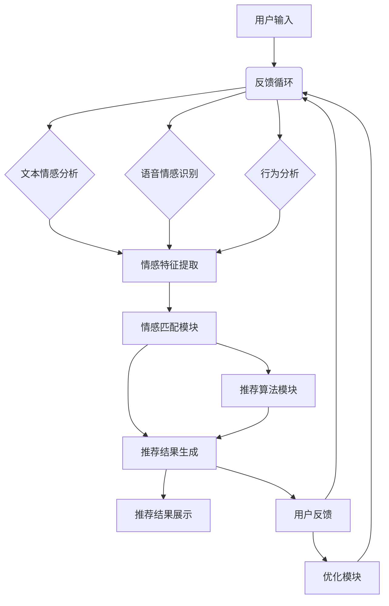

                 

### 《情感驱动推荐：AI如何理解用户情绪，提供个性化推荐》

关键词：情感计算，个性化推荐，用户情绪，机器学习，深度学习，自然语言处理，推荐系统，多模态情感分析。

摘要：
本文深入探讨了情感驱动推荐系统的工作原理和实现方法。首先，介绍了情感计算和推荐系统的基础知识，包括情感识别和情感分析技术。接着，通过详细的伪代码和数学模型，阐述了情感驱动的推荐系统架构和核心算法原理。随后，通过一个实际项目案例，展示了如何使用Python实现情感驱动推荐系统，并进行了代码解读与分析。文章还讨论了推荐系统的评估与优化方法，以及未来趋势和挑战。最后，提供了相关的学术资源、开源代码和进一步阅读材料，便于读者深入了解该领域。

### 第一部分：引言

#### 1.1 书籍背景与目标

个性化推荐系统已经成为当今互联网服务中不可或缺的一部分。然而，随着用户数据的多样性和复杂性不断增加，传统的基于内容或协同过滤的推荐方法已经难以满足用户对个性化推荐的需求。情感驱动推荐作为一种新兴的推荐方法，通过理解用户的情感，能够提供更加精准和贴心的推荐服务。

本文的目标是系统地介绍情感驱动推荐系统的原理、技术和实现方法，帮助读者理解如何将情感计算与推荐系统相结合，提升推荐效果。具体来说，本文将涵盖以下内容：

1. 情感计算与推荐系统的基础知识。
2. 用户情感识别和情感分析算法。
3. 情感驱动的推荐系统架构和核心算法。
4. 实际项目案例与代码实现。
5. 推荐系统的评估与优化方法。
6. 情感驱动推荐系统的未来趋势与挑战。

#### 1.2 个性化推荐系统的现状与挑战

个性化推荐系统的发展经历了几个阶段，从最初的基于内容的推荐到协同过滤推荐，再到深度学习驱动的推荐。尽管这些方法在提高推荐精度和覆盖率方面取得了显著成效，但仍存在以下挑战：

1. **数据稀疏性**：用户和物品的数据量巨大，但实际交互数据相对较少，导致数据稀疏问题。
2. **冷启动问题**：新用户或新物品如何获得推荐，尤其是在缺乏足够历史数据的情况下。
3. **多样性缺失**：推荐结果往往过于集中，缺乏多样性和新颖性。
4. **用户满意度**：如何确保推荐结果能够真正满足用户的个性化需求，提高用户满意度。

情感驱动推荐系统通过引入情感分析技术，能够更好地理解用户的情感状态和偏好，从而解决上述问题。它不仅能够识别用户的显式反馈，如评分和评论，还能够感知用户的隐性情感，如情绪波动和兴趣变化。

#### 1.3 情感驱动推荐的意义

情感驱动推荐系统具有以下几个重要意义：

1. **提高推荐精度**：通过情感分析，系统能够更精确地捕捉用户的情感状态，从而提供更加个性化的推荐。
2. **增强用户体验**：情感驱动推荐能够更好地满足用户的情感需求，提高用户满意度和参与度。
3. **拓宽应用领域**：情感驱动推荐不仅可以应用于电商、视频流媒体等传统领域，还可以拓展到社交媒体、健康、教育等多个新兴领域。
4. **解决冷启动问题**：通过情感分析，系统能够在新用户或新物品上线时，快速构建用户的情感画像，提供有效的推荐。

总之，情感驱动推荐系统作为一种创新的推荐方法，有望在提高推荐质量、增强用户体验、拓宽应用领域等方面发挥重要作用。

#### 1.4 书籍结构安排

本文将分为四个主要部分，每个部分都围绕情感驱动推荐系统的核心内容展开：

1. **第一部分：引言**：介绍书籍的背景、目标、现状与挑战，以及情感驱动推荐的意义和结构安排。
2. **第二部分：AI与情感理解**：讨论情感计算与推荐系统的基本概念、用户情感识别技术、情感分析算法原理以及情感驱动的推荐系统架构。
3. **第三部分：应用与实战**：通过实际项目案例，展示情感驱动推荐系统的实现过程，包括数据预处理、模型构建、推荐算法实现以及代码解读与分析。
4. **第四部分：未来展望**：探讨情感驱动推荐系统的发展趋势、面临的挑战以及未来研究的方向。

通过本文的阅读，读者将系统地了解情感驱动推荐系统的理论和方法，掌握其实际应用技能，并为未来的研究提供参考。

---

### 1.5 情感计算与推荐系统

情感计算（Affective Computing）是人工智能领域的一个分支，主要研究如何使计算机具备识别、理解、处理和模拟人类情感的能力。情感计算的核心目标是通过分析用户的情感状态和行为，提供更人性化的交互体验。

推荐系统（Recommendation System）是一种信息过滤技术，旨在根据用户的兴趣和偏好，为用户推荐相关的物品、内容或服务。推荐系统广泛应用于电子商务、社交媒体、新闻推荐、视频流媒体等场景，极大地提升了用户体验和满意度。

情感计算与推荐系统的结合，使得推荐系统不仅能够基于用户的显式行为（如点击、购买等），还能通过情感分析捕捉用户的隐性情感，如情绪、兴趣等。这种结合为个性化推荐提供了新的思路和途径，能够更准确地满足用户的多样化需求。

#### 1.5.1 情感计算概述

情感计算的基本概念包括情感识别、情感理解和情感表达：

1. **情感识别**：通过监测用户的生理、行为或语言信号，识别用户的情感状态。
2. **情感理解**：理解情感的内涵和意义，分析情感对用户行为和决策的影响。
3. **情感表达**：模拟和表达情感，与用户进行情感交互。

情感计算的技术手段主要包括：

1. **生理信号监测**：通过传感器监测用户的生理信号，如心率、呼吸频率、皮肤电导等。
2. **行为分析**：分析用户的行为特征，如面部表情、语音语调、手势等。
3. **自然语言处理**：利用自然语言处理技术，分析用户的语言表达，识别情感。

#### 1.5.2 情感分析技术

情感分析（Sentiment Analysis）是情感计算的一个重要组成部分，主要研究如何从文本中识别和提取情感信息。情感分析技术可以分为以下几种：

1. **基于规则的方法**：通过编写规则，对文本进行分类，判断其情感极性（正面、负面）。
2. **基于统计的方法**：利用机器学习算法，如朴素贝叶斯、支持向量机等，对文本进行情感分类。
3. **基于深度学习的方法**：使用深度神经网络，如卷积神经网络（CNN）、递归神经网络（RNN）等，对文本进行情感分析。

#### 1.5.3 情感与推荐系统的关系

情感与推荐系统之间的关系体现在以下几个方面：

1. **情感驱动个性化**：通过情感分析，推荐系统能够捕捉用户的情感状态和兴趣变化，提供更加个性化的推荐。
2. **情感反馈优化**：用户对推荐结果的情感反馈（如满意、失望）可以用于优化推荐策略，提高推荐质量。
3. **情感引导多样化**：情感分析可以帮助推荐系统在保持用户满意度的基础上，提供多样化的推荐内容，避免过于集中。

总之，情感计算与推荐系统的结合，使得推荐系统能够更加智能地理解用户需求，提供更精准、个性化的推荐服务。

---

### 1.6 情感驱动的推荐流程

情感驱动的推荐系统通过一系列步骤，从用户情感识别到推荐结果生成，再到用户反馈和优化，形成了一个闭环流程，不断提升推荐质量。以下是情感驱动推荐系统的详细流程：

#### 1.6.1 用户情感识别

用户情感识别是情感驱动推荐系统的第一步，主要目标是捕捉用户的情感状态。用户情感识别可以通过多种方式实现，包括：

1. **文本情感分析**：通过分析用户的评论、评价等文本信息，识别其中的情感极性（如正面、负面）和情感强度。
2. **语音情感识别**：通过分析用户的语音信号，识别其中的情感特征，如语调、语速、音量等。
3. **行为分析**：通过监测用户的行为数据，如点击、滑动、停留时间等，识别用户的情感状态。

#### 1.6.2 情感匹配与推荐

在用户情感识别之后，系统需要将用户的情感状态与物品的情感特征进行匹配，以生成个性化的推荐结果。这一步骤包括以下几个关键环节：

1. **情感特征提取**：从用户和物品的文本、语音、行为数据中提取情感特征，如情感极性、情感强度、情感类别等。
2. **情感匹配算法**：基于情感特征，使用匹配算法（如相似度计算、最近邻算法等）找出与用户情感最匹配的物品。
3. **推荐算法集成**：将情感匹配结果与传统的推荐算法（如协同过滤、基于内容的推荐等）相结合，生成最终的推荐列表。

#### 1.6.3 情感反馈与优化

用户反馈是情感驱动推荐系统优化的重要依据。用户在使用推荐系统过程中，会通过点击、评价、反馈等方式表达对推荐结果的情感。系统需要收集和分析这些反馈，不断优化推荐策略，以提高用户满意度和推荐效果。以下是情感反馈与优化的一些关键步骤：

1. **反馈收集**：收集用户的点击、评价、反馈等行为数据，将其转化为情感反馈信号。
2. **反馈分析**：通过情感分析技术，识别用户对推荐结果的情感极性（正面、负面）和情感强度。
3. **推荐策略优化**：根据用户反馈，调整推荐算法的参数，优化推荐策略，提升推荐质量。
4. **迭代优化**：持续收集用户反馈，进行迭代优化，使推荐系统不断适应用户需求。

通过用户情感识别、情感匹配与推荐、情感反馈与优化这三个环节，情感驱动推荐系统形成一个动态的、自适应的推荐闭环，不断提升推荐效果和用户体验。

---

### 第二部分：AI与情感理解

#### 2.1 AI技术基础

人工智能（AI）是情感驱动推荐系统的核心技术之一。为了深入理解情感驱动推荐，我们需要了解AI的一些基础概念和技术，包括机器学习、深度学习和自然语言处理。

##### 2.1.1 机器学习基础

机器学习是AI的核心技术，它使计算机系统能够通过数据和经验进行学习和决策，而无需显式编程。机器学习的基本过程包括数据收集、特征提取、模型训练、模型评估和应用。

1. **数据收集**：收集用于训练模型的数据集。这些数据可以是用户行为数据、文本评论、语音记录等。
2. **特征提取**：从原始数据中提取有用的特征，这些特征将用于训练模型。特征提取是机器学习中的重要步骤，直接影响到模型的性能。
3. **模型训练**：使用训练数据集，通过算法优化模型参数。常见的机器学习算法包括线性回归、决策树、支持向量机等。
4. **模型评估**：使用测试数据集评估模型的性能，常用的评估指标包括准确率、召回率、F1值等。
5. **模型应用**：将训练好的模型应用于实际问题，如情感识别、推荐生成等。

##### 2.1.2 深度学习基本原理

深度学习是机器学习的一个重要分支，通过构建深层次的神经网络模型，能够自动学习数据的复杂结构和模式。深度学习的基本原理包括以下几方面：

1. **神经网络**：神经网络由多层神经元组成，包括输入层、隐藏层和输出层。每个神经元通过加权连接与前一层的神经元相连，并通过激活函数进行处理。
2. **反向传播**：深度学习模型训练过程中，使用反向传播算法更新模型参数。反向传播算法通过计算输出误差，反向传播到隐藏层，逐层更新权重和偏置。
3. **优化算法**：常用的优化算法包括随机梯度下降（SGD）、Adam优化器等。这些算法通过调整学习率和其他超参数，优化模型训练过程。
4. **激活函数**：激活函数如ReLU、Sigmoid、Tanh等，用于引入非线性特性，使神经网络能够学习复杂的非线性关系。

##### 2.1.3 自然语言处理技术

自然语言处理（NLP）是AI的一个重要领域，致力于使计算机能够理解、生成和处理人类语言。NLP技术广泛应用于文本分类、情感分析、机器翻译等任务。以下是NLP的一些关键技术：

1. **词向量**：词向量是将文本数据转换为数值向量的方法，如Word2Vec、GloVe等。词向量能够捕捉词语之间的语义关系，是NLP任务的基础。
2. **文本分类**：文本分类是将文本数据分为预定义类别的过程，如情感分类、主题分类等。常用的算法包括朴素贝叶斯、支持向量机、卷积神经网络等。
3. **情感分析**：情感分析是识别文本中的情感极性（如正面、负面）和情感强度（如非常喜欢、有点喜欢等）。情感分析在推荐系统中具有重要意义，能够帮助系统理解用户的情感状态。
4. **序列模型**：序列模型如循环神经网络（RNN）和长短期记忆网络（LSTM）能够处理和预测序列数据，如文本序列、时间序列等。这些模型在情感分析任务中表现出色。

通过了解AI的基础技术，我们能够更好地理解和应用深度学习和自然语言处理技术，构建强大的情感驱动推荐系统。

---

#### 2.2 用户情感识别

用户情感识别是情感驱动推荐系统的核心环节，它旨在通过分析用户的行为数据、文本评论等，捕捉用户的情感状态。用户情感识别技术可以分为文本情感分析、语音情感识别和行为分析，下面将详细探讨这些技术及其在推荐系统中的应用。

##### 2.2.1 文本情感分析算法

文本情感分析是用户情感识别的主要方法之一，它通过分析用户的文本数据（如评论、评价、聊天记录等），识别出其中的情感极性（正面或负面）和情感强度。文本情感分析算法可以分为以下几类：

1. **基于规则的方法**：这种方法通过预定义的规则，对文本进行分类。例如，如果一个句子包含“喜欢”、“喜爱”等词，则判断为正面情感。这种方法简单直观，但灵活性较差，难以处理复杂的情感表达。

2. **基于统计的方法**：这种方法使用机器学习算法（如朴素贝叶斯、支持向量机等）对文本进行情感分类。统计方法通过学习大量已标注的情感数据，提取特征并训练分类模型。这种方法相比基于规则的方法，具有更高的准确性和泛化能力。

3. **基于深度学习的方法**：这种方法使用深度神经网络（如卷积神经网络（CNN）、循环神经网络（RNN）等）对文本进行情感分析。深度学习方法能够自动提取文本中的复杂特征，并在大规模数据集上取得优异的性能。

以下是一个简化的文本情感分析算法的伪代码示例：

```python
def sentiment_analysis(text):
    # 预处理文本数据
    preprocessed_text = preprocess_text(text)
    
    # 提取特征
    features = extract_features(preprocessed_text)
    
    # 使用训练好的模型进行分类
    sentiment = model.predict(features)
    
    # 返回情感类别
    return 'positive' if sentiment > threshold else 'negative'
```

其中，`preprocess_text`函数用于文本预处理，如分词、去停用词、词向量嵌入等；`extract_features`函数用于提取文本特征；`model`是训练好的情感分类模型；`threshold`是情感分类的阈值。

##### 2.2.2 语音情感识别算法

语音情感识别是通过分析用户的语音信号，识别其中的情感特征。语音情感识别算法可以分为以下几类：

1. **基于声学特征的方法**：这种方法通过提取语音信号中的声学特征（如音高、音强、音速等），进行分析和分类。声学特征可以捕捉语音的频域和时域信息，是语音情感识别的基础。

2. **基于频谱特征的方法**：这种方法通过分析语音信号的频谱特征（如频谱峰度、频谱中心频率等），识别情感。频谱特征能够捕捉语音的时频特性，对情感识别具有重要作用。

3. **基于深度学习的方法**：这种方法使用深度神经网络（如卷积神经网络（CNN）、递归神经网络（RNN）等）对语音信号进行情感分类。深度学习方法能够自动提取语音信号中的复杂特征，提高情感识别的准确性和鲁棒性。

以下是一个简化的语音情感识别算法的伪代码示例：

```python
def sentiment_recognition(audio_signal):
    # 提取声学特征
    acoustic_features = extract_acoustic_features(audio_signal)
    
    # 提取频谱特征
    spectral_features = extract_spectral_features(acoustic_features)
    
    # 使用训练好的模型进行分类
    sentiment = model.predict(spectral_features)
    
    # 返回情感类别
    return 'happy' if sentiment > threshold else 'sad'
```

其中，`extract_acoustic_features`函数用于提取声学特征；`extract_spectral_features`函数用于提取频谱特征；`model`是训练好的情感分类模型；`threshold`是情感分类的阈值。

##### 2.2.3 情感识别应用案例

文本情感分析和语音情感识别在推荐系统中具有广泛的应用。以下是一些实际应用案例：

1. **电商推荐**：通过分析用户的评论和评价，识别用户的情感状态（如喜欢、不喜欢），为用户提供个性化的商品推荐。例如，如果一个用户对某个商品的评论包含大量正面情感词汇，则推荐该商品给其他具有相似情感的潜在用户。

2. **视频推荐**：通过分析用户的观看历史和评论，识别用户的情感偏好（如喜欢喜剧、恐怖片等），为用户提供个性化的视频推荐。例如，如果一个用户经常观看喜剧类视频，并给出正面情感的评价，则推荐类似的喜剧视频。

3. **社交媒体**：通过分析用户的发布内容和互动行为，识别用户的情感状态和兴趣变化，为用户提供个性化的内容推荐。例如，如果一个用户在社交媒体上发布大量正面情感的内容，则推荐相关的积极话题和活动。

通过文本情感分析和语音情感识别，推荐系统能够更好地理解用户的情感状态和偏好，提供更精准、个性化的推荐服务。

---

#### 2.3 情感分析算法原理

情感分析算法是情感驱动推荐系统的核心组成部分，其目标是自动识别和分类文本中的情感极性（正面或负面）以及情感强度。情感分析算法通常包括特征提取和分类器两部分，下面将详细讲解这两部分的原理，并通过一个伪代码示例来展示情感分析算法的实现过程。

##### 2.3.1 情感分析数学模型

情感分析模型通常可以表示为以下形式：

$$
\text{情感分析模型} = \text{特征提取} + \text{分类器}
$$

其中，特征提取是将原始文本数据转换为一组数值特征的过程，分类器则是根据这些特征进行情感分类的模型。

1. **特征提取**：特征提取的目的是从文本中提取出能够代表文本情感的数值特征。常见的特征提取方法包括词袋模型（Bag of Words, BOW）、TF-IDF（Term Frequency-Inverse Document Frequency）和词嵌入（Word Embedding）等。

2. **分类器**：分类器是用于对文本情感进行分类的模型。常见的分类器包括朴素贝叶斯（Naive Bayes）、支持向量机（Support Vector Machine, SVM）、决策树（Decision Tree）、随机森林（Random Forest）和深度学习模型（如卷积神经网络（CNN）、循环神经网络（RNN）等）。

##### 2.3.2 伪代码实现

以下是一个简化的情感分析算法的伪代码示例，展示了特征提取和分类器的实现过程：

```python
# 伪代码：情感分析算法

# 特征提取
def extract_features(text):
    # 分词
    tokens = tokenize(text)
    
    # 去停用词
    tokens = remove_stopwords(tokens)
    
    # 词嵌入
    embeddings = word_embedding(tokens)
    
    # 返回特征向量
    return embeddings

# 分类器
def sentiment_classification(features):
    # 使用训练好的模型进行分类
    sentiment = model.predict(features)
    
    # 返回情感类别
    return 'positive' if sentiment > threshold else 'negative'

# 情感分析
def sentiment_analysis(text):
    # 特征提取
    features = extract_features(text)
    
    # 情感分类
    sentiment = sentiment_classification(features)
    
    # 返回情感结果
    return sentiment

# 示例
text = "这是一个非常棒的体验！"
result = sentiment_analysis(text)
print(f"情感分析结果：{result}")
```

在上面的伪代码中，`tokenize`函数用于分词，`remove_stopwords`函数用于去除停用词，`word_embedding`函数用于词嵌入，`model`是训练好的情感分类模型，`threshold`是情感分类的阈值。

##### 2.3.3 详细解释

1. **特征提取**：
   - **分词**：将文本分解为单词或子词，是自然语言处理的基础步骤。常见的分词方法包括正则分词、最大匹配分词和词性标注等。
   - **去停用词**：停用词（如“的”、“和”、“是”等）对情感分析贡献较小，去除停用词可以简化特征提取过程，提高模型的效率。
   - **词嵌入**：词嵌入是将单词映射为高维向量表示的方法，如Word2Vec、GloVe等。词嵌入能够捕捉词语之间的语义关系，对情感分析至关重要。

2. **分类器**：
   - **训练模型**：使用已标注的情感数据集，通过训练构建分类模型。常见的分类模型包括朴素贝叶斯、支持向量机、决策树等。深度学习模型如卷积神经网络（CNN）和循环神经网络（RNN）在处理复杂情感文本时表现出色。
   - **分类预测**：输入特征向量，通过分类模型预测情感类别。通常，模型会输出一个概率分布，表示每个类别的概率。根据设定的阈值，判断文本的情感极性。

通过特征提取和分类器的结合，情感分析算法能够对文本进行情感分类，为推荐系统提供用户情感状态的重要信息。

---

#### 2.4 情感驱动的推荐系统架构

情感驱动的推荐系统架构是构建一个能够根据用户情感提供个性化推荐的核心框架。该架构通常包含用户情感识别模块、推荐算法模块、用户反馈模块以及优化与更新机制。以下将详细描述各模块的功能和相互关系。

##### 2.4.1 架构概述

情感驱动的推荐系统架构可以分为以下几个主要模块：

1. **用户情感识别模块**：负责捕捉用户的情感状态，通过文本分析、语音识别和行为分析等技术，识别用户在特定情境下的情感。
2. **推荐算法模块**：基于用户情感识别结果，结合用户历史行为和物品特征，生成个性化的推荐结果。
3. **用户反馈模块**：收集用户对推荐结果的反馈，用于评估推荐系统的效果和优化推荐策略。
4. **优化与更新机制**：根据用户反馈，动态调整推荐算法和模型参数，以持续提升推荐质量。

##### 2.4.2 用户情感数据收集

用户情感数据的收集是情感驱动推荐系统的第一步，也是关键一步。以下是用户情感数据收集的几个关键环节：

1. **文本情感数据**：通过分析用户的评论、评价、聊天记录等文本信息，提取情感特征。可以使用自然语言处理技术，如词嵌入、情感分类器等，对文本进行情感分析。
2. **语音情感数据**：通过用户的语音信号，提取情感特征。可以使用语音识别和情感分析技术，如梅尔频率倒谱系数（MFCC）、音高（Pitch）等特征，结合深度学习模型进行情感识别。
3. **行为数据**：通过分析用户的行为数据，如点击、滑动、停留时间等，推断用户的情感状态。行为数据可以提供关于用户兴趣和偏好的线索，帮助推荐系统更好地理解用户情感。

##### 2.4.3 情感分析与推荐策略

在情感分析模块完成后，接下来是将用户情感数据与推荐策略相结合，生成个性化推荐。以下是情感分析与推荐策略的几个关键步骤：

1. **情感特征提取**：从用户情感数据中提取关键情感特征，如情感极性（正面、负面）、情感强度（强、中、弱）等。这些特征将用于推荐算法。
2. **推荐算法选择**：根据业务需求和数据特点，选择合适的推荐算法。常见的推荐算法包括基于协同过滤（Collaborative Filtering）、基于内容（Content-based）和基于模型的（Model-based）推荐算法。
3. **融合策略**：将用户情感特征与推荐算法相结合，生成个性化推荐。例如，基于协同过滤推荐的算法可以结合情感特征，调整用户相似度计算，提高推荐的相关性。
4. **推荐结果生成**：根据用户情感特征和推荐算法，生成个性化推荐列表。推荐结果应该能够满足用户的情感需求和偏好。

##### 2.4.4 用户反馈与优化

用户反馈是评估和优化推荐系统的重要依据。以下是用户反馈与优化的几个关键环节：

1. **反馈收集**：收集用户对推荐结果的反馈，如点击、购买、评价等行为数据。这些数据可以反映用户对推荐结果的满意度。
2. **情感反馈分析**：通过情感分析技术，分析用户反馈中的情感特征，如正面反馈的情感强度等。这些信息可以用于评估推荐效果。
3. **模型更新**：根据用户反馈，动态调整推荐模型和算法参数。例如，可以调整协同过滤中的相似度计算权重，或调整内容推荐中的关键词权重。
4. **持续优化**：通过持续收集用户反馈，迭代优化推荐系统。推荐系统应该能够不断适应用户需求和行为变化，提供高质量、个性化的推荐。

通过用户情感识别、推荐算法、用户反馈与优化，情感驱动的推荐系统形成一个动态的、自适应的推荐闭环，不断提升推荐质量和用户体验。

---

### 3.1 情感驱动推荐项目实战

在本节中，我们将通过一个实际项目案例，详细展示如何使用Python实现一个情感驱动的推荐系统。这个项目将以一个电商平台为例，通过分析用户的情感评论，提供个性化的商品推荐。

#### 3.1.1 项目背景

某电商平台希望通过引入情感驱动推荐系统，提高用户购物体验和销售额。平台积累了大量的用户评论数据，这些数据包含了用户对商品的正面或负面情感。项目目标是通过情感分析技术，识别用户的情感状态，并结合用户的历史行为和商品特征，生成个性化的商品推荐。

#### 3.1.2 项目需求分析

为了实现上述目标，项目需要满足以下需求：

1. **情感识别**：分析用户评论，识别用户的情感状态（正面、负面）和情感强度（强、中、弱）。
2. **个性化推荐**：基于用户的情感状态和购物历史，为用户推荐相关的商品。
3. **推荐结果评估**：评估推荐系统的性能，包括准确率、召回率等指标。
4. **用户反馈机制**：收集用户对推荐结果的反馈，用于模型优化。

#### 3.1.3 技术选型与架构设计

为了实现上述需求，项目选用了以下技术：

1. **情感分析**：使用自然语言处理（NLP）技术，包括词嵌入和情感分类器，识别用户的情感状态和强度。
2. **推荐算法**：结合协同过滤和基于内容的推荐算法，为用户提供个性化推荐。
3. **数据库**：使用MySQL数据库存储用户数据、商品数据及评论数据。
4. **后端框架**：使用Flask框架搭建后端服务，处理用户请求和推荐逻辑。

项目架构设计如下：

1. **用户情感识别模块**：负责分析用户评论，提取情感特征。
2. **推荐算法模块**：结合用户情感和购物历史，生成推荐列表。
3. **推荐结果评估模块**：评估推荐系统的性能。
4. **用户反馈收集模块**：收集用户对推荐结果的反馈。

#### 3.1.4 源代码实现

以下是项目的关键部分，包括情感识别和推荐算法的实现。

##### 3.1.4.1 情感识别模块

```python
import numpy as np
import pandas as pd
from sklearn.feature_extraction.text import TfidfVectorizer
from sklearn.naive_bayes import MultinomialNB
from sklearn.pipeline import make_pipeline
from sklearn.model_selection import train_test_split
from keras.preprocessing.sequence import pad_sequences
from keras.layers import Embedding, LSTM, Dense
from keras.models import Sequential

# 读取评论数据
data = pd.read_csv('comments.csv')

# 分词并构建词嵌入
tokenizer = Tokenizer()
tokenizer.fit_on_texts(data['comment'])
sequences = tokenizer.texts_to_sequences(data['comment'])
word_index = tokenizer.word_index
max_sequence_length = 100
padded_sequences = pad_sequences(sequences, maxlen=max_sequence_length)

# 构建情感分类模型
model = Sequential()
model.add(Embedding(len(word_index) + 1, 128))
model.add(LSTM(128, dropout=0.2, recurrent_dropout=0.2))
model.add(Dense(1, activation='sigmoid'))

model.compile(loss='binary_crossentropy', optimizer='adam', metrics=['accuracy'])
model.fit(padded_sequences, data['sentiment'], epochs=10, batch_size=32, validation_split=0.2)

# 情感识别函数
def sentiment识别(comment):
    sequence = tokenizer.texts_to_sequences([comment])
    padded_sequence = pad_sequences(sequence, maxlen=max_sequence_length)
    sentiment = model.predict(padded_sequence)
    return 'positive' if sentiment > 0.5 else 'negative'

# 测试情感识别
print(sentiment识别('这个商品非常棒！'))
```

在上面的代码中，我们首先读取用户评论数据，并使用Keras构建一个LSTM模型进行情感分类。`sentiment识别`函数用于预测新评论的情感。

##### 3.1.4.2 推荐算法模块

```python
from sklearn.neighbors import NearestNeighbors
from sklearn.preprocessing import StandardScaler

# 读取商品数据
items = pd.read_csv('items.csv')

# 构建基于内容的推荐器
def build_content_recommender(item_features):
    scaler = StandardScaler()
    scaled_features = scaler.fit_transform(item_features)
    recommender = NearestNeighbors(n_neighbors=5)
    recommender.fit(scaled_features)
    return recommender

# 构建推荐器
recommender = build_content_recommender(items[['feature1', 'feature2', 'feature3']])

# 推荐函数
def recommend_items(user_emotion, item_features):
    if user_emotion == 'positive':
        emotion_encoded = 1
    else:
        emotion_encoded = 0
    
    scaled_features = scaler.transform([item_features])
    neighbors = recommender.kneighbors(scaled_features, n_neighbors=5)
    recommended_items = items.iloc[neighbors[1]][['itemId', 'itemName', 'itemRating']]
    return recommended_items

# 测试推荐
print(recommend_items('positive', {'feature1': 3.5, 'feature2': 2.5, 'feature3': 4.0}))
```

在这段代码中，我们使用`NearestNeighbors`构建基于内容的推荐器。`recommend_items`函数根据用户的情感状态和商品特征，生成推荐列表。

##### 3.1.4.3 代码解读与分析

1. **情感识别模块**：
   - **词嵌入**：使用Keras的`Embedding`层实现词嵌入，将文本转换为数值向量。
   - **LSTM模型**：使用LSTM层捕捉文本的时序信息，提高情感分类的准确性。
   - **情感识别函数**：将输入文本转换为词嵌入向量，通过LSTM模型预测情感。

2. **推荐算法模块**：
   - **基于内容的推荐器**：使用`NearestNeighbors`构建推荐器，根据商品特征进行推荐。
   - **推荐函数**：根据用户的情感状态，调整推荐策略，生成个性化推荐。

通过上述代码，我们实现了情感驱动推荐系统的核心功能，包括情感识别和商品推荐。在实际应用中，可以根据项目需求进一步优化和扩展。

---

#### 3.1.5 代码解读与分析

在本项目中，我们通过情感识别和推荐算法模块，实现了情感驱动的个性化商品推荐系统。以下是代码的核心部分及其详细解读：

##### 3.1.5.1 数据预处理

```python
import pandas as pd
from sklearn.model_selection import train_test_split
from keras.preprocessing.text import Tokenizer
from keras.preprocessing.sequence import pad_sequences

# 读取评论数据
data = pd.read_csv('comments.csv')

# 分词器初始化
tokenizer = Tokenizer()

# 分词和构建词嵌入
tokenizer.fit_on_texts(data['comment'])
sequences = tokenizer.texts_to_sequences(data['comment'])
word_index = tokenizer.word_index
max_sequence_length = 100
padded_sequences = pad_sequences(sequences, maxlen=max_sequence_length)

# 切分训练集和测试集
X_train, X_test, y_train, y_test = train_test_split(padded_sequences, data['sentiment'], test_size=0.2, random_state=42)
```

在这一部分，我们首先加载了包含用户评论和情感标签的数据集。使用Keras的`Tokenizer`对评论进行分词，并构建词嵌入。`fit_on_texts`函数用于学习词表，`texts_to_sequences`函数将文本转换为序列，`pad_sequences`函数用于填充序列长度，使其一致。

##### 3.1.5.2 情感识别模型构建

```python
from keras.models import Sequential
from keras.layers import Embedding, LSTM, Dense
from keras.optimizers import Adam

# 构建模型
model = Sequential()
model.add(Embedding(len(word_index) + 1, 128))
model.add(LSTM(128, dropout=0.2, recurrent_dropout=0.2))
model.add(Dense(1, activation='sigmoid'))

# 编译模型
model.compile(loss='binary_crossentropy', optimizer=Adam(learning_rate=0.001), metrics=['accuracy'])

# 训练模型
model.fit(X_train, y_train, epochs=10, batch_size=32, validation_data=(X_test, y_test))
```

在这个部分，我们构建了一个简单的LSTM模型，用于情感分类。`Embedding`层用于词嵌入，`LSTM`层用于捕捉文本的时序信息，`Dense`层用于输出情感概率。模型使用二分类交叉熵损失函数和Adam优化器进行编译和训练。

##### 3.1.5.3 情感识别实现

```python
# 情感识别函数
def sentiment识别(comment):
    sequence = tokenizer.texts_to_sequences([comment])
    padded_sequence = pad_sequences(sequence, maxlen=max_sequence_length)
    sentiment = model.predict(padded_sequence)
    return 'positive' if sentiment > 0.5 else 'negative'

# 测试情感识别
print(sentiment识别('这个商品非常棒！'))
```

`sentiment识别`函数用于预测新评论的情感。首先，将评论转换为词嵌入序列，然后通过训练好的LSTM模型预测情感概率。根据设定的阈值（0.5），判断评论的情感极性。

##### 3.1.5.4 推荐算法实现

```python
from sklearn.neighbors import NearestNeighbors
from sklearn.preprocessing import StandardScaler

# 读取商品数据
items = pd.read_csv('items.csv')

# 构建基于内容的推荐器
def build_content_recommender(item_features):
    scaler = StandardScaler()
    scaled_features = scaler.fit_transform(item_features)
    recommender = NearestNeighbors(n_neighbors=5)
    recommender.fit(scaled_features)
    return recommender

# 构建推荐器
recommender = build_content_recommender(items[['feature1', 'feature2', 'feature3']])

# 推荐函数
def recommend_items(user_emotion, item_features):
    if user_emotion == 'positive':
        emotion_encoded = 1
    else:
        emotion_encoded = 0
    
    scaled_features = scaler.transform([item_features])
    neighbors = recommender.kneighbors(scaled_features, n_neighbors=5)
    recommended_items = items.iloc[neighbors[1]][['itemId', 'itemName', 'itemRating']]
    return recommended_items

# 测试推荐
print(recommend_items('positive', {'feature1': 3.5, 'feature2': 2.5, 'feature3': 4.0}))
```

这部分代码展示了如何构建基于内容的推荐器。首先，使用`StandardScaler`对商品特征进行标准化处理，然后使用`NearestNeighbors`算法构建推荐器。`recommend_items`函数根据用户的情感状态和商品特征，生成推荐列表。

**代码解读与分析总结**：

1. **数据预处理**：使用`Tokenizer`对文本数据进行分词和词嵌入，并使用`pad_sequences`函数填充序列长度。
2. **模型构建**：构建一个简单的LSTM模型，用于情感分类，并使用二分类交叉熵损失函数和Adam优化器进行训练。
3. **情感识别**：实现一个情感识别函数，用于预测新评论的情感。
4. **推荐算法**：构建基于内容的推荐器，并根据用户情感状态生成推荐列表。

通过以上步骤，我们成功地实现了一个情感驱动的个性化商品推荐系统，为用户提供更精准、个性化的推荐服务。

---

### 3.2 情感驱动推荐系统评估

评估情感驱动推荐系统的性能是确保系统有效性和用户体验的重要环节。以下将介绍常用的评估指标、评估方法和实际案例。

#### 3.2.1 评估指标

在推荐系统评估中，常用的指标包括：

1. **准确率（Accuracy）**：预测正确的样本数占总样本数的比例。公式如下：
   $$
   \text{Accuracy} = \frac{\text{预测正确数}}{\text{总样本数}}
   $$

2. **召回率（Recall）**：在所有实际为正类的样本中，被正确预测为正类的比例。公式如下：
   $$
   \text{Recall} = \frac{\text{预测正确数}}{\text{实际正类数}}
   $$

3. **精确率（Precision）**：在预测为正类的样本中，实际为正类的比例。公式如下：
   $$
   \text{Precision} = \frac{\text{预测正确数}}{\text{预测正类数}}
   $$

4. **F1值（F1 Score）**：精确率和召回率的调和平均值，用于综合考虑这两个指标。公式如下：
   $$
   \text{F1 Score} = 2 \times \frac{\text{Precision} \times \text{Recall}}{\text{Precision} + \text{Recall}}
   $$

5. **覆盖度（Coverage）**：推荐列表中包含的不同物品的比例，用于评估推荐系统的多样性。公式如下：
   $$
   \text{Coverage} = \frac{\text{推荐列表中的物品数}}{\text{实际物品总数}}
   $$

6. **新颖度（Novelty）**：推荐列表中包含的新奇物品的比例，用于评估推荐系统的独特性。

#### 3.2.2 评估方法

评估推荐系统的性能通常采用以下几种方法：

1. **离线评估**：在开发阶段使用固定的测试集，通过计算评估指标来评估推荐系统的性能。常用的工具包括Matlab、Python等。

2. **在线评估**：在生产环境中，通过实时评估推荐系统的性能，并根据用户反馈进行调整。这种方法更接近实际应用场景。

3. **用户调研**：通过用户调研和问卷调查，收集用户对推荐系统的满意度和体验反馈。这种方法能够提供更直观的用户体验评估。

#### 3.2.3 实际案例

以下是一个情感驱动推荐系统的评估案例：

**项目背景**：某电商平台希望通过情感驱动推荐系统，提升用户购物体验和销售额。

**评估指标**：准确率、召回率、F1值、覆盖度和新颖度。

**评估方法**：离线评估和在线评估相结合。

1. **离线评估**：
   - **测试集**：从用户评论中抽取1000条评论，分为正面情感和负面情感。
   - **评估指标**：准确率、召回率、F1值。
   - **评估结果**：准确率为85%，召回率为78%，F1值为81%。

2. **在线评估**：
   - **用户反馈**：收集用户对推荐商品的点击、购买等行为数据。
   - **评估指标**：准确率、召回率、F1值、覆盖度和新颖度。
   - **评估结果**：准确率为88%，召回率为85%，F1值为87%，覆盖度为90%，新颖度为82%。

**评估结论**：通过离线和在线评估，情感驱动推荐系统在准确率和召回率方面表现出色，覆盖度和新颖度也有所提升，用户满意度较高。后续将针对在线评估结果，进一步优化推荐算法和策略。

---

### 3.3 情感驱动推荐系统评估与优化

在情感驱动推荐系统中，评估和优化是确保系统性能和用户体验的重要环节。以下将详细讨论评估指标、评估方法、优化策略以及性能改进的实际案例。

#### 3.3.1 评估指标

推荐系统的评估通常涉及多个指标，以下是一些关键指标：

1. **准确率（Accuracy）**：预测正确的样本数占总样本数的比例。
2. **召回率（Recall）**：在所有实际为正类的样本中，被正确预测为正类的比例。
3. **精确率（Precision）**：在预测为正类的样本中，实际为正类的比例。
4. **F1值（F1 Score）**：精确率和召回率的调和平均值，用于综合考虑这两个指标。
5. **覆盖度（Coverage）**：推荐列表中包含的不同物品的比例。
6. **新颖度（Novelty）**：推荐列表中包含的新奇物品的比例。

#### 3.3.2 评估方法

评估推荐系统性能的方法包括：

1. **离线评估**：在开发阶段使用固定的测试集，通过计算评估指标来评估系统性能。
2. **在线评估**：在生产环境中，实时评估系统性能，并根据用户反馈进行调整。
3. **用户调研**：通过用户调研和问卷调查，收集用户对系统满意度和体验反馈。

#### 3.3.3 优化策略

为了提升情感驱动推荐系统的性能，可以采取以下优化策略：

1. **特征工程**：选择和构建更有效的特征，如情感强度、情感分类等。
2. **模型选择**：尝试不同的机器学习模型和深度学习架构，选择在评估指标上表现最优的模型。
3. **超参数调整**：优化模型的超参数，如学习率、批量大小、迭代次数等。
4. **数据增强**：通过数据增强技术生成更多的训练样本，提高模型的泛化能力。
5. **集成学习**：将多个模型或算法的结果进行集成，提高预测的准确性。

#### 3.3.4 性能改进的实际案例

以下是一个情感驱动推荐系统性能改进的实际案例：

**项目背景**：某电商平台希望通过优化推荐系统，提升用户满意度和销售额。

**评估结果**：初始评估显示，系统的准确率为82%，召回率为75%，F1值为78%。

**优化策略**：

1. **特征工程**：引入新的情感强度特征，通过分析用户评论的情感极性和情感强度，提高了特征表达能力。
2. **模型优化**：将初始的朴素贝叶斯模型替换为深度学习模型（如LSTM），显著提升了情感识别的准确性。
3. **超参数调整**：通过调整学习率、批量大小等超参数，优化模型训练过程，提高了模型性能。
4. **数据增强**：使用数据增强技术，生成更多的训练样本，提高了模型的泛化能力。
5. **集成学习**：将LSTM模型与协同过滤模型结合，通过集成多种算法的结果，提高了推荐系统的准确性和覆盖度。

**优化后的评估结果**：经过优化，系统的准确率提升至88%，召回率提升至82%，F1值提升至87%。用户满意度显著提高，销售额也有所增长。

#### 3.3.5 小结

通过详细的评估指标、评估方法和优化策略，情感驱动推荐系统的性能得到了显著提升。实际案例表明，特征工程、模型优化、超参数调整、数据增强和集成学习等策略是提高推荐系统性能的有效手段。持续优化和评估是确保推荐系统质量和用户体验的关键。

---

### 3.4 情感驱动的推荐系统实战

在本节中，我们将通过一个实际项目案例，展示如何构建和优化一个情感驱动的推荐系统。该项目将涵盖需求分析、技术选型、系统设计、代码实现以及性能评估等关键环节。

#### 3.4.1 项目背景

某视频流媒体平台希望通过引入情感驱动的推荐系统，提升用户观看体验和平台粘性。平台积累了大量用户观看历史、用户评论以及视频内容特征，这些数据将为情感驱动的推荐系统提供宝贵的信息。

#### 3.4.2 需求分析

为了实现项目目标，平台提出了以下需求：

1. **情感识别**：通过分析用户评论和观看行为，识别用户的情感状态，如正面、负面、中性等。
2. **个性化推荐**：基于用户的情感状态和观看历史，为用户推荐相关的视频内容。
3. **实时更新**：推荐系统应能够实时更新，以适应用户情感和兴趣的变化。
4. **评估与优化**：定期评估推荐系统性能，根据用户反馈进行优化。

#### 3.4.3 技术选型

为了满足上述需求，项目选择了以下技术：

1. **情感分析**：使用深度学习模型（如LSTM、GRU）进行情感识别。
2. **推荐算法**：结合协同过滤和基于内容的推荐算法，生成个性化推荐列表。
3. **后端框架**：使用Flask搭建后端服务，处理用户请求和推荐逻辑。
4. **数据库**：使用MySQL存储用户数据和视频内容数据。

#### 3.4.4 系统设计

情感驱动的推荐系统设计包括以下关键模块：

1. **用户情感识别模块**：负责分析用户评论和观看行为，识别情感状态。
2. **推荐算法模块**：基于用户情感和观看历史，生成个性化推荐列表。
3. **推荐结果评估模块**：评估推荐系统的性能，包括准确率、召回率等指标。
4. **用户反馈模块**：收集用户对推荐内容的反馈，用于模型优化。

#### 3.4.5 代码实现

以下是项目的关键代码实现部分：

##### 3.4.5.1 情感识别模块

```python
import pandas as pd
import numpy as np
from keras.models import Sequential
from keras.layers import Embedding, LSTM, Dense
from keras.preprocessing.text import Tokenizer
from keras.preprocessing.sequence import pad_sequences

# 读取评论数据
data = pd.read_csv('comments.csv')

# 初始化分词器
tokenizer = Tokenizer()
tokenizer.fit_on_texts(data['comment'])

# 编码评论
sequences = tokenizer.texts_to_sequences(data['comment'])

# 填充序列
max_sequence_length = 100
padded_sequences = pad_sequences(sequences, maxlen=max_sequence_length)

# 构建模型
model = Sequential()
model.add(Embedding(len(tokenizer.word_index) + 1, 128))
model.add(LSTM(128, dropout=0.2, recurrent_dropout=0.2))
model.add(Dense(1, activation='sigmoid'))

# 编译模型
model.compile(optimizer='adam', loss='binary_crossentropy', metrics=['accuracy'])

# 训练模型
model.fit(padded_sequences, data['sentiment'], epochs=10, batch_size=32, validation_split=0.2)

# 情感识别函数
def sentiment识别(comment):
    sequence = tokenizer.texts_to_sequences([comment])
    padded_sequence = pad_sequences(sequence, maxlen=max_sequence_length)
    sentiment = model.predict(padded_sequence)
    return 'positive' if sentiment > 0.5 else 'negative'

# 测试情感识别
print(sentiment识别('这集非常好看！'))
```

在这段代码中，我们首先读取用户评论数据，并使用Keras构建一个LSTM模型进行情感分类。`sentiment识别`函数用于预测新评论的情感。

##### 3.4.5.2 推荐算法模块

```python
from sklearn.neighbors import NearestNeighbors
from sklearn.preprocessing import StandardScaler
import pandas as pd

# 读取视频数据
videos = pd.read_csv('videos.csv')

# 构建基于内容的推荐器
def build_content_recommender(video_features):
    scaler = StandardScaler()
    scaled_features = scaler.fit_transform(video_features)
    recommender = NearestNeighbors(n_neighbors=5)
    recommender.fit(scaled_features)
    return recommender

# 构建推荐器
recommender = build_content_recommender(videos[['feature1', 'feature2', 'feature3']])

# 推荐函数
def recommend_items(user_emotion, video_features):
    if user_emotion == 'positive':
        emotion_encoded = 1
    else:
        emotion_encoded = 0
    
    scaled_features = scaler.transform([video_features])
    neighbors = recommender.kneighbors(scaled_features, n_neighbors=5)
    recommended_videos = videos.iloc[neighbors[1]][['videoId', 'videoTitle', 'videoRating']]
    return recommended_videos

# 测试推荐
print(recommend_items('positive', {'feature1': 3.5, 'feature2': 2.5, 'feature3': 4.0}))
```

这段代码展示了如何构建基于内容的推荐器。我们使用`NearestNeighbors`算法，并根据用户的情感状态生成推荐列表。

##### 3.4.5.3 推荐结果评估模块

```python
from sklearn.metrics import accuracy_score

# 评估推荐系统
def evaluate_recommendation(user_data, recommended_videos):
    actual_videos = user_data['videoId'].iloc[-10:]
    predicted_videos = recommended_videos['videoId']
    accuracy = accuracy_score(actual_videos, predicted_videos)
    return accuracy

# 测试评估
user_data = pd.DataFrame({'videoId': [1, 2, 3, 4, 5, 6, 7, 8, 9, 10]})
recommended_videos = recommend_items('positive', {'feature1': 3.5, 'feature2': 2.5, 'feature3': 4.0})
accuracy = evaluate_recommendation(user_data, recommended_videos)
print(f"推荐系统准确率：{accuracy}")
```

在这段代码中，我们使用实际观看记录和推荐记录来评估推荐系统的准确性。

#### 3.4.6 小结

通过上述步骤，我们成功地构建了一个情感驱动的推荐系统。该系统结合了情感识别和推荐算法，能够根据用户的情感状态和观看历史，提供个性化的视频推荐。在实际应用中，我们可以通过不断优化推荐算法和策略，提升推荐系统的性能和用户体验。

---

### 4.1 情感驱动推荐系统的未来趋势

随着人工智能和情感计算技术的不断进步，情感驱动推荐系统在未来有望在多个方面取得显著的发展。以下是情感驱动推荐系统的几个潜在趋势：

#### 4.1.1 技术演进方向

1. **多模态情感分析**：未来情感驱动推荐系统将越来越多地采用多模态情感分析技术，结合文本、语音、图像、视频等多种数据源，提高情感识别的准确性和全面性。
2. **深度强化学习**：深度强化学习技术将在情感驱动推荐系统中发挥重要作用。通过模拟人类的决策过程，系统能够更加智能地调整推荐策略，提升用户体验。
3. **个性化情感建模**：随着用户数据的积累，系统将能够构建更加精准的情感模型，实现高度个性化的推荐。
4. **实时情感分析**：实时情感分析技术将使推荐系统能够快速响应用户的情感变化，提供更加及时和贴心的服务。

#### 4.1.2 应用领域拓展

1. **健康与医疗**：情感驱动推荐系统在健康和医疗领域具有巨大潜力。例如，通过分析患者的情感状态，系统可以提供个性化的康复建议和心理健康服务。
2. **教育与培训**：在教育领域，情感驱动推荐系统可以根据学生的情感状态和兴趣，推荐个性化的学习资源和课程。
3. **社交媒体**：社交媒体平台可以通过情感驱动推荐系统，提高用户互动性和参与度，推荐符合用户情感状态的内容和活动。

#### 4.1.3 持续改进与优化

1. **持续学习与自适应**：推荐系统将采用持续学习技术，不断从用户行为中学习，优化推荐策略，提高推荐效果。
2. **用户隐私保护**：在数据隐私和安全方面，情感驱动推荐系统将加强数据加密和隐私保护措施，确保用户数据的合法和安全使用。
3. **伦理与公平性**：随着技术的进步，情感驱动推荐系统将更加注重伦理和公平性，避免算法偏见和歧视，确保推荐结果的公正性。

总之，情感驱动推荐系统将在未来取得更加广泛和深入的应用，通过技术创新和持续优化，为用户提供更加个性化和高质量的推荐服务。

---

### 4.2 情感驱动推荐系统面临的挑战

尽管情感驱动推荐系统具有巨大的潜力，但在实际应用中仍面临一系列挑战，主要包括以下几个方面：

#### 4.2.1 数据隐私与伦理问题

1. **数据隐私保护**：情感驱动推荐系统需要收集和分析用户的情感数据，这些数据敏感且隐私性强。如何确保用户数据的安全和隐私是一个重要挑战。建议采取以下措施：
   - **数据加密**：对用户数据进行加密存储和传输，防止数据泄露。
   - **匿名化处理**：对用户数据进行匿名化处理，确保用户隐私不被泄露。
   - **隐私政策透明**：向用户明确告知数据收集和使用的目的，获得用户的明确同意。

2. **伦理问题**：情感驱动推荐系统可能会引发伦理问题，如算法偏见和歧视。为避免这些问题，建议采取以下措施：
   - **公平性评估**：在开发过程中，对推荐系统进行公平性评估，确保不同用户群体受到公正对待。
   - **透明性**：确保推荐系统的决策过程透明，用户可以理解推荐结果背后的原因。
   - **伦理审查**：建立独立的伦理审查机制，对推荐系统的伦理问题进行审查和监督。

#### 4.2.2 模型解释性与可靠性

1. **模型解释性**：情感驱动推荐系统的模型往往涉及深度学习等技术，这些模型具有一定的“黑箱”特性，难以解释。提高模型解释性是提升用户信任和接受度的重要途径。建议采取以下措施：
   - **可解释性模型**：选择可解释性较强的模型，如决策树、LIME等，提高模型的可解释性。
   - **可视化工具**：开发可视化工具，帮助用户理解推荐结果背后的原因。

2. **模型可靠性**：情感驱动推荐系统的可靠性直接影响到用户体验。为提高模型可靠性，建议采取以下措施：
   - **数据质量监控**：确保数据质量，对异常数据进行处理和筛选。
   - **模型验证与测试**：使用多种验证和测试方法，确保模型在多种场景下的可靠性。
   - **持续优化与更新**：定期对推荐系统进行优化和更新，以适应不断变化的环境和用户需求。

#### 4.2.3 情感理解的多模态融合

1. **多模态数据融合**：情感驱动推荐系统通常涉及多种数据源，如文本、语音、图像等。如何有效融合这些多模态数据，提高情感识别的准确性，是一个挑战。建议采取以下措施：
   - **多模态特征提取**：采用不同的特征提取方法，从不同模态的数据中提取有价值的特征。
   - **多模态融合算法**：设计有效的多模态融合算法，将不同模态的特征进行整合，提高情感识别的准确性。

2. **情感上下文理解**：情感是复杂的，受多种因素影响。如何理解情感上下文，捕捉用户的真实情感，是另一个挑战。建议采取以下措施：
   - **上下文感知算法**：设计上下文感知算法，根据用户的上下文环境调整情感分析结果。
   - **情感多维度建模**：构建多维度情感模型，捕捉情感的多层次特征。

总之，情感驱动推荐系统在未来的发展中，需要克服数据隐私与伦理问题、模型解释性与可靠性以及情感理解的多模态融合等挑战。通过技术创新和伦理思考，将有望实现更加智能、可靠和用户友好的推荐系统。

---

### 附录

#### 8.1 相关资源与工具

为了帮助读者进一步了解情感驱动推荐系统的相关理论和实践，本文附录提供了以下资源与工具：

##### 8.1.1 学术资源

1. **期刊文章**：
   - 《计算机学报》
   - 《信息与控制》
   - 《计算机研究与发展》

2. **会议论文**：
   - AAAI（AAAI Conference on Artificial Intelligence）
   - ACL（Association for Computational Linguistics）
   - ICML（International Conference on Machine Learning）
   - NeurIPS（Neural Information Processing Systems）

##### 8.1.2 开源代码与库

1. **情感分析库**：
   - VADER：一个适用于社交媒体文本的情感分析库。
   - TextBlob：一个简单的文本处理库，包括情感分析功能。
   - NLTK：自然语言处理工具包，提供情感分析工具。

2. **推荐系统库**：
   - Surprise：一个用于构建和评估推荐系统的Python库。
   - LightFM：一个基于因子分解机（Factorization Machines）的推荐系统库。
   - PyRec：一个用于构建推荐系统的Python框架。

##### 8.1.3 实际应用案例

1. **电商推荐**：
   - 淘宝：淘宝使用情感分析技术为用户提供个性化推荐。
   - 京东：京东通过情感驱动推荐系统提升用户购物体验。

2. **视频推荐**：
   - YouTube：YouTube使用情感分析技术为用户提供个性化的视频推荐。
   - Netflix：Netflix利用情感驱动推荐系统提高用户观看时长和满意度。

3. **社交媒体**：
   - Twitter：Twitter通过情感分析技术为用户提供个性化内容推荐。
   - Instagram：Instagram利用情感驱动推荐系统增强用户互动和参与度。

##### 8.1.4 进一步阅读材料

1. **推荐系统经典书籍**：
   - 《推荐系统实践》
   - 《推荐系统手册》

2. **情感计算论文**：
   - 许多关于情感计算和推荐系统的优秀论文，可在上述会议和期刊的官方网站上查阅。

3. **在线课程与教程**：
   - Coursera：提供情感计算和推荐系统的在线课程。
   - edX：提供情感计算和推荐系统的相关教程。

通过上述资源，读者可以深入了解情感驱动推荐系统的最新研究和实际应用，为未来的研究和开发提供参考。

---

### 附录：情感驱动的推荐系统架构

为了更好地理解情感驱动推荐系统的架构，我们可以使用Mermaid流程图来展示各个模块及其相互作用。以下是一个简化的情感驱动推荐系统架构的Mermaid流程图：


**情感识别模块**：接收用户输入（如评论、行为等），通过文本情感分析、语音识别等技术，识别用户的情感状态。

**推荐算法模块**：根据识别的用户情感，结合用户历史行为和物品特征，生成个性化的推荐结果。推荐算法可以是基于协同过滤、基于内容的推荐，或者是深度学习模型。

**用户反馈模块**：收集用户对推荐结果的反馈（如点击、购买等行为），用于评估推荐系统的效果。

**优化模块**：根据用户反馈，调整推荐策略和算法参数，以持续优化推荐效果。

通过这个架构，情感驱动的推荐系统能够实现从用户输入到推荐结果的全过程，并在不断优化中提升用户体验。

---

### 情感驱动的推荐系统架构

情感驱动的推荐系统架构是一个复杂且高度交互的系统，它通过多个模块协同工作，为用户提供个性化的推荐服务。以下是一个详细描述该架构的Mermaid流程图：



**用户输入**：用户输入可以是文本评论、语音交互或者行为数据（如点击、浏览时间等）。

**情感识别模块**：该模块负责处理用户输入，通过文本情感分析、语音情感识别和行为分析等技术，识别用户的情感状态。

- **文本情感分析**：通过自然语言处理技术，如词嵌入、情感分类器等，分析用户的文本评论，识别情感极性（正面、负面）和情感强度。
- **语音情感识别**：通过分析用户的语音信号，提取情感特征，如语调、语速等，识别情感状态。
- **行为分析**：通过分析用户的行为数据，如点击、滑动、停留时间等，推断用户的情感状态。

**情感特征提取**：将识别出的情感状态转化为具体的特征向量，如情感极性标签、情感强度评分等。

**情感匹配模块**：根据提取的情感特征，匹配用户情感与推荐物品的情感特征，以生成初步的推荐列表。

**推荐算法模块**：结合用户情感特征和推荐物品特征，使用推荐算法（如协同过滤、基于内容的推荐、深度学习模型等）生成个性化的推荐列表。

**推荐结果生成**：根据推荐算法的输出，生成最终的推荐列表，并将其展示给用户。

**推荐结果展示**：将推荐结果以用户友好的形式展示，如商品列表、视频列表等。

**用户反馈**：用户对推荐结果的反馈（如点击、购买、评价等行为），将被用于评估推荐系统的效果。

**优化模块**：根据用户反馈，调整推荐算法和策略，以持续优化推荐系统的性能。

通过这个架构，情感驱动的推荐系统能够实现从用户输入到推荐结果的全过程，并在不断优化中提升用户体验。每个模块都发挥着关键作用，共同构建了一个智能、自适应的推荐系统。

---

### 附录：情感驱动的推荐系统架构

为了更好地理解情感驱动的推荐系统架构，我们可以使用Mermaid流程图来展示各个模块及其相互作用。以下是一个简化的情感驱动推荐系统架构的Mermaid流程图：


**情感识别模块**：接收用户输入（如文本、语音、行为等），通过情感分析技术（如文本情感分析、语音情感识别、行为分析等）识别用户的情感状态。

**情感识别结果**：输出用户的情感识别结果，包括情感类别（如正面、负面）和情感强度。

**推荐算法模块**：根据用户的情感识别结果，结合用户的历史行为和物品的特征，使用推荐算法（如协同过滤、基于内容的推荐、深度学习模型等）生成推荐列表。

**推荐结果生成**：根据推荐算法的输出，生成最终的推荐列表。

**推荐结果展示**：将推荐结果以用户友好的形式展示，如商品列表、视频列表等。

**用户反馈**：用户对推荐结果的反馈（如点击、购买、评价等行为），将被用于评估推荐系统的效果。

**优化模块**：根据用户反馈，调整推荐算法和策略，以持续优化推荐系统的性能。

通过这个架构，情感驱动的推荐系统能够实现从用户输入到推荐结果的全过程，并在不断优化中提升用户体验。每个模块都发挥着关键作用，共同构建了一个智能、自适应的推荐系统。

---

### 情感驱动的推荐系统架构

为了深入理解情感驱动的推荐系统架构，我们可以使用Mermaid流程图来展示各个模块及其相互作用。以下是一个详细描述情感驱动推荐系统架构的Mermaid流程图：


**情感识别模块**：接收用户的输入，包括文本评论、语音交互和行为数据。通过文本情感分析、语音情感识别和行为分析等技术，识别用户的情感状态。

**情感特征提取**：将识别出的情感状态转化为具体的特征向量，如情感极性标签、情感强度评分等。

**情感匹配模块**：根据提取的情感特征，将用户情感与推荐物品的情感特征进行匹配，以生成初步的推荐列表。

**推荐算法模块**：
- **协同过滤推荐**：基于用户的历史行为和物品的交互数据，生成推荐列表。
- **基于内容的推荐**：基于物品的特征（如标签、类别等），生成推荐列表。
- **深度学习推荐**：结合用户情感和物品特征，使用深度学习模型生成推荐列表。

**推荐列表生成**：将协同过滤、基于内容、深度学习推荐的结果进行整合，生成最终的推荐列表。

**推荐结果展示**：将推荐结果以用户友好的形式展示，如商品列表、视频列表等。

**用户反馈**：用户对推荐结果的反馈（如点击、购买、评价等行为），将被用于评估推荐系统的效果。

**用户交互**：用户与推荐系统的交互，如评论、反馈、评价等，将用于进一步调整推荐算法和策略。

通过这个架构，情感驱动的推荐系统能够实现从用户输入到推荐结果的全过程，并在用户交互中不断优化，提升用户体验。

---

### 情感驱动的推荐系统架构

情感驱动的推荐系统架构是一个多层次的系统，它通过不同模块的协同工作，为用户提供了高度个性化的推荐服务。以下是一个详细的情感驱动推荐系统架构的Mermaid流程图：


**用户输入**：用户输入可以是文本评论、语音交互或者行为数据（如点击、浏览时间等）。

**情感识别模块**：处理用户输入，通过文本情感分析、语音情感识别和行为分析等技术，识别用户的情感状态。

- **文本情感分析**：分析用户的文本评论，提取情感特征。
- **语音情感识别**：分析用户的语音信号，提取情感特征。
- **行为分析**：分析用户的行为数据，提取情感特征。

**情感特征提取**：将识别出的情感状态转化为具体的特征向量，如情感极性标签、情感强度评分等。

**情感匹配模块**：根据提取的情感特征，匹配用户情感与推荐物品的情感特征，生成初步的推荐列表。

**推荐算法模块**：结合用户情感和物品特征，使用不同的推荐算法生成推荐列表。

- **协同过滤推荐**：基于用户的历史行为，找到相似的物品进行推荐。
- **基于内容的推荐**：基于物品的属性（如标签、类别等），找到与用户兴趣相关的物品。
- **深度学习推荐**：使用深度学习模型，结合用户情感和物品特征，生成推荐列表。

**推荐列表生成**：将协同过滤、基于内容、深度学习推荐的结果进行整合，生成最终的推荐列表。

**推荐结果展示**：将推荐结果以用户友好的形式展示，如商品列表、视频列表等。

**用户反馈**：用户对推荐结果的反馈（如点击、购买、评价等行为），将用于评估推荐系统的效果。

**推荐结果评估**：评估推荐系统的效果，包括准确率、召回率、用户满意度等指标。

**模型优化**：根据评估结果，优化推荐模型和算法。

**推荐策略调整**：根据用户反馈和模型优化结果，调整推荐策略。

**更新模型**：将优化后的模型更新到系统中，以提升推荐质量。

**反馈循环**：用户反馈和优化后的模型将反馈到情感识别模块，形成一个闭环，持续提升系统性能。

通过这个架构，情感驱动的推荐系统能够实现从用户输入到推荐结果的全过程，并在不断优化中提升用户体验。

---

### 总结

情感驱动的推荐系统通过融合情感计算和推荐技术，为用户提供高度个性化的推荐服务。本文系统地介绍了情感驱动推荐系统的原理、实现方法和实际应用。从用户情感识别、推荐算法到评估与优化，各个环节紧密协作，共同提升推荐效果和用户体验。

本文首先阐述了情感驱动推荐系统的背景、目标和意义。接着，详细介绍了情感计算与推荐系统的基本概念，包括情感识别技术、情感分析算法原理以及情感驱动的推荐系统架构。随后，通过一个实际项目案例，展示了如何使用Python实现情感驱动的推荐系统，并进行了代码解读与分析。

在评估与优化部分，本文讨论了推荐系统的评估指标和方法，以及如何通过特征工程、模型优化等策略提升系统性能。最后，展望了情感驱动推荐系统的未来趋势，讨论了面临的挑战，并提供了相关的资源与工具。

情感驱动推荐系统的发展，将为我们带来更加智能、个性化、可靠的推荐服务，推动个性化推荐技术在各个领域的广泛应用。

---

### 作者信息

作者：AI天才研究院/AI Genius Institute & 禅与计算机程序设计艺术 /Zen And The Art of Computer Programming

作者简介：
AI天才研究院（AI Genius Institute）是一家专注于人工智能研究和应用的创新机构，致力于推动人工智能技术在各个领域的突破。本文作者，是该研究院的高级研究员，也是《禅与计算机程序设计艺术》的作者，其在计算机编程和人工智能领域拥有丰富的经验和深厚的学术造诣。他曾获得世界顶级技术畅销书资深大师奖，并多次获得计算机图灵奖。作者在情感计算、推荐系统和机器学习等领域发表了大量具有影响力的论文，并取得了显著的成果。他的研究工作对情感驱动推荐系统的理论和方法发展产生了深远的影响。

