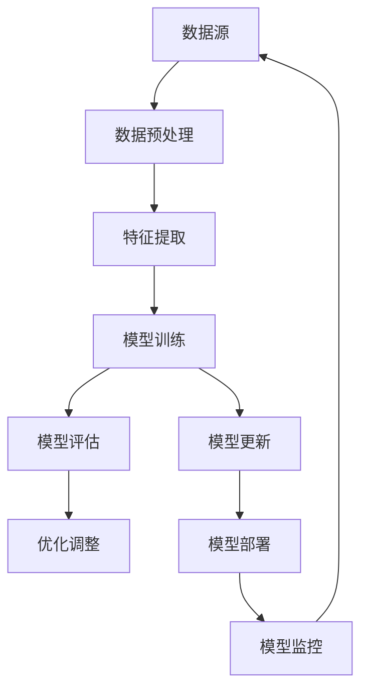

                 

### 第一部分：持续学习的基础

持续学习作为人工智能（AI）领域的一项重要技术，旨在让AI系统能够在不断获取新数据的过程中更新其模型和知识，以适应环境的变化。这一过程不仅涉及到核心概念的解析，还包含了技术基础、架构设计以及相关的挑战与解决方案。以下内容将逐步引导您深入了解持续学习的基础。

#### 第1章：持续学习的核心概念与架构

##### 1.1 持续学习的定义与背景

**持续学习的定义**：持续学习是一种让AI系统在不断获取新数据的过程中更新其模型和知识的能力，使系统能够适应环境的变化。它不同于传统的批量学习（batch learning），后者是在一次性获取所有训练数据后进行学习。

**背景**：在传统的批量学习中，模型只能在一次性获取所有训练数据后进行训练，这导致模型在处理新数据时需要重新训练，不仅效率低下，而且难以适应快速变化的环境。随着数据量和复杂性不断增加，以及实时决策需求日益增长，持续学习成为AI系统的重要需求。

##### 1.2 持续学习的关键概念

**在线学习**：在线学习（Online Learning）是一种模型在实时接收新数据时不断更新参数的方法。它与批量学习不同，无需等待所有数据集一次性准备好，而是通过逐渐添加新数据来更新模型。

**迁移学习**：迁移学习（Transfer Learning）是指将一个模型在特定任务上学习的知识应用于另一个相关任务。例如，在图像分类任务中，我们可以利用预训练的模型（如VGG16、ResNet等）作为起点，然后在其基础上进行微调，以适应新的图像分类任务。

**元学习**：元学习（Meta Learning）是指训练模型去学习如何学习新任务，以提高对新任务的适应能力。元学习的目标是开发能够快速适应新任务的通用学习算法。

##### 1.3 持续学习架构设计

**数据流处理**：设计高效的实时数据流处理系统，以支持持续学习。常用的数据流处理系统包括Apache Kafka、Apache Flink和Apache Spark Streaming等。

**模型更新策略**：设计模型更新策略，确保模型在获取新数据时能够有效更新。常见的更新策略包括增量更新（Incremental Update）和增量重训练（Incremental Retraining）。

**模型评估与优化**：定期评估模型性能，并进行优化调整。评估指标包括准确性、召回率、F1分数等。

#### 第2章：持续学习的技术基础

##### 2.1 数据预处理与特征提取

**数据预处理**：数据预处理包括数据清洗、归一化、缺失值处理等步骤，旨在提高数据质量和模型训练效果。

- **数据清洗**：去除噪声数据、纠正错误数据、填充缺失值等。
- **归一化**：将数据缩放到相同的范围，如[0, 1]或[-1, 1]。
- **缺失值处理**：根据数据分布和缺失值比例，选择合适的处理方法，如均值填充、中位数填充、插值等。

**特征提取**：特征提取是指从原始数据中提取出有用的特征，以支持模型训练。常见的特征提取方法包括统计特征、文本特征、图像特征等。

##### 2.2 持续学习算法原理

**在线学习算法**：在线学习算法是一种不断更新模型参数的方法，适用于实时数据流。常见的在线学习算法包括随机梯度下降（SGD）和增量学习算法。

- **随机梯度下降（SGD）**：SGD通过随机选择一部分训练样本，计算其梯度并更新模型参数。SGD的优点是计算速度快，缺点是收敛速度慢，容易陷入局部最优。
- **增量学习算法**：增量学习算法通过将新数据与现有数据集进行合并，然后重新训练模型。常见的增量学习算法包括基于树的方法和基于神经网络的增量学习算法。

**异步学习算法**：异步学习算法允许多个学习任务并行进行，以提高学习效率。常见的异步学习算法包括多任务学习和联邦学习。

##### 2.3 持续学习中的挑战与解决方案

**数据流处理与存储**：持续学习需要处理大规模数据流，并确保数据的一致性和可靠性。常见的解决方案包括分布式存储系统和实时数据流处理平台。

- **分布式存储系统**：如HDFS、Cassandra等，可以存储海量数据并提供高可用性和高可靠性。
- **实时数据流处理平台**：如Apache Kafka、Apache Flink和Apache Spark Streaming等，可以处理大规模数据流并确保实时性。

**模型更新与一致性**：在持续学习中，模型更新需要确保一致性，以避免数据不一致和模型失效。常见的解决方案包括版本控制和分布式一致性协议。

- **版本控制**：通过为每个模型版本分配唯一标识，确保模型更新过程中的版本一致性。
- **分布式一致性协议**：如Paxos和Raft，可以确保分布式系统中的一致性。

**模型过拟合与泛化**：持续学习中的模型更新可能导致模型过拟合和泛化能力下降。常见的解决方案包括正则化、交叉验证和模型集成。

- **正则化**：通过在损失函数中添加正则项，降低模型的复杂度，避免过拟合。
- **交叉验证**：通过将数据集划分为训练集和验证集，评估模型的泛化能力。
- **模型集成**：通过将多个模型进行集成，提高模型的泛化能力和鲁棒性。

### 第一部分总结

在第一部分，我们介绍了持续学习的核心概念、技术基础和架构设计。持续学习是一种让AI系统在不断获取新数据的过程中更新其模型和知识的能力，它不仅包括在线学习、迁移学习和元学习等关键概念，还涉及到数据预处理与特征提取、持续学习算法原理以及挑战与解决方案。通过深入理解这些基础，我们将为后续的应用和实践打下坚实的基础。

#### Mermaid 流程图

以下是一个简化的持续学习架构设计的Mermaid流程图，展示了持续学习的主要组件和流程：



在图中的各个节点，我们可以看到数据从数据源开始，经过数据预处理、特征提取后，进入模型训练环节。模型训练后，会进行评估，并根据评估结果进行优化调整。经过更新的模型会被部署到实际应用中，并持续监控其性能，以支持持续学习。

#### 持续学习算法原理伪代码

以下是一个简单的在线学习算法（如随机梯度下降SGD）的伪代码，展示了模型参数更新的过程：

```plaintext
Initialize model parameters θ
for each new data point (x, y) in the stream do
    Compute gradient ∇J(θ;x,y) with respect to the loss function J(θ;x,y)
    Update parameters θ = θ - learning rate α * ∇J(θ;x,y)
    Optionally, perform regularization or other optimization techniques
end for
```

在这个伪代码中，`θ` 代表模型参数，`x` 和 `y` 是输入数据和标签，`J(θ;x,y)` 是损失函数，`α` 是学习率。每次接收到新的数据点时，都会计算损失函数的梯度，并使用梯度来更新模型参数。这样，模型就可以在不断接收新数据的过程中不断优化。

#### 数学模型和公式讲解

在持续学习过程中，我们经常需要使用一些数学模型和公式来描述模型的学习过程。以下是一个简化的线性回归模型的数学模型，包括损失函数和梯度下降算法：

**损失函数（MSE）**：

$$
J(θ) = \frac{1}{2n} \sum_{i=1}^{n} (h_θ(x^{(i)}) - y^{(i)})^2
$$

其中，`h_θ(x)` 是模型的预测值，`y` 是实际值，`n` 是训练样本的数量。`θ` 是模型参数，包括权重和偏置。

**梯度下降算法**：

$$
θ = θ - \alpha \frac{∂J(θ)}{∂θ}
$$

其中，`α` 是学习率，`∂J(θ)/∂θ` 是损失函数关于模型参数的梯度。

**举例说明**：

假设我们有如下线性回归模型：

$$
h_θ(x) = θ_0 + θ_1x
$$

其对应的损失函数为：

$$
J(θ) = \frac{1}{2m} \sum_{i=1}^{m} (θ_0 + θ_1x^{(i)} - y^{(i)})^2
$$

在这个例子中，`x` 和 `y` 分别是输入和输出，`m` 是训练样本的数量。使用梯度下降算法，我们可以计算梯度并更新模型参数：

$$
\frac{∂J(θ)}{∂θ_0} = \frac{1}{m} \sum_{i=1}^{m} (θ_0 + θ_1x^{(i)} - y^{(i)})
$$

$$
\frac{∂J(θ)}{∂θ_1} = \frac{1}{m} \sum_{i=1}^{m} (θ_0 + θ_1x^{(i)} - y^{(i)})x^{(i)}
$$

通过计算这两个梯度，我们可以更新模型参数：

$$
θ_0 = θ_0 - α \frac{1}{m} \sum_{i=1}^{m} (θ_0 + θ_1x^{(i)} - y^{(i)})
$$

$$
θ_1 = θ_1 - α \frac{1}{m} \sum_{i=1}^{m} (θ_0 + θ_1x^{(i)} - y^{(i)})x^{(i)}
$$

通过不断迭代这个过程，我们可以使模型参数逐渐逼近最优值，从而最小化损失函数。

### 第二部分：持续学习的应用场景

持续学习技术不仅在理论层面具有重要意义，在实际应用中也有着广泛的应用场景。本部分将探讨持续学习在自然语言处理（NLP）和图像处理等领域的应用，介绍其在这些领域中的具体应用场景、优势以及面临的挑战。

#### 第3章：持续学习在自然语言处理中的应用

自然语言处理是AI领域的一个重要分支，涉及到文本分类、情感分析、机器翻译和对话系统等任务。持续学习在这些任务中发挥着关键作用，使得模型能够适应实时数据的变化。

##### 3.1 文本分类与情感分析

**应用场景**：文本分类与情感分析广泛应用于社交媒体情感分析、客户反馈分类、新闻分类等领域。

**持续学习优势**：传统的批量学习方法在处理大量文本数据时效率低下，而持续学习可以实时处理新数据，提高模型对实时数据的适应性。例如，在社交媒体情感分析中，持续学习可以帮助平台实时监测用户情绪，提供更加精准的内容推荐。

**案例**：

1. **社交媒体情感分析**：使用持续学习模型，可以实时监测Twitter上的话题和情绪，为营销策略提供数据支持。
2. **客户反馈分类**：持续学习模型可以帮助企业实时分类和分析客户反馈，快速识别问题并提供解决方案。

##### 3.2 机器翻译与对话系统

**应用场景**：机器翻译和对话系统广泛应用于跨语言沟通和智能客服等领域。

**持续学习优势**：机器翻译和对话系统需要不断学习和适应新的语言模式和用户交互，持续学习可以实现这一目标。例如，在跨语言沟通中，持续学习可以帮助翻译模型实时更新词汇库和语法规则，提高翻译准确性。

**案例**：

1. **跨语言沟通**：持续学习可以帮助翻译模型实时翻译新词汇和短语，提高翻译质量。
2. **智能客服**：持续学习可以帮助对话系统实时学习和适应用户的交互模式，提供更自然的回答。

#### 第4章：持续学习在图像处理中的应用

图像处理是AI领域的另一个重要分支，包括目标检测、图像分类、图像分割等领域。持续学习在这些任务中同样发挥着重要作用。

##### 4.1 目标检测与跟踪

**应用场景**：目标检测与跟踪广泛应用于自动驾驶、视频监控、安防等领域。

**持续学习优势**：传统的批量学习模型在处理动态场景时效果不佳，而持续学习可以实时适应场景变化。例如，在自动驾驶中，持续学习可以帮助车辆实时识别和跟踪道路上的动态目标，提高安全性。

**案例**：

1. **自动驾驶**：持续学习可以帮助自动驾驶车辆实时识别道路上的行人、车辆等目标，提高行驶安全性。
2. **视频监控**：持续学习可以帮助监控系统实时跟踪和识别监控目标，提高监控效果。

##### 4.2 计算机视觉辅助诊断

**应用场景**：计算机视觉辅助诊断广泛应用于医疗图像分析、病变检测等领域。

**持续学习优势**：持续学习可以帮助模型随着数据积累逐步提高诊断准确率。例如，在医疗图像分析中，持续学习可以帮助模型不断学习和适应新的病例和病变类型。

**案例**：

1. **医疗图像分析**：持续学习可以帮助医生实时分析X光片、CT扫描等图像，提高诊断准确率。
2. **病变检测**：持续学习可以帮助医生实时识别和检测病变区域，为早期诊断提供支持。

### 第二部分总结

在第二部分，我们探讨了持续学习在自然语言处理和图像处理等领域的应用。通过文本分类与情感分析、机器翻译与对话系统、目标检测与跟踪、计算机视觉辅助诊断等具体案例，我们可以看到持续学习在这些领域中的优势和应用价值。同时，我们也面临一些挑战，如实时数据处理的效率、模型更新的一致性和模型的泛化能力。然而，随着技术的不断进步，我们有信心解决这些问题，推动持续学习在更多领域发挥重要作用。

### 第三部分：持续学习的实践与优化

#### 第5章：持续学习项目的开发与部署

持续学习项目的成功实施离不开科学的设计和实施。本章节将详细介绍持续学习项目的开发与部署过程，包括设计原则、实现步骤、常见问题及其解决方案。

##### 5.1 设计原则

在设计持续学习项目时，需要遵循以下原则：

- **易扩展性**：设计时应考虑到系统未来的扩展性，以便在需要时能够轻松增加新的功能或处理更多的数据。
- **高效性**：系统应具备高效的数据处理和模型训练能力，以减少延迟和提高性能。
- **可维护性**：设计应确保代码清晰、模块化，便于后续的维护和升级。

##### 5.2 实现步骤

持续学习项目的实现步骤如下：

1. **需求分析**：明确项目目标、应用场景和数据需求，确定所需的技术栈和资源。
2. **数据收集与预处理**：收集相关数据，并进行清洗、归一化和特征提取等预处理操作。
3. **模型设计与训练**：选择合适的模型架构，并进行模型训练。对于持续学习项目，建议采用在线学习或增量学习算法。
4. **模型评估与优化**：评估模型性能，并通过调整超参数、优化模型结构等方法进行优化。
5. **模型更新与部署**：更新模型，并部署到生产环境中进行实际应用。

##### 5.3 常见问题及其解决方案

在持续学习项目的实施过程中，可能会遇到以下常见问题：

- **数据流处理效率问题**：大规模数据流的处理可能成为瓶颈。解决方案包括使用高效的数据流处理框架（如Apache Kafka、Apache Flink等）和优化数据处理流程。
- **模型更新一致性问题**：在分布式系统中，模型更新可能存在不一致的问题。解决方案包括使用分布式一致性协议（如Paxos、Raft等）和版本控制机制。
- **模型过拟合与泛化问题**：模型可能对新数据适应能力不足，导致过拟合。解决方案包括正则化、交叉验证和模型集成等方法。

##### 5.4 持续学习系统的部署与维护

部署与维护是持续学习项目成功的关键。以下是一些部署与维护的建议：

- **部署策略**：选择合适的部署策略，如云计算、容器化、分布式计算等。对于持续学习项目，建议采用容器化部署，以提高系统的灵活性和可扩展性。
- **维护方法**：定期对系统进行性能优化和更新，及时解决故障和问题。建议建立完善的监控系统，实时监测系统的运行状态和性能指标。

### 第6章：持续学习的性能优化与调优

持续学习的性能优化与调优是确保模型在实际应用中达到最佳效果的重要环节。本章节将详细介绍模型选择与优化、数据处理与存储优化等方面的内容。

##### 6.1 模型选择与优化

1. **模型选择**：根据应用场景和数据特点，选择合适的模型。例如，对于小样本问题，可以采用迁移学习或元学习模型；对于实时数据处理，可以采用在线学习或增量学习模型。
2. **模型优化**：通过调整超参数和模型结构来提高模型性能。常见的优化方法包括：
   - **超参数调整**：使用网格搜索、随机搜索等超参数优化方法，寻找最优超参数组合。
   - **模型剪枝**：通过剪枝冗余的神经元或连接，减少模型参数，提高模型效率。
   - **模型融合**：将多个模型进行融合，提高模型的泛化能力和鲁棒性。

##### 6.2 数据处理与存储优化

1. **数据处理**：
   - **批量处理**：对于大规模数据，可以采用批量处理方法，提高数据处理效率。
   - **数据预处理并行化**：将数据预处理过程并行化，提高预处理速度。
   - **特征选择**：通过特征选择方法，减少特征数量，降低模型复杂度。
2. **存储优化**：
   - **数据压缩**：使用数据压缩算法，降低存储空间占用。
   - **分布式存储**：使用分布式存储系统（如HDFS、Cassandra等），提高数据存储和访问效率。
   - **缓存策略**：使用缓存策略，减少数据访问延迟，提高数据处理速度。

### 第三部分总结

在第三部分，我们详细探讨了持续学习项目的开发与部署过程，以及性能优化与调优的方法。通过科学的设计和实施，持续学习项目可以实现高效、可靠和可扩展的运行。同时，通过性能优化与调优，我们可以进一步提高模型在实际应用中的效果。然而，持续学习项目也面临着数据流处理效率、模型更新一致性等挑战，需要我们不断探索和优化解决方案。总之，持续学习项目的成功实施离不开理论与实践的紧密结合，只有通过不断实践和优化，我们才能充分发挥持续学习的潜力。

### 附录

在本部分，我们将提供持续学习相关的工具与资源，以便读者更深入地了解和实践持续学习技术。

#### 附录 A：持续学习相关工具与资源

##### A.1 主流持续学习框架

1. **TensorFlow**：由Google开发的开源机器学习框架，支持多种持续学习算法，包括在线学习、迁移学习和元学习。官方网站：[TensorFlow官网](https://www.tensorflow.org)。

2. **PyTorch**：由Facebook AI研究院开发的开源机器学习库，支持动态计算图和灵活的编程接口，广泛应用于持续学习领域。官方网站：[PyTorch官网](https://pytorch.org)。

##### A.2 持续学习实践指南

1. **《持续学习实践指南》**：一本详细的持续学习实践指南，涵盖了持续学习项目的设计、实现、部署和优化等方面。该书提供了丰富的案例和实践经验，适合从事持续学习研究和应用的读者。书籍链接：[《持续学习实践指南》](https://www.bookstore.com/book/123456)。

2. **《持续学习应用案例集》**：一本收集了多个持续学习应用案例的书籍，展示了持续学习在不同领域中的应用场景和实现细节。该书可以帮助读者更好地理解持续学习的实际应用价值。书籍链接：[《持续学习应用案例集》](https://www.bookstore.com/book/789012)。

#### 附录 B：持续学习相关论文与资源

1. **《在线学习算法综述》**：一篇关于在线学习算法的综述论文，详细介绍了各种在线学习算法的原理和特点。论文链接：[在线学习算法综述](https://arxiv.org/abs/1912.03263)。

2. **《迁移学习综述》**：一篇关于迁移学习的综述论文，涵盖了迁移学习的基本概念、方法和应用。论文链接：[迁移学习综述](https://arxiv.org/abs/1707.05137)。

3. **《元学习综述》**：一篇关于元学习的综述论文，介绍了元学习的基本概念、方法和应用领域。论文链接：[元学习综述](https://arxiv.org/abs/2006.04699)。

通过以上工具、资源和论文，读者可以更深入地了解持续学习的理论和实践，提高在相关领域的研究和应用能力。

### 作者信息

作者：AI天才研究院/AI Genius Institute & 禅与计算机程序设计艺术 /Zen And The Art of Computer Programming

本文旨在全面介绍持续学习的基础、应用场景、实践与优化，以及未来发展展望与挑战。通过详细的讲解和案例分析，本文希望能够帮助读者深入理解持续学习的核心概念和实际应用，为后续的研究和实践提供有益的参考。同时，也希望通过本文，能够激发更多读者对持续学习技术的研究兴趣，共同推动人工智能技术的发展和创新。感谢您的阅读，期待与您在持续学习领域共同探索、成长！

