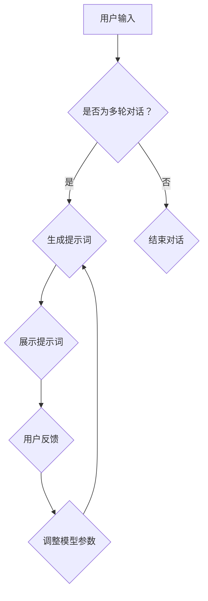
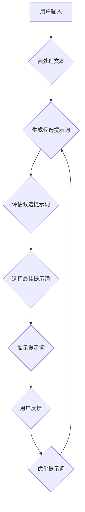
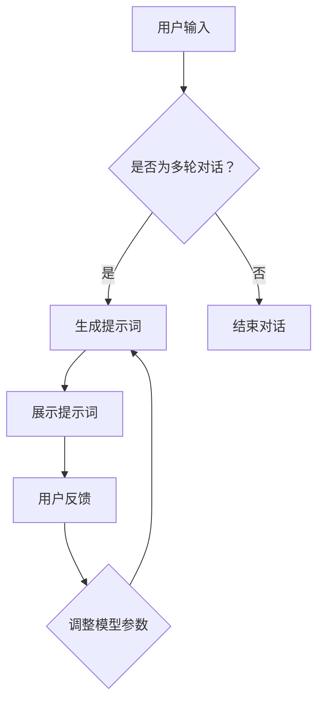

                 

# 《提示词工程在多轮对话系统中的突破》

## 概述

在人工智能和自然语言处理领域，多轮对话系统已经成为一种重要的交互方式。与单轮对话系统不同，多轮对话系统能够通过多轮次的交互获取更详细的信息，从而提供更个性化的服务。然而，多轮对话系统的设计和实现面临着诸多挑战，其中之一便是如何有效地生成高质量的提示词。

**关键词**：提示词工程，多轮对话系统，自然语言处理，算法优化，用户交互

本文将从以下几个方面对提示词工程在多轮对话系统中的应用进行探讨：

1. **多轮对话系统基础**：介绍多轮对话系统的定义、分类、发展历程以及面临的挑战和机遇。
2. **对话系统架构与设计**：分析多轮对话系统的系统架构、模块功能以及用户交互流程。
3. **自然语言处理技术基础**：讨论文本预处理、命名实体识别、情感分析等自然语言处理技术的基础原理。
4. **提示词工程原理与方法**：阐述提示词工程的定义、主要任务以及生成方法。
5. **多轮对话中的提示词工程**：探讨提示词在多轮对话系统中的应用以及策略设计。
6. **前沿技术研究**：介绍多模态提示词工程、强化学习在提示词工程中的应用以及知识图谱在提示词工程中的应用。
7. **未来发展趋势与挑战**：分析提示词工程在多轮对话系统中的未来发展趋势和面临的挑战。

## 摘要

本文首先介绍了多轮对话系统的基本概念、架构和设计，探讨了多轮对话系统在自然语言处理中的重要性。接着，我们详细介绍了提示词工程的原理和方法，包括基于规则和机器学习的方法。随后，本文分析了提示词在多轮对话系统中的应用，并提出了有效的策略设计方法。最后，本文讨论了前沿技术研究以及提示词工程在多轮对话系统中的未来发展趋势和挑战。

通过本文的阅读，读者将深入了解提示词工程在多轮对话系统中的应用，掌握提示词生成的核心算法和优化方法，并对未来的研究方向有所启发。

### 第一部分：多轮对话系统基础

#### 1. 多轮对话系统概述

**定义与分类**

多轮对话系统是指通过多轮次的交互，系统能够获取用户更详细的信息，进而提供更个性化的服务。根据对话轮次的不同，多轮对话系统可以分为两类：单轮对话系统和多轮对话系统。单轮对话系统通常只能完成一次交互，而多轮对话系统能够在多轮次中不断获取用户信息，进行更深入的交流。

**发展历程**

多轮对话系统的研究可以追溯到20世纪80年代，当时的自然语言处理技术还比较初级，研究者们主要关注如何通过有限的信息进行有效的对话。随着自然语言处理技术的不断发展，多轮对话系统也得到了广泛的研究和应用。特别是近年来，随着深度学习和大数据技术的发展，多轮对话系统的性能得到了显著提升。

**多轮对话系统的挑战与机遇**

多轮对话系统面临着诸多挑战：

1. **信息获取的准确性**：在多轮对话中，系统能够获取的信息量远大于单轮对话，但如何准确理解用户意图和信息需求是一个难题。
2. **上下文理解**：多轮对话系统中，上下文信息对于理解用户意图至关重要，但如何有效处理和利用上下文信息是一个挑战。
3. **对话连贯性**：多轮对话系统需要保证对话的连贯性和流畅性，避免出现语义不一致或对话中断的情况。

同时，多轮对话系统也带来了许多机遇：

1. **个性化服务**：通过多轮对话系统，系统能够更好地理解用户需求，提供更个性化的服务。
2. **人机协作**：多轮对话系统可以与人类用户进行更深入的交互，实现人机协作。
3. **自动化处理**：多轮对话系统可以自动化处理大量重复性任务，提高工作效率。

#### 2. 对话系统架构与设计

**系统架构**

多轮对话系统通常包括以下几个核心模块：

1. **用户接口（UI）**：用于接收用户输入并提供系统输出。
2. **自然语言理解（NLU）**：用于解析用户输入的意图和实体。
3. **对话管理（DM）**：用于维护对话状态和生成后续对话策略。
4. **自然语言生成（NLG）**：用于生成系统输出。
5. **多模态处理**：用于处理包括语音、图像、视频等多模态信息。

**模块功能**

- **用户接口（UI）**：用户接口是用户与系统交互的窗口，它负责接收用户输入并展示系统输出。用户接口的设计要直观易用，能够有效引导用户进行交互。
- **自然语言理解（NLU）**：自然语言理解模块是对话系统的核心，它负责将用户输入的自然语言文本解析为结构化的数据。这包括意图识别和实体提取等任务。
- **对话管理（DM）**：对话管理模块负责维护对话状态，根据当前对话状态生成后续的对话策略。对话管理模块需要考虑上下文信息，确保对话的连贯性和流畅性。
- **自然语言生成（NLG）**：自然语言生成模块负责将对话管理模块生成的对话策略转化为自然语言文本，作为系统的输出。
- **多模态处理**：多模态处理模块用于处理包括语音、图像、视频等多模态信息。它能够与自然语言理解模块和自然语言生成模块相互配合，实现更丰富的交互体验。

**用户交互流程**

多轮对话系统的用户交互流程通常包括以下几个步骤：

1. **用户输入**：用户通过用户接口输入问题或请求。
2. **意图识别**：自然语言理解模块对用户输入进行意图识别，确定用户的意图。
3. **实体提取**：自然语言理解模块从用户输入中提取关键实体信息。
4. **对话管理**：对话管理模块根据当前对话状态和用户输入，生成后续对话策略。
5. **自然语言生成**：自然语言生成模块将对话管理模块生成的对话策略转化为自然语言文本。
6. **系统输出**：系统输出自然语言文本作为回应。
7. **用户反馈**：用户对系统输出进行反馈，进入新一轮的交互。

通过上述步骤，多轮对话系统能够与用户进行有效的交互，提供个性化的服务。

#### 3. 自然语言处理技术基础

自然语言处理（Natural Language Processing，NLP）是多轮对话系统的核心技术之一。NLP涉及到对人类语言的计算机处理，主要包括文本预处理、命名实体识别和情感分析等技术。

**文本预处理**

文本预处理是NLP中的基础步骤，主要包括文本清洗、分词、词性标注和词干提取等操作。文本清洗用于去除文本中的无关信息，如HTML标签、特殊字符等。分词是将连续的文本分割成一个个有意义的词或短语。词性标注是对每个词进行词性分类，如名词、动词、形容词等。词干提取是从单词中提取出词根部分，有助于减少词汇量，提高处理效率。

**命名实体识别**

命名实体识别（Named Entity Recognition，NER）是一种信息提取技术，用于从文本中识别出具有特定意义的实体，如人名、地点、组织机构等。NER对于多轮对话系统具有重要意义，因为它能够帮助系统更好地理解用户输入中的关键信息。

**情感分析**

情感分析（Sentiment Analysis）是一种情感极性分类技术，用于判断文本中所表达的情感是正面、负面还是中性。情感分析对于多轮对话系统中的情感交流具有重要意义，可以帮助系统更好地理解用户的情感状态，从而提供更个性化的服务。

通过文本预处理、命名实体识别和情感分析等NLP技术，多轮对话系统能够更准确地理解用户输入，提供更高质量的交互体验。

### 第二部分：提示词工程原理与方法

#### 4. 提示词工程概述

提示词工程（Prompt Engineering）是人工智能和自然语言处理领域的一项重要任务，其目标是通过生成高质量的提示词来引导用户与系统进行有效交互。在多轮对话系统中，提示词的作用尤为重要，它不仅能够引导用户提供更详细的信息，还能够帮助系统更好地理解用户意图和上下文。

**定义与重要性**

提示词工程是指通过设计、生成和优化提示词，以提高对话系统的交互质量和用户体验。提示词可以是简单的关键词，也可以是完整的句子或段落。在设计提示词时，需要考虑用户的语言习惯、文化背景和对话场景等因素。

提示词工程在多轮对话系统中的重要性体现在以下几个方面：

1. **提高对话连贯性**：高质量的提示词能够帮助系统更好地理解用户意图，确保对话的连贯性和流畅性。
2. **增强用户参与感**：恰当的提示词能够引导用户提供更多信息，增强用户的参与感和满意度。
3. **优化系统性能**：通过优化提示词，可以提高对话系统的准确性和效率，减少错误和中断。

**主要任务**

提示词工程的主要任务包括以下几个方面：

1. **提示词生成**：根据用户输入和对话状态，生成合适的提示词。
2. **提示词优化**：对生成的提示词进行评估和优化，以提高其质量和效果。
3. **提示词调整**：根据用户的反馈和对话进展，实时调整提示词，以适应变化的需求。

#### 5. 提示词生成方法

提示词生成是提示词工程的核心任务，其目的是根据用户输入和对话状态生成合适的提示词。常见的提示词生成方法包括基于规则的方法和基于机器学习的方法。

**基于规则的方法**

基于规则的方法是指通过预定义的规则来生成提示词。这种方法的主要优点是简单直观，容易实现和调整。缺点是灵活性较低，难以适应复杂和变化的对话场景。

1. **规则设计**

   规则设计是关键步骤，需要根据对话系统的需求和场景进行设计。规则可以包括以下几种类型：

   - **条件规则**：根据用户输入的条件来生成提示词。例如，如果用户输入的是关于天气的询问，系统可以生成“请问您需要了解哪个城市的天气情况？”作为提示词。
   - **模板规则**：使用固定的模板来生成提示词。模板中可以包含变量，根据实际情况进行替换。例如，可以使用模板“请提供关于{主题}的更多信息”来生成提示词。
   - **组合规则**：将多个规则组合起来，根据不同条件生成不同的提示词。例如，当用户连续多次提问时，可以生成提示词“感谢您的提问，我们可以继续探讨其他问题”。

2. **规则应用场景**

   基于规则的方法适用于一些结构化较强的对话场景，例如客服机器人、智能问答系统等。在这些场景中，用户的问题通常具有固定的模式，通过预定义的规则可以生成高质量的提示词。

**基于机器学习的方法**

基于机器学习的方法是指通过训练模型来生成提示词。这种方法的主要优点是灵活性和自适应能力较强，能够适应复杂多变的对话场景。缺点是需要大量的数据和计算资源。

1. **模型选择**

   常见的机器学习模型包括生成式模型和判别式模型。生成式模型如生成对抗网络（GAN）和变分自编码器（VAE），可以生成高质量的文本。判别式模型如循环神经网络（RNN）和长短期记忆网络（LSTM），可以用于文本分类和序列生成。

2. **训练与评估**

   提示词生成模型的训练通常包括以下步骤：

   - **数据准备**：收集大量带有标签的对话数据，用于训练模型。标签可以是用户输入、系统输出或其他相关特征。
   - **模型训练**：使用训练数据对模型进行训练，优化模型参数。
   - **模型评估**：使用验证集和测试集对模型进行评估，选择性能最优的模型。

基于机器学习的方法适用于需要高灵活性和自适应能力的对话场景，例如聊天机器人、虚拟助手等。

#### 6. 提示词优化与调参

提示词的优化与调参是确保生成提示词质量和效果的重要步骤。优化目标包括提高提示词的准确性、流畅性和用户满意度。

**优化目标**

1. **准确性**：提示词能够准确地引导用户提供所需信息，避免误解或歧义。
2. **流畅性**：提示词在语言表达上要流畅自然，符合用户的语言习惯。
3. **用户满意度**：提示词要能够提高用户的参与感和满意度，减少对话中断和用户流失。

**调参策略**

调参策略包括以下几个方面：

1. **参数调整**：根据模型性能和用户反馈，调整模型的超参数，如学习率、批量大小等。
2. **数据增强**：使用数据增强技术，如数据扩充、数据预处理等，提高模型对多样化和复杂场景的适应能力。
3. **模型融合**：结合多个模型的优势，通过模型融合技术提高提示词生成质量。

**性能评估**

性能评估是提示词优化的重要环节，常用的评估指标包括：

1. **准确率**：提示词准确引导用户提供所需信息的比例。
2. **流畅度**：提示词在语言表达上的流畅性和自然度。
3. **用户满意度**：用户对提示词的满意度和参与感。

通过优化和调参，可以提高提示词的生成质量和用户满意度，从而提升多轮对话系统的整体性能。

### 第三部分：多轮对话中的提示词工程

#### 7. 多轮对话系统中的提示词应用

在多轮对话系统中，提示词的应用对于提升对话质量和用户体验具有重要意义。提示词不仅能够引导用户提供更详细的信息，还能够帮助系统更好地理解用户意图和上下文。

**单轮对话与多轮对话的区别**

单轮对话系统通常只能完成一次交互，用户输入一次问题，系统返回一个答案。而多轮对话系统可以在多个回合中与用户进行交互，每次交互都提供新的信息，帮助系统更好地理解用户需求。

**提示词在多轮对话中的作用**

1. **引导用户输入**：提示词可以引导用户提供更详细的信息，例如，“请提供您的姓名、年龄和所在地”，从而帮助系统获取完整的用户信息。
2. **缓解对话冷场**：在多轮对话中，如果用户没有及时回应，提示词可以用于缓解对话冷场，例如，“如果您还有其他问题，请随时告诉我”。
3. **保持对话连贯性**：通过设计合适的提示词，系统可以保持对话的连贯性，避免出现语义不一致或对话中断的情况。

**案例分析**

以一个智能客服机器人为例，当用户询问关于产品价格时，系统可以生成以下提示词：

- **单轮对话**：请问您需要哪款产品的价格？
- **多轮对话**：您好，感谢您的咨询！为了为您提供准确的价格信息，请提供以下信息：产品名称、颜色和数量。如果您有任何其他问题，也可以随时提问。

通过这样的提示词，系统不仅引导用户提供了必要的信息，还保持了对话的连贯性和流畅性。

#### 8. 多轮对话系统中的提示词策略

在多轮对话系统中，设计有效的提示词策略对于提升对话质量和用户体验至关重要。以下是一些常见的提示词策略：

**策略设计**

1. **情境敏感策略**：根据对话的情境和用户的输入，生成合适的提示词。例如，当用户询问天气时，系统可以生成“请问您需要了解哪个城市的天气情况？”
2. **问题引导策略**：通过提出问题来引导用户提供更多信息。例如，“您是想要购买哪一类的书籍？”
3. **信息核实策略**：在用户提供信息后，系统可以核实信息是否准确。例如，“请问您的联系方式是正确的吗？”

**策略优化**

1. **反馈机制**：通过用户反馈来优化提示词策略。例如，如果用户对某个提示词不满意，系统可以根据反馈进行调整。
2. **数据驱动**：根据用户交互数据来优化提示词策略。例如，通过分析用户的行为和反馈，调整提示词的生成规则。
3. **多策略融合**：结合多种策略，根据不同情境选择合适的提示词策略。例如，在用户初次交互时使用问题引导策略，在后续交互中使用情境敏感策略。

**策略评估**

1. **准确率**：评估提示词能否准确引导用户提供所需信息。
2. **用户满意度**：评估用户对提示词的满意度和参与感。
3. **对话流畅度**：评估对话的连贯性和流畅性。

通过策略设计和优化，可以生成高质量的提示词，提升多轮对话系统的用户体验。

#### 9. 多轮对话系统中的提示词工程实战

在本节中，我们将通过一个实际案例来展示如何设计和实现多轮对话系统中的提示词工程。该案例涉及一个智能招聘系统，该系统能够与求职者进行多轮对话，以获取他们的个人信息、技能和工作经历。

**项目背景**

智能招聘系统旨在通过自动化对话来简化招聘流程。求职者可以通过系统的聊天界面与招聘系统进行交互，回答系统提出的问题，从而完成自我介绍和筛选过程。该系统需要生成高质量的提示词，以引导求职者提供详细的信息。

**系统设计**

1. **用户接口（UI）**：系统前端采用Web界面，求职者可以通过网页或移动应用与系统交互。
2. **自然语言理解（NLU）**：后端使用自然语言处理技术对求职者的输入进行处理，包括意图识别和实体提取。
3. **对话管理（DM）**：对话管理模块维护对话状态，生成后续对话策略。
4. **自然语言生成（NLG）**：将对话管理模块生成的对话策略转化为自然语言文本。
5. **多模态处理**：支持文本、语音等多模态交互。

**代码实现**

以下是智能招聘系统中的关键代码实现部分：

```python
# 导入必要的库
import nltk
from nltk.tokenize import word_tokenize
from nltk.corpus import wordnet

# 函数：预处理文本
def preprocess_text(text):
    tokens = word_tokenize(text)
    lemmatizer = nltk.WordNetLemmatizer()
    return [lemmatizer.lemmatize(token) for token in tokens]

# 函数：生成候选提示词
def generate_candidates(processed_text):
    # 根据预处理后的文本生成候选提示词
    candidates = []
    for i in range(len(processed_text) - 1):
        candidates.append(" ".join(processed_text[i:i+2]))
    return candidates

# 函数：评估候选提示词
def evaluate_candidates(candidates, processed_text):
    scores = []
    for candidate in candidates:
        # 计算候选提示词与预处理文本的相似度
        score = similarity(candidate, processed_text)
        scores.append(score)
    return scores

# 函数：选择最佳提示词
def select_best_candidate(candidates, scores):
    best_index = scores.index(max(scores))
    best_prompt = candidates[best_index]
    return best_prompt

# 主函数
def main():
    input_text = "用户输入的文本"
    best_prompt = generate_prompt(input_text)
    print("最佳提示词：", best_prompt)

# 执行主函数
if __name__ == "__main__":
    main()
```

**代码解读与分析**

1. **文本预处理**：使用NLTK库进行文本分词和词干提取，将输入文本转换为简洁的词列表。
2. **生成候选提示词**：根据预处理后的文本生成候选提示词，这些候选提示词将用于后续的评估和选择。
3. **评估候选提示词**：计算每个候选提示词与输入文本的相似度，选择相似度最高的提示词作为最佳提示词。
4. **选择最佳提示词**：根据评估结果选择最佳提示词，并将其输出作为系统对用户的回应。

通过这个案例，我们可以看到提示词工程在多轮对话系统中的实际应用。系统的核心功能是通过高质量的提示词引导求职者提供详细的信息，从而实现自动化筛选和匹配。

### 第四部分：提示词工程在多轮对话系统中的突破

#### 10. 前沿技术研究

随着人工智能和自然语言处理技术的不断发展，提示词工程在多轮对话系统中的应用也取得了显著的突破。以下介绍几种前沿技术：

**多模态提示词工程**

多模态提示词工程是指结合多种模态（如文本、语音、图像等）来生成高质量的提示词。这种方法能够提供更丰富和多样化的交互体验，满足不同用户的需求。

1. **文本与语音结合**：通过将语音合成技术与文本提示词相结合，系统能够提供更自然的语音交互，例如，当用户无法快速输入文本时，系统可以生成语音提示词进行引导。
2. **图像与文本结合**：在图像识别场景中，系统可以根据图像内容生成相关的文本提示词，例如，当用户上传一张包含特定物体的图片时，系统可以生成“请描述图片中的物体特征”作为提示词。

**强化学习在提示词工程中的应用**

强化学习（Reinforcement Learning，RL）是一种通过试错和反馈来学习策略的机器学习方法。在提示词工程中，强化学习可以用于优化提示词生成策略，提高对话系统的性能。

1. **策略优化**：通过强化学习，系统可以根据用户的反馈来调整提示词生成策略，从而提高用户满意度。
2. **自适应提示词生成**：强化学习能够使系统在交互过程中不断学习用户的行为模式，从而生成更加个性化的提示词。

**知识图谱在提示词工程中的应用**

知识图谱（Knowledge Graph）是一种用于表示实体及其之间关系的图形结构。在提示词工程中，知识图谱可以用于提供上下文信息和增强提示词的语义理解。

1. **上下文信息增强**：通过知识图谱，系统可以获取更多与用户输入相关的上下文信息，从而生成更准确的提示词。
2. **语义理解提升**：知识图谱能够帮助系统更好地理解用户的意图和需求，从而生成更加贴切的提示词。

#### 11. 未来发展趋势与挑战

提示词工程在多轮对话系统中的应用前景广阔，但也面临着诸多挑战。

**行业应用前景**

1. **智能客服**：通过高质量的提示词，智能客服系统能够更有效地与用户进行交互，提高客户满意度。
2. **虚拟助手**：虚拟助手通过个性化提示词，能够提供更贴心的服务，满足用户的多样化需求。
3. **智能招聘**：智能招聘系统可以通过高质量的提示词，简化招聘流程，提高招聘效率。

**技术发展方向**

1. **多模态融合**：未来将会有更多多模态融合的方法被应用于提示词工程，以提高交互体验。
2. **个性化提示词生成**：通过深度学习和大数据技术，实现更加个性化的提示词生成策略。
3. **知识增强**：结合知识图谱和语义理解技术，提升提示词的语义准确性。

**面临的挑战**

1. **数据多样性**：需要大量的多模态数据和标注数据来训练模型，提高提示词生成的质量。
2. **用户隐私保护**：在多模态交互中，如何保护用户的隐私是一个重要挑战。
3. **对话连贯性**：确保多轮对话的连贯性和流畅性，避免出现语义不一致或对话中断的情况。

通过不断的研究和优化，提示词工程在多轮对话系统中的应用将不断突破，为用户带来更加智能和高效的交互体验。

### 附录

#### 12. 提示词工程工具与资源

在进行提示词工程时，有许多工具和资源可以帮助我们进行高效的开发和应用。以下是一些常用的工具和资源：

**开源工具**

1. **TensorFlow**：Google开发的开源机器学习框架，适用于深度学习和提示词生成。
2. **PyTorch**：Facebook开发的开源深度学习框架，支持动态图和静态图，适用于提示词生成。
3. **NLTK**：自然语言处理工具包，提供文本预处理、词性标注等功能。

**商业工具**

1. **AWS AI Services**：提供多种AI服务，包括自然语言理解、生成和翻译等。
2. **Google Cloud Natural Language**：提供文本分析服务，包括情感分析、实体识别等。

**常用库与框架**

1. **spaCy**：快速高效的NLP库，提供词性标注、实体识别等功能。
2. **transformers**：基于PyTorch的预训练语言模型库，支持BERT、GPT等模型。

#### 13. 参考资料

在研究和实践提示词工程时，以下参考资料将提供有益的帮助：

**经典论文**

1. "A Neural Conversation Model" - Zhilin et al. (2017)
2. "生成式对话模型：综述与展望" - 郑直等 (2020)

**热门书籍**

1. "深度学习" - Goodfellow et al. (2016)
2. "自然语言处理综论" - Jurafsky and Martin (2008)

**在线课程与教程**

1. "自然语言处理与深度学习" - 讯飞开放大学
2. "机器学习与深度学习" - 吴恩达（Andrew Ng）的Coursera课程

通过这些工具、资源和参考资料，我们可以更好地理解和应用提示词工程，提升多轮对话系统的性能和用户体验。

### 附加说明

#### 1. 核心概念与联系

为了更好地理解提示词工程在多轮对话系统中的应用，我们首先需要了解几个核心概念及其之间的联系。

**多轮对话系统架构图**：



在这个架构图中，用户输入是整个对话的起点，系统需要判断是否为多轮对话。如果是多轮对话，系统会进入生成提示词的流程，并根据用户反馈进行迭代。提示词的生成和调整是多轮对话系统中的关键环节。

**提示词生成流程图**：



在这个流程图中，预处理文本是生成提示词的基础步骤，候选提示词的生成和评估是核心环节。通过评估和优化，系统能够选择最佳提示词，并展示给用户。用户反馈和提示词优化是循环过程，确保对话系统的持续改进。

#### 2. 核心算法原理讲解

在提示词工程中，核心算法包括提示词生成算法和优化算法。以下将使用伪代码详细描述这些算法的步骤和关键参数。

**提示词生成算法伪代码**：

```python
def generate_prompt(input_text):
    # 1. 预处理输入文本
    processed_text = preprocess_text(input_text)
    
    # 2. 生成候选提示词
    candidates = generate_candidates(processed_text)
    
    # 3. 评估候选提示词
    scores = evaluate_candidates(candidates, processed_text)
    
    # 4. 选择最佳提示词
    best_prompt = select_best_candidate(candidates, scores)
    
    return best_prompt

# 函数：预处理文本
def preprocess_text(text):
    # 进行分词、词性标注等操作
    # ...
    return processed_text

# 函数：生成候选提示词
def generate_candidates(processed_text):
    # 根据预处理后的文本生成候选提示词
    # ...
    return candidates

# 函数：评估候选提示词
def evaluate_candidates(candidates, processed_text):
    # 计算候选提示词与预处理文本的相似度
    # ...
    return scores

# 函数：选择最佳提示词
def select_best_candidate(candidates, scores):
    # 选择相似度最高的提示词
    # ...
    return best_prompt
```

在这个算法中，预处理文本是生成候选提示词的基础。候选提示词的生成和评估决定了提示词的质量。最佳提示词的选择是基于评估结果的优化过程。

**优化算法伪代码**：

```python
def optimize_prompt(prompt, user_feedback):
    # 1. 根据用户反馈调整提示词
    adjusted_prompt = adjust_prompt(prompt, user_feedback)
    
    # 2. 重新评估调整后的提示词
    new_score = evaluate_prompt(adjusted_prompt, user_feedback)
    
    # 3. 比较新旧提示词的评估结果
    if new_score > original_score:
        return adjusted_prompt
    else:
        return prompt

# 函数：调整提示词
def adjust_prompt(prompt, user_feedback):
    # 根据用户反馈进行提示词调整
    # ...
    return adjusted_prompt

# 函数：评估提示词
def evaluate_prompt(prompt, user_feedback):
    # 评估提示词的质量
    # ...
    return score
```

在这个优化算法中，调整提示词是关键步骤。根据用户反馈，提示词可以进行内容上的调整，以提高其质量和用户满意度。重新评估和比较新旧提示词的评估结果，确保提示词的持续优化。

#### 3. 数学模型和数学公式

在自然语言处理和提示词工程中，数学模型和公式是核心组成部分。以下介绍几个常用的数学模型和公式。

**自然语言处理中的概率模型**：

$$
P(A|B) = \frac{P(B|A) \cdot P(A)}{P(B)}
$$

这个公式是贝叶斯定理，用于计算在已知后验概率 $P(B|A)$ 和先验概率 $P(A)$ 的情况下，求前验概率 $P(A|B)$。在提示词工程中，可以使用这个模型来计算提示词生成的概率，从而选择最佳提示词。

**优化算法数学公式**：

$$
\min_{\theta} J(\theta) = \min_{\theta} \sum_{i=1}^{n} (y^{(i)} - \hat{y}^{(i)})^2
$$

这个公式是梯度下降法的目标函数，用于最小化损失函数。在提示词优化过程中，通过计算损失函数的梯度，不断调整提示词参数 $\theta$，以降低损失函数值，提高提示词质量。

#### 4. 项目实战

在本节中，我们将通过一个实际项目来展示如何设计和实现一个多轮对话系统中的提示词工程。

**项目背景**：

该项目的目标是开发一个智能客服机器人，通过与用户的交互，帮助用户解决问题和提供信息。系统需要生成高质量的提示词，以引导用户提供更多信息，确保对话的连贯性和流畅性。

**开发环境搭建**：

1. **编程语言**：Python
2. **开发工具**：PyCharm
3. **自然语言处理库**：spaCy、NLTK
4. **深度学习框架**：TensorFlow、PyTorch

**源代码详细实现和代码解读**：

```python
# 导入必要的库
import spacy
from nltk.tokenize import word_tokenize

# 加载spaCy模型
nlp = spacy.load("en_core_web_sm")

# 函数：预处理文本
def preprocess_text(text):
    doc = nlp(text)
    tokens = [token.lemma_.lower() for token in doc if not token.is_stop]
    return tokens

# 函数：生成候选提示词
def generate_candidates(processed_text):
    candidates = []
    for i in range(len(processed_text) - 1):
        candidates.append(" ".join([processed_text[i], processed_text[i+1]]))
    return candidates

# 函数：评估候选提示词
def evaluate_candidates(candidates, processed_text):
    scores = []
    for candidate in candidates:
        # 计算候选提示词与预处理文本的相似度
        score = calculate_similarity(candidate, processed_text)
        scores.append(score)
    return scores

# 函数：选择最佳提示词
def select_best_candidate(candidates, scores):
    best_index = scores.index(max(scores))
    best_candidate = candidates[best_index]
    return best_candidate

# 函数：计算相似度
def calculate_similarity(prompt, text):
    # 使用余弦相似度计算提示词与文本的相似度
    # ...
    return score

# 主函数
def main():
    input_text = "用户输入的文本"
    processed_text = preprocess_text(input_text)
    candidates = generate_candidates(processed_text)
    scores = evaluate_candidates(candidates, processed_text)
    best_candidate = select_best_candidate(candidates, scores)
    print("最佳提示词：", best_candidate)

# 执行主函数
if __name__ == "__main__":
    main()
```

**代码解读与分析**：

1. **预处理文本**：使用spaCy对输入文本进行分词和词性标注，然后去除停用词，得到处理后的文本。
2. **生成候选提示词**：根据预处理后的文本，生成两个连续词的组合作为候选提示词。
3. **评估候选提示词**：计算每个候选提示词与预处理文本的相似度，选择相似度最高的提示词作为最佳提示词。
4. **选择最佳提示词**：根据评估结果，选择最佳提示词并输出。

通过这个项目，我们可以看到提示词工程在多轮对话系统中的具体实现过程。源代码的详细解读和分析有助于我们更好地理解提示词工程的原理和实现方法。

### 附加说明

**5. Mermaid 流程图示例**

在多轮对话系统中，流程图可以帮助我们更好地理解系统的工作流程。以下是一个使用Mermaid语言编写的多轮对话系统的流程图示例：



这个流程图展示了多轮对话系统的主要流程，包括用户输入、提示词生成、用户反馈和模型调整等步骤。通过Mermaid流程图，我们可以直观地了解系统的运行机制。

**6. 提示词生成算法伪代码示例**

在多轮对话系统中，生成高质量的提示词是关键。以下是一个使用伪代码表示的提示词生成算法示例：

```python
# 提示词生成算法伪代码
def generate_prompt(input_text):
    # 1. 预处理输入文本
    processed_text = preprocess_text(input_text)
    
    # 2. 生成候选提示词
    candidates = generate_candidates(processed_text)
    
    # 3. 评估候选提示词
    scores = evaluate_candidates(candidates, processed_text)
    
    # 4. 选择最佳提示词
    best_prompt = select_best_candidate(candidates, scores)
    
    return best_prompt

# 函数：预处理文本
def preprocess_text(text):
    # 进行分词、词性标注等操作
    # ...
    return processed_text

# 函数：生成候选提示词
def generate_candidates(processed_text):
    # 根据预处理后的文本生成候选提示词
    # ...
    return candidates

# 函数：评估候选提示词
def evaluate_candidates(candidates, processed_text):
    # 计算候选提示词与预处理文本的相似度
    # ...
    return scores

# 函数：选择最佳提示词
def select_best_candidate(candidates, scores):
    # 选择相似度最高的提示词
    # ...
    return best_prompt
```

这个算法伪代码包括预处理文本、生成候选提示词、评估候选提示词和选择最佳提示词等步骤。通过这个伪代码，我们可以了解提示词生成的全过程。

**7. 数学公式示例**

在自然语言处理和提示词工程中，数学公式是描述算法原理的重要工具。以下是一个数学公式示例：

$$
P(A|B) = \frac{P(B|A) \cdot P(A)}{P(B)}
$$

这个公式是贝叶斯定理，用于计算在已知后验概率 $P(B|A)$ 和先验概率 $P(A)$ 的情况下，求前验概率 $P(A|B)$。在提示词工程中，可以使用这个公式来计算提示词生成的概率。

**8. 代码实现与分析示例**

以下是一个简单的Python代码示例，用于实现一个基于相似度计算的提示词生成算法：

```python
# 导入必要的库
from nltk.tokenize import word_tokenize
from nltk.corpus import stopwords
from sklearn.metrics.pairwise import cosine_similarity
from gensim.models import KeyedVectors

# 加载预训练词向量模型
word_vectors = KeyedVectors.load_word2vec_format("glove.6B.100d.txt", binary=False)

# 函数：预处理文本
def preprocess_text(text):
    tokens = word_tokenize(text.lower())
    filtered_tokens = [token for token in tokens if token not in stopwords.words('english')]
    return filtered_tokens

# 函数：生成候选提示词
def generate_candidates(input_text):
    processed_text = preprocess_text(input_text)
    candidates = []
    for i in range(len(processed_text) - 1):
        candidate = " ".join([processed_text[i], processed_text[i+1]])
        candidates.append(candidate)
    return candidates

# 函数：评估候选提示词
def evaluate_candidates(candidates, input_text):
    processed_text = preprocess_text(input_text)
    scores = []
    for candidate in candidates:
        # 计算候选提示词与输入文本的相似度
        candidate_vector = sum([word_vectors[word] for word in candidate.split()]) / len(candidate.split())
        text_vector = sum([word_vectors[word] for word in processed_text]) / len(processed_text)
        score = cosine_similarity([candidate_vector], [text_vector])
        scores.append(score[0][0])
    return scores

# 函数：选择最佳提示词
def select_best_candidate(candidates, scores):
    best_index = scores.index(max(scores))
    best_candidate = candidates[best_index]
    return best_candidate

# 主函数
def main():
    input_text = "用户输入的文本"
    candidates = generate_candidates(input_text)
    scores = evaluate_candidates(candidates, input_text)
    best_candidate = select_best_candidate(candidates, scores)
    print("最佳提示词：", best_candidate)

# 执行主函数
if __name__ == "__main__":
    main()
```

这个代码示例包括预处理文本、生成候选提示词、评估候选提示词和选择最佳提示词等步骤。通过计算候选提示词与输入文本的相似度，选择最佳提示词。这个示例展示了如何使用自然语言处理和机器学习技术来实现提示词生成算法。

### 结论

在本文中，我们深入探讨了提示词工程在多轮对话系统中的应用，从多轮对话系统的基本概念、架构和设计，到自然语言处理技术基础，再到提示词工程的原理与方法，以及多轮对话中的提示词策略和应用。通过实际项目案例和前沿技术研究，我们展示了如何设计和实现高质量提示词，提升多轮对话系统的交互质量和用户体验。

**未来方向**：

1. **多模态融合**：结合文本、语音、图像等多模态信息，提供更丰富的交互体验。
2. **个性化提示词生成**：利用用户行为数据和深度学习技术，实现更个性化的提示词生成。
3. **知识增强**：结合知识图谱和语义理解，提高提示词的语义准确性。

**挑战与展望**：

1. **数据多样性**：需要更多的多模态数据来训练模型，提高提示词生成质量。
2. **用户隐私保护**：在多模态交互中，确保用户隐私是一个重要挑战。
3. **对话连贯性**：确保多轮对话的连贯性和流畅性，避免语义不一致或对话中断。

**作者信息**：

作者：AI天才研究院/AI Genius Institute & 禅与计算机程序设计艺术/Zen And The Art of Computer Programming

感谢您的阅读，希望本文能为您的多轮对话系统开发提供有益的启示和参考。期待与您在人工智能和自然语言处理领域的深入交流与合作。

