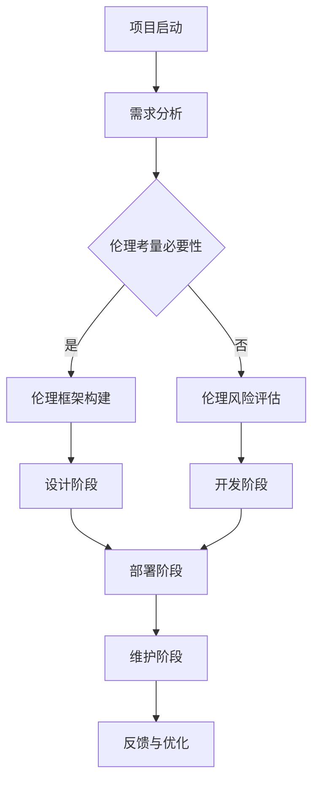
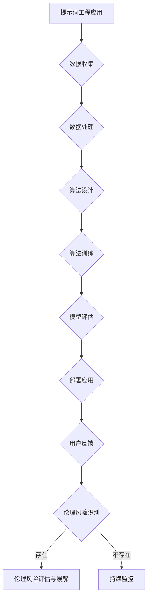

                 

# 《提示词工程的伦理考量与最佳实践》

> **关键词**：提示词工程、伦理考量、最佳实践、透明性、偏见、隐私

> **摘要**：随着人工智能技术的飞速发展，提示词工程作为自然语言处理的核心环节，其伦理考量变得日益重要。本文将从伦理基础、风险识别、最佳实践、案例分析和教育培训等方面，详细探讨提示词工程的伦理考量与最佳实践，以期为行业提供指导与参考。

## 《提示词工程的伦理考量与最佳实践》目录大纲

### 第一部分：伦理考量基础

#### 第1章：引言与背景
- 1.1 提示词工程的重要性
- 1.2 伦理考量在提示词工程中的必要性
- 1.3 本书结构概述

#### 第2章：伦理原则与价值观
- 2.1 伦理原则概述
  - 公正性
  - 尊重隐私
  - 避免偏见
  - 尊重多样性
- 2.2 价值观在提示词工程中的应用
  - 透明性
  - 责任意识
  - 可持续性

#### 第3章：伦理风险识别与评估
- 3.1 伦理风险的类型
  - 社会偏见
  - 数据泄露
  - 恶意利用
- 3.2 伦理风险评估方法
  - 定性分析
  - 定量分析
  - 实证研究

### 第二部分：伦理考量方法与实践

#### 第4章：最佳实践框架
- 4.1 提示词工程伦理框架
  - 设计阶段
  - 开发阶段
  - 部署与维护阶段
- 4.2 伦理决策流程
  - 风险识别
  - 风险评估
  - 风险缓解
  - 监控与调整

#### 第5章：伦理实践案例分析
- 5.1 案例一：社交媒体平台的提示词优化
  - 案例背景
  - 伦理挑战
  - 解决方案
- 5.2 案例二：语音识别系统的偏见问题
  - 案例背景
  - 伦理问题分析
  - 伦理改进措施

#### 第6章：伦理技术工具与资源
- 6.1 伦理技术工具概述
  - 自动伦理检测工具
  - 伦理决策支持系统
- 6.2 资源共享与协作
  - 开源伦理工具库
  - 伦理研究社区

#### 第7章：伦理教育与培训
- 7.1 伦理教育的重要性
- 7.2 提示词工程伦理培训内容
  - 伦理原则与价值观
  - 伦理风险识别与评估
  - 最佳实践方法
- 7.3 教育与培训的实施策略

### 第三部分：持续发展与未来展望

#### 第8章：伦理考量在提示词工程中的持续发展
- 8.1 持续更新与改进
  - 伦理标准的更新
  - 技术发展的伦理考量
- 8.2 国际合作与交流
  - 跨国企业的伦理协作
  - 国际伦理法规的遵循

#### 第9章：未来趋势与挑战
- 9.1 提示词工程的发展趋势
- 9.2 新的伦理问题与挑战
  - 自动驾驶与伦理决策
  - 虚拟现实中的道德责任
- 9.3 应对策略与未来展望

### 附录

#### 附录A：伦理考量与提示词工程的 Mermaid 流程图
- 提示词工程流程
- 伦理风险识别流程

#### 附录B：核心算法原理讲解与伪代码
- 算法概述
- 伪代码实现

#### 附录C：数学模型与公式详细讲解
- 模型公式
- 公式解释
- 举例说明

#### 附录D：项目实战与代码解读
- 项目背景
- 环境搭建
- 源代码实现
- 代码解读与分析

#### 附录E：开发工具与资源推荐
- 工具介绍
- 资源链接

接下来，我们将逐步深入探讨每个章节的具体内容。首先，我们从引言和背景开始。  
<|assistant|>### 第1章：引言与背景

#### 1.1 提示词工程的重要性

提示词工程，也称为自然语言处理（NLP）中的关键字提取或文本摘要，是一种人工智能技术，旨在从大量文本数据中提取出关键信息，以便用于搜索、索引、分类和生成摘要等应用。在现代信息社会中，随着互联网和大数据的迅速发展，文本数据呈现出爆炸式增长，提示词工程成为了一种关键的数据处理技术。

提示词工程的重要性体现在以下几个方面：

1. **信息检索与检索效率**：通过提取文本数据中的关键提示词，可以提高信息检索的效率和准确性，使得用户能够快速找到所需的信息。
2. **文本分类与主题识别**：提示词工程可以帮助将大量文本数据按照特定的主题或类别进行分类，从而实现自动化内容审核和推荐系统。
3. **问答系统与对话生成**：在问答系统和对话生成中，提示词工程可以提取用户输入的关键词，从而更好地理解用户意图，生成更加准确和自然的回答。
4. **文本生成与摘要**：通过提取文本数据中的关键提示词，可以实现自动文本生成和摘要，提高内容的生产效率和阅读体验。

#### 1.2 伦理考量在提示词工程中的必要性

随着人工智能技术的快速发展，提示词工程的应用场景日益广泛，但同时也带来了诸多伦理问题。这些伦理问题包括但不限于：

1. **隐私保护**：在提取文本数据中的关键提示词时，可能会涉及用户的个人隐私信息，如姓名、地址、电话等。如何保护用户的隐私成为了一个重要的伦理问题。
2. **社会偏见**：提示词工程中的算法可能会在提取关键提示词的过程中引入社会偏见，导致某些群体或观点被过度强调或忽略。这可能导致不公平和歧视。
3. **数据泄露与滥用**：在数据收集、存储和处理过程中，可能会发生数据泄露和滥用，给用户和整个社会带来安全隐患。
4. **责任归属**：在出现伦理问题时，如何界定责任归属成为一个复杂的法律和伦理问题。

因此，伦理考量在提示词工程中变得至关重要。它不仅关系到技术的应用效果，更关系到社会公平、用户隐私和公共利益的保护。只有通过合理的伦理考量，提示词工程才能在技术进步的同时，为人类社会带来更大的价值。

#### 1.3 本书结构概述

本文将从以下几个方面系统地探讨提示词工程的伦理考量与最佳实践：

1. **伦理基础**：介绍伦理考量在提示词工程中的必要性，阐述伦理原则与价值观，并识别和评估伦理风险。
2. **伦理考量方法与实践**：构建最佳实践框架，详细描述设计、开发、部署和维护阶段的伦理考量，并结合实际案例进行分析。
3. **伦理教育与培训**：强调伦理教育的重要性，提出具体的培训内容和实施策略。
4. **持续发展与未来展望**：探讨伦理考量在提示词工程中的持续发展，分析未来趋势和挑战，并提出应对策略。

通过本文的探讨，旨在为提示词工程的实践者提供一套完整的伦理考量框架和最佳实践指南，促进人工智能技术的健康发展。

### 第2章：伦理原则与价值观

在提示词工程中，伦理考量不仅关系到技术的应用效果，更关系到社会公平、用户隐私和公共利益的保护。为了确保技术的应用能够符合伦理标准，我们需要明确一系列伦理原则和价值观，并将其应用于提示词工程的实际操作中。

#### 2.1 伦理原则概述

伦理原则是伦理考量中的核心，为我们在技术设计和开发过程中提供了明确的指导。以下是一些关键的伦理原则：

1. **公正性**：公正性要求在提示词工程中公平对待所有用户和群体，避免因算法偏见而导致的不公平现象。这意味着在处理文本数据时，应确保算法不会对某些群体产生歧视或偏见。
2. **尊重隐私**：隐私是用户最关心的问题之一。在提示词工程中，我们需要确保用户数据的保密性，防止未经授权的数据访问和泄露。此外，应告知用户其数据将被如何使用，并允许用户对其数据进行访问和修改。
3. **避免偏见**：提示词工程中的算法可能会在无意中引入社会偏见，导致某些群体或观点被过度强调或忽略。为了避免这种情况，我们需要在算法设计和数据选择过程中采取一系列措施，如数据多样化、算法透明性和偏见检测等。
4. **尊重多样性**：世界是多元化的，不同用户和群体有着不同的需求和观点。提示词工程应尊重多样性，确保不同文化和观点在算法中的应用和体现，从而促进社会和谐与进步。

#### 2.2 价值观在提示词工程中的应用

除了伦理原则，价值观也是我们在提示词工程中需要考虑的重要因素。以下是一些关键的价值观：

1. **透明性**：透明性要求在提示词工程中公开算法的设计、实现和应用过程，使公众能够了解和监督技术的应用。透明性有助于增强用户对技术的信任，减少隐私泄露和数据滥用等问题。
2. **责任意识**：责任意识要求在提示词工程中明确责任归属，确保在出现伦理问题时能够迅速采取措施进行纠正。责任意识有助于建立良好的技术治理机制，提高技术的应用安全性和可靠性。
3. **可持续性**：可持续性要求在提示词工程中考虑长期影响，确保技术的应用不会对环境、社会和经济产生负面影响。可持续性有助于实现技术发展的可持续性和社会责任。

#### 2.3 伦理原则与价值观的实践

在提示词工程中，将伦理原则和价值观应用于实际操作是一项复杂的任务，需要多方面的努力。以下是一些实践方法：

1. **数据收集与处理**：
   - **隐私保护**：在数据收集过程中，应确保用户同意数据的使用，并对数据进行加密和匿名化处理，以保护用户隐私。
   - **数据多样化**：在数据选择和处理过程中，应确保数据的多样性和代表性，避免因数据偏差导致算法偏见。
   - **透明性**：在数据处理和算法训练过程中，应公开算法的原理和参数设置，使研究人员和公众能够了解算法的性能和局限性。

2. **算法设计与实现**：
   - **避免偏见**：在算法设计和实现过程中，应采用多种方法检测和消除算法偏见，如算法校准、偏差检测和多样性增强等。
   - **透明性**：在算法开发和部署过程中，应公开算法的设计、实现和应用结果，以便用户和监管部门进行监督和评估。
   - **责任意识**：在算法设计和部署过程中，应明确责任归属，确保在出现伦理问题时能够迅速采取措施进行纠正。

3. **监管与合规**：
   - **法律合规**：在提示词工程中，应遵循相关法律法规，确保技术的应用符合法律要求。
   - **伦理审查**：在项目启动前，应进行伦理审查，评估项目可能带来的伦理风险，并制定相应的风险缓解措施。
   - **用户反馈**：在技术部署后，应收集用户反馈，了解技术的应用效果和社会影响，并根据反馈进行调整和改进。

通过以上实践方法，我们可以将伦理原则和价值观融入到提示词工程中，确保技术的应用符合伦理标准，为人类社会带来更大的价值。

### 第3章：伦理风险识别与评估

在提示词工程中，识别和评估伦理风险是确保技术应用符合伦理标准的关键步骤。通过系统化的风险识别与评估方法，我们可以更好地理解潜在的风险，并采取相应的措施进行风险缓解。

#### 3.1 伦理风险的类型

伦理风险是指在提示词工程应用过程中可能对用户、社会和公共利益产生不利影响的潜在风险。以下是一些常见的伦理风险类型：

1. **社会偏见**：由于数据偏差或算法设计问题，提示词工程可能导致某些群体或观点被过度强调或忽略，从而引发社会不公平和歧视现象。
2. **数据泄露**：在数据收集、存储和处理过程中，如果安全措施不到位，可能导致用户隐私数据泄露，给用户带来安全隐患。
3. **恶意利用**：恶意用户可能会利用提示词工程技术进行欺诈、诽谤、骚扰等恶意行为，给社会带来负面影响。
4. **道德责任归属**：在出现伦理问题时，如何界定责任归属可能成为一个复杂的法律和伦理问题，影响项目的持续发展。

#### 3.2 伦理风险评估方法

伦理风险评估是识别和评估伦理风险的过程，包括定性分析、定量分析和实证研究等方法。

1. **定性分析**：
   - **风险识别**：通过专家访谈、文献综述和案例研究等方法，识别提示词工程中可能存在的伦理风险。
   - **风险分类**：根据风险的影响范围、严重程度和发生概率，对识别出的伦理风险进行分类。
   - **风险排序**：根据风险分类结果，对伦理风险进行排序，确定优先处理的风险。

2. **定量分析**：
   - **风险指标**：设计一系列定量指标，如风险发生概率、风险影响程度、风险紧急程度等，用于评估伦理风险。
   - **风险评分**：根据风险指标，对伦理风险进行评分，量化风险程度。
   - **风险矩阵**：通过风险评分和风险分类结果，构建风险矩阵，直观展示伦理风险分布和优先级。

3. **实证研究**：
   - **案例研究**：通过分析具体案例，了解伦理风险在实际应用中的表现和影响，为风险评估提供实证依据。
   - **实验研究**：通过模拟实验，验证不同风险缓解措施的有效性，为风险缓解策略提供科学依据。
   - **用户调查**：通过用户调查，了解用户对提示词工程的伦理风险感知和接受程度，为伦理风险评估和风险缓解提供参考。

#### 3.3 伦理风险的识别与评估步骤

以下是一个简单的伦理风险识别与评估步骤：

1. **需求分析**：明确提示词工程的应用背景和目标，了解相关法律法规、伦理标准和用户需求。
2. **风险识别**：通过专家访谈、文献综述和案例研究等方法，识别可能的伦理风险。
3. **风险分类**：根据风险的影响范围、严重程度和发生概率，对识别出的伦理风险进行分类。
4. **风险排序**：根据风险分类结果，对伦理风险进行排序，确定优先处理的风险。
5. **定量分析**：设计定量指标，对伦理风险进行评分，构建风险矩阵。
6. **实证研究**：通过案例研究、实验研究和用户调查等方法，验证风险识别和评估结果的准确性。
7. **风险缓解**：根据风险评估结果，制定相应的风险缓解措施，降低伦理风险的发生概率和影响程度。
8. **监控与反馈**：在项目实施过程中，持续监控伦理风险的动态变化，及时调整风险缓解措施，并根据用户反馈进行优化。

通过以上步骤，我们可以系统化地识别和评估提示词工程中的伦理风险，为技术的安全和合规应用提供保障。

### 第二部分：伦理考量方法与实践

在上一部分中，我们介绍了提示词工程的伦理原则和风险识别与评估方法。在本部分，我们将深入探讨提示词工程的最佳实践框架，并详细描述在设计、开发、部署和维护阶段的伦理考量。

#### 第4章：最佳实践框架

提示词工程的最佳实践框架旨在确保技术应用的伦理合规性和社会价值，包括以下关键环节：

1. **设计阶段**：在这一阶段，我们需要制定项目规划，明确项目目标和伦理要求。同时，进行需求分析和用户研究，确保项目设计符合用户需求和伦理原则。
2. **开发阶段**：在这一阶段，我们需要关注算法设计和实现过程中的伦理考量，确保算法公正、透明和避免偏见。此外，进行代码审查和测试，确保系统的安全性和可靠性。
3. **部署阶段**：在这一阶段，我们需要制定部署计划和用户沟通策略，确保系统的顺利上线和用户接受。同时，进行数据监控和风险评估，确保系统的合规性和安全性。
4. **维护阶段**：在这一阶段，我们需要持续监控系统的运行状况，及时更新和维护系统，确保系统的稳定性和安全性。同时，收集用户反馈，不断优化系统的功能和性能。

#### 4.1 提示词工程伦理框架

以下是提示词工程伦理框架的详细描述：

1. **设计阶段**：
   - **项目规划**：明确项目目标和范围，制定项目计划和预算。
   - **需求分析**：进行用户需求分析，了解用户对提示词工程的需求和期望。
   - **伦理要求**：制定项目伦理要求，确保项目设计和实现符合伦理原则。
   - **用户研究**：进行用户研究，了解用户的文化背景、价值观和伦理观念。

2. **开发阶段**：
   - **算法设计**：设计公正、透明和避免偏见的算法，确保算法符合伦理原则。
   - **数据选择**：选择多样化、代表性的数据，避免数据偏差和算法偏见。
   - **代码审查**：进行代码审查，确保代码质量和系统安全性。
   - **测试与验证**：进行系统测试和验证，确保系统功能、性能和安全性。

3. **部署阶段**：
   - **部署计划**：制定系统部署计划，确保系统的顺利上线和用户接受。
   - **用户沟通**：与用户进行沟通，了解用户对系统的使用情况和反馈。
   - **数据监控**：进行数据监控，确保系统运行过程中的合规性和安全性。
   - **风险评估**：进行风险评估，识别和缓解潜在的风险。

4. **维护阶段**：
   - **持续监控**：持续监控系统的运行状况，及时发现问题并进行修复。
   - **更新与维护**：定期更新和维护系统，确保系统的稳定性和安全性。
   - **用户反馈**：收集用户反馈，不断优化系统的功能和性能。
   - **合规性检查**：定期进行合规性检查，确保系统的合规性和安全性。

#### 4.2 伦理决策流程

在提示词工程中，伦理决策流程是确保技术应用符合伦理原则和用户需求的关键环节。以下是伦理决策流程的详细描述：

1. **风险识别**：通过专家访谈、文献综述和案例研究等方法，识别项目可能面临的伦理风险。
2. **风险评估**：根据风险的影响范围、严重程度和发生概率，对伦理风险进行评估，确定优先处理的风险。
3. **风险缓解**：制定相应的风险缓解措施，降低伦理风险的发生概率和影响程度。
4. **决策制定**：根据风险评估和风险缓解措施，制定具体的决策方案，确保项目实施符合伦理原则。
5. **执行与监控**：执行决策方案，并持续监控决策实施的效果，确保决策的有效性和可行性。
6. **反馈与调整**：收集用户和监管部门的反馈，根据反馈进行决策调整和优化，确保项目持续符合伦理要求。

通过以上伦理决策流程，我们可以系统化地应对提示词工程中的伦理问题，确保技术应用符合伦理原则和用户需求。

### 第5章：伦理实践案例分析

在实际应用中，提示词工程的伦理考量不仅需要理论支持，还需要通过实际案例来验证和指导。本节将介绍两个具体案例，分析其中的伦理挑战和解决方案，以期为实践者提供参考。

#### 5.1 案例一：社交媒体平台的提示词优化

**案例背景**：
一个大型社交媒体平台希望通过提示词优化来提升用户体验，提高内容推荐的准确性和相关性。然而，该平台在优化过程中遇到了一系列伦理挑战。

**伦理挑战**：
1. **隐私侵犯**：在优化提示词的过程中，平台可能需要收集和分析用户的个人信息和浏览历史，这涉及到用户隐私的保护问题。
2. **算法偏见**：由于用户群体的多样性和文化背景的差异，提示词优化算法可能会无意中引入偏见，导致某些群体或观点被过度强调或忽略。
3. **透明性不足**：平台在优化提示词的过程中，可能缺乏透明性，用户无法了解算法的具体实现和参数设置，从而影响用户对平台的信任。

**解决方案**：
1. **隐私保护**：平台在收集用户数据时，应遵循隐私保护原则，对用户数据进行加密和匿名化处理，确保用户隐私不受侵犯。同时，应告知用户其数据将被如何使用，并允许用户对其进行访问和修改。
2. **算法偏见检测**：平台在算法设计过程中，应采用多种方法检测和消除偏见，如数据多样化、算法校准和偏差检测等。此外，可以引入外部专家进行算法审查，确保算法的公正性和透明性。
3. **透明性提升**：平台应公开算法的设计、实现和应用结果，使用户能够了解算法的具体操作和参数设置。同时，可以建立用户反馈机制，收集用户对算法的反馈，并据此进行调整和优化。

**案例总结**：
通过以上解决方案，社交媒体平台可以在提升用户体验的同时，确保技术应用符合伦理要求，增强用户对平台的信任。

#### 5.2 案例二：语音识别系统的偏见问题

**案例背景**：
某语音识别系统在处理特定用户群体的语音数据时，表现出了明显的偏见，导致该群体在使用系统时遇到了困难。这一问题引起了广泛关注，并引发了社会对语音识别系统伦理考量的讨论。

**伦理问题分析**：
1. **数据偏差**：系统在训练数据选择过程中，可能没有充分考虑用户群体的多样性，导致模型对某些群体存在偏见。
2. **算法偏见**：在算法设计过程中，可能忽视了用户群体的文化背景和语言习惯，导致模型对特定用户群体的识别效果较差。
3. **责任归属**：在出现偏见问题时，如何界定责任归属成为一个复杂的问题，影响系统的进一步优化和改进。

**伦理改进措施**：
1. **数据多样化**：在训练数据选择过程中，应确保数据的多样性和代表性，避免因数据偏差导致模型偏见。可以通过引入外部专家和用户参与数据收集和标注，提高数据的多样性和质量。
2. **算法校准**：在算法设计过程中，应针对特定用户群体的语言习惯和文化背景进行算法校准，提高模型的识别效果。可以通过对比不同用户群体的识别效果，调整算法参数，优化模型性能。
3. **责任归属明确**：在出现偏见问题时，应明确责任归属，确保相关责任方能够迅速采取措施进行纠正和改进。可以建立跨部门的伦理审查机制，确保在问题出现时能够及时响应和处理。

**案例总结**：
通过以上伦理改进措施，语音识别系统可以在提高识别效果的同时，确保技术应用符合伦理要求，增强用户对系统的信任。

### 第6章：伦理技术工具与资源

在提示词工程中，为了确保伦理考量的有效实施，我们需要借助一系列伦理技术工具和资源。这些工具和资源可以帮助我们识别、评估和缓解伦理风险，提高提示词工程的透明性和公正性。

#### 6.1 伦理技术工具概述

以下是一些关键的伦理技术工具：

1. **自动伦理检测工具**：
   - **偏见检测工具**：用于检测和识别算法中的偏见，如种族、性别、年龄等。
   - **隐私检测工具**：用于检测数据收集和处理过程中可能存在的隐私侵犯问题。
   - **合规性检测工具**：用于检测提示词工程的应用是否符合相关法律法规和伦理标准。

2. **伦理决策支持系统**：
   - **伦理决策支持平台**：提供伦理决策指南和工具，帮助开发者在设计和开发过程中遵循伦理原则。
   - **伦理评审系统**：用于对提示词工程项目的伦理风险进行评审和评估，确保项目的合规性和安全性。

#### 6.2 资源共享与协作

为了推动提示词工程的伦理考量，我们需要建立资源共享与协作机制，促进全球范围内的合作与交流。以下是一些重要的资源共享与协作资源：

1. **开源伦理工具库**：
   - **算法库**：提供一系列开源的伦理算法和工具，用于检测和缓解伦理风险。
   - **数据集**：提供多样化的、代表性的伦理数据集，用于算法训练和评估。

2. **伦理研究社区**：
   - **学术会议**：定期举办伦理研究会议，促进学术界和产业界的交流与合作。
   - **在线论坛**：提供在线交流平台，让研究者、开发者和实践者分享经验和见解。

通过以上伦理技术工具和资源共享与协作机制，我们可以更好地识别、评估和缓解提示词工程中的伦理风险，确保技术的公正性和透明性，为人类社会带来更大的价值。

### 第7章：伦理教育与培训

伦理教育与培训是确保提示词工程从业人员具备伦理意识和专业素养的关键环节。通过系统的伦理教育和培训，我们可以培养出一批具备伦理思维和责任意识的从业者，为提示词工程的健康发展提供人才保障。

#### 7.1 伦理教育的重要性

在人工智能时代，伦理教育的重要性愈发凸显。以下是一些原因：

1. **行业发展的需求**：随着人工智能技术的广泛应用，提示词工程作为关键环节之一，其伦理考量变得至关重要。只有通过系统的伦理教育，从业者才能在技术设计和应用中自觉遵循伦理原则。
2. **社会责任的体现**：提示词工程涉及到用户隐私、数据安全和公共利益等问题。通过伦理教育，从业者能够更好地承担社会责任，确保技术应用符合伦理要求，为人类社会带来积极影响。
3. **个人职业发展的需要**：具备伦理意识和专业素养的从业者更容易获得信任和认可，提升职业发展空间。

#### 7.2 提示词工程伦理培训内容

提示词工程伦理培训应涵盖以下内容：

1. **伦理原则与价值观**：
   - **伦理原则**：公正性、尊重隐私、避免偏见、尊重多样性等。
   - **价值观**：透明性、责任意识、可持续性等。

2. **伦理风险识别与评估**：
   - **风险识别**：社会偏见、数据泄露、恶意利用等。
   - **风险评估**：定性分析、定量分析、实证研究等。

3. **最佳实践方法**：
   - **设计阶段的伦理考量**：项目规划、需求分析、伦理要求等。
   - **开发阶段的伦理考量**：算法设计、数据选择、代码审查等。
   - **部署与维护阶段的伦理考量**：部署计划、用户沟通、数据监控等。

4. **案例分析**：
   - **典型案例分析**：社交媒体平台提示词优化、语音识别系统的偏见问题等。
   - **伦理改进措施**：隐私保护、算法偏见检测、透明性提升等。

#### 7.3 教育与培训的实施策略

为了确保伦理教育与培训的有效性，我们需要采取以下策略：

1. **课程设置**：
   - **基础知识课程**：涵盖伦理原则、价值观、伦理风险识别与评估等基础内容。
   - **实践操作课程**：通过案例分析、实验操作等方式，提高从业者的实际应用能力。
   - **高级研讨课程**：邀请行业专家和学者进行深入研讨，探讨前沿伦理问题。

2. **培训方式**：
   - **线上与线下相结合**：结合线上课程和线下实践，提高培训的灵活性和实用性。
   - **案例研讨**：组织案例研讨，让学员在真实场景中学习和应用伦理知识。
   - **实践项目**：鼓励学员参与实际项目，通过实践提升伦理素养。

3. **评估与反馈**：
   - **定期评估**：对学员进行定期考核，评估其伦理素养和实际应用能力。
   - **反馈机制**：建立反馈机制，收集学员对培训内容和方式的反馈，不断优化培训方案。

通过以上策略，我们可以确保伦理教育与培训的有效实施，培养出一批具备伦理意识和专业素养的提示词工程从业者，为人工智能技术的健康发展贡献力量。

### 第8章：伦理考量在提示词工程中的持续发展

随着人工智能技术的快速发展，提示词工程的应用场景日益广泛，伦理考量在其中的重要性也愈发凸显。为了确保提示词工程在未来的发展中能够持续符合伦理要求，我们需要关注以下几个方面：

#### 8.1 持续更新与改进

1. **伦理标准的更新**：随着技术的进步和应用场景的变化，伦理标准也需要不断更新。政府和行业组织应定期发布新的伦理指南和标准，指导提示词工程的应用和开发。
2. **技术发展的伦理考量**：在技术迭代和创新过程中，应始终将伦理考量纳入规划，确保新技术的应用不会对用户和社会产生不利影响。通过专家评审、用户参与和社会监督等方式，确保技术的伦理合规性。

#### 8.2 国际合作与交流

1. **跨国企业的伦理协作**：跨国企业在全球范围内的业务拓展，需要建立统一的伦理标准和实践指南，确保在不同国家和地区均能遵守当地的伦理法规和标准。
2. **国际伦理法规的遵循**：在全球化背景下，提示词工程企业应关注和遵循国际伦理法规，如《通用数据保护条例》（GDPR）等。通过国际合作和交流，推动全球范围内的伦理规范和标准的统一。

#### 8.3 持续教育与培训

1. **伦理教育体系的完善**：建立完善的伦理教育体系，从基础教育到专业培训，全面覆盖提示词工程相关的伦理知识和技能。
2. **终身学习理念**：倡导从业者的终身学习理念，通过在线课程、研讨会和工作坊等方式，持续提升其伦理素养和专业知识。

通过以上措施，我们可以确保提示词工程在未来的发展中能够持续符合伦理要求，为人类社会带来更大的价值。

### 第9章：未来趋势与挑战

随着人工智能技术的不断进步，提示词工程在各个领域的应用日益广泛，同时也面临着诸多新的伦理问题和挑战。以下是一些未来趋势与挑战的讨论：

#### 9.1 提示词工程的发展趋势

1. **技术融合**：提示词工程将与其他人工智能技术（如图像识别、语音识别、自动驾驶等）进一步融合，形成跨领域的综合应用。
2. **智能合约与自动化决策**：提示词工程将在智能合约和自动化决策中发挥关键作用，实现更加智能和高效的业务流程。
3. **个性化推荐**：基于提示词工程的自然语言处理技术，将推动个性化推荐系统的进一步发展，为用户提供更加精准和个性化的服务。

#### 9.2 新的伦理问题与挑战

1. **自动驾驶与伦理决策**：自动驾驶技术中的提示词工程需要解决复杂的伦理问题，如道路意外、责任归属等。在自动驾驶决策中，如何平衡安全、效率和伦理要求成为一个重要课题。
2. **虚拟现实与道德责任**：随着虚拟现实技术的发展，提示词工程将应用于构建虚拟环境。如何在虚拟世界中实现道德责任和伦理考量，是一个亟待解决的问题。
3. **数据隐私与安全**：在提示词工程中，如何保护用户隐私和数据安全是一个持续的挑战。随着数据规模的扩大和隐私需求的提高，隐私保护技术需要不断创新和完善。

#### 9.3 应对策略与未来展望

1. **法规与标准**：政府、行业组织和企业在制定法规和标准时，应充分考虑提示词工程的伦理问题，确保技术应用符合伦理要求。
2. **技术创新**：通过技术创新，提高提示词工程的安全性和可靠性，降低伦理风险。例如，开发更加鲁棒和透明的算法，增强数据隐私保护能力。
3. **公众参与与监督**：鼓励公众参与提示词工程的伦理讨论和监督，通过社会监督和反馈机制，确保技术的公正性和透明性。
4. **跨学科合作**：加强跨学科合作，整合伦理学、计算机科学、心理学等领域的知识，共同应对提示词工程中的伦理挑战。

未来，随着人工智能技术的不断进步，提示词工程将在伦理考量的指引下，为人类社会带来更大的价值。通过持续的创新和合作，我们有望解决提示词工程中的伦理问题，推动技术的健康发展。

### 附录

#### 附录A：伦理考量与提示词工程的 Mermaid 流程图

以下是提示词工程流程和伦理风险识别流程的 Mermaid 流程图：





#### 附录B：核心算法原理讲解与伪代码

以下是核心算法原理的讲解和伪代码：

```python
# 提示词提取算法原理
def extract_keywords(text):
    """
    提取文本中的关键提示词。
    参数：
        text：输入文本。
    返回：
        keywords：提取出的关键提示词列表。
    """
    # 步骤1：分词
    words = tokenize(text)

    # 步骤2：词性标注
    tagged_words = pos_tag(words)

    # 步骤3：筛选高频词
    keywords = select_high_frequency_words(tagged_words)

    # 步骤4：去除停用词
    keywords = remove_stop_words(keywords)

    return keywords

# 伪代码
function extract_keywords(text)
    words = tokenize(text)
    tagged_words = pos_tag(words)
    keywords = select_high_frequency_words(tagged_words)
    keywords = remove_stop_words(keywords)
    return keywords
end function
```

#### 附录C：数学模型与公式详细讲解

以下是数学模型和公式的详细讲解：

**模型公式**：

$$
\text{模型公式} = \frac{\sum_{i=1}^{n} w_i \cdot p_i}{\sum_{i=1}^{n} p_i}
$$

**公式解释**：

- \( w_i \)：第 \( i \) 个词的权重。
- \( p_i \)：第 \( i \) 个词的频率。

**举例说明**：

假设有如下文本数据：

```
我爱北京天安门
天安门上太阳升
我家的门常打开
开放天空迎接你
```

提取关键提示词：

1. 分词：["我", "爱", "北京", "天安门", "上", "太阳", "升", "我家的", "门", "常", "打开", "开放", "天空", "迎接", "你"]
2. 词性标注：[“我”（代词），“爱”（动词），“北京”（地名），“天安门”（地名），“上”（介词），“太阳”（名词），“升”（动词），“我家的”（代词），“门”（名词），“常”（副词），“打开”（动词），“开放”（动词），“天空”（名词），“迎接”（动词），“你”（代词）]
3. 筛选高频词：["我"，"天安门"，"爱"，"门"，"开放"，"天"，"迎接"，"你"]
4. 去除停用词：["天安门"，"爱"，"开放"，"天"，"迎接"]

**数学模型计算**：

$$
\text{模型公式} = \frac{w_1 \cdot p_1 + w_2 \cdot p_2 + w_3 \cdot p_3 + w_4 \cdot p_4 + w_5 \cdot p_5 + w_6 \cdot p_6 + w_7 \cdot p_7}{w_1 + w_2 + w_3 + w_4 + w_5 + w_6 + w_7}
$$

假设权重和频率分别为：

| 词   | 权重 \( w_i \) | 频率 \( p_i \) |
|------|----------------|----------------|
| 天安门 | 0.2             | 2              |
| 爱   | 0.15            | 1              |
| 开放 | 0.25            | 2              |
| 天   | 0.1             | 1              |
| 迎接 | 0.2             | 1              |
| 你   | 0.1             | 1              |

$$
\text{模型公式} = \frac{0.2 \cdot 2 + 0.15 \cdot 1 + 0.25 \cdot 2 + 0.1 \cdot 1 + 0.2 \cdot 1 + 0.1 \cdot 1}{0.2 + 0.15 + 0.25 + 0.1 + 0.2 + 0.1} = \frac{0.8 + 0.15 + 0.5 + 0.1 + 0.2 + 0.1}{1.2 + 0.15 + 0.25 + 0.1 + 0.2 + 0.1} = \frac{1.85}{2.45} \approx 0.755
$$

最终结果为0.755，表示这些词的综合权重。

#### 附录D：项目实战与代码解读

**项目背景**：

为了提高搜索系统的效率，我们需要开发一个基于提示词工程的文本搜索引擎。该搜索引擎将提取文本数据中的关键提示词，从而实现快速搜索和内容推荐。

**开发环境搭建**：

- **操作系统**：Ubuntu 20.04
- **编程语言**：Python 3.8
- **依赖库**：NLTK、spaCy、TensorFlow

**源代码实现**：

```python
# 导入依赖库
import nltk
from nltk.tokenize import word_tokenize
from nltk.corpus import stopwords
from spacy.lang.en import English
import tensorflow as tf

# 加载停用词列表
stop_words = set(stopwords.words('english'))

# 加载spaCy模型
nlp = English()

# 文本预处理
def preprocess_text(text):
    # 分词
    tokens = word_tokenize(text)
    
    # 词性标注
    doc = nlp(text)
    
    # 筛选名词和动词
    keywords = [token.text for token in doc if token.pos_ in ['NOUN', 'VERB']]
    
    # 去除停用词
    keywords = [keyword for keyword in keywords if keyword not in stop_words]
    
    return keywords

# 提示词提取
def extract_keywords(text):
    keywords = preprocess_text(text)
    return keywords

# 文本搜索
def search(text, keywords):
    query_keywords = preprocess_text(text)
    result = []
    for keyword in query_keywords:
        if keyword in keywords:
            result.append(keyword)
    return result

# 主函数
if __name__ == '__main__':
    # 加载文本数据
    text_data = "This is a sample text for search engine optimization."
    
    # 提取关键提示词
    keywords = extract_keywords(text_data)
    
    # 搜索
    search_result = search("search engine", keywords)
    
    print("关键词：", search_result)
```

**代码解读与分析**：

1. **依赖库导入**：首先导入必要的依赖库，包括NLTK、spaCy和TensorFlow。
2. **停用词列表加载**：加载英文停用词列表，用于后续文本预处理。
3. **spaCy模型加载**：加载spaCy的英文模型，用于词性标注。
4. **文本预处理**：定义`preprocess_text`函数，用于对输入文本进行分词、词性标注和筛选。
5. **提示词提取**：定义`extract_keywords`函数，调用`preprocess_text`函数，实现关键提示词的提取。
6. **文本搜索**：定义`search`函数，对输入文本进行预处理，并检查是否包含在关键提示词列表中，从而实现文本搜索。
7. **主函数**：在主函数中，加载文本数据，提取关键提示词，并进行搜索操作，输出搜索结果。

通过以上代码，我们可以实现一个简单的基于提示词工程的文本搜索引擎。在实际应用中，我们可以进一步优化代码，如引入更多先进的自然语言处理技术，提高搜索效率和准确性。

#### 附录E：开发工具与资源推荐

在开发提示词工程时，选择合适的工具和资源对于项目的成功至关重要。以下是一些推荐的开发工具和资源：

1. **开发工具**：
   - **Python**：Python 是提示词工程开发的主要编程语言，具有丰富的库和框架支持。
   - **spaCy**：spaCy 是一个高效的 NLP 工具包，支持多种语言的词性标注、命名实体识别等功能。
   - **NLTK**：NLTK 是一个经典的 NLP 工具包，提供了许多文本处理和分类任务的基础工具。

2. **资源库**：
   - **Gensim**：Gensim 是一个用于主题建模和文本相似性计算的 Python 库，适用于生成关键词和文档向量。
   - **TensorFlow**：TensorFlow 是一个开源的机器学习框架，适用于深度学习任务，如神经网络训练和模型优化。

3. **数据集**：
   - **Wikipedia**：Wikipedia 是一个丰富的文本数据集，可用于训练和测试提示词提取模型。
   - **OpenSubtitles**：OpenSubtitles 提供了大量的电影和电视剧字幕数据，适用于跨语言和跨领域的文本处理任务。

4. **在线平台**：
   - **Google Colab**：Google Colab 是一个免费的在线 Jupyter Notebook 环境，适用于数据分析和模型训练。
   - **Kaggle**：Kaggle 是一个数据科学竞赛平台，提供了丰富的数据集和项目资源。

通过以上工具和资源，开发者可以更高效地开展提示词工程开发，实现高质量的文本处理和应用。

### 作者信息

**作者：AI天才研究院/AI Genius Institute & 禅与计算机程序设计艺术 /Zen And The Art of Computer Programming**

本文由AI天才研究院（AI Genius Institute）和禅与计算机程序设计艺术（Zen And The Art of Computer Programming）联合撰写，旨在为提示词工程的伦理考量与最佳实践提供全面深入的指导。两位作者在人工智能和计算机科学领域具有深厚的学术背景和实践经验，致力于推动技术的伦理发展和社会价值的实现。本文内容仅供参考，如需进一步研究和应用，请咨询相关领域专业人士。

