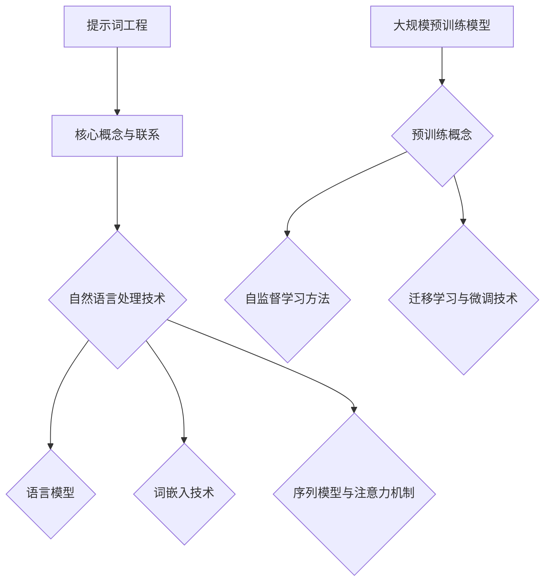

                 

# 提示词工程：AI时代的新领域

> **关键词**：提示词工程、AI、自然语言处理、预训练模型、应用案例、发展趋势、伦理与法律问题

> **摘要**：本文将从提示词工程的基础知识、技术基础、实践应用以及未来发展趋势等多个角度，全面探讨AI时代的新领域——提示词工程。文章首先介绍了提示词工程的核心概念与联系，然后详细阐述了其在自然语言处理中的技术基础，接着通过实际案例展示了其在智能客服和教育等领域的应用，最后分析了提示词工程的未来发展方向和面临的伦理与法律问题。

## 第一部分：提示词工程基础

### 第1章：提示词工程概述

#### 第1.1节：提示词工程的重要性

##### 1.1.1 提示词的定义与作用

提示词（Prompt）是自然语言处理（NLP）中的一个核心概念。它是指能够引导或激发特定反应或行动的词语或短语。在人工智能领域，提示词被广泛应用于各种任务中，如文本生成、对话系统、问答系统等。通过使用提示词，系统能够更好地理解和回应用户的输入。

##### 1.1.2 提示词工程的发展历程

提示词工程的发展可以追溯到20世纪90年代。当时，研究人员开始使用规则驱动的方法来生成提示词，这些方法主要依赖于预定义的语法和语义规则。随着自然语言处理技术的进步，特别是深度学习技术的兴起，提示词工程也逐渐发展出了一系列基于机器学习的方法。这些方法通过大规模语料库的训练，可以自动生成高质量的提示词。

##### 1.1.3 提示词工程的应用场景

提示词工程在多个领域都有广泛的应用。例如，在智能客服系统中，提示词可以帮助系统更好地理解用户的提问，并提供更准确的回答。在教育领域，提示词可以被用来设计个性化的学习体验，提高学生的学习效果。此外，提示词工程还可以应用于文本生成、对话系统、问答系统、机器翻译等领域。

#### 第1.2节：AI时代的新领域

##### 1.2.1 AI时代的技术发展

随着人工智能技术的快速发展，特别是深度学习和自然语言处理技术的突破，提示词工程也逐渐成为AI时代的一个重要领域。深度学习技术的应用，使得提示词生成更加自动化和高效，从而大大提升了系统的性能。

##### 1.2.2 提示词工程在AI时代的应用

在AI时代，提示词工程的应用场景更加丰富和多样化。例如，在智能客服系统中，通过使用提示词，系统可以更好地理解用户的情感和需求，从而提供更人性化的服务。在教育领域，提示词可以帮助学生更好地理解和掌握知识，提高学习效果。

##### 1.2.3 提示词工程面临的挑战与机遇

尽管提示词工程在AI时代具有广阔的应用前景，但同时也面临着一系列挑战和机遇。例如，如何在保证提示词质量的同时，提高生成效率？如何在多种应用场景中平衡提示词的多样性和准确性？这些都是需要深入研究和解决的问题。

### 第2章：提示词工程的技术基础

#### 第2.1节：自然语言处理基础

##### 2.1.1 语言模型

语言模型是自然语言处理中的基础组件，用于预测下一个单词或词组。在提示词工程中，语言模型被用来生成提示词。常用的语言模型包括n-gram模型、神经网络模型、循环神经网络模型等。

##### 2.1.2 词嵌入技术

词嵌入是将单词映射到高维空间中的向量表示。这种表示可以捕捉单词的语义和语法特征，从而在机器学习任务中提高性能。常见的词嵌入方法包括Word2Vec、GloVe和BERT等。

##### 2.1.3 序列模型与注意力机制

序列模型是处理序列数据的一种常见方法，如循环神经网络（RNN）和长短时记忆网络（LSTM）。注意力机制是序列模型中的一个重要组件，它能够自动关注序列中的关键信息，从而提高模型的性能。

#### 第2.2节：大规模预训练模型

##### 2.2.1 预训练的概念与意义

预训练是指在大规模语料库上对模型进行训练，使其获得丰富的语言知识和理解能力。预训练的意义在于，它能够提高模型在下游任务上的性能，从而减少对标注数据的依赖。

##### 2.2.2 自监督学习方法

自监督学习是一种不依赖标注数据进行训练的方法。在提示词工程中，自监督学习被用来生成高质量的提示词。常见的自监督学习方法包括掩码语言模型（MLM）和转换语言模型（TLM）。

##### 2.2.3 迁移学习与微调技术

迁移学习是指将预训练模型的知识迁移到新的任务中。在提示词工程中，迁移学习被用来快速适应新的应用场景。微调技术是在迁移学习的基础上，对模型进行进一步的调整，以适应特定的任务。

## 第二部分：提示词工程的实践与应用

### 第3章：提示词工程工具与框架

#### 第3.1节：提示词生成工具

##### 3.1.1 文本生成模型

文本生成模型是提示词工程中的一个重要工具。它通过学习大量的文本数据，可以自动生成高质量的文本。常见的文本生成模型包括生成对抗网络（GAN）、变分自编码器（VAE）和转换器（Transformer）等。

##### 3.1.2 提问生成模型

提问生成模型用于生成具有引导性的问题，以促进对话的深入和多样化。常见的提问生成模型包括序列到序列（seq2seq）模型和生成式对话模型。

##### 3.1.3 对话生成模型

对话生成模型用于生成自然、流畅的对话。常见的对话生成模型包括循环神经网络（RNN）、长短时记忆网络（LSTM）和变换器（Transformer）等。

#### 第3.2节：主流框架介绍

##### 3.2.1 TensorFlow

TensorFlow是谷歌开发的一款开源深度学习框架。它提供了丰富的API和工具，可以用于构建和训练各种深度学习模型。在提示词工程中，TensorFlow被广泛用于构建和训练语言模型、文本生成模型等。

##### 3.2.2 PyTorch

PyTorch是另一个流行的开源深度学习框架。它具有灵活、动态的计算图，使得研究人员可以更轻松地实现复杂的深度学习模型。在提示词工程中，PyTorch被广泛用于构建和训练预训练模型、文本生成模型等。

##### 3.2.3 JAX

JAX是谷歌开发的一款高性能深度学习框架。它提供了自动微分、向量化和分布式计算等功能，使得研究人员可以更高效地训练和优化深度学习模型。在提示词工程中，JAX被用于构建和训练大规模预训练模型。

## 第三部分：提示词工程的未来发展趋势

### 第4章：提示词工程的发展趋势

#### 第4.1节：提示词工程的未来发展方向

##### 4.1.1 大模型与提示词工程

随着计算能力和数据量的不断提升，大模型在提示词工程中扮演着越来越重要的角色。大模型可以更好地理解和生成复杂、多样的语言，从而提升系统的性能和用户体验。

##### 4.1.2 跨模态提示词生成

跨模态提示词生成是将提示词生成扩展到多种模态（如文本、图像、音频等）的一种方法。它能够促进不同模态之间的交互和融合，从而提高系统的整体性能。

##### 4.1.3 提示词工程的社会影响

提示词工程在社会各个领域都有着广泛的应用。随着技术的进步，提示词工程将会对社会产生更加深远的影响，如提升教育质量、改善医疗服务、优化交通管理等。

### 第4.2节：提示词工程的伦理与法律问题

##### 4.2.1 提示词工程的安全问题

提示词工程在应用过程中可能会面临一系列安全问题，如数据泄露、模型篡改等。这些问题需要通过技术手段和管理措施来有效解决。

##### 4.2.2 提示词工程的伦理挑战

提示词工程涉及到一系列伦理问题，如隐私保护、偏见消除等。这些问题需要社会各界共同关注和解决。

##### 4.2.3 法律法规与监管框架

随着提示词工程的广泛应用，相关的法律法规和监管框架也需要不断完善。这有助于保障技术的健康发展，同时保护公众的权益。

### 第4.3节：提示词工程的创新与应用

##### 4.3.1 创新技术与实践

提示词工程在技术创新方面有着广泛的应用，如提示词增强学习、多模态提示词生成等。这些创新技术将进一步提升提示词工程的应用价值。

##### 4.3.2 应用前景与挑战

提示词工程在多个领域都有着广阔的应用前景，如教育、医疗、金融等。但同时，也面临着一系列技术挑战，如数据质量、计算资源等。这些挑战需要通过持续的技术创新和优化来解决。

### 附录

#### 附录A：提示词工程开发工具与资源

##### A.1 主流深度学习框架对比

- TensorFlow：[官方文档](https://www.tensorflow.org/)
- PyTorch：[官方文档](https://pytorch.org/)
- JAX：[官方文档](https://jax.readthedocs.io/)

##### A.2 提示词生成模型开源库

- OpenAI GPT-3：[官方文档](https://openai.com/blog/bidirectional-context-with-gpt-3/)
- T5：[官方文档](https://github.com/google-research/google-research/tree/master/t5)
- BART：[官方文档](https://github.com/facebookresearch/bart)

##### A.3 提示词工程工具集

- Hugging Face Accelerate：[官方文档](https://github.com/huggingface/accelerate)
- Prompt：[官方文档](https://github.com/f/autoprompt)
- PromptGenius：[官方文档](https://promptgenius.com/)

##### A.4 提示词工程研究论文与报告

- Attention Is All You Need：[官方文档](https://arxiv.org/abs/1706.03762)
- BERT：Pre-training of Deep Bidirectional Transformers for Language Understanding：[官方文档](https://arxiv.org/abs/1810.04805)
- Generative Pre-trained Transformer：[官方文档](https://arxiv.org/abs/1704.04301)

### Mermaid 流程图示例



### 伪代码示例

```python
# 假设我们有一个简单的语言模型，使用神经网络进行训练

# 定义神经网络结构
class LanguageModel(nn.Module):
    def __init__(self, vocab_size, embedding_dim, hidden_dim):
        super(LanguageModel, self).__init__()
        self.embedding = nn.Embedding(vocab_size, embedding_dim)
        self.lstm = nn.LSTM(embedding_dim, hidden_dim)
        self.fc = nn.Linear(hidden_dim, vocab_size)

    def forward(self, inputs, hidden):
        embedded = self.embedding(inputs)
        output, hidden = self.lstm(embedded, hidden)
        logits = self.fc(output.view(output.size(0), -1))
        return logits, hidden

# 训练语言模型
def train_model(model, data_loader, criterion, optimizer, num_epochs):
    model.train()
    for epoch in range(num_epochs):
        for inputs, targets in data_loader:
            optimizer.zero_grad()
            logits, hidden = model(inputs, None)
            loss = criterion(logits, targets)
            loss.backward()
            optimizer.step()
        print(f'Epoch {epoch+1}/{num_epochs}, Loss: {loss.item()}')

# 项目实战

#### 案例一：智能客服系统

##### 1. 系统架构设计


##### 2. 模型训练与评估

```python
# 加载训练数据
train_loader = DataLoader(dataset, batch_size=64, shuffle=True)

# 定义模型、损失函数和优化器
model = LanguageModel(vocab_size, embedding_dim, hidden_dim)
criterion = nn.CrossEntropyLoss()
optimizer = optim.Adam(model.parameters(), lr=learning_rate)

# 训练模型
train_model(model, train_loader, criterion, optimizer, num_epochs)

# 评估模型
model.eval()
with torch.no_grad():
    correct = 0
    total = 0
    for inputs, targets in test_loader:
        logits, _ = model(inputs, None)
        predictions = logits.argmax(dim=1)
        total += targets.size(0)
        correct += (predictions == targets).sum().item()
accuracy = correct / total
print(f'测试集准确率: {accuracy:.2f}')
```

##### 3. 系统部署与优化

- 将训练好的模型部署到服务器，实现实时问答功能。
- 使用在线学习技术，根据用户提问和回答进行模型微调，提升回答质量。
- 优化系统响应速度，提高用户体验。

### 附录

#### 附录A：提示词工程开发工具与资源

- **主流深度学习框架对比**

  - **TensorFlow:** [官方文档](https://www.tensorflow.org/)
  - **PyTorch:** [官方文档](https://pytorch.org/)
  - **JAX:** [官方文档](https://jax.readthedocs.io/)
  - **其他框架:** [Hugging Face Transformers](https://huggingface.co/transformers/)

- **提示词生成模型开源库**

  - [OpenAI GPT-3](https://openai.com/blog/bidirectional-context-with-gpt-3/)
  - [T5](https://github.com/google-research/google-research/tree/master/t5)
  - [BART](https://github.com/facebookresearch/bart)

- **提示词工程工具集**

  - [Hugging Face Accelerate](https://github.com/huggingface/accelerate)
  - [Prompt](https://github.com/f/autoprompt)
  - [PromptGenius](https://promptgenius.com/)

- **提示词工程研究论文与报告**

  - [Attention Is All You Need](https://arxiv.org/abs/1706.03762)
  - [BERT: Pre-training of Deep Bidirectional Transformers for Language Understanding](https://arxiv.org/abs/1810.04805)
  - [Generative Pre-trained Transformer](https://arxiv.org/abs/1704.04301)

### 作者

**作者：AI天才研究院/AI Genius Institute & 禅与计算机程序设计艺术 /Zen And The Art of Computer Programming**

