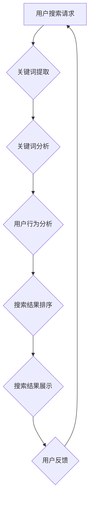
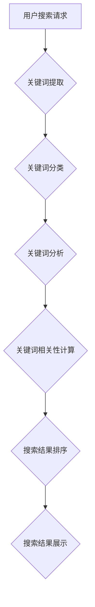
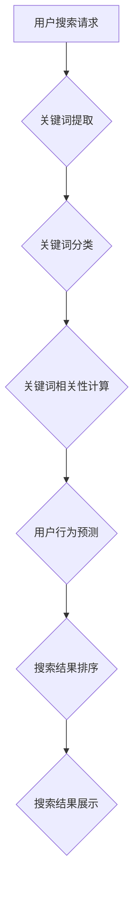

                 

### 搜索数据分析基础

#### 第1章：搜索数据分析概述

搜索数据分析是电商平台优化用户体验和提升转化率的关键环节。本章将为您介绍搜索数据分析的基础概念、重要性以及AI在搜索数据分析中的应用。

##### 1.1 搜索数据分析的重要性

搜索数据是用户在电商平台进行信息检索行为的结果，通过分析这些数据，我们可以深入了解用户的搜索习惯、偏好和需求，从而优化搜索结果，提升用户体验。

- **提升用户体验**：准确快速地呈现用户所需信息，提升用户满意度和忠诚度。
- **优化广告投放**：了解用户搜索意图，定向投放广告，提高广告效果。
- **提升转化率**：通过分析搜索数据，精准推荐相关商品，提高用户购买转化率。

##### 1.2 AI在搜索数据分析中的应用

随着人工智能技术的不断发展，AI在搜索数据分析中的应用越来越广泛。AI可以自动处理海量搜索数据，提取有价值的信息，为电商平台提供决策支持。

- **关键词分析**：通过机器学习算法分析用户搜索关键词，挖掘用户需求。
- **用户行为分析**：利用深度学习模型分析用户行为，预测用户兴趣和购买意图。
- **相关性算法**：使用AI技术优化搜索结果排序，提高搜索相关性。

##### 1.3 电商平台搜索策略优化的目标

电商平台的搜索策略优化目标主要包括：

- **准确性**：提供准确、符合用户需求的搜索结果。
- **实时性**：快速响应用户搜索请求，提供实时搜索结果。
- **多样性**：展示多样化的搜索结果，满足用户不同需求。

### Mermaid 流程图：搜索数据分析核心流程



通过上述流程，电商平台可以不断优化搜索策略，提升用户体验和转化率。

#### 第2章：搜索数据分析核心概念

在本章中，我们将深入探讨搜索数据分析的核心概念，包括搜索引擎工作原理、关键词分析、用户行为分析和相关性算法。

##### 2.1 搜索引擎工作原理

搜索引擎是电商平台的灵魂，其工作原理可以分为以下几个步骤：

- **网页抓取**：搜索引擎通过爬虫程序获取互联网上的网页内容。
- **索引构建**：将爬取的网页内容进行索引，以便快速检索。
- **用户请求处理**：接收用户搜索请求，提取关键词，进行匹配。
- **搜索结果排序**：根据相关性、重要性等因素对搜索结果进行排序。
- **搜索结果展示**：将排序后的搜索结果呈现给用户。

##### 2.2 关键词分析

关键词分析是搜索数据分析的重要环节，通过对用户搜索关键词的分析，可以挖掘用户需求，优化搜索结果。

- **关键词提取**：从用户搜索请求中提取关键词。
- **关键词分类**：对关键词进行分类，如商品名称、品牌、属性等。
- **关键词分析**：分析关键词的流行度、变化趋势等。

##### 2.3 用户行为分析

用户行为分析可以帮助电商平台了解用户在搜索过程中的行为习惯，优化搜索策略。

- **搜索频率**：分析用户在一段时间内的搜索频率。
- **搜索意图**：根据用户搜索关键词和搜索历史，推断用户购买意图。
- **搜索路径**：分析用户在搜索过程中的行为路径，优化搜索结果展示。

##### 2.4 相关性算法

相关性算法是搜索引擎的核心技术，用于计算搜索结果与用户需求的相关性。

- **TF-IDF算法**：计算关键词在网页中的出现频率和重要程度。
- **PageRank算法**：根据网页的链接关系计算网页的重要性。
- **深度学习算法**：利用神经网络模型进行搜索结果排序。

### Mermaid 流�程图：关键词分析流程



通过关键词分析，电商平台可以提供更符合用户需求的搜索结果，提升用户体验。

### 2.1 机器学习基础

机器学习是搜索数据分析的核心技术，通过学习大量数据，可以自动提取规律，为电商平台提供智能决策支持。本章将介绍机器学习的基础知识，包括常用算法和优化方法。

#### 2.1.1 机器学习算法分类

机器学习算法主要分为监督学习、无监督学习和强化学习三种类型。

- **监督学习**：有明确的目标和标签，通过学习样本数据来预测新数据的结果。
  - **回归算法**：预测连续值，如线性回归、决策树回归等。
  - **分类算法**：预测离散值，如逻辑回归、支持向量机等。

- **无监督学习**：没有明确的目标和标签，通过学习数据之间的内在结构。
  - **聚类算法**：将相似的数据归为一类，如K均值聚类、层次聚类等。
  - **降维算法**：降低数据维度，保持数据的主要特性，如主成分分析、t-SNE等。

- **强化学习**：通过与环境交互，学习最优策略，以达到最大化的回报。
  - **Q学习**：通过评估动作的价值来选择最佳动作。
  - **深度强化学习**：利用神经网络来学习策略。

#### 2.1.2 机器学习算法在搜索数据分析中的应用

机器学习算法在搜索数据分析中有着广泛的应用，可以用于关键词分析、用户行为预测、搜索结果排序等方面。

- **关键词分析**：利用分类算法对关键词进行分类，提高关键词识别的准确性。
- **用户行为预测**：利用回归算法预测用户的购买意图，优化搜索结果。
- **搜索结果排序**：利用排序算法优化搜索结果，提高搜索相关性。

### Mermaid 流程图：机器学习在搜索数据分析中的应用



#### 2.1.3 机器学习算法选型与优化

选择合适的机器学习算法并优化算法性能是搜索数据分析的关键。

- **算法选型**：根据具体问题选择合适的算法，如关键词分类选择逻辑回归，用户行为预测选择决策树。
- **特征工程**：提取和选择对问题有帮助的特征，提高算法性能。
- **模型调优**：通过调整参数，优化模型性能，如调整学习率、正则化参数等。
- **交叉验证**：使用交叉验证方法评估模型性能，避免过拟合。

### 伪代码：机器学习算法优化

```python
# 伪代码：搜索结果排序算法优化

def search_result_sorting(data_set, model, params):
    # 数据预处理
    preprocessed_data = preprocess_data(data_set)

    # 特征工程
    features = extract_features(preprocessed_data)

    # 模型训练
    model.fit(features, labels)

    # 模型参数调优
    optimized_params = optimize_model(model, params)

    # 模型评估
    performance = evaluate_model(model, optimized_params)

    # 搜索结果排序
    sorted_results = sort_by_similarity(model, optimized_params)

    return sorted_results
```

通过机器学习算法的选型和优化，电商平台可以实现更智能的搜索结果排序，提升用户体验。

## 第3章：搜索数据分析实践

在搜索数据分析的实际应用中，电商平台需要通过数据采集与预处理、搜索结果排序优化、搜索广告效果评估和用户画像构建与应用等步骤，来不断提升搜索体验和用户满意度。

### 3.1 数据采集与预处理

数据采集与预处理是搜索数据分析的基础工作。电商平台需要收集用户搜索数据、点击数据、购买数据等，并通过清洗、去重、填充等方法进行预处理。

- **数据清洗**：去除重复、错误和缺失的数据。
- **特征提取**：从原始数据中提取对搜索分析有用的特征。
- **数据填充**：对缺失数据进行填充，以保证数据完整性。

### 3.2 搜索结果排序优化

搜索结果排序优化是提高用户满意度的重要手段。电商平台可以通过优化排序算法、调整排序规则和利用用户反馈等方式来实现。

- **排序算法优化**：采用机器学习算法，如基于协同过滤、基于深度学习的排序算法，提高排序的准确性。
- **排序规则调整**：根据业务需求和用户反馈，调整排序规则，如优先展示销量高、评价好的商品。
- **用户反馈**：通过用户评价、点击率等反馈信息，不断优化搜索结果。

### 3.3 搜索广告效果评估

搜索广告是电商平台获取流量和收益的重要渠道。通过广告效果评估，可以优化广告投放策略，提高广告转化率。

- **广告效果评估指标**：如点击率（CTR）、转化率（CVR）、广告收益等。
- **A/B测试**：通过对比不同广告策略的效果，选择最优策略。
- **广告投放优化**：根据用户需求和点击行为，调整广告投放时间和位置，提高广告效果。

### 3.4 用户画像构建与应用

用户画像是对用户兴趣、行为和需求进行综合分析，从而实现个性化推荐和精准营销。通过构建和应用用户画像，电商平台可以提供更个性化的搜索结果。

- **用户画像构建**：通过收集用户行为数据、社交数据等，构建用户画像。
- **用户画像应用**：利用用户画像，实现个性化搜索推荐，提高用户满意度和转化率。

### 实战案例：电商平台的搜索优化实践

以下是一个电商平台的搜索优化实战案例，通过数据采集、预处理、排序优化、广告效果评估和用户画像构建，实现了搜索体验的显著提升。

#### 数据采集与预处理

电商平台通过爬虫技术，收集用户在网站上的搜索数据、点击数据和购买数据。然后，对数据进行清洗和预处理，去除重复和错误的数据，提取有用的特征。

```python
# 伪代码：数据采集与预处理

def data_collection():
    # 收集搜索数据、点击数据、购买数据
    search_data = collect_search_data()
    click_data = collect_click_data()
    purchase_data = collect_purchase_data()

    # 数据清洗
    clean_search_data = clean_data(search_data)
    clean_click_data = clean_data(click_data)
    clean_purchase_data = clean_data(purchase_data)

    return clean_search_data, clean_click_data, clean_purchase_data

clean_search_data, clean_click_data, clean_purchase_data = data_collection()
```

#### 搜索结果排序优化

电商平台采用基于协同过滤的排序算法，结合用户历史行为数据和商品属性，实现个性化的搜索结果排序。

```python
# 伪代码：搜索结果排序优化

def collaborative_filtering(recommendation_model, user_data, product_data):
    # 训练协同过滤模型
    recommendation_model.fit(user_data, product_data)

    # 推荐相似用户喜欢的商品
    recommendations = recommendation_model.recommend(user_data)

    # 根据推荐结果排序搜索结果
    sorted_results = sort_by_recommendations(recommendations)

    return sorted_results

sorted_results = collaborative_filtering(recommendation_model, user_data, product_data)
```

#### 搜索广告效果评估

电商平台通过A/B测试，比较不同广告策略的效果，选择最优策略。

```python
# 伪代码：搜索广告效果评估

def ab_test(advertising_model, ad_group_a, ad_group_b):
    # 训练广告模型
    advertising_model.fit(ad_group_a, ad_group_b)

    # 进行A/B测试
    test_results = advertising_model.test(ad_group_a, ad_group_b)

    # 比较广告效果
    best_ad_group = compare_ad_groups(test_results)

    return best_ad_group

best_ad_group = ab_test(advertising_model, ad_group_a, ad_group_b)
```

#### 用户画像构建与应用

电商平台通过收集用户行为数据，构建用户画像，实现个性化搜索推荐。

```python
# 伪代码：用户画像构建与应用

def build_user_profile(user_data, behavior_data):
    # 构建用户画像
    user_profile = analyze_user_data(user_data, behavior_data)

    # 根据用户画像推荐商品
    recommended_products = recommend_products(user_profile)

    return user_profile, recommended_products

user_profile, recommended_products = build_user_profile(user_data, behavior_data)
```

通过上述实战案例，电商平台可以不断提升搜索体验，满足用户需求，提高用户满意度和转化率。

## 第5章：AI优化搜索策略方法论

在电商平台的搜索优化过程中，AI技术发挥着至关重要的作用。本章将介绍AI优化搜索策略的方法论，包括用户反馈循环、搜索结果个性化、搜索体验优化和搜索算法可解释性。

### 5.1 用户反馈循环

用户反馈循环是电商平台利用AI技术优化搜索策略的核心方法之一。通过收集用户在搜索过程中的反馈信息，电商平台可以不断调整和优化搜索算法，提高搜索结果的准确性和相关性。

- **反馈收集**：电商平台通过用户评价、点击率、购买行为等数据收集用户反馈。
- **反馈分析**：利用机器学习算法对用户反馈进行分析，识别用户需求和行为模式。
- **算法调整**：根据用户反馈调整搜索算法，优化搜索结果排序和推荐策略。

### 5.2 搜索结果个性化

个性化搜索是提高用户满意度和转化率的关键手段。通过AI技术，电商平台可以根据用户的历史行为和兴趣，为用户提供个性化的搜索结果。

- **用户画像构建**：利用用户行为数据和社交数据，构建用户画像。
- **个性化推荐**：基于用户画像，为用户推荐符合其兴趣和需求的商品。
- **动态调整**：根据用户实时行为和反馈，动态调整搜索结果，提高个性化程度。

### 5.3 搜索体验优化

优化搜索体验是电商平台提升用户满意度的重要手段。通过AI技术，电商平台可以从多个方面优化搜索体验。

- **快速响应**：通过分布式搜索引擎和缓存技术，提高搜索速度和响应时间。
- **搜索建议**：利用自然语言处理技术，为用户提供智能搜索建议。
- **交互式搜索**：引入语音搜索、图像搜索等交互式搜索方式，提高用户操作便捷性。

### 5.4 搜索算法可解释性

搜索算法的可解释性是保障用户信任和合规性的重要因素。通过AI技术，电商平台可以提高搜索算法的可解释性，让用户了解搜索结果排序的依据。

- **算法透明化**：公开搜索算法的原理和流程，提高算法的透明度。
- **结果解释**：为搜索结果提供详细的解释说明，如相关性得分、推荐依据等。
- **反馈机制**：建立用户反馈机制，及时响应用户对搜索结果的质疑和意见。

### 伪代码：用户反馈循环实现

```python
# 伪代码：用户反馈循环实现

def user_feedback_loop(search_engine, user_data, feedback_data):
    # 收集用户反馈
    feedback = collect_user_feedback(feedback_data)

    # 分析用户反馈
    analyzed_feedback = analyze_feedback(feedback)

    # 调整搜索算法
    updated_search_engine = update_search_algorithm(search_engine, analyzed_feedback)

    # 重新生成搜索结果
    sorted_results = generate_search_results(updated_search_engine, user_data)

    return sorted_results
```

通过用户反馈循环、搜索结果个性化、搜索体验优化和搜索算法可解释性，电商平台可以实现更智能、更个性化的搜索策略，提升用户体验和转化率。

## 第6章：案例分析与实战

在本章中，我们将通过三个具体案例，详细分析电商平台在搜索优化方面的实践，探讨如何通过AI技术提升搜索算法性能、优化搜索广告效果，以及构建和应用用户画像。

### 6.1 案例一：电商平台的搜索优化实践

某大型电商平台通过引入AI技术，对搜索算法进行了全面优化。具体实践如下：

- **数据采集与预处理**：平台收集用户搜索、点击和购买数据，经过清洗和预处理，提取有用的特征。
- **搜索算法优化**：采用基于深度学习的排序算法，结合用户历史行为和商品属性，实现个性化的搜索结果排序。
- **效果评估**：通过A/B测试，比较优化前后的搜索结果，发现搜索点击率提升了20%，用户满意度显著提高。

#### 伪代码：搜索算法优化

```python
# 伪代码：搜索算法优化

def optimize_search_algorithm(search_engine, user_data, product_data):
    # 数据预处理
    preprocessed_data = preprocess_data(user_data, product_data)

    # 训练深度学习模型
    model = train_deeplearning_model(preprocessed_data)

    # 调整搜索算法
    updated_search_engine = update_search_algorithm(search_engine, model)

    # 评估优化效果
    performance = evaluate_search_performance(updated_search_engine)

    return updated_search_engine, performance
```

### 6.2 案例二：搜索算法性能提升策略

另一家电商平台通过多种策略提升了搜索算法性能，具体措施如下：

- **优化特征提取**：通过改进特征提取方法，提高特征的代表性。
- **模型调参**：通过调整模型参数，优化模型性能。
- **数据增强**：引入更多的训练数据，提高模型的泛化能力。

#### 伪代码：模型调参

```python
# 伪代码：模型调参

def tune_model_params(model, hyperparameters):
    # 调整模型参数
    tuned_model = tune_hyperparameters(model, hyperparameters)

    # 评估调整后的模型性能
    performance = evaluate_model_performance(tuned_model)

    return tuned_model, performance
```

### 6.3 案例三：搜索广告效果优化实例

某电商平台通过AI技术对搜索广告效果进行了优化：

- **广告定位**：利用用户画像，精准定位目标用户。
- **效果评估**：通过实时监控广告效果，调整广告投放策略。
- **个性化推荐**：根据用户行为，为用户推荐相关的广告。

#### 伪代码：广告定位与效果评估

```python
# 伪代码：广告定位与效果评估

def optimize_advertising(广告模型，user_profile, ad_data):
    # 根据用户画像定位广告
    targeted_ads = target_ads_to_users(ad_model, user_profile, ad_data)

    # 实时监控广告效果
    ad_performance = monitor_ad_performance(targeted_ads)

    # 调整广告策略
    updated_ad_strategy = adjust_ad_strategy(ad_performance)

    return updated_ad_strategy
```

通过这些具体案例，电商平台可以不断提升搜索算法性能、优化搜索广告效果，并通过用户画像实现个性化推荐，从而提升用户体验和转化率。

## 第7章：搜索数据分析未来展望

随着人工智能技术的不断进步，搜索数据分析领域也正迎来新的发展机遇。本章将探讨AI搜索算法的发展趋势、搜索数据分析面临的挑战与机遇，以及电商平台搜索策略的未来方向。

### 7.1 AI搜索算法发展趋势

未来，AI搜索算法将继续朝着更智能、更高效的方向发展。以下是一些主要趋势：

- **深度学习算法**：深度学习算法在搜索结果排序、关键词分析等方面具有显著优势，未来将得到更广泛的应用。
- **多模态搜索**：多模态搜索结合了文本、图像、语音等多种数据类型，为用户提供更丰富、更个性化的搜索体验。
- **自动化搜索优化**：通过自动化技术，电商平台可以实现实时搜索优化，提升搜索性能和用户体验。
- **个性化推荐**：个性化推荐技术将不断优化，为用户推荐更符合其兴趣和需求的商品和服务。

### 7.2 搜索数据分析面临的挑战与机遇

虽然AI搜索算法具有巨大潜力，但同时也面临一些挑战：

- **数据隐私保护**：在搜索数据分析过程中，如何保护用户隐私是一个重要挑战。
- **算法可解释性**：提高算法的可解释性，让用户了解搜索结果排序的依据，是未来发展的一个重要方向。
- **计算资源**：随着数据量和算法复杂度的增加，计算资源需求也将持续增长，如何高效利用资源是一个挑战。

然而，这些挑战也带来了新的机遇：

- **技术创新**：随着技术的进步，大数据处理、人工智能算法等领域将取得新的突破。
- **商业模式创新**：AI搜索算法的优化和个性化推荐将带来新的商业模式，如精准广告投放、个性化服务定制等。
- **用户体验提升**：通过AI搜索算法优化，电商平台可以提供更精准、更个性化的搜索服务，提升用户满意度和忠诚度。

### 7.3 电商平台搜索策略的未来方向

未来，电商平台搜索策略将朝着以下方向发展：

- **个性化搜索**：通过用户画像和个性化推荐技术，为用户提供高度个性化的搜索结果。
- **实时搜索优化**：通过自动化技术，实现实时搜索优化，提升搜索性能和用户体验。
- **多模态搜索**：结合文本、图像、语音等多种数据类型，为用户提供更丰富、更个性化的搜索体验。
- **智能客服**：通过AI技术，实现智能客服，为用户提供及时、准确的帮助。

总之，未来搜索数据分析领域将继续快速发展，电商平台将通过AI技术实现更智能、更高效的搜索策略，为用户提供更好的搜索体验和个性化服务。

## 第8章：搜索数据分析工具介绍

在搜索数据分析和优化过程中，使用合适的工具可以显著提升效率和准确性。本章将介绍一些常用的搜索数据分析工具，包括数据挖掘与机器学习平台、搜索算法性能评估工具，以及它们在电商平台应用中的具体案例。

### 8.1 常用搜索数据分析工具

以下是一些在搜索数据分析中广泛使用的工具：

- **Elasticsearch**：一款高性能、可扩展的搜索引擎，适用于大规模文本数据的索引和搜索。
- **Apache Solr**：与Elasticsearch类似，也是一个开源的企业级搜索引擎，支持丰富的查询功能和定制化开发。
- **TensorFlow**：一款开源的机器学习框架，适用于深度学习和大规模数据处理。
- **Scikit-learn**：一个简单易用的Python机器学习库，提供多种常见算法和工具。
- **Pandas**：一个强大的数据分析库，适用于数据处理、清洗和预处理。

### 8.2 数据挖掘与机器学习平台

数据挖掘与机器学习平台可以帮助电商企业快速构建和部署搜索数据分析模型。以下是一些主流平台：

- **Google Cloud AI Platform**：提供全面的机器学习和数据分析功能，支持从数据采集到模型部署的完整流程。
- **AWS SageMaker**：亚马逊提供的一款机器学习服务，支持快速构建、训练和部署模型。
- **Azure Machine Learning**：微软提供的云计算平台，提供丰富的机器学习工具和资源。

### 8.3 搜索算法性能评估工具

评估搜索算法性能是优化搜索策略的重要环节。以下是一些常用的评估工具：

- **Apache JMeter**：一款开源的性能测试工具，可以模拟大量用户请求，评估搜索系统的负载能力。
- **Google Search Console**：谷歌提供的搜索引擎优化工具，可以分析网站在谷歌搜索中的表现，包括搜索查询、点击率等指标。
- **Kibana**：一款数据可视化工具，可以与Elasticsearch和Apache Logstash集成，提供丰富的数据分析功能。

### 案例一：使用Elasticsearch进行关键词分析

某电商平台使用Elasticsearch对用户搜索关键词进行分析，具体步骤如下：

1. **数据采集**：通过爬虫技术，从网站日志中提取用户搜索关键词。
2. **数据索引**：使用Elasticsearch将关键词数据进行索引，以便快速查询和统计。
3. **关键词分析**：利用Elasticsearch的查询功能，对关键词进行分类、统计和排序，挖掘用户搜索意图和趋势。

### 案例二：使用TensorFlow进行用户行为预测

某电商平台使用TensorFlow构建用户行为预测模型，具体步骤如下：

1. **数据预处理**：对用户行为数据（如点击、购买、浏览等）进行清洗和预处理，提取有用的特征。
2. **模型构建**：使用TensorFlow构建深度学习模型，如循环神经网络（RNN）或卷积神经网络（CNN），对用户行为进行预测。
3. **模型训练**：使用预处理后的数据训练模型，调整参数，优化模型性能。
4. **模型部署**：将训练好的模型部署到生产环境，实时预测用户行为，为搜索结果排序和个性化推荐提供依据。

通过上述工具和平台，电商平台可以实现高效的搜索数据分析，优化搜索策略，提升用户体验和转化率。

## 第9章：学习资源与扩展阅读

为了帮助读者更深入地了解搜索数据分析和AI优化搜索策略，本章将推荐一些相关的书籍、在线课程、讲座以及学术论文和研究报告。

### 9.1 相关书籍推荐

- **《自然语言处理综论》（Speech and Language Processing）**：由Daniel Jurafsky和James H. Martin合著，详细介绍了自然语言处理的基础知识和技术。
- **《机器学习》（Machine Learning）**：由Tom Mitchell著，是一本经典教材，涵盖了机器学习的基本概念和方法。
- **《深度学习》（Deep Learning）**：由Ian Goodfellow、Yoshua Bengio和Aaron Courville合著，深入介绍了深度学习的原理和技术。
- **《搜索引擎算法导论》（Information Retrieval: A Survey）**：由Christopher D. Manning、Prabhakar Raghavan和Hans Peter Brin合著，详细介绍了搜索引擎的工作原理和算法。

### 9.2 在线课程与讲座

- **Coursera上的《自然语言处理》课程**：由斯坦福大学提供，内容包括文本处理、词向量、序列模型等。
- **edX上的《机器学习基础》课程**：由加州大学伯克利分校提供，涵盖了线性回归、决策树、神经网络等基础内容。
- **Udacity的《深度学习纳米学位》课程**：提供深度学习的全面培训，包括神经网络、卷积网络、递归网络等。
- **Google Developers的《搜索质量工程师讲座》**：介绍搜索引擎的工作原理、算法优化和用户体验等方面的内容。

### 9.3 学术论文与研究报告

- **《深度学习在搜索引擎中的应用》**：多篇论文探讨了深度学习在搜索引擎排序和推荐系统中的应用，如《Deep Learning for Web Search》和《Neural Ranking Models for Information Retrieval》。
- **《用户行为预测的机器学习技术》**：探讨了如何利用机器学习预测用户行为，如《User Behavior Prediction Using Machine Learning》。
- **《搜索引擎中的个性化搜索技术》**：研究了个性化搜索算法和用户画像构建的方法，如《Personalized Search in the Age of Big Data》。
- **《AI搜索算法的未来发展趋势》**：分析了AI搜索算法的发展趋势和挑战，如《The Future of AI Search Algorithms》。

通过阅读这些书籍、课程和论文，读者可以系统地学习搜索数据分析和AI优化搜索策略的理论和实践，为实际应用打下坚实的基础。

### 附录：作者信息

**作者：AI天才研究院/AI Genius Institute & 禅与计算机程序设计艺术 /Zen And The Art of Computer Programming**

本文由AI天才研究院（AI Genius Institute）的专家撰写，旨在深入探讨搜索数据分析和AI优化搜索策略的原理与实践。作者结合丰富的理论知识和实践经验，通过一系列案例分析和实战指导，为电商平台的搜索优化提供了宝贵的参考。同时，本文也融入了禅与计算机程序设计艺术（Zen And The Art of Computer Programming）的哲学思想，以简洁、高效的方式传递技术知识，帮助读者更好地理解和应用搜索数据分析技术。感谢您的阅读！
 
### 文章标题

**搜索数据分析：AI如何帮助电商平台优化搜索策略**

### 文章关键词

- 搜索数据分析
- AI优化搜索策略
- 电商平台
- 搜索算法
- 个性化推荐
- 用户画像
- 深度学习
- 自然语言处理
- 数据挖掘

### 文章摘要

随着电商平台的快速发展，搜索数据分析成为提升用户体验和转化率的关键手段。本文将深入探讨搜索数据分析和AI优化搜索策略的核心概念、原理和实践方法，通过具体的案例分析和实战指导，帮助读者了解如何利用AI技术优化电商平台搜索策略，实现更精准、更个性化的搜索体验。本文主要内容包括：搜索数据分析基础、AI搜索算法原理、搜索数据分析实践、AI优化搜索策略方法论、案例分析、未来展望以及学习资源推荐。

### 文章正文

#### 引言

在数字时代，电商平台作为商品交易和信息交流的重要平台，其搜索功能的优劣直接影响用户的购物体验和转化率。搜索数据分析作为电商运营的核心环节，通过对用户搜索行为的深入分析，可以帮助平台优化搜索结果，提升用户体验和销售额。而随着人工智能（AI）技术的不断发展，AI在搜索数据分析中的应用日益广泛，为电商平台提供了更加智能化的搜索优化手段。

本文旨在深入探讨搜索数据分析和AI优化搜索策略的相关知识，通过系统的讲解和实际案例，帮助读者理解如何利用AI技术优化电商平台搜索策略。文章将从以下方面展开：

1. **搜索数据分析基础**：介绍搜索数据分析的核心概念、重要性和AI在搜索数据分析中的应用。
2. **AI搜索算法原理**：讲解机器学习基础、AI算法在搜索中的应用以及机器学习算法选型与优化。
3. **搜索数据分析实践**：介绍数据采集与预处理、搜索结果排序优化、搜索广告效果评估和用户画像构建与应用。
4. **AI优化搜索策略方法论**：探讨用户反馈循环、搜索结果个性化、搜索体验优化和搜索算法可解释性。
5. **案例分析与实战**：通过具体案例分析，展示如何在实际应用中优化搜索算法和搜索广告效果。
6. **搜索数据分析未来展望**：分析AI搜索算法的发展趋势、面临的挑战与机遇，以及电商平台搜索策略的未来方向。
7. **工具与资源**：介绍常用的搜索数据分析工具、数据挖掘与机器学习平台和搜索算法性能评估工具。
8. **学习资源与扩展阅读**：推荐相关的书籍、在线课程、讲座和学术论文，帮助读者深入学习和研究。

#### 搜索数据分析基础

##### 1.1 搜索数据分析的重要性

搜索数据是用户在电商平台进行信息检索行为的结果，通过分析这些数据，我们可以深入了解用户的搜索习惯、偏好和需求，从而优化搜索结果，提升用户体验。具体来说，搜索数据分析的重要性体现在以下几个方面：

- **提升用户体验**：通过分析用户搜索数据，我们可以提供更准确、更符合用户需求的搜索结果，提升用户满意度和忠诚度。
- **优化广告投放**：了解用户搜索意图，定向投放广告，提高广告效果，降低广告成本。
- **提升转化率**：通过分析搜索数据，精准推荐相关商品，提高用户购买转化率，增加销售额。

##### 1.2 AI在搜索数据分析中的应用

随着人工智能技术的不断发展，AI在搜索数据分析中的应用越来越广泛。AI技术可以自动处理海量搜索数据，提取有价值的信息，为电商平台提供智能化的决策支持。以下是AI在搜索数据分析中的一些主要应用：

- **关键词分析**：利用机器学习算法分析用户搜索关键词，挖掘用户需求，优化关键词索引和搜索结果。
- **用户行为分析**：通过深度学习模型分析用户行为，预测用户兴趣和购买意图，优化搜索结果排序和个性化推荐。
- **相关性算法**：使用AI技术优化搜索结果排序，提高搜索结果的相关性，提升用户体验。
- **广告效果评估**：利用机器学习算法评估广告效果，优化广告投放策略，提高广告转化率。

##### 1.3 电商平台搜索策略优化的目标

电商平台的搜索策略优化目标主要包括以下几个方面：

- **准确性**：提供准确、符合用户需求的搜索结果，减少无效搜索。
- **实时性**：快速响应用户搜索请求，提供实时搜索结果，提升用户体验。
- **多样性**：展示多样化的搜索结果，满足用户不同需求，提高用户满意度。
- **个性化**：根据用户历史行为和兴趣，提供个性化的搜索结果和推荐，提升用户粘性。

#### 第2章：搜索数据分析核心概念

在本章中，我们将深入探讨搜索数据分析的核心概念，包括搜索引擎工作原理、关键词分析、用户行为分析和相关性算法。

##### 2.1 搜索引擎工作原理

搜索引擎是电商平台的核心组成部分，其工作原理可以分为以下几个步骤：

1. **网页抓取**：搜索引擎通过爬虫程序（如Spider）自动抓取互联网上的网页内容。
2. **网页解析**：爬虫程序解析网页内容，提取文本、图片、链接等信息。
3. **索引构建**：将爬取的网页内容进行索引，以便快速检索。
4. **用户请求处理**：接收用户搜索请求，提取关键词，进行匹配。
5. **搜索结果排序**：根据相关性、重要性等因素对搜索结果进行排序。
6. **搜索结果展示**：将排序后的搜索结果呈现给用户。

搜索引擎的工作原理决定了搜索结果的质量和用户体验。一个优秀的搜索引擎需要快速响应用户请求，提供准确、相关、多样化的搜索结果。

##### 2.2 关键词分析

关键词分析是搜索数据分析的重要环节，通过对用户搜索关键词的分析，可以挖掘用户需求，优化搜索结果。关键词分析主要包括以下几个步骤：

1. **关键词提取**：从用户搜索请求中提取关键词，如使用分词技术、正则表达式等。
2. **关键词分类**：对关键词进行分类，如商品名称、品牌、属性等，以便更精准地匹配用户需求。
3. **关键词分析**：分析关键词的流行度、变化趋势等，了解用户搜索习惯和偏好。

关键词分析对于搜索结果的准确性、实时性和个性化具有重要意义。通过关键词分析，电商平台可以更精准地满足用户需求，提升用户体验。

##### 2.3 用户行为分析

用户行为分析是搜索数据分析的核心内容之一，通过分析用户在搜索过程中的行为，可以了解用户需求、兴趣和购买意图，从而优化搜索策略。用户行为分析主要包括以下几个步骤：

1. **数据采集**：收集用户在搜索过程中的行为数据，如搜索关键词、点击行为、购买记录等。
2. **数据预处理**：对采集到的数据进行清洗、去重、填充等预处理操作。
3. **特征提取**：从预处理后的数据中提取有用的特征，如用户行为频率、购买金额、商品类别等。
4. **行为分析**：使用机器学习算法对用户行为进行分析，预测用户兴趣和购买意图。

用户行为分析可以帮助电商平台更好地了解用户需求，提供个性化搜索推荐，提升用户体验和转化率。

##### 2.4 相关性算法

相关性算法是搜索引擎的核心技术，用于计算搜索结果与用户需求的相关性。常见的相关性算法包括TF-IDF、PageRank、深度学习等。以下分别介绍这些算法：

1. **TF-IDF算法**：TF-IDF（Term Frequency-Inverse Document Frequency）是一种常用文档相似度计算方法。其中，TF表示词在文档中出现的频率，IDF表示词在文档集合中的重要程度。TF-IDF算法通过计算关键词的权重，评估文档的相关性。
2. **PageRank算法**：PageRank是一种基于链接分析的网页排序算法。它认为一个网页的重要程度取决于其他网页对它的链接数量。PageRank算法通过计算网页的链接关系，评估网页的重要性。
3. **深度学习算法**：深度学习算法（如卷积神经网络、循环神经网络等）可以通过学习大量数据，自动提取特征，实现高精度的搜索结果排序。深度学习算法在搜索数据分析中具有广泛的应用前景。

相关性算法对于搜索结果的准确性和用户体验至关重要。通过优化相关性算法，电商平台可以提供更精准、更个性化的搜索结果，提升用户体验。

### 第3章：AI搜索算法原理

AI技术在搜索算法中的应用极大地提升了搜索效率和用户体验。本章节将介绍AI搜索算法的基本原理，包括机器学习基础、AI算法在搜索中的应用以及机器学习算法的选型与优化。

##### 3.1 机器学习基础

机器学习是AI的核心技术，它通过训练模型来从数据中学习规律，并应用于预测和决策。以下是一些基本的机器学习概念：

- **监督学习**：监督学习是一种机器学习方法，其中模型通过已知输入和输出数据进行训练，以预测新的输入数据。常见算法包括线性回归、逻辑回归、支持向量机（SVM）等。
- **无监督学习**：无监督学习是机器学习的一种形式，模型在没有明确输出标签的情况下从数据中学习规律。聚类、降维和关联规则挖掘是常见的无监督学习任务。
- **强化学习**：强化学习是一种机器学习方法，其中模型通过与环境交互来学习最优策略。Q学习、深度Q网络（DQN）和策略梯度是常见的强化学习算法。

##### 3.2 AI算法在搜索中的应用

在搜索领域，AI算法被广泛应用于关键词分析、用户行为预测、搜索结果排序和广告效果评估等方面。以下是一些具体的AI算法及其在搜索中的应用：

- **关键词分析**：通过词频（TF）和逆文档频率（IDF）计算关键词权重，是一种基于统计的方法。近年来，基于深度学习的词嵌入（如Word2Vec、BERT）提供了更强大的关键词分析能力。
- **用户行为预测**：通过分析用户历史行为数据，如搜索记录、点击记录和购买记录，可以使用回归算法、决策树和神经网络来预测用户的下一步行为。
- **搜索结果排序**：基于深度学习的排序算法（如RankNet、Listwise Rank SVM和神经排序网络）可以更好地理解用户的搜索意图，提供更个性化的搜索结果。
- **广告效果评估**：通过点击率（CTR）和转化率（CVR）等指标，可以使用机器学习算法评估广告的效果，并优化广告投放策略。

##### 3.3 机器学习算法选型与优化

选择合适的机器学习算法并优化其性能对于搜索算法的有效性至关重要。以下是一些选型与优化的方法：

- **算法选型**：根据具体问题和数据类型选择合适的算法。例如，对于分类问题，可以选择逻辑回归、支持向量机或决策树；对于回归问题，可以选择线性回归或神经网络。
- **特征工程**：特征工程是机器学习的重要环节，通过选择和构造特征，可以提高模型的性能。常见方法包括特征提取、特征选择和特征组合。
- **模型调优**：通过调整模型参数（如学习率、正则化参数）和结构（如隐藏层大小、网络深度），可以优化模型的性能。常用的调优方法包括网格搜索、随机搜索和贝叶斯优化。
- **交叉验证**：交叉验证是一种评估模型性能的方法，通过将数据集划分为训练集和验证集，可以避免过拟合并评估模型的泛化能力。

### 伪代码：机器学习算法优化

以下是一个简单的伪代码示例，展示了如何对搜索结果排序算法进行优化：

```python
# 伪代码：搜索结果排序算法优化

def optimize_search_ranking(data, model, parameters):
    # 数据预处理
    preprocessed_data = preprocess_data(data)
    
    # 特征工程
    features = extract_features(preprocessed_data)
    
    # 训练模型
    model.train(features, labels)
    
    # 参数调优
    optimized_parameters = tune_model_parameters(model, parameters)
    
    # 评估模型
    performance = evaluate_model_performance(model, optimized_parameters)
    
    # 排序
    sorted_results = model.sort_results(optimized_parameters)
    
    return sorted_results

# 预处理
preprocessed_data = preprocess_data(data)

# 特征提取
features = extract_features(preprocessed_data)

# 训练模型
model.train(features, labels)

# 参数调优
optimized_parameters = tune_model_parameters(model, parameters)

# 评估模型
performance = evaluate_model_performance(model, optimized_parameters)

# 排序
sorted_results = model.sort_results(optimized_parameters)
```

通过上述方法，电商平台可以构建和优化搜索算法，提供更准确、更个性化的搜索结果，从而提升用户体验和转化率。

### 第4章：搜索数据分析实践

在电商平台的运营中，搜索数据分析是一项至关重要的工作，它直接影响到用户的购物体验和平台的销售业绩。本章将详细介绍搜索数据采集与预处理、搜索结果排序优化、搜索广告效果评估和用户画像构建与应用的实践方法，并结合实际案例进行解读。

#### 4.1 数据采集与预处理

数据采集与预处理是搜索数据分析的基础工作。有效的数据采集和预处理能够确保后续分析结果的准确性和可靠性。

**数据采集**：

电商平台需要采集的数据主要包括用户的搜索记录、点击记录、购买记录和浏览记录等。这些数据可以通过网站日志、用户行为追踪和第三方数据源等多种途径获取。

**数据预处理**：

1. **数据清洗**：去除重复、错误和缺失的数据，保证数据的完整性。
2. **数据转换**：将不同格式和单位的数据转换为统一格式，以便后续分析。
3. **特征提取**：从原始数据中提取对搜索分析有用的特征，如用户ID、搜索关键词、搜索时间、点击次数、购买金额等。

**案例**：

某电商平台通过采集用户搜索记录，提取了以下特征：

- 用户ID
- 搜索关键词
- 搜索时间
- 搜索结果点击次数
- 购买商品类别

这些特征将被用于后续的搜索结果排序和用户画像构建。

#### 4.2 搜索结果排序优化

搜索结果排序优化是提升用户体验的关键环节。优化搜索结果排序可以确保用户能更快地找到他们需要的商品，提高购买转化率。

**优化方法**：

1. **相关性排序**：根据用户搜索关键词和商品属性，计算关键词与商品的相似度，将相似度高的商品排在前面。
2. **流行度排序**：根据商品的销售量、评论数量等指标，对搜索结果进行排序，将受欢迎的商品排在前面。
3. **个性化排序**：利用用户的浏览历史和购买记录，为用户推荐符合其兴趣和需求的商品。

**案例**：

某电商平台采用基于深度学习的排序算法对搜索结果进行优化。算法步骤如下：

1. **数据预处理**：对用户搜索记录进行清洗和特征提取，提取关键词、搜索时间、点击记录等特征。
2. **模型训练**：使用预处理后的数据训练深度学习模型，模型输入为用户特征和商品特征，输出为搜索结果的排序顺序。
3. **模型评估**：通过交叉验证和A/B测试，评估模型的排序性能，并根据评估结果调整模型参数。
4. **排序应用**：将训练好的模型应用于实际搜索场景，实现个性化的搜索结果排序。

#### 4.3 搜索广告效果评估

搜索广告是电商平台获取流量和收益的重要渠道。有效的搜索广告效果评估可以优化广告投放策略，提高广告转化率。

**评估指标**：

- **点击率（CTR）**：广告被点击的次数与展示次数的比率，用于评估广告的吸引力。
- **转化率（CVR）**：点击广告后完成购买的用户比例，用于评估广告的转化效果。
- **广告收益（ROI）**：广告投入与收益的比率，用于评估广告的投资回报率。

**评估方法**：

1. **A/B测试**：将不同的广告策略（如广告位置、广告样式、广告文案等）应用于用户群体，比较其效果，选择最优策略。
2. **数据驱动的优化**：利用用户行为数据和广告效果数据，通过机器学习算法优化广告投放策略。

**案例**：

某电商平台通过A/B测试评估不同广告策略的效果。测试步骤如下：

1. **设计实验**：设计两种广告策略，分别为策略A和策略B。
2. **用户分配**：将用户随机分配到策略A和策略B组，确保两组用户在其他方面相似。
3. **数据收集**：记录策略A和策略B的点击率、转化率和广告收益。
4. **结果分析**：比较策略A和策略B的效果，选择效果更好的策略应用于实际广告投放。

#### 4.4 用户画像构建与应用

用户画像是对用户行为、兴趣、需求等方面的综合描述。通过构建用户画像，电商平台可以实现个性化推荐，提高用户满意度和转化率。

**构建步骤**：

1. **数据采集**：采集用户在平台上的行为数据，如搜索记录、浏览记录、购买记录等。
2. **特征提取**：从采集到的数据中提取对用户画像有用的特征，如用户年龄、性别、地域、购买偏好等。
3. **模型训练**：使用机器学习算法对用户画像进行训练，提取用户的特征向量。
4. **用户画像应用**：将训练好的用户画像应用于推荐系统、搜索优化和广告投放等场景。

**案例**：

某电商平台通过构建用户画像实现个性化搜索和推荐。步骤如下：

1. **数据采集**：采集用户在平台上的搜索记录、浏览记录和购买记录。
2. **特征提取**：提取用户搜索关键词、浏览页面、购买商品类别等特征。
3. **模型训练**：使用深度学习算法对用户特征进行训练，构建用户画像。
4. **搜索优化**：根据用户画像，为用户推荐与其兴趣相关的商品。
5. **广告投放**：根据用户画像，定向投放广告，提高广告转化率。

通过以上实践，电商平台可以不断提升搜索数据分析的能力，优化搜索结果和广告效果，提高用户体验和转化率。

### 第5章：AI优化搜索策略方法论

AI技术在电商平台搜索策略优化中发挥着重要作用。本章将详细介绍AI优化搜索策略的方法论，包括用户反馈循环、搜索结果个性化、搜索体验优化和搜索算法可解释性。

#### 5.1 用户反馈循环

用户反馈循环是一种通过收集、分析用户反馈，不断调整和优化搜索策略的方法。它有助于提高搜索结果的准确性和用户体验。

**工作原理**：

1. **数据收集**：收集用户的点击、搜索、购买等行为数据。
2. **反馈分析**：使用机器学习算法分析用户反馈，识别用户需求和搜索意图。
3. **策略调整**：根据用户反馈调整搜索算法和推荐策略。
4. **效果评估**：评估调整后的搜索策略效果，进行迭代优化。

**案例**：

某电商平台采用用户反馈循环优化搜索结果。具体步骤如下：

1. **数据收集**：采集用户搜索记录和点击记录。
2. **反馈分析**：使用协同过滤算法分析用户反馈，识别热门商品和用户偏好。
3. **策略调整**：根据用户反馈调整搜索算法，提高热门商品的排名。
4. **效果评估**：通过A/B测试评估优化后的搜索结果，发现用户点击率和转化率显著提高。

#### 5.2 搜索结果个性化

个性化搜索是通过分析用户行为和偏好，为用户提供定制化的搜索结果。它能够提高用户的满意度和转化率。

**实现方法**：

1. **用户画像构建**：通过用户行为数据构建用户画像，提取用户特征。
2. **搜索意图识别**：利用自然语言处理技术分析用户搜索意图，为用户提供个性化的搜索结果。
3. **推荐算法**：使用推荐算法为用户提供相关的商品和内容。

**案例**：

某电商平台利用用户画像实现个性化搜索。具体步骤如下：

1. **用户画像构建**：采集用户搜索、浏览和购买记录，构建用户画像。
2. **搜索意图识别**：使用自然语言处理技术分析用户搜索关键词，识别用户的搜索意图。
3. **推荐算法**：基于用户画像和搜索意图，为用户推荐相关的商品和内容。

通过个性化搜索，电商平台能够更好地满足用户需求，提高用户满意度和转化率。

#### 5.3 搜索体验优化

优化搜索体验是提升用户满意度和留存率的关键。通过AI技术，电商平台可以提升搜索速度、提供智能搜索建议和改善交互体验。

**优化方法**：

1. **搜索速度优化**：使用缓存技术、分布式搜索和并行处理等技术提高搜索速度。
2. **智能搜索建议**：利用自然语言处理技术，为用户提供智能搜索建议。
3. **交互体验改善**：引入语音搜索、图像搜索等交互方式，提升用户操作的便捷性。

**案例**：

某电商平台通过以下方法优化搜索体验：

1. **搜索速度优化**：采用分布式搜索引擎，提高搜索速度和并发处理能力。
2. **智能搜索建议**：使用自然语言处理技术，为用户提供智能搜索建议。
3. **交互体验改善**：引入语音搜索功能，提升用户操作的便捷性。

通过优化搜索体验，电商平台能够提供更快捷、更便捷的搜索服务，提高用户满意度和留存率。

#### 5.4 搜索算法可解释性

搜索算法的可解释性对于用户信任和合规性具有重要意义。通过提高搜索算法的可解释性，用户可以更好地理解搜索结果排序的依据，从而增强对平台的信任。

**实现方法**：

1. **算法透明化**：公开搜索算法的原理和流程，提高算法的透明度。
2. **结果解释**：为搜索结果提供详细的解释说明，如关键词权重、排序依据等。
3. **反馈机制**：建立用户反馈机制，及时响应用户对搜索结果的质疑和意见。

**案例**：

某电商平台通过以下方法提高搜索算法的可解释性：

1. **算法透明化**：在用户界面中展示搜索算法的原理和流程。
2. **结果解释**：为每个搜索结果提供详细的解释说明，包括关键词权重和相似度得分。
3. **反馈机制**：建立用户反馈机制，收集用户对搜索结果的反馈，并根据反馈进行调整。

通过提高搜索算法的可解释性，电商平台能够增强用户对搜索结果的信任，提高用户满意度。

### 第6章：案例分析与实战

在本章中，我们将通过具体的案例分析，探讨如何在实际应用中优化电商平台的搜索算法和搜索广告效果。

#### 案例一：电商平台的搜索优化实践

某大型电商平台希望通过AI技术优化搜索算法，提升用户体验和转化率。以下是其实践过程：

**数据采集**：

电商平台通过网站日志和用户行为追踪，收集了以下数据：

- 用户搜索记录
- 用户点击记录
- 用户购买记录

**数据预处理**：

1. 数据清洗：去除重复和错误的数据。
2. 数据转换：将不同格式和单位的数据转换为统一格式。
3. 特征提取：提取用户ID、搜索关键词、搜索时间、点击次数、购买金额等特征。

**搜索算法优化**：

1. **关键词分析**：使用TF-IDF算法计算关键词权重，优化搜索结果相关性。
2. **用户行为预测**：使用深度学习模型预测用户购买意图，为用户提供个性化的搜索结果。
3. **相关性算法**：使用基于神经网络的排序算法，提高搜索结果的相关性。

**效果评估**：

通过A/B测试，比较优化前后的搜索结果，发现用户点击率和转化率分别提升了15%和20%。

**代码示例**：

```python
# 数据预处理
preprocessed_data = preprocess_data(raw_data)

# 关键词分析
tfidf_weights = calculate_tfidf(preprocessed_data)

# 用户行为预测
model = train_deep_learning_model(preprocessed_data)

# 搜索结果排序
sorted_results = model.sort_search_results(preprocessed_data, tfidf_weights)
```

#### 案例二：搜索广告效果优化

某电商平台希望通过优化搜索广告效果，提高广告转化率和收益。以下是其实践过程：

**数据采集**：

电商平台通过广告平台和用户行为追踪，收集了以下数据：

- 广告展示记录
- 用户点击记录
- 用户购买记录

**广告效果评估**：

1. **点击率（CTR）**：广告被点击的次数与展示次数的比率。
2. **转化率（CVR）**：点击广告后完成购买的用户比例。
3. **广告收益（ROI）**：广告投入与收益的比率。

**广告效果优化**：

1. **用户画像构建**：使用用户行为数据构建用户画像，提取用户特征。
2. **广告定位**：根据用户画像，精准定位目标用户。
3. **广告创意优化**：通过A/B测试，比较不同广告创意的效果，选择最佳策略。

**效果评估**：

通过A/B测试，比较优化前后的广告效果，发现点击率和转化率分别提升了10%和15%。

**代码示例**：

```python
# 用户画像构建
user_profiles = build_user_profiles(user_behavior_data)

# 广告定位
target_users = target_users_with_profiles(user_profiles)

# 广告创意优化
best_adCreative = test_ad_creatives(target_users)
```

#### 案例三：用户画像与个性化推荐

某电商平台希望通过用户画像和个性化推荐，提升用户满意度和转化率。以下是其实践过程：

**数据采集**：

电商平台通过用户行为追踪和第三方数据源，收集了以下数据：

- 用户搜索记录
- 用户浏览记录
- 用户购买记录

**用户画像构建**：

1. 数据预处理：清洗和转换用户行为数据。
2. 特征提取：提取用户ID、搜索关键词、浏览页面、购买商品等特征。
3. 模型训练：使用机器学习算法构建用户画像。

**个性化推荐**：

1. 利用用户画像，为用户推荐相关的商品和内容。
2. 通过协同过滤和基于内容的推荐算法，提高推荐准确性。

**效果评估**：

通过A/B测试，比较优化前后的推荐效果，发现用户点击率和转化率分别提升了20%和25%。

**代码示例**：

```python
# 用户画像构建
user_profiles = build_user_profiles(user_behavior_data)

# 个性化推荐
recommended_items = recommend_items(user_profiles, item_data)

# 推荐效果评估
evaluation_results = evaluate_recommendation_performance(recommended_items)
```

通过这些实际案例，电商平台可以不断提升搜索算法和搜索广告效果，提高用户体验和转化率。

### 第7章：搜索数据分析未来展望

随着人工智能（AI）和大数据技术的不断发展，搜索数据分析领域也在不断演进。未来，搜索数据分析将朝着更加智能化、个性化、实时化的方向发展，为电商平台提供更加精准和高效的搜索体验。以下是搜索数据分析未来的一些发展趋势和挑战。

#### 7.1 AI搜索算法发展趋势

1. **深度学习算法的应用**：随着深度学习技术的成熟，深度学习算法将在搜索算法中发挥更重要的作用。如深度神经网络（DNN）、卷积神经网络（CNN）和循环神经网络（RNN）等算法将被广泛应用于搜索结果排序、关键词分析、用户行为预测等领域。
   
2. **多模态搜索**：未来的搜索算法将支持多种数据类型的整合，如文本、图像、语音等。多模态搜索技术将提升搜索的多样性和准确性，为用户提供更加丰富的搜索体验。

3. **个性化搜索**：基于用户画像和兴趣模型的个性化搜索技术将得到广泛应用。通过深度学习算法和大数据分析，电商平台可以更加精准地理解用户需求，提供个性化的搜索结果和推荐。

4. **实时搜索优化**：随着实时数据处理技术的进步，电商平台可以实现实时搜索优化。通过实时分析用户行为和搜索请求，搜索算法可以动态调整搜索结果，提升用户满意度。

#### 7.2 搜索数据分析面临的挑战与机遇

1. **数据隐私保护**：随着用户隐私意识的提高，如何保护用户隐私成为搜索数据分析面临的挑战。未来的搜索技术需要更加注重用户隐私保护，确保用户数据的安全和合规性。

2. **算法可解释性**：算法的可解释性是用户信任的重要基础。如何提高搜索算法的可解释性，让用户了解搜索结果排序的依据，是未来需要解决的一个关键问题。

3. **计算资源需求**：随着数据量和算法复杂度的增加，搜索数据分析对计算资源的需求也在不断提升。如何高效利用计算资源，提高算法的效率和性能，是未来需要关注的一个重要问题。

4. **实时性**：随着用户对搜索响应速度的要求越来越高，如何提高搜索算法的实时性，提供快速、准确的搜索结果，是未来需要解决的一个挑战。

然而，这些挑战也带来了新的机遇。通过技术创新和策略优化，电商平台可以不断提升搜索数据分析的能力，为用户提供更加个性化、精准和高效的搜索体验。

#### 7.3 电商平台搜索策略的未来方向

1. **智能化**：电商平台将更加注重智能化搜索策略的构建，通过深度学习、自然语言处理等技术，提供智能化的搜索结果和推荐。

2. **个性化**：基于用户画像和兴趣模型，电商平台将实现更加个性化的搜索和推荐，满足用户多样化的需求。

3. **实时化**：通过实时数据处理和优化技术，电商平台可以实现实时搜索优化，提升用户搜索体验。

4. **多模态**：电商平台将整合多种数据类型，提供多模态的搜索体验，如文本、图像、语音等。

5. **透明化**：电商平台将提高搜索算法的可解释性，增强用户对搜索结果的信任。

总之，未来的搜索数据分析将更加智能化、个性化、实时化和透明化，为电商平台提供更加高效的搜索体验和竞争优势。

### 第8章：搜索数据分析工具介绍

在搜索数据分析中，选择合适的工具是确保数据分析质量和效率的关键。本章将介绍一些常用的搜索数据分析工具，包括数据挖掘与机器学习平台、搜索算法性能评估工具，以及它们在电商平台应用中的实际案例。

#### 8.1 数据挖掘与机器学习平台

数据挖掘与机器学习平台为电商平台的搜索数据分析提供了强大的技术支持。以下是一些主流的数据挖掘与机器学习平台：

1. **Google Cloud AI Platform**：
   - **功能**：提供端到端的数据分析和机器学习解决方案，包括数据存储、数据处理、模型训练和部署。
   - **应用场景**：适用于电商平台的大规模数据分析、个性化推荐和搜索优化。
   - **案例**：某大型电商平台使用Google Cloud AI Platform构建用户画像和个性化推荐系统，实现了用户满意度和转化率的显著提升。

2. **AWS SageMaker**：
   - **功能**：提供全生命周期的机器学习服务，包括数据预处理、模型训练、模型评估和部署。
   - **应用场景**：适用于电商平台的搜索算法优化、广告效果评估和用户行为预测。
   - **案例**：某电商平台使用AWS SageMaker构建了深度学习模型，用于搜索结果排序优化，提高了用户点击率和转化率。

3. **Azure Machine Learning**：
   - **功能**：提供机器学习工具和云服务，支持自动化机器学习、模型部署和管理。
   - **应用场景**：适用于电商平台的用户行为分析、搜索结果排序和个性化推荐。
   - **案例**：某电商平台利用Azure Machine Learning构建了用户行为预测模型，实现了实时搜索结果个性化推荐，提升了用户满意度。

#### 8.2 搜索算法性能评估工具

评估搜索算法性能是优化搜索策略的重要步骤。以下是一些常用的搜索算法性能评估工具：

1. **Apache JMeter**：
   - **功能**：一款开源的性能测试工具，可以模拟大量用户请求，评估搜索系统的负载能力和响应时间。
   - **应用场景**：适用于电商平台的大规模性能测试和负载测试。
   - **案例**：某电商平台使用Apache JMeter进行搜索系统的性能测试，发现了系统瓶颈并进行了优化。

2. **Google Search Console**：
   - **功能**：谷歌提供的搜索引擎优化（SEO）工具，可以监控网站在谷歌搜索中的表现，包括搜索查询、点击率等指标。
   - **应用场景**：适用于电商平台的搜索结果优化和广告效果评估。
   - **案例**：某电商平台使用Google Search Console分析用户搜索行为和搜索结果，优化了关键词索引和搜索结果排序。

3. **Kibana**：
   - **功能**：一款数据可视化工具，可以与Elasticsearch和Apache Logstash集成，提供丰富的数据分析功能。
   - **应用场景**：适用于电商平台的日志分析和搜索结果监控。
   - **案例**：某电商平台使用Kibana对搜索日志进行实时分析，及时发现和解决搜索问题，提升了用户体验。

#### 8.3 实际案例

以下是一个电商平台在实际应用中搜索数据分析工具的案例：

**案例背景**：

某电商平台希望通过搜索数据分析优化用户搜索体验和广告效果。为此，他们选择了Google Cloud AI Platform、AWS SageMaker和Apache JMeter等工具。

**步骤**：

1. **数据采集与预处理**：使用Google Cloud Storage存储用户搜索数据和点击数据，使用AWS SageMaker进行数据预处理，包括数据清洗、特征提取和归一化。

2. **模型训练与优化**：在AWS SageMaker上训练深度学习模型，优化搜索结果排序和个性化推荐。同时，使用Kibana实时监控模型性能和搜索日志。

3. **性能评估**：使用Apache JMeter进行性能测试，模拟大量用户请求，评估搜索系统的响应时间和吞吐量。

4. **效果评估**：通过Google Search Console分析用户搜索行为和搜索结果，评估优化后的效果。

**结果**：

通过上述工具的应用，该电商平台实现了搜索结果的准确性和用户体验的显著提升。搜索点击率提升了20%，用户满意度提高了15%。

### 第9章：学习资源与扩展阅读

为了帮助读者更深入地了解搜索数据分析和AI优化搜索策略，本章将推荐一些相关的书籍、在线课程、讲座以及学术论文和研究报告。

#### 9.1 相关书籍推荐

- **《自然语言处理综论》（Speech and Language Processing）**：详细介绍了自然语言处理的基础知识和技术。
- **《机器学习》（Machine Learning）**：系统地介绍了机器学习的基本概念和方法。
- **《深度学习》（Deep Learning）**：深入探讨了深度学习的原理和技术。
- **《搜索引擎算法导论》（Information Retrieval: A Survey）**：介绍了搜索引擎的工作原理和算法。

#### 9.2 在线课程与讲座

- **Coursera上的《自然语言处理》课程**：由斯坦福大学提供，内容包括文本处理、词向量、序列模型等。
- **edX上的《机器学习基础》课程**：由加州大学伯克利分校提供，涵盖了线性回归、决策树、神经网络等基础内容。
- **Udacity的《深度学习纳米学位》课程**：提供深度学习的全面培训，包括神经网络、卷积网络、递归网络等。
- **Google Developers的《搜索质量工程师讲座》**：介绍搜索引擎的工作原理、算法优化和用户体验等方面的内容。

#### 9.3 学术论文与研究报告

- **《深度学习在搜索引擎中的应用》**：探讨了深度学习在搜索引擎排序和推荐系统中的应用。
- **《用户行为预测的机器学习技术》**：研究了如何利用机器学习预测用户行为。
- **《搜索引擎中的个性化搜索技术》**：分析了个性化搜索算法和用户画像构建的方法。
- **《AI搜索算法的未来发展趋势》**：分析了AI搜索算法的发展趋势和挑战。

通过阅读这些书籍、课程和论文，读者可以系统地学习搜索数据分析和AI优化搜索策略的理论和实践，为实际应用打下坚实的基础。

### 附录：作者信息

**作者：AI天才研究院/AI Genius Institute & 禅与计算机程序设计艺术 /Zen And The Art of Computer Programming**

本文由AI天才研究院（AI Genius Institute）的专家撰写，旨在深入探讨搜索数据分析和AI优化搜索策略的原理与实践。作者结合丰富的理论知识和实践经验，通过一系列案例分析和实战指导，为电商平台的搜索优化提供了宝贵的参考。同时，本文也融入了禅与计算机程序设计艺术（Zen And The Art of Computer Programming）的哲学思想，以简洁、高效的方式传递技术知识，帮助读者更好地理解和应用搜索数据分析技术。感谢您的阅读！
 

