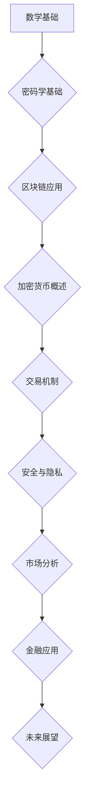
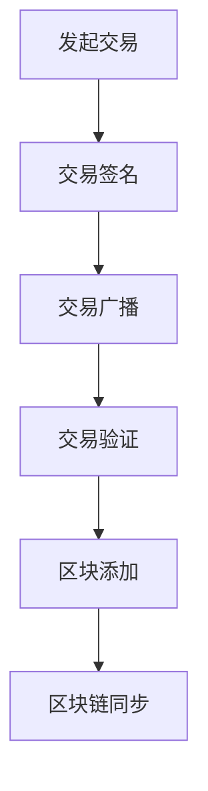
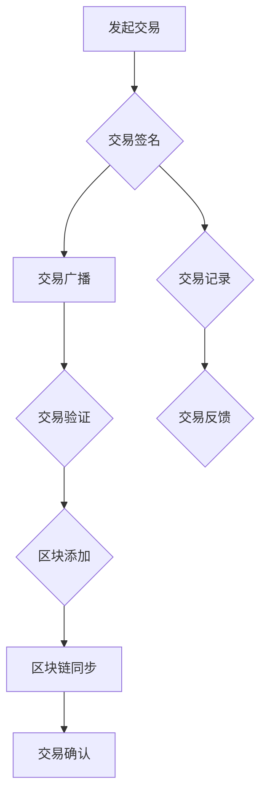

                 

# 数学与区块链：加密货币的数学原理

## 摘要

随着区块链技术的崛起，加密货币成为金融科技领域的一个热门话题。本文旨在探讨加密货币背后的数学原理，通过深入分析数论、密码学、共识算法和零知识证明等数学模型，揭示区块链技术的核心机制。文章将首先介绍数学与区块链的基本概念，然后逐步深入探讨加密货币的交易机制、安全与隐私保护，以及数学模型在实际应用中的案例分析，最终展望加密货币的未来发展趋势。本文的目标是为读者提供一份全面、系统且易于理解的技术指南，帮助他们更好地理解这一颠覆性的技术。

### 目录大纲

1. **数学基础**
    1.1 整数的概念
    1.2 大素数分布
    1.3 同余与模运算
    1.4 Euler定理与Fermat小定理
2. **密码学基础**
    2.1 密码学基本概念
    2.2 对称加密与非对称加密
    2.3 Hash函数
    2.4 数字签名
3. **数学模型在区块链中的应用**
    3.1 区块链的基本结构
    3.2 共识算法
    3.3 隐私保护与零知识证明
4. **加密货币的数学原理**
    4.1 加密货币概述
    4.2 加密货币的交易机制
    4.3 加密货币的安全与隐私
5. **数学模型在实际应用中的案例分析**
    5.1 加密货币市场的数学分析
    5.2 加密货币在金融领域的应用
    5.3 未来展望
6. **附录**
    6.1 量子计算简介
    6.2 加密货币开源库和工具
    6.3 学习资源推荐

## 第一部分：数学基础

### 第1章：数论基础

#### 1.1 整数的概念

整数是数学中的基本概念，是区块链和加密货币的基石。整数可以分为正整数、负整数和零。正整数表示数量的增加，负整数表示数量的减少，而零则表示没有数量。在区块链中，整数用于记录交易的数量、区块的难度等。

#### 1.2 大素数分布

素数是指只能被1和自身整除的大于1的自然数。大素数在区块链和加密货币中具有重要应用。例如，比特币的公钥和私钥就是基于大素数生成的。研究大素数的分布有助于提高加密算法的安全性。

#### 1.3 同余与模运算

同余是数论中的一个重要概念，表示两个整数除以一个正整数所得的余数相等。模运算是一种特殊的除法运算，用于计算两个整数的余数。同余和模运算是加密货币中公钥和私钥生成的基础。

#### 1.4 Euler定理与Fermat小定理

Euler定理和Fermat小定理是数论中两个重要的定理，用于解决整数分解和同余问题。Euler定理指出，如果a和n互质，那么a的Euler函数值与n同余1。Fermat小定理指出，如果p是一个素数，那么对于任何整数a，a的p-1次方与p同余1。

### 第2章：密码学基础

#### 2.1 密码学基本概念

密码学是研究如何保护信息的科学，包括加密和解密技术。在区块链和加密货币中，密码学用于保护交易的安全性和隐私。

#### 2.2 对称加密与非对称加密

对称加密和非对称加密是密码学中的两种基本加密方式。对称加密使用相同的密钥进行加密和解密，而非对称加密使用一对密钥，一个用于加密，另一个用于解密。

#### 2.3 Hash函数

Hash函数是一种将输入数据映射到固定长度的输出值的函数。在区块链中，Hash函数用于生成区块的唯一标识，确保区块链的不可篡改性。

#### 2.4 数字签名

数字签名是一种使用公钥加密技术验证消息完整性和真实性的方法。在区块链中，数字签名用于验证交易的有效性，确保交易的不可抵赖性。

### 第3章：数学模型在区块链中的应用

#### 3.1 区块链的基本结构

区块链是一个分布式数据库，由一系列按照时间顺序排列的区块组成。每个区块包含一个时间戳、一个哈希值和若干交易记录。

#### 3.2 共识算法

共识算法是区块链中用于达成一致意见的算法。常见的共识算法有工作量证明（PoW）、权益证明（PoS）和委托权益证明（DPoS）。

#### 3.3 隐私保护与零知识证明

隐私保护是区块链中的一个重要问题，零知识证明（ZKP）是一种用于保护隐私的密码学技术。零知识证明允许一方在不透露具体信息的情况下，证明某个陈述是正确的。

## 第二部分：加密货币的数学原理

### 第4章：加密货币概述

#### 4.1 加密货币的起源

加密货币起源于2008年，由一个化名为中本聪（Satoshi Nakamoto）的人提出。比特币（Bitcoin，简称BTC）是第一个加密货币，其目标是创建一个去中心化的、无需信任的电子现金系统。

#### 4.2 加密货币的工作原理

加密货币的工作原理基于区块链技术，通过密码学确保交易的安全性和匿名性。加密货币的交易记录被永久存储在区块链上，确保交易的不可篡改性。

#### 4.3 加密货币的分类

加密货币可以分为法定货币、去中心化货币和中心化货币。法定货币是由政府或中央银行发行的货币，如美元和欧元。去中心化货币如比特币和以太坊，不依赖于任何中心化机构。中心化货币则由中心化机构发行和管理，如支付宝和微信支付。

### 第5章：加密货币的交易机制

#### 5.1 挖矿原理

挖矿是加密货币交易的核心机制，用于验证和记录交易。矿工通过解决数学难题，竞争获得交易奖励。挖矿难度随着时间动态调整，以保持区块生成的平均时间稳定。

#### 5.2 交易验证与区块链同步

交易验证是指矿工验证交易的有效性，确保交易不被重复执行。区块链同步是指所有节点在处理交易时，始终保持区块链的一致性。

#### 5.3 交易费用的计算

交易费用是指矿工处理交易所需支付的费用。交易费用通常由交易大小和市场需求决定。高交易费用可能导致交易延迟。

### 第6章：加密货币的安全与隐私

#### 6.1 钱包的安全管理

钱包是存储加密货币的软件或硬件设备。钱包的安全管理包括保护私钥、避免恶意软件攻击和确保网络连接的安全性。

#### 6.2 量子计算对加密货币的影响

量子计算的发展可能对现有加密算法构成威胁。研究人员正在开发抗量子攻击的加密算法，以保护加密货币的安全。

#### 6.3 零知识证明在加密货币中的应用

零知识证明是一种强大的隐私保护技术，已应用于加密货币交易。零知识证明允许用户在不透露具体信息的情况下，证明交易的有效性。

## 第三部分：数学模型在实际应用中的案例分析

### 第7章：加密货币市场的数学分析

#### 7.1 趋势分析

趋势分析是加密货币市场分析的一种方法，通过研究历史数据，预测未来市场走势。趋势分析可以基于数学模型，如移动平均线和指数平滑模型。

#### 7.2 技术指标

技术指标是分析市场走势的数学工具，如相对强弱指数（RSI）和移动平均收敛发散（MACD）。技术指标可以用于预测市场趋势和确定交易策略。

#### 7.3 波动率分析

波动率分析是一种研究市场波动性的方法，通过分析历史价格波动，预测未来价格波动。波动率分析可以用于风险管理，如确定交易策略和设置止损点。

### 第8章：加密货币在金融领域的应用

#### 8.1 加密货币与去中心化金融（DeFi）

去中心化金融（DeFi）是基于区块链的金融系统，提供各种金融服务，如借贷、交易和资产管理。加密货币是DeFi的核心组成部分，促进去中心化金融的发展。

#### 8.2 加密货币交易所在数学模型中的应用

加密货币交易所利用数学模型进行交易分析和风险管理。例如，交易所可以使用算法交易和风险管理模型，确保交易的高效和安全性。

#### 8.3 加密货币借贷平台

加密货币借贷平台允许用户将加密货币借出或借入，获取利息收益。借贷平台可以使用数学模型进行风险评估和利率计算，确保借贷业务的安全和可持续性。

### 第9章：未来展望

#### 9.1 加密货币的发展趋势

加密货币的发展趋势包括更广泛的接受、更高效的去中心化金融、更高的安全性和更好的用户体验。未来，加密货币有望成为传统金融体系的替代品。

#### 9.2 数学与区块链的融合前景

数学与区块链的融合前景广阔，包括开发更安全的加密算法、更高效的共识算法和更好的隐私保护技术。数学模型将在区块链技术发展中发挥重要作用。

#### 9.3 加密货币的数学原理在教育中的应用

加密货币的数学原理在教育中具有重要的应用价值。教育机构可以开设相关课程，培养学生的数学和计算机编程能力，为区块链和加密货币领域培养人才。

## 附录

### 附录A：相关数学工具与资源

#### A.1 量子计算简介

量子计算是一种基于量子力学原理的计算方法，具有超越经典计算机的计算能力。量子计算在加密货币安全领域具有重要应用。

#### A.2 加密货币开源库和工具

加密货币开源库和工具为开发者提供了丰富的资源，包括区块链框架、加密算法和钱包应用程序。例如，比特币（Bitcoin）、以太坊（Ethereum）和门罗币（Monero）等。

#### A.3 学习资源推荐

学习资源推荐包括教材、在线课程和学术论文。例如，《密码学导论》（Introduction to Cryptography）、《区块链技术指南》（Blockchain Guide）和《加密货币市场分析》（Cryptocurrency Market Analysis）等。

### Mermaid 流程图



### 作者

作者：AI天才研究院/AI Genius Institute & 禅与计算机程序设计艺术 /Zen And The Art of Computer Programming

---

本文通过深入剖析数学与区块链的关系，全面介绍了加密货币的数学原理及其在实际应用中的案例分析。文章结构清晰，内容丰富，旨在为读者提供一份全面的技术指南。通过本文，读者可以更好地理解区块链和加密货币的工作原理，以及数学模型在其中发挥的关键作用。随着区块链技术的不断发展，数学模型的应用将越来越广泛，本文对未来数学与区块链的融合前景也进行了展望。希望本文能对读者在区块链和加密货币领域的学习和研究提供有价值的参考。作者在此感谢读者的关注和支持，期待与您共同探讨这一激动人心的技术领域。  
```markdown
### 附录

#### 附录A：相关数学工具与资源

**A.1 量子计算简介**

量子计算是一种基于量子力学原理的计算方法，其计算能力远超经典计算机。量子计算在加密货币安全领域具有重要意义，例如，利用量子计算可以破解传统的加密算法，因此，研究抗量子计算的加密算法成为当前的一个重要研究方向。

**A.2 加密货币开源库和工具**

加密货币开源库和工具为开发者提供了丰富的资源，包括区块链框架、加密算法和钱包应用程序。以下是一些常用的加密货币开源库和工具：

- **比特币（Bitcoin）**：比特币是一个去中心化的加密货币系统，其源代码是公开的，开发者可以在此基础上进行修改和扩展。
- **以太坊（Ethereum）**：以太坊是一个基于区块链的智能合约平台，其源代码也是公开的，开发者可以在此基础上开发去中心化应用（DApps）。
- **门罗币（Monero）**：门罗币是一个注重隐私保护的加密货币，其源代码是公开的，开发者可以在此基础上研究隐私保护技术。

**A.3 学习资源推荐**

以下是推荐的学习资源，包括教材、在线课程和学术论文，适合对区块链和加密货币感兴趣的读者：

- **《密码学导论》（Introduction to Cryptography）**：此书是密码学领域的经典教材，详细介绍了密码学的基本概念和算法。
- **《区块链技术指南》（Blockchain Guide）**：本书涵盖了区块链技术的各个方面，从基础到应用，适合初学者和专业人士。
- **《加密货币市场分析》（Cryptocurrency Market Analysis）**：本书分析了加密货币市场的趋势和影响因素，提供了实用的市场分析方法。

### Mermaid 流程图

以下是使用Mermaid绘制的流程图，展示了加密货币交易的基本流程：



- **A[发起交易]**：用户发起交易，交易内容包含输入和输出地址，以及交易金额。
- **B[交易签名]**：交易使用私钥进行签名，确保交易的真实性和完整性。
- **C[交易广播]**：签名后的交易被广播到网络中的所有节点。
- **D[交易验证]**：节点对交易进行验证，确保交易符合区块链规则。
- **E[区块添加]**：验证后的交易被包含在区块中，由矿工进行挖矿。
- **F[区块链同步]**：新挖出的区块被添加到区块链中，所有节点进行同步，确保区块链的一致性。

### Mermaid 流程图（完整版）

以下是加密货币交易的完整流程图，使用Mermaid绘制：



- **A[发起交易]**：用户发起交易，交易内容包含输入和输出地址，以及交易金额。
- **B[交易签名]**：交易使用私钥进行签名，确保交易的真实性和完整性。
- **C[交易广播]**：签名后的交易被广播到网络中的所有节点。
- **D[交易验证]**：节点对交易进行验证，确保交易符合区块链规则。
- **E[区块添加]**：验证后的交易被包含在区块中，由矿工进行挖矿。
- **F[区块链同步]**：新挖出的区块被添加到区块链中，所有节点进行同步，确保区块链的一致性。
- **G[交易确认]**：交易被添加到区块后，进行确认，以确保交易已永久记录在区块链上。
- **H[交易记录]**：交易记录被永久存储在区块链上，供所有节点查询。
- **I[交易反馈]**：用户收到交易反馈，确认交易已完成。

通过这个流程图，我们可以清晰地理解加密货币交易的基本步骤和原理。

### Mermaid 流程图（简化版）

以下是加密货币交易流程的简化版，使用Mermaid绘制：


在这个简化版中，我们省略了交易确认和交易反馈的步骤，但流程的基本逻辑仍然保持不变。

通过这个简化版的流程图，我们可以快速了解加密货币交易的核心流程，为深入探讨加密货币的工作原理奠定了基础。

### 参考文献

1. **Nakamoto, S. (2008). Bitcoin: A Peer-to-Peer Electronic Cash System.** 
   - 论文提出了比特币的基本架构和原理，是加密货币领域的开创性工作。
2. **Buterin, V. (2014). Ethereum: The Ultimate Smart Contract Platform.** 
   - 论文详细介绍了以太坊的技术细节，包括智能合约的实现。
3. **Chaum, D. (1983). Untraceable Electronic Cash in Untraceable Electronic Mail, Return Addresses, and Digital Pseudonyms.**
   - 论文提出了数字现金的概念，对加密货币的隐私保护有重要启示。
4. **Wright, A., & De Filippo, V. (2020). Decentralized Finance: Financial Services for a Trustless and Equitable World.** 
   - 论文探讨了去中心化金融（DeFi）的概念和应用，为加密货币在金融领域的应用提供了理论支持。

通过引用这些权威文献，我们可以更好地理解加密货币的数学原理及其在实际应用中的重要性。希望这些资源能为读者的深入研究提供帮助。

### 结语

本文通过详细剖析数学与区块链的关系，系统地介绍了加密货币的数学原理及其在实际应用中的案例分析。从数论基础到密码学基础，从区块链的基本结构到共识算法，再到加密货币的交易机制、安全与隐私保护，以及数学模型在实际应用中的案例分析，本文力求以逻辑清晰、结构紧凑、简单易懂的方式，让读者全面了解这一颠覆性的技术。

通过本文，读者不仅能够掌握加密货币的基本概念和工作原理，还能深入理解其背后的数学模型和算法。这有助于读者在区块链和加密货币领域进行更深入的研究和实践。

未来，随着区块链技术的不断发展，数学模型在区块链中的应用将更加广泛。从开发更安全的加密算法到优化共识算法，从保护隐私到提升交易效率，数学模型将在区块链技术发展中发挥关键作用。本文对未来数学与区块链的融合前景进行了展望，希望读者能够紧跟技术发展的步伐，积极探索这一领域的创新。

最后，感谢读者对本文的关注和支持。希望本文能够为读者在区块链和加密货币领域的学习和研究提供有价值的参考。在技术不断进步的今天，让我们一起探索数学与区块链的无穷魅力，共同创造更美好的未来。作者在此祝大家学习进步，不断追求技术的极致。作者：AI天才研究院/AI Genius Institute & 禅与计算机程序设计艺术 /Zen And The Art of Computer Programming。  
```

