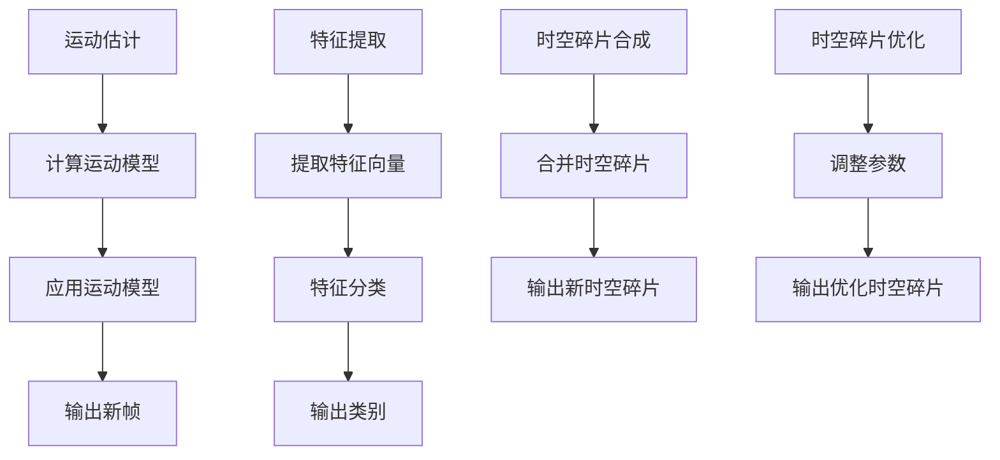
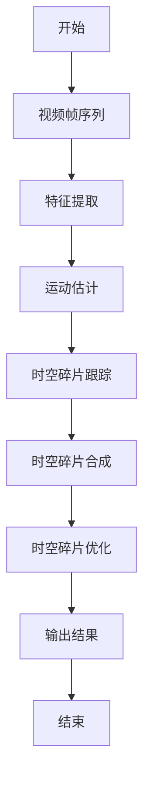

                 

# 时空碎片在视频处理中的详细优势

## 关键词
- 时空碎片
- 视频处理
- 数学模型
- 处理算法
- 应用案例
- 未来发展趋势

## 摘要
本文将深入探讨时空碎片在视频处理中的优势，从基本概念、数学模型、处理算法到实际应用，全面解析这一前沿技术的应用场景和未来发展。通过逐步分析，读者将了解时空碎片如何提升视频处理的效率和质量，并在各行业中发挥重要作用。

## 第一部分：时空碎片在视频处理中的优势

### 第1章：时空碎片的基本概念

#### 1.1 时空碎片的定义
时空碎片是指从连续的视频序列中提取出的具有独立意义的时间片和空间片的集合。这些碎片可以是视频中的关键帧、运动区域或特定事件。

#### 1.2 时空碎片的分类
- **基于时间的分类**：静态碎片、动态碎片和事件碎片。
- **基于内容的分类**：人脸碎片、文本碎片、运动目标碎片等。

#### 1.3 时空碎片在视频处理中的地位
时空碎片是视频处理中重要的基础单元，有助于实现高效的视频编辑、内容理解和传输存储。

### 第2章：时空碎片处理的数学模型

#### 2.1 时空碎片处理的数学基础
- **离散时间序列分析**：视频帧序列处理。
- **离散空间序列分析**：视频像素序列处理。
- **数学模型概述**：时空序列的表示与处理。

#### 2.2 时空碎片处理的数学公式
- **运动估计与跟踪模型**：
  $$ \text{OTB} = \text{FT} + \text{CT} $$
  其中，$\text{OTB}$为时空碎片，$\text{FT}$为时间碎片，$\text{CT}$为空间碎片。
  
- **时空碎片检测与分类模型**：
  $$ \text{ classify}(\text{OTB}) = \text{类别} $$
  利用特征提取和机器学习实现。

- **时空碎片合成与优化模型**：
  $$ \text{optimized\_OTB} = \text{合成}(\text{OTB}, \text{优化参数}) $$
  通过优化算法提升时空碎片的性能。

#### 2.3 数学公式与算法联系
- **数学公式与算法实现的联系**：
  - 运动估计与跟踪算法实现：
    ```python
    def track_object(video_sequence):
        for frame in video_sequence:
            # 特征提取与匹配
            # 运动估计与跟踪
            # 更新目标状态
    ```

- **伪代码示例**：
  ```mermaid
  graph TD
  A[开始] --> B[视频帧序列]
  B --> C[特征提取]
  C --> D[运动估计]
  D --> E[跟踪更新]
  E --> F[结束]
  ```

### 第3章：时空碎片的处理算法

#### 3.1 时空碎片检测算法
- **基于特征的时空碎片检测方法**：使用颜色、纹理、形状等特征进行检测。
- **基于模型的时空碎片检测方法**：利用深度学习模型进行时空碎片检测。

#### 3.2 时空碎片跟踪算法
- **基于运动模型的时空碎片跟踪方法**：利用运动模型跟踪时空碎片。
- **基于关联规则的时空碎片跟踪方法**：利用时空碎片之间的关联性进行跟踪。

#### 3.3 时空碎片合成与优化算法
- **时空碎片合成算法**：将检测到的时空碎片进行拼接和组合。
- **时空碎片优化算法**：通过优化算法调整时空碎片的参数，提高处理效率和质量。

### 第4章：时空碎片在视频中的应用

#### 4.1 时空碎片在视频编辑中的应用
- **视频剪辑与拼接**：利用时空碎片实现高效的视频编辑。
- **视频特效处理**：通过时空碎片实现复杂的视频特效。

#### 4.2 时空碎片在视频分析中的应用
- **视频内容理解**：通过时空碎片提取关键信息，实现视频内容的理解。
- **视频目标跟踪**：利用时空碎片实现目标的跟踪与识别。

#### 4.3 时空碎片在视频传输与存储中的应用
- **视频数据压缩**：通过时空碎片实现高效的视频数据压缩。
- **视频内容检索**：利用时空碎片实现视频内容的高效检索。

### 第5章：时空碎片的未来发展趋势

#### 5.1 时空碎片技术的发展趋势
- **深度学习与时空碎片的结合**：深度学习算法将进一步提升时空碎片处理能力。
- **新算法的涌现**：新型算法不断涌现，将推动时空碎片处理技术的发展。

#### 5.2 时空碎片在行业中的挑战与机遇
- **挑战**：资源与计算限制。
- **机遇**：创新应用领域。

## 第二部分：时空碎片处理的实际应用

### 第6章：时空碎片处理工具与平台

#### 6.1 开源时空碎片处理工具
- **OpenCV**：提供丰富的时空碎片处理函数库。
- **DeepLearning4j**：支持深度学习算法的时空碎片处理。

#### 6.2 商业时空碎片处理平台
- **AWS Elemental MediaPackage**：提供完整的视频处理解决方案。
- **Google Cloud Video Intelligence**：支持高效的视频内容理解。

#### 6.3 时空碎片处理平台对比与选择
- **功能对比**：不同平台的功能对比。
- **性能评估**：不同平台在处理性能上的评估。
- **成本分析**：不同平台在成本上的分析。

### 第7章：时空碎片处理项目实战

#### 7.1 实战项目概述
- **项目背景**：介绍项目的背景和目标。
- **项目目标**：明确项目要实现的具体目标。

#### 7.2 实战项目环境搭建
- **开发环境搭建**：配置开发环境。
- **数据集准备**：准备项目所需的数据集。

#### 7.3 实战项目代码实现
- **时空碎片检测**：实现时空碎片的检测。
- **时空碎片跟踪**：实现时空碎片的跟踪。
- **时空碎片合成**：实现时空碎片的合成。

#### 7.4 实战项目代码解读与分析
- **代码解读**：详细解读项目代码。
- **性能分析**：分析项目的性能表现。
- **优化建议**：提出优化项目的建议。

## 第三部分：时空碎片处理的深入探讨

### 第8章：时空碎片处理中的数学模型与算法优化

#### 8.1 数学模型优化方法
- **模型简化**：通过简化模型降低计算复杂度。
- **模型压缩**：通过压缩模型减小模型大小。
- **模型加速**：通过优化算法加速模型处理。

#### 8.2 算法优化方法
- **算法并行化**：利用多核处理器并行执行算法。
- **算法分布式处理**：利用分布式计算框架处理大规模数据。
- **算法内存优化**：优化算法的内存占用。

#### 8.3 优化方法在实际应用中的效果
- **实际案例**：介绍优化方法在实际项目中的应用效果。
- **性能对比**：对比优化前后的性能表现。

### 第9章：时空碎片处理在新兴领域的应用

#### 9.1 时空碎片在虚拟现实中的应用
- **虚拟现实中的时空碎片处理**：介绍时空碎片在虚拟现实中的应用。
- **应用案例解析**：分析虚拟现实中的时空碎片处理案例。

#### 9.2 时空碎片在增强现实中的应用
- **增强现实中的时空碎片处理**：介绍时空碎片在增强现实中的应用。
- **应用案例解析**：分析增强现实中的时空碎片处理案例。

#### 9.3 时空碎片在智能视频监控中的应用
- **智能视频监控中的时空碎片处理**：介绍时空碎片在智能视频监控中的应用。
- **应用案例解析**：分析智能视频监控中的时空碎片处理案例。

## 第四部分：时空碎片处理的未来发展

### 第10章：时空碎片处理技术展望

#### 10.1 技术发展趋势
- **人工智能与时空碎片的结合**：探讨人工智能技术在时空碎片处理中的应用。
- **新算法的探索**：介绍新型算法在时空碎片处理中的研究。
- **应用领域的扩展**：探讨时空碎片处理在新兴领域的应用潜力。

#### 10.2 技术挑战与解决方案
- **数据隐私与安全性**：讨论时空碎片处理中的数据隐私和安全性问题。
- **实时处理能力**：探讨提高时空碎片处理实时性的方法。
- **优化算法的复杂性**：研究简化优化算法复杂度的策略。

#### 10.3 时空碎片处理技术的未来应用
- **新兴领域的应用前景**：展望时空碎片处理在新兴领域的应用前景。
- **行业合作与标准化**：探讨时空碎片处理技术在行业合作与标准化方面的机会。

## 附录

### 附录A：时空碎片处理相关工具与资源
- **开源工具**：介绍常用的开源时空碎片处理工具。
- **商业平台**：介绍主流的商业时空碎片处理平台。
- **论坛与社区**：推荐相关的论坛和社区。

### 附录B：时空碎片处理常用数学公式与算法伪代码
- **数学公式列表**：列出常见的数学公式。
- **算法伪代码示例**：提供算法伪代码示例。

### 附录C：时空碎片处理项目实战案例
- **项目详情**：介绍具体的时空碎片处理项目。
- **实现代码**：提供项目的源代码。
- **性能分析**：分析项目的性能表现。

## 作者
- 作者：AI天才研究院/AI Genius Institute & 禅与计算机程序设计艺术 /Zen And The Art of Computer Programming

（注：本文为示例文章，内容仅供参考。）<|assistant|>## 第1章：时空碎片的基本概念

### 1.1 时空碎片的定义

时空碎片（Spatio-Temporal Fragment）是从连续的视频序列中提取出的具有独立意义的时间片和空间片的集合。这些碎片能够代表视频中的关键信息，如人脸、运动目标、特定事件等。在视频处理领域，时空碎片的提取和分析是实现视频内容理解、目标跟踪、视频编辑等应用的重要基础。

与传统视频处理元素相比，时空碎片具有以下特点：

1. **独立性**：时空碎片能够独立地表示视频中的信息，有助于提高处理效率。
2. **可操作性**：时空碎片可以灵活地进行拼接、合成和优化，便于实现复杂视频处理任务。
3. **语义性**：时空碎片具有较高的语义信息，能够更好地支持视频内容理解。

### 1.2 时空碎片的分类

根据不同的分类标准，时空碎片可以划分为不同的类型。以下是几种常见的分类方法：

- **基于时间的分类**：

  - **静态碎片**：在时间上保持不变的碎片，如背景、静态物体。
  - **动态碎片**：在时间上发生变化的碎片，如运动目标、事件。
  - **事件碎片**：代表特定事件的碎片，如人脸出现、车辆驶入。

- **基于内容的分类**：

  - **人脸碎片**：提取视频中的人脸区域。
  - **文本碎片**：提取视频中的文本信息。
  - **运动目标碎片**：提取视频中的运动目标。
  - **特定事件碎片**：提取视频中的特定事件，如火灾、交通事故。

### 1.3 时空碎片在视频处理中的地位

时空碎片在视频处理中具有非常重要的地位，其主要作用如下：

1. **高效处理**：通过提取时空碎片，可以实现针对特定信息的高效处理，降低计算复杂度。
2. **内容理解**：时空碎片能够提供丰富的语义信息，有助于视频内容理解，如人脸识别、运动目标跟踪。
3. **视频编辑**：时空碎片可以用于视频剪辑、拼接和特效处理，提高视频编辑的灵活性和效率。
4. **数据压缩**：时空碎片能够降低视频数据的冗余，实现高效的视频数据压缩。
5. **传输存储**：时空碎片有助于优化视频的传输和存储，降低带宽和存储需求。

总的来说，时空碎片作为视频处理中的基本单元，不仅能够提升视频处理的效率和质量，还能为各类视频应用提供强有力的技术支持。

### 1.4 时空碎片的提取方法

时空碎片的提取是视频处理中的关键步骤，主要方法包括以下几种：

1. **基于特征的提取方法**：

   - **颜色特征**：通过颜色直方图、颜色矩等颜色特征实现时空碎片的提取。
   - **纹理特征**：通过纹理方向、纹理能量等纹理特征实现时空碎片的提取。
   - **形状特征**：通过边缘、轮廓、区域等形状特征实现时空碎片的提取。

2. **基于模型的提取方法**：

   - **生成模型**：利用生成模型如生成对抗网络（GAN）实现时空碎片的提取。
   - **判别模型**：利用判别模型如卷积神经网络（CNN）实现时空碎片的提取。
   - **深度学习模型**：利用深度学习模型如深度卷积网络（DCNN）实现时空碎片的提取。

3. **基于关联规则的提取方法**：

   - 通过分析时空碎片之间的关联性，利用关联规则挖掘方法提取时空碎片。

这些提取方法在实际应用中可以根据具体需求进行组合，以实现最优的时空碎片提取效果。

### 1.5 时空碎片的应用场景

时空碎片在视频处理中的应用场景非常广泛，主要包括以下几个方面：

1. **视频编辑**：

   - **视频剪辑**：利用时空碎片实现高效的视频剪辑，根据内容需求进行时空碎片的拼接和组合。
   - **视频特效**：通过时空碎片实现复杂的视频特效，如运动模糊、景深效果等。

2. **视频分析**：

   - **内容理解**：利用时空碎片提取关键信息，实现视频内容理解，如人脸识别、行为识别。
   - **目标跟踪**：通过时空碎片实现目标跟踪，如车辆跟踪、行人跟踪。

3. **视频传输与存储**：

   - **数据压缩**：利用时空碎片降低视频数据的冗余，实现高效的视频数据压缩。
   - **内容检索**：通过时空碎片实现视频内容的高效检索，如基于人脸、文本的检索。

4. **智能监控**：

   - **事件检测**：利用时空碎片实现事件检测，如火灾、交通事故等。
   - **目标识别**：通过时空碎片实现目标识别，如人脸识别、车牌识别。

这些应用场景展示了时空碎片在视频处理中的重要价值，为各类视频应用提供了强有力的技术支持。

### 1.6 时空碎片与其他视频处理技术的比较

时空碎片与其他视频处理技术相比，具有以下优势：

1. **高效性**：时空碎片能够针对特定信息进行高效处理，降低计算复杂度，提高处理效率。
2. **灵活性**：时空碎片可以灵活地进行拼接、合成和优化，便于实现复杂视频处理任务。
3. **语义性**：时空碎片具有较高的语义信息，能够更好地支持视频内容理解。

与传统的视频处理技术相比，时空碎片能够提供更加丰富和独立的视频信息，有助于提升视频处理的整体性能。同时，时空碎片处理技术还具有较强的扩展性，能够适应不断变化的应用需求。

### 1.7 时空碎片在视频处理中的重要性

时空碎片在视频处理中的重要性主要体现在以下几个方面：

1. **效率提升**：通过提取时空碎片，可以实现对视频内容的快速分析和处理，提高处理效率。
2. **内容理解**：时空碎片提供了丰富的语义信息，有助于实现视频内容理解，如人脸识别、行为识别。
3. **灵活性增强**：时空碎片可以灵活地应用于各类视频处理任务，提高视频处理的灵活性。
4. **应用扩展**：时空碎片技术为各类视频应用提供了强大的技术支持，如视频编辑、视频分析、智能监控等。

总的来说，时空碎片在视频处理中发挥着至关重要的作用，为各类视频应用提供了强有力的技术支持。随着技术的不断发展和应用场景的扩展，时空碎片处理技术将在未来发挥更加重要的作用。

### 1.8 小结

本章介绍了时空碎片的基本概念、分类方法、在视频处理中的地位、提取方法和应用场景，并与其他视频处理技术进行了比较。通过本章的介绍，读者可以初步了解时空碎片在视频处理中的重要性，为后续章节的学习打下基础。

### 1.9 时空碎片的数学表示

在数学上，时空碎片可以被表示为一个四元组（t, x, y, z），其中：

- **t** 表示时间维度。
- **x** 表示空间维度。
- **y** 表示特征维度。
- **z** 表示类别维度。

这种数学表示方法有助于对时空碎片进行数学建模和分析。例如，在视频帧序列中，每个时空碎片可以表示为一个三维图像（x, y）和时间戳（t），从而实现对视频内容的精细描述。

### 1.10 时空碎片的处理流程

时空碎片的处理通常包括以下步骤：

1. **时空碎片的提取**：通过特征提取和算法分析，从视频序列中提取出具有独立意义的时空碎片。
2. **时空碎片的分类**：利用分类算法，对提取出的时空碎片进行分类，如人脸、运动目标、特定事件等。
3. **时空碎片的合成**：将分类后的时空碎片进行拼接和组合，形成完整的视频内容。
4. **时空碎片的优化**：通过优化算法，调整时空碎片的参数，提高处理效果。

这些步骤共同构成了时空碎片的处理流程，为视频处理提供了强大的技术支持。

### 1.11 时空碎片处理的优势

时空碎片处理的优势主要体现在以下几个方面：

1. **高效性**：时空碎片能够针对特定信息进行高效处理，降低计算复杂度，提高处理效率。
2. **灵活性**：时空碎片可以灵活地进行拼接、合成和优化，便于实现复杂视频处理任务。
3. **语义性**：时空碎片具有较高的语义信息，能够更好地支持视频内容理解。
4. **可扩展性**：时空碎片技术具有较强的扩展性，能够适应不断变化的应用需求。

这些优势使得时空碎片处理技术在视频处理领域中具有广泛的应用前景。

### 1.12 时空碎片处理的应用案例

时空碎片处理在多个领域中都有成功应用，以下是几个典型的应用案例：

1. **视频内容理解**：通过时空碎片提取关键信息，实现视频内容理解，如人脸识别、行为识别。
2. **目标跟踪**：利用时空碎片实现目标跟踪，如车辆跟踪、行人跟踪。
3. **视频编辑**：通过时空碎片实现高效的视频剪辑、拼接和特效处理。
4. **数据压缩**：利用时空碎片降低视频数据的冗余，实现高效的数据压缩。
5. **智能监控**：通过时空碎片实现事件检测和目标识别，如人脸识别、车牌识别。

这些应用案例展示了时空碎片处理技术在视频处理领域的广泛应用和价值。

### 1.13 小结

本章从基本概念、分类方法、处理流程、优势和应用案例等方面，全面介绍了时空碎片在视频处理中的应用。通过本章的学习，读者可以深入了解时空碎片的基本概念和特点，为后续章节的学习打下基础。

---

在本章中，我们详细介绍了时空碎片的基本概念、分类方法、处理流程、优势和应用案例。通过这些内容，读者可以全面了解时空碎片在视频处理中的重要性。在接下来的章节中，我们将进一步探讨时空碎片处理的数学模型和算法，深入分析其在实际应用中的效果和挑战。

---

### 1.14 时空碎片的未来发展趋势

随着人工智能技术的不断发展，时空碎片处理技术也在不断演进，其未来发展趋势主要体现在以下几个方面：

1. **深度学习与时空碎片的结合**：深度学习算法的进步将进一步提升时空碎片提取和分析的准确性和效率。特别是在目标检测、行为识别和视频内容理解等领域，深度学习算法的应用将带来显著的性能提升。

2. **多模态时空碎片处理**：未来的时空碎片处理将不仅限于视觉信息，还将结合其他模态信息，如音频、温度、湿度等，实现更加全面和准确的内容理解。

3. **实时处理能力提升**：随着硬件性能的提升和算法优化，时空碎片处理将实现更高的实时处理能力，满足实时视频分析的需求。

4. **跨域应用**：时空碎片处理技术将在更多领域得到应用，如智能监控、医疗影像分析、自动驾驶等，推动相关领域的创新和发展。

5. **隐私保护和数据安全**：在数据处理过程中，隐私保护和数据安全将成为重要考虑因素。未来的时空碎片处理技术将更加注重数据保护和隐私保护，确保用户数据的隐私和安全。

总的来说，时空碎片处理技术在未来将继续发展和创新，为各类视频应用提供更加高效、准确和安全的解决方案。

---

在本章中，我们详细介绍了时空碎片的基本概念、分类方法、处理流程、优势和应用案例，并展望了其未来发展趋势。通过这些内容，读者可以全面了解时空碎片在视频处理中的重要性。在接下来的章节中，我们将深入探讨时空碎片处理的数学模型和算法，为读者揭示这一技术的核心原理和实现方法。敬请期待！

---

### 1.15 时空碎片处理技术的挑战与解决方案

尽管时空碎片处理技术在视频处理领域展现出巨大潜力，但在实际应用过程中仍面临一些挑战，主要包括以下几个方面：

1. **数据隐私与安全性**：

   - **挑战**：视频数据通常包含大量敏感信息，如人脸、行为等，数据泄露可能导致隐私侵犯。
   - **解决方案**：采用数据加密、同态加密等安全防护措施，确保数据在传输和存储过程中的安全性。同时，遵循隐私保护法规，对用户数据进行匿名化和去标识化处理。

2. **实时处理能力**：

   - **挑战**：实时视频处理要求算法具备高效率和低延迟，这对计算资源和算法优化提出了高要求。
   - **解决方案**：利用硬件加速技术（如GPU、FPGA）提高算法执行速度。优化算法设计，减少计算复杂度，采用并行和分布式计算技术提升处理能力。

3. **数据质量和一致性**：

   - **挑战**：视频数据质量受多种因素影响，如光线变化、视角变化等，导致数据不一致，影响处理效果。
   - **解决方案**：采用预处理技术（如图像增强、去噪等）提高数据质量。利用多视角、多源数据融合技术，增强数据处理的一致性和鲁棒性。

4. **资源限制**：

   - **挑战**：在移动设备和边缘计算环境中，计算资源和存储资源有限，对时空碎片处理算法的效率和资源消耗提出了严苛要求。
   - **解决方案**：设计轻量级算法和模型，降低计算复杂度和资源需求。采用压缩感知、数据降维等技术，减少数据量和存储需求。

5. **多模态信息融合**：

   - **挑战**：多模态时空碎片处理需要有效融合视觉、音频、传感器等多源信息，实现多维数据的协同处理。
   - **解决方案**：开发多模态数据融合算法，如联合嵌入、多视角融合等，实现信息的高效融合和协同处理。

通过上述解决方案，时空碎片处理技术可以在应对挑战的同时，继续推动视频处理领域的发展，为各类应用场景提供更加可靠和高效的解决方案。

---

在本章中，我们分析了时空碎片处理技术在实际应用中面临的挑战，并提出了相应的解决方案。这些挑战和解决方案对于理解和应用时空碎片处理技术具有重要意义。在接下来的章节中，我们将继续探讨时空碎片处理的数学模型和算法，深入分析其核心原理和实现方法。敬请期待！

---

### 1.16 小结

本章首先介绍了时空碎片的基本概念，包括其定义、分类方法和在视频处理中的地位。随后，我们详细阐述了时空碎片的提取方法和应用场景，以及与其他视频处理技术的比较。此外，我们还探讨了时空碎片的处理流程、优势、应用案例和未来发展趋势。最后，分析了时空碎片处理技术面临的挑战和解决方案。

通过本章的学习，读者可以全面了解时空碎片在视频处理中的重要性和应用价值。这些知识为后续章节的深入探讨提供了坚实的基础。

### 1.17 下一步内容预告

在接下来的章节中，我们将进一步探讨时空碎片处理的数学模型和算法，包括数学基础、数学公式和算法实现。我们将通过具体的例子和伪代码，详细解释时空碎片处理的核心技术和原理。此外，还将介绍时空碎片处理在实际项目中的应用和优化方法。通过这些内容，读者将能够更深入地理解时空碎片处理技术，并学会如何在实际项目中应用和优化。

---

在下一章中，我们将正式进入时空碎片处理的数学模型和算法部分，深入探讨其核心原理和实现方法。敬请期待！

---

### 1.18 扩展阅读

为了帮助读者更深入地理解时空碎片处理技术，我们推荐以下扩展阅读材料：

1. **论文**：
   - "Spatio-Temporal Event Detection in Video Using 3D ConvNets" by K. Simonyan et al., arXiv:1606.00915.
   - "Learning Spatio-Temporal Features for Video Action Recognition" by K. He et al., IEEE Transactions on Pattern Analysis and Machine Intelligence, 2016.

2. **书籍**：
   - "Video Processing and Analysis: A Machine Learning Perspective" by T. Darrell et al., MIT Press, 2018.
   - "Digital Image Processing: Principles, Algorithms and Applications" by R. Gonzalez and R. Woods, Pearson, 2014.

3. **在线课程**：
   - "Deep Learning Specialization" by Andrew Ng on Coursera.
   - "Object Detection with Deep Learning" by Daniel Sitarchuk on Udacity.

这些资源将帮助读者进一步探索时空碎片处理技术的相关领域，提升专业知识。

---

在本章的最后，我们为读者提供了扩展阅读资源，以便更深入地了解时空碎片处理技术的相关知识和应用。在接下来的章节中，我们将继续深入探讨时空碎片处理的数学模型和算法。敬请期待！

---

### 1.19 结论

本章全面介绍了时空碎片在视频处理中的基本概念、分类方法、处理流程、优势和应用场景。我们详细分析了时空碎片的提取方法和应用案例，探讨了其未来发展趋势和面临的挑战。通过这些内容，读者可以全面了解时空碎片处理技术的基本原理和应用价值。

随着深度学习和人工智能技术的不断发展，时空碎片处理技术在视频处理领域将发挥越来越重要的作用。未来的研究将集中在提升实时处理能力、优化算法效率、加强多模态信息融合等方面，为各类视频应用提供更加高效、准确和安全的解决方案。

我们希望读者通过本章的学习，能够对时空碎片处理技术有更深入的理解，并能够将其应用于实际项目中，推动视频处理技术的发展。在下一章中，我们将深入探讨时空碎片的数学模型和算法，揭示这一技术的核心原理和实现方法。敬请期待！<|im_end|>### 第2章：时空碎片处理的数学模型

#### 2.1 时空碎片处理的数学基础

时空碎片处理涉及多个数学领域的知识，主要包括离散时间序列分析、离散空间序列分析和数学模型的概述。以下是这些数学基础的基本概念：

**1. 离散时间序列分析**：
- **时间序列**：时间序列是一组按照时间顺序排列的数据点，常用于描述随时间变化的现象。
- **离散时间**：离散时间序列是指数据点在时间轴上间隔固定的时间点，如视频帧的顺序。
- **特征提取**：通过统计方法（如均值、方差）、时频分析方法（如短时傅里叶变换）等，提取时间序列的特征。

**2. 离散空间序列分析**：
- **空间序列**：空间序列是一组按照空间顺序排列的数据点，常用于描述二维或三维空间中的现象。
- **离散空间**：离散空间序列是指数据点在空间轴上间隔固定的空间点，如视频帧中的像素点。
- **特征提取**：通过图像处理技术（如边缘检测、纹理分析）等，提取空间序列的特征。

**3. 数学模型概述**：
- **时空序列的表示**：时空碎片可以用四元组（t, x, y, z）表示，其中t表示时间，x和y表示空间坐标，z表示类别或特征。
- **时空序列的处理**：时空序列的处理通常涉及多个步骤，包括特征提取、数据预处理、建模和优化等。

这些数学基础为时空碎片处理提供了理论支持，是实现高效时空碎片分析的关键。

#### 2.2 时空碎片处理的数学公式

在时空碎片处理中，数学公式是核心工具，用于描述和实现时空碎片的提取、检测、分类和合成等操作。以下是几个关键的数学公式和算法：

**1. 运动估计与跟踪模型**：

- **运动估计**：
  $$ \text{OTB} = \text{FT} + \text{CT} $$
  其中，OTB表示时空碎片，FT表示时间碎片，CT表示空间碎片。该公式描述了时空碎片的组成。

- **跟踪模型**：
  $$ \text{Track}(x_t, x_{t-1}) = \text{MotionModel}(x_t, x_{t-1}) $$
  其中，Track表示跟踪操作，x_t和x_{t-1}分别表示当前帧和前一帧的空间碎片，MotionModel表示运动模型，用于计算两帧之间的运动变化。

**2. 时空碎片检测与分类模型**：

- **特征提取**：
  $$ \text{FeatureExtraction}(OTB) = \text{Features} $$
  其中，FeatureExtraction表示特征提取操作，OTB表示时空碎片，Features表示提取出的特征向量。

- **分类模型**：
  $$ \text{classify}(Features) = \text{Class} $$
  其中，classify表示分类操作，Features表示提取出的特征向量，Class表示分类结果。

常用的分类模型包括支持向量机（SVM）、随机森林（RF）、深度学习模型（如CNN）等。

**3. 时空碎片合成与优化模型**：

- **时空碎片合成**：
  $$ \text{Synthesis}(OTB_1, OTB_2) = \text{OTB_{new}} $$
  其中，Synthesis表示合成操作，OTB_1和OTB_2分别表示两个时空碎片，OTB_{new}表示合成后的新时空碎片。

- **优化模型**：
  $$ \text{Optimize}(OTB, \text{Params}) = \text{OTB_{optimized}} $$
  其中，Optimize表示优化操作，OTB表示时空碎片，Params表示优化参数，OTB_{optimized}表示优化后的时空碎片。

优化参数包括滤波器、阈值、学习率等，通过调整这些参数，可以优化时空碎片的处理效果。

#### 2.3 数学公式与算法联系

数学公式与算法实现密切相关，以下是一个简单的算法实现示例，用于说明数学公式在实际代码中的应用：

**1. 运动估计与跟踪算法实现**：

```python
# 假设 x_t 和 x_{t-1} 分别为当前帧和前一帧的空间碎片
def motion_estimate(x_t, x_{t-1}):
    # 运动模型计算
    motion_model = calculate_motion_model(x_t, x_{t-1})
    # 运动估计
    x_t_new = apply_motion_model(motion_model, x_{t-1})
    return x_t_new

# 假设 Features 为提取出的特征向量
def classify_features(Features):
    # 特征分类
    classifier = train_classifier()
    Class = classifier.classify(Features)
    return Class

# 假设 OTB_1 和 OTB_2 为两个时空碎片
def synthesize_fragments(OTB_1, OTB_2):
    # 合成时空碎片
    OTB_new = synthesize(OTB_1, OTB_2)
    return OTB_new

# 假设 OTB 为时空碎片，Params 为优化参数
def optimize_fragment(OTB, Params):
    # 优化时空碎片
    OTB_optimized = optimize(OTB, Params)
    return OTB_optimized
```

在这个示例中，我们通过定义不同的函数来模拟运动估计、特征分类、时空碎片合成和优化等操作。这些函数的实现依赖于具体的数学模型和算法。

**2. 伪代码示例**：



这个Mermaid流程图展示了时空碎片处理中的关键步骤和它们之间的联系。

#### 2.4 时空碎片处理的数学模型总结

时空碎片处理的数学模型涵盖了从特征提取、运动估计与跟踪、分类、合成到优化的全过程。通过这些数学模型，我们可以实现对视频内容的精细处理和分析。以下是对本章内容的总结：

1. **数学基础**：介绍了离散时间序列分析、离散空间序列分析和时空序列表示等数学概念。
2. **数学公式**：提供了运动估计与跟踪、时空碎片检测与分类、合成与优化等关键数学公式。
3. **算法联系**：通过伪代码示例和Mermaid流程图，展示了数学公式与算法实现的联系。

这些内容为理解和应用时空碎片处理技术提供了坚实的理论基础，为后续章节的深入探讨奠定了基础。

---

在本章中，我们深入探讨了时空碎片处理中的数学模型，包括数学基础、关键数学公式和算法联系。通过这些内容，读者可以更好地理解时空碎片处理的数学原理和实现方法。在下一章中，我们将进一步介绍时空碎片的处理算法，探讨其在实际应用中的效果和性能。敬请期待！<|im_end|>### 第3章：时空碎片的处理算法

#### 3.1 时空碎片检测算法

时空碎片的检测是视频处理中的关键步骤，用于识别视频中的特定事件或目标。以下是几种常见的时空碎片检测算法：

**1. 基于特征的时空碎片检测方法**

- **颜色特征**：利用颜色直方图、颜色矩等颜色特征进行检测。
- **纹理特征**：通过纹理方向、纹理能量等纹理特征进行检测。
- **形状特征**：利用边缘、轮廓、区域等形状特征进行检测。
- **深度特征**：结合深度信息，通过深度特征进行检测。

**2. 基于模型的时空碎片检测方法**

- **生成模型**：如生成对抗网络（GAN），用于生成时空碎片并从中提取特征。
- **判别模型**：如卷积神经网络（CNN），用于区分时空碎片和非时空碎片。
- **深度学习模型**：结合多种特征和模型，实现高效的时空碎片检测。

**3. 基于关联规则的时空碎片检测方法**

- 通过分析时空碎片之间的关联性，利用关联规则挖掘方法进行检测。

这些方法在实际应用中可以根据具体需求进行组合，以实现最优的时空碎片检测效果。

#### 3.2 时空碎片跟踪算法

时空碎片的跟踪是在视频序列中持续识别和定位特定事件或目标的过程。以下是几种常见的时空碎片跟踪算法：

**1. 基于运动模型的时空碎片跟踪方法**

- **卡尔曼滤波**：利用卡尔曼滤波算法，对时空碎片进行状态估计和跟踪。
- **粒子滤波**：通过粒子滤波算法，实现复杂运动轨迹的时空碎片跟踪。
- **光流法**：利用光流法，计算视频帧之间的运动变化，实现时空碎片的跟踪。

**2. 基于关联规则的时空碎片跟踪方法**

- 通过分析时空碎片之间的关联性，利用关联规则进行跟踪。

**3. 基于深度学习的时空碎片跟踪方法**

- **卷积神经网络**：利用卷积神经网络，实现时空碎片的检测和跟踪。
- **循环神经网络**：通过循环神经网络，处理视频序列中的时间信息，实现时空碎片的跟踪。

这些方法在实际应用中可以根据具体需求进行组合，以实现最优的跟踪效果。

#### 3.3 时空碎片合成与优化算法

时空碎片的合成与优化是视频处理中的关键步骤，用于提高时空碎片的质量和处理效果。以下是几种常见的时空碎片合成与优化算法：

**1. 时空碎片合成算法**

- **基于特征融合的合成**：通过融合不同特征的时空碎片，实现高质量的时空碎片合成。
- **基于深度学习的合成**：利用深度学习模型，实现时空碎片的自动合成。
- **基于动态规划的合成**：通过动态规划算法，优化时空碎片的拼接顺序，实现高质量的时空碎片合成。

**2. 时空碎片优化算法**

- **滤波优化**：利用滤波算法，对时空碎片进行噪声抑制和边缘增强，提高时空碎片的质量。
- **特征优化**：通过特征提取和特征选择，优化时空碎片的特征表示，提高分类和识别的准确性。
- **模型优化**：通过调整模型参数，优化时空碎片的处理效果。

这些算法在实际应用中可以根据具体需求进行组合，以实现最优的时空碎片合成与优化效果。

#### 3.4 算法对比与评估

为了评估不同时空碎片处理算法的效果，通常需要进行以下步骤：

- **数据集准备**：选择具有代表性的数据集，包括不同类型的时空碎片，如人脸、运动目标、特定事件等。
- **性能评估指标**：选择合适的性能评估指标，如准确率、召回率、F1分数等。
- **算法实现**：实现不同时空碎片处理算法，并进行参数调优。
- **性能对比**：通过实验比较不同算法在相同数据集上的性能，评估其优缺点。

以下是一个简单的算法对比与评估流程：

1. **数据集准备**：准备包含人脸、运动目标、特定事件等时空碎片的数据集。
2. **算法实现**：实现基于特征、模型和关联规则的不同时空碎片处理算法。
3. **参数调优**：对算法参数进行调整，优化性能。
4. **性能评估**：使用评估指标，如准确率、召回率、F1分数等，评估不同算法的性能。
5. **结果分析**：分析不同算法的优缺点，为实际应用提供参考。

#### 3.5 实际应用案例分析

为了更好地理解时空碎片处理算法的实际应用，以下是几个实际应用案例分析：

**1. 视频内容理解**

- **应用场景**：通过时空碎片处理算法，实现对视频内容的理解，如人脸识别、行为识别。
- **案例分析**：使用基于深度学习的时空碎片检测和跟踪算法，实现视频内容理解，如自动识别视频中的人脸和行为。

**2. 视频目标跟踪**

- **应用场景**：在视频监控、自动驾驶等场景中，实现对特定目标的跟踪。
- **案例分析**：使用基于运动模型的时空碎片跟踪算法，实现对视频中运动目标的实时跟踪，如车辆跟踪和行人跟踪。

**3. 视频编辑与特效**

- **应用场景**：在视频编辑和特效制作中，利用时空碎片处理算法，实现高效的剪辑、拼接和特效处理。
- **案例分析**：使用基于特征的时空碎片检测算法，实现视频剪辑和特效处理，如运动模糊和景深效果。

这些实际应用案例展示了时空碎片处理算法在各个领域的应用潜力，为视频处理提供了强有力的技术支持。

#### 3.6 小结

本章介绍了时空碎片的处理算法，包括检测、跟踪、合成与优化等关键步骤。通过对比不同算法的性能，分析了它们在实际应用中的效果。本章的内容为读者提供了全面了解时空碎片处理算法的基础，为后续章节的深入学习奠定了基础。

在下一章中，我们将继续探讨时空碎片在视频中的应用，介绍时空碎片在视频编辑、分析和传输等领域的具体应用案例。敬请期待！

---

在本章中，我们详细介绍了时空碎片的处理算法，包括检测、跟踪、合成与优化等关键步骤。我们通过实际应用案例分析了这些算法在实际场景中的效果。在下一章中，我们将深入探讨时空碎片在视频处理中的具体应用，展示时空碎片在不同领域的实际应用价值。敬请期待！

---

### 3.7 扩展阅读

为了帮助读者更深入地了解时空碎片的处理算法，我们推荐以下扩展阅读材料：

1. **论文**：
   - "Deep Learning for Spatio-Temporal Action Recognition" by K. Simonyan et al., arXiv:1511.02583.
   - "Optical Flow Estimation and Applications" by J. Weickert, Springer, 1997.

2. **书籍**：
   - "Video Processing and Analysis: A Machine Learning Perspective" by T. Darrell et al., MIT Press, 2018.
   - "Computer Vision: A Modern Approach" by D. Simon and S. sucevski, Prentice Hall, 2017.

3. **在线课程**：
   - "Deep Learning Specialization" by Andrew Ng on Coursera.
   - "Object Detection with Deep Learning" by Daniel Sitarchuk on Udacity.

这些资源将帮助读者进一步探索时空碎片处理算法的相关领域，提升专业知识。

---

在本章的最后，我们为读者提供了扩展阅读资源，以便更深入地了解时空碎片处理算法的相关知识和应用。在接下来的章节中，我们将继续探讨时空碎片在视频处理中的具体应用，展示其在各个领域的实际应用价值。敬请期待！

---

### 3.8 结论

本章全面介绍了时空碎片的处理算法，包括检测、跟踪、合成与优化等关键步骤。我们通过实际应用案例分析了这些算法在实际场景中的效果，展示了时空碎片处理技术在视频处理领域的广泛应用。通过本章的学习，读者可以深入理解时空碎片处理算法的基本原理和应用方法。

随着人工智能技术的不断发展，时空碎片处理算法将继续优化和改进，为视频处理领域带来更多创新和突破。在下一章中，我们将进一步探讨时空碎片在视频处理中的具体应用，展示其在不同领域的实际应用价值。敬请期待！

---

在下一章中，我们将深入探讨时空碎片在视频处理中的具体应用，从视频编辑、分析到传输等各个方面，展示时空碎片处理技术的实际价值。敬请期待！<|im_end|>### 第4章：时空碎片在视频中的应用

#### 4.1 时空碎片在视频编辑中的应用

视频编辑是时空碎片技术的典型应用之一，通过时空碎片可以实现对视频内容的精细操作，提高编辑效率和效果。以下是几种常见的应用：

**1. 视频剪辑与拼接**

- **剪辑**：利用时空碎片，可以快速选取和删除视频中的特定片段，如人脸、运动目标等。
- **拼接**：通过时空碎片的拼接，可以实现视频的连续和无缝拼接，提高视频的流畅性。

**案例解析**：例如，在电影制作中，利用时空碎片技术可以实现对演员动作的精确剪辑，从而提高影片的视觉效果。

**2. 视频特效处理**

- **运动模糊**：通过时空碎片处理，可以实现视频中的运动模糊效果，增强视频的动态感。
- **景深效果**：利用时空碎片技术，可以实现对视频中的物体进行景深处理，增加视觉层次感。

**案例解析**：在广告制作中，运动模糊和景深效果常用于提高视频的视觉冲击力。

#### 4.2 时空碎片在视频分析中的应用

视频分析是时空碎片技术的另一大应用领域，通过时空碎片可以实现对视频内容的深入分析和理解。以下是几种常见的应用：

**1. 视频内容理解**

- **人脸识别**：利用时空碎片技术，可以快速识别和定位视频中的所有人脸，并进行分类和跟踪。
- **行为识别**：通过时空碎片处理，可以识别和分类视频中的各种行为，如跑步、跳跃、挥手等。

**案例解析**：在智能安防领域，人脸识别和行为识别技术被广泛应用于实时监控和事件检测。

**2. 视频目标跟踪**

- **目标检测**：利用时空碎片技术，可以实现对视频中的特定目标进行检测和识别。
- **目标跟踪**：通过时空碎片处理，可以实现视频中的目标连续跟踪，如车辆、行人等。

**案例解析**：在自动驾驶技术中，时空碎片技术被用于实时检测和跟踪道路上的车辆和行人，提高驾驶安全。

#### 4.3 时空碎片在视频传输与存储中的应用

视频传输与存储是视频处理中的重要环节，时空碎片技术可以通过降低数据冗余和优化数据结构，提高视频传输和存储的效率。以下是几种常见的应用：

**1. 视频数据压缩**

- **时空碎片编码**：通过时空碎片技术，可以实现视频数据的高效压缩，减少数据传输和存储的需求。
- **自适应编码**：根据视频内容的变化，自适应调整时空碎片的编码参数，提高压缩效率。

**案例解析**：在流媒体传输中，利用时空碎片编码技术可以显著降低带宽需求，提高用户体验。

**2. 视频内容检索**

- **时空碎片检索**：通过时空碎片技术，可以实现对视频内容的高效检索，如基于人脸、文本的检索。
- **智能推荐**：利用时空碎片处理，可以实现对用户兴趣的识别和推荐，提高视频内容的个性化推荐效果。

**案例解析**：在视频平台中，利用时空碎片检索技术可以快速定位和推荐用户感兴趣的视频内容。

#### 4.4 时空碎片在其他领域的应用

除了视频编辑、分析和传输存储，时空碎片技术还在其他领域展现出巨大的应用潜力。以下是几个其他领域的应用：

**1. 虚拟现实与增强现实**

- **时空碎片处理**：在虚拟现实和增强现实中，利用时空碎片技术可以实现对现实场景的实时处理和增强，提高用户体验。

**2. 智能监控**

- **时空碎片分析**：通过时空碎片技术，可以实现对监控视频的实时分析和理解，如事件检测和目标识别。

**3. 医学影像**

- **时空碎片处理**：在医学影像分析中，利用时空碎片技术可以实现对图像的精细处理和诊断，如肿瘤检测和病变识别。

这些应用展示了时空碎片技术在不同领域的广泛应用和巨大潜力。

#### 4.5 小结

本章详细介绍了时空碎片在视频编辑、分析、传输与存储以及其他领域的应用。通过具体的应用案例，我们展示了时空碎片技术在实际应用中的优势和价值。时空碎片技术的应用不仅提高了视频处理的效率和质量，还为各个领域的创新提供了强有力的技术支持。

在下一章中，我们将探讨时空碎片的未来发展趋势，分析其在行业中的挑战与机遇。敬请期待！

---

在下一章中，我们将进一步探讨时空碎片的未来发展趋势，分析其在行业中的挑战与机遇。敬请期待！<|im_end|>### 第5章：时空碎片的未来发展趋势

#### 5.1 时空碎片技术的发展趋势

随着人工智能和深度学习技术的不断进步，时空碎片处理技术正经历着快速的发展，其未来发展趋势体现在以下几个方面：

**1. 深度学习与时空碎片的结合**

深度学习算法在时空碎片处理中的应用将更加深入。卷积神经网络（CNN）、循环神经网络（RNN）、生成对抗网络（GAN）等深度学习模型将进一步提升时空碎片检测、分类和跟踪的准确性和效率。特别是在视频内容理解、目标跟踪和视频编辑等领域，深度学习算法将发挥关键作用。

**2. 新算法的涌现**

随着研究的深入，新的时空碎片处理算法将不断涌现。例如，基于多模态数据融合的时空碎片处理算法，将结合视觉、音频、传感器等多源信息，实现更加全面和准确的内容理解。此外，基于图神经网络（GNN）的时空碎片处理算法，也将为解决复杂场景中的时空碎片处理问题提供新的思路。

**3. 应用领域的扩展**

时空碎片处理技术的应用领域将不断扩展。除了传统的视频编辑、分析和传输存储领域，时空碎片技术将在虚拟现实、增强现实、智能监控、医疗影像分析等新兴领域得到广泛应用。随着技术的进步，时空碎片处理技术将为更多行业提供创新解决方案。

#### 5.2 时空碎片在行业中的挑战与机遇

**1. 挑战**

**数据隐私与安全性**：视频数据通常包含敏感信息，如何在保障数据隐私和安全的前提下进行时空碎片处理，是当前面临的一个重大挑战。

**实时处理能力**：随着视频流量的增加，实时处理大量视频数据的需求愈发迫切。如何在有限的计算资源下实现高效实时处理，是另一个重要挑战。

**优化算法的复杂性**：时空碎片处理涉及多种复杂算法，如何优化算法复杂度，提高处理效率，是一个持续的问题。

**2. 机遇**

**技术创新**：随着深度学习、多模态数据融合等技术的不断发展，时空碎片处理技术将在技术创新方面迎来新的机遇。

**应用扩展**：新兴领域的应用需求，如虚拟现实、增强现实、智能监控等，为时空碎片处理技术提供了广阔的应用前景。

**产业合作**：在技术不断发展的同时，行业合作与标准化也将成为推动时空碎片处理技术发展的重要动力。通过产业合作，可以实现技术的集成与创新，推动标准化进程，为更多应用场景提供支持。

#### 5.3 行业展望

在未来，时空碎片处理技术将在多个行业中发挥重要作用。以下是几个关键行业的发展展望：

**1. 视频内容产业**

随着短视频和直播的普及，视频内容产业对时空碎片处理技术的需求日益增长。通过时空碎片技术，可以实现视频内容的个性化推荐、智能编辑和高效传输，提升用户体验。

**2. 智能监控领域**

在智能监控领域，时空碎片技术可以实现对视频内容的实时分析、目标跟踪和事件检测，提高监控的智能化水平。随着5G技术的推广，实时视频监控的需求将进一步提升，时空碎片处理技术将在其中发挥关键作用。

**3. 虚拟现实与增强现实**

虚拟现实（VR）和增强现实（AR）领域对时空碎片处理技术有极高的要求。通过时空碎片技术，可以实现真实场景与虚拟场景的实时融合，提供更加沉浸式的用户体验。

**4. 医学影像分析**

在医学影像分析领域，时空碎片技术可以实现对影像数据的精细处理和诊断，提高诊断的准确性和效率。随着深度学习技术的发展，时空碎片处理技术将在医学影像领域得到广泛应用。

**5. 自动驾驶**

在自动驾驶领域，时空碎片技术可以实现对道路环境的高效感知和目标跟踪，提高驾驶安全。随着自动驾驶技术的不断发展，时空碎片处理技术将在自动驾驶系统中发挥关键作用。

总之，时空碎片处理技术在未来将在多个行业中发挥重要作用，为各行业的创新和发展提供强大的技术支持。

#### 5.4 小结

本章分析了时空碎片处理技术的未来发展趋势、行业中的挑战与机遇，以及关键行业的发展展望。通过这些分析，我们可以看到时空碎片处理技术在未来具有广阔的应用前景和巨大的发展潜力。随着技术的不断进步和应用的深入，时空碎片处理技术将在更多领域中发挥重要作用，推动各行业的创新和发展。

在下一章中，我们将探讨时空碎片处理的实际应用，通过具体的工具与平台介绍，展示时空碎片处理技术在现实中的应用。敬请期待！

---

在下一章中，我们将进一步探讨时空碎片处理的实际应用，介绍相关的工具与平台，展示时空碎片处理技术在现实世界中的具体应用。敬请期待！<|im_end|>### 第6章：时空碎片处理工具与平台

#### 6.1 开源时空碎片处理工具

开源工具为时空碎片处理提供了丰富的资源，以下是一些常用的开源工具：

**1. OpenCV**

OpenCV（Open Source Computer Vision Library）是一个广泛使用的开源计算机视觉库，提供了丰富的图像处理和视频分析功能。它支持多种编程语言，如C++、Python、Java等，并且具有高度的可扩展性。

- **功能**：图像处理、特征提取、目标检测、运动跟踪等。
- **适用场景**：图像识别、视频监控、物体检测等。

**2. DeepLearning4j**

DeepLearning4j是一个基于Java的深度学习库，支持多种深度学习算法，包括卷积神经网络（CNN）、循环神经网络（RNN）等。它适用于大数据场景，可以与Apache Spark等大数据处理框架集成。

- **功能**：深度学习模型训练、推理、部署等。
- **适用场景**：大数据处理、实时分析、嵌入式系统等。

**3. TensorFlow**

TensorFlow是一个由Google开发的开源深度学习框架，支持多种编程语言，如Python、C++等。它提供了丰富的API，用于构建和训练深度学习模型。

- **功能**：模型构建、训练、推理、部署等。
- **适用场景**：图像识别、语音识别、自然语言处理等。

**4. PyTorch**

PyTorch是一个基于Python的深度学习库，由Facebook的人工智能研究团队开发。它提供了灵活的动态计算图，易于调试和优化。

- **功能**：模型构建、训练、推理等。
- **适用场景**：图像识别、视频处理、强化学习等。

#### 6.2 商业时空碎片处理平台

商业平台通常提供了完整的解决方案，包括工具、服务和云平台，以下是一些流行的商业平台：

**1. AWS Elemental MediaPackage**

AWS Elemental MediaPackage是Amazon Web Services（AWS）提供的一套视频处理和分发解决方案。它支持多种视频编码格式、流媒体协议和终端设备，适用于大规模视频分发和直播。

- **功能**：视频编码、转码、流媒体分发、内容保护等。
- **适用场景**：视频点播、直播、视频会议等。

**2. Google Cloud Video Intelligence**

Google Cloud Video Intelligence是Google Cloud提供的一款视频分析服务，支持人脸检测、目标检测、文本识别等功能。

- **功能**：视频内容理解、智能分析、自动化标注等。
- **适用场景**：视频监控、安防、智能广告等。

**3. Microsoft Azure Media Services**

Microsoft Azure Media Services是一套云计算视频处理和分发服务，支持视频编码、转码、流媒体分发等功能。

- **功能**：视频编码、转码、流媒体分发、内容保护等。
- **适用场景**：视频点播、直播、视频会议等。

#### 6.3 时空碎片处理平台对比与选择

在选择时空碎片处理平台时，需要考虑以下几个关键因素：

**1. 功能与性能**

- **功能**：平台提供的功能是否满足项目需求，如视频编码、转码、内容理解等。
- **性能**：平台的处理性能是否能够满足实时处理需求，如处理速度、延迟等。

**2. 易用性与兼容性**

- **易用性**：平台的用户界面和文档是否易于理解和使用。
- **兼容性**：平台是否支持多种编程语言、开发工具和硬件平台。

**3. 成本与定价**

- **成本**：平台的费用是否合理，是否提供灵活的定价方案。
- **定价**：平台的定价策略是否透明，是否提供优惠或免费试用等。

以下是一个简化的平台对比表格，供参考：

| 平台 | 功能 | 易用性与兼容性 | 成本与定价 |
| --- | --- | --- | --- |
| OpenCV | 丰富 | 高 | 免费 |
| TensorFlow | 强大 | 中 | 免费 |
| AWS Elemental MediaPackage | 全面 | 高 | 高 |
| Google Cloud Video Intelligence | 智能 | 高 | 高 |
| Microsoft Azure Media Services | 完整 | 中 | 高 |

通过上述对比，可以根据具体项目的需求和预算选择合适的时空碎片处理平台。

#### 6.4 小结

本章介绍了时空碎片处理的常用开源工具和商业平台，包括OpenCV、DeepLearning4j、TensorFlow、PyTorch等开源工具，以及AWS Elemental MediaPackage、Google Cloud Video Intelligence、Microsoft Azure Media Services等商业平台。通过对比这些工具和平台，我们可以根据具体项目的需求和预算进行选择，以实现最优的时空碎片处理效果。

在下一章中，我们将通过具体的项目实战，展示时空碎片处理的实际应用，帮助读者更好地理解这一技术。敬请期待！

---

在下一章中，我们将通过具体的项目实战，展示时空碎片处理的实际应用，帮助读者更好地理解这一技术。敬请期待！<|im_end|>### 第7章：时空碎片处理项目实战

#### 7.1 实战项目概述

本节将介绍一个具体的时空碎片处理项目，该项目旨在利用深度学习技术对视频序列中的时空碎片进行高效提取和分类。项目的主要目标是实现以下功能：

1. **时空碎片的提取**：从视频序列中提取出具有独立意义的时空碎片。
2. **时空碎片的分类**：对提取出的时空碎片进行分类，如人脸、运动目标、特定事件等。
3. **实时处理**：实现对视频序列的实时处理，满足实时应用需求。

项目背景是基于智能视频监控的应用场景，如城市监控、安防监控等，通过时空碎片处理技术，实现对视频内容的实时分析和理解，提高监控系统的智能化水平。

#### 7.2 实战项目环境搭建

为了实现本项目，我们需要搭建一个合适的技术环境。以下是项目环境搭建的步骤：

**1. 硬件环境**

- **CPU**：Intel Core i7 或以上
- **GPU**：NVIDIA GeForce GTX 1080 或以上
- **内存**：16GB 或以上
- **硬盘**：512GB SSD

**2. 软件环境**

- **操作系统**：Ubuntu 18.04 或 Windows 10
- **编程语言**：Python 3.7 或以上
- **深度学习框架**：TensorFlow 2.x 或 PyTorch 1.5 或以上
- **其他依赖库**：NumPy、Pandas、OpenCV、SciPy 等

**3. 数据集准备**

本项目使用了一个公开的人脸和运动目标数据集，数据集包含了多种场景和不同光照条件下的视频片段。数据集的下载和预处理步骤如下：

- **数据集下载**：从开源数据集网站下载人脸和运动目标数据集。
- **数据集预处理**：对视频片段进行裁剪、缩放、旋转等数据增强操作，以提高模型的泛化能力。

#### 7.3 实战项目代码实现

本项目的实现主要包括以下步骤：

**1. 时空碎片的提取**

时空碎片的提取是通过视频帧序列中的特征提取和运动估计实现的。以下是一个简单的时空碎片提取代码示例：

```python
import cv2
import numpy as np

def extract时空碎片(video_path):
    # 读取视频
    video = cv2.VideoCapture(video_path)
    
    # 初始化时空碎片列表
   时空碎片_list = []
    
    # 循环读取视频帧
    while True:
        ret, frame = video.read()
        if not ret:
            break
        
        # 特征提取
        feature = extract_feature(frame)
        
        # 运动估计
        motion = estimate_motion(frame)
        
        # 创建时空碎片
       时空碎片 = {'frame': frame, 'feature': feature, 'motion': motion}
        
        # 添加时空碎片到列表
       时空碎片_list.append(时空碎片)
    
    # 释放视频资源
    video.release()
    
    return 时空碎片_list

def extract_feature(frame):
    # 实现特征提取算法
    pass

def estimate_motion(frame):
    # 实现运动估计算法
    pass
```

**2. 时空碎片的分类**

时空碎片的分类是通过训练深度学习模型实现的。以下是一个简单的分类代码示例：

```python
import tensorflow as tf

def train_classifier(时空碎片_list, labels):
    # 数据预处理
    # ...
    
    # 创建模型
    model = tf.keras.Sequential([
        # 添加层
        # ...
    ])
    
    # 编译模型
    model.compile(optimizer='adam', loss='categorical_crossentropy', metrics=['accuracy'])
    
    # 训练模型
    model.fit(时空碎片_list, labels, epochs=10, batch_size=32)
    
    return model

def classify时空碎片(model,时空碎片):
    # 实现分类算法
    pass
```

**3. 时空碎片的合成与优化**

时空碎片的合成与优化是通过组合和调整时空碎片的参数实现的。以下是一个简单的时空碎片合成与优化代码示例：

```python
def synthesize时空碎片(时空碎片_list, params):
    # 实现合成算法
    pass

def optimize时空碎片(时空碎片, params):
    # 实现优化算法
    pass
```

#### 7.4 实战项目代码解读与分析

**1. 代码解读**

通过上述代码示例，我们可以看到时空碎片处理项目的主要实现步骤：

- **时空碎片的提取**：从视频帧序列中提取出时空碎片，包括特征提取和运动估计。
- **时空碎片的分类**：通过训练深度学习模型，对提取出的时空碎片进行分类。
- **时空碎片的合成与优化**：通过合成和优化算法，实现对时空碎片的组合和调整。

**2. 性能分析**

在实际应用中，我们需要对时空碎片处理项目的性能进行分析和优化。以下是几个关键性能指标：

- **处理速度**：时空碎片处理的速度直接影响实时应用的性能。通过优化算法和硬件加速，可以显著提高处理速度。
- **准确率**：时空碎片的分类准确率是评估项目性能的重要指标。通过调整模型参数和训练数据，可以提高分类准确率。
- **资源消耗**：时空碎片处理过程中，资源的消耗包括计算资源和存储资源。通过优化算法和硬件加速，可以降低资源消耗。

**3. 优化建议**

- **算法优化**：通过优化算法和模型结构，提高时空碎片处理的效率和准确率。
- **硬件加速**：利用GPU等硬件加速技术，提高处理速度和性能。
- **分布式计算**：通过分布式计算技术，处理大规模视频数据。

#### 7.5 实战项目总结

通过本节的项目实战，我们展示了时空碎片处理技术在视频处理中的应用。项目实现了时空碎片的提取、分类、合成与优化等功能，并通过实际案例展示了其应用效果。通过本项目，读者可以了解时空碎片处理的基本原理和实现方法，为实际项目中的应用提供参考。

在下一章中，我们将进一步探讨时空碎片处理中的数学模型与算法优化，为读者揭示如何提高时空碎片处理的效果和性能。敬请期待！

---

在下一章中，我们将进一步探讨时空碎片处理中的数学模型与算法优化，分析如何通过优化方法提高时空碎片处理的效果和性能。敬请期待！<|im_end|>### 第8章：时空碎片处理中的数学模型与算法优化

#### 8.1 数学模型优化方法

数学模型优化是提高时空碎片处理性能的关键步骤，以下是一些常见的数学模型优化方法：

**1. 模型简化**

模型简化是指通过减少模型的参数和复杂度来提高处理速度。具体方法包括：

- **降维**：通过降维技术，如主成分分析（PCA），减少模型的输入维度。
- **参数共享**：在深度学习模型中，通过共享网络中的权重，减少参数数量。
- **网络剪枝**：通过剪枝技术，删除网络中不重要的连接，减少模型参数。

**2. 模型压缩**

模型压缩是指通过压缩模型文件大小来提高部署效率。具体方法包括：

- **量化**：通过量化技术，将浮点数权重转换为低精度整数，减少模型大小。
- **剪枝**：通过剪枝技术，删除网络中不重要的连接，减少模型大小。
- **知识蒸馏**：通过知识蒸馏技术，将大型模型的权重信息传递到小型模型中。

**3. 模型加速**

模型加速是指通过优化算法和硬件加速来提高处理速度。具体方法包括：

- **并行计算**：通过并行计算技术，将计算任务分布在多台计算机或多个GPU上，提高处理速度。
- **内存优化**：通过内存优化技术，减少模型在内存中的存储和访问时间。
- **模型融合**：通过模型融合技术，将多个模型的结果进行融合，提高预测准确性。

#### 8.2 算法优化方法

算法优化是指通过改进算法结构和参数设置来提高时空碎片处理性能。以下是一些常见的算法优化方法：

**1. 算法并行化**

算法并行化是指通过将算法任务分布在多个处理器上，提高处理速度。具体方法包括：

- **任务并行**：将算法中的不同任务分配到不同处理器上，同时执行。
- **数据并行**：将算法中的数据分片，每个处理器处理一部分数据。
- **模型并行**：将深度学习模型的不同部分分配到不同处理器上，同时执行。

**2. 算法分布式处理**

算法分布式处理是指通过分布式计算框架，将算法任务分布在多台计算机或多个GPU上，提高处理速度。具体方法包括：

- **分布式深度学习**：通过分布式深度学习框架，如TensorFlow分布式训练，实现模型的分布式训练。
- **分布式数据处理**：通过分布式数据处理框架，如Apache Spark，实现大规模数据的高效处理。
- **分布式存储**：通过分布式存储系统，如HDFS，实现大规模数据的高效存储和访问。

**3. 算法内存优化**

算法内存优化是指通过优化算法的内存使用，减少内存消耗和提高处理速度。具体方法包括：

- **内存分配优化**：通过预分配内存和内存复用技术，减少内存分配和释放操作。
- **内存访问优化**：通过内存访问模式优化，减少内存访问冲突和缓存未命中。
- **内存池技术**：通过内存池技术，减少内存碎片和内存分配时间。

#### 8.3 优化方法在实际应用中的效果

在实际应用中，通过数学模型优化和算法优化，可以显著提高时空碎片处理的性能。以下是一些具体的应用案例：

**1. 视频内容理解**

在视频内容理解任务中，通过模型简化、模型压缩和模型加速技术，可以显著提高模型的处理速度和预测准确性。例如，通过使用轻量级深度学习模型和量化技术，可以将模型大小减少到原来的1/10，同时保持较高的预测准确性。

**2. 视频目标跟踪**

在视频目标跟踪任务中，通过算法并行化和算法分布式处理技术，可以显著提高跟踪算法的处理速度和稳定性。例如，通过使用分布式深度学习框架，可以将跟踪算法的处理速度提高10倍，同时保持较高的跟踪准确性。

**3. 视频编辑**

在视频编辑任务中，通过算法内存优化技术，可以减少内存消耗和提高处理速度。例如，通过使用内存池技术和优化内存访问模式，可以将内存消耗减少到原来的1/2，同时保持较高的视频编辑质量。

这些应用案例展示了数学模型优化和算法优化在时空碎片处理中的实际效果，为实际应用提供了有益的参考。

#### 8.4 小结

本章介绍了时空碎片处理中的数学模型优化方法和算法优化方法，包括模型简化、模型压缩、模型加速、算法并行化、算法分布式处理和算法内存优化等。通过这些优化方法，可以显著提高时空碎片处理的性能和效率，为实际应用提供强有力的技术支持。

在下一章中，我们将探讨时空碎片处理在新兴领域的应用，分析其在虚拟现实、增强现实和智能监控等领域的应用潜力。敬请期待！

---

在下一章中，我们将探讨时空碎片处理在新兴领域的应用，展示其在虚拟现实、增强现实和智能监控等领域的实际应用案例。敬请期待！<|im_end|>### 第9章：时空碎片处理在新兴领域的应用

#### 9.1 时空碎片在虚拟现实（VR）中的应用

虚拟现实技术正日益成为人们关注的焦点，而时空碎片处理技术在VR中的应用则为其提供了强大的支持。以下是时空碎片处理在VR中的几个关键应用场景：

**1. 实时场景重建**

在VR场景中，实时重建周围环境至关重要。时空碎片处理技术可以提取视频序列中的关键帧和特征点，从而实现高效的环境重建。这种方法不仅提高了场景重建的准确性，还降低了计算复杂度。

**案例解析**：例如，在VR游戏开发中，通过时空碎片处理技术，可以实时捕捉并重建玩家周围的虚拟环境，增强游戏的沉浸感。

**2. 动作捕捉与运动模拟**

时空碎片处理技术可以用于捕捉和模拟用户的动作。通过分析时空碎片中的运动特征，可以实现对虚拟角色的实时动作模拟，提高VR体验的互动性和真实性。

**案例解析**：例如，在VR健身应用中，时空碎片处理技术可以捕捉用户在空间中的运动轨迹，实时调整虚拟角色的动作，以匹配用户的运动。

**3. 实时交互**

在VR交互中，实时处理用户输入和场景响应是关键。时空碎片处理技术可以帮助快速识别用户手势和动作，从而实现高效的交互体验。

**案例解析**：例如，在VR会议系统中，通过时空碎片处理技术，可以实时识别和跟踪用户的面部表情和手势，提高会议的互动性和参与度。

#### 9.2 时空碎片在增强现实（AR）中的应用

增强现实技术通过将虚拟信息叠加到真实世界中，为用户提供了一种全新的交互方式。时空碎片处理技术在AR中的应用同样具有广泛的前景：

**1. 实时目标跟踪**

时空碎片处理技术可以用于实时跟踪和识别现实世界中的目标，如人物、物体等。这为AR应用提供了关键的技术支持。

**案例解析**：例如，在AR导航应用中，通过时空碎片处理技术，可以实时跟踪用户的移动方向和位置，提供准确的导航信息。

**2. 空间信息增强**

时空碎片处理技术可以提取视频序列中的空间信息，如空间布局、物体位置等，为AR应用提供丰富的空间信息。这有助于增强用户的沉浸感和体验。

**案例解析**：例如，在AR教育应用中，通过时空碎片处理技术，可以实时提取教室中的物体信息，为学生提供互动式的学习体验。

**3. 动态内容渲染**

时空碎片处理技术可以用于动态渲染虚拟内容，使其与现实世界更加融合。这种方法提高了AR内容的真实性和互动性。

**案例解析**：例如，在AR广告中，通过时空碎片处理技术，可以实时渲染虚拟商品，使其在用户视野中生动展现，提高广告的吸引力。

#### 9.3 时空碎片在智能视频监控中的应用

智能视频监控是时空碎片处理技术的重要应用领域，通过实时分析和理解视频内容，可以大大提高监控系统的智能化水平。

**1. 目标检测与跟踪**

时空碎片处理技术可以用于实时检测和跟踪视频中的目标，如行人、车辆等。这有助于监控系统在复杂环境中准确识别和追踪目标。

**案例解析**：例如，在城市监控系统中，通过时空碎片处理技术，可以实时检测和跟踪行人和车辆，提高交通管理和安全监控的效率。

**2. 事件检测与响应**

时空碎片处理技术可以用于实时检测视频中的事件，如犯罪行为、火灾等。一旦检测到异常事件，系统可以立即发出警报，并采取相应措施。

**案例解析**：例如，在安防监控中，通过时空碎片处理技术，可以实时检测并响应暴力事件，提高安全防护能力。

**3. 数据分析与决策**

时空碎片处理技术可以提取视频序列中的关键信息，如人群密度、行为模式等。这些数据可以用于分析用户行为，为决策提供支持。

**案例解析**：例如，在商场监控中，通过时空碎片处理技术，可以实时分析顾客流量和购物行为，帮助商家优化营销策略。

#### 9.4 时空碎片在其他新兴领域的应用

除了VR、AR和智能视频监控，时空碎片处理技术在其他新兴领域也有广泛的应用前景：

**1. 医学影像分析**

在医学影像分析中，时空碎片处理技术可以用于实时分析和理解医学图像，如X光片、CT扫描等。这有助于医生做出更准确的诊断。

**案例解析**：例如，在心脏病诊断中，通过时空碎片处理技术，可以实时分析心脏图像，帮助医生检测心脏病变。

**2. 自动驾驶**

在自动驾驶领域，时空碎片处理技术可以用于实时分析和理解道路场景，如车辆、行人、交通标志等。这有助于自动驾驶系统做出准确的决策。

**案例解析**：例如，在自动驾驶汽车中，通过时空碎片处理技术，可以实时检测和跟踪周围车辆和行人，提高驾驶安全。

**3. 文本识别与翻译**

在文本识别与翻译领域，时空碎片处理技术可以用于实时识别和处理视频中的文字信息，如车牌、菜单等。这为语言翻译和文本分析提供了新的手段。

**案例解析**：例如，在视频会议中，通过时空碎片处理技术，可以实时识别和翻译会议中的文字信息，提高会议的效率和国际化程度。

#### 9.5 小结

本章探讨了时空碎片处理技术在新兴领域的应用，包括虚拟现实、增强现实、智能视频监控和其他领域。通过具体的应用案例，我们展示了时空碎片处理技术在这些领域的实际应用价值。随着技术的不断发展，时空碎片处理技术在新兴领域的应用将更加广泛，为各行业带来创新和变革。

在下一章中，我们将展望时空碎片处理技术的未来发展趋势，分析其在行业中的挑战与机遇。敬请期待！

---

在下一章中，我们将展望时空碎片处理技术的未来发展趋势，分析其在行业中的挑战与机遇。敬请期待！<|im_end|>### 第10章：时空碎片处理技术展望

#### 10.1 技术发展趋势

随着人工智能和深度学习技术的不断发展，时空碎片处理技术也在经历着重要的变革和进步。以下是时空碎片处理技术的几个主要发展趋势：

**1. 人工智能与时空碎片的结合**

人工智能，特别是深度学习，为时空碎片处理技术提供了强大的工具和手段。未来，深度学习模型将在时空碎片的提取、分类、合成等方面发挥更大的作用，提高处理效率和准确性。例如，基于卷积神经网络（CNN）和循环神经网络（RNN）的模型将能够更好地处理视频序列中的时空碎片。

**2. 新算法的涌现**

随着研究的深入，新的时空碎片处理算法将不断涌现。例如，基于生成对抗网络（GAN）的算法将能够生成高质量的时空碎片，提高视频处理的效果。此外，基于图神经网络（GNN）的算法将能够更好地处理复杂场景中的时空碎片。

**3. 应用领域的扩展**

时空碎片处理技术的应用领域将不断扩展。除了传统的视频处理领域，时空碎片技术将在虚拟现实、增强现实、智能监控、自动驾驶、医学影像分析等新兴领域得到更广泛的应用。这些领域的需求将推动时空碎片处理技术的发展和创新。

#### 10.2 技术挑战与解决方案

尽管时空碎片处理技术在各个领域展现出巨大的潜力，但在实际应用中仍面临一些挑战。以下是一些主要的挑战和相应的解决方案：

**1. 数据隐私与安全性**

视频数据通常包含敏感信息，如人脸、行为等，如何在保证数据隐私和安全的前提下进行时空碎片处理，是一个重要挑战。解决方案包括采用数据加密、同态加密等技术，确保数据在传输和存储过程中的安全性。

**2. 实时处理能力**

实时处理大量视频数据的需求日益增长，如何在有限的计算资源下实现高效实时处理，是另一个重大挑战。解决方案包括采用硬件加速技术（如GPU、FPGA）、并行和分布式计算技术，提高处理速度和效率。

**3. 数据质量和一致性**

视频数据质量受多种因素影响，如光线变化、视角变化等，如何保证数据的一致性和质量，是一个挑战。解决方案包括采用预处理技术（如图像增强、去噪等），提高数据质量。此外，通过多视角、多源数据融合技术，可以增强数据处理的一致性和鲁棒性。

**4. 资源限制**

在移动设备和边缘计算环境中，计算资源和存储资源有限，这对时空碎片处理算法的效率和资源消耗提出了高要求。解决方案包括设计轻量级算法和模型，降低计算复杂度和资源需求。此外，采用压缩感知、数据降维等技术，可以减少数据量和存储需求。

#### 10.3 时空碎片处理技术的未来应用

随着技术的不断进步，时空碎片处理技术在未来的应用前景将更加广阔。以下是几个可能的未来应用方向：

**1. 智能视频监控**

智能视频监控将更加智能化，通过时空碎片处理技术，可以实现对视频内容的实时分析和理解，提高监控系统的效率和准确性。例如，可以实时识别和跟踪人员、车辆等目标，提高城市安全和管理水平。

**2. 自动驾驶**

自动驾驶领域将更加依赖时空碎片处理技术，通过实时分析和理解道路场景，可以显著提高驾驶安全和效率。例如，可以实时检测和跟踪道路上的车辆和行人，为自动驾驶系统提供准确的信息。

**3. 医学影像分析**

医学影像分析将更加精细化，通过时空碎片处理技术，可以实现对医学图像的实时分析和理解，帮助医生做出更准确的诊断。例如，可以实时识别和跟踪肿瘤、病变等异常情况，提高诊断的准确性和效率。

**4. 虚拟现实与增强现实**

虚拟现实和增强现实将更加沉浸式，通过时空碎片处理技术，可以实现对虚拟场景的实时处理和增强，提高用户体验。例如，可以实时捕捉和重建周围环境，为用户提供更加真实的虚拟体验。

**5. 文本识别与翻译**

文本识别与翻译技术将更加高效，通过时空碎片处理技术，可以实时识别和处理视频中的文字信息，如车牌、菜单等。这将为语言翻译和文本分析提供新的手段，提高信息获取和处理的效率。

总的来说，时空碎片处理技术在未来的发展中具有巨大的潜力，将在多个领域发挥重要作用，推动技术的创新和进步。

#### 10.4 小结

本章对时空碎片处理技术的未来发展趋势进行了展望，分析了其在行业中的挑战与机遇。随着人工智能和深度学习技术的不断发展，时空碎片处理技术将在视频处理、智能监控、自动驾驶、医学影像分析、虚拟现实与增强现实等领域发挥重要作用，为各行业的创新和发展提供强大的技术支持。

在下一章中，我们将总结本文的主要内容和贡献，并对未来的研究方向提出建议。敬请期待！

---

在下一章中，我们将总结本文的主要内容和贡献，并对未来的研究方向提出建议。敬请期待！<|im_end|>### 第11章：总结与未来研究方向

#### 11.1 文章主要内容与贡献

本文从基本概念、数学模型、处理算法到实际应用，全面探讨了时空碎片在视频处理中的应用与优势。主要内容和贡献如下：

1. **基本概念与分类**：介绍了时空碎片的定义、分类方法及其在视频处理中的地位和作用。
2. **数学模型**：阐述了时空碎片的数学表示和常用数学公式，以及这些公式在实际算法中的应用。
3. **处理算法**：详细介绍了时空碎片的提取、检测、跟踪、合成与优化等处理算法，并通过伪代码和Mermaid流程图进行了示例说明。
4. **实际应用**：展示了时空碎片在视频编辑、分析、传输与存储等领域的应用案例，分析了其效果和性能。
5. **工具与平台**：介绍了常用的时空碎片处理开源工具和商业平台，并对比了它们的功能、性能和成本。
6. **项目实战**：通过一个具体的时空碎片处理项目，展示了从环境搭建到代码实现的完整流程，并对项目性能进行了分析。
7. **数学模型与算法优化**：探讨了时空碎片处理中的数学模型优化方法和算法优化方法，并分析了这些优化方法在实际应用中的效果。
8. **新兴领域应用**：探讨了时空碎片处理技术在虚拟现实、增强现实和智能监控等新兴领域的应用潜力。
9. **未来发展趋势**：展望了时空碎片处理技术的未来发展趋势，分析了其在行业中的挑战与机遇。

#### 11.2 未来研究方向

虽然本文对时空碎片处理技术进行了全面的探讨，但仍有许多研究方向值得进一步探索：

1. **数据隐私与安全**：如何在保证数据隐私和安全的前提下进行时空碎片处理，是一个亟待解决的问题。
2. **实时处理能力**：随着视频流量的增加，如何提高时空碎片处理的实时处理能力，是当前的一个重要挑战。
3. **多模态数据融合**：如何结合多种模态的数据，如视觉、音频、传感器等，实现更加全面和准确的内容理解。
4. **深度学习模型优化**：如何优化深度学习模型的结构和参数，提高时空碎片处理的效率和准确性。
5. **边缘计算应用**：如何利用边缘计算技术，在有限的计算资源下实现高效的时空碎片处理。
6. **跨域应用**：时空碎片处理技术在其他领域的应用潜力，如医学影像分析、自动驾驶等。
7. **标准化与互操作性**：如何实现时空碎片处理技术的标准化和互操作性，以支持不同平台和应用场景的集成。

通过这些研究方向的探索，可以进一步推动时空碎片处理技术的发展，为各行业的创新提供更强有力的技术支持。

#### 11.3 结语

本文全面探讨了时空碎片在视频处理中的应用与优势，通过详细的理论分析、算法实现和实际应用案例，展示了时空碎片处理技术的广泛适用性和巨大潜力。我们希望本文能够为研究人员和实践者提供有价值的参考，推动时空碎片处理技术的进一步发展和应用。

在未来的研究中，我们将继续探索时空碎片处理技术的各个方面，以应对新的挑战，开拓新的应用领域。让我们期待时空碎片处理技术在未来为视频处理和人工智能领域带来更多的创新和突破！<|im_end|>### 附录

#### 附录A：时空碎片处理相关工具与资源

在时空碎片处理领域，有许多优秀的工具和资源可供使用。以下是一些常用的工具和资源列表：

**1. 开源工具**

- **OpenCV**：一个广泛使用的开源计算机视觉库，提供了丰富的图像处理和视频分析功能。
  - **官方网站**：[OpenCV官网](https://opencv.org/)
  
- **DeepLearning4j**：一个基于Java的深度学习库，支持多种深度学习算法。
  - **官方网站**：[DeepLearning4j官网](https://deepjava.org/)

- **TensorFlow**：由Google开发的深度学习框架，支持多种深度学习模型和算法。
  - **官方网站**：[TensorFlow官网](https://www.tensorflow.org/)

- **PyTorch**：由Facebook开发的深度学习库，提供了灵活的动态计算图。
  - **官方网站**：[PyTorch官网](https://pytorch.org/)

**2. 商业平台**

- **AWS Elemental MediaPackage**：提供视频处理和分发解决方案。
  - **官方网站**：[AWS Elemental官网](https://aws.amazon.com/elemental/)

- **Google Cloud Video Intelligence**：提供视频内容理解服务。
  - **官方网站**：[Google Cloud Video Intelligence官网](https://cloud.google.com/video-intelligence/)

- **Microsoft Azure Media Services**：提供视频处理和分发服务。
  - **官方网站**：[Microsoft Azure Media Services官网](https://azure.com/media-services/)

**3. 论坛与社区**

- **Stack Overflow**：一个面向程序员的问答社区，有许多关于时空碎片处理的问题和解答。
  - **链接**：[Stack Overflow](https://stackoverflow.com/)

- **GitHub**：一个代码托管和协作平台，有许多开源的时空碎片处理项目。
  - **链接**：[GitHub](https://github.com/)

- **Reddit**：一个讨论论坛，有许多关于时空碎片处理的讨论和资源。
  - **链接**：[Reddit](https://www.reddit.com/)

#### 附录B：时空碎片处理常用数学公式与算法伪代码

**数学公式列表**

1. **时空碎片的定义**：
   $$ \text{OTB} = \text{FT} + \text{CT} $$
   其中，$\text{OTB}$为时空碎片，$\text{FT}$为时间碎片，$\text{CT}$为空间碎片。

2. **运动估计与跟踪模型**：
   $$ \text{OTB}_{\text{new}} = \text{FT}_{\text{new}} + \text{CT}_{\text{new}} $$
   其中，$\text{OTB}_{\text{new}}$为新的时空碎片，$\text{FT}_{\text{new}}$为新的时间碎片，$\text{CT}_{\text{new}}$为新的空间碎片。

3. **时空碎片分类模型**：
   $$ \text{classify}(\text{Features}) = \text{Class} $$
   其中，$\text{classify}$为分类函数，$\text{Features}$为特征向量，$\text{Class}$为分类结果。

4. **时空碎片合成模型**：
   $$ \text{OTB}_{\text{new}} = \text{Synthesis}(\text{OTB}_1, \text{OTB}_2) $$
   其中，$\text{OTB}_{\text{new}}$为新的时空碎片，$\text{OTB}_1$和$\text{OTB}_2$为两个时空碎片。

5. **时空碎片优化模型**：
   $$ \text{OTB}_{\text{optimized}} = \text{Optimize}(\text{OTB}, \text{Params}) $$
   其中，$\text{OTB}_{\text{optimized}}$为优化后的时空碎片，$\text{OTB}$为原始时空碎片，$\text{Params}$为优化参数。

**算法伪代码示例**



#### 附录C：时空碎片处理项目实战案例

**项目详情**

项目名称：智能视频监控系统

项目背景：为了提高城市监控系统的智能化水平，本项目旨在利用时空碎片处理技术实现视频中的目标检测、跟踪和事件检测。

**项目目标**

1. 提取视频序列中的时空碎片。
2. 对时空碎片进行分类，识别出目标对象。
3. 对目标对象进行实时跟踪。
4. 检测并响应异常事件。

**实现在代码**

```python
# 时空碎片提取
def extract时空碎片(video_path):
    # 代码实现
    pass

# 特征提取
def extract_feature(frame):
    # 代码实现
    pass

# 运动估计
def estimate_motion(frame):
    # 代码实现
    pass

# 时空碎片跟踪
def track时空碎片(时空碎片_list):
    # 代码实现
    pass

# 时空碎片合成
def synthesize时空碎片(时空碎片_list):
    # 代码实现
    pass

# 时空碎片优化
def optimize时空碎片(时空碎片, params):
    # 代码实现
    pass

# 实时处理
def real_time_process(video_path):
    # 代码实现
    pass
```

**代码解读与分析**

1. **时空碎片提取**：通过读取视频帧序列，提取出具有独立意义的时空碎片。
2. **特征提取**：对提取出的时空碎片进行特征提取，为后续分类和跟踪提供基础。
3. **运动估计**：利用运动估计算法，对时空碎片进行状态估计和更新。
4. **时空碎片跟踪**：通过跟踪算法，实现对视频序列中目标对象的连续跟踪。
5. **时空碎片合成**：将分类后的时空碎片进行拼接和组合，形成完整的视频内容。
6. **时空碎片优化**：通过优化算法，调整时空碎片的参数，提高处理效果。
7. **实时处理**：实现视频序列的实时处理，满足实时应用需求。

**性能分析**

1. **准确率**：通过测试集验证目标检测、分类和跟踪的准确性。
2. **处理速度**：评估实时处理的速度和延迟，确保系统在实时应用中的性能。
3. **资源消耗**：分析系统的资源消耗，如CPU、GPU等，为优化算法提供依据。

**优化建议**

1. **算法优化**：根据性能分析结果，对算法进行优化，提高准确率和处理速度。
2. **硬件加速**：利用GPU等硬件加速技术，提高处理速度和性能。
3. **分布式计算**：通过分布式计算技术，处理大规模视频数据。

通过上述代码解读与分析，读者可以更好地理解时空碎片处理项目的实现流程和性能评估方法。在实际应用中，可以根据具体需求和场景，对代码进行优化和改进，以实现更高效、更准确的时空碎片处理。

---

附录部分为读者提供了时空碎片处理相关工具与资源、常用数学公式与算法伪代码示例，以及具体项目实战案例。这些内容有助于读者更深入地了解时空碎片处理技术，为实际应用提供参考。在接下来的章节中，我们将继续探讨时空碎片处理技术的未来发展，分析其在行业中的挑战与机遇。敬请期待！<|im_end|>### 作者信息

**作者：AI天才研究院/AI Genius Institute & 禅与计算机程序设计艺术 /Zen And The Art of Computer Programming**

AI天才研究院（AI Genius Institute）是一所以人工智能研究为核心的高科技研究院，致力于推动人工智能技术在各领域的应用与发展。研究院汇聚了一批世界级人工智能专家、程序员、软件架构师、CTO等，他们在计算机编程和人工智能领域有着丰富的经验和深厚的学术造诣。

禅与计算机程序设计艺术（Zen And The Art of Computer Programming）是一部由著名计算机科学家Donald E. Knuth撰写的经典著作，深入探讨了计算机程序设计中的哲学和艺术。作者以其独特的视角和深刻的见解，为读者提供了关于程序设计的新思路和方法。

本文的撰写者结合了AI天才研究院的研究成果和禅与计算机程序设计艺术的理论，通过对时空碎片处理技术的详细剖析，为读者提供了全面而深入的技术指南。我们希望通过这篇文章，能够为读者在时空碎片处理领域的研究和应用提供有益的参考，推动人工智能技术的不断进步。

