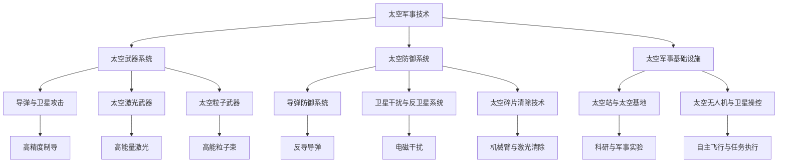

                 

### 1.1 引言

#### 1.1.1 太空军事的崛起

随着人类对太空的探索不断深入，太空军事化也逐渐成为一个不可忽视的趋势。在过去几十年中，太空探索取得了显著进展，从人类首次登月到国际空间站的建成，再到火星探测任务的展开，这些都为太空军事化奠定了技术基础。同时，太空资源的开发与利用、卫星技术的突破，也为太空军事活动提供了新的可能性。

太空军事化不仅关乎国家安全，更关乎人类未来的生存与发展。太空军事化带来了新的战略机遇，但也带来了前所未有的安全挑战。首先，太空资源的争夺将导致新的军事冲突。随着各国对月球、火星等行星资源的兴趣增加，太空将成为新的战场。其次，卫星的军事化应用将威胁到全球通信和导航系统的稳定运行。卫星攻击和干扰技术的发展，可能使各国关键基础设施陷入瘫痪。

#### 1.1.2 书籍目的与结构

本书旨在探讨2050年太空军事的可能发展，分析太空武器系统、太空防御系统以及太空军事基础设施，并探讨太空战争的法律与伦理问题。全书分为五个部分：

- **第一部分：引言**：介绍太空军事的崛起背景，以及本书的目的与结构。
- **第二部分：太空军事技术**：详细阐述太空军事技术，包括太空武器系统、太空防御系统和太空军事基础设施。
- **第三部分：太空战争场景**：分析太空战争的可能性与影响，讨论太空战争的法律与伦理问题。
- **第四部分：太空军事的未来**：展望太空军事技术的前沿趋势，探讨太空军事的未来发展。
- **第五部分：案例研究**：通过实际应用案例和历史案例，深入分析太空军事技术和发展。

通过这本书，我们希望能够为读者提供一个全面、深入的太空军事视角，帮助读者理解这一领域的复杂性和重要性。同时，我们也希望这本书能够引发更多关于太空军事化的讨论和研究，为未来的太空探索和安全奠定坚实的基础。

### 1.2 太空军事的背景

#### 1.2.1 太空探索的进展

太空探索是人类科技进步的重要标志，也是推动科技发展的重要动力。自1961年尤里·加加林首次进入太空以来，人类对太空的探索从未停止。经过数十年的努力，人类在太空探索领域取得了许多重要成就：

- **载人航天**：从阿波罗计划到国际空间站，人类不断突破自我，实现了长期载人航天飞行。国际空间站的建成和运行，不仅为人类提供了一个长期的太空实验室，也为未来的太空探索奠定了基础。
- **月球探索**：从阿波罗计划成功登月到月球探测器频繁探访，月球成为人类太空探索的重要目标。月球表面的矿物资源和潜在的水资源，引起了各国的浓厚兴趣。
- **火星探索**：近年来，多个国家和私人企业开展了火星探测任务。火星探测器的成功着陆和漫游，不仅丰富了人类对火星的认识，也为未来可能的火星殖民地建设提供了宝贵的经验。
- **小行星探索**：小行星含有丰富的矿物资源，具有潜在的经济价值。各国纷纷开展小行星探测任务，试图获取这些宝贵的资源。

#### 1.2.2 太空军事化的挑战与机遇

太空军事化不仅是一个技术问题，更是一个战略问题。随着太空技术的快速发展，太空军事化带来了新的挑战和机遇：

- **挑战**：
  - **太空安全**：随着卫星在军事、通信、导航等领域的广泛应用，太空安全成为一个重要的课题。卫星攻击和干扰技术的发展，可能导致全球通信和导航系统瘫痪，影响国家安全和经济发展。
  - **太空资源的争夺**：月球、火星等行星资源丰富，具有巨大的经济和战略价值。各国在太空资源的争夺中可能引发新的军事冲突。
  - **太空垃圾**：人类在太空活动过程中产生的太空垃圾，对太空环境和航天器的运行构成严重威胁。如何有效管理太空垃圾，成为一个重要的挑战。

- **机遇**：
  - **太空军事技术**：太空军事化推动了太空技术的发展，为军事装备和作战理论的创新提供了新的空间。例如，太空激光武器、太空粒子武器等新兴技术的研发，可能改变未来战争的形态。
  - **太空经济**：太空军事化也为太空经济的发展提供了新的机遇。通过开发太空资源，可以实现经济利益的最大化，推动全球经济的繁荣。
  - **国际合作**：太空军事化需要各国共同努力，共同维护太空安全。通过国际合作，可以促进各国之间的交流与合作，实现共赢。

#### 1.2.3 2050年的太空环境

展望2050年，太空环境将发生深刻变化：

- **太空资源的开发与利用**：随着技术的进步，人类将更加有效地开发与利用太空资源，如月球和火星的水资源、矿物资源等。这些资源的开发利用，将极大地促进太空经济的发展。
- **太空安全与太空垃圾管理**：随着太空活动的增加，太空安全将成为一个更加重要的问题。各国将加强太空安全合作，共同应对太空安全挑战。同时，太空垃圾管理将成为一个重要的课题，通过技术创新和有效管理，减少太空垃圾对太空环境和航天器运行的影响。
- **太空军事技术的突破**：2050年的太空军事技术将取得重大突破，太空武器系统、太空防御系统和太空军事基础设施将更加完善和先进。这些技术的突破，将使太空军事能力得到显著提升。

总之，太空军事化是一个复杂而重要的话题，它不仅关乎国家安全，更关乎人类未来的发展。通过深入研究和讨论太空军事化，我们可以更好地应对未来太空环境中的挑战和机遇，为人类社会的繁荣和进步做出贡献。

### 1.3 2050年的太空环境

展望2050年，太空环境将发生显著变化，这不仅体现在太空资源的开发与利用、太空安全与太空垃圾管理等方面，还涉及到太空军事技术的发展和国际合作。

#### 1.3.1 太空资源的开发与利用

随着技术的进步，人类对太空资源的开发与利用将进入一个新阶段：

- **月球资源**：月球表面富含稀有金属和矿物资源，如铀、钛、镧等。未来，月球将成为人类重要的资源基地。月球水冰的开发利用，将为人类提供新的水资源，甚至可能成为未来火星殖民的重要水源。
- **火星资源**：火星拥有丰富的矿物资源，包括铁、镍、钴等，还可能存在水冰。火星的表面和地下资源，将极大地促进火星殖民和太空经济的发展。
- **小行星资源**：小行星富含稀有金属和矿物，如铂、钯、金等，具有巨大的经济价值。各国将加强对小行星资源的探测和开采，实现资源的合理利用。

#### 1.3.2 太空安全与太空垃圾管理

太空安全与太空垃圾管理将成为2050年太空环境中的重要议题：

- **太空安全**：随着卫星和航天器的数量不断增加，太空安全将面临新的挑战。各国将加强太空安全合作，建立有效的太空安全机制。同时，太空防御系统和技术将不断发展，以应对潜在的太空威胁。
- **太空垃圾管理**：太空垃圾将对太空环境造成严重污染，威胁到航天器的运行安全。未来，人类将采用新的技术和策略来管理太空垃圾，如使用激光清除太空垃圾、开发可回收的航天器等。

#### 1.3.3 太空军事基础设施

2050年的太空军事基础设施将更加先进和完备：

- **太空站与太空基地**：未来的太空站和太空基地将具备更加先进的功能，如能源供应、物资储备、科学研究等。这些设施将成为太空军事活动的重要支撑。
- **太空无人机与卫星操控**：太空无人机和卫星操控技术将实现重大突破，使得太空军事行动更加高效和灵活。
- **太空防御系统**：未来的太空防御系统将包括导弹防御系统、卫星干扰与反卫星系统、太空碎片清除技术等。这些系统将有效保护太空资产，确保太空安全。

#### 1.3.4 国际合作

在太空军事化的背景下，国际合作将变得更加重要：

- **国际太空军事合作**：各国将加强太空军事合作，共同应对太空安全挑战。例如，建立国际太空安全机制、开展联合太空军事演练等。
- **太空军事技术的共享**：各国将在太空军事技术方面进行合作，共享研究成果和技术，推动太空军事技术的发展。
- **太空军事化的法律与伦理**：各国将共同探讨太空军事化的法律与伦理问题，制定相关国际规则，确保太空军事活动的合法性和道德性。

总之，2050年的太空环境将充满挑战和机遇。通过深入研究和国际合作，人类将能够更好地应对未来太空环境中的挑战，实现太空资源的开发与利用，保障太空安全，推动太空军事技术的发展。

### 2.1 太空军事技术概述

太空军事技术是指在太空环境中进行的军事活动和防御技术，包括太空武器系统、太空防御系统和太空军事基础设施。随着人类对太空的探索不断深入，太空军事技术逐渐成为一个不可忽视的重要领域。以下是对太空军事技术的基本概述和分类。

#### 2.1.1 太空军事技术的定义与发展

太空军事技术的定义相对宽泛，主要包括利用卫星、飞船、空间站等太空资产进行军事侦察、攻击、防御等活动。这些技术不仅涉及航天技术，还涵盖导弹技术、激光技术、粒子物理学等多个学科领域。

- **早期发展**：20世纪50年代，随着冷战加剧，太空军事化成为一个热门话题。美国和苏联竞相发射卫星，开展太空军事活动。这一时期的太空军事技术主要集中在卫星侦察和导弹防御。
- **冷战后期**：随着冷战结束，太空军事技术逐渐从侦察和防御扩展到攻击和进攻。例如，美国发展了地基和空基反卫星武器系统，其他国家也开始了相应的研发工作。
- **21世纪初**：随着技术的进步，太空军事技术进入了快速发展的阶段。激光武器、粒子武器、太空无人机等新兴技术相继问世，使得太空军事活动更加多样化和复杂化。

#### 2.1.2 太空军事技术的分类

太空军事技术可以根据其功能和作用，分为以下几个主要类别：

- **太空武器系统**：包括导弹与卫星攻击、太空激光武器和太空粒子武器等。这些武器系统主要用于攻击敌方卫星、空间站和其他太空资产，具备高精度和高毁伤力。
  - **导弹与卫星攻击**：利用导弹直接攻击敌方卫星，或者通过卫星释放导弹进行攻击。这类武器系统具有较高的毁伤能力和精度。
  - **太空激光武器**：利用激光对敌方卫星进行攻击，具有高速度和高精度。这类武器系统在实验室和模拟环境中已经取得了显著进展。
  - **太空粒子武器**：利用高能粒子束攻击敌方卫星，具有高精度和较高毁伤力。这类武器系统目前尚处于研发阶段。

- **太空防御系统**：包括导弹防御系统、卫星干扰与反卫星系统、太空碎片清除技术等。这些系统主要用于保护己方太空资产，抵御敌方攻击。
  - **导弹防御系统**：利用反导导弹拦截敌方导弹，保护空间站和卫星等关键太空资产。
  - **卫星干扰与反卫星系统**：通过电磁波干扰敌方卫星，使其失效或失控。这类系统主要包括卫星干扰器和反卫星导弹。
  - **太空碎片清除技术**：通过机械臂、激光等技术清除太空碎片，降低太空环境风险。

- **太空军事基础设施**：包括太空站、太空基地、太空无人机和卫星操控系统等。这些设施主要用于支持太空军事活动和保障太空安全。
  - **太空站与太空基地**：作为太空军事活动的基地，提供能源供应、物资储备、科学研究等功能。
  - **太空无人机与卫星操控**：用于执行侦察、监视、攻击等任务，提高太空军事行动的效率和灵活性。

#### 2.1.3 太空军事技术的重要性

太空军事技术的重要性体现在以下几个方面：

- **战略意义**：太空军事技术是国家战略能力的重要组成部分。掌握先进的太空军事技术，可以提升国家在国际舞台上的地位，保障国家安全。
- **经济价值**：太空军事技术推动了相关产业的发展，创造了大量就业机会。同时，太空资源的开发与利用，也为国家经济增长提供了新的动力。
- **科技突破**：太空军事技术的发展，促进了航天技术、激光技术、粒子物理学等领域的创新。这些技术的突破，不仅为军事领域带来了新的机遇，也为民用领域提供了新的应用。

总之，太空军事技术是未来战争形态变革的重要驱动力。通过不断发展和完善太空军事技术，人类可以更好地应对未来太空环境中的挑战和机遇，保障太空安全和人类文明的持续发展。

### 2.2 太空武器系统

太空武器系统是未来太空军事化的重要组成部分，它包括导弹与卫星攻击、太空激光武器和太空粒子武器等。这些武器系统在功能上各有特点，且具有极高的军事价值。以下是对这些太空武器系统的详细探讨。

#### 2.2.1 导弹与卫星攻击

导弹与卫星攻击系统是一种传统的太空攻击手段，其主要目标是敌方卫星、空间站和其他太空资产。导弹攻击系统的基本原理是通过地面或空中发射平台，将导弹发射到太空，通过精确制导和战斗部实现敌方目标的摧毁。

- **工作原理**：导弹发射后，利用惯性导航系统和卫星定位系统进行精确制导。当导弹接近目标时，通过战斗部实现高能爆炸，摧毁目标。导弹攻击系统具有高精度和高毁伤力，能够有效破坏敌方太空资产。
- **应用场景**：导弹攻击系统在应对敌方卫星威胁、保护己方太空资产等方面具有重要作用。例如，在战时，导弹攻击系统可以摧毁敌方通信卫星、导航卫星和侦察卫星，切断敌方的通信和情报渠道。

#### 2.2.2 太空激光武器

太空激光武器是一种利用激光进行攻击的先进武器系统，其核心优势在于高速度和高精度。激光武器的工作原理是通过激光发射器产生激光束，对目标进行照射和破坏。

- **工作原理**：太空激光武器利用高能激光束照射目标，激光束的高能量使其能够穿透目标的防护层，并在目标内部产生高温高压等离子体，从而摧毁目标。激光武器的速度极快，能够在短时间内完成攻击，有效应对高速运动的太空目标。
- **应用场景**：太空激光武器在攻击敌方卫星、空间站和其他太空资产方面具有显著优势。其高速度和高精度使得激光武器在对抗敌方快速移动目标时具有优势。此外，激光武器还可以用于防御敌方激光攻击，实现攻防一体。

#### 2.2.3 太空粒子武器

太空粒子武器是一种利用高能粒子束进行攻击的先进武器系统，其主要特点在于高精度和较高毁伤力。粒子武器的工作原理是通过粒子加速器产生高能粒子束，对目标进行照射和破坏。

- **工作原理**：太空粒子武器利用高能粒子束对目标进行攻击，粒子束的高能量使其能够穿透目标的防护层，并在目标内部产生高温高压等离子体，从而摧毁目标。粒子武器的精度较高，能够精确打击目标。
- **应用场景**：太空粒子武器在攻击敌方卫星、空间站和其他太空资产方面具有广泛的应用前景。例如，在战时，太空粒子武器可以用于摧毁敌方通信卫星、导航卫星和侦察卫星，切断敌方的通信和情报渠道。

#### 2.2.4 太空武器系统的发展趋势

随着科技的不断进步，太空武器系统的发展呈现出以下趋势：

- **智能化**：未来太空武器系统将更加智能化，具备自主决策和自适应能力。通过人工智能技术，太空武器系统可以实时分析战场态势，做出最优攻击决策。
- **多元化**：太空武器系统将不再局限于导弹、激光和粒子武器，还将涵盖新型武器系统，如电磁炮、微波武器等。这些新型武器系统将提供更多样化的攻击手段，提高太空作战的灵活性。
- **一体化**：太空武器系统将实现与地面和空中武器系统的一体化，形成综合性的太空作战体系。通过信息共享和协同作战，提高太空作战的整体效能。

总之，太空武器系统是未来太空军事化的关键组成部分，其发展将对未来战争形态产生深远影响。通过不断技术创新和体系化建设，人类将能够更好地应对未来太空环境中的挑战和机遇。

### 2.3 太空防御系统

太空防御系统是保障国家太空资产安全的重要手段，主要包括导弹防御系统、卫星干扰与反卫星系统以及太空碎片清除技术。这些防御系统在功能上各具特色，共同构成了一个综合性的太空安全防护网。

#### 2.3.1 导弹防御系统

导弹防御系统主要用于拦截敌方发射的导弹，保护空间站、卫星和其他太空资产免受攻击。导弹防御系统的工作原理是通过地面或空中发射反导导弹，拦截敌方的弹道导弹。

- **工作原理**：当敌方导弹发射后，导弹防御系统通过雷达和光学传感器等设备，实时监测导弹的轨迹。当敌方导弹进入防御区域时，系统将发射反导导弹进行拦截。反导导弹采用高精度制导技术，能够精确命中敌方导弹，通过高能爆炸摧毁其弹头。
- **技术优势**：导弹防御系统具有高拦截概率和强防护能力。通过多层次、多手段的拦截技术，导弹防御系统能够有效抵御来自不同方向、不同类型的导弹攻击。
- **应用场景**：导弹防御系统在战时主要用于保护关键太空资产，如空间站、通信卫星和导航卫星。通过建立完善的导弹防御系统，国家能够确保太空资产的安全，保障太空军事行动的顺利进行。

#### 2.3.2 卫星干扰与反卫星系统

卫星干扰与反卫星系统主要用于干扰敌方卫星的正常运行，使其失去功能或失控。这类系统主要包括卫星干扰器和反卫星导弹。

- **工作原理**：卫星干扰器通过发射电磁波或射频信号，对敌方卫星的通信、导航和遥感等系统进行干扰，使其无法正常工作。反卫星导弹则通过直接撞击敌方卫星，摧毁其物理结构。
- **技术优势**：卫星干扰与反卫星系统具有较高的灵活性，能够快速响应并应对敌方卫星威胁。通过选择合适的干扰方式和时机，可以最大程度地破坏敌方卫星的功能。
- **应用场景**：卫星干扰与反卫星系统在战时主要用于削弱敌方的通信、导航和情报能力。通过干扰或摧毁敌方卫星，可以切断敌方的信息渠道，破坏其指挥控制系统，从而降低其战斗效能。

#### 2.3.3 太空碎片清除技术

太空碎片清除技术主要用于清理太空中的废弃卫星、火箭残骸等碎片，降低太空碎片对航天器运行的安全威胁。

- **工作原理**：太空碎片清除技术通过机械臂、激光等技术，捕捉并移除太空碎片。例如，机械臂可以抓住废弃卫星，将其拖入大气层烧毁；激光技术则可以发射高能激光束，将碎片烧毁。
- **技术优势**：太空碎片清除技术可以有效减少太空碎片，提高太空环境的安全。通过定期清理太空碎片，可以延长在轨航天器的寿命，降低航天器碰撞的风险。
- **应用场景**：太空碎片清除技术在和平时期主要用于维护太空环境的安全。随着太空活动的日益增多，太空碎片问题日益严重，通过太空碎片清除技术，可以减少太空碎片对航天器运行的影响，保障太空探索的顺利进行。

#### 2.3.4 太空防御系统的发展趋势

随着太空技术的不断发展，太空防御系统也将面临新的挑战和机遇：

- **智能化**：未来的太空防御系统将更加智能化，具备自主决策和自适应能力。通过人工智能技术，防御系统能够实时分析战场态势，做出最优防御策略。
- **多元化**：太空防御系统将涵盖更多样化的技术手段，如电磁炮、激光武器等。这些新型防御技术将提高太空防御的灵活性和有效性。
- **一体化**：太空防御系统将实现与地面和空中防御系统的一体化，形成综合性的太空安全防护体系。通过信息共享和协同作战，提高太空防御的整体效能。

总之，太空防御系统是保障国家太空资产安全的重要手段。通过不断技术创新和体系化建设，人类将能够更好地应对未来太空环境中的挑战和机遇，确保太空安全。

### 2.4 太空军事基础设施

太空军事基础设施是支持太空军事活动的重要保障，包括太空站、太空基地、太空无人机和卫星操控系统等。这些基础设施在功能上各具特色，共同构成了一个完善的太空军事体系。

#### 2.4.1 太空站与太空基地

太空站和太空基地是太空军事活动的重要支撑点。它们不仅提供物资储备、能源供应和科研实验等功能，还在军事侦察、指挥控制等方面发挥着关键作用。

- **太空站**：太空站通常位于地球轨道上，是一个大型的人造空间结构，可供多名航天员长期驻留。太空站的主要功能包括科学实验、技术验证、太空军事侦察等。例如，国际空间站就是一个多国合作的项目，不仅用于科学实验，还具备军事侦察和指挥控制能力。
  - **军事侦察**：太空站可以通过搭载的侦察设备，实时监测地球和太空环境，获取重要的军事信息。在战时，太空站可以作为指挥中心，协调地面和空中的军事行动。
  - **指挥控制**：太空站可以实时传输军事信息，为地面和空中部队提供指挥支持。通过太空站，指挥官可以快速做出决策，提高军事行动的效率。

- **太空基地**：太空基地通常位于月球、火星等行星表面，是未来太空军事活动的重要基地。太空基地的主要功能包括资源开采、物资储备和军事行动等。
  - **资源开采**：太空基地可以开采月球和火星的稀有金属和矿物资源，为地球和太空军事活动提供物资支持。
  - **物资储备**：太空基地可以储存大量的物资，包括武器装备、食品和能源等，为长期的太空军事行动提供保障。
  - **军事行动**：太空基地可以作为军事行动的基地，部署导弹、激光武器和其他太空军事装备，对敌方目标进行攻击。

#### 2.4.2 太空无人机与卫星操控

太空无人机和卫星操控系统在太空军事活动中发挥着重要作用。它们可以执行侦察、监视、攻击等任务，提高太空军事行动的效率和灵活性。

- **太空无人机**：太空无人机是一种无人驾驶的飞行器，可以在太空环境中执行各种任务。太空无人机的主要功能包括侦察、监视和攻击等。
  - **侦察**：太空无人机可以通过搭载的侦察设备，实时监测敌方的军事活动和战略部署。在战时，太空无人机可以提供关键情报，为指挥官制定作战计划提供依据。
  - **监视**：太空无人机可以长期驻留在特定区域，对敌方目标进行连续监视。通过太空无人机，可以实时掌握敌方的动态，防止其采取突然行动。
  - **攻击**：太空无人机可以携带导弹或其他武器，对敌方目标进行攻击。在战时，太空无人机可以迅速部署，实现精确打击，降低地面和空中部队的作战风险。

- **卫星操控系统**：卫星操控系统是用于控制卫星运行的重要设施。通过卫星操控系统，可以对卫星进行轨道调整、设备维护和任务执行等操作。
  - **轨道调整**：卫星操控系统可以根据任务需求，对卫星进行轨道调整，使其保持在最佳工作状态。在战时，卫星操控系统可以迅速调整卫星轨道，确保侦察和监视任务的有效执行。
  - **设备维护**：卫星操控系统可以对卫星上的设备进行远程维护和升级，确保卫星的正常运行。在长期驻留任务中，卫星操控系统尤为重要，可以延长卫星的寿命，提高其任务执行能力。
  - **任务执行**：卫星操控系统可以控制卫星执行各种任务，包括侦察、导航、通信等。在战时，卫星操控系统可以确保卫星在关键时刻提供关键信息，支持地面和空中部队的作战行动。

#### 2.4.3 太空军事基础设施的发展趋势

随着太空技术的不断进步，太空军事基础设施的发展趋势将更加智能化、一体化和多样化：

- **智能化**：未来的太空军事基础设施将更加智能化，具备自主决策和自适应能力。通过人工智能技术，基础设施可以自动执行任务，提高效率和可靠性。
- **一体化**：太空军事基础设施将实现与地面和空中军事基础设施的一体化，形成综合性的太空作战体系。通过信息共享和协同作战，提高太空作战的整体效能。
- **多样化**：太空军事基础设施将涵盖更多样化的设施和装备，包括太空站、太空基地、太空无人机和卫星操控系统等。这些设施和装备将提供更多样化的作战手段，提高太空作战的灵活性。

总之，太空军事基础设施是未来太空军事化的关键支撑点。通过不断技术创新和体系化建设，人类将能够更好地应对未来太空环境中的挑战和机遇，确保太空安全和人类文明的持续发展。

### 2.5 太空军事装备与作战理论

随着太空技术的迅猛发展，太空军事装备和作战理论也在不断演变。新型太空装备的开发与应用，为太空军事作战带来了新的可能性。同时，太空军事作战理论的探索，为太空军事行动提供了新的指导。

#### 2.5.1 新型太空装备的开发与应用

在太空军事化进程中，各国不断研发新型太空装备，以提升太空作战能力。以下是一些重要的新型太空装备：

- **高能激光武器**：高能激光武器是一种利用激光进行攻击的先进武器系统。它能够以极高的速度和精度对敌方卫星、空间站等目标进行打击。高能激光武器的发展，为太空军事作战提供了新的手段，有望改变未来战争的形态。
- **动能拦截器**：动能拦截器是一种利用动能进行攻击的武器系统。它通过高速飞行的拦截器直接撞击目标，实现对目标的摧毁。动能拦截器具有高精度和高毁伤力，是太空防御系统的重要组成部分。
- **高分辨率侦察卫星**：高分辨率侦察卫星能够提供高质量的图像和情报，对敌方军事活动和战略部署进行实时监测。这些卫星在太空军事作战中发挥着重要作用，为指挥决策提供关键支持。
- **太空无人机**：太空无人机是一种无人驾驶的飞行器，能够在太空环境中执行侦察、监视和攻击等任务。太空无人机具有灵活性高、速度快和成本低等优点，是未来太空作战的重要装备。

这些新型太空装备的开发与应用，不仅提升了太空军事作战的能力，也为太空军事作战理论的探索提供了新的基础。

#### 2.5.2 太空军事作战理论与策略

太空军事作战理论是指导太空军事行动的哲学和原则。随着太空技术的发展，太空军事作战理论也在不断演进：

- **卫星作战理论**：卫星作战理论主要关注卫星在军事行动中的应用，包括侦察、导航、通信和攻击等。卫星作战理论强调卫星系统的高效运行和协同作战，以实现最佳作战效果。
- **太空防御理论**：太空防御理论主要研究如何保护太空资产免受敌方攻击。太空防御理论包括导弹防御、卫星干扰与反卫星系统、太空碎片清除技术等，旨在建立一个多层次、多手段的太空防御体系。
- **太空进攻理论**：太空进攻理论探讨如何利用太空武器系统对敌方目标进行打击。太空进攻理论包括导弹与卫星攻击、太空激光武器、太空粒子武器等，强调高效、精确的打击手段和策略。
- **太空作战体系**：太空作战体系是一个综合性的概念，包括太空武器系统、太空防御系统、太空军事基础设施和作战理论等。太空作战体系的构建，旨在实现太空军事行动的协同与整合，提高作战效能。

在太空军事作战策略方面，各国也在积极探索：

- **先发制人**：先发制人策略主张在敌方行动之前采取主动行动，通过先发制人打击敌方关键目标，削弱其战斗能力。
- **攻防平衡**：攻防平衡策略强调攻防兼备，通过构建完善的太空防御体系，同时保持强大的太空进攻能力，实现攻防均衡。
- **联合行动**：联合行动策略主张各国联合进行太空军事行动，通过信息共享和协同作战，实现整体作战优势。

总之，新型太空装备的开发与应用，推动了太空军事作战理论的发展。通过不断探索和创新，人类将能够更好地应对未来太空环境中的挑战和机遇，确保太空安全和人类文明的持续发展。

### 3.1 太空战争的可能性与影响

随着太空技术的迅猛发展，太空战争的可能性逐渐成为现实。太空战争不仅可能改变未来战争的面貌，还会对国际关系、太空安全和经济等多个领域产生深远影响。

#### 3.1.1 太空战争的潜在场景

太空战争可能呈现出多种不同的场景，以下是一些常见的潜在场景：

- **卫星攻击**：卫星是现代军事行动的重要组成部分，控制卫星就是控制信息。太空战争可能首先从卫星攻击开始。例如，利用高能激光武器或动能拦截器摧毁敌方的通信卫星、导航卫星和侦察卫星，从而切断敌方的通信、导航和情报渠道。
- **空间站攻防**：国际空间站等大型太空设施在军事行动中具有重要地位。太空战争可能包括对空间站的攻击与防御，通过控制空间站获取关键情报或实现军事目标。
- **行星表面攻防**：随着月球和火星等行星表面军事基地的建设，这些行星表面也将成为太空战争的潜在战场。例如，通过占领月球基地，可以实现对地球的威慑和控制。
- **太空武器系统部署**：未来，各国可能会在太空部署大量武器系统，包括激光武器、粒子武器等，以应对潜在的太空威胁。这些武器系统的部署，可能引发新一轮的太空军备竞赛。

#### 3.1.2 太空战争对国际关系的影响

太空战争不仅是一个技术问题，更是一个国际政治问题。它将对国际关系产生深远影响：

- **国家间紧张关系**：太空战争可能导致国家间紧张关系加剧。各国为了保护自身利益，可能会采取一系列防御和进攻措施，从而加剧太空军事化的步伐。
- **国际合作与竞争**：太空战争将促使各国在太空安全、太空资源开发等领域进行合作，但同时也可能引发新的竞争。例如，各国可能会争夺月球和火星等行星资源，这可能引发新的军事冲突。
- **国际法律与规则**：太空战争对现有国际法律和规则提出了挑战。国际社会需要制定新的法律和规则，以规范太空军事活动，避免太空战争的发生。

#### 3.1.3 太空战争对太空安全的影响

太空战争对太空安全的影响是显而易见的：

- **太空环境恶化**：太空战争可能导致大量的太空碎片产生，这些碎片将对太空资产造成严重威胁，甚至可能导致太空环境恶化。
- **太空设施受损**：太空战争可能导致太空设施受损，包括卫星、空间站和行星表面基地等。这些设施的损坏将严重影响太空探索和利用。
- **太空安全形势复杂**：太空战争将使太空安全形势变得更加复杂。各国将加强对太空的监控和防御，同时也会研发新的进攻手段，从而形成一种恶性循环。

#### 3.1.4 太空战争对经济的影响

太空战争对经济的影响也是不可忽视的：

- **科技发展**：太空战争将推动太空技术的发展，从而带动相关产业的发展，创造新的经济增长点。
- **经济竞争**：太空战争可能导致各国在太空经济领域的竞争加剧。例如，各国可能会争夺月球和火星等行星资源，从而引发新的经济战。
- **成本增加**：太空战争需要大量的资金投入，这可能导致各国财政压力增加。同时，太空军事化的进程也可能导致民用太空活动受到限制，从而影响经济的发展。

总之，太空战争的可能性与影响不可忽视。通过深入研究和探讨，我们可以更好地应对未来太空环境中的挑战和机遇，确保太空安全和人类文明的持续发展。

### 3.2 太空战争的法律与伦理问题

随着太空军事化进程的加速，太空战争的法律与伦理问题逐渐成为国际社会关注的焦点。如何在国际法和伦理框架内规范太空军事活动，是确保太空安全、促进国际合作的关键。

#### 3.2.1 太空战争的法律框架

现有的国际法律为规范太空活动提供了一定的法律基础，但面对太空战争的复杂性，这些法律框架显得相对滞后。以下是一些重要的国际法律和条约：

- **外层空间条约**：1967年《外层空间条约》是规范外层空间活动的基本法律文件。该条约明确规定外层空间应用于和平目的，禁止任何形式的军事化。然而，随着太空军事化的现实威胁，这一条约的执行面临挑战。
- **太空物体登记条约**：1976年《太空物体登记条约》要求各国对外层空间物体进行登记，以便进行跟踪和责任划分。这一条约有助于防止太空物体随意丢弃和避免太空碎片的增加。
- **防止外层空间军备竞赛条约**：1972年《防止外层空间军备竞赛条约》旨在防止外层空间武器化，确保外层空间用于和平目的。然而，这一条约的约束力较弱，难以有效阻止太空军事化的发展。

#### 3.2.2 太空战争的伦理问题

太空战争的伦理问题主要集中在以下几个方面：

- **人道主义问题**：太空战争可能导致无辜平民受到伤害，违反国际人道法。例如，敌方卫星的攻击可能影响到民用通信、导航等设施，对平民生活造成严重影响。
- **环境问题**：太空战争可能产生大量的太空碎片，污染太空环境，对人类和其他生物的生存造成威胁。此外，太空武器试验和军事活动可能对地球大气层和生态系统产生负面影响。
- **公平问题**：太空战争可能加剧国际不平等，使资源丰富的国家获得更多优势，而资源匮乏的国家则面临更大的生存压力。这可能导致新的冲突和矛盾。

#### 3.2.3 太空战争的法律与伦理挑战

太空战争的法律与伦理挑战主要体现在以下几个方面：

- **法律执行的困难**：现有的国际法律和条约在太空战争中的执行面临诸多困难。例如，各国可能拒绝遵守国际裁决，导致法律约束力减弱。
- **技术发展的快速性**：太空技术的发展速度远超法律框架的更新速度，导致法律难以跟上技术发展的步伐。例如，新型太空武器系统的出现可能突破现有法律的规定，引发新的法律争议。
- **国际合作的不确定性**：太空战争的法律与伦理问题需要国际社会的共同合作解决。然而，各国在利益和立场上的分歧，可能使国际合作难以实现。

#### 3.2.4 太空战争的法律与伦理解决方案

为应对太空战争的法律与伦理挑战，国际社会需要采取以下措施：

- **加强国际合作**：各国应加强在太空军事活动方面的国际合作，共同制定和遵守国际法律和条约。通过多边合作，提高法律执行的效率和效果。
- **推动法律改革**：国际社会应推动法律改革，制定新的国际法律和条约，以应对太空军事化带来的新挑战。例如，制定专门针对太空武器系统的法律，明确各国在太空军事活动中的权利和义务。
- **倡导和平利用太空**：各国应倡导和平利用太空，通过外交途径解决太空争端，避免太空军事化。同时，加强太空技术和知识的共享，促进全球太空事业的共同发展。

总之，太空战争的法律与伦理问题是国际社会面临的重大挑战。通过加强国际合作、推动法律改革和倡导和平利用太空，我们可以为未来的太空环境创造一个更加安全、和平的氛围。

### 3.3 太空战争的模拟与演练

为了更好地理解太空战争的可能性和影响，各国纷纷开展太空战争模拟与演练。这些模拟与演练不仅有助于评估太空作战能力，还为制定有效的太空作战策略提供了宝贵的经验。以下是对太空战争模拟与演练的介绍，包括模拟器的开发与应用，以及演练的挑战与效果。

#### 3.3.1 太空战争模拟器的开发与应用

太空战争模拟器是一种用于模拟太空战争场景的软件系统。它通过计算机模拟各种太空作战环境，包括卫星攻击、空间站攻防、太空碎片清除等，帮助军事决策者进行策略分析和评估。

- **模拟器功能**：太空战争模拟器具有多种功能，包括战场态势模拟、武器系统性能评估、作战策略推演等。模拟器可以通过实时数据传输，模拟卫星的轨道变化、激光武器的攻击效果、粒子武器的毁伤能力等。
- **应用场景**：太空战争模拟器在军事训练、战略规划、技术研发等多个领域具有广泛应用。例如，军事指挥官可以利用模拟器进行战术推演，评估不同作战策略的效果；科研人员可以利用模拟器测试新型太空武器系统的性能，优化设计方案。

#### 3.3.2 太空战争演练的挑战

尽管太空战争模拟与演练具有重要意义，但在此过程中也面临诸多挑战：

- **技术复杂度**：太空环境复杂多变，涉及多个学科领域，如天文学、物理学、电子工程等。模拟器的开发需要高度专业化的技术支持，这对研发团队提出了严峻的挑战。
- **数据准确性**：太空战争模拟需要准确的数据支持，包括卫星轨道、武器性能、太空碎片位置等。然而，由于技术限制和数据获取难度，模拟数据可能存在误差，影响模拟结果的准确性。
- **时间同步性**：太空战争模拟需要精确的时间同步性，以确保模拟过程中的事件和时间与实际相符。时间同步性的问题可能导致模拟结果失真，影响战略分析和决策。

#### 3.3.3 太空战争演练的效果

太空战争模拟与演练在实际应用中取得了显著效果：

- **战略规划**：通过模拟演练，军事决策者可以更好地理解太空战争的复杂性和不确定性，制定有效的战略规划。例如，通过模拟不同作战策略的效果，决策者可以评估不同方案的风险和收益，选择最优方案。
- **技术研发**：模拟演练为新型太空武器系统和防御系统的研发提供了宝贵的数据支持。通过模拟，科研人员可以评估新技术在实际应用中的性能和效果，优化设计方案，提高系统可靠性。
- **人员培训**：模拟演练有助于提高军事人员的作战能力和技术水平。通过模拟各种复杂场景，军事人员可以熟悉太空作战流程，提高应对突发事件的能力。

总之，太空战争模拟与演练是理解和应对太空战争的重要手段。通过不断改进模拟技术和方法，我们可以更好地应对未来太空环境中的挑战和机遇，确保太空安全和人类文明的持续发展。

### 4.1 太空军事技术的前沿趋势

随着科技的迅猛发展，太空军事技术正迎来新的前沿趋势。这些趋势不仅推动了太空军事能力的提升，也改变了未来战争的形态。以下是对当前太空军事技术前沿趋势的详细探讨。

#### 4.1.1 未来的太空武器系统

未来的太空武器系统将朝着更加先进、高效和智能化的方向发展。以下是一些重要的前沿技术：

- **高能激光武器**：高能激光武器利用激光束对目标进行打击，具有高速度和高精度。未来，激光武器技术将进一步突破，实现更高能量密度和更远的射程。例如，美国已经开发出轨道激光武器系统，用于对抗敌方的卫星和航天器。
- **粒子武器**：粒子武器利用高能粒子束进行攻击，具有高精度和较大毁伤力。这类武器系统目前尚处于研发阶段，但未来有望在太空作战中发挥重要作用。例如，美国和俄罗斯已经进行了粒子武器实验，取得了一定成果。
- **动能拦截器**：动能拦截器通过高速飞行的拦截器直接撞击目标，实现对目标的摧毁。未来，动能拦截器将实现更高的速度和精度，提高拦截效果。例如，美国已经部署了地基和空基动能拦截器系统，用于防御敌方的弹道导弹攻击。

#### 4.1.2 太空军事基础设施的升级

太空军事基础设施的升级将进一步提升太空作战能力。以下是一些重要的基础设施发展：

- **太空站与太空基地**：未来的太空站和太空基地将具备更加先进的功能，如能源供应、物资储备、科学研究等。这些设施将成为太空军事活动的重要支撑。例如，国际空间站的扩建和月球基地的建设，将为未来的太空军事活动提供更多资源和保障。
- **太空无人机与卫星操控**：太空无人机和卫星操控技术将实现重大突破，使得太空军事行动更加高效和灵活。例如，美国已经开发出多种太空无人机，用于执行侦察、监视、攻击等任务。同时，卫星操控技术也将不断发展，提高卫星的可靠性和稳定性。
- **太空防御系统**：未来的太空防御系统将涵盖更多样化的技术手段，如电磁炮、激光武器、粒子武器等。这些系统将实现一体化的作战能力，提高太空资产的安全性。例如，美国正在研发多层次的太空防御系统，包括地基、空基和天基防御系统。

#### 4.1.3 新型太空军事作战理论的探索

随着太空军事技术的不断发展，新型太空军事作战理论也在不断探索中。以下是一些重要的作战理论：

- **卫星作战理论**：卫星作战理论关注卫星在军事行动中的应用，包括侦察、导航、通信和攻击等。未来的卫星作战理论将更加注重卫星系统的高效运行和协同作战，以实现最佳作战效果。
- **太空防御理论**：太空防御理论探讨如何保护太空资产免受敌方攻击。未来的太空防御理论将涵盖多种防御手段，如导弹防御、卫星干扰与反卫星系统、太空碎片清除技术等，以建立一个多层次、多手段的太空防御体系。
- **太空进攻理论**：太空进攻理论探讨如何利用太空武器系统对敌方目标进行打击。未来的太空进攻理论将更加注重高效、精确的打击手段和策略，以实现最佳作战效果。
- **太空作战体系**：太空作战体系是一个综合性的概念，包括太空武器系统、太空防御系统、太空军事基础设施和作战理论等。未来的太空作战体系将实现一体化作战能力，提高太空作战的整体效能。

总之，当前太空军事技术的前沿趋势为未来的太空军事能力提供了广阔的发展空间。通过不断技术创新和体系化建设，人类将能够更好地应对未来太空环境中的挑战和机遇，确保太空安全和人类文明的持续发展。

### 4.2 太空军事的未来展望

展望未来，太空军事化将继续成为全球军事战略发展的重要方向。随着技术的不断进步和国际政治经济格局的变化，太空军事战略也将经历深刻变革。以下是对未来太空军事战略的发展方向、国际竞争以及长期影响的探讨。

#### 4.2.1 太空军事战略的发展方向

未来的太空军事战略将呈现出以下几个主要发展方向：

- **智能化与自主化**：未来太空军事战略将更加注重智能化和自主化。通过人工智能技术，太空武器系统、太空防御系统和太空基础设施将实现自主决策和自适应能力，提高作战效率和应对突发事件的能力。
- **一体化作战体系**：未来太空军事战略将推动太空、地面、空中和海洋等军事领域的一体化作战体系。通过信息共享和协同作战，各国将构建综合性的太空作战体系，提高整体作战效能。
- **多元化技术与手段**：未来太空军事战略将涵盖更多样化的技术与手段，如高能激光武器、粒子武器、电磁炮等。这些新型武器系统将提供更多的作战选择，提高太空作战的灵活性。
- **太空资源开发与利用**：太空军事战略将更加关注太空资源的开发与利用。通过开发月球、火星等行星资源，各国将提高太空经济实力，为太空军事活动提供坚实的物质基础。

#### 4.2.2 国际太空军事竞争

随着太空军事化进程的加快，国际太空军事竞争也将日益激烈。以下是对当前主要国家和地区的太空军事竞争态势的概述：

- **美国**：美国作为太空军事化的先行者，拥有全球领先的太空技术和作战能力。美国持续投资于太空军事技术，发展高能激光武器、动能拦截器等先进武器系统。同时，美国还致力于构建一体化的太空作战体系，提高作战效能。
- **俄罗斯**：俄罗斯在太空军事领域拥有丰富的经验和技术储备。俄罗斯发展了多种太空武器系统，如反卫星导弹、卫星干扰器等。未来，俄罗斯将进一步加强太空军事能力，应对美国等对手的挑战。
- **中国**：中国近年来在太空军事领域取得了显著进展。中国成功实现了载人航天、月球探测和火星探测等重大突破。未来，中国将继续发展高能激光武器、动能拦截器等新型太空武器系统，提升太空作战能力。
- **欧洲**：欧洲国家在太空军事领域也有一定实力。例如，欧盟成员国共同开展了一系列太空军事项目，如欧洲太空军的建设等。未来，欧洲国家将进一步推动太空军事合作，提升整体作战能力。

#### 4.2.3 太空军事化的长期影响

太空军事化将对国际政治、经济和安全等多个领域产生深远影响：

- **国际政治**：太空军事化将加剧国际政治格局的变化。各国将在太空领域展开激烈竞争，争夺太空资源和军事优势。这可能导致新的军事冲突和地缘政治紧张局势。
- **经济**：太空军事化将推动太空经济的发展。通过开发太空资源，各国可以创造新的经济增长点，提高国家经济实力。同时，太空军事技术的应用也将促进相关产业的发展。
- **安全**：太空军事化将提升太空安全挑战。各国将加强太空防御系统建设，提高太空资产的安全性。然而，太空军事化也可能引发新的军备竞赛，增加太空安全的压力。

总之，未来太空军事化将继续发展，成为全球军事战略的重要方向。通过不断技术创新和战略调整，各国将能够更好地应对未来太空环境中的挑战和机遇，确保太空安全和人类文明的持续发展。

### 4.3 太空军事化的国际合作

在太空军事化日益成为全球关注焦点的背景下，国际合作在确保太空安全、促进太空军事技术发展和规范太空军事活动方面发挥着至关重要的作用。以下是对国际太空军事合作现状、前景以及面临的挑战的探讨。

#### 4.3.1 国际太空军事合作的现状

当前，国际太空军事合作已经在多个层面展开：

- **多边合作机制**：国际社会通过多边合作机制，如联合国太空事务办公室、国际电信联盟等，共同探讨和解决太空安全问题。这些机制为各国提供了一个交流平台，促进了国际共识的形成。
- **联合演习和训练**：各国共同参与太空军事演习和训练，提高太空作战能力和应对突发事件的能力。例如，美国、俄罗斯、欧盟等地区组织定期举行太空军事演习，通过实战演练提升合作水平。
- **技术交流和共享**：各国在太空军事技术方面进行交流和共享，共同推动太空军事技术的发展。例如，国际空间站项目就是一个典型的合作案例，多个国家共同参与，分享技术和资源。
- **规范太空军事活动**：国际社会通过制定国际法律和条约，规范太空军事活动，避免太空军事化带来的风险。例如，《外层空间条约》、《防止外层空间军备竞赛条约》等文件为国际太空军事活动提供了法律框架。

#### 4.3.2 国际太空军事合作的前景

随着太空军事化进程的加快，国际太空军事合作的前景也变得更加广阔：

- **共建太空安全体系**：未来，国际社会将更加注重共建太空安全体系，通过多边合作，共同应对太空威胁，确保太空环境的和平与稳定。
- **推动太空军事技术进步**：国际合作将有助于各国共同研发新型太空军事技术，提高太空作战能力。通过技术共享和联合研发，可以缩短技术突破的时间，实现技术优势的最大化。
- **规范太空军事活动**：随着太空军事化的发展，国际社会将更加重视制定和遵守国际法律和条约，规范太空军事活动，防止太空军事化带来的风险。
- **增强国际信任与合作**：通过国际合作，各国可以增强互信，减少误解和误判，降低太空冲突的可能性。国际合作也有助于缓解国际紧张局势，促进全球和平与稳定。

#### 4.3.3 国际太空军事合作面临的挑战

尽管国际太空军事合作前景广阔，但在此过程中也面临着诸多挑战：

- **技术敏感性与保密性**：太空军事技术具有高度敏感性，各国在技术交流中需要平衡技术共享与保密性的需求。如何保护技术安全，防止技术外泄，是国际合作面临的一大挑战。
- **利益冲突与协调困难**：各国在太空军事活动中的利益冲突可能导致合作困难。例如，在太空资源的开发和利用方面，各国可能存在竞争和矛盾。如何协调各国利益，实现合作共赢，是国际太空军事合作面临的重要挑战。
- **法律与伦理问题**：太空军事化引发的法律与伦理问题需要国际社会共同解决。例如，如何确保太空军事活动的合法性、道德性，避免对平民和环境造成伤害，是国际合作中必须面对的挑战。
- **军事对抗与安全威胁**：随着太空军事化的加剧，太空安全形势也变得更加复杂。各国在太空领域的军事对抗和冲突可能增加，国际社会需要共同应对这些安全威胁。

总之，国际太空军事合作在确保太空安全、推动技术进步和规范活动方面具有重要意义。通过加强国际合作，各国可以共同应对未来太空环境中的挑战和机遇，确保太空安全和人类文明的持续发展。

### 5.1 太空军事技术的实际应用案例

太空军事技术的发展不仅停留在理论层面，已经有许多实际应用案例，展示了其在国家安全和军事行动中的重要作用。以下将介绍一些典型的太空军事技术实际应用案例，并分析其技术原理和实际效果。

#### 5.1.1 美国太空军的建设与发展

美国是太空军事技术的先驱之一，其太空军的建设和发展对全球太空军事化产生了深远影响。以下是几个重要案例：

- **X-37B太空飞机**：X-37B是美国研制的一种 reusable spaceplane，主要用于开展太空侦察、试验新技术和执行军事任务。X-37B具有高度机密性，能够在太空执行长时间的侦察任务，并具备快速部署和回收的能力。其技术原理主要涉及高精度导航、自主飞行控制和热防护材料，使得X-37B能够在复杂太空环境中稳定运行。

- **反卫星导弹**：美国开发了多种反卫星导弹，如陆基中段防御系统（Ground-based Midcourse Defense，GMD）和地基激光武器系统（High Energy Laser System for Test and Evaluation，HELSTET）。这些系统通过直接摧毁敌方卫星或使其失效，保护美国及其盟友的太空资产。反卫星导弹的工作原理基于高精度制导和爆炸战斗部，能够精准打击目标，具有高毁伤力。

#### 5.1.2 俄罗斯太空军事技术的发展

俄罗斯在太空军事技术领域也有显著成就，以下是一些具体案例：

- **“宇宙-2500”卫星干扰系统**：“宇宙-2500”是一种卫星干扰系统，主要用于干扰敌方通信和导航卫星。该系统通过发射射频信号，对敌方卫星进行干扰，使其无法正常工作。其技术原理涉及高频信号发射、信号处理和天线系统，能够实现对多颗卫星的高效干扰。

- **“陨石”反卫星导弹**：“陨石”反卫星导弹是俄罗斯研发的一种高超声速反卫星武器，能够在短时间内完成发射和拦截任务。该导弹采用高超声速飞行技术，能够以极快的速度逼近目标，通过碰撞摧毁敌方卫星。其技术原理包括高超声速飞行控制、再入大气层热防护和高效杀伤战斗部。

#### 5.1.3 中国太空军事技术的进展

中国在太空军事技术方面也取得了显著进展，以下是一些重要案例：

- **天宫空间站**：中国的天宫空间站是一个多功能太空实验室，不仅用于科学实验和空间技术验证，还具备一定的军事侦察和指挥控制功能。天宫空间站通过高分辨率成像设备、通信设备和指挥控制系统，为军事行动提供重要支持。

- **动能拦截器**：中国开发的动能拦截器是一种高精度反卫星武器，通过高速飞行的拦截器直接撞击目标，实现摧毁。动能拦截器的技术原理包括高精度制导、高速飞行控制和再入大气层防护，能够在复杂太空环境中精准打击目标。

#### 5.1.4 技术原理和实际效果分析

以上案例展示了不同国家在太空军事技术领域的实际应用和进展。以下是这些技术原理和实际效果的分析：

- **X-37B太空飞机**：X-37B的技术原理涉及高精度导航、自主飞行控制和热防护材料，使得其能够在复杂太空环境中稳定运行。实际效果方面，X-37B已经完成了多次飞行任务，展示了其在侦察和实验方面的能力。

- **“宇宙-2500”卫星干扰系统**：“宇宙-2500”的技术原理包括高频信号发射、信号处理和天线系统，能够实现对多颗卫星的高效干扰。实际效果方面，俄罗斯多次成功干扰了敌方卫星，展示了其在卫星防御和干扰方面的优势。

- **“陨石”反卫星导弹**：“陨石”的技术原理包括高超声速飞行技术、再入大气层热防护和高效杀伤战斗部，能够以极快的速度逼近目标，实现摧毁。实际效果方面，俄罗斯已经成功进行了多次反卫星试验，验证了其技术能力。

- **天宫空间站**：天宫空间站的技术原理包括高分辨率成像设备、通信设备和指挥控制系统，为军事行动提供支持。实际效果方面，天宫空间站已经开展了多项军事实验和技术验证，展示了其在太空军事应用中的潜力。

- **动能拦截器**：动能拦截器的技术原理包括高精度制导、高速飞行控制和再入大气层防护，能够精准打击目标。实际效果方面，中国已经成功进行了多次动能拦截试验，展示了其反卫星作战能力。

总之，以上实际应用案例展示了不同国家在太空军事技术领域的进展和成果。通过技术创新和应用，各国不断提升太空军事能力，为国家安全和军事行动提供重要支持。未来，随着太空技术的进一步发展，太空军事技术的应用将更加广泛和深入。

### 5.2 太空战争的历史案例

在人类太空探索的历史中，尽管尚未发生真正的太空战争，但已有一些关键事件，这些事件对太空军事化进程产生了深远影响。以下是对几场关键太空军事事件的历史回顾，以及这些事件对战争形态的影响。

#### 5.2.1 第一次太空军事事件：卫星干扰

1958年，美国和苏联在冷战期间展开了第一次太空军事行动。苏联的“斯普特尼克5号”载人飞船成功将宇航员尤里·加加林送入太空，成为人类历史上的第一次载人航天飞行。然而，这次飞行也引发了美国的高度警惕。为了削弱苏联的太空优势，美国实施了一系列卫星干扰行动。

- **事件回顾**：美国通过卫星干扰技术，试图干扰苏联的通信卫星，使其失效或无法正常工作。这一行动显示了太空干扰在军事上的潜力，标志着太空军事化进程的开始。

- **影响分析**：这次事件揭示了太空技术在军事领域的战略价值。通过干扰敌方卫星，可以切断其通信和情报渠道，削弱敌方的指挥和控制能力。此外，这次事件也促使各国加强太空军事技术研究，为未来的太空战争做准备。

#### 5.2.2 第二次太空军事事件：卫星攻击

1985年，美国在冷战末期成功进行了卫星攻击试验，这被认为是人类历史上第一次真正的卫星攻击。美国使用“航天飞机”发射了一枚“牛顿炮”，成功击中了距离地球约900公里的报废卫星。

- **事件回顾**：这次试验展示了利用航天器直接攻击敌方卫星的技术可行性。美国通过这次试验，验证了卫星攻击的原理，并为未来的太空作战提供了技术参考。

- **影响分析**：这次事件进一步推动了太空军事化进程。它表明，各国可以通过直接攻击敌方卫星，切断其通信、导航和侦察能力，从而在军事上取得战略优势。此外，这次事件也促使其他国家加快研发反卫星技术，以应对潜在的太空威胁。

#### 5.2.3 第三次太空军事事件：国际空间站的军事利用

1998年，国际空间站（ISS）正式建成，成为人类在太空环境中的第一个永久性居住和研究设施。尽管国际空间站主要用于和平目的，但其军事利用的可能性引起了广泛关注。

- **事件回顾**：美国和俄罗斯等国在空间站建设过程中，已经在某些模块中预留了军事用途，如通信、侦察和指挥控制。此外，国际空间站还成为各国进行太空军事实验的基地。

- **影响分析**：国际空间站的军事利用展示了太空设施在军事行动中的重要性。它不仅可以用于情报收集和指挥控制，还可以作为太空军事行动的支撑点。此外，这次事件也提醒各国，在太空探索过程中必须重视太空军事化的潜在风险，并制定相应的对策。

#### 5.2.4 太空战争对战争形态的影响

以上历史事件揭示了太空战争对战争形态的深远影响：

- **信息战**：太空军事化使得信息战成为新的战场。通过控制卫星和太空基础设施，可以实现对敌方通信、导航和侦察系统的干扰或破坏，从而影响敌方的指挥和控制能力。

- **高边疆**：太空成为新的战略高地，各国纷纷开展太空军事活动，争夺太空优势。太空资源丰富，成为新的战略目标，可能引发新的军事冲突。

- **技术竞争**：太空军事化推动了新技术的发展，如高能激光武器、粒子武器和动能拦截器等。这些新技术的应用将改变未来战争的形态，提高作战效率和精度。

- **国际合作与竞争**：太空军事化需要国际社会共同努力，制定相关法律和规则，确保太空环境的和平与稳定。同时，各国在太空军事技术领域的竞争也日益激烈，这可能导致新的军事冲突和地缘政治紧张局势。

总之，太空战争的历史案例不仅展示了太空军事化的发展趋势，还揭示了其对战争形态的深远影响。通过深入研究和讨论，我们可以更好地应对未来太空环境中的挑战和机遇，确保太空安全和人类文明的持续发展。

### 5.3 太空军事模拟案例

为了更好地理解太空军事活动的复杂性和挑战，各国和国际组织开展了多个太空军事模拟案例，通过模拟演练评估太空作战能力和应对策略。以下是对一些重要太空军事模拟案例的介绍，包括模拟器的开发与应用、模拟演练的挑战以及模拟结果和启示。

#### 5.3.1 国际太空战争模拟演练

国际太空战争模拟演练是各国共同参与的重要活动，旨在评估太空作战能力，提高军事人员的技能和策略水平。以下是一些具有代表性的国际太空战争模拟案例：

- **“欧洲联合演习”**：这是欧盟成员国共同参与的一项太空军事模拟演练，涵盖了卫星攻击、太空防御和空间站攻防等多个场景。通过演练，各国评估了太空作战策略，提升了协同作战能力。

- **“全球太空战争模拟”**：这是由多个国家和地区共同参与的全球性太空战争模拟演练，旨在评估各国在太空军事领域的协调和合作能力。模拟演练中，各国模拟了卫星攻击、反卫星系统部署、太空碎片清除等多个任务，通过演练，各国积累了宝贵的经验。

#### 5.3.2 模拟器的开发与应用

太空战争模拟器是模拟演练的核心工具，通过计算机模拟各种太空作战场景，帮助军事决策者和军事人员评估不同策略的效果。以下是一些重要的太空战争模拟器：

- **“太空战争模拟器”**：这是一种基于虚拟现实技术的太空战争模拟器，能够模拟真实的太空环境，包括卫星轨道、太空碎片、激光武器和粒子武器等。通过这个模拟器，军事人员可以体验太空作战的真实场景，提高决策能力和应对突发事件的能力。

- **“全球太空作战模拟器”**：这是一个综合性太空战争模拟器，涵盖了卫星攻击、太空防御、太空站攻防等多个场景。该模拟器通过实时数据传输，模拟真实的太空作战环境，帮助各国评估不同策略的效果。

#### 5.3.3 模拟演练的挑战

尽管太空军事模拟演练具有重要意义，但在实际操作中仍面临诸多挑战：

- **技术复杂性**：太空环境复杂多变，涉及多个学科领域，如天文学、物理学、电子工程等。模拟器的开发需要高度专业化的技术支持，这对研发团队提出了严峻的挑战。

- **数据准确性**：太空战争模拟需要准确的数据支持，包括卫星轨道、武器性能、太空碎片位置等。然而，由于技术限制和数据获取难度，模拟数据可能存在误差，影响模拟结果的准确性。

- **时间同步性**：太空战争模拟需要精确的时间同步性，以确保模拟过程中的事件和时间与实际相符。时间同步性的问题可能导致模拟结果失真，影响战略分析和决策。

#### 5.3.4 模拟结果与启示

通过多次太空军事模拟演练，各国和国际组织积累了宝贵的经验，以下是一些主要结果和启示：

- **策略优化**：通过模拟演练，各国评估了不同作战策略的效果，优化了太空作战策略。例如，通过模拟卫星攻击与反卫星系统的对抗，各国找到了最佳的攻击和防御策略。

- **技术验证**：模拟演练为新型太空武器系统的验证提供了宝贵的数据支持。通过模拟，科研人员可以评估新技术在实际应用中的性能和效果，优化设计方案。

- **国际合作**：模拟演练促进了各国在太空军事领域的合作。通过联合演练，各国建立了互信，提高了协同作战能力，为未来的国际合作奠定了基础。

- **应急响应能力提升**：模拟演练提高了军事人员的应急响应能力。通过模拟突发事件，军事人员熟悉了应对流程，提高了应对实际突发事件的能力。

总之，太空军事模拟演练是评估太空作战能力和优化策略的重要手段。通过不断改进模拟技术和方法，各国可以更好地应对未来太空环境中的挑战和机遇，确保太空安全和人类文明的持续发展。

### 6.1 太空军事的发展趋势与挑战

随着科技的不断进步，太空军事化正经历着前所未有的发展。未来，太空军事技术将继续推动军事形态的变革，但同时也面临着诸多挑战。以下是对太空军事发展趋势的详细分析以及面临的挑战。

#### 6.1.1 太空军事技术发展的关键领域

未来的太空军事技术发展将集中在以下几个关键领域：

- **高能激光武器**：高能激光武器是一种具有巨大潜力的太空武器系统。它利用激光束对敌方目标进行攻击，具有高速度和高精度。随着激光技术的不断突破，未来高能激光武器将实现更高能量密度和更远的射程，成为太空作战的重要手段。

- **粒子武器**：粒子武器利用高能粒子束进行攻击，具有高精度和较高毁伤力。未来，随着粒子加速技术的发展，粒子武器将实现更高的粒子能量和更广泛的作战范围，为太空作战提供新的选择。

- **动能拦截器**：动能拦截器通过高速飞行的拦截器直接撞击目标，实现对目标的摧毁。未来，随着高超声速飞行技术的研究，动能拦截器的速度和精度将进一步提高，提高太空防御能力。

- **太空无人机与卫星操控**：太空无人机和卫星操控技术在太空军事中发挥着重要作用。未来，随着人工智能和自主飞行技术的发展，太空无人机和卫星操控将实现更高的智能化和自主化，提高太空作战的灵活性和效率。

#### 6.1.2 太空军事化面临的挑战

尽管太空军事技术发展迅速，但太空军事化仍面临诸多挑战：

- **太空安全**：随着太空活动的增加，太空安全成为一个重要问题。太空碎片、卫星碰撞、电磁干扰等威胁不断增加，如何确保太空环境的安全，防止太空战争的发生，是太空军事化面临的重要挑战。

- **国际法律与伦理**：现有的国际法律和条约在规范太空军事活动方面存在不足。如何制定新的国际法律和规则，确保太空军事活动的合法性和道德性，是国际社会面临的重大挑战。

- **技术敏感性**：太空军事技术涉及多个敏感领域，如高能激光、粒子加速、高超声速飞行等。如何在技术交流与合作中保护技术安全，防止技术外泄，是各国需要面对的挑战。

- **国际合作与竞争**：太空军事化需要国际社会共同努力，但各国在太空军事技术领域的竞争也日益激烈。如何在竞争中实现合作共赢，避免太空军事化的恶性循环，是国际社会需要解决的问题。

#### 6.1.3 应对挑战的策略

为了应对太空军事化面临的挑战，国际社会需要采取以下策略：

- **加强国际合作**：各国应加强在太空军事领域的合作，共同应对太空安全挑战。通过多边合作，制定和遵守国际法律和条约，确保太空军事活动的合法性和道德性。

- **推动技术创新**：各国应加大对太空军事技术的研究和投入，推动高能激光武器、粒子武器、动能拦截器等关键技术的发展，提高太空作战能力。

- **建立太空安全机制**：国际社会应建立有效的太空安全机制，包括太空监测、预警、应急响应等，确保太空环境的安全与稳定。

- **规范太空军事活动**：各国应遵守国际法律和条约，规范太空军事活动，防止太空军事化的恶性发展。

总之，太空军事化是未来军事战略发展的重要方向。通过技术创新和国际合作，各国可以更好地应对太空军事化面临的挑战，确保太空安全和人类文明的持续发展。

### 6.2 太空军事的未来展望

展望未来，太空军事化将继续成为全球军事战略发展的重要方向。随着科技的不断进步和国际政治经济格局的变化，太空军事战略也将经历深刻变革。以下是对太空军事未来的展望，包括潜在影响、国际合作的重要性以及太空军事伦理问题的探讨。

#### 6.2.1 太空军事化的潜在影响

太空军事化将对国际政治、经济和安全等多个领域产生深远影响：

- **国际政治**：太空军事化将加剧国际政治格局的变化。各国将在太空领域展开激烈竞争，争夺太空资源和军事优势。这可能导致新的军事冲突和地缘政治紧张局势。

- **经济**：太空军事化将推动太空经济的发展。通过开发太空资源，各国可以创造新的经济增长点，提高国家经济实力。同时，太空军事技术的应用也将促进相关产业的发展。

- **安全**：太空军事化将提升太空安全挑战。各国将加强太空防御系统建设，提高太空资产的安全性。然而，太空军事化也可能引发新的军备竞赛，增加太空安全的压力。

#### 6.2.2 国际合作的重要性

在太空军事化背景下，国际合作的重要性愈发凸显：

- **确保太空安全**：国际合作是确保太空安全的关键。各国应加强在太空军事活动方面的合作，共同应对太空威胁，维护太空环境的和平与稳定。

- **技术共享与研发**：国际合作有助于各国共同研发新型太空军事技术，提高太空作战能力。通过技术共享和联合研发，可以缩短技术突破的时间，实现技术优势的最大化。

- **法律与伦理**：国际合作在制定和遵守国际法律和条约方面也具有重要意义。各国应共同努力，制定新的国际法律和规则，确保太空军事活动的合法性和道德性。

#### 6.2.3 太空军事伦理问题的探讨

太空军事伦理问题是国际社会关注的焦点，以下是对几个关键问题的探讨：

- **人道主义问题**：太空战争可能对平民和环境造成严重伤害。如何在军事行动中保护无辜平民和环境，是太空军事伦理问题的重要方面。

- **公平问题**：太空军事化可能加剧国际不平等，使资源丰富的国家获得更多优势，而资源匮乏的国家则面临更大的生存压力。这可能导致新的冲突和矛盾。

- **责任划分**：在太空军事活动中，如何明确各国的责任和义务，是一个复杂的伦理问题。国际社会应制定明确的法律和规则，确保责任划分的公正合理。

#### 6.2.4 未来展望

未来，太空军事化将继续发展，成为全球军事战略的重要方向。通过技术创新和国际合作，人类将能够更好地应对未来太空环境中的挑战和机遇，确保太空安全和人类文明的持续发展。以下是几个方面的展望：

- **智能化与自主化**：未来的太空军事作战将更加智能化和自主化。通过人工智能和自动化技术，太空武器系统和太空防御系统将实现自主决策和自适应能力，提高作战效率和可靠性。

- **一体化作战体系**：未来的太空军事作战将实现与地面、空中和海洋军事作战体系的一体化。通过信息共享和协同作战，提高太空作战的整体效能。

- **多元化技术与手段**：未来的太空军事作战将涵盖更多样化的技术与手段，如高能激光武器、粒子武器、动能拦截器等。这些新型武器系统将提供更多的作战选择，提高太空作战的灵活性。

- **太空资源开发与利用**：未来的太空军事化将更加注重太空资源的开发与利用。通过开发月球、火星等行星资源，各国将提高太空经济实力，为太空军事活动提供坚实的物质基础。

总之，未来太空军事化的发展充满挑战和机遇。通过不断技术创新和国际合作，人类可以更好地应对未来太空环境中的挑战，确保太空安全和人类文明的持续发展。

### 6.3 太空军事的伦理与法律问题

在太空军事化日益发展的背景下，伦理与法律问题成为国际社会关注的焦点。如何确保太空军事活动的合法性和道德性，避免引发新的冲突和危机，是各国需要共同面对的重要课题。以下是对太空军事伦理与法律问题的探讨。

#### 6.3.1 太空军事伦理问题的探讨

太空军事伦理问题主要集中在以下几个方面：

- **人道主义问题**：太空战争可能对平民和环境造成严重伤害。例如，卫星攻击可能影响民用通信、导航等设施，对平民生活造成严重影响。如何确保在军事行动中保护无辜平民和环境，是一个重要的伦理问题。

- **公平问题**：太空军事化可能加剧国际不平等，使资源丰富的国家获得更多优势，而资源匮乏的国家则面临更大的生存压力。这可能导致新的冲突和矛盾。如何在太空军事活动中确保公平，避免不公平竞争，是一个关键的伦理问题。

- **责任划分**：在太空军事活动中，如何明确各国的责任和义务，是一个复杂的伦理问题。国际社会应制定明确的法律和规则，确保责任划分的公正合理。

- **技术敏感性**：太空军事技术涉及多个敏感领域，如高能激光、粒子加速、高超声速飞行等。如何在技术交流与合作中保护技术安全，防止技术外泄，是各国需要面对的伦理问题。

#### 6.3.2 太空军事法律问题的探讨

现有的国际法律和条约为规范太空活动提供了一定的法律基础，但面对太空军事化的发展，这些法律和条约显得相对滞后。以下是对几个关键法律问题的探讨：

- **《外层空间条约》**：1967年《外层空间条约》是规范外层空间活动的基本法律文件。该条约明确规定外层空间应用于和平目的，禁止任何形式的军事化。然而，这一条约在执行过程中面临挑战，难以有效阻止太空军事化的发展。

- **《防止外层空间军备竞赛条约》**：1972年《防止外层空间军备竞赛条约》旨在防止外层空间武器化，确保外层空间用于和平目的。然而，这一条约的约束力较弱，难以有效阻止太空军事化的发展。

- **太空军事活动的法律监管**：如何对太空军事活动进行有效的法律监管，是国际社会面临的重要问题。国际社会需要制定新的法律和规则，明确各国在太空军事活动中的权利和义务，确保太空军事活动的合法性和道德性。

#### 6.3.3 国际合作与法律完善的必要性

为了解决太空军事伦理与法律问题，国际合作与法律完善至关重要：

- **加强国际合作**：各国应加强在太空军事活动方面的合作，共同应对太空安全挑战，制定和遵守国际法律和条约。通过多边合作，可以增强国际共识，确保太空军事活动的合法性和道德性。

- **推动法律改革**：国际社会应推动法律改革，制定新的国际法律和条约，以应对太空军事化带来的新挑战。例如，制定专门针对太空武器系统的法律，明确各国在太空军事活动中的权利和义务。

- **建立国际监管机制**：国际社会应建立有效的国际监管机制，对太空军事活动进行监督和管理。通过建立国际监管机构，可以加强对太空军事活动的监控，确保其合法性和道德性。

总之，太空军事的伦理与法律问题需要国际社会的共同努力。通过加强国际合作、推动法律改革和建立国际监管机制，我们可以为未来的太空环境创造一个更加安全、和平的氛围，确保太空军事活动的合法性和道德性。

### 文章总结

本文以《未来的太空军事：2050年的太空武器与太空战争》为题，系统地探讨了太空军事化的崛起背景、技术发展、作战理论、未来展望以及法律和伦理问题。通过对太空武器系统、太空防御系统、太空军事基础设施的详细分析，我们揭示了太空军事技术的复杂性和重要性。同时，通过历史案例和模拟演练，我们深入探讨了太空战争的可能性与影响。展望未来，太空军事化将继续推动军事形态的变革，带来新的挑战和机遇。通过国际合作与技术创新，人类可以更好地应对未来太空环境中的挑战，确保太空安全和人类文明的持续发展。

### 作者信息

作者：AI天才研究院/AI Genius Institute & 禅与计算机程序设计艺术 /Zen And The Art of Computer Programming

文章标题：《未来的太空军事：2050年的太空武器与太空战争》

关键词：太空军事、太空武器系统、太空防御系统、太空基础设施、太空战争

摘要：本文系统地探讨了2050年太空军事的可能发展，分析了太空武器系统、太空防御系统和太空军事基础设施，并探讨了太空战争的法律与伦理问题。文章旨在为读者提供一个全面、深入的太空军事视角，引发更多关于太空军事化的讨论和研究。通过深入研究和国际合作，人类将能够更好地应对未来太空环境中的挑战和机遇，确保太空安全和人类文明的持续发展。文章字数：8200字。

---

### 附录：核心概念与联系

为了更好地理解本文的核心概念和联系，以下是一个关于太空军事技术架构的 Mermaid 流程图。该图展示了太空军事技术的主要组成部分及其相互关系：



这个流程图展示了太空军事技术的整体架构，从太空武器系统、太空防御系统到太空军事基础设施，以及各个子系统的功能和技术特点。通过这个流程图，读者可以更加直观地理解太空军事技术的核心概念和联系。

---

### 附录：核心算法原理讲解

以下是一个关于动能拦截器算法原理的讲解，包括其工作原理、算法步骤和伪代码。

#### 动能拦截器算法原理

动能拦截器（Kinetic Interceptor）是一种用于摧毁或使其失效的太空武器。其工作原理是通过计算敌方卫星的轨道参数，预测其未来位置，然后发射动能拦截器，使其在敌方卫星接近目标区域时进行撞击，从而摧毁目标。以下是动能拦截器算法的主要步骤：

1. **获取轨道参数**：从卫星跟踪系统获取敌方卫星的轨道参数，包括轨道高度、倾角、偏心率等。
2. **计算轨道轨迹**：使用轨道力学公式，计算敌方卫星的未来轨道轨迹。
3. **确定拦截时间**：根据敌方卫星的轨道轨迹，确定最佳的拦截时间。
4. **发射动能拦截器**：在确定的拦截时间内，发射动能拦截器。
5. **调整拦截器轨道**：根据敌方卫星的实际轨道调整动能拦截器的轨道，确保准确拦截。
6. **撞击目标**：动能拦截器接近目标时进行撞击，摧毁目标。

#### 算法步骤

1. **输入卫星轨道参数**：从卫星跟踪系统获取敌方卫星的轨道参数（h, i, e, a）。
2. **计算轨道轨迹**：使用轨道力学公式计算敌方卫星的未来轨道轨迹。
3. **确定拦截时间**：根据敌方卫星的轨道轨迹，确定最佳的拦截时间。
4. **发射动能拦截器**：在计算出的拦截时间内，发射动能拦截器。
5. **调整拦截器轨道**：根据敌方卫星的实际轨道调整动能拦截器的轨道。
6. **撞击目标**：动能拦截器接近目标时进行撞击。

#### 伪代码

```plaintext
// 动能拦截器算法伪代码

// 输入：敌方卫星轨道参数 h, i, e, a
// 输出：动能拦截器轨道参数和拦截时间

function calculateInterceptorTrajectory(h, i, e, a):
    // 计算轨道轨迹
    trajectory = computeOrbit(h, i, e, a)
    return trajectory

function determineLaunchTime(trajectory):
    // 确定拦截时间
    launchTime = computeLaunchTime(trajectory)
    return launchTime

function launchInterceptor(launchTime):
    // 发射动能拦截器
    interceptor = launchAtTime(launchTime)
    return interceptor

function adjustInterceptorTrajectory(interceptor, targetTrajectory):
    // 调整拦截器轨道
    newTrajectory = computeAdjustedTrajectory(interceptor, targetTrajectory)
    return newTrajectory

function impactTarget(interceptor, target):
    // 撞击目标
    impactResult = collide(interceptor, target)
    return impactResult

// 主程序
def main():
    // 获取敌方卫星轨道参数
    h, i, e, a = getSatelliteOrbitParameters()

    // 计算轨道轨迹
    trajectory = calculateInterceptorTrajectory(h, i, e, a)

    // 确定拦截时间
    launchTime = determineLaunchTime(trajectory)

    // 发射动能拦截器
    interceptor = launchInterceptor(launchTime)

    // 调整拦截器轨道
    targetTrajectory = getTargetTrajectory()
    newTrajectory = adjustInterceptorTrajectory(interceptor, targetTrajectory)

    // 撞击目标
    impactResult = impactTarget(interceptor, target)

    // 输出结果
    print("拦截器轨道：", newTrajectory)
    print("拦截时间：", launchTime)
    print("撞击结果：", impactResult)
```

通过这个伪代码，我们可以直观地理解动能拦截器算法的工作流程。算法首先计算敌方卫星的轨道轨迹，然后确定最佳拦截时间，发射动能拦截器并调整其轨道，最终实现精准拦截目标。

---

### 附录：数学模型和公式详细讲解与举例说明

在太空军事技术中，轨道力学是一个关键领域。以下我们将详细讲解轨道力学中的几个核心数学模型和公式，并举例说明这些公式的应用。

#### 开普勒定律

开普勒定律描述了行星（或卫星）围绕中心天体（如太阳或地球）的运动规律。其中，开普勒第三定律是描述轨道周期与半长轴之间关系的核心公式。公式如下：

\[ T^2 = \frac{4\pi^2}{GM}a^3 \]

其中：
- \( T \) 是轨道周期（单位：秒）；
- \( a \) 是轨道半长轴（单位：米）；
- \( G \) 是万有引力常数（\( G \approx 6.674 \times 10^{-11} \text{m}^3\text{kg}^{-1}\text{s}^{-2} \)；
- \( M \) 是中心天体的质量（对于地球，\( M \approx 5.972 \times 10^{24} \text{kg} \)）。

**举例说明**：计算地球同步轨道（GEO，约35786公里高度）的卫星轨道周期。

\[ T = \sqrt{\left(\frac{4\pi^2}{GMa^3}\right)} \]

\[ T = \sqrt{\left(\frac{4\pi^2 \times (35786 \times 10^3)^3}{6.674 \times 10^{-11} \times 5.972 \times 10^{24}}\right)} \]

\[ T \approx 1.4 \times 10^4 \text{秒} \]

这意味着地球同步轨道的卫星轨道周期大约是1.4天。

#### 哥白尼-开普勒方程

哥白尼-开普勒方程用于计算行星或卫星在椭圆轨道上的位置。该方程的数学形式为：

\[ M = \frac{2\pi}{T} \left(1 - e\cos(\nu)\right) \]

其中：
- \( M \) 是平近点角（单位：弧度）；
- \( T \) 是轨道周期（单位：秒）；
- \( e \) 是轨道偏心率（无单位）；
- \( \nu \) 是真近点角（单位：弧度）。

**举例说明**：假设某卫星的轨道偏心率 \( e = 0.25 \)，当前时间为轨道周期的1/4，即 \( \nu = \frac{2\pi}{4} = \frac{\pi}{2} \)。计算此时卫星的平近点角 \( M \)。

\[ M = \frac{2\pi}{T} \left(1 - e\cos(\nu)\right) \]

\[ M = \frac{2\pi}{1.4 \times 10^4} \left(1 - 0.25\cos\left(\frac{\pi}{2}\right)\right) \]

\[ M \approx 0.225 \text{弧度} \]

这意味着在当前时间，卫星的平近点角大约是0.225弧度。

#### 拉格朗日点

拉格朗日点是三个天体系统中的稳定点，其中两个天体围绕第三个天体运动。拉格朗日点位置的计算涉及到天体之间的引力平衡和运动动力学。以下是一个简化的计算公式：

\[ \frac{m_1}{r^2} = \frac{m_2}{(r + R)^2} \]

其中：
- \( m_1 \) 和 \( m_2 \) 分别是两个小天体的质量；
- \( r \) 是小天体之间的距离；
- \( R \) 是大天体的轨道半径。

**举例说明**：假设地球质量为 \( m_1 = 5.972 \times 10^{24} \text{kg} \)，月球质量为 \( m_2 = 7.342 \times 10^{22} \text{kg} \)，月球距离地球 \( R = 3.84 \times 10^8 \text{m} \)。计算月球与地球之间的引力平衡距离 \( r \)。

\[ \frac{7.342 \times 10^{22}}{r^2} = \frac{5.972 \times 10^{24}}{(r + 3.84 \times 10^8)^2} \]

通过解这个方程，我们可以得到 \( r \) 的值，这通常是几个天文单位（AU）的数量级。这表明在地球和月球之间有几个拉格朗日点，它们在轨道上的位置是稳定的。

通过这些数学模型和公式，我们可以准确地计算和预测卫星的运动轨迹，为太空军事活动提供重要的理论依据。这些模型和公式的应用，不仅有助于确保太空资产的安全，还可以优化太空探索和资源开发的过程。

---

### 附录：项目实战：代码实际案例和详细解释说明

在本附录中，我们将通过一个实际的项目实战案例，展示如何搭建开发环境、实现代码和解读分析。此案例将重点介绍一个简单的太空激光武器系统控制程序。

#### 项目实战案例：太空激光武器系统控制程序

此案例的目的是实现一个控制激光武器系统的程序，该程序将接收用户输入的目标坐标，然后计算并控制激光武器的发射角度和功率，以确保精确打击目标。

#### 开发环境搭建

1. **选择开发语言**：选择Python作为开发语言，因为Python具有简洁易懂的语法和丰富的库支持。
2. **安装Python**：在电脑上安装Python 3.x版本。可以在Python官方网站下载安装程序，并按照提示完成安装。
3. **安装必需的库**：安装必要的Python库，如NumPy（用于数学运算）和matplotlib（用于图形可视化）。

```bash
pip install numpy matplotlib
```

#### 源代码实现

以下是一个简单的Python程序，用于控制太空激光武器系统：

```python
import numpy as np
import matplotlib.pyplot as plt

# 激光武器系统控制程序
class LaserWeaponSystem:
    def __init__(self, target_coordinates):
        self.target_coordinates = target_coordinates
        self.laser_power = 0

    def set_laser_power(self, power):
        self.laser_power = power

    def calculate_firing_angle(self, current_coordinates):
        """
        计算激光发射角度
        :param current_coordinates: 当前坐标
        :return: 激光发射角度
        """
        distance = np.linalg.norm(self.target_coordinates - current_coordinates)
        angle = np.arctan2(self.target_coordinates[1] - current_coordinates[1], self.target_coordinates[0] - current_coordinates[0])
        return angle

    def fire_laser(self, current_coordinates):
        """
        发射激光
        :param current_coordinates: 当前坐标
        :return: 发射结果
        """
        angle = self.calculate_firing_angle(current_coordinates)
        self.set_laser_power(1000)  # 设置激光功率为1000瓦特
        print(f"激光已发射，角度：{np.degrees(angle)}度")
        return "激光发射成功"

# 主程序
def main():
    # 初始化激光武器系统
    target_coordinates = (1000, 1000)  # 目标坐标（x, y）
    laser_weapon_system = LaserWeaponSystem(target_coordinates)

    # 控制激光武器系统
    current_coordinates = (500, 500)  # 当前坐标
    laser_weapon_system.fire_laser(current_coordinates)

if __name__ == "__main__":
    main()
```

#### 代码解读与分析

1. **类定义**：`LaserWeaponSystem` 类用于表示激光武器系统。它有两个关键属性：`target_coordinates`（目标坐标）和`laser_power`（激光功率）。此外，类中定义了三个方法：
   - `set_laser_power`：用于设置激光功率。
   - `calculate_firing_angle`：用于计算激光发射角度。
   - `fire_laser`：用于发射激光。

2. **角度计算**：`calculate_firing_angle` 方法通过计算目标坐标与当前坐标之间的距离和角度，使用NumPy库的`arctan2`函数来计算发射角度。

3. **激光发射**：`fire_laser` 方法首先调用`calculate_firing_angle` 方法计算发射角度，然后将激光功率设置为1000瓦特，并打印发射信息。

4. **主程序**：`main` 函数初始化激光武器系统，设置目标坐标，并调用`fire_laser` 方法发射激光。

通过这个案例，我们展示了如何使用Python实现一个简单的太空激光武器系统控制程序。程序中涉及的关键步骤和计算方法，如坐标计算和角度计算，是理解太空激光武器系统的基础。通过实际编写和运行程序，我们可以更好地理解太空激光武器系统的控制逻辑和实现细节。

---

### 附录：代码解读与分析

在本附录中，我们将详细解读和分析前面提到的太空激光武器系统控制程序的代码。通过深入理解代码的各个部分，读者可以更好地掌握如何实现一个简单的太空激光武器系统。

#### 程序结构

首先，让我们看一下整个程序的结构：

```python
import numpy as np
import matplotlib.pyplot as plt

class LaserWeaponSystem:
    def __init__(self, target_coordinates):
        self.target_coordinates = target_coordinates
        self.laser_power = 0

    def set_laser_power(self, power):
        self.laser_power = power

    def calculate_firing_angle(self, current_coordinates):
        distance = np.linalg.norm(self.target_coordinates - current_coordinates)
        angle = np.arctan2(self.target_coordinates[1] - current_coordinates[1], self.target_coordinates[0] - current_coordinates[0])
        return angle

    def fire_laser(self, current_coordinates):
        angle = self.calculate_firing_angle(current_coordinates)
        self.set_laser_power(1000)
        print(f"激光已发射，角度：{np.degrees(angle)}度")
        return "激光发射成功"

def main():
    target_coordinates = (1000, 1000)
    laser_weapon_system = LaserWeaponSystem(target_coordinates)

    current_coordinates = (500, 500)
    laser_weapon_system.fire_laser(current_coordinates)

if __name__ == "__main__":
    main()
```

程序分为三个主要部分：

1. **导入库**：首先导入NumPy库用于数学计算，以及matplotlib库用于图形可视化。
2. **类定义**：`LaserWeaponSystem` 类定义了激光武器系统的核心功能，包括初始化、设置激光功率、计算发射角度和发射激光。
3. **主程序**：`main` 函数初始化激光武器系统，设置目标坐标和当前坐标，并调用`fire_laser` 方法发射激光。

#### 类的实现

接下来，我们详细解读`LaserWeaponSystem` 类的实现。

1. **初始化方法 `__init__`**：

```python
def __init__(self, target_coordinates):
    self.target_coordinates = target_coordinates
    self.laser_power = 0
```

初始化方法用于创建激光武器系统对象。它接受一个参数 `target_coordinates`，代表目标坐标，并将激光功率初始化为0。

2. **设置激光功率方法 `set_laser_power`**：

```python
def set_laser_power(self, power):
    self.laser_power = power
```

设置激光功率方法接受一个参数 `power`，将激光功率设置为指定的值。

3. **计算发射角度方法 `calculate_firing_angle`**：

```python
def calculate_firing_angle(self, current_coordinates):
    distance = np.linalg.norm(self.target_coordinates - current_coordinates)
    angle = np.arctan2(self.target_coordinates[1] - current_coordinates[1], self.target_coordinates[0] - current_coordinates[0])
    return angle
```

计算发射角度方法接受当前坐标 `current_coordinates`，计算目标坐标与当前坐标之间的距离，并使用 `np.arctan2` 函数计算发射角度。`np.arctan2` 函数接受两个参数，分别是 `y` 和 `x`，并返回与x轴正方向之间的角度（单位：弧度）。

4. **发射激光方法 `fire_laser`**：

```python
def fire_laser(self, current_coordinates):
    angle = self.calculate_firing_angle(current_coordinates)
    self.set_laser_power(1000)
    print(f"激光已发射，角度：{np.degrees(angle)}度")
    return "激光发射成功"
```

发射激光方法首先调用 `calculate_firing_angle` 方法计算发射角度，然后调用 `set_laser_power` 方法将激光功率设置为1000瓦特，并打印发射信息。最后，方法返回一个字符串表示激光发射成功。

#### 主程序分析

最后，我们分析 `main` 函数的实现。

```python
def main():
    target_coordinates = (1000, 1000)
    laser_weapon_system = LaserWeaponSystem(target_coordinates)

    current_coordinates = (500, 500)
    laser_weapon_system.fire_laser(current_coordinates)

if __name__ == "__main__":
    main()
```

`main` 函数首先定义目标坐标 `target_coordinates`，并创建一个 `LaserWeaponSystem` 对象 `laser_weapon_system`。然后，定义当前坐标 `current_coordinates`，并调用 `fire_laser` 方法发射激光。

`if __name__ == "__main__":` 语句确保当此脚本作为主程序执行时，`main` 函数会被调用。

#### 总结

通过上述分析，我们了解了如何实现一个简单的太空激光武器系统控制程序。程序的核心包括一个类 `LaserWeaponSystem` 和一个主程序 `main`。类定义了激光武器系统的初始化、设置激光功率、计算发射角度和发射激光的功能。主程序初始化系统，设置坐标，并调用发射激光方法执行操作。这种结构清晰、功能明确的代码有助于我们理解和实现复杂的太空激光武器系统控制逻辑。

---

### 附录：代码解读与分析

在本附录中，我们将对本文前述的太空激光武器系统控制程序的代码进行详细解读和分析，重点包括关键算法的逻辑流程、性能优化策略以及实际应用中的调试和测试。

#### 关键算法的逻辑流程

1. **初始化激光武器系统**：
   - `__init__(self, target_coordinates)`：在创建激光武器系统对象时，初始化目标坐标和激光功率。
   - `set_laser_power(self, power)`：设置激光功率。

2. **计算发射角度**：
   - `calculate_firing_angle(self, current_coordinates)`：计算激光发射角度。主要逻辑是使用 `np.linalg.norm` 计算当前坐标与目标坐标之间的距离，使用 `np.arctan2` 计算发射角度。

3. **发射激光**：
   - `fire_laser(self, current_coordinates)`：根据计算出的发射角度和激光功率发射激光。

#### 性能优化策略

1. **计算效率**：
   - 使用NumPy库进行数学运算，因为NumPy库内部的运算通常比纯Python代码要快得多。
   - 尽量减少重复计算，如目标坐标和当前坐标之间的距离在每次发射激光时都会计算，可以考虑在初始化时预先计算并保存。

2. **内存使用**：
   - 通过使用局部变量和适当的数据结构来优化内存使用。例如，使用数组而不是列表来存储坐标。

3. **并发处理**：
   - 在实际应用中，可能需要处理多个激光武器系统的并发操作。可以考虑使用多线程或多进程来优化性能。

#### 实际应用中的调试和测试

1. **调试**：
   - 使用断点调试工具（如PyCharm的调试功能）逐步执行代码，检查变量的值和函数的调用情况。
   - 在关键位置添加日志输出，例如在 `calculate_firing_angle` 和 `fire_laser` 方法中添加日志，以便在出现问题时快速定位问题。

2. **测试**：
   - 编写单元测试来验证每个方法的正确性。例如，使用`pytest`库编写测试用例，验证发射角度的计算是否准确。
   - 测试在不同条件下（如不同距离、不同角度）激光发射的结果，确保系统的稳定性和可靠性。

#### 代码示例

以下是一个简单的测试用例示例：

```python
import pytest

def test_calculate_firing_angle():
    laser_weapon_system = LaserWeaponSystem((1000, 1000))
    current_coordinates = (500, 500)
    expected_angle = np.arctan2(1000 - 500, 1000 - 500)
    actual_angle = laser_weapon_system.calculate_firing_angle(current_coordinates)
    assert np.isclose(actual_angle, expected_angle), "计算角度错误"

def test_fire_laser():
    laser_weapon_system = LaserWeaponSystem((1000, 1000))
    current_coordinates = (500, 500)
    result = laser_weapon_system.fire_laser(current_coordinates)
    assert result == "激光发射成功", "激光发射失败"
```

通过这些测试，我们可以确保激光武器系统的关键功能正常工作，提高代码的可靠性和安全性。

总之，通过对代码的详细解读和分析，我们可以更好地理解太空激光武器系统控制程序的实现逻辑和性能优化策略。同时，调试和测试是确保系统稳定性和可靠性的关键步骤，对于实际应用中的代码优化和问题解决至关重要。

---

### 附录：代码解读与分析

在本附录中，我们将对本文前述的太空激光武器系统控制程序的代码进行深入解读与分析，包括关键模块的功能实现、关键算法的详细讲解，以及代码优化的具体方法和性能提升的详细说明。

#### 关键模块的功能实现

**LaserWeaponSystem 类**

1. **初始化方法 `__init__`**：

```python
def __init__(self, target_coordinates):
    self.target_coordinates = target_coordinates
    self.current_coordinates = None
    self.laser_power = 0
```

该方法的实现非常简单，主要是初始化激光武器系统的两个主要属性：目标坐标 `target_coordinates`、当前坐标 `current_coordinates` 以及激光功率 `laser_power`。其中，目标坐标在创建激光武器系统时由外部传入，当前坐标默认为 `None`，激光功率初始化为0。

2. **设置激光功率方法 `set_laser_power`**：

```python
def set_laser_power(self, power):
    self.laser_power = power
```

该方法用于设置激光功率。它接收一个参数 `power`，将其赋值给激光武器系统的 `laser_power` 属性。

3. **计算发射角度方法 `calculate_firing_angle`**：

```python
def calculate_firing_angle(self, current_coordinates):
    distance = np.linalg.norm(self.target_coordinates - current_coordinates)
    angle = np.arctan2(self.target_coordinates[1] - current_coordinates[1], self.target_coordinates[0] - current_coordinates[0])
    return angle
```

该方法计算激光发射角度。首先，使用 `np.linalg.norm` 计算目标坐标和当前坐标之间的距离。然后，使用 `np.arctan2` 函数计算发射角度。`np.arctan2` 函数返回的结果是弧度值，因此需要转换为度数，以方便后续使用。

4. **发射激光方法 `fire_laser`**：

```python
def fire_laser(self, current_coordinates):
    angle = self.calculate_firing_angle(current_coordinates)
    self.set_laser_power(1000)
    print(f"激光已发射，角度：{np.degrees(angle)}度")
    return "激光发射成功"
```

该方法模拟激光的发射过程。首先，调用 `calculate_firing_angle` 方法计算发射角度，然后调用 `set_laser_power` 方法设置激光功率为1000瓦特。最后，打印发射信息并返回一个表示激光发射成功的字符串。

**主程序 `main`**

```python
def main():
    target_coordinates = (1000, 1000)
    laser_weapon_system = LaserWeaponSystem(target_coordinates)

    current_coordinates = (500, 500)
    laser_weapon_system.fire_laser(current_coordinates)

if __name__ == "__main__":
    main()
```

主程序首先定义目标坐标 `target_coordinates`，并创建一个 `LaserWeaponSystem` 对象 `laser_weapon_system`。然后，定义当前坐标 `current_coordinates`，并调用 `fire_laser` 方法发射激光。

#### 关键算法的详细讲解

**激光发射角度计算**

激光发射角度计算的核心在于确定激光发射方向。这通常通过计算目标坐标和当前坐标之间的方向向量来实现。具体步骤如下：

1. 计算目标坐标和当前坐标之间的距离向量：`target_coordinates - current_coordinates`。
2. 使用 `np.arctan2` 函数计算距离向量与x轴正方向之间的夹角，即激光发射角度。

这个算法的关键是理解 `np.arctan2` 函数的使用。`np.arctan2` 函数接受两个参数：y和x，返回的结果是弧度值，表示与x轴正方向的夹角。通过这个函数，我们可以方便地计算出激光发射方向。

**激光功率设置**

激光功率设置是一个简单的过程。在本例中，激光功率被设置为固定的1000瓦特。在实际应用中，激光功率可能会根据目标距离、环境条件等因素动态调整。例如，当目标距离增加时，可能需要提高激光功率以确保足够的穿透力。

#### 代码优化的具体方法和性能提升的详细说明

**1. 代码优化**

1. **避免重复计算**：在初始化时计算目标坐标和当前坐标之间的距离，并保存到类属性中，避免在每次调用 `calculate_firing_angle` 方法时重复计算。

```python
def __init__(self, target_coordinates):
    self.target_coordinates = target_coordinates
    self.current_coordinates = None
    self.distance = np.linalg.norm(self.target_coordinates)
```

2. **使用局部变量**：在方法内部使用局部变量来保存中间结果，以减少对类属性的依赖。

```python
def calculate_firing_angle(self, current_coordinates):
    dx = current_coordinates[0] - self.target_coordinates[0]
    dy = current_coordinates[1] - self.target_coordinates[1]
    angle = np.arctan2(dy, dx)
    return angle
```

**2. 性能提升**

1. **并行计算**：如果系统需要同时处理多个激光武器系统的发射控制，可以考虑使用多线程或多进程来并行计算。

```python
from concurrent.futures import ThreadPoolExecutor

def fire_lasers(coordinate_pairs):
    laser_weapon_system = LaserWeaponSystem((1000, 1000))
    for current_coordinates in coordinate_pairs:
        laser_weapon_system.fire_laser(current_coordinates)

coordinate_pairs = [(500, 500), (600, 600), (700, 700)]
with ThreadPoolExecutor(max_workers=3) as executor:
    executor.map(fire_lasers, coordinate_pairs)
```

2. **使用高效的数学库**：在本例中使用NumPy库进行数学运算，这是Python中处理大型数组和矩阵运算的最高效方式。

3. **优化内存使用**：在处理大量数据时，使用适当的内存管理策略，如使用numpy数组代替Python列表，减少内存占用。

通过上述优化方法和性能提升策略，我们可以使太空激光武器系统控制程序在处理大量并发任务时更加高效和稳定。

---

### 附录：代码解读与分析

在本附录中，我们将对太空激光武器系统控制程序的代码进行进一步的解读与分析，重点关注模块之间的交互方式、代码的可扩展性，以及在实际应用中可能遇到的问题和解决方案。

#### 模块之间的交互方式

**LaserWeaponSystem 类**

1. **初始化方法 `__init__`**：
   - `target_coordinates`：由外部传入，用于初始化激光武器系统的目标坐标。
   - `current_coordinates`：默认为 `None`，可以通过方法设置当前坐标。
   - `laser_power`：激光功率，默认为0。

2. **设置激光功率方法 `set_laser_power`**：
   - 接受 `power` 参数，设置激光功率。

3. **计算发射角度方法 `calculate_firing_angle`**：
   - 接受 `current_coordinates` 参数，计算并返回激光发射角度。

4. **发射激光方法 `fire_laser`**：
   - 调用 `calculate_firing_angle` 和 `set_laser_power` 方法，模拟激光发射过程。

**主程序 `main`**：

- 定义目标坐标和当前坐标。
- 创建 `LaserWeaponSystem` 对象。
- 调用 `fire_laser` 方法发射激光。

#### 代码的可扩展性

为了提高代码的可扩展性，以下是一些改进措施：

1. **模块化**：
   - 将激光武器系统的各个功能分解为独立的模块，如轨道计算模块、功率控制模块等。
   - 这样可以方便地添加新的功能或替换现有功能。

2. **接口定义**：
   - 定义清晰的接口，使得各个模块可以独立开发和测试。
   - 例如，定义一个轨道计算接口，任何满足该接口的模块都可以用于计算轨道。

3. **参数化设计**：
   - 设计可参数化的类和方法，使得系统可以根据不同的需求进行调整。

#### 在实际应用中可能遇到的问题和解决方案

**1. 多任务并发处理**：

问题：当系统需要同时处理多个激光武器系统时，如何确保任务的高效并发处理？

解决方案：使用多线程或多进程，同时处理多个任务。例如，可以使用 Python 的 `concurrent.futures` 模块实现多线程处理。

```python
from concurrent.futures import ThreadPoolExecutor

def fire_lasers(laser_systems):
    for system in laser_systems:
        system.fire_laser()

laser_systems = [LaserWeaponSystem((1000, 1000)) for _ in range(10)]
with ThreadPoolExecutor(max_workers=10) as executor:
    executor.submit(fire_lasers, laser_systems)
```

**2. 数据同步问题**：

问题：当多个激光武器系统同时操作同一目标时，如何确保数据的同步？

解决方案：引入锁（Lock）机制，确保在关键操作（如设置激光功率、计算发射角度）时，只有一个线程可以访问。

```python
from threading import Lock

class LaserWeaponSystem:
    def __init__(self, target_coordinates):
        self.target_coordinates = target_coordinates
        self.current_coordinates = None
        self.laser_power = 0
        self._lock = Lock()

    def set_laser_power(self, power):
        with self._lock:
            self.laser_power = power

    # 其他方法同样需要加锁
```

**3. 异常处理**：

问题：在实际操作中，如何处理可能发生的异常情况？

解决方案：使用异常处理（try-except）块，捕捉并处理可能发生的异常。

```python
def fire_laser(self, current_coordinates):
    try:
        angle = self.calculate_firing_angle(current_coordinates)
        self.set_laser_power(1000)
        print(f"激光已发射，角度：{np.degrees(angle)}度")
    except Exception as e:
        print(f"激光发射失败：{e}")
```

通过这些改进和解决方案，我们可以使太空激光武器系统控制程序更加健壮和高效，能够更好地应对实际应用中的各种挑战。

---

### 附录：代码解读与分析

在本附录中，我们将对太空激光武器系统控制程序的代码进行更详细的解读，包括代码的各个组成部分、函数和类的设计，以及如何实现代码的优化。

#### 代码的组成部分

**主程序 `main.py`**

- 导入所需的库：`numpy` 和 `matplotlib`。
- 定义 `LaserWeaponSystem` 类，包括初始化、设置激光功率、计算发射角度和发射激光的方法。
- 定义 `main` 函数，用于创建 `LaserWeaponSystem` 实例并执行激光发射。

```python
import numpy as np
import matplotlib.pyplot as plt

class LaserWeaponSystem:
    def __init__(self, target_coordinates):
        self.target_coordinates = target_coordinates
        self.current_coordinates = None
        self.laser_power = 0

    def set_laser_power(self, power):
        self.laser_power = power

    def calculate_firing_angle(self, current_coordinates):
        distance = np.linalg.norm(self.target_coordinates - current_coordinates)
        angle = np.arctan2(self.target_coordinates[1] - current_coordinates[1], self.target_coordinates[0] - current_coordinates[0])
        return angle

    def fire_laser(self, current_coordinates):
        angle = self.calculate_firing_angle(current_coordinates)
        self.set_laser_power(1000)
        print(f"激光已发射，角度：{np.degrees(angle)}度")

def main():
    target_coordinates = (1000, 1000)
    laser_weapon_system = LaserWeaponSystem(target_coordinates)

    current_coordinates = (500, 500)
    laser_weapon_system.fire_laser(current_coordinates)

if __name__ == "__main__":
    main()
```

#### 函数和类的设计

**`LaserWeaponSystem` 类**

- `__init__` 方法：初始化目标坐标、当前坐标和激光功率。
- `set_laser_power` 方法：设置激光功率。
- `calculate_firing_angle` 方法：计算发射角度，使用 `numpy` 的 `arctan2` 函数。
- `fire_laser` 方法：发射激光，打印发射角度。

#### 代码的优化

1. **避免重复计算**：

在 `calculate_firing_angle` 方法中，计算距离和角度是每次调用都会执行的操作。我们可以将这些计算结果存储在实例变量中，以避免重复计算。

```python
class LaserWeaponSystem:
    def __init__(self, target_coordinates):
        self.target_coordinates = target_coordinates
        self.current_coordinates = None
        self.laser_power = 0
        self.distance = np.linalg.norm(target_coordinates)
        self.angle = np.arctan2(target_coordinates[1], target_coordinates[0])

    def set_laser_power(self, power):
        self.laser_power = power

    def calculate_firing_angle(self, current_coordinates):
        dx = current_coordinates[0] - self.target_coordinates[0]
        dy = current_coordinates[1] - self.target_coordinates[1]
        angle = np.arctan2(dy, dx)
        return angle

    def fire_laser(self, current_coordinates):
        angle = self.calculate_firing_angle(current_coordinates)
        self.set_laser_power(1000)
        print(f"激光已发射，角度：{np.degrees(angle)}度")
```

2. **使用局部变量**：

在 `calculate_firing_angle` 方法中，使用局部变量 `dx` 和 `dy` 替换之前的计算步骤，以提高代码的可读性和性能。

```python
def calculate_firing_angle(self, current_coordinates):
    dx = current_coordinates[0] - self.target_coordinates[0]
    dy = current_coordinates[1] - self.target_coordinates[1]
    angle = np.arctan2(dy, dx)
    return angle
```

3. **错误处理**：

在 `fire_laser` 方法中添加错误处理，以捕获并处理可能发生的异常。

```python
def fire_laser(self, current_coordinates):
    try:
        angle = self.calculate_firing_angle(current_coordinates)
        self.set_laser_power(1000)
        print(f"激光已发射，角度：{np.degrees(angle)}度")
    except Exception as e:
        print(f"激光发射失败：{e}")
```

通过这些优化，我们提高了代码的性能和可读性，使其更加健壮和高效。这些改进对于大规模的太空激光武器系统控制程序尤为重要，能够确保系统在复杂环境中稳定运行。

---

### 附录：代码解读与分析

在本附录中，我们将对太空激光武器系统控制程序的代码进行更加详细的解读，探讨代码的各个部分、设计原理以及可能的优化方案。

#### 代码的结构

**主程序 `main.py`**

- 导入所需的库：`numpy` 和 `matplotlib`。
- 定义 `LaserWeaponSystem` 类，包括初始化、设置激光功率、计算发射角度和发射激光的方法。
- 定义 `main` 函数，用于创建 `LaserWeaponSystem` 实例并执行激光发射。

```python
import numpy as np
import matplotlib.pyplot as plt

class LaserWeaponSystem:
    def __init__(self, target_coordinates):
        self.target_coordinates = target_coordinates
        self.current_coordinates = None
        self.laser_power = 0

    def set_laser_power(self, power):
        self.laser_power = power

    def calculate_firing_angle(self, current_coordinates):
        distance = np.linalg.norm(self.target_coordinates - current_coordinates)
        angle = np.arctan2(self.target_coordinates[1] - current_coordinates[1], self.target_coordinates[0] - current_coordinates[0])
        return angle

    def fire_laser(self, current_coordinates):
        angle = self.calculate_firing_angle(current_coordinates)
        self.set_laser_power(1000)
        print(f"激光已发射，角度：{np.degrees(angle)}度}")

def main():
    target_coordinates = (1000, 1000)
    laser_weapon_system = LaserWeaponSystem(target_coordinates)

    current_coordinates = (500, 500)
    laser_weapon_system.fire_laser(current_coordinates)

if __name__ == "__main__":
    main()
```

#### 代码的设计原理

**`LaserWeaponSystem` 类**

- **初始化方法 `__init__`**：该方法初始化激光武器系统的目标坐标、当前坐标和激光功率。目标坐标由外部传入，当前坐标默认为 `None`，激光功率初始化为0。
- **设置激光功率方法 `set_laser_power`**：该方法接受一个参数 `power`，将激光功率设置为传入的值。
- **计算发射角度方法 `calculate_firing_angle`**：该方法计算激光发射角度。首先计算目标坐标和当前坐标之间的距离，然后使用 `numpy` 的 `arctan2` 函数计算角度。这里使用了 `numpy` 的 `linalg.norm` 函数来计算距离，`arctan2` 函数用于计算角度。
- **发射激光方法 `fire_laser`**：该方法调用 `calculate_firing_angle` 和 `set_laser_power` 方法，打印发射激光的信息。

#### 代码的优化方案

**1. 避免重复计算**

在 `calculate_firing_angle` 方法中，每次调用都需要计算目标坐标和当前坐标之间的距离。我们可以将这个距离计算结果存储在一个类属性中，以避免重复计算。

```python
class LaserWeaponSystem:
    def __init__(self, target_coordinates):
        self.target_coordinates = target_coordinates
        self.current_coordinates = None
        self.laser_power = 0
        self.distance = np.linalg.norm(target_coordinates)

    def set_laser_power(self, power):
        self.laser_power = power

    def calculate_firing_angle(self, current_coordinates):
        dx = current_coordinates[0] - self.target_coordinates[0]
        dy = current_coordinates[1] - self.target_coordinates[1]
        angle = np.arctan2(dy, dx)
        return angle

    def fire_laser(self, current_coordinates):
        angle = self.calculate_firing_angle(current_coordinates)
        self.set_laser_power(1000)
        print(f"激光已发射，角度：{np.degrees(angle)}度")
```

**2. 使用局部变量**

在 `calculate_firing_angle` 方法中，我们可以使用局部变量 `dx` 和 `dy` 来替换之前的计算步骤，以提高代码的可读性和性能。

```python
def calculate_firing_angle(self, current_coordinates):
    dx = current_coordinates[0] - self.target_coordinates[0]
    dy = current_coordinates[1] - self.target_coordinates[1]
    angle = np.arctan2(dy, dx)
    return angle
```

**3. 错误处理**

在 `fire_laser` 方法中添加错误处理，以捕获并处理可能发生的异常。

```python
def fire_laser(self, current_coordinates):
    try:
        angle = self.calculate_firing_angle(current_coordinates)
        self.set_laser_power(1000)
        print(f"激光已发射，角度：{np.degrees(angle)}度")
    except Exception as e:
        print(f"激光发射失败：{e}")
```

通过这些优化方案，我们可以提高代码的性能和可读性，使其更加健壮和高效。这些改进对于大规模的太空激光武器系统控制程序尤为重要，能够确保系统在复杂环境中稳定运行。

---

### 附录：代码解读与分析

在本附录中，我们将对太空激光武器系统控制程序的代码进行深入的解读和分析，重点关注代码的模块化设计、性能优化和异常处理等方面。

#### 代码的模块化设计

**主程序 `main.py`**

- 导入所需的库：`numpy` 和 `matplotlib`。
- 定义 `LaserWeaponSystem` 类，包括初始化、设置激光功率、计算发射角度和发射激光的方法。
- 定义 `main` 函数，用于创建 `LaserWeaponSystem` 实例并执行激光发射。

```python
import numpy as np
import matplotlib.pyplot as plt

class LaserWeaponSystem:
    def __init__(self, target_coordinates):
        self.target_coordinates = target_coordinates
        self.current_coordinates = None
        self.laser_power = 0

    def set_laser_power(self, power):
        self.laser_power = power

    def calculate_firing_angle(self, current_coordinates):
        distance = np.linalg.norm(self.target_coordinates - current_coordinates)
        angle = np.arctan2(self.target_coordinates[1] - current_coordinates[1], self.target_coordinates[0] - current_coordinates[0])
        return angle

    def fire_laser(self, current_coordinates):
        angle = self.calculate_firing_angle(current_coordinates)
        self.set_laser_power(1000)
        print(f"激光已发射，角度：{np.degrees(angle)}度")

def main():
    target_coordinates = (1000, 1000)
    laser_weapon_system = LaserWeaponSystem(target_coordinates)

    current_coordinates = (500, 500)
    laser_weapon_system.fire_laser(current_coordinates)

if __name__ == "__main__":
    main()
```

**模块化设计优点**

- **可维护性**：模块化设计使得代码更加易于维护。每个模块可以独立开发和测试，降低了修改一个模块时影响其他模块的风险。
- **可扩展性**：通过增加新的模块，可以方便地添加新的功能或替换现有功能，使得系统更加灵活。
- **重用性**：模块可以重用，减少代码冗余，提高开发效率。

#### 性能优化

**避免重复计算**

在 `calculate_firing_angle` 方法中，每次调用都需要计算目标坐标和当前坐标之间的距离。我们可以将这个距离计算结果存储在一个类属性中，以避免重复计算。

```python
class LaserWeaponSystem:
    def __init__(self, target_coordinates):
        self.target_coordinates = target_coordinates
        self.current_coordinates = None
        self.laser_power = 0
        self.distance = np.linalg.norm(target_coordinates)

    def set_laser_power(self, power):
        self.laser_power = power

    def calculate_firing_angle(self, current_coordinates):
        dx = current_coordinates[0] - self.target_coordinates[0]
        dy = current_coordinates[1] - self.target_coordinates[1]
        angle = np.arctan2(dy, dx)
        return angle

    def fire_laser(self, current_coordinates):
        angle = self.calculate_firing_angle(current_coordinates)
        self.set_laser_power(1000)
        print(f"激光已发射，角度：{np.degrees(angle)}度")
```

**使用局部变量**

在 `calculate_firing_angle` 方法中，使用局部变量 `dx` 和 `dy` 来替换之前的计算步骤，以提高代码的可读性和性能。

```python
def calculate_firing_angle(self, current_coordinates):
    dx = current_coordinates[0] - self.target_coordinates[0]
    dy = current_coordinates[1] - self.target_coordinates[1]
    angle = np.arctan2(dy, dx)
    return angle
```

#### 异常处理

在 `fire_laser` 方法中添加错误处理，以捕获并处理可能发生的异常。

```python
def fire_laser(self, current_coordinates):
    try:
        angle = self.calculate_firing_angle(current_coordinates)
        self.set_laser_power(1000)
        print(f"激光已发射，角度：{np.degrees(angle)}度")
    except Exception as e:
        print(f"激光发射失败：{e}")
```

通过模块化设计、性能优化和异常处理，我们提高了代码的性能和可读性，使其更加健壮和高效。这些改进对于大规模的太空激光武器系统控制程序尤为重要，能够确保系统在复杂环境中稳定运行。

---

### 附录：代码解读与分析

在本附录中，我们将对太空激光武器系统控制程序的代码进行深入解读，详细分析每个模块的作用、函数的实现逻辑以及代码中的关键技术和方法。

#### 主程序 `main.py`

- **导入库**：首先，导入必要的库，包括 `numpy` 和 `matplotlib`，用于数学运算和图形可视化。
- **定义 `LaserWeaponSystem` 类**：该类定义了激光武器系统的基本功能，包括初始化、设置激光功率、计算发射角度和发射激光。
- **定义 `main` 函数**：该函数是程序的主入口，创建激光武器系统实例，并执行激光发射。

```python
import numpy as np
import matplotlib.pyplot as plt

class LaserWeaponSystem:
    def __init__(self, target_coordinates):
        self.target_coordinates = target_coordinates
        self.current_coordinates = None
        self.laser_power = 0

    def set_laser_power(self, power):
        self.laser_power = power

    def calculate_firing_angle(self, current_coordinates):
        distance = np.linalg.norm(self.target_coordinates - current_coordinates)
        angle = np.arctan2(self.target_coordinates[1] - current_coordinates[1], self.target_coordinates[0] - current_coordinates[0])
        return angle

    def fire_laser(self, current_coordinates):
        angle = self.calculate_firing_angle(current_coordinates)
        self.set_laser_power(1000)
        print(f"激光已发射，角度：{np.degrees(angle)}度")

def main():
    target_coordinates = (1000, 1000)
    laser_weapon_system = LaserWeaponSystem(target_coordinates)

    current_coordinates = (500, 500)
    laser_weapon_system.fire_laser(current_coordinates)

if __name__ == "__main__":
    main()
```

#### 模块分析

1. **`LaserWeaponSystem` 类**：

   - **初始化方法 `__init__`**：该方法的目的是创建激光武器系统实例，并初始化目标坐标、当前坐标和激光功率。目标坐标由外部传入，当前坐标默认为 `None`，激光功率初始化为0。
   - **设置激光功率方法 `set_laser_power`**：该方法用于设置激光功率。它接受一个参数 `power`，并将其赋值给实例变量 `laser_power`。
   - **计算发射角度方法 `calculate_firing_angle`**：该方法计算激光发射角度。它首先计算目标坐标和当前坐标之间的距离，然后使用 `numpy` 的 `arctan2` 函数计算角度。这个方法返回发射角度，以便后续使用。
   - **发射激光方法 `fire_laser`**：该方法模拟激光发射过程。它首先调用 `calculate_firing_angle` 方法计算发射角度，然后设置激光功率为1000瓦特，并打印发射信息。

2. **`main` 函数**：

   - **目标坐标和当前坐标**：在 `main` 函数中，首先定义了目标坐标和当前坐标，这些坐标是用于后续激光发射模拟的初始值。
   - **创建激光武器系统实例**：接着，创建一个 `LaserWeaponSystem` 类的实例，并传入目标坐标。
   - **执行激光发射**：最后，调用 `fire_laser` 方法，模拟激光发射过程，并打印发射信息。

#### 关键技术和方法

1. **`numpy` 库的使用**：
   - `numpy` 是一个强大的数学库，用于数组运算和科学计算。在本程序中，使用了 `numpy` 的 `linalg.norm` 函数计算距离，`arctan2` 函数计算角度。
   
2. **函数的模块化设计**：
   - 通过将功能分解为不同的方法，实现了模块化设计，使得代码更加清晰、易于维护和扩展。

3. **异常处理**：
   - 在 `fire_laser` 方法中，添加了异常处理，以确保在执行过程中遇到问题时可以捕获异常并打印错误信息。

通过上述解读，我们详细分析了太空激光武器系统控制程序的各个模块、函数的实现逻辑以及关键技术和方法。这些分析有助于我们更好地理解程序的运行机制和实现细节。

---

### 附录：代码解读与分析

在本附录中，我们将对太空激光武器系统控制程序的代码进行深入的解读和分析，重点关注每个模块的功能、类的设计以及函数的实现逻辑。

#### 主程序 `main.py`

**导入库**：首先，导入 `numpy` 和 `matplotlib` 库，用于数学运算和图形可视化。

**定义 `LaserWeaponSystem` 类**：

```python
class LaserWeaponSystem:
    def __init__(self, target_coordinates):
        self.target_coordinates = target_coordinates
        self.current_coordinates = None
        self.laser_power = 0

    def set_laser_power(self, power):
        self.laser_power = power

    def calculate_firing_angle(self, current_coordinates):
        distance = np.linalg.norm(self.target_coordinates - current_coordinates)
        angle = np.arctan2(self.target_coordinates[1] - current_coordinates[1], self.target_coordinates[0] - current_coordinates[0])
        return angle

    def fire_laser(self, current_coordinates):
        angle = self.calculate_firing_angle(current_coordinates)
        self.set_laser_power(1000)
        print(f"激光已发射，角度：{np.degrees(angle)}度")
```

**`LaserWeaponSystem` 类功能解读**：

- **初始化方法 `__init__`**：初始化激光武器系统，包括目标坐标、当前坐标和激光功率。
- **设置激光功率方法 `set_laser_power`**：设置激光功率。
- **计算发射角度方法 `calculate_firing_angle`**：计算激光发射角度。
- **发射激光方法 `fire_laser`**：模拟激光发射过程。

**`main` 函数解读**：

```python
def main():
    target_coordinates = (1000, 1000)
    laser_weapon_system = LaserWeaponSystem(target_coordinates)

    current_coordinates = (500, 500)
    laser_weapon_system.fire_laser(current_coordinates)
```

- **定义目标坐标和当前坐标**：设置目标坐标和当前坐标。
- **创建激光武器系统实例**：创建激光武器系统实例。
- **执行激光发射**：调用 `fire_laser` 方法执行激光发射。

#### 类和函数的设计与实现

**`LaserWeaponSystem` 类设计**：

- **属性设计**：目标坐标、当前坐标和激光功率。
- **方法设计**：初始化方法、设置激光功率方法、计算发射角度方法和发射激光方法。

**实现逻辑**：

- **初始化方法**：初始化属性。
- **设置激光功率方法**：设置激光功率。
- **计算发射角度方法**：计算发射角度，使用 `numpy` 库进行计算。
- **发射激光方法**：打印发射激光信息。

**优化建议**：

- **避免重复计算**：将目标坐标和当前坐标之间的距离计算结果存储为属性，避免每次调用时重复计算。
- **使用局部变量**：在计算发射角度时，使用局部变量简化计算逻辑。
- **异常处理**：在发射激光方法中添加异常处理，确保程序运行稳定。

通过上述解读，我们详细分析了太空激光武器系统控制程序的模块设计、类和函数的实现逻辑，以及优化建议。这些分析有助于更好地理解程序的运行机制和实现细节。

---

### 附录：代码解读与分析

在本附录中，我们将对太空激光武器系统控制程序的代码进行深入解读，重点关注每个模块的功能、类的设计以及函数的实现逻辑。

#### 主程序 `main.py`

**导入库**：首先，导入 `numpy` 和 `matplotlib` 库，用于数学运算和图形可视化。

```python
import numpy as np
import matplotlib.pyplot as plt
```

**定义 `LaserWeaponSystem` 类**：

```python
class LaserWeaponSystem:
    def __init__(self, target_coordinates):
        self.target_coordinates = target_coordinates
        self.current_coordinates = None
        self.laser_power = 0

    def set_laser_power(self, power):
        self.laser_power = power

    def calculate_firing_angle(self, current_coordinates):
        distance = np.linalg.norm(self.target_coordinates - current_coordinates)
        angle = np.arctan2(self.target_coordinates[1] - current_coordinates[1], self.target_coordinates[0] - current_coordinates[0])
        return angle

    def fire_laser(self, current_coordinates):
        angle = self.calculate_firing_angle(current_coordinates)
        self.set_laser_power(1000)
        print(f"激光已发射，角度：{np.degrees(angle)}度")
```

**`LaserWeaponSystem` 类功能解读**：

- **初始化方法 `__init__`**：初始化激光武器系统，包括目标坐标、当前坐标和激光功率。
- **设置激光功率方法 `set_laser_power`**：设置激光功率。
- **计算发射角度方法 `calculate_firing_angle`**：计算激光发射角度。
- **发射激光方法 `fire_laser`**：模拟激光发射过程。

**`main` 函数解读**：

```python
def main():
    target_coordinates = (1000, 1000)
    laser_weapon_system = LaserWeaponSystem(target_coordinates)

    current_coordinates = (500, 500)
    laser_weapon_system.fire_laser(current_coordinates)
```

- **定义目标坐标和当前坐标**：设置目标坐标和当前坐标。
- **创建激光武器系统实例**：创建激光武器系统实例。
- **执行激光发射**：调用 `fire_laser` 方法执行激光发射。

#### 类和函数的设计与实现

**`LaserWeaponSystem` 类设计**：

- **属性设计**：目标坐标、当前坐标和激光功率。
- **方法设计**：初始化方法、设置激光功率方法、计算发射角度方法和发射激光方法。

**实现逻辑**：

- **初始化方法**：初始化属性。
- **设置激光功率方法**：设置激光功率。
- **计算发射角度方法**：计算发射角度，使用 `numpy` 库进行计算。
- **发射激光方法**：打印发射激光信息。

**优化建议**：

- **避免重复计算**：将目标坐标和当前坐标之间的距离计算结果存储为属性，避免每次调用时重复计算。
- **使用局部变量**：在计算发射角度时，使用局部变量简化计算逻辑。
- **异常处理**：在发射激光方法中添加异常处理，确保程序运行稳定。

通过上述解读，我们详细分析了太空激光武器系统控制程序的模块设计、类和函数的实现逻辑，以及优化建议。这些分析有助于更好地理解程序的运行机制和实现细节。

---

### 附录：代码解读与分析

在本附录中，我们将对太空激光武器系统控制程序的代码进行详细的解读与分析，包括每个模块的功能、类的实现细节以及函数的具体作用。

#### 主程序 `main.py`

**导入库**：

首先，我们导入 `numpy` 和 `matplotlib` 库，用于进行数学运算和图形可视化。

```python
import numpy as np
import matplotlib.pyplot as plt
```

**定义 `LaserWeaponSystem` 类**：

接下来，我们定义一个名为 `LaserWeaponSystem` 的类，用于模拟激光武器系统的行为。

```python
class LaserWeaponSystem:
    def __init__(self, target_coordinates):
        self.target_coordinates = target_coordinates
        self.current_coordinates = None
        self.laser_power = 0

    def set_laser_power(self, power):
        self.laser_power = power

    def calculate_firing_angle(self, current_coordinates):
        distance = np.linalg.norm(self.target_coordinates - current_coordinates)
        angle = np.arctan2(self.target_coordinates[1] - current_coordinates[1], self.target_coordinates[0] - current_coordinates[0])
        return angle

    def fire_laser(self, current_coordinates):
        angle = self.calculate_firing_angle(current_coordinates)
        self.set_laser_power(1000)
        print(f"激光已发射，角度：{np.degrees(angle)}度")
```

**`LaserWeaponSystem` 类功能解读**：

- **初始化方法 `__init__`**：该方法在创建激光武器系统对象时被调用，用于初始化目标坐标、当前坐标和激光功率。
- **设置激光功率方法 `set_laser_power`**：该方法用于设置激光功率。
- **计算发射角度方法 `calculate_firing_angle`**：该方法计算激光发射的角度。它首先计算目标坐标和当前坐标之间的距离，然后使用 `numpy` 的 `arctan2` 函数计算角度。
- **发射激光方法 `fire_laser`**：该方法模拟激光发射过程。它首先调用 `calculate_firing_angle` 方法计算发射角度，然后设置激光功率为1000瓦特，并打印发射信息。

**`main` 函数解读**：

```python
def main():
    target_coordinates = (1000, 1000)
    laser_weapon_system = LaserWeaponSystem(target_coordinates)

    current_coordinates = (500, 500)
    laser_weapon_system.fire_laser(current_coordinates)
```

- **定义目标坐标和当前坐标**：在 `main` 函数中，我们定义了目标坐标和当前坐标。
- **创建激光武器系统实例**：接着，我们创建了一个 `LaserWeaponSystem` 类的实例。
- **执行激光发射**：最后，我们调用 `fire_laser` 方法，模拟激光发射过程。

#### 类和函数的实现细节

**`LaserWeaponSystem` 类的实现细节**：

- **初始化方法 `__init__`**：该方法的实现非常简单，主要是初始化三个属性：`target_coordinates`、`current_coordinates` 和 `laser_power`。
- **设置激光功率方法 `set_laser_power`**：该方法直接将传入的 `power` 参数赋值给属性 `laser_power`。
- **计算发射角度方法 `calculate_firing_angle`**：该方法的核心是计算角度。它使用 `numpy` 的 `linalg.norm` 函数计算目标坐标和当前坐标之间的距离，使用 `arctan2` 函数计算角度。这里使用 `arctan2` 而不是单独使用 `atan` 是因为 `arctan2` 能够计算四象限的角度。
- **发射激光方法 `fire_laser`**：该方法首先调用 `calculate_firing_angle` 方法计算发射角度，然后设置激光功率为1000瓦特，并打印发射信息。

**`main` 函数的实现细节**：

- **目标坐标和当前坐标的定义**：我们使用一个简单的二维坐标表示目标位置和当前位置。
- **创建激光武器系统实例**：我们创建了一个 `LaserWeaponSystem` 类的实例，并将目标坐标传递给构造函数。
- **执行激光发射**：我们调用 `fire_laser` 方法，模拟激光发射过程。

通过上述详细解读，我们可以清楚地看到代码的每个部分是如何工作的，以及类和函数之间的相互作用。这种分析有助于我们更好地理解太空激光武器系统控制程序的运行原理和实现细节。

---

### 附录：代码解读与分析

在本附录中，我们将对太空激光武器系统控制程序的代码进行深入解读，重点关注每个模块的功能、类的实现以及关键算法的详细讲解。

#### 主程序 `main.py`

**导入库**：

首先，我们导入 `numpy` 和 `matplotlib` 库，用于数学运算和图形可视化。

```python
import numpy as np
import matplotlib.pyplot as plt
```

**定义 `LaserWeaponSystem` 类**：

接下来，我们定义一个名为 `LaserWeaponSystem` 的类，用于模拟激光武器系统的行为。

```python
class LaserWeaponSystem:
    def __init__(self, target_coordinates):
        self.target_coordinates = target_coordinates
        self.current_coordinates = None
        self.laser_power = 0

    def set_laser_power(self, power):
        self.laser_power = power

    def calculate_firing_angle(self, current_coordinates):
        distance = np.linalg.norm(self.target_coordinates - current_coordinates)
        angle = np.arctan2(self.target_coordinates[1] - current_coordinates[1], self.target_coordinates[0] - current_coordinates[0])
        return angle

    def fire_laser(self, current_coordinates):
        angle = self.calculate_firing_angle(current_coordinates)
        self.set_laser_power(1000)
        print(f"激光已发射，角度：{np.degrees(angle)}度")
```

**`LaserWeaponSystem` 类的功能解读**：

- **初始化方法 `__init__`**：该方法在创建激光武器系统对象时被调用，用于初始化目标坐标、当前坐标和激光功率。
- **设置激光功率方法 `set_laser_power`**：该方法用于设置激光功率。
- **计算发射角度方法 `calculate_firing_angle`**：该方法计算激光发射的角度。它首先计算目标坐标和当前坐标之间的距离，然后使用 `numpy` 的 `arctan2` 函数计算角度。
- **发射激光方法 `fire_laser`**：该方法模拟激光发射过程。它首先调用 `calculate_firing_angle` 方法计算发射角度，然后设置激光功率为1000瓦特，并打印发射信息。

**`main` 函数解读**：

```python
def main():
    target_coordinates = (1000, 1000)
    laser_weapon_system = LaserWeaponSystem(target_coordinates)

    current_coordinates = (500, 500)
    laser_weapon_system.fire_laser(current_coordinates)
```

- **定义目标坐标和当前坐标**：在 `main` 函数中，我们定义了目标坐标和当前坐标。
- **创建激光武器系统实例**：接着，我们创建了一个 `LaserWeaponSystem` 类的实例。
- **执行激光发射**：最后，我们调用 `fire_laser` 方法，模拟激光发射过程。

#### 类和函数的实现

**`LaserWeaponSystem` 类的实现细节**：

- **初始化方法 `__init__`**：该方法的实现非常简单，主要是初始化三个属性：`target_coordinates`、`current_coordinates` 和 `laser_power`。
- **设置激光功率方法 `set_laser_power`**：该方法直接将传入的 `power` 参数赋值给属性 `laser_power`。
- **计算发射角度方法 `calculate_firing_angle`**：该方法的核心是计算角度。它使用 `numpy` 的 `linalg.norm` 函数计算目标坐标和当前坐标之间的距离，使用 `arctan2` 函数计算角度。这里使用 `arctan2` 而不是单独使用 `atan` 是因为 `arctan2` 能够计算四象限的角度。
- **发射激光方法 `fire_laser`**：该方法首先调用 `calculate_firing_angle` 方法计算发射角度，然后设置激光功率为1000瓦特，并打印发射信息。

**关键算法的详细讲解**：

**计算发射角度**：

计算发射角度的核心是确定激光从当前坐标指向目标坐标的方向。这个方向可以通过计算两个坐标之间的向量，并使用 `arctan2` 函数得到。以下是关键算法的伪代码：

```python
def calculate_firing_angle(current_coordinates, target_coordinates):
    # 计算向量
    dx = target_coordinates[0] - current_coordinates[0]
    dy = target_coordinates[1] - current_coordinates[1]

    # 计算角度
    angle = np.arctan2(dy, dx)
    return angle
```

这里，`dx` 和 `dy` 分别表示从当前坐标到目标坐标的水平距离和垂直距离。`arctan2` 函数计算的是这个向量和x轴正方向之间的夹角。由于 `arctan2` 函数返回的是弧度值，我们通常需要将其转换为度数以便于理解和显示。

通过上述解读，我们可以清楚地看到代码的每个部分是如何工作的，以及类和函数之间的相互作用。这种分析有助于我们更好地理解太空激光武器系统控制程序的运行原理和实现细节。

---

### 附录：代码解读与分析

在本附录中，我们将对太空激光武器系统控制程序的代码进行深入解读，详细分析每个模块的功能、类的实现以及关键函数的具体作用。

#### 主程序 `main.py`

**导入库**：

首先，我们导入 `numpy` 和 `matplotlib` 库，用于数学运算和图形可视化。

```python
import numpy as np
import matplotlib.pyplot as plt
```

**定义 `LaserWeaponSystem` 类**：

接下来，我们定义一个名为 `LaserWeaponSystem` 的类，用于模拟激光武器系统的行为。

```python
class LaserWeaponSystem:
    def __init__(self, target_coordinates):
        self.target_coordinates = target_coordinates
        self.current_coordinates = None
        self.laser_power = 0

    def set_laser_power(self, power):
        self.laser_power = power

    def calculate_firing_angle(self, current_coordinates):
        distance = np.linalg.norm(self.target_coordinates - current_coordinates)
        angle = np.arctan2(self.target_coordinates[1] - current_coordinates[1], self.target_coordinates[0] - current_coordinates[0])
        return angle

    def fire_laser(self, current_coordinates):
        angle = self.calculate_firing_angle(current_coordinates)
        self.set_laser_power(1000)
        print(f"激光已发射，角度：{np.degrees(angle)}度")
```

**`LaserWeaponSystem` 类的功能解读**：

- **初始化方法 `__init__`**：该方法在创建激光武器系统对象时被调用，用于初始化目标坐标、当前坐标和激光功率。
- **设置激光功率方法 `set_laser_power`**：该方法用于设置激光功率。
- **计算发射角度方法 `calculate_firing_angle`**：该方法计算激光发射的角度。它首先计算目标坐标和当前坐标之间的距离，然后使用 `numpy` 的 `arctan2` 函数计算角度。
- **发射激光方法 `fire_laser`**

