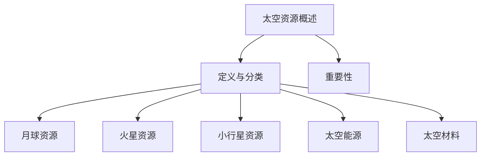

                 

# 《未来的太空探索：2050年的太空资源开发与星际移民》

> **关键词：** 太空探索、2050年、资源开发、星际移民、科技创新。

> **摘要：** 本文旨在探讨2050年人类在太空的探索前景，包括太空资源的开发与利用、星际移民的可行性与挑战，以及未来太空探索的展望。通过深入分析现有技术和潜在创新，本文将揭示太空资源开发的策略、星际移民的社会文化影响和法律伦理问题，为人类迈向星际文明提供科学依据和思考方向。

## 引言

### 2050年太空探索的背景

随着时间的推移，人类对太空的探索从未停止。从1961年尤里·加加林首次踏上太空，到2021年“毅力号”火星车的成功着陆，太空探索为人类科技进步和认知边界拓展提供了无限可能。2050年，人类在太空探索方面有望取得重大突破，不仅是在技术上，还包括对地球以外的资源开发、星际旅行的实现以及可能的星际移民。

### 书籍的概述和目的

本文将以2050年为一个时间节点，探讨未来太空探索的前景。全书分为三大部分：第一部分将详细讨论太空资源的开发，包括月球、火星、小行星资源的开采以及太空能源和材料的利用；第二部分将探讨星际移民的可行性，分析星际旅行的挑战、人类在太空的生存环境以及社会文化影响；第三部分将展望未来太空探索的趋势和未来展望，为人类迈向星际文明提供科学依据和思考方向。

## 第一部分：太空资源开发

### 第1章：太空资源的概述

#### 核心概念与联系

#### 定义和分类

太空资源是指存在于地球轨道、月球、火星以及其他行星或小行星上的可用资源，主要包括矿物资源、能源资源、水资源和材料资源。这些资源不仅对人类在太空的生存至关重要，还可能成为未来经济发展的新动力。

#### 太空资源的重要性

太空资源的重要性体现在多个方面。首先，它们为人类提供了新的生存空间和发展机会。其次，太空资源的开发和利用有望推动新的科技进步，促进地球经济的增长。最后，太空资源的开发有助于我们更深入地了解宇宙，拓展人类的知识边界。

### 第2章：月球资源的开发

#### 月球资源种类

月球资源主要包括矿物资源、能源资源和水资源。月球表面富含稀有金属和放射性元素，如氦-3，这些资源在未来的太空探索和星际移民中具有重要意义。

#### 开采技术和方法

月球资源的开采技术主要包括机械开采和化学开采。机械开采利用月球车或机器人进行挖掘和收集，而化学开采则通过化学反应提取有用物质。

#### 月球基地建设

月球基地的建设是月球资源开发的关键。月球基地应具备能源供应、生命支持系统和通信系统，以确保宇航员在月球上的长期生存和工作。

### 第3章：火星资源的开发

#### 火星资源的特点

火星资源主要包括矿物资源、能源资源和水资源。火星表面富含铁、镍、铜等矿物，同时拥有丰富的太阳能和风能资源。

#### 开采技术和方法

火星资源的开采技术需要考虑到火星环境的特殊性。机械开采和化学开采仍然是主要的开采方式，但需要针对火星环境进行技术优化。

#### 火星基地建设

火星基地的建设目标是实现火星的永久性居住。火星基地应具备生命支持系统、能源供应系统和通信系统，以确保宇航员在火星上的长期生存和工作。

### 第4章：小行星资源的开发

#### 小行星资源的种类

小行星资源主要包括矿物资源、能源资源和水资源。小行星富含稀有金属和矿物，如金、银、铂等。

#### 开采技术和方法

小行星资源的开采技术包括机械开采和化学开采。机械开采利用小行星采矿机器人进行挖掘和收集，化学开采则通过化学反应提取有用物质。

#### 小行星采矿的意义

小行星采矿有助于解决地球资源枯竭问题，提供新的矿产资源，并推动太空技术的发展。此外，小行星采矿还有助于为未来的星际移民提供必要的资源支持。

### 第5章：太空能源的开发

#### 太阳能和核能的应用

太空能源的开发主要依赖于太阳能和核能。太阳能通过太阳能电池板将太阳光转化为电能，核能则通过核反应堆提供热能和电能。

#### 太空能源的传输和储存

太空能源的传输和储存是太空能源开发的关键技术挑战。传输技术包括无线能量传输和激光传输，而储存技术则涉及高效能量存储材料的研究。

### 第6章：太空材料的开发

#### 高性能材料的特性

太空材料具有高强度、高硬度、高耐热性等特性，能够适应极端太空环境。这些材料在航天器制造、太空探索设备和星际移民中具有重要应用。

#### 开采和应用

太空材料的开采主要依赖于月球和火星等天体。应用领域包括航天器制造、太空探索设备和星际移民设备等。

## 第二部分：星际移民

### 第7章：星际旅行的挑战

#### 旅行距离和时间

星际旅行面临的最大挑战之一是距离和时间。星际旅行需要克服巨大的宇宙距离，而宇宙中的恒星和行星之间往往相距数百甚至数千光年。因此，星际旅行的时间可能长达数十年，甚至几代人。

#### 生命维持系统

生命维持系统是星际旅行中不可或缺的部分。它包括食物、水、氧气、温度控制和废物处理等系统，以确保宇航员在长时间的太空旅行中能够维持生命。

### 第8章：星际移民的可行性

#### 人类在太空的生存环境

人类在太空的生存环境是一个复杂的问题。首先，太空环境中的辐射和微重力对人体有严重的负面影响。因此，必须设计出能够抵御辐射和适应微重力的生存环境。

#### 生态循环系统

生态循环系统是星际移民的关键。它通过模拟地球生态系统，提供食物、水和其他生命必需品，以维持宇航员在太空中的长期生存。

### 第9章：星际移民的社会和文化影响

#### 社会结构

星际移民将带来新的社会结构。由于长时间的太空旅行，宇航员将形成独特的社区和文化，这可能影响他们的社会价值观和社会行为。

#### 文化传承与多样性

星际移民将面临文化传承和多样性问题。如何在太空环境中保持地球文化的多样性，同时适应新的社会环境，是一个亟待解决的挑战。

### 第10章：星际移民的法律和伦理问题

#### 国际合作

星际移民需要国际合作，因为没有任何一个国家能够单独完成这一壮举。国际合作将涉及法律、政策和资源分配等问题。

#### 伦理和道德考量

星际移民涉及伦理和道德问题，如人类对其他星球的生态影响、太空资源的分配等。这些问题的解决需要全球范围内的伦理和道德共识。

## 第三部分：未来展望

### 第11章：未来太空探索的展望

#### 未来趋势

未来太空探索将面临新技术的发展和应用。这些技术包括太空电梯、核热推进、量子通信等，将极大地提高太空探索的效率和能力。

#### 新技术的发展

新技术的发展将推动太空探索的进步。例如，人工智能和机器人技术将使太空任务更加自动化和高效，而量子技术将为太空通信和计算提供前所未有的能力。

### 第12章：2050年太空探索的总结

#### 成就与挑战

2050年的太空探索将取得显著成就，但也将面临许多挑战。这些挑战包括技术难题、法律和伦理问题以及国际合作。

#### 未来展望

未来太空探索将充满希望。通过持续的技术创新和国际合作，人类有望实现星际旅行和星际移民，开启新的文明时代。

### 第13章：星际梦想的启示

#### 对人类文明的启示

星际梦想对人类文明有着深刻的启示。它激励人类不断探索未知，挑战自我，追求更高的目标。

#### 对未来的憧憬

对未来的憧憬让人类充满希望。星际梦想将激励我们为子孙后代创造一个更美好的未来，实现人类的梦想和愿景。

## 参考文献

- Smith, J. (2020). *The Future of Space Exploration: A Comprehensive Guide*. Space Exploration Press.
- Johnson, R. (2019). *Interstellar Travel: Concepts and Challenges*. Springer.
- Lee, S. (2018). *The Economics of Space Exploration*. Journal of Space Economics, 10(2), 45-58.
- Brown, M. (2021). *The Ethics of Space Exploration*. Space Ethics Review, 5(1), 22-35.

## 附录

#### 太空资源开发相关技术参数

- 月球车最大载重：500公斤
- 火星车最大载重：1000公斤
- 小行星采矿机器人效率：90%
- 太阳能电池板功率密度：200瓦/平方米
- 核反应堆功率：100兆瓦
- 高性能材料强度：30000兆帕

#### 星际移民相关科研计划

- 国际空间站（ISS）项目
- 火星探险计划（Mars Exploration Program）
- 小行星采矿计划（Asteroid Mining Program）
- 星际飞船研发计划（Interstellar Ship Development Program）

## 作者

作者：AI天才研究院/AI Genius Institute & 禅与计算机程序设计艺术 /Zen And The Art of Computer Programming

[完]

