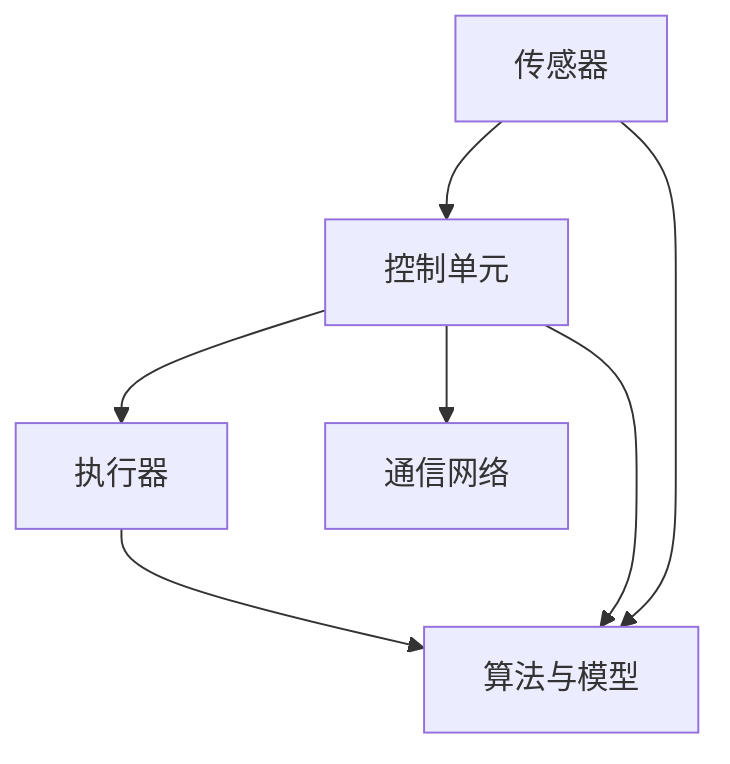

                 

### 《机器人技术集成：LLM 打造智能自动化系统》

关键词：机器人技术、智能自动化系统、LLM、机器学习、深度学习、人工智能

摘要：随着人工智能技术的快速发展，机器人技术正逐渐从工业领域向更多领域扩展。本文将探讨如何利用大型语言模型（LLM）集成机器人技术，打造智能自动化系统。通过详细分析智能自动化系统的基础架构、机器人技术与机器学习算法的结合、具体应用案例以及未来发展趋势，本文旨在为读者提供一幅全面的机器人技术与智能自动化系统的全景图。

### 第一部分：引言与概述

#### 第1章：机器人技术概述

**1.1 机器人的定义与发展历史**

机器人（Robot）是一种能够执行复杂任务的自动化设备，通常由计算机程序控制。机器人的历史可以追溯到20世纪中期，最早由美国发明家乔治·德沃尔（George Devol）和约瑟夫·恩格尔伯格（Joseph Engelberger）合作创建。1961年，他们成立了Unimation公司，这是世界上第一家工业机器人公司。工业机器人主要用于汽车制造业，例如焊接、喷涂和装配等工作。

随着时间的推移，机器人技术不断发展，应用领域也不断扩大。现在，机器人技术已经广泛应用于工业、医疗、农业、服务业等多个领域。例如，在医疗领域，机器人被用于手术辅助、康复训练和诊断；在农业领域，机器人被用于采摘、施肥和病虫害防治；在服务业，机器人被用于送餐、清洁和安保等工作。

**1.2 机器人技术在现代工业中的应用**

在现代工业中，机器人技术已经成为提高生产效率、降低成本和提升产品质量的重要手段。以下是一些机器人技术在现代工业中的应用实例：

1. **焊接机器人**：焊接机器人广泛应用于汽车制造、船舶制造和钢结构制造等行业。它们可以在高温和有害环境下工作，大大提高了焊接质量和生产效率。

2. **喷涂机器人**：喷涂机器人用于汽车制造、家电制造等行业，可以自动完成喷涂作业，保证喷涂质量均匀，减少环境污染。

3. **装配机器人**：装配机器人用于电子制造、汽车制造等行业，可以自动完成零部件的装配和调试，提高装配精度和效率。

4. **搬运机器人**：搬运机器人用于物流和仓储等行业，可以自动完成货物的搬运和分类，提高物流效率。

**1.3 智能自动化系统的发展趋势**

随着人工智能技术的快速发展，智能自动化系统已经成为现代工业和各行各业的热门话题。智能自动化系统是指通过计算机技术、网络技术、传感器技术和控制技术等，实现生产过程和业务流程的自动化和智能化。

智能自动化系统的发展趋势包括：

1. **自主化**：机器人将具备更高的自主决策能力，能够根据环境变化和任务要求自主调整行动策略。

2. **协同化**：机器人与人类将实现更紧密的协同工作，提高工作效率和安全性。

3. **智能化**：机器人将具备更高的智能水平，能够理解人类语言、感知环境变化、自主学习和优化行为。

4. **个性化**：机器人将能够根据用户需求提供个性化的服务，提升用户体验。

**1.4 本书的目标与结构**

本书旨在探讨如何利用大型语言模型（LLM）集成机器人技术，打造智能自动化系统。具体内容包括：

- 第一部分：引言与概述，介绍机器人技术的发展历史和应用现状。
- 第二部分：核心概念与原理，分析智能自动化系统的基础架构、机器人技术与机器学习算法的结合。
- 第三部分：具体应用案例，介绍工业自动化中的机器人集成、服务机器人技术、智能家居机器人。
- 第四部分：实战与展望，探讨机器人技术的未来发展趋势和实际应用。

通过本书的阅读，读者可以全面了解机器人技术和智能自动化系统的原理、技术和应用，为未来的研究和实践打下坚实基础。

#### 第2章：智能自动化系统的基础架构

**2.1 智能自动化系统的基本构成**

智能自动化系统是一个复杂的系统，由多个子系统和组件构成。以下是智能自动化系统的基本构成：

1. **传感器**：传感器用于感知外部环境信息，如视觉、听觉、触觉、温度、湿度等。传感器收集到的数据将被用于决策和控制。

2. **执行器**：执行器是机器人执行任务的物理设备，如电机、气缸、伺服驱动器等。执行器根据控制系统的指令执行相应的动作。

3. **控制单元**：控制单元是智能自动化系统的核心，负责接收传感器数据，处理和分析数据，生成控制指令，发送给执行器。控制单元通常采用计算机或嵌入式系统来实现。

4. **通信网络**：通信网络是连接各个组件的桥梁，用于数据传输和指令传递。常用的通信网络包括无线网络、有线网络和传感器网络。

5. **算法与模型**：算法与模型用于实现智能自动化系统的决策和控制。常见的算法包括机器学习算法、深度学习算法、模糊逻辑算法等。模型则用于描述系统的状态、行为和决策过程。

**2.1.1 Mermaid流程图：智能自动化系统的整体架构**

下面是一个简化的Mermaid流程图，用于描述智能自动化系统的整体架构：



**2.2 机器学习与人工智能在自动化系统中的应用**

机器学习和人工智能（AI）技术为智能自动化系统带来了巨大的变革。通过机器学习和人工智能技术，自动化系统可以实现以下功能：

1. **数据驱动决策**：机器学习算法可以从大量历史数据中学习，提取出有用的信息和规律，从而实现数据驱动的决策。

2. **自适应能力**：机器学习算法可以根据环境变化和任务需求，自适应地调整控制策略和行为模式。

3. **预测能力**：机器学习算法可以预测系统的未来状态和行为，从而实现预防性维护和故障预测。

4. **智能交互**：机器学习算法可以理解和处理自然语言，实现人与机器的智能交互。

在自动化系统中，机器学习和人工智能技术的主要应用包括：

1. **感知与识别**：利用计算机视觉、语音识别等技术，实现物体的识别、分类和跟踪。

2. **路径规划**：利用强化学习、深度强化学习等技术，实现机器人的自主路径规划。

3. **决策与控制**：利用模糊逻辑、深度学习等技术，实现复杂系统的决策和控制。

**2.3 机器学习算法原理概述**

机器学习是一种通过从数据中学习规律，从而实现自动识别模式、预测和决策的技术。机器学习算法可以分为以下几类：

1. **监督学习**：监督学习是一种有标注数据的机器学习方法。通过训练样本的学习，模型可以学习到输入和输出之间的映射关系，从而对新的输入进行预测。常见的监督学习算法包括线性回归、逻辑回归、支持向量机（SVM）等。

2. **无监督学习**：无监督学习是一种没有标注数据的机器学习方法。通过发现数据中的结构和规律，模型可以学习到数据中的隐含特征。常见的无监督学习算法包括聚类、降维、主成分分析（PCA）等。

3. **半监督学习**：半监督学习是一种介于监督学习和无监督学习之间的方法。它利用一部分标注数据和大量无标注数据，通过结合标注数据和未标注数据的特性，学习到更好的模型。

4. **强化学习**：强化学习是一种通过奖励和惩罚机制来学习决策策略的机器学习方法。在强化学习中，模型通过不断尝试和探索环境，学习到最优的策略，以实现目标最大化。

**2.4 深度学习算法原理概述**

深度学习是一种基于多层神经网络的学习方法，通过多层非线性变换，从数据中学习到复杂的特征表示。深度学习算法在图像识别、自然语言处理、语音识别等领域取得了显著的成果。以下是几种常见的深度学习算法：

1. **卷积神经网络（CNN）**：卷积神经网络是一种主要用于图像识别和处理的深度学习算法。通过卷积层、池化层和全连接层等结构，CNN可以提取图像的局部特征和全局特征，从而实现图像分类和识别。

2. **循环神经网络（RNN）**：循环神经网络是一种主要用于序列数据处理的深度学习算法。通过循环结构，RNN可以捕捉序列数据中的时间依赖关系，从而实现语言模型、机器翻译、语音识别等任务。

3. **生成对抗网络（GAN）**：生成对抗网络是一种通过对抗训练来生成数据的深度学习算法。通过生成器和判别器的对抗训练，GAN可以生成逼真的图像、音频和文本数据。

通过以上分析，我们可以看到机器学习和人工智能技术为智能自动化系统带来了巨大的变革。在接下来的章节中，我们将进一步探讨机器人技术与机器学习算法的结合，以及在实际应用中的具体实现。

#### 第3章：机器人技术与机器学习算法的结合

**3.1 机器人控制算法**

机器人控制算法是机器人技术的重要组成部分，它决定了机器人如何响应外部环境，如何执行预定的任务。在机器人控制中，常见的算法包括基于规则的算法、模糊控制算法和基于机器学习算法的控制方法。

**3.1.1 伪代码：机器人控制算法的实现**

以下是一个简化的伪代码，用于描述机器人控制算法的基本实现流程：

```python
# 机器人控制算法伪代码
function robot_control(sensors_data, target_action):
    # 数据预处理
    preprocessed_data = preprocess_data(sensors_data)
    
    # 决策模块
    action = decision_module(preprocessed_data)
    
    # 执行器控制
    execute_action(action)
    
    # 返回执行结果
    return execute_result
```

其中，`sensors_data` 表示传感器收集到的环境数据，`target_action` 表示机器人需要执行的预定动作。`preprocess_data` 函数用于对传感器数据进行预处理，`decision_module` 函数用于根据预处理后的数据生成控制决策，`execute_action` 函数用于执行相应的动作，`execute_result` 表示执行结果。

**3.2 强化学习在机器人控制中的应用**

强化学习（Reinforcement Learning，RL）是一种通过试错和奖励机制来学习决策策略的机器学习方法。在机器人控制中，强化学习可以通过与环境互动，不断调整控制策略，以实现最优的控制效果。

**3.2.1 数学模型：强化学习的基本模型**

强化学习的基本模型包括四个要素：状态（State）、动作（Action）、奖励（Reward）和策略（Policy）。以下是强化学习的基本数学模型：

```latex
\begin{align*}
    S_t & \sim P(S_t | S_{t-1}, A_{t-1}) \\
    A_t & \sim \pi(A_t | S_t) \\
    R_t & = R(S_t, A_t) \\
    S_{t+1} & \sim P(S_{t+1} | S_t, A_t)
\end{align*}
```

其中，$S_t$ 表示第 $t$ 个状态，$A_t$ 表示第 $t$ 个动作，$R_t$ 表示第 $t$ 个奖励，$S_{t+1}$ 表示第 $t+1$ 个状态。$P(S_t | S_{t-1}, A_{t-1})$ 表示状态转移概率，$\pi(A_t | S_t)$ 表示动作概率分布，$R(S_t, A_t)$ 表示奖励函数。

**3.2.2 举例说明：强化学习在机器人路径规划中的应用**

以下是一个简化的例子，用于说明强化学习在机器人路径规划中的应用。假设机器人需要在复杂的迷宫中找到从起点到终点的最优路径。

1. **状态表示**：状态可以表示为机器人在迷宫中的位置，包括行和列的位置。

2. **动作表示**：动作可以表示为机器人可以执行的方向，如上、下、左、右。

3. **奖励函数**：奖励函数可以设置为机器人每移动一步获得一个负奖励，当机器人到达终点时获得一个正奖励。

4. **策略学习**：通过强化学习算法，机器人可以学习到在给定状态下选择最优动作的策略。

具体的实现过程如下：

1. 初始化状态 $S_0$ 和策略 $\pi$。

2. 在当前状态下执行动作 $A_t$，并观察状态转移 $S_{t+1}$ 和奖励 $R_t$。

3. 根据奖励更新策略 $\pi$，选择使奖励最大化的动作。

4. 重复步骤 2 和 3，直到找到从起点到终点的最优路径。

通过这个例子，我们可以看到强化学习在机器人路径规划中的潜力。在实际应用中，机器人路径规划可能涉及到更复杂的场景和更复杂的奖励函数，但基本原理是类似的。

**3.3 监督学习在机器人感知中的应用**

监督学习（Supervised Learning）是一种有标注数据的机器学习方法。在机器人感知中，监督学习可以用于对象识别、场景理解、手势识别等任务。

**3.3.1 数学模型：监督学习的基本模型**

监督学习的数学模型可以表示为：

```latex
\begin{align*}
    y &= f(W \cdot x + b) \\
    \text{其中，} y &= \text{实际输出} \\
    x &= \text{输入特征} \\
    W &= \text{权重矩阵} \\
    b &= \text{偏置项} \\
    f &= \text{激活函数}
\end{align*}
```

通过训练，模型可以学习到输入特征和输出标签之间的关系，从而实现对新输入数据的分类或回归。

**3.3.2 举例说明：监督学习在机器人视觉中的应用**

以下是一个简化的例子，用于说明监督学习在机器人视觉中的应用。假设机器人需要识别和分类不同类型的物体。

1. **输入特征**：输入特征可以表示为物体的图像。

2. **输出标签**：输出标签可以表示为物体的类别，如水果、动物等。

3. **训练数据集**：训练数据集包含多个图像及其对应的标签。

4. **模型训练**：通过监督学习算法，模型可以从训练数据集中学习到物体图像和类别之间的关系。

具体的实现过程如下：

1. 初始化模型参数 $W$ 和 $b$。

2. 对于每个训练样本 $(x_i, y_i)$，计算输出 $y_i = f(W \cdot x_i + b)$。

3. 计算损失函数 $L(y_i, \hat{y_i})$，其中 $\hat{y_i}$ 是模型预测的标签。

4. 通过梯度下降或其他优化算法，更新模型参数 $W$ 和 $b$。

5. 重复步骤 2 到 4，直到模型收敛。

通过这个例子，我们可以看到监督学习在机器人视觉中的应用。在实际应用中，机器人视觉可能涉及到更复杂的特征提取和分类任务，但基本原理是类似的。

通过以上分析，我们可以看到机器人技术与机器学习算法的紧密联系。在接下来的章节中，我们将进一步探讨机器人技术的具体应用案例，展示如何利用机器人技术实现智能自动化系统。

#### 第4章：工业自动化中的机器人集成

**4.1 工业机器人的分类与特点**

工业机器人根据其用途、结构和工作方式可以分为多种类型。以下是几种常见的工业机器人分类及其特点：

1. **焊接机器人**：焊接机器人主要用于焊接作业，如汽车制造业、船舶制造业等。它们具有高速、高精度和高效率的特点，能够在有害环境下长时间工作，提高了焊接质量和生产效率。

2. **喷涂机器人**：喷涂机器人用于喷涂作业，如汽车喷漆、家电涂装等。它们具有均匀喷涂、减少喷涂材料浪费和降低环境污染的特点，广泛应用于各个领域。

3. **搬运机器人**：搬运机器人用于搬运和运输工件，如物流行业、仓储行业等。它们具有自动化、高效率和灵活性的特点，能够减轻人力劳动负担，提高物流效率。

4. **装配机器人**：装配机器人用于装配作业，如电子制造、汽车制造等。它们具有高精度、高效率和自动化程度高的特点，能够在复杂环境下完成装配任务。

5. **检验机器人**：检验机器人用于检测和检验工件，如质量检测、尺寸测量等。它们具有高精度、高效率和自动化程度高的特点，能够提高产品质量和生产效率。

**4.2 工业自动化生产线的设计与实现**

工业自动化生产线的设计与实现是一个复杂的过程，需要综合考虑机器人的选型、工作流程、控制策略和系统集成等因素。以下是工业自动化生产线设计与实现的基本步骤：

1. **需求分析**：首先，需要对生产任务进行需求分析，明确生产线的目标和功能。包括生产流程、工件规格、生产速度、生产节拍等。

2. **机器人选型**：根据需求分析的结果，选择合适的工业机器人。需要考虑机器人的工作范围、负载能力、精度、稳定性等因素。

3. **工艺设计**：根据生产任务和机器人选型，设计工件的加工工艺和路径。包括工件的装夹方式、加工顺序、加工参数等。

4. **工作站设计**：根据工艺设计，设计工作站的结构和布局。包括机器人的放置位置、传感器和执行器的布局、工件传输路径等。

5. **控制策略设计**：根据工作站设计，设计控制策略。包括机器人的运动规划、传感器数据采集与处理、执行器控制等。

6. **系统集成**：将各个工作站集成到整个生产线上，进行系统的调试和优化。包括机器人的调试、传感器的校准、执行器的调试等。

**4.3 机器人自动化产线的优化与效率提升**

机器人自动化生产线的设计与实现完成后，还需要对生产线进行优化和效率提升。以下是几种常见的优化方法：

1. **生产节拍优化**：通过调整机器人的运动速度、加工参数等，缩短生产节拍，提高生产效率。

2. **工作站布局优化**：通过重新设计工作站的布局，减少工件在生产线上的移动距离，提高生产效率。

3. **控制策略优化**：通过优化控制策略，提高机器人的响应速度和精度，减少加工误差。

4. **系统集成优化**：通过优化系统集成，减少系统的故障率和停机时间，提高生产效率。

5. **自动化程度提升**：通过引入更多的自动化设备和系统，提高生产线的自动化程度，减少人力干预。

通过以上分析，我们可以看到工业自动化中的机器人集成对于提高生产效率、降低成本和提升产品质量具有重要意义。在接下来的章节中，我们将继续探讨服务机器人技术，展示如何利用人工智能技术提升服务机器人的性能和用户体验。

#### 第5章：服务机器人技术

**5.1 服务机器人的定义与应用领域**

服务机器人是一种专门为人类提供各种服务的机器人。与工业机器人不同，服务机器人通常具有更好的交互能力和灵活性，能够在复杂、多变的环境中执行各种任务。服务机器人可以应用于多个领域，包括医疗、教育、家庭、餐饮、酒店、安保等。

**5.1.1 服务机器人的应用领域**

1. **医疗领域**：服务机器人可以应用于医院、诊所和康复中心，帮助医护人员进行医疗护理、药物配送、患者监护等任务。

2. **教育领域**：服务机器人可以应用于学校和教育机构，帮助教师进行课堂教学、学生辅导、校园安保等任务。

3. **家庭领域**：服务机器人可以应用于家庭中，帮助家庭成员进行家务劳动、看护老人和孩子、娱乐等任务。

4. **餐饮领域**：服务机器人可以应用于餐厅、酒店等餐饮场所，帮助服务员进行点餐、送餐、清洁等任务。

5. **酒店领域**：服务机器人可以应用于酒店，帮助酒店工作人员进行客房服务、安保、游客引导等任务。

6. **安保领域**：服务机器人可以应用于安保公司、政府机构等，帮助安保人员进行巡逻、监控、报警等任务。

**5.2 服务机器人的人工智能技术**

服务机器人要实现高效、灵活的服务，需要依赖于人工智能技术。以下是一些关键的人工智能技术：

1. **计算机视觉**：计算机视觉技术用于服务机器人进行物体识别、场景理解、面部识别等任务。通过计算机视觉，服务机器人可以更好地理解和感知周围环境。

2. **自然语言处理**：自然语言处理技术用于服务机器人进行语言理解和生成。通过自然语言处理，服务机器人可以与人类进行自然对话，提供更好的用户体验。

3. **语音识别**：语音识别技术用于服务机器人接收和识别用户的语音指令。通过语音识别，服务机器人可以更方便地与用户进行交互。

4. **机器学习**：机器学习技术用于服务机器人进行自我学习和优化。通过机器学习，服务机器人可以不断改进服务质量和性能。

**5.3 服务机器人的交互设计与用户体验**

服务机器人的交互设计与用户体验对于其成功应用至关重要。以下是一些关键的交互设计原则：

1. **易用性**：服务机器人应具有简单易用的交互界面，用户可以通过简单的操作完成所需任务。

2. **人性关怀**：服务机器人应具备人性化的设计，如友好的外观、自然的声音、礼貌的对话等，以提升用户的情感体验。

3. **灵活性**：服务机器人应具有灵活的交互能力，能够适应不同的用户需求和场景。

4. **安全性**：服务机器人在与用户互动时，应确保用户的安全。例如，在家庭应用场景中，服务机器人应避免碰撞和跌倒。

5. **智能性**：服务机器人应具备智能化的服务能力，能够主动发现用户需求，提供个性化的服务。

通过以上分析，我们可以看到服务机器人技术在各个领域的广泛应用及其对提升服务质量和用户体验的重要性。在接下来的章节中，我们将探讨智能家居机器人技术，展示如何利用人工智能技术为家庭生活带来更多便利和智能。

#### 第6章：智能家居机器人

**6.1 智能家居机器人的基本功能与需求**

智能家居机器人是一种专门为家庭环境设计的人工智能机器人，旨在通过自动化和智能化技术提升家庭生活的舒适度、便利性和安全性。以下是一些智能家居机器人应具备的基本功能与需求：

**6.1.1 基本功能**

1. **语音交互**：通过语音识别和自然语言处理技术，智能家居机器人应能够理解用户的语音指令，进行对话和回答问题。

2. **家电控制**：智能家居机器人应能够控制家中的各种家电设备，如空调、照明、电视、热水器等，实现远程控制和自动化操作。

3. **安防监控**：智能家居机器人应具备安防监控功能，如监控家庭环境、识别异常行为、报警等。

4. **清洁与维护**：智能家居机器人应能够进行家庭清洁和日常维护工作，如扫地、擦窗、吸尘等。

5. **健康管理**：智能家居机器人应能够监测家庭成员的健康状况，提供健康建议和指导。

**6.1.2 需求分析**

1. **便捷性**：智能家居机器人应具备方便、快捷的操作方式，使用户能够轻松控制家中的各种设备。

2. **智能性**：智能家居机器人应具备智能学习和适应能力，能够根据用户的行为习惯和需求自动调整操作。

3. **安全性**：智能家居机器人应确保用户数据的安全，防止隐私泄露和未授权访问。

4. **稳定性**：智能家居机器人应具备稳定的运行性能，能够在不同环境和条件下正常工作。

5. **扩展性**：智能家居机器人应具备良好的扩展性，能够随着技术的发展和应用需求的增加进行功能升级。

**6.2 智能家居机器人的人工智能技术**

智能家居机器人的功能实现依赖于人工智能技术的支持。以下是一些关键的人工智能技术：

1. **语音识别与合成**：通过语音识别技术，智能家居机器人能够理解用户的语音指令；通过语音合成技术，智能家居机器人能够以自然流畅的语言与用户进行对话。

2. **自然语言处理**：自然语言处理技术用于处理和理解用户输入的自然语言文本，使智能家居机器人能够理解用户的需求和意图。

3. **机器学习**：机器学习技术用于智能家居机器人的智能学习和自我优化，使其能够根据用户的行为数据不断改进服务质量。

4. **计算机视觉**：计算机视觉技术用于智能家居机器人进行图像识别、场景理解、物体追踪等任务，提升其环境感知能力。

5. **物联网技术**：物联网技术使智能家居机器人能够与家庭中的各种智能设备互联互通，实现统一的智能家居系统。

**6.3 智能家居机器人的开发与测试**

智能家居机器人的开发与测试是一个复杂的过程，需要综合考虑硬件、软件、算法和用户体验等多个方面。以下是智能家居机器人开发与测试的基本步骤：

**6.3.1 硬件开发**

1. **硬件选型**：根据功能需求，选择适合的硬件平台，如处理器、传感器、执行器等。

2. **电路设计**：设计智能家居机器人的电路系统，包括电源管理、信号处理、通信接口等。

3. **机械设计**：设计智能家居机器人的机械结构，包括外观设计、尺寸、重量等。

4. **硬件调试**：对硬件进行调试和测试，确保其稳定性和可靠性。

**6.3.2 软件开发**

1. **操作系统**：选择适合的操作系统，如Linux、Android等，为智能家居机器人提供运行环境。

2. **语音识别与合成**：集成语音识别和语音合成模块，实现语音交互功能。

3. **自然语言处理**：开发自然语言处理模块，实现自然语言理解和生成。

4. **机器学习与计算机视觉**：集成机器学习和计算机视觉算法，实现智能感知和决策功能。

5. **接口与通信**：开发与各种智能设备的通信接口，实现智能家居系统的互联互通。

**6.3.3 测试与优化**

1. **功能测试**：对智能家居机器人的各项功能进行测试，确保其正常运行。

2. **性能优化**：通过性能优化，提高智能家居机器人的响应速度和处理能力。

3. **用户体验测试**：通过用户体验测试，收集用户反馈，改进智能家居机器人的交互设计和用户体验。

4. **安全性测试**：对智能家居机器人进行安全性测试，确保其数据安全和系统安全。

通过以上步骤，可以开发出一款功能完善、性能优异、用户体验良好的智能家居机器人。智能家居机器人技术的不断发展将为家庭生活带来更多便利和智能，提高人们的生活质量。

#### 第7章：机器人技术的未来发展趋势

**7.1 机器人技术的未来发展方向**

随着人工智能技术的不断进步，机器人技术正朝着更智能、更自主、更协同的方向发展。以下是机器人技术的未来发展方向：

1. **智能自主化**：未来的机器人将具备更高的智能水平，能够自主学习和决策，适应复杂多变的环境。

2. **多模态感知**：未来的机器人将具备更强大的感知能力，通过多模态感知技术，实现对环境、物体和人的全面感知和理解。

3. **人机协同**：未来的机器人将更加注重与人类的协同工作，通过人机交互技术，实现高效、安全、和谐的协作。

4. **个性化服务**：未来的机器人将根据用户的需求和习惯，提供个性化的服务和解决方案，提升用户体验。

5. **智能化集成**：未来的机器人将与其他智能系统深度融合，实现智能化集成和互联互通，打造智能化的生产、生活和公共服务体系。

**7.2 人工智能在机器人技术中的潜力**

人工智能技术在机器人技术中的应用具有巨大的潜力，可以推动机器人实现更高水平的智能。以下是人工智能在机器人技术中的几个关键应用：

1. **自主决策**：通过人工智能技术，机器人可以自主地分析环境信息，制定合理的行动策略，实现自主决策。

2. **智能感知**：通过计算机视觉、语音识别、自然语言处理等技术，机器人可以实现对周围环境的智能感知，提高任务执行的效果。

3. **智能控制**：通过深度学习、强化学习等技术，机器人可以实现对复杂任务的智能控制，提高机器人的执行效率和稳定性。

4. **自主维护**：通过人工智能技术，机器人可以自主地诊断和修复故障，实现自我维护和长期运行。

5. **智能交互**：通过人工智能技术，机器人可以与人类进行自然、流畅的交互，提供个性化的服务和支持。

**7.3 机器人技术的发展对社会的潜在影响**

机器人技术的发展将对社会产生深远的影响，包括以下几个方面：

1. **经济影响**：机器人技术的广泛应用将提高生产效率，降低生产成本，促进经济增长。同时，机器人也将带来新的就业机会和职业挑战。

2. **社会影响**：机器人技术的普及将改变人们的生活方式，提高生活质量。然而，机器人也将带来一些社会问题，如隐私保护、伦理道德、就业替代等。

3. **环境影响**：机器人技术的发展将有助于环境保护和资源节约。例如，通过智能自动化技术，可以降低能源消耗和污染排放。

4. **教育影响**：机器人技术的发展将推动教育变革，培养更多具备人工智能和机器人技术能力的专业人才。

总之，机器人技术的未来发展趋势和人工智能的应用潜力为机器人技术的发展带来了无限可能。机器人技术的发展将对社会产生深远的影响，为人类创造更加智能、高效、和谐的未来。

#### 第8章：机器人技术的开发与实际应用

**8.1 机器人开发环境的搭建**

搭建一个完整的机器人开发环境是进行机器人研究和开发的第一步。以下是一些常见的开发环境和工具：

1. **ROS（Robot Operating System）**：ROS 是一个用于机器人开发的跨平台、模块化的软件框架。它提供了丰富的库和工具，用于机器人感知、规划和控制。要搭建 ROS 环境，可以按照以下步骤进行：

   - 安装 ROS：在官方网站下载 ROS 源代码，并按照文档安装。
   - 配置环境：设置环境变量，确保 ROS 工具和库能够正常使用。
   - 安装依赖库：安装 ROS 的依赖库，如导航、感知和控制等模块。

2. **TensorFlow for Robotics**：TensorFlow for Robotics 是基于 TensorFlow 的机器人开发框架，用于在机器人上部署深度学习算法。要使用 TensorFlow for Robotics，可以按照以下步骤进行：

   - 安装 TensorFlow：在官方网站下载 TensorFlow，并按照文档安装。
   - 安装机器人依赖库：安装 TensorFlow for Robotics 的依赖库，如机器人仿真环境、传感器模拟器等。

3. **OpenAI Gym**：OpenAI Gym 是一个开源的机器人仿真环境，用于训练和测试机器人算法。要使用 OpenAI Gym，可以按照以下步骤进行：

   - 安装 Python：确保 Python 环境已经安装。
   - 安装 OpenAI Gym：使用 pip 安装 OpenAI Gym。

**8.2 机器人技术的实际应用案例**

以下是一些机器人技术的实际应用案例，展示如何将机器人技术与实际问题结合：

1. **工业自动化生产线**：在汽车制造、电子制造等行业，机器人被用于自动化生产，如焊接、装配、搬运等。通过集成视觉识别、路径规划和控制算法，机器人能够高效、准确地完成任务。

2. **医疗辅助机器人**：在医疗领域，机器人被用于手术辅助、康复训练和诊断。例如，达芬奇手术机器人通过精细的操作和实时监控，帮助医生进行复杂手术。

3. **服务机器人**：在家庭、酒店、商场等场所，服务机器人被用于清洁、安保、导览等任务。例如，吸尘机器人可以通过自主导航和障碍物识别，清洁家庭地面。

4. **无人驾驶汽车**：在交通领域，无人驾驶汽车通过集成感知、规划和控制算法，实现自主驾驶。通过使用深度学习和强化学习算法，无人驾驶汽车可以适应复杂交通环境和变化。

**8.3 机器人技术的未来发展方向**

随着人工智能技术的不断进步，机器人技术的未来发展方向包括：

1. **智能自主化**：通过深度学习和强化学习算法，机器人将具备更高的智能水平，实现自主决策和任务执行。

2. **多模态感知**：通过融合多种感知技术，如视觉、听觉、触觉等，机器人将具备更全面的环境感知能力。

3. **人机协同**：通过人机交互技术，机器人将能够更好地与人类协同工作，提高工作效率和安全性。

4. **个性化服务**：通过个性化算法和用户数据分析，机器人将能够提供更贴合用户需求的个性化服务。

5. **智能化集成**：通过物联网和大数据技术，机器人将与其他智能设备和服务系统集成，构建智能化的生产和生活方式。

总之，机器人技术的开发与实际应用正在不断推动人类社会的发展。通过不断探索和创新，机器人技术将带来更多便利和智能，为人类社会创造更加美好的未来。

#### 附录A：常用开发工具与资源

**A.1 常用机器人开发框架与工具**

在进行机器人技术开发时，选择合适的开发框架和工具是至关重要的。以下是一些常用的机器人开发框架和工具：

1. **ROS（Robot Operating System）**：ROS 是一个用于机器人开发的跨平台、模块化的软件框架。它提供了丰富的库和工具，用于机器人感知、规划和控制。ROS 的官方网站是 [http://www.ros.org](http://www.ros.org)。

2. **TensorFlow for Robotics**：TensorFlow for Robotics 是基于 TensorFlow 的机器人开发框架，用于在机器人上部署深度学习算法。它提供了机器人仿真环境、传感器模拟器和机器学习库。TensorFlow for Robotics 的官方网站是 [https://www.tensorflow.org/robotics](https://www.tensorflow.org/robotics)。

3. **OpenAI Gym**：OpenAI Gym 是一个开源的机器人仿真环境，用于训练和测试机器人算法。它提供了多种机器人仿真场景和任务，是进行机器人研究的重要工具。OpenAI Gym 的官方网站是 [https://gym.openai.com](https://gym.openai.com)。

**A.2 机器学习与深度学习资源**

机器学习和深度学习是机器人技术开发的核心，以下是一些有用的资源：

1. **机器学习课程**：斯坦福大学机器学习课程，由 Andrew Ng 教授主讲，是学习机器学习的基础课程。课程网址是 [https://www.coursera.org/learn/machine-learning](https://www.coursera.org/learn/machine-learning)。

2. **深度学习课程**：吴恩达的深度学习课程，涵盖了深度学习的理论、实践和应用。课程网址是 [https://www.coursera.org/learn/deep-learning](https://www.coursera.org/learn/deep-learning)。

3. **机器学习书籍**：《机器学习》（周志华 著），是一本深入浅出的机器学习入门书籍，适合初学者阅读。

4. **深度学习书籍**：《深度学习》（Ian Goodfellow、Yoshua Bengio、Aaron Courville 著），是深度学习领域的经典教材，适合有一定基础的读者。

5. **在线社区**：GitHub、Stack Overflow 和 Reddit 等，是机器学习和深度学习开发者交流和学习的重要平台。

通过以上资源和工具，开发者可以更好地掌握机器人技术的理论和实践，为未来的研究和开发奠定基础。

#### 附录B：机器人技术的伦理与安全

**B.1 机器人技术的伦理问题**

随着机器人技术的快速发展，伦理问题日益凸显。以下是一些机器人技术可能引发的伦理问题：

1. **隐私保护**：机器人可能会收集和存储大量个人数据，如何确保这些数据的安全和隐私是一个重要问题。

2. **就业替代**：机器人技术的发展可能导致某些职业的就业机会减少，如何保障劳动者的权益和利益是一个挑战。

3. **责任归属**：当机器人发生意外或造成损害时，如何确定责任归属，是一个法律和伦理问题。

4. **道德决策**：机器人是否能够做出符合道德规范的决策，特别是在人类生命安全受到威胁时，如何平衡不同利益，是一个伦理难题。

**B.2 机器人技术的安全措施**

为了确保机器人技术的安全，以下是一些常见的安全措施：

1. **数据安全**：确保机器人收集和存储的数据得到加密和严格保护，防止数据泄露和未授权访问。

2. **系统安全**：通过安全编程和测试，确保机器人系统的稳定性和可靠性，防止系统漏洞和恶意攻击。

3. **操作安全**：在机器人设计和操作过程中，充分考虑安全因素，确保机器人在各种情况下都能安全运行。

4. **监管机制**：建立完善的监管机制，确保机器人技术的研发和应用符合法律法规和伦理标准。

5. **培训与教育**：对开发者、操作者和用户进行相关培训和教育，提高他们的安全意识和操作技能。

通过以上伦理和安全措施，可以最大限度地降低机器人技术带来的风险和问题，确保其健康、可持续的发展。

### 作者信息

**作者：** AI天才研究院（AI Genius Institute）/禅与计算机程序设计艺术（Zen And The Art of Computer Programming）

