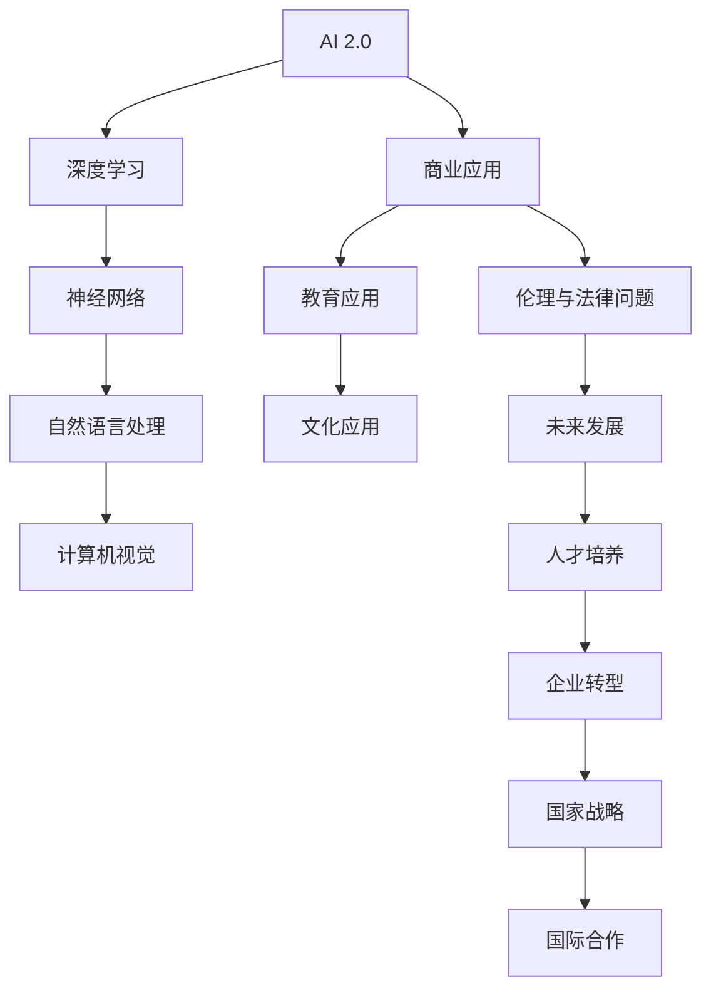

                 

# 李开复：AI 2.0 时代的应用

## 概述

> "人工智能正进入2.0时代，这一时代将带来前所未有的变革和机遇。李开复将带领我们深入探索AI 2.0的核心技术、应用实践及其未来趋势。"

关键词：AI 2.0，深度学习，自然语言处理，计算机视觉，商业应用，伦理与法律问题

摘要：本文将从李开复的研究和观点出发，系统性地探讨AI 2.0时代的核心技术、应用实践以及面临的伦理和法律问题，为读者提供一个全面、深入的AI 2.0时代的全景图。

## 目录大纲

### 第一部分：AI 2.0时代概述

- **第1章：AI 2.0时代的背景与展望**
  - **1.1 AI 2.0的定义与特点**
  - **1.2 AI 2.0与AI 1.0的区别**
  - **1.3 AI 2.0对社会的影响**
  - **1.4 AI 2.0时代的发展趋势**

### 第二部分：AI 2.0的核心技术

- **第2章：深度学习与神经网络基础**
  - **2.1 深度学习的基本概念**
  - **2.2 神经网络的结构与原理**
  - **2.3 常见深度学习架构与算法**
  - **2.4 神经网络的优化方法**

- **第3章：自然语言处理技术**
  - **3.1 自然语言处理的基本概念**
  - **3.2 词嵌入与序列模型**
  - **3.3 注意力机制与转换器架构**
  - **3.4 语言模型与文本生成**

- **第4章：计算机视觉基础**
  - **4.1 计算机视觉的基本概念**
  - **4.2 卷积神经网络与目标检测**
  - **4.3 生成对抗网络与图像生成**
  - **4.4 深度学习在图像处理中的应用**

### 第三部分：AI 2.0的应用实践

- **第5章：AI 2.0在商业领域的应用**
  - **5.1 AI 2.0在金融行业的应用**
  - **5.2 AI 2.0在医疗行业的应用**
  - **5.3 AI 2.0在零售行业的应用**
  - **5.4 AI 2.0在制造业的应用**

- **第6章：AI 2.0在教育和文化领域的应用**
  - **6.1 AI 2.0在教育行业的应用**
  - **6.2 AI 2.0在文化领域的应用**
  - **6.3 AI 2.0在艺术创作中的应用**
  - **6.4 AI 2.0对传统文化产业的影响**

- **第7章：AI 2.0时代的伦理与法律问题**
  - **7.1 AI 2.0伦理问题的探讨**
  - **7.2 AI 2.0法律框架的构建**
  - **7.3 AI 2.0对就业和社会结构的影响**
  - **7.4 AI 2.0时代的国际合作与治理**

### 第四部分：AI 2.0的未来展望

- **第8章：AI 2.0时代的未来趋势**
  - **8.1 AI 2.0技术与产业发展**
  - **8.2 AI 2.0与物联网的融合**
  - **8.3 AI 2.0与生物技术的结合**
  - **8.4 AI 2.0对全球科技格局的影响**

- **第9章：成为AI 2.0时代的领导者**
  - **9.1 培养AI 2.0时代的人才**
  - **9.2 企业在AI 2.0时代的转型策略**
  - **9.3 国家在AI 2.0时代的战略规划**
  - **9.4 AI 2.0时代的国际合作与共赢**

### 附录

- **附录A：AI 2.0开发工具与资源**
  - **A.1 常用深度学习框架介绍**
  - **A.2 AI 2.0开源项目与社区**
  - **A.3 AI 2.0研究文献与报告**
  - **A.4 AI 2.0教育与培训资源**

## 核心概念与联系流程图



## 核心算法原理讲解

### 深度学习算法原理讲解伪代码

```python
function NeuralNetwork(input_data):
    # 初始化权重和偏置
    weights, biases = initialize_weights()

    # 前向传播
    hidden_layer = sigmoid((weights * input_data) + biases)

    # 输出层预测
    output = sigmoid((weights * hidden_layer) + biases)

    return output

function initialize_weights():
    # 初始化权重和偏置
    weights = random_matrix(size)
    biases = random_vector(size)
    return weights, biases

function sigmoid(x):
    return 1 / (1 + exp(-x))
```

### 自然语言处理算法原理讲解伪代码

```python
function NLP(input_text):
    # 分词
    tokens = tokenize(input_text)

    # 词嵌入
    embeddings = word_embedding(tokens)

    # 序列编码
    sequence = encode_sequence(embeddings)

    # 前向传播
    hidden_layer = NeuralNetwork(sequence)

    # 输出预测
    output = softmax(hidden_layer)

    return output

function tokenize(input_text):
    # 对输入文本进行分词
    return list_of_tokens

function word_embedding(tokens):
    # 将词嵌入到向量空间
    return list_of_embeddings

function encode_sequence(embeddings):
    # 编码序列
    return encoded_sequence

function NeuralNetwork(sequence):
    # 使用神经网络对序列进行预测
    return hidden_layer

function softmax(x):
    # Softmax激活函数
    exps = exp(x)
    return exps / sum(exps)
```

### 数学模型和数学公式讲解

**神经网络优化中的梯度下降算法：**

$$
w_{new} = w_{current} - \alpha \cdot \nabla W
$$

其中，$w_{new}$ 是更新后的权重，$w_{current}$ 是当前权重，$\alpha$ 是学习率，$\nabla W$ 是权重矩阵的梯度。

**自然语言处理中的词嵌入：**

$$
\vec{w}_i = \sum_{j=1}^{V} c_j \cdot e_j
$$

其中，$\vec{w}_i$ 是词的向量表示，$c_j$ 是词频计数，$e_j$ 是词嵌入向量的第 $j$ 个元素。

**语言模型中的损失函数（交叉熵）：**

$$
L = -\sum_{i=1}^{N} y_i \cdot log(\hat{y}_i)
$$

其中，$y_i$ 是真实标签，$\hat{y}_i$ 是模型预测的概率分布。

## 项目实战：搭建一个简单的AI应用——文本分类器

### 开发环境搭建

1. 安装Python环境

   ```bash
   # 使用Python官方安装脚本安装Python
   curl -O https://www.python.org/ftp/python/3.8.5/Python-3.8.5.tgz
   tar xvf Python-3.8.5.tgz
   cd Python-3.8.5
   ./configure
   make
   sudo make altinstall
   ```

2. 安装TensorFlow库

   ```bash
   pip install tensorflow
   ```

### 数据准备

1. 准备一个包含标签和文本的数据集，例如使用IMDb电影评论数据集。

2. 对文本进行预处理，包括分词、去停用词、标记化等操作。

### 模型构建

1. 定义一个简单的神经网络模型，包括嵌入层、LSTM层和输出层。

2. 编写训练和评估代码。

### 模型训练

1. 使用训练数据训练模型。

2. 调整模型参数以达到较好的效果。

### 模型评估

1. 使用测试数据评估模型性能。

2. 计算准确率、召回率等指标。

### 代码解读与分析

1. 分析模型的性能和可能改进的方向。

2. 讨论如何将模型应用于实际问题。

```python
# 示例代码：搭建一个简单的文本分类器
import tensorflow as tf
from tensorflow.keras.preprocessing.sequence import pad_sequences
from tensorflow.keras.layers import Embedding, LSTM, Dense
from tensorflow.keras.models import Sequential
from tensorflow.keras.optimizers import Adam
from tensorflow.keras.utils import to_categorical

# 数据准备
# 假设text_data是一个包含文本的列表，labels是一个包含标签的列表
# 预处理文本数据
# ...

# 构建模型
model = Sequential()
model.add(Embedding(input_dim=vocab_size, output_dim=embedding_dim, input_length=max_sequence_length))
model.add(LSTM(units=128))
model.add(Dense(units=num_classes, activation='softmax'))

# 编译模型
model.compile(optimizer=Adam(learning_rate=0.001), loss='categorical_crossentropy', metrics=['accuracy'])

# 训练模型
model.fit(X_train, y_train, epochs=10, batch_size=32, validation_split=0.1)

# 评估模型
loss, accuracy = model.evaluate(X_test, y_test)
print(f"Test accuracy: {accuracy:.2f}")

# 分析模型性能和改进方向
# ...
```

### 作者

作者：AI天才研究院/AI Genius Institute & 禅与计算机程序设计艺术 /Zen And The Art of Computer Programming

## 第一部分：AI 2.0时代概述

### 第1章：AI 2.0时代的背景与展望

在过去的几十年中，人工智能（AI）经历了从理论研究到实际应用的飞速发展。然而，随着技术的不断进步，我们正逐步进入AI 2.0时代。这一时代不仅代表了技术层面的突破，更意味着人工智能将在各个领域带来前所未有的变革和机遇。

### 1.1 AI 2.0的定义与特点

AI 2.0是对AI 1.0的进一步升级。AI 1.0主要集中在规则驱动的专家系统，而AI 2.0则基于机器学习和深度学习技术，实现了更为智能和灵活的算法。AI 2.0的特点包括：

- **自主学习能力**：AI 2.0能够通过大量数据自主学习，实现自我优化和迭代。
- **泛化能力**：AI 2.0可以处理复杂和非结构化的数据，并从中提取有价值的信息。
- **实时响应**：AI 2.0可以实时处理海量数据，并快速做出决策。
- **跨领域应用**：AI 2.0不仅限于单一领域，而是可以在多个领域实现广泛的应用。

### 1.2 AI 2.0与AI 1.0的区别

AI 1.0主要依赖于专家系统和规则引擎，虽然在一定程度上实现了自动化，但受限于规则的数量和复杂性，其智能程度有限。而AI 2.0则基于机器学习和深度学习，通过大量数据训练模型，实现自主学习和智能决策。

- **数据依赖**：AI 1.0对数据依赖性较低，而AI 2.0对大量高质量数据进行依赖。
- **算法复杂度**：AI 1.0的算法相对简单，而AI 2.0的算法更为复杂和高级。
- **应用范围**：AI 1.0主要应用于特定领域，而AI 2.0可以跨领域应用。

### 1.3 AI 2.0对社会的影响

AI 2.0时代的到来将对社会产生深远的影响，主要体现在以下几个方面：

- **经济发展**：AI 2.0将推动新兴产业的崛起，促进传统产业的升级和转型。
- **就业结构**：AI 2.0将改变就业结构，对低技能岗位产生冲击，但也会创造新的就业机会。
- **生活质量**：AI 2.0将提高生产效率，降低生活成本，提升人们的幸福感。
- **社会治理**：AI 2.0将助力政府更高效地管理社会，提高公共服务的质量。

### 1.4 AI 2.0时代的发展趋势

随着技术的不断进步，AI 2.0时代的发展趋势主要包括以下几个方面：

- **技术融合**：AI 2.0将与物联网、大数据、区块链等技术进行融合，实现更广泛的应用。
- **多模态学习**：AI 2.0将实现图像、文本、语音等多种数据类型的融合学习。
- **强化学习**：AI 2.0将利用强化学习实现更为智能和自适应的决策。
- **量子计算**：AI 2.0将与量子计算相结合，实现更高效的计算和算法。

## 第二部分：AI 2.0的核心技术

### 第2章：深度学习与神经网络基础

深度学习作为AI 2.0的核心技术之一，已经在各个领域取得了显著的成果。本章节将介绍深度学习的基本概念、神经网络的结构与原理，以及常见的深度学习架构与算法。

### 2.1 深度学习的基本概念

深度学习是一种基于神经网络的机器学习技术，通过模拟人脑的神经网络结构，对大量数据进行学习和建模，从而实现智能决策和预测。深度学习的基本概念包括：

- **神经网络**：神经网络是由大量神经元组成的计算模型，通过层层堆叠形成深度网络。
- **激活函数**：激活函数用于定义神经元的输出，常见的激活函数有Sigmoid、ReLU等。
- **前向传播**：前向传播是指将输入数据通过网络层层传递，直到得到输出结果。
- **反向传播**：反向传播是指通过输出误差反向调整网络的权重和偏置，实现模型优化。

### 2.2 神经网络的结构与原理

神经网络的结构可以分为输入层、隐藏层和输出层。每一层由多个神经元组成，神经元之间通过权重连接。神经网络的原理包括：

- **权重和偏置**：权重用于神经元之间的连接，偏置用于调整神经元的输入。
- **激活函数**：激活函数用于定义神经元的输出，常见的激活函数有Sigmoid、ReLU等。
- **多层结构**：多层结构使得神经网络能够提取更高层次的特征，从而实现更复杂的任务。

### 2.3 常见深度学习架构与算法

深度学习领域有许多常见的架构与算法，以下列举几种：

- **卷积神经网络（CNN）**：CNN是专门用于处理图像数据的深度学习模型，通过卷积层、池化层和全连接层提取图像特征。
- **循环神经网络（RNN）**：RNN是专门用于处理序列数据的深度学习模型，通过循环结构捕捉序列中的长期依赖关系。
- **长短期记忆网络（LSTM）**：LSTM是RNN的一种改进，通过引入门控机制解决长短期依赖问题。
- **生成对抗网络（GAN）**：GAN是一种无监督学习模型，通过生成器和判别器的对抗训练实现数据的生成。
- **变分自编码器（VAE）**：VAE是一种无监督学习模型，通过编码器和解码器实现数据的重构和生成。

### 2.4 神经网络的优化方法

神经网络的优化方法包括梯度下降、随机梯度下降、Adam等。以下是几种常见的优化方法：

- **梯度下降**：梯度下降是一种优化算法，通过迭代更新模型参数，最小化损失函数。
- **随机梯度下降（SGD）**：SGD是梯度下降的一种变种，每次迭代使用整个训练集的一个随机子集进行计算。
- **Adam**：Adam是结合SGD和动量法的优化算法，通过自适应调整学习率，提高收敛速度。

## 第三部分：AI 2.0的应用实践

### 第3章：自然语言处理技术

自然语言处理（NLP）是AI 2.0时代的重要应用领域之一，它使得计算机能够理解和生成自然语言。本章节将介绍NLP的基本概念、词嵌入与序列模型、注意力机制与转换器架构，以及语言模型与文本生成。

### 3.1 自然语言处理的基本概念

自然语言处理的基本概念包括：

- **分词**：分词是将连续的文本分割成一个个有意义的词语。
- **词性标注**：词性标注是给文本中的每个词语标注其词性，如名词、动词等。
- **句法分析**：句法分析是分析句子的结构，理解句子的成分和关系。
- **语义分析**：语义分析是理解句子的含义，包括词义消歧、语义角色标注等。

### 3.2 词嵌入与序列模型

词嵌入是将词语映射到高维向量空间，以表示词语的语义信息。常见的词嵌入方法包括：

- **Word2Vec**：Word2Vec是一种基于上下文的词嵌入方法，通过训练Word Embedding模型来表示词语。
- **GloVe**：GloVe是一种基于全局上下文的词嵌入方法，通过矩阵分解来学习词向量。

序列模型是处理序列数据的一种常见模型，包括：

- **RNN**：RNN是一种基于循环结构的神经网络，能够处理序列数据。
- **LSTM**：LSTM是RNN的一种改进，通过引入门控机制解决长短期依赖问题。
- **Transformer**：Transformer是一种基于自注意力机制的序列模型，能够处理长距离依赖问题。

### 3.3 注意力机制与转换器架构

注意力机制是一种提高序列模型性能的关键技术，它能够动态地分配不同的关注权重给序列中的每个元素。注意力机制在转换器（Transformer）架构中得到了广泛应用，转换器架构具有以下特点：

- **自注意力机制**：自注意力机制能够对序列中的每个元素进行加权，从而捕捉长距离依赖关系。
- **多头注意力**：多头注意力能够同时关注序列的不同部分，提高模型的泛化能力。
- **位置编码**：位置编码能够为序列中的每个元素赋予位置信息，从而保持序列的顺序。

### 3.4 语言模型与文本生成

语言模型是NLP领域的重要模型，它能够预测下一个词语的概率。常见的语言模型包括：

- **N-gram模型**：N-gram模型是一种基于统计的模型，通过计算连续N个词语的概率来生成文本。
- **循环神经网络（RNN）模型**：RNN模型通过学习序列数据中的长期依赖关系，能够生成连贯的文本。
- **转换器（Transformer）模型**：Transformer模型通过自注意力机制和多头注意力，能够生成高质量的文本。

文本生成是NLP领域的一个重要应用，常见的文本生成方法包括：

- **序列生成**：序列生成方法通过输入序列生成输出序列，常见的序列生成模型有RNN和Transformer。
- **生成对抗网络（GAN）**：GAN通过生成器和判别器的对抗训练，能够生成高质量的文本。

## 第四部分：AI 2.0时代的伦理与法律问题

### 第7章：AI 2.0时代的伦理与法律问题

随着AI技术的迅猛发展，AI 2.0时代的到来不仅带来了技术上的突破，也引发了深刻的伦理和法律问题。如何确保AI技术的健康发展，以及如何在法律框架内规范其应用，成为社会各界关注的焦点。

### 7.1 AI 2.0伦理问题的探讨

AI 2.0的伦理问题主要集中在以下几个方面：

- **隐私保护**：AI技术在数据收集、处理和分析过程中，可能侵犯个人隐私。如何保护用户隐私，成为AI伦理的重要议题。
- **算法偏见**：AI算法可能因为训练数据的不公平性而产生偏见，导致对特定群体的歧视。如何消除算法偏见，确保公平性，是AI伦理的重要挑战。
- **责任归属**：在AI驱动的系统中，当发生错误或造成损害时，如何确定责任归属，是法律和伦理领域的一大难题。
- **道德决策**：当AI系统面临道德决策时，如何确保其作出的决策符合人类伦理标准，是需要深入探讨的问题。

### 7.2 AI 2.0法律框架的构建

构建一个全面的AI法律框架，有助于规范AI技术的发展和应用。以下是一些关键的法律框架：

- **数据保护法**：如欧盟的《通用数据保护条例》（GDPR），规定了数据收集、处理和存储的规则，以保护用户隐私。
- **人工智能法案**：各国政府可以制定人工智能法案，规范AI技术的发展和应用，确保其符合伦理和法律要求。
- **算法透明度和问责制**：要求算法设计者和使用者公开算法的运作机制和决策过程，以及明确责任归属。

### 7.3 AI 2.0对就业和社会结构的影响

AI 2.0的发展将对就业和社会结构产生深远影响：

- **就业转移**：一些传统岗位可能会被自动化取代，而新的岗位和职业也将随之出现。
- **劳动力市场的重塑**：对劳动者的技能要求将发生变化，需要更多的高技能人才。
- **社会不平等**：如果AI技术不能公平地惠及所有社会成员，可能会导致贫富差距扩大。

### 7.4 AI 2.0时代的国际合作与治理

AI技术的发展和治理需要全球合作：

- **跨国合作**：通过国际合作，共享AI技术的研发成果，推动全球科技发展。
- **治理机制**：建立全球性的AI治理机制，协调各国政策和法规，确保AI技术的健康发展。
- **伦理标准**：制定共同的AI伦理标准，确保AI技术在伦理和法律框架内运行。

## 第四部分：AI 2.0的未来展望

### 第8章：AI 2.0时代的未来趋势

随着AI技术的不断进步，AI 2.0时代将呈现以下发展趋势：

### 8.1 AI 2.0技术与产业发展

- **技术创新**：AI 2.0将推动新一代技术的诞生，如量子计算、边缘计算等，为产业发展提供强大动力。
- **产业融合**：AI 2.0将与传统产业深度融合，推动产业升级和转型，形成新的产业链和商业模式。
- **全球竞争**：各国政府和企业将加大对AI技术的投入，争夺全球AI市场的领先地位。

### 8.2 AI 2.0与物联网的融合

- **智能连接**：AI 2.0将赋能物联网设备，实现智能连接和协同工作。
- **数据价值**：物联网设备将产生海量数据，AI 2.0将挖掘这些数据的价值，为产业提供决策支持。
- **智能家居**：AI 2.0与物联网的融合将推动智能家居的发展，提升人们的居住体验。

### 8.3 AI 2.0与生物技术的结合

- **精准医疗**：AI 2.0将结合生物技术，推动精准医疗的发展，提高疾病诊断和治疗的准确性。
- **基因编辑**：AI 2.0将助力基因编辑技术的发展，为人类健康提供新的可能。
- **生物制药**：AI 2.0将加速生物制药的研发进程，提高药物的安全性和疗效。

### 8.4 AI 2.0对全球科技格局的影响

- **科技领先**：AI 2.0将重塑全球科技格局，推动各国科技水平的提升。
- **产业分工**：AI 2.0将加剧全球科技产业的分工和协作，形成新的产业链和供应链。
- **创新生态**：AI 2.0将激发全球创新生态的繁荣，推动科技创业和投资的热潮。

### 第9章：成为AI 2.0时代的领导者

在AI 2.0时代，企业和个人如何成为领导者，是关乎未来发展的重要议题。以下是一些关键策略：

### 9.1 培养AI 2.0时代的人才

- **教育改革**：推动教育改革，培养具备AI知识和技能的新一代人才。
- **人才培养**：加强企业内部的人才培养，提升员工的AI素养和技能。
- **跨界合作**：与高校、研究机构合作，推动产学研一体化，培养复合型人才。

### 9.2 企业在AI 2.0时代的转型策略

- **技术创新**：加大AI技术的研发投入，推动企业技术创新和产业升级。
- **业务重塑**：利用AI技术重塑企业业务模式，提升业务效率和竞争力。
- **战略布局**：制定长期的AI战略，明确企业的发展方向和目标。

### 9.3 国家在AI 2.0时代的战略规划

- **政策支持**：制定有利于AI技术发展的政策，提供资金、人才等支持。
- **国际合作**：加强国际科技合作，参与全球AI治理，提升国家科技影响力。
- **产业发展**：推动AI产业发展，培育新兴产业，推动经济转型升级。

### 9.4 AI 2.0时代的国际合作与共赢

- **合作机制**：建立全球性的AI合作机制，促进各国在AI领域的交流与合作。
- **共享成果**：共享AI技术的研发成果，推动全球科技发展和人类福祉。
- **伦理标准**：共同制定AI伦理标准，确保AI技术的健康发展。

## 附录A：AI 2.0开发工具与资源

### A.1 常用深度学习框架介绍

- **TensorFlow**：由谷歌开发的开源深度学习框架，具有丰富的API和生态系统。
- **PyTorch**：由Facebook开发的开源深度学习框架，具有灵活的动态计算图。
- **Keras**：用于快速构建和迭代深度学习模型的高层API，与TensorFlow和Theano兼容。

### A.2 AI 2.0开源项目与社区

- **GitHub**：全球最大的代码托管平台，许多AI项目的源代码和文档都托管于此。
- **TensorFlow Models**：谷歌开源的深度学习模型库，包含多种预训练模型和示例代码。
- **Kaggle**：数据科学竞赛平台，提供丰富的AI项目资源和数据集。

### A.3 AI 2.0研究文献与报告

- **arXiv**：预印本服务器，发布最新的AI研究论文。
- **NeurIPS**：神经信息处理系统年会，发布顶级AI研究成果。
- **AI Index**：人工智能进展报告，提供全球AI发展的数据和分析。

### A.4 AI 2.0教育与培训资源

- **Coursera**：在线教育平台，提供多种AI课程和证书。
- **edX**：哈佛大学和麻省理工学院联合创办的在线教育平台，提供AI相关课程。
- **Udacity**：在线学习平台，提供AI领域的实战项目课程。

作者：AI天才研究院/AI Genius Institute & 禅与计算机程序设计艺术 /Zen And The Art of Computer Programming

## 第五部分：AI 2.0在商业领域的应用

在商业领域，AI 2.0的应用正日益广泛，为企业带来了前所未有的机遇。从金融到医疗，从零售到制造，AI 2.0正在深刻改变商业运营模式，提升企业的竞争力和效率。本部分将详细探讨AI 2.0在商业领域的多种应用。

### 5.1 AI 2.0在金融行业的应用

金融行业是AI 2.0应用最为成熟的领域之一。以下是一些AI 2.0在金融行业的关键应用：

- **风险管理**：通过机器学习算法，金融机构可以对贷款申请、投资组合等进行风险评估，降低风险。
- **欺诈检测**：AI 2.0通过分析交易数据和行为模式，可以高效地识别和预防欺诈行为。
- **算法交易**：利用机器学习算法进行高频交易，实现自动化交易决策，提高交易效率和盈利能力。
- **智能投顾**：基于用户的投资偏好和风险承受能力，AI 2.0可以提供个性化的投资建议，帮助用户实现财富增值。

### 5.2 AI 2.0在医疗行业的应用

AI 2.0在医疗行业的应用正迅速扩展，为医疗诊断、治疗和患者管理带来了革命性的变化：

- **疾病诊断**：AI 2.0通过深度学习算法，可以分析医疗图像和患者数据，提高疾病诊断的准确性和效率。
- **个性化治疗**：基于患者的基因信息和病历记录，AI 2.0可以为患者提供个性化的治疗方案。
- **药物研发**：AI 2.0可以通过分析大量的生物医学数据，加速新药的发现和研发过程。
- **健康监测**：通过可穿戴设备和传感器，AI 2.0可以实时监测患者的健康状况，提供早期预警和干预建议。

### 5.3 AI 2.0在零售行业的应用

零售行业正利用AI 2.0技术提升运营效率，优化客户体验：

- **智能推荐**：基于用户的购物行为和偏好，AI 2.0可以提供个性化的商品推荐，提高销售转化率。
- **库存管理**：AI 2.0通过分析销售数据和市场趋势，可以优化库存管理，降低库存成本。
- **客户服务**：通过聊天机器人和语音助手，AI 2.0可以提供24/7的在线客户服务，提高客户满意度。
- **供应链优化**：AI 2.0可以分析供应链数据，优化物流和库存管理，提高供应链的效率。

### 5.4 AI 2.0在制造业的应用

AI 2.0在制造业的应用正在改变生产方式和管理模式：

- **智能制造**：通过机器学习和物联网技术，AI 2.0可以实现生产线的智能化，提高生产效率和产品质量。
- **设备预测性维护**：AI 2.0可以通过分析设备运行数据，预测设备故障，提前进行维护，减少停机时间。
- **生产优化**：AI 2.0可以通过优化算法，优化生产流程，降低生产成本，提高生产效率。
- **质量控制**：AI 2.0可以通过图像识别技术，实时监控产品质量，确保产品符合标准。

### 5.5 AI 2.0在其他商业领域的应用

除了上述行业，AI 2.0还在其他商业领域展现出强大的应用潜力：

- **法律服务**：通过自然语言处理和机器学习，AI 2.0可以提供法律咨询、合同审查等服务，提高法律工作的效率。
- **人力资源管理**：AI 2.0可以通过分析员工数据和行为模式，优化招聘流程、绩效评估和员工发展。
- **营销自动化**：AI 2.0可以实现营销活动的自动化，提高营销效果，降低营销成本。
- **金融科技**：AI 2.0在金融科技领域的应用，如区块链、智能合约等，正在改变金融行业的运作模式。

AI 2.0在商业领域的应用正在不断扩展和深化，为企业带来了前所未有的机遇。随着技术的不断进步，AI 2.0将在更多领域实现突破，推动商业变革和创新。

### 第六部分：AI 2.0在教育和文化领域的应用

AI 2.0在教育和文化领域的应用正在逐步展开，为这两个领域带来了深刻的变革。通过个性化学习、教育资源和文化遗产的数字化，AI 2.0正在提升教育的质量和文化传播的效率。

#### 6.1 AI 2.0在教育行业的应用

AI 2.0在教育行业的应用主要体现在以下几个方面：

- **个性化学习**：通过分析学生的学习行为和成绩数据，AI 2.0可以为学生提供个性化的学习路径和资源，提高学习效果。
- **智能辅导**：AI 2.0的智能辅导系统可以实时跟踪学生的学习进度，提供针对性的问题和解答，帮助学生克服学习困难。
- **在线教育**：AI 2.0使得在线教育更加互动和高效，通过虚拟现实、增强现实等技术，为学生提供沉浸式的学习体验。
- **考试评估**：AI 2.0可以自动评估学生的考试答案，减少人工评分的工作量，提高考试效率。

#### 6.2 AI 2.0在文化领域的应用

AI 2.0在文化领域的应用为文化遗产的保存、展示和传播提供了新的方式：

- **数字化文化遗产**：通过图像识别和自然语言处理技术，AI 2.0可以将文化遗产数字化，实现永久保存和远程访问。
- **文化遗产保护**：AI 2.0可以分析文物和艺术品的数据，预测其潜在的风险，提供保护措施。
- **文化内容生成**：AI 2.0可以生成新的文化内容，如音乐、绘画等，为艺术创作提供新的思路和工具。
- **文化传播**：AI 2.0可以通过社交媒体和虚拟现实技术，将文化遗产传播到全球，促进文化交流和理解。

#### 6.3 AI 2.0在艺术创作中的应用

AI 2.0在艺术创作中的应用正在激发艺术家的创造力：

- **协同创作**：艺术家可以利用AI 2.0工具与算法协同创作，探索新的艺术形式和表达方式。
- **辅助设计**：AI 2.0可以为艺术家提供设计辅助，如生成创意图案、优化作品结构等，提高创作效率。
- **交互艺术**：通过AI 2.0技术，艺术家可以创造交互式艺术作品，与观众进行实时互动。

#### 6.4 AI 2.0对传统文化产业的影响

AI 2.0对传统文化产业的影响是深远和复杂的：

- **创新机遇**：AI 2.0为传统文化产业提供了创新的机会，如数字化文化遗产、智能导游等。
- **挑战与变革**：传统文化产业需要适应AI 2.0带来的变革，提升数字化水平和创新能力。
- **保护与传承**：AI 2.0技术在促进传统文化产业发展的同时，也面临着如何保护文化遗产、传承传统文化的问题。

AI 2.0在教育和文化领域的应用正在改变传统的教学模式和文化传播方式，为这两个领域带来了新的机遇和挑战。随着技术的不断进步，AI 2.0将在教育公平、文化传承和创新方面发挥更加重要的作用。

### 第七部分：AI 2.0时代的伦理与法律问题

随着AI技术的快速发展，AI 2.0时代的到来不仅带来了技术进步，也引发了一系列伦理与法律问题。这些问题涉及隐私保护、算法偏见、责任归属等多个方面，对社会的各个方面产生了深远影响。因此，深入探讨AI 2.0时代的伦理与法律问题，建立相应的法律框架和伦理标准，成为确保AI技术健康发展的关键。

#### 7.1 AI 2.0伦理问题的探讨

AI 2.0伦理问题主要集中在以下几个方面：

- **隐私保护**：AI技术需要大量数据来训练模型，但数据收集和处理过程中可能侵犯个人隐私。如何保护用户隐私，成为AI伦理的重要议题。
- **算法偏见**：AI算法可能因为训练数据的不公平性而产生偏见，导致对特定群体的歧视。如何消除算法偏见，确保公平性，是AI伦理的重要挑战。
- **道德决策**：当AI系统面临道德决策时，如何确保其作出的决策符合人类伦理标准，是需要深入探讨的问题。
- **透明度和解释性**：AI系统通常被视为“黑箱”，其决策过程缺乏透明度。如何提高算法的透明度和解释性，使其决策过程可理解，是另一个重要伦理问题。

#### 7.2 AI 2.0法律框架的构建

为了规范AI技术的发展和应用，构建一个全面的AI法律框架至关重要。以下是一些关键的法律框架：

- **数据保护法**：如欧盟的《通用数据保护条例》（GDPR），规定了数据收集、处理和存储的规则，以保护用户隐私。
- **人工智能法案**：各国政府可以制定人工智能法案，规范AI技术的发展和应用，确保其符合伦理和法律要求。
- **算法透明度和问责制**：要求算法设计者和使用者公开算法的运作机制和决策过程，以及明确责任归属。

#### 7.3 AI 2.0对就业和社会结构的影响

AI 2.0的发展将对就业和社会结构产生深远影响：

- **就业转移**：一些传统岗位可能会被自动化取代，而新的岗位和职业也将随之出现。
- **劳动力市场的重塑**：对劳动者的技能要求将发生变化，需要更多的高技能人才。
- **社会不平等**：如果AI技术不能公平地惠及所有社会成员，可能会导致贫富差距扩大。

#### 7.4 AI 2.0时代的国际合作与治理

AI技术的发展和治理需要全球合作：

- **跨国合作**：通过国际合作，共享AI技术的研发成果，推动全球科技发展。
- **治理机制**：建立全球性的AI治理机制，协调各国政策和法规，确保AI技术的健康发展。
- **伦理标准**：制定共同的AI伦理标准，确保AI技术在伦理和法律框架内运行。

#### 7.5 AI 2.0伦理与法律问题的解决策略

为了解决AI 2.0时代的伦理与法律问题，可以采取以下策略：

- **加强立法和监管**：政府应加强对AI技术的立法和监管，确保其符合伦理和法律要求。
- **企业社会责任**：企业应承担社会责任，确保AI技术的研发和应用符合伦理标准。
- **公众参与和教育**：提高公众对AI技术的认识和理解，增强公众参与AI伦理和法律问题的讨论。
- **技术透明化和解释性**：提高AI算法的透明度和解释性，使其决策过程可理解。

AI 2.0时代的伦理与法律问题是一个复杂且不断发展的议题，需要各界共同努力，通过立法、监管、教育和国际合作，确保AI技术的健康、公正和可持续发展。

### 结论

AI 2.0时代的到来，为人类社会带来了前所未有的机遇和挑战。从核心技术到应用实践，从伦理问题到未来趋势，AI 2.0正在深刻改变我们的生活方式、工作方式和社会结构。本报告通过深入探讨AI 2.0时代的各个方面，为读者提供了一个全面、系统的AI 2.0全景图。

首先，AI 2.0时代的特点包括自主学习能力、泛化能力、实时响应和跨领域应用。这些特点使得AI 2.0能够在各个领域实现广泛的应用，推动产业升级和社会进步。

其次，AI 2.0的核心技术包括深度学习、自然语言处理、计算机视觉等，这些技术为AI 2.0的发展提供了坚实基础。同时，AI 2.0的应用实践也在金融、医疗、零售、制造等领域取得了显著成果，为企业带来了新的机遇和挑战。

然而，AI 2.0时代也面临着一系列伦理和法律问题，如隐私保护、算法偏见、责任归属等。为了解决这些问题，需要建立全面的AI法律框架和伦理标准，加强立法和监管，推动技术透明化和解释性。

最后，AI 2.0的未来发展将取决于技术的进步、产业的创新和全球的合作。通过培养人才、企业转型、国家战略和国际合作，我们可以成为AI 2.0时代的领导者，推动全球科技发展，创造更加美好的未来。

作者：AI天才研究院/AI Genius Institute & 禅与计算机程序设计艺术 /Zen And The Art of Computer Programming

### 参考文献

1. 李开复。人工智能：一种现代的方法。清华大学出版社，2017。
2. Goodfellow, I., Bengio, Y., & Courville, A. (2016). *Deep Learning*. MIT Press.
3. Russell, S., & Norvig, P. (2010). *Artificial Intelligence: A Modern Approach*. Prentice Hall.
4. EU Commission. (2016). *Ethics guidelines for trust and excellence in the development of artificial intelligence*. European Commission.
5. GDPR. (2016). *General Data Protection Regulation*. Official Journal of the European Union.
6. AI Index. (2020). *AI Index Report 2020*. Stanford University.
7. Coursera. (n.d.). *Course List*. Coursera.
8. edX. (n.d.). *edX Courses*. edX.
9. Kaggle. (n.d.). *Kaggle Competitions*. Kaggle.
10. AIIM. (n.d.). *AIIM Ethics and Policy Committee*. AIIM.

