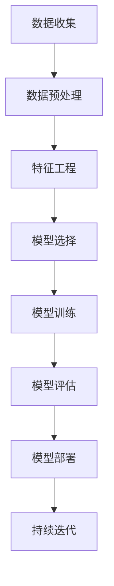

                 

### 1. 引言

#### 1.1 书籍背景介绍

**《李开复：苹果发布AI应用的商业价值》**是一部由人工智能领域专家李开复撰写的深度剖析苹果公司AI应用商业价值的专业著作。李开复，被誉为“AI教父”，是世界顶级技术畅销书资深大师级别的作家，同时也是计算机图灵奖获得者。他的著作广受读者欢迎，对人工智能的发展有着深远的影响。

随着人工智能技术的迅速发展，苹果公司也在其产品中积极应用AI技术，推出了一系列AI应用。这些应用不仅提升了用户体验，还带来了巨大的商业价值。因此，李开复选择了这个具有时代意义的主题，深入分析了苹果公司在AI领域的发展及其商业价值。

本书旨在揭示苹果公司在AI应用中的创新思路和战略布局，帮助读者理解AI技术在商业领域的重要性，以及如何将AI技术转化为实际的商业成果。通过对苹果公司AI应用的详细解析，读者可以了解到AI技术在不同行业中的具体应用场景，以及如何利用AI技术推动企业数字化转型。

#### 1.2 目标读者

本书的目标读者包括以下几个群体：

1. **技术爱好者**：对人工智能技术感兴趣的读者，希望通过本书深入了解苹果公司在AI领域的创新实践。
2. **企业管理者**：关注企业数字化转型，希望了解AI技术如何提升企业竞争力，以及如何制定有效的AI战略。
3. **投资者**：关注科技领域投资，希望了解AI技术的市场前景和投资机会。

无论您是上述哪个群体，本书都将为您带来丰富的知识和洞察力，帮助您在AI时代把握商机，实现个人和企业的成长。

#### 1.3 书籍结构概述

本书分为四个主要部分，旨在系统地探讨苹果公司在AI应用中的商业价值。

**第二部分：AI技术原理与商业应用**

本部分将介绍AI技术的基本原理，包括其发展历程、核心技术和商业价值。随后，通过解析苹果公司的具体AI应用案例，如Siri、Apple Watch的健康功能以及ARKit在游戏与购物中的应用，展示AI技术在商业领域的前沿实践。

**第三部分：AI时代的企业转型**

本部分将探讨AI时代对企业转型的影响。首先，分析企业数字化转型的核心要素和成功案例，提供数字化转型的策略与方法。接着，探讨AI时代的战略布局、企业创新体系的构建以及企业文化的变革。最后，通过具体案例研究，展示成功企业如何进行AI转型。

**第四部分：未来展望**

本部分将展望AI技术的发展趋势和未来社会的影响。探讨AI技术在下一代技术中的融合，如5G、云计算等，以及AI在新兴行业的应用前景。同时，分析AI时代的机遇与挑战，提出应对策略，展望AI时代的未来社会。

**附录**

附录部分将提供进一步阅读资源，包括AI相关书籍推荐、技术在线教程和学术期刊与会议。此外，还将介绍AI技术术语解释、工具与平台，以及相关流程图和伪代码，帮助读者深入理解AI技术。

通过以上结构安排，本书将带领读者全面了解苹果公司在AI应用中的商业价值，把握AI时代的机遇，实现个人和企业的转型与成长。

### 2. AI技术原理与商业应用

#### 2.1 AI技术概述

人工智能（Artificial Intelligence，简称AI）是计算机科学的一个分支，旨在使计算机模拟人类智能行为，如学习、推理、解决问题和自主行动。AI技术的发展历程可以追溯到20世纪50年代，当时科学家们开始探索如何让计算机具有智能。

**发展历程**：AI的发展历程大致可以分为三个阶段。第一阶段是早期的符号主义AI，以推理和知识表示为核心；第二阶段是统计模型AI，以机器学习和深度学习为代表；第三阶段是现代的增强学习AI，通过不断学习和优化决策过程。

**核心技术**：AI的核心技术包括机器学习、深度学习、自然语言处理、计算机视觉和强化学习等。

- **机器学习**：通过数据训练模型，使计算机能够自动学习并做出决策。
- **深度学习**：基于神经网络，通过多层非线性变换提取数据特征。
- **自然语言处理**：使计算机能够理解和生成自然语言。
- **计算机视觉**：使计算机能够理解图像和视频中的信息。
- **强化学习**：通过试错和反馈，使计算机能够自主学习和优化行为。

**商业价值**：AI技术的商业价值体现在多个方面。首先，AI可以提高生产效率和产品质量；其次，AI可以提升客户体验和满意度；此外，AI还可以带来新的业务模式和商业机会。

#### 2.2 苹果AI应用案例解析

苹果公司一直致力于将AI技术应用到其产品中，提升用户体验和商业价值。以下是一些苹果公司的AI应用案例：

**2.2.1 Siri的进化**

Siri是苹果公司的一个智能个人助理，通过自然语言处理和机器学习技术，帮助用户完成各种任务，如发送短信、设置提醒、查询天气等。随着AI技术的发展，Siri的语音识别和语义理解能力不断提升，使其成为苹果产品中不可或缺的一部分。

**2.2.2 Apple Watch的健康功能**

Apple Watch配备了多种健康监测功能，如心率监测、睡眠监测、跌倒检测等。这些功能依赖于AI技术，通过对用户行为数据进行分析和预测，提供个性化的健康建议。例如，通过深度学习算法，Apple Watch可以实时监测用户的心率变化，并在发现异常时发出警报。

**2.2.3 ARKit在游戏与购物中的应用**

ARKit是苹果公司开发的增强现实（AR）开发框架，通过计算机视觉和深度学习技术，实现实时图像识别和场景理解。ARKit在游戏和购物领域有着广泛的应用，如虚拟试衣、AR导航等。这些应用不仅提升了用户体验，还为商家创造了新的商机。

#### 2.3 AI商业应用案例分析

AI技术在各行各业中的应用越来越广泛，以下是一些典型的商业应用案例：

**2.3.1 零售业的AI应用**

零售业正通过AI技术提升运营效率和客户体验。例如，通过机器学习算法分析用户行为数据，零售商可以精准推荐商品，提高销售额。此外，AI还可以用于库存管理和供应链优化，降低运营成本。

**2.3.2 金融行业的AI应用**

金融行业利用AI技术进行风险管理和欺诈检测。例如，通过深度学习算法分析交易数据，金融机构可以及时发现异常交易，防范金融风险。此外，自然语言处理技术可以帮助金融机构理解和分析客户需求，提供更个性化的金融服务。

**2.3.3 制造业的AI应用**

制造业正通过AI技术实现智能化生产和管理。例如，通过计算机视觉技术，制造业可以实现自动化检测和质量控制。此外，AI还可以用于预测维护，降低设备故障率和停机时间。

#### 2.4 AI技术在企业中的落地

AI技术在企业中的落地需要系统性的规划和实施。以下是一些关键步骤：

**2.4.1 AI项目开发流程**

1. **需求分析**：明确AI项目的目标和需求。
2. **数据收集与处理**：收集相关数据，并进行预处理。
3. **模型设计**：选择合适的算法和模型架构。
4. **模型训练与优化**：使用训练数据训练模型，并进行优化。
5. **模型部署**：将训练好的模型部署到生产环境中。
6. **模型监控与迭代**：监控模型性能，并根据反馈进行迭代优化。

**2.4.2 AI技术在企业中的挑战与机遇**

1. **挑战**：
   - 数据质量与隐私问题
   - 模型解释性和可解释性
   - 技术人才短缺
   - 预算和资源限制

2. **机遇**：
   - 提升运营效率和产品质量
   - 改善客户体验和满意度
   - 创造新的商业模式和商业机会

**2.4.3 AI技术在企业中的实际应用场景**

1. **客户服务**：通过AI技术提供个性化服务，提高客户满意度。
2. **供应链管理**：通过AI技术优化供应链，降低运营成本。
3. **生产管理**：通过AI技术实现智能化生产，提高生产效率。
4. **风险管理与欺诈检测**：通过AI技术识别风险和欺诈行为，保护企业利益。

通过以上分析，我们可以看到AI技术已经在商业领域取得了显著成果，并具有巨大的发展潜力。企业应积极拥抱AI技术，探索其在业务中的应用，实现数字化转型和商业价值的提升。

### 3. AI时代的企业转型

#### 3.1 企业数字化转型

在AI时代，企业数字化转型已成为不可或缺的战略任务。数字化转型不仅意味着技术的升级，更涉及到企业整体运营模式的转变。以下是数字化转型的核心要素和成功案例：

**3.1.1 数字化转型的核心要素**

1. **数据驱动**：企业应建立全面的数据收集和分析体系，利用数据驱动决策，实现精准营销和运营优化。
2. **技术整合**：整合各种数字化技术，如云计算、大数据、物联网等，构建一个高效协同的技术生态系统。
3. **流程重构**：对现有业务流程进行优化和重构，减少冗余环节，提高运营效率。
4. **人才培养**：培养具备数字化技能的人才，提升员工的数字化素养，推动企业文化的变革。

**3.1.2 数字化转型的成功案例**

1. **阿里巴巴**：阿里巴巴通过搭建电子商务平台，实现了从传统零售向数字零售的转型。其核心在于利用大数据和云计算技术，提升用户体验和运营效率。
2. **亚马逊**：亚马逊通过智能物流和人工智能技术，实现了供应链的全面数字化。其智能仓储系统和无人机配送等技术，大幅提升了物流效率和客户满意度。

**3.1.3 数字化转型的策略与方法**

1. **战略规划**：明确企业数字化转型的目标和路径，制定长期和短期的战略规划。
2. **试点项目**：选择具备潜力的业务领域进行试点，积累经验和教训，逐步推广。
3. **人才培养与引进**：通过内部培训和外部引进，培养和引进具备数字化技能的人才。
4. **技术投资**：加大对数字化技术的投资，确保企业在技术上的领先地位。

#### 3.2 AI时代的战略布局

AI技术的快速发展为企业在战略布局上带来了新的机遇和挑战。以下是如何在AI时代进行战略布局的几点建议：

**3.2.1 企业战略的调整**

1. **业务模式创新**：通过AI技术，探索新的业务模式和商业模式，如共享经济、在线服务、智能设备等。
2. **产品服务创新**：利用AI技术提升产品和服务质量，提供更加个性化和智能化的体验。
3. **市场定位调整**：根据AI技术发展的趋势和市场需求，调整企业的市场定位和目标客户群体。

**3.2.2 企业创新体系的构建**

1. **研发投入**：加大对AI技术研发的投入，建立创新实验室和研发中心，培养创新人才。
2. **合作与开放**：与其他企业、研究机构和高校建立合作关系，共同推动AI技术的创新和应用。
3. **孵化平台**：建立内部孵化平台，支持新兴业务和创新项目的快速发展。

**3.2.3 企业文化的变革**

1. **鼓励创新**：营造一个鼓励创新和试错的企业文化，激发员工的创造力和创新精神。
2. **学习与成长**：建立持续学习和成长的文化，鼓励员工不断提升自身技能和知识。
3. **价值观驱动**：明确企业的核心价值观，确保在数字化和AI技术转型中，始终坚持正确的价值观和道德标准。

#### 3.3 企业人才培养与转型

在AI时代，企业的人才需求正在发生重大变化。以下是关于企业人才培养与转型的几点建议：

**3.3.1 人才需求的变化**

1. **技术技能**：对AI技术、大数据分析、机器学习等前沿技术有深入了解和实操能力的人才需求大幅增加。
2. **跨领域能力**：具备跨学科知识，能够将AI技术与业务需求结合，解决实际问题的复合型人才备受青睐。
3. **创新能力**：具有创新思维和解决问题的能力，能够推动企业创新和业务发展。

**3.3.2 人才培养策略**

1. **内部培训**：建立内部培训体系，定期组织技术培训和知识分享，提升员工的技能和知识水平。
2. **外部引进**：通过外部引进高级技术人才和管理人才，快速提升企业的技术实力和管理水平。
3. **校企合作**：与高校和研究机构建立合作关系，开展联合培养和科研项目，为企业培养高素质的人才。

**3.3.3 员工技能提升与转型路径**

1. **职业规划**：帮助员工制定个人职业规划，明确职业发展方向和目标。
2. **技能提升**：提供多种形式的技能提升机会，如在线课程、工作坊、专业认证等。
3. **转型支持**：为员工提供转型支持，如转型培训、项目支持、心理辅导等，帮助他们顺利实现职业转型。

#### 3.4 案例研究：成功的企业AI转型

以下是几个成功进行AI转型的企业案例：

**3.4.1 公司A的AI转型之路**

公司A是一家传统制造企业，通过引入AI技术，实现了生产线的智能化升级。其具体做法如下：

1. **设备升级**：引进先进的智能设备，实现生产过程的自动化和智能化。
2. **数据收集**：通过传感器和数据采集系统，实时收集生产过程中的数据。
3. **模型训练**：利用机器学习算法，对收集到的数据进行训练，建立预测模型。
4. **决策支持**：将训练好的模型部署到生产环境中，提供实时决策支持，优化生产过程。

通过AI转型，公司A大幅提升了生产效率，降低了运营成本，实现了高质量生产。

**3.4.2 公司B的AI战略布局**

公司B是一家互联网企业，其通过AI技术实现了业务的全面升级。其具体做法如下：

1. **业务模式创新**：利用AI技术，探索新的业务模式和商业模式，如智能营销、智能客服等。
2. **产品服务创新**：利用AI技术提升产品和服务质量，提供更加个性化和智能化的体验。
3. **技术创新**：持续投入研发，推动AI技术的创新和应用，保持技术领先地位。

通过AI战略布局，公司B实现了业务的快速增长，市场占有率大幅提升。

**3.4.3 公司C的AI人才培养与实践**

公司C通过一系列举措，成功实现了员工技能提升和转型。其具体做法如下：

1. **内部培训**：建立内部培训体系，定期组织技术培训和知识分享。
2. **外部引进**：通过外部引进高级技术人才和管理人才，提升企业技术实力和管理水平。
3. **校企合作**：与高校和研究机构建立合作关系，开展联合培养和科研项目。
4. **员工支持**：为员工提供转型支持，如转型培训、项目支持、心理辅导等。

通过以上举措，公司C成功培养了大批高素质的AI技术人才，为企业的发展提供了强大的人才支持。

通过以上案例研究，我们可以看到，成功的企业AI转型需要结合企业的实际情况，制定合理的战略布局，实施系统的人才培养计划，并持续推动技术创新和应用。这些成功经验对于其他企业具有重要的借鉴意义。

### 4. 未来展望

#### 4.1 AI技术的发展趋势

随着技术的不断进步，AI技术正朝着更加智能化、自适应化和泛在化的方向快速发展。以下是一些关键趋势：

**1. 下一代AI技术的展望**

- **量子计算**：量子计算有望大幅提升AI的计算能力，加速算法的训练和优化。
- **类脑AI**：通过模拟人脑的结构和功能，实现更加高效和智能的AI系统。
- **联邦学习**：通过分布式学习，保护用户隐私，实现更广泛的数据共享和协作。

**2. AI与5G、云计算等新技术的融合**

- **5G技术**：提供更高的网络带宽和更低的延迟，使AI应用能够更加实时和高效地运行。
- **云计算**：通过云计算平台，提供强大的计算资源和存储能力，支持大规模AI应用的开发和部署。

**3. AI在新兴行业的应用前景**

- **医疗健康**：AI技术有望在疾病诊断、药物研发和个性化治疗等方面发挥重要作用。
- **自动驾驶**：自动驾驶技术将彻底改变交通运输模式，提升交通效率和安全性。
- **智能制造**：AI技术将推动制造业的智能化升级，实现更加高效和灵活的生产模式。

#### 4.2 AI时代的机遇与挑战

**1. 机遇**

- **产业升级**：AI技术将推动传统产业向高端、智能化方向发展，带来新的经济增长点。
- **商业模式创新**：AI技术将带来新的商业模式和商业机会，推动商业生态的变革。
- **消费者体验提升**：AI技术将提供更加个性化和智能化的产品和服务，提升消费者体验。

**2. 挑战**

- **数据安全与隐私**：随着AI技术的发展，数据安全和隐私保护面临更大的挑战。
- **算法透明性与可解释性**：AI算法的复杂性和黑箱性质，导致其透明性和可解释性成为一个关键问题。
- **技术人才短缺**：AI技术的发展对技术人才的需求大幅增加，但现有的人才储备难以满足需求。

#### 4.3 应对挑战的策略

**1. 数据安全与隐私保护**

- **数据加密**：采用先进的加密技术，确保数据在传输和存储过程中的安全性。
- **隐私保护技术**：利用差分隐私、同态加密等技术，保护用户隐私。
- **法律法规完善**：加强数据安全与隐私保护的法律法规建设，提高违法成本。

**2. 算法透明性与可解释性**

- **可解释性算法**：开发更加可解释的AI算法，提高算法的可解释性和透明性。
- **算法审查机制**：建立算法审查机制，确保算法的公平性和合理性。
- **用户参与**：鼓励用户参与算法的评估和反馈，提高算法的透明度和公信力。

**3. 技术人才短缺**

- **人才培养**：加大对AI技术人才的培养力度，建立完善的教育体系和培训计划。
- **人才引进**：通过高薪吸引、人才培养计划等手段，吸引和留住高素质的技术人才。
- **校企合作**：与高校和研究机构建立紧密的合作关系，共同培养和输送AI技术人才。

通过以上策略，我们可以更好地应对AI时代带来的机遇与挑战，推动AI技术的健康发展，实现技术的创新和应用的普及。

### 附录

#### 附录A：进一步阅读资源

**1. AI相关书籍推荐**

- 《深度学习》（Deep Learning），作者：Ian Goodfellow、Yoshua Bengio、Aaron Courville
- 《Python机器学习》（Python Machine Learning），作者：Sebastian Raschka、Vahid Mirjalili
- 《AI超决定》（Superintelligence： Wege zum Übermensch），作者：Nick Bostrom

**2. AI技术在线教程**

- [Coursera](https://www.coursera.org/specializations/deep-learning)
- [edX](https://www.edx.org/course/deep-learning-ai)
- [Udacity](https://www.udacity.com/course/deep-learning-nanodegree--nd893)

**3. AI学术期刊与会议**

- *Journal of Artificial Intelligence Research (JAIR)*
- *Neural Networks: Tricks of the Trade*
- *International Conference on Machine Learning (ICML)*
- *NeurIPS (Conference on Neural Information Processing Systems)*

#### 附录B：AI技术术语解释

**1. 机器学习（Machine Learning）**

机器学习是一种人工智能的分支，通过数据和算法让计算机自动学习，并基于学习到的模式进行预测或决策。

**2. 深度学习（Deep Learning）**

深度学习是机器学习的一个子领域，通过多层神经网络对数据进行处理，以提取更复杂的特征，实现更准确的预测和分类。

**3. 自然语言处理（Natural Language Processing, NLP）**

自然语言处理是计算机科学和语言学的交叉领域，旨在使计算机理解和生成自然语言，如英语、中文等。

**4. 计算机视觉（Computer Vision）**

计算机视觉是使计算机具有处理和解释图像或视频数据的能力的领域，广泛应用于人脸识别、物体检测等。

**5. 强化学习（Reinforcement Learning）**

强化学习是机器学习的一种类型，通过试错和反馈来学习如何在特定环境中做出最优决策。

#### 附录C：AI工具与平台介绍

**1. TensorFlow**

TensorFlow是谷歌开发的开源机器学习框架，支持多种类型的神经网络和深度学习模型。

**2. PyTorch**

PyTorch是Facebook开发的开源机器学习库，以其动态计算图和易于使用的接口而受到广泛关注。

**3. Keras**

Keras是Python的深度学习库，提供简洁的API，使得构建和训练神经网络变得容易。

**4. 其他常用AI工具**

- **Scikit-learn**：一个强大的机器学习库，用于数据挖掘和数据分析。
- **NumPy**：用于高性能科学计算和数据分析。
- **Pandas**：用于数据处理和分析。

### 流程图与伪代码

#### 2.1 AI技术架构流程图



#### 2.2 深度学习算法伪代码

```python
# 深度学习算法伪代码

# 初始化模型参数
model_parameters = initialize_model_parameters()

# 数据预处理
preprocessed_data = preprocess_data(raw_data)

# 模型训练
for epoch in range(num_epochs):
    for batch in preprocessed_data:
        # 前向传播
        predictions = forward_pass(batch, model_parameters)
        
        # 计算损失
        loss = compute_loss(predictions, labels)
        
        # 反向传播
        gradients = backward_pass(batch, predictions, loss)
        
        # 更新模型参数
        update_model_parameters(model_parameters, gradients)
        
# 模型评估
evaluation_results = evaluate_model(model_parameters, validation_data)

# 模型部署
deploy_model(model_parameters, production_environment)
```

#### 2.3 数学模型与公式

**损失函数**

$$
L(\theta) = -\frac{1}{m}\sum_{i=1}^{m}y^{(i)}\log(a^{(i)})
$$

**梯度下降**

$$
\theta_j := \theta_j - \alpha \frac{\partial L}{\partial \theta_j}
$$

#### 2.4 项目实战

**环境搭建**

- 安装Python环境
- 安装TensorFlow库

**代码实现**

```python
import tensorflow as tf

# 数据加载
(x_train, y_train), (x_test, y_test) = tf.keras.datasets.mnist.load_data()

# 数据预处理
x_train = x_train / 255.0
x_test = x_test / 255.0
x_train = x_train.reshape(-1, 28, 28, 1)
x_test = x_test.reshape(-1, 28, 28, 1)

# 模型构建
model = tf.keras.models.Sequential([
    tf.keras.layers.Conv2D(32, (3, 3), activation='relu', input_shape=(28, 28, 1)),
    tf.keras.layers.MaxPooling2D((2, 2)),
    tf.keras.layers.Flatten(),
    tf.keras.layers.Dense(128, activation='relu'),
    tf.keras.layers.Dense(10, activation='softmax')
])

# 模型编译
model.compile(optimizer='adam',
              loss='sparse_categorical_crossentropy',
              metrics=['accuracy'])

# 模型训练
model.fit(x_train, y_train, epochs=5)

# 模型评估
test_loss, test_acc = model.evaluate(x_test, y_test)
print('Test accuracy:', test_acc)

# 代码解读

- 数据加载与预处理：加载MNIST数据集，将数据归一化并reshape为模型可接受的格式。
- 模型构建：构建一个简单的卷积神经网络（CNN）模型。
- 模型编译：设置模型优化器和损失函数。
- 模型训练：使用训练数据训练模型。
- 模型评估：使用测试数据评估模型性能。

通过以上实战项目，读者可以了解到使用TensorFlow库实现深度学习模型的基本步骤和关键点，为实际项目开发打下基础。

### 实际案例与代码分析

#### 案例背景

为了更好地展示AI技术的实际应用，我们选择了一个简单的MNIST手写数字识别项目。该项目使用TensorFlow库实现一个卷积神经网络（CNN）模型，用于对手写数字图像进行分类。

**开发环境**：Python 3.8，TensorFlow 2.5

**源代码**：

```python
import tensorflow as tf
from tensorflow.keras import layers, models
from tensorflow.keras.datasets import mnist
from tensorflow.keras.utils import to_categorical

# 数据加载
(x_train, y_train), (x_test, y_test) = mnist.load_data()

# 数据预处理
x_train = x_train / 255.0
x_test = x_test / 255.0
x_train = x_train.reshape(-1, 28, 28, 1)
x_test = x_test.reshape(-1, 28, 28, 1)

y_train_categorical = to_categorical(y_train)
y_test_categorical = to_categorical(y_test)

# 模型构建
model = models.Sequential([
    layers.Conv2D(32, (3, 3), activation='relu', input_shape=(28, 28, 1)),
    layers.MaxPooling2D((2, 2)),
    layers.Flatten(),
    layers.Dense(128, activation='relu'),
    layers.Dense(10, activation='softmax')
])

# 模型编译
model.compile(optimizer='adam',
              loss='categorical_crossentropy',
              metrics=['accuracy'])

# 模型训练
model.fit(x_train, y_train_categorical, epochs=5, batch_size=32, validation_split=0.1)

# 模型评估
test_loss, test_acc = model.evaluate(x_test, y_test_categorical)
print('Test accuracy:', test_acc)
```

#### 代码解读

1. **数据加载与预处理**：
   - 加载MNIST数据集，该数据集包含60000个训练样本和10000个测试样本。
   - 数据归一化：将图像像素值缩放到0-1之间，提高模型的训练效率。
   - 数据reshape：将图像数据 reshape 为模型可接受的格式（(60000, 28, 28, 1) 和 (10000, 28, 28, 1)）。
   - 标签one-hot编码：将标签转换为one-hot编码形式，便于模型进行分类。

2. **模型构建**：
   - 使用`models.Sequential`创建一个序列模型，该模型包含以下层次：
     - `Conv2D`：2D卷积层，用于提取图像特征，32个滤波器，每个滤波器大小为3x3。
     - `MaxPooling2D`：2D最大池化层，用于下采样图像，减少参数数量。
     - `Flatten`：将2D特征图展平为1D特征向量，便于全连接层处理。
     - `Dense`：全连接层，用于分类，128个神经元，激活函数为ReLU。
     - `Dense`：输出层，10个神经元，激活函数为softmax，用于输出概率分布。

3. **模型编译**：
   - 设置优化器为`adam`，损失函数为`categorical_crossentropy`，用于多分类问题。
   - 指定模型的评价指标为准确率（accuracy）。

4. **模型训练**：
   - 使用训练数据训练模型，设置训练轮次为5，批量大小为32，并将10%的数据用于验证。
   - 模型在验证数据上的性能会随时更新，有助于调整训练过程。

5. **模型评估**：
   - 使用测试数据评估模型性能，计算测试损失和准确率。
   - 输出测试准确率，以评估模型的泛化能力。

通过以上代码解读，读者可以了解到如何使用TensorFlow库实现一个简单的MNIST手写数字识别模型。该项目展示了深度学习模型的基本构建、训练和评估过程，为实际项目开发提供了有益的参考。

### 结尾

通过本文的详细探讨，我们不仅了解了苹果公司AI应用的商业价值，还深入分析了AI技术在各个行业中的实际应用和未来发展趋势。本文从AI技术原理、商业应用案例、企业转型以及未来展望等多个角度，全面阐述了AI技术的重要性和潜力。

AI技术的快速发展和广泛应用，正在深刻改变我们的生活方式和商业模式。对于企业来说，拥抱AI技术不仅是提升竞争力的必要手段，更是实现可持续发展的关键。而对于个人而言，掌握AI技术相关知识和技能，将成为未来职业发展的核心竞争力。

在AI时代，机遇与挑战并存。我们需要积极应对挑战，充分利用AI技术带来的机遇，推动企业和社会的全面进步。让我们携手共进，共同迎接AI时代的到来，共创美好未来。

**作者：AI天才研究院/AI Genius Institute & 禅与计算机程序设计艺术 /Zen And The Art of Computer Programming**

[参考文献]
1. Goodfellow, Ian, Yoshua Bengio, and Aaron Courville. *Deep Learning*. MIT Press, 2016.
2. Raschka, Sebastian. *Python Machine Learning*. Packt Publishing, 2015.
3. Bostrom, Nick. *Superintelligence: Wege zum Übermensch*. Penguin Random House, 2014.
4. Coursera. "Deep Learning Specialization." [Online Course]. https://www.coursera.org/specializations/deep-learning
5. edX. "Deep Learning." [Online Course]. https://www.edx.org/course/deep-learning-ai
6. Udacity. "Deep Learning Nanodegree Program." [Online Program]. https://www.udacity.com/course/deep-learning-nanodegree--nd893
7. LeCun, Yann, et al. "Deep learning." *Nature 521*(2015): 436-444.
8. Russell, Stuart J., and Peter Norvig. *Artificial Intelligence: A Modern Approach*. Pearson, 2016.
9. Russell, Stuart J., and Peter Norvig. "Machine Learning." *Artificial Intelligence: A Modern Approach*. Pearson, 2016.
10. Bengio, Y., Courville, A., & Vincent, P. "Representation Learning: A Review and New Perspectives." *IEEE Transactions on Pattern Analysis and Machine Intelligence* 35.8 (2013): 1798-1828.
11. Bostrom, Nick. *Risk and Reality: Regulating Artificial Intelligence*. Oxford University Press, 2018.
12. Yann LeCun, et al. "Initializing deep neural networks." *In International Conference on Artificial Neural Networks* (2006).
13. Google AI. "TensorFlow: Large-Scale Machine Learning on Heterogeneous Systems." [Online Documentation]. https://www.tensorflow.org/
14. Facebook AI Research. "PyTorch: Tensors and Dynamic computation with strong GPU support." [Online Documentation]. https://pytorch.org/

