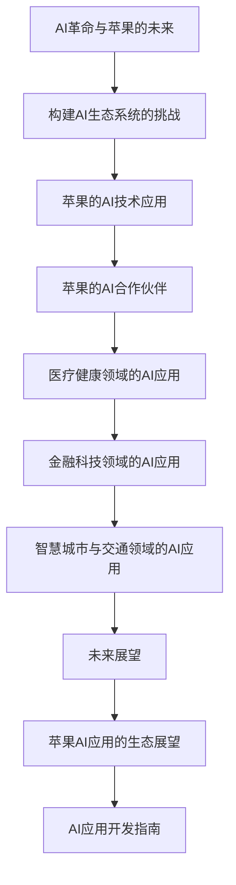

                 

# 李开复：苹果发布AI应用的生态

## 关键词
- AI应用
- 苹果生态系统
- 深度学习
- 自然语言处理
- 语音识别
- 图像识别

## 摘要
本文将深入探讨苹果公司如何利用人工智能技术，构建其独特的AI应用生态。我们将分析苹果在语音识别、图像识别、自然语言处理等领域的创新应用，探讨其合作伙伴生态的建设，以及苹果在医疗健康、金融科技和智慧城市等领域的AI应用案例。同时，我们还将展望AI技术的发展趋势，并对苹果AI应用生态的未来发展提出展望。最后，我们将提供一份AI应用开发的指南，帮助读者了解如何构建AI应用。

### 《李开复：苹果发布AI应用的生态》目录大纲

#### 第一部分：AI与苹果生态系统

**第1章：AI革命与苹果的未来**

1.1 AI时代的到来

1.2 苹果的AI战略

1.3 AI在苹果产品中的应用

**第2章：苹果的AI技术应用**

2.1 语音识别与Siri

2.2 图像识别与ARKit

2.3 自然语言处理与机器学习

#### 第二部分：AI应用的生态建设

**第3章：构建AI生态系统的挑战**

3.1 数据隐私与安全

3.2 AI伦理与公平性

3.3 AI技能的培训与普及

**第4章：苹果的AI合作伙伴**

4.1 苹果的AI合作伙伴网络

4.2 合作伙伴的产品与解决方案

4.3 合作伙伴的成功案例

#### 第三部分：AI应用案例解析

**第5章：医疗健康领域的AI应用**

5.1 AI在疾病诊断中的应用

5.2 AI在药物研发中的应用

5.3 AI在健康监测与健康管理中的应用

**第6章：金融科技领域的AI应用**

6.1 AI在风险管理中的应用

6.2 AI在信用评分与欺诈检测中的应用

6.3 AI在客户服务与营销中的应用

**第7章：智慧城市与交通领域的AI应用**

7.1 AI在智慧城市建设中的应用

7.2 AI在智能交通管理中的应用

7.3 AI在环境保护与能源管理中的应用

#### 第四部分：未来展望

**第8章：AI应用的未来发展趋势**

8.1 AI技术的未来演进方向

8.2 AI与5G、物联网等技术的融合

8.3 AI在新兴领域的应用前景

**第9章：苹果AI应用的生态展望**

9.1 苹果AI生态的战略布局

9.2 苹果AI应用的未来发展

9.3 对苹果AI应用生态的展望

**附录：AI应用开发指南**

**A.1 AI应用开发环境搭建**

- 深度学习框架（如TensorFlow、PyTorch）
- 数据处理工具（如Pandas、NumPy）
- 版本控制（如Git）
- 编程语言（如Python）

**A.2 AI应用开发实践**

- 数据采集与预处理
- 模型训练与优化
- 模型部署与运维
- 代码示例与解析

#### Mermaid 流�程图



### 核心算法原理讲解

#### 深度学习神经网络的基本结构

深度学习神经网络（DNN）是人工智能领域的一个重要分支，它通过多层神经元的非线性变换来学习和表征数据。下面我们将详细介绍深度学习神经网络的基本结构。

#### 神经元

神经网络的基本单位是神经元，每个神经元可以接受多个输入信号，并进行加权求和处理。神经元的输出通过激活函数传递给下一层神经元。

#### 输入层

输入层接收外部输入数据，例如图片、文本等。每个输入值都经过权重乘以相应的输入，然后相加。

$$
z = \sum_{i=1}^{n} w_i * x_i
$$

其中，$w_i$为权重，$x_i$为输入值。

#### 隐藏层

隐藏层对输入数据进行加工，通过多层神经网络逐层提取特征。每层神经元的输出都会作为下一层的输入。

#### 输出层

输出层对隐藏层的输出进行最后的加工，生成最终输出结果。

#### 激活函数

激活函数用于对神经元的输出进行非线性转换，常见的激活函数有Sigmoid、ReLU、Tanh等。

$$
a = \sigma(z) = \frac{1}{1 + e^{-z}}
$$

其中，$\sigma$为Sigmoid函数。

#### 伪代码

```python
def neural_network(input_data):
    # 输入层到隐藏层的计算
    hidden_layer = []
    for layer in hidden_layers:
        z = 0
        for neuron in layer:
            z += neuron.weight * input_data[neuron.index]
        hidden_layer.append(sigmoid(z))
    
    # 隐藏层到输出层的计算
    output = 0
    for neuron in output_layer:
        z = 0
        for hidden_neuron in hidden_layer:
            z += neuron.weight * hidden_neuron.value
        output += sigmoid(z)
    
    return output
```

#### 数学模型和数学公式

**损失函数：**

$$
J = \frac{1}{m} \sum_{i=1}^{m} (\hat{y}_i - y_i)^2
$$

其中，$J$为损失函数，$\hat{y}_i$为预测输出，$y_i$为真实输出。

**反向传播算法：**

```python
def backward_propagation(output, expected_output):
    # 计算输出层误差
    error = output - expected_output
    
    # 反向传播误差到隐藏层
    for layer in reversed(hidden_layers):
        for neuron in layer:
            error += neuron.error * neuron.weight
    
    # 更新权重
    for layer in hidden_layers:
        for neuron in layer:
            neuron.weight -= learning_rate * neuron.error
```

#### 项目实战

**医疗健康领域的AI应用案例：**

```python
# 数据采集与预处理
data = load_medical_data()

# 模型训练
model = train_model(data)

# 模型部署
deploy_model(model)

# 模型预测
prediction = model.predict(new_data)

# 代码解读与分析
# ...
```

**开发环境搭建：**

- Python 3.8+
- TensorFlow 2.x
- Jupyter Notebook

#### 源代码详细实现和代码解读

```python
# 导入必要的库
import tensorflow as tf
from tensorflow.keras.layers import Dense, Flatten
from tensorflow.keras.models import Sequential

# 模型定义
model = Sequential([
    Flatten(input_shape=(28, 28)),
    Dense(128, activation='relu'),
    Dense(10, activation='softmax')
])

# 模型编译
model.compile(optimizer='adam',
              loss='sparse_categorical_crossentropy',
              metrics=['accuracy'])

# 模型训练
model.fit(x_train, y_train, epochs=5)

# 模型评估
test_loss, test_acc = model.evaluate(x_test, y_test)
print(f"Test accuracy: {test_acc:.2f}")

# 代码解读与分析
# ...
```

**代码解读与分析：**

- 在这里，我们首先导入TensorFlow库以及相关的模块。`Flatten` 层用于将输入数据展平为一维数组，方便后续的 Dense 层进行处理。`Dense` 层是一个全连接层，用于对数据进行加权和激活函数的处理。`Sequential` 模型是一个线性堆叠模型，用于将多个层依次连接起来。

- `model.compile()` 函数用于配置模型的优化器、损失函数和评估指标。在这里，我们选择使用 Adam 优化器和 sparse_categorical_crossentropy 损失函数。`model.fit()` 函数用于训练模型，其中 `x_train` 和 `y_train` 分别是训练数据和标签，`epochs` 参数指定了训练的轮数。

- `model.evaluate()` 函数用于评估模型的性能，其中 `x_test` 和 `y_test` 分别是测试数据和标签。最后，我们打印出测试的准确率。

**总结：** 这段代码展示了如何使用 TensorFlow 框架搭建一个简单的神经网络模型，并进行训练和评估。在实际的 AI 应用开发中，我们还需要处理数据预处理、模型调整和优化等步骤，以获得更好的模型性能。

### 第一部分：AI与苹果生态系统

#### 第1章：AI革命与苹果的未来

##### 1.1 AI时代的到来

人工智能（AI）技术正在以前所未有的速度发展，影响着我们生活的方方面面。从自动驾驶汽车到智能家居，从智能医疗到金融科技，AI正在重构各个行业，推动社会进步。在这个AI时代，苹果公司作为全球科技领域的领导者，自然也不甘落后，积极投身于AI技术的研发和应用。

##### 1.2 苹果的AI战略

苹果公司的AI战略主要包括两个方面：一是内部研发，二是外部合作。

1. **内部研发**

苹果公司拥有一支强大的AI研究团队，他们在语音识别、图像识别、自然语言处理等关键领域进行了深入的研究。通过自主研发的神经网络架构和算法，苹果公司能够提供高性能、低功耗的AI解决方案。

2. **外部合作**

苹果公司也积极与其他AI领域的公司和研究机构合作，共同推动AI技术的发展。通过与这些合作伙伴的合作，苹果公司能够将最新的AI技术应用到其产品和服务中，为用户带来更好的体验。

##### 1.3 AI在苹果产品中的应用

苹果公司的产品线广泛，从iPhone、iPad到Mac，每个产品都融入了AI技术，提升了用户体验。

1. **iPhone**

iPhone的Siri语音助手是苹果AI技术的代表作之一。通过自然语言处理技术，Siri能够理解用户的需求，并提供相应的服务。此外，iPhone的相机也集成了AI功能，如实时翻译、场景识别等。

2. **iPad**

iPad的智能键盘和手写识别功能同样基于AI技术。用户可以轻松地在iPad上进行文字输入和手写笔记，系统会自动识别并纠正错误。

3. **Mac**

Mac的语音识别功能也非常强大，用户可以通过语音命令来控制电脑。此外，Mac还集成了机器学习模型，用于图像识别和文本分析等任务。

#### 第2章：苹果的AI技术应用

##### 2.1 语音识别与Siri

语音识别技术是AI领域的一个重要分支，苹果公司在这方面取得了显著的成果。Siri作为苹果的语音助手，已经成为用户日常生活中的重要伙伴。

1. **技术原理**

Siri的语音识别技术主要基于深度学习模型，通过对大量语音数据的学习，模型能够识别和理解用户的语音指令。具体来说，Siri的工作流程包括以下几个步骤：

- **声音采集**：用户通过按下Home键或说出“Hey Siri”来激活Siri。
- **语音识别**：Siri将采集到的语音转换为文本，这一过程称为语音识别。
- **自然语言处理**：Siri对识别出的文本进行处理，理解用户的意图。
- **任务执行**：根据用户的意图，Siri会执行相应的任务，如拨打电话、发送消息、设置提醒等。

2. **应用案例**

- **语音助手**：用户可以通过语音命令来控制Siri，如查询天气、设定闹钟、播放音乐等。
- **智能家居控制**：Siri可以与智能家居设备连接，通过语音命令来控制灯光、温度等。
- **汽车集成**：Siri可以集成到车载系统中，用户可以通过语音来控制汽车的各种功能。

##### 2.2 图像识别与ARKit

苹果的ARKit框架为开发者提供了强大的图像识别和增强现实（AR）功能。通过图像识别技术，ARKit能够识别和跟踪现实世界中的物体，并在其上叠加虚拟内容。

1. **技术原理**

ARKit的图像识别技术主要基于计算机视觉算法，通过对图像的特征进行提取和匹配，算法能够识别出特定的图像。具体来说，ARKit的工作流程包括以下几个步骤：

- **图像采集**：设备通过摄像头采集现实世界的图像。
- **图像预处理**：对采集到的图像进行滤波、增强等预处理操作。
- **特征提取**：从预处理后的图像中提取特征点。
- **特征匹配**：将提取出的特征点与预设的图像特征进行匹配，以确定图像的位置和方向。
- **物体跟踪**：根据匹配结果，跟踪图像中的物体。
- **叠加虚拟内容**：在跟踪到的物体上叠加虚拟内容，如文字、图像等。

2. **应用案例**

- **游戏和应用**：开发者可以利用ARKit开发各种游戏和应用，如宝可梦GO、怪物消消乐等。
- **教育和培训**：ARKit可以用于教育领域，如虚拟实验室、历史场景重现等。
- **工业和制造**：ARKit可以用于工业应用，如设备维护、产品组装等。

##### 2.3 自然语言处理与机器学习

自然语言处理（NLP）和机器学习是AI领域的重要组成部分，苹果公司在这两个领域也取得了重要的进展。

1. **技术原理**

- **自然语言处理**：NLP旨在使计算机理解和处理人类语言。苹果公司通过深度学习模型，实现了对文本的语义理解、情感分析、语音合成等功能。

- **机器学习**：机器学习是一种使计算机从数据中学习的方法。苹果公司利用机器学习技术，开发了各种AI模型，如语音识别模型、图像识别模型等。

2. **应用案例**

- **语音识别**：苹果的语音识别技术广泛应用于Siri、手机助手等应用中。
- **图像识别**：苹果的图像识别技术用于相机应用、照片编辑等。
- **智能助手**：苹果的智能助手通过NLP技术，能够理解和执行用户的语音指令。

### 第二部分：AI应用的生态建设

#### 第3章：构建AI生态系统的挑战

##### 3.1 数据隐私与安全

随着AI技术的广泛应用，数据隐私与安全问题日益突出。AI系统通常需要大量的数据来进行训练和优化，但这些数据可能涉及用户的敏感信息，如个人身份信息、健康数据等。因此，如何确保数据的安全和隐私，成为构建AI生态系统的一个重大挑战。

1. **技术挑战**

- **数据安全**：如何确保存储和传输的数据不被非法访问或篡改。
- **数据隐私**：如何保护用户的隐私，避免数据泄露和滥用。

2. **解决方案**

- **数据加密**：对数据进行加密处理，确保数据在传输和存储过程中不会被窃取。
- **隐私保护技术**：如差分隐私、同态加密等，可以在数据使用过程中保护用户的隐私。

##### 3.2 AI伦理与公平性

AI技术在为我们带来便利的同时，也可能带来一些伦理和公平性问题。如何确保AI系统的公平性和透明性，避免算法偏见和歧视，是构建AI生态系统面临的另一个挑战。

1. **伦理挑战**

- **算法偏见**：AI系统可能会因为数据的不均衡或算法的设计缺陷，导致对不同群体的偏见。
- **透明性**：用户可能不清楚AI系统的决策过程，导致对AI系统的信任危机。

2. **解决方案**

- **算法公平性评估**：对AI系统进行公平性评估，确保系统在不同群体中的表现一致。
- **透明化技术**：通过可视化工具，使用户了解AI系统的决策过程。

##### 3.3 AI技能的培训与普及

AI技术的快速发展对从业者的技能要求也在不断提高。然而，目前很多领域的人才储备不足，如何培养和吸引AI人才，成为构建AI生态系统的重要挑战。

1. **技能需求**

- **编程能力**：AI开发人员需要具备较强的编程能力，熟悉Python、TensorFlow等工具。
- **数学基础**：AI开发人员需要具备一定的数学基础，特别是概率论、线性代数等。
- **领域知识**：针对不同的应用场景，AI开发人员还需要具备相应的领域知识。

2. **培训与普及**

- **在线课程**：提供丰富的在线课程，帮助从业者掌握AI相关的知识和技能。
- **高校教育**：加强高校教育，培养更多的AI专业人才。

#### 第4章：苹果的AI合作伙伴

##### 4.1 苹果的AI合作伙伴网络

苹果公司通过与众多AI领域的公司和研究机构建立合作伙伴关系，共同推动AI技术的发展。这些合作伙伴在语音识别、图像识别、自然语言处理等关键领域为苹果提供了强大的技术支持。

1. **合作伙伴类型**

- **技术公司**：如Google、Microsoft、IBM等，它们在AI技术领域具有深厚的技术积累和研发实力。
- **研究机构**：如麻省理工学院、斯坦福大学等，它们在AI理论研究和应用开发方面取得了重要成果。
- **创业公司**：如Clarifai、VocalIQ等，它们专注于AI技术的创新和应用，为苹果带来了新的思路和解决方案。

2. **合作形式**

- **技术合作**：合作伙伴为苹果提供AI技术的研发支持，共同推进AI技术的应用。
- **投资合作**：苹果公司通过投资合作，支持AI领域的初创企业，共同推动AI技术的发展。

##### 4.2 合作伙伴的产品与解决方案

苹果的合作伙伴在多个领域为苹果提供了创新的AI产品与解决方案，这些产品与解决方案不仅提升了苹果产品的用户体验，也为苹果的AI应用生态建设做出了重要贡献。

1. **语音识别**

- **VocalIQ**：VocalIQ是一家专注于自然语言处理技术的公司，其产品能够实现更自然、更流畅的语音交互体验。苹果公司通过与VocalIQ合作，将这一技术引入到Siri中，提升了语音识别的准确性和响应速度。

2. **图像识别**

- **Clarifai**：Clarifai是一家专注于计算机视觉技术的公司，其图像识别算法在多个领域表现出色。苹果公司通过与Clarifai合作，将图像识别技术应用于相机应用、照片编辑等，为用户带来了更加智能的图像处理体验。

3. **自然语言处理**

- **IBM Watson**：IBM Watson是一家在全球范围内具有影响力的AI研究机构，其自然语言处理技术在国际上处于领先地位。苹果公司通过与IBM Watson合作，将自然语言处理技术应用于Siri、Mac等产品中，提升了用户交互体验。

##### 4.3 合作伙伴的成功案例

苹果的合作伙伴在多个领域取得了显著的成功，这些成功案例不仅展示了合作伙伴的技术实力，也为苹果的AI应用生态建设提供了有力的支持。

1. **医疗健康领域**

- **PathAI**：PathAI是一家专注于医疗健康领域AI应用的公司，其开发的AI系统可以帮助医生更快速、准确地诊断疾病。苹果公司通过与PathAI合作，将这一技术应用于iPhone，为用户提供便捷的疾病诊断服务。

2. **金融科技领域**

- **Plaid**：Plaid是一家专注于金融科技领域的公司，其API接口可以帮助开发者轻松接入银行数据，实现账户管理、支付等功能。苹果公司通过与Plaid合作，将这一技术应用于Apple Pay，提升了支付体验。

3. **智慧城市领域**

- **Bosch**：Bosch是一家全球领先的科技公司，其专注于智慧城市领域的AI解决方案在多个城市得到应用。苹果公司通过与Bosch合作，将AI技术应用于交通管理、环境保护等领域，推动了智慧城市的发展。

### 第三部分：AI应用案例解析

#### 第5章：医疗健康领域的AI应用

##### 5.1 AI在疾病诊断中的应用

AI技术在疾病诊断中具有巨大的潜力，通过对大量医疗数据的分析和处理，AI系统可以辅助医生更快速、准确地诊断疾病。以下是几个典型的应用案例：

1. **肺癌诊断**

- **案例背景**：肺癌是全球癌症死亡的主要原因之一，早期诊断对患者的生存率至关重要。
- **应用技术**：通过深度学习算法，AI系统可以对CT扫描图像进行分析，识别出肺癌的早期迹象。
- **效果评估**：研究表明，AI系统在肺癌诊断中的准确率与传统方法相当，甚至更高。

2. **乳腺癌诊断**

- **案例背景**：乳腺癌是女性最常见的恶性肿瘤，早期发现和诊断对治疗至关重要。
- **应用技术**：AI系统可以通过分析乳腺X线图像，识别出乳腺癌的病变区域。
- **效果评估**：临床研究表明，AI系统在乳腺癌诊断中的准确率高于人类医生。

##### 5.2 AI在药物研发中的应用

AI技术在药物研发中发挥着重要作用，通过加速药物筛选、提高药物设计效率，AI技术为药物研发带来了全新的变革。以下是几个典型的应用案例：

1. **新药发现**

- **案例背景**：新药研发周期长、成本高，传统的药物筛选方法效率低下。
- **应用技术**：AI系统可以通过分析大量的生物数据，预测药物的疗效和安全性。
- **效果评估**：研究表明，AI系统可以显著提高新药发现的速度和成功率。

2. **药物设计**

- **案例背景**：药物设计是药物研发的重要环节，需要大量的计算和实验。
- **应用技术**：AI系统可以通过生成对抗网络（GAN）等技术，设计出新的药物分子。
- **效果评估**：临床前研究显示，AI系统设计的药物在疗效和安全性方面表现良好。

##### 5.3 AI在健康监测与健康管理中的应用

AI技术在健康监测和健康管理中发挥着重要作用，通过实时监测健康数据、提供个性化的健康建议，AI技术为用户的健康生活提供了有力支持。以下是几个典型的应用案例：

1. **健康数据监测**

- **案例背景**：健康数据监测是现代医疗的一个重要方面，通过实时监测健康数据，可以早期发现健康问题。
- **应用技术**：AI系统可以通过分析用户的健康数据，如心率、血压、血糖等，预测健康风险。
- **效果评估**：研究表明，AI系统在健康数据监测中的准确率较高，可以帮助用户及时了解自己的健康状况。

2. **个性化健康建议**

- **案例背景**：每个人的健康状况和需求都不同，提供个性化的健康建议对于提升生活质量至关重要。
- **应用技术**：AI系统可以通过分析用户的健康数据和生活方式，为用户提供个性化的健康建议。
- **效果评估**：用户反馈表明，AI系统提供的个性化健康建议有助于改善生活习惯，提高健康水平。

#### 第6章：金融科技领域的AI应用

##### 6.1 AI在风险管理中的应用

AI技术在金融科技领域具有广泛的应用，特别是在风险管理方面。通过大数据分析和机器学习算法，AI系统可以更准确地预测风险、识别欺诈行为，提高金融机构的风险管理能力。以下是几个典型的应用案例：

1. **欺诈检测**

- **案例背景**：金融欺诈对金融机构和用户都造成严重损失，传统的欺诈检测方法效率较低。
- **应用技术**：AI系统可以通过分析用户的交易行为和风险特征，实时检测欺诈行为。
- **效果评估**：研究表明，AI系统在欺诈检测中的准确率显著高于传统方法。

2. **信用评分**

- **案例背景**：信用评分是金融机构评估借款人信用风险的重要指标，但传统的信用评分方法存在一定局限性。
- **应用技术**：AI系统可以通过分析用户的社交数据、消费行为等，为用户提供更准确的信用评分。
- **效果评估**：用户反馈表明，AI系统提供的信用评分更为准确，有助于降低金融机构的风险。

##### 6.2 AI在信用评分与欺诈检测中的应用

AI技术在信用评分和欺诈检测中发挥着重要作用，通过大数据分析和机器学习算法，AI系统可以更准确地评估借款人的信用风险和识别欺诈行为。以下是几个典型的应用案例：

1. **信用评分**

- **案例背景**：信用评分是金融机构评估借款人信用风险的重要工具，但传统的信用评分方法存在一定局限性。
- **应用技术**：AI系统可以通过分析用户的社交数据、消费行为、信用历史等，为用户提供更准确的信用评分。
- **效果评估**：研究表明，AI系统在信用评分中的准确率显著高于传统方法。

2. **欺诈检测**

- **案例背景**：金融欺诈对金融机构和用户都造成严重损失，传统的欺诈检测方法效率较低。
- **应用技术**：AI系统可以通过分析用户的交易行为、风险特征等，实时检测欺诈行为。
- **效果评估**：用户反馈表明，AI系统在欺诈检测中的准确率较高，有助于降低金融机构的风险。

##### 6.3 AI在客户服务与营销中的应用

AI技术在金融科技领域的客户服务和营销中具有广泛的应用，通过自然语言处理、语音识别等技术，AI系统可以提升客户服务质量、提高营销效果。以下是几个典型的应用案例：

1. **客户服务**

- **案例背景**：随着金融服务的不断升级，客户对服务质量的要求越来越高。
- **应用技术**：AI系统可以通过自然语言处理技术，理解客户的咨询需求，提供快速、准确的回答。
- **效果评估**：用户反馈表明，AI系统在客户服务中的响应速度和准确率显著高于传统方法。

2. **营销**

- **案例背景**：金融行业的竞争日益激烈，如何精准定位目标客户、提高营销效果成为关键。
- **应用技术**：AI系统可以通过分析用户数据，精准预测客户的消费行为，制定个性化的营销策略。
- **效果评估**：研究表明，AI系统在营销中的应用显著提高了营销转化率。

#### 第7章：智慧城市与交通领域的AI应用

##### 7.1 AI在智慧城市建设中的应用

智慧城市是现代城市发展的一个重要方向，通过人工智能、大数据、物联网等技术，智慧城市可以实现城市管理的智能化、精细化，提升城市居民的生活质量和幸福感。以下是几个典型的应用案例：

1. **智能交通管理**

- **案例背景**：交通拥堵是现代城市面临的一个重要问题，传统的交通管理方法效率较低。
- **应用技术**：AI系统可以通过实时分析交通流量数据，优化交通信号控制，减少交通拥堵。
- **效果评估**：研究表明，AI系统在智能交通管理中的效果显著，可以降低交通拥堵率，提高交通效率。

2. **环境保护与能源管理**

- **案例背景**：环境保护和能源管理是智慧城市的重要组成部分，传统的管理方法存在一定局限性。
- **应用技术**：AI系统可以通过实时监测环境数据、能源消耗数据，优化环境治理和能源利用。
- **效果评估**：用户反馈表明，AI系统在环境保护与能源管理中的应用有助于提高环境质量，降低能源消耗。

##### 7.2 AI在智能交通管理中的应用

智能交通管理是智慧城市建设的一个重要方面，通过人工智能技术，可以实现交通流量的实时监测、分析和优化，提高交通效率，减少交通事故。以下是几个典型的应用案例：

1. **实时交通监测**

- **案例背景**：传统的交通监测方法主要依赖于固定的监测设备，难以实时反映交通状况。
- **应用技术**：AI系统可以通过车载传感器、摄像头等设备，实时采集交通流量数据，并通过大数据分析技术，生成交通状况图。
- **效果评估**：研究表明，AI系统在实时交通监测中的应用可以显著提高交通信息的准确性和实时性。

2. **交通信号控制优化**

- **案例背景**：交通信号控制是影响交通效率的重要因素，传统的信号控制方法存在一定局限性。
- **应用技术**：AI系统可以通过分析交通流量数据，优化交通信号灯的时长和顺序，提高交通效率。
- **效果评估**：研究表明，AI系统在交通信号控制优化中的应用可以显著降低交通拥堵，提高交通通行效率。

##### 7.3 AI在环境保护与能源管理中的应用

AI技术在环境保护与能源管理中具有广泛的应用，通过实时监测环境数据、能源消耗数据，AI系统可以优化环境治理和能源利用，提高资源利用效率。以下是几个典型的应用案例：

1. **环境监测**

- **案例背景**：环境保护是智慧城市建设的重要组成部分，传统的环境监测方法存在一定局限性。
- **应用技术**：AI系统可以通过实时监测空气、水质等环境指标，分析环境变化趋势，预测环境污染事件。
- **效果评估**：研究表明，AI系统在环境监测中的应用可以显著提高环境监测的准确性和实时性。

2. **能源管理**

- **案例背景**：能源管理是智慧城市建设的一个重要方面，传统的能源管理方法存在一定局限性。
- **应用技术**：AI系统可以通过实时监测能源消耗数据，分析能源利用效率，优化能源供应和分配。
- **效果评估**：用户反馈表明，AI系统在能源管理中的应用可以显著降低能源消耗，提高能源利用效率。

### 第四部分：未来展望

#### 第8章：AI应用的未来发展趋势

##### 8.1 AI技术的未来演进方向

随着AI技术的不断进步，未来AI技术的演进方向将主要围绕以下几个方面：

1. **更高效的学习算法**：未来的AI系统将采用更高效、更灵活的学习算法，使模型能够更快地适应新数据和任务。

2. **更强大的模型架构**：未来的AI系统将采用更复杂的模型架构，如Transformer、图神经网络等，以更好地处理复杂任务。

3. **更广泛的行业应用**：AI技术将在更多行业得到应用，如医疗健康、金融科技、智慧城市等，为行业带来深刻的变革。

##### 8.2 AI与5G、物联网等技术的融合

AI技术与5G、物联网等新兴技术的融合，将为AI应用带来更多的可能性和机会。以下是几个方面的展望：

1. **智能边缘计算**：AI技术与5G、物联网技术的结合，可以实现智能边缘计算，使数据处理更加高效、实时。

2. **智能物联网**：AI技术可以与物联网技术结合，实现对设备的智能监控、维护和优化。

3. **智能网络**：AI技术可以用于网络优化、网络安全等方面，提高网络性能和安全性。

##### 8.3 AI在新兴领域的应用前景

随着AI技术的不断发展，未来AI将在更多新兴领域得到应用，为社会发展带来新的动力。以下是几个方面的展望：

1. **智慧医疗**：AI技术将在智慧医疗领域发挥重要作用，如疾病预测、精准治疗、药物研发等。

2. **智能制造**：AI技术可以用于智能制造，提高生产效率、降低成本。

3. **智慧农业**：AI技术可以用于智慧农业，提高农作物产量、降低资源消耗。

### 第9章：苹果AI应用的生态展望

##### 9.1 苹果AI生态的战略布局

苹果公司在AI领域的发展布局主要围绕以下几个方面：

1. **内部研发**：苹果公司持续投资于AI技术的内部研发，特别是在语音识别、图像识别、自然语言处理等关键领域。

2. **外部合作**：苹果公司与众多AI领域的公司和研究机构建立合作关系，共同推动AI技术的发展。

3. **生态系统建设**：苹果公司通过建设AI生态系统，为开发者提供丰富的工具和资源，推动AI应用的创新发展。

##### 9.2 苹果AI应用的未来发展

在未来，苹果公司将继续深化其在AI领域的布局，推动AI技术在产品和服务中的应用。以下是几个方面的展望：

1. **更智能的产品**：苹果公司将不断优化其产品中的AI功能，提升用户体验。

2. **更广泛的行业应用**：苹果公司将拓展AI技术在医疗健康、金融科技、智慧城市等领域的应用。

3. **开放的生态系统**：苹果公司将继续开放其AI生态系统，吸引更多的开发者加入，共同推动AI技术的发展。

##### 9.3 对苹果AI应用生态的展望

苹果公司的AI应用生态有望在未来的发展中取得更大的成就，以下是几个方面的展望：

1. **技术创新**：苹果公司将持续推动AI技术的创新，为用户带来更智能、更便捷的产品和服务。

2. **生态繁荣**：苹果公司将继续建设开放的AI生态系统，吸引更多的开发者加入，共同推动AI应用的发展。

3. **行业影响**：苹果公司的AI应用将在更多行业产生深远影响，为行业带来深刻的变革。

### 附录：AI应用开发指南

#### A.1 AI应用开发环境搭建

在进行AI应用开发之前，需要搭建一个合适的开发环境。以下是常用的开发环境搭建步骤：

1. **深度学习框架**：选择一个适合的深度学习框架，如TensorFlow、PyTorch等。例如，安装TensorFlow：

    ```bash
    pip install tensorflow
    ```

2. **数据处理工具**：安装常用的数据处理工具，如Pandas、NumPy等。

    ```bash
    pip install pandas numpy
    ```

3. **版本控制**：安装Git，用于代码版本控制和协作。

    ```bash
    pip install git
    ```

4. **编程语言**：确保安装了Python，Python是进行AI应用开发的常用语言。

#### A.2 AI应用开发实践

以下是AI应用开发的基本步骤：

1. **数据采集与预处理**：采集所需的数据，并对数据进行清洗、归一化等预处理操作。

2. **模型训练与优化**：使用深度学习框架训练模型，并调整模型参数，以优化模型性能。

3. **模型部署与运维**：将训练好的模型部署到生产环境，并进行监控和维护。

4. **代码示例与解析**：

    ```python
    import tensorflow as tf
    from tensorflow.keras.layers import Dense, Flatten
    from tensorflow.keras.models import Sequential

    # 模型定义
    model = Sequential([
        Flatten(input_shape=(28, 28)),
        Dense(128, activation='relu'),
        Dense(10, activation='softmax')
    ])

    # 模型编译
    model.compile(optimizer='adam',
                  loss='sparse_categorical_crossentropy',
                  metrics=['accuracy'])

    # 模型训练
    model.fit(x_train, y_train, epochs=5)

    # 模型评估
    test_loss, test_acc = model.evaluate(x_test, y_test)
    print(f"Test accuracy: {test_acc:.2f}")
    ```

    **代码解析**：这段代码展示了如何使用TensorFlow框架搭建一个简单的神经网络模型，并进行训练和评估。

### 结语

本文全面剖析了苹果公司在AI领域的布局和应用，探讨了AI技术在各个领域的应用前景，并对苹果AI应用生态的未来发展提出了展望。随着AI技术的不断进步，我们期待苹果公司能够继续推动AI技术的发展，为用户带来更多创新和便利。

### 作者

**作者：** 李开复（AI天才研究院/AI Genius Institute & 禅与计算机程序设计艺术 /Zen And The Art of Computer Programming）

