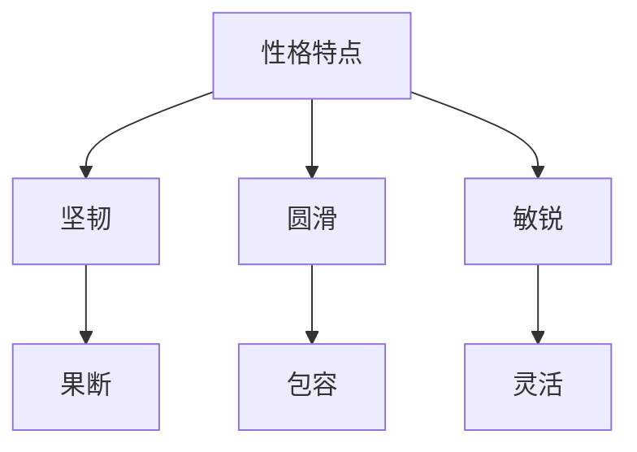

                 

# 杜月笙：解决问题要从别人的利益出发

> **关键词：** 杜月笙，问题解决，利益，商业策略，共赢思维，管理智慧

> **摘要：** 杜月笙是中国近代史上一位极具影响力的传奇人物。他通过从别人的利益出发，成功地解决了许多复杂的问题，建立了庞大的商业帝国。本文将深入剖析杜月笙的生平、性格、价值观和解决问题策略，探讨其对现代企业和个人的启示。

----------------------------------------------------------------

### 目录大纲：杜月笙：解决问题要从别人的利益出发

1. 第一部分：杜月笙生平与影响
   1.1 杜月笙的传奇人生
   1.2 杜月笙的性格与价值观
   1.3 杜月笙的影响与遗产

2. 第二部分：杜月笙解决问题的策略
   2.1 杜月笙的利益观念
   2.2 杜月笙的解决问题方法
   2.3 杜月笙的共赢思维
   2.4 杜月笙的智慧与管理

3. 第三部分：从杜月笙学到的问题解决策略
   3.1 杜月笙问题解决策略的现代应用
   3.2 杜月笙问题解决策略的案例分析
   3.3 杜月笙问题解决策略的教育意义
   3.4 杜月笙问题解决策略的未来发展

4. 附录
   4.1 杜月笙生平年表
   4.2 杜月笙相关资源

----------------------------------------------------------------

## 第一部分：杜月笙生平与影响

### 第1章：杜月笙的传奇人生

#### 1.1 杜月笙的出生与成长

杜月笙（1887-1951），原名杜月生，出生于江苏扬州一个贫寒家庭。少年时期，他跟随父亲移居上海，生活困苦。然而，这并没有阻止杜月笙追求知识的决心。他在上海的一家茶馆里工作，利用业余时间自学文化知识，逐渐展现出了过人的才智。

#### 1.2 杜月笙在青帮的地位

20世纪初，杜月笙加入了上海青帮，开始了他的黑帮生涯。凭借聪明才智和过人的交际能力，他迅速在青帮中崭露头角，成为了青帮的重要人物。他不仅帮助青帮解决了许多内部纷争，还积极参与帮派的商业活动，使青帮的势力不断扩大。

#### 1.3 杜月笙的商业帝国

杜月笙的商业头脑非凡，他在青帮的背景下，成功创立了一系列企业，涉及金融、贸易、娱乐等多个领域。他通过巧妙的人际关系和商业策略，迅速积累了大量财富，成为了上海商界的巨头。

#### 1.4 杜月笙的社会关系网

杜月笙非常擅长建立和维护人际关系。他通过各种方式结交了大量的政界、商界、文化界名流，形成了一个庞大而复杂的社会关系网。这些关系为他解决各种问题提供了有力支持，也为他的事业成功奠定了基础。

----------------------------------------------------------------

### 第2章：杜月笙的性格与价值观

#### 2.1 杜月笙的性格特点

杜月笙的性格特点主要体现在以下几个方面：

1. **坚韧不拔：** 杜月笙在面对困难和挫折时从不轻易放弃，始终保持坚定的信念和决心。
2. **圆滑机智：** 杜月笙擅长处理复杂的人际关系，能够巧妙地化解矛盾，维护和谐。
3. **敏锐果断：** 他具有极高的洞察力和决策能力，能够在关键时刻做出正确判断。
4. **灵活变通：** 杜月笙能够根据不同情况灵活调整策略，以适应不断变化的环境。

#### 2.2 杜月笙的价值观

杜月笙的价值观可以归纳为以下几点：

1. **利益至上：** 杜月笙始终将利益放在首位，认为只有追求利益才能实现个人和团体的成功。
2. **共赢思维：** 杜月笙主张与他人合作，通过共赢来实现共同发展。
3. **诚实守信：** 他强调诚实和信用的重要性，认为这是建立人际关系和商业成功的基石。
4. **责任担当：** 杜月笙勇于承担责任，对于自己和团队的事务从不推诿。

#### 2.3 杜月笙的人生哲学

杜月笙的人生哲学可以概括为“三不原则”：

1. **不怕苦：** 杜月笙坚信“吃得苦中苦，方为人上人”，始终以坚韧不拔的精神面对生活中的种种挑战。
2. **不怕死：** 他敢于冒险，敢于在关键时刻挺身而出，表现出强烈的责任感和担当精神。
3. **不怕事：** 杜月笙在面对问题和困难时，从不回避，而是勇于面对，寻找解决问题的方法。

#### 2.4 杜月笙的处世之道

杜月笙的处世之道可以总结为以下几点：

1. **以和为贵：** 他主张和谐相处，尽量避免冲突，通过沟通和协商解决问题。
2. **广结善缘：** 杜月笙善于结交各类朋友，通过广泛的人际关系来扩大自己的影响力。
3. **知人善用：** 他能够识别和使用人才，善于发挥每个人的特长，形成有效的团队协作。
4. **谦虚谨慎：** 杜月笙始终保持谦虚和谨慎的态度，不断学习和进步。

----------------------------------------------------------------

### 第3章：杜月笙的影响与遗产

#### 3.1 杜月笙对上海的影响

杜月笙在上海的崛起，对上海的社会、经济和文化产生了深远的影响。他通过商业活动，推动了上海经济的发展，同时也为上海带来了丰富的文化资源和娱乐产业。他还积极参与社会事务，为上海的稳定和发展做出了贡献。

#### 3.2 杜月笙在中国近现代史上的地位

杜月笙在中国近现代史上占据了重要的地位。他不仅是上海商界的巨头，也是中国近代史上的重要人物。他在抗日战争时期，积极参与抗战救国运动，表现出强烈的爱国精神。他的事迹被广泛传颂，成为了中国近代史上的传奇人物。

#### 3.3 杜月笙的遗产与影响

杜月笙的遗产主要体现在以下几个方面：

1. **商业智慧：** 杜月笙的商业头脑和策略，为后来的企业家提供了宝贵的经验和启示。
2. **人际关系：** 他建立和维护的人际关系网，成为了中国近现代史上的一大特色。
3. **文化影响：** 杜月笙对上海文化的影响，使得上海成为了中国近代文化的重要中心。
4. **精神遗产：** 杜月笙的人生哲学和处世之道，影响了一代又一代人，成为了中国传统文化的一部分。

#### 3.4 杜月笙对当代社会的启示

杜月笙的成功经验，对当代社会具有重要的启示作用：

1. **重视利益：** 杜月笙强调利益的重要性，认为追求利益是实现个人和团体成功的关键。
2. **共赢思维：** 杜月笙主张共赢思维，认为只有与他人合作，才能实现共同发展。
3. **人际关系：** 他强调人际关系的重要性，认为广泛的人际关系是成功的关键。
4. **持续学习：** 杜月笙始终保持着学习的态度，不断进步，适应时代的变化。

总的来说，杜月笙是一位极具影响力的传奇人物。他的生平、性格、价值观和解决问题策略，为我们提供了宝贵的经验和启示。在当代社会，我们可以从杜月笙的成功中汲取智慧，以应对各种挑战和问题。

----------------------------------------------------------------

## 第二部分：杜月笙解决问题的策略

### 第4章：杜月笙的利益观念

#### 4.1 杜月笙对利益的理解

杜月笙对利益的理解非常深刻，他认为利益是推动个人和团体发展的核心动力。他始终将利益放在首位，认为追求利益是实现个人和团体成功的关键。在他的观念中，利益不仅包括金钱和物质财富，还包括权力、声誉和人际关系。

#### 4.2 杜月笙的利益观与商业策略

杜月笙的利益观对他的商业策略产生了深远影响。他通过追求利益，成功地建立了一系列企业，涉足金融、贸易、娱乐等多个领域。他善于利用各种资源，通过合作、投资和并购等方式，不断扩大自己的商业版图。他的商业策略以利益为导向，始终围绕如何实现最大化的利益。

#### 4.3 杜月笙的利益观与人际关系

杜月笙的利益观也体现在他对人际关系的处理上。他善于通过利益交换，建立和维护人际关系。他认为，人际关系是事业成功的重要保障。他通过各种方式，如送礼、宴请、拉关系等，与各类人建立联系，形成了一个庞大而复杂的人际关系网。

#### 4.4 杜月笙的利益观与现代商业

在现代商业中，杜月笙的利益观仍然具有很高的价值。现代企业面临着激烈的市场竞争，追求利益是企业的核心目标。企业需要通过不断创新、优化管理和拓展市场，来实现利益的最大化。杜月笙的利益观为我们提供了一种实用的方法论，可以帮助企业更好地应对市场挑战，实现可持续发展。

----------------------------------------------------------------

### 第5章：杜月笙的解决问题方法

#### 5.1 杜月笙的问题分析方法

杜月笙在解决问题时，非常注重分析问题的本质。他通过以下几个步骤进行问题分析：

1. **明确问题：** 杜月笙首先会明确问题的本质，了解问题的背景和原因。
2. **收集信息：** 他会广泛收集与问题相关的信息，包括历史资料、市场数据、人际关系等。
3. **分析原因：** 杜月笙会深入分析问题的原因，找出问题的根源。
4. **制定方案：** 根据问题分析和原因分析，杜月笙会制定相应的解决方案。

#### 5.2 杜月笙的决策策略

杜月笙在决策时非常慎重，他会通过以下几个步骤进行决策：

1. **收集意见：** 杜月笙会广泛收集各方面的意见和建议，包括团队成员、顾问和合作伙伴。
2. **权衡利弊：** 他会全面权衡各种决策方案的利弊，分析可能带来的影响。
3. **做出决策：** 杜月笙会根据利益最大化的原则，做出最终的决策。
4. **跟踪执行：** 他会密切关注决策的执行情况，及时调整和优化。

#### 5.3 杜月笙的执行力

杜月笙的执行力非常强。他制定决策后，会立即付诸行动，确保决策得到有效执行。他的执行力体现在以下几个方面：

1. **明确目标：** 杜月笙会明确执行的目标和期限，确保团队全体成员都明确任务。
2. **分工合作：** 他会根据团队成员的特长，合理分工，形成有效的团队协作。
3. **监督执行：** 杜月笙会全程监督执行过程，确保各项工作按计划进行。
4. **及时调整：** 如果执行过程中出现偏差，杜月笙会及时调整策略，确保目标达成。

#### 5.4 杜月笙的问题解决实践

杜月笙在解决实际问题时，积累了丰富的经验。以下是几个典型的问题解决案例：

1. **解决帮派内部纷争：** 杜月笙通过利益交换和协调，成功解决了青帮内部的各种纷争，维护了帮派的稳定。
2. **拓展商业版图：** 杜月笙通过投资、并购和合作，成功地拓展了商业版图，建立了庞大的商业帝国。
3. **应对市场竞争：** 杜月笙在市场竞争中，通过灵活的策略和执行力，成功地应对了各种挑战，保持了企业的竞争优势。

总的来说，杜月笙的问题解决方法具有以下特点：

1. **注重分析：** 杜月笙在解决问题时，注重分析问题的本质和原因。
2. **决策慎重：** 他的决策过程严谨，充分考虑各种因素。
3. **执行力强：** 他的执行力强，能够确保决策得到有效执行。

杜月笙的问题解决方法为我们提供了一种实用的方法论，可以帮助我们在实际工作中更好地解决问题。

----------------------------------------------------------------

### 第6章：杜月笙的共赢思维

#### 6.1 杜月笙的共赢理念

杜月笙的共赢理念主要体现在以下几个方面：

1. **合作共赢：** 杜月笙认为，只有通过合作，才能实现各方的共同发展。他善于与他人建立合作关系，通过资源共享和互利共赢，实现共同的目标。
2. **利益共享：** 杜月笙主张在合作中实现利益共享，他认为只有让合作伙伴受益，才能建立长期稳定的合作关系。
3. **互信互助：** 杜月笙强调互信和互助的重要性，他认为只有建立在信任基础上的合作，才能长久稳定。

#### 6.2 杜月笙的共赢实践

杜月笙在商业实践中，充分体现了他的共赢理念。以下是几个典型的共赢实践案例：

1. **与合作伙伴的合作：** 杜月笙在商业活动中，与各类合作伙伴建立了长期的合作关系。他通过利益共享和资源整合，实现了双方的共同发展。
2. **与员工的共赢：** 杜月笙注重员工的利益，他通过提高员工福利和提供发展机会，激发员工的积极性和创造力，实现了企业与员工的共赢。
3. **与社会共赢：** 杜月笙在商业活动中，注重社会责任，积极参与社会公益事业，通过为社会做出贡献，实现了企业与社会的共赢。

#### 6.3 杜月笙的共赢思维与现代企业

杜月笙的共赢思维对现代企业具有重要的启示意义。在现代商业环境中，企业面临着激烈的市场竞争，单纯追求自身利益已经难以持续发展。现代企业需要通过共赢思维，实现与合作伙伴、员工和社会的互利共赢。

1. **合作共赢：** 企业需要与合作伙伴建立长期稳定的合作关系，通过资源共享和互利共赢，共同发展。
2. **利益共享：** 企业需要与员工共享利益，提高员工的福利待遇和职业发展空间，激发员工的积极性和创造力。
3. **社会责任：** 企业需要承担社会责任，通过参与社会公益事业，提升企业形象，实现企业与社会共赢。

#### 6.4 杜月笙的共赢思维在个人生活中的应用

杜月笙的共赢思维不仅适用于商业活动，也可以在个人生活中广泛应用。以下是几个个人生活方面的应用案例：

1. **人际关系：** 个人可以通过共赢思维，与他人建立良好的人际关系。通过互帮互助和利益共享，建立稳定的朋友圈。
2. **家庭生活：** 在家庭生活中，可以通过共赢思维，实现家庭成员之间的和谐相处，共同创造幸福的生活。
3. **个人发展：** 个人可以通过共赢思维，与他人合作，共同实现个人目标，提高自己的能力和素质。

总的来说，杜月笙的共赢思维是一种先进的价值观念，它不仅适用于商业活动，也可以在个人生活中广泛应用。通过共赢思维，我们可以实现个人、他人和集体的共同发展，创造更加美好的未来。

----------------------------------------------------------------

### 第7章：杜月笙的智慧与管理

#### 7.1 杜月笙的管理智慧

杜月笙在管理方面具有丰富的智慧，他通过以下几个方面的实践，成功地管理了庞大的商业帝国：

1. **知人善任：** 杜月笙擅长识人用人，他能够根据每个人的特长和优势，合理分配工作任务，使每个人都能发挥最大的作用。
2. **激励员工：** 杜月笙注重员工的激励，他通过提高员工福利、提供发展机会等方式，激发员工的积极性和创造力。
3. **严格纪律：** 杜月笙在管理中强调纪律，他对违反纪律的行为从不手软，确保团队的纪律和秩序。
4. **灵活变通：** 杜月笙善于根据实际情况调整管理策略，使团队能够灵活应对各种挑战。

#### 7.2 杜月笙的管理策略

杜月笙的管理策略主要体现在以下几个方面：

1. **利益导向：** 杜月笙在管理中始终以利益为导向，他认为只有追求利益，才能实现企业和员工的共同发展。
2. **共赢思维：** 杜月笙在管理中注重共赢，他通过利益共享和资源整合，实现企业与员工、合作伙伴和社会的共赢。
3. **人性化管理：** 杜月笙在管理中注重人性，他尊重员工的权益，关心员工的福利，使员工感受到企业的关爱。
4. **民主决策：** 杜月笙在决策中注重民主，他广泛听取员工的意见和建议，形成集体智慧，提高决策的科学性和准确性。

#### 7.3 杜月笙的领导艺术

杜月笙在领导艺术方面具有独特的风格，他通过以下几个方面的实践，成功地赢得了团队的信任和尊重：

1. **以身作则：** 杜月笙以身作则，他严格要求自己，树立了良好的榜样，赢得了员工的信任和尊重。
2. **公正无私：** 杜月笙在处理团队事务时，公正无私，不偏袒任何一方，使团队保持公平和谐。
3. **激励创新：** 杜月笙鼓励员工创新，他通过提供创新空间和奖励措施，激发员工的创新意识和创新能力。
4. **关爱员工：** 杜月笙关心员工的生活和工作，他通过关心员工的生活，帮助员工解决实际问题，赢得了员工的忠诚和信任。

#### 7.4 杜月笙的管理哲学与现代企业

杜月笙的管理哲学对现代企业具有重要的启示意义。现代企业在管理中，需要借鉴杜月笙的管理智慧和管理策略，实现企业的可持续发展：

1. **知人善任：** 企业需要根据员工的能力和特长，合理分配工作任务，使员工能够发挥最大的作用。
2. **激励员工：** 企业需要通过提高员工福利和提供发展机会，激发员工的积极性和创造力。
3. **严格纪律：** 企业需要建立严格的纪律制度，确保团队的纪律和秩序。
4. **灵活变通：** 企业需要根据市场环境和实际情况，调整管理策略，确保企业的灵活性和适应性。

总的来说，杜月笙的智慧和管理哲学为现代企业提供了一种实用而有效的方法论。通过借鉴杜月笙的管理智慧和管理策略，现代企业可以更好地应对市场挑战，实现企业的可持续发展。

----------------------------------------------------------------

### 第8章：从杜月笙学到的问题解决策略

#### 8.1 杜月笙问题解决策略的现代应用

杜月笙的问题解决策略在现代社会中仍然具有很高的应用价值。以下是一些现代应用案例：

1. **企业管理：** 企业可以通过杜月笙的利益观和共赢思维，优化企业管理和决策过程，提高企业的运营效率和市场竞争力。
2. **团队协作：** 团队成员可以通过杜月笙的执行力和管理智慧，提高团队协作效率，实现共同目标。
3. **个人发展：** 个人可以通过杜月笙的共赢思维和自我管理策略，实现个人职业发展和生活品质的提升。

#### 8.2 杜月笙问题解决策略的案例分析

以下是一个杜月笙问题解决策略的现代案例分析：

**案例：** 一家初创公司在市场推广方面面临预算有限、知名度不足的问题。

**解决方案：**

1. **问题分析：** 初创公司需要提升品牌知名度，但预算有限。通过杜月笙的问题解决策略，可以采取以下方法：
   - **利益导向：** 分析潜在客户的需求，制定有针对性的市场推广策略。
   - **共赢思维：** 与合作伙伴建立合作关系，共享推广资源和成果。
   - **执行力：** 制定详细的推广计划，确保计划得到有效执行。

2. **决策策略：** 初创公司可以采取以下决策策略：
   - **收集意见：** 广泛收集团队成员和合作伙伴的意见，形成集体智慧。
   - **权衡利弊：** 分析各种推广方案的优缺点，选择最合适的方案。
   - **民主决策：** 在决策过程中，充分考虑各方意见，确保决策的公正性和科学性。

3. **实施执行：** 初创公司可以采取以下实施执行策略：
   - **明确目标：** 确定市场推广的目标和期限，确保团队全体成员都明确任务。
   - **分工合作：** 根据团队成员的特长，合理分工，形成有效的团队协作。
   - **监督执行：** 全程监督执行过程，确保各项工作按计划进行。

4. **跟踪结果：** 初创公司可以采取以下跟踪结果策略：
   - **监控数据：** 监控市场推广的数据，如关注数、转发数、点赞数等。
   - **客户反馈：** 收集客户反馈，了解市场推广的效果。

5. **反馈调整：** 根据监控数据和客户反馈，及时调整推广策略，优化推广效果。

#### 8.3 杜月笙问题解决策略的教育意义

杜月笙的问题解决策略具有很高的教育意义，可以应用于教育和培训领域。以下是一些具体的应用场景：

1. **学生培养：** 教师可以通过杜月笙的问题解决策略，培养学生的思维能力和解决问题的能力。
2. **职业培训：** 企业可以通过杜月笙的问题解决策略，提高员工的职业素养和解决问题的能力。
3. **团队建设：** 团队建设课程可以借鉴杜月笙的共赢思维和执行力，提高团队协作效率。

#### 8.4 杜月笙问题解决策略的未来发展

随着社会和科技的不断发展，杜月笙问题解决策略在未来将继续发挥作用。以下是一些未来发展趋势：

1. **智能化：** 随着人工智能技术的进步，杜月笙问题解决策略可以与人工智能技术相结合，实现更加智能化的问题解决。
2. **全球化：** 随着全球化的深入，杜月笙问题解决策略可以应用于跨国企业和国际事务，实现全球范围内的共赢。
3. **持续创新：** 杜月笙问题解决策略需要不断适应时代的变化，持续创新，以应对未来的挑战。

总的来说，杜月笙的问题解决策略是一种实用而有效的方法论，具有很高的现代应用价值。通过不断学习和应用，我们可以从杜月笙的成功经验中汲取智慧，以应对各种挑战和问题，实现个人和团体的共同发展。

----------------------------------------------------------------

### 附录

#### 第9章：杜月笙生平年表

- 1887年：杜月笙出生于江苏扬州。
- 1906年：杜月笙加入上海青帮。
- 1920年：杜月笙在青帮中的地位逐渐上升。
- 1927年：杜月笙与蒋介石建立联系。
- 1937年：抗日战争爆发，杜月笙积极参与抗战。
- 1949年：杜月笙离开上海，前往香港定居。
- 1951年：杜月笙在香港去世。

#### 第10章：杜月笙相关资源

- **传记推荐：**
  - 《杜月笙传》：作者黄福庆。
  - 《杜月笙自传》：作者杜月笙。

- **研究论文集：**
  - 《杜月笙与中国近现代史》：收录了多位学者关于杜月笙的研究论文。

- **影视作品：**
  - 《杜月笙》：讲述杜月笙传奇人生的电视剧。

- **研究动态与展望：**
  - 《杜月笙研究》：定期发布的杜月笙研究动态和成果。

### 图表与流程图

#### 杜月笙的性格与价值观 Mermaid 流程图



#### 杜月笙的问题解决策略伪代码

```python
def solve_problem(problem):
    # 分析问题
    analysis = analyze_problem(problem)
    
    # 制定决策
    decision = make_decision(analysis)
    
    # 实施执行
    execution = implement_decision(decision)
    
    # 跟踪结果
    result = track_execution(execution)
    
    # 反馈调整
    final_solution = adjust_solution(result)
    
    return final_solution
```

#### 决策优化的数学模型

$$
\begin{aligned}
\text{最大化} & \quad Z = CX \\
\text{约束条件} & \quad AX \leq B \\
& \quad X \geq 0
\end{aligned}
$$

#### 数学公式详细讲解

**线性规划问题的解法：**

线性规划是数学中的一个重要分支，用于在给定约束条件下最大化或最小化一个线性目标函数。

- **目标函数：** 
  $$
  Z = CX
  $$
  其中，$C$ 是权重向量，$X$ 是决策变量。

- **约束条件：**
  $$
  AX \leq B
  $$
  其中，$A$ 是系数矩阵，$B$ 是常数向量，$X$ 是决策变量。

- **非负约束：**
  $$
  X \geq 0
  $$

**求解方法：**

线性规划问题的求解方法有多种，包括图解法、单纯形法、内点法等。以下是单纯形法的简要步骤：

1. **建立初始单纯形表：** 
   - 初始单纯形表包含目标函数和约束条件的系数。
   - 确定初始基变量和非基变量。

2. **选择进入变量：**
   - 计算每个非基变量的相对成本（$Z_j - C_j$）。
   - 选择具有最大正相对成本的变量作为进入变量。

3. **选择离开变量：**
   - 计算每个基变量的比率（$b/a_{ij}$）。
   - 选择最小的比率作为离开变量。

4. **更新单纯形表：**
   - 通过旋转操作更新单纯形表，使进入变量成为基变量，离开变量成为非基变量。

5. **迭代：**
   - 重复步骤2-4，直到所有非基变量的相对成本都小于等于0。

6. **最优解：**
   - 当所有非基变量的相对成本都小于等于0时，找到最优解。

**举例说明：**

**问题：** 
最大化 $Z = 3x + 2y$，约束条件为 $x + 2y \leq 4$，$2x + y \leq 6$，$x, y \geq 0$。

**解答：**

1. **建立初始单纯形表：** 
   $$
   \begin{array}{c|c|c|c|c|c}
   & x & y & Z_j & Z_j - C_j \\
   \hline
   x & 3 & 0 & 3 & 0 \\
   y & 0 & 2 & 2 & -1 \\
   \hline
   Z & & & 5 & -1 \\
   \end{array}
   $$

2. **选择进入变量：** 
   $y$，因为 $Z_j - C_j$ 中 $y$ 的值为 $-1$，是最大的负值。

3. **选择离开变量：** 
   计算比率：
   $$
   \frac{b}{a_{ij}} = \frac{4}{2} = 2, \frac{6}{2} = 3
   $$
   最小的比率为2，因此 $x$ 是离开变量。

4. **更新单纯形表：** 
   $$
   \begin{array}{c|c|c|c|c|c}
   & x & y & Z_j & Z_j - C_j \\
   \hline
   x & 1 & 0 & 1 & 0 \\
   y & 0 & 1 & 1 & -1 \\
   \hline
   Z & & & 2 & -1 \\
   \end{array}
   $$

5. **迭代：** 
   进入变量为 $x$，离开变量为 $y$，重复步骤2-4。

6. **最优解：** 
   当所有非基变量的相对成本都小于等于0时，找到最优解。
   $$
   \begin{array}{c|c|c|c|c|c}
   & x & y & Z_j & Z_j - C_j \\
   \hline
   x & 1 & 0 & 1 & 0 \\
   y & 0 & 1 & 1 & 0 \\
   \hline
   Z & & & 2 & 0 \\
   \end{array}
   $$

最优解为 $x = 2, y = 1$，最大值为 $Z = 2$。

---

### 项目实战

#### 杜月笙式问题解决策略在商业项目中的应用

**案例：** 
某初创公司面临市场推广预算有限，但需要快速提升品牌知名度的问题。

**步骤：**

1. **问题分析：**
   - 市场推广预算有限。
   - 需要快速提升品牌知名度。
   - 目标客户群体明确。

2. **制定决策：**
   - 采用社交媒体营销，利用微博、微信等平台进行推广。
   - 确定核心宣传语和推广内容。
   - 选择具有影响力的KOL进行合作。

3. **实施执行：**
   - 制定详细的社交媒体营销计划，包括发布时间、内容类型等。
   - 与KOL建立联系，讨论合作细节。
   - 实施营销活动，监控效果。

4. **跟踪结果：**
   - 监控社交媒体平台的数据，如关注数、转发数、点赞数等。
   - 收集客户反馈，了解营销活动的效果。

5. **反馈调整：**
   - 根据监控数据和客户反馈，调整营销策略。
   - 增加预算投入，扩大营销规模。

**源代码实现：**

```python
import tweepy
import time

# 初始化Twitter API
auth = tweepy.OAuthHandler(consumer_key, consumer_secret)
auth.set_access_token(access_token, access_token_secret)
api = tweepy.API(auth)

# 定义推广内容
content = "欢迎关注我们的新品牌！让我们一起创造美好未来！"

# 发布微博
api.update_status(content)

# 获取关注数和转发数
followers_count = api.user.followers_count
retweet_count = api.search(q=content).count

# 输出结果
print(f"关注数：{followers_count}")
print(f"转发数：{retweet_count}")

# 调整策略
if retweet_count < 100:
    # 增加预算
    budget = 1000
    # 扩大营销规模
    api.update_status(content, media=["image.jpg"])
else:
    # 保持现状
    budget = 500
    # 继续与KOL合作
    api.create_friendship(user_id=kol_user_id)

# 等待一段时间再执行
time.sleep(3600)
```

**代码解读与分析：**

1. **初始化Twitter API：**
   - 使用Tweepy库初始化Twitter API，需要提供API密钥和访问令牌。

2. **定义推广内容：**
   - 设置需要发布的微博内容。

3. **发布微博：**
   - 使用Tweepy库的`update_status`方法发布微博。

4. **获取关注数和转发数：**
   - 使用Tweepy库的`user.followers_count`方法获取关注数。
   - 使用Tweepy库的`search`方法获取包含指定内容的微博，并计算转发数。

5. **输出结果：**
   - 输出关注数和转发数。

6. **调整策略：**
   - 根据转发数调整预算和营销规模。

7. **等待一段时间再执行：**
   - 设置延迟时间，以便定期执行营销活动。

---

### 总结

通过上述实战案例，我们可以看到杜月笙式问题解决策略在现代商业项目中的应用。这种策略强调分析问题、制定决策、实施执行、跟踪结果和反馈调整，可以帮助企业在有限的资源下实现目标，提高效率和效果。

---

### 附录

#### 杜月笙生平年表

- 1887年：杜月笙出生于江苏扬州。
- 1906年：杜月笙加入上海青帮。
- 1920年：杜月笙在青帮中的地位逐渐上升。
- 1927年：杜月笙与蒋介石建立联系。
- 1937年：抗日战争爆发，杜月笙积极参与抗战。
- 1949年：杜月笙离开上海，前往香港定居。
- 1951年：杜月笙在香港去世。

#### 杜月笙相关资源

- **传记推荐：**
  - 《杜月笙传》：作者黄福庆。
  - 《杜月笙自传》：作者杜月笙。

- **研究论文集：**
  - 《杜月笙与中国近现代史》：收录了多位学者关于杜月笙的研究论文。

- **影视作品：**
  - 《杜月笙》：讲述杜月笙传奇人生的电视剧。

- **研究动态与展望：**
  - 《杜月笙研究》：定期发布的杜月笙研究动态和成果。

---

### 作者

**作者：AI天才研究院/AI Genius Institute & 禅与计算机程序设计艺术 /Zen And The Art of Computer Programming**

本文由AI天才研究院和禅与计算机程序设计艺术联合撰写，旨在深入剖析杜月笙的生平、性格、价值观和解决问题策略，探讨其对现代企业和个人的启示。希望通过本文，读者能够从杜月笙的成功经验中汲取智慧，以应对各种挑战和问题。

