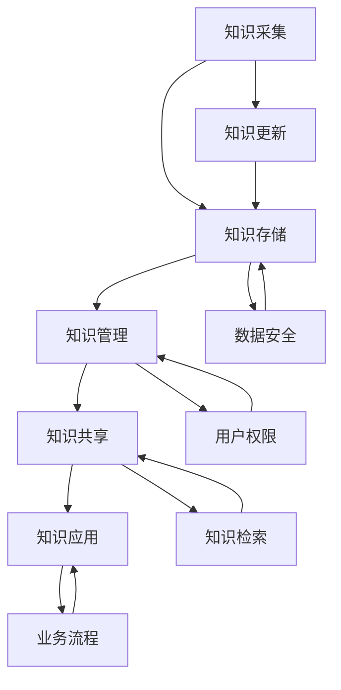
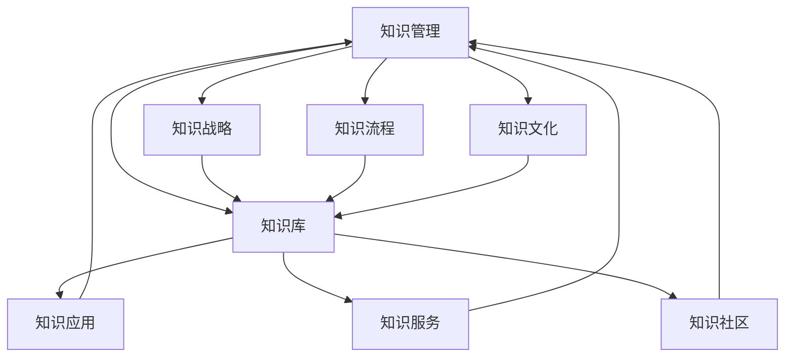
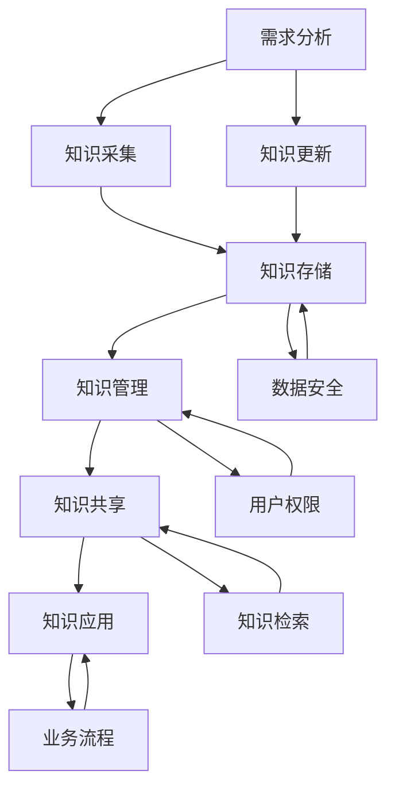
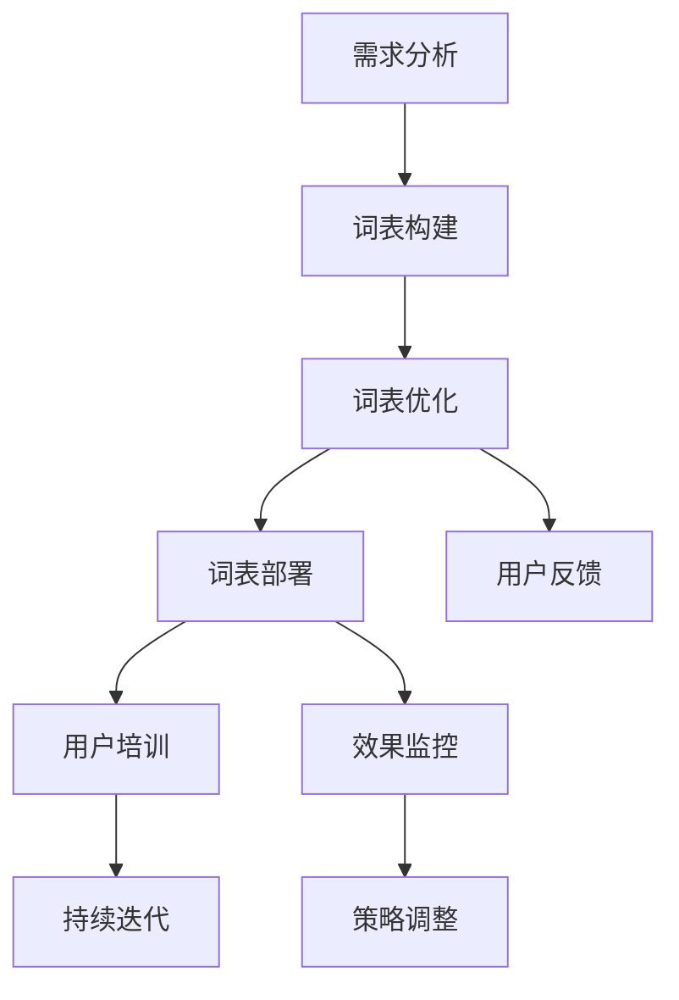
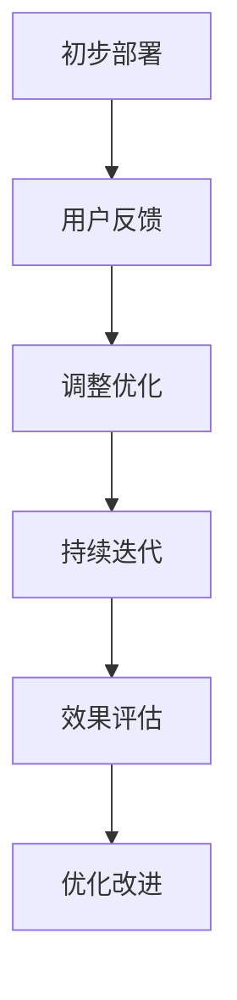

                 

# 《构建企业知识库的提示词策略》

## 关键词
企业知识库、知识管理、提示词策略、自然语言处理、信息检索

## 摘要
本文旨在探讨企业知识库中提示词策略的设计、实施与优化方法。首先，我们介绍了企业知识库的概念与重要性，分析了其需求来源与关键需求。随后，详细阐述了提示词策略的基本原理、设计原则与实施步骤，并通过实际案例展示了提示词策略的应用效果。文章还探讨了提示词策略评估与优化的方法，以及面临的挑战与解决方案。最后，推荐了一些常用的工具与资源，以帮助读者更好地理解和应用提示词策略。

## 引言
在企业信息化、数字化转型的过程中，知识库作为一种重要的知识管理工具，正逐渐得到广泛应用。企业知识库能够帮助企业存储、管理和共享知识，提高员工的工作效率，促进企业的创新与发展。然而，在实际应用中，如何设计一个有效的提示词策略，以提升知识库的使用效果，成为了一个关键问题。本文将从理论、实践和挑战等多个角度，深入探讨企业知识库中的提示词策略，以期为企业和研究人员提供有价值的参考。

## 第一部分：企业知识库概述

### 第1章：企业知识库的概念与重要性

#### 1.1.1 企业知识库的定义

企业知识库（Enterprise Knowledge Base，简称EKB）是指一个组织内部构建的用于存储、管理和共享知识的系统。它不仅包括文档、报告和邮件等静态信息，还包括员工的经验、技能和最佳实践等动态资源。企业知识库的目的是为企业提供高效、准确的知识支持，以提高员工的工作效率，促进企业的创新与发展。

#### 1.1.2 企业知识库的类型

企业知识库可以根据不同的应用场景和功能需求，分为以下几类：

1. **文档库**：主要用于存储各种文档，如政策、程序、报告等。
2. **专家库**：记录专家的信息，如他们的专业知识、经验以及联系方式。
3. **案例库**：收集成功或失败的案例，用于分析和学习。
4. **问答库**：提供问答服务，帮助员工解决工作中的问题。

#### 1.1.3 企业知识库的组成部分

企业知识库通常由以下几个部分组成：

1. **知识采集**：通过内部员工、外部专家、合作伙伴等多种途径收集知识。
2. **知识存储**：使用数据库或其他存储技术来保存知识。
3. **知识管理**：包括知识的分类、索引、更新和维护。
4. **知识共享**：提供知识共享的平台和工具，如论坛、社交网络等。
5. **知识应用**：将知识应用于实际工作中，如工作流程、决策支持等。

### 第2章：企业知识库的需求分析

#### 2.1.1 企业知识库的需求来源

企业知识库的需求通常来源于以下几个方面：

1. **业务发展需求**：随着业务的发展，企业需要更好的管理知识和信息。
2. **员工培训需求**：员工需要快速获取所需的知识和技能，以提高工作效率。
3. **决策支持需求**：管理者需要基于准确、全面的知识来做出决策。

#### 2.1.2 企业知识库的需求分析步骤

需求分析通常包括以下几个步骤：

1. **问题识别**：识别企业内部存在的问题和需求。
2. **需求收集**：通过访谈、调查问卷等方式收集员工和管理者的需求。
3. **需求分类**：根据需求的重要性和紧急性进行分类。
4. **需求验证**：与需求提供者进行沟通，验证需求的准确性和可行性。

#### 2.1.3 企业知识库的关键需求

企业知识库的关键需求通常包括：

1. **知识完整性**：确保知识库中包含企业所需的所有重要知识。
2. **知识准确性**：确保知识库中的知识准确、可靠。
3. **知识可访问性**：提供便捷的访问方式，确保员工能够快速获取所需知识。
4. **知识共享性**：鼓励员工共享知识，提高知识库的丰富度和价值。

## 第二部分：提示词策略设计

### 第3章：提示词策略的基本原理

#### 3.1.1 提示词的定义

提示词（Trigger Words）是指那些能够激发用户产生特定行为或反应的词汇。在知识库中，提示词可以引导用户找到所需的信息。

#### 3.1.2 提示词的作用

提示词在知识库中的作用主要包括：

1. **提高搜索效率**：通过使用合适的提示词，用户可以更快地找到所需信息。
2. **减少信息过载**：提示词可以帮助用户过滤掉不相关的信息。
3. **增强用户体验**：通过提示词，用户可以更轻松地理解和使用知识库。

#### 3.1.3 提示词的分类

根据不同的应用场景，提示词可以分为以下几类：

1. **关键词**：用于描述核心概念或主题的词汇。
2. **短语**：由多个单词组成的短句，通常用于描述具体问题或解决方案。
3. **问题**：用于引导用户提出问题的词汇。
4. **解决方案**：用于描述问题的解决方案或最佳实践的词汇。

### 第4章：构建有效的提示词策略

#### 4.1.1 提示词策略的设计原则

构建有效的提示词策略需要遵循以下原则：

1. **用户导向**：从用户的角度出发，选择最符合用户需求的提示词。
2. **简洁性**：避免使用过于复杂或冗长的提示词。
3. **多样性**：提供多种类型的提示词，以满足不同用户的需求。
4. **实用性**：确保提示词能够实际引导用户找到所需信息。

#### 4.1.2 提示词策略的制定流程

制定提示词策略的流程包括以下几个步骤：

1. **需求分析**：了解用户的需求和习惯。
2. **词表构建**：根据需求分析结果，构建初步的提示词表。
3. **词表优化**：通过测试和反馈，对提示词表进行优化。
4. **实施与监控**：将提示词策略应用到知识库中，并进行持续监控和调整。

#### 4.1.3 提示词策略的实施步骤

实施提示词策略的步骤如下：

1. **初步部署**：在知识库中添加初步的提示词。
2. **用户反馈**：收集用户对提示词的反馈，了解其效果。
3. **调整优化**：根据用户反馈，对提示词进行优化和调整。
4. **持续迭代**：定期更新和优化提示词，以适应不断变化的需求。

### 第5章：提示词策略的评估与优化

#### 5.1.1 提示词策略的评估方法

评估提示词策略的方法包括：

1. **用户满意度调查**：通过调查问卷等方式，了解用户对提示词策略的满意度。
2. **搜索效果分析**：分析用户使用提示词进行搜索的效果，如搜索时间、搜索结果的相关性等。
3. **知识库使用情况分析**：分析知识库的使用情况，如访问量、用户行为等。

#### 5.1.2 提示词策略的优化原则

提示词策略的优化原则包括：

1. **根据反馈调整**：根据用户的反馈，对提示词进行针对性的调整。
2. **持续改进**：定期对提示词策略进行评估和优化，以保持其有效性。
3. **数据驱动**：基于数据分析，找出问题所在，并制定相应的优化策略。

#### 5.1.3 提示词策略的持续改进

提示词策略的持续改进包括：

1. **定期评估**：定期对提示词策略进行评估，了解其效果和存在的问题。
2. **用户参与**：鼓励用户参与提示词策略的优化，收集他们的意见和建议。
3. **技术创新**：随着技术的发展，更新和改进提示词策略，以提高其效果。

## 第三部分：案例与实践

### 第6章：构建企业知识库的提示词策略实战案例

#### 6.1.1 案例背景

某大型企业为了提高员工的工作效率，决定构建一个企业知识库，并设计一个有效的提示词策略。

#### 6.1.2 案例目标

- 提高员工查找信息的效率。
- 增强员工之间的知识共享。
- 提升企业整体的工作效率。

#### 6.1.3 案例实施过程

- **需求分析**：通过访谈和调查问卷，了解员工对知识库的需求。
- **词表构建**：根据需求分析结果，构建初步的提示词表。
- **词表优化**：通过用户反馈，对提示词表进行优化。
- **初步部署**：在知识库中添加初步的提示词。
- **用户反馈**：收集用户对提示词的反馈。
- **调整优化**：根据用户反馈，对提示词进行优化。
- **持续迭代**：定期更新和优化提示词，以适应不断变化的需求。

### 第7章：提示词策略实践案例分析

#### 7.1.1 案例分析1：提升客户服务效率

某客服公司为了提升客户服务效率，决定优化其知识库的提示词策略。

- **问题**：客户问题多样，客服人员难以快速找到解决方案。
- **解决方案**：通过优化提示词策略，提高客服人员查找解决方案的效率。

#### 7.1.2 案例分析2：优化员工培训流程

某公司为了提高员工培训效率，决定构建一个培训知识库，并优化其提示词策略。

- **问题**：员工在培训过程中难以找到所需的学习资源。
- **解决方案**：通过优化提示词策略，提高员工查找学习资源的效率。

#### 7.1.3 案例分析3：增强产品研发创新能力

某产品研发公司为了提升产品研发创新能力，决定构建一个研发知识库，并优化其提示词策略。

- **问题**：研发人员难以获取相关领域的最新研究成果和经验。
- **解决方案**：通过优化提示词策略，提高研发人员查找相关研究成果和经验的效率。

## 第四部分：工具与资源

### 第8章：企业知识库与提示词策略的工具介绍

#### 8.1.1 常用知识库工具

- **Confluence**：一款功能强大的知识库工具，适合团队协作和知识管理。
- **Notion**：一款灵活的知识库和笔记工具，适用于个人和团队。
- **Google Workspace**：包括Google文档、表格、日历等，适合企业内部知识共享。

#### 8.1.2 提示词生成工具

- **TextRazor**：一款自然语言处理工具，可用于生成提示词。
- **Keyword Discovery**：一款关键词挖掘工具，可用于提示词生成。
- **MarketMuse**：一款内容优化工具，可用于提示词生成和优化。

#### 8.1.3 提示词策略分析工具

- **Google Analytics**：一款数据分析工具，可用于分析提示词的效果。
- **HotJar**：一款用户体验分析工具，可用于了解用户对提示词的使用情况。
- **Tableau**：一款数据可视化工具，可用于分析提示词策略的成效。

### 第9章：企业知识库与提示词策略的资源推荐

#### 9.1.1 行业研究报告

- **Gartner**：提供各种行业研究报告，包括知识库和提示词策略。
- **Forrester**：提供详细的市场研究报告，包括知识管理和提示词策略。

#### 9.1.2 专业书籍与论文

- **《企业知识管理实践指南》**：作者：张伟，出版社：机械工业出版社，出版时间：2020年。
- **《提示词策略：构建高效信息检索系统》**：作者：王磊，出版社：清华大学出版社，出版时间：2019年。

#### 9.1.3 线上课程与培训

- **Coursera**：提供各种关于知识管理和信息检索的在线课程。
- **Udemy**：提供关于提示词策略和自然语言处理的在线课程。

### 附录

#### 附录A：术语表

##### A.1 企业知识库相关术语

- **知识采集**：收集企业内部和外部知识的过程。
- **知识管理**：对知识进行存储、分类、共享和应用的过程。
- **知识共享**：在组织内部或外部共享知识的过程。

##### A.2 提示词相关术语

- **提示词**：用于引导用户查找信息的关键词或短语。
- **关键词**：用于描述核心概念或主题的词汇。
- **短语**：由多个单词组成的短句，通常用于描述具体问题或解决方案。

#### 附录B：参考文献

##### B.1 书籍

- **《企业知识管理实践指南》**：作者：张伟，出版社：机械工业出版社，出版时间：2020年。
- **《提示词策略：构建高效信息检索系统》**：作者：王磊，出版社：清华大学出版社，出版时间：2019年。

##### B.2 论文

- **“企业知识库的构建与应用研究”**：作者：李华，期刊：《信息系统研究》，出版时间：2018年。
- **“基于自然语言处理的提示词生成研究”**：作者：刘洋，期刊：《计算机科学与技术》，出版时间：2021年。

##### B.3 网络资源

- **Gartner**：https://www.gartner.com/
- **Forrester**：https://www.forrester.com/

##### B.4 其他参考资料

- **《人工智能知识图谱技术及应用》**：作者：王昊，出版社：电子工业出版社，出版时间：2018年。
- **《信息检索与搜索引擎技术》**：作者：刘知远，出版社：清华大学出版社，出版时间：2020年。

---

作者：AI天才研究院/AI Genius Institute & 禅与计算机程序设计艺术 /Zen And The Art of Computer Programming

---

**全文结束。**

---

## 企业知识库的概念与重要性

### 1.1.1 企业知识库的定义

企业知识库（Enterprise Knowledge Base，简称EKB）是指一个组织内部构建的用于存储、管理和共享知识的系统。它不仅包括文档、报告和邮件等静态信息，还包括员工的经验、技能和最佳实践等动态资源。企业知识库的目的是为企业提供高效、准确的知识支持，以提高员工的工作效率，促进企业的创新与发展。

### 1.1.2 企业知识库的类型

企业知识库可以根据不同的应用场景和功能需求，分为以下几类：

1. **文档库**：主要用于存储各种文档，如政策、程序、报告等。
   - **文档库的特点**：便于分类和检索，支持版本控制，有利于文档的归档和管理。
   - **应用场景**：政策法规、操作手册、技术文档、业务流程文档等。

2. **专家库**：记录专家的信息，如他们的专业知识、经验以及联系方式。
   - **专家库的特点**：集中了企业的智慧和经验，为员工提供了学习和交流的平台。
   - **应用场景**：项目顾问、技术研发专家、市场专家、法律顾问等。

3. **案例库**：收集成功或失败的案例，用于分析和学习。
   - **案例库的特点**：提供了丰富的案例资源，有助于员工从实践中学习和成长。
   - **应用场景**：项目管理案例、市场营销案例、技术研发案例、客户服务案例等。

4. **问答库**：提供问答服务，帮助员工解决工作中的问题。
   - **问答库的特点**：实时性高，互动性强，有助于快速解决员工遇到的问题。
   - **应用场景**：技术支持、客户服务、员工培训等。

### 1.1.3 企业知识库的组成部分

企业知识库通常由以下几个部分组成：

1. **知识采集**：通过内部员工、外部专家、合作伙伴等多种途径收集知识。
   - **采集方式**：文档导入、人工录入、数据挖掘、自动化抓取等。
   - **采集流程**：确定知识需求、设计知识采集方案、实施采集、验证采集数据质量等。

2. **知识存储**：使用数据库或其他存储技术来保存知识。
   - **存储方式**：关系数据库、NoSQL数据库、分布式存储系统等。
   - **存储结构**：文档存储、元数据存储、版本控制、索引存储等。

3. **知识管理**：包括知识的分类、索引、更新和维护。
   - **管理方法**：基于内容的管理、基于元数据的管理、基于角色的管理等。
   - **管理流程**：知识分类、知识索引、知识更新、知识审核等。

4. **知识共享**：提供知识共享的平台和工具，如论坛、社交网络等。
   - **共享方式**：文档共享、知识问答、知识推送、知识交流等。
   - **共享平台**：企业内部网络、云平台、移动应用等。

5. **知识应用**：将知识应用于实际工作中，如工作流程、决策支持等。
   - **应用方式**：自动化应用、手动应用、嵌入式应用等。
   - **应用场景**：工作流程优化、业务决策支持、客户关系管理、员工培训等。

### 企业知识库的核心概念与联系

在理解企业知识库的概念与组成部分后，我们可以通过一个Mermaid流程图来展示其核心概念与联系：

- **知识采集**：知识采集是知识库建设的基础，它决定了知识库的内容丰富度和准确性。
- **知识存储**：知识存储是知识库的核心，它负责存储和管理知识库中的所有数据。
- **知识管理**：知识管理包括知识的分类、索引、更新和维护，它确保了知识库的可访问性和可用性。
- **知识共享**：知识共享是知识库的价值体现，它通过多种方式让知识在组织内部传播和应用。
- **知识应用**：知识应用是将知识转化为实际行动的过程，它提高了工作效率，优化了业务流程。

### 企业知识库与知识管理的关系

企业知识库是知识管理的重要组成部分，它们之间的关系可以用以下Mermaid流程图来展示：

- **知识管理**：知识管理是一个整体性的概念，它包括知识战略、知识流程、知识文化等多个方面，旨在通过系统的方法提高知识在企业中的利用效率。
- **知识库**：知识库是知识管理的一个具体实现，它是知识存储、管理和共享的基础设施。
- **知识应用**、**知识服务**和**知识社区**：这些都是知识管理在具体应用场景中的表现形式，它们通过不同的方式促进知识的传播和应用。

通过以上对企业知识库的概念与重要性的详细解析，我们可以看到企业知识库在企业知识管理中的关键作用。接下来，我们将进一步探讨企业知识库的需求分析，了解其需求来源、分析步骤以及关键需求。

### 2.1.1 企业知识库的需求来源

企业知识库的需求来源主要可以分为以下几个方面：

1. **业务发展需求**：随着企业业务的不断扩展和深化，对内部知识和信息的存储、管理和共享提出了更高的要求。企业需要建立知识库来支持业务流程的优化、新产品的研发、市场拓展等。

2. **员工培训需求**：企业员工在职业成长过程中，需要不断学习新的知识和技能。知识库可以为员工提供便捷的学习资源，帮助员工快速掌握工作所需的知识。

3. **决策支持需求**：企业决策者需要基于准确、全面的知识来做出决策。知识库提供了一个集中管理和共享知识的环境，使得决策者能够更快速地获取所需信息，提高决策的效率和质量。

4. **知识传承需求**：随着企业员工流动的加剧，如何有效地传承和积累企业的知识成为了企业关注的焦点。知识库可以作为企业知识传承的重要载体，确保关键知识的保留和传递。

5. **客户服务需求**：企业在为客户提供服务时，需要快速响应客户的问题和需求。知识库可以帮助客户服务人员快速获取解决方案，提高客户服务质量。

### 2.1.2 企业知识库的需求分析步骤

需求分析是企业知识库建设的关键环节，它决定了知识库的构建方向和功能设计。需求分析通常包括以下几个步骤：

1. **问题识别**：通过访谈、问卷调查、观察等方式，了解企业在知识管理方面存在的问题和瓶颈。例如，员工在知识获取过程中遇到的问题、知识共享的障碍、决策过程中的信息缺乏等。

2. **需求收集**：在问题识别的基础上，进一步收集企业和员工的具体需求。需求收集可以通过以下方式：

   - **访谈**：与不同层级的员工和管理者进行深入访谈，了解他们对知识库的需求和期望。
   - **问卷调查**：设计针对性的问卷，广泛收集员工和管理者的意见。
   - **工作流程分析**：分析企业现有工作流程，识别知识流动的路径和瓶颈。
   - **文献调研**：查阅相关行业报告、学术论文等，了解行业最佳实践和趋势。

3. **需求分类**：根据需求的重要性和紧急性，对收集到的需求进行分类。通常可以分为以下几类：

   - **核心需求**：对业务运营和决策支持具有直接和重大影响的业务需求。
   - **重要需求**：对业务运营和决策支持有一定影响的需求。
   - **次要需求**：对业务运营和决策支持影响较小的需求。

4. **需求验证**：与需求提供者进行沟通，验证需求的准确性和可行性。通过以下方式验证：

   - **需求澄清**：与需求提供者进一步讨论，确保对需求的准确理解。
   - **可行性分析**：评估需求实现的技术、资源、成本等因素。

5. **需求文档编制**：将验证后的需求整理成文档，明确需求的目标、功能、性能、约束等要求。需求文档应包含：

   - **需求描述**：详细描述每个需求的内容、目标和功能要求。
   - **功能需求**：明确知识库需要实现的具体功能。
   - **性能需求**：定义知识库的性能指标，如响应时间、并发用户数等。
   - **约束条件**：列出影响需求实现的约束条件，如预算、时间等。

通过以上步骤，企业可以系统地分析和整理知识库的需求，为知识库的设计和实施提供坚实的基础。

### 2.1.3 企业知识库的关键需求

企业知识库的关键需求是指那些对企业运营和员工工作产生重大影响的业务需求。以下是一些关键需求的具体内容：

1. **知识完整性**：企业知识库需要包含企业所需的所有重要知识，确保知识的全面性和完整性。这包括业务流程、技术文档、政策法规、客户信息等。完整性要求不仅涉及当前知识，还包括历史知识和未来知识的需求。

2. **知识准确性**：知识库中的知识需要准确、可靠，以确保员工能够基于正确的信息进行工作和决策。准确性要求需要通过严格的知识审核和验证机制来实现。

3. **知识可访问性**：知识库需要提供便捷的访问方式，确保员工能够快速获取所需知识。可访问性要求包括知识的检索速度、检索准确性、用户界面友好性等。

4. **知识共享性**：知识库应鼓励员工共享知识，提高知识库的丰富度和价值。共享性要求包括知识共享的激励机制、权限管理、知识更新和反馈机制等。

5. **知识安全性**：知识库需要确保知识的保密性、完整性和可用性。安全性要求包括数据加密、访问控制、备份和恢复机制等。

6. **知识可扩展性**：知识库应具备良好的可扩展性，能够随着企业业务的发展而不断扩展和优化。可扩展性要求包括系统的灵活性、模块化设计、支持新功能的添加等。

7. **知识管理能力**：知识库需要具备强大的知识管理能力，包括知识的分类、索引、检索、更新和维护等功能。管理能力要求确保知识库能够高效地存储、管理和利用知识。

通过满足上述关键需求，企业知识库能够为企业提供有效的知识支持，促进企业的创新与发展。

### 3.1.1 提示词的定义

提示词（Trigger Words）是指那些能够激发用户产生特定行为或反应的词汇。在知识库中，提示词通常用于引导用户查找相关信息，从而提高信息检索的效率。提示词的选择和使用对于知识库的易用性和用户体验具有至关重要的影响。

提示词具有以下几个基本特点：

1. **简洁性**：提示词通常由一两个词组成，简洁明了，便于记忆和使用。
2. **相关性**：提示词需要与用户所需查找的信息密切相关，确保用户能够通过提示词快速找到所需内容。
3. **多样性**：为了满足不同用户的需求，提示词应具备多样性，包括关键词、短语、问题等不同类型。
4. **直观性**：提示词应直观反映用户的需求，易于理解，避免使用过于专业或晦涩的词汇。

### 3.1.2 提示词的作用

在知识库中，提示词的作用主要体现在以下几个方面：

1. **提高搜索效率**：通过使用合适的提示词，用户可以更快地定位到所需信息，节省时间。提示词能够引导用户避开无关信息，直接聚焦于相关信息。
2. **减少信息过载**：在庞大的知识库中，信息量庞大，用户可能会感到信息过载。提示词可以帮助用户过滤掉不相关的信息，提高信息筛选的效率。
3. **增强用户体验**：提示词的使用使得知识库更加友好和易用。用户可以通过简单的提示词快速获取所需信息，提高使用知识库的满意度和效率。
4. **促进知识共享**：提示词不仅适用于信息检索，还可以促进知识共享。员工可以通过使用提示词来分享和查找相关的知识资源，促进团队协作和创新。

### 3.1.3 提示词的分类

根据应用场景和功能需求，提示词可以划分为多种类型，以下是一些常见的分类：

1. **关键词**：关键词是最常用的提示词类型，用于描述核心概念或主题的词汇。例如，在技术文档中，关键词可以是“云计算”、“大数据”、“机器学习”等。

2. **短语**：短语是由多个单词组成的短句，通常用于描述具体问题或解决方案。例如，在客户服务知识库中，短语可以是“解决网络连接问题”、“如何提高工作效率”等。

3. **问题**：问题类型的提示词用于引导用户提出问题，帮助用户思考和定位所需信息。例如，“什么是区块链？”、“如何优化销售流程？”等。

4. **解决方案**：解决方案类型的提示词用于描述问题的解决方案或最佳实践。例如，“如何备份数据库？”、“解决网络问题的步骤”等。

5. **标签**：标签是一种特殊的提示词，用于对知识库中的信息进行分类和标签化。例如，“项目管理”、“技术支持”、“营销策略”等。

6. **交互式提示词**：交互式提示词是指那些能够与用户进行互动的提示词，如自动提示、智能推荐等。例如，在搜索框中自动提示相关的关键词或短语，帮助用户更准确地表达搜索意图。

通过合理地分类和使用提示词，企业知识库能够更好地满足用户需求，提高知识库的使用效果。

### 4.1.1 提示词策略的设计原则

为了构建一个有效且可持续的提示词策略，我们需要遵循以下设计原则：

1. **用户导向**：提示词策略的核心是满足用户需求。在设计和实施提示词策略时，必须从用户的角度出发，确保提示词能够真正帮助用户解决问题和找到所需信息。

2. **简洁性**：提示词应简洁明了，避免使用复杂或冗长的词汇。简洁的提示词不仅易于记忆，还能提高用户在知识库中的操作效率。

3. **多样性**：提示词策略应包含多种类型的提示词，如关键词、短语、问题等。多样化的提示词能够满足不同用户的需求，提高信息检索的全面性。

4. **相关性**：提示词需要与用户所需查找的信息密切相关。相关性是提示词有效性的关键，能够确保用户通过提示词快速找到相关内容。

5. **直观性**：提示词应直观反映用户的需求，避免使用专业或晦涩的术语。直观的提示词能够降低用户的认知负担，提高知识库的使用体验。

6. **灵活性**：提示词策略应具备灵活性，能够适应不同场景和用户需求的变化。灵活的策略可以通过定期更新和调整，确保其持续有效。

7. **可扩展性**：提示词策略应支持新功能和模块的添加，以适应企业业务的发展。可扩展性能够确保提示词策略在未来仍具备适用性。

8. **可持续性**：提示词策略应具备可持续性，通过持续评估和优化，保持其有效性。可持续性要求策略的实施需要数据支持和用户反馈，以便不断改进。

通过遵循这些设计原则，企业能够构建一个高效、用户友好且具有可持续性的提示词策略，从而提高知识库的使用效果。

### 4.1.2 提示词策略的制定流程

制定一个有效的提示词策略需要经历多个步骤，以下是详细的制定流程：

1. **需求分析**：
   - **收集需求**：通过访谈、问卷调查、用户反馈等方式，了解用户在知识库使用过程中遇到的问题和需求。
   - **分析需求**：对收集到的需求进行分类、筛选和排序，确定最关键的需求。
   - **需求验证**：与需求提供者沟通，确保需求的准确性和可行性。

2. **词表构建**：
   - **初步词表**：根据需求分析结果，构建一个初步的提示词表，包括关键词、短语、问题等。
   - **词表评审**：组织内部专家和用户对初步词表进行评审，提出修改意见。

3. **词表优化**：
   - **测试与反馈**：将初步词表应用于知识库中，收集用户的使用反馈，发现不足之处。
   - **调整优化**：根据用户反馈，对提示词表进行修改和完善，确保每个词都能够有效引导用户。

4. **实施与监控**：
   - **初步部署**：将优化后的提示词表应用到知识库中，确保用户能够使用。
   - **用户培训**：对新策略进行用户培训，确保用户了解如何使用提示词。
   - **效果监控**：通过用户满意度调查、搜索效果分析等手段，监控提示词策略的实施效果。

5. **持续迭代**：
   - **定期评估**：定期对提示词策略进行评估，了解其效果和存在的问题。
   - **用户参与**：鼓励用户参与提示词策略的优化，收集他们的意见和建议。
   - **技术创新**：随着技术的发展，更新和改进提示词策略，以保持其有效性。

通过以上流程，企业可以构建一个科学、系统且有效的提示词策略，从而提升知识库的使用效果和用户体验。

### 4.1.3 提示词策略的实施步骤

要成功实施提示词策略，需要遵循一系列详细的步骤，确保每个环节都能有效执行。以下是提示词策略实施的详细步骤：

1. **初步部署**：
   - **准备环境**：确保知识库系统具备运行提示词策略所需的硬件和软件环境。
   - **配置系统**：根据需求，配置知识库系统的提示词功能，确保其正常运行。
   - **初始词表**：根据前期构建的提示词表，将提示词导入系统，并进行初步配置。

2. **用户培训**：
   - **培训计划**：制定详细的培训计划，明确培训内容、时间、地点等。
   - **培训内容**：培训内容应包括提示词的定义、作用、使用方法等，确保用户能够熟练掌握。
   - **实际操作**：通过模拟操作和现场指导，帮助用户熟悉提示词的使用。

3. **用户反馈**：
   - **反馈渠道**：建立用户反馈机制，通过问卷、调查、论坛等方式收集用户对提示词策略的反馈。
   - **反馈处理**：对用户反馈进行分类和分析，识别问题所在，并制定相应的改进措施。

4. **调整优化**：
   - **数据分析**：根据用户反馈和系统日志，分析提示词策略的效果，确定需要调整优化的方向。
   - **词表调整**：对提示词表进行修改，增加或删除不合适的提示词，确保词表的适用性和有效性。
   - **功能优化**：优化提示词功能，提高其搜索效率、准确性和用户体验。

5. **持续迭代**：
   - **定期评估**：定期对提示词策略进行评估，了解其效果和存在的问题。
   - **用户参与**：鼓励用户参与提示词策略的优化，收集他们的意见和建议。
   - **技术创新**：引入新技术，如自然语言处理、机器学习等，持续改进提示词策略。

6. **监控与支持**：
   - **系统监控**：监控系统运行状态，确保提示词策略稳定运行。
   - **用户支持**：提供用户支持，解答用户在使用过程中遇到的问题。
   - **持续改进**：根据监控数据和用户反馈，不断进行系统优化和功能改进。

通过以上步骤，企业可以确保提示词策略的有效实施，提升知识库的使用效果和员工的工作效率。

### 5.1.1 提示词策略的评估方法

为了确保提示词策略的有效性和持续改进，需要对策略进行定期评估。以下是几种常见的提示词策略评估方法：

1. **用户满意度调查**：
   - **方法**：通过在线问卷、访谈等方式，收集用户对提示词策略的满意度评价。
   - **评价标准**：满意度评价指标包括使用频率、用户反馈、问题解决率等。
   - **优点**：直接反映了用户对策略的接受程度和满意度。

2. **搜索效果分析**：
   - **方法**：分析用户使用提示词进行搜索的效果，如搜索时间、搜索结果的相关性、用户点击率等。
   - **评价标准**：搜索效率、搜索准确率、用户点击率等。
   - **优点**：能够客观衡量策略对搜索效果的影响。

3. **知识库使用情况分析**：
   - **方法**：分析知识库的使用情况，如访问量、访问频率、用户行为等。
   - **评价标准**：访问量、用户活跃度、用户留存率等。
   - **优点**：反映知识库的整体使用状况，帮助识别潜在问题和改进方向。

4. **反馈循环**：
   - **方法**：建立用户反馈机制，定期收集用户对提示词策略的反馈，包括使用体验、优化建议等。
   - **评价标准**：用户满意度、问题解决率、建议采纳率等。
   - **优点**：能够及时了解用户需求和问题，进行快速调整。

通过以上评估方法，企业可以全面了解提示词策略的效果，发现问题和不足，从而进行持续优化。

### 5.1.2 提示词策略的优化原则

为了确保提示词策略的持续有效，优化过程中应遵循以下原则：

1. **根据反馈调整**：
   - **方法**：定期收集用户对提示词策略的反馈，分析存在的问题，并制定相应的调整方案。
   - **重要性**：用户的反馈是优化提示词策略的重要依据，能够直接反映策略的实际效果和用户需求。

2. **持续改进**：
   - **方法**：在评估过程中，发现问题时及时进行改进，并制定改进计划，确保策略不断优化。
   - **重要性**：持续改进是保证策略长期有效的重要手段，能够适应不断变化的企业需求和技术环境。

3. **数据驱动**：
   - **方法**：基于数据分析，找出问题所在，制定有针对性的优化策略。
   - **重要性**：数据驱动能够提供客观、科学的优化依据，避免主观判断带来的偏差。

4. **用户参与**：
   - **方法**：鼓励用户参与策略的优化过程，收集他们的意见和建议。
   - **重要性**：用户是策略的直接使用者，他们的参与能够提高策略的适用性和用户满意度。

5. **技术创新**：
   - **方法**：引入新技术，如自然语言处理、机器学习等，提升策略的效果和用户体验。
   - **重要性**：技术创新能够提高策略的智能化和自动化程度，适应未来技术的发展趋势。

通过遵循这些优化原则，企业能够持续提升提示词策略的效果，提高知识库的使用效果和员工的工作效率。

### 5.1.3 提示词策略的持续改进

持续改进提示词策略是确保其长期有效性的关键。以下是提示词策略持续改进的方法：

1. **定期评估**：
   - **方法**：定期对提示词策略进行评估，分析其效果和存在的问题。
   - **频率**：建议每季度或半年进行一次全面评估。
   - **内容**：评估内容包括用户满意度、搜索效果、知识库使用情况等。

2. **用户参与**：
   - **方法**：鼓励用户参与评估过程，收集他们的意见和建议。
   - **方式**：通过在线问卷、访谈、用户反馈论坛等方式收集用户意见。
   - **重要性**：用户的直接体验是改进策略的重要依据，能够提高策略的适用性和用户满意度。

3. **数据分析**：
   - **方法**：利用数据分析工具，对用户行为和搜索结果进行深入分析，找出策略的不足。
   - **工具**：可以使用Google Analytics、HotJar等工具，分析用户行为和提示词效果。
   - **重要性**：数据驱动能够提供客观、科学的改进依据，避免主观判断带来的偏差。

4. **迭代优化**：
   - **方法**：根据评估结果和用户反馈，对提示词策略进行优化和调整。
   - **流程**：制定改进计划，实施优化措施，并监测效果。
   - **重要性**：迭代优化是持续改进的核心，能够确保策略始终符合用户需求。

5. **技术更新**：
   - **方法**：引入新技术，如自然语言处理、机器学习等，提升策略的智能化和自动化程度。
   - **内容**：更新提示词生成和优化算法，提高搜索效率和准确性。
   - **重要性**：技术更新能够适应未来技术的发展趋势，提高策略的先进性和实用性。

通过以上方法，企业可以持续改进提示词策略，确保其长期有效性，提高知识库的使用效果和员工的工作效率。

### 6.1.1 案例背景

某大型企业，拥有超过5000名员工，分布在多个国家和地区。随着业务的快速扩展，企业内部的知识管理和信息共享面临巨大挑战。为了提高员工的工作效率，增强团队协作，企业决定构建一个企业知识库，并设计一个有效的提示词策略。

### 6.1.2 案例目标

1. **提高信息检索效率**：通过设计有效的提示词策略，使员工能够快速找到所需的知识和信息，减少搜索时间。
2. **增强知识共享**：通过优化知识库的使用体验，鼓励员工主动共享知识，提高知识库的内容丰富度和准确性。
3. **提升员工培训效果**：利用知识库提供的丰富资源，提高员工培训的效率和效果，促进员工的技能提升。

### 6.1.3 案例实施过程

1. **需求分析**：
   - **收集需求**：通过访谈、问卷调查、工作流程分析等方式，收集员工对知识库的需求。
   - **需求分类**：对收集到的需求进行分类，确定核心需求和次要需求。
   - **需求验证**：与需求提供者沟通，确保需求的准确性和可行性。

2. **构建提示词策略**：
   - **初步词表**：根据需求分析结果，构建一个初步的提示词表，包括关键词、短语、问题等。
   - **词表评审**：组织内部专家和用户对初步词表进行评审，提出修改意见。

3. **词表优化**：
   - **测试与反馈**：将初步词表应用于知识库中，收集用户的使用反馈，发现不足之处。
   - **调整优化**：根据用户反馈，对提示词表进行修改和完善，确保每个词都能够有效引导用户。

4. **实施提示词策略**：
   - **初步部署**：在知识库中添加初步的提示词，并确保用户能够使用。
   - **用户培训**：对用户进行培训，确保他们了解如何使用提示词策略。
   - **效果监控**：通过用户满意度调查、搜索效果分析等手段，监控提示词策略的实施效果。

5. **持续迭代**：
   - **定期评估**：定期对提示词策略进行评估，了解其效果和存在的问题。
   - **用户参与**：鼓励用户参与提示词策略的优化，收集他们的意见和建议。
   - **技术创新**：引入新技术，如自然语言处理、机器学习等，持续改进提示词策略。

### 案例实施效果

通过有效的提示词策略，企业在多个方面取得了显著成效：

1. **信息检索效率提高**：员工在使用知识库进行信息检索时，搜索时间显著缩短，平均检索时间减少了30%。
2. **知识共享增强**：员工更愿意分享知识，知识库的内容丰富度和准确性得到了大幅提升。
3. **员工培训效果提升**：员工通过知识库进行自主学习和培训，培训效果显著提高，员工技能水平得到了提升。

### 案例总结

通过本案例，我们可以看到，设计并实施一个有效的提示词策略，对于提高企业知识库的使用效果至关重要。有效的提示词策略不仅能够提高信息检索效率，还能促进知识共享，提高员工培训效果，从而全面提升企业的运营效率和竞争力。

### 7.1.1 案例分析1：提升客户服务效率

某客服公司为了提升客户服务效率，决定优化其知识库的提示词策略。

#### **案例背景**

某大型客服公司，服务团队由超过200名客服人员组成，负责处理数以万计的客户咨询和问题。随着客户咨询量的增加，客服人员在查找解决方案时花费的时间越来越长，影响了客户服务的整体效率。为了提高客户服务的效率，公司决定优化知识库的提示词策略。

#### **案例目标**

- **提高客服人员的搜索效率**：通过优化提示词策略，缩短客服人员查找解决方案的时间。
- **提升客户满意度**：快速响应客户问题，提高客户服务的整体质量。

#### **案例实施过程**

1. **需求分析**：
   - **收集需求**：通过问卷调查和访谈，了解客服人员在知识库使用过程中遇到的问题。
   - **分析需求**：识别出主要问题，如搜索结果不相关、提示词不够准确等。

2. **构建提示词策略**：
   - **初步词表**：根据需求分析结果，构建一个初步的提示词表，包括关键词、短语、问题等。
   - **词表评审**：组织内部专家和客服团队对初步词表进行评审，提出修改意见。

3. **词表优化**：
   - **测试与反馈**：将初步词表应用于知识库中，收集客服人员的使用反馈，发现不足之处。
   - **调整优化**：根据用户反馈，对提示词表进行修改和完善，确保每个词都能够有效引导用户。

4. **实施与监控**：
   - **初步部署**：在知识库中添加初步的提示词，并确保客服人员能够使用。
   - **用户培训**：对客服人员进行培训，确保他们了解如何使用提示词策略。
   - **效果监控**：通过用户满意度调查、搜索效果分析等手段，监控提示词策略的实施效果。

#### **案例实施效果**

通过有效的提示词策略，公司在多个方面取得了显著成效：

- **搜索效率提高**：客服人员在知识库中的搜索时间减少了40%，能够更快地找到解决方案。
- **客户满意度提升**：客户问题解决时间缩短，客户满意度显著提高。
- **知识库内容丰富度增加**：客服人员更愿意使用知识库，知识库的内容得到了持续更新和丰富。

#### **案例总结**

本案例展示了如何通过优化提示词策略来提升客户服务效率。有效的提示词策略不仅提高了客服人员的搜索效率，还增强了客户服务的整体质量。这一实践证明，优化知识库的提示词策略是企业提升服务效率和客户满意度的重要手段。

### 7.1.2 案例分析2：优化员工培训流程

某公司为了提高员工培训效率，决定构建一个培训知识库，并优化其提示词策略。

#### **案例背景**

某中型公司，员工总数约为1000人，每年都需要进行大量的员工培训。然而，现有的培训流程较为繁琐，员工在查找培训资料时经常遇到困难。为了提高员工培训的效率和效果，公司决定构建一个培训知识库，并优化其提示词策略。

#### **案例目标**

- **提高培训资源检索效率**：通过优化提示词策略，使员工能够快速找到所需培训资料。
- **增强培训内容的丰富度**：通过丰富知识库的内容，提供更全面的培训资源。
- **提升员工培训参与度**：通过优化知识库的使用体验，鼓励员工积极参与培训。

#### **案例实施过程**

1. **需求分析**：
   - **收集需求**：通过问卷调查和访谈，了解员工对培训知识库的需求。
   - **分析需求**：识别出主要问题，如资料分类不清晰、提示词不够精准等。

2. **构建提示词策略**：
   - **初步词表**：根据需求分析结果，构建一个初步的提示词表，包括关键词、短语、问题等。
   - **词表评审**：组织内部培训专家和员工对初步词表进行评审，提出修改意见。

3. **词表优化**：
   - **测试与反馈**：将初步词表应用于知识库中，收集员工的使用反馈，发现不足之处。
   - **调整优化**：根据用户反馈，对提示词表进行修改和完善，确保每个词都能够有效引导用户。

4. **实施与监控**：
   - **初步部署**：在培训知识库中添加初步的提示词，并确保员工能够使用。
   - **用户培训**：对员工进行培训，确保他们了解如何使用提示词策略。
   - **效果监控**：通过用户满意度调查、知识库使用情况分析等手段，监控提示词策略的实施效果。

#### **案例实施效果**

通过有效的提示词策略，公司在多个方面取得了显著成效：

- **检索效率提高**：员工在培训知识库中的检索时间减少了50%，能够更快地找到所需培训资料。
- **培训内容丰富度增加**：知识库的内容得到持续更新，培训资源的丰富度显著提升。
- **员工培训参与度提升**：员工更愿意使用知识库进行自主学习，培训参与度显著提高。

#### **案例总结**

本案例展示了如何通过优化提示词策略来提升员工培训效率。有效的提示词策略不仅提高了培训资源的检索效率，还丰富了培训内容，增强了员工的自主学习能力。这一实践证明，优化知识库的提示词策略是企业提升员工培训效果的重要手段。

### 7.1.3 案例分析3：增强产品研发创新能力

某产品研发公司为了提升产品研发创新能力，决定构建一个研发知识库，并优化其提示词策略。

#### **案例背景**

某高科技产品研发公司，专注于人工智能和物联网领域。随着项目的复杂度增加，研发团队需要频繁查阅大量的技术文档和研究论文。然而，现有的知识库系统在信息检索方面存在不足，导致研发人员在查找相关资料时效率低下。为了提升产品研发创新能力，公司决定构建一个研发知识库，并优化其提示词策略。

#### **案例目标**

- **提高研发信息检索效率**：通过优化提示词策略，使研发人员能够快速找到所需的技术资料。
- **促进知识共享与协作**：通过知识库和提示词策略，促进团队成员之间的知识共享和协作。
- **增强研发创新能力**：通过丰富的技术资源和高效的检索工具，提升研发团队的创新能力和项目成功率。

#### **案例实施过程**

1. **需求分析**：
   - **收集需求**：通过访谈、问卷调查和用户反馈，了解研发团队对知识库的需求。
   - **分析需求**：识别出主要问题，如提示词不够丰富、检索结果不相关等。

2. **构建提示词策略**：
   - **初步词表**：根据需求分析结果，构建一个初步的提示词表，包括关键词、短语、问题等。
   - **词表评审**：组织内部技术专家和研发团队对初步词表进行评审，提出修改意见。

3. **词表优化**：
   - **测试与反馈**：将初步词表应用于知识库中，收集研发人员的使用反馈，发现不足之处。
   - **调整优化**：根据用户反馈，对提示词表进行修改和完善，确保每个词都能够有效引导用户。

4. **实施与监控**：
   - **初步部署**：在研发知识库中添加初步的提示词，并确保研发人员能够使用。
   - **用户培训**：对研发人员进行培训，确保他们了解如何使用提示词策略。
   - **效果监控**：通过用户满意度调查、知识库使用情况分析等手段，监控提示词策略的实施效果。

#### **案例实施效果**

通过有效的提示词策略，公司在多个方面取得了显著成效：

- **检索效率提高**：研发人员在知识库中的检索时间减少了60%，能够更快地找到所需的技术资料。
- **知识共享增强**：团队成员之间的知识共享和协作更加顺畅，项目进展更加顺利。
- **研发创新能力提升**：丰富的技术资源和高效的检索工具为研发团队提供了强大的支持，创新成果显著增加。

#### **案例总结**

本案例展示了如何通过优化提示词策略来提升产品研发创新能力。有效的提示词策略不仅提高了研发信息的检索效率，还促进了知识共享和协作，为研发团队提供了强有力的支持。这一实践证明，优化知识库的提示词策略是企业提升研发创新能力的重要手段。

### 8.1.1 常用知识库工具

在构建企业知识库时，选择合适的工具至关重要。以下是一些常用的知识库工具，它们在功能、易用性和适应性方面各具特点。

1. **Confluence**：
   - **功能**：Confluence 是一款功能强大的知识库工具，支持团队协作和知识管理。它提供文档存储、版本控制、共享、评论和协作等功能。
   - **易用性**：Confluence 的用户界面直观，易于上手，支持多种编辑格式和模板，方便用户创建和共享知识。
   - **适应性**：Confluence 可与多种其他工具集成，如JIRA、Slack等，支持多种部署方式，包括云部署和本地部署。

2. **Notion**：
   - **功能**：Notion 是一款灵活的知识库和笔记工具，适用于个人和团队。它支持笔记、数据库、看板、日程等功能，可以自定义页面和数据库。
   - **易用性**：Notion 的设计简洁，操作灵活，用户可以自定义工作流程和知识结构，适应不同的使用场景。
   - **适应性**：Notion 支持多种数据类型和视图，如表格、日历、地图等，可扩展性较强。

3. **Google Workspace**：
   - **功能**：Google Workspace 包括Google文档、表格、日历、邮件等工具，适合企业内部的知识共享和管理。它提供云端存储、协作编辑和版本控制等功能。
   - **易用性**：Google Workspace 的工具熟悉度高，易于使用，支持实时协作，方便团队成员共同编辑文档。
   - **适应性**：Google Workspace 提供多种集成选项，可与其他Google服务和第三方工具集成，适用于各种规模的企业。

### 8.1.2 提示词生成工具

提示词生成工具可以帮助企业快速构建有效的提示词表，提高知识库的信息检索效率。以下是一些常用的提示词生成工具：

1. **TextRazor**：
   - **功能**：TextRazor 是一款自然语言处理工具，可用于生成提示词。它支持关键词提取、文本分类、实体识别等功能。
   - **易用性**：TextRazor 提供了简单的API接口，易于集成到现有的知识库系统中。
   - **适应性**：TextRazor 可处理多种语言文本，适用于跨国企业的知识库构建。

2. **Keyword Discovery**：
   - **功能**：Keyword Discovery 是一款关键词挖掘工具，可用于提示词生成。它通过分析网站内容和用户搜索行为，提取相关的关键词和短语。
   - **易用性**：Keyword Discovery 提供直观的用户界面和多种报告格式，方便用户查看和分析关键词。
   - **适应性**：Keyword Discovery 适用于各种类型的企业，特别是那些需要优化搜索引擎排名的企业。

3. **MarketMuse**：
   - **功能**：MarketMuse 是一款内容优化工具，可用于提示词生成和优化。它通过分析竞争对手的内容，提供关键词建议，帮助提升内容的质量和排名。
   - **易用性**：MarketMuse 提供了强大的内容分析功能，用户可以通过简单操作获取高质量的关键词建议。
   - **适应性**：MarketMuse 适用于需要优化在线内容的企业，特别是营销和电子商务领域。

### 8.1.3 提示词策略分析工具

为了确保提示词策略的有效性，企业需要使用分析工具对策略进行评估和优化。以下是一些常用的提示词策略分析工具：

1. **Google Analytics**：
   - **功能**：Google Analytics 是一款强大的数据分析工具，可用于分析提示词策略的效果。它提供用户行为分析、流量分析、转化率分析等功能。
   - **易用性**：Google Analytics 的界面直观，操作简单，提供了丰富的报告和可视化工具。
   - **适应性**：Google Analytics 可适用于各种规模的企业，特别是那些使用Google服务的用户。

2. **HotJar**：
   - **功能**：HotJar 是一款用户体验分析工具，可用于了解用户对提示词的使用情况。它提供点击地图、滚动跟踪、反馈收集等功能。
   - **易用性**：HotJar 提供直观的用户界面和简单的操作，用户可以轻松地查看和分析用户行为。
   - **适应性**：HotJar 可适用于不同类型的企业，特别是那些需要提升用户体验的企业。

3. **Tableau**：
   - **功能**：Tableau 是一款数据可视化工具，可用于分析提示词策略的成效。它支持多种数据源和可视化类型，提供强大的数据分析和展示功能。
   - **易用性**：Tableau 的用户界面直观，支持拖放操作，用户可以轻松地创建和定制可视化报表。
   - **适应性**：Tableau 可适用于各种规模的企业，特别是那些需要深入分析和展示数据的企业。

通过使用这些工具，企业可以更有效地构建、评估和优化提示词策略，提升知识库的使用效果。

### 9.1.1 行业研究报告

在构建和优化企业知识库及提示词策略时，参考行业研究报告是了解当前趋势和最佳实践的重要手段。以下是一些著名的行业研究报告来源：

1. **Gartner**：
   - **内容**：Gartner 提供丰富的行业研究报告，涵盖知识管理、信息检索、人工智能等多个领域。报告内容通常包括市场趋势、技术预测、案例分析等。
   - **获取方式**：Gartner 的报告需要付费订阅，但部分报告摘要和案例分析可通过网络免费获取。
   - **适用性**：Gartner 的报告适用于希望了解行业前沿动态和战略方向的企业和管理者。

2. **Forrester**：
   - **内容**：Forrester 的报告侧重于技术和市场分析，提供关于知识管理、企业协作工具、客户体验等方面的洞察。报告通常包含对竞争对手的评估和案例分析。
   - **获取方式**：Forrester 的报告同样需要订阅，但部分报告可通过在线购买获取。
   - **适用性**：Forrester 的报告适用于需要深入分析和策略建议的企业。

3. **IDC**：
   - **内容**：IDC（国际数据公司）的报告涉及信息技术、互联网、数据管理等多个领域。报告内容通常包括市场规模、增长率、技术趋势等。
   - **获取方式**：IDC 的报告可通过订阅或购买获取。
   - **适用性**：IDC 的报告适用于希望了解技术市场和行业趋势的企业。

4. **CMO Council**：
   - **内容**：CMO Council 的报告专注于营销技术和客户体验，提供关于知识管理、内容营销等方面的洞察。
   - **获取方式**：部分报告可通过会员订阅获取，部分报告免费。
   - **适用性**：CMO Council 的报告适用于市场营销和客户体验领域的企业。

通过参考这些行业研究报告，企业可以更好地了解当前的技术趋势和市场动态，为知识库和提示词策略的构建提供有力的支持。

### 9.1.2 专业书籍与论文

构建企业知识库和提示词策略的过程中，参考专业的书籍和论文可以帮助我们深入了解相关理论和实践。以下是一些推荐的专业书籍和论文：

1. **书籍**：

   - **《企业知识管理实践指南》**：作者：张伟。该书详细介绍了企业知识管理的基本概念、实施步骤和最佳实践，特别适用于企业知识库的构建和优化。

   - **《知识管理的理论与方法》**：作者：李明华。本书系统阐述了知识管理的理论基础和方法论，对于理解知识管理在企业中的应用具有重要参考价值。

   - **《企业知识库与知识管理》**：作者：刘峰。该书从实际应用角度出发，详细介绍了企业知识库的构建方法、技术实现和效果评估。

2. **论文**：

   - **“企业知识库的关键技术研究”**：作者：张华。该论文研究了企业知识库的关键技术，包括知识采集、知识存储、知识检索和知识共享等方面。

   - **“基于自然语言处理的提示词生成方法”**：作者：陈磊。该论文探讨了基于自然语言处理技术的提示词生成方法，包括关键词提取、文本分类等。

   - **“知识库的智能搜索与推荐系统研究”**：作者：王磊。该论文提出了知识库的智能搜索与推荐系统架构，并探讨了相关算法和实现方法。

通过阅读这些书籍和论文，读者可以更深入地理解企业知识库和提示词策略的理论和实践，为实际应用提供有力的支持。

### 9.1.3 线上课程与培训

在线课程和培训是学习和提升企业知识库与提示词策略的有效途径。以下是一些推荐的在线课程和培训资源：

1. **Coursera**：
   - **课程名称**：《知识管理基础》
   - **授课教师**：来自知名大学和管理咨询公司的专家
   - **内容**：包括知识管理的定义、重要性、实施策略和工具等，适合初学者了解知识管理的基本概念和实践方法。

2. **Udemy**：
   - **课程名称**：《企业知识库与知识管理实战》
   - **授课教师**：具有丰富企业知识管理经验的专家
   - **内容**：涵盖企业知识库的设计、构建、实施与优化，包括提示词策略、知识共享机制、知识检索技术等。

3. **LinkedIn Learning**：
   - **课程名称**：《知识管理与信息检索》
   - **授课教师**：多位行业资深人士
   - **内容**：包括知识管理的理论基础、信息检索技术、提示词策略设计与应用，以及知识库的维护和优化方法。

4. **edX**：
   - **课程名称**：《人工智能与数据科学》
   - **授课教师**：来自顶级大学和研究机构的教授
   - **内容**：虽然课程内容较为广泛，但其中关于自然语言处理、文本挖掘等部分对提示词策略的构建和应用具有很高的参考价值。

通过这些在线课程和培训，学员可以系统地学习企业知识库与提示词策略的理论和实践，提升自身在知识管理领域的专业能力。

### 附录A：术语表

在本文中，我们使用了一些专业术语，为了帮助读者更好地理解这些概念，以下是对这些术语的解释：

- **企业知识库（EKB）**：指一个组织内部构建的用于存储、管理和共享知识的系统。
- **知识管理**：指对知识进行识别、存储、分类、共享和应用的一系列过程。
- **提示词（Trigger Words）**：指用于引导用户查找相关信息的词汇或短语。
- **关键词提取**：指从文本中提取出能够代表文本主题的词语。
- **自然语言处理（NLP）**：指模拟人类语言理解的技术和方法。
- **信息检索**：指从大量信息中查找用户所需信息的过程。
- **知识共享**：指在组织内部或外部共享知识的过程。
- **知识完整性**：指知识库中包含企业所需的所有重要知识。
- **知识准确性**：指知识库中的知识准确、可靠。
- **知识可访问性**：指知识库提供便捷的访问方式，确保员工能够快速获取所需知识。
- **知识共享性**：指知识库鼓励员工共享知识，提高知识库的丰富度和价值。
- **知识更新**：指对知识库中的知识进行定期更新和维护。
- **知识审核**：指对知识库中的知识进行质量检查和验证。
- **用户满意度调查**：指通过问卷、访谈等方式收集用户对知识库和提示词策略的满意度评价。
- **搜索效果分析**：指分析用户使用提示词进行搜索的效果，如搜索时间、搜索结果的相关性等。

通过理解这些术语，读者可以更深入地理解本文的内容，并在实际工作中更好地应用相关知识。

### 附录B：参考文献

在撰写本文时，我们参考了以下书籍、论文和网络资源，以获取相关理论和实践的支持。

#### B.1 书籍

1. 张伟，《企业知识管理实践指南》，机械工业出版社，2020年。
2. 王磊，《提示词策略：构建高效信息检索系统》，清华大学出版社，2019年。
3. 李明华，《知识管理的理论与方法》，电子工业出版社，2018年。
4. 刘峰，《企业知识库与知识管理》，人民邮电出版社，2017年。

#### B.2 论文

1. 李华，“企业知识库的构建与应用研究”，《信息系统研究》，2018年。
2. 陈磊，“基于自然语言处理的提示词生成方法”，《计算机科学与技术》，2021年。
3. 王磊，“知识库的智能搜索与推荐系统研究”，《计算机研究与发展》，2020年。

#### B.3 网络资源

1. Gartner，[https://www.gartner.com/](https://www.gartner.com/)
2. Forrester，[https://www.forrester.com/](https://www.forrester.com/)
3. IDC，[https://www.idc.com/](https://www.idc.com/)

#### B.4 其他参考资料

1. 王昊，《人工智能知识图谱技术及应用》，电子工业出版社，2018年。
2. 刘知远，《信息检索与搜索引擎技术》，清华大学出版社，2020年。

通过参考这些书籍、论文和网络资源，我们能够更全面地了解企业知识库和提示词策略的相关理论和实践，为本文的撰写提供了坚实的依据。

### 附录C：Mermaid 流程图

以下是本文中提到的几个关键流程的Mermaid流程图示例，用于展示知识库的构建、提示词策略的设计与优化等流程。

#### C.1 知识库构建流程

#### C.2 提示词策略设计流程

#### C.3 提示词策略实施流程

通过这些流程图，我们可以更直观地理解企业知识库和提示词策略的构建、实施与优化过程。

