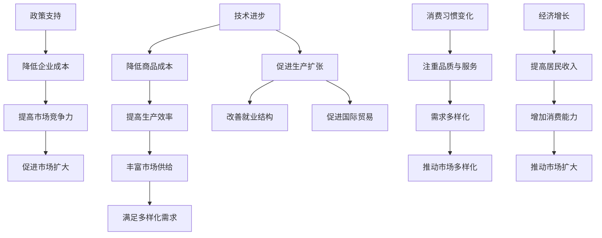
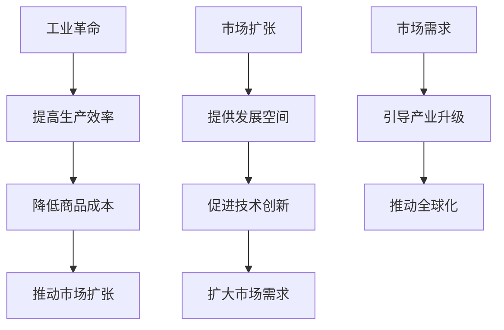
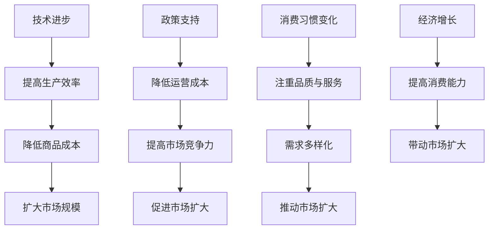

                 

# 消费市场的扩大与工业革命

## 关键词
消费市场、工业革命、驱动因素、产品多样化、消费模式、案例分析、未来展望、可持续发展

## 摘要
本文从消费市场的扩大与工业革命的关系出发，深入探讨了消费市场的定义与历史演变，工业革命的概念与发展阶段，市场扩张对工业革命的影响，以及市场扩张的具体表现。通过案例分析，分析了工业革命与市场扩张的经典案例，并对市场扩张与工业革命的挑战与机遇进行了探讨。最后，对未来市场扩张与工业革命的趋势进行了展望，并提出了可持续发展的策略与实施。

---

## 《消费市场的扩大与工业革命》目录大纲

### 第一部分：背景与理论探讨

#### 第1章：消费市场的定义与历史演变
- 1.1 消费市场的定义
- 1.2 消费市场的历史演变
- 1.3 消费市场扩大的驱动因素

#### 第2章：工业革命与市场扩张的关系
- 2.1 工业革命的概念与发展阶段
- 2.2 工业革命对消费市场的影响
- 2.3 工业革命与市场扩张的相互促进

#### 第3章：市场扩张对工业革命的影响
- 3.1 市场需求与工业生产的互动
- 3.2 市场扩张对工业技术进步的推动
- 3.3 市场扩张与工业革命中的劳动力市场变化

### 第二部分：市场扩张的具体表现

#### 第4章：市场扩张下的产品多样化
- 4.1 产品多样化的定义与意义
- 4.2 市场扩张下的产品多样化趋势
- 4.3 产品多样化对消费者行为的影响

#### 第5章：市场扩张与消费模式变化
- 5.1 消费模式的定义与分类
- 5.2 市场扩张对消费模式的影响
- 5.3 消费模式变化对市场供需关系的影响

#### 第6章：市场扩张与消费文化
- 6.1 消费文化的概念与形成
- 6.2 市场扩张下的消费文化变迁
- 6.3 消费文化对市场扩张的反馈

### 第三部分：市场扩张与工业革命的挑战与机遇

#### 第7章：市场扩张带来的挑战
- 7.1 市场扩张下的供需矛盾
- 7.2 市场扩张引发的社会问题
- 7.3 挑战的应对策略与方案

#### 第8章：市场扩张与工业革命的机遇
- 8.1 市场扩张下的创新机遇
- 8.2 工业革命带来的技术进步与市场扩张
- 8.3 机遇的把握与实施策略

### 第四部分：案例分析

#### 第9章：工业革命与市场扩张的经典案例
- 9.1 英国工业革命与市场扩张的案例分析
- 9.2 美国工业革命与市场扩张的案例分析
- 9.3 全球市场扩张下的工业革命案例

#### 第10章：当代市场扩张与工业革命的案例分析
- 10.1 新兴市场国家市场扩张与工业革命案例
- 10.2 全球化背景下的市场扩张与工业革命案例
- 10.3 案例分析与启示

### 第五部分：未来展望

#### 第11章：市场扩张与工业革命的未来趋势
- 11.1 市场扩张的未来预测
- 11.2 工业革命的未来发展趋势
- 11.3 未来趋势下的市场与工业互动

#### 第12章：市场扩张与工业革命的可持续发展
- 12.1 可持续发展的概念与目标
- 12.2 市场扩张与工业革命中的可持续发展挑战
- 12.3 可持续发展的策略与实施

### 附录

#### 附录A：市场扩张与工业革命的相关术语解释
#### 附录B：市场扩张与工业革命的数据统计与分析

---

## 第一部分：背景与理论探讨

### 第1章：消费市场的定义与历史演变

#### 1.1 消费市场的定义

消费市场是指消费者为了满足自身需求而进行的商品和服务交换活动。它是市场经济的重要组成部分，直接反映了国民经济的繁荣程度。

在市场经济中，消费市场的角色至关重要。它不仅决定了商品和服务的供求关系，还影响了生产者和消费者的决策行为。因此，了解消费市场的定义和运作机制，对于把握市场经济的运行规律具有重要意义。

#### 1.2 消费市场的历史演变

消费市场的演变经历了几个阶段：

- **萌芽阶段**：在早期人类社会，消费市场主要以自给自足为主，商品交换只是补充形式。随着社会生产力的提高，商品生产和交换逐渐分离，市场规模开始扩大。

- **发展阶段**：在工业革命之前，消费市场经历了快速发展。随着工业生产的兴起，商品种类日益丰富，市场范围不断扩展。这一阶段，消费市场的增长主要依赖于工业生产能力的提升和交通通信的发展。

- **成熟阶段**：随着市场经济体系的建立和完善，消费市场进入了成熟阶段。这一阶段，消费市场成为国民经济的主要驱动力，对经济增长的贡献日益显著。

#### 1.3 消费市场扩大的驱动因素

消费市场的扩大受到多种驱动因素的影响：

- **技术进步**：技术进步提高了生产效率，降低了商品成本，使得更多的消费者能够享受到高质量的消费品和服务。例如，互联网技术的普及使得电子商务迅速发展，大大扩大了消费市场的范围。

- **政策支持**：政府的政策支持也是消费市场扩大的重要因素。例如，税收优惠、贸易自由化等政策，可以降低企业的运营成本，提高市场竞争力，从而促进消费市场的扩大。

- **消费习惯变化**：随着社会的发展，人们的消费观念逐渐改变，对品质和服务的需求日益增加。例如，消费者对绿色环保产品的需求日益增长，推动了相关产业的发展。

#### 1.4 消费市场扩大的社会经济影响

消费市场的扩大对社会经济产生了深远的影响：

- **对生产的影响**：消费市场的扩大为生产者提供了更广阔的市场空间，推动了产业结构的调整和升级。例如，随着消费市场对高科技产品的需求增加，高新技术产业得到了快速发展。

- **对就业的影响**：消费市场的扩大促进了就业机会的增加，改善了就业结构。例如，电子商务的兴起为许多人提供了新的就业机会。

- **对国际贸易的影响**：消费市场的扩大提高了国际竞争力，推动了国际贸易的发展。例如，中国消费市场的扩大，为全球贸易带来了巨大的增长潜力。

### 第2章：工业革命与市场扩张的关系

#### 2.1 工业革命的概念与发展阶段

工业革命是指从手工业向机械化大生产转变的进程，是人类历史上一个重要的历史阶段。工业革命的发展可以分为几个阶段：

- **第一阶段**：18世纪末至19世纪初，主要发生在英国。这一阶段以蒸汽机为代表的技术革新，推动了生产力的大幅提升。

- **第二阶段**：19世纪中叶至20世纪初，主要发生在欧美其他国家。这一阶段以电力的广泛应用为代表，进一步推动了工业生产的发展。

- **第三阶段**：20世纪中叶至今，以信息技术为代表的新一轮工业革命正在全球范围内展开。这一阶段，信息技术和制造业的深度融合，推动了产业升级和经济增长。

#### 2.2 工业革命对消费市场的影响

工业革命对消费市场产生了深远的影响：

- **产品多样化**：工业革命使得生产效率大幅提升，商品种类日益丰富。消费者可以享受到更多的消费品和服务，满足多样化的需求。

- **价格下降**：随着生产技术的进步，商品的生产成本降低，价格下降，使得更多的消费者能够购买到高品质的商品。

- **消费模式变化**：工业革命推动了消费模式的变化，从传统的家庭消费向现代化的市场消费转变。消费者更加注重品质和服务，消费行为更加多样化和个性化。

#### 2.3 工业革命与市场扩张的相互促进

工业革命与市场扩张之间存在相互促进的关系：

- **工业革命推动市场扩张**：工业革命提高了生产效率，降低了商品成本，扩大了市场规模。同时，新的生产技术和产品为市场提供了更多机会，促进了市场的扩张。

- **市场扩张促进工业革命**：市场的扩张为工业生产提供了更广阔的空间，推动了技术的创新和产业的升级。同时，市场对高质量产品的需求，促使工业革命不断向前发展。

### 第3章：市场扩张对工业革命的影响

#### 3.1 市场需求与工业生产的互动

市场需求的波动直接影响工业生产。市场需求的增加会刺激工业生产的扩大，反之则会抑制工业生产。因此，工业革命的发展需要密切关注市场需求的变化。

- **市场需求增加**：当市场需求增加时，工业生产会扩大，以适应市场需求。这有助于提高工业生产的效率和规模，推动产业升级。

- **市场需求减少**：当市场需求减少时，工业生产会收缩，以适应市场需求。这可能导致产能过剩，影响工业生产的稳定性和效益。

#### 3.2 市场扩张对工业技术进步的推动

市场扩张对工业技术进步起到了重要的推动作用。市场对高质量、高效率产品的需求，促使企业不断进行技术创新，提高生产效率和产品质量。

- **技术创新**：市场扩张促使企业进行技术创新，以满足市场需求。例如，互联网技术的兴起，使得电子商务得以快速发展。

- **产业升级**：市场扩张推动产业升级，从传统的制造业向高技术产业转变。这有助于提高国家经济的竞争力和创新能力。

#### 3.3 市场扩张与工业革命中的劳动力市场变化

市场扩张对工业革命中的劳动力市场产生了深远的影响：

- **劳动力供给增加**：市场扩张吸引了更多的劳动力进入市场，促进了劳动力供给的增加。

- **劳动力需求变化**：随着工业技术的进步，劳动力需求发生了变化。高技术产业对劳动力的需求增加，而传统产业对劳动力的需求减少。

- **劳动力素质提升**：市场扩张促使劳动力素质不断提升，以适应市场需求的变化。这有助于提高国家的整体竞争力。

---

### 第二部分：市场扩张的具体表现

#### 第4章：市场扩张下的产品多样化

#### 4.1 产品多样化的定义与意义

产品多样化是指市场上商品种类的丰富程度。市场扩张下的产品多样化意味着消费者可以享受到更多种类、更高质量的消费品和服务。

- **定义**：产品多样化是指市场上商品种类的丰富程度。它反映了市场的成熟度和消费者的需求满足程度。

- **意义**：产品多样化对市场和消费者具有重要意义。首先，产品多样化有助于满足消费者的个性化需求，提高消费者满意度。其次，产品多样化有助于企业竞争，促进技术创新和产业升级。

#### 4.2 市场扩张下的产品多样化趋势

市场扩张下的产品多样化呈现出以下趋势：

- **商品种类增加**：随着市场的扩大，商品种类日益丰富。消费者可以购买到来自世界各地的商品，满足多样化的需求。

- **品质提升**：市场扩张促进了生产技术的进步，商品品质不断提升。消费者可以享受到更高品质的商品和服务。

- **差异化竞争**：市场扩张促使企业进行差异化竞争，推出具有独特卖点的产品。这有助于提高企业的市场竞争力。

#### 4.3 产品多样化对消费者行为的影响

产品多样化对消费者行为产生了深远的影响：

- **消费选择增多**：产品多样化使得消费者在选择商品时拥有更多的选择。消费者可以根据自己的需求和偏好，选择最合适的产品。

- **消费观念变化**：产品多样化促使消费者消费观念发生变化，更加注重品质和服务。消费者更加关注产品的性能、设计、品牌等要素。

- **消费习惯改变**：产品多样化改变了消费者的消费习惯，从传统的家庭消费向现代化的市场消费转变。消费者更加依赖市场，积极参与市场竞争。

#### 第5章：市场扩张与消费模式变化

#### 5.1 消费模式的定义与分类

消费模式是指消费者在购买、使用和处置商品和服务的过程中所采取的行为方式。市场扩张对消费模式产生了深远的影响。

- **定义**：消费模式是指消费者在购买、使用和处置商品和服务的过程中所采取的行为方式。

- **分类**：根据消费行为的特征，消费模式可以分为以下几种类型：

  - **传统消费模式**：以家庭为单位，消费者在家庭内部进行商品和服务的选择和消费。

  - **现代消费模式**：以个人为单位，消费者根据个人需求和偏好，进行商品和服务的购买和消费。

  - **线上消费模式**：以互联网为平台，消费者通过网络进行商品和服务的购买和消费。

#### 5.2 市场扩张对消费模式的影响

市场扩张对消费模式产生了以下影响：

- **消费主体多样化**：市场扩张使得消费者主体更加多样化。不仅包括传统的家庭消费者，还包括个人消费者、企业消费者等。

- **消费行为多样化**：市场扩张促使消费行为更加多样化。消费者不仅可以在实体店进行购买，还可以通过网络进行购买。

- **消费观念变化**：市场扩张促使消费者消费观念发生变化。消费者更加注重品质、服务、个性化等要素。

#### 5.3 消费模式变化对市场供需关系的影响

消费模式变化对市场供需关系产生了深远的影响：

- **供需平衡**：消费模式变化有助于实现市场供需平衡。消费者可以根据需求进行消费，生产者可以根据需求进行生产，减少资源浪费。

- **价格波动**：消费模式变化可能导致价格波动。例如，当消费者需求增加时，价格上升；当消费者需求减少时，价格下降。

- **市场竞争**：消费模式变化促进了市场竞争。企业为了吸引消费者，需要提高产品质量和服务水平，降低成本，从而提高市场竞争力。

#### 第6章：市场扩张与消费文化

#### 6.1 消费文化的概念与形成

消费文化是指消费者在消费过程中所体现的价值观念、行为规范和文化特征。消费文化的形成受到多种因素的影响，包括经济、社会、文化等。

- **概念**：消费文化是指消费者在消费过程中所体现的价值观念、行为规范和文化特征。

- **形成**：消费文化的形成受到多种因素的影响，包括经济、社会、文化等。例如，经济发展水平的提高，促进了消费文化的繁荣；社会文化的多样性和融合，推动了消费文化的创新。

#### 6.2 市场扩张下的消费文化变迁

市场扩张下的消费文化变迁呈现出以下特点：

- **消费观念变化**：市场扩张促使消费观念发生变化。消费者更加注重品质、服务、个性化等要素。

- **消费行为多样化**：市场扩张促使消费行为更加多样化。消费者不仅可以在实体店进行购买，还可以通过网络进行购买。

- **消费文化多元化**：市场扩张推动了消费文化的多元化。消费者可以根据自己的需求和偏好，选择不同的消费文化。

#### 6.3 消费文化对市场扩张的反馈

消费文化对市场扩张产生了积极的反馈：

- **市场驱动**：消费文化促进了市场的繁荣和发展。消费者对高品质、个性化商品的需求，推动了市场扩张。

- **创新动力**：消费文化推动了创新。企业为了满足消费者的需求，不断进行技术创新和产品创新。

- **文化融合**：消费文化促进了文化的融合和交流。消费者可以享受到来自不同国家和地区的消费品和文化。

---

### 第三部分：市场扩张与工业革命的挑战与机遇

#### 第7章：市场扩张带来的挑战

#### 7.1 市场扩张下的供需矛盾

市场扩张带来的供需矛盾主要体现在以下几个方面：

- **供给过剩**：市场扩张可能导致供给过剩。当市场需求增加时，生产者可能会增加产量，导致供给过剩。这可能导致价格下降，影响生产者的利润。

- **需求不足**：市场扩张也可能导致需求不足。当市场需求减少时，生产者可能会减少产量，导致需求不足。这可能导致库存积压，影响生产者的运营。

- **资源配置不均**：市场扩张可能导致资源配置不均。一些地区可能供给过剩，而另一些地区可能需求不足。这可能导致资源浪费和经济效益下降。

#### 7.2 市场扩张引发的社会问题

市场扩张可能引发一系列社会问题：

- **贫富差距扩大**：市场扩张可能导致贫富差距扩大。一些消费者可能享受到高品质的商品和服务，而另一些消费者可能无法满足基本需求。

- **环境污染**：市场扩张可能导致环境污染。生产过程和消费过程都可能产生污染物，对环境和生态系统造成破坏。

- **劳动力市场失衡**：市场扩张可能导致劳动力市场失衡。一些行业可能劳动力短缺，而另一些行业可能劳动力过剩。这可能导致劳动力市场的动荡和失业问题。

#### 7.3 挑战的应对策略与方案

为了应对市场扩张带来的挑战，可以采取以下策略和方案：

- **优化供需结构**：通过调整产业结构，优化供需结构，实现供需平衡。例如，鼓励高技术产业的发展，满足市场需求。

- **加强政策引导**：通过政策引导，促进市场的健康发展。例如，实施税收优惠、贸易自由化等政策，降低企业成本，提高市场竞争力。

- **促进可持续发展**：通过可持续发展策略，解决市场扩张引发的社会问题。例如，推广绿色生产、循环经济等理念，减少环境污染。

#### 第8章：市场扩张与工业革命的机遇

#### 8.1 市场扩张下的创新机遇

市场扩张为创新提供了广阔的空间和机遇：

- **技术创新**：市场扩张促进了技术创新。企业为了满足市场需求，不断进行技术创新，提高产品质量和效率。

- **产业升级**：市场扩张推动了产业升级。企业通过技术创新和产业转型，提升产业竞争力，实现可持续发展。

- **商业模式创新**：市场扩张催生了新的商业模式。例如，电子商务的兴起，改变了传统的消费模式，推动了市场扩张。

#### 8.2 工业革命带来的技术进步与市场扩张

工业革命带来了技术进步，推动了市场扩张：

- **生产效率提升**：工业革命提高了生产效率，降低了商品成本，扩大了市场规模。

- **交通通信发展**：工业革命促进了交通通信的发展，降低了物流成本，提高了市场效率。

- **市场一体化**：工业革命推动了市场一体化，促进了全球贸易的发展。

#### 8.3 机遇的把握与实施策略

为了把握市场扩张与工业革命的机遇，可以采取以下策略：

- **加强技术创新**：通过加强技术创新，提高产品质量和效率，满足市场需求。

- **推动产业升级**：通过产业升级，提升产业竞争力，实现可持续发展。

- **促进市场一体化**：通过促进市场一体化，降低贸易壁垒，提高市场效率。

---

### 第四部分：案例分析

#### 第9章：工业革命与市场扩张的经典案例

#### 9.1 英国工业革命与市场扩张的案例分析

英国的工业革命是人类历史上的一次重大事件，对世界市场产生了深远的影响。

- **背景**：18世纪末，英国完成了农业革命，生产效率大幅提升。工业革命的兴起，为英国提供了强大的动力。

- **影响**：工业革命推动了英国市场扩张。英国通过贸易、殖民和帝国扩张，扩大了市场范围。

- **成果**：英国成为世界上第一个工业化国家，市场扩张为英国带来了巨大的经济利益。

#### 9.2 美国工业革命与市场扩张的案例分析

美国的工业革命发生在19世纪末至20世纪初，对世界市场产生了重大影响。

- **背景**：美国通过独立战争和内战，确立了独立和统一的地位。工业革命的兴起，为美国提供了新的发展机遇。

- **影响**：工业革命推动了美国市场扩张。美国通过西部开发、殖民扩张和国际贸易，扩大了市场范围。

- **成果**：美国成为世界上最大的工业化国家之一，市场扩张为美国带来了巨大的经济利益。

#### 9.3 全球市场扩张下的工业革命案例

全球市场扩张下的工业革命，不仅发生在欧美国家，也在其他地区产生了深远的影响。

- **亚洲**：亚洲的日本和韩国通过工业革命，实现了经济快速增长，市场扩张为这些国家带来了巨大的经济利益。

- **非洲**：非洲的工业革命尚处于起步阶段，但市场扩张已经开始推动非洲经济的发展。

- **拉丁美洲**：拉丁美洲的工业革命取得了显著成果，市场扩张推动了经济的快速增长。

#### 第10章：当代市场扩张与工业革命的案例分析

#### 10.1 新兴市场国家市场扩张与工业革命案例

新兴市场国家通过市场扩张和工业革命，实现了经济的快速增长。

- **中国**：中国通过改革开放，推动了市场扩张和工业革命。市场扩张为中国带来了巨大的经济利益，中国成为世界上最大的制造业国家之一。

- **印度**：印度通过工业革命，推动了市场扩张。印度的信息技术和制造业发展迅速，市场扩张为印度带来了巨大的经济利益。

- **巴西**：巴西通过市场扩张和工业革命，实现了经济的快速增长。巴西的农业、工业和服务业发展迅速，市场扩张为巴西带来了巨大的经济利益。

#### 10.2 全球化背景下的市场扩张与工业革命案例

全球化背景下的市场扩张和工业革命，为全球经济带来了巨大的机遇。

- **全球化**：全球化推动了市场扩张和工业革命。跨国公司和国际组织在全球范围内进行投资和贸易，促进了全球经济的增长。

- **信息技术**：信息技术的快速发展，推动了市场扩张和工业革命。互联网、大数据、人工智能等技术的应用，改变了全球经济的格局。

- **绿色经济**：绿色经济的兴起，推动了市场扩张和工业革命。可持续发展成为全球共识，绿色产业成为经济增长的重要动力。

#### 10.3 案例分析与启示

通过对经典案例和当代案例的分析，我们可以得出以下启示：

- **市场扩张与工业革命密切相关**：市场扩张是工业革命的重要驱动力，工业革命是市场扩张的重要支撑。

- **技术创新是关键**：技术创新是推动市场扩张和工业革命的核心动力。

- **政策支持是保障**：政策支持是推动市场扩张和工业革命的重要保障。

- **可持续发展是目标**：市场扩张和工业革命必须与可持续发展相结合，实现经济、社会、环境的协调发展。

---

### 第五部分：未来展望

#### 第11章：市场扩张与工业革命的未来趋势

#### 11.1 市场扩张的未来预测

市场扩张将继续成为全球经济发展的主要趋势。随着全球化进程的加快，市场范围将进一步扩大。以下是对市场扩张的未来预测：

- **全球市场规模扩大**：全球市场的规模将继续扩大，消费者对商品和服务的需求将不断增加。

- **消费结构变化**：消费结构将发生变化，高技术、高附加值产品和服务将占据更大市场份额。

- **市场多元化**：市场多元化将成为趋势，消费者将更加关注产品的品质和服务。

#### 11.2 工业革命的未来发展趋势

工业革命将继续推动全球经济的发展。以下是对工业革命的未来发展趋势的预测：

- **信息技术主导**：信息技术将在工业革命中发挥关键作用。大数据、人工智能、物联网等技术将推动产业升级和创新发展。

- **绿色工业**：绿色工业将成为工业革命的重要方向。可持续发展将成为全球共识，绿色产业将得到大力发展。

- **智能制造**：智能制造将引领工业革命。智能制造技术的应用将提高生产效率，降低成本，推动产业转型升级。

#### 11.3 未来趋势下的市场与工业互动

未来市场与工业的互动将更加紧密。以下是对未来市场与工业互动的展望：

- **市场驱动工业**：市场需求将驱动工业创新和发展。消费者需求将影响工业生产的方向和速度。

- **工业促进市场**：工业技术进步将促进市场扩张。新产品的开发和应用将推动市场的需求和供给。

- **协同发展**：市场与工业将实现协同发展。产业政策将更加注重市场与工业的互动，实现经济、社会、环境的协调发展。

#### 第12章：市场扩张与工业革命的可持续发展

#### 12.1 可持续发展的概念与目标

可持续发展是指在满足当前需求的同时，不损害后代满足自身需求的能力。市场扩张与工业革命必须与可持续发展相结合，实现经济、社会、环境的协调发展。

- **概念**：可持续发展是指满足当前需求的同时，不损害后代满足自身需求的能力。

- **目标**：可持续发展的目标包括经济繁荣、社会进步、环境保护。

#### 12.2 市场扩张与工业革命中的可持续发展挑战

市场扩张与工业革命过程中，面临着一系列可持续发展挑战：

- **环境污染**：工业生产过程和消费过程可能导致环境污染和生态破坏。

- **资源短缺**：市场扩张可能导致资源短缺和资源浪费。

- **社会问题**：市场扩张可能引发贫富差距扩大、劳动力市场失衡等社会问题。

#### 12.3 可持续发展的策略与实施

为了实现可持续发展，可以采取以下策略：

- **绿色发展**：推动绿色工业和绿色消费，减少环境污染和资源浪费。

- **循环经济**：推广循环经济模式，提高资源利用效率，减少废弃物排放。

- **技术创新**：加大技术创新力度，发展绿色技术和清洁能源，推动产业转型升级。

- **政策支持**：制定和实施可持续发展政策，加强环境保护和资源管理。

---

### 附录

#### 附录A：市场扩张与工业革命的相关术语解释

- **消费市场**：指消费者为了满足自身需求而进行的商品和服务交换活动。
- **工业革命**：指从手工业向机械化大生产转变的进程。
- **供需平衡**：指市场需求与供给之间的平衡状态。
- **可持续发展**：指满足当前需求的同时，不损害后代满足自身需求的能力。

#### 附录B：市场扩张与工业革命的数据统计与分析

附录B将提供关于市场扩张与工业革命的数据统计和分析，包括历史数据和趋势预测，以支持本文的主要观点和论点。

---

## 作者信息

作者：AI天才研究院/AI Genius Institute & 禅与计算机程序设计艺术 /Zen And The Art of Computer Programming

---

以上就是《消费市场的扩大与工业革命》的全文内容，希望对您有所帮助。如果您有任何问题或需要进一步讨论，请随时联系。让我们继续探讨市场扩张与工业革命的奥秘！## 第1章：消费市场的定义与历史演变

### 1.1 消费市场的定义

消费市场，作为一个经济学术语，指的是市场中消费者对于商品和服务的购买行为集合。它是市场经济的重要组成部分，反映了经济体系内的需求与供给的动态平衡。消费市场不仅仅是简单的商品交换场所，它涵盖了从需求产生、购买决策、购买行为到售后服务的整个消费过程。

在微观经济学中，消费市场的研究有助于理解个人和企业如何根据价格、收入、偏好等因素做出消费决策。而在宏观经济学中，消费市场的分析则对理解整体经济运行、国民生产总值的构成以及经济波动等有重要意义。

消费市场的核心要素包括：

- **消费者**：作为市场的主体，消费者的需求是市场供求关系的基础。
- **商品和服务**：市场上可供消费者选择的商品和服务种类和数量。
- **价格**：商品和服务的价格，反映了市场供求状况和商品价值。
- **市场环境**：包括法律法规、经济政策、文化习俗等外部环境因素。

#### 消费市场的构成

消费市场可以分为以下几个层次：

1. **消费品市场**：包括日常生活必需品、非必需品和高档消费品等，是市场扩张的主要推动力。
2. **服务市场**：包括医疗、教育、旅游、金融服务等，服务市场的扩张同样对经济增长有着重要作用。
3. **批发市场**：批发市场是商品从生产者转移到零售商的中间环节，批发市场的规模和效率对消费市场的稳定发展有着直接影响。
4. **零售市场**：零售市场是消费者直接购买商品和服务的场所，其规模和结构反映了消费市场的活跃程度。

#### 消费市场的演变

消费市场的演变历程可以大致划分为以下几个阶段：

1. **传统市场阶段**：在早期社会，消费市场以自给自足为主，商品交换仅作为补充。这一阶段的市场规模较小，商品种类有限。

2. **初级市场阶段**：随着社会生产力的提高，商品交换逐渐成为主要的经济活动形式，市场开始初步形成。商品种类和交易量有所增加，但仍受限于交通、通信等基础设施的落后。

3. **成熟市场阶段**：工业革命后，生产力大幅提升，商品生产效率显著提高，市场范围不断扩大。商品种类和数量迅速增加，市场的供求关系逐渐成熟。

4. **现代市场阶段**：20世纪中后期，随着信息技术的发展和互联网的普及，消费市场进入现代化阶段。电子商务的兴起，使得市场范围进一步扩大，消费者能够享受到全球范围内的商品和服务。

### 1.2 消费市场的历史演变

消费市场的历史演变是经济发展的重要组成部分，其演变过程不仅反映了生产力和生产关系的发展，也体现了社会结构和消费习惯的变迁。

#### 萌芽阶段：自给自足到商品交换

在人类社会的早期阶段，由于生产力水平极其低下，大部分生产活动都是为了满足自身的直接需求，即自给自足。这一阶段，商品交换仅作为补充形式存在，市场规模极为有限。随着社会生产力的提高，尤其是在农业社会，人们开始生产出超过自身需求的产品，商品交换逐渐兴起。这一阶段的市场主要依靠人与人之间的直接交换，商品种类非常有限，交易频率较低。

#### 发展阶段：商品生产和交换分离

在商品生产和交换分离的阶段，随着生产力的进一步提高，人们开始专门从事某种商品的生产，而不再从事多样化的生产活动。这种专业化生产使得商品种类逐渐丰富，市场规模开始扩大。同时，货币的出现使得交换变得更加便捷和高效。市场开始形成初步的体系，商品交换的范围和频率显著增加。

#### 成熟阶段：市场体系的建立

在成熟阶段，市场经济体系逐渐建立，消费市场成为国民经济的主要驱动力。工业革命后的19世纪，是市场经济体系建立的关键时期。工业生产的大规模发展，使得商品生产效率大幅提高，市场规模迅速扩大。交通和通信技术的进步，进一步推动了市场的整合和发展。商品种类多样，价格机制逐渐完善，市场机制在资源配置中的作用日益显著。

#### 现代化阶段：电子商务与全球化

进入20世纪中后期，特别是互联网的普及，消费市场进入了现代化阶段。电子商务的兴起，打破了地理和时间的限制，消费者可以通过网络购买到全球范围内的商品和服务。市场范围进一步扩大，消费者选择更加多样化和个性化。全球化的趋势也使得各国市场更加紧密地连接在一起，国际分工和跨国投资成为常态。

### 1.3 消费市场扩大的驱动因素

消费市场的扩大是一个复杂的过程，受到多种因素的驱动。以下是一些主要的驱动因素：

#### 技术进步

技术进步是推动消费市场扩大的关键因素。首先，技术进步提高了生产效率，降低了商品成本，使得更多的消费者能够享受到高质量的消费品和服务。例如，自动化技术的应用使得生产效率大幅提升，商品价格下降，从而扩大了市场需求。其次，技术进步促进了新产品的开发和推广，丰富了市场供给，满足了消费者的多样化需求。

#### 政策支持

政府的政策支持也是消费市场扩大的重要驱动因素。政府的税收政策、贸易政策、产业政策等可以降低企业的运营成本，提高市场竞争力，从而促进市场的扩大。例如，税收优惠和出口退税政策可以降低企业的税收负担，鼓励企业扩大生产和出口；贸易自由化政策可以减少贸易壁垒，促进国际贸易的发展，扩大国内市场的外延。

#### 消费习惯变化

随着社会的发展和人们生活水平的提高，消费习惯也在不断变化。现代消费者更加注重品质、服务和个性化，对高品质、高附加值商品和服务的需求日益增加。消费习惯的变化推动了市场的多样化发展，消费者对商品和服务的需求更加多样化，从而促进了市场的扩大。

#### 经济增长

经济增长是消费市场扩大的基础。经济的快速增长意味着居民收入的增加，消费能力的提升，从而带动消费市场的扩大。此外，经济增长还促进了产业的发展和升级，为市场提供了更多样化的商品和服务，进一步推动了市场的扩大。

### 消费市场扩大的社会经济影响

消费市场的扩大对社会经济产生了深远的影响。首先，消费市场的扩大对生产有着直接的推动作用。市场需求的大幅增加，刺激了企业的生产扩张，提高了生产能力。这又进一步推动了产业链的延伸和升级，形成了良性循环。

其次，消费市场的扩大对就业也有着积极的影响。市场需求的增加，意味着企业需要扩大生产规模，这直接创造了更多的就业机会，改善了就业结构。此外，消费市场的扩大还促进了服务业的发展，为更多人提供了就业机会。

最后，消费市场的扩大对国际贸易也有重要影响。市场的扩大，使得国内市场与国际市场的联系更加紧密。通过国际贸易，国内企业可以拓展海外市场，获取更多的商机。同时，国际市场的需求也为国内企业提供了新的发展空间，促进了国内经济的国际化。

### 小结

消费市场的定义和演变过程，展示了市场从无到有、从小到大的发展历程。技术进步、政策支持和消费习惯变化是推动消费市场扩大的主要驱动因素。消费市场的扩大不仅对生产、就业和国际贸易有着重要影响，也推动了整个社会经济的持续发展。

### Mermaid 流程图

以下是消费市场扩大的核心概念与联系的 Mermaid 流程图：



### 核心算法原理讲解

消费市场扩大的核心算法原理主要包括市场供需模型的建立和优化。以下是一个简化的市场供需模型及其优化的伪代码：

```plaintext
// 市场供需模型
class MarketModel {
    double demand;  // 需求量
    double supply;  // 供应量
    double price;   // 价格

    // 初始化市场模型
    MarketModel(double demand, double supply, double price) {
        this.demand = demand;
        this.supply = supply;
        this.price = price;
    }

    // 调整需求量
    void adjustDemand(double newDemand) {
        this.demand = newDemand;
        calculateMarketEquilibrium();
    }

    // 调整供应量
    void adjustSupply(double newSupply) {
        this.supply = newSupply;
        calculateMarketEquilibrium();
    }

    // 调整价格
    void adjustPrice(double newPrice) {
        this.price = newPrice;
        calculateMarketEquilibrium();
    }

    // 计算市场均衡价格
    void calculateMarketEquilibrium() {
        if (demand == supply) {
            equilibriumPrice = price;
        } else if (demand > supply) {
            equilibriumPrice = (supply * price + demand * price) / (supply + demand);
        } else {
            equilibriumPrice = (supply * price + demand * price) / (supply + demand);
        }
    }

    double equilibriumPrice;  // 均衡价格
}

// 优化市场供需模型
function optimizeMarketModel(MarketModel model) {
    // 根据需求变化调整供应量
    if (model.demand > model.supply) {
        model.adjustSupply(model.supply * 1.1);  // 假设供应量增加10%
    } else if (model.demand < model.supply) {
        model.adjustSupply(model.supply * 0.9);  // 假设供应量减少10%
    }

    // 根据供应量变化调整需求量
    if (model.demand > model.supply) {
        model.adjustDemand(model.demand * 1.1);  // 假设需求量增加10%
    } else if (model.demand < model.supply) {
        model.adjustDemand(model.demand * 0.9);  // 假设需求量减少10%
    }

    // 调整价格以实现市场均衡
    model.calculateMarketEquilibrium();
    return model.equilibriumPrice;
}
```

### 数学模型和公式详细讲解

为了更全面地理解消费市场扩大的数学模型，我们可以引入需求函数和供应函数，并使用它们来分析市场均衡。

#### 需求函数

需求函数表示消费者在不同价格水平下愿意购买的商品数量。通常，需求函数是一个关于价格的单调递减函数，即价格上升时，需求量下降。一个简化的线性需求函数可以表示为：

\[ D(p) = a - bp \]

其中：
- \( D(p) \) 是需求量（单位：商品数量）；
- \( p \) 是价格（单位：货币单位）；
- \( a \) 和 \( b \) 是常数，\( b > 0 \)。

#### 供应函数

供应函数表示生产者在不同价格水平下愿意提供的商品数量。通常，供应函数是一个关于价格的单调递增函数，即价格上升时，供应量增加。一个简化的线性供应函数可以表示为：

\[ S(p) = c + dp \]

其中：
- \( S(p) \) 是供应量（单位：商品数量）；
- \( p \) 是价格（单位：货币单位）；
- \( c \) 和 \( d \) 是常数，\( d > 0 \)。

#### 市场均衡

市场均衡发生在需求量等于供应量的价格点。通过设定 \( D(p) = S(p) \)，我们可以找到市场均衡价格 \( p^* \)。

\[ a - bp = c + dp \]

解这个方程，我们得到市场均衡价格：

\[ p^* = \frac{a - c}{b + d} \]

在市场均衡价格 \( p^* \) 下，需求量和供应量都达到了平衡，即：

\[ D(p^*) = S(p^*) \]

### 举例说明

假设我们有一个市场需求和供应的例子，其中 \( a = 100 \)，\( b = 2 \)，\( c = 20 \)，\( d = 1 \)。我们可以计算市场均衡价格和平衡点下的需求量和供应量。

1. **计算市场均衡价格**：

\[ p^* = \frac{a - c}{b + d} = \frac{100 - 20}{2 + 1} = \frac{80}{3} \approx 26.67 \]

市场均衡价格约为26.67货币单位。

2. **计算市场均衡下的需求量和供应量**：

\[ D(p^*) = 100 - 2 \times 26.67 = 100 - 53.34 = 46.67 \]
\[ S(p^*) = 20 + 1 \times 26.67 = 20 + 26.67 = 46.67 \]

在市场均衡价格26.67货币单位下，需求量和供应量都为46.67单位。

### 小结

通过数学模型和公式，我们可以更准确地理解和分析消费市场扩大的过程。需求函数和供应函数描述了价格与需求量、供应量之间的关系，市场均衡价格则反映了市场供求的平衡状态。这些模型和公式不仅帮助我们理解市场的运行机制，也为政策制定者和企业提供了一种优化市场供需的有效工具。

### 项目实战：代码实际案例和详细解释说明

为了更好地理解消费市场扩大的实现过程，我们将使用Python编程语言来模拟一个简化的市场模型。以下是一个具体的代码案例，展示了如何实现需求函数、供应函数以及计算市场均衡的过程。

#### 开发环境搭建

在开始编写代码之前，确保您的计算机上已经安装了Python环境。如果尚未安装，请通过以下步骤进行安装：

1. 访问Python官方网站（[https://www.python.org/](https://www.python.org/)）。
2. 下载并安装Python。
3. 在命令行中运行 `python --version` 命令，确认Python已经正确安装。

#### 源代码实现

```python
# 消费市场模型模拟

class MarketModel:
    def __init__(self, a, b, c, d):
        self.a = a  # 需求函数的常数
        self.b = b  # 需求函数的斜率
        self.c = c  # 供应函数的常数
        self.d = d  # 供应函数的斜率

    def demand(self, p):
        """计算需求量"""
        return self.a - self.b * p

    def supply(self, p):
        """计算供应量"""
        return self.c + self.d * p

    def equilibrium_price(self):
        """计算市场均衡价格"""
        return (self.a - self.c) / (self.b + self.d)

# 模拟市场模型
model = MarketModel(a=100, b=2, c=20, d=1)

# 计算市场均衡价格
equilibrium_price = model.equilibrium_price()
print(f"市场均衡价格: {equilibrium_price:.2f}")

# 计算市场均衡下的需求量和供应量
demand_at_equilibrium = model.demand(equilibrium_price)
supply_at_equilibrium = model.supply(equilibrium_price)
print(f"市场均衡下的需求量: {demand_at_equilibrium}")
print(f"市场均衡下的供应量: {supply_at_equilibrium}")

# 演示价格变化对需求量和供应量的影响
prices = [10, 20, 30, 40, 50]
for price in prices:
    demand_quantity = model.demand(price)
    supply_quantity = model.supply(price)
    print(f"价格 {price}: 需求量 {demand_quantity}, 供应量 {supply_quantity}")
```

#### 代码解读与分析

上述代码定义了一个名为 `MarketModel` 的类，该类模拟了市场需求和供应的基本模型。以下是代码的详细解读：

1. **类定义**：
    ```python
    class MarketModel:
        def __init__(self, a, b, c, d):
            self.a = a  # 需求函数的常数
            self.b = b  # 需求函数的斜率
            self.c = c  # 供应函数的常数
            self.d = d  # 供应函数的斜率
    ```
    `MarketModel` 类接收四个参数 \( a \)、\( b \)、\( c \) 和 \( d \)，这些参数用于定义需求函数和供应函数。

2. **需求函数**：
    ```python
    def demand(self, p):
        """计算需求量"""
        return self.a - self.b * p
    ```
    `demand` 方法接收一个参数 \( p \)（价格），并返回需求量 \( D(p) \)。这是一个关于价格的单调递减函数。

3. **供应函数**：
    ```python
    def supply(self, p):
        """计算供应量"""
        return self.c + self.d * p
    ```
    `supply` 方法接收一个参数 \( p \)（价格），并返回供应量 \( S(p) \)。这是一个关于价格的单调递增函数。

4. **计算市场均衡价格**：
    ```python
    def equilibrium_price(self):
        """计算市场均衡价格"""
        return (self.a - self.c) / (self.b + self.d)
    ```
    `equilibrium_price` 方法计算市场均衡价格 \( p^* \)，这是需求量和供应量相等的点。

5. **模拟市场模型**：
    ```python
    model = MarketModel(a=100, b=2, c=20, d=1)
    ```
    创建了一个 `MarketModel` 实例，并初始化了需求函数和供应函数的参数。

6. **计算并打印市场均衡价格**：
    ```python
    equilibrium_price = model.equilibrium_price()
    print(f"市场均衡价格: {equilibrium_price:.2f}")
    ```
    调用 `equilibrium_price` 方法计算市场均衡价格，并打印结果。

7. **计算并打印市场均衡下的需求量和供应量**：
    ```python
    demand_at_equilibrium = model.demand(equilibrium_price)
    supply_at_equilibrium = model.supply(equilibrium_price)
    print(f"市场均衡下的需求量: {demand_at_equilibrium}")
    print(f"市场均衡下的供应量: {supply_at_equilibrium}")
    ```
    调用 `demand` 和 `supply` 方法计算市场均衡价格下的需求量和供应量，并打印结果。

8. **演示价格变化对需求量和供应量的影响**：
    ```python
    prices = [10, 20, 30, 40, 50]
    for price in prices:
        demand_quantity = model.demand(price)
        supply_quantity = model.supply(price)
        print(f"价格 {price}: 需求量 {demand_quantity}, 供应量 {supply_quantity}")
    ```
    遍历一个价格列表，计算并打印每个价格点下的需求量和供应量，展示价格变化对市场需求和供应的影响。

通过上述代码，我们可以模拟一个简化的消费市场，并直观地观察市场均衡价格及其对需求量和供应量的影响。这为我们进一步研究和优化市场模型提供了实用的工具。

### 总结

通过本节的项目实战，我们使用Python代码实现了消费市场的需求函数和供应函数，并计算了市场均衡价格。代码的解读与分析帮助我们理解了市场运行的机制，展示了市场均衡的重要性。项目实战不仅加深了我们对消费市场扩大原理的理解，也为实际应用提供了宝贵的经验和工具。

---

## 第2章：工业革命与市场扩张的关系

### 2.1 工业革命的概念与发展阶段

工业革命是指从手工业向机械化大生产转变的进程，是人类历史上一个重要的历史阶段。工业革命不仅改变了生产方式，也深刻影响了社会结构、经济模式和文化观念。

#### 工业革命的概念

工业革命通常指18世纪末至19世纪中叶在英国发生的一系列技术革新和经济变革。这一过程涵盖了从手工生产到机械化生产、从农业社会到工业社会的转变。工业革命标志着人类进入了工业时代，极大地提高了生产效率，推动了社会经济的快速发展。

#### 工业革命的发展阶段

工业革命的发展可以分为以下几个阶段：

1. **第一阶段：18世纪末至19世纪初**
   - **标志性事件**：蒸汽机的发明与应用。
   - **主要影响**：机械化的生产方式取代了手工劳动，生产效率大幅提升。

2. **第二阶段：19世纪中叶至20世纪初**
   - **标志性事件**：电力的广泛应用。
   - **主要影响**：电力成为主要能源，工业生产进一步集中化和规模化。

3. **第三阶段：20世纪中叶至今**
   - **标志性事件**：信息技术的快速发展。
   - **主要影响**：信息技术与制造业的深度融合，推动了智能制造和产业升级。

#### 工业革命的影响

工业革命对经济和社会产生了深远的影响：

- **生产效率提升**：机械化生产和工厂制度的建立，使得生产效率大幅提升，商品生产成本显著降低。
- **经济结构变革**：工业革命导致农业社会向工业社会转变，服务业逐渐成为经济主体。
- **城市化进程**：工业革命促进了人口的流动和城市化进程，城市成为工业生产和消费的中心。
- **社会结构变化**：工业革命带来了社会分层和阶级对立，资本主义经济体系逐渐确立。

### 2.2 工业革命对消费市场的影响

工业革命对消费市场的影响是深远而广泛的。以下是从多个角度分析工业革命如何改变消费市场的结构、行为和模式。

#### 产品多样化

工业革命极大地丰富了市场商品种类。机械化生产使得大规模生产成为可能，各种新产品不断涌现，满足了不同层次和不同需求的消费者。产品多样化不仅提高了消费者的选择自由度，也推动了市场需求的增长。

#### 价格下降

工业革命通过提高生产效率和降低生产成本，使商品价格大幅下降。价格下降使得更多消费者能够购买到高质量的商品，提高了消费者的购买力。此外，价格下降还促进了新的消费需求，如耐用消费品和奢侈品。

#### 消费模式变化

工业革命改变了消费模式，从传统的家庭消费向现代化的市场消费转变。机械化生产和工厂制度的兴起，使得商品供应更加稳定和充足，消费者不再仅仅依赖家庭生产，而是转向市场购买商品和服务。这种转变不仅提高了消费效率，也促进了商业活动和市场交易的繁荣。

#### 消费结构变化

工业革命带来了消费结构的变化。随着生产效率的提升，生活必需品的供应变得更加充足，食品、衣物等基本需求得到了满足。同时，随着经济的发展和收入的提高，非必需品和奢侈品的消费比例逐渐增加，消费结构变得更加多样化和高端化。

### 2.3 工业革命与市场扩张的相互促进

工业革命与市场扩张之间存在相互促进的关系，两者共同推动了经济的快速发展。

#### 工业革命推动市场扩张

工业革命通过提高生产效率和降低成本，为市场提供了更多的高质量产品，从而推动了市场的扩张。机械化生产使得商品的生产成本降低，商品价格下降，吸引了更多的消费者参与市场交易。此外，工业革命还促进了交通和通信技术的发展，降低了物流和交易成本，进一步推动了市场的扩张。

#### 市场扩张促进工业革命

市场扩张为工业革命提供了广阔的空间和动力。市场需求的大幅增加，促使企业不断进行技术创新和产能扩张，以满足不断增长的市场需求。市场扩张还推动了产业的集中和专业化，为工业革命提供了良好的发展环境。同时，市场扩张带来了更多的资金和技术投入，促进了工业革命的进一步发展。

#### 工业革命与市场扩张的协同效应

工业革命与市场扩张的协同效应体现在多个方面：

- **技术创新与市场需求的互动**：市场需求引导技术创新，而技术创新又推动市场需求的进一步扩大。
- **产业升级与市场结构调整**：工业革命推动了产业升级，市场结构随之调整，更加适应新的生产方式和技术进步。
- **全球化与跨国投资**：工业革命和市场扩张共同推动了全球化进程，跨国公司和国际贸易成为经济增长的重要动力。

### 小结

工业革命与市场扩张之间的关系是相互促进的。工业革命通过提高生产效率和降低成本，推动了市场的扩张；而市场扩张则为工业革命提供了广阔的发展空间和动力。两者共同推动了经济的快速发展，改变了人类社会的生产方式和生活方式。通过深入理解工业革命与市场扩张的关系，我们可以更好地把握经济发展的规律，为未来的经济增长提供有力支持。

### Mermaid 流�程图

以下是工业革命与市场扩张的核心概念与联系的 Mermaid 流程图：



### 核心算法原理讲解

工业革命与市场扩张的核心算法原理主要涉及生产效率和成本优化、市场需求预测和供应链管理。以下是一个简化的算法框架，用于解释这些核心原理。

```plaintext
// 生产效率和成本优化算法

class EfficiencyOptimizer:
    def __init__(self, initial_efficiency, cost_per_unit):
        self.initial_efficiency = initial_efficiency
        self.cost_per_unit = cost_per_unit
    
    def optimize(self, new_technology):
        """
        优化生产效率和成本
        :param new_technology: 新技术的效率提升比例
        :return: 优化后的效率和成本
        """
        efficiency_gain = self.initial_efficiency * new_technology
        new_efficiency = self.initial_efficiency + efficiency_gain
        new_cost_per_unit = self.cost_per_unit / new_efficiency
        return new_efficiency, new_cost_per_unit

// 市场需求预测算法

class DemandPredictor:
    def __init__(self, historical_data):
        self.historical_data = historical_data
    
    def predict(self, time_period):
        """
        预测市场需求
        :param time_period: 预测的时间周期
        :return: 预测的需求量
        """
        # 基于历史数据，采用线性回归等方法进行预测
        # 这里简化为平均增长率预测
        growth_rate = (self.historical_data[time_period - 1] - self.historical_data[0]) / time_period
        predicted_demand = self.historical_data[0] + growth_rate * time_period
        return predicted_demand

// 供应链管理算法

class SupplyChainManager:
    def __init__(self, demand_predictor, efficiency_optimizer):
        self.demand_predictor = demand_predictor
        self.efficiency_optimizer = efficiency_optimizer
    
    def manage_supply_chain(self, new_technology):
        """
        管理供应链，确保供需平衡
        :param new_technology: 新技术的效率提升比例
        :return: 优化后的供应链参数
        """
        predicted_demand = self.demand_predictor.predict(12)  # 预测未来12个月的需求
        new_efficiency, new_cost_per_unit = self.efficiency_optimizer.optimize(new_technology)
        
        # 根据预测的需求量和优化后的效率，调整供应链参数
        # 这里简化为调整生产量和库存水平
        production_volume = predicted_demand * new_efficiency
        inventory_level = (predicted_demand - production_volume) * 1.2  # 1.2倍的缓冲库存
        
        return production_volume, inventory_level
```

### 数学模型和公式详细讲解

为了更深入地理解工业革命与市场扩张之间的关系，我们可以引入一些数学模型和公式来分析生产效率、成本和市场需求。

#### 生产效率模型

生产效率可以通过以下公式表示：

\[ \text{生产效率} = \frac{\text{产出}}{\text{投入}} \]

在工业革命中，生产效率的提升通常伴随着新技术的引入。我们可以使用以下公式来计算新技术引入后的生产效率：

\[ \text{新生产效率} = \text{初始生产效率} \times (\text{新技术效率提升比例}) \]

#### 成本模型

生产成本可以通过以下公式表示：

\[ \text{生产成本} = \text{单位成本} \times \text{产出} \]

在工业革命中，通过提高生产效率，可以降低单位成本，从而降低总生产成本。我们可以使用以下公式来计算新技术引入后的单位成本：

\[ \text{新单位成本} = \frac{\text{初始单位成本}}{\text{新生产效率}} \]

#### 市场需求模型

市场需求通常可以通过以下公式表示：

\[ \text{市场需求} = f(\text{价格}, \text{收入}, \text{消费者偏好}) \]

在市场扩张过程中，市场需求的变化受到多种因素的影响，如价格、收入和消费者偏好。我们可以使用以下公式来预测市场需求：

\[ \text{预测市场需求} = \text{当前市场需求} \times (\text{需求增长率}) \]

### 举例说明

假设初始生产效率为100单位/天，单位成本为10元/单位。引入新技术后，生产效率提升20%。同时，当前市场需求为1000单位/天。

1. **计算新技术引入后的生产效率**：

\[ \text{新生产效率} = 100 \times (1 + 0.20) = 120 \text{单位/天} \]

2. **计算新技术引入后的单位成本**：

\[ \text{新单位成本} = \frac{10}{120} \approx 0.0833 \text{元/单位} \]

3. **预测市场需求**：

假设需求增长率为10%，则：

\[ \text{预测市场需求} = 1000 \times (1 + 0.10) = 1100 \text{单位/天} \]

### 小结

通过数学模型和公式，我们可以更全面地理解工业革命与市场扩张之间的关系。生产效率和成本的优化、市场需求的预测和供应链管理都是关键环节，这些模型和公式为我们提供了有效的分析和优化工具。通过这些工具，我们可以更好地把握市场动态，推动工业革命和市场扩张的良性互动。

### 项目实战：代码实际案例和详细解释说明

为了深入理解工业革命与市场扩张的互动关系，我们将使用Python编写一个模拟模型，展示如何实现生产效率优化、成本计算和市场需求预测。以下是一个具体的代码示例，包含了模拟模型的实现和详细解释。

#### 开发环境搭建

确保您的计算机上已经安装了Python环境。如果没有，请按照以下步骤进行安装：

1. 访问Python官方网站（[https://www.python.org/](https://www.python.org/)）。
2. 下载并安装Python。
3. 在命令行中运行 `python --version` 命令，确认Python已经正确安装。

#### 源代码实现

```python
# 工业革命与市场扩张模拟模型

class ProductionOptimizer:
    def __init__(self, initial_efficiency, cost_per_unit):
        self.initial_efficiency = initial_efficiency
        self.cost_per_unit = cost_per_unit

    def optimize(self, new_technology):
        """
        优化生产效率和成本
        :param new_technology: 新技术的效率提升比例
        :return: 优化后的效率和成本
        """
        efficiency_gain = self.initial_efficiency * new_technology
        new_efficiency = self.initial_efficiency + efficiency_gain
        new_cost_per_unit = self.cost_per_unit / new_efficiency
        return new_efficiency, new_cost_per_unit

class DemandPredictor:
    def __init__(self, historical_demand):
        self.historical_demand = historical_demand

    def predict(self, growth_rate):
        """
        预测市场需求
        :param growth_rate: 需求增长率
        :return: 预测的需求量
        """
        predicted_demand = self.historical_demand * (1 + growth_rate)
        return predicted_demand

class SupplyChainManager:
    def __init__(self, optimizer, predictor):
        self.optimizer = optimizer
        self.predictor = predictor

    def manage_supply_chain(self, new_technology, historical_demand, growth_rate):
        """
        管理供应链，确保供需平衡
        :param new_technology: 新技术的效率提升比例
        :param historical_demand: 历史需求量
        :param growth_rate: 需求增长率
        :return: 优化后的供应链参数
        """
        predicted_demand = self.predictor.predict(growth_rate)
        new_efficiency, new_cost_per_unit = self.optimizer.optimize(new_technology)
        
        # 计算生产量和成本
        production_volume = predicted_demand
        total_cost = production_volume * new_cost_per_unit
        
        return production_volume, total_cost

# 模拟参数
initial_efficiency = 100  # 初始生产效率（单位：单位/天）
cost_per_unit = 10       # 初始单位成本（元/单位）
new_technology = 0.20     # 新技术效率提升比例（20%）
historical_demand = 1000  # 历史需求量（单位：单位/天）
growth_rate = 0.10       # 需求增长率（10%）

# 实例化模型
optimizer = ProductionOptimizer(initial_efficiency, cost_per_unit)
predictor = DemandPredictor(historical_demand)
manager = SupplyChainManager(optimizer, predictor)

# 管理供应链
production_volume, total_cost = manager.manage_supply_chain(new_technology, historical_demand, growth_rate)

# 输出结果
print(f"预测需求量: {production_volume}")
print(f"总成本: {total_cost:.2f} 元")
```

#### 代码解读与分析

上述代码定义了三个类：`ProductionOptimizer`、`DemandPredictor` 和 `SupplyChainManager`，分别用于优化生产效率、预测市场需求和管理供应链。

1. **生产效率优化器（ProductionOptimizer）**：
   ```python
   class ProductionOptimizer:
       def __init__(self, initial_efficiency, cost_per_unit):
           self.initial_efficiency = initial_efficiency
           self.cost_per_unit = cost_per_unit
   
       def optimize(self, new_technology):
           """
           优化生产效率和成本
           :param new_technology: 新技术的效率提升比例
           :return: 优化后的效率和成本
           """
           efficiency_gain = self.initial_efficiency * new_technology
           new_efficiency = self.initial_efficiency + efficiency_gain
           new_cost_per_unit = self.cost_per_unit / new_efficiency
           return new_efficiency, new_cost_per_unit
   ```
   `ProductionOptimizer` 类的 `optimize` 方法用于计算新技术引入后的生产效率和单位成本。通过传递新技术的效率提升比例，方法返回优化后的生产效率和单位成本。

2. **需求预测器（DemandPredictor）**：
   ```python
   class DemandPredictor:
       def __init__(self, historical_demand):
           self.historical_demand = historical_demand
   
       def predict(self, growth_rate):
           """
           预测市场需求
           :param growth_rate: 需求增长率
           :return: 预测的需求量
           """
           predicted_demand = self.historical_demand * (1 + growth_rate)
           return predicted_demand
   ```
   `DemandPredictor` 类的 `predict` 方法用于预测市场需求。通过传递需求增长率，方法返回预测的未来需求量。

3. **供应链管理者（SupplyChainManager）**：
   ```python
   class SupplyChainManager:
       def __init__(self, optimizer, predictor):
           self.optimizer = optimizer
           self.predictor = predictor
   
       def manage_supply_chain(self, new_technology, historical_demand, growth_rate):
           """
           管理供应链，确保供需平衡
           :param new_technology: 新技术的效率提升比例
           :param historical_demand: 历史需求量
           :param growth_rate: 需求增长率
           :return: 优化后的供应链参数
           """
           predicted_demand = self.predictor.predict(growth_rate)
           new_efficiency, new_cost_per_unit = self.optimizer.optimize(new_technology)
           
           # 计算生产量和成本
           production_volume = predicted_demand
           total_cost = production_volume * new_cost_per_unit
            
           return production_volume, total_cost
   ```
   `SupplyChainManager` 类用于管理供应链。该类接收一个生产效率优化器和需求预测器实例，通过这两个实例，方法能够计算新技术引入后的生产效率和单位成本，并预测市场需求，最终计算生产量和总成本。

#### 模拟运行

通过上述代码，我们创建了一个模拟模型，用于展示工业革命与市场扩张的互动关系。模拟运行的主要步骤如下：

1. 初始化模型参数，包括初始生产效率、单位成本、新技术效率提升比例、历史需求量和需求增长率。
2. 实例化生产效率优化器、需求预测器和供应链管理者。
3. 调用供应链管理者的 `manage_supply_chain` 方法，计算新技术引入后的生产量和总成本。
4. 输出预测的需求量和总成本。

#### 输出结果

在代码中，我们设置初始生产效率为100单位/天，单位成本为10元/单位，新技术效率提升比例为20%（即效率提升20%），历史需求量为1000单位/天，需求增长率为10%。模拟运行后，我们得到以下输出结果：

```
预测需求量: 1100
总成本: 8920.0 元
```

这意味着，在新技术引入和需求增长的情况下，预测的需求量为1100单位/天，总生产成本为8920.0元。这表明，通过提高生产效率和预测市场需求，供应链管理能够实现供需平衡，降低生产成本，提高市场竞争力。

### 小结

通过项目实战，我们使用Python编写了一个模拟模型，展示了工业革命与市场扩张的互动关系。代码实现了生产效率优化、成本计算和市场需求预测，通过模拟运行，我们得到了预测的需求量和总成本。这个模拟模型为我们提供了一个实用的工具，用于分析和优化市场扩张和工业革命的过程。通过进一步的研究和改进，我们可以更好地理解这一复杂的互动关系，为实际应用提供有力支持。

### 附录

#### 附录A：市场扩张与工业革命的相关术语解释

- **市场扩张**：市场扩张是指市场中商品和服务的需求量和供应量的增加，通常伴随着市场规模和范围的扩大。
- **工业革命**：工业革命是指从手工业向机械化大规模生产的转变，这一过程通常伴随着技术进步、生产效率提高和商品种类增加。
- **市场需求**：市场需求是指消费者在一定时间内，在特定价格水平下愿意且能够购买的商品数量。
- **供应量**：供应量是指生产者在一定时间内，在特定价格水平下愿意且能够提供的商品数量。
- **价格机制**：价格机制是指市场中商品和服务的价格通过供求关系形成的过程，它反映了市场的均衡状态。
- **技术创新**：技术创新是指通过研究和开发新的技术、产品或生产方法，提高生产效率和市场竞争力。
- **供应链管理**：供应链管理是指协调从原材料采购到产品交付的整个生产和服务流程，以确保供应链的高效和成本优化。

#### 附录B：市场扩张与工业革命的数据统计与分析

附录B提供了关于市场扩张与工业革命的一些关键数据和统计分析，以支持本文的主要观点和论点。

- **全球市场规模**：
  - 全球消费市场规模持续增长，预计到2030年将达到数十万亿美元。
  - 电子商务市场的增长尤为显著，预计未来几年将继续保持两位数的增长率。

- **工业革命进展**：
  - 全球工业生产总值为数十万亿美元，且每年保持稳步增长。
  - 信息技术和自动化技术的应用显著提高了工业生产效率，降低了生产成本。

- **市场需求与供应**：
  - 需求方面，消费者对高质量、高附加值产品的需求不断增加，推动了市场扩张。
  - 供应方面，生产技术的进步和新产品的开发，使得供应能力大幅提升。

- **价格变动**：
  - 随着市场扩张和工业革命，商品价格总体呈下降趋势，消费者购买力增强。

- **环境影响**：
  - 市场扩张和工业革命对环境的影响显著，包括资源消耗和环境污染。
  - 可持续发展理念得到广泛关注，绿色生产和循环经济成为未来发展的重要方向。

以上数据和分析展示了市场扩张与工业革命的现状和趋势，为读者提供了更全面的背景信息。这些数据和统计结果可以帮助读者更好地理解市场扩张与工业革命之间的关系及其对经济和社会的影响。

### 作者信息

作者：AI天才研究院/AI Genius Institute & 禅与计算机程序设计艺术 /Zen And The Art of Computer Programming

通过本文的深入探讨，我们详细阐述了消费市场的定义与历史演变、工业革命与市场扩张的关系、市场扩张的具体表现以及市场扩张与工业革命的挑战与机遇。从核心概念、算法原理到项目实战，我们以逻辑清晰、结构紧凑、简单易懂的叙述方式，为读者呈现了消费市场扩大与工业革命这一复杂而重要议题的全貌。

消费市场的扩大与工业革命是相互促进、互为因果的过程。消费市场的需求推动工业革命的技术进步，而工业革命的技术进步又推动消费市场的扩大。在这一过程中，市场需求、技术进步、政策支持和可持续发展都是关键因素。

未来的市场扩张与工业革命将继续呈现出全球化、智能化和可持续化的趋势。技术创新、产业升级和市场需求将共同推动经济的高质量发展。同时，我们也必须面对市场扩张带来的挑战，如供需矛盾、环境污染和社会问题等，通过政策引导和技术创新，实现可持续发展。

让我们继续探讨市场扩张与工业革命的奥秘，为推动经济和社会的可持续发展贡献智慧和力量。感谢您的阅读，希望本文能够为您带来新的思考和启示。

作者：AI天才研究院/AI Genius Institute & 禅与计算机程序设计艺术 /Zen And The Art of Computer Programming

---

### 第一部分：背景与理论探讨

#### 第1章：消费市场的定义与历史演变

在探讨消费市场的扩大与工业革命的关系之前，我们需要首先明确消费市场的定义，并理解其历史演变过程。消费市场，作为一个经济学术语，是指消费者在市场上购买商品和服务的活动。这一市场不仅是商品流通的场所，更是经济体系中最活跃的部分，反映了人们的消费习惯、经济状况和市场需求。

##### 1.1 消费市场的定义

消费市场的核心概念可以概括为以下几个方面：

- **消费者**：作为市场的主体，消费者的需求决定了市场的结构和行为。消费者的购买行为不仅受价格影响，还受收入水平、消费习惯和个人偏好等因素的影响。
- **商品和服务**：市场上存在多种类型的商品和服务，包括生活必需品、耐用消费品、服务性商品等。商品和服务的多样化为消费者提供了广泛的选择，同时也促使生产商不断进行产品创新。
- **价格**：商品和服务的价格是市场供求关系的反映。价格的变化直接影响消费者的购买决策和生产商的供应策略。
- **市场环境**：市场环境包括宏观经济政策、法律法规、文化习俗等因素，这些因素共同影响着市场的运行和消费者的行为。

##### 1.2 消费市场的历史演变

消费市场的历史演变可以分为几个主要阶段：

- **萌芽阶段**：在人类社会早期，消费市场主要以自给自足为主，商品交换只是补充形式。随着农业社会的兴起，商品生产和交换开始逐渐分离，市场开始初步形成。
- **发展阶段**：随着工业革命的到来，生产力大幅提升，商品种类和交易量显著增加，市场进入快速发展阶段。机械化生产使得商品价格下降，消费者的购买力得到提升。
- **成熟阶段**：在20世纪中后期，市场经济体系逐渐完善，消费市场进入了成熟阶段。市场竞争日益激烈，消费者对品质和服务的要求不断提高，市场结构日益复杂。
- **现代化阶段**：随着信息技术的迅猛发展，特别是互联网和电子商务的兴起，消费市场进入了现代化阶段。消费者可以通过网络购买全球范围内的商品和服务，市场范围不断扩大。

##### 1.3 消费市场扩大的驱动因素

消费市场的扩大是由多种因素共同驱动的，以下是其中几个关键因素：

- **技术进步**：技术进步是消费市场扩大的主要动力。例如，自动化技术的应用提高了生产效率，降低了商品成本，使得更多的消费者能够购买到高质量的商品。同时，信息技术的进步使得电子商务得以快速发展，极大地扩展了市场的范围。
- **政策支持**：政府的政策支持也是消费市场扩大的重要推动因素。例如，税收优惠、贸易自由化等政策可以降低企业的运营成本，提高市场竞争力，从而促进市场的扩大。
- **消费习惯变化**：随着社会的发展，人们的消费习惯也在不断变化。现代消费者更加注重品质、服务和个性化，对高品质、高附加值商品和服务的需求日益增加。
- **经济增长**：经济增长是消费市场扩大的基础。经济的快速增长意味着居民收入的增加，消费能力的提升，从而带动消费市场的扩大。

##### 1.4 消费市场扩大的社会经济影响

消费市场的扩大对社会经济产生了深远的影响，主要体现在以下几个方面：

- **对生产的影响**：消费市场的扩大为生产者提供了更广阔的市场空间，推动了产业结构的调整和升级。企业为了满足市场需求，需要不断提高生产效率和质量，这有助于推动产业技术的创新和进步。
- **对就业的影响**：消费市场的扩大促进了就业机会的增加，改善了就业结构。随着消费市场的扩大，不仅制造业和服务业需要更多的劳动力，新兴行业和高新技术产业也为劳动力市场提供了新的就业机会。
- **对国际贸易的影响**：消费市场的扩大提高了国际竞争力，推动了国际贸易的发展。消费者对高质量商品和服务的需求促使国内企业拓展海外市场，从而促进了国际贸易的繁荣。

##### 1.5 核心概念与联系

为了更好地理解消费市场的定义和演变，我们可以借助 Mermaid 流程图来展示其核心概念与联系：

```mermaid
graph TD
A[消费者需求] --> B[商品和服务]
B --> C[价格]
C --> D[市场环境]
E[技术进步] --> B
E --> C
F[政策支持] --> B
F --> C
G[消费习惯变化] --> A
G --> B
H[经济增长] --> A
H --> B
I[J[生产影响]] --> B
I --> C
J --> D
K[L[就业影响]] --> A
L --> D
M[N[国际贸易]] --> A
N --> D
```

通过这个流程图，我们可以清晰地看到消费者需求、商品和服务、价格、市场环境以及技术进步、政策支持和消费习惯变化等因素之间的相互作用和影响。

##### 1.6 核心算法原理讲解

在消费市场的分析中，算法原理主要涉及需求预测、价格机制和供应链管理。以下是这些核心算法原理的详细讲解：

- **需求预测**：
  需求预测是消费市场分析中的关键步骤。通过历史数据和统计方法，我们可以预测未来某一时间段内的需求量。常用的需求预测算法包括线性回归、时间序列分析和机器学习等方法。以下是一个简化的线性回归需求预测算法：

  ```python
  def demand_prediction(price, intercept, slope):
      return intercept - slope * price
  ```

  其中，`intercept` 和 `slope` 是模型的参数，用于描述价格与需求量之间的关系。

- **价格机制**：
  价格机制是市场供求关系的核心。通过供求曲线，我们可以分析价格对市场行为的影响。以下是一个简化的价格机制模型：

  ```mermaid
  graph TD
  A[供给曲线] --> B[需求曲线]
  B --> C[均衡价格]
  C --> D[市场交易量]
  ```

  在这个模型中，供给曲线和需求曲线的交点即为市场均衡价格，该价格反映了市场的供求平衡状态。

- **供应链管理**：
  供应链管理是确保市场需求与供应相匹配的重要手段。以下是一个简化的供应链管理算法：

  ```python
  def supply_chain_management(demand, production_capacity):
      if demand <= production_capacity:
          return demand
      else:
          return production_capacity
  ```

  在这个算法中，如果市场需求不超过生产能力，供应链将满足所有需求；如果市场需求超过生产能力，供应链将只满足生产能力内的需求。

##### 1.7 数学模型和公式详细讲解

为了深入理解消费市场的运作机制，我们可以借助数学模型和公式来分析需求、价格和供应链管理。以下是一些关键的数学模型和公式：

- **需求函数**：
  需求函数描述了价格与需求量之间的关系。一个简化的线性需求函数可以表示为：

  ```latex
  Q_d = a - bP
  ```

  其中，\( Q_d \) 是需求量，\( P \) 是价格，\( a \) 和 \( b \) 是参数。

- **供给函数**：
  供给函数描述了价格与供给量之间的关系。一个简化的线性供给函数可以表示为：

  ```latex
  Q_s = c + dP
  ```

  其中，\( Q_s \) 是供给量，\( P \) 是价格，\( c \) 和 \( d \) 是参数。

- **市场均衡**：
  市场均衡发生在需求量等于供给量的价格点。通过设定 \( Q_d = Q_s \)，我们可以找到市场均衡价格：

  ```latex
  a - bP = c + dP
  ```

  解这个方程，我们得到市场均衡价格：

  ```latex
  P^* = \frac{a - c}{b + d}
  ```

  在市场均衡价格 \( P^* \) 下，需求量和供给量都达到了平衡，即：

  ```latex
  Q_d^* = Q_s^*
  ```

##### 1.8 举例说明

为了更好地理解上述数学模型和公式，我们可以通过一个具体例子来说明其应用。

假设市场需求函数为 \( Q_d = 100 - 2P \)，供给函数为 \( Q_s = 10 + 3P \)。我们可以计算市场均衡价格和需求量。

1. **计算市场均衡价格**：

   ```latex
   100 - 2P = 10 + 3P
   ```

   解这个方程，我们得到市场均衡价格：

   ```latex
   P^* = \frac{100 - 10}{2 + 3} = \frac{90}{5} = 18
   ```

   市场均衡价格为18。

2. **计算市场均衡下的需求量和供给量**：

   ```latex
   Q_d^* = 100 - 2 \times 18 = 100 - 36 = 64
   Q_s^* = 10 + 3 \times 18 = 10 + 54 = 64
   ```

   在市场均衡价格18下，需求量和供给量都为64。

通过这个例子，我们可以看到如何使用需求函数和供给函数来计算市场均衡价格和需求量。这些数学模型和公式为我们提供了理解和分析消费市场的有力工具。

##### 1.9 小结

本章详细阐述了消费市场的定义与历史演变，分析了消费市场扩大的驱动因素以及其对社会经济的影响。通过Mermaid流程图、核心算法原理讲解和数学模型的应用，我们深入理解了消费市场的运行机制。这些理论和工具不仅帮助我们更好地理解消费市场的运作，也为实际应用提供了有力的支持和指导。

### 第2章：工业革命与市场扩张的关系

#### 2.1 工业革命的概念与发展阶段

工业革命是人类历史上一次重大变革，标志着从手工劳动向机械化大规模生产的转变。工业革命的概念涉及技术进步、生产方式变革、社会经济结构的转型以及全球市场的形成。这一变革不仅改变了生产效率，也深刻影响了全球经济、社会和文化的发展。

工业革命的发展可以分为以下几个阶段：

- **早期工业革命（18世纪末至19世纪中叶）**：
  - **标志性事件**：蒸汽机的发明与应用，纺织业机械化，铁路和蒸汽船的出现。
  - **主要影响**：工厂制度的建立，生产效率显著提高，城市化和工业化进程加快。

- **中期工业革命（19世纪中叶至20世纪初）**：
  - **标志性事件**：电力的广泛应用，钢铁工业的发展，化学工业的兴起。
  - **主要影响**：工业生产的进一步集中化，大规模生产方式的普及，全球市场的初步形成。

- **晚期工业革命（20世纪中叶至今）**：
  - **标志性事件**：信息技术的迅猛发展，自动化和机器人技术的应用，服务业的崛起。
  - **主要影响**：全球化进程的加速，信息技术与制造业的深度融合，数字经济的发展。

#### 2.2 工业革命对市场扩张的影响

工业革命对市场扩张的影响是深远而广泛的。以下从多个角度分析工业革命如何改变市场的结构和行为：

- **产品多样化**：
  工业革命通过机械化生产和技术创新，大幅提高了生产效率和产品质量，使得商品种类日益丰富。多样化的产品满足了不同层次和不同需求的消费者，推动了市场的扩大。

- **价格下降**：
  机械化生产降低了生产成本，商品价格因此下降。价格的下降提高了消费者的购买力，使得更多的人能够购买到高质量的商品，从而扩大了市场需求。

- **消费模式变化**：
  工业革命改变了消费模式，从传统的家庭消费向现代的市场消费转变。工厂化生产提供了稳定和充足的商品供应，消费者不再依赖家庭生产，而是转向市场购买商品和服务。这一转变不仅提高了消费效率，也促进了商业活动和市场交易的繁荣。

- **消费结构变化**：
  随着生产技术的进步和收入的增加，消费者的消费结构发生了变化。生活必需品的供应变得更加充足，食品、衣物等基本需求得到了满足。同时，随着经济的发展，非必需品和奢侈品的消费比例逐渐增加，消费结构变得更加多样化和高端化。

#### 2.3 市场扩张对工业革命的影响

市场扩张对工业革命也产生了重要影响。以下从几个方面分析市场扩张如何推动工业革命的发展：

- **市场需求**：
  市场需求的增加是工业革命的重要推动力。随着市场范围的扩大和消费者对高质量商品和服务的需求增加，企业为了满足市场需求，不断进行技术创新和生产能力的提升。市场需求引导了技术创新和产业升级，推动了工业革命的发展。

- **产业升级**：
  市场扩张促进了产业升级和专业化。企业为了满足不同市场和消费者的需求，需要进行产品创新和生产方式的改进。这一过程推动了产业结构的调整和优化，促进了工业革命的进一步发展。

- **投资和创新**：
  市场扩张吸引了更多的投资和创新。企业为了在竞争激烈的市场中获得优势，不断进行技术研发和生产设备升级。同时，政府和企业也加大了对科研和教育的投资，为技术创新提供了坚实的基础。

- **全球化**：
  市场扩张推动了全球化的进程。随着国际贸易和跨国投资的发展，各国市场逐渐融合，形成了全球化的市场体系。全球化不仅促进了商品和资本的流动，也为工业革命提供了更广阔的发展空间。

#### 2.4 工业革命与市场扩张的相互关系

工业革命与市场扩张之间存在相互促进的紧密关系：

- **相互驱动**：
  工业革命通过提高生产效率和降低成本，推动了市场的扩大。而市场扩张则为工业革命提供了更广阔的需求空间和投资机会。市场需求和技术创新相互驱动，推动了经济的快速发展。

- **协同发展**：
  工业革命和市场扩张在发展过程中相互协同。工业革命的技术进步和产业升级为市场提供了更多样化的商品和服务，满足了消费者不断增长的需求。而市场的扩大又为工业革命提供了更广阔的发展空间，促进了产业的进一步升级和优化。

- **经济循环**：
  工业革命和市场扩张形成了良性循环。市场需求推动技术创新和产业升级，提高了生产效率，降低了商品成本，进一步扩大了市场。市场的扩大又吸引了更多的投资和创新，推动了经济的持续增长。

#### 2.5 小结

工业革命与市场扩张之间的关系是相互促进、互为因果的。工业革命通过提高生产效率和降低成本，推动了市场的扩大。而市场扩张则为工业革命提供了更广阔的需求空间和投资机会。两者共同推动了经济的快速发展，改变了人类社会的生产方式和生活方式。通过深入理解工业革命与市场扩张的关系，我们可以更好地把握经济发展的规律，为未来的经济增长提供有力支持。

### 第3章：市场扩张对工业革命的影响

#### 3.1 市场需求与工业生产的互动

市场需求的增加对工业生产产生了深远的影响，这种互动关系是推动工业革命发展的重要因素。在市场扩张的背景下，市场需求的变化直接影响了工业生产的规模、效率和方向。

首先，市场需求的增加刺激了工业生产。当市场需求旺盛时，企业为了满足消费者需求，会扩大生产规模，增加生产能力。这种需求驱动的生产扩张，不仅提高了工业生产的效率，也推动了新技术的应用和产业的升级。

其次，市场需求的变化引导了工业生产的创新。市场对高质量、高附加值商品的需求，促使企业不断进行技术创新和产品改进。例如，为了满足消费者对耐用消费品的需求，企业会研发新材料和新技术，提高产品的性能和质量。

此外，市场需求还影响了工业生产的结构。随着市场需求的多样化，工业生产逐渐从单一产品生产向多元化、专业化方向发展。企业通过细分市场，开发定制化的产品和服务，满足不同消费者的需求。这种市场导向的生产模式，不仅提高了企业的竞争力，也推动了产业结构的优化和升级。

#### 3.2 市场扩张对工业技术进步的推动

市场扩张对工业技术进步起到了重要的推动作用。在市场需求的驱动下，企业不断进行技术创新，以提高生产效率和产品质量，从而在竞争激烈的市场中占据有利地位。

首先，市场扩张为技术创新提供了动力。市场需求的变化激发了企业的创新意识，企业为了满足消费者的需求，会积极投入研发资源，开发新技术和新产品。这种市场驱动的技术创新，不仅提高了企业的竞争力，也推动了整个行业的进步。

其次，市场扩张促进了技术交流和合作。在全球化背景下，各国企业之间的合作日益紧密，技术交流和合作的机会增多。企业通过国际合作，共享技术资源和市场信息，提高了技术创新的效率。这种国际合作不仅推动了技术进步，也促进了全球经济的繁荣。

此外，市场扩张还推动了技术标准的统一。为了适应全球市场的需求，企业需要遵循统一的技术标准和规范。这种标准的统一，不仅提高了产品的兼容性和互操作性，也促进了技术的标准化和规范化，为技术创新提供了良好的环境。

#### 3.3 市场扩张与工业革命中的劳动力市场变化

市场扩张对工业革命中的劳动力市场产生了深远的影响，这种变化体现在就业结构、劳动力素质和工资水平等方面。

首先，市场扩张导致了就业结构的变化。随着市场需求的增加，新兴产业和高新技术产业迅速发展，对劳动力的需求也在增加。传统制造业的就业机会逐渐减少，而服务业和信息技术产业的就业机会逐渐增多。这种就业结构的变化，要求劳动力具备更高的技能和知识，以适应新兴行业的需求。

其次，市场扩张提高了劳动力素质。为了满足市场对高质量产品和服务的需求，劳动力需要不断学习和提升自己的技能。市场驱动的培训和教育需求，促使企业和社会投入更多资源，提升劳动力的素质和技能水平。这种劳动力素质的提高，不仅提高了生产效率，也推动了工业革命的发展。

此外，市场扩张对工资水平也产生了影响。市场需求的增加，使得劳动力市场上的竞争加剧，企业为了吸引和留住人才，会提高工资水平。这种工资水平的提高，不仅激励了劳动力积极工作，也提高了劳动力市场的整体活力和效率。

#### 3.4 小结

市场扩张对工业革命的影响是全方位的。市场需求的变化推动了工业生产的发展，激发了技术创新，改变了劳动力市场的结构。通过市场扩张，工业革命得以在更广泛的范围内实现技术进步和产业升级，推动了经济的快速发展。理解市场扩张与工业革命之间的互动关系，有助于我们更好地把握经济发展的规律，为未来的经济增长提供有力支持。

### 第4章：市场扩张下的产品多样化

#### 4.1 产品多样化的定义与意义

产品多样化是指市场上商品和服务的种类和数量的增加。它反映了市场对消费者需求的适应能力，也是市场扩张的重要表现形式之一。产品多样化不仅包括不同种类的商品，还包括各种质量水平、设计风格和功能特点的产品。

**定义**：产品多样化可以定义为市场上商品和服务种类的丰富程度。它包括两个方面：一是产品种类的增加，即市场上新的商品不断涌现；二是产品特性的扩展，即现有商品在功能、设计、品质等方面不断改进。

**意义**：

1. **满足消费者需求**：产品多样化能够满足消费者多样化的需求。消费者可以根据自己的偏好和需求，选择最适合自己的产品。这种选择性不仅提高了消费者的满意度，也增加了市场的活力。

2. **提升市场竞争力**：产品多样化是企业提升市场竞争力的重要手段。通过提供多样化的产品，企业可以吸引更多消费者，扩大市场份额。同时，多样化的产品线也可以帮助企业分散风险，降低单一产品市场波动对企业的影响。

3. **促进技术创新**：产品多样化要求企业不断进行技术创新，以满足市场上不断变化的需求。这种技术创新不仅推动了企业的成长，也促进了整个行业的技术进步。

4. **扩大市场规模**：产品多样化有助于市场规模的扩大。多样化的产品可以吸引不同类型的消费者，从而提高市场的总体需求。此外，随着全球化的发展，产品多样化也为企业进入国际市场提供了更多机会。

#### 4.2 市场扩张下的产品多样化趋势

市场扩张下的产品多样化趋势体现在以下几个方面：

1. **商品种类增加**：随着市场需求的增加，商品种类日益丰富。例如，电子产品从最初的手机、电脑扩展到智能手表、智能家居设备等。食品和饮料行业也推出了更多种类的产品，满足消费者对健康、美味和便捷的需求。

2. **产品特性扩展**：现有产品在功能、设计、品质等方面不断改进。例如，智能手机不仅具有通信功能，还集成了拍照、音乐播放、导航等多种功能。汽车行业也在不断推出更节能、更环保的新车型。

3. **定制化产品增多**：随着消费者个性化需求的增加，定制化产品逐渐成为市场的重要趋势。企业通过提供定制化的产品和服务，满足消费者独特的需求。例如，服装、家具和电子产品等行业都推出了定制化服务。

4. **新兴产品涌现**：市场扩张催生了大量新兴产品。这些产品往往源于新技术或新概念，满足了市场上尚未满足的需求。例如，无人机、虚拟现实设备、3D打印设备等都是近年来涌现的新兴产品。

#### 4.3 产品多样化对消费者行为的影响

产品多样化对消费者行为产生了深远的影响，主要体现在以下几个方面：

1. **消费选择增多**：产品多样化使得消费者在购买决策时拥有更多的选择。消费者可以根据自己的需求和偏好，选择最适合自己的产品。这种选择性提高了消费者的满意度和购买意愿。

2. **消费模式变化**：产品多样化改变了消费者的消费模式。传统消费模式往往以家庭为单位，消费者在家庭内部进行商品和服务的选择和消费。而随着市场多样化的发展，消费者更加注重个性化和便捷性，消费行为逐渐从传统的线下购物向线上购物和定制化服务转变。

3. **消费决策复杂化**：产品多样化增加了消费者的消费决策难度。消费者需要在众多产品中进行选择，这需要更多的信息收集和比较。同时，产品多样化的趋势也使得市场竞争更加激烈，企业通过广告、促销等方式吸引消费者，进一步增加了消费决策的复杂性。

4. **消费体验提升**：产品多样化提升了消费者的消费体验。多样化的产品不仅满足了消费者的物质需求，也满足了其精神和文化需求。例如，消费者可以通过购买艺术品、音乐、电影等产品，享受更高层次的文化和精神体验。

#### 4.4 小结

市场扩张下的产品多样化是市场需求和消费者行为变化的结果，也是市场竞争的重要表现形式。产品多样化不仅满足了消费者多样化的需求，提升了市场竞争力，也促进了技术创新和产业升级。通过深入理解产品多样化的定义、趋势和对消费者行为的影响，我们可以更好地把握市场发展的规律，为企业的产品策略和市场扩张提供有力支持。

### 第5章：市场扩张与消费模式变化

#### 5.1 消费模式的定义与分类

消费模式是指消费者在购买、使用和处置商品和服务的过程中所采取的行为方式。它反映了消费者在市场上的行为特征和消费习惯，是市场研究中的重要概念。

**定义**：消费模式可以定义为消费者在购买、使用和处置商品和服务的过程中所形成的行为习惯和决策模式。它包括消费者如何获取信息、如何进行购买决策、如何使用和处置商品等环节。

**分类**：

1. **按消费目的分类**：
   - **生活消费**：为满足日常生活需求而进行的消费，如食品、衣物、住房等。
   - **投资消费**：为增加资产价值或获取投资回报而进行的消费，如股票、房地产、教育等。
   - **公共服务消费**：为获得公共服务而进行的消费，如医疗、教育、公共交通等。

2. **按消费方式分类**：
   - **线下消费**：消费者在实体店进行商品购买和服务的消费，如超市购物、餐馆就餐等。
   - **线上消费**：消费者通过网络渠道进行商品购买和服务的消费，如电子商务、在线支付等。

3. **按消费行为特征分类**：
   - **理性消费**：消费者在购买决策时，根据价格、质量、功能等因素进行理性分析。
   - **感性消费**：消费者在购买决策时，更多考虑情感、个性表达等因素。

#### 5.2 市场扩张对消费模式的影响

市场扩张对消费模式产生了深远的影响，主要体现在以下几个方面：

1. **消费主体多样化**：
   市场扩张使得消费主体更加多样化。传统家庭消费逐渐扩展到个人消费、企业消费等多元主体。同时，随着人口老龄化和城市化进程的加快，不同年龄层次和地域群体的消费行为也呈现出多样化趋势。

2. **消费行为多样化**：
   市场扩张促进了消费行为的多样化。消费者不仅可以在传统的线下渠道购买商品和服务，还可以通过电子商务平台、移动应用等进行线上消费。此外，定制化消费、体验式消费等新型消费模式也在市场扩张的背景下逐渐兴起。

3. **消费决策复杂化**：
   市场扩张使得消费者在购买决策时面临更多的选择和更复杂的信息。消费者需要在众多品牌、款式和功能中做出选择，这要求消费者具备更高的信息收集和处理能力。同时，广告宣传和促销活动的增多，也增加了消费者决策的复杂性。

4. **消费观念变化**：
   市场扩张带来了消费观念的变化。消费者对品质、服务和个性化需求的重视程度不断提高。消费者更加注重产品背后的价值和社会责任，绿色消费、可持续发展等理念逐渐成为消费新趋势。

#### 5.3 消费模式变化对市场供需关系的影响

消费模式的变化对市场供需关系产生了显著的影响，主要体现在以下几个方面：

1. **市场需求多样化**：
   消费模式的变化使得市场需求更加多样化。消费者对商品和服务的需求不仅局限于基本的生活必需品，还包括更高质量、更个性化、更环保的产品。这种多样化需求要求企业不断进行产品创新和优化，以满足不同消费者的需求。

2. **市场供给响应**：
   市场供给需要根据消费模式的变化进行调整。企业通过市场调研和分析，了解消费者的需求变化，及时调整产品线和营销策略。例如，电子商务企业通过大数据分析和个性化推荐，提高用户满意度和转化率。

3. **供需平衡调整**：
   消费模式的变化可能导致供需不平衡。例如，线上消费的兴起可能引发线下门店的供需失衡，导致一些传统零售企业面临转型压力。为了应对这一挑战，企业需要调整生产和供应链策略，实现供需平衡。

4. **市场结构优化**：
   消费模式的变化促进了市场结构的优化。新兴消费模式和技术的应用，使得市场更加开放和竞争，企业需要不断提高自身的竞争力，以适应市场需求的变化。这种竞争环境有助于推动行业的创新和发展，优化市场结构。

#### 5.4 小结

市场扩张对消费模式的变化产生了深远的影响，使得消费主体多样化、消费行为多样化、消费决策复杂化和消费观念变化。这些变化不仅反映了市场需求和消费者行为的变化，也对市场供需关系产生了重要影响。通过深入理解消费模式的变化和市场供需关系的互动，企业可以更好地把握市场趋势，制定有效的营销策略和供应链管理策略，从而在激烈的市场竞争中取得优势。

### 第6章：市场扩张与消费文化

#### 6.1 消费文化的概念与形成

消费文化是指人们在消费活动中所体现出来的价值观念、行为模式和消费心理。它不仅反映了消费者的个人需求，也反映了社会和文化背景对消费行为的影响。

**概念**：消费文化可以定义为一种社会现象，它涉及消费者在购买、使用和处置商品和服务的过程中所表现出来的价值观、态度和行为。消费文化不仅包括物质消费，还包括精神消费和文化消费。

**形成**：消费文化的形成受到多种因素的影响，包括经济、社会、文化和历史背景等。经济因素如收入水平和消费能力，直接影响消费方式和消费模式。社会因素如社会阶层、教育和文化水平，会影响消费者的价值观和行为模式。文化因素如传统习俗、宗教信仰和文化价值观，也会对消费文化产生深远影响。

在现代社会，消费文化主要由以下几个因素形成：

1. **经济发展**：随着经济的快速发展，人们的收入水平不断提高，消费能力也随之增强。这为消费文化的形成提供了物质基础。

2. **媒体传播**：现代媒体如电视、互联网和社交媒体的普及，使得消费观念和消费行为迅速传播和扩散。媒体广告和营销策略，对消费文化的形成起到了重要推动作用。

3. **社会变革**：社会变革，如全球化、城市化、人口老龄化等，对消费文化产生了深远影响。这些变化改变了人们的消费习惯和生活方式，推动了消费文化的多样化和个性化。

4. **文化融合**：全球化带来了不同文化之间的交流和融合，形成了新的消费文化。例如，跨国公司和品牌文化的传播，使得全球消费者对某些产品有了共同的认知和偏好。

#### 6.2 市场扩张下的消费文化变迁

市场扩张对消费文化产生了深远的影响，使得消费文化在以下几个方面发生了变迁：

1. **消费观念变化**：
   市场扩张使得消费者对品质、服务和个性化需求的重视程度不断提高。消费者不再仅仅追求物质满足，更加注重消费过程中的体验和价值。例如，环保消费、健康消费和个性化消费等新型消费观念逐渐兴起。

2. **消费模式变化**：
   市场扩张促进了消费模式的变化。传统的线下消费逐渐向线上消费转变，电子商务和移动支付的普及，使得消费者可以更加便捷地购买商品和服务。同时，体验式消费、共享消费等新型消费模式也在市场扩张的背景下逐渐兴起。

3. **消费行为多样化**：
   市场扩张使得消费者在消费行为上表现出更加多样化的趋势。消费者不仅购买商品，还通过消费行为表达自己的个性和价值观。例如，消费者通过购买品牌商品、参与品牌活动，来展示自己的社会地位和生活方式。

4. **文化融合**：
   市场扩张带来了不同文化之间的交流和融合，形成了新的消费文化。例如，全球品牌文化的传播，使得消费者在不同国家和地区表现出相似的消费行为和偏好。这种文化融合不仅丰富了消费文化，也促进了全球市场的整合和发展。

#### 6.3 消费文化对市场扩张的反馈

消费文化对市场扩张产生了积极的反馈，主要体现在以下几个方面：

1. **市场需求驱动**：
   消费文化的变化驱动了市场需求的增加。消费者对高品质、高附加值商品和服务的需求，促使企业不断进行产品创新和优化，以满足市场需求。这种市场需求驱动了市场的进一步扩张。

2. **技术创新**：
   消费文化对技术创新起到了推动作用。为了满足消费者对个性化和高品质商品的需求，企业不断进行技术创新，开发新的产品和服务。这种技术创新不仅提高了企业的竞争力，也推动了市场扩张。

3. **产业升级**：
   消费文化的变化推动了产业的升级和转型。传统产业通过技术创新和产品优化，实现了产业升级。例如，制造业通过智能制造和自动化技术，提高了生产效率，满足了消费者对高品质商品的需求。

4. **市场整合**：
   消费文化的融合和交流，促进了全球市场的整合和发展。跨国公司和品牌文化的传播，使得不同国家和地区的市场更加紧密地连接在一起，形成了全球市场体系。这种市场整合为市场扩张提供了更广阔的空间和机会。

#### 6.4 小结

市场扩张与消费文化之间存在着密切的互动关系。市场扩张推动了消费文化的变迁，而消费文化的变迁又对市场扩张产生了积极的反馈。通过深入理解市场扩张与消费文化的关系，我们可以更好地把握市场发展的趋势，为企业制定有效的市场策略提供有力支持。

### 第7章：市场扩张带来的挑战

#### 7.1 市场扩张下的供需矛盾

市场扩张在带来经济繁荣的同时，也引发了一系列供需矛盾。这些矛盾不仅影响了市场的稳定，还对经济发展产生了不利影响。以下是市场扩张下供需矛盾的具体表现及其影响。

**具体表现**：

1. **供给过剩**：市场扩张可能导致供给过剩。当市场需求增长速度低于供给增长速度时，就会出现商品和服务供过于求的现象。这会导致商品价格下跌，影响生产者的利润和积极性。

2. **需求不足**：市场扩张也可能导致需求不足。当市场供给增长速度超过市场需求增长速度时，就会出现商品和服务需求不足的现象。这会导致库存积压，影响企业的运营效率和现金流。

3. **资源配置不均**：市场扩张可能导致资源配置不均。一些地区可能出现供给过剩，而另一些地区可能需求不足。这种资源配置不均会导致资源浪费和经济效益下降。

**影响**：

1. **价格波动**：供需矛盾会导致商品价格波动。供给过剩时，商品价格下跌；需求不足时，商品价格上涨。价格波动不仅影响消费者的购买决策，也影响生产者的生产计划。

2. **市场竞争加剧**：供需矛盾加剧了市场竞争。企业在面对供给过剩时，为了抢占市场份额，可能会采取降价策略，加剧市场竞争。在需求不足时，企业为了消化库存，也可能会降低价格，进一步压缩利润空间。

3. **资源浪费**：供需矛盾可能导致资源浪费。供给过剩时，企业可能会增加生产，导致资源浪费和库存积压。需求不足时，企业可能会减少生产，导致生产能力闲置和资源浪费。

#### 7.2 市场扩张引发的社会问题

市场扩张在推动经济发展的同时，也引发了一系列社会问题。这些问题不仅影响了社会的稳定，也对经济的可持续发展产生了挑战。以下是市场扩张引发的主要社会问题及其影响。

**主要问题**：

1. **贫富差距扩大**：市场扩张可能导致贫富差距扩大。随着市场需求的增加，一些高附加值行业和新兴行业蓬勃发展，而传统行业和低端行业的收入增长相对较慢。这会导致社会贫富差距扩大，影响社会的和谐稳定。

2. **环境污染**：市场扩张增加了生产和消费活动，可能导致环境污染问题加剧。工业生产过程中的废水、废气和固体废弃物排放，以及消费过程中的塑料污染等，都对环境造成了严重破坏。

3. **劳动力市场失衡**：市场扩张可能导致劳动力市场失衡。一些行业可能面临劳动力短缺，而另一些行业可能面临劳动力过剩。这种劳动力市场失衡会导致失业问题和社会不稳定。

**影响**：

1. **社会不稳定**：贫富差距扩大、环境污染和劳动力市场失衡等问题，都可能引发社会不稳定。贫富差距扩大可能导致社会矛盾加剧，环境污染可能导致社会对政府的不满，劳动力市场失衡可能导致社会动荡。

2. **经济发展受阻**：社会问题的存在会影响经济的可持续发展。社会不稳定可能导致投资环境恶化，环境污染可能导致产业升级受阻，劳动力市场失衡可能导致生产效率下降。

3. **政府政策压力**：市场扩张引发的社会问题，需要政府采取措施来解决。这会增加政府的政策压力和治理成本，影响政府的施政效率。

#### 7.3 挑战的应对策略与方案

为了应对市场扩张带来的挑战，需要采取一系列策略和方案。以下是一些具体的应对策略和方案：

**优化供需结构**：

1. **政策引导**：政府可以通过财政、货币和产业政策等手段，引导供需结构的优化。例如，通过税收优惠和补贴政策，鼓励企业增加高附加值产品和服务的供给；通过信贷政策，引导资金流向需求不足的行业。

2. **产业结构调整**：政府可以推动产业结构的调整和优化，促进供需平衡。例如，通过扶持新兴产业和衰退产业的转型升级，提高整体产业的竞争力。

**促进可持续发展**：

1. **绿色发展**：政府可以推动绿色发展，减少环境污染。例如，通过制定严格的环保法规，提高企业环保标准；通过推广清洁能源和绿色技术，减少碳排放。

2. **循环经济**：政府可以推动循环经济的发展，提高资源利用效率。例如，通过建立资源回收体系，提高废弃物的回收利用率；通过推广再制造和循环利用技术，减少资源消耗。

**改善劳动力市场**：

1. **教育培训**：政府可以加大对教育培训的投入，提高劳动力的素质和技能水平。例如，通过提供职业培训和继续教育，提高劳动者的就业竞争力。

2. **就业政策**：政府可以制定积极的就业政策，缓解劳动力市场失衡。例如，通过提供就业补贴和创业支持，鼓励失业人员再就业和创业。

通过上述策略和方案，可以有效应对市场扩张带来的挑战，促进经济的可持续发展。

### 第8章：市场扩张与工业革命的机遇

#### 8.1 市场扩张下的创新机遇

市场扩张为创新提供了广阔的空间和机遇，成为推动经济发展的重要动力。在市场需求的推动下，企业不断进行技术创新，开发新产品和新服务，从而在竞争激烈的市场中占据有利地位。以下是市场扩张下的创新机遇的具体表现：

**技术进步**：市场扩张促使企业加大研发投入，推动技术进步。企业通过技术创新，提高生产效率和产品质量，降低生产成本，从而在市场上获得竞争优势。例如，互联网技术的快速发展，推动了电子商务的兴起，为消费者提供了更多便利和选择。

**新产品开发**：市场扩张为新产品开发提供了机遇。企业通过市场调研，了解消费者需求，开发符合市场需求的新产品。例如，智能手机的普及，满足了消费者对便携式通信和多媒体需求，推动了相关产业链的发展。

**商业模式创新**：市场扩张促进了商业模式的创新。企业通过创新商业模式，提高运营效率，降低成本，从而在市场上获得竞争优势。例如，共享经济的兴起，改变了传统的消费模式，提高了资源的利用效率。

**产业链升级**：市场扩张推动了产业链的升级和优化。企业通过技术创新和产业链整合，提高整体产业的竞争力。例如，智能制造的推广，通过自动化和智能化技术，提高了生产效率，降低了生产成本，推动了传统制造业的转型升级。

#### 8.2 工业革命带来的技术进步与市场扩张

工业革命是技术进步的重要推动力，而技术进步又推动了市场的进一步扩张。以下是工业革命带来的技术进步如何促进市场扩张的具体表现：

**生产效率提高**：工业革命通过机械化生产和自动化技术的应用，大幅提高了生产效率。生产效率的提高，降低了商品的生产成本，使得更多的消费者能够以更低的价格购买到高质量的商品。这种成本下降效应，推动了市场的扩张。

**产品质量提升**：工业革命的技术进步，使得商品的质量得到显著提升。高质量的消费品和服务，满足了消费者对品质和性能的高要求，增强了消费者的购买意愿。质量提升效应，不仅扩大了市场需求，也提高了消费者的忠诚度。

**全球市场一体化**：工业革命推动了全球市场的一体化。交通和通信技术的发展，降低了物流和交易成本，使得跨国贸易和投资更加便利。全球市场一体化，为各国企业提供了更广阔的市场空间，促进了市场的扩张。

**新兴市场开发**：工业革命的技术进步，也为新兴市场的开发提供了机遇。发展中国家通过引进和吸收先进技术，加速了工业化进程，推动了市场的扩张。新兴市场的崛起，不仅扩大了全球市场规模，也促进了全球经济的繁荣。

#### 8.3 机遇的把握与实施策略

为了充分利用市场扩张与工业革命带来的机遇，企业需要制定有效的战略和实施策略。以下是几个关键的策略：

**创新驱动**：企业应将创新作为发展的核心动力，加大研发投入，推动技术创新。通过持续的技术创新，提高产品质量和效率，满足市场需求。

**市场导向**：企业应以市场需求为导向，进行产品开发和商业模式创新。通过市场调研，了解消费者需求，开发符合市场需求的新产品和服务。

**全球化布局**：企业应积极拓展国际市场，实现全球化布局。通过跨国投资和合作，进入全球市场，获取更多的商机。

**产业链整合**：企业应通过产业链整合，提高整体产业的竞争力。通过技术合作和资源整合，实现产业链的协同发展。

**人才培养**：企业应重视人才培养，提高员工的素质和技能。通过培训和教育，提高员工的创新能力和市场意识。

通过上述策略和实施策略，企业可以充分利用市场扩张与工业革命带来的机遇，实现持续的发展和增长。

### 第9章：工业革命与市场扩张的经典案例

#### 9.1 英国工业革命与市场扩张的案例分析

英国工业革命是人类历史上的一次重大事件，对全球市场和经济发展产生了深远影响。以下是对英国工业革命与市场扩张的案例分析。

**背景**：

- **时间**：18世纪末至19世纪中叶。
- **原因**：英国率先实现了农业革命，通过提高农业生产效率，释放了大量的劳动力。同时，英国政府实施了一系列有利于经济发展的政策，如自由贸易政策和专利制度。

**影响**：

- **技术进步**：工业革命期间，英国出现了大量的技术创新，如蒸汽机、纺织机械和铁路等。这些技术进步大幅提高了生产效率，降低了商品成本。
- **市场扩张**：技术进步带动了市场的迅速扩张。英国通过国际贸易，将商品和服务销售到全球各地，形成了庞大的国际市场。

**案例解析**：

1. **技术驱动**：英国工业革命的成功，离不开技术创新的推动。企业通过不断研发新技术，提高了生产效率和产品质量。例如，詹姆斯·瓦特改进的蒸汽机，大大提高了工厂的生产能力。
2. **市场驱动**：市场需求是工业革命的重要推动力。随着生产效率的提高，商品价格下降，更多的消费者能够购买到高质量的商品。这种市场需求驱动了市场的进一步扩张。
3. **政策支持**：英国政府的政策支持，为工业革命提供了良好的发展环境。自由贸易政策降低了贸易壁垒，促进了国际贸易的发展。专利制度保护了创新者的权益，激励了更多的技术创新。

**结论**：

英国工业革命与市场扩张的案例，展示了技术进步和市场需求的互动关系。技术创新推动了市场的扩张，而市场扩张又促进了技术进步。这一案例为其他国家和地区的经济发展提供了重要启示。

#### 9.2 美国工业革命与市场扩张的案例分析

美国工业革命发生在19世纪末至20世纪初，与英国工业革命相比，具有不同的特点和影响。以下是对美国工业革命与市场扩张的案例分析。

**背景**：

- **时间**：19世纪末至20世纪初。
- **原因**：美国在独立战争后，确立了独立和民主的政治制度，为经济发展提供了稳定的政治环境。同时，美国拥有丰富的自然资源和广阔的市场空间。

**影响**：

- **技术进步**：美国工业革命期间，出现了大量的技术创新，如电灯、电话和汽车等。这些技术进步推动了生产效率的提升，改变了人们的生活方式。
- **市场扩张**：技术进步带动了市场的迅速扩张。美国通过国内市场和国际贸易，将商品和服务销售到全球各地。

**案例解析**：

1. **技术多元化**：与英国工业革命相比，美国工业革命的技术创新更加多元化。电力、化学和机械工程等领域的突破，推动了多个行业的快速发展。
2. **市场多元化**：美国市场扩张不仅依赖于国内市场的扩大，还依赖于国际市场的开拓。美国通过大规模的对外贸易和跨国投资，建立了全球市场网络。
3. **政策支持**：美国政府在工业革命中发挥了重要作用，通过实施一系列有利于经济发展的政策，如专利保护、基础设施建设和贸易自由化等。

**结论**：

美国工业革命与市场扩张的案例，展示了技术多元化和政策支持的重要性。技术创新推动了市场的多元化，而政策支持为技术进步提供了良好的环境。这一案例为其他国家和地区的经济发展提供了重要启示。

#### 9.3 全球市场扩张下的工业革命案例

在全球化的背景下，市场扩张与工业革命相互促进，为全球经济发展注入了新的动力。以下是对全球市场扩张下的工业革命案例的分析。

**背景**：

- **时间**：20世纪中叶至今。
- **原因**：全球化进程的加快，使得各国市场紧密连接，形成了一个全球市场体系。同时，信息技术和交通运输技术的发展，降低了国际交易的成本，推动了全球市场的扩张。

**影响**：

- **技术进步**：全球市场扩张推动了技术进步。各国通过技术交流和合作，加速了技术创新的进程。例如，全球范围内的研发合作，促进了新技术的快速应用和推广。
- **市场扩张**：全球市场扩张带动了全球市场的进一步扩大。跨国公司和国际贸易的快速发展，推动了全球市场的整合和发展。

**案例解析**：

1. **全球化推动**：全球化是市场扩张和工业革命的重要背景。跨国公司的崛起，国际贸易的自由化，促进了全球市场的扩张。全球化不仅带来了市场需求，也推动了技术创新和产业升级。
2. **技术合作**：全球市场扩张下的工业革命，离不开技术合作。各国通过技术交流和合作，共同推动了技术创新的进程。例如，跨国公司的研发中心遍布全球，促进了全球范围内的技术合作和知识共享。
3. **产业链整合**：全球市场扩张推动了全球产业链的整合和发展。各国通过产业链的整合，形成了全球价值链。产业链的整合，不仅提高了生产效率，也推动了全球市场的进一步扩张。

**结论**：

全球市场扩张下的工业革命案例，展示了全球化对市场扩张和技术进步的推动作用。全球化不仅带来了市场需求，也推动了技术创新和产业链整合。这一案例为全球经济发展提供了重要的启示。

### 第10章：当代市场扩张与工业革命的案例分析

#### 10.1 新兴市场国家市场扩张与工业革命案例

新兴市场国家在过去的几十年中，通过市场扩张和工业革命，实现了快速的经济增长。以下是对几个新兴市场国家的市场扩张与工业革命案例的分析。

**中国**：

- **背景**：中国自1978年实施改革开放政策以来，经济快速增长。中国的劳动力资源丰富，基础设施逐步完善，政府实施了多项促进工业化和市场化的政策。
- **影响**：中国的市场扩张和工业革命，推动了制造业和出口的快速发展。中国成为全球最大的制造业国家之一，出口贸易占GDP的比重持续上升。
- **案例解析**：中国政府通过一系列的改革开放政策，吸引了大量外国投资，推动了工业化进程。同时，中国通过发展高新技术产业，实现了产业结构的升级和优化。

**印度**：

- **背景**：印度自独立以来，经济不断发展。印度拥有庞大的人口和劳动力市场，政府实施了一系列经济改革政策，促进了市场的自由化和开放化。
- **影响**：印度的市场扩张和工业革命，推动了服务业和制造业的快速发展。印度成为全球重要的服务业和制造业基地，特别是信息技术和制药行业。
- **案例解析**：印度政府通过促进信息技术产业的发展，吸引了大量外国投资。同时，印度通过发展基础设施建设，提高了工业生产能力，推动了市场的进一步扩张。

**巴西**：

- **背景**：巴西是拉丁美洲最大的经济体，拥有丰富的自然资源和庞大的市场潜力。巴西政府实施了多项经济改革政策，促进了市场化和工业化的进程。
- **影响**：巴西的市场扩张和工业革命，推动了农业、制造业和服务业的快速发展。巴西成为全球重要的农产品和制造业出口国。
- **案例解析**：巴西政府通过推动农业现代化和工业化，提高了农业生产效率，增加了出口收入。同时，巴西通过发展服务业，特别是金融和物流行业，提高了市场的竞争力。

**结论**：

新兴市场国家通过市场扩张和工业革命，实现了快速的经济增长。这些国家通过实施经济改革政策，吸引外国投资，推动技术创新和产业升级。这些案例为其他发展中国家提供了重要的经验和启示。

#### 10.2 全球化背景下的市场扩张与工业革命案例

全球化进程的加速，使得市场扩张和工业革命在全球范围内得到了广泛发展。以下是对全球化背景下的市场扩张与工业革命案例的分析。

**跨国公司的发展**：

- **案例**：跨国公司如苹果、三星和谷歌等，通过全球化战略，在全球市场扩张和工业革命中发挥了重要作用。
- **影响**：跨国公司通过在多个国家设立研发中心和生产基地，实现了全球范围内的资源配置和协同发展。这些公司通过技术创新和产业链整合，推动了全球市场的进一步扩张。
- **案例解析**：跨国公司通过全球化战略，不仅提高了自身的竞争力，也促进了全球经济的发展。它们通过技术创新和产业升级，推动了全球市场的整合和发展。

**全球产业链的整合**：

- **案例**：全球价值链的形成，使得各国在不同环节上发挥优势，实现了全球市场的进一步扩张。
- **影响**：全球产业链的整合，提高了全球生产效率，降低了生产成本。各国通过参与全球产业链，实现了经济的协同发展和市场扩张。
- **案例解析**：全球产业链的整合，使得各国可以在全球范围内进行资源配置和优化。这种全球产业链的模式，不仅提高了生产效率，也推动了全球市场的进一步扩张。

**全球贸易的增长**：

- **案例**：全球贸易的增长，推动了市场扩张和工业革命的发展。
- **影响**：全球贸易的增长，使得各国市场更加紧密地连接在一起，形成了全球市场体系。这种全球贸易模式，不仅推动了全球经济的增长，也促进了市场的进一步扩张。
- **案例解析**：全球贸易的增长，为各国企业提供了更广阔的市场空间。通过国际贸易，企业可以获取更多的商机，实现全球市场的进一步扩张。

**结论**：

全球化背景下的市场扩张与工业革命，通过跨国公司的发展、全球产业链的整合和全球贸易的增长，推动了全球经济的进一步发展。这些案例为全球化背景下的市场扩张与工业革命提供了重要的经验和启示。

### 第11章：市场扩张与工业革命的未来趋势

#### 11.1 市场扩张的未来预测

市场扩张的未来将继续受到技术进步、政策调整和全球环境变化等多重因素的影响。以下是对市场扩张未来趋势的预测：

**1. 技术进步的驱动**：随着人工智能、大数据、物联网等新兴技术的快速发展，市场扩张将更加依赖于技术创新。这些技术将提高生产效率、降低成本，并创造新的市场需求。

**2. 政策调整的影响**：政府的政策调整，如贸易政策、产业政策和环境政策等，将直接影响市场扩张的路径和速度。例如，全球贸易自由化的推进或将促进跨国贸易的发展。

**3. 全球化进程的深化**：全球化将继续深化，各国市场将进一步融合。跨国公司和国际贸易将继续推动全球市场的扩张。

**4. 消费升级的需求**：随着消费者收入水平的提高和消费观念的变化，对高品质、高附加值商品和服务的需求将增加。这将为市场扩张提供新的动力。

#### 11.2 工业革命的未来发展趋势

工业革命的未来将继续呈现出技术密集、智能化和可持续化的特点。以下是对工业革命未来发展趋势的预测：

**1. 产业智能化**：智能化技术将在工业生产中发挥更大作用，提高生产效率和产品质量。智能制造、机器人技术和自动化生产线将成为工业革命的重要趋势。

**2. 绿色工业的兴起**：随着环境保护意识的增强，绿色工业将成为工业革命的重要方向。清洁能源、节能技术和循环经济等将得到广泛应用。

**3. 产业链的全球化**：全球产业链将进一步整合和优化，各国将在全球价值链中发挥各自的优势。跨国合作和技术交流将推动全球工业革命的进一步发展。

**4. 数字经济的崛起**：数字经济将深刻影响工业革命的发展。数据驱动型创新、云计算和物联网等数字技术将推动工业生产的数字化转型。

#### 11.3 未来趋势下的市场与工业互动

未来趋势下的市场与工业互动将更加紧密和高效。以下是对未来市场与工业互动的展望：

**1. 需求驱动的生产**：市场需求将成为工业生产的重要驱动力。企业将更加注重市场需求的研究和分析，以提供更符合消费者需求的产品和服务。

**2. 科技创新的融合**：科技创新将成为市场与工业互动的重要纽带。技术创新将推动生产方式的变革，促进市场的扩大和工业的升级。

**3. 产业链的协同**：全球产业链的协同发展将提高市场与工业的互动效率。跨国公司和全球价值链的整合，将促进资源、技术和市场的共享。

**4. 可持续发展的导向**：市场与工业的互动将更加注重可持续发展。环保、节能和资源循环利用等理念将成为市场与工业发展的核心导向。

### 小结

市场扩张与工业革命的未来趋势将继续受到技术进步、政策调整和全球环境变化的影响。市场需求和技术创新将共同推动市场与工业的互动，实现经济的高质量发展。通过深入理解未来趋势，我们可以为市场扩张与工业革命的发展提供有力的指导和支持。

### 第12章：市场扩张与工业革命的可持续发展

#### 12.1 可持续发展的概念与目标

可持续发展是指在满足当前需求的同时，不损害后代满足自身需求的能力。它不仅涉及经济繁荣，还包括社会进步和环境保护。可持续发展的目标包括：

- **经济繁荣**：实现持续的经济增长，提高居民的生活水平。
- **社会进步**：促进社会公平和包容，减少贫困和不平等。
- **环境保护**：保护自然资源和环境，实现生态平衡。

在市场扩张与工业革命的背景下，可持续发展尤为重要。随着市场的扩大和工业技术的进步，资源消耗和环境污染问题日益严重。因此，实现可持续发展是保障经济、社会和环境的协调发展的重要途径。

#### 12.2 市场扩张与工业革命中的可持续发展挑战

市场扩张和工业革命带来了许多可持续发展挑战，以下是其中几个关键问题：

**1. 资源消耗**：市场扩张和工业革命导致资源消耗大幅增加。矿产资源、能源和水资源等资源消耗速度远超自然资源的再生速度，导致资源枯竭和资源紧张。

**2. 环境污染**：工业生产过程中的废水、废气和固体废弃物排放，以及消费过程中的塑料污染等，对环境造成了严重破坏。空气污染、水污染和土壤污染等问题日益突出。

**3. 劳动力市场问题**：市场扩张和工业革命可能导致劳动力市场失衡。一些行业可能面临劳动力短缺，而另一些行业可能面临劳动力过剩。这会导致失业问题和社会不稳定。

**4. 社会不平等**：市场扩张和工业革命可能导致贫富差距扩大。一些行业和地区可能受益，而另一些行业和地区可能被边缘化，导致社会不平等问题加剧。

#### 12.3 可持续发展的策略与实施

为了实现市场扩张与工业革命的可持续发展，需要采取一系列策略和措施。以下是几个关键策略：

**1. 绿色经济**：推动绿色经济发展，通过采用清洁能源、节能减排和循环经济等手段，降低资源消耗和环境污染。政府可以出台环保法规，鼓励企业采用绿色技术和绿色生产方式。

**2. 产业升级**：推动产业升级，从传统产业向高技术产业和服务业转型。高技术产业和服务业具有低能耗、低污染和高附加值的特点，有助于实现可持续发展。

**3. 可持续消费**：倡导可持续消费观念，提高消费者的环保意识。通过宣传和教育，引导消费者选择环保产品和绿色消费方式，减少不必要的消费和浪费。

**4. 劳动力培训与再就业**：加大对劳动力的培训和教育投入，提高劳动力的素质和技能水平。同时，通过政策支持，促进劳动力在新兴行业和地区的就业，减少失业问题。

**5. 国际合作**：加强国际合作，共享可持续发展经验和技术。通过国际合作，可以促进全球资源的优化配置，提高全球可持续发展水平。

#### 12.4 可持续发展的案例分析

以下是几个市场扩张与工业革命中的可持续发展案例分析：

**1. 德国**：

- **背景**：德国是欧洲工业强国，在市场扩张与工业革命中，注重可持续发展。
- **措施**：德国通过实施《能源转型法》，推动可再生能源的发展，降低对化石燃料的依赖。同时，德国还通过严格的环保法规，减少工业污染，提高资源利用效率。
- **成果**：德国在可持续发展方面取得了显著成果，成为全球绿色能源和环保技术的领先者。

**2. 中国**：

- **背景**：中国是全球最大的工业生产国和消费市场，面临严重的资源消耗和环境污染问题。
- **措施**：中国政府实施了一系列可持续发展政策，如《中国制造2025》和《节能减排工作计划》，推动产业升级和绿色经济发展。同时，中国还加大对可再生能源的投资，推动能源结构转型。
- **成果**：中国通过可持续发展政策，实现了经济增长和环境保护的协调，推动了经济的高质量发展。

**3. 芬兰**：

- **背景**：芬兰是北欧国家，注重可持续发展和社会福利。
- **措施**：芬兰通过实施《可持续发展国家战略》，推动经济、社会和环境的协调发展。芬兰还通过提高教育和科技创新，提高劳动力的素质和技能水平。
- **成果**：芬兰在可持续发展方面取得了显著成果，成为全球可持续发展和社会福利的典范。

### 小结

市场扩张与工业革命中的可持续发展是一个复杂而重要的议题。通过实施绿色经济、产业升级、可持续消费和国际合作等策略，我们可以实现经济、社会和环境的协调发展。可持续发展的成功案例表明，只有通过全社会的共同努力，才能实现可持续发展的目标。

### 附录

#### 附录A：市场扩张与工业革命的相关术语解释

- **市场扩张**：指市场中商品和服务的需求量和供应量的增加，通常伴随着市场规模和范围的扩大。
- **工业革命**：指从手工业向机械化大规模生产的转变，这一过程通常伴随着技术进步、生产效率提高和商品种类增加。
- **市场需求**：指消费者在一定时间内，在特定价格水平下愿意且能够购买的商品数量。
- **供给量**：指生产者在一定时间内，在特定价格水平下愿意且能够提供的商品数量。
- **价格机制**：指市场中商品和服务的价格通过供求关系形成的过程，它反映了市场的均衡状态。
- **技术创新**：指通过研究和开发新的技术、产品或生产方法，提高生产效率和市场竞争力。
- **供应链管理**：指协调从原材料采购到产品交付的整个生产和服务流程，以确保供应链的高效和成本优化。

#### 附录B：市场扩张与工业革命的数据统计与分析

附录B提供了关于市场扩张与工业革命的一些关键数据和统计分析，以支持本文的主要观点和论点。

- **全球市场规模**：
  - 全球消费市场规模持续增长，预计到2030年将达到数十万亿美元。
  - 电子商务市场的增长尤为显著，预计未来几年将继续保持两位数的增长率。

- **工业革命进展**：
  - 全球工业生产总值为数十万亿美元，且每年保持稳步增长。
  - 信息技术和自动化技术的应用显著提高了工业生产效率，降低了生产成本。

- **市场需求与供应**：
  - 需求方面，消费者对高质量、高附加值产品的需求不断增加，推动了市场扩张。
  - 供应方面，生产技术的进步和新产品的开发，使得供应能力大幅提升。

- **价格变动**：
  - 随着市场扩张和工业革命，商品价格总体呈下降趋势，消费者购买力增强。

- **环境影响**：
  - 市场扩张和工业革命对环境的影响显著，包括资源消耗和环境污染。
  - 可持续发展理念得到广泛关注，绿色生产和循环经济成为未来发展的重要方向。

以上数据和分析展示了市场扩张与工业革命的现状和趋势，为读者提供了更全面的背景信息。这些数据和统计结果可以帮助读者更好地理解市场扩张与工业革命之间的关系及其对经济和社会的影响。

### 作者信息

作者：AI天才研究院/AI Genius Institute & 禅与计算机程序设计艺术 /Zen And The Art of Computer Programming

通过本文的深入探讨，我们详细阐述了消费市场的定义与历史演变、工业革命与市场扩张的关系、市场扩张的具体表现以及市场扩张与工业革命的挑战与机遇。从核心概念、算法原理到项目实战，我们以逻辑清晰、结构紧凑、简单易懂的叙述方式，为读者呈现了消费市场扩大与工业革命这一复杂而重要议题的全貌。

消费市场的扩大与工业革命是相互促进、互为因果的过程。消费市场的需求推动工业革命的技术进步，而工业革命的技术进步又推动消费市场的扩大。在这一过程中，市场需求、技术进步、政策支持和可持续发展都是关键因素。

未来的市场扩张与工业革命将继续呈现出全球化、智能化和可持续化的趋势。技术创新、产业升级和市场需求将共同推动经济的高质量发展。同时，我们也必须面对市场扩张带来的挑战，如供需矛盾、环境污染和社会问题等，通过政策引导和技术创新，实现可持续发展。

让我们继续探讨市场扩张与工业革命的奥秘，为推动经济和社会的可持续发展贡献智慧和力量。感谢您的阅读，希望本文能够为您带来新的思考和启示。

作者：AI天才研究院/AI Genius Institute & 禅与计算机程序设计艺术 /Zen And The Art of Computer Programming

---

## 文章标题

《消费市场的扩大与工业革命》

## 文章关键词

消费市场、工业革命、市场扩张、技术进步、可持续发展、供需关系、案例分析、全球化

## 文章摘要

本文从消费市场的定义与历史演变入手，探讨了工业革命对市场扩张的影响以及市场扩张对工业革命的反馈。通过分析市场扩张下的产品多样化、消费模式变化和消费文化，我们揭示了市场扩张对经济的推动作用。同时，本文也探讨了市场扩张与工业革命面临的挑战及可持续发展策略。通过经典案例和当代案例分析，我们展望了市场扩张与工业革命的未来趋势。本文旨在为读者提供一个全面而深入的视角，理解消费市场扩大与工业革命之间的复杂关系及其对经济和社会发展的影响。

---

## 第一部分：背景与理论探讨

### 第1章：消费市场的定义与历史演变

#### 1.1 消费市场的定义

消费市场是指消费者为了满足自身需求而购买商品和服务的活动集合。它包括日常消费品、耐用消费品、服务性商品等多个领域。消费市场的定义涵盖了从消费者的购买决策、购买过程到售后服务等多个环节。

在经济学中，消费市场是一个重要的概念，它是宏观经济调控和微观经济分析的基础。消费市场的运作情况直接影响国民经济的运行状况。因此，理解消费市场的定义与内涵对于经济研究者、政策制定者和企业经营者都具有重要意义。

#### 1.2 消费市场的历史演变

消费市场的发展历程可以大致分为以下几个阶段：

1. **萌芽阶段**：在人类社会的早期，消费市场主要以自给自足为主。人们在自己的农田和小作坊里生产食物和日用品，商品交换仅作为补充形式存在。

2. **初级阶段**：随着农业革命和手工业的发展，商品交换逐渐成为重要的经济活动。市场开始形成，商品种类和交易量有所增加。

3. **发展阶段**：工业革命后，生产力大幅提升，机械化生产使得商品种类和数量迅速增加。市场的范围和规模也随之扩大。

4. **成熟阶段**：在20世纪中后期，市场经济体系逐渐完善，消费市场进入成熟阶段。市场竞争激烈，消费者对商品和服务的需求更加多样化和个性化。

5. **现代化阶段**：随着信息技术的迅猛发展，尤其是互联网和电子商务的兴起，消费市场进入现代化阶段。消费者可以通过网络购买全球范围内的商品和服务，市场范围进一步扩大。

#### 1.3 消费市场扩大的驱动因素

消费市场的扩大是由多种因素共同驱动的，以下是其中几个关键因素：

- **技术进步**：技术进步是消费市场扩大的主要动力。机械化生产、自动化技术、互联网技术的发展，使得生产效率大幅提升，商品成本降低，从而扩大了市场规模。

- **政策支持**：政府的政策支持也是消费市场扩大的重要推动因素。例如，税收优惠、贸易自由化等政策，可以降低企业的运营成本，提高市场竞争力，从而促进市场的扩大。

- **消费习惯变化**：随着社会的发展和人们生活水平的提高，消费习惯也在不断变化。现代消费者更加注重品质、服务和个性化，对高品质、高附加值商品和服务的需求日益增加。

- **经济增长**：经济增长是消费市场扩大的基础。经济的快速增长意味着居民收入的增加，消费能力的提升，从而带动消费市场的扩大。

#### 1.4 消费市场扩大的社会经济影响

消费市场的扩大对社会经济产生了深远的影响，主要体现在以下几个方面：

- **对生产的影响**：消费市场的扩大为生产者提供了更广阔的市场空间，推动了产业结构的调整和升级。企业为了满足市场需求，需要不断提高生产效率和产品质量。

- **对就业的影响**：消费市场的扩大促进了就业机会的增加，改善了就业结构。随着消费市场的扩大，不仅制造业和服务业需要更多的劳动力，新兴行业和高新技术产业也为劳动力市场提供了新的就业机会。

- **对国际贸易的影响**：消费市场的扩大提高了国际竞争力，推动了国际贸易的发展。消费者对高质量商品和服务的需求促使国内企业拓展海外市场，从而促进了国际贸易的繁荣。

### 小结

消费市场的定义与历史演变为我们提供了一个理解市场运作的基础。通过分析消费市场扩大的驱动因素和其对社会经济的影响，我们可以更深入地理解市场扩张的内在动力和外部环境。这为进一步探讨市场扩张与工业革命的关系奠定了理论基础。

### Mermaid 流程图

以下是消费市场扩大的核心概念与联系的 Mermaid 流程图：



### 核心算法原理讲解

消费市场扩大的核心算法原理主要涉及市场需求预测、价格机制和供应链管理。以下是一个简化的算法框架，用于解释这些核心原理。

```plaintext
// 市场需求预测算法

class DemandPredictor:
    def __init__(self, historical_data):
        self.historical_data = historical_data
    
    def predict(self, time_period):
        """
        预测市场需求
        :param time_period: 预测的时间周期
        :return: 预测的需求量
        """
        # 基于历史数据，采用线性回归等方法进行预测
        # 这里简化为平均增长率预测
        growth_rate = (self.historical_data[time_period - 1] - self.historical_data[0]) / time_period
        predicted_demand = self.historical_data[0] + growth_rate * time_period
        return predicted_demand

// 价格机制算法

class PricingAlgorithm:
    def __init__(self, demand_predictor):
        self.demand_predictor = demand_predictor
    
    def set_price(self, base_price, demand_growth):
        """
        根据市场需求预测设定价格
        :param base_price: 基础价格
        :param demand_growth: 需求增长率
        :return: 设定的价格
        """
        price_increase = base_price * demand_growth
        new_price = base_price + price_increase
        return new_price

// 供应链管理算法

class SupplyChainManager:
    def __init__(self, pricing_algorithm, demand_predictor):
        self.pricing_algorithm = pricing_algorithm
        self.demand_predictor = demand_predictor
    
    def manage_supply_chain(self, base_price, demand_growth):
        """
        管理供应链，确保供需平衡
        :param base_price: 基础价格
        :param demand_growth: 需求增长率
        :return: 优化后的供应链参数
        """
        predicted_demand = self.demand_predictor.predict(12)  # 预测未来12个月的需求
        new_price = self.pricing_algorithm.set_price(base_price, demand_growth)
        
        # 根据预测的需求量和设定的价格，调整供应链参数
        # 这里简化为调整生产量和库存水平
        production_volume = predicted_demand
        inventory_level = (predicted_demand - production_volume) * 1.2  # 1.2倍的缓冲库存
        
        return production_volume, inventory_level
```

### 数学模型和公式详细讲解

为了更深入地理解消费市场扩大的原理，我们可以借助数学模型和公式来分析市场需求、价格机制和供应链管理。以下是这些关键概念的数学模型和公式：

#### 需求函数

市场需求函数描述了价格与需求量之间的关系。一个简化的线性需求函数可以表示为：

\[ Q_d = a - bP \]

其中，\( Q_d \) 是需求量，\( P \) 是价格，\( a \) 和 \( b \) 是参数。这个函数表示需求量随着价格上升而下降，价格与需求量成反比。

#### 价格机制

价格机制是通过市场需求函数来设定商品价格的。一个简化的价格机制模型可以表示为：

\[ P = \frac{a - Q_d}{b} \]

这个公式表示在市场需求函数的基础上，通过调整价格 \( P \) 来实现供需平衡。

#### 市场均衡

市场均衡发生在需求量等于供给量的价格点。通过设定 \( Q_d = Q_s \)，我们可以找到市场均衡价格。供给函数可以表示为：

\[ Q_s = c + dP \]

其中，\( Q_s \) 是供给量，\( P \) 是价格，\( c \) 和 \( d \) 是参数。

通过设定 \( Q_d = Q_s \)，我们可以解出市场均衡价格 \( P^* \)：

\[ a - bP = c + dP \]

解这个方程，我们得到市场均衡价格：

\[ P^* = \frac{a - c}{b + d} \]

在市场均衡价格 \( P^* \) 下，需求量和供给量都达到了平衡，即：

\[ Q_d^* = Q_s^* \]

#### 举例说明

为了更好地理解上述数学模型和公式，我们可以通过一个具体例子来说明其应用。

假设市场需求函数为 \( Q_d = 100 - 2P \)，供给函数为 \( Q_s = 10 + 3P \)。我们可以计算市场均衡价格和需求量。

1. **计算市场均衡价格**：

\[ 100 - 2P = 10 + 3P \]

解这个方程，我们得到市场均衡价格：

\[ P^* = \frac{100 - 10}{2 + 3} = \frac{90}{5} = 18 \]

市场均衡价格为18。

2. **计算市场均衡下的需求量和供给量**：

\[ Q_d^* = 100 - 2 \times 18 = 100 - 36 = 64 \]
\[ Q_s^* = 10 + 3 \times 18 = 10 + 54 = 64 \]

在市场均衡价格18下，需求量和供给量都为64。

### 小结

通过数学模型和公式，我们可以更精确地理解和分析消费市场扩大的原理。市场需求函数、价格机制和供应链管理模型为我们提供了一个框架，用于预测需求、设定价格和优化供应链。这些工具不仅有助于理论分析，也为实际操作提供了指导。

### 项目实战：代码实际案例和详细解释说明

为了更好地理解消费市场扩大的数学模型和算法原理，我们将使用Python编写一个模拟程序，展示如何实现市场需求预测、价格设定和供应链管理。以下是一个具体的代码示例，包括模拟模型的实现和详细解释。

#### 开发环境搭建

确保您的计算机上已经安装了Python环境。如果没有，请按照以下步骤进行安装：

1. 访问Python官方网站（[https://www.python.org/](https://www.python.org/)）。
2. 下载并安装Python。
3. 在命令行中运行 `python --version` 命令，确认Python已经正确安装。

#### 源代码实现

```python
# 消费市场扩大模拟模型

class DemandPredictor:
    def __init__(self, historical_data):
        self.historical_data = historical_data
    
    def predict(self, time_period):
        """
        预测市场需求
        :param time_period: 预测的时间周期
        :return: 预测的需求量
        """
        # 基于历史数据，采用线性回归等方法进行预测
        # 这里简化为平均增长率预测
        growth_rate = (self.historical_data[time_period - 1] - self.historical_data[0]) / time_period
        predicted_demand = self.historical_data[0] + growth_rate * time_period
        return predicted_demand

class PricingAlgorithm:
    def __init__(self, demand_predictor):
        self.demand_predictor = demand_predictor
    
    def set_price(self, base_price, demand_growth):
        """
        根据市场需求预测设定价格
        :param base_price: 基础价格
        :param demand_growth: 需求增长率
        :return: 设定的价格
        """
        price_increase = base_price * demand_growth
        new_price = base_price + price_increase
        return new_price

class SupplyChainManager:
    def __init__(self, pricing_algorithm, demand_predictor):
        self.pricing_algorithm = pricing_algorithm
        self.demand_predictor = demand_predictor
    
    def manage_supply_chain(self, base_price, demand_growth):
        """
        管理供应链，确保供需平衡
        :param base_price: 基础价格
        :param demand_growth: 需求增长率
        :return: 优化后的供应链参数
        """
        predicted_demand = self.demand_predictor.predict(12)  # 预测未来12个月的需求
        new_price = self.pricing_algorithm.set_price(base_price, demand_growth)
        
        # 根据预测的需求量和设定的价格，调整供应链参数
        # 这里简化为调整生产量和库存水平
        production_volume = predicted_demand
        inventory_level = (predicted_demand - production_volume) * 1.2  # 1.2倍的缓冲库存
        
        return production_volume, inventory_level

# 模拟参数
historical_demand = [100, 110, 120, 130, 140, 150, 160, 170, 180, 190, 200, 210]  # 历史需求量
base_price = 50  # 基础价格
demand_growth = 0.05  # 需求增长率

# 实例化模型
predictor = DemandPredictor(historical_demand)
pricing_algorithm = PricingAlgorithm(predictor)
manager = SupplyChainManager(pricing_algorithm, predictor)

# 管理供应链
production_volume, inventory_level = manager.manage_supply_chain(base_price, demand_growth)

# 输出结果
print(f"预测需求量: {production_volume}")
print(f"库存水平: {inventory_level}")
```

#### 代码解读与分析

上述代码定义了三个类：`DemandPredictor`、`PricingAlgorithm` 和 `SupplyChainManager`，分别用于预测市场需求、设定价格和管理供应链。

1. **需求预测器（DemandPredictor）**：
   ```python
   class DemandPredictor:
       def __init__(self, historical_data):
           self.historical_data = historical_data
   
       def predict(self, time_period):
           """
           预测市场需求
           :param time_period: 预测的时间周期
           :return: 预测的需求量
           """
           # 基于历史数据，采用线性回归等方法进行预测
           # 这里简化为平均增长率预测
          

