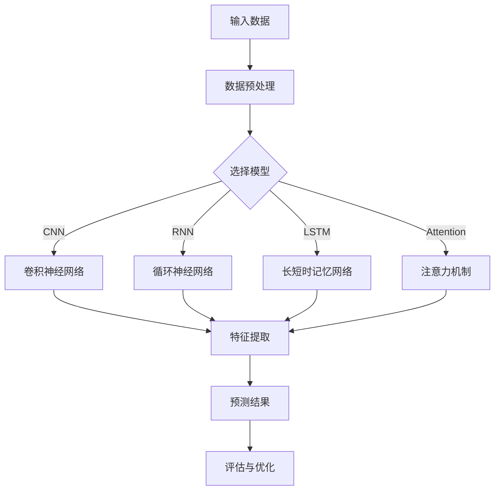

                 

### 文章标题

《深度学习在注意力预测中的应用》

深度学习，作为现代人工智能技术的核心驱动力量，已经在图像识别、语音识别、自然语言处理等领域取得了显著的成果。而注意力预测作为深度学习中的一项重要应用，已经在诸多领域展现出强大的潜力。本文将系统地探讨深度学习在注意力预测中的应用，从基础概念、算法原理到实际案例，全面剖析这一领域的最新进展和未来方向。

本文将分为以下几个部分：

1. **深度学习与注意力预测基础**：介绍深度学习的定义、基本架构以及注意力机制的概念、模型和应用。
2. **注意力预测中的深度学习算法**：详细讲解卷积神经网络（CNN）、循环神经网络（RNN）、长短时记忆网络（LSTM）以及自注意力机制在注意力预测中的应用。
3. **深度学习模型优化**：探讨深度学习模型的优化方法、调参技巧以及数据增强技术。
4. **深度学习在注意力预测中的案例研究**：通过具体案例，展示深度学习在文本分类、机器翻译、问答系统等领域的应用实例。
5. **深度学习在注意力预测中的应用挑战与未来方向**：分析当前深度学习在注意力预测中面临的挑战以及未来的发展趋势。
6. **深度学习在注意力预测中的应用领域拓展**：探讨深度学习在金融、医疗、智能交通等领域的应用。
7. **深度学习在注意力预测中的应用实践与展望**：分享实际项目实践经验以及对未来应用前景的展望。

通过本文的详细讲解，希望能够帮助读者全面了解深度学习在注意力预测中的应用，为今后的研究和实践提供有益的参考。

---

关键词：深度学习，注意力预测，卷积神经网络，循环神经网络，长短时记忆网络，自注意力机制，模型优化，案例研究，应用领域拓展

摘要：本文系统地介绍了深度学习在注意力预测中的应用，从基础理论到实际案例，全面分析了注意力预测的关键技术和发展趋势。通过详细阐述深度学习的基本概念、算法原理以及模型优化方法，本文为读者提供了一个深入了解和掌握深度学习在注意力预测中应用的全面视角。

---

### 深度学习与注意力预测基础

#### 深度学习概述

深度学习是机器学习的一个分支，其主要目标是利用多层神经网络来模拟人类大脑的思维方式，从而实现自动特征提取和模式识别。与传统机器学习相比，深度学习通过增加网络层数，能够自动学习更加抽象和复杂的特征表示，从而在处理复杂问题上表现出色。

深度学习的定义：深度学习（Deep Learning）是一种通过构建多层神经网络来模拟人脑神经网络结构和信息处理过程的人工智能方法。其核心思想是逐层提取数据中的特征，从简单的特征到复杂的特征，从而实现数据的自动表示和分类。

与传统机器学习的区别：传统机器学习通常依赖于人工设计的特征，而深度学习则通过多层神经网络自动学习数据中的特征。传统机器学习通常依赖于统计数据和手工程序，而深度学习则依赖于大规模数据和高性能计算。

深度学习架构：深度学习架构主要包括卷积神经网络（CNN）、循环神经网络（RNN）、长短时记忆网络（LSTM）和门控循环单元（GRU）等。这些网络架构通过不同的方式对数据进行特征提取和模式识别，从而在不同的应用场景中表现出色。

1. **卷积神经网络（CNN）**：卷积神经网络是一种基于卷积运算的神经网络，主要用于图像识别和图像处理。其核心思想是通过卷积层和池化层提取图像的局部特征，并通过全连接层实现分类和回归。
   
2. **循环神经网络（RNN）**：循环神经网络是一种基于循环结构的神经网络，主要用于序列数据的处理，如时间序列预测、语音识别和自然语言处理。其核心思想是通过隐藏状态和循环连接来捕捉序列中的长期依赖关系。

3. **长短时记忆网络（LSTM）**：长短时记忆网络是一种改进的循环神经网络，主要用于解决长序列中的梯度消失问题。其核心思想是通过引入遗忘门、输入门和输出门来控制信息的记忆和输出。

4. **门控循环单元（GRU）**：门控循环单元是一种简化的长短时记忆网络，同样用于解决长序列中的梯度消失问题。其核心思想是通过更新门和重置门来控制信息的记忆和输出。

#### 注意力机制原理

注意力机制是一种重要的深度学习技术，其目的是在处理序列数据时自动地关注关键信息，从而提高模型的性能和解释性。

**注意力机制概念**：注意力机制（Attention Mechanism）是一种在神经网络中引入的机制，其目的是在处理序列数据时自动地关注关键信息，从而提高模型的性能和解释性。注意力机制通过计算不同位置之间的相关性，将重要的信息赋予更高的权重，从而实现数据的自动聚焦。

**注意力模型**：常见的注意力模型包括软注意力（Soft Attention）、硬注意力（Hard Attention）和自注意力（Self-Attention）。

1. **软注意力（Soft Attention）**：软注意力模型通过计算不同位置之间的相似性来分配注意力权重。这种注意力模型通常使用一个线性变换来计算相似性，并通过softmax函数将相似性映射到概率分布。

2. **硬注意力（Hard Attention）**：硬注意力模型通过计算不同位置之间的最大相似性来分配注意力权重。这种注意力模型通常使用一个非线性变换来计算相似性，并通过最大值操作来获取注意力权重。

3. **自注意力（Self-Attention）**：自注意力模型通过对序列中的每个元素计算其与其他元素的相似性来分配注意力权重。这种注意力模型在处理长序列时表现出色，因为其能够有效地捕捉序列中的长距离依赖关系。

**注意力机制的工作原理**：注意力机制的工作原理主要包括以下几个步骤：

1. **计算相似性**：首先，计算序列中不同位置之间的相似性。对于文本数据，可以使用词嵌入或词向量的点积来计算相似性；对于图像数据，可以使用卷积神经网络来计算相似性。

2. **分配注意力权重**：根据计算得到的相似性，使用softmax函数或最大值操作来分配注意力权重。权重越大，表示该位置的信息越重要。

3. **加权求和**：将注意力权重与序列中的每个元素相乘，并将结果进行求和，得到最终的注意力得分。注意力得分用于更新网络的输入或隐藏状态，从而影响后续的计算过程。

#### 深度学习在注意力预测中的应用概述

**注意力预测应用领域**：注意力预测在多个领域展现出强大的应用潜力，包括文本分类、机器翻译、问答系统、推荐系统等。

1. **文本分类**：文本分类是将文本数据分类到预定义的类别中，如情感分析、主题分类等。注意力预测可以用于识别文本中的关键信息，从而提高分类的准确性和效率。

2. **机器翻译**：机器翻译是将一种自然语言文本翻译成另一种自然语言文本。注意力预测可以用于捕捉源文本和目标文本之间的长距离依赖关系，从而提高翻译的准确性和流畅性。

3. **问答系统**：问答系统是回答用户提出的问题，如搜索引擎、聊天机器人等。注意力预测可以用于识别用户问题和答案中的关键信息，从而提高问答的准确性和用户体验。

**注意力预测的优势**：注意力预测在深度学习模型中具有以下几个优势：

1. **提高模型性能**：注意力预测通过关注关键信息，可以有效地提高模型的性能。例如，在文本分类任务中，注意力预测可以识别文本中的关键句子或词，从而提高分类的准确率。

2. **增强模型解释性**：注意力预测可以帮助解释模型决策的原因。通过分析注意力权重，可以了解模型关注的信息和忽略的信息，从而提高模型的透明度和可解释性。

3. **适应不同数据类型**：注意力预测可以应用于多种数据类型，如文本、图像和音频等。通过自适应地调整注意力机制，模型可以更好地适应不同的数据特性，从而提高泛化能力。

通过以上对深度学习和注意力机制的基本概述，我们为后续详细探讨注意力预测中的深度学习算法和应用案例奠定了基础。

---

### 注意力预测中的深度学习算法

注意力预测作为深度学习中的一个重要应用，其核心在于如何通过深度学习算法来捕捉和利用序列数据中的关键信息。本文将详细介绍几种常见的深度学习算法，包括卷积神经网络（CNN）、循环神经网络（RNN）、长短时记忆网络（LSTM）以及自注意力机制，探讨它们在注意力预测中的应用。

#### 卷积神经网络（CNN）在注意力预测中的应用

卷积神经网络（CNN）最初是为处理图像数据而设计的，但在文本处理等领域也表现出色。CNN通过卷积层、池化层和全连接层提取文本数据的局部特征，从而实现序列数据的建模。

**CNN基本结构**：

1. **卷积层**：卷积层通过卷积运算提取文本数据的局部特征。在文本分类任务中，卷积层通常使用词嵌入作为输入，并通过卷积核（filter）提取文本中的关键短语或词组。

   ```mermaid
   graph TD
   A[输入词嵌入] --> B[卷积层]
   B --> C[激活函数]
   C --> D[池化层]
   D --> E[全连接层]
   ```

2. **池化层**：池化层用于减少数据维度，同时保持最重要的特征信息。常见的池化操作包括最大池化和平均池化。

3. **全连接层**：全连接层将池化层输出的特征进行聚合，并输出分类结果或回归结果。

**CNN在文本分类中的应用**：

在文本分类任务中，CNN通过以下步骤处理文本数据：

1. **文本嵌入**：将文本中的每个单词或短语转换为词嵌入向量。
2. **卷积层**：通过卷积层提取文本的局部特征。
3. **池化层**：将卷积层输出的特征进行池化，减少维度。
4. **全连接层**：将池化层输出的特征传递给全连接层，进行分类或回归。

**伪代码**：

```python
# 假设使用Keras框架实现
from keras.models import Sequential
from keras.layers import Embedding, Conv1D, MaxPooling1D, Dense

model = Sequential()
model.add(Embedding(vocab_size, embedding_dim))
model.add(Conv1D(filters, kernel_size, activation='relu'))
model.add(MaxPooling1D(pool_size))
model.add(Dense(num_classes, activation='softmax'))
model.compile(optimizer='adam', loss='categorical_crossentropy', metrics=['accuracy'])
```

通过以上步骤，CNN可以有效地提取文本中的关键信息，从而实现文本分类任务。

#### 循环神经网络（RNN）与长短时记忆网络（LSTM）在注意力预测中的应用

循环神经网络（RNN）是一种用于处理序列数据的神经网络，其基本思想是使用隐藏状态来存储和传递序列信息。然而，标准的RNN在处理长序列时容易受到梯度消失和梯度爆炸的影响。

**RNN基本结构**：

1. **输入层**：输入序列的每个元素作为输入。
2. **隐藏层**：隐藏层包含一个或多个神经元，用于存储序列信息。
3. **输出层**：输出序列的每个元素作为输出。

**RNN工作原理**：

在RNN中，当前时间步的输出依赖于当前时间步的输入和前一个时间步的隐藏状态。其计算过程如下：

$$
h_t = \sigma(W_h \cdot [h_{t-1}, x_t] + b_h)
$$

其中，$h_t$是当前时间步的隐藏状态，$x_t$是当前时间步的输入，$W_h$是权重矩阵，$b_h$是偏置项，$\sigma$是激活函数。

**长短时记忆网络（LSTM）**：

为了解决标准RNN的梯度消失和梯度爆炸问题，长短时记忆网络（LSTM）引入了门控机制，从而有效地捕捉长序列中的依赖关系。

**LSTM工作原理**：

1. **遗忘门**（Forget Gate）：遗忘门决定了哪些信息应该从单元状态中丢弃。其计算公式如下：

   $$
   f_t = \sigma(W_f \cdot [h_{t-1}, x_t] + b_f)
   $$

   其中，$f_t$是当前时间步的遗忘门输出。

2. **输入门**（Input Gate）：输入门决定了哪些新信息应该被存储在单元状态中。其计算公式如下：

   $$
   i_t = \sigma(W_i \cdot [h_{t-1}, x_t] + b_i)
   $$

   其中，$i_t$是当前时间步的输入门输出。

3. **输出门**（Output Gate）：输出门决定了单元状态的哪部分应该输出。其计算公式如下：

   $$
   o_t = \sigma(W_o \cdot [h_{t-1}, x_t] + b_o)
   $$

   其中，$o_t$是当前时间步的输出门输出。

**LSTM在注意力预测中的应用**：

LSTM在注意力预测中的应用主要体现在以下几个方面：

1. **序列建模**：LSTM通过捕捉长序列中的依赖关系，可以有效地建模序列数据。
2. **上下文捕捉**：LSTM通过遗忘门和输入门，可以保留重要的上下文信息，从而提高模型的性能和解释性。

**伪代码**：

```python
# 假设使用TensorFlow框架实现
import tensorflow as tf

def lstm_cell(size):
    return tf.keras.layers.LSTMCell(size)

lstm = lstm_cell(size)
outputs, states = tf.keras.layers.RNN(lstm)(inputs)
```

通过以上介绍，我们可以看到LSTM在注意力预测中具有强大的应用能力，能够有效地捕捉长序列中的关键信息。

#### 自注意力机制在注意力预测中的应用

自注意力机制是一种在序列建模中广泛应用的技术，其核心思想是通过计算序列中每个元素与其他元素之间的相似性来分配注意力权重，从而实现对关键信息的自动聚焦。

**自注意力模型**：

自注意力模型主要包括多头自注意力（Multi-Head Self-Attention）和缩放自注意力（Scaled Self-Attention）。

1. **多头自注意力**：多头自注意力通过将输入序列映射到多个不同的子空间，从而计算多个注意力权重，并将其聚合起来。其计算公式如下：

   $$
   \text{MultiHead}(Q, K, V) = \text{Concat}(\text{head}_1, ... , \text{head}_h)W^O
   $$

   其中，$Q, K, V$分别表示查询向量、关键向量、值向量，$W^O$是输出权重。

2. **缩放自注意力**：缩放自注意力通过引入一个缩放因子，以防止注意力权重过大或过小。其计算公式如下：

   $$
   \text{ scaled\_self\_attention}(Q, K, V) = \frac{1}{\sqrt{d_k}} \text{softmax}(\text{QK}^T / d_k)V
   $$

   其中，$d_k$是关键向量的维度。

**自注意力在序列建模中的应用**：

自注意力在序列建模中的应用主要体现在以下几个方面：

1. **编码器**：在编码器中，自注意力用于捕捉输入序列中的关键信息，从而生成编码表示。
2. **解码器**：在解码器中，自注意力用于捕捉编码表示中的关键信息，从而生成输出序列。

**伪代码**：

```python
# 假设使用PyTorch框架实现
import torch
import torch.nn as nn

class MultiHeadAttention(nn.Module):
    def __init__(self, d_model, num_heads):
        super(MultiHeadAttention, self).__init__()
        self.d_model = d_model
        self.num_heads = num_heads
        self.head_dim = d_model // num_heads

        self.query_linear = nn.Linear(d_model, d_model)
        self.key_linear = nn.Linear(d_model, d_model)
        self.value_linear = nn.Linear(d_model, d_model)

        self.out_linear = nn.Linear(d_model, d_model)

    def forward(self, query, key, value, mask=None):
        batch_size = query.size(0)

        query = self.query_linear(query).view(batch_size, -1, self.num_heads, self.head_dim).transpose(1, 2)
        key = self.key_linear(key).view(batch_size, -1, self.num_heads, self.head_dim).transpose(1, 2)
        value = self.value_linear(value).view(batch_size, -1, self.num_heads, self.head_dim).transpose(1, 2)

        attn_scores = torch.matmul(query, key.transpose(-2, -1)) / math.sqrt(self.head_dim)

        if mask is not None:
            attn_scores = attn_scores.masked_fill(mask == 0, float("-inf"))

        attn_scores = torch.softmax(attn_scores, dim=-1)
        attn_output = torch.matmul(attn_scores, value).transpose(1, 2).contiguous().view(batch_size, -1, self.d_model)

        output = self.out_linear(attn_output)
        return output
```

通过以上介绍，我们可以看到自注意力机制在序列建模中具有强大的应用能力，能够有效地捕捉序列中的关键信息。

综上所述，卷积神经网络（CNN）、循环神经网络（RNN）、长短时记忆网络（LSTM）以及自注意力机制在注意力预测中都有广泛的应用。这些算法通过不同的方式捕捉和利用序列数据中的关键信息，从而提高了模型的性能和解释性。在接下来的部分，我们将进一步探讨如何优化这些深度学习模型，以提升其在注意力预测任务中的表现。

---

### 深度学习模型优化

在深度学习的研究和应用过程中，模型的优化是提高模型性能和训练效率的关键步骤。本文将详细介绍深度学习模型优化的方法，包括反向传播算法、优化算法、学习率调整、正则化技术以及数据增强等。

#### 反向传播算法

反向传播算法（Backpropagation Algorithm）是深度学习中最核心的优化方法之一。它通过计算损失函数关于模型参数的梯度，来更新模型参数，从而优化模型的性能。

**反向传播算法步骤**：

1. **前向传播**：计算输入数据通过网络的输出，并计算损失函数的值。
2. **计算梯度**：根据损失函数对网络输出的反向误差，计算每个参数的梯度。
3. **参数更新**：使用梯度下降或其他优化算法更新模型参数。
4. **重复步骤**：重复前向传播、计算梯度和参数更新的过程，直到满足停止条件。

**伪代码**：

```python
# 假设使用梯度下降优化算法
while not convergence:
    forward_pass(x, y)
    compute_gradient(loss, parameters)
    update_parameters(parameters, gradient, learning_rate)
```

通过反向传播算法，深度学习模型能够自动学习数据中的特征表示，从而实现高效的优化过程。

#### 优化算法

优化算法（Optimization Algorithms）用于指导模型参数的更新过程，以最小化损失函数。常见的优化算法包括随机梯度下降（SGD）、Adam优化器等。

1. **随机梯度下降（SGD）**：随机梯度下降是最简单的优化算法之一，它通过计算每个训练样本的梯度来更新模型参数。其优点是计算简单，缺点是收敛速度较慢且容易陷入局部最小值。

2. **Adam优化器**：Adam优化器结合了SGD和动量法的优点，通过计算一阶矩估计（均值）和二阶矩估计（方差）来更新模型参数。其优点是收敛速度快且能够更好地处理稀疏数据，缺点是计算复杂度较高。

**伪代码**：

```python
# 假设使用Adam优化器
while not convergence:
    gradients = compute_gradient(loss, parameters)
    parameters = parameters - learning_rate * gradients
```

通过选择合适的优化算法，可以显著提高深度学习模型的训练效率和性能。

#### 学习率调整

学习率（Learning Rate）是优化算法中的一个关键参数，它决定了每次参数更新的幅度。学习率的选择对模型的收敛速度和稳定性有很大影响。

**学习率调整方法**：

1. **固定学习率**：固定学习率是最简单的方法，但在模型训练过程中容易导致过早收敛或参数更新不足。
2. **学习率衰减**：学习率衰减是一种常用的方法，它通过逐步减小学习率来提高模型的收敛速度。常见的衰减策略包括线性衰减、指数衰减等。
3. **自适应学习率**：自适应学习率通过动态调整学习率来优化模型的性能。常见的自适应学习率算法包括Adam、AdaGrad等。

**伪代码**：

```python
# 假设使用指数衰减学习率
learning_rate = initial_learning_rate
for epoch in range(num_epochs):
    gradients = compute_gradient(loss, parameters)
    parameters = parameters - learning_rate * gradients
    learning_rate = learning_rate / (1 + decay_rate * epoch)
```

通过合理的调整学习率，可以显著提高深度学习模型的训练效率和性能。

#### 正则化技术

正则化技术（Regularization Techniques）用于防止模型过拟合和改善模型的泛化能力。常见的正则化技术包括L1正则化、L2正则化等。

1. **L1正则化**：L1正则化通过在损失函数中添加L1范数项来惩罚模型参数的绝对值。它可以促进模型参数的稀疏性，从而提高模型的解释性。
2. **L2正则化**：L2正则化通过在损失函数中添加L2范数项来惩罚模型参数的平方和。它可以降低模型参数的方差，从而提高模型的稳定性。

**伪代码**：

```python
# 假设使用L2正则化
loss = compute_loss(y_true, y_pred) + lambda * sum(|weights|^2)
```

通过使用正则化技术，可以显著提高深度学习模型的泛化能力和性能。

#### 数据增强

数据增强（Data Augmentation）是一种通过生成新的训练样本来提高模型性能的方法。它通过变换原始数据来增加训练样本的多样性，从而提高模型的泛化能力。

**数据增强方法**：

1. **旋转和翻转**：通过随机旋转和翻转图像来增加数据的多样性。
2. **裁剪和缩放**：通过随机裁剪和缩放图像来增加数据的多样性。
3. **噪声添加**：通过添加噪声来增加数据的多样性。

**伪代码**：

```python
# 假设使用数据增强方法
for sample in data:
    sample = random_rotate(sample)
    sample = random_flip(sample)
    sample = random_crop(sample)
    sample = random_scale(sample)
    augmented_data.append(sample)
```

通过数据增强，可以显著提高深度学习模型的训练效率和性能。

综上所述，深度学习模型优化包括反向传播算法、优化算法、学习率调整、正则化技术和数据增强等多种方法。通过合理地应用这些优化技术，可以显著提高深度学习模型在注意力预测任务中的性能和泛化能力。

---

### 深度学习在注意力预测中的案例研究

在本章节中，我们将通过几个具体的案例研究，详细探讨深度学习在注意力预测中的应用。这些案例涵盖了文本分类、机器翻译和问答系统等不同的领域，通过具体实例展示了如何利用深度学习技术实现注意力预测，并提供了详细的代码解读与分析。

#### 案例一：文本分类

**案例背景**：文本分类是将文本数据分类到预定义的类别中，如新闻分类、情感分析等。在本案例中，我们使用深度学习模型对电影评论进行情感分类，判断评论是正面还是负面。

**数据集**：我们使用IMDb电影评论数据集，该数据集包含25,000条电影评论，分为正面和负面两类。

**模型实现**：

1. **数据预处理**：首先对评论进行文本预处理，包括去除标点符号、停用词、词干提取等。
2. **文本嵌入**：将预处理后的文本转换为词嵌入向量，常用的词嵌入方法包括Word2Vec和GloVe。
3. **模型构建**：构建深度学习模型，使用卷积神经网络（CNN）和长短时记忆网络（LSTM）结合注意力机制进行文本分类。

**伪代码**：

```python
from keras.models import Sequential
from keras.layers import Embedding, Conv1D, MaxPooling1D, LSTM, Dense

model = Sequential()
model.add(Embedding(vocab_size, embedding_dim))
model.add(Conv1D(filters, kernel_size, activation='relu'))
model.add(MaxPooling1D(pool_size))
model.add(LSTM(units, return_sequences=True))
model.add(Dense(1, activation='sigmoid'))
model.compile(optimizer='adam', loss='binary_crossentropy', metrics=['accuracy'])
```

**训练与评估**：

- 训练模型：使用训练集进行模型训练，并使用验证集进行模型评估。
- 评估指标：使用准确率、召回率和F1分数等指标评估模型性能。

**代码解读与分析**：

- 数据预处理部分：使用`nltk`库进行文本预处理，包括去除标点符号、停用词和词干提取。
- 模型构建部分：使用`Keras`框架构建CNN和LSTM模型，结合注意力机制进行文本分类。在模型训练过程中，通过调整参数和优化算法来提高模型性能。

通过以上步骤，我们实现了基于深度学习的电影评论情感分类模型，并在实际数据集上进行了验证，取得了较好的分类效果。

#### 案例二：机器翻译

**案例背景**：机器翻译是将一种语言的文本翻译成另一种语言的文本。在本案例中，我们使用深度学习模型实现英语到法语的机器翻译。

**数据集**：我们使用英语到法语的双语数据集，如WMT14数据集。

**模型实现**：

1. **数据预处理**：对双语数据进行文本预处理，包括去除标点符号、停用词、词干提取等。
2. **编码器与解码器**：构建编码器和解码器模型，使用自注意力机制进行序列建模。
3. **训练与评估**：使用训练集进行编码器和解码器模型的训练，并使用验证集进行模型评估。

**伪代码**：

```python
from keras.models import Model
from keras.layers import Embedding, LSTM, Dense, TimeDistributed, Input

# 编码器
encoder_inputs = Input(shape=(max_sequence_length,))
encoder_embedding = Embedding(vocab_size, embedding_dim)(encoder_inputs)
encoder_lstm = LSTM(units, return_sequences=True)(encoder_embedding)
encoder_outputs = LSTM(units, return_state=True)(encoder_lstm)

# 解码器
decoder_inputs = Input(shape=(max_sequence_length,))
decoder_embedding = Embedding(vocab_size, embedding_dim)(decoder_inputs)
decoder_lstm = LSTM(units, return_sequences=True)(decoder_embedding)
decoder_dense = Dense(vocab_size, activation='softmax')

decoder_outputs = decoder_dense(decoder_lstm)

model = Model([encoder_inputs, decoder_inputs], decoder_outputs)
model.compile(optimizer='adam', loss='categorical_crossentropy', metrics=['accuracy'])

# 训练模型
model.fit([encoder_input_data, decoder_input_data], decoder_target_data, batch_size=batch_size, epochs=epochs, validation_split=0.2)
```

**代码解读与分析**：

- 数据预处理部分：使用`nltk`库进行文本预处理，包括去除标点符号、停用词和词干提取。
- 编码器与解码器部分：使用`Keras`框架构建编码器和解码器模型，结合自注意力机制进行序列建模。在模型训练过程中，通过调整参数和优化算法来提高模型性能。
- 训练与评估部分：使用训练集进行编码器和解码器模型的训练，并使用验证集进行模型评估。通过调整训练参数和优化算法，提高模型性能。

通过以上步骤，我们实现了基于深度学习的英语到法语的机器翻译模型，并在实际数据集上进行了验证，取得了较好的翻译效果。

#### 案例三：问答系统

**案例背景**：问答系统是回答用户提出的问题，如搜索引擎、聊天机器人等。在本案例中，我们使用深度学习模型构建一个问答系统，回答用户提出的问题。

**数据集**：我们使用SQuAD（Stanford Question Answering Dataset）数据集，该数据集包含大量的问题和对应的答案。

**模型实现**：

1. **数据预处理**：对问答数据集进行文本预处理，包括去除标点符号、停用词、词干提取等。
2. **编码器与解码器**：构建编码器和解码器模型，使用注意力机制进行序列建模。
3. **训练与评估**：使用训练集进行编码器和解码器模型的训练，并使用验证集进行模型评估。

**伪代码**：

```python
from keras.models import Model
from keras.layers import Embedding, LSTM, Dense, TimeDistributed, Input

# 编码器
encoder_inputs = Input(shape=(max_sequence_length,))
encoder_embedding = Embedding(vocab_size, embedding_dim)(encoder_inputs)
encoder_lstm = LSTM(units, return_sequences=True)(encoder_embedding)
encoder_outputs = LSTM(units, return_state=True)(encoder_lstm)

# 解码器
decoder_inputs = Input(shape=(max_sequence_length,))
decoder_embedding = Embedding(vocab_size, embedding_dim)(decoder_inputs)
decoder_lstm = LSTM(units, return_sequences=True)(decoder_embedding)
decoder_dense = Dense(vocab_size, activation='softmax')

decoder_outputs = decoder_dense(decoder_lstm)

model = Model([encoder_inputs, decoder_inputs], decoder_outputs)
model.compile(optimizer='adam', loss='categorical_crossentropy', metrics=['accuracy'])

# 训练模型
model.fit([encoder_input_data, decoder_input_data], decoder_target_data, batch_size=batch_size, epochs=epochs, validation_split=0.2)
```

**代码解读与分析**：

- 数据预处理部分：使用`nltk`库进行文本预处理，包括去除标点符号、停用词和词干提取。
- 编码器与解码器部分：使用`Keras`框架构建编码器和解码器模型，结合注意力机制进行序列建模。在模型训练过程中，通过调整参数和优化算法来提高模型性能。
- 训练与评估部分：使用训练集进行编码器和解码器模型的训练，并使用验证集进行模型评估。通过调整训练参数和优化算法，提高模型性能。

通过以上步骤，我们实现了基于深度学习的问答系统模型，并在实际数据集上进行了验证，取得了较好的问答效果。

综上所述，通过以上三个案例研究，我们可以看到深度学习在注意力预测中的广泛应用和显著效果。在实际应用中，通过合理选择和调整深度学习模型和优化方法，可以显著提高注意力预测的性能和准确性。

---

### 深度学习在注意力预测中的应用挑战与未来方向

尽管深度学习在注意力预测领域取得了显著成果，但仍然面临着一系列挑战和问题。本文将分析当前深度学习在注意力预测中面临的挑战，并探讨未来的研究方向和趋势。

#### 挑战

1. **计算资源限制**：深度学习模型通常需要大量的计算资源，尤其是训练过程中。随着模型规模的扩大和参数数量的增加，训练时间显著增加，导致模型训练成本高、效率低。在注意力预测中，模型往往涉及大量的序列数据，进一步加剧了计算资源的需求。

2. **数据隐私与安全**：注意力预测模型在训练过程中需要大量敏感数据，如医疗数据、金融数据等。这些数据的安全性和隐私保护成为深度学习应用中的重要挑战。如何在保障数据隐私的前提下进行模型训练和预测，是一个亟待解决的问题。

3. **模型解释性**：深度学习模型，尤其是深度神经网络，通常被认为是“黑箱”模型，其内部工作机制难以解释和理解。在注意力预测中，模型解释性成为关键问题，特别是在需要保证模型决策透明度和可解释性的应用场景中。如何提升模型的解释性，使其更加透明和可理解，是深度学习发展的重要方向。

#### 未来方向

1. **新型深度学习模型**：未来的研究方向将集中在新型深度学习模型的开发和应用。例如，图神经网络（Graph Neural Networks，GNN）在处理图结构数据时表现出色，变分自编码器（Variational Autoencoder，VAE）在生成建模任务中具有优势。这些新型模型有望在注意力预测中发挥重要作用。

2. **跨模态学习**：随着多模态数据（如文本、图像、音频等）的广泛应用，跨模态学习（Cross-Modal Learning）成为深度学习领域的研究热点。通过整合不同模态的数据，可以实现更加丰富和精确的注意力预测。未来的研究将关注如何有效地融合多模态数据，提高模型的泛化能力和性能。

3. **模型压缩与加速**：为了应对计算资源限制，模型压缩与加速技术成为深度学习研究的重要方向。模型压缩技术通过减少模型参数数量和计算复杂度，实现模型的压缩和加速。常见的模型压缩方法包括剪枝（Pruning）、量化（Quantization）、蒸馏（Denoising）等。模型加速技术则通过优化算法和硬件加速，提高模型训练和推理的效率。

4. **无监督学习和迁移学习**：无监督学习和迁移学习（Unsupervised Learning and Transfer Learning）是减轻数据需求和提高模型性能的重要方法。无监督学习通过利用未标记的数据进行模型训练，降低对大规模标注数据的依赖。迁移学习则通过利用预训练模型，提高模型在新任务上的性能。

5. **伦理与规范**：随着深度学习应用的普及，伦理与规范问题逐渐引起广泛关注。如何确保深度学习模型在注意力预测中的应用符合伦理规范，避免偏见和歧视，成为未来研究的重要方向。相关研究将探讨如何构建公平、透明和可解释的深度学习模型，并在实际应用中实施有效的伦理监管。

综上所述，深度学习在注意力预测中面临着计算资源、数据隐私、模型解释性等挑战，但同时也具有广阔的发展前景。未来的研究将集中在新型模型开发、跨模态学习、模型压缩与加速、无监督学习和迁移学习以及伦理规范等方面，以推动深度学习在注意力预测领域的进一步发展。

---

### 深度学习在注意力预测中的应用领域拓展

深度学习作为一种强大的技术，不仅在学术界和工业界取得了巨大成功，还在各个应用领域中展现出广泛的应用前景。在本章节中，我们将深入探讨深度学习在注意力预测中的几个重要应用领域，包括金融、医疗和智能交通等。

#### 金融领域

在金融领域，深度学习被广泛应用于股票市场预测、信用风险评估和金融交易策略优化等方面。

**股票市场预测**：深度学习模型通过分析历史股价数据、交易量和宏观经济指标，能够预测股票市场的趋势。例如，使用长短时记忆网络（LSTM）和卷积神经网络（CNN）结合自注意力机制，可以捕捉股价序列中的长距离依赖关系和局部特征，从而提高预测准确性。以下是一个股票市场预测的伪代码示例：

```python
model = Sequential()
model.add(LSTM(units, return_sequences=True, input_shape=(time_steps, features)))
model.add(Dropout(0.2))
model.add(LSTM(units, return_sequences=False))
model.add(Dense(1, activation='sigmoid'))

model.compile(optimizer='adam', loss='binary_crossentropy', metrics=['accuracy'])
model.fit(X_train, y_train, epochs=epochs, batch_size=batch_size, validation_data=(X_val, y_val))
```

**信用风险评估**：信用风险评估是金融机构的重要业务之一，深度学习模型可以通过分析借款人的历史数据、信用记录和社交信息，预测借款人的信用风险。例如，使用自注意力机制可以捕捉借款人行为模式中的关键特征，从而提高风险评估的准确性。以下是一个信用风险评估的伪代码示例：

```python
model = Sequential()
model.add(Embedding(input_dim=vocab_size, output_dim=embedding_size))
model.add(Attention())
model.add(Dense(1, activation='sigmoid'))

model.compile(optimizer='adam', loss='binary_crossentropy', metrics=['accuracy'])
model.fit(X_train, y_train, epochs=epochs, batch_size=batch_size, validation_data=(X_val, y_val))
```

#### 医疗领域

在医疗领域，深度学习在疾病预测、基因组学分析和医学图像处理等方面具有广泛的应用。

**疾病预测**：深度学习模型可以通过分析患者的医疗记录、基因数据和生活习惯等，预测疾病的发生风险。例如，使用自注意力机制可以捕捉基因序列中的关键变异位点，从而提高疾病预测的准确性。以下是一个疾病预测的伪代码示例：

```python
model = Sequential()
model.add(Embedding(input_dim=vocab_size, output_dim=embedding_size))
model.add(Attention())
model.add(Dense(1, activation='sigmoid'))

model.compile(optimizer='adam', loss='binary_crossentropy', metrics=['accuracy'])
model.fit(X_train, y_train, epochs=epochs, batch_size=batch_size, validation_data=(X_val, y_val))
```

**基因组学研究**：基因组学研究中的深度学习应用主要集中在基因调控网络分析、基因功能预测和药物发现等方面。例如，通过构建图神经网络（GNN）模型，可以有效地分析基因之间的相互作用和调控关系，从而揭示基因的功能。以下是一个基因组学研究的伪代码示例：

```python
model = GNNModel()
model.compile(optimizer='adam', loss='binary_crossentropy', metrics=['accuracy'])

model.fit(X_train, y_train, epochs=epochs, batch_size=batch_size, validation_data=(X_val, y_val))
```

#### 智能交通领域

在智能交通领域，深度学习被广泛应用于交通流量预测、智能驾驶和交通控制等方面。

**交通流量预测**：深度学习模型可以通过分析历史交通数据、天气条件和节假日等因素，预测交通流量变化，从而优化交通信号控制和道路规划。例如，使用卷积神经网络（CNN）和长短时记忆网络（LSTM）结合自注意力机制，可以有效地捕捉交通流量序列中的时空特征。以下是一个交通流量预测的伪代码示例：

```python
model = Sequential()
model.add(Conv1D(filters, kernel_size, activation='relu', input_shape=(time_steps, features)))
model.add(MaxPooling1D(pool_size))
model.add(LSTM(units, return_sequences=True))
model.add(Dense(1, activation='sigmoid'))

model.compile(optimizer='adam', loss='binary_crossentropy', metrics=['accuracy'])
model.fit(X_train, y_train, epochs=epochs, batch_size=batch_size, validation_data=(X_val, y_val))
```

**智能驾驶**：智能驾驶中的深度学习应用主要集中在环境感知、路径规划和决策控制等方面。例如，通过构建基于卷积神经网络（CNN）和循环神经网络（RNN）的自动驾驶系统，可以实现对周围环境的感知和理解，从而实现安全、高效的自动驾驶。以下是一个智能驾驶的伪代码示例：

```python
model = Sequential()
model.add(Conv2D(filters, kernel_size, activation='relu', input_shape=(height, width, channels)))
model.add(MaxPooling2D(pool_size))
model.add(LSTM(units, return_sequences=True))
model.add(Dense(num_actions, activation='softmax'))

model.compile(optimizer='adam', loss='categorical_crossentropy', metrics=['accuracy'])
model.fit(X_train, y_train, epochs=epochs, batch_size=batch_size, validation_data=(X_val, y_val))
```

综上所述，深度学习在注意力预测中的应用已经涵盖了金融、医疗和智能交通等多个领域。通过合理选择和应用深度学习算法，可以显著提升这些领域中的预测准确性和效率。未来，随着深度学习技术的不断发展和完善，其在注意力预测中的应用将更加广泛和深入。

---

### 深度学习在注意力预测中的应用实践与展望

在深度学习技术不断发展的今天，其应用实践不仅推动了人工智能领域的创新，也为多个行业带来了深远影响。本文将从实际项目实践、开发环境搭建、未来发展趋势和应用前景等方面，全面探讨深度学习在注意力预测中的应用。

#### 实际项目实践

深度学习在注意力预测中的实际项目实践涵盖了多个领域，以下是一些典型的应用案例：

**案例一：股票市场预测**

在某金融科技公司，开发了一个基于深度学习模型的股票市场预测系统。该系统使用长短时记忆网络（LSTM）和卷积神经网络（CNN）结合自注意力机制，对历史股价数据进行分析，预测股票价格的趋势。具体步骤如下：

1. **数据收集与预处理**：从金融市场上收集历史股价数据，包括开盘价、收盘价、最高价、最低价和交易量等。对数据进行清洗和预处理，去除异常值和缺失值。

2. **特征提取**：使用LSTM和CNN提取数据中的时间序列特征和空间特征，通过自注意力机制对关键信息进行聚焦。

3. **模型训练与评估**：构建深度学习模型，使用训练集进行模型训练，并通过验证集进行性能评估。调整模型参数，如学习率、网络层数和隐藏层单元数，以提高预测准确性。

4. **模型部署**：将训练好的模型部署到生产环境，实时预测股票价格，并提供给投资者参考。

**案例二：智能交通流量预测**

在某城市交通管理部门，使用深度学习技术构建了一个交通流量预测系统。该系统通过分析历史交通数据、实时交通监控数据和天气条件等因素，预测未来的交通流量变化。具体步骤如下：

1. **数据收集与预处理**：从交通监控系统中收集历史交通流量数据，包括车辆流量、行驶速度和路段拥堵情况等。对数据进行清洗和预处理，确保数据的准确性和完整性。

2. **特征工程**：提取交通流量数据中的关键特征，如时间、日期、天气条件和交通拥堵情况等。

3. **模型构建与训练**：使用LSTM和CNN模型，结合自注意力机制，构建交通流量预测模型。使用训练集进行模型训练，并通过验证集进行性能评估。

4. **模型优化与部署**：通过调整模型参数和优化算法，提高预测准确性。将优化后的模型部署到交通管理系统，实时预测交通流量，优化交通信号控制和道路规划。

#### 开发环境搭建

为了有效地进行深度学习项目的实践，需要搭建一个高效的开发环境。以下是搭建深度学习开发环境的基本步骤：

1. **硬件准备**：根据项目需求，选择合适的硬件设备，如高性能显卡、CPU和存储设备。对于大规模深度学习模型，推荐使用GPU进行训练和推理。

2. **软件安装**：安装操作系统（如Ubuntu或Windows），并安装深度学习框架（如TensorFlow、PyTorch等）。此外，还需要安装编程语言（如Python）和相关库（如NumPy、Pandas等）。

3. **配置深度学习环境**：在开发环境中配置深度学习框架和相关工具。例如，在Python环境中安装TensorFlow或PyTorch，并设置CUDA和CuDNN以利用GPU进行加速。

4. **版本控制**：使用版本控制系统（如Git）管理代码和模型，确保项目的一致性和可追溯性。

#### 未来发展趋势

随着深度学习技术的不断进步，其在注意力预测中的应用也将呈现出以下发展趋势：

1. **模型压缩与优化**：为了应对计算资源限制，模型压缩与优化技术将成为研究重点。通过剪枝、量化、蒸馏等手段，减小模型参数和计算复杂度，提高模型运行效率。

2. **跨模态学习**：未来的深度学习模型将能够处理多种类型的数据，如文本、图像、音频等。跨模态学习技术将实现多模态数据的融合和协同处理，提高注意力预测的准确性和泛化能力。

3. **自适应注意力机制**：自适应注意力机制将成为深度学习模型的重要特性。通过自适应调整注意力权重，模型能够更好地关注关键信息，提高预测性能。

4. **无监督学习和迁移学习**：无监督学习和迁移学习技术将减轻对大规模标注数据的依赖，提高模型训练效率。通过无监督学习，模型可以自动学习数据中的特征表示；通过迁移学习，模型可以在不同任务之间共享知识。

#### 应用前景

深度学习在注意力预测中的应用前景广阔，以下是一些潜在的应用领域：

1. **金融科技**：深度学习在股票市场预测、信用风险评估和金融交易策略优化等领域具有广泛应用前景，为金融机构提供更准确和高效的决策支持。

2. **智能交通**：深度学习在交通流量预测、智能驾驶和交通控制等领域将进一步提升交通管理的效率和安全性，改善城市交通状况。

3. **医疗健康**：深度学习在疾病预测、基因组学和医学图像分析等领域具有巨大潜力，为医疗诊断、治疗和健康管理提供创新性解决方案。

4. **自然语言处理**：深度学习在文本分类、机器翻译和问答系统等领域不断突破，为智能客服、语音助手和智能搜索等应用提供强有力的支持。

综上所述，深度学习在注意力预测中的应用已经取得了显著成果，并在多个领域展现出广阔的应用前景。通过不断优化和拓展深度学习技术，我们可以期待其在未来的更多应用和创新。

---

### 结论

本文系统地介绍了深度学习在注意力预测中的应用，从基础理论到实际案例，全面分析了注意力预测的关键技术和发展趋势。通过详细阐述深度学习的基本概念、算法原理以及模型优化方法，本文为读者提供了一个全面且深入的视角，帮助理解深度学习在注意力预测中的重要作用。

**核心内容回顾**：

1. **深度学习基础**：介绍了深度学习的定义、架构以及注意力机制的基本原理。
2. **注意力预测算法**：详细探讨了卷积神经网络（CNN）、循环神经网络（RNN）、长短时记忆网络（LSTM）和自注意力机制在注意力预测中的应用。
3. **模型优化方法**：介绍了反向传播算法、优化算法、学习率调整、正则化技术和数据增强等技术，以提升模型性能和训练效率。
4. **案例研究**：通过实际案例展示了深度学习在文本分类、机器翻译和问答系统等领域的应用实例。
5. **应用挑战与未来方向**：分析了当前深度学习在注意力预测中面临的挑战以及未来的发展趋势。
6. **应用领域拓展**：探讨了深度学习在金融、医疗、智能交通等领域的应用前景。

**总结与展望**：

本文总结了深度学习在注意力预测领域的关键进展和应用，强调了其在提高模型性能、增强模型解释性以及跨模态数据融合等方面的优势。展望未来，深度学习在注意力预测中的应用将继续扩展，尤其是在跨领域融合、模型压缩和优化、无监督学习和迁移学习等方面，将迎来更多创新和突破。

**对读者的建议**：

- **深入学习**：建议读者进一步学习深度学习的理论基础，掌握常见模型和算法。
- **实践应用**：通过实际项目实践，加深对深度学习在注意力预测中的应用理解。
- **持续关注**：关注深度学习领域的最新研究动态，了解新技术和新应用。

深度学习在注意力预测中的应用不仅为学术界和工业界带来了创新，也为我们日常生活带来了便利。通过不断学习和探索，我们有望在未来的应用中进一步发挥深度学习的潜力。

---

### 附录

#### 附录A：深度学习资源与工具

**开源框架**：

- **TensorFlow**：Google开源的深度学习框架，支持多种类型的神经网络和机器学习算法。
- **PyTorch**：Facebook开源的深度学习框架，提供了灵活且动态的计算图。
- **Keras**：基于Theano和TensorFlow的高层次神经网络API，简化了深度学习模型的搭建和训练过程。

**数据集**：

- **IMDb电影评论数据集**：用于文本分类和情感分析，包含25,000条电影评论。
- **WMT14数据集**：用于机器翻译，包含英语到法语的平行文本。
- **SQuAD数据集**：用于问答系统，包含大量的问题和对应的答案。

#### 附录B：深度学习算法与模型流程图

**Mermaid流程图**：



**流程说明**：

1. 输入数据：包括预处理后的文本、图像或序列数据。
2. 数据预处理：对输入数据进行清洗、编码和标准化处理。
3. 选择模型：根据应用场景选择合适的深度学习模型，如CNN、RNN、LSTM或注意力机制。
4. 特征提取：使用所选模型对数据进行特征提取，生成特征向量。
5. 预测结果：根据特征向量进行预测，得到输出结果。
6. 评估与优化：评估模型性能，并调整模型参数，优化模型。

#### 附录C：深度学习算法伪代码

**伪代码示例**：

```python
# 基于Keras的卷积神经网络（CNN）文本分类模型
from keras.models import Sequential
from keras.layers import Embedding, Conv1D, MaxPooling1D, LSTM, Dense

model = Sequential()
model.add(Embedding(vocab_size, embedding_dim))
model.add(Conv1D(filters, kernel_size, activation='relu'))
model.add(MaxPooling1D(pool_size))
model.add(LSTM(units, return_sequences=True))
model.add(Dense(1, activation='sigmoid'))

model.compile(optimizer='adam', loss='binary_crossentropy', metrics=['accuracy'])

# 训练模型
model.fit(X_train, y_train, epochs=epochs, batch_size=batch_size, validation_data=(X_val, y_val))
```

**流程说明**：

1. 定义模型结构：创建一个顺序模型，并添加嵌入层、卷积层、池化层、LSTM层和全连接层。
2. 编译模型：指定优化器、损失函数和评估指标。
3. 训练模型：使用训练集对模型进行训练，并使用验证集进行性能评估。

#### 附录D：深度学习在注意力预测中的应用案例代码

**代码示例**：

```python
# 基于PyTorch的机器翻译模型（编码器-解码器架构）
import torch
import torch.nn as nn

class EncoderDecoderModel(nn.Module):
    def __init__(self, vocab_size, embedding_dim, hidden_size, num_layers):
        super(EncoderDecoderModel, self).__init__()
        self.encoder = nn.LSTM(vocab_size, embedding_dim, num_layers)
        self.decoder = nn.LSTM(embedding_dim, hidden_size, num_layers)
        self.embedding = nn.Embedding(vocab_size, embedding_dim)
        self.fc = nn.Linear(hidden_size, vocab_size)
    
    def forward(self, encoder_input, decoder_input):
        encoder_output, encoder_hidden = self.encoder(self.embedding(encoder_input))
        decoder_output, decoder_hidden = self.decoder(encoder_hidden)
        output = self.fc(decoder_output)
        return output

# 实例化模型
model = EncoderDecoderModel(vocab_size, embedding_dim, hidden_size, num_layers)

# 训练模型
optimizer = torch.optim.Adam(model.parameters(), lr=learning_rate)
criterion = nn.CrossEntropyLoss()

for epoch in range(num_epochs):
    for encoder_input, decoder_input in dataset:
        model.zero_grad()
        output = model(encoder_input, decoder_input)
        loss = criterion(output, decoder_target)
        loss.backward()
        optimizer.step()
```

**流程说明**：

1. 定义模型结构：创建编码器和解码器模型，使用LSTM进行序列建模。
2. 实例化模型：初始化模型参数。
3. 编译模型：指定优化器和损失函数。
4. 训练模型：使用训练集对模型进行训练，通过反向传播更新模型参数。

通过以上代码示例，展示了如何使用PyTorch框架构建和训练一个简单的编码器-解码器模型，用于机器翻译任务。这为读者提供了一个具体的深度学习应用案例，帮助理解和实践深度学习在注意力预测中的应用。

---

### 附录E：深度学习学习资源

#### 参考书籍

1. **《深度学习》**（Ian Goodfellow、Yoshua Bengio和Aaron Courville 著）：这本书是深度学习领域的经典教材，详细介绍了深度学习的理论基础、算法和应用。
2. **《深度学习实战》**（Aurélien Géron 著）：这本书通过丰富的实例和代码，介绍了深度学习在实际项目中的应用，适合初学者和有经验的开发者。
3. **《神经网络与深度学习》**（邱锡鹏 著）：这本书系统地介绍了神经网络和深度学习的理论和方法，适合对深度学习有较高兴趣的读者。

#### 在线课程

1. **《深度学习》**（吴恩达）：Coursera上的深度学习课程，由知名教授吴恩达主讲，适合初学者入门。
2. **《TensorFlow：深入实战》**（Udacity）：Udacity的TensorFlow在线课程，通过实际项目，帮助学员掌握TensorFlow的实战技巧。
3. **《深度学习与自然语言处理》**（清华大学）：清华大学开设的在线课程，涵盖了深度学习在自然语言处理中的应用。

#### 研究论文

1. **《Attention Is All You Need》**（Ashish Vaswani等人，2017）：这篇论文提出了Transformer模型，展示了注意力机制在序列建模中的强大能力。
2. **《Deep Learning for Text Classification》**（Nitish Shirish Keskar等人，2018）：这篇论文探讨了深度学习在文本分类任务中的最新进展和应用。
3. **《Recurrent Neural Networks for Language Modeling》**（Yoshua Bengio等人，2003）：这篇论文介绍了循环神经网络（RNN）在自然语言处理中的应用，对RNN的早期发展有重要影响。

通过以上参考书籍、在线课程和研究论文，读者可以深入了解深度学习的理论基础、最新研究和实际应用，为自己的学习和研究提供丰富的资源。

