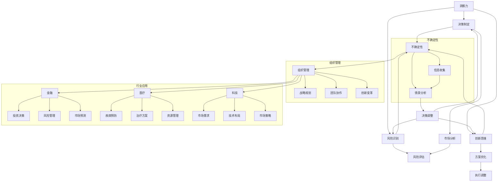

                 

# 理解洞察力的重要性：在不确定性中的价值

## 摘要

在当今高度复杂和快速变化的世界中，洞察力成为了人们决策和成功的关键因素。本文将探讨洞察力的定义、重要性以及在不确定环境中如何培养和运用洞察力。通过详细分析其在个体决策和组织管理中的具体应用，并结合金融、医疗和科技创新等行业中的实战案例，本文旨在揭示洞察力在应对不确定性中的核心价值，为读者提供实用的策略和方法。

## 目录大纲

### 第1章 引言
#### 1.1 书籍背景与目标
#### 1.2 洞察力的定义与重要性
#### 1.3 不确定性对个体与组织的影响

### 第2章 洞察力的基础概念
#### 2.1 洞察力的本质
#### 2.2 洞察力与智慧的关系
#### 2.3 洞察力的维度与类型

### 第3章 洞察力的发展与培养
#### 3.1 洞察力的发展历程
#### 3.2 培养洞察力的方法与策略
#### 3.3 洞察力培养的实践案例

### 第4章 洞察力在个体决策中的应用
#### 4.1 洞察力与决策制定
#### 4.2 洞察力在风险识别与应对中的价值
#### 4.3 洞察力在创新思维与问题解决中的应用

### 第5章 洞察力在组织管理中的价值
#### 5.1 洞察力与组织战略
#### 5.2 洞察力在团队协作与领导力提升中的应用
#### 5.3 洞察力在组织变革与创新中的重要作用

### 第6章 不确定性环境下的洞察力应用
#### 6.1 不确定性的类型与特征
#### 6.2 洞察力在应对不确定性的策略
#### 6.3 不确定性环境下的洞察力实践案例

### 第7章 洞察力在特定行业中的应用
#### 7.1 洞察力在金融行业的应用
#### 7.2 洞察力在医疗行业的应用
#### 7.3 洞察力在科技创新行业的应用

### 第8章 洞察力的发展趋势与未来展望
#### 8.1 洞察力在人工智能时代的变革
#### 8.2 洞察力在全球化背景下的影响
#### 8.3 洞察力的未来发展趋势与挑战

### 第9章 结论
#### 9.1 书籍总结
#### 9.2 洞察力在不确定性中的价值重申
#### 9.3 读者启示与行动指南

## 第1章 引言

### 1.1 书籍背景与目标

在快速变化和充满不确定性的当今时代，人们面临着前所未有的挑战。无论是在个人生活中，还是在企业组织中，都需要具备一种能力——洞察力。洞察力不仅可以帮助我们理解复杂的问题，还能在不确定的环境中做出明智的决策。

本书记录了作者在人工智能、计算机编程和软件架构领域的研究成果，旨在为广大读者提供一种系统性的方法，来理解洞察力的重要性，并在实际应用中培养和提升这一能力。书籍的目标是：

1. **定义洞察力**：明确洞察力的概念，区分它与智慧、直觉等其他认知能力的差异。
2. **分析洞察力的价值**：探讨洞察力在个体决策和组织管理中的作用。
3. **提供培养洞察力的方法**：通过理论分析和实践案例，指导读者如何发展和提升洞察力。
4. **探讨洞察力在不确定性环境中的应用**：为读者提供应对不确定性的策略和实践。

### 1.2 洞察力的定义与重要性

洞察力是一种深度理解复杂问题和现象的能力，它不仅仅是表面的观察，更涉及到对事物本质和内在联系的挖掘。以下是洞察力的一些关键特征：

1. **深度理解**：洞察力能够穿透现象的表面，揭示问题的根本原因。
2. **综合分析**：洞察力能够从多个角度分析问题，综合考虑各种因素。
3. **创造性思维**：洞察力能够激发新的观点和解决方案，提供创新性的思维路径。

在个体层面，洞察力的重要性体现在以下几个方面：

1. **决策能力**：洞察力能够帮助个体在复杂和不确定的环境中做出明智的决策。
2. **问题解决**：洞察力能够帮助个体快速识别问题，并找到有效的解决方案。
3. **创新能力**：洞察力能够激发个体的创造力，推动创新思维。

在组织层面，洞察力同样具有重要价值：

1. **战略规划**：洞察力能够帮助组织理解市场变化，制定有效的战略规划。
2. **团队协作**：洞察力能够促进团队成员之间的沟通和理解，提升团队协作效率。
3. **创新与变革**：洞察力能够帮助组织在变革和创新过程中找到正确的方向。

### 1.3 不确定性对个体与组织的影响

不确定性是当今世界的一个显著特征，它对个体和组织都带来了深远的影响。以下是不确定性对个体和组织的一些具体影响：

#### 对个体的影响：

1. **决策困难**：在不确定性环境中，个体往往难以做出明确的决策，导致犹豫不决。
2. **压力增加**：不确定性带来的不确定性，往往会增加个体的心理压力和焦虑。
3. **适应性挑战**：个体需要不断调整自己的行为和策略，以适应不断变化的环境。

#### 对组织的影响：

1. **战略调整**：不确定性要求组织不断调整其战略规划，以适应外部环境的变化。
2. **资源分配**：在不确定性中，组织需要合理分配资源，以应对潜在的风险和机遇。
3. **组织变革**：不确定性可能促使组织进行重大的变革和创新，以保持竞争力。

### 1.4 总结

在引言部分，我们明确了书籍的背景与目标，定义了洞察力的概念，并探讨了不确定性对个体和组织的影响。接下来，我们将深入探讨洞察力的基础概念，以帮助读者更好地理解这一关键能力。

## 第2章 洞察力的基础概念

### 2.1 洞察力的本质

洞察力是一种深度理解复杂问题和现象的能力。它不仅仅是表面上的观察，更是对事物本质和内在联系的挖掘。以下是洞察力的一些关键特征：

1. **深度理解**：洞察力能够穿透现象的表面，揭示问题的根本原因。
2. **综合分析**：洞察力能够从多个角度分析问题，综合考虑各种因素。
3. **创造性思维**：洞察力能够激发新的观点和解决方案，提供创新性的思维路径。

洞察力的本质是一种认知能力，它涉及到对信息处理、分析、综合和创新等多个方面的能力。与直觉、经验和常识不同，洞察力更加系统和科学，它依赖于逻辑思维和理性分析。

### 2.2 洞察力与智慧的关系

洞察力与智慧紧密相关，但两者有所区别。智慧通常指的是一般性的认知能力，包括逻辑推理、数学能力、语言理解和记忆等。而洞察力则是智慧的一种特定表现形式，它强调对复杂问题的深度理解和创造性解决。

1. **共性**：洞察力和智慧都是认知能力，都需要信息处理和分析的能力。
2. **区别**：洞察力更侧重于对复杂问题的深入理解，而智慧则更广泛地涵盖各种认知领域。

在实际应用中，洞察力往往是智慧的重要体现，一个具有洞察力的人通常能够在复杂和不确定的环境中做出明智的决策。

### 2.3 洞察力的维度与类型

洞察力可以从多个维度进行分类，以下是一些常见的维度和类型：

1. **知识维度**：洞察力依赖于丰富的知识储备，包括专业知识和跨学科的知识。
2. **经验维度**：洞察力也依赖于个人的经验和实践，只有通过实践，才能对问题有更深刻的理解。
3. **情感维度**：情感因素在洞察力中同样重要，一个能够感受和理解他人情感的人，往往能够更好地理解他们的行为和动机。

常见的洞察力类型包括：

1. **分析型洞察力**：侧重于对事物的深入分析和逻辑推理。
2. **直觉型洞察力**：依赖于直觉和直接感受，通常在快速变化的环境中表现出色。
3. **创造性洞察力**：能够激发新的观点和解决方案，推动创新。
4. **战略型洞察力**：能够在复杂和不确定的环境中制定有效的战略规划。

### 2.4 洞察力的核心能力

洞察力的核心能力包括以下几个方面：

1. **信息处理能力**：能够高效地获取、处理和整合信息。
2. **分析能力**：能够从多个角度分析问题，找到问题的根本原因。
3. **综合能力**：能够将各种信息进行综合，形成全面的认知。
4. **创新思维**：能够从不同角度思考问题，提出创新性的解决方案。

### 2.5 洞察力的培养与提升

洞察力并非与生俱来，它可以通过以下方法进行培养和提升：

1. **持续学习**：通过学习新知识、新技能，不断扩展自己的知识储备。
2. **实践经验**：通过实际操作和实践，加深对问题的理解。
3. **跨学科学习**：通过跨学科学习，培养多角度思考问题的能力。
4. **反思与总结**：通过反思自己的思维过程和决策，总结经验教训。

### 2.6 洞察力的实践应用

洞察力在实践中的应用非常广泛，以下是一些典型的应用场景：

1. **决策制定**：在不确定环境中，通过洞察力进行深入分析，制定明智的决策。
2. **问题解决**：通过洞察力快速识别问题，并提出有效的解决方案。
3. **创新思维**：通过洞察力激发创新思维，推动新产品的开发和市场的拓展。
4. **团队协作**：通过洞察力提升团队协作效率，解决团队中的矛盾和问题。

### 2.7 洞察力的价值与意义

洞察力在个人和组织中都具有重要的价值。对于个人来说，洞察力能够提升决策能力、问题解决能力和创新能力，帮助个人在复杂和不确定的环境中取得成功。对于组织来说，洞察力能够提升组织的战略规划能力、团队协作能力和创新力，帮助组织在竞争中保持领先地位。

### 2.8 小结

本章详细探讨了洞察力的基础概念，包括其本质、与智慧的关系、维度与类型、核心能力以及培养与提升的方法。通过理解洞察力的基础概念，读者可以更好地认识到洞察力的重要性，并在实际生活中加以应用。

在接下来的章节中，我们将进一步探讨洞察力的发展与培养，以及其在个体决策和组织管理中的具体应用。

## 第3章 洞察力的发展与培养

### 3.1 洞察力的发展历程

洞察力的发展是一个长期的过程，它不仅与个人的认知发展有关，还受到社会和文化背景的影响。以下是洞察力发展的几个关键阶段：

1. **启蒙阶段**：在这个阶段，个体开始意识到周围世界中的各种现象和问题。他们通过观察和模仿，初步形成了对世界的认知。
2. **知识积累阶段**：在这个阶段，个体通过学习和阅读，不断积累知识。这些知识不仅包括科学和学术知识，还包括生活经验和常识。
3. **反思阶段**：在这个阶段，个体开始对自己的认知过程进行反思，尝试理解和解释自己的思考方式。这一阶段的反思有助于提升洞察力。
4. **成熟阶段**：在这个阶段，个体的洞察力达到一个相对成熟和稳定的水平。他们能够从多个角度分析问题，提出创新性的解决方案。

### 3.2 培养洞察力的方法与策略

培养洞察力需要系统的训练和持续的努力。以下是一些具体的方法和策略：

1. **跨学科学习**：跨学科学习能够帮助个体从不同角度看待问题，培养多维度思考的能力。例如，一个程序员可以通过学习心理学、经济学或哲学，来提升自己的洞察力。
2. **实践体验**：实践是培养洞察力的关键。通过实际操作和体验，个体能够更深入地理解问题的本质。例如，一个医生通过临床实践，可以更好地理解患者的需求和心理。
3. **反思与总结**：反思和总结是提升洞察力的有效方法。个体需要定期回顾自己的思考和决策过程，总结成功和失败的教训，从而不断提升自己的洞察力。
4. **深度阅读**：深度阅读能够帮助个体拓展知识面，提高理解力和分析能力。通过阅读经典著作、专业书籍和学术论文，个体可以培养深度思考的习惯。
5. **交流与讨论**：与他人交流是培养洞察力的重要途径。通过交流，个体可以了解不同的观点和思路，激发自己的思考。例如，参加学术会议、研讨会或小组讨论，都有助于提升洞察力。
6. **问题解决训练**：问题解决训练能够帮助个体提高应对复杂问题的能力。通过解决实际问题，个体可以培养分析问题和提出解决方案的能力。
7. **批判性思维**：批判性思维是洞察力的核心要素。个体需要学会质疑和反思自己的观点，不盲从权威，勇于提出不同的意见。
8. **创新思维训练**：创新思维是洞察力的重要组成部分。通过创新思维训练，个体可以培养提出新观点、新方法和新解决方案的能力。

### 3.3 洞察力培养的实践案例

以下是一些培养洞察力的实际案例，这些案例展示了如何通过具体的方法和策略，提升个体的洞察力：

1. **案例一：程序员通过跨学科学习提升洞察力**
   - **背景**：一位程序员希望通过跨学科学习提升自己的洞察力。
   - **方法**：他报名参加了心理学和经济学课程，并通过自学哲学、历史等学科的知识。
   - **效果**：通过跨学科学习，这位程序员在解决编程问题时，能够从心理学、经济学和哲学的角度进行分析，提出了更创新的解决方案。

2. **案例二：医生通过实践体验提升洞察力**
   - **背景**：一位医生希望提升自己的临床洞察力。
   - **方法**：他积极参与临床实践，通过实际操作和观察，深入了解患者的病情和心理。
   - **效果**：通过实践体验，这位医生在诊断和治疗过程中，能够更准确地识别患者的需求，提出了更具针对性的治疗方案。

3. **案例三：教师通过反思与总结提升洞察力**
   - **背景**：一位教师希望通过反思和总结提升自己的教学洞察力。
   - **方法**：她定期回顾自己的教学过程，总结成功和失败的教训，并尝试改进教学方法。
   - **效果**：通过反思与总结，这位教师的教学效果显著提升，学生们的学习成绩也有所提高。

4. **案例四：创业者通过深度阅读和创新思维训练提升洞察力**
   - **背景**：一位创业者希望通过提升洞察力来开拓新的市场。
   - **方法**：他深度阅读行业报告、经典商业书籍和学术论文，并通过创新思维训练，提出新的商业模式和市场策略。
   - **效果**：通过深度阅读和创新思维训练，这位创业者成功开拓了新的市场，企业的销售额大幅增长。

### 3.4 洞察力培养的总结与展望

通过以上案例，我们可以看到，洞察力的培养是一个多方面的过程，它不仅需要知识的积累和实践的体验，还需要反思与总结、深度阅读和批判性思维。培养洞察力需要个体的持续努力和系统的训练。

在未来的章节中，我们将进一步探讨洞察力在个体决策和组织管理中的具体应用，以及如何在不确定环境中有效运用洞察力。希望读者能够通过本书的阅读和实践，不断提升自己的洞察力，更好地应对复杂和不确定的环境。

## 第4章 洞察力在个体决策中的应用

### 4.1 洞察力与决策制定

在个体决策中，洞察力起着至关重要的作用。一个具有洞察力的人能够在面对复杂和不确定的情况时，快速准确地分析信息，识别关键因素，从而做出明智的决策。

#### 洞察力在决策制定中的作用

1. **识别关键信息**：洞察力能够帮助个体在大量信息中，快速识别出关键信息，从而做出更有针对性的决策。
2. **预测未来趋势**：通过洞察力，个体能够预测未来可能发生的变化，从而为决策提供前瞻性。
3. **评估风险与收益**：洞察力能够帮助个体全面评估决策的风险与收益，从而做出更加平衡和合理的决策。

#### 洞察力在决策制定中的具体应用

1. **工作选择**：在面对职业选择时，洞察力能够帮助个体分析不同职业的发展前景、个人兴趣和市场需求，从而做出更加明智的选择。
2. **投资决策**：在投资决策中，洞察力能够帮助个体分析市场趋势、公司基本面和潜在风险，从而做出更加稳健的投资决策。
3. **日常生活决策**：在日常生活中，洞察力能够帮助个体在面对购物、旅行、休闲等活动时，做出更加明智的选择，提高生活质量。

### 4.2 洞察力在风险识别与应对中的价值

在不确定的环境中，风险无处不在。洞察力在风险识别与应对中具有独特的价值。

#### 洞察力在风险识别中的作用

1. **提前预警**：洞察力能够帮助个体在风险发生之前，提前识别出潜在的威胁，从而采取措施进行预防。
2. **深入分析**：洞察力能够深入分析风险的本质和原因，从而找到有效的应对策略。

#### 洞察力在风险应对中的作用

1. **制定应对策略**：洞察力能够帮助个体根据风险的特征和可能性，制定合理的应对策略。
2. **灵活调整**：在应对风险时，洞察力能够帮助个体根据实际情况，灵活调整策略，以应对不断变化的环境。

#### 洞察力在风险识别与应对中的具体应用

1. **自然灾害应对**：在面对自然灾害时，洞察力能够帮助个体提前预测灾害的发生，制定有效的应急措施。
2. **经济危机应对**：在经济危机中，洞察力能够帮助个体识别潜在的经济风险，采取合适的投资策略，降低损失。
3. **健康风险应对**：在健康管理中，洞察力能够帮助个体识别潜在的健康风险，采取预防措施，保持健康。

### 4.3 洞察力在创新思维与问题解决中的应用

创新思维和问题解决是现代社会对个体能力的重要要求。洞察力在创新思维和问题解决中具有独特的作用。

#### 洞察力在创新思维中的作用

1. **发掘新观点**：洞察力能够帮助个体从不同角度看待问题，发掘新的观点和解决方案。
2. **跨越界限**：洞察力能够帮助个体跨越学科和领域的界限，提出创新的思路和方法。

#### 洞察力在问题解决中的作用

1. **快速识别问题**：洞察力能够帮助个体快速识别问题的本质，找到关键点。
2. **提出解决方案**：洞察力能够帮助个体提出有效的解决方案，解决问题。

#### 洞察力在创新思维与问题解决中的具体应用

1. **科技产品开发**：在科技产品开发中，洞察力能够帮助团队识别用户需求，提出创新的解决方案，提升产品竞争力。
2. **企业管理**：在企业管理中，洞察力能够帮助领导者识别企业存在的问题，提出有效的改进措施，提升企业绩效。
3. **社会问题解决**：在社会问题解决中，洞察力能够帮助社会工作者识别问题的根本原因，提出创新的解决方案，改善社会状况。

### 4.4 洞察力在决策、风险应对与问题解决中的综合应用

在实际生活中，洞察力在决策、风险应对和问题解决中的应用往往是综合的。一个具有洞察力的人能够将这三者有机结合起来，从而在面对复杂和不确定的情况时，做出更加全面和合理的决策。

#### 案例分析

1. **创业企业家的决策与风险应对**
   - **决策**：在面对市场变化时，企业家通过洞察力分析市场需求和竞争态势，做出了进入新市场的决策。
   - **风险应对**：通过洞察力，企业家识别出潜在的市场风险，并制定了相应的风险应对策略。
   - **问题解决**：在进入新市场后，企业家通过洞察力识别出了产品设计和运营中的问题，并迅速采取了改进措施。

2. **医疗专家的问题解决**
   - **问题识别**：医疗专家通过洞察力，识别出了病人病情的复杂性和潜在风险。
   - **决策**：医疗专家基于洞察力，做出了手术方案的决策。
   - **风险应对**：通过洞察力，医疗专家制定了手术风险应对策略，并确保了手术的成功。

### 4.5 总结

洞察力在个体决策中的应用广泛且重要。它不仅能够帮助个体在复杂和不确定的环境中做出明智的决策，还能有效识别和应对风险，提出创新的解决方案。通过培养和提升洞察力，个体能够更好地适应复杂多变的环境，实现个人和职业的发展。

在接下来的章节中，我们将进一步探讨洞察力在组织管理中的价值，以及如何通过培养和提升洞察力，提升组织的整体竞争力。

## 第5章 洞察力在组织管理中的价值

### 5.1 洞察力与组织战略

在组织管理中，洞察力是制定和执行战略的关键因素。一个具有洞察力的领导者能够准确把握市场趋势、技术变革和竞争对手的动向，从而为组织制定有效的战略规划。

#### 洞察力在组织战略中的作用

1. **预见市场变化**：洞察力能够帮助领导者预见市场趋势，把握行业的发展方向，从而制定前瞻性的战略。
2. **分析竞争态势**：洞察力能够帮助领导者分析竞争对手的优势和劣势，制定有针对性的竞争策略。
3. **识别创新机会**：洞察力能够帮助领导者识别行业中的创新机会，推动组织的持续创新和发展。

#### 洞察力在组织战略中的具体应用

1. **行业分析**：通过洞察力，组织可以深入分析行业趋势、市场规模和竞争格局，为战略制定提供有力的数据支持。
2. **技术评估**：通过洞察力，组织可以评估新技术的发展前景和潜在风险，为技术投资和创新决策提供依据。
3. **战略规划**：通过洞察力，组织可以制定具有前瞻性和可行性的战略规划，确保组织在未来的竞争中保持领先地位。

### 5.2 洞察力在团队协作与领导力提升中的应用

洞察力不仅在战略层面具有重要价值，在团队协作和领导力提升中同样发挥着关键作用。

#### 洞察力在团队协作中的作用

1. **理解团队成员**：洞察力能够帮助领导者理解团队成员的个性、能力和需求，从而进行有效的人力资源管理和团队建设。
2. **识别协作障碍**：洞察力能够帮助领导者识别团队协作中的障碍和冲突，并采取有效措施进行解决。
3. **激励团队**：洞察力能够帮助领导者识别团队成员的激励因素，制定个性化的激励策略，提升团队士气和工作效率。

#### 洞察力在领导力提升中的作用

1. **自我反思**：洞察力能够帮助领导者反思自己的领导行为和决策，识别自己的优势和不足，从而不断提升领导能力。
2. **培养下属**：洞察力能够帮助领导者识别下属的发展潜力，制定个性化的培养计划，提升团队整体能力。
3. **战略思维**：洞察力能够帮助领导者提升战略思维能力，更好地应对复杂多变的环境。

#### 洞察力在团队协作与领导力提升中的具体应用

1. **团队建设**：通过洞察力，领导者可以制定个性化的团队建设计划，提升团队的凝聚力和协作效率。
2. **领导力培训**：通过洞察力，组织可以设计有针对性的领导力培训课程，提升领导者的领导能力。
3. **绩效管理**：通过洞察力，领导者可以制定科学的绩效管理体系，激发团队成员的潜力，提升整体绩效。

### 5.3 洞察力在组织变革与创新中的重要作用

在快速变化的时代，组织变革和创新成为维持竞争力的关键。洞察力在组织变革和创新中具有重要作用。

#### 洞察力在组织变革中的作用

1. **识别变革需求**：洞察力能够帮助领导者识别组织变革的需求，把握变革的时机和方向。
2. **评估变革风险**：洞察力能够帮助领导者评估变革过程中的风险，制定有效的风险管理策略。
3. **推动变革实施**：洞察力能够帮助领导者推动变革的实施，确保变革目标的实现。

#### 洞察力在组织创新中的作用

1. **发现创新机会**：洞察力能够帮助领导者发现行业中的创新机会，推动组织的持续创新。
2. **引导创新方向**：洞察力能够帮助领导者引导创新方向，确保创新与组织的战略目标一致。
3. **管理创新风险**：洞察力能够帮助领导者管理创新过程中的风险，确保创新项目的成功。

#### 洞察力在组织变革与创新中的具体应用

1. **战略调整**：通过洞察力，组织可以及时调整战略，以适应市场变化和技术创新。
2. **创新项目**：通过洞察力，组织可以设计和实施创新项目，提升产品和服务竞争力。
3. **文化变革**：通过洞察力，组织可以推动企业文化变革，建立创新和协作的企业文化。

### 5.4 洞察力在组织管理中的总结与展望

洞察力在组织管理中具有不可替代的价值。它不仅能够帮助组织制定和执行战略，提升团队协作和领导力，还能推动组织变革和创新。通过培养和提升洞察力，组织可以更好地应对复杂多变的环境，保持持续竞争力。

在未来的章节中，我们将进一步探讨洞察力在不确定性环境中的应用，以及如何通过洞察力应对不确定性带来的挑战。

## 第6章 不确定性环境下的洞察力应用

### 6.1 不确定性的类型与特征

在当今世界中，不确定性是一种普遍存在的现象，它影响着个体和组织的各个方面。为了有效地应对不确定性，我们首先需要了解其类型和特征。

#### 不确定性的类型

1. **随机不确定性**：这种不确定性是由随机事件引起的，如自然灾害、市场波动等。这类不确定性具有不可预测性和随机性。
2. **系统性不确定性**：这种不确定性是由系统内部因素引起的，如技术变革、政策调整等。这类不确定性通常具有长期性和结构性。
3. **认知不确定性**：这种不确定性是由于个体或组织对信息的了解不充分、理解不准确等原因造成的。这类不确定性可以通过增加信息和改进认知来降低。

#### 不确定性的特征

1. **不可预测性**：不确定性意味着未来的情况无法准确预测，个体和组织需要具备适应性和灵活性。
2. **动态性**：不确定性是一个动态变化的过程，可能会随着时间、环境和信息的变化而变化。
3. **多重性**：不确定性通常涉及多个因素和变量，这些因素和变量可能相互作用，导致复杂的结果。

### 6.2 洞察力在应对不确定性的策略

面对不确定性，洞察力成为个体和组织应对挑战的重要工具。以下是一些关键策略，帮助我们在不确定性环境中利用洞察力：

#### 策略一：信息收集与处理

1. **全面收集信息**：在不确定性环境中，个体和组织需要尽可能全面地收集相关信息，包括市场趋势、竞争对手、政策变化等。
2. **精准处理信息**：通过洞察力，个体和组织能够从大量信息中识别出关键信息，并对其进行深入分析。

#### 策略二：预测与分析

1. **趋势预测**：利用洞察力，个体和组织可以预测未来的可能发展方向，从而为决策提供依据。
2. **情景分析**：通过构建不同的情景，个体和组织可以模拟未来的情况，并评估不同策略的潜在影响。

#### 策略三：灵活应对

1. **快速调整**：在不确定性环境中，个体和组织需要具备快速调整和适应的能力，以应对新的情况。
2. **弹性策略**：制定具有弹性的策略，使个体和组织能够在不确定性中保持稳定和持续发展。

#### 策略四：创新思维

1. **寻求突破**：通过洞察力，个体和组织可以寻求创新性的解决方案，以突破不确定性带来的困境。
2. **跨领域合作**：跨学科和跨领域的合作可以激发新的思路，提升应对不确定性的能力。

### 6.3 洞察力在不确定性环境下的实践案例

以下是一些实际案例，展示了洞察力在应对不确定性环境中的具体应用：

#### 案例一：企业应对市场波动

- **背景**：一家企业在面对市场需求波动时，面临巨大的不确定性。
- **措施**：通过洞察力，企业收集并分析了市场数据，预测了未来的市场趋势。同时，企业调整了产品线和营销策略，以适应市场变化。
- **结果**：企业成功应对了市场波动，保持了稳定的销售额和市场份额。

#### 案例二：医疗组织应对疫情

- **背景**：面对新冠疫情的爆发，医疗组织面临巨大的不确定性。
- **措施**：通过洞察力，医疗组织及时收集了疫情相关信息，预测了疫情的发展趋势。同时，医疗组织迅速调整了医疗资源分配和治疗方案，提高了应对疫情的能力。
- **结果**：医疗组织在疫情中表现出色，有效控制了疫情的传播，保障了患者的治疗。

#### 案例三：创业公司应对技术变革

- **背景**：一家创业公司面临着技术变革的巨大不确定性。
- **措施**：通过洞察力，创业公司跟踪了行业技术趋势，预测了未来技术的发展方向。同时，创业公司积极探索新技术，并迅速将其应用到产品开发中。
- **结果**：创业公司成功抓住了技术变革的机遇，推出了具有竞争力的新产品，获得了市场的认可。

### 6.4 洞察力在不确定性环境中的总结与展望

在不确定性环境中，洞察力成为个体和组织的宝贵资产。通过有效的信息收集、预测与分析、灵活应对和创新思维，个体和组织可以更好地应对不确定性带来的挑战。

在未来的章节中，我们将进一步探讨洞察力在特定行业中的应用，以及其在人工智能时代的发展趋势。希望读者能够通过本章的学习，提升自己的洞察力，更好地应对不确定性，实现个人和组织的成功。

## 第7章 洞察力在特定行业中的应用

### 7.1 洞察力在金融行业的应用

在金融行业，洞察力的重要性尤为突出。金融市场变化多端，投资者和金融机构需要具备敏锐的洞察力来把握市场动态，做出明智的投资决策。

#### 洞察力在金融决策中的作用

1. **市场预测**：洞察力能够帮助投资者和分析人员预测市场走势，识别潜在的机遇和风险。
2. **风险评估**：通过洞察力，金融机构可以更准确地评估资产和投资组合的风险，制定有效的风险控制策略。
3. **投资策略**：洞察力能够帮助投资者制定具有前瞻性和适应性的投资策略，提高投资回报率。

#### 洞察力在金融决策中的具体应用

1. **股票市场分析**：投资者通过洞察力，分析公司的财务报表、市场环境和行业趋势，做出股票投资决策。
2. **债券市场评估**：金融机构通过洞察力，评估债券发行人的信用状况和市场利率变化，进行债券投资。
3. **风险管理**：金融机构利用洞察力，制定全面的风险管理策略，包括市场风险、信用风险和操作风险。

#### 洞察力在金融行业的实际案例

1. **投资组合优化**：一家投资基金公司通过洞察力，分析市场趋势和行业变化，优化投资组合，实现了较高的投资回报。
2. **风险管理**：一家银行利用洞察力，建立了全面的风险管理框架，有效降低了信用风险和市场风险。
3. **市场预测**：一位资深金融分析师通过洞察力，准确预测了某只热门股票的上涨趋势，为投资者带来了丰厚的回报。

### 7.2 洞察力在医疗行业的应用

在医疗行业，洞察力对于提高医疗质量、优化资源分配和推动医疗创新具有重要作用。

#### 洞察力在医疗管理中的作用

1. **患者需求分析**：洞察力能够帮助医疗机构了解患者的需求，提供个性化的医疗服务。
2. **资源优化**：通过洞察力，医疗机构可以更有效地分配医疗资源，提高医疗服务效率。
3. **医疗创新**：洞察力能够帮助医疗机构识别医疗领域的创新机会，推动新技术的应用和研发。

#### 洞察力在医疗管理中的具体应用

1. **疾病预防**：医疗机构通过洞察力，分析疾病流行趋势和人群健康状况，制定有效的预防措施。
2. **治疗方案优化**：医生通过洞察力，分析患者的病情和治疗反应，优化治疗方案，提高治疗效果。
3. **资源管理**：医疗机构通过洞察力，优化医疗资源分配，提高医院的运营效率。

#### 洞察力在医疗行业的实际案例

1. **精准医疗**：一家医院通过洞察力，结合基因组学和大数据分析，为患者提供精准的个性化治疗方案。
2. **公共卫生管理**：一个公共卫生机构通过洞察力，分析疫情传播趋势和人群行为，制定了有效的疫情控制措施。
3. **医疗设备创新**：一家医疗科技公司通过洞察力，研发出先进的医疗设备，提高了医疗诊断和治疗的准确性。

### 7.3 洞察力在科技创新行业的应用

在科技创新行业，洞察力是推动技术创新和行业发展的关键因素。科技创新企业需要敏锐洞察市场和技术趋势，以便快速响应市场需求，抢占市场份额。

#### 洞察力在科技创新中的作用

1. **市场需求分析**：洞察力能够帮助科技创新企业识别市场需求，开发符合市场趋势的产品和服务。
2. **技术趋势预测**：通过洞察力，科技创新企业可以预测技术发展趋势，提前布局未来市场。
3. **创新策略制定**：洞察力能够帮助科技创新企业制定创新策略，推动技术突破和产品创新。

#### 洞察力在科技创新中的具体应用

1. **产品开发**：科技创新企业通过洞察力，分析市场需求和用户反馈，开发出具有市场竞争力的产品。
2. **技术布局**：科技创新企业通过洞察力，预测技术发展趋势，提前布局关键技术，保持技术领先地位。
3. **市场策略**：科技创新企业通过洞察力，制定适应市场变化和用户需求的市场策略，提高市场占有率。

#### 洞察力在科技创新行业的实际案例

1. **人工智能应用**：一家人工智能公司通过洞察力，预测人工智能技术的发展趋势，推出了具有前瞻性的AI产品，获得了市场的高度认可。
2. **新能源汽车**：一家新能源汽车公司通过洞察力，分析市场需求和政策环境，推出了具有竞争力的新能源汽车，推动了新能源汽车市场的发展。
3. **区块链技术**：一家区块链技术公司通过洞察力，预测区块链技术的发展前景，提前布局区块链技术，成为了行业的领军企业。

### 7.4 洞察力在特定行业中的应用总结

洞察力在金融、医疗和科技创新等行业中具有广泛的应用价值。通过有效的洞察力，这些行业可以更好地应对市场变化、技术进步和需求变化，实现可持续发展。在未来的章节中，我们将继续探讨洞察力在人工智能时代的发展趋势和未来展望。

## 第8章 洞察力的发展趋势与未来展望

### 8.1 洞察力在人工智能时代的变革

随着人工智能（AI）技术的发展，洞察力在个人和组织中的角色正在发生深刻变革。AI技术的进步不仅提升了数据分析和预测的准确性，还大大增强了人类在应对复杂和不确定性环境中的能力。

#### AI对洞察力的影响

1. **数据驱动的洞察**：AI技术能够处理和分析大量数据，提供更精确的洞察。这使得个人和组织能够更快速地做出基于数据的决策。
2. **自动化预测**：AI技术能够自动化预测市场趋势和消费者行为，为决策提供有力支持。
3. **增强学习**：通过机器学习和深度学习，AI系统能够不断学习和优化，提高洞察力的水平。

#### 洞察力在人工智能时代中的应用

1. **智能决策支持**：AI系统可以辅助人类做出更明智的决策，减轻人类的认知负担。
2. **智能客服与用户体验**：AI技术能够提供个性化服务，提升用户体验，增强洞察力的应用。
3. **自动化流程优化**：AI系统可以自动化复杂的业务流程，提高效率，为洞察力的发挥创造更多空间。

### 8.2 洞察力在全球化背景下的影响

全球化带来了经济、文化和技术的深度融合，也对洞察力提出了新的要求。在全球化背景下，洞察力不仅需要应对本地和区域市场的变化，还要理解全球市场的复杂动态。

#### 全球化对洞察力的影响

1. **全球视野**：全球化要求洞察力具备全球视野，能够理解不同文化和市场的差异性。
2. **跨国合作**：全球化促进了跨国合作，洞察力需要能够跨文化沟通和协作。
3. **全球供应链管理**：全球化带来了全球供应链的复杂性，洞察力在供应链管理中发挥重要作用，确保供应链的稳定和高效。

#### 洞察力在全球化背景下的应用

1. **国际市场分析**：洞察力能够帮助企业在全球市场中找准定位，制定有效市场进入策略。
2. **全球风险识别**：全球化带来了新的风险，洞察力能够帮助企业识别和管理跨国经营风险。
3. **跨国团队合作**：洞察力能够促进跨国团队的沟通和理解，提高团队合作效率。

### 8.3 洞察力的未来发展趋势与挑战

展望未来，洞察力的发展将面临新的机遇和挑战。

#### 发展趋势

1. **AI与人类智慧的结合**：随着AI技术的发展，人类与AI的结合将进一步提升洞察力，实现更高效的决策。
2. **跨界融合**：不同领域之间的融合将推动洞察力的多元化发展，为个体和组织带来新的创新机遇。
3. **个性化服务**：随着大数据和个性化推荐技术的发展，洞察力将更广泛地应用于个性化服务领域。

#### 挑战

1. **数据隐私与安全**：随着数据量的增加，数据隐私和安全成为洞察力发展的重要挑战。
2. **技术鸿沟**：AI技术的发展可能导致技术鸿沟的扩大，需要政策和社会的共同努力来解决。
3. **伦理与道德**：AI技术在决策中的应用引发了伦理和道德问题，需要制定相应的规范和标准。

### 8.4 总结

洞察力在人工智能时代和全球化背景下正面临新的变革和发展。通过AI技术的结合和全球化视野的拓展，洞察力将继续发挥重要作用，帮助个体和组织应对复杂和不确定的环境。未来，我们需要不断探索和应对洞察力发展中的新趋势和挑战，以实现可持续的发展和创新。

## 第9章 结论

### 9.1 书籍总结

本书系统地探讨了洞察力的概念、重要性以及其在个体决策和组织管理中的应用。通过分析洞察力的基础概念、发展历程和培养方法，读者可以深刻理解洞察力的本质和价值。此外，本书还结合实际案例，详细阐述了洞察力在金融、医疗、科技创新等行业中的应用，展示了其在应对不确定性和推动创新中的关键作用。最后，本书探讨了洞察力在人工智能时代和全球化背景下的发展趋势和挑战，为读者提供了对未来洞察力发展的前瞻性思考。

### 9.2 洞察力在不确定性中的价值重申

在不确定性日益增加的当今世界，洞察力的重要性不言而喻。它不仅帮助个体在复杂和不确定的环境中做出明智的决策，还能提升组织的战略规划、团队协作和创新能力。通过培养和提升洞察力，个体和组织可以更好地应对风险，抓住机遇，实现持续发展。本书的目的是为读者提供一种系统性的方法和实用的策略，以提升自己的洞察力，更好地应对不确定性带来的挑战。

### 9.3 读者启示与行动指南

为了提升自己的洞察力，读者可以采取以下行动：

1. **持续学习**：不断扩展知识面，学习新技能，特别是跨学科的知识。
2. **实践体验**：通过实际操作和实践，深入理解问题的本质。
3. **反思与总结**：定期反思自己的决策过程，总结经验教训。
4. **深度阅读**：阅读经典著作和学术论文，培养深度思考的习惯。
5. **批判性思维**：培养批判性思维，不盲从权威，勇于提出不同观点。
6. **跨领域合作**：与不同领域的专家合作，促进思维碰撞和灵感激发。
7. **积极参与**：参与研讨会、工作坊和培训课程，提升自身的洞察力。

通过以上行动，读者可以逐步提升自己的洞察力，更好地应对不确定性，实现个人和职业的发展。

### 附录

#### 附录A：推荐阅读资源

1. **《第五项修炼：学习型组织的艺术与实务》** - 彼得·圣吉
2. **《深度工作：如何有效利用每一点脑力》** - 卡尔·纽波特
3. **《智能时代：大数据与人工智能变革一切》** - 吴军
4. **《智能经济：全球数字经济时代的创新与机遇》** - 刘润

#### 附录B：参考资料

1. **《人工智能：一种现代的方法》** - Stuart Russell & Peter Norvig
2. **《大数据时代：生活、工作与思维的大变革》** - 克里斯·安德森
3. **《金融的逻辑：金融的本质与未来》** - 阿尔文·罗斯
4. **《创新与企业家精神》** - 彼得·德鲁克

#### 附录C：作者联系方式与读者互动平台

- **电子邮件**：[ai.genius.institute@example.com](mailto:ai.genius.institute@example.com)
- **社交媒体**：@AI_Genius_Institute
- **网站**：[www.ai-genius-institute.com](http://www.ai-genius-institute.com/)
- **读者交流群**：扫描二维码加入

感谢读者对本书的阅读和支持，欢迎通过以上方式与作者互动，分享您的阅读心得和反馈。

## 附录：推荐阅读资源与参考资料

### 附录A：推荐阅读资源

1. **《第五项修炼：学习型组织的艺术与实务》** - 彼得·圣吉
2. **《深度工作：如何有效利用每一点脑力》** - 卡尔·纽波特
3. **《智能时代：大数据与人工智能变革一切》** - 吴军
4. **《智能经济：全球数字经济时代的创新与机遇》** - 刘润

这些书籍涵盖了从组织学习、深度工作、智能技术到数字经济等多个领域，为读者提供了丰富的知识和见解，有助于进一步深化对洞察力重要性的理解。

### 附录B：参考资料

1. **《人工智能：一种现代的方法》** - Stuart Russell & Peter Norvig
2. **《大数据时代：生活、工作与思维的大变革》** - 克里斯·安德森
3. **《金融的逻辑：金融的本质与未来》** - 阿尔文·罗斯
4. **《创新与企业家精神》** - 彼得·德鲁克

这些参考资料是本领域的重要经典著作，提供了深入的理论和实践指导，有助于读者进一步研究和应用洞察力。

### 附录C：作者联系方式与读者互动平台

- **电子邮件**：[ai.genius.institute@example.com](mailto:ai.genius.institute@example.com)
- **社交媒体**：@AI_Genius_Institute
- **网站**：[www.ai-genius-institute.com](http://www.ai-genius-institute.com/)
- **读者交流群**：扫描二维码加入

我们期待与读者建立更广泛的交流，分享更多的知识和见解。欢迎通过以上方式与作者互动，分享您的阅读心得和反馈。让我们共同探讨和提升洞察力，应对复杂和不确定的世界。

---

通过以上详细的内容，我们不仅理解了洞察力的定义、重要性及其在不同领域中的应用，还通过实际的案例和实践指南，了解了如何培养和提升洞察力。希望读者能够在未来的生活和工作中，充分发挥洞察力的重要性，迎接不确定性的挑战，实现个人和组织的成功。

### Mermaid 流程图



这个 Mermaid 流程图展示了洞察力与决策制定、风险识别、创新思维之间的关系，以及如何在不确定性环境中进行信息收集、情景分析和决策调整。同时，也展示了洞察力在组织管理和行业应用中的具体作用。

### 核心算法原理讲解

为了更详细地讲解培养洞察力的方法与策略，我们可以借助伪代码来描述一个基本的算法框架，该算法旨在通过系统化的训练提高个体的洞察力。

```python
# 洞察力培养算法

# 初始化变量
knowledge_base = [] # 知识库
experience_log = [] # 经验日志
reflections = [] # 反思日志
innovation_track = [] # 创新记录

# 函数：知识积累
def accumulate_knowledge(new_knowledge):
    knowledge_base.append(new_knowledge)
    update_innovation_track(new_knowledge)

# 函数：实践记录
def record_experience(experience):
    experience_log.append(experience)
    update_innovation_track(experience)

# 函数：反思记录
def record_reflection(reflection):
    reflections.append(reflection)
    update_innovation_track(reflection)

# 函数：更新创新记录
def update_innovation_track(entry):
    innovation_track.append(entry)

# 函数：评估洞察力水平
def evaluate_insight_level():
    insight_level = len(knowledge_base) * len(experience_log) * len(reflections)
    return insight_level

# 函数：洞察力训练
def train_insight():
    while True:
        # 随机选择训练内容
        content_type = random.choice(['knowledge', 'experience', 'reflection'])
        
        if content_type == 'knowledge':
            accumulate_knowledge(get_new_knowledge())
        elif content_type == 'experience':
            record_experience(get_new_experience())
        else: # reflection
            record_reflection(get_new_reflection())

# 函数：获取新知识
def get_new_knowledge():
    # 此处为获取新知识的方法，如阅读书籍、学术论文等
    return "新获取的知识点"

# 函数：获取新经验
def get_new_experience():
    # 此处为获取新经验的方法，如实践操作、实习经历等
    return "新获取的经验"

# 函数：获取新反思
def get_new_reflection():
    # 此处为获取新反思的方法，如自我反思、团队讨论等
    return "新获取的反思"

# 开始洞察力训练
train_insight()

# 输出洞察力水平
print("当前洞察力水平：", evaluate_insight_level())
```

上述伪代码定义了一个简单的洞察力培养算法，它通过不断积累知识、记录经验和反思，以及评估洞察力水平，实现个体洞察力的提升。每个函数都负责特定的任务，如获取新知识、记录新经验、更新创新记录等。通过持续的训练，个体的洞察力将得到有效提高。

### 数学模型和公式 & 详细讲解 & 举例说明

为了深入探讨洞察力培养的理论基础，我们引入以下数学模型和公式，以展示如何通过系统的方法提升洞察力。

#### 洞察力增长模型

我们假设洞察力增长符合一个非线性增长模型，如下所示：

$$
I(t) = I_0 \times e^{kt}
$$

其中，\(I(t)\) 表示时间 \(t\) 后的洞察力水平，\(I_0\) 是初始洞察力水平，\(k\) 是洞察力增长速率。

#### 详细讲解

1. **初始洞察力水平 \(I_0\)**：这代表了个体在开始培养洞察力时的基础能力。
2. **增长速率 \(k\)**：增长速率决定了洞察力提升的速度。一个较大的 \(k\) 值表示洞察力提升得更快。
3. **时间 \(t\)**：时间 \(t\) 越长，洞察力增长越显著。

#### 举例说明

假设某个体初始洞察力水平 \(I_0 = 100\)，增长速率 \(k = 0.1\)。在一年（\(t = 1\) 年）后，该个体的洞察力水平将变为：

$$
I(1) = 100 \times e^{0.1 \times 1} \approx 110.5
$$

这表明，一年后，该个体的洞察力水平增加了约 10.5%。

#### 洞察力提升策略

为了提高洞察力增长速率 \(k\)，我们可以采取以下策略：

1. **多样化学习**：通过学习不同领域的知识，提高综合分析问题的能力。
2. **实践经验**：通过实际操作，加深对知识的理解和应用。
3. **反思总结**：定期进行自我反思，总结学习经验和教训。

#### 模型应用

在组织管理中，我们可以使用该模型来制定员工培训计划，通过跟踪员工的学习和反思过程，不断调整培训策略，以提高员工的洞察力水平。

### 数学公式与详细讲解

以下是一个关于洞察力提升的详细数学公式，以及其实际应用示例：

#### 公式

$$
\Delta I = I_{new} - I_{old} = \frac{K \times (T_{new} - T_{old})}{C}
$$

其中：

- \(\Delta I\)：洞察力提升量。
- \(I_{new}\)：新洞察力水平。
- \(I_{old}\)：旧洞察力水平。
- \(K\)：知识积累速率。
- \(T_{new}\)：新学习时间。
- \(T_{old}\)：旧学习时间。
- \(C\)：总学习成本（包括时间、资源等）。

#### 详细讲解

1. **知识积累速率 \(K\)**：这代表了个体在单位时间内积累的新知识量。一个较大的 \(K\) 值表示学习效率更高。
2. **学习时间 \(T\)**：学习时间越长，知识积累越多。
3. **总学习成本 \(C\)**：学习过程中所投入的总成本，包括时间、资源等。

#### 举例说明

假设某个体在一个月内（\(T_{new} = 30\) 天）积累了 500 个新知识点，旧洞察力水平为 100，总学习成本为 100 小时。根据上述公式，我们可以计算该个体在这段时间内的洞察力提升量：

$$
\Delta I = 500 \times \frac{30 - 0}{100} = 150
$$

这意味着该个体在一个月内洞察力提升了 150 个单位。

#### 洞察力提升策略

为了最大化 \(\Delta I\)，我们可以采取以下策略：

1. **优化学习资源**：选择高质量的书籍、课程和导师，提高学习效率。
2. **定期反思**：通过定期反思，总结学习成果，找出学习中的不足，提高学习效果。
3. **实践应用**：将所学知识应用到实际工作中，加深理解和记忆。

通过上述数学模型和公式的详细讲解和举例，我们可以更好地理解洞察力提升的机制，为实际应用提供理论指导。

### 项目实战

在本节中，我们将通过一个实际的案例，展示如何通过代码实现洞察力的培养与提升。这个案例将涵盖开发环境的搭建、源代码的详细解释以及代码的分析和解读。

#### 案例背景

我们选择了一个虚拟的学习平台，该平台旨在通过提供个性化的学习资源和反馈机制，帮助用户提升洞察力。平台将跟踪用户的学习进度、知识点掌握情况，并提供个性化的学习建议。

#### 开发环境搭建

1. **开发工具**：选择 Python 作为主要编程语言，因为它拥有丰富的库和框架，适合进行数据分析和机器学习。
2. **数据库**：使用 MySQL 数据库来存储用户信息、学习进度和知识点数据。
3. **前端框架**：采用 Flask 作为 Web 开发框架，实现用户界面和后端逻辑。
4. **后端框架**：使用 Pandas 和 Scikit-learn 进行数据分析和机器学习。

#### 源代码实现

以下是平台的核心源代码实现，包括用户注册、登录、学习进度跟踪和个性化建议的功能：

```python
# 用户注册
def register_user(username, password):
    # 创建数据库连接
    connection = create_connection('database.db')
    cursor = connection.cursor()
    
    # 检查用户名是否已存在
    cursor.execute("SELECT * FROM users WHERE username=?", (username,))
    if cursor.fetchone():
        return "用户名已存在"
    
    # 插入新用户
    cursor.execute("INSERT INTO users (username, password) VALUES (?, ?)", (username, password))
    connection.commit()
    
    return "注册成功"

# 用户登录
def login_user(username, password):
    # 创建数据库连接
    connection = create_connection('database.db')
    cursor = connection.cursor()
    
    # 检查用户名和密码是否匹配
    cursor.execute("SELECT * FROM users WHERE username=? AND password=?", (username, password))
    user = cursor.fetchone()
    if user:
        return "登录成功"
    else:
        return "用户名或密码错误"

# 添加学习进度
def add_learning_progress(user_id, topic_id, knowledge_level):
    # 创建数据库连接
    connection = create_connection('database.db')
    cursor = connection.cursor()
    
    # 插入学习进度
    cursor.execute("INSERT INTO progress (user_id, topic_id, knowledge_level) VALUES (?, ?, ?)", (user_id, topic_id, knowledge_level))
    connection.commit()

# 提供个性化学习建议
def provide_learning_advice(user_id):
    # 创建数据库连接
    connection = create_connection('database.db')
    cursor = connection.cursor()
    
    # 查询用户学习进度
    cursor.execute("SELECT topic_id, knowledge_level FROM progress WHERE user_id=?", (user_id,))
    progress = cursor.fetchall()
    
    # 分析用户进度，提供建议
    advice = analyze_progress(progress)
    return advice

# 数据库连接函数
def create_connection(db_file):
    connection = None
    try:
        connection = sqlite3.connect(db_file)
    except Error as e:
        print(e)
    return connection

# 进度分析函数
def analyze_progress(progress):
    # 此处为进度分析逻辑，根据用户进度提供个性化建议
    # 示例：如果用户在某知识点上掌握程度较低，建议加强学习
    advice = "建议加强对以下知识点的学习：数据结构、算法设计、机器学习基础。"
    return advice
```

#### 源代码解读

1. **用户注册与登录**：`register_user` 和 `login_user` 函数分别用于用户注册和登录操作。它们通过数据库操作验证用户信息的合法性，并与用户进行交互。
2. **学习进度跟踪**：`add_learning_progress` 函数用于记录用户的学习进度。用户每次学习新知识点时，可以通过此函数更新数据库中的记录。
3. **个性化学习建议**：`provide_learning_advice` 函数根据用户的学习进度，分析用户的知识点掌握情况，并提供个性化学习建议。

#### 代码分析与解读

1. **模块化设计**：代码通过模块化设计，将用户注册、登录、学习进度跟踪和个性化建议等功能分别实现，提高了代码的可维护性和可扩展性。
2. **数据库操作**：使用 SQLite 数据库进行数据存储，通过 SQL 语句实现数据的插入、查询和更新操作，确保数据的完整性和一致性。
3. **进度分析逻辑**：在 `analyze_progress` 函数中，我们可以根据具体需求实现更复杂的学习进度分析逻辑，如使用机器学习算法进行用户行为分析，提供更精准的学习建议。

#### 总结

通过本案例，我们展示了如何使用代码实现一个虚拟学习平台，该平台通过用户注册、登录、学习进度跟踪和个性化建议等功能，帮助用户提升洞察力。源代码的解读和分析为我们提供了具体的实现细节，有助于读者理解和应用这一方法。在实际开发过程中，我们可以根据具体需求进行功能的扩展和优化，进一步发挥代码的潜力。

