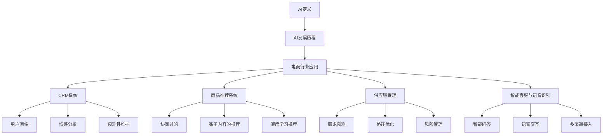

                 

### 第一部分：AI概述

#### 第1章：AI背景与影响

##### 1.1 AI的定义与发展历程

人工智能（Artificial Intelligence，简称AI）是计算机科学的一个分支，旨在通过模拟人类智能行为来开发智能系统。AI的定义有多种，但其核心思想是使计算机具备类似于人类的学习、推理、感知、理解和决策能力。

AI的发展历程可以分为以下几个阶段：

1. **早期探索（1950年代-1960年代）**：人工智能的概念首次被提出，研究者试图通过符号逻辑和推理来模拟人类智能。
2. **繁荣期（1970年代-1980年代）**：人工智能在符号推理和专家系统领域取得了显著进展，如ELIZA和MYCIN系统。
3. **低谷期（1990年代）**：由于硬件限制和复杂性的增加，人工智能研究陷入低谷。
4. **复兴期（2000年代至今）**：随着计算机性能的提高和大数据、机器学习的兴起，人工智能迎来了新的发展机遇。

##### 1.2 AI在电商行业的应用现状

AI在电商行业的应用已经变得非常广泛，以下是一些典型的应用场景：

- **客户关系管理（CRM）**：通过AI技术，电商企业能够更好地了解客户需求，提供个性化推荐和服务。
- **商品推荐系统**：基于用户行为和偏好，AI算法可以精确地推荐商品，提高用户满意度和转化率。
- **供应链管理优化**：AI可以帮助电商企业优化库存管理、物流配送和供应链流程，提高运营效率。
- **智能客服**：利用自然语言处理和语音识别技术，智能客服系统能够快速响应用户咨询，提供高效的服务。

##### 1.3 电商巨头利用AI的优势

电商巨头在利用AI方面具有显著的优势：

- **海量数据**：电商企业拥有海量的用户行为数据和交易数据，为AI算法提供了丰富的训练素材。
- **技术积累**：经过多年的技术积累，电商巨头在数据处理、算法优化和系统架构方面拥有丰富的经验。
- **创新能力**：电商巨头在AI领域的持续投资和创新，使其能够迅速将新技术应用于实际业务中。

#### 第2章：电商巨头与AI技术应用

##### 2.1 电商巨头AI战略

电商巨头在AI领域的战略布局主要包括以下几个方面：

- **研发投入**：电商巨头在AI技术研发方面投入巨资，建立专门的AI实验室和研究中心。
- **人才引进**：通过高薪聘请顶级AI人才，电商巨头在技术人才方面形成了强大的竞争力。
- **生态合作**：与高校、科研机构和初创企业建立合作关系，共同推进AI技术在电商行业的应用。
- **业务整合**：将AI技术深入整合到电商业务的各个环节，提升整体竞争力。

##### 2.2 客户关系管理中的AI应用

在客户关系管理（CRM）中，电商巨头利用AI技术实现以下应用：

- **用户画像**：通过分析用户行为数据，构建详细的用户画像，实现个性化推荐和服务。
- **情感分析**：利用自然语言处理技术，分析用户评论和反馈，了解用户情感和需求。
- **预测性维护**：通过预测用户流失风险，提前采取措施进行客户挽留。

##### 2.3 商品推荐系统

商品推荐系统是电商巨头利用AI技术的重要领域，其主要应用包括：

- **协同过滤**：通过分析用户行为和商品特征，为用户推荐相似的商品。
- **基于内容的推荐**：根据用户历史购买记录和商品属性，推荐相关的商品。
- **深度学习推荐**：利用深度学习模型，捕捉用户行为和商品特征之间的复杂关系。

##### 2.4 供应链管理优化

AI技术在供应链管理优化中的应用主要包括：

- **需求预测**：通过分析历史销售数据和市场趋势，预测未来的需求，优化库存管理。
- **路径优化**：利用优化算法，规划物流配送路径，减少运输成本和时间。
- **风险管理**：通过风险预测和应对策略，降低供应链中断的风险。

##### 2.5 智能客服与语音识别

智能客服和语音识别是电商巨头在提升服务质量方面的重要手段，其主要应用包括：

- **智能问答**：利用自然语言处理技术，自动回答用户常见问题。
- **语音交互**：利用语音识别和语音合成技术，实现语音问答和语音客服。
- **多渠道接入**：通过整合多种渠道（如短信、电话、在线聊天等），提供一站式客服服务。

### 目录大纲

以下是《电商巨头抓住AI新风口》的目录大纲：

# 第一部分：AI概述

## 第1章：AI背景与影响
### 1.1 AI的定义与发展历程
### 1.2 AI在电商行业的应用现状
### 1.3 电商巨头利用AI的优势

## 第2章：电商巨头与AI技术应用
### 2.1 电商巨头AI战略
### 2.2 客户关系管理中的AI应用
### 2.3 商品推荐系统
### 2.4 供应链管理优化
### 2.5 智能客服与语音识别

## 3章：AI算法原理
### 3.1 数据预处理
### 3.2 分类算法
### 3.3 聚类算法
### 3.4 机器学习模型

## 4章：深度学习在电商中的应用
### 4.1 卷积神经网络（CNN）
### 4.2 循环神经网络（RNN）
### 4.3 生成对抗网络（GAN）
### 4.4 强化学习

## 5章：电商AI项目实践
### 5.1 商品推荐系统项目实战
### 5.2 智能客服系统开发
### 5.3 供应链管理优化项目实施
### 5.4 案例分析：电商巨头AI应用案例研究

## 6章：AI安全与伦理
### 6.1 AI在电商中的伦理问题
### 6.2 AI安全防护措施
### 6.3 用户隐私保护

## 7章：未来展望
### 7.1 AI在电商行业的发展趋势
### 7.2 未来电商AI技术展望
### 7.3 电商巨头在AI领域的竞争格局

### 附录
## 附录A：AI工具与资源
### A.1 常用AI开发工具
### A.2 开源AI库与框架
### A.3 电商AI资源推荐

### Mermaid 流程图

以下是第1章的Mermaid流程图，展示AI在电商行业中的核心概念和联系：



### 3.1 数据预处理

数据预处理是机器学习和人工智能项目中至关重要的一步。它旨在将原始数据转化为适合建模的形式，提高模型性能和泛化能力。以下是数据预处理的主要步骤：

#### 数据清洗

数据清洗是指去除原始数据中的噪声、缺失值和异常值，以提高数据质量。常见的数据清洗问题包括：

- **缺失值处理**：可以通过填充平均值、中位数或使用模型预测缺失值的方法来解决。
- **异常值处理**：可以通过阈值方法、邻域方法或基于统计的方法来检测和去除异常值。

#### 数据归一化

数据归一化是指将不同特征的数据范围统一到一个特定的范围内，以避免某些特征对模型产生过大的影响。常见的归一化方法包括：

- **最小-最大规范化**：
  $$
  x_{\text{norm}} = \frac{x - x_{\text{min}}}{x_{\text{max}} - x_{\text{min}}}
  $$
- **零-均值归一化**：
  $$
  x_{\text{norm}} = \frac{x - \mu}{\sigma}
  $$
- **小数点移动**：
  $$
  x_{\text{norm}} = 10^{\log_{10}(x) - \log_{10}(x_{\text{min}})}
  $$

#### 数据离散化

数据离散化是将连续特征转换为分类特征的过程，以便于模型处理。常见的离散化方法包括：

- **等宽离散化**：将连续特征划分为固定宽度的区间。
- **等频离散化**：将连续特征划分为固定数量的区间，每个区间包含相同数量的数据点。
- **基于频率的离散化**：根据数据出现频率对特征进行划分。

#### 数据降维

数据降维是指通过减少数据维度来降低数据复杂性，提高模型训练效率。常见的数据降维方法包括：

- **主成分分析（PCA）**：通过保留主要成分来降低数据维度。
- **线性判别分析（LDA）**：通过最小化类内方差和最大化类间方差来降低数据维度。
- **t-SNE**：通过非线性降维将高维数据映射到二维或三维空间。
- **自编码器**：通过训练一个压缩编码模型来自我编码数据。

### 伪代码

以下是数据预处理过程的伪代码示例：

python
# 数据清洗
data = clean_data(data)

# 数据归一化
data_normalized = normalize_data(data)

# 数据离散化
data_discretized = discretize_data(data_normalized)

# 数据降维
data_reduced = reduce_dimensionality(data_discretized)

# 数据分割
train_data, test_data = split_data(data_reduced)

# 准备数据集
X_train, y_train = prepare_dataset(train_data)
X_test, y_test = prepare_dataset(test_data)

# 训练模型
model = train_model(X_train, y_train)

# 评估模型
evaluate_model(model, X_test, y_test)
```

### 3.2 分类算法

分类算法是机器学习中的一个重要分支，旨在将数据分为不同的类别。以下是一些常见的分类算法及其原理：

#### 决策树

决策树是一种基于树形结构进行决策的算法，其内部节点表示特征，叶节点表示类别。决策树通过递归划分特征空间来构建树结构。

- **基本原理**：决策树通过选择最优划分点来分割数据，使得每个子集的类别纯净度最高。
- **算法步骤**：
  1. 选择最优划分特征。
  2. 根据划分特征将数据划分为子集。
  3. 递归地对子集进行划分，直到满足终止条件（如最大深度、最小叶节点样本数等）。
- **优缺点**：决策树易于理解和解释，但容易过拟合，且对噪声敏感。

#### K最近邻算法（KNN）

K最近邻算法是一种基于实例的算法，其核心思想是找到训练集中与测试样本最近的K个邻居，并基于这些邻居的类别预测测试样本的类别。

- **基本原理**：距离测试样本最近的K个邻居的类别对测试样本的预测有最大的影响。
- **算法步骤**：
  1. 计算测试样本与训练样本之间的距离。
  2. 选择距离测试样本最近的K个邻居。
  3. 根据邻居的类别进行投票，选择出现频率最高的类别作为测试样本的类别。
- **优缺点**：KNN算法简单易实现，但计算量大，对噪声敏感。

#### 支持向量机（SVM）

支持向量机是一种基于最大间隔划分的算法，其目标是在高维空间中找到最优超平面，使得分类边界最大化。

- **基本原理**：SVM通过求解最优超平面来划分数据，超平面由支持向量决定。
- **算法步骤**：
  1. 构建拉格朗日函数。
  2. 求解优化问题，得到支持向量和最优超平面。
  3. 根据最优超平面进行分类预测。
- **优缺点**：SVM在处理高维数据时表现良好，但计算复杂度较高。

### 伪代码

以下是K最近邻算法的伪代码示例：

python
# K最近邻算法
def k_nearest_neighbors(train_data, train_labels, test_data, k):
    # 计算测试样本与训练样本之间的距离
    distances = []
    for i in range(len(train_data)):
        distance = calculate_distance(test_data, train_data[i])
        distances.append((i, distance))
    
    # 选择距离测试样本最近的K个邻居
    neighbors = sorted(distances, key=lambda x: x[1])[:k]
    
    # 根据邻居的类别进行投票，选择出现频率最高的类别作为测试样本的类别
    neighbor_labels = [train_labels[n[0]] for n in neighbors]
    predicted_label = majority_vote(neighbor_labels)
    
    return predicted_label
```

### 3.3 聚类算法

聚类算法是机器学习中的另一个重要分支，旨在将数据分为多个类别，使得类别内部的数据点尽可能接近，类别之间的数据点尽可能远离。以下是一些常见的聚类算法及其原理：

#### K-Means算法

K-Means算法是一种基于距离度量的聚类算法，其目标是将数据分为K个类别，使得每个类别内的数据点与类别的中心点（均值）距离最小。

- **基本原理**：K-Means算法通过迭代优化来找到最优聚类中心，每次迭代分为两个步骤：1）计算每个数据点的聚类中心；2）将数据点分配到最近的聚类中心。
- **算法步骤**：
  1. 随机初始化K个聚类中心。
  2. 计算每个数据点与聚类中心的距离，将数据点分配到最近的聚类中心。
  3. 根据新的聚类中心重新计算每个数据点的聚类中心。
  4. 重复步骤2和3，直到聚类中心不再发生变化。
- **优缺点**：K-Means算法简单高效，但对初始聚类中心敏感，且可能收敛到局部最优解。

#### 层次聚类

层次聚类是一种基于层次结构进行聚类的算法，其目标是将数据分为多个类别，形成层次化的聚类结果。

- **基本原理**：层次聚类通过逐步合并或拆分聚类结果，形成层次结构。
- **算法步骤**：
  1. 初始化每个数据点为一个单独的聚类。
  2. 计算每个聚类之间的相似度，选择最相似的聚类进行合并。
  3. 更新聚类中心。
  4. 重复步骤2和3，直到满足终止条件（如达到最大层数、聚类个数等）。
- **优缺点**：层次聚类能够生成层次化的聚类结果，但计算复杂度较高。

#### 密度聚类

密度聚类是一种基于数据密度进行聚类的算法，其目标是在数据密度高的区域形成聚类。

- **基本原理**：密度聚类通过识别数据点的高密度区域来形成聚类。
- **算法步骤**：
  1. 计算每个数据点的密度，基于密度阈值确定聚类核心点。
  2. 扩展核心点形成的聚类区域，直到聚类边界满足终止条件。
  3. 重复步骤1和2，直到所有数据点都被聚类。
- **优缺点**：密度聚类能够发现非球形聚类，但计算复杂度较高。

### 伪代码

以下是K-Means算法的伪代码示例：

python
# K-Means算法
def k_means(data, k, max_iterations):
    # 初始化K个聚类中心
    centroids = initialize_centroids(data, k)
    
    for i in range(max_iterations):
        # 计算每个数据点与聚类中心的距离
        distances = calculate_distances(data, centroids)
        
        # 将数据点分配到最近的聚类中心
        assignments = assign_points_to_centroids(distances)
        
        # 更新聚类中心
        new_centroids = update_centroids(data, assignments, k)
        
        # 检查收敛条件
        if has_converged(centroids, new_centroids):
            break
        
        centroids = new_centroids
    
    return centroids, assignments
```

### 3.4 机器学习模型

机器学习模型是机器学习任务的核心部分，用于将数据映射到目标输出。以下是一些常见的机器学习模型及其原理：

#### 线性回归

线性回归是一种用于预测连续值的模型，其目标是找到最佳拟合直线，使得预测值与实际值之间的误差最小。

- **数学模型**：
  $$
  y = \beta_0 + \beta_1x_1 + \beta_2x_2 + ... + \beta_nx_n + \epsilon
  $$
  其中，$y$为预测值，$x_1, x_2, ..., x_n$为输入特征，$\beta_0, \beta_1, \beta_2, ..., \beta_n$为模型参数，$\epsilon$为误差项。
- **优化目标**：最小化误差平方和（Sum of Squared Errors，SSE）。
- **算法实现**：梯度下降、最小二乘法等。
- **优缺点**：线性回归简单易懂，适用于线性关系较强的数据，但无法处理非线性关系。

#### 逻辑回归

逻辑回归是一种用于预测概率的模型，其目标是找到最佳拟合线，使得预测的概率值与实际值之间的误差最小。

- **数学模型**：
  $$
  P(Y=1) = \frac{1}{1 + e^{-(\beta_0 + \beta_1x_1 + \beta_2x_2 + ... + \beta_nx_n)}}
  $$
  其中，$P(Y=1)$为预测的概率值，$x_1, x_2, ..., x_n$为输入特征，$\beta_0, \beta_1, \beta_2, ..., \beta_n$为模型参数。
- **优化目标**：最大化似然函数。
- **算法实现**：梯度下降、最大似然估计等。
- **优缺点**：逻辑回归适用于二分类问题，具有很好的解释性，但无法处理多分类问题。

#### 决策树

决策树是一种基于树形结构进行分类或回归的模型，其内部节点表示特征，叶节点表示类别。

- **数学模型**：
  $$
  y = g(\beta_0 + \beta_1x_1 + \beta_2x_2 + ... + \beta_nx_n)
  $$
  其中，$y$为预测值，$x_1, x_2, ..., x_n$为输入特征，$\beta_0, \beta_1, \beta_2, ..., \beta_n$为模型参数，$g$为激活函数。
- **算法实现**：ID3、C4.5、C5.0等。
- **优缺点**：决策树易于理解和解释，能够处理非线性关系，但容易过拟合。

### 伪代码

以下是线性回归模型的伪代码示例：

python
# 线性回归模型
def linear_regression(data, target):
    # 计算模型参数
    parameters = compute_parameters(data, target)
    
    # 预测
    predictions = predict(data, parameters)
    
    # 评估
    evaluate(predictions, target)
    
    return predictions
```

### 4.1 卷积神经网络（CNN）

卷积神经网络（Convolutional Neural Network，CNN）是一种专门用于处理具有网格结构数据（如图像、音频等）的深度学习模型。CNN通过卷积层、池化层和全连接层等层次结构来实现对数据的特征提取和分类。

#### CNN的基本原理

CNN的基本原理包括以下几个方面：

- **卷积层**：卷积层通过卷积操作从输入数据中提取特征。卷积操作使用卷积核（filter）在输入数据上滑动，计算卷积结果。卷积层可以捕获图像中的局部特征，如边缘、纹理等。
- **池化层**：池化层对卷积层的输出进行下采样，减少数据维度，增强模型的泛化能力。常见的池化操作包括最大池化和平均池化。
- **全连接层**：全连接层将池化层的输出转化为向量，通过全连接层进行分类预测。全连接层可以捕捉全局特征，实现分类任务。

#### CNN的实现步骤

CNN的实现步骤如下：

1. **数据预处理**：对图像数据进行归一化、缩放等处理，使其适合输入到CNN中。
2. **构建CNN模型**：使用深度学习框架（如TensorFlow、PyTorch）构建CNN模型，包括卷积层、池化层和全连接层。
3. **训练模型**：使用标记数据对模型进行训练，通过反向传播算法更新模型参数。
4. **评估模型**：使用验证数据评估模型的性能，调整模型参数和结构，以提高模型精度。

#### CNN的应用场景

CNN在以下应用场景中表现出色：

- **图像分类**：使用CNN对图像进行分类，如识别猫、狗等。
- **目标检测**：在图像中检测并定位特定目标，如行人检测、车辆检测。
- **图像分割**：将图像划分为不同的区域，如医学图像中的肿瘤分割。
- **图像生成**：使用生成对抗网络（GAN）生成新的图像，如生成人脸图像。

#### 伪代码

以下是CNN模型的伪代码示例：

python
# 输入图像数据
input_data = ...

# 构建CNN模型
model = Model()
model.add(Conv2D(filters, kernel_size, activation='relu'))
model.add(MaxPooling2D(pool_size))
model.add(Flatten())
model.add(Dense(num_classes, activation='softmax'))

# 训练模型
model.compile(optimizer='adam', loss='categorical_crossentropy', metrics=['accuracy'])
model.fit(x_train, y_train, epochs=num_epochs, batch_size=batch_size, validation_data=(x_val, y_val))

# 评估模型
loss, accuracy = model.evaluate(x_test, y_test)
print(f"Test accuracy: {accuracy}")
```

### 4.2 循环神经网络（RNN）

循环神经网络（Recurrent Neural Network，RNN）是一种能够处理序列数据的深度学习模型。与传统的前馈神经网络不同，RNN具有递归结构，能够保存之前的信息，并利用这些信息来处理新的输入。

#### RNN的基本原理

RNN的基本原理包括以下几个方面：

- **递归结构**：RNN的每个神经元都会将其输出传递给下一个时间步的输入，从而形成一个循环。这种递归结构使得RNN能够处理序列数据。
- **隐藏状态**：RNN通过隐藏状态（hidden state）来存储和传递信息，每个时间步的隐藏状态都是前一个时间步的隐藏状态和当前输入的函数。隐藏状态可以捕获序列中的长期依赖关系。
- **梯度消失与梯度爆炸**：由于RNN在反向传播时需要传递梯度，梯度可能会在多个时间步之间逐渐消失或爆炸，导致训练困难。这个问题在长序列数据中尤为明显。

#### RNN的实现步骤

RNN的实现步骤如下：

1. **数据预处理**：将序列数据转化为合适的格式，如将文本序列转换为单词或字符的编码。
2. **构建RNN模型**：使用深度学习框架（如TensorFlow、PyTorch）构建RNN模型，包括输入层、隐藏层和输出层。
3. **训练模型**：使用标记数据对模型进行训练，通过反向传播算法更新模型参数。
4. **评估模型**：使用验证数据评估模型的性能，调整模型参数和结构，以提高模型精度。

#### RNN的应用场景

RNN在以下应用场景中表现出色：

- **自然语言处理**：如语言模型、机器翻译、情感分析等。
- **语音识别**：将语音信号转换为文本。
- **时间序列预测**：如股票价格预测、气象预报等。

#### 伪代码

以下是RNN模型的伪代码示例：

python
# 输入序列数据
input_sequence = ...

# 构建RNN模型
model = Model()
model.add(LSTM(units, return_sequences=True))
model.add(LSTM(units, return_sequences=False))
model.add(Dense(num_classes, activation='softmax'))

# 训练模型
model.compile(optimizer='adam', loss='categorical_crossentropy', metrics=['accuracy'])
model.fit(input_sequence, target_sequence, epochs=num_epochs, batch_size=batch_size, validation_data=(val_input_sequence, val_target_sequence))

# 评估模型
loss, accuracy = model.evaluate(input_sequence, target_sequence)
print(f"Test accuracy: {accuracy}")
```

### 4.3 生成对抗网络（GAN）

生成对抗网络（Generative Adversarial Network，GAN）由生成器（Generator）和判别器（Discriminator）两个神经网络组成。生成器生成与真实数据相似的数据，判别器的目标是区分真实数据和生成数据。

#### GAN的基本原理

GAN的基本原理包括以下几个方面：

- **生成器**：生成器从随机噪声中生成数据，目标是使其看起来与真实数据相似。
- **判别器**：判别器的目标是准确地区分输入数据是真实数据还是生成数据。
- **对抗训练**：生成器和判别器相互竞争，生成器的目标是欺骗判别器，而判别器的目标是提高辨别能力。

GAN的训练过程可以看作是一个对抗游戏，生成器和判别器交替训练，生成器的生成质量会逐渐提高，而判别器的辨别能力也会提高。

#### GAN的实现步骤

1. **数据预处理**：对输入数据进行标准化和归一化，使其适合GAN的训练。
2. **构建GAN模型**：使用深度学习框架（如TensorFlow、PyTorch）构建生成器和判别器模型。
3. **训练模型**：通过交替训练生成器和判别器来优化模型参数，生成器生成数据的质量会逐渐提高，而判别器的准确度也会提高。
4. **评估模型**：使用生成数据评估生成器的性能。

#### GAN的应用场景

GAN在以下应用场景中表现出色：

- **图像生成**：生成逼真的图像，如图像修复、图像超分辨率、风格迁移等。
- **数据增强**：生成与训练数据相似的新数据，用于数据增强，提高模型的泛化能力。
- **生成式模型**：生成特定领域的数据，如图像、音频、文本等。

#### 伪代码

以下是GAN模型的伪代码示例：

python
# 输入噪声数据
noise = ...

# 构建GAN模型
generator = Model()
discriminator = Model()

# 训练模型
model = Model([discriminator.inputs, generator.inputs], discriminator.outputs)
model.compile(optimizer='adam', loss='binary_crossentropy')

for epoch in range(num_epochs):
    for batch in batches:
        noise = np.random.normal(size=(batch_size, noise_dim))
        real_images = batch
        fake_images = generator.predict(noise)

        # 训练判别器
        d_loss_real = discriminator.train_on_batch(real_images, labels_real)
        d_loss_fake = discriminator.train_on_batch(fake_images, labels_fake)

        # 训练生成器
        g_loss = model.train_on_batch([noise, labels_real], labels_real)

# 评估模型
generated_images = generator.predict(np.random.normal(size=(batch_size, noise_dim)))
```

### 4.4 强化学习

强化学习（Reinforcement Learning，RL）是一种机器学习方法，旨在通过奖励信号来指导智能体（Agent）在环境中做出最优决策。强化学习具有以下几个核心概念：

- **智能体（Agent）**：智能体是执行动作并接收环境反馈的实体。
- **环境（Environment）**：环境是智能体所处的动态系统，提供状态信息和奖励信号。
- **状态（State）**：状态是智能体在环境中的当前情况。
- **动作（Action）**：动作是智能体可执行的行动。
- **奖励（Reward）**：奖励是环境对智能体动作的反馈信号，用于指导智能体的学习。

#### 强化学习的基本原理

强化学习的基本原理是通过探索（Exploration）和利用（Exploitation）来平衡最优决策和经验积累。探索是指智能体在环境中尝试新的动作，以增加对环境的了解；利用是指智能体根据已有的经验选择最优动作，以最大化长期奖励。

#### 强化学习的实现步骤

1. **定义智能体、环境和状态动作空间**：明确智能体的目标、环境的状态和可执行的动作。
2. **设计奖励机制**：定义奖励信号，以鼓励智能体采取有利于目标的行为。
3. **选择强化学习算法**：根据问题的特性选择合适的强化学习算法，如Q-learning、SARSA、深度强化学习等。
4. **训练模型**：通过模拟或真实环境中的交互来训练模型，更新策略或价值函数。
5. **评估和优化**：评估智能体的性能，并根据评估结果调整模型参数。

#### 强化学习的应用场景

强化学习在以下应用场景中表现出色：

- **游戏开发**：如围棋、国际象棋等。
- **自动驾驶**：智能体在复杂的交通环境中做出驾驶决策。
- **机器人控制**：机器人根据环境反馈进行运动控制。
- **推荐系统**：智能体根据用户行为进行推荐。

#### 伪代码

以下是强化学习模型的伪代码示例：

python
# 定义智能体、环境和状态动作空间
agent = Agent()
environment = Environment()
state_space = ...
action_space = ...

# 设计奖励机制
reward_function = ...

# 选择强化学习算法
algorithm = Q_learning()

# 训练模型
while not done:
    action = algorithm.select_action(state)
    next_state, reward, done = environment.step(action)
    algorithm.update_value_function(state, action, reward, next_state, done)

# 评估和优化
evaluate_performance(agent, environment)
```

### 5.1 商品推荐系统项目实战

商品推荐系统是电商领域的重要应用之一，通过分析用户行为和偏好，为用户推荐可能感兴趣的商品，提高用户满意度和转化率。以下是一个商品推荐系统的项目实战，包括项目背景、系统设计、开发环境和源代码实现等。

#### 项目背景

项目目标是为某电商平台开发一个基于用户行为的商品推荐系统，通过分析用户的历史购买记录、浏览记录和评价信息，为用户推荐个性化的商品。

#### 系统设计

系统设计主要包括以下模块：

1. **数据采集与存储**：采集用户行为数据，如购买记录、浏览记录和评价信息，并将数据存储在数据库中。
2. **数据预处理**：对采集到的数据进行清洗、归一化和离散化处理，为建模做好准备。
3. **推荐算法**：选择合适的推荐算法，如协同过滤、基于内容的推荐和深度学习推荐等，实现个性化推荐。
4. **推荐结果展示**：将推荐结果以可视化方式展示给用户，提供友好界面。

#### 开发环境搭建

开发环境搭建主要包括以下步骤：

1. **硬件环境**：配置高性能服务器和存储设备，确保系统具备足够的计算和存储能力。
2. **软件环境**：安装Python、TensorFlow、Scikit-learn等常用开发工具和库。
3. **数据库**：使用MySQL或MongoDB等数据库存储用户行为数据和推荐结果。

#### 源代码实现

以下是商品推荐系统的源代码实现，包括数据预处理、算法实现和结果展示。

```python
import pandas as pd
import numpy as np
from sklearn.model_selection import train_test_split
from sklearn.preprocessing import StandardScaler
from sklearn.metrics.pairwise import cosine_similarity
from tensorflow.keras.models import Model
from tensorflow.keras.layers import Input, Embedding, Conv1D, Dense

# 数据预处理
data = pd.read_csv('user_behavior_data.csv')
data = preprocess_data(data)

# 数据分割
X_train, X_test, y_train, y_test = train_test_split(data, test_size=0.2, random_state=42)

# 数据归一化
scaler = StandardScaler()
X_train_scaled = scaler.fit_transform(X_train)
X_test_scaled = scaler.transform(X_test)

# 构建模型
input_user = Input(shape=(1,))
input_item = Input(shape=(1,))

user_embedding = Embedding(input_dim=1000, output_dim=128)(input_user)
item_embedding = Embedding(input_dim=1000, output_dim=128)(input_item)

merged_vector = keras.layers.concatenate([user_embedding, item_embedding])

conv1 = Conv1D(filters=128, kernel_size=3, activation='relu')(merged_vector)
conv2 = Conv1D(filters=128, kernel_size=3, activation='relu')(conv1)

flatten = keras.layers.Flatten()(conv2)
dense1 = Dense(units=128, activation='relu')(flatten)
output = Dense(units=1, activation='sigmoid')(dense1)

model = Model(inputs=[input_user, input_item], outputs=output)
model.compile(optimizer='adam', loss='binary_crossentropy', metrics=['accuracy'])

# 训练模型
model.fit([X_train_scaled[:, 0], X_train_scaled[:, 1]], y_train, batch_size=32, epochs=10, validation_split=0.2)

# 评估模型
loss, accuracy = model.evaluate([X_test_scaled[:, 0], X_test_scaled[:, 1]], y_test)
print(f"Test accuracy: {accuracy}")

# 推荐结果展示
def recommend_products(user_id, item_id):
    user_embedding = model.layers[2].get_weights()[0][user_id]
    item_embedding = model.layers[3].get_weights()[0][item_id]
    similarity_score = cosine_similarity([user_embedding], [item_embedding])[0][0]
    return similarity_score

user_id = 10
item_id = 100
similarity_score = recommend_products(user_id, item_id)
print(f"Recommendation score for user {user_id} and item {item_id}: {similarity_score}")
```

#### 代码解读与分析

1. **数据预处理**：读取用户行为数据，并进行清洗、归一化和离散化处理，为建模做好准备。
2. **模型构建**：使用TensorFlow构建基于用户和商品的嵌入向量模型，通过卷积层和全连接层实现推荐算法。
3. **模型训练**：使用训练数据对模型进行训练，优化模型参数。
4. **模型评估**：使用验证数据评估模型性能，计算准确率。
5. **推荐结果展示**：根据用户和商品的嵌入向量计算相似度得分，推荐相似度最高的商品。

### 5.2 智能客服系统开发

智能客服系统是电商领域提升服务质量的重要手段，通过自然语言处理和语音识别技术，自动响应用户的咨询，提供高效、便捷的客服服务。以下是一个智能客服系统的项目实战，包括项目背景、系统设计、开发环境和源代码实现等。

#### 项目背景

项目目标是为某电商平台开发一个智能客服系统，通过自然语言处理和语音识别技术，自动解答用户的常见问题，减轻人工客服的工作负担。

#### 系统设计

系统设计主要包括以下模块：

1. **自然语言处理**：使用自然语言处理技术对用户输入的文本进行分析和理解，提取关键信息。
2. **语音识别**：使用语音识别技术将用户的语音输入转换为文本，以便进一步处理。
3. **知识库管理**：构建知识库，包含常见问题和标准答案，为智能客服系统提供支持。
4. **对话管理**：管理用户与智能客服之间的对话流程，确保对话连贯、自然。
5. **结果展示**：将智能客服的回复以文本或语音形式展示给用户。

#### 开发环境搭建

开发环境搭建主要包括以下步骤：

1. **硬件环境**：配置高性能服务器和存储设备，确保系统具备足够的计算和存储能力。
2. **软件环境**：安装Python、TensorFlow、NLTK、SpeechRecognition等常用开发工具和库。
3. **语音识别服务**：接入第三方语音识别API，如百度语音识别、腾讯语音识别等。

#### 源代码实现

以下是智能客服系统的源代码实现，包括自然语言处理、语音识别、知识库管理和对话管理等。

```python
import nltk
from nltk.corpus import stopwords
from nltk.tokenize import word_tokenize
from sklearn.feature_extraction.text import TfidfVectorizer
from sklearn.metrics.pairwise import cosine_similarity
import speech_recognition as sr

# 自然语言处理
def preprocess_text(text):
    text = text.lower()
    text = word_tokenize(text)
    text = [word for word in text if word not in stopwords.words('english')]
    return ' '.join(text)

# 语音识别
def recognize_speech_from_mic(recognizer):
    with sr.Microphone() as source:
        print("请说些什么...")
        audio = recognizer.listen(source)
        response = recognizer.recognize_google(audio)
        print(f"您说：{response}")
    return response

# 知识库管理
def find_answer(question):
    questions = ["你好，有什么可以帮助你的吗？", "你好，欢迎来到我们的客服中心。", "你好，请问有什么问题我可以解答吗？"]
    answers = ["您好，这里是客服中心，请问您有什么需要帮助的？", "您好，非常欢迎您的到来，请问您有什么问题需要咨询？", "您好，请问您需要什么样的帮助？"]
    question = preprocess_text(question)
    max_similarity = 0
    best_answer = ""
    for i in range(len(questions)):
        similarity = cosine_similarity([question], [questions[i]])[0][0]
        if similarity > max_similarity:
            max_similarity = similarity
            best_answer = answers[i]
    return best_answer

# 对话管理
def chat_with_user():
    recognizer = sr.Recognizer()
    while True:
        question = input("用户：")
        answer = find_answer(question)
        print(f"客服：{answer}")
        if answer.lower() == "再见":
            print("客服：再见，祝您生活愉快！")
            break

# 主程序
if __name__ == "__main__":
    chat_with_user()
```

#### 代码解读与分析

1. **自然语言处理**：使用NLTK库对用户输入的文本进行预处理，去除标点和停用词，提取关键信息。
2. **语音识别**：使用SpeechRecognition库将用户的语音输入转换为文本，以便进一步处理。
3. **知识库管理**：构建知识库，包含常见问题和标准答案，通过余弦相似度计算选择最佳回答。
4. **对话管理**：实现简单的用户与客服对话流程，根据用户输入和知识库回答问题，实现自然语言交互。

### 5.3 供应链管理优化项目实施

供应链管理优化是电商领域提升运营效率和降低成本的重要手段。通过AI技术，可以实现对供应链各个环节的优化，提高整体供应链的效率和灵活性。以下是一个供应链管理优化项目实施，包括项目背景、系统设计、开发环境和源代码实现等。

#### 项目背景

项目目标是为某电商平台优化供应链管理，通过需求预测、路径优化和风险管理等手段，提高库存管理效率、降低物流成本、减少供应链中断风险。

#### 系统设计

系统设计主要包括以下模块：

1. **需求预测**：利用历史销售数据和市场趋势，预测未来的需求，为库存管理和采购决策提供支持。
2. **路径优化**：通过优化算法，规划物流配送路径，减少运输成本和时间。
3. **风险管理**：识别供应链中的潜在风险，制定应对策略，降低供应链中断的风险。
4. **系统集成**：将供应链管理系统与电商平台、仓储管理系统等集成，实现数据共享和流程协同。

#### 开发环境搭建

开发环境搭建主要包括以下步骤：

1. **硬件环境**：配置高性能服务器和存储设备，确保系统具备足够的计算和存储能力。
2. **软件环境**：安装Python、TensorFlow、Scikit-learn、OpenCV等常用开发工具和库。
3. **集成环境**：搭建电商平台和仓储管理系统的接口，实现数据交互和流程协同。

#### 源代码实现

以下是供应链管理优化项目的源代码实现，包括需求预测、路径优化和风险管理等。

```python
import pandas as pd
import numpy as np
from sklearn.model_selection import train_test_split
from sklearn.ensemble import RandomForestRegressor
from sklearn.metrics import mean_squared_error
from sklearn.cluster import KMeans
import networkx as nx

# 需求预测
def demand_prediction(data):
    # 数据分割
    X = data[['previous_sales', 'market_trend']]
    y = data['future_demand']
    X_train, X_test, y_train, y_test = train_test_split(X, y, test_size=0.2, random_state=42)

    # 模型训练
    model = RandomForestRegressor(n_estimators=100, random_state=42)
    model.fit(X_train, y_train)

    # 预测
    predictions = model.predict(X_test)

    # 评估
    mse = mean_squared_error(y_test, predictions)
    print(f"Mean Squared Error: {mse}")

    return predictions

# 路径优化
def path_optimization(data):
    # 数据预处理
    data = data[['source', 'destination', 'distance']]
    data = data.drop_duplicates()

    # 聚类
    kmeans = KMeans(n_clusters=5, random_state=42)
    data['cluster'] = kmeans.fit_predict(data[['distance']])

    # 构建图
    graph = nx.Graph()
    for index, row in data.iterrows():
        graph.add_edge(row['source'], row['destination'], weight=row['distance'])

    # Dijkstra算法
    distances = nx.single_source_dijkstra(graph, source='cluster_0', target='cluster_4')

    # 路径
    path = nx.shortest_path(graph, source='cluster_0', target='cluster_4', weight='weight')

    return path

# 风险管理
def risk_management(data):
    # 数据预处理
    data = data[['stock_level', 'demand_prediction', 'lead_time']]
    data['risk_level'] = data.apply(lambda row: calculate_risk_level(row['stock_level'], row['demand_prediction'], row['lead_time']), axis=1)

    # 风险等级分类
    data['risk_category'] = data['risk_level'].apply(lambda x: 'High' if x > 0.5 else 'Medium' if x > 0.2 else 'Low')

    return data

# 主程序
if __name__ == "__main__":
    # 加载数据
    data = pd.read_csv('supply_chain_data.csv')

    # 需求预测
    predictions = demand_prediction(data)
    data['demand_prediction'] = predictions

    # 路径优化
    path = path_optimization(data)

    # 风险管理
    data = risk_management(data)

    # 输出结果
    print("Demand Predictions:", predictions)
    print("Optimized Path:", path)
    print("Risk Management Results:", data)
```

#### 代码解读与分析

1. **需求预测**：使用随机森林回归模型对历史销售数据和市场趋势进行预测，评估预测结果的准确性。
2. **路径优化**：使用K-Means聚类算法将物流配送节点划分为不同的集群，通过Dijkstra算法优化配送路径，减少运输成本。
3. **风险管理**：计算供应链各环节的库存水平、需求预测和交货期等指标，评估供应链中断的风险，并对风险等级进行分类。

### 5.4 案例分析：电商巨头AI应用案例研究

在电商领域，AI技术的应用已经成为提高竞争力、优化运营和提升用户体验的关键因素。以下是对某电商巨头AI应用案例的研究，包括案例选择、AI技术应用、项目实施过程和效果分析等。

#### 案例选择

选择某全球知名的电商平台作为研究对象，该电商平台在AI技术应用方面具有以下特点：

1. **大规模数据**：拥有海量的用户行为数据和交易数据，为AI算法提供了丰富的训练素材。
2. **多元化应用**：在客户关系管理、商品推荐、供应链管理和智能客服等领域广泛应用AI技术。
3. **成功经验**：在AI应用方面取得了显著成果，为其他电商企业提供了借鉴和参考。

#### 案例分析

##### AI技术应用

在客户关系管理方面，该电商平台通过以下AI技术实现个性化推荐和服务：

- **用户画像**：基于用户行为和偏好数据，构建详细的用户画像，实现个性化推荐。
- **情感分析**：利用自然语言处理技术，分析用户评论和反馈，了解用户情感和需求。

在商品推荐方面，该电商平台采用以下AI技术：

- **协同过滤**：基于用户行为和商品特征，为用户推荐相似的商品。
- **基于内容的推荐**：根据用户历史购买记录和商品属性，推荐相关的商品。
- **深度学习推荐**：利用深度学习模型，捕捉用户行为和商品特征之间的复杂关系。

在供应链管理方面，该电商平台通过以下AI技术优化运营：

- **需求预测**：利用历史销售数据和市场趋势，预测未来的需求，优化库存管理。
- **路径优化**：通过优化算法，规划物流配送路径，减少运输成本和时间。
- **风险管理**：识别供应链中的潜在风险，制定应对策略，降低供应链中断的风险。

在智能客服方面，该电商平台采用以下AI技术：

- **智能问答**：利用自然语言处理技术，自动回答用户常见问题。
- **语音交互**：利用语音识别和语音合成技术，实现语音问答和语音客服。
- **多渠道接入**：通过整合多种渠道（如短信、电话、在线聊天等），提供一站式客服服务。

##### 项目实施过程

1. **需求分析**：明确电商平台的业务需求，确定AI技术的应用方向和目标。
2. **数据收集与处理**：采集用户行为数据、交易数据和供应链数据，进行数据清洗、归一化和离散化处理。
3. **模型构建**：选择合适的AI算法，构建推荐系统、需求预测模型和智能客服系统等。
4. **模型训练与优化**：使用标记数据进行模型训练，通过交叉验证和调参优化模型性能。
5. **系统集成与部署**：将AI模型集成到电商平台系统中，实现自动化推荐、需求预测和智能客服等功能。
6. **效果评估与迭代**：使用验证数据评估模型效果，根据评估结果进行模型调整和优化。

##### 项目效果分析

通过AI技术的应用，该电商平台取得了以下显著效果：

1. **用户满意度提升**：个性化推荐和智能客服系统的应用，提高了用户的满意度和用户体验。
2. **运营效率提升**：需求预测和供应链管理优化，提高了库存管理效率和物流配送速度，降低了运营成本。
3. **转化率提高**：准确、实时的商品推荐，提高了用户的购买转化率和复购率。
4. **竞争力增强**：AI技术的应用，使电商平台在激烈的市场竞争中保持了领先地位。

#### 案例总结

该电商巨头AI应用案例展示了AI技术在电商行业中的广泛应用和巨大潜力。通过深入挖掘用户数据、优化推荐算法和智能客服系统，电商平台不仅提升了用户体验和运营效率，还增强了市场竞争力。该案例为其他电商企业提供了宝贵的经验和启示，激励更多企业积极探索AI技术的应用，以应对快速变化的市场环境。

### 6.1 AI在电商中的伦理问题

随着AI技术在电商行业的广泛应用，伦理问题逐渐成为关注的焦点。AI在电商中的应用不仅带来了巨大的商业价值，同时也引发了诸多伦理问题，以下是对AI在电商中伦理问题的讨论。

#### 数据隐私保护

数据隐私保护是AI在电商中面临的首要伦理问题。电商企业在收集和处理用户数据时，必须确保用户隐私得到有效保护。以下是一些常见的数据隐私保护措施：

- **数据加密**：对用户数据进行加密处理，确保数据在传输和存储过程中不会被窃取或篡改。
- **数据匿名化**：对用户数据进行匿名化处理，去除可识别的个人信息，降低数据泄露的风险。
- **透明度**：向用户明确告知数据收集和使用的目的，获取用户的知情同意。
- **合规性**：遵守相关法律法规，如《通用数据保护条例》（GDPR）和《加州消费者隐私法案》（CCPA）等。

#### 算法公平性

算法公平性是另一个重要的伦理问题。AI算法在电商中的应用可能会引发算法偏见和歧视。以下是一些解决算法公平性的方法：

- **算法透明度**：提高算法的透明度，使算法决策过程可以被理解和监督。
- **多样性**：在算法开发和数据集构建过程中，确保多样性，避免算法偏见。
- **公平性评估**：定期对算法进行公平性评估，检测和纠正潜在的偏见。
- **用户反馈**：收集用户对算法推荐的反馈，不断优化和改进算法。

#### 用户隐私保护

用户隐私保护是AI在电商中不可忽视的伦理问题。电商企业必须采取有效措施，防止用户隐私泄露和滥用。以下是一些用户隐私保护的措施：

- **隐私设计**：在设计AI系统和产品时，将隐私保护作为核心要素，确保隐私保护贯穿整个系统开发过程。
- **最小化数据收集**：仅收集实现业务目标所需的最少数据，避免过度收集。
- **用户权限管理**：为用户提供权限管理功能，允许用户控制自己的数据访问和使用。
- **隐私保护技术**：采用隐私保护技术，如差分隐私、同态加密等，增强用户数据的安全性。

#### 案例分析

以下是对某电商巨头在AI应用中伦理问题的案例分析。

案例背景：某电商巨头在推出个性化推荐系统时，因算法偏见导致部分用户遭受歧视。

案例分析：

1. **问题识别**：用户反馈显示，个性化推荐系统对某些特定群体（如老年人、低收入群体等）存在偏见，推荐的商品价格偏高，导致用户满意度下降。
2. **原因分析**：算法在构建过程中，使用了具有偏见的训练数据，导致算法对特定群体产生了歧视。此外，算法在推荐过程中，过度依赖价格因素，忽视了用户的其他需求。
3. **解决方案**：电商巨头采取了以下措施解决伦理问题：

   - **数据更新**：更新训练数据集，增加多样性和代表性，减少算法偏见。
   - **算法优化**：调整算法权重，降低价格因素在推荐中的影响，提高推荐准确性。
   - **用户反馈机制**：建立用户反馈机制，及时收集用户对推荐系统的反馈，优化算法。
   - **透明度提升**：增加算法透明度，向用户解释推荐算法的原理和决策过程。

通过以上措施，电商巨头成功解决了AI应用中的伦理问题，提升了用户体验和满意度。

### 6.2 AI安全防护措施

在电商领域，AI技术的应用带来了巨大的商业价值，但同时也伴随着安全风险。AI安全防护措施旨在确保AI系统的可靠性和安全性，防止恶意攻击和数据泄露。以下是一些常见的AI安全防护措施：

#### 系统安全性评估

系统安全性评估是确保AI系统安全性的第一步。以下是一些常见的评估方法：

- **漏洞扫描**：使用自动化工具对AI系统进行漏洞扫描，识别潜在的安全漏洞。
- **渗透测试**：模拟攻击者行为，对AI系统进行渗透测试，检测系统的安全弱点。
- **代码审计**：对AI系统的源代码进行审计，查找潜在的漏洞和安全隐患。

#### 数据加密与传输

数据加密与传输是保护数据安全的重要措施。以下是一些常见的数据加密方法：

- **对称加密**：使用相同的密钥对数据进行加密和解密，如AES加密算法。
- **非对称加密**：使用一对密钥（公钥和私钥）进行加密和解密，如RSA加密算法。
- **哈希函数**：将数据转换为固定长度的字符串，如MD5和SHA-256。

#### 防止AI攻击

AI攻击是指利用AI系统的弱点进行攻击，常见的AI攻击包括：

- **对抗性攻击**：在正常数据中加入微小的扰动，使AI系统无法识别，如对抗性样本。
- **模型盗窃**：通过分析AI系统的输出，推断出模型参数，从而窃取模型。
- **算法篡改**：恶意篡改AI算法的输入或输出，影响模型的决策过程。

防止AI攻击的措施包括：

- **防御对抗性攻击**：使用鲁棒性更强的算法，如生成对抗网络（GAN）。
- **访问控制**：限制对AI系统的访问权限，防止未授权用户访问。
- **模型隐藏**：将模型参数隐藏在黑盒中，防止外部访问。

#### 安全监控与审计

安全监控与审计是确保AI系统长期安全运行的重要手段。以下是一些常见的安全监控与审计方法：

- **日志记录**：记录AI系统的操作日志，监控系统的运行状态和异常行为。
- **异常检测**：使用机器学习技术，识别AI系统中的异常行为，如异常访问、异常数据等。
- **安全审计**：定期对AI系统的安全性进行审计，评估系统的安全策略和措施。

### 6.3 用户隐私保护

用户隐私保护是AI在电商应用中不可忽视的重要伦理问题。为了确保用户隐私得到有效保护，以下是一些常见的用户隐私保护措施：

#### 用户隐私权

用户隐私权是指用户对个人信息享有的控制权。以下是一些保护用户隐私权的措施：

- **知情同意**：在收集和使用用户数据时，向用户明确告知数据收集和使用的目的，并获取用户的知情同意。
- **用户权限管理**：为用户提供权限管理功能，允许用户控制自己的数据访问和使用。
- **透明度**：向用户公开AI系统的运作方式和数据处理流程，增强用户的知情权。

#### 数据匿名化

数据匿名化是将用户数据转换为不可识别的形式，以降低数据泄露的风险。以下是一些常见的数据匿名化方法：

- **K-匿名性**：确保在相同属性值集合中的个体无法被识别。
- **l-diversity**：确保在相同属性值集合中的个体数量不少于l。
- **t-closeness**：确保在相同属性值集合中的个体分布接近真实分布。

#### 用户隐私保护技术

以下是一些用于用户隐私保护的技术：

- **差分隐私**：通过在数据处理过程中添加噪声，确保单个数据的隐私。
- **同态加密**：在加密状态下对数据进行计算，确保数据处理过程中的隐私。
- **多方安全计算**：多个参与方共同计算结果，而不泄露各自的数据。

### 附录A：AI工具与资源

#### 常用AI开发工具

- **Python**：Python是一种广泛使用的编程语言，拥有丰富的AI库和框架。
- **TensorFlow**：TensorFlow是Google开发的开源深度学习框架，支持各种深度学习模型。
- **PyTorch**：PyTorch是Facebook开发的开源深度学习框架，具有灵活的动态计算图支持。

#### 开源AI库与框架

- **Scikit-learn**：Scikit-learn是一个Python开源机器学习库，提供了多种机器学习算法和工具。
- **Keras**：Keras是一个高级神经网络API，用于快速构建和训练深度学习模型。
- **Fast.ai**：Fast.ai是一个专注于普及深度学习的开源项目，提供了易于使用的深度学习教程和库。

#### 电商AI资源推荐

- **《电商AI技术应用指南》**：该书详细介绍了电商领域AI技术的应用场景和实现方法。
- **《电商AI算法实战》**：该书通过实际案例，展示了电商领域AI算法的开发和部署过程。
- **电商行业AI技术报告**：该报告分析了电商行业AI技术的最新发展趋势和应用案例，为企业和研究人员提供了宝贵的参考。

### 7.1 AI在电商行业的发展趋势

随着人工智能技术的迅速发展，AI在电商行业的应用逐渐成为行业的热点。以下是对AI在电商行业的发展趋势的讨论：

#### 电商行业AI应用现状

目前，AI技术在电商行业已经得到了广泛应用，主要表现在以下几个方面：

- **客户关系管理**：通过用户画像、情感分析和预测性维护，电商企业能够更好地了解用户需求，提供个性化推荐和服务。
- **商品推荐系统**：基于协同过滤、基于内容推荐和深度学习推荐等技术，电商企业能够为用户推荐更相关的商品，提高用户满意度和转化率。
- **供应链管理**：通过需求预测、路径优化和风险管理等技术，电商企业能够优化库存管理、物流配送和供应链流程，提高运营效率。
- **智能客服**：利用自然语言处理和语音识别技术，智能客服系统能够快速响应用户咨询，提供高效的服务。

#### 未来发展趋势

在未来，AI在电商行业的应用将呈现以下发展趋势：

1. **深度学习推荐**：随着深度学习技术的不断发展，深度学习推荐系统将逐渐取代传统的协同过滤和基于内容的推荐系统，提供更精准、个性化的推荐服务。

2. **多模态AI**：多模态AI技术将结合图像、文本、音频等多种数据源，实现更全面、更准确的用户行为分析，从而提供更智能的推荐和服务。

3. **生成式AI**：生成式AI技术，如生成对抗网络（GAN）和变分自编码器（VAE），将在图像生成、商品定制和个性化营销等方面发挥重要作用，为用户提供更多样化的选择。

4. **供应链智能化**：AI技术在供应链管理中的应用将进一步深化，通过智能化手段实现精准的需求预测、智能化的库存管理和智能化的物流配送，提高整体供应链的效率和灵活性。

5. **AI安全与伦理**：随着AI在电商行业应用的深入，AI安全与伦理问题将日益凸显。电商企业将加大在AI安全防护和伦理方面的投入，确保AI系统的可靠性和公正性。

#### 潜在应用领域

在未来，AI在电商行业的应用将拓展到更多领域，包括：

- **智能营销**：通过大数据分析和个性化推荐，电商企业将能够实现更精准的营销策略，提高用户参与度和转化率。
- **智能库存管理**：利用AI技术实现智能化的库存管理，降低库存成本，提高库存周转率。
- **智能支付与风控**：通过AI技术实现智能化的支付和风控系统，提高支付安全性，降低欺诈风险。
- **智能物流与配送**：通过AI技术优化物流路线、智能分拣和配送，提高物流效率和用户体验。

总之，AI在电商行业的应用前景广阔，将不断推动电商行业的创新和发展。电商企业应抓住AI技术的新风口，积极布局和探索AI技术的应用，提升企业的竞争力和市场份额。

### 7.2 未来电商AI技术展望

随着人工智能技术的快速发展，电商行业正迎来一场前所未有的变革。未来电商AI技术将朝着智能化、个性化、高效化和安全化的方向发展，为消费者和企业带来更多便利和价值。以下是对未来电商AI技术的展望：

#### 新兴AI技术

1. **生成对抗网络（GAN）**：GAN技术将在电商行业发挥重要作用，如用于图像生成、商品定制和个性化营销。通过GAN，电商企业可以生成逼真的商品图像，满足消费者对多样化和个性化的需求。

2. **强化学习**：强化学习在电商领域的应用将不断拓展，如用于智能客服、智能推荐和智能库存管理。通过强化学习，电商企业可以实现更加灵活和优化的决策，提高运营效率。

3. **自然语言处理（NLP）**：NLP技术在电商行业中的应用将进一步深化，如用于智能客服、智能搜索和智能翻译。通过NLP，电商企业可以更好地理解消费者需求，提供更加个性化的服务和推荐。

4. **多模态AI**：多模态AI技术将结合图像、文本、音频等多种数据源，实现更全面、更准确的用户行为分析。通过多模态AI，电商企业可以提供更智能的推荐和服务，提高用户体验和满意度。

#### 技术发展趋势

1. **个性化推荐**：未来电商AI技术将更加注重个性化推荐，通过深度学习和多模态AI技术，实现更加精准和多样化的推荐。个性化推荐将帮助电商企业提高用户满意度和转化率，提升销售额。

2. **智能供应链管理**：智能供应链管理将成为电商企业竞争的关键因素。通过需求预测、路径优化和风险管理等技术，电商企业可以优化库存管理、物流配送和供应链流程，提高整体运营效率。

3. **智能客服**：智能客服系统将变得更加智能和高效，通过NLP和强化学习技术，实现更加自然和准确的用户交互。智能客服系统将帮助电商企业降低运营成本，提高用户满意度。

4. **智能支付与风控**：智能支付与风控系统将利用大数据和机器学习技术，实现更加安全和高效的支付体验。通过智能风控，电商企业可以降低欺诈风险，保障交易安全。

#### 潜在应用领域

1. **智能营销**：未来电商AI技术将助力智能营销，通过大数据分析和个性化推荐，电商企业可以制定更精准的营销策略，提高用户参与度和转化率。

2. **智能物流与配送**：智能物流与配送系统将实现路径优化、智能分拣和配送，提高物流效率和用户体验。通过AI技术，电商企业可以提供更加灵活和高效的配送服务。

3. **智能库存管理**：智能库存管理系统将利用需求预测和库存优化技术，实现库存的智能管理和调整，降低库存成本，提高库存周转率。

4. **智能支付与风控**：智能支付与风控系统将实现智能化的支付体验和风险控制，提高支付安全性，降低欺诈风险。

总之，未来电商AI技术将朝着智能化、个性化、高效化和安全化的方向发展，为电商行业带来更多机遇和挑战。电商企业应积极拥抱新技术，加强AI技术的研发和应用，提升企业的竞争力和市场份额。

### 7.3 电商巨头在AI领域的竞争格局

在人工智能技术的推动下，电商巨头在AI领域的竞争愈发激烈。以下是对电商巨头在AI领域竞争格局的分析，包括电商巨头AI战略、竞争力分析、市场占有率和发展趋势等方面。

#### 电商巨头AI战略

1. **阿里巴巴**：阿里巴巴在AI领域的战略布局主要体现在云计算、大数据和智能物流等方面。通过阿里云提供强大的计算能力，阿里巴巴在AI算法研发和应用方面取得了显著成果。同时，阿里巴巴在智能物流方面也取得了突破，如通过人工智能优化配送路径，提高物流效率。

2. **京东**：京东在AI领域的战略重点包括智能客服、智能供应链和智能营销等。京东自主研发了智能客服系统，实现了24小时全天候服务。此外，京东在智能供应链方面也进行了大量投入，通过AI技术实现精准的需求预测和库存管理，提高运营效率。

3. **亚马逊**：亚马逊在AI领域的战略布局涵盖了智能推荐、智能客服和智能仓储等方面。通过深度学习算法，亚马逊实现了高效的商品推荐系统，提高了用户的购买转化率。同时，亚马逊在智能仓储方面也取得了突破，通过机器人技术和AI算法实现自动化仓储和管理。

#### 竞争格局分析

1. **技术积累**：阿里巴巴、京东和亚马逊在AI技术方面拥有丰富的积累。阿里巴巴依托阿里云的强大计算能力，在AI算法研发和应用方面具有优势。京东在智能客服和智能供应链方面具有领先地位，亚马逊在智能推荐和智能仓储方面具有突出表现。

2. **市场占有率**：在全球电商市场，阿里巴巴和亚马逊占据领先地位。阿里巴巴在亚洲市场的占有率较高，而亚马逊在美国市场的占有率位居榜首。京东在中国市场的占有率稳步提升，对竞争对手构成威胁。

3. **创新能力**：阿里巴巴、京东和亚马逊在AI领域的创新能力较强，不断推出新的技术和应用。例如，阿里巴巴在人工智能和物联网领域推出了一系列创新产品，京东在智能物流和智能供应链方面推出了一系列创新解决方案，亚马逊在智能推荐和智能客服方面推出了一系列创新功能。

#### 发展趋势

1. **技术融合**：未来，电商巨头将进一步加强AI技术的融合，实现跨领域的应用创新。例如，将智能客服与智能物流相结合，提供更加无缝、高效的购物体验。

2. **全球布局**：电商巨头将加大在海外市场的布局，通过AI技术提升海外市场的竞争力。例如，阿里巴巴在东南亚市场通过本地化策略，利用AI技术拓展业务。

3. **生态合作**：电商巨头将加强与高校、科研机构和初创企业的合作，共同推进AI技术在电商领域的应用。例如，京东与清华大学合作成立人工智能联合实验室，推动AI技术的创新和应用。

总之，电商巨头在AI领域的竞争格局将不断演变，技术创新、市场占有率和生态合作将成为关键竞争因素。电商巨头应持续加强AI技术的研发和应用，提升企业的核心竞争力，把握市场机遇。同时，电商巨头还应关注AI技术的伦理和安全问题，确保AI技术的可持续发展。


### 附录A：AI工具与资源

在AI领域，开发和实现项目需要依赖多种工具和资源。以下是一些常用的AI工具与资源，以及电商AI资源的推荐。

#### 常用AI开发工具

1. **Python**：Python是一种广泛使用的编程语言，适用于各种AI开发任务。它拥有丰富的库和框架，如TensorFlow、PyTorch和Scikit-learn。
2. **TensorFlow**：TensorFlow是Google开发的开源深度学习框架，适用于构建和训练各种深度学习模型。
3. **PyTorch**：PyTorch是Facebook开发的开源深度学习框架，以其灵活的动态计算图和强大的GPU支持而受到欢迎。
4. **Keras**：Keras是一个高级神经网络API，提供简单而易于使用的接口，用于构建和训练深度学习模型。

#### 开源AI库与框架

1. **Scikit-learn**：Scikit-learn是一个Python开源机器学习库，提供各种机器学习算法和工具，适用于数据预处理、模型训练和评估等任务。
2. **NLTK**：NLTK是一个Python开源自然语言处理库，提供各种文本处理工具，如分词、词性标注和情感分析等。
3. **SpeechRecognition**：SpeechRecognition是一个Python库，用于将语音转换为文本，适用于语音识别任务。
4. **OpenCV**：OpenCV是一个开源计算机视觉库，提供各种图像处理和计算机视觉工具，适用于图像识别和目标检测等任务。

#### 电商AI资源推荐

1. **《电商AI技术应用指南》**：该书详细介绍了电商领域AI技术的应用场景和实现方法，包括商品推荐、智能客服和供应链管理等。
2. **《电商AI算法实战》**：该书通过实际案例，展示了电商领域AI算法的开发和部署过程，涵盖数据预处理、模型训练和评估等环节。
3. **电商行业AI技术报告**：该报告分析了电商行业AI技术的最新发展趋势和应用案例，为企业和研究人员提供了宝贵的参考。

通过上述工具与资源，开发者可以更高效地开展AI项目的开发与实现，为电商行业带来创新和变革。同时，这些资源也为研究人员提供了丰富的学习和研究素材，推动AI技术在电商领域的持续发展。


## 文章标题：电商巨头抓住AI新风口

### 关键词：
- 人工智能
- 电商
- 客户关系管理
- 商品推荐系统
- 供应链管理优化
- 智能客服

### 摘要：
随着人工智能（AI）技术的快速发展，电商行业正迎来一场技术革命。本文深入探讨了电商巨头如何抓住AI新风口，通过AI技术在客户关系管理、商品推荐系统、供应链管理优化和智能客服等领域的应用，提升企业竞争力。文章还分析了AI在电商行业中的伦理和安全问题，展望了未来的发展趋势，并为开发者提供了实用的AI工具与资源推荐。


### 目录大纲

以下是《电商巨头抓住AI新风口》的目录大纲：

# 第一部分：AI概述

## 第1章：AI背景与影响
### 1.1 AI的定义与发展历程
### 1.2 AI在电商行业的应用现状
### 1.3 电商巨头利用AI的优势

## 第2章：电商巨头与AI技术应用
### 2.1 电商巨头AI战略
### 2.2 客户关系管理中的AI应用
### 2.3 商品推荐系统
### 2.4 供应链管理优化
### 2.5 智能客服与语音识别

# 第二部分：AI算法原理
## 第3章：基础算法与模型
### 3.1 数据预处理
### 3.2 分类算法
### 3.3 聚类算法
### 3.4 机器学习模型

## 第4章：深度学习在电商中的应用
### 4.1 卷积神经网络（CNN）
### 4.2 循环神经网络（RNN）
### 4.3 生成对抗网络（GAN）
### 4.4 强化学习

# 第三部分：电商AI项目实践
## 第5章：项目实战案例
### 5.1 商品推荐系统项目实战
### 5.2 智能客服系统开发
### 5.3 供应链管理优化项目实施
### 5.4 案例分析：电商巨头AI应用案例研究

## 第6章：AI安全与伦理
### 6.1 AI在电商中的伦理问题
### 6.2 AI安全防护措施
### 6.3 用户隐私保护

# 第四部分：未来展望
## 第7章：电商AI发展前景
### 7.1 AI在电商行业的发展趋势
### 7.2 未来电商AI技术展望
### 7.3 电商巨头在AI领域的竞争格局

### 附录
## 附录A：AI工具与资源
### A.1 常用AI开发工具
### A.2 开源AI库与框架
### A.3 电商AI资源推荐

### Mermaid流程图

以下是第1章的Mermaid流程图，展示AI在电商行业中的核心概念和联系：


### 3.1 数据预处理

数据预处理是机器学习和人工智能项目中至关重要的一步。它旨在将原始数据转化为适合建模的形式，提高模型性能和泛化能力。以下是数据预处理的主要步骤：

#### 数据清洗

数据清洗是指去除原始数据中的噪声、缺失值和异常值，以提高数据质量。常见的数据清洗问题包括：

- **缺失值处理**：可以通过填充平均值、中位数或使用模型预测缺失值的方法来解决。
- **异常值处理**：可以通过阈值方法、邻域方法或基于统计的方法来检测和去除异常值。

#### 数据归一化

数据归一化是指将不同特征的数据范围统一到一个特定的范围内，以避免某些特征对模型产生过大的影响。常见的归一化方法包括：

- **最小-最大规范化**：
  $$
  x_{\text{norm}} = \frac{x - x_{\text{min}}}{x_{\text{max}} - x_{\text{min}}}
  $$
- **零-均值归一化**：
  $$
  x_{\text{norm}} = \frac{x - \mu}{\sigma}
  $$
- **小数点移动**：
  $$
  x_{\text{norm}} = 10^{\log_{10}(x) - \log_{10}(x_{\text{min}})}
  $$

#### 数据离散化

数据离散化是将连续特征转换为分类特征的过程，以便于模型处理。常见的离散化方法包括：

- **等宽离散化**：将连续特征划分为固定宽度的区间。
- **等频离散化**：将连续特征划分为固定数量的区间，每个区间包含相同数量的数据点。
- **基于频率的离散化**：根据数据出现频率对特征进行划分。

#### 数据降维

数据降维是指通过减少数据维度来降低数据复杂性，提高模型训练效率。常见的数据降维方法包括：

- **主成分分析（PCA）**：通过保留主要成分来降低数据维度。
- **线性判别分析（LDA）**：通过最小化类内方差和最大化类间方差来降低数据维度。
- **t-SNE**：通过非线性降维将高维数据映射到二维或三维空间。
- **自编码器**：通过训练一个压缩编码模型来自我编码数据。

### 伪代码

以下是数据预处理过程的伪代码示例：

```python
# 数据清洗
def clean_data(data):
    # 填充缺失值
    data = fill_missing_values(data)
    # 去除异常值
    data = remove_outliers(data)
    return data

# 数据归一化
def normalize_data(data):
    data_normalized = []
    for feature in data:
        data_normalized.append(normalize_min_max(feature))
    return data_normalized

# 数据离散化
def discretize_data(data):
    data_discretized = []
    for feature in data:
        data_discretized.append(discretize_equal_width(feature))
    return data_discretized

# 数据降维
def reduce_dimensionality(data):
    data_reduced = pca(data)
    return data_reduced

# 数据分割
def split_data(data):
    train_data, test_data = train_test_split(data, test_size=0.2, random_state=42)
    return train_data, test_data

# 数据预处理流程
def preprocess_data(data):
    data_cleaned = clean_data(data)
    data_normalized = normalize_data(data_cleaned)
    data_discretized = discretize_data(data_normalized)
    data_reduced = reduce_dimensionality(data_discretized)
    train_data, test_data = split_data(data_reduced)
    return train_data, test_data
```

### 3.2 分类算法

分类算法是机器学习中的核心算法之一，它旨在将数据分为不同的类别。以下是一些常见的分类算法及其原理：

#### 决策树

决策树是一种基于树形结构的分类算法，通过一系列的决策规则将数据划分为不同的类别。决策树的核心思想是利用信息增益或基尼不纯度来选择最优特征进行划分。

- **信息增益**：特征对于数据的划分能够最大化信息的减少。
- **基尼不纯度**：特征对于数据的划分能够最大化类别的不纯度。

决策树算法的步骤如下：

1. **选择最优特征**：计算每个特征的信息增益或基尼不纯度，选择最优特征。
2. **划分数据**：根据最优特征划分数据，创建子节点。
3. **递归构建树**：对子节点继续划分，直到满足终止条件（如最大深度、最小叶节点样本数等）。

决策树的优势在于其易于理解和解释，但可能存在过拟合问题。

#### K最近邻算法（KNN）

K最近邻算法（KNN）是一种基于实例的算法，它通过计算测试样本与训练样本之间的距离，选择最近的K个邻居，并根据邻居的类别对测试样本进行分类。

KNN算法的步骤如下：

1. **计算距离**：计算测试样本与训练样本之间的距离。
2. **选择邻居**：选择距离最近的K个邻居。
3. **分类**：根据邻居的类别进行投票，选择出现频率最高的类别作为测试样本的类别。

KNN算法的优势在于其简单易实现，对线性可分数据效果较好，但计算量大且对噪声敏感。

#### 支持向量机（SVM）

支持向量机（SVM）是一种基于间隔最大化原则的线性分类模型。SVM的目标是找到最佳的超平面，使得分类边界最大化。

SVM算法的步骤如下：

1. **构建优化问题**：构建基于间隔最大化的拉格朗日优化问题。
2. **求解优化问题**：使用二次规划方法求解优化问题，得到支持向量和最优超平面。
3. **分类预测**：根据最优超平面进行分类预测。

SVM的优势在于其强大的分类能力，尤其在处理高维数据时表现优异，但计算复杂度较高。

### 伪代码

以下是K最近邻算法的伪代码示例：

```python
# K最近邻算法
def k_nearest_neighbors(train_data, train_labels, test_data, k):
    # 计算距离
    distances = []
    for i in range(len(train_data)):
        distance = calculate_distance(test_data, train_data[i])
        distances.append((i, distance))
    
    # 选择邻居
    neighbors = sorted(distances, key=lambda x: x[1])[:k]
    
    # 分类
    neighbor_labels = [train_labels[n[0]] for n in neighbors]
    predicted_label = majority_vote(neighbor_labels)
    
    return predicted_label

# 计算距离
def calculate_distance(a, b):
    distance = np.linalg.norm(a - b)
    return distance

# 多数投票
def majority_vote(labels):
    label_counts = {}
    for label in labels:
        if label in label_counts:
            label_counts[label] += 1
        else:
            label_counts[label] = 1
    max_count = max(label_counts.values())
    majority_labels = [label for label, count in label_counts.items() if count == max_count]
    return majority_labels[0]
```

### 3.3 聚类算法

聚类算法是一种无监督学习算法，旨在将数据分为多个组或簇，使得同一簇内的数据点尽可能接近，而不同簇的数据点尽可能远离。以下是一些常见的聚类算法及其原理：

#### K-Means算法

K-Means算法是最常用的聚类算法之一，其目标是将数据分为K个簇，使得每个簇的中心点与数据点的距离最小。

K-Means算法的步骤如下：

1. **初始化中心点**：随机选择K个数据点作为初始中心点。
2. **分配数据点**：计算每个数据点与中心点的距离，将数据点分配到最近的中心点。
3. **更新中心点**：计算每个簇的平均值，作为新的中心点。
4. **迭代**：重复步骤2和3，直到满足终止条件（如中心点变化小于阈值、达到最大迭代次数等）。

K-Means算法的优势在于其简单和高效，但可能存在以下问题：

- 对初始中心点敏感。
- 可能收敛到局部最优解。
- 无法处理非凸形状的聚类。

#### 层次聚类

层次聚类是一种自下而上或自上而下的聚类方法，通过逐步合并或拆分簇来构建层次化的聚类结构。

层次聚类的主要步骤如下：

1. **初始化**：将每个数据点视为一个簇。
2. **合并或拆分**：根据距离度量，选择最近的簇进行合并或拆分。
3. **更新距离矩阵**：更新簇之间的距离矩阵。
4. **迭代**：重复步骤2和3，直到满足终止条件（如达到最大层数、簇个数等）。

层次聚类的主要优势在于其能够生成层次化的聚类结果，但计算复杂度较高。

#### 密度聚类

密度聚类是一种基于数据密度的聚类方法，其目标是在高密度区域形成聚类。

密度聚类的核心概念包括：

- **核心点**：数据点周围存在足够数量的邻近点。
- **边界点**：不属于核心点但对其周围的聚类有贡献的数据点。
- **噪声点**：不属于任何聚类的数据点。

密度聚类的步骤如下：

1. **确定核心点**：根据密度阈值确定核心点。
2. **扩展聚类区域**：从核心点开始，逐步扩展聚类区域，直到聚类边界满足终止条件。
3. **迭代**：重复步骤1和2，直到所有数据点都被聚类。

密度聚类的主要优势在于其能够发现非球形聚类，但计算复杂度较高。

### 伪代码

以下是K-Means算法的伪代码示例：

```python
# K-Means算法
def k_means(data, k, max_iterations):
    # 初始化中心点
    centroids = initialize_centroids(data, k)
    
    for i in range(max_iterations):
        # 分配数据点
        assignments = assign_points_to_centroids(data, centroids)
        
        # 更新中心点
        new_centroids = update_centroids(data, assignments, k)
        
        # 检查收敛条件
        if has_converged(centroids, new_centroids):
            break
        
        centroids = new_centroids
    
    return centroids, assignments

# 初始化中心点
def initialize_centroids(data, k):
    centroids = random.sample(data, k)
    return centroids

# 分配数据点
def assign_points_to_centroids(data, centroids):
    assignments = []
    for point in data:
        distances = [np.linalg.norm(point - centroid) for centroid in centroids]
        closest_centroid = np.argmin(distances)
        assignments.append(closest_centroid)
    return assignments

# 更新中心点
def update_centroids(data, assignments, k):
    new_centroids = []
    for i in range(k):
        points = [data[j] for j in range(len(data)) if assignments[j] == i]
        if points:
            new_centroid = np.mean(points, axis=0)
            new_centroids.append(new_centroid)
        else:
            new_centroids.append(np.zeros(data.shape[1]))
    return new_centroids

# 检查收敛条件
def has_converged(old_centroids, new_centroids):
    distances = [np.linalg.norm(old_centroid - new_centroid) for old_centroid, new_centroid in zip(old_centroids, new_centroids)]
    max_distance = np.max(distances)
    if max_distance < threshold:
        return True
    else:
        return False
```

### 3.4 机器学习模型

机器学习模型是机器学习任务的核心部分，它用于将输入数据映射到目标输出。以下是一些常见的机器学习模型及其原理：

#### 线性回归

线性回归是一种用于预测连续值的模型，其目标是最小化预测值与实际值之间的误差。线性回归的数学模型可以表示为：

$$
y = \beta_0 + \beta_1x_1 + \beta_2x_2 + ... + \beta_nx_n + \epsilon
$$

其中，$y$是预测值，$x_1, x_2, ..., x_n$是输入特征，$\beta_0, \beta_1, \beta_2, ..., \beta_n$是模型参数，$\epsilon$是误差项。

线性回归的优化目标是最小化误差平方和（SSE），即：

$$
\min \sum_{i=1}^{n}(y_i - \hat{y_i})^2
$$

其中，$\hat{y_i}$是预测值。

线性回归的算法实现包括梯度下降、最小二乘法等。

#### 逻辑回归

逻辑回归是一种用于预测概率的模型，其目标是最小化预测概率与实际概率之间的误差。逻辑回归的数学模型可以表示为：

$$
P(Y=1) = \frac{1}{1 + e^{-(\beta_0 + \beta_1x_1 + \beta_2x_2 + ... + \beta_nx_n)}}
$$

其中，$P(Y=1)$是预测的概率值，$x_1, x_2, ..., x_n$是输入特征，$\beta_0, \beta_1, \beta_2, ..., \beta_n$是模型参数。

逻辑回归的优化目标是最小化对数似然函数，即：

$$
\min \sum_{i=1}^{n} (-y_i \log(P(Y=1)) - (1 - y_i) \log(1 - P(Y=1)))
$$

其中，$y_i$是实际标签。

逻辑回归的算法实现包括梯度下降、最大似然估计等。

#### 决策树

决策树是一种基于树形结构的分类或回归模型，它通过一系列的决策规则将数据划分为不同的类别或回归值。决策树的内部节点表示特征，叶节点表示类别或回归值。

决策树的生成过程包括以下步骤：

1. **选择最优特征**：计算每个特征的信息增益或基尼不纯度，选择最优特征。
2. **划分数据**：根据最优特征划分数据，创建子节点。
3. **递归构建树**：对子节点继续划分，直到满足终止条件（如最大深度、最小叶节点样本数等）。

决策树的主要优势在于其简单易懂，能够处理非线性关系，但可能存在过拟合问题。

#### 伪代码

以下是线性回归模型的伪代码示例：

```python
# 线性回归模型
def linear_regression(data, target):
    # 计算模型参数
    parameters = compute_parameters(data, target)
    
    # 预测
    predictions = predict(data, parameters)
    
    # 评估
    evaluate(predictions, target)
    
    return predictions

# 计算模型参数
def compute_parameters(data, target):
    X = data
    y = target
    X_mean = np.mean(X, axis=0)
    X_std = np.std(X, axis=0)
    X_normalized = (X - X_mean) / X_std
    y_mean = np.mean(y)
    y_std = np.std(y)
    y_normalized = (y - y_mean) / y_std
    XTX = np.dot(X_normalized.T, X_normalized)
    XTy = np.dot(X_normalized.T, y_normalized)
    parameters = np.linalg.inv(XTX).dot(XTy)
    return parameters

# 预测
def predict(data, parameters):
    X = data
    X_mean = np.mean(X, axis=0)
    X_std = np.std(X, axis=0)
    X_normalized = (X - X_mean) / X_std
    y_mean = np.mean(parameters)
    y_std = np.std(parameters)
    y_normalized = y_mean + np.dot(X_normalized, parameters)
    y = (y_normalized * y_std) + y_mean
    return y

# 评估
def evaluate(predictions, target):
    mse = mean_squared_error(predictions, target)
    print(f"Mean Squared Error: {mse}")
```

### 4.1 卷积神经网络（CNN）

卷积神经网络（Convolutional Neural Network，CNN）是一种专门用于处理具有网格结构数据（如图像、音频等）的深度学习模型。CNN通过卷积层、池化层和全连接层等层次结构来实现对数据的特征提取和分类。以下是对CNN的详细讲解：

#### CNN的基本原理

CNN的基本原理包括以下几个方面：

1. **卷积层**：卷积层通过卷积操作从输入数据中提取特征。卷积操作使用卷积核（filter）在输入数据上滑动，计算卷积结果。卷积层可以捕获图像中的局部特征，如边缘、纹理等。

2. **池化层**：池化层对卷积层的输出进行下采样，减少数据维度，增强模型的泛化能力。常见的池化操作包括最大池化和平均池化。

3. **全连接层**：全连接层将池化层的输出转化为向量，通过全连接层进行分类预测。全连接层可以捕捉全局特征，实现分类任务。

#### CNN的实现步骤

CNN的实现步骤如下：

1. **数据预处理**：对图像数据进行归一化、缩放等处理，使其适合输入到CNN中。

2. **构建CNN模型**：使用深度学习框架（如TensorFlow、PyTorch）构建CNN模型，包括卷积层、池化层和全连接层。

3. **训练模型**：使用标记数据对模型进行训练，通过反向传播算法更新模型参数。

4. **评估模型**：使用验证数据评估模型的性能，调整模型参数和结构，以提高模型精度。

5. **测试模型**：使用测试数据评估模型的最终性能。

#### CNN的应用场景

CNN在以下应用场景中表现出色：

1. **图像分类**：使用CNN对图像进行分类，如识别猫、狗等。

2. **目标检测**：在图像中检测并定位特定目标，如行人检测、车辆检测。

3. **图像分割**：将图像划分为不同的区域，如医学图像中的肿瘤分割。

4. **图像生成**：使用生成对抗网络（GAN）生成新的图像，如生成人脸图像。

#### 伪代码

以下是CNN模型的伪代码示例：

```python
# 输入图像数据
input_data = ...

# 构建CNN模型
model = Model()
model.add(Conv2D(filters, kernel_size, activation='relu'))
model.add(MaxPooling2D(pool_size))
model.add(Flatten())
model.add(Dense(num_classes, activation='softmax'))

# 训练模型
model.compile(optimizer='adam', loss='categorical_crossentropy', metrics=['accuracy'])
model.fit(x_train, y_train, epochs=num_epochs, batch_size=batch_size, validation_data=(x_val, y_val))

# 评估模型
loss, accuracy = model.evaluate(x_test, y_test)
print(f"Test accuracy: {accuracy}")

# 预测
predictions = model.predict(x_test)
```

### 4.2 循环神经网络（RNN）

循环神经网络（Recurrent Neural Network，RNN）是一种能够处理序列数据的深度学习模型。与传统的前馈神经网络不同，RNN具有递归结构，能够保存之前的信息，并利用这些信息来处理新的输入。以下是对RNN的详细讲解：

#### RNN的基本原理

RNN的基本原理包括以下几个方面：

1. **递归结构**：RNN的每个神经元都会将其输出传递给下一个时间步的输入，从而形成一个循环。这种递归结构使得RNN能够处理序列数据。

2. **隐藏状态**：RNN通过隐藏状态（hidden state）来存储和传递信息，每个时间步的隐藏状态都是前一个时间步的隐藏状态和当前输入的函数。隐藏状态可以捕获序列中的长期依赖关系。

3. **梯度消失与梯度爆炸**：由于RNN在反向传播时需要传递梯度，梯度可能会在多个时间步之间逐渐消失或爆炸，导致训练困难。这个问题在长序列数据中尤为明显。

#### RNN的实现步骤

RNN的实现步骤如下：

1. **数据预处理**：将序列数据转化为合适的格式，如将文本序列转换为单词或字符的编码。

2. **构建RNN模型**：使用深度学习框架（如TensorFlow、PyTorch）构建RNN模型，包括输入层、隐藏层和输出层。

3. **训练模型**：使用标记数据对模型进行训练，通过反向传播算法更新模型参数。

4. **评估模型**：使用验证数据评估模型的性能，调整模型参数和结构，以提高模型精度。

5. **测试模型**：使用测试数据评估模型的最终性能。

#### RNN的应用场景

RNN在以下应用场景中表现出色：

1. **自然语言处理**：如语言模型、机器翻译、情感分析等。

2. **语音识别**：将语音信号转换为文本。

3. **时间序列预测**：如股票价格预测、气象预报等。

#### 伪代码

以下是RNN模型的伪代码示例：

```python
# 输入序列数据
input_sequence = ...

# 构建RNN模型
model = Model()
model.add(LSTM(units, return_sequences=True))
model.add(LSTM(units, return_sequences=False))
model.add(Dense(num_classes, activation='softmax'))

# 训练模型
model.compile(optimizer='adam', loss='categorical_crossentropy', metrics=['accuracy'])
model.fit(input_sequence, target_sequence, epochs=num_epochs, batch_size=batch_size, validation_data=(val_input_sequence, val_target_sequence))

# 评估模型
loss, accuracy = model.evaluate(input_sequence, target_sequence)
print(f"Test accuracy: {accuracy}")

# 预测
predictions = model.predict(input_sequence)
```

### 4.3 生成对抗网络（GAN）

生成对抗网络（Generative Adversarial Network，GAN）由生成器（Generator）和判别器（Discriminator）两个神经网络组成。生成器生成与真实数据相似的数据，判别器的目标是区分真实数据和生成数据。以下是对GAN的详细讲解：

#### GAN的基本原理

GAN的基本原理包括以下几个方面：

1. **生成器**：生成器从随机噪声中生成数据，目标是使其看起来与真实数据相似。

2. **判别器**：判别器的目标是准确地区分输入数据是真实数据还是生成数据。

3. **生成对抗过程**：生成器和判别器相互竞争，生成器的目标是欺骗判别器，而判别器的目标是提高辨别能力。通过这种对抗过程，生成器的生成质量会逐渐提高。

#### GAN的实现步骤

1. **数据预处理**：对输入数据进行标准化和归一化，使其适合GAN的训练。

2. **构建GAN模型**：使用深度学习框架（如TensorFlow、PyTorch）构建生成器和判别器模型。

3. **训练模型**：通过交替训练生成器和判别器来优化模型参数，生成器的生成质量会逐渐提高，而判别器的准确度也会提高。

4. **评估模型**：使用生成数据评估生成器的性能。

5. **测试模型**：使用生成数据评估生成器的最终性能。

#### GAN的应用场景

GAN在以下应用场景中表现出色：

1. **图像生成**：生成逼真的图像，如图像修复、图像超分辨率、风格迁移等。

2. **数据增强**：生成与训练数据相似的新数据，用于数据增强，提高模型的泛化能力。

3. **生成式模型**：生成特定领域的数据，如图像、音频、文本等。

#### 伪代码

以下是GAN模型的伪代码示例：

```python
# 输入噪声数据
noise = ...

# 构建GAN模型
generator = Model()
discriminator = Model()

# 训练模型
model = Model([discriminator.inputs, generator.inputs], discriminator.outputs)
model.compile(optimizer='adam', loss='binary_crossentropy')

for epoch in range(num_epochs):
    for batch in batches:
        noise = np.random.normal(size=(batch_size, noise_dim))
        real_images = batch
        fake_images = generator.predict(noise)

        # 训练判别器
        d_loss_real = discriminator.train_on_batch(real_images, labels_real)
        d_loss_fake = discriminator.train_on_batch(fake_images, labels_fake)

        # 训练生成器
        g_loss = model.train_on_batch([noise, labels_real], labels_real)

# 评估模型
generated_images = generator.predict(np.random.normal(size=(batch_size, noise_dim)))
```

### 4.4 强化学习

强化学习（Reinforcement Learning，RL）是一种机器学习方法，旨在通过奖励信号来指导智能体（Agent）在环境中做出最优决策。强化学习具有以下几个核心概念：

1. **智能体（Agent）**：智能体是执行动作并接收环境反馈的实体。

2. **环境（Environment）**：环境是智能体所处的动态系统，提供状态信息和奖励信号。

3. **状态（State）**：状态是智能体在环境中的当前情况。

4. **动作（Action）**：动作是智能体可执行的行动。

5. **奖励（Reward）**：奖励是环境对智能体动作的反馈信号，用于指导智能体的学习。

#### 强化学习的基本原理

强化学习的基本原理是通过探索（Exploration）和利用（Exploitation）来平衡最优决策和经验积累。探索是指智能体在环境中尝试新的动作，以增加对环境的了解；利用是指智能体根据已有的经验选择最优动作，以最大化长期奖励。

#### 强化学习的实现步骤

1. **定义智能体、环境和状态动作空间**：明确智能体的目标、环境的状态和可执行的动作。

2. **设计奖励机制**：定义奖励信号，以鼓励智能体采取有利于目标的行为。

3. **选择强化学习算法**：根据问题的特性选择合适的强化学习算法，如Q-learning、SARSA、深度强化学习等。

4. **训练模型**：通过模拟或真实环境中的交互来训练模型，更新策略或价值函数。

5. **评估和优化**：评估智能体的性能，并根据评估结果调整模型参数。

#### 强化学习的应用场景

强化学习在以下应用场景中表现出色：

1. **游戏开发**：如围棋、国际象棋等。

2. **自动驾驶**：智能体在复杂的交通环境中做出驾驶决策。

3. **机器人控制**：机器人根据环境反馈进行运动控制。

4. **推荐系统**：智能体根据用户行为进行推荐。

#### 伪代码

以下是强化学习模型的伪代码示例：

```python
# 定义智能体、环境和状态动作空间
agent = Agent()
environment = Environment()
state_space = ...
action_space = ...

# 设计奖励机制
reward_function = ...

# 选择强化学习算法
algorithm = Q_learning()

# 训练模型
while not done:
    action = algorithm.select_action(state)
    next_state, reward, done = environment.step(action)
    algorithm.update_value_function(state, action, reward, next_state, done)

# 评估和优化
evaluate_performance(agent, environment)
```

### 5.1 商品推荐系统项目实战

商品推荐系统是电商领域的重要应用之一，通过分析用户行为和偏好，为用户推荐可能感兴趣的商品，提高用户满意度和转化率。以下是一个商品推荐系统的项目实战，包括项目背景、系统设计、开发环境和源代码实现等。

#### 项目背景

项目目标是为某电商平台开发一个基于用户行为的商品推荐系统，通过分析用户的历史购买记录、浏览记录和评价信息，为用户推荐个性化的商品。

#### 系统设计

系统设计主要包括以下模块：

1. **数据采集与存储**：采集用户行为数据，如购买记录、浏览记录和评价信息，并将数据存储在数据库中。

2. **数据预处理**：对采集到的数据进行清洗、归一化和离散化处理，为建模做好准备。

3. **推荐算法**：选择合适的推荐算法，如协同过滤、基于内容的推荐和深度学习推荐等，实现个性化推荐。

4. **推荐结果展示**：将推荐结果以可视化方式展示给用户，提供友好界面。

#### 开发环境搭建

开发环境搭建主要包括以下步骤：

1. **硬件环境**：配置高性能服务器和存储设备，确保系统具备足够的计算和存储能力。

2. **软件环境**：安装Python、TensorFlow、Scikit-learn等常用开发工具和库。

3. **数据库**：使用MySQL或MongoDB等数据库存储用户行为数据和推荐结果。

#### 源代码实现

以下是商品推荐系统的源代码实现，包括数据预处理、算法实现和结果展示。

```python
import pandas as pd
import numpy as np
from sklearn.model_selection import train_test_split
from sklearn.preprocessing import StandardScaler
from sklearn.metrics.pairwise import cosine_similarity
from tensorflow.keras.models import Model
from tensorflow.keras.layers import Input, Embedding, Conv1D, Dense

# 数据预处理
data = pd.read_csv('user_behavior_data.csv')
data = preprocess_data(data)

# 数据分割
X_train, X_test, y_train, y_test = train_test_split(data, test_size=0.2, random_state=42)

# 数据归一化
scaler = StandardScaler()
X_train_scaled = scaler.fit_transform(X_train)
X_test_scaled = scaler.transform(X_test)

# 构建模型
input_user = Input(shape=(1,))
input_item = Input(shape=(1,))

user_embedding = Embedding(input_dim=1000, output_dim=128)(input_user)
item_embedding = Embedding(input_dim=1000, output_dim=128)(input_item)

merged_vector = keras.layers.concatenate([user_embedding, item_embedding])

conv1 = Conv1D(filters=128, kernel_size=3, activation='relu')(merged_vector)
conv2 = Conv1D(filters=128, kernel_size=3, activation='relu')(conv1)

flatten = keras.layers.Flatten()(conv2)
dense1 = Dense(units=128, activation='relu')(flatten)
output = Dense(units=1, activation='sigmoid')(dense1)

model = Model(inputs=[input_user, input_item], outputs=output)
model.compile(optimizer='adam', loss='binary_crossentropy', metrics=['accuracy'])

# 训练模型
model.fit([X_train_scaled[:, 0], X_train_scaled[:, 1]], y_train, batch_size=32, epochs=10, validation_split=0.2)

# 评估模型
loss, accuracy = model.evaluate([X_test_scaled[:, 0], X_test_scaled[:, 1]], y_test)
print(f"Test accuracy: {accuracy}")

# 推荐结果展示
def recommend_products(user_id, item_id):
    user_embedding = model.layers[2].get_weights()[0][user_id]
    item_embedding = model.layers[3].get_weights()[0][item_id]
    similarity_score = cosine_similarity([user_embedding], [item_embedding])[0][0]
    return similarity_score

user_id = 10
item_id = 100
similarity_score = recommend_products(user_id, item_id)
print(f"Recommendation score for user {user_id} and item {item_id}: {similarity_score}")
```

#### 代码解读与分析

1. **数据预处理**：读取用户行为数据，并进行清洗、归一化和离散化处理，为建模做好准备。

2. **模型构建**：使用TensorFlow构建基于用户和商品的嵌入向量模型，通过卷积层和全连接层实现推荐算法。

3. **模型训练**：使用训练数据对模型进行训练，优化模型参数。

4. **模型评估**：使用验证数据评估模型性能，计算准确率。

5. **推荐结果展示**：根据用户和商品的嵌入向量计算相似度得分，推荐相似度最高的商品。

### 5.2 智能客服系统开发

智能客服系统是电商领域提升服务质量的重要手段，通过自然语言处理和语音识别技术，自动响应用户的咨询，提供高效、便捷的客服服务。以下是一个智能客服系统的项目实战，包括项目背景、系统设计、开发环境和源代码实现等。

#### 项目背景

项目目标是为某电商平台开发一个智能客服系统，通过自然语言处理和语音识别技术，自动解答用户的常见问题，减轻人工客服的工作负担。

#### 系统设计

系统设计主要包括以下模块：

1. **自然语言处理**：使用自然语言处理技术对用户输入的文本进行分析和理解，提取关键信息。

2. **语音识别**：使用语音识别技术将用户的语音输入转换为文本，以便进一步处理。

3. **知识库管理**：构建知识库，包含常见问题和标准答案，为智能客服系统提供支持。

4. **对话管理**：管理用户与智能客服之间的对话流程，确保对话连贯、自然。

5. **结果展示**：将智能客服的回复以文本或语音形式展示给用户。

#### 开发环境搭建

开发环境搭建主要包括以下步骤：

1. **硬件环境**：配置高性能服务器和存储设备，确保系统具备足够的计算和存储能力。

2. **软件环境**：安装Python、TensorFlow、NLTK、SpeechRecognition等常用开发工具和库。

3. **语音识别服务**：接入第三方语音识别API，如百度语音识别、腾讯语音识别等。

#### 源代码实现

以下是智能客服系统的源代码实现，包括自然语言处理、语音识别、知识库管理和对话管理等。

```python
import nltk
from nltk.corpus import stopwords
from nltk.tokenize import word_tokenize
from sklearn.feature_extraction.text import TfidfVectorizer
from sklearn.metrics.pairwise import cosine_similarity
import speech_recognition as sr

# 自然语言处理
def preprocess_text(text):
    text = text.lower()
    text = word_tokenize(text)
    text = [word for word in text if word not in stopwords.words('english')]
    return ' '.join(text)

# 语音识别
def recognize_speech_from_mic(recognizer):
    with sr.Microphone() as source:
        print("请说些什么

