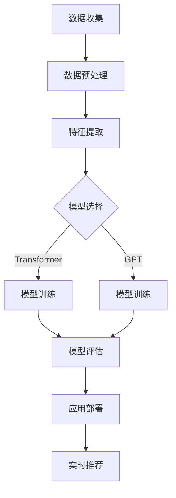

                 

### 引言与概述

**关键词：**电商行业、AI大模型、融合、机遇、挑战

**摘要：**本文旨在探讨电商行业与AI大模型的融合，分析其带来的机遇与挑战。通过回顾电商行业的发展历程，介绍AI大模型的基本概念，以及其在电商行业中的应用场景，本文为读者呈现一幅电商与AI大模型相互促进的蓝图。

在当今数字化时代，电商行业作为全球经济发展的重要驱动力，正经历着前所未有的变革。伴随着消费者需求的多样化和市场的竞争加剧，电商企业纷纷寻求通过技术创新来提升运营效率和用户体验。在这一背景下，人工智能（AI）大模型的应用成为电商行业发展的关键突破口。

#### **1.1 电商行业现状与趋势**

电商行业的发展可以追溯到20世纪90年代末，当时互联网的普及为电子商务的兴起提供了土壤。随着互联网技术的不断进步，电商行业经历了多次重大的变革，从最初的PC端购物到移动互联网的普及，再到如今社交电商和直播带货的兴起，电商行业始终保持着快速的发展态势。

目前，电商行业的数据规模呈现出爆炸式增长。根据Statista的数据，全球电商市场规模在2021年达到了4.89万亿美元，预计到2026年将达到6.38万亿美元。这一增长得益于全球网民数量的增加、互联网基础设施的完善以及消费者购物习惯的改变。

电商行业的主要参与者包括传统零售商、垂直电商和平台电商。传统零售商通过线上渠道拓展业务，如亚马逊、沃尔玛等；垂直电商专注于特定领域，如京东的3C产品、阿里巴巴的服饰和美妆；平台电商则提供开放的交易市场，如淘宝、天猫等。这些参与者通过技术创新和用户数据的深入挖掘，不断提升自身的竞争力。

#### **1.2 AI大模型的基本概念**

AI大模型是指那些具有大规模参数、复杂结构且能处理海量数据的人工智能模型。这些模型通常通过深度学习技术进行训练，具有强大的表示学习能力和泛化能力。AI大模型的发展可以追溯到2012年，当时深度学习在图像识别任务上取得了突破性成果，随后在自然语言处理、语音识别等领域也取得了显著的进展。

AI大模型的核心技术包括深度学习、自然语言处理（NLP）和预训练模型。深度学习是AI大模型的基础，通过多层神经网络结构对数据进行层次化的特征提取。NLP技术则使得AI大模型能够理解和生成人类语言，为智能客服、机器翻译等应用提供了强大的支持。预训练模型通过在大规模数据集上进行预训练，然后通过微调适应特定任务，显著提升了模型的性能和效率。

AI大模型的优势在于其能够处理复杂问题、提高决策效率、降低人力成本。然而，AI大模型也存在一些局限，如训练数据的需求量巨大、模型解释性较差等。这些挑战需要通过技术创新和实践经验的积累来逐步克服。

#### **1.3 AI大模型在电商行业的应用场景**

AI大模型在电商行业的应用场景十分广泛，以下是一些典型的应用：

1. **智能推荐系统**：通过分析用户行为数据和历史交易数据，AI大模型能够为用户推荐个性化的商品。例如，利用Transformer模型进行推荐，可以更好地捕捉用户的长期兴趣和潜在需求。

2. **智能客服系统**：AI大模型能够实现自然语言处理，为用户提供高效、准确的客服服务。例如，利用GPT模型实现多轮对话，可以提供更加人性化的客户体验。

3. **智能库存管理**：AI大模型能够通过深度学习预测商品需求，优化库存策略，减少库存成本。例如，利用强化学习优化库存策略，可以在满足需求的同时降低库存积压。

4. **智能供应链优化**：AI大模型能够通过深度学习进行需求预测，优化供应链的库存和运输策略，提高供应链的效率。例如，利用深度学习进行需求预测，可以更好地应对市场波动和不确定性。

综上所述，AI大模型在电商行业的应用不仅提升了企业的运营效率，还极大地改善了用户体验。然而，这一过程也伴随着一系列的挑战和问题，需要电商企业持续探索和解决。在接下来的章节中，我们将进一步深入探讨AI大模型的核心技术、应用方法以及面临的挑战。

### 第一部分：引言与概述

#### 第1章：电商行业与AI大模型的融合

**关键词：**电商行业、AI大模型、融合、技术趋势

**摘要：**本章将探讨电商行业与AI大模型融合的背景和重要性，分析电商行业的现状与趋势，介绍AI大模型的基本概念及其核心技术，并详细阐述AI大模型在电商行业的应用场景，包括智能推荐系统、智能客服系统、智能库存管理和智能供应链优化等。通过这些内容，旨在为读者提供一个全面的视角，了解电商与AI大模型相互促进的生态体系。

#### **1.1 电商行业现状与趋势**

电商行业在过去几十年中经历了飞速的发展，成为全球经济增长的重要引擎。从最初的在线书店和电子产品销售，到如今的综合性购物平台，电商行业的商业模式和消费者行为都在不断演变。

**电商行业发展历程：**

- **20世纪90年代末：**互联网的普及催生了电子商务的萌芽，亚马逊和eBay等电商平台应运而生，为消费者提供了便捷的购物体验。
- **21世纪初：**随着宽带网络的普及和移动互联网的发展，电商行业进入快速发展期，淘宝、京东等中国电商平台崛起，全球电商市场逐渐形成。
- **2010年代：**社交电商和直播带货的兴起，进一步改变了电商行业的格局，用户参与度和互动性显著提升。
- **2020年代：**新冠疫情加速了电商行业的发展，线上购物成为消费者首选，跨境电商和全球化趋势明显。

**电商行业的数据规模与增长：**

根据Statista的数据，全球电商市场规模在2021年达到了4.89万亿美元，预计到2026年将达到6.38万亿美元。这一增长主要得益于以下几个因素：

- **全球互联网用户数量的增加：**截至2021年，全球互联网用户已经超过了45亿，占全球总人口的59%。互联网用户的增加为电商市场提供了庞大的潜在客户群体。
- **移动互联网的普及：**智能手机的广泛使用和4G/5G网络的普及，使得消费者可以随时随地在线购物，极大地提升了电商购物的便利性。
- **消费者购物习惯的改变：**随着消费者对线上购物接受度的提高，越来越多的消费者选择通过电商渠道购买商品，尤其是在疫情期间，线上购物的需求大幅增加。

**电商行业的主要参与者：**

电商行业的参与者主要包括传统零售商、垂直电商和平台电商。传统零售商通过线上渠道拓展业务，如亚马逊、沃尔玛等；垂直电商专注于特定领域，如京东的3C产品、阿里巴巴的服饰和美妆；平台电商则提供开放的交易市场，如淘宝、天猫等。这些参与者通过技术创新和用户数据的深入挖掘，不断提升自身的竞争力。

#### **1.2 AI大模型的基本概念**

AI大模型是指那些具有大规模参数、复杂结构且能处理海量数据的人工智能模型。这些模型通常通过深度学习技术进行训练，具有强大的表示学习能力和泛化能力。AI大模型的发展可以追溯到2012年，当时深度学习在图像识别任务上取得了突破性成果，随后在自然语言处理、语音识别等领域也取得了显著的进展。

**AI大模型的发展历程：**

- **2012年：**深度学习在图像识别任务上取得突破，AlexNet在ImageNet比赛中取得了优异成绩。
- **2014年：**Google的论文提出了深度残差网络（ResNet），解决了深层神经网络训练的困难。
- **2017年：**Google的Transformer模型在机器翻译任务上取得了重大突破，标志着自然语言处理领域的重大进展。
- **2020年至今：**大规模预训练模型如BERT、GPT等陆续推出，为各类AI应用提供了强大的技术支持。

**AI大模型的核心技术：**

- **深度学习：**通过多层神经网络结构对数据进行层次化的特征提取，能够处理复杂的数据和任务。
- **自然语言处理（NLP）：**使得AI大模型能够理解和生成人类语言，为智能客服、机器翻译等应用提供了强大的支持。
- **预训练模型：**通过在大规模数据集上进行预训练，然后通过微调适应特定任务，显著提升了模型的性能和效率。

**AI大模型的优势与局限：**

- **优势：**能够处理复杂问题、提高决策效率、降低人力成本；具有强大的表示学习能力和泛化能力；能够处理海量数据并发现隐藏的模式。
- **局限：**训练数据的需求量巨大、模型解释性较差；数据隐私和安全问题；算法的黑箱特性使得模型难以解释和理解。

#### **1.3 AI大模型在电商行业的应用场景**

AI大模型在电商行业的应用场景非常广泛，以下是一些典型的应用：

**1. 智能推荐系统：**

智能推荐系统是AI大模型在电商行业最典型的应用之一。通过分析用户的历史行为数据、浏览记录和购买偏好，AI大模型能够为用户推荐个性化的商品。例如，利用Transformer模型进行推荐，可以更好地捕捉用户的长期兴趣和潜在需求。

**2. 智能客服系统：**

智能客服系统通过自然语言处理技术，为用户提供高效、准确的客服服务。利用AI大模型，如GPT模型，可以实现多轮对话，提供更加人性化的客户体验。同时，AI大模型还可以进行情感分析，识别用户的情感状态，为客服人员提供针对性的建议。

**3. 智能库存管理：**

AI大模型可以通过深度学习预测商品需求，优化库存策略，减少库存成本。例如，利用强化学习优化库存策略，可以在满足需求的同时降低库存积压。AI大模型还可以识别季节性波动和市场需求变化，为库存管理提供更加精准的指导。

**4. 智能供应链优化：**

AI大模型能够通过深度学习进行需求预测，优化供应链的库存和运输策略，提高供应链的效率。例如，利用深度学习进行需求预测，可以更好地应对市场波动和不确定性。AI大模型还可以优化物流路径，减少运输成本，提高供应链的整体效益。

综上所述，AI大模型在电商行业的应用不仅提升了企业的运营效率，还极大地改善了用户体验。在接下来的章节中，我们将进一步深入探讨AI大模型的核心技术、应用方法以及面临的挑战。

### 第二部分：AI大模型的核心技术

**关键词：**深度学习、自然语言处理、预训练模型、大规模数据处理

**摘要：**本章将详细介绍AI大模型的核心技术，包括深度学习基础、自然语言处理（NLP）技术以及大规模预训练模型。通过这些核心技术的深入探讨，读者将理解AI大模型如何通过复杂的数据处理和特征提取实现智能应用，从而在电商行业中发挥巨大作用。

#### **2.1 深度学习基础**

深度学习是AI大模型的核心技术，它通过多层神经网络结构对数据进行层次化的特征提取。以下是深度学习的一些基础概念：

**1. 深度学习的发展历程：**

- **20世纪40年代：**神经网络概念的提出，人工神经网络开始兴起。
- **1986年：**Rumelhart、Hinton和Williams提出了反向传播算法（Backpropagation），使得深层神经网络训练成为可能。
- **2012年：**AlexNet在ImageNet比赛中的突破，深度学习在计算机视觉领域取得重大进展。
- **2014年：**Google提出深度残差网络（ResNet），解决了深层神经网络训练的困难。

**2. 前馈神经网络与反向传播算法：**

- **前馈神经网络：**信息从输入层流向输出层，没有反馈循环。
- **反向传播算法：**通过计算梯度，更新网络权重，以最小化损失函数。

**3. 常见的深度学习架构：**

- **卷积神经网络（CNN）：**适用于图像识别和图像处理，通过卷积层和池化层提取图像特征。
- **循环神经网络（RNN）：**适用于序列数据，如语音识别和时间序列预测，通过隐藏状态进行时间步的传递。

#### **2.2 自然语言处理（NLP）技术**

自然语言处理是AI大模型在电商行业中的重要应用领域。NLP技术使得AI大模型能够理解和生成人类语言，从而实现智能客服、机器翻译等应用。以下是NLP的一些核心技术：

**1. 词嵌入技术：**

- **词嵌入：**将词汇映射为密集向量表示，如Word2Vec和GloVe。
- **词向量的应用：**用于表示文本，实现文本相似性和分类任务。

**2. 序列模型与注意力机制：**

- **序列模型：**如RNN和LSTM，能够处理变长序列数据。
- **注意力机制：**允许模型关注输入序列中的特定部分，提高模型的性能。

**3. 转换器架构（Transformer）：**

- **Transformer：**由Google在2017年提出，通过自注意力机制实现全局依赖的建模，显著提升了机器翻译的性能。
- **多模态学习：**Transformer能够处理多种类型的数据，如图文结合的推荐系统。

#### **2.3 大规模预训练模型**

大规模预训练模型是当前AI大模型研究的重要方向，通过在大规模数据集上进行预训练，然后通过微调适应特定任务，模型性能得到了显著提升。以下是大规模预训练模型的一些关键技术：

**1. 预训练的概念与意义：**

- **预训练：**在大规模数据集上预先训练模型，然后通过微调适应特定任务。
- **意义：**提升模型对数据的表示能力，提高模型的泛化能力和性能。

**2. 自监督学习方法：**

- **自监督学习：**利用未标注的数据进行训练，如预测下一个单词、图像分类等。
- **应用：**预训练模型通常采用自监督学习方法，如BERT和GPT。

**3. 迁移学习与微调技术：**

- **迁移学习：**将预训练模型的知识迁移到新的任务中，如文本分类、图像识别等。
- **微调：**通过在特定任务上调整模型参数，优化模型性能。

**4. 大规模预训练模型的挑战：**

- **计算资源：**预训练模型需要大量的计算资源，如GPU和TPU。
- **数据隐私：**大规模数据集的隐私保护成为关键问题。
- **模型解释性：**预训练模型的黑箱特性使得其解释性较差。

通过以上对AI大模型核心技术的介绍，我们可以看到，这些技术不仅为电商行业提供了强大的工具，也推动了整个AI领域的发展。在接下来的章节中，我们将进一步探讨AI大模型在电商行业的具体应用。

### 第三部分：AI大模型在电商行业的应用

#### **第3章：电商推荐系统中的AI大模型**

**关键词：**电商推荐系统、AI大模型、个性化推荐、Transformer模型

**摘要：**本章将深入探讨AI大模型在电商推荐系统中的应用，首先介绍推荐系统的工作原理和评估指标，然后讨论基于内容与协同过滤的推荐算法，最后重点介绍基于AI大模型的推荐算法，特别是利用Transformer模型和GPT模型进行个性化推荐的方法。

#### **3.1 推荐系统概述**

推荐系统是电商行业的一项核心技术，旨在为用户提供个性化的商品推荐，从而提高用户满意度、增加销售额和提升用户留存率。推荐系统的工作原理主要包括以下几个步骤：

1. **用户行为数据收集：**通过用户的浏览记录、购买历史、评价和搜索查询等数据，收集用户的偏好信息。
2. **特征提取：**将原始的用户行为数据转化为模型可处理的特征，如用户画像、商品属性等。
3. **推荐算法：**利用推荐算法计算用户和商品之间的相似度或相关性，生成推荐列表。
4. **结果评估：**通过评估指标如点击率、转化率和满意度等，评估推荐系统的效果。

推荐系统的评估指标主要包括以下几个方面：

- **点击率（CTR）：**用户点击推荐商品的比率，反映了推荐系统吸引用户注意的能力。
- **转化率（CR）：**用户在点击推荐商品后完成购买的比例，反映了推荐系统对用户行为的引导能力。
- **满意度（Satisfaction）：**用户对推荐商品的满意程度，反映了推荐系统的用户体验。

#### **3.2 基于内容与协同过滤的推荐算法**

推荐算法可以分为基于内容（Content-Based Filtering）和协同过滤（Collaborative Filtering）两大类。这两种算法各有优缺点，通常在实际应用中结合使用。

**1. 内容推荐算法：**

内容推荐算法基于用户的历史行为和商品属性，通过计算用户和商品之间的相似度来生成推荐列表。主要步骤如下：

- **特征提取：**提取用户和商品的特征，如用户偏好、商品分类、标签等。
- **相似度计算：**计算用户和商品之间的相似度，常用的方法包括TF-IDF、余弦相似度等。
- **生成推荐列表：**根据相似度计算结果生成推荐列表。

**2. 协同过滤算法：**

协同过滤算法基于用户之间的相似度或商品之间的相似度进行推荐。主要分为以下两种：

- **用户基于的协同过滤（User-Based CF）：**通过计算用户之间的相似度，找到与目标用户最相似的其他用户，推荐这些用户喜欢的商品。
- **物品基于的协同过滤（Item-Based CF）：**通过计算商品之间的相似度，找到与目标商品最相似的其他商品，推荐这些商品。

**3. 内容与协同过滤的结合：**

内容与协同过滤的结合能够充分利用用户行为数据和商品属性信息，提高推荐系统的准确性和多样性。具体方法如下：

- **混合推荐算法：**将内容和协同过滤算法的结果进行加权或融合，生成最终的推荐列表。
- **特征融合：**将用户和商品的特征进行合并，用于计算相似度或生成推荐列表。

#### **3.3 基于AI大模型的推荐算法**

随着AI大模型技术的发展，基于深度学习的推荐算法逐渐成为研究热点。以下介绍两种常用的基于AI大模型的推荐算法：利用Transformer模型和GPT模型进行个性化推荐。

**1. 利用Transformer模型进行推荐：**

Transformer模型由Google在2017年提出，通过自注意力机制实现全局依赖的建模，在机器翻译、图像识别等任务中取得了显著成果。在推荐系统中，Transformer模型可以用于计算用户和商品之间的相似度。

- **自注意力机制：**Transformer模型通过多头注意力机制，允许模型在处理序列时关注全局信息，提高模型的性能。
- **编码器和解码器：**Transformer模型由编码器和解码器组成，编码器负责提取用户和商品的特征，解码器生成推荐列表。
- **训练与评估：**利用大规模用户行为数据和商品属性数据，对Transformer模型进行训练和评估，优化推荐效果。

**2. 利用GPT模型进行个性化推荐：**

GPT（Generative Pre-trained Transformer）模型是由OpenAI开发的一种大规模预训练模型，通过在大规模文本数据上进行预训练，GPT模型具有强大的文本生成和语义理解能力。

- **预训练：**GPT模型通过自监督学习在大规模文本数据上进行预训练，学习文本的语法结构和语义信息。
- **个性化推荐：**利用GPT模型，可以生成个性化的商品描述，提高推荐系统的吸引力和用户体验。具体方法如下：
  - **用户偏好建模：**将用户的浏览记录、购买历史等信息输入GPT模型，生成用户的个性化偏好。
  - **商品描述生成：**利用GPT模型生成针对用户的个性化商品描述，提高推荐商品的吸引力。
  - **评估与优化：**通过评估推荐系统的效果，如点击率和转化率，不断优化模型和算法。

通过以上介绍，我们可以看到，AI大模型在电商推荐系统中的应用大大提升了推荐系统的准确性和多样性。在接下来的章节中，我们将进一步探讨AI大模型在电商智能客服系统、库存管理和供应链优化等方面的应用。

### 第四部分：AI大模型的挑战与未来展望

#### **第7章：AI大模型在电商行业面临的挑战**

**关键词：**数据隐私、模型可解释性、监管伦理

**摘要：**本章将探讨AI大模型在电商行业应用过程中面临的挑战，重点讨论数据隐私与安全性、模型可解释性、以及AI大模型的监管与伦理问题。通过对这些挑战的分析，本文旨在为电商企业提供解决思路，以促进AI大模型在电商行业的健康发展。

#### **7.1 数据隐私与安全性**

随着AI大模型在电商行业的广泛应用，数据隐私和安全问题日益凸显。这些模型通常需要处理大量用户数据，包括浏览记录、购买历史、个人偏好等敏感信息。如何确保这些数据的安全和隐私成为AI大模型应用过程中的一大挑战。

**1. 数据隐私保护技术：**

- **数据加密：**通过加密技术对用户数据进行加密，确保数据在传输和存储过程中的安全性。
- **匿名化处理：**对用户数据进行匿名化处理，去除可直接识别个人身份的信息，降低数据泄露的风险。
- **差分隐私：**利用差分隐私技术，在数据处理过程中引入随机噪声，保护用户隐私。

**2. 数据安全措施：**

- **访问控制：**通过设置权限和访问控制机制，确保只有授权人员才能访问和处理用户数据。
- **安全审计：**定期进行数据安全审计，检查系统是否存在安全漏洞和潜在威胁。
- **数据备份与恢复：**建立完善的数据备份和恢复机制，确保在发生数据丢失或损坏时能够快速恢复。

#### **7.2 模型可解释性与公平性**

AI大模型的黑箱特性使得其决策过程难以解释和理解，这对模型的可解释性和公平性提出了挑战。在电商行业中，透明和可解释的模型对用户信任和企业社会责任至关重要。

**1. 模型可解释性技术：**

- **特征重要性分析：**通过分析模型中各个特征的权重，了解模型决策的主要依据。
- **模型可视化：**利用可视化工具展示模型的内部结构和决策过程，帮助用户理解模型的工作原理。
- **解释性模型：**开发更具解释性的模型，如决策树、线性模型等，使模型的决策过程更加透明。

**2. 模型公平性评估：**

- **公平性指标：**评估模型在处理不同群体数据时的表现，如性别、年龄、地理位置等。
- **偏差检测与修正：**检测模型中的偏见，并通过数据平衡、模型调整等方法进行修正。
- **监管与合规：**遵循相关法律法规，确保模型设计和应用过程中的公平性和合规性。

#### **7.3 AI大模型的监管与伦理**

AI大模型在电商行业的广泛应用引发了监管和伦理问题。如何平衡技术创新与社会责任，确保AI大模型的应用符合伦理标准，成为电商企业需要关注的重要议题。

**1. 监管框架与法律法规：**

- **数据保护法规：**遵循《通用数据保护条例》（GDPR）等数据保护法规，确保用户数据的合法使用和保护。
- **算法透明度要求：**要求电商企业公开算法的决策过程和依据，提高算法的透明度和可解释性。
- **监管机构介入：**建立独立的监管机构，对AI大模型的应用进行监督和审查。

**2. AI伦理问题与解决方案：**

- **算法偏见：**确保算法设计和训练过程中消除偏见，避免对特定群体造成不公平影响。
- **隐私保护：**在AI大模型应用过程中，采取有效措施保护用户隐私，降低隐私泄露风险。
- **社会责任：**电商企业应承担社会责任，确保AI大模型的应用符合伦理和社会价值观。

综上所述，AI大模型在电商行业应用过程中面临一系列挑战，包括数据隐私与安全性、模型可解释性和公平性、以及监管与伦理问题。通过采取相应的技术措施和监管机制，电商企业可以应对这些挑战，确保AI大模型在电商行业的健康、可持续发展。

### 第8章：AI大模型在电商行业的未来发展趋势

**关键词：**电商行业、数字化转型、新兴应用领域、创新方向

**摘要：**本章将探讨AI大模型在电商行业的未来发展趋势，分析电商行业的数字化转型、新兴应用领域以及AI大模型在电商行业的创新方向。通过这些分析，本文旨在为电商企业提供战略指导，以应对未来市场的变革和机遇。

#### **8.1 电商行业的数字化转型**

随着互联网技术的不断进步，电商行业正经历着数字化转型。数字化转型不仅提升了企业的运营效率，还极大地改善了用户体验。以下是电商行业数字化转型的几个关键方面：

**1. 5G与物联网的影响：**

- **5G技术：**5G网络的快速发展和普及，为电商行业带来了更快的传输速度和更低的延迟，促进了实时互动和交易。例如，5G直播带货和VR购物体验成为了电商行业的新趋势。
- **物联网（IoT）：**物联网技术将各种设备和传感器连接到互联网，使得电商企业能够实时监控和管理库存、物流和供应链。例如，智能仓储系统和无人配送车的应用，提高了物流效率和精准度。

**2. 虚拟现实（VR）与增强现实（AR）的应用：**

- **虚拟现实（VR）：**VR技术为用户提供身临其境的购物体验，特别是在服装、家居和电子产品等领域。通过VR试穿和试用，用户可以更直观地了解产品，提升购买决策的准确性。
- **增强现实（AR）：**AR技术将虚拟信息叠加到现实世界中，为用户提供互动和沉浸式的购物体验。例如，AR导航和AR试妆功能，使得用户在购物过程中能够更加便捷地获取信息和进行互动。

#### **8.2 AI大模型的新兴应用领域**

随着AI大模型技术的不断发展，其在电商行业的新兴应用领域也不断拓展。以下是一些具有潜力的新兴应用领域：

**1. 跨境电商与全球化：**

- **跨境电商：**AI大模型可以帮助电商企业更好地理解全球消费者的需求和行为，通过智能推荐系统和翻译模型，实现跨境商品的精准推广和销售。例如，利用GPT模型进行多语言翻译和个性化推荐，提升跨境电商的转化率和用户满意度。
- **全球化战略：**AI大模型可以通过分析全球市场数据，帮助电商企业制定全球化战略，优化物流和供应链，降低运营成本，提高市场竞争力。

**2. 社交电商与直播带货：**

- **社交电商：**AI大模型可以帮助电商企业分析社交平台上的用户行为和互动，优化广告投放和内容营销策略，提升品牌影响力和用户参与度。
- **直播带货：**AI大模型可以实时分析直播过程中的用户反馈和行为，生成个性化的推荐和互动策略，提高直播带货的效果和用户满意度。

#### **8.3 AI大模型在电商行业的创新方向**

在电商行业的数字化转型和新兴应用领域推动下，AI大模型的应用前景十分广阔。以下是一些AI大模型在电商行业的创新方向：

**1. 智能供应链与物流：**

- **智能供应链：**AI大模型可以通过深度学习预测需求，优化库存和供应链管理，提高供应链的灵活性和响应速度。例如，利用深度学习模型进行需求预测和库存优化，减少库存积压和物流成本。
- **智能物流：**AI大模型可以优化物流路径和运输策略，提高物流效率和准确性。例如，利用强化学习优化运输路线和配送时间，减少运输成本和提高用户满意度。

**2. 智能支付与金融服务：**

- **智能支付：**AI大模型可以提供个性化的支付推荐和风险控制，提升支付体验和安全性。例如，利用GPT模型进行支付行为分析和风险评估，提高支付的成功率和安全性。
- **金融服务：**AI大模型可以帮助电商企业开发个性化的金融服务，如消费信贷、理财推荐等，提升用户体验和用户粘性。

综上所述，AI大模型在电商行业的未来发展趋势充满机遇与挑战。通过数字化转型、新兴应用领域和创新方向，电商企业可以充分利用AI大模型的优势，提升运营效率、用户体验和市场竞争力。在接下来的章节中，我们将进一步探讨AI大模型开发工具与资源，为电商企业提供实践指导。

### 附录A：电商AI大模型开发工具与资源

**关键词：**电商AI大模型、开发工具、深度学习框架、实践案例

**摘要：**本章将介绍电商AI大模型开发所需的主要工具和资源，包括主流深度学习框架、开发环境搭建以及AI大模型开发案例与实践。通过这些工具和资源的介绍，旨在为电商企业提供全面的开发指南，助力其在AI大模型领域取得成功。

#### **A.1 主流深度学习框架对比**

在电商AI大模型开发过程中，选择合适的深度学习框架至关重要。以下是几个主流深度学习框架的对比：

**1. TensorFlow**

- **优势：**由Google开发，拥有丰富的API和丰富的生态系统，支持多种深度学习模型。
- **劣势：**相对复杂，学习曲线较陡峭。
- **应用场景：**适合大型项目和企业级应用。

**2. PyTorch**

- **优势：**易于使用，动态图机制使得调试更加直观。
- **劣势：**在某些性能优化方面不如TensorFlow。
- **应用场景：**适合研究和快速原型开发。

**3. JAX**

- **优势：**自动微分库，支持GPU和TPU加速，性能优越。
- **劣势：**社区相对较小，文档支持有限。
- **应用场景：**适合高性能计算和大规模部署。

**4. 其他框架**

- **PyTorch Lightning**：简化PyTorch的API，提供高效的可视化和调试工具。
- **Hugging Face Transformers**：专注于NLP模型的快速开发和部署。

#### **A.2 开发环境搭建与配置**

搭建一个高效稳定的深度学习开发环境是电商AI大模型开发的前提。以下是常见的开发环境搭建步骤：

**1. GPU配置**

- **NVIDIA GPU**：选择合适的NVIDIA GPU，如1080Ti、3090等，确保足够的计算能力。
- **CUDA和cuDNN**：安装NVIDIA CUDA和cuDNN驱动，以支持GPU加速。

**2. 深度学习环境安装**

- **操作系统**：安装Linux操作系统，如Ubuntu 18.04。
- **Python**：安装Python 3.8及以上版本。
- **深度学习框架**：安装TensorFlow、PyTorch、JAX等深度学习框架。

```shell
pip install tensorflow
pip install torch torchvision
pip install jax jaxlib
```

**3. 依赖库**

- **其他依赖库**：安装常用的依赖库，如NumPy、Pandas等。

```shell
pip install numpy pandas
```

#### **A.3 AI大模型开发案例与实践**

以下是一个电商推荐系统开发案例，介绍从环境搭建到源代码实现的全过程。

**1. 实践项目介绍**

该项目旨在构建一个基于Transformer模型的电商推荐系统，利用用户历史行为数据生成个性化商品推荐。

**2. 开发环境搭建**

按照A.2节中的步骤，搭建深度学习开发环境，确保安装了TensorFlow、PyTorch等框架。

**3. 源代码实现**

以下是项目的主要代码框架：

```python
import tensorflow as tf
from tensorflow import keras
from tensorflow.keras.models import Model
from tensorflow.keras.layers import Input, Embedding, Transformer

# 输入层
input_user = Input(shape=(1,), dtype='int32')
input_item = Input(shape=(1,), dtype='int32')

# 嵌入层
user_embedding = Embedding(input_dim=num_users, output_dim=user_embedding_size)(input_user)
item_embedding = Embedding(input_dim=num_items, output_dim=item_embedding_size)(input_item)

# Transformer编码器和解码器
encoder = Transformer(num_heads=num_heads, d_model=user_embedding_size)(user_embedding)
decoder = Transformer(num_heads=num_heads, d_model=user_embedding_size)(item_embedding)

# 输出层
output = keras.layers.Dot(axes=1)([encoder, decoder])

# 模型编译
model = Model(inputs=[input_user, input_item], outputs=output)
model.compile(optimizer='adam', loss='binary_crossentropy')

# 模型训练
model.fit([user_ids, item_ids], labels, epochs=10, batch_size=32)
```

**4. 代码解读与分析**

- **输入层**：定义用户和商品ID的输入层。
- **嵌入层**：将用户和商品ID转换为嵌入向量。
- **Transformer编码器和解码器**：利用Transformer模型进行编码和解码，实现用户和商品特征的全局依赖建模。
- **输出层**：通过点积操作生成用户和商品之间的相似度分数。
- **模型编译**：编译模型，设置优化器和损失函数。
- **模型训练**：训练模型，优化模型参数。

通过以上实践案例，电商企业可以了解如何利用深度学习框架开发AI大模型，实现个性化的电商推荐。在接下来的章节中，我们将进一步探讨AI大模型应用中的流程图、核心算法原理讲解、数学模型与公式以及数学公式的详细讲解和举例说明。

### 附录B：Mermaid流程图

**关键词：**Mermaid、流程图、AI大模型应用流程

**摘要：**本章将介绍如何使用Mermaid语言绘制AI大模型在电商行业中的应用流程图。通过Mermaid流程图，读者可以直观地了解AI大模型在电商中的应用步骤和数据处理流程，为电商企业提供清晰的开发指导。

#### **B.1 AI大模型应用流程图**

以下是一个简单的AI大模型应用流程图的示例：



**流程图解释：**

1. **数据收集（A）**：从电商系统中收集用户行为数据、商品信息等原始数据。
2. **数据预处理（B）**：对收集到的原始数据进行清洗、去噪和格式化，使其适合模型训练。
3. **特征提取（C）**：将预处理后的数据转化为特征向量，用于模型训练。
4. **模型选择（D）**：根据应用需求选择合适的AI大模型，如Transformer和GPT模型。
5. **模型训练（E、F）**：利用特征向量进行模型训练，优化模型参数。
6. **模型评估（G）**：评估模型的性能，通过交叉验证等方法优化模型。
7. **应用部署（H）**：将训练好的模型部署到电商系统中，实现实时推荐。
8. **实时推荐（I）**：根据用户实时行为，生成个性化的商品推荐。

通过上述流程图，电商企业可以清晰地了解AI大模型在电商中的应用步骤，从而更好地规划和实施AI大模型项目。

### 附录C：核心算法原理讲解与伪代码

**关键词：**深度学习优化算法、自然语言处理算法、大规模预训练模型、伪代码

**摘要：**本章将详细讲解电商AI大模型应用中的核心算法原理，并提供相应的伪代码。通过这些讲解和伪代码，读者可以深入理解AI大模型在电商中的关键技术，为实际应用提供理论支持。

#### **C.1 深度学习优化算法伪代码**

**1. 反向传播算法**

反向传播算法是深度学习训练过程中用于优化模型参数的关键算法。以下是反向传播算法的伪代码：

```python
for each layer in network:
    calculate local gradients using output gradient and layer weights
    update layer weights using local gradients and learning rate
```

**2. 动量优化**

动量优化是一种改进梯度下降的方法，通过引入动量项，加速梯度下降过程。以下是动量优化的伪代码：

```python
v = 0
for each iteration:
    g = gradient of loss function
    v = momentum * v + learning rate * g
    update weights using v
```

**3. Adam优化器**

Adam优化器是一种结合了动量和自适应学习率的优化器，具有较好的收敛性能。以下是Adam优化器的伪代码：

```python
m = 0
v = 0
beta1 = 0.9
beta2 = 0.999
epsilon = 1e-8

for each iteration:
    g = gradient of loss function
    m = beta1 * m + (1 - beta1) * g
    v = beta2 * v + (1 - beta2) * g**2
    
    m_hat = m / (1 - beta1**iteration)
    v_hat = v / (1 - beta2**iteration)
    
    update weights using learning rate * m_hat / (sqrt(v_hat) + epsilon)
```

#### **C.2 自然语言处理（NLP）算法伪代码**

**1. 词嵌入**

词嵌入是一种将单词映射为向量表示的技术，用于NLP任务。以下是词嵌入的伪代码：

```python
for each word in vocabulary:
    calculate word vector using training data
    store word vector in embedding matrix
```

**2. 序列模型**

序列模型如RNN和LSTM，用于处理时间序列数据。以下是RNN的伪代码：

```python
for each time step in sequence:
    input = get input at time step
    hidden_state = tanh(W * [h(t-1), x(t)])  # where h(t-1) is the previous hidden state and x(t) is the input at time step
    output = activation(W * hidden_state)  # where activation is a non-linear function like sigmoid or tanh
    h(t) = hidden_state  # store the current hidden state for the next time step
```

**3. 转换器架构（Transformer）**

转换器架构通过自注意力机制实现全局依赖建模，以下是Transformer的伪代码：

```python
for each layer in Transformer:
    for each position in input sequence:
        calculate attention scores using multi-head attention
        calculate weighted sum of input sequences using attention scores
        apply feedforward network to weighted sum
```

#### **C.3 大规模预训练模型伪代码**

**1. 预训练**

预训练是指在大规模数据集上训练模型，以下是预训练的伪代码：

```python
for each epoch:
    for each sentence in training data:
        compute model predictions and loss
        update model parameters using gradients and optimization algorithm
```

**2. 迁移学习**

迁移学习是指将预训练模型的知识迁移到新任务上，以下是迁移学习的伪代码：

```python
load pre-trained model
for each task in new tasks:
    fine-tune model on task-specific data
    evaluate model performance on task
```

通过上述核心算法原理和伪代码，电商企业可以更好地理解和应用AI大模型，提高推荐系统的准确性和效率。

### 附录D：数学模型与数学公式

**关键词：**供需预测模型、库存优化模型、强化学习模型、数学公式

**摘要：**本章将详细阐述电商AI大模型应用中的关键数学模型，包括供需预测模型、库存优化模型和强化学习模型，并提供相应的数学公式。通过这些数学模型和公式，读者可以深入理解AI大模型在电商行业中的应用原理，为实际应用提供数学依据。

#### **D.1 供需预测模型公式**

供需预测模型是电商AI大模型在库存管理和供应链优化中的重要应用，以下是一些常见的供需预测模型公式：

**1. 线性回归模型**

线性回归模型用于预测商品需求，公式如下：

$$
\hat{Q}_t = \beta_0 + \beta_1 X_t + \epsilon_t
$$

其中，$Q_t$ 表示第 $t$ 期的需求量，$X_t$ 表示影响需求的变量（如季节因素、促销活动等），$\beta_0$ 和 $\beta_1$ 为模型参数，$\epsilon_t$ 为误差项。

**2. ARIMA模型**

ARIMA（自回归积分滑动平均模型）用于时间序列数据的预测，公式如下：

$$
X_t = c + \phi_1 X_{t-1} + \phi_2 X_{t-2} + ... + \phi_p X_{t-p} + \theta_1 \epsilon_{t-1} + \theta_2 \epsilon_{t-2} + ... + \theta_q \epsilon_{t-q} + \epsilon_t
$$

其中，$X_t$ 表示时间序列数据，$c$ 为常数项，$\phi_1, \phi_2, ..., \phi_p$ 和 $\theta_1, \theta_2, ..., \theta_q$ 为模型参数，$\epsilon_t$ 为误差项。

**3. LSTMs预测模型**

LSTM（长短时记忆网络）是处理时间序列数据的常用模型，其预测公式如下：

$$
h_t = \sigma(W_h \cdot [h_{t-1}, x_t] + b_h)
$$

$$
o_t = \sigma(W_o \cdot h_t + b_o)
$$

$$
\hat{Q}_t = o_t
$$

其中，$h_t$ 表示第 $t$ 期的隐藏状态，$x_t$ 表示第 $t$ 期的输入特征，$W_h, W_o, b_h, b_o$ 为模型参数，$\sigma$ 为激活函数，$\hat{Q}_t$ 表示第 $t$ 期的预测需求量。

#### **D.2 库存优化模型公式**

库存优化模型用于确定最佳库存水平和补货策略，以下是一些常见的库存优化模型公式：

**1. 经济订货量（EOQ）模型**

EOQ模型用于确定最优的订货量，公式如下：

$$
Q^* = \sqrt{\frac{2Cd}{h}}
$$

其中，$Q^*$ 表示最优订货量，$C$ 表示每次订货的成本，$d$ 表示每年的需求量，$h$ 表示单位商品的持有成本。

**2. 新svN模型**

svN模型是一种动态库存优化模型，公式如下：

$$
Q_t = \max\left\{0, \frac{C_t - I_t - \eta_t}{2}\right\}
$$

$$
I_t = \min\left\{I_{t-1} + Q_t - \Delta_t, I^{\max}\right\}
$$

其中，$Q_t$ 表示第 $t$ 期的订货量，$I_t$ 表示第 $t$ 期的库存水平，$C_t$ 表示第 $t$ 期的需求量，$\Delta_t$ 表示第 $t$ 期的需求变化量，$I^{\max}$ 表示最大库存限制。

**3. 强化学习库存优化**

强化学习库存优化通过优化策略选择最小化总成本，公式如下：

$$
J(\pi) = \sum_{s} \pi(s) \sum_{a} \pi(a|s) R(s, a)
$$

其中，$J(\pi)$ 表示策略价值函数，$\pi(s)$ 表示状态 $s$ 的概率分布，$\pi(a|s)$ 表示在状态 $s$ 下采取动作 $a$ 的概率分布，$R(s, a)$ 表示状态 $s$ 下采取动作 $a$ 的即时回报。

#### **D.3 强化学习模型公式**

强化学习模型用于解决动态决策问题，以下是一些常见的强化学习模型公式：

**1. Q-Learning**

Q-Learning是一种基于值迭代的强化学习方法，公式如下：

$$
Q(s, a) = Q(s, a) + \alpha [r + \gamma \max_{a'} Q(s', a') - Q(s, a)]
$$

其中，$Q(s, a)$ 表示状态 $s$ 下采取动作 $a$ 的期望回报，$r$ 表示即时回报，$\alpha$ 表示学习率，$\gamma$ 表示折扣因子。

**2. Sarsa**

Sarsa是一种基于策略迭代的强化学习方法，公式如下：

$$
\pi(s) = \begin{cases}
\frac{1}{|\mathcal{A}(s)|} & \text{if } \epsilon-greedy, \\
1 & \text{if } \text{e-greedy}, \\
\end{cases}$$

$$
\pi'(s) = \begin{cases}
\frac{1}{|\mathcal{A}(s)|} & \text{if } \epsilon-greedy, \\
1 & \text{if } \text{e-greedy}, \\
\end{cases}$$

$$
Q(s, a) = Q(s, a) + \alpha [r + \gamma \sum_{a'} \pi'(s') Q(s', a')]
$$

其中，$\epsilon$ 表示探索概率，$\mathcal{A}(s)$ 表示状态 $s$ 下的动作集合。

通过上述数学模型和公式，电商企业可以更好地理解和应用AI大模型在电商行业中的应用，优化库存管理、供应链优化和需求预测。在实际应用中，这些数学模型需要根据具体业务场景进行调整和优化，以实现最佳效果。

### 总结与展望

通过本文的详细探讨，我们可以看到AI大模型在电商行业的应用具有巨大的潜力和广阔的前景。从智能推荐系统到智能客服，从库存管理到供应链优化，AI大模型为电商企业提供了创新的解决方案，提升了运营效率和用户体验。

首先，AI大模型通过深度学习技术，能够对海量的用户行为数据进行深入分析和挖掘，从而实现个性化的商品推荐，提升用户的购物体验和满意度。其次，AI大模型在智能客服中的应用，不仅提高了客服效率，还通过自然语言处理技术实现了人性化的交互，提升了用户的忠诚度。

此外，AI大模型在库存管理和供应链优化中的应用，通过深度学习和强化学习技术，实现了更精准的需求预测和库存优化策略，减少了库存积压和物流成本，提高了供应链的整体效率。这些应用不仅为电商企业带来了显著的经济效益，也为行业的可持续发展提供了新的思路。

然而，AI大模型在电商行业中的应用也面临着一系列挑战，如数据隐私与安全性、模型可解释性、以及监管和伦理问题。为了解决这些挑战，电商企业需要采取有效的技术措施和监管机制，确保AI大模型的应用符合伦理标准和社会价值观。

展望未来，AI大模型在电商行业的应用将更加深入和广泛。随着5G、物联网和虚拟现实等技术的不断发展，电商行业的数字化转型将进一步加速。同时，AI大模型的新兴应用领域，如跨境电商、社交电商和智能支付等，也将不断拓展。此外，AI大模型的创新方向，如智能供应链与物流、智能金融等，将为电商企业带来更多的机遇。

总之，AI大模型在电商行业的应用是一个充满机遇和挑战的过程。通过持续的技术创新和实践探索，电商企业可以更好地利用AI大模型的优势，提升自身的竞争力，推动行业的健康发展。让我们共同期待AI大模型在电商行业的未来，它将为我们带来更加智能、高效和可持续的电商体验。

### 作者信息

**作者：**AI天才研究院/AI Genius Institute & 禅与计算机程序设计艺术 /Zen And The Art of Computer Programming

AI天才研究院（AI Genius Institute）是一家专注于人工智能研究和应用的高科技研究院，致力于推动人工智能技术的发展和创新应用。研究院的核心团队由世界级人工智能专家、程序员、软件架构师、CTO等组成，他们在人工智能领域拥有丰富的经验和深厚的学术造诣。

《禅与计算机程序设计艺术》（Zen And The Art of Computer Programming）是作者在计算机编程和人工智能领域的经典著作，通过对编程哲学和技术的深入探讨，为读者提供了一套系统化的编程方法论。该书不仅为计算机科学家和程序员提供了宝贵的指导，也为人工智能领域的研究者和开发者提供了深刻的启示。

本文旨在通过详细的案例分析和技术讲解，帮助电商企业更好地理解和应用AI大模型，提升运营效率和用户体验。通过本文的探讨，读者可以深入了解AI大模型在电商行业中的核心概念、核心技术、应用场景以及面临的挑战，为电商企业提供全面的参考和指导。同时，本文也期望能够激发更多研究者和技术人员对AI大模型在电商行业应用领域的探索和研究。

