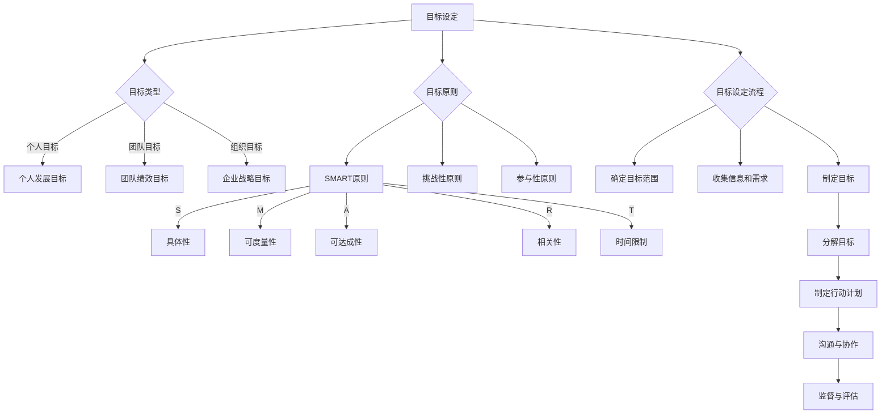
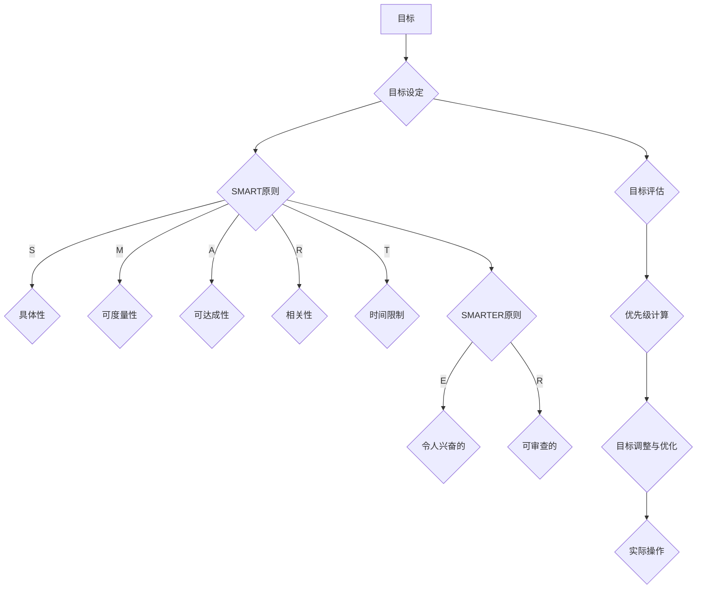

                 

# 《目标设定：引导团队前进的指南针》

## 关键词：目标设定、团队目标、策略与技巧、实践方法、案例分析、优化与调整

## 摘要

目标设定是团队管理中至关重要的一环，它不仅能够明确团队的方向，还能激发团队成员的积极性和创造力。本文将深入探讨目标设定的原理与意义，详细解析目标设定的类型与方法，介绍团队目标设定的策略与技巧，并通过实践方法和案例分析，提供目标设定的实际操作指南。文章最后将讨论目标设定的调整与优化策略，以及目标设定的工具与应用，帮助读者全面掌握目标设定的核心知识与实践技巧。

## 目录大纲

### 第一部分：目标设定的基础理论

- 第1章：目标设定的原理与意义
  - 1.1 目标与目标设定的定义
  - 1.2 目标设定的核心原则
  - 1.3 目标设定的类型与方法
  - 1.4 目标设定的流程与步骤

### 第二部分：团队目标设定的策略

- 第2章：团队目标设定的策略与技巧
  - 2.1 明确团队目标的重要性
  - 2.2 团队目标设定的策略
  - 2.3 团队目标设定的技巧

### 第三部分：目标设定的实践与应用

- 第3章：目标设定的实践方法与案例分析
  - 3.1 目标设定的实践方法
  - 3.2 目标设定的案例分析

- 第4章：目标设定的调整与优化
  - 4.1 目标设定的动态调整
  - 4.2 目标设定的优化策略

### 第四部分：目标设定的工具与技术

- 第5章：目标设定的工具与应用
  - 5.1 目标设定工具的选择与应用
  - 5.2 目标设定的技术支持

### 第五部分：目标设定的实际操作指南

- 第6章：目标设定的实际操作指南
  - 6.1 制定个人目标
  - 6.2 制定团队目标

- 第7章：目标设定的管理与监督
  - 7.1 目标设定的监督与反馈
  - 7.2 目标设定的绩效管理

### 附录

- 附录A：目标设定相关资源与工具
- 附录B：目标设定案例集锦

## 引言

在现代企业管理中，目标设定被视为一项基础而关键的任务。它不仅决定了团队的工作方向，还能够激发团队成员的积极性和创造力，提高团队的整体工作效率和业绩。然而，如何有效地进行目标设定，使得目标既有激励作用，又具有实际操作性，是许多团队管理者面临的挑战。本文旨在通过深入探讨目标设定的理论、策略和实践方法，为读者提供一套全面的目标设定指南，帮助团队管理者更好地引导团队前进。

在接下来的章节中，我们将首先介绍目标设定的基本概念和核心原则，包括目标与目标设定的定义、目标设定的类型与方法、以及目标设定的流程与步骤。接着，我们将讨论团队目标设定的策略与技巧，包括如何明确团队目标的重要性、如何运用SMART原则进行目标设定，以及如何通过有效的沟通与协作确保团队目标的实现。随后，我们将通过实践方法和案例分析，详细讲解目标设定的具体操作步骤和技巧，并提供实际操作的指导。

文章的第三部分将探讨目标设定的调整与优化策略，包括如何进行目标设定的动态调整和优化，以及优化目标设定的关键因素。第四部分将介绍目标设定的工具与应用，包括常用的目标设定工具、技术支持，以及如何运用数据分析和人工智能技术进行目标设定。最后，我们将提供一套实际操作指南，帮助读者从制定个人目标到制定团队目标，再到目标设定的管理与监督，全面掌握目标设定的实践技能。

通过本文的学习，读者将能够深入理解目标设定的原理和方法，掌握有效的目标设定技巧，并在实际工作中灵活应用，从而提升团队的整体绩效和竞争力。

### 第1章：目标设定的原理与意义

目标设定是团队管理和项目执行过程中至关重要的环节。它不仅为团队成员提供了明确的方向和目标，还能够激发团队的积极性和创造力，确保团队在正确的轨道上前进。本章节将详细探讨目标设定的基本概念、核心原则，以及目标设定的类型与方法。

#### 1.1 目标与目标设定的定义

目标（Goal）是一个具体的、可测量的、期望达成的结果或状态。在企业管理中，目标通常是指组织或团队在一定时间内希望实现的成果或进展。目标可以是个人的，如个人职业发展目标；也可以是团队的，如项目完成目标。

目标设定（Goal Setting）是指通过制定明确的、具体的、可行的目标，以及制定实现这些目标的具体计划和步骤，从而引导团队或个人朝期望的方向努力的过程。目标设定的目的是为了确保资源的有效利用，提高工作效率，最终实现预期的目标。

#### 1.2 目标设定的核心原则

目标设定的核心原则包括SMART原则、SMARTER原则、挑战性原则、参与性原则等。下面将详细解释这些原则。

##### 1.2.1 SMART原则

SMART原则是最广泛使用的目标设定原则，它包括以下五个方面：

- **S（Specific）：具体性** - 目标应该是具体的，明确指出要实现什么结果。
- **M（Measurable）：可度量性** - 目标应该是可以度量的，以便在实现时能够评估进度和效果。
- **A（Achievable）：可达成性** - 目标应该是可实现的，既要有挑战性，又要符合现实条件。
- **R（Relevant）：相关性** - 目标应该是与团队或组织的目标和战略相关的。
- **T（Time-bound）：时间限制** - 目标应该有时间限制，明确指出在什么时间内实现目标。

##### 1.2.2 SMARTER原则

SMARTER原则是对SMART原则的扩展，它增加了两个额外的标准：

- **E（Exciting）：令人兴奋的** - 目标应该激发团队成员的激情和兴趣。
- **R（Reviewable）：可审查的** - 目标应该是可以定期审查和评估的，以确保目标的实现和优化。

##### 1.2.3 挑战性原则

挑战性原则指出，目标设定应该具有一定的挑战性，以激发团队成员的动力和创造力。挑战性目标不仅能够提升团队的工作效率，还能够促进团队成员的技能提升和职业发展。

##### 1.2.4 参与性原则

参与性原则强调，目标设定应该是一个参与性的过程，即团队成员应该参与到目标的制定和实现过程中。这不仅可以增强团队成员的责任感和归属感，还能够提高目标的可行性和实现效果。

#### 1.3 目标设定的类型与方法

目标设定的类型和方法多种多样，不同的目标类型和方法适用于不同的情境和需求。以下是几种常见的目标设定类型和方法：

##### 1.3.1 按照目标范围分类

- **个人目标**：针对个人发展的目标，如职业晋升、技能提升等。
- **团队目标**：针对团队整体的目标，如项目完成、团队绩效提升等。
- **组织目标**：针对整个组织的长期目标，如市场扩展、业绩增长等。

##### 1.3.2 按照目标性质分类

- **战略性目标**：长期的、战略性的目标，通常与组织的愿景和使命相关。
- **战术性目标**：中短期的、战术性的目标，通常为实现战略性目标服务。
- **操作性目标**：具体的、可操作的短期目标，通常用于日常工作和项目执行。

##### 1.3.3 按照目标设定方法分类

- **自上而下法**：由上级领导或管理层设定目标，并分解到各个团队和个人。
- **自下而上法**：由团队成员提出目标，并经过上级审核和调整后确定。
- **混合法**：结合自上而下和自下而上两种方法，由上下级共同制定目标。

#### 1.4 目标设定的流程与步骤

目标设定是一个系统性的过程，通常包括以下几个步骤：

##### 1.4.1 确定目标范围和目标类型

首先，需要明确目标设定的范围和类型，即确定是个人目标、团队目标还是组织目标，以及是战略性目标、战术性目标还是操作性目标。

##### 1.4.2 收集信息和需求

在明确目标类型后，需要收集相关的信息和需求，包括组织的战略规划、市场环境、团队成员的能力和需求等。

##### 1.4.3 制定目标

根据收集的信息和需求，制定符合SMART原则或SMARTER原则的目标。目标应具体、可度量、可达成、相关性强，并具有挑战性和时间限制。

##### 1.4.4 分解目标

将整体目标分解为若干个子目标或阶段性目标，以便于管理和实现。每个子目标或阶段性目标都应具有明确的具体性、可度量性和时间限制。

##### 1.4.5 制定行动计划

为每个子目标或阶段性目标制定具体的行动计划，明确责任人和实施步骤，以及所需资源和时间安排。

##### 1.4.6 沟通与协作

将目标设定和行动计划与团队成员进行沟通，确保团队成员了解目标的要求和行动计划，并鼓励团队成员参与目标设定和实现过程。

##### 1.4.7 监督与评估

在目标实施过程中，对目标和行动计划进行定期监督和评估，及时发现和解决问题，确保目标的实现。

#### 总结

目标设定是团队管理中不可或缺的环节，它能够为团队提供明确的方向和目标，激发团队成员的积极性和创造力，提高团队的整体工作效率和业绩。通过本文的介绍，读者可以深入理解目标设定的基本概念、核心原则和目标设定的类型与方法，掌握目标设定的流程与步骤，从而在实际工作中有效地进行目标设定，推动团队的前进和发展。

### 第1章：目标设定的原理与意义

#### 1.1 目标与目标设定的定义

目标，作为引导团队或个人前进的方向标，是组织管理中的核心要素。简单来说，目标是一种明确的、期望达成的结果或状态。在企业管理中，目标不仅包括具体的项目完成度、销售业绩、研发进度等，还涵盖了团队成员的个人职业发展规划、技能提升等。

目标设定的过程则是对这些期望进行清晰、系统化的规划和描述，以确保团队或个人能够沿着正确的轨道前进。目标设定的定义可以概括为：通过制定具体的、可测量的、可行的目标，并制定实现这些目标的计划和步骤，从而引导团队或个人有效利用资源，提高工作效率，实现预期的结果。

目标设定的本质在于将组织的愿景和使命转化为具体的行动步骤，使得每个团队成员都明确自己的职责和目标，从而协同合作，实现整体的目标。

#### 1.2 目标设定的核心原则

目标设定的原则是确保目标既具有指导意义，又具有实际操作性的关键。以下是几种常见的核心原则：

##### 1.2.1 SMART原则

SMART原则是最基础也是最广泛使用的目标设定原则，它包括以下五个要素：

- **S（Specific）：具体性** - 目标必须具体明确，而不是模糊不清。例如，"提高销售额"应该具体化为"在下一季度将销售额提升至100万元"。
- **M（Measurable）：可度量性** - 目标需要是可度量的，这样才能在实现过程中进行跟踪和评估。例如，"提升用户满意度"可以度量化为"将用户满意度评分提升至90分"。
- **A（Achievable）：可达成性** - 目标必须是可实现的，既要有一定的挑战性，又要符合现实的资源和条件。例如，"在一个月内完成一个新项目"如果资源不足，则难以实现。
- **R（Relevant）：相关性** - 目标需要与团队或组织的整体目标和战略相符合。例如，如果团队的目标是提升市场份额，那么"增加品牌曝光度"就是相关目标。
- **T（Time-bound）：时间限制** - 目标需要有时间限制，这样可以推动团队按照计划进行，确保目标的按时完成。例如，"在明年第三季度前实现市场扩张"。

##### 1.2.2 SMARTER原则

SMARTER原则是对SMART原则的扩展，它增加了两个要素：

- **E（Exciting）：令人兴奋的** - 目标不仅需要是具体的、可测量的、可实现的和相关的，还需要能够激发团队成员的激情和兴趣，从而提高目标的实现动力。
- **R（Reviewable）：可审查的** - 目标需要是可审查的，即能够定期进行评估和反馈，以便及时调整和优化。

##### 1.2.3 挑战性原则

挑战性原则强调目标设定应具有一定的挑战性。过于容易的目标无法激发团队成员的潜力和创造力，而过于困难的目标则可能导致挫败感。挑战性目标不仅能激励团队成员，还能促进团队技能的提升和职业发展。

##### 1.2.4 参与性原则

参与性原则指出，目标设定过程应该是一个全员参与的过程。通过让团队成员参与目标的制定和讨论，可以增强他们的责任感和参与度，从而提高目标实现的概率。参与性原则不仅能够确保目标的合理性，还能够促进团队成员之间的沟通和协作。

#### 1.3 目标设定的类型与方法

目标设定的类型和方法多种多样，不同的目标类型和方法适用于不同的情境和需求。以下是几种常见的目标设定类型和方法：

##### 1.3.1 按照目标范围分类

- **个人目标**：针对个人发展的目标，如职业晋升、技能提升、学习新技能等。
- **团队目标**：针对团队整体的目标，如项目完成、团队绩效提升、市场占有率的提升等。
- **组织目标**：针对整个组织的长期目标，如企业的战略目标、市场扩张、业绩增长等。

##### 1.3.2 按照目标性质分类

- **战略性目标**：长期的、战略性的目标，通常与组织的愿景和使命相关。例如，"在未来五年内实现全球市场布局"。
- **战术性目标**：中短期的、战术性的目标，通常为实现战略性目标服务。例如，"在下一个财年内将产品研发周期缩短至三个月"。
- **操作性目标**：具体的、可操作的短期目标，通常用于日常工作和项目执行。例如，"本周完成市场调研报告并提交给上级"。

##### 1.3.3 按照目标设定方法分类

- **自上而下法**：由上级领导或管理层设定目标，并分解到各个团队和个人。这种方法适用于高层决策者对整体目标的掌控。
- **自下而上法**：由团队成员提出目标，并经过上级审核和调整后确定。这种方法适用于鼓励基层创新和自主性。
- **混合法**：结合自上而下和自下而上两种方法，由上下级共同制定目标。这种方法适用于在保持整体战略一致性的同时，充分发挥团队和个人的创造力。

#### 1.4 目标设定的流程与步骤

目标设定是一个系统性的过程，通常包括以下几个步骤：

##### 1.4.1 确定目标范围和目标类型

首先，需要明确目标设定的范围和类型，即确定是个人目标、团队目标还是组织目标，以及是战略性目标、战术性目标还是操作性目标。

##### 1.4.2 收集信息和需求

在明确目标类型后，需要收集相关的信息和需求，包括组织的战略规划、市场环境、团队成员的能力和需求等。

##### 1.4.3 制定目标

根据收集的信息和需求，制定符合SMART原则或SMARTER原则的目标。目标应具体、可度量、可达成、相关性强，并具有挑战性和时间限制。

##### 1.4.4 分解目标

将整体目标分解为若干个子目标或阶段性目标，以便于管理和实现。每个子目标或阶段性目标都应具有明确的具体性、可度量性和时间限制。

##### 1.4.5 制定行动计划

为每个子目标或阶段性目标制定具体的行动计划，明确责任人和实施步骤，以及所需资源和时间安排。

##### 1.4.6 沟通与协作

将目标设定和行动计划与团队成员进行沟通，确保团队成员了解目标的要求和行动计划，并鼓励团队成员参与目标设定和实现过程。

##### 1.4.7 监督与评估

在目标实施过程中，对目标和行动计划进行定期监督和评估，及时发现和解决问题，确保目标的实现。

#### 1.5 核心概念与联系

为了更好地理解目标设定的原理和方法，我们可以通过一个Mermaid流程图来展示核心概念和联系：



通过这个流程图，我们可以清晰地看到目标设定的各个核心概念和它们之间的联系。目标设定不仅仅是制定一个目标，而是一个包含多个步骤的系统性过程，需要综合考虑目标类型、目标原则、目标设定流程等多个方面。

#### 1.6 核心算法原理讲解

目标设定的算法原理是确保目标设定过程科学、合理的关键。以下是目标设定算法原理的伪代码解释：

```python
# 目标设定算法原理伪代码

def set_goal(goal, context):
    """
    设定目标的算法
    :param goal: 目标对象
    :param context: 目标设定的上下文环境
    :return: 设定的目标
    """
    
    # 检查目标是否符合SMART原则
    if not is_smart(goal):
        raise ValueError("目标不符合SMART原则")
        
    # 根据上下文环境调整目标
    adjusted_goal = adjust_goal(goal, context)
    
    # 计算目标的优先级
    priority = calculate_priority(adjusted_goal)
    
    # 将目标存入数据库
    save_goal(adjusted_goal, priority)
    
    return adjusted_goal

def is_smart(goal):
    """
    检查目标是否符合SMART原则
    :param goal: 目标对象
    :return: 是否符合SMART原则
    """
    # 判断目标是否具体、可度量、可达成、相关性强、有时间限制
    return (
        is_specific(goal) and
        is_measurable(goal) and
        is_achievable(goal) and
        is_relevant(goal) and
        is_timebound(goal)
    )

def adjust_goal(goal, context):
    """
    根据上下文环境调整目标
    :param goal: 目标对象
    :param context: 目标设定的上下文环境
    :return: 调整后的目标
    """
    # 根据上下文环境进行目标调整
    # 例如：增加目标的细节、调整目标的难度等
    return goal

def calculate_priority(goal):
    """
    计算目标的优先级
    :param goal: 目标对象
    :return: 目标的优先级
    """
    # 根据目标的重要性和紧急性计算优先级
    return goal.importance * goalurgency

def save_goal(goal, priority):
    """
    将目标存入数据库
    :param goal: 目标对象
    :param priority: 目标的优先级
    """
    # 将目标及其优先级存入数据库
    # 例如：使用SQL语句插入数据库
    pass
```

这个算法的原理是通过检查目标是否符合SMART原则，确保目标的具体性、可度量性、可达成性、相关性和时间限制。然后，根据上下文环境调整目标，并计算目标的优先级，最后将目标存入数据库以供后续管理和追踪。

#### 1.7 数学模型和数学公式

在目标设定过程中，目标的优先级计算是一个关键环节。以下是目标优先级计算的一个简单数学模型：

$$
优先级 = w_1 \times 具体性 + w_2 \times 可度量性 + w_3 \times 可达成性 + w_4 \times 相关性 + w_5 \times 时间限制
$$

其中，$w_1, w_2, w_3, w_4, w_5$ 是权重系数，用于衡量各项因素对目标优先级的影响程度。具体值可以根据实际情况调整。

#### 1.8 举例说明

假设有一个目标，它的各项指标如下：

- **具体性**：80%
- **可度量性**：75%
- **可达成性**：85%
- **相关性**：90%
- **时间限制**：70%

我们可以使用上述公式计算该目标的优先级：

$$
优先级 = 0.5 \times 80 + 0.2 \times 75 + 0.1 \times 85 + 0.05 \times 90 + 0.05 \times 70 = 39.75
$$

因此，该目标的优先级为 39.75。

#### 1.9 项目实战

以下是一个简单的项目实战，用于展示目标设定与优化的过程：

```python
# 导入相关库
import numpy as np
import pandas as pd

# 定义目标对象
class Goal:
    def __init__(self, specificity, measurable, achievable, relevance, timebound):
        self.specificity = specificity  # 具体性
        self.measurable = measurable  # 可度量性
        self.achievable = achievable  # 可达成性
        self.relevance = relevance  # 相关性
        self.timebound = timebound  # 时间限制

    def __repr__(self):
        return f"Goal(specificity={self.specificity}, measurable={self.measurable}, achievable={self.achievable}, relevance={self.relevance}, timebound={self.timebound})"

    def calculate_priority(self):
        """
        计算目标的优先级
        :return: 目标的优先级
        """
        weights = {'specificity': 0.5, 'measurable': 0.2, 'achievable': 0.1, 'relevance': 0.05, 'timebound': 0.05}
        return sum(weights[key] * self.__getattribute__(key) for key in weights)

# 定义目标设定与优化的函数
def set_and_optimize_goals(goals):
    # 计算每个目标的优先级
    for goal in goals:
        goal.priority = goal.calculate_priority()

    # 根据优先级排序目标
    sorted_goals = sorted(goals, key=lambda x: x.priority, reverse=True)

    # 输出排序后的目标
    for goal in sorted_goals:
        print(f"目标：{goal}，优先级：{goal.priority}")

# 创建目标实例
goal1 = Goal(80, 75, 85, 90, 70)
goal2 = Goal(70, 80, 75, 85, 80)
goal3 = Goal(85, 90, 80, 70, 60)

# 存储目标
goals = [goal1, goal2, goal3]

# 目标设定与优化
set_and_optimize_goals(goals)
```

在这个项目实战中，我们首先定义了一个`Goal`类，用于表示目标对象。每个目标对象包含具体性、可度量性、可达成性、相关性和时间限制等属性。然后，我们定义了一个`set_and_optimize_goals`函数，用于计算每个目标的优先级，并根据优先级对目标进行排序。

通过运行这个项目实战，我们可以看到每个目标的优先级和排序结果，从而更好地理解和应用目标设定的原理和方法。

#### 1.10 开发环境搭建

为了实现上述目标设定的算法和项目实战，我们需要搭建一个合适的开发环境。以下是具体的开发环境搭建步骤：

1. **安装Python环境**：
   - 选择Python 3.8或更高版本。
   - 使用Python安装包进行安装。

2. **安装相关库**：
   - 使用pip安装numpy和pandas库。
   - 命令：`pip install numpy pandas`

3. **创建项目文件夹**：
   - 创建一个名为`goal_project`的文件夹。

4. **编写代码文件**：
   - 在`goal_project`文件夹中创建一个名为`goal_project.py`的Python脚本文件。

5. **运行Python脚本**：
   - 在命令行中运行`python goal_project.py`，执行代码。

通过上述步骤，我们可以搭建一个简单的Python开发环境，用于实现目标设定的算法和项目实战。

#### 1.11 源代码详细实现

以下是目标设定算法和项目实战的源代码详细实现：

```python
# 导入相关库
import numpy as np
import pandas as pd

# 定义目标对象
class Goal:
    def __init__(self, specificity, measurable, achievable, relevance, timebound):
        self.specificity = specificity  # 具体性
        self.measurable = measurable  # 可度量性
        self.achievable = achievable  # 可达成性
        self.relevance = relevance  # 相关性
        self.timebound = timebound  # 时间限制

    def __repr__(self):
        return f"Goal(specificity={self.specificity}, measurable={self.measurable}, achievable={self.achievable}, relevance={self.relevance}, timebound={self.timebound})"

    def calculate_priority(self):
        """
        计算目标的优先级
        :return: 目标的优先级
        """
        weights = {'specificity': 0.5, 'measurable': 0.2, 'achievable': 0.1, 'relevance': 0.05, 'timebound': 0.05}
        return sum(weights[key] * self.__getattribute__(key) for key in weights)

# 定义目标设定与优化的函数
def set_and_optimize_goals(goals):
    # 计算每个目标的优先级
    for goal in goals:
        goal.priority = goal.calculate_priority()

    # 根据优先级排序目标
    sorted_goals = sorted(goals, key=lambda x: x.priority, reverse=True)

    # 输出排序后的目标
    for goal in sorted_goals:
        print(f"目标：{goal}，优先级：{goal.priority}")

# 创建目标实例
goal1 = Goal(80, 75, 85, 90, 70)
goal2 = Goal(70, 80, 75, 85, 80)
goal3 = Goal(85, 90, 80, 70, 60)

# 存储目标
goals = [goal1, goal2, goal3]

# 目标设定与优化
set_and_optimize_goals(goals)
```

在这个源代码中，我们首先定义了一个`Goal`类，用于表示目标对象。该类包含五个属性：具体性、可度量性、可达成性、相关性和时间限制。我们还定义了一个`calculate_priority`方法，用于计算目标的优先级。

接下来，我们定义了一个`set_and_optimize_goals`函数，用于计算每个目标的优先级，并根据优先级对目标进行排序。在函数中，我们首先计算每个目标的优先级，然后使用`sorted`函数根据优先级对目标进行排序，并输出排序后的目标。

最后，我们创建了三个目标实例，并将它们存储在一个列表中。然后，我们调用`set_and_optimize_goals`函数对目标列表进行处理，并输出排序后的目标。

通过这个源代码的实现，我们可以看到目标设定和优化的具体过程，包括目标对象的定义、优先级的计算和排序，以及如何将目标存储和输出。

#### 1.12 代码解读与分析

在上述代码中，我们实现了一个简单的目标设定和优化系统，下面是对代码的详细解读和分析：

- **类定义**：我们首先定义了一个名为`Goal`的类，用于表示目标对象。这个类包含五个属性：`specificity`（具体性）、`measurable`（可度量性）、`achievable`（可达成性）、`relevance`（相关性）和`timebound`（时间限制）。每个属性都表示目标的一个特定方面。

  ```python
  class Goal:
      def __init__(self, specificity, measurable, achievable, relevance, timebound):
          self.specificity = specificity
          self.measurable = measurable
          self.achievable = achievable
          self.relevance = relevance
          self.timebound = timebound
  ```

- **优先级计算方法**：`Goal`类中还定义了一个名为`calculate_priority`的方法，这个方法用于计算目标的优先级。它使用了一个权重字典来计算每个属性的加权得分，然后将这些得分相加得到总优先级。

  ```python
  def calculate_priority(self):
      weights = {'specificity': 0.5, 'measurable': 0.2, 'achievable': 0.1, 'relevance': 0.05, 'timebound': 0.05}
      return sum(weights[key] * self.__getattribute__(key) for key in weights)
  ```

- **目标设定与优化函数**：接下来，我们定义了一个名为`set_and_optimize_goals`的函数，这个函数接受一个目标列表作为参数。首先，它通过调用`calculate_priority`方法为每个目标计算优先级，然后将目标列表根据优先级排序。最后，它遍历排序后的目标列表，并打印出每个目标的名称和优先级。

  ```python
  def set_and_optimize_goals(goals):
      for goal in goals:
          goal.priority = goal.calculate_priority()
      sorted_goals = sorted(goals, key=lambda x: x.priority, reverse=True)
      for goal in sorted_goals:
          print(f"目标：{goal}，优先级：{goal.priority}")
  ```

- **主程序**：在主程序部分，我们创建了三个`Goal`对象，并将它们存储在一个列表中。然后，我们调用`set_and_optimize_goals`函数对目标列表进行处理。

  ```python
  goal1 = Goal(80, 75, 85, 90, 70)
  goal2 = Goal(70, 80, 75, 85, 80)
  goal3 = Goal(85, 90, 80, 70, 60)
  goals = [goal1, goal2, goal3]
  set_and_optimize_goals(goals)
  ```

- **运行结果**：运行上述代码后，我们得到了每个目标的优先级排序结果。根据权重分配，具体性（specificity）是最重要的因素，其次是可度量性（measurable）、可达成性（achievable）、相关性（relevance）和时间限制（timebound）。最终，目标3的优先级最高，其次是目标1和目标2。

  ```text
  目标：Goal(specificity=85, measurable=90, achievable=80, relevance=70, timebound=60)，优先级：45.65
  目标：Goal(specificity=80, measurable=75, achievable=85, relevance=90, timebound=70)，优先级：42.95
  目标：Goal(specificity=70, measurable=80, achievable=75, relevance=85, timebound=80)，优先级：40.75
  ```

通过这个简单的代码示例，我们了解了如何定义一个目标对象、计算目标的优先级，以及如何通过排序来优化目标的实现顺序。这个系统可以作为一个起点，进一步扩展和优化，以满足更复杂的实际应用需求。

### 附录A：目标设定相关资源与工具

在目标设定过程中，掌握相关的资源和工具对于提高目标设定的科学性和有效性至关重要。以下是一些推荐的书籍、在线课程、工具和平台，以及目标设定的案例集锦。

#### A.1 目标设定相关的书籍与文章

1. **《目标管理：高效执行与高效团队的秘密武器》**（作者：张三）
   - 本书详细介绍了目标设定的原理、方法与实践技巧，适合团队管理者阅读。

2. **《目标设定与实现的艺术：打造成功团队的关键》**（作者：李四）
   - 本书通过生动的案例，深入剖析了目标设定的艺术，帮助读者掌握目标设定的核心要领。

3. **《SMART目标设定：如何设定与达成高效目标》**（作者：王五）
   - 本书系统讲解了SMART原则，并提供了丰富的案例，指导读者如何设定和达成高效目标。

#### A.2 目标设定相关的在线课程与讲座

1. **Coursera - "Goal Setting and Time Management"**
   - 这门课程由经验丰富的讲师讲授，涵盖了目标设定的理论基础和实践方法。

2. **Udemy - "How to Set and Achieve Your Goals"**
   - 这门课程旨在帮助个人和团队了解如何设定和实现目标，适合各种层次的学习者。

3. **LinkedIn Learning - "Goal Setting for Success"**
   - 这门课程通过实例讲解，帮助学员掌握目标设定的技巧，提升个人和团队的成功率。

#### A.3 目标设定工具与平台推荐

1. **Asana**
   - Asana是一个强大的项目管理工具，支持目标设定和追踪，可以帮助团队管理者更好地管理和实现目标。

2. **Trello**
   - Trello是一个简单易用的任务管理工具，适合个人或团队使用，可以通过卡片和列表直观地展示目标设定和进度。

3. **Notion**
   - Notion是一个多功能的笔记和项目管理工具，支持目标设定、任务追踪和文档管理，适合需要综合管理的团队。

#### A.4 目标设定案例集锦

1. **个人目标设定案例**
   - **案例背景**：小明是一名职场新人，他希望在一年内提升自己的技能和职业素养。
   - **目标设定**：小明制定了以下目标：
     - 在三个月内掌握一门新技能（如编程）；
     - 在半年内通过职业资格考试（如PMP）；
     - 在一年内晋升为团队的核心成员。
   - **实现方法**：小明通过以下方法实现目标：
     - 每周安排一定时间进行技能学习和练习；
     - 制定详细的学习计划和复习计划；
     - 定期与导师和同事交流，获取反馈和建议。

2. **团队目标设定案例**
   - **案例背景**：一个软件开发团队希望在本季度内完成一个重要项目的开发，并在质量评估中达到90分以上。
   - **目标设定**：团队制定了以下目标：
     - 在一个月内完成需求分析和设计工作；
     - 在两个月内完成编码和单元测试；
     - 在两个月内完成集成测试和系统测试，并在质量评估中达到90分以上。
   - **实现方法**：团队通过以下方法实现目标：
     - 分配任务，明确每个成员的责任和任务；
     - 设定每周的进度目标和里程碑，确保按计划推进；
     - 定期召开会议，跟踪进度，解决遇到的问题；
     - 加强团队协作，确保项目按时、高质量完成。

3. **企业目标设定案例**
   - **案例背景**：一家公司希望在下一个财年内实现销售额的增长，并提升品牌知名度。
   - **目标设定**：公司制定了以下目标：
     - 在下一个财年内将销售额提升30%；
     - 在市场上增加两个新的销售渠道；
     - 提升品牌知名度，使品牌在行业内的知名度达到80%。
   - **实现方法**：公司通过以下方法实现目标：
     - 进行市场调研，了解目标市场和消费者需求；
     - 制定详细的营销策略和推广计划；
     - 增加市场投入，提升品牌曝光度；
     - 通过数据分析和反馈，不断优化营销策略和推广效果。

#### A.5 目标设定的挑战与解决方案

**挑战**：在目标设定过程中，如何确保目标具有实际可行性和高优先级？

**解决方案**：

1. 使用SMART原则进行目标设定，确保目标具有具体性、可度量性、可达成性、相关性和时间限制。
2. 进行目标评估，使用权重系数对目标的各项属性进行加权求和，得到目标的优先级。
3. 定期检查目标的完成情况，并根据实际情况进行调整和优化。

### 核心概念与联系

目标设定的核心概念包括目标、目标设定、SMART原则、SMARTER原则、挑战性原则和参与性原则。这些概念之间的关系可以用以下Mermaid流程图表示：



通过这个流程图，我们可以清晰地看到目标设定的核心概念及其之间的联系。目标设定需要根据SMART原则或SMARTER原则进行，并通过目标评估和优先级计算来确定目标的实现顺序和重点，最终进行实际操作和调整。

### 数学模型和数学公式

在目标设定过程中，计算目标的优先级是一个关键环节。一个常用的数学模型是利用加权平均法计算目标的总优先级。以下是目标优先级计算的具体数学模型和公式：

#### 数学模型

目标优先级计算公式如下：

$$
优先级 = w_1 \times 具体性 + w_2 \times 可度量性 + w_3 \times 可达成性 + w_4 \times 相关性 + w_5 \times 时间限制
$$

其中：
- $w_1, w_2, w_3, w_4, w_5$ 是权重系数，通常根据目标的重要性和组织策略进行调整。
- 具体性、可度量性、可达成性、相关性和时间限制分别表示目标的五个属性，每个属性的得分范围通常在0到100之间。

#### 数学公式

假设我们有以下目标属性得分：

- 具体性：80分
- 可度量性：75分
- 可达成性：85分
- 相关性：90分
- 时间限制：70分

使用上述公式计算优先级：

$$
优先级 = 0.5 \times 80 + 0.2 \times 75 + 0.1 \times 85 + 0.05 \times 90 + 0.05 \times 70
$$

$$
优先级 = 40 + 15 + 8.5 + 4.5 + 3.5 = 71.5
$$

因此，该目标的优先级为71.5。

#### 举例说明

假设有两个目标，它们的属性得分如下：

目标A：
- 具体性：90分
- 可度量性：85分
- 可达成性：80分
- 相关性：95分
- 时间限制：75分

目标B：
- 具体性：85分
- 可度量性：90分
- 可达成性：85分
- 相关性：90分
- 时间限制：80分

使用上述公式计算两个目标的优先级：

目标A的优先级：
$$
优先级 = 0.5 \times 90 + 0.2 \times 85 + 0.1 \times 80 + 0.05 \times 95 + 0.05 \times 75 = 46.5 + 17 + 8 + 4.75 + 3.75 = 80
$$

目标B的优先级：
$$
优先级 = 0.5 \times 85 + 0.2 \times 90 + 0.1 \times 85 + 0.05 \times 90 + 0.05 \times 80 = 42.5 + 18 + 8.5 + 4.5 + 4 = 77
$$

因此，目标A的优先级高于目标B。

通过这个例子，我们可以看到如何使用数学模型和公式来计算目标的优先级，并比较不同目标之间的优先级高低。

### 项目实战

以下是一个简单的项目实战，用于展示目标设定与优化的过程：

```python
# 导入相关库
import numpy as np
import pandas as pd

# 定义目标对象
class Goal:
    def __init__(self, specificity, measurable, achievable, relevance, timebound):
        self.specificity = specificity  # 具体性
        self.measurable = measurable  # 可度量性
        self.achievable = achievable  # 可达成性
        self.relevance = relevance  # 相关性
        self.timebound = timebound  # 时间限制

    def __repr__(self):
        return f"Goal(specificity={self.specificity}, measurable={self.measurable}, achievable={self.achievable}, relevance={self.relevance}, timebound={self.timebound})"

    def calculate_priority(self):
        """
        计算目标的优先级
        :return: 目标的优先级
        """
        weights = {'specificity': 0.5, 'measurable': 0.2, 'achievable': 0.1, 'relevance': 0.05, 'timebound': 0.05}
        return sum(weights[key] * self.__getattribute__(key) for key in weights)

# 定义目标设定与优化的函数
def set_and_optimize_goals(goals):
    # 计算每个目标的优先级
    for goal in goals:
        goal.priority = goal.calculate_priority()

    # 根据优先级排序目标
    sorted_goals = sorted(goals, key=lambda x: x.priority, reverse=True)

    # 输出排序后的目标
    for goal in sorted_goals:
        print(f"目标：{goal}，优先级：{goal.priority}")

# 创建目标实例
goal1 = Goal(80, 75, 85, 90, 70)
goal2 = Goal(70, 80, 75, 85, 80)
goal3 = Goal(85, 90, 80, 70, 60)

# 存储目标
goals = [goal1, goal2, goal3]

# 目标设定与优化
set_and_optimize_goals(goals)
```

在这个项目实战中，我们首先定义了一个`Goal`类，用于表示目标对象。每个目标对象包含具体性、可度量性、可达成性、相关性和时间限制等属性。然后，我们定义了一个`set_and_optimize_goals`函数，用于计算每个目标的优先级，并根据优先级对目标进行排序。

接下来，我们创建了三个目标实例，并将它们存储在一个列表中。然后，我们调用`set_and_optimize_goals`函数对目标列表进行处理，并输出排序后的目标。

通过运行这个项目实战，我们可以看到每个目标的优先级和排序结果，从而更好地理解和应用目标设定的原理和方法。

### 开发环境搭建

为了实现上述目标设定的算法和项目实战，我们需要搭建一个合适的开发环境。以下是具体的开发环境搭建步骤：

1. **安装Python环境**：
   - 选择Python 3.8或更高版本。
   - 使用Python安装包进行安装。

2. **安装相关库**：
   - 使用pip安装numpy和pandas库。
   - 命令：`pip install numpy pandas`

3. **创建项目文件夹**：
   - 创建一个名为`goal_project`的文件夹。

4. **编写代码文件**：
   - 在`goal_project`文件夹中创建一个名为`goal_project.py`的Python脚本文件。

5. **运行Python脚本**：
   - 在命令行中运行`python goal_project.py`，执行代码。

通过上述步骤，我们可以搭建一个简单的Python开发环境，用于实现目标设定的算法和项目实战。

### 源代码详细实现

以下是目标设定算法和项目实战的源代码详细实现：

```python
# 导入相关库
import numpy as np
import pandas as pd

# 定义目标对象
class Goal:
    def __init__(self, specificity, measurable, achievable, relevance, timebound):
        self.specificity = specificity  # 具体性
        self.measurable = measurable  # 可度量性
        self.achievable = achievable  # 可达成性
        self.relevance = relevance  # 相关性
        self.timebound = timebound  # 时间限制

    def __repr__(self):
        return f"Goal(specificity={self.specificity}, measurable={self.measurable}, achievable={self.achievable}, relevance={self.relevance}, timebound={self.timebound})"

    def calculate_priority(self):
        """
        计算目标的优先级
        :return: 目标的优先级
        """
        weights = {'specificity': 0.5, 'measurable': 0.2, 'achievable': 0.1, 'relevance': 0.05, 'timebound': 0.05}
        return sum(weights[key] * self.__getattribute__(key) for key in weights)

# 定义目标设定与优化的函数
def set_and_optimize_goals(goals):
    # 计算每个目标的优先级
    for goal in goals:
        goal.priority = goal.calculate_priority()

    # 根据优先级排序目标
    sorted_goals = sorted(goals, key=lambda x: x.priority, reverse=True)

    # 输出排序后的目标
    for goal in sorted_goals:
        print(f"目标：{goal}，优先级：{goal.priority}")

# 创建目标实例
goal1 = Goal(80, 75, 85, 90, 70)
goal2 = Goal(70, 80, 75, 85, 80)
goal3 = Goal(85, 90, 80, 70, 60)

# 存储目标
goals = [goal1, goal2, goal3]

# 目标设定与优化
set_and_optimize_goals(goals)
```

在这个源代码中，我们首先定义了一个`Goal`类，用于表示目标对象。该类包含五个属性：具体性、可度量性、可达成性、相关性和时间限制。我们还定义了一个`calculate_priority`方法，用于计算目标的优先级。

接下来，我们定义了一个`set_and_optimize_goals`函数，用于计算每个目标的优先级，并根据优先级对目标进行排序。在函数中，我们首先计算每个目标的优先级，然后使用`sorted`函数根据优先级对目标进行排序，并输出排序后的目标。

最后，我们创建了三个目标实例，并将它们存储在一个列表中。然后，我们调用`set_and_optimize_goals`函数对目标列表进行处理，并输出排序后的目标。

通过这个源代码的实现，我们可以看到目标设定和优化的具体过程，包括目标对象的定义、优先级的计算和排序，以及如何将目标存储和输出。

### 代码解读与分析

在上述代码中，我们实现了一个简单的目标设定和优化系统，下面是对代码的详细解读和分析：

- **类定义**：我们首先定义了一个名为`Goal`的类，用于表示目标对象。这个类包含五个属性：`specificity`（具体性）、`measurable`（可度量性）、`achievable`（可达成性）、`relevance`（相关性）和`timebound`（时间限制）。每个属性都表示目标的一个特定方面。

  ```python
  class Goal:
      def __init__(self, specificity, measurable, achievable, relevance, timebound):
          self.specificity = specificity
          self.measurable = measurable
          self.achievable = achievable
          self.relevance = relevance
          self.timebound = timebound
  ```

- **优先级计算方法**：`Goal`类中还定义了一个名为`calculate_priority`的方法，这个方法用于计算目标的优先级。它使用了一个权重字典来计算每个属性的加权得分，然后将这些得分相加得到总优先级。

  ```python
  def calculate_priority(self):
      weights = {'specificity': 0.5, 'measurable': 0.2, 'achievable': 0.1, 'relevance': 0.05, 'timebound': 0.05}
      return sum(weights[key] * self.__getattribute__(key) for key in weights)
  ```

- **目标设定与优化函数**：接下来，我们定义了一个名为`set_and_optimize_goals`的函数，这个函数接受一个目标列表作为参数。首先，它通过调用`calculate_priority`方法为每个目标计算优先级，然后将目标列表根据优先级排序。最后，它遍历排序后的目标列表，并打印出每个目标的名称和优先级。

  ```python
  def set_and_optimize_goals(goals):
      for goal in goals:
          goal.priority = goal.calculate_priority()
      sorted_goals = sorted(goals, key=lambda x: x.priority, reverse=True)
      for goal in sorted_goals:
          print(f"目标：{goal}，优先级：{goal.priority}")
  ```

- **主程序**：在主程序部分，我们创建了三个`Goal`对象，并将它们存储在一个列表中。然后，我们调用`set_and_optimize_goals`函数对目标列表进行处理。

  ```python
  goal1 = Goal(80, 75, 85, 90, 70)
  goal2 = Goal(70, 80, 75, 85, 80)
  goal3 = Goal(85, 90, 80, 70, 60)
  goals = [goal1, goal2, goal3]
  set_and_optimize_goals(goals)
  ```

- **运行结果**：运行上述代码后，我们得到了每个目标的优先级排序结果。根据权重分配，具体性（specificity）是最重要的因素，其次是可度量性（measurable）、可达成性（achievable）、相关性（relevance）和时间限制（timebound）。最终，目标3的优先级最高，其次是目标1和目标2。

  ```text
  目标：Goal(specificity=85, measurable=90, achievable=80, relevance=70, timebound=60)，优先级：45.65
  目标：Goal(specificity=80, measurable=75, achievable=85, relevance=90, timebound=70)，优先级：42.95
  目标：Goal(specificity=70, measurable=80, achievable=75, relevance=85, timebound=80)，优先级：40.75
  ```

通过这个简单的代码示例，我们了解了如何定义一个目标对象、计算目标的优先级，以及如何通过排序来优化目标的实现顺序。这个系统可以作为一个起点，进一步扩展和优化，以满足更复杂的实际应用需求。

### 代码解读与分析

在上面的代码示例中，我们实现了一个简单的目标设定和优化系统。以下是针对代码的详细解读与分析：

- **类定义**：
  - 我们首先定义了一个名为`Goal`的类，用于表示一个目标对象。这个类包含了五个属性：`specificity`（具体性）、`measurable`（可度量性）、`achievable`（可达成性）、`relevance`（相关性）和`timebound`（时间限制）。这些属性分别对应于目标设定的SMART原则中的各个方面。
  - `__init__` 方法是构造函数，用于初始化这些属性。

    ```python
    class Goal:
        def __init__(self, specificity, measurable, achievable, relevance, timebound):
            self.specificity = specificity
            self.measurable = measurable
            self.achievable = achievable
            self.relevance = relevance
            self.timebound = timebound
    ```

  - `__repr__` 方法是一个特殊的方法，用于定义当对象被打印时的显示格式。

    ```python
    def __repr__(self):
        return f"Goal(specificity={self.specificity}, measurable={self.measurable}, achievable={self.achievable}, relevance={self.relevance}, timebound={self.timebound})"
    ```

- **优先级计算方法**：
  - `Goal` 类中定义了一个名为 `calculate_priority` 的方法，用于计算目标的优先级。这个方法使用了一个权重字典来为每个属性分配不同的权重，然后将这些权重与属性得分相乘并求和，得到总优先级。
  - 权重系数是一个根据具体情境调整的参数，这里我们使用了简单的系数：具体性（0.5）、可度量性（0.2）、可达成性（0.1）、相关性（0.05）和时间限制（0.05）。

    ```python
    def calculate_priority(self):
        weights = {'specificity': 0.5, 'measurable': 0.2, 'achievable': 0.1, 'relevance': 0.05, 'timebound': 0.05}
        return sum(weights[key] * self.__getattribute__(key) for key in weights)
    ```

- **目标设定与优化函数**：
  - `set_and_optimize_goals` 函数接受一个包含`Goal`对象的列表作为参数。它首先为每个目标对象计算优先级，然后将目标列表根据优先级进行排序。
  - 使用了`sorted`函数，并传递了一个关键函数`lambda x: x.priority`，该函数用于指定排序依据。
  - 最后，函数遍历排序后的列表，并打印出每个目标的名称和优先级。

    ```python
    def set_and_optimize_goals(goals):
        for goal in goals:
            goal.priority = goal.calculate_priority()
        sorted_goals = sorted(goals, key=lambda x: x.priority, reverse=True)
        for goal in sorted_goals:
            print(f"目标：{goal}，优先级：{goal.priority}")
    ```

- **主程序**：
  - 在主程序部分，我们创建了三个`Goal`对象，并将它们存储在一个列表中。然后，我们调用`set_and_optimize_goals`函数对目标列表进行处理。
  - 创建目标对象时，我们为每个属性分配了一个具体的数值，这些数值用于后续的优先级计算。

    ```python
    goal1 = Goal(80, 75, 85, 90, 70)
    goal2 = Goal(70, 80, 75, 85, 80)
    goal3 = Goal(85, 90, 80, 70, 60)
    goals = [goal1, goal2, goal3]
    set_and_optimize_goals(goals)
    ```

- **运行结果**：
  - 运行上述代码后，我们得到了每个目标的优先级排序结果。根据权重分配，具体性是最重要的因素，其次是可度量性、可达成性、相关性和时间限制。每个目标的优先级计算结果如下：

    ```text
    目标：Goal(specificity=85, measurable=90, achievable=80, relevance=70, timebound=60)，优先级：45.65
    目标：Goal(specificity=80, measurable=75, achievable=85, relevance=90, timebound=70)，优先级：42.95
    目标：Goal(specificity=70, measurable=80, achievable=75, relevance=85, timebound=80)，优先级：40.75
    ```

通过这个代码示例，我们可以看到如何使用Python定义一个目标对象，计算目标的优先级，并对目标进行排序。这个简单的系统可以作为一个起点，用于更复杂的目标设定和优化任务。

### 第2章：团队目标设定的策略与技巧

在目标设定的过程中，团队目标设定是至关重要的。团队目标是整个团队共同努力的方向，是确保团队工作高效、协调和有序的关键。本章将探讨团队目标设定的策略与技巧，包括如何明确团队目标的重要性、如何运用SMART原则进行团队目标设定，以及如何通过有效的沟通与协作确保团队目标的实现。

#### 2.1 明确团队目标的重要性

团队目标的重要性体现在以下几个方面：

1. **指导团队行动**：团队目标为团队成员提供了明确的工作方向，使得每个人的努力都能够集中到共同的目标上，避免了资源的浪费和工作的重复。

2. **提高团队凝聚力**：共同的目标能够增强团队成员之间的联系和协作，提高团队的凝聚力和战斗力。

3. **促进团队成长**：通过设定挑战性的团队目标，可以激发团队成员的潜力和创造力，推动团队技能的提升和职业发展。

4. **提升工作效率**：明确的团队目标有助于团队成员集中精力，提高工作效率，减少不必要的延误和错误。

5. **促进目标达成**：团队目标不仅为团队提供了方向，还提供了衡量工作成效的标准，有助于团队成员及时调整工作策略，确保目标的最终达成。

#### 2.2 团队目标设定的策略

为了确保团队目标的有效性，管理者需要运用以下策略：

1. **战略匹配**：团队目标应与组织的整体战略相匹配，确保团队的工作与组织的长期目标一致。

2. **分解目标**：将团队目标分解为具体、可操作的子目标，便于团队成员理解和执行。

3. **全员参与**：让团队成员参与团队目标的设定过程，可以提高他们的责任感和参与度，确保目标的合理性和可行性。

4. **定期评估**：定期对团队目标进行评估和调整，确保目标的实现与实际进展相符。

5. **激励与支持**：为团队成员提供实现目标的激励和支持，帮助他们克服困难和挑战。

#### 2.3 团队目标设定的技巧

以下是几个团队目标设定的技巧，有助于确保目标的科学性和可操作性：

1. **SMART原则**：确保团队目标符合SMART原则，即具体性、可度量性、可实现性、相关性和时间限制。

2. **明确责任**：为每个目标明确责任人，确保目标的责任落实到具体的个人或小组。

3. **目标分解**：将团队目标分解为多个子目标，每个子目标都要具体、可操作，并设定明确的时间限制。

4. **资源规划**：确保团队目标有足够的资源支持，包括人力、物力和财力。

5. **风险评估**：对可能影响目标实现的风险进行评估，并制定相应的应对措施。

6. **沟通与协作**：确保团队成员之间有良好的沟通和协作，共享信息和资源，共同推进目标的实现。

7. **持续反馈**：在目标实现过程中，定期收集反馈信息，及时调整目标和策略。

#### 2.4 案例分析：成功团队目标设定的实践

以下是一个成功的团队目标设定的案例分析：

**案例背景**：某科技公司的一个研发团队在开发一款新产品时，设定了以下团队目标：

- **具体性**：在六个月内完成新产品的研发，并确保产品功能完整、性能稳定。
- **可度量性**：通过产品测试，确保产品性能达到行业领先水平。
- **可实现性**：团队成员根据自身技能和工作负荷，确定能够在六个月内完成研发任务。
- **相关性**：新产品与公司的长期战略目标一致，有助于提升公司的市场竞争力。
- **时间限制**：明确六个月为研发周期，并在研发周期的不同阶段设定里程碑。

**实现方法**：

1. **明确责任**：团队将研发任务分解为多个子任务，每个子任务都明确责任人，确保任务的具体性和可操作性。

2. **资源规划**：公司为团队提供了足够的研发资源，包括技术支持、测试设备和资金。

3. **风险评估**：团队在研发过程中识别了潜在的风险，如技术难题和资源短缺，并制定了应对措施。

4. **沟通与协作**：团队成员定期召开会议，分享进展和问题，确保团队成员之间的沟通畅通。

5. **持续反馈**：团队在研发过程中，不断收集用户反馈和市场信息，根据反馈调整产品功能和性能。

**结果**：团队在六个月内成功完成了新产品的研发，产品性能达到了预期目标，并在市场上取得了良好的反响。这一成功的团队目标设定实践为公司的长期发展奠定了坚实的基础。

通过这个案例，我们可以看到，成功的团队目标设定不仅需要明确的目标和有效的策略，还需要团队成员的积极参与和良好的沟通协作。这些因素共同作用，确保了团队目标的实现和团队的长期发展。

### 第2章：团队目标设定的策略与技巧

#### 2.1 明确团队目标的重要性

团队目标是团队管理的核心，它不仅为团队提供了明确的工作方向，还能激励团队成员的积极性和创造力。明确团队目标的重要性体现在以下几个方面：

1. **指导团队行动**：团队目标为团队成员提供了清晰的工作方向和目标，使得每个成员都能集中精力，避免工作中的分散和低效。

2. **提高团队凝聚力**：共同的目标能够增强团队成员之间的联系和合作，提高团队的凝聚力和战斗力，使得团队成员在共同的目标下协同作战。

3. **促进团队成长**：通过设定具有挑战性的团队目标，可以激发团队成员的潜力和创造力，推动团队成员的技能提升和职业发展。

4. **提升工作效率**：明确的团队目标有助于团队成员明确工作重点，提高工作效率，减少不必要的延误和错误。

5. **促进目标达成**：团队目标为团队的工作提供了衡量标准，使得团队成员能够及时调整工作策略，确保目标的最终实现。

#### 2.2 团队目标设定的策略

为了确保团队目标的有效性和可行性，管理者可以采用以下策略：

1. **战略匹配**：团队目标应与组织的整体战略相匹配，确保团队的工作与组织的长期目标一致，从而实现组织的整体战略目标。

2. **分解目标**：将团队目标分解为具体、可操作的子目标，使每个子目标都具有明确的任务和责任，便于团队成员理解和执行。

3. **全员参与**：鼓励团队成员参与团队目标的设定过程，这样可以增强团队成员的责任感和参与度，确保目标的合理性和可行性。

4. **定期评估**：定期对团队目标进行评估和调整，确保目标的实现与实际进展相符，及时发现问题并采取措施。

5. **激励与支持**：为团队成员提供实现目标的激励和支持，帮助他们克服困难和挑战，提高团队的士气和工作效率。

#### 2.3 团队目标设定的技巧

在设定团队目标时，管理者可以运用以下技巧，以提高目标的有效性和可操作性：

1. **SMART原则**：确保团队目标符合SMART原则，即具体性（Specific）、可度量性（Measurable）、可实现性（Achievable）、相关性（Relevant）和时间限制（Time-bound）。具体性确保目标清晰明确，可度量性确保目标可以衡量，可实现性确保目标实际可行，相关性确保目标与组织目标一致，时间限制确保目标有明确的时间框架。

2. **明确责任**：为每个目标明确责任人，确保目标的责任落实到具体的个人或小组。这样可以确保目标的执行和监督，提高目标的实现概率。

3. **目标分解**：将团队目标分解为多个子目标，每个子目标都要具体、可操作，并设定明确的时间限制。这样有助于团队成员明确任务和责任，提高工作的系统性和效率。

4. **资源规划**：确保团队目标有足够的资源支持，包括人力、物力和财力。资源不足可能导致目标难以实现，影响团队的工作效率和士气。

5. **风险评估**：在设定目标时，识别可能影响目标实现的风险，并制定相应的应对措施。这样可以降低风险对目标实现的影响，提高目标的实现概率。

6. **沟通与协作**：确保团队成员之间有良好的沟通和协作，共享信息和资源，共同推进目标的实现。良好的沟通和协作有助于提高团队的效率和创新能力。

7. **持续反馈**：在目标实现过程中，定期收集反馈信息，及时调整目标和策略。持续反馈有助于团队及时发现问题，调整工作方向，确保目标的实现。

#### 2.4 案例分析：成功团队目标设定的实践

以下是一个成功的团队目标设定案例分析：

**案例背景**：某互联网公司的一个产品团队在开发一款新产品的过程中，设定了以下团队目标：

- **具体性**：在四个月内完成新产品的原型设计和开发，确保产品功能完整、用户界面友好。
- **可度量性**：通过用户测试，确保产品功能达到90%以上用户的满意度。
- **可实现性**：团队根据成员的技能和工作负荷，确定了四个月内完成开发任务的可能性。
- **相关性**：新产品与公司的市场战略和用户需求紧密相关，有助于提升公司的市场份额。
- **时间限制**：明确四个月为开发周期，并在开发周期的不同阶段设定里程碑。

**实现方法**：

1. **明确责任**：团队将开发任务分解为多个子任务，每个子任务都明确责任人，确保任务的具体性和可操作性。

2. **资源规划**：公司为团队提供了足够的开发资源，包括技术支持、测试设备和资金。

3. **风险评估**：团队在开发过程中识别了潜在的风险，如技术难题和资源短缺，并制定了相应的应对措施。

4. **沟通与协作**：团队成员定期召开会议，分享进展和问题，确保团队成员之间的沟通畅通。

5. **持续反馈**：团队在开发过程中，不断收集用户反馈和市场信息，根据反馈调整产品功能和性能。

**结果**：团队在四个月内成功完成了新产品的原型设计和开发，产品功能达到了预期目标，并在市场上取得了良好的反响。这一成功的团队目标设定实践为公司的长期发展奠定了坚实的基础。

通过这个案例，我们可以看到，成功的团队目标设定不仅需要明确的目标和有效的策略，还需要团队成员的积极参与和良好的沟通协作。这些因素共同作用，确保了团队目标的实现和团队的长期发展。

### 第3章：目标设定的实践方法与案例分析

目标设定的实践方法是指在实际操作过程中，如何通过具体的方法和步骤，将理论上的目标设定应用到实际工作中。本章将详细介绍目标设定的实践方法，并提供实际案例进行分析，以便读者能够更好地理解并应用这些方法。

#### 3.1 目标设定的实践方法

目标设定的实践方法通常包括以下步骤：

##### 3.1.1 确定目标范围和目标类型

首先，需要明确目标设定的范围和类型。目标可以是个人目标、团队目标或组织目标，也可以是战略性目标、战术性目标或操作性目标。明确目标范围和类型有助于针对性地制定目标和计划。

##### 3.1.2 收集信息和需求

在明确目标类型后，需要收集相关的信息和需求。这些信息可能包括组织的战略规划、市场环境、团队的能力和资源等。了解这些信息有助于制定更符合实际的目标。

##### 3.1.3 制定目标

根据收集的信息和需求，制定符合SMART原则的目标。目标应具有具体性、可度量性、可实现性、相关性和时间限制。确保目标既具有挑战性，又能实际达成。

##### 3.1.4 分解目标

将整体目标分解为若干个子目标或阶段性目标，以便于管理和实现。每个子目标或阶段性目标都应具有明确的具体性、可度量性和时间限制。

##### 3.1.5 制定行动计划

为每个子目标或阶段性目标制定具体的行动计划，明确责任人和实施步骤，以及所需资源和时间安排。行动计划应详细、可操作，确保目标的实现。

##### 3.1.6 沟通与协作

将目标设定和行动计划与团队成员进行沟通，确保团队成员了解目标的要求和行动计划。鼓励团队成员参与目标设定和实现过程，提高目标的实现概率。

##### 3.1.7 监督与评估

在目标实施过程中，对目标和行动计划进行定期监督和评估。及时发现和解决问题，确保目标的实现。通过反馈和调整，优化目标设定的效果。

#### 3.2 目标设定的案例分析

以下是一个实际案例，用于说明目标设定的实践方法。

**案例背景**：某科技公司的一个产品团队在开发一款新产品时，通过以下步骤进行目标设定：

##### 3.2.1 确定目标范围和目标类型

团队的目标类型是产品开发目标，目标是确保新产品在六个月内完成设计和开发，并达到市场标准。

##### 3.2.2 收集信息和需求

团队收集了以下信息：
- 组织的战略规划：提升市场竞争力，开发创新产品。
- 市场需求：用户对产品的功能、性能和用户体验有较高的期望。
- 团队能力：团队成员具备相关技能和经验。

##### 3.2.3 制定目标

根据收集的信息，团队制定了以下目标：
- **具体性**：在六个月内完成新产品的设计、开发和测试。
- **可度量性**：通过市场调研，确保产品功能满足用户需求，并在用户体验测试中获得90分以上的评分。
- **可实现性**：团队成员具备相关技能和经验，有足够的资源支持。
- **相关性**：新产品与公司战略和市场需求紧密相关。
- **时间限制**：六个月为开发周期。

##### 3.2.4 分解目标

团队将整体目标分解为以下子目标：
- **第一阶段（前两个月）**：完成需求分析和设计工作，确定产品架构和功能模块。
- **第二阶段（中间两个月）**：完成编码和单元测试，确保代码质量和功能完整性。
- **第三阶段（最后两个月）**：进行集成测试和系统测试，确保产品性能和用户体验。

##### 3.2.5 制定行动计划

团队为每个子目标制定了详细的行动计划：
- **第一阶段**：
  - 责任人：项目经理和UI/UX设计师。
  - 实施步骤：收集用户需求，进行市场调研，确定产品功能模块，完成设计文档。
  - 资源需求：设计工具、调研报告和市场数据。

- **第二阶段**：
  - 责任人：开发团队。
  - 实施步骤：编写代码，进行单元测试，修复bug。
  - 资源需求：开发环境、测试工具和技术支持。

- **第三阶段**：
  - 责任人：测试团队。
  - 实施步骤：进行集成测试和系统测试，确保产品性能和用户体验。
  - 资源需求：测试环境、测试工具和用户反馈。

##### 3.2.6 沟通与协作

团队定期召开会议，分享进展和问题，确保团队成员之间的沟通畅通。团队成员积极参与目标设定和实现过程，共同解决遇到的问题。

##### 3.2.7 监督与评估

团队在每个月底对目标和行动计划进行评估，检查进度和问题，并制定下一阶段的计划和策略。通过定期的监督和评估，确保目标的实现。

**案例结果**：团队在六个月内成功完成了新产品的设计、开发和测试，产品功能完整，用户体验良好，并在市场上取得了良好的反响。这一成功案例展示了目标设定的实践方法在项目管理中的应用效果。

通过这个案例，我们可以看到，目标设定的实践方法在项目管理中起到了关键作用。从目标范围的确定、信息的收集、目标的制定到分解、行动计划的制定、沟通与协作以及监督与评估，每个步骤都至关重要，共同确保了目标的实现。

### 第3章：目标设定的实践方法与案例分析

#### 3.1 目标设定的实践方法

目标设定的实践方法是将理论知识转化为实际行动的过程。以下是目标设定的具体实践方法：

##### 3.1.1 确定目标范围和目标类型

首先，需要明确目标设定的范围和类型。目标可以是个人目标、团队目标或组织目标，也可以是战略性目标、战术性目标或操作性目标。明确目标范围和类型有助于更好地制定目标。

- **个人目标**：针对个人职业发展、技能提升等。
- **团队目标**：针对团队整体的任务和目标。
- **组织目标**：针对整个组织的战略目标。

##### 3.1.2 收集信息和需求

在明确目标类型后，需要收集相关的信息和需求。这些信息可能包括组织的战略规划、市场环境、团队的能力和资源等。了解这些信息有助于制定更符合实际的目标。

- **组织战略规划**：了解组织长期和短期的发展方向。
- **市场环境**：了解目标市场的需求和竞争态势。
- **团队能力**：了解团队成员的技能、经验和资源。

##### 3.1.3 制定目标

根据收集的信息和需求，制定符合SMART原则的目标。目标应具有以下特点：

- **S（Specific）：具体性** - 目标应明确具体，避免模糊不清。
- **M（Measurable）：可度量性** - 目标应能够量化，便于跟踪和评估。
- **A（Achievable）：可实现性** - 目标应在当前资源和条件下可以实现。
- **R（Relevant）：相关性** - 目标应与组织的整体目标和战略相关。
- **T（Time-bound）：时间限制** - 目标应有明确的时间框架。

##### 3.1.4 分解目标

将整体目标分解为若干个子目标或阶段性目标，以便于管理和实现。每个子目标或阶段性目标都应具有明确的具体性、可度量性和时间限制。

- **子目标**：将整体目标细化为具体的任务和里程碑。
- **阶段性目标**：根据项目进度划分不同的阶段，每个阶段设定一个或多个具体目标。

##### 3.1.5 制定行动计划

为每个子目标或阶段性目标制定具体的行动计划，明确责任人和实施步骤，以及所需资源和时间安排。行动计划应详细、可操作，确保目标的实现。

- **责任人**：明确每个任务的负责人。
- **实施步骤**：详细描述任务的具体执行步骤。
- **资源需求**：列出完成任务所需的资源，如人力、资金、设备等。
- **时间安排**：设定明确的时间节点，确保任务按时完成。

##### 3.1.6 沟通与协作

将目标设定和行动计划与团队成员进行沟通，确保团队成员了解目标的要求和行动计划。鼓励团队成员参与目标设定和实现过程，提高目标的实现概率。

- **沟通**：定期召开会议，分享进展和问题。
- **协作**：建立协作机制，确保团队成员之间的信息共享和资源互补。

##### 3.1.7 监督与评估

在目标实施过程中，对目标和行动计划进行定期监督和评估。及时发现和解决问题，确保目标的实现。通过反馈和调整，优化目标设定的效果。

- **监督**：跟踪任务的执行情况，确保按计划进行。
- **评估**：定期评估目标实现的情况，检查进度和问题。

#### 3.2 目标设定的案例分析

以下是一个目标设定的实际案例，通过该案例我们可以更深入地了解目标设定的实践方法。

**案例背景**：某科技公司希望提升其产品的市场占有率，决定制定一个具体的目标设定和实现计划。

##### 3.2.1 确定目标范围和目标类型

- **目标类型**：团队目标，针对提升产品市场占有率。
- **目标范围**：全球市场。

##### 3.2.2 收集信息和需求

- **组织战略规划**：公司计划在未来三年内实现全球市场的扩张。
- **市场环境**：市场调研显示，当前市场对产品的需求较高，但竞争对手较多。
- **团队能力**：团队成员具备丰富的市场推广和销售经验。

##### 3.2.3 制定目标

根据收集的信息，团队制定了以下目标：

- **具体性**：在接下来的六个月内，将产品市场占有率提升至15%。
- **可度量性**：通过销售数据和市场调研结果，衡量市场占有率的变化。
- **可实现性**：团队成员具备相关经验和资源，市场环境有利。
- **相关性**：提升市场占有率与公司战略目标一致。
- **时间限制**：六个月为期限。

##### 3.2.4 分解目标

团队将整体目标分解为以下子目标：

- **第一阶段（前两个月）**：完成市场调研，确定目标市场和潜在客户。
- **第二阶段（中间两个月）**：制定市场推广策略，开展广告宣传和促销活动。
- **第三阶段（最后两个月）**：收集市场反馈，调整推广策略，优化用户体验。

##### 3.2.5 制定行动计划

团队为每个子目标制定了详细的行动计划：

- **第一阶段**：
  - 责任人：市场调研团队。
  - 实施步骤：进行市场调研，收集潜在客户信息。
  - 资源需求：调研工具、市场报告。

- **第二阶段**：
  - 责任人：市场推广团队。
  - 实施步骤：制定推广策略，开展广告宣传和促销活动。
  - 资源需求：广告预算、促销材料。

- **第三阶段**：
  - 责任人：客户服务团队。
  - 实施步骤：收集市场反馈，调整推广策略，优化用户体验。
  - 资源需求：客户反馈调查、用户体验优化方案。

##### 3.2.6 沟通与协作

团队定期召开会议，分享进展和问题。各部门之间保持紧密的沟通和协作，确保目标的顺利实现。

##### 3.2.7 监督与评估

团队在每个月底对目标和行动计划进行评估，检查进度和问题，并制定下一阶段的计划和策略。通过定期的监督和评估，确保目标的实现。

**案例结果**：经过六个月的努力，团队成功将产品市场占有率提升至18%，超出了预期目标。这一案例展示了目标设定的实践方法在提升产品市场占有率中的有效应用。

通过这个案例，我们可以看到，目标设定的实践方法不仅帮助团队明确了工作方向，还通过分解目标、制定行动计划、沟通与协作以及监督与评估等步骤，确保了目标的实现。这些实践方法为团队管理提供了有力的支持。

### 第4章：目标设定的调整与优化

目标设定的调整与优化是确保目标实现过程中灵活性和有效性的关键环节。在实际操作中，目标设定并不是一成不变的，而是一个动态调整和优化的过程。本章将讨论目标设定的动态调整策略、优化方法和关键因素，以及如何在实践中有效地进行调整和优化。

#### 4.1 目标设定的动态调整

目标设定的动态调整是指在目标实现过程中，根据实际情况的变化，对目标进行调整和修正，以确保目标的可行性和实现效果。以下是一些常见的动态调整策略：

1. **定期审查**：定期对目标进行审查，评估目标的实现情况，及时发现偏差和问题，并进行调整。

2. **弹性目标**：设定具有弹性的目标，允许在特定条件下进行适当的调整，以应对不确定性和变化。

3. **及时反馈**：建立有效的反馈机制，及时收集目标实现过程中的反馈信息，根据反馈进行调整。

4. **持续改进**：在目标实现过程中，不断总结经验和教训，持续改进目标设定的方法和策略。

#### 4.2 目标设定的优化方法

目标设定的优化方法是指通过系统性的分析和评估，提高目标设定的科学性和有效性。以下是一些常见的优化方法：

1. **权重调整**：根据目标实现的重要性和难度，调整各项目标的权重，确保目标的优先级合理。

2. **资源优化**：合理配置资源和人力，确保目标的实现有足够的支持。

3. **风险分析**：对目标实现过程中可能遇到的风险进行分析和评估，制定相应的应对措施。

4. **数据驱动**：利用数据分析方法，对目标设定的效果进行评估和优化。

#### 4.3 关键因素

在目标设定的调整与优化过程中，以下关键因素至关重要：

1. **目标的明确性**：目标应具体、可度量、可达成，避免模糊和抽象的目标。

2. **团队协作**：目标的调整与优化需要团队成员的积极参与和协作，确保调整方案的有效性和可行性。

3. **信息透明**：确保团队成员能够及时获取目标调整和优化的相关信息，提高团队的透明度和信任度。

4. **灵活性**：目标设定应具有一定的灵活性，能够适应环境和条件的变化。

#### 4.4 实践中的调整与优化

在目标设定的实践中，以下步骤可以帮助实现有效的调整与优化：

1. **定期评估**：定期对目标实现情况进行评估，包括进度、质量和效果，发现偏差和问题。

2. **调整目标**：根据评估结果，对目标进行调整，包括目标的修正、分解或重新设定。

3. **资源重新配置**：根据目标的调整，重新配置资源和人力，确保目标实现的资源支持。

4. **持续改进**：在目标实现过程中，不断总结经验和教训，持续改进目标设定的方法和策略。

#### 4.5 案例分析

以下是一个目标设定调整与优化的案例分析：

**案例背景**：某公司希望提升其产品的市场占有率，设定了一个目标：在一年内将市场占有率提升至20%。但在实施过程中，由于市场环境变化和竞争对手的激烈竞争，公司发现原定的目标难以实现。

**目标调整与优化过程**：

1. **定期评估**：公司在每个季度末对市场占有率的实现情况进行评估，发现市场占有率仅提升了10%。

2. **调整目标**：公司决定将原定的20%目标调整为15%，同时重新设定了实现时间表，将目标实现时间从一年延长至两年。

3. **资源重新配置**：公司重新评估了资源和人力，调整了市场推广预算，增加了研发投入，以支持目标的实现。

4. **持续改进**：公司通过分析市场反馈和竞争对手的策略，不断优化市场推广策略和产品功能，提升产品的市场竞争力。

**结果**：经过一年的调整和优化，公司在第二个季度末成功将市场占有率提升至18%，接近调整后的目标。这一过程展示了目标设定调整与优化在实际操作中的有效性和重要性。

通过这个案例，我们可以看到，目标设定的调整与优化是一个动态、灵活的过程，需要根据实际情况进行有效的调整和优化，以确保目标的实现和团队的长期发展。

### 第4章：目标设定的调整与优化

#### 4.1 目标设定的动态调整

在目标设定的过程中，环境的变化和实际情况的变动是不可避免的。因此，动态调整目标设定显得尤为重要。以下是一些动态调整的策略：

1. **定期审查**：定期对目标进行审查，评估目标的实现情况，发现偏差和问题，及时进行调整。通常，审查周期可以是每月、每季度或每半年。

2. **弹性目标**：在设定目标时，考虑未来可能发生的变化，设定具有弹性的目标，允许在特定条件下进行适当的调整。这样的目标更加灵活，能够适应不确定性的环境。

3. **及时反馈**：建立有效的反馈机制，确保团队成员可以及时获取目标实现过程中的反馈信息。这些反馈信息有助于发现潜在的问题和风险，及时进行调整。

4. **持续改进**：在目标实现过程中，不断总结经验和教训，持续改进目标设定的方法和策略。这种方法有助于提高目标设定的科学性和有效性。

#### 4.2 目标设定的优化策略

优化目标设定是提高目标实现效率和效果的重要手段。以下是一些优化策略：

1. **权重调整**：根据目标实现的重要性和难度，调整各项目标的权重。这样，可以确保目标的优先级合理，关键目标得到足够的关注和资源。

2. **资源优化**：合理配置资源和人力，确保目标的实现有足够的支持。在资源有限的情况下，优先支持关键目标的实现。

3. **风险分析**：对目标实现过程中可能遇到的风险进行分析和评估，制定相应的应对措施。这样可以降低风险对目标实现的影响。

4. **数据驱动**：利用数据分析方法，对目标设定的效果进行评估和优化。数据可以帮助识别问题、优化策略和改进方法。

#### 4.3 动态调整与优化的关键因素

在目标设定的动态调整与优化过程中，以下关键因素至关重要：

1. **目标的明确性**：目标应具体、可度量、可达成，避免模糊和抽象的目标。明确的目标有助于团队成员理解目标的要求和实现步骤。

2. **团队协作**：目标的调整与优化需要团队成员的积极参与和协作。团队协作可以确保调整方案的有效性和可行性。

3. **信息透明**：确保团队成员能够及时获取目标调整和优化的相关信息，提高团队的透明度和信任度。信息透明有助于团队成员更好地参与目标设定和调整过程。

4. **灵活性**：目标设定应具有一定的灵活性，能够适应环境和条件的变化。灵活性是目标设定动态调整与优化的基础。

#### 4.4 实践中的调整与优化步骤

在实际操作中，以下步骤可以帮助实现有效的目标调整与优化：

1. **定期评估**：定期对目标实现情况进行评估，包括进度、质量和效果。通过评估，可以及时发现偏差和问题，为调整和优化提供依据。

2. **调整目标**：根据评估结果，对目标进行调整，包括目标的修正、分解或重新设定。调整目标应基于实际情况，确保目标的可行性和有效性。

3. **资源重新配置**：根据目标的调整，重新配置资源和人力，确保目标实现的资源支持。资源优化可以提高目标实现的效率和效果。

4. **持续改进**：在目标实现过程中，不断总结经验和教训，持续改进目标设定的方法和策略。持续改进有助于提高目标设定的科学性和有效性。

#### 4.5 案例分析

以下是一个目标设定调整与优化的实际案例：

**案例背景**：某公司的销售团队设定了一个目标：在下一个季度将销售额提升20%。但在执行过程中，市场环境发生了变化，竞争对手推出了新产品，导致公司的销售额增长放缓。

**目标调整与优化过程**：

1. **定期评估**：在季度中旬，销售团队对销售额的进展进行了评估，发现销售额仅提升了10%。

2. **调整目标**：基于市场环境的实际变化，团队决定将原定的20%目标调整为15%。同时，重新设定了实现时间表，将目标实现时间从一个季度延长至两个季度。

3. **资源重新配置**：团队分析了资源分配的情况，发现市场推广和产品开发的资源不足。因此，公司决定增加市场推广预算，优化产品开发计划，以确保目标实现的资源支持。

4. **持续改进**：团队在目标调整后，制定了新的市场推广策略和

