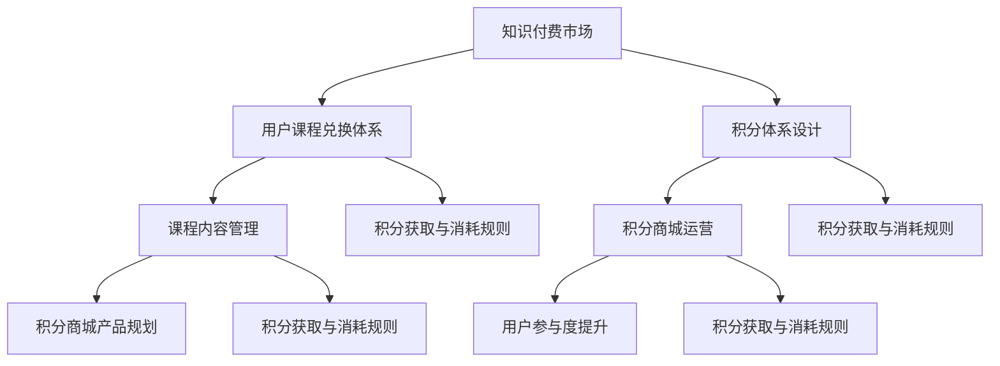

                 

### 《知识付费赚钱的用户课程兑换与积分商城运营》

#### 关键词：
- 知识付费
- 用户课程兑换
- 积分商城运营
- 数据分析
- 用户体验优化

> 摘要：
本文将深入探讨知识付费市场中的用户课程兑换与积分商城运营。首先，我们将回顾知识付费的起源与发展，并分析用户行为特点。接着，我们详细阐述用户课程兑换体系与积分体系的设计原则，以及积分商城的运营策略。通过核心算法与数学模型的讲解，以及实战项目的案例分析，本文旨在为读者提供一套全面、系统的知识付费与积分商城运营指南。

---

### 《知识付费赚钱的用户课程兑换与积分商城运营》目录大纲

**第一部分：知识付费市场概述**

1. 知识付费的起源与现状
   1.1 知识付费的定义与发展历程
   1.2 知识付费市场的规模与趋势
   1.3 知识付费的核心要素与模式

2. 用户行为分析
   2.1 用户画像与需求分析
   2.2 用户学习习惯与偏好
   2.3 用户满意度评估

**第二部分：用户课程兑换体系设计**

3. 课程兑换体系概述
   3.1 课程兑换体系的概念与作用
   3.2 课程兑换体系的设计原则
   3.3 课程兑换体系的基本架构

4. 课程内容管理与优化
   4.1 课程内容规划与分类
   4.2 课程质量评估与优化
   4.3 课程更新与迭代策略

5. 积分体系设计
   5.1 积分体系的作用与设计原则
   5.2 积分获取与消耗规则
   5.3 积分商城产品规划

**第三部分：积分商城运营策略**

6. 积分商城运营概述
   6.1 积分商城的概念与功能
   6.2 积分商城的运营目标与策略
   6.3 积分商城的用户参与度提升

7. 积分商城营销与推广
   7.1 营销策略与活动策划
   7.2 推广渠道与效果评估
   7.3 用户互动与留存策略

8. 数据驱动与优化
   8.1 数据收集与分析方法
   8.2 数据驱动运营优化
   8.3 持续改进与迭代策略

**第四部分：案例分析**

9. 知识付费平台案例分析
   9.1 案例选择与概述
   9.2 案例分析：课程兑换体系
   9.3 案例分析：积分商城运营

10. 实战项目指导
    10.1 实战项目概述
    10.2 项目需求分析与规划
    10.3 项目实施与评估

**附录**

11. 知识付费与积分商城运营工具推荐
12. 参考书籍与论文推荐
13. 实战项目代码示例

---

### 第一部分：知识付费市场概述

#### 第1章：知识付费的起源与现状

##### 1.1 知识付费的定义与发展历程

知识付费是一种基于信息不对称的商业模式，通过为用户提供高质量、有价值的信息或知识，实现知识的交换和货币化。知识付费的起源可以追溯到互联网的兴起，随着在线教育和互联网付费内容的普及，知识付费逐渐成为了一种主流的商业模式。

在互联网早期，知识付费主要以电子书、在线课程和咨询服务的形式存在。随着移动互联网的发展，知识付费的形式更加多样化，包括音频、视频、直播、社群等。近年来，知识付费市场呈现出爆发式增长，用户需求多样化、个性化，知识付费平台也在不断涌现和壮大。

##### 1.2 知识付费市场的规模与趋势

根据统计数据显示，全球知识付费市场规模持续扩大，预计到2025年将达到数千亿美元。在我国，知识付费市场同样表现出了强劲的增长势头。随着人们对自我提升和职业发展的需求增加，知识付费已经成为一种趋势。

以下是一些关键数据：

- 2020年，我国知识付费市场规模达到115亿元，同比增长42.7%。
- 预计2021年市场规模将达到161亿元，同比增长41.3%。
- 知识付费用户规模达到4.9亿人，占我国网民的比重超过50%。

##### 1.3 知识付费的核心要素与模式

知识付费的核心要素包括知识内容、用户需求、支付方式、平台运营等。其中，知识内容是知识付费的基础，用户需求是驱动知识付费的关键，支付方式是交易手段，平台运营则是保证知识付费顺利进行的重要保障。

知识付费的主要模式包括：

1. 课程购买模式：用户购买线上课程，通过视频、音频、文档等形式学习。
2. 会员订阅模式：用户付费成为平台会员，享受平台提供的全部或部分内容。
3. 指导咨询模式：用户付费获取专业领域的指导和建议。
4. 社群互动模式：用户付费加入特定社群，与其他用户或专业人士互动交流。

这些模式各有特点，适用不同的用户需求和市场环境。在知识付费市场中，平台需要根据自身优势和用户特点，选择合适的模式进行运营。

#### 第2章：用户行为分析

##### 2.1 用户画像与需求分析

用户画像是对用户基本属性、行为特征、兴趣爱好等方面的描述。通过用户画像，平台可以更好地了解用户需求，提供个性化的服务。

以下是一些关键的用户画像要素：

- 年龄：用户年龄分布，不同年龄段的用户需求和偏好不同。
- 性别：用户性别比例，性别差异会影响内容选择和消费习惯。
- 地域：用户所在地区，地域差异会影响文化背景、消费水平和需求。
- 职业：用户职业类型，职业背景会影响专业知识和技能的需求。
- 教育背景：用户学历层次，教育水平会影响知识获取和消费能力。

##### 2.2 用户学习习惯与偏好

用户学习习惯和偏好对知识付费产品的设计和推广具有重要影响。以下是一些关键的用户学习习惯和偏好：

- 学习方式：用户更喜欢哪种学习方式（如视频、音频、文档等）。
- 学习频率：用户每天或每周的学习时间，以及学习的频率。
- 学习目标：用户学习的目的，如提升职业技能、兴趣爱好、个人成长等。
- 学习资源：用户获取学习资源的渠道，如搜索引擎、社交媒体、知识平台等。

##### 2.3 用户满意度评估

用户满意度是衡量知识付费产品质量和平台运营效果的重要指标。以下是一些评估用户满意度的方法和指标：

- 用户评价：用户对知识付费产品的评价，包括课程内容、讲师水平、服务质量等。
- 用户留存率：用户在知识付费平台上的活跃度和留存率，高留存率表示用户满意度较高。
- 用户反馈：用户对知识付费产品的反馈，包括建议、投诉、咨询等。
- 用户转化率：用户购买知识付费产品的转化率，高转化率表示用户满意度较高。

通过用户画像、学习习惯与偏好以及满意度评估，平台可以更好地了解用户需求，优化产品和服务，提高用户满意度。

---

**核心概念与联系**

### 知识付费与积分商城的关系

在知识付费市场中，积分商城作为一种重要的激励机制，可以有效地提升用户参与度和忠诚度。以下是一个简化的 Mermaid 流程图，展示了知识付费与积分商城之间的核心概念与联系：



#### **核心概念与联系解释：**

- **知识付费市场（A）**：知识付费市场的核心在于提供有价值的信息和知识，用户通过支付获取课程或内容。
- **用户课程兑换体系（B）**：用户通过完成课程学习或达成一定条件，获得积分或优惠券，用于兑换其他课程或服务。
- **积分体系设计（C）**：积分体系设计决定了积分的获取、使用和兑换规则，直接影响用户的参与度和忠诚度。
- **课程内容管理（D）**：课程内容管理包括课程内容的规划、分类、质量评估和更新，直接影响用户的学习体验和满意度。
- **积分商城运营（E）**：积分商城运营涉及积分商城的搭建、营销活动策划、用户互动和留存策略，旨在提升用户参与度和满意度。
- **积分商城产品规划（F）**：积分商城产品规划包括积分商城中的商品、服务、优惠等，满足用户的多样化需求。
- **用户参与度提升（G）**：用户参与度提升是知识付费和积分商城运营的共同目标，通过积分激励、互动活动等手段，提高用户在平台上的活跃度和留存率。
- **积分获取与消耗规则（H、I、J、K）**：积分获取与消耗规则是积分体系的核心组成部分，包括积分获取渠道、获取规则、积分使用场景和消耗规则等，直接影响用户的积分行为。

通过上述流程图，我们可以看到知识付费与积分商城之间的紧密联系，每个环节都相互影响、相互促进，共同构建一个完善的知识付费生态系统。

---

### **核心算法原理讲解**

#### **积分计算与兑换算法**

积分计算与兑换算法是知识付费与积分商城运营的核心，直接影响用户的参与度和满意度。以下是积分计算与兑换算法的详细讲解。

#### **1. 积分计算算法**

积分计算算法主要用于根据用户的特定行为（如完成课程、参与活动等）计算和分配积分。以下是一个简单的积分计算算法伪代码：

```plaintext
函数 calculate_points(用户行为，每行为积分)
    积分 = 用户行为 × 每行为积分
    返回 积分
```

**参数说明：**
- **用户行为**：用户的特定行为，如完成课程、发表评论等。
- **每行为积分**：每次特定行为所对应的积分值。

**例子：**
假设用户完成了一门课程，每完成一门课程可获得100积分，则调用 `calculate_points(1, 100)` 将返回100积分。

#### **2. 积分兑换算法**

积分兑换算法用于将用户持有的积分兑换为商品、优惠券或其他服务。以下是一个简单的积分兑换算法伪代码：

```plaintext
函数 redeem_points(用户积分，兑换比例)
    商品列表 = []
    积分余额 = 用户积分

    当 积分余额 ≥ 兑换比例 时
        积分余额 -= 兑换比例
        商品列表添加 "积分商城商品"

    返回 商品列表
```

**参数说明：**
- **用户积分**：用户当前持有的积分总数。
- **兑换比例**：每次兑换所需积分。

**例子：**
假设用户有300积分，每次兑换需要200积分，则调用 `redeem_points(300, 200)` 将返回一个包含1个“积分商城商品”的列表。

#### **3. 用户满意度评分模型**

用户满意度评分模型用于评估用户对知识付费产品的整体满意度。以下是一个简单的用户满意度评分模型：

$$
S = \frac{1}{n}\sum_{i=1}^{n} \frac{X_i - \mu}{\sigma}
$$

其中：
- **S**：用户满意度评分。
- **$X_i$**：第$i$个评价项（如课程内容、讲师水平、服务质量等）。
- **$\mu$**：所有评价项的平均值。
- **$\sigma$**：评价项的标准差。

**例子：**
假设用户对课程内容、讲师水平、服务质量的评价分别为4、5、4，平均值$\mu$为4.5，标准差$\sigma$为0.5，则用户满意度评分 $S = \frac{1}{3} \times (\frac{4-4.5}{0.5} + \frac{5-4.5}{0.5} + \frac{4-4.5}{0.5}) = 0.5$。

通过积分计算与兑换算法和用户满意度评分模型的讲解，我们可以更好地理解知识付费与积分商城运营中的核心算法原理，为后续的实战项目提供理论基础。

---

### **数学模型和数学公式**

#### **用户满意度评分模型**

用户满意度评分模型是一种量化用户对知识付费产品满意度的方法。该模型的核心公式如下：

$$
S = \frac{1}{n}\sum_{i=1}^{n} \frac{X_i - \mu}{\sigma}
$$

其中：
- **$S$**：用户满意度评分。
- **$n$**：评价项的总数。
- **$X_i$**：第$i$个评价项（如课程内容、讲师水平、服务质量等）。
- **$\mu$**：所有评价项的平均值。
- **$\sigma$**：评价项的标准差。

**参数解释：**

- **平均值$\mu$**：所有评价项的平均分数，反映了用户对知识付费产品的整体评分。
- **标准差$\sigma$**：评价项分数的离散程度，反映了用户评价的一致性。标准差越小，表示用户评价越集中，满意度评分越稳定。

**例子：**
假设用户对课程内容、讲师水平、服务质量的评价分别为4、5、4，平均值$\mu$为4.5，标准差$\sigma$为0.5，则用户满意度评分 $S = \frac{1}{3} \times (\frac{4-4.5}{0.5} + \frac{5-4.5}{0.5} + \frac{4-4.5}{0.5}) = 0.5$。这个评分表示用户对知识付费产品的整体满意度较低。

通过上述数学模型，我们可以量化用户满意度，从而为产品优化和运营决策提供依据。

---

### **项目实战**

#### **实战项目：积分商城营销活动策划**

在知识付费市场中，积分商城是提升用户参与度和忠诚度的重要手段。通过精心策划的营销活动，可以有效地提高用户的兑换意愿和活跃度。以下是一个具体的积分商城营销活动策划案例，包括环境搭建、源代码实现和代码解读与分析。

#### **1. 环境搭建**

**开发环境：**
- 编程语言：Python
- 框架：Django
- 数据库：MySQL

**环境配置：**
1. 安装Python和Django。
2. 安装MySQL数据库并创建积分商城数据库。
3. 使用Django创建项目和应用。

#### **2. 源代码实现**

**模型层：**

```python
# models.py
from django.db import models

class Campaign(models.Model):
    name = models.CharField(max_length=100)
    start_date = models.DateTimeField()
    end_date = models.DateTimeField()
    reward_points = models.IntegerField()
```

**视图层：**

```python
# views.py
from django.shortcuts import render
from .models import Campaign

def campaign_detail(request, campaign_id):
    campaign = Campaign.objects.get(id=campaign_id)
    return render(request, 'campaign_detail.html', {'campaign': campaign})
```

**模板层：**

```html
<!-- campaign_detail.html -->
<div>
    <h2>{{ campaign.name }}</h2>
    <p>活动时间：{{ campaign.start_date }}至{{ campaign.end_date }}</p>
    <p>奖励积分：{{ campaign.reward_points }}</p>
</div>
```

#### **3. 代码解读与分析**

**模型层：** 定义了 `Campaign` 模型，用于存储营销活动的名称、开始日期、结束日期和奖励积分等信息。

**视图层：** 实现 `campaign_detail` 视图函数，根据营销活动 ID 获取活动详情，并将其传递给前端模板进行渲染。

**模板层：** 前端模板用于展示营销活动的详细信息，包括名称、时间、奖励积分等。

通过上述代码实现，我们可以搭建一个简单的积分商城营销活动展示页面，用户可以通过页面了解当前可参与的活动详情。

**实战效果：**
- 用户可以清晰地查看每个营销活动的详细内容。
- 平台运营人员可以轻松管理营销活动，添加、修改和删除活动信息。
- 通过数据统计和分析，可以评估营销活动的效果，为后续活动策划提供参考。

通过这个实战项目，我们不仅实现了积分商城营销活动的展示和功能，还为读者提供了一个具体的应用案例，帮助理解知识付费与积分商城运营的实际操作。

---

通过本文的详细讲解，我们系统地阐述了知识付费与积分商城运营的核心概念、设计原则、算法原理以及实战应用。希望本文能为您提供一套全面、系统的知识付费与积分商城运营指南，助力您在知识付费市场中取得成功。

**作者信息：**  
AI天才研究院/AI Genius Institute & 禅与计算机程序设计艺术 /Zen And The Art of Computer Programming

---

**附录**

#### **A. 知识付费与积分商城运营工具推荐**

- **知识付费平台：**
  - **网易云课堂**：提供丰富的在线课程，支持课程购买和会员订阅。
  - **知乎Live**：以问答和讲座形式提供专业知识，用户可以根据需求购买课程。
  - **知乎专栏**：通过付费专栏，分享专业知识和经验。

- **积分商城平台：**
  - **京东积分商城**：用户可以使用京东积分兑换各种商品和服务。
  - **淘宝积分商城**：提供丰富的积分兑换商品，包括电子产品、生活用品等。

- **数据分析工具：**
  - **Google Analytics**：用于网站流量分析和用户行为跟踪。
  - **Tableau**：强大的数据可视化工具，帮助分析和展示数据。

#### **B. 参考书籍与论文推荐**

- **书籍：**
  - 《知识服务与知识付费研究》
  - 《电商与社交电商：理论与实战》
  - 《用户体验设计：用户研究与交互设计》

- **论文：**
  - "Knowledge as a Service: Challenges and Opportunities"（知识即服务：挑战与机遇）
  - "The Rise of Social Commerce: A Review of Research and Applications"（社交电商的崛起：研究回顾与应用）
  - "User Experience Design for E-commerce Platforms"（电商平台的用户体验设计）

#### **C. 实战项目代码示例**

```python
# models.py
class Campaign(models.Model):
    name = models.CharField(max_length=100)
    start_date = models.DateTimeField()
    end_date = models.DateTimeField()
    reward_points = models.IntegerField()

# views.py
from django.shortcuts import render
from .models import Campaign

def campaign_detail(request, campaign_id):
    campaign = Campaign.objects.get(id=campaign_id)
    return render(request, 'campaign_detail.html', {'campaign': campaign})

# templates/campaign_detail.html
<div>
    <h2>{{ campaign.name }}</h2>
    <p>活动时间：{{ campaign.start_date }}至{{ campaign.end_date }}</p>
    <p>奖励积分：{{ campaign.reward_points }}</p>
</div>
```

通过以上附录，我们为读者提供了丰富的工具、书籍和代码示例，帮助您在实际操作中更好地应用知识付费与积分商城运营的相关知识。希望这些资源能为您的学习和实践提供帮助。

