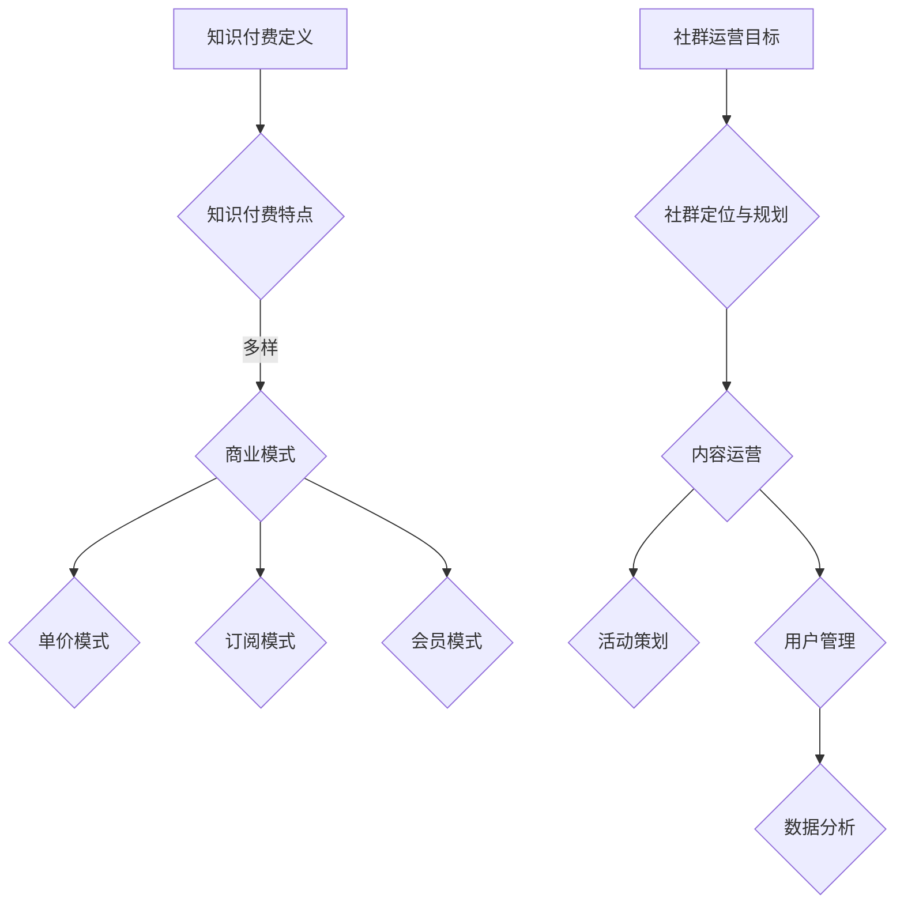
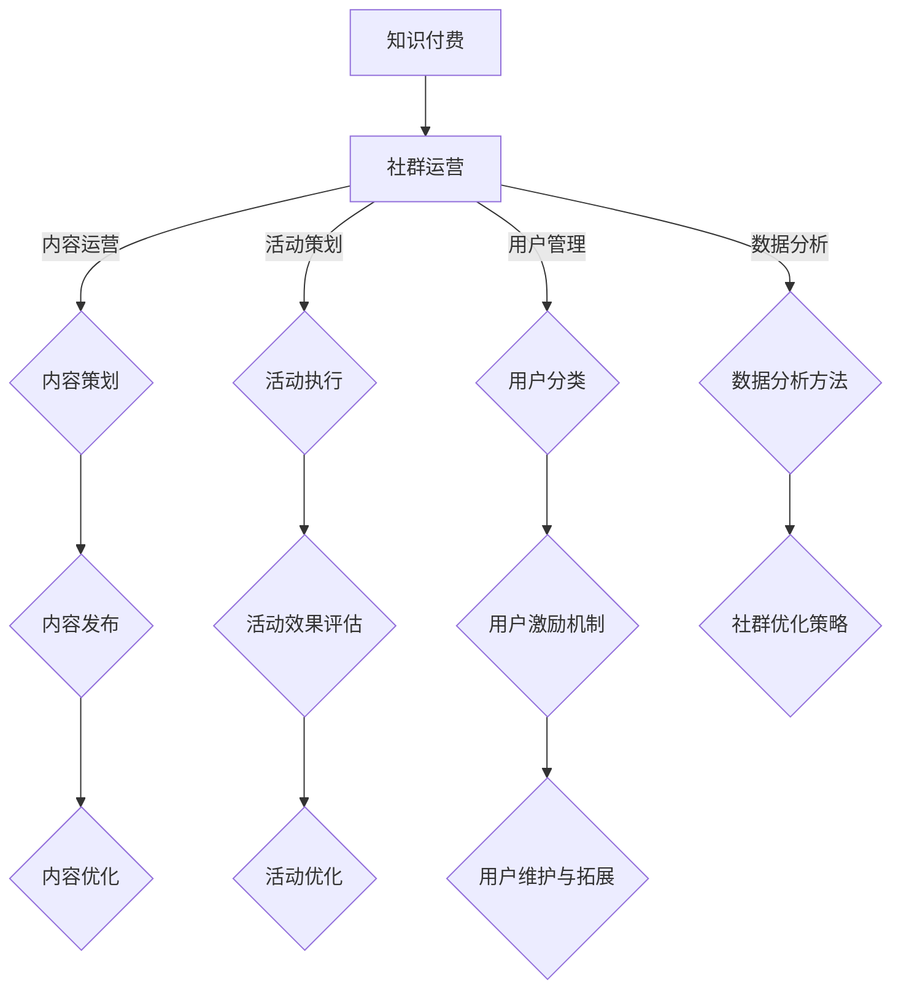

                 

## 《知识付费：程序员的社群运营方案》

### 关键词：
知识付费、社群运营、程序员、内容运营、活动策划、用户管理、数据分析

### 摘要：
本文旨在探讨知识付费在程序员社群运营中的应用，分析其背景、特点及商业模式。文章将详细阐述程序员社群运营的基础策略，包括社群定位与规划、内容运营、活动策划与执行、用户管理以及数据分析与优化。此外，通过成功案例分析、问题解决策略和工具推荐，为程序员的社群运营提供实际指导和优化方案。

## 《知识付费：程序员的社群运营方案》目录大纲

### 第一部分：知识付费概述

#### 第1章：知识付费的兴起与发展

##### 1.1.1 知识付费的背景
- 知识经济时代的到来
- 互联网的普及与信息爆炸
- 社交媒体与内容消费习惯的变化

##### 1.1.2 知识付费的定义与特点
- 知识付费的概念
- 知识付费的类型
- 知识付费的特点

##### 1.1.3 知识付费的商业模式
- 单价模式
- 订阅模式
- 会员模式

#### 第2章：程序员的社群运营基础

##### 2.1.1 社群运营的定义与目标
- 社群运营的概念
- 社群运营的目标

##### 2.1.2 程序员社群的特殊性
- 技术氛围
- 学习交流需求
- 专业性

##### 2.1.3 社群运营的挑战与机遇
- 社群运营的挑战
- 社群运营的机遇

### 第二部分：社群运营策略与实践

#### 第3章：社群定位与规划

##### 3.1.1 社群定位的重要性
- 社群定位的概念
- 社群定位的步骤

##### 3.1.2 社群规划的内容
- 目标受众分析
- 内容规划
- 社群规则制定

#### 第4章：社群内容运营

##### 4.1.1 内容类型与选择
- 技术分享
- 经验交流
- 行业动态

##### 4.1.2 内容策划与发布
- 内容策划的要点
- 内容发布的频率与形式

##### 4.1.3 内容质量监控与提升
- 质量监控的方法
- 提升内容质量的建议

#### 第5章：社群活动策划与执行

##### 5.1.1 活动类型与选择
- 线上活动
- 线下活动

##### 5.1.2 活动策划与组织
- 活动策划的流程
- 活动组织的技巧

##### 5.1.3 活动效果评估与优化
- 活动效果评估的方法
- 活动优化的方向

#### 第6章：社群用户管理

##### 6.1.1 用户分层与分类
- 高级用户
- 普通用户
- 热心用户

##### 6.1.2 用户激励机制
- 奖励机制
- 互动机制

##### 6.1.3 用户维护与拓展
- 用户关系维护
- 用户拓展策略

#### 第7章：社群数据分析与优化

##### 7.1.1 数据分析的重要性
- 数据分析的概念
- 数据分析的价值

##### 7.1.2 数据分析的方法与工具
- 数据采集
- 数据处理
- 数据可视化

##### 7.1.3 社群优化策略
- 社群定位优化
- 内容优化
- 用户管理优化

### 第三部分：社群运营案例解析

#### 第8章：社群运营成功案例分析

##### 8.1.1 案例选取标准
- 成功标准
- 案例代表性

##### 8.1.2 案例解析
- 案例一：GitHub
- 案例二：Stack Overflow
- 案例三：微信技术交流群

#### 第9章：社群运营中的问题与解决

##### 9.1.1 常见问题分析
- 成员活跃度低
- 内容质量不高
- 管理难度大

##### 9.1.2 问题解决策略
- 提高成员活跃度
- 提升内容质量
- 管理策略优化

### 附录

#### 附录 A：社群运营工具推荐

##### A.1 社群管理工具
- Slack
- Discord
- 团队协作软件

##### A.2 社群内容发布与推广工具
- 社交媒体平台
- 内容管理系统

#### 附录 B：社群运营相关资源

##### B.1 书籍推荐
- 《社交红利》
- 《社群营销》

##### B.2 网络资源
- 社群运营相关论坛
- 技术社区网站

##### B.3 在线课程
- 社群运营培训课程
- 程序员社群运营实践课程

### Mermaid 流程图示例：



### 核心算法原理讲解示例：

#### 伪代码：社群活跃度计算

```plaintext
function calculate_active_score(user):
    score = 0
    
    # 根据用户在社群中的互动次数增加分数
    score += user.interactions_count * 2
    
    # 根据用户发布的帖子数增加分数
    score += user.post_count
    
    # 根据用户点赞、评论的帖子数增加分数
    score += user.like_count + user.comment_count
    
    # 根据用户参与的活动次数增加分数
    score += user.activity_count * 3
    
    return score
```

#### 数学模型和数学公式详细讲解示例：

##### 概率论基础

##### 概率分布函数

$$ P(X \leq x) = F(x) $$

其中，$X$ 是随机变量，$F(x)$ 是概率分布函数。

##### 均值

$$ \mu = E(X) = \int_{-\infty}^{\infty} x \cdot f(x) \, dx $$

其中，$E(X)$ 表示随机变量 $X$ 的期望值，$f(x)$ 是概率密度函数。

##### 方差

$$ \sigma^2 = Var(X) = E[(X - \mu)^2] $$

其中，$Var(X)$ 表示随机变量 $X$ 的方差，$\mu$ 是均值。

##### 协方差

$$ \text{Cov}(X, Y) = E[(X - \mu_X)(Y - \mu_Y)] $$

其中，$X$ 和 $Y$ 是两个随机变量，$\mu_X$ 和 $\mu_Y$ 分别是 $X$ 和 $Y$ 的均值。

### 社群活跃度与概率分布关系

假设社群活跃度 $A$ 满足正态分布，其均值为 $\mu_A$，方差为 $\sigma_A^2$。则可以表示为：

$$ A \sim N(\mu_A, \sigma_A^2) $$

### 项目实战示例：

#### 实战：搭建一个简单的程序员社群

##### 开发环境搭建

1. 准备一台服务器
2. 安装 Linux 操作系统
3. 安装 Web 服务器（如 Apache 或 Nginx）
4. 安装数据库（如 MySQL 或 PostgreSQL）
5. 安装编程环境（如 PHP、Python 或 Node.js）

##### 源代码实现

```php
// 社群后台管理系统

// 数据库连接
$connection = mysqli_connect('localhost', 'username', 'password', 'db_name');

// 用户注册
function register_user($username, $password) {
    // 判断用户名是否已存在
    $query = "SELECT * FROM users WHERE username = '$username'";
    $result = mysqli_query($connection, $query);
    if (mysqli_num_rows($result) > 0) {
        return "用户名已存在";
    }
    
    // 插入新用户
    $query = "INSERT INTO users (username, password) VALUES ('$username', '$password')";
    mysqli_query($connection, $query);
    
    return "注册成功";
}

// 用户登录
function login_user($username, $password) {
    // 检查用户名和密码是否正确
    $query = "SELECT * FROM users WHERE username = '$username' AND password = '$password'";
    $result = mysqli_query($connection, $query);
    if (mysqli_num_rows($result) > 0) {
        return "登录成功";
    }
    
    return "登录失败";
}
```

##### 代码解读与分析：

#### 代码解读

- 数据库连接：通过 mysqli_connect() 函数连接到 MySQL 数据库。
- 用户注册：通过 register_user() 函数实现用户注册功能，包括检查用户名是否已存在并插入新用户。
- 用户登录：通过 login_user() 函数实现用户登录功能，包括检查用户名和密码是否正确。

#### 代码分析

- 代码使用了 MySQLi 库进行数据库操作。
- 代码简单易懂，功能性强。
- 代码安全性较低，应进行密码加密和输入验证等安全措施。

### 核心概念与联系：

- **知识付费**：知识付费是指用户为获取特定的知识或技能，通过支付一定的费用来获得相关服务或内容的商业模式。
- **社群运营**：社群运营是指通过运营策略和手段，提升社群活跃度、增强用户粘性和促进内容传播的过程。
- **内容运营**：内容运营是指围绕内容的生产、发布、推广和优化，实现内容价值和用户价值的最大化。
- **活动策划与执行**：活动策划与执行是指通过制定活动方案、组织活动执行和评估活动效果，提升社群参与度和用户满意度。
- **用户管理**：用户管理是指对社群用户进行分类、激励和维护，提高用户满意度和忠诚度。
- **数据分析与优化**：数据分析与优化是指通过对社群数据进行分析，发现问题和机会，并进行相应的优化和改进。

### Mermaid 流程图示例：



### 完整性要求：

- **核心概念与联系**：通过 Mermaid 流程图清晰地展示了知识付费、社群运营、内容运营、活动策划与执行、用户管理和数据分析与优化之间的核心概念和联系。

- **核心算法原理讲解**：使用伪代码详细讲解了社群活跃度计算的核心算法原理，包括用户互动次数、帖子数、点赞和评论数等因素对活跃度的影响。

- **数学模型和公式 & 详细讲解 & 举例说明**：详细讲解了概率论基础，包括概率分布函数、均值、方差和协方差的数学模型和公式，并通过举例说明如何计算。

- **项目实战**：提供了搭建一个简单的程序员社群的实战案例，包括开发环境搭建、源代码实现、代码解读与分析，展示了如何将理论知识应用到实际项目中。

### 格式要求：

- **markdown格式**：文章内容使用 markdown 格式进行输出，包括标题、段落、列表、代码块等格式。

### 作者信息：

- **作者**：AI天才研究院/AI Genius Institute & 禅与计算机程序设计艺术 /Zen And The Art of Computer Programming

## 第一部分：知识付费概述

### 第1章：知识付费的兴起与发展

#### 1.1.1 知识付费的背景

知识付费，顾名思义，是指用户为了获取特定知识或技能而付费的行为。这一现象的兴起可以追溯到几个关键因素：

**知识经济时代的到来**：随着信息技术的飞速发展，知识成为推动经济增长的重要动力。知识经济的崛起使得人们对高质量、专业化的知识需求日益增长。

**互联网的普及与信息爆炸**：互联网的普及使得信息传播速度大幅提升，人们可以更加便捷地获取大量信息。然而，信息爆炸也带来了信息过载的问题，人们开始寻求更加专业、精准的知识。

**社交媒体与内容消费习惯的变化**：社交媒体的兴起改变了人们的消费习惯。用户不仅愿意为内容付费，还更愿意参与到内容的生产和传播中，形成了一个互动性更强的知识付费生态系统。

#### 1.1.2 知识付费的定义与特点

**知识付费的概念**：

知识付费，狭义上指的是用户为获取特定知识或技能而支付的费用；广义上，则包括为知识服务、知识共享等所支付的费用。

**知识付费的类型**：

1. **在线教育**：通过互联网平台，用户可以付费购买在线课程、电子书、学习工具等。
2. **付费咨询**：用户为获取专业人士的咨询服务而支付费用。
3. **知识付费平台**：如知乎、得到等，提供付费专栏、专家讲座等内容。
4. **专业认证**：用户通过付费参加专业认证考试，以获得行业认可的证书。

**知识付费的特点**：

1. **专业化**：知识付费内容通常由专业人士或权威机构提供，具有较高的专业性和可信度。
2. **个性化**：知识付费能够根据用户的需求提供定制化的服务，满足不同用户群体的个性化需求。
3. **互动性**：知识付费平台通常具备互动性，用户可以与知识提供者进行实时交流，提升学习体验。

#### 1.1.3 知识付费的商业模式

**单价模式**：

单价模式是指用户为单个知识产品或服务支付固定价格。这种模式适用于知识含量较低、普及性较强的内容，如电子书、单篇教程等。

**订阅模式**：

订阅模式是指用户按月或按年支付订阅费用，获得平台上的全部或部分内容。这种模式适用于知识更新频繁、需要长期学习的领域，如在线课程、专家专栏等。

**会员模式**：

会员模式是指用户成为平台会员，享受一系列专属服务，如优先发布、专属活动等。这种模式强调用户粘性和平台忠诚度，适用于社区型知识付费平台。

### 第2章：程序员的社群运营基础

#### 2.1.1 社群运营的定义与目标

**社群运营的定义**：

社群运营是指通过一系列策略和手段，围绕特定主题或目标，搭建一个用户参与度高、互动性强的在线社区。社群运营的核心在于搭建一个用户积极参与的生态系统，实现用户价值最大化。

**社群运营的目标**：

1. **用户增长**：通过有效的运营策略，吸引更多潜在用户加入社群。
2. **用户活跃度**：提升社群成员的参与度，增加帖子的发布量、互动次数等。
3. **用户粘性**：增强用户对社群的归属感和依赖度，降低用户流失率。
4. **内容质量**：提供高质量、有价值的内容，满足用户需求，提升社群影响力。
5. **品牌形象**：通过社群运营，提升品牌在用户心中的认知度和美誉度。

#### 2.1.2 程序员社群的特殊性

**技术氛围**：

程序员社群通常具有浓厚的技术氛围，成员之间热衷于探讨技术问题、分享编程经验。这种氛围有助于提高社群的活跃度和用户粘性。

**学习交流需求**：

程序员社群的成员往往有强烈的学习交流需求。他们希望通过社群获取新技术、解决编程难题、提升自身技能。社群运营者需要提供丰富的学习资源和交流机会，满足成员的需求。

**专业性**：

程序员社群的专业性较强，成员往往具备一定的编程技能和经验。这使得社群内容更加深入、专业，也增加了社群的权威性和影响力。

#### 2.1.3 社群运营的挑战与机遇

**社群运营的挑战**：

1. **用户需求多样**：程序员社群的成员需求多样，运营者需要提供丰富多样的内容和活动，满足不同成员的需求。
2. **技术门槛高**：程序员社群的技术门槛较高，运营者需要具备一定的技术背景和知识，以提供高质量的内容和解决方案。
3. **维护成本高**：社群运营需要投入大量的人力、物力和时间，维护社群的运营成本较高。
4. **用户流失风险**：程序员社群的用户流失风险较高，运营者需要持续提供有价值的内容和活动，以保持用户的活跃度和忠诚度。

**社群运营的机遇**：

1. **技术快速发展**：技术的快速发展为程序员社群提供了丰富的内容和话题，运营者可以紧跟技术趋势，提供最新的技术资讯和解决方案。
2. **在线教育需求增长**：随着在线教育的普及，程序员社群可以通过提供在线课程、付费讲座等方式，实现知识变现。
3. **社群商业潜力大**：程序员社群具有较大的商业潜力，可以通过广告、会员订阅、付费咨询服务等方式，实现盈利。
4. **用户互动性高**：程序员社群的成员互动性高，运营者可以通过举办线上活动、线下聚会等方式，增强社群凝聚力，提升用户参与度。

## 第二部分：社群运营策略与实践

### 第3章：社群定位与规划

#### 3.1.1 社群定位的重要性

社群定位是社群运营的第一步，也是至关重要的一步。一个清晰的社群定位能够帮助运营者明确社群的核心价值和目标，从而制定出有效的运营策略。

**社群定位的概念**：

社群定位是指对社群的定位和定位的过程。它包括社群的目标、主题、受众、内容、风格等。

**社群定位的步骤**：

1. **明确社群目标**：社群目标应明确、具体，如用户增长、内容质量提升、用户活跃度提高等。

2. **确定社群主题**：社群主题应与社群目标紧密相关，如技术分享、行业动态、编程技巧等。

3. **分析目标受众**：分析目标受众的需求、兴趣和行为，以确定社群的内容、形式和运营策略。

4. **设计社群内容**：根据目标受众的需求，设计社群的内容，包括文章、视频、直播等。

5. **塑造社群风格**：社群风格应与社群定位和目标受众相符，如专业、幽默、简洁等。

#### 3.1.2 社群规划的内容

**目标受众分析**：

目标受众分析是社群规划的重要一环。运营者需要了解目标受众的需求、兴趣、行为和偏好，以便提供符合他们需求的内容和活动。

1. **需求分析**：了解目标受众在技术、学习、职业发展等方面的需求。

2. **兴趣分析**：了解目标受众的兴趣爱好，如编程语言、技术领域、热门话题等。

3. **行为分析**：了解目标受众在社群中的行为，如发帖、回复、活动参与等。

4. **偏好分析**：了解目标受众的偏好，如阅读习惯、学习方式、娱乐方式等。

**内容规划**：

内容规划是社群运营的核心。运营者需要根据目标受众的需求和偏好，设计丰富多样、有价值的内容。

1. **内容类型**：包括技术文章、视频、直播、案例研究、行业动态等。

2. **内容来源**：可以从内部团队、外部专家、用户贡献等多方面获取内容。

3. **内容发布**：制定内容发布计划，包括发布频率、发布形式等。

4. **内容审核**：对发布的内容进行审核，确保内容的质量和准确性。

**社群规则制定**：

社群规则是维护社群秩序和氛围的重要手段。运营者需要制定明确的社群规则，包括发帖规范、互动准则、违规处理等。

1. **发帖规范**：明确发帖的要求，如标题规范、内容要求、格式规范等。

2. **互动准则**：明确互动的规则，如回复规范、点赞准则、评论管理等。

3. **违规处理**：明确违规行为的处理方法，如警告、封禁等。

### 第4章：社群内容运营

#### 4.1.1 内容类型与选择

**技术分享**：

技术分享是程序员社群的核心内容之一。运营者可以邀请业内专家或内部技术人员分享最新的技术趋势、编程技巧、项目经验等。

**经验交流**：

经验交流是程序员社群的重要功能。成员可以通过分享自己的工作经验、解决问题的方式、职业规划等，相互学习、共同进步。

**行业动态**：

行业动态包括最新的技术新闻、行业政策、热门话题等。运营者可以通过定期发布行业动态，帮助成员了解行业动态，把握发展趋势。

#### 4.1.2 内容策划与发布

**内容策划的要点**：

1. **主题明确**：内容策划应围绕社群主题展开，确保内容与社群定位相符。

2. **受众需求**：内容策划应充分考虑目标受众的需求和兴趣，提供有价值的内容。

3. **形式多样**：内容形式可以包括文章、视频、直播、案例研究等，以满足不同成员的喜好。

4. **周期性**：制定内容发布周期，确保内容的持续性和稳定性。

**内容发布的频率与形式**：

1. **发布频率**：根据社群定位和目标受众的需求，制定合适的发布频率。

2. **发布形式**：可以通过平台发布、邮件推送、社交媒体分享等方式，扩大内容的影响力。

#### 4.1.3 内容质量监控与提升

**质量监控的方法**：

1. **内容审核**：对发布的内容进行审核，确保内容的质量和准确性。

2. **用户反馈**：收集用户对内容的反馈，了解内容的受欢迎程度和改进方向。

3. **数据分析**：通过数据分析，监控内容的发布效果和用户互动情况。

**提升内容质量的建议**：

1. **内容审核**：建立内容审核机制，确保内容的质量和准确性。

2. **用户参与**：鼓励用户参与内容创作，提高内容的多样性和实用性。

3. **培训与分享**：定期对内容创作者进行培训，提升他们的写作能力和专业知识。

4. **持续优化**：根据用户反馈和数据分析，持续优化内容策略和发布形式。

### 第5章：社群活动策划与执行

#### 5.1.1 活动类型与选择

**线上活动**：

线上活动是程序员社群的重要活动形式。包括线上讲座、技术沙龙、代码挑战、知识竞赛等。线上活动可以充分利用互联网的优势，提高成员的参与度和互动性。

**线下活动**：

线下活动是程序员社群的重要社交方式。包括技术沙龙、聚会、讲座、比赛等。线下活动可以增强成员之间的联系，提高社群的凝聚力。

#### 5.1.2 活动策划与组织

**活动策划的流程**：

1. **确定活动目标**：明确活动的目的和预期效果。

2. **选择活动形式**：根据活动目标，选择合适的活动形式。

3. **制定活动方案**：包括活动内容、时间、地点、参与人员等。

4. **预算与资源分配**：制定活动预算，分配资源。

5. **宣传推广**：通过社群、社交媒体等渠道进行宣传。

**活动组织的技巧**：

1. **充分准备**：提前准备好活动所需的一切资源，如场地、设备、资料等。

2. **人员分工**：明确活动组织者的职责，确保活动顺利进行。

3. **现场管理**：确保活动现场的秩序和安全，及时解决突发事件。

4. **互动引导**：鼓励成员积极参与活动，提高活动的互动性。

#### 5.1.3 活动效果评估与优化

**活动效果评估的方法**：

1. **现场反馈**：收集活动现场的反馈，了解成员的满意度。

2. **问卷调查**：通过问卷调查，了解成员对活动的评价和建议。

3. **数据统计**：统计活动的参与人数、互动次数、内容质量等数据。

**活动优化的方向**：

1. **内容优化**：根据成员的需求和反馈，调整活动内容。

2. **形式优化**：根据活动的效果和反馈，改进活动形式。

3. **组织优化**：提升活动组织者的能力和经验，提高活动组织的效率。

### 第6章：社群用户管理

#### 6.1.1 用户分层与分类

**高级用户**：

高级用户是社群的中坚力量，他们通常具备较高的技术水平和活跃度。高级用户可以参与社群的管理和内容创作，提升社群的整体质量。

**普通用户**：

普通用户是社群的广泛群体，他们通常积极参与社群的互动，分享经验和知识，为社群的发展贡献力量。

**热心用户**：

热心用户是社群的积极分子，他们不仅积极参与社群的活动，还主动帮助其他成员解决问题，提升社群的凝聚力。

#### 6.1.2 用户激励机制

**奖励机制**：

奖励机制是激发用户积极性的一种有效手段。可以通过积分、勋章、奖品等形式，对活跃用户进行奖励，提高他们的参与度和忠诚度。

**互动机制**：

互动机制是提升社群活跃度的重要手段。可以通过点赞、评论、私信等功能，增强用户之间的互动，提高社群的凝聚力。

#### 6.1.3 用户维护与拓展

**用户关系维护**：

用户关系维护是社群运营的重要一环。可以通过定期的沟通、活动组织、内容推送等方式，维护与用户的关系，提高用户的满意度和忠诚度。

**用户拓展策略**：

用户拓展策略是扩大社群规模的重要手段。可以通过口碑传播、合作伙伴、推广活动等方式，吸引更多的新用户加入社群。

### 第7章：社群数据分析与优化

#### 7.1.1 数据分析的重要性

**数据分析的概念**：

数据分析是指通过收集、处理和分析数据，提取有价值的信息和洞察的过程。在社群运营中，数据分析可以帮助运营者了解用户行为、内容效果、活动效果等，从而做出更加科学的运营决策。

**数据分析的价值**：

1. **优化运营策略**：通过数据分析，了解用户的喜好和行为，优化社群的内容、活动和运营策略。

2. **提升用户体验**：通过数据分析，了解用户的需求和痛点，提供更加个性化的服务和内容，提升用户体验。

3. **发现潜在问题**：通过数据分析，及时发现社群运营中的潜在问题，如用户流失、内容质量下降等，并采取相应的措施进行优化。

#### 7.1.2 数据分析的方法与工具

**数据采集**：

数据采集是数据分析的基础。可以通过以下方式获取数据：

1. **社群平台数据**：如帖子、回复、点赞、分享等。

2. **用户行为数据**：如访问时长、访问页面、搜索关键词等。

3. **活动数据**：如活动参与人数、互动次数、满意度等。

**数据处理**：

数据处理是数据分析的核心环节。可以通过以下方法对数据进行处理：

1. **数据清洗**：去除重复数据、错误数据和无关数据。

2. **数据转换**：将数据转换为适合分析的形式，如表格、图表等。

3. **数据整合**：将不同来源的数据进行整合，形成一个完整的数据集。

**数据可视化**：

数据可视化是将数据分析结果以图形化的方式展示出来，使数据更加直观、易懂。常用的数据可视化工具包括：

1. **Excel**：适用于简单的数据可视化。

2. **Tableau**：适用于复杂的数据可视化。

3. **Power BI**：适用于企业级的数据可视化。

#### 7.1.3 社群优化策略

**社群定位优化**：

通过数据分析，了解社群的目标受众、内容效果、用户反馈等，对社群定位进行优化，确保社群内容与目标受众的需求相符。

**内容优化**：

通过数据分析，了解用户对内容的喜好、内容效果等，对内容进行优化，提高内容的质量和吸引力。

**用户管理优化**：

通过数据分析，了解用户的活跃度、用户行为等，对用户管理策略进行优化，提高用户的满意度和忠诚度。

## 第三部分：社群运营案例解析

### 第8章：社群运营成功案例分析

#### 8.1.1 案例选取标准

在选取社群运营成功案例时，我们主要考虑以下标准：

1. **社群定位明确**：社群目标清晰，具有明确的主题和受众群体。

2. **运营策略有效**：社群运营策略科学，能够有效提升用户活跃度和粘性。

3. **内容质量高**：社群内容丰富多样，具有较高的专业性和价值。

4. **用户参与度高**：社群成员积极参与互动，用户活跃度高。

5. **商业价值显著**：社群具备一定的商业价值，通过广告、会员订阅、咨询服务等方式实现盈利。

#### 8.1.2 案例解析

**案例一：GitHub**

**社群定位**：

GitHub 是一个面向程序员的开源代码托管平台，其社群定位为技术分享、交流和学习。

**运营策略**：

1. **内容策划**：GitHub 通过提供丰富的编程教程、技术博客、项目案例等内容，满足程序员的学习需求。

2. **用户激励机制**：GitHub 通过积分、徽章等激励机制，鼓励用户参与贡献和互动。

3. **活动策划**：GitHub 定期举办编程挑战、技术沙龙等活动，提升社群的活跃度。

**内容质量**：

GitHub 的内容来源多样，包括平台内部的专业教程、外部专家的博客文章、用户的开源项目等。内容质量高，专业性强。

**用户参与度**：

GitHub 的用户参与度极高，用户不仅积极贡献代码，还积极参与评论、点赞和分享等互动行为。

**商业价值**：

GitHub 通过广告、会员订阅、GitHub Sponsor 等方式实现盈利，具备显著的商业价值。

**案例二：Stack Overflow**

**社群定位**：

Stack Overflow 是一个面向程序员的问答社区，其社群定位为技术问题解答和知识分享。

**运营策略**：

1. **内容策划**：Stack Overflow 通过提供高质量的问题解答、技术文章等内容，满足程序员的学习需求。

2. **用户激励机制**：Stack Overflow 通过积分、徽章等激励机制，鼓励用户参与贡献和互动。

3. **活动策划**：Stack Overflow 定期举办编程挑战、技术沙龙等活动，提升社群的活跃度。

**内容质量**：

Stack Overflow 的内容主要来自于用户的提问和回答，内容质量高，实用性强。

**用户参与度**：

Stack Overflow 的用户参与度极高，用户不仅积极提问和回答，还积极参与评论、点赞和分享等互动行为。

**商业价值**：

Stack Overflow 通过广告、会员订阅等方式实现盈利，具备显著的商业价值。

**案例三：微信技术交流群**

**社群定位**：

微信技术交流群是一个面向程序员的微信群，其社群定位为技术交流、学习和资源分享。

**运营策略**：

1. **内容策划**：微信技术交流群通过提供技术教程、行业动态、项目分享等内容，满足程序员的学习需求。

2. **用户激励机制**：微信技术交流群通过点赞、红包等激励机制，鼓励用户参与贡献和互动。

3. **活动策划**：微信技术交流群定期举办线上讲座、技术沙龙等活动，提升社群的活跃度。

**内容质量**：

微信技术交流群的内容主要来自于群成员的分享和讨论，内容质量高，实用性较强。

**用户参与度**：

微信技术交流群的用户参与度极高，用户不仅积极分享技术知识，还积极参与讨论和互动。

**商业价值**：

微信技术交流群通过广告、知识付费等方式实现盈利，具备一定的商业价值。

### 第9章：社群运营中的问题与解决

#### 9.1.1 常见问题分析

**成员活跃度低**：

成员活跃度低是社群运营中常见的问题。导致成员活跃度低的原因可能包括：

1. **内容质量不高**：内容质量不高，无法引起用户的兴趣和参与。

2. **互动不足**：社群互动不足，用户缺乏参与感和归属感。

3. **激励机制不足**：缺乏有效的激励机制，用户缺乏参与的积极性。

**内容质量不高**：

内容质量不高是影响社群运营效果的重要因素。内容质量不高可能导致用户流失，降低社群的吸引力。

**管理难度大**：

随着社群规模的扩大，管理难度也会增加。管理难度大可能导致社群秩序混乱，影响用户体验。

#### 9.1.2 问题解决策略

**提高成员活跃度**：

1. **内容优化**：提高内容质量，提供有价值、有趣、实用的内容。

2. **互动激励**：增加社群互动，鼓励用户参与讨论、分享经验。

3. **活动策划**：定期举办有趣、有吸引力的活动，提高用户的参与度。

**提升内容质量**：

1. **内容审核**：建立内容审核机制，确保内容的质量和准确性。

2. **用户参与**：鼓励用户参与内容创作，提高内容的多样性和实用性。

3. **培训与分享**：定期对内容创作者进行培训，提升他们的写作能力和专业知识。

**管理策略优化**：

1. **分工明确**：明确社群管理者的职责，确保管理效率。

2. **规则制定**：制定明确的社群规则，维护社群秩序。

3. **反馈机制**：建立用户反馈机制，及时了解用户需求和意见。

### 附录 A：社群运营工具推荐

#### A.1 社群管理工具

**Slack**：

Slack 是一款功能强大的团队协作工具，适用于社群管理。它支持文字、语音、视频等多种沟通方式，可以帮助社群管理者高效地与成员沟通和管理社群。

**Discord**：

Discord 是一款面向游戏玩家的社群管理工具，但也适用于其他类型的社群。它支持语音、文字、视频等多种沟通方式，提供丰富的插件和自定义功能，可以提高社群的互动性和参与度。

**团队协作软件**：

除了 Slack 和 Discord，还有许多其他团队协作软件，如 Microsoft Teams、Google Workspace 等。这些软件也适用于社群管理，可以根据社群的具体需求进行选择。

#### A.2 社群内容发布与推广工具

**社交媒体平台**：

社交媒体平台如微博、微信、知乎等，是社群内容发布和推广的重要渠道。通过在社交媒体平台上发布内容，可以扩大社群的影响力，吸引更多用户关注和参与。

**内容管理系统**：

内容管理系统如 WordPress、Typecho 等，可以帮助社群管理者高效地管理和发布内容。这些系统支持丰富的插件和扩展功能，可以提高内容管理和发布效率。

### 附录 B：社群运营相关资源

#### B.1 书籍推荐

**《社交红利》**：

《社交红利》是一本关于社交网络营销的经典书籍，介绍了社交网络营销的理论和实践方法。对于想要深入了解社群运营的读者来说，这本书是一本非常有价值的参考书。

**《社群营销》**：

《社群营销》是一本关于社群营销策略和案例的书籍，详细介绍了社群营销的各个方面。这本书可以帮助社群运营者了解社群营销的原理和方法，提升社群运营的效果。

#### B.2 网络资源

**社群运营相关论坛**：

许多技术论坛和社群运营论坛都提供了丰富的社群运营资源和经验分享。通过参与这些论坛，可以了解社群运营的最新动态和实践经验。

**技术社区网站**：

如 GitHub、Stack Overflow、CSDN 等，这些技术社区网站提供了丰富的技术资源和交流平台，可以帮助社群运营者获取最新的技术动态和解决技术问题。

#### B.3 在线课程

**社群运营培训课程**：

许多在线教育平台提供了社群运营培训课程，包括社群定位、内容运营、活动策划、用户管理等方面的知识。通过参加这些课程，可以提升社群运营的能力和水平。

**程序员社群运营实践课程**：

针对程序员社群的运营课程，主要介绍如何通过社群运营提升程序员的技术水平和职业发展。这些课程可以帮助程序员社群运营者更好地服务于程序员用户。

