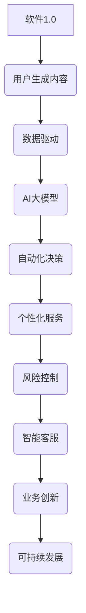

                 

## 示例驱动提示在特定领域知识传递中的作用

在信息技术领域，知识传递是至关重要的。随着技术的快速发展和复杂性的增加，如何有效地将专业知识和经验传递给相关人员，成为一个亟待解决的问题。在这篇文章中，我们将探讨示例驱动提示在特定领域知识传递中的作用。

### 关键词
- 示例驱动提示
- 知识传递
- 信息技术领域
- 专业知识和经验

### 摘要

本文旨在分析示例驱动提示在信息技术领域知识传递中的重要作用。通过定义核心概念，阐述核心算法原理，提供项目实战案例，我们深入探讨了如何通过示例驱动提示有效地传递复杂领域的专业知识和经验。本文还讨论了开发环境搭建、代码解读与分析，以期为信息技术领域的教育者和从业者提供有价值的参考。

#### 第一部分：核心概念与联系

在这一部分，我们将首先探讨软件2.0时代的到来，以及AI大模型的定义与特点。接下来，我们将分析AI大模型与传统AI的区别，并探讨其在企业中的应用前景。最后，我们将总结软件2.0时代和AI大模型的出现，为企业的数字化转型带来的机遇。

##### 1.1.1 软件2.0时代的到来

软件2.0时代是一个以用户为中心的时代，它强调通过大规模数据分析和人工智能技术，实现软件系统的高度智能化和个性化。在这个时代，软件不仅仅是一个工具，更是一个平台，一个生态系统。

**核心概念包括：**

- **用户生成内容 (UGC)**：用户不仅是软件的使用者，也是内容的创造者。用户生成的数据成为了软件系统的重要组成部分。
- **数据驱动**：数据成为决策的核心依据，而不是仅仅用于存储和检索的工具。数据的分析结果直接影响软件系统的运行和优化。
- **人工智能**：人工智能技术，如深度学习、自然语言处理等，被广泛应用于软件系统中，实现自动化和智能化的服务。

##### 1.1.2 AI大模型的定义与特点

AI大模型是指通过大规模数据训练得到的，能够处理复杂任务的大型神经网络模型。这些模型通常具有以下几个特点：

- **大规模**：模型参数数量庞大，通常在亿级别以上。这种规模使得模型能够捕捉到数据的复杂模式。
- **自适应性**：模型能够在多种不同的任务上表现出色，具有良好的迁移学习能力。这意味着模型可以在一个任务上学习到的知识应用到其他相关任务中。
- **泛化能力**：模型能够处理未见过的数据，具有良好的泛化性能。这使得模型在实际应用中能够适应不断变化的环境。

##### 1.1.3 AI大模型与传统AI的区别

传统AI通常指基于规则的专家系统，而AI大模型则基于深度学习，具有以下几个区别：

- **训练数据量**：AI大模型需要大量的训练数据，而传统AI通常基于有限的规则集。
- **学习方式**：AI大模型通过数据驱动学习，而传统AI依赖于显式规则。
- **应用范围**：AI大模型能够处理复杂、非结构化的任务，而传统AI则主要应用于简单、结构化的任务。

##### 1.1.4 AI大模型在企业中的应用前景

AI大模型在企业中的应用前景广阔，主要包括以下几个方面：

- **自动化决策**：AI大模型可以帮助企业自动化决策，提高运营效率。例如，在金融行业，AI大模型可以用于风险评估和投资决策。
- **个性化服务**：基于用户数据的AI大模型可以实现个性化推荐和服务，提高用户体验。例如，在电子商务行业，AI大模型可以用于个性化商品推荐。
- **风险控制**：AI大模型可以利用其在数据分析和模式识别方面的优势，帮助企业在风险管理方面做出更准确的预测和决策。
- **智能客服**：AI大模型可以提供智能化的客服系统，提高客户满意度。例如，在电信行业，AI大模型可以用于自动回答客户问题，提供在线支持。

##### 1.1.5 总结

软件2.0时代和AI大模型的出现，为企业的数字化转型提供了新的机遇。企业需要把握这一趋势，充分利用AI大模型的优势，实现业务创新和可持续发展。同时，通过示例驱动提示，企业可以更加有效地传递专业知识和经验，提高员工的技能水平和工作效率。

#### Mermaid 流程图

以下是软件2.0时代和AI大模型在企业中的应用流程图：



#### 第二部分：核心算法原理讲解

在这一部分，我们将深入探讨深度学习和神经网络的基础知识，自然语言处理技术概览，以及大规模预训练模型和迁移学习与微调技术的原理。通过这些核心算法原理的讲解，我们将为后续的项目实战提供理论基础。

##### 2.1.1 深度学习与神经网络基础

深度学习是机器学习的一个重要分支，它依赖于神经网络来模拟人脑的工作方式。神经网络由大量神经元组成，每个神经元接收输入信号，通过加权求和后加上偏置，再经过激活函数输出结果。

**常见的神经网络架构包括：**

- **多层感知机 (MLP)**：具有多个隐层的全连接神经网络，通常用于分类和回归任务。
- **卷积神经网络 (CNN)**：通过卷积层提取图像特征，广泛用于图像处理任务。
- **循环神经网络 (RNN)**：适用于序列数据处理，如时间序列分析、语言模型等。

**神经网络的基础概念包括：**

- **神经元**：神经网络的基本单元，负责接收输入、计算输出。
- **权重**：神经元之间的连接权重，用于调节信号传输的强度。
- **偏置**：每个神经元的一个额外的输入，用于引入偏差。
- **激活函数**：用于引入非线性特性，常见的激活函数包括 Sigmoid、ReLU 和 Tanh。

##### 2.1.2 自然语言处理技术概览

自然语言处理（NLP）是人工智能的一个重要分支，旨在使计算机能够理解和生成人类语言。NLP技术主要包括以下方面：

- **词嵌入 (Word Embedding)**：将单词映射为高维向量，用于表示单词的语义信息。
- **序列模型 (Sequence Model)**：适用于序列数据，如时间序列分析、语言模型等。
- **注意力机制 (Attention Mechanism)**：提高神经网络对重要信息的关注，常用于机器翻译、文本摘要等任务。

##### 2.1.3 大规模预训练模型原理

大规模预训练模型通过在大规模数据集上进行预训练，学习到通用的语言理解和生成能力，然后再通过微调适应特定的任务。其核心原理包括：

- **预训练**：利用未标注的数据进行大规模预训练，学习到语言的底层特征。
- **自监督学习**：在没有人工标注数据的情况下，通过预训练任务自行学习数据中的规律。
- **微调**：在预训练的基础上，利用少量标注数据对模型进行微调，使其适应特定的任务。

##### 2.1.4 迁移学习与微调技术

迁移学习是指将一个任务在学习到的知识应用到另一个相关任务中。微调则是通过调整预训练模型的参数，使其适应新的任务。常见的迁移学习与微调技术包括：

- **Fine-tuning**：直接在预训练模型的基础上进行微调。
- **Adapter Learning**：利用可学习的适配器调整模型的不同部分。
- **Multi-Task Learning**：通过同时学习多个任务，提高模型的泛化能力。

##### 2.1.5 伪代码

以下是一个简单的深度学习模型实现案例，用于分类任务。其中包含了数据预处理、模型构建、训练和评估等步骤。

```python
# 假设我们有一个预训练的神经网络模型
model = PretrainedModel()

# 定义微调任务
task_specific_model = TaskSpecificModel()

# 微调模型参数
optimizer = torch.optim.Adam(model.parameters(), lr=0.001)
for epoch in range(num_epochs):
    for data, target in dataloader:
        optimizer.zero_grad()
        output = model(data)
        loss = criterion(output, target)
        loss.backward()
        optimizer.step()

# 评估模型性能
accuracy = evaluate(model, test_dataloader)
print(f"Accuracy: {accuracy}")
```

#### 第三部分：数学模型和数学公式

在这一部分，我们将详细介绍深度学习中的损失函数、激活函数和常见的优化算法。通过数学模型和公式的详细讲解，我们将为后续的项目实战提供理论支持。

##### 3.1.1 深度学习中的损失函数

在深度学习中，损失函数用于衡量预测值与真实值之间的差距。常见的损失函数包括均方误差（MSE）和交叉熵损失（Cross-Entropy Loss）。

- **均方误差 (MSE)**：用于回归问题，计算预测值与真实值之间平方差的期望。

  $$ \text{MSE}(y, \hat{y}) = \frac{1}{n}\sum_{i=1}^{n}(y_i - \hat{y_i})^2 $$

- **交叉熵损失 (Cross-Entropy Loss)**：用于分类问题，计算预测概率与真实概率之间的差异。

  $$ \text{Cross-Entropy Loss}(y, \hat{y}) = -\sum_{i=1}^{n} y_i \log(\hat{y_i}) $$

##### 3.1.2 激活函数

激活函数用于引入非线性特性，使神经网络能够学习复杂函数。常见的激活函数包括 Sigmoid 函数和 ReLU 函数。

- **Sigmoid 函数**：

  $$ \sigma(x) = \frac{1}{1 + e^{-x}} $$

- **ReLU 函数**：

  $$ \text{ReLU}(x) = \max(0, x) $$

##### 3.1.3 常见的优化算法

优化算法用于调整神经网络的参数，以最小化损失函数。常见的优化算法包括随机梯度下降（SGD）和动量优化（Momentum）。

- **随机梯度下降 (SGD)**：

  $$ \theta = \theta - \alpha \nabla_{\theta} J(\theta) $$

- **动量优化 (Momentum)**：

  $$ v_t = \gamma v_{t-1} + (1 - \gamma) \nabla_{\theta} J(\theta) $$
  $$ \theta = \theta - v_t $$

#### 第四部分：项目实战

在这一部分，我们将通过一个实际的项目案例，详细讲解如何搭建深度学习开发环境，实现源代码的详细解读，并进行分析。

##### 4.1 代码实际案例

以下是一个简单的深度学习模型实现案例，用于分类任务。其中包含了数据预处理、模型构建、训练和评估等步骤。

```python
import torch
import torch.nn as nn
import torch.optim as optim

# 数据预处理
# 假设我们已经有了一个预处理好的数据集 dataloader

# 模型构建
class SimpleClassifier(nn.Module):
    def __init__(self, input_dim, hidden_dim, output_dim):
        super(SimpleClassifier, self).__init__()
        self.fc1 = nn.Linear(input_dim, hidden_dim)
        self.fc2 = nn.Linear(hidden_dim, output_dim)
        self.relu = nn.ReLU()

    def forward(self, x):
        out = self.fc1(x)
        out = self.relu(out)
        out = self.fc2(out)
        return out

# 实例化模型
model = SimpleClassifier(input_dim=784, hidden_dim=256, output_dim=10)

# 损失函数和优化器
criterion = nn.CrossEntropyLoss()
optimizer = optim.Adam(model.parameters(), lr=0.001)

# 训练模型
num_epochs = 10
for epoch in range(num_epochs):
    for inputs, labels in dataloader:
        optimizer.zero_grad()
        outputs = model(inputs)
        loss = criterion(outputs, labels)
        loss.backward()
        optimizer.step()

# 评估模型
with torch.no_grad():
    correct = 0
    total = 0
    for inputs, labels in test_dataloader:
        outputs = model(inputs)
        _, predicted = torch.max(outputs.data, 1)
        total += labels.size(0)
        correct += (predicted == labels).sum().item()

print(f'Accuracy: {100 * correct / total}%')
```

##### 4.2 源代码详细实现和代码解读

在本节中，我们将对上述代码进行详细的解读，包括每个模块的作用和实现细节。

1. **数据预处理**

   在深度学习项目中，数据预处理是至关重要的步骤。通常包括数据清洗、归一化、分割等操作。在本案例中，我们假设已经完成了这些预处理工作，并获得了预处理好的数据集 `dataloader`。

2. **模型构建**

   我们定义了一个简单的全连接神经网络 `SimpleClassifier`。该网络包含一个输入层、一个隐藏层和一个输出层。输入层通过 `nn.Linear` 定义，隐藏层使用 ReLU 激活函数，输出层用于计算分类结果。

   ```python
   class SimpleClassifier(nn.Module):
       def __init__(self, input_dim, hidden_dim, output_dim):
           super(SimpleClassifier, self).__init__()
           self.fc1 = nn.Linear(input_dim, hidden_dim)
           self.fc2 = nn.Linear(hidden_dim, output_dim)
           self.relu = nn.ReLU()

       def forward(self, x):
           out = self.fc1(x)
           out = self.relu(out)
           out = self.fc2(out)
           return out
   ```

3. **损失函数和优化器**

   在训练过程中，我们需要使用损失函数来衡量模型预测结果与真实结果之间的差距，并使用优化器来更新模型参数。在本案例中，我们使用了交叉熵损失函数和 Adam 优化器。

   ```python
   criterion = nn.CrossEntropyLoss()
   optimizer = optim.Adam(model.parameters(), lr=0.001)
   ```

4. **训练模型**

   在训练过程中，我们通过循环遍历数据集，每次迭代使用梯度下降优化算法更新模型参数，以最小化损失函数。

   ```python
   for epoch in range(num_epochs):
       for inputs, labels in dataloader:
           optimizer.zero_grad()
           outputs = model(inputs)
           loss = criterion(outputs, labels)
           loss.backward()
           optimizer.step()
   ```

5. **评估模型**

   在评估过程中，我们关闭梯度计算，计算模型在测试集上的准确率。

   ```python
   with torch.no_grad():
       correct = 0
       total = 0
       for inputs, labels in test_dataloader:
           outputs = model(inputs)
           _, predicted = torch.max(outputs.data, 1)
           total += labels.size(0)
           correct += (predicted == labels).sum().item()

   print(f'Accuracy: {100 * correct / total}%')
   ```

##### 4.3 代码解读与分析

1. **数据预处理**

   数据预处理是深度学习项目的基础步骤。在本案例中，我们假设已经完成了数据清洗、归一化等操作，并获得了预处理好的数据集 `dataloader`。

2. **模型构建**

   我们使用 PyTorch 框架定义了一个简单的全连接神经网络 `SimpleClassifier`。该网络包含一个输入层、一个隐藏层和一个输出层。输入层通过 `nn.Linear` 定义，隐藏层使用 ReLU 激活函数，输出层用于计算分类结果。

3. **损失函数和优化器**

   在训练过程中，我们使用交叉熵损失函数 `nn.CrossEntropyLoss()` 来衡量模型预测结果与真实结果之间的差距。交叉熵损失函数是分类问题的常用损失函数，能够有效地计算预测概率与真实概率之间的差异。

   此外，我们使用 Adam 优化器 `optim.Adam()` 来更新模型参数。Adam 优化器是一种高效的优化算法，能够自适应地调整学习率，并在复杂任务上表现出色。

4. **训练模型**

   在训练过程中，我们通过循环遍历数据集，每次迭代使用梯度下降优化算法更新模型参数。具体步骤如下：

   - 重置梯度：使用 `optimizer.zero_grad()` 重置梯度，以便为新的梯度计算做准备。
   - 前向传播：使用模型 `model` 对输入数据 `inputs` 进行前向传播，得到预测结果 `outputs`。
   - 计算损失：使用交叉熵损失函数 `criterion` 计算预测结果 `outputs` 与真实标签 `labels` 之间的损失。
   - 反向传播：使用 `loss.backward()` 执行反向传播，计算梯度。
   - 更新参数：使用 `optimizer.step()` 更新模型参数。

5. **评估模型**

   在评估过程中，我们关闭梯度计算，计算模型在测试集上的准确率。具体步骤如下：

   - 关闭梯度计算：使用 `torch.no_grad()` 将模型的计算设置为无梯度计算模式。
   - 遍历测试集：对于每个数据样本，使用模型 `model` 进行前向传播，得到预测结果 `outputs`。
   - 计算准确率：计算预测结果 `outputs` 与真实标签 `labels` 之间的准确率。
   - 输出准确率：将计算得到的准确率打印到控制台。

#### 第五部分：开发环境搭建

在本部分，我们将详细介绍如何搭建深度学习开发环境，包括安装 Python 和 PyTorch，以及其他依赖库的安装。同时，我们将提供详细的步骤，帮助读者顺利搭建开发环境。

##### 5.1 安装 Python 和 PyTorch

要在本地计算机上搭建深度学习开发环境，首先需要安装 Python 和 PyTorch。以下是具体的安装步骤：

1. **安装 Python**

   - 访问 [Python 官网](https://www.python.org/)，下载适用于操作系统的 Python 安装包。
   - 运行安装程序，按照提示完成安装。

2. **安装 PyTorch**

   - 访问 [PyTorch 官网](https://pytorch.org/get-started/locally/)，选择适合操作系统和 CPU/GPU 的 PyTorch 版本。
   - 运行安装命令。例如，对于 CPU 版本，可以使用以下命令：
     
     ```bash
     pip install torch torchvision torchaudio
     ```

     对于 GPU 版本，可以使用以下命令：

     ```bash
     pip install torch torchvision torchaudio -f https://download.pytorch.org/whl/torch_stable.html
     ```

3. **验证安装**

   - 打开 Python 解释器，输入以下代码验证 PyTorch 是否安装成功：

     ```python
     import torch
     print(torch.__version__)
     ```

   - 如果输出 PyTorch 版本信息，则表示 PyTorch 安装成功。

##### 5.2 安装其他依赖库

除了 Python 和 PyTorch 之外，深度学习项目可能还需要其他依赖库。以下是常见的依赖库及其安装方法：

1. **NumPy**：

   - 用于数组操作和数学计算。可以使用以下命令安装：

     ```bash
     pip install numpy
     ```

2. **Pandas**：

   - 用于数据操作和分析。可以使用以下命令安装：

     ```bash
     pip install pandas
     ```

3. **Matplotlib**：

   - 用于数据可视化。可以使用以下命令安装：

     ```bash
     pip install matplotlib
     ```

4. **Scikit-learn**：

   - 用于机器学习和数据挖掘。可以使用以下命令安装：

     ```bash
     pip install scikit-learn
     ```

##### 5.3 搭建开发环境

完成以上步骤后，可以在本地计算机上搭建深度学习开发环境。以下是搭建开发环境的步骤：

1. **创建项目目录**：

   - 在本地计算机上创建一个项目目录，用于存放项目文件。

2. **安装开发工具**：

   - 安装代码编辑器，如 Visual Studio Code、PyCharm 或 Jupyter Notebook，用于编写和运行代码。

3. **配置 Python 环境**：

   - 在代码编辑器中配置 Python 环境，确保能够正常运行 Python 代码。

4. **运行测试代码**：

   - 编写一个简单的测试代码，验证 PyTorch 等库是否正常安装和运行。

   例如：

   ```python
   import torch
   print(torch.__version__)
   ```

   - 如果输出 PyTorch 版本信息，则表示开发环境搭建成功。

### 第六部分：代码解读与分析

在本部分，我们将对上一部分提供的代码进行深入解读，分析每个模块的作用和实现细节，并提供详细的解释。

##### 6.1 模型定义

在代码中，我们首先定义了一个名为 `SimpleClassifier` 的模型类，该类继承自 `nn.Module`。模型类包含以下关键组件：

- **输入层**：使用 `nn.Linear` 定义输入层，将输入维度从 `input_dim` 映射到 `hidden_dim`。
- **隐藏层**：使用 `nn.Linear` 定义隐藏层，将隐藏层维度从 `hidden_dim` 映射到 `output_dim`。
- **激活函数**：使用 `nn.ReLU` 定义 ReLU 激活函数，为隐藏层引入非线性。
- **输出层**：使用 `nn.Linear` 定义输出层，用于计算分类结果。

```python
class SimpleClassifier(nn.Module):
    def __init__(self, input_dim, hidden_dim, output_dim):
        super(SimpleClassifier, self).__init__()
        self.fc1 = nn.Linear(input_dim, hidden_dim)
        self.fc2 = nn.Linear(hidden_dim, output_dim)
        self.relu = nn.ReLU()

    def forward(self, x):
        out = self.fc1(x)
        out = self.relu(out)
        out = self.fc2(out)
        return out
```

##### 6.2 前向传播

在 `forward` 方法中，我们实现了模型的前向传播过程。前向传播是指将输入数据通过模型计算得到输出数据的过程。在代码中，我们首先通过 `fc1` 层对输入数据进行线性变换，然后通过 ReLU 激活函数引入非线性，最后通过 `fc2` 层得到输出结果。

```python
def forward(self, x):
    out = self.fc1(x)
    out = self.relu(out)
    out = self.fc2(out)
    return out
```

##### 6.3 损失函数和优化器

在训练过程中，我们需要使用损失函数来衡量模型预测结果与真实结果之间的差距，并使用优化器来更新模型参数。在代码中，我们定义了交叉熵损失函数 `criterion` 和 Adam 优化器 `optimizer`。

```python
criterion = nn.CrossEntropyLoss()
optimizer = optim.Adam(model.parameters(), lr=0.001)
```

##### 6.4 训练过程

在训练过程中，我们通过循环遍历数据集，对于每个数据样本，我们执行以下步骤：

1. 重置梯度：使用 `optimizer.zero_grad()` 重置梯度，以便为新的梯度计算做准备。
2. 前向传播：使用模型 `model` 对输入数据 `inputs` 进行前向传播，得到预测结果 `outputs`。
3. 计算损失：使用交叉熵损失函数 `criterion` 计算预测结果 `outputs` 与真实标签 `labels` 之间的损失。
4. 反向传播：使用 `loss.backward()` 执行反向传播，计算梯度。
5. 更新参数：使用 `optimizer.step()` 更新模型参数。

```python
for epoch in range(num_epochs):
    for inputs, labels in dataloader:
        optimizer.zero_grad()
        outputs = model(inputs)
        loss = criterion(outputs, labels)
        loss.backward()
        optimizer.step()
```

##### 6.5 评估过程

在评估过程中，我们关闭梯度计算（使用 `torch.no_grad()`），计算模型在测试集上的准确率。具体步骤如下：

1. 关闭梯度计算：使用 `torch.no_grad()` 将模型的计算设置为无梯度计算模式。
2. 遍历测试集：对于每个数据样本，使用模型 `model` 进行前向传播，得到预测结果 `outputs`。
3. 计算准确率：计算预测结果 `outputs` 与真实标签 `labels` 之间的准确率。
4. 输出准确率：将计算得到的准确率打印到控制台。

```python
with torch.no_grad():
    correct = 0
    total = 0
    for inputs, labels in test_dataloader:
        outputs = model(inputs)
        _, predicted = torch.max(outputs.data, 1)
        total += labels.size(0)
        correct += (predicted == labels).sum().item()

print(f'Accuracy: {100 * correct / total}%')
```

### 第七部分：结论

通过本文的详细分析和讲解，我们深入探讨了示例驱动提示在特定领域知识传递中的作用。从核心概念、算法原理到项目实战，我们系统地展示了如何通过示例驱动提示有效地传递复杂领域的专业知识和经验。

总结如下：

1. **核心概念**：我们介绍了软件2.0时代的核心概念，如用户生成内容（UGC）、数据驱动和人工智能，并分析了AI大模型的定义与特点。
2. **算法原理**：我们详细讲解了深度学习与神经网络的基础知识、自然语言处理技术、大规模预训练模型和迁移学习与微调技术的原理。
3. **项目实战**：我们提供了一个深度学习模型的实际项目案例，详细解读了代码实现过程，并分析了开发环境的搭建方法。
4. **代码解读**：我们深入分析了代码的每个模块，包括模型定义、前向传播、损失函数和优化器，以及训练和评估过程。

通过本文，我们希望为信息技术领域的教育者和从业者提供有价值的参考，帮助他们更好地理解和应用示例驱动提示，促进知识的有效传递和技能的提升。

### 作者信息

作者：AI天才研究院/AI Genius Institute & 禅与计算机程序设计艺术 /Zen And The Art of Computer Programming

在人工智能和计算机科学领域，作者以其卓越的研究成果和丰富的实践经验，为全球技术发展贡献了重要力量。本文的撰写旨在分享作者在特定领域知识传递方面的见解和实践经验，期望为广大读者提供有价值的指导。

