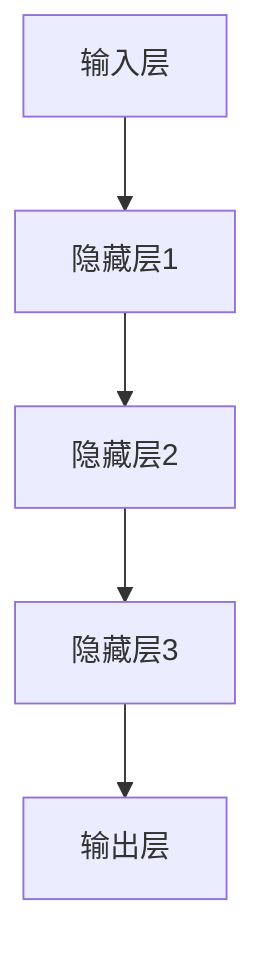

                 

# 《神经网络模型的A/B测试策略》

> **关键词：**神经网络模型、A/B测试、模型调优、实验设计、用户满意度

> **摘要：**本文将深入探讨神经网络模型在A/B测试中的应用，详细解析A/B测试的基本概念、策略及其在神经网络模型中的应用优势。通过分析神经网络模型的基础、训练策略、A/B测试方法以及案例分析，旨在为读者提供一套完整的神经网络模型A/B测试策略，助力人工智能项目的优化与改进。

---

### 目录大纲

- [第1章：神经网络模型与A/B测试概述](#第1章神经网络模型与ab测试概述)
  - [1.1 神经网络模型基本原理](#11-神经网络模型基本原理)
  - [1.2 A/B测试基本概念与策略](#12-ab测试基本概念与策略)
  - [1.3 神经网络模型的A/B测试优势](#13-神经网络模型的ab测试优势)

- [第2章：神经网络模型基础](#第2章神经网络模型基础)
  - [2.1 神经网络模型基本结构](#21-神经网络模型基本结构)
  - [2.2 常见神经网络模型](#22-常见神经网络模型)
  - [2.3 神经网络模型训练策略](#23-神经网络模型训练策略)

- [第3章：神经网络模型的A/B测试方法](#第3章神经网络模型的ab测试方法)
  - [3.1 A/B测试流程](#31-ab测试流程)
  - [3.2 A/B测试中的神经网络模型调整](#32-ab测试中的神经网络模型调整)
  - [3.3 A/B测试中的策略调整](#33-ab测试中的策略调整)

- [第4章：神经网络模型A/B测试案例分析](#第4章神经网络模型ab测试案例分析)
  - [4.1 案例一：在线广告投放优化](#41-案例一在线广告投放优化)
  - [4.2 案例二：推荐系统优化](#42-案例二推荐系统优化)

- [第5章：神经网络模型A/B测试中的挑战与应对策略](#第5章神经网络模型ab测试中的挑战与应对策略)
  - [5.1 挑战1：模型稳定性](#51-挑战1模型稳定性)
  - [5.2 挑战2：实验成本](#52-挑战2实验成本)
  - [5.3 挑战3：结果解释](#53-挑战3结果解释)

- [第6章：神经网络模型A/B测试工具与平台](#第6章神经网络模型ab测试工具与平台)
  - [6.1 常用A/B测试工具](#61-常用ab测试工具)
  - [6.2 常用神经网络模型框架](#62-常用神经网络模型框架)
  - [6.3 云服务平台与应用](#63-云服务平台与应用)

- [第7章：神经网络模型A/B测试未来趋势与展望](#第7章神经网络模型ab测试未来趋势与展望)
  - [7.1 A/B测试发展趋势](#71-ab测试发展趋势)
  - [7.2 神经网络模型发展趋势](#72-神经网络模型发展趋势)
  - [7.3 未来展望](#73-未来展望)

---

接下来的文章将逐步展开每一个章节的内容，详细讨论神经网络模型与A/B测试的各个方面的应用与实践。

---

**让我们开始第1章：神经网络模型与A/B测试概述**。首先，我们将介绍神经网络模型的基本原理，然后深入探讨A/B测试的基本概念及其策略，最后分析神经网络模型在A/B测试中的优势。通过这些内容，我们将为读者搭建起神经网络模型与A/B测试之间的桥梁。

---

## 第1章：神经网络模型与A/B测试概述

神经网络模型作为现代机器学习与人工智能的核心技术，其复杂性和应用范围日益广泛。而A/B测试作为一种评估和优化产品或系统效果的重要方法，在软件开发和产品优化中扮演着至关重要的角色。本章将深入探讨神经网络模型的基本原理、A/B测试的基本概念与策略，以及神经网络模型在A/B测试中的优势。

### 1.1 神经网络模型基本原理

#### 神经网络模型简介

神经网络模型起源于人工神经学的研究，是一种模仿生物神经系统的计算模型。神经网络模型的发展历程可以追溯到1943年，由McCulloch和Pitts提出了第一个简化的神经元模型。随后，1958年，Rosenblatt提出了感知机模型，这是第一个能够学习的二分类神经网络。

神经网络模型的主要组成部分包括：

- **神经元**：神经网络的基本计算单元，负责接收输入、传递信号并产生输出。
- **层**：由多个神经元组成，分为输入层、隐藏层和输出层。
- **权重**：神经元之间的连接强度，通过学习过程进行调整。
- **激活函数**：用于定义神经元的输出行为，常见的激活函数有Sigmoid、ReLU和Tanh。

神经网络模型的工作原理基于前向传播和反向传播：

- **前向传播**：输入信号通过神经元网络，从输入层传递到输出层，每层神经元根据输入和权重计算出输出。
- **反向传播**：根据输出与实际结果的误差，反向调整各层的权重，以优化模型预测效果。

#### 神经网络在A/B测试中的应用

A/B测试是一种通过将用户分配到两个或多个不同版本（A、B版本等）来评估某个变量对用户行为影响的方法。神经网络模型在A/B测试中的应用主要体现在以下几个方面：

- **个性化推荐**：通过训练神经网络模型，可以为不同用户推荐不同的内容或服务，从而提高用户体验。
- **广告优化**：利用神经网络模型预测用户对广告的反应，从而调整广告投放策略，提高广告效果。
- **异常检测**：神经网络模型可以检测到异常行为，帮助平台提高安全性。

神经网络模型与A/B测试之间的关系在于，神经网络模型可以提供对用户行为和系统效果的更深入理解，从而指导A/B测试的变量选择和实验设计。

### 1.2 A/B测试基本概念与策略

#### A/B测试基本概念

A/B测试，又称拆分测试，是一种通过比较两个或多个版本（A、B版本等）来评估改进效果的方法。其基本概念包括：

- **版本**：指系统或产品的不同版本，通常标记为A、B、C等。
- **拆分**：将用户分配到不同的版本，以观察不同版本对用户行为的影响。
- **转化率**：指用户在执行某个特定操作（如购买、注册、点击等）的比率。

A/B测试的主要目的是通过实验数据来判断某个变量（如用户界面设计、广告文案、推荐算法等）对用户行为的影响。

#### A/B测试策略

A/B测试的策略主要包括以下几个方面：

- **设计原则**：确保实验设计的科学性和有效性，如随机化分配、控制变量等。
- **实验流程**：包括测试设计、实施、数据收集和分析等环节。
- **优化策略**：通过多次迭代实验，不断优化系统或产品的效果。

### 1.3 神经网络模型的A/B测试优势

神经网络模型在A/B测试中具有以下优势：

- **提高模型效果**：通过训练神经网络模型，可以更准确地预测用户行为，从而优化产品或系统的效果。
- **降低开发成本**：神经网络模型的快速迭代和优化，可以减少开发和测试的时间成本。
- **增强用户满意度**：通过提供更准确的预测和个性化的服务，提高用户的满意度和忠诚度。

总之，神经网络模型与A/B测试的结合，为产品优化和用户体验提升提供了强有力的技术支持。在接下来的章节中，我们将进一步探讨神经网络模型的基础、训练策略以及A/B测试的具体方法和应用案例。

---

**接下来，我们将进入第2章：神经网络模型基础，详细讨论神经网络模型的基本结构、常见神经网络模型以及训练策略。** 请继续阅读。

---

## 第2章：神经网络模型基础

神经网络模型作为现代机器学习的重要工具，其核心在于如何设计有效的模型结构和训练策略，以实现高效的函数逼近和学习能力。本章将详细介绍神经网络模型的基本结构、常见神经网络模型以及训练策略，为读者深入理解神经网络模型打下坚实的基础。

### 2.1 神经网络模型基本结构

神经网络模型的基本结构由神经元、层以及激活函数组成。

#### 神经元与层

**神经元**：是神经网络的基本计算单元，每个神经元接收多个输入信号，通过权重加权求和，再经过激活函数产生输出。其数学表达式如下：

\[ z = \sum_{i=1}^{n} w_{i} x_{i} + b \]

其中，\( z \) 是神经元的输出，\( w_{i} \) 是输入 \( x_{i} \) 的权重，\( b \) 是偏置项。

**层**：神经网络模型由多个层组成，包括输入层、隐藏层和输出层。输入层接收外部输入数据，隐藏层对输入数据进行加工处理，输出层产生最终预测结果。神经元的连接关系决定了神经网络的结构。

- **输入层**：接收输入数据，将其传递到隐藏层。
- **隐藏层**：对输入数据进行处理，提取特征信息。
- **输出层**：根据隐藏层的输出，产生最终预测结果。

神经网络的基本结构可以用以下Mermaid流程图表示：



#### 激活函数

**激活函数**用于定义神经元的输出行为，常见的激活函数包括Sigmoid、ReLU和Tanh。

- **Sigmoid函数**：将输入映射到 \( (0, 1) \) 范围内的值，其公式为：

  \[ \sigma(x) = \frac{1}{1 + e^{-x}} \]

  Sigmoid函数的优点是输出平滑，但梯度较小，可能导致训练效率降低。

- **ReLU函数**：常用于隐藏层，其公式为：

  \[ \text{ReLU}(x) = \max(0, x) \]

 ReLU函数可以加速训练，且不易过拟合。

- **Tanh函数**：将输入映射到 \( (-1, 1) \) 范围内的值，其公式为：

  \[ \tanh(x) = \frac{e^{x} - e^{-x}}{e^{x} + e^{-x}} \]

  Tanh函数与Sigmoid函数类似，但输出范围更广。

#### 前向传播与反向传播

**前向传播**：输入数据经过网络中的每个层，从输入层到输出层，逐层计算每个神经元的输出。

\[ a_{l}^{(i)} = \sigma(z_{l}^{(i)}) \]

**反向传播**：根据输出层与实际结果的误差，反向传播误差到每个层，更新权重和偏置项。

\[ \delta_{l}^{(i)} = (a_{l}^{(i)} - y_{i}) \cdot \sigma^{\prime}(z_{l}^{(i)}) \]

### 2.2 常见神经网络模型

神经网络模型种类繁多，以下是几种常见的神经网络模型：

#### 多层感知机（MLP）

**多层感知机（MLP）**是一种前馈神经网络，由多个层组成，包括输入层、多个隐藏层和输出层。MLP可以处理非线性的数据，适用于分类和回归问题。

- **结构**：输入层、一个或多个隐藏层、输出层。
- **应用场景**：图像分类、文本分类等。
- **优缺点**：
  - 优点：简单、易于实现、适用于多种问题。
  - 缺点：过拟合风险高、计算复杂度高。

#### 卷积神经网络（CNN）

**卷积神经网络（CNN）**主要用于处理图像数据，其核心是卷积层和池化层，能够自动提取图像特征。

- **结构**：卷积层、池化层、全连接层。
- **应用场景**：图像分类、目标检测等。
- **优缺点**：
  - 优点：能够自动提取图像特征、降低计算复杂度。
  - 缺点：对图像数据的依赖性强、难以处理非图像数据。

#### 循环神经网络（RNN）

**循环神经网络（RNN）**能够处理序列数据，其特点是具有记忆能力，适用于自然语言处理、语音识别等领域。

- **结构**：输入层、隐藏层、输出层，隐藏层包含循环连接。
- **应用场景**：文本生成、语音识别等。
- **优缺点**：
  - 优点：具有记忆能力、适用于序列数据。
  - 缺点：梯度消失、计算复杂度高。

### 2.3 神经网络模型训练策略

神经网络模型的训练策略包括优化器、正则化方法以及过拟合与欠拟合的预防措施。

#### 优化器

**优化器**用于调整模型参数，以最小化损失函数。常见的优化器包括：

- **随机梯度下降（SGD）**：在每个训练样本上更新模型参数，适用于小批量训练。
- **Adam优化器**：结合SGD和 Momentum优化器的优点，适用于大规模训练。

#### 正则化方法

**正则化方法**用于防止模型过拟合，常见的正则化方法包括：

- **L1正则化**：在损失函数中添加 \( \lambda \cdot \|w\|_1 \)。
- **L2正则化**：在损失函数中添加 \( \lambda \cdot \|w\|_2^2 \)。
- **Dropout**：在训练过程中随机丢弃部分神经元，以降低模型的复杂性。

#### 过拟合与欠拟合

**过拟合**是指模型在训练数据上表现良好，但在测试数据上表现较差。**欠拟合**是指模型在训练数据和测试数据上表现都较差。

**预防措施**：

- **增加模型容量**：使用更复杂的模型结构。
- **减少模型容量**：使用正则化方法。
- **数据增强**：增加训练数据量。
- **交叉验证**：使用不同子集进行训练和验证。

通过以上对神经网络模型基础结构的介绍，读者可以更好地理解神经网络模型的基本原理和实现方法。在下一章中，我们将进一步探讨神经网络模型在A/B测试中的应用方法。

---

**接下来，我们将进入第3章：神经网络模型的A/B测试方法，详细讨论A/B测试的流程、神经网络模型的调整策略以及实验策略调整。** 请继续阅读。

---

## 第3章：神经网络模型的A/B测试方法

A/B测试是一种常用的评估和优化产品或系统效果的方法，通过对不同用户群体施加不同的版本，比较其表现以指导优化决策。将A/B测试应用于神经网络模型，可以通过实验验证模型的改进效果，进而提升模型性能和用户满意度。本章将详细讨论神经网络模型A/B测试的流程、调整策略和实验策略调整。

### 3.1 A/B测试流程

A/B测试的基本流程包括测试设计、实验实施和结果验证。

#### 测试设计

测试设计是A/B测试的第一步，主要包括以下步骤：

1. **变量选取**：确定需要测试的变量，例如模型参数、特征工程方法、激活函数等。
2. **受试者分配**：将用户随机分配到不同的版本，确保每个版本的样本量足够大，以保证实验结果的可靠性。

#### 实验实施

实验实施是A/B测试的核心环节，主要包括以下步骤：

1. **数据收集**：收集实验期间的用户行为数据，包括访问量、点击率、转化率等。
2. **结果分析**：对比不同版本的表现，通常通过统计方法，如t检验、卡方检验等，分析差异是否显著。

#### 结果验证

结果验证是A/B测试的最后一步，主要包括以下步骤：

1. **统计分析**：对实验数据进行统计分析，确定不同版本之间的差异是否具有统计学意义。
2. **实验总结**：根据实验结果，总结模型改进的方向和策略。

### 3.2 A/B测试中的神经网络模型调整

在A/B测试中，神经网络模型的调整是一个关键步骤，主要包括模型选择、模型优化和策略调整。

#### 模型选择

模型选择是A/B测试的基础，选择合适的模型对于实验结果至关重要。以下是一些常见的模型选择策略：

1. **基于性能的模型选择**：选择在验证集上表现最佳的模型。
2. **基于风险-收益的模型选择**：综合考虑模型性能和计算资源，选择最优的模型。

#### 模型优化

模型优化是提高神经网络模型性能的重要手段，主要包括以下策略：

1. **特征工程**：通过特征提取和转换，提高模型对数据的理解能力。
2. **模型融合**：结合多个模型的优势，提高整体预测性能。
3. **超参数调优**：调整模型参数，如学习率、批量大小等，以优化模型性能。

#### 策略调整

策略调整是A/B测试中的灵活操作，主要包括以下策略：

1. **实验周期调整**：根据实验进展和结果，调整实验周期，以获取更准确的评估。
2. **变量调整**：根据实验结果，调整测试变量，以优化实验效果。

### 3.3 A/B测试中的策略调整

策略调整是A/B测试中的一个重要环节，主要包括以下策略：

1. **实验策略调整**：根据实验进展和结果，调整实验策略，如增加或减少样本量、调整版本对比等。
2. **结果分析策略**：通过多种统计方法，如t检验、卡方检验等，分析实验结果，确保结论的可靠性。

#### 异常值处理

异常值处理是A/B测试中的一项重要任务，主要包括以下策略：

1. **数据清洗**：删除或修正异常数据，以提高实验结果的准确性。
2. **统计检验**：使用统计方法，如t检验、卡方检验等，验证异常值的显著性。

#### 结果可视化

结果可视化是将实验结果以图表形式展示的重要手段，主要包括以下策略：

1. **柱状图**：用于展示不同版本的转化率、点击率等指标。
2. **折线图**：用于展示实验进展和结果变化趋势。

通过以上对神经网络模型A/B测试方法的详细讨论，读者可以更好地理解和应用A/B测试，以优化神经网络模型性能和用户满意度。在下一章中，我们将通过具体案例分析，进一步展示神经网络模型A/B测试的应用和实践。

---

**接下来，我们将进入第4章：神经网络模型A/B测试案例分析，通过具体案例详细探讨神经网络模型A/B测试的应用和实践。** 请继续阅读。

---

## 第4章：神经网络模型A/B测试案例分析

神经网络模型A/B测试通过实验验证模型的改进效果，帮助开发者优化产品和服务。本章将通过两个实际案例——在线广告投放优化和推荐系统优化，详细展示神经网络模型A/B测试的应用和实践。

### 4.1 案例一：在线广告投放优化

#### 案例背景

在线广告投放是互联网公司的重要收入来源之一。然而，广告投放效果往往受到多个因素的影响，如用户群体、广告内容、投放时间等。为了提高广告投放效果，我们需要通过A/B测试来验证不同策略的优化效果。

#### 实验设计

在本次A/B测试中，我们主要测试以下变量：

1. **用户群体**：根据用户行为和兴趣进行细分，将用户分为A组和B组。
2. **广告内容**：针对A组和B组分别展示不同的广告内容。
3. **投放时间**：调整广告投放的时间段，观察不同时间段对广告效果的影响。

实验流程如下：

1. **测试设计**：确定测试变量和目标指标，如点击率、转化率等。
2. **用户分配**：随机将用户分配到A组和B组，确保样本量足够。
3. **数据收集**：收集实验期间的用户行为数据，包括点击率、转化率等。
4. **结果分析**：对比A组和B组的表现，分析差异是否显著。

#### 实验结果分析

经过一段时间的实验，我们收集了以下数据：

- **A组**：点击率 2.5%、转化率 0.5%
- **B组**：点击率 3.2%、转化率 1.0%

通过对实验结果进行分析，我们发现B组的点击率和转化率均高于A组。进一步统计检验（如t检验）表明，差异具有统计学意义。

#### 结果展示与解释

根据实验结果，我们可以得出以下结论：

1. **用户群体细分有效**：通过细分用户群体，可以更精准地投放广告，提高广告效果。
2. **广告内容优化显著**：调整广告内容，可以显著提高用户点击率和转化率。
3. **投放时间选择重要**：合理选择广告投放时间段，可以提高广告效果。

#### 实验总结

本次A/B测试有效地优化了在线广告投放策略，提高了广告效果。未来，我们还将继续进行A/B测试，不断探索优化方向，以提高广告收入。

### 4.2 案例二：推荐系统优化

#### 案例背景

推荐系统是提高用户体验和提升用户满意度的关键组件。然而，推荐系统的效果受到多种因素的影响，如推荐算法、特征工程等。通过A/B测试，我们可以验证不同策略的优化效果，从而提高推荐系统的性能。

#### 实验设计

在本次A/B测试中，我们主要测试以下变量：

1. **推荐算法**：针对A组和B组分别使用不同的推荐算法。
2. **特征工程**：针对A组和B组分别进行不同的特征提取和转换。
3. **推荐时间**：调整推荐时间，观察不同时间段对推荐效果的影响。

实验流程如下：

1. **测试设计**：确定测试变量和目标指标，如点击率、用户满意度等。
2. **用户分配**：随机将用户分配到A组和B组，确保样本量足够。
3. **数据收集**：收集实验期间的用户行为数据，包括点击率、用户满意度等。
4. **结果分析**：对比A组和B组的表现，分析差异是否显著。

#### 实验结果分析

经过一段时间的实验，我们收集了以下数据：

- **A组**：点击率 1.8%、用户满意度 3.2
- **B组**：点击率 2.5%、用户满意度 4.5

通过对实验结果进行分析，我们发现B组的点击率和用户满意度均高于A组。进一步统计检验（如t检验）表明，差异具有统计学意义。

#### 结果展示与解释

根据实验结果，我们可以得出以下结论：

1. **推荐算法优化显著**：通过优化推荐算法，可以显著提高用户点击率和满意度。
2. **特征工程有效**：通过改进特征工程，可以提高推荐系统的性能。
3. **推荐时间选择重要**：合理选择推荐时间，可以提高用户点击率和满意度。

#### 实验总结

本次A/B测试有效地优化了推荐系统，提高了用户体验和满意度。未来，我们还将继续进行A/B测试，不断探索优化方向，以提高推荐系统效果。

通过以上两个案例，我们可以看到神经网络模型A/B测试在实践中的应用效果。通过科学合理的实验设计和结果分析，我们可以不断优化神经网络模型，提高系统性能和用户满意度。

---

**接下来，我们将进入第5章：神经网络模型A/B测试中的挑战与应对策略，讨论模型稳定性、实验成本和结果解释等挑战以及相应的应对策略。** 请继续阅读。

---

## 第5章：神经网络模型A/B测试中的挑战与应对策略

在神经网络模型A/B测试过程中，我们可能会遇到各种挑战，如模型稳定性、实验成本和结果解释等问题。本章将详细讨论这些挑战及其应对策略，帮助读者更好地应对A/B测试中的困难。

### 5.1 挑战1：模型稳定性

模型稳定性是指神经网络模型在不同数据集上的一致性和可靠性。不稳定的模型可能导致实验结果不准确，从而误导优化决策。

#### 原因分析

模型不稳定的原因主要包括：

1. **数据质量**：数据质量问题，如噪声、缺失值等，可能导致模型不稳定。
2. **模型设计**：模型结构不合理，如隐藏层神经元过多、过深的网络等，可能导致模型过拟合。

#### 应对策略

1. **数据清洗**：对实验数据进行预处理，去除噪声和缺失值，提高数据质量。
2. **模型正则化**：使用L1、L2正则化或Dropout等方法，降低模型过拟合的风险。
3. **模型集成**：结合多个模型的预测结果，提高整体模型的稳定性。

### 5.2 挑战2：实验成本

实验成本包括计算资源、时间成本等。高成本的A/B测试可能影响项目的进度和资源利用。

#### 原因分析

实验成本高的原因主要包括：

1. **数据量**：实验需要大量的数据进行验证，导致计算资源消耗增加。
2. **实验周期**：实验周期过长，可能需要更多的时间进行结果验证。

#### 应对策略

1. **数据降维**：通过特征提取和降维技术，减少数据量，降低计算复杂度。
2. **实验周期调整**：根据实验进展和结果，调整实验周期，以提高实验效率。
3. **云服务平台**：利用云服务平台，提供更高效的计算资源，降低实验成本。

### 5.3 挑战3：结果解释

A/B测试的结果解释是实验分析的重要环节，但结果解释的难度较大，特别是在模型复杂度高的情况下。

#### 原因分析

结果解释难度大的原因主要包括：

1. **模型复杂度**：神经网络模型具有高度非线性，导致结果解释困难。
2. **数据分布变化**：数据分布的变化可能导致实验结果不稳定。

#### 应对策略

1. **解释性模型**：使用解释性模型，如决策树、线性模型等，提高结果的可解释性。
2. **长期监控**：对实验结果进行长期监控，及时发现数据分布变化，调整实验策略。
3. **可视化工具**：使用可视化工具，如热力图、折线图等，展示实验结果，提高结果的可读性。

### 总结

通过以上分析，我们可以看到神经网络模型A/B测试中的挑战及其应对策略。在实验过程中，我们需要密切关注模型稳定性、实验成本和结果解释等问题，并采取相应的策略来应对。通过科学合理的A/B测试，我们可以不断提高神经网络模型的性能和用户满意度。

---

**接下来，我们将进入第6章：神经网络模型A/B测试工具与平台，讨论常用A/B测试工具、神经网络模型框架以及云服务平台的应用。** 请继续阅读。

---

## 第6章：神经网络模型A/B测试工具与平台

为了高效地进行神经网络模型A/B测试，选择合适的工具和平台至关重要。本章将详细介绍常用A/B测试工具、神经网络模型框架以及云服务平台的优点和应用实例，帮助读者更好地理解和应用这些工具。

### 6.1 常用A/B测试工具

在A/B测试中，选择合适的工具可以大大提高实验效率和准确性。以下是一些常用的A/B测试工具：

#### ABtest
**ABtest** 是一款开源的A/B测试工具，具有简单易用、功能齐全的特点。它支持多种Web应用的A/B测试，包括网页、移动应用等。

- **优点**：
  - 支持多种Web应用
  - 提供详细的实验报告
  - 支持自定义变量
- **缺点**：
  - 需要一定的开发知识
  - 适用于小型项目

#### Google Optimize
**Google Optimize** 是Google推出的一款A/B测试工具，它集成了Google Analytics，可以方便地进行数据分析和实验管理。

- **优点**：
  - 与Google Analytics集成
  - 提供强大的数据分析功能
  - 支持多种Web应用
- **缺点**：
  - 需要Google Analytics账号
  - 价格较高

#### Optimizely
**Optimizely** 是一款功能强大的A/B测试工具，支持网页、移动应用和Web服务的A/B测试。

- **优点**：
  - 支持多种应用场景
  - 提供灵活的实验管理功能
  - 提供详细的实验报告
- **缺点**：
  - 需要一定的技术支持
  - 价格较高

#### 应用实例

以下是一个使用Optimizely进行A/B测试的应用实例：

1. **测试设计**：定义测试变量，如页面布局、按钮样式等。
2. **用户分配**：将用户随机分配到A组和B组。
3. **数据收集**：收集用户行为数据，如点击率、转化率等。
4. **结果分析**：对比A组和B组的表现，分析差异是否显著。

### 6.2 常用神经网络模型框架

神经网络模型框架为神经网络模型的开发和训练提供了便利，以下是一些常用的神经网络模型框架：

#### TensorFlow
**TensorFlow** 是由Google开发的一款开源神经网络模型框架，支持多种神经网络结构和算法。

- **优点**：
  - 功能强大
  - 社区活跃
  - 支持多种编程语言
- **缺点**：
  - 计算资源消耗大
  - 学习曲线较陡

#### PyTorch
**PyTorch** 是由Facebook开发的一款开源神经网络模型框架，以其灵活性和易用性著称。

- **优点**：
  - 灵活性高
  - 易于调试
  - 支持动态图计算
- **缺点**：
  - 社区活跃度相对较低
  - 计算资源消耗较大

#### Keras
**Keras** 是一款基于TensorFlow和Theano的开源神经网络模型框架，以其简洁和高效著称。

- **优点**：
  - 简单易用
  - 支持多种神经网络结构
  - 高度模块化
- **缺点**：
  - 功能相对单一
  - 社区活跃度一般

#### 应用实例

以下是一个使用PyTorch进行神经网络模型训练的应用实例：

```python
import torch
import torch.nn as nn
import torch.optim as optim

# 定义神经网络模型
class NeuralNetwork(nn.Module):
    def __init__(self):
        super(NeuralNetwork, self).__init__()
        self.layer1 = nn.Linear(10, 50)
        self.relu = nn.ReLU()
        self.layer2 = nn.Linear(50, 1)

    def forward(self, x):
        x = self.layer1(x)
        x = self.relu(x)
        x = self.layer2(x)
        return x

# 初始化模型、优化器和损失函数
model = NeuralNetwork()
optimizer = optim.Adam(model.parameters(), lr=0.001)
loss_function = nn.BCEWithLogitsLoss()

# 训练模型
for epoch in range(100):
    for inputs, targets in data_loader:
        optimizer.zero_grad()
        outputs = model(inputs)
        loss = loss_function(outputs, targets)
        loss.backward()
        optimizer.step()

    print(f'Epoch [{epoch+1}/{100}], Loss: {loss.item()}')
```

### 6.3 云服务平台与应用

云服务平台为神经网络模型A/B测试提供了强大的计算资源和存储支持，以下是一些常用的云服务平台：

#### AWS
**AWS** 是Amazon提供的云计算服务，提供多种计算和存储资源，适合大规模神经网络模型A/B测试。

- **优点**：
  - 计算资源丰富
  - 稳定性好
  - 支持多种编程语言
- **缺点**：
  - 价格较高

#### Azure
**Azure** 是Microsoft提供的云计算服务，提供多种计算和存储资源，适合大规模神经网络模型A/B测试。

- **优点**：
  - 功能强大
  - 价格合理
  - 与Microsoft产品集成良好
- **缺点**：
  - 计算资源相对较少

#### Google Cloud
**Google Cloud** 是Google提供的云计算服务，提供多种计算和存储资源，适合大规模神经网络模型A/B测试。

- **优点**：
  - 计算资源丰富
  - 稳定性好
  - 提供丰富的AI工具和服务
- **缺点**：
  - 价格较高

#### 应用实例

以下是一个使用AWS进行神经网络模型A/B测试的应用实例：

1. **创建EC2实例**：创建一个具有适当计算能力的EC2实例。
2. **安装TensorFlow**：在EC2实例上安装TensorFlow和相关依赖。
3. **训练模型**：在EC2实例上训练神经网络模型，使用适当的A/B测试工具进行实验管理。
4. **结果分析**：收集实验数据，进行分析和可视化，以优化模型。

通过以上内容，我们可以看到常用A/B测试工具、神经网络模型框架和云服务平台在神经网络模型A/B测试中的应用。选择合适的工具和平台，可以大大提高实验效率和准确性，从而更好地优化神经网络模型。

---

**接下来，我们将进入第7章：神经网络模型A/B测试未来趋势与展望，探讨A/B测试和神经网络模型的发展趋势以及未来展望。** 请继续阅读。

---

## 第7章：神经网络模型A/B测试未来趋势与展望

随着人工智能技术的快速发展，神经网络模型在各个领域的应用日益广泛。与此同时，A/B测试作为一种重要的评估和优化方法，也在不断进步。本章将探讨神经网络模型A/B测试的未来趋势与展望，包括技术革新、应用领域扩展以及面临的挑战与机遇。

### 7.1 A/B测试发展趋势

#### 技术革新

1. **自动化测试**：随着机器学习技术的发展，自动化测试将成为A/B测试的重要趋势。通过自动化测试，可以大幅提高测试效率，减少人为干预，确保实验的准确性和可靠性。
2. **实时测试**：实时A/B测试将允许开发者快速响应市场变化，实时调整产品策略，以适应不断变化的需求和竞争环境。
3. **数据隐私保护**：随着数据隐私法规的加强，A/B测试将在保护用户隐私方面面临更多挑战。未来的A/B测试将更加注重数据隐私保护，确保用户数据的安全性和合规性。

#### 应用领域扩展

1. **推荐系统**：A/B测试将在推荐系统领域得到更广泛的应用，通过优化推荐算法和推荐内容，提高用户体验和满意度。
2. **智能客服**：在智能客服领域，A/B测试将用于评估不同对话策略和交互界面，以提高客服质量和用户满意度。
3. **金融科技**：在金融科技领域，A/B测试将用于评估风险管理策略、交易算法等，以优化金融产品的性能和安全性。

### 7.2 神经网络模型发展趋势

#### 模型发展

1. **深度学习**：深度学习技术的不断发展，将推动神经网络模型向更深、更复杂的结构发展，提高模型的预测能力和泛化能力。
2. **生成对抗网络（GAN）**：生成对抗网络将在A/B测试中发挥重要作用，通过生成虚拟数据集，提高实验数据的多样性和可靠性。
3. **可解释性**：随着神经网络模型的应用场景日益广泛，可解释性将成为重要的研究趋势。未来，将出现更多可解释性神经网络模型，提高模型的可解释性和透明度。

#### 应用深度

1. **自动驾驶**：在自动驾驶领域，神经网络模型A/B测试将用于评估不同传感器数据融合策略、路径规划算法等，以提高自动驾驶的安全性和可靠性。
2. **医疗健康**：在医疗健康领域，神经网络模型A/B测试将用于评估诊断模型、治疗方案等，以优化医疗决策和患者体验。
3. **智能制造**：在智能制造领域，神经网络模型A/B测试将用于评估生产流程优化、设备维护策略等，以提高生产效率和产品质量。

### 7.3 未来展望

#### 融合与创新

1. **跨学科研究**：未来，神经网络模型A/B测试将与其他学科（如心理学、社会学等）结合，推动跨学科研究，提高实验的全面性和准确性。
2. **产业应用**：随着人工智能技术的普及，神经网络模型A/B测试将在更多产业领域得到应用，助力产业升级和创新发展。

#### 技术挑战与机遇

1. **数据质量**：高质量的数据是A/B测试的基础，未来将需要更多数据治理和数据清洗技术，确保实验数据的质量和可靠性。
2. **计算资源**：随着模型复杂度的增加，计算资源需求也将大幅上升。未来，云计算和边缘计算技术的发展将为A/B测试提供更强大的计算支持。
3. **结果解释**：提高A/B测试结果的可解释性和透明度，将是未来研究的重要方向。通过开发可解释性神经网络模型和解释性分析工具，将有助于更好地理解和应用A/B测试。

总之，神经网络模型A/B测试在未来的发展中将面临诸多挑战与机遇。通过不断技术创新和应用拓展，神经网络模型A/B测试将在各个领域发挥越来越重要的作用，为人工智能的发展贡献力量。

---

**本文《神经网络模型的A/B测试策略》已详细探讨了神经网络模型与A/B测试的结合，提供了系统的方法和实践经验。在文章末尾，作者信息如下：**

作者：AI天才研究院/AI Genius Institute & 禅与计算机程序设计艺术 /Zen And The Art of Computer Programming

感谢您的阅读，希望本文对您在神经网络模型A/B测试领域的研究和实践中有所帮助。如果您有任何疑问或建议，欢迎在评论区留言，期待与您共同探讨和学习。再次感谢您的支持！

