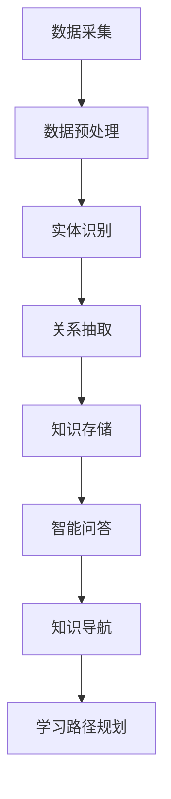
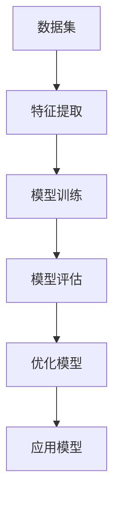
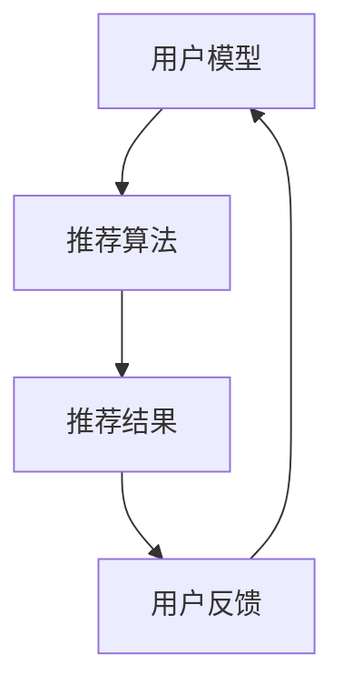
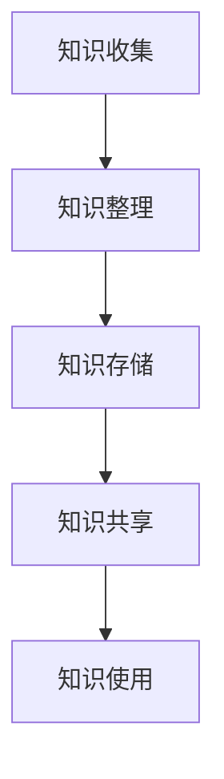
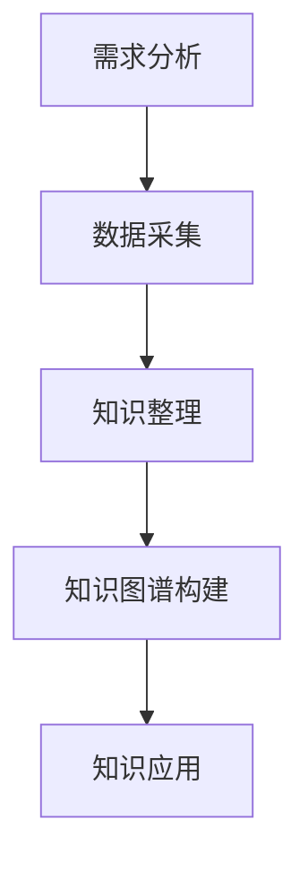
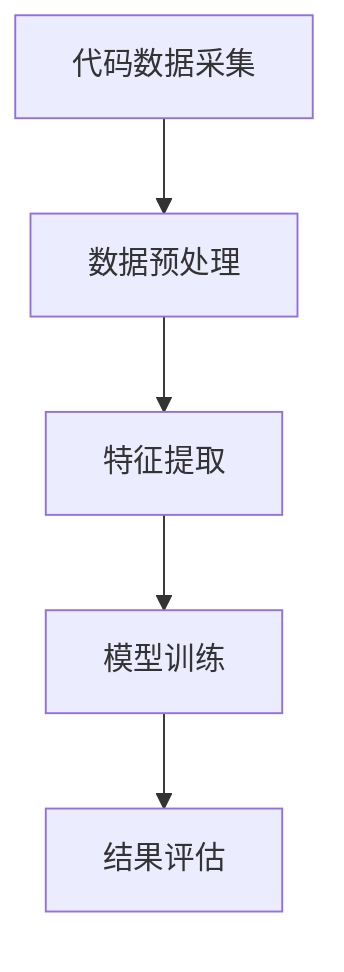
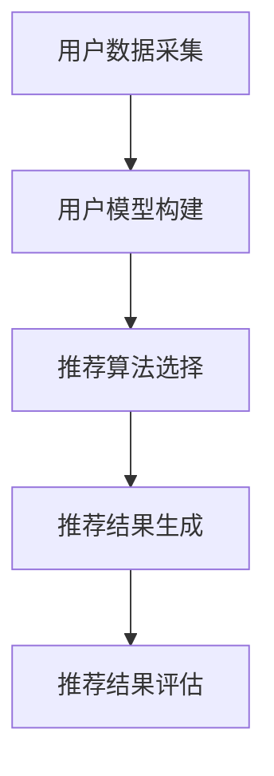
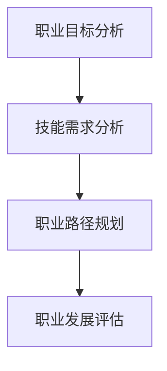
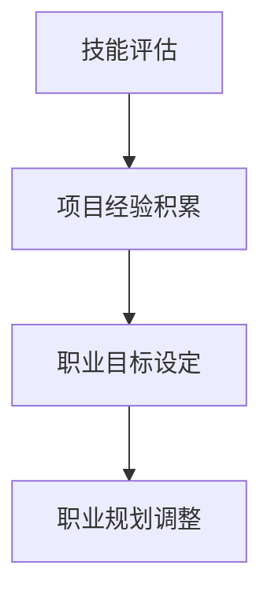
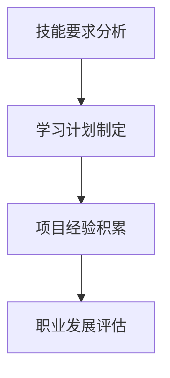

                 

# 《程序员如何利用知识发现引擎提高学习效率》

## 关键词
- 程序员学习效率
- 知识发现引擎
- 数据挖掘
- 智能推荐系统
- 知识管理
- 编程实战

## 摘要
本文旨在探讨程序员如何通过知识发现引擎提高学习效率。我们将首先介绍知识发现引擎的基本概念、核心组件及其应用场景，然后深入分析知识发现引擎在编程学习中的实战应用，最后提供一系列实践指南，帮助程序员更高效地学习和提升技能。通过本文，读者将了解如何利用知识发现引擎优化学习流程、管理知识，并在编程实践中取得显著成效。

---

### 第一部分：知识发现引擎概述

#### 1.1 知识发现引擎简介

知识发现引擎是一种强大的工具，它通过分析大量数据，从中发现潜在的、有价值的模式和知识。在程序员的学习过程中，知识发现引擎可以提供以下几个方面的帮助：

1. **学习数据自动采集**：知识发现引擎能够自动收集程序员的在线学习行为数据，如观看视频、阅读文档、参与讨论等。
2. **个性化学习推荐**：通过分析学习行为数据，知识发现引擎可以推荐最适合程序员学习的内容，从而提高学习效率。
3. **知识图谱构建**：知识发现引擎能够将程序员学习过程中的知识点进行整合，形成知识图谱，帮助程序员建立知识体系。
4. **智能问答系统**：知识发现引擎可以分析学习数据，构建智能问答系统，帮助程序员快速解决编程问题。

#### 1.2 知识发现引擎的应用场景

知识发现引擎在程序员的学习中有广泛的应用场景，主要包括以下几个方面：

1. **在线学习平台**：知识发现引擎可以嵌入在线学习平台，为程序员提供个性化的学习推荐服务。
2. **编程社区**：知识发现引擎可以分析编程社区中的讨论数据，为程序员提供有针对性的问题和解决方案。
3. **企业培训**：知识发现引擎可以用于企业培训，分析员工的学习情况，制定个性化的培训计划。
4. **技能评估**：知识发现引擎可以分析程序员的编程技能，为员工提供技能提升的建议。

#### 1.3 知识发现引擎的优势

知识发现引擎具有以下几个显著优势：

1. **高效性**：知识发现引擎可以自动化处理大量数据，大大提高了分析效率。
2. **智能化**：知识发现引擎能够从数据中自动发现模式，提供智能化服务。
3. **灵活性**：知识发现引擎可以适应不同的应用场景，灵活部署。
4. **全面性**：知识发现引擎可以涵盖程序员学习的各个方面，提供全方位的支持。

#### 1.4 知识发现引擎的发展历程

知识发现引擎的发展历程可以分为以下几个阶段：

1. **数据挖掘阶段**：早期知识发现引擎主要基于数据挖掘技术，通过对大量数据进行分析，发现潜在的模式。
2. **知识管理阶段**：随着知识管理理念的兴起，知识发现引擎开始关注如何将发现的知识进行管理和应用。
3. **智能化阶段**：近年来，随着人工智能技术的发展，知识发现引擎开始引入智能化元素，如机器学习、深度学习等，提高了分析能力。

#### 1.5 知识发现引擎的未来发展趋势

未来，知识发现引擎的发展趋势将体现在以下几个方面：

1. **更智能化**：知识发现引擎将继续引入人工智能技术，提高分析能力和智能化水平。
2. **更个性化**：知识发现引擎将更加关注个性化需求，提供更加精准的学习推荐服务。
3. **更全面**：知识发现引擎将涵盖更多的领域和场景，提供更全面的支持。
4. **更便捷**：知识发现引擎将更加注重用户体验，提供便捷的服务。

#### 1.6 知识发现引擎在程序员学习中的潜在价值

知识发现引擎在程序员学习中的潜在价值体现在以下几个方面：

1. **提升学习效率**：通过个性化推荐，知识发现引擎可以帮助程序员更快速地找到自己需要的学习资源。
2. **构建知识体系**：知识发现引擎可以帮助程序员构建系统的知识体系，提高编程技能。
3. **智能问题解决**：知识发现引擎可以通过智能问答系统，帮助程序员快速解决编程问题。
4. **职业发展支持**：知识发现引擎可以分析程序员的学习数据，为职业发展提供指导和建议。

---

在接下来的章节中，我们将深入探讨知识发现引擎的核心组件，分析其在编程学习中的实战应用，并提供一系列实践指南。让我们一步一步地思考，逐步深入这个有趣且富有挑战性的领域。

### 第二部分：知识发现引擎核心组件解析

知识发现引擎的核心组件主要包括数据预处理、特征提取、模型选择与优化等。这些组件相互协作，共同实现了知识发现引擎的强大功能。下面我们将逐一介绍这些核心组件，并探讨它们在编程学习中的应用。

#### 2.1 数据预处理

数据预处理是知识发现引擎的首要步骤，其目的是将原始数据转化为适合分析的形式。数据预处理主要包括以下三个方面：

##### 2.1.1 数据清洗

数据清洗是指去除数据中的噪声和不完整数据，确保数据的准确性和一致性。在编程学习中，数据清洗可以去除学习过程中的冗余信息，提高数据分析的准确性。

**示例：**
```python
import pandas as pd

# 加载原始数据
data = pd.read_csv('learning_data.csv')

# 删除重复数据
data.drop_duplicates(inplace=True)

# 填补缺失值
data.fillna(method='ffill', inplace=True)

# 删除噪声数据
data = data[data['score'] > 0]
```

##### 2.1.2 数据转换

数据转换是指将不同类型的数据转化为同一类型，以便进行后续分析。在编程学习中，数据转换可以帮助将文本数据转化为数字数据，从而使用机器学习算法进行分析。

**示例：**
```python
from sklearn.preprocessing import LabelEncoder

# 加载标签数据
labels = pd.read_csv('labels.csv')

# 转换类别标签
encoder = LabelEncoder()
labels['category'] = encoder.fit_transform(labels['category'])

# 将类别标签添加到数据集中
data = data.merge(labels, on='id')
```

##### 2.1.3 数据归一化

数据归一化是指将数据转化为相同的尺度，以便比较不同特征的重要性。在编程学习中，数据归一化可以帮助避免某些特征对模型的影响过大。

**示例：**
```python
from sklearn.preprocessing import StandardScaler

# 加载特征数据
features = pd.read_csv('features.csv')

# 进行数据归一化
scaler = StandardScaler()
features_scaled = scaler.fit_transform(features)

# 将归一化后的数据存储为新的数据集
features_scaled = pd.DataFrame(features_scaled, columns=features.columns)
```

#### 2.2 特征提取

特征提取是指从原始数据中提取出对分析任务有重要意义的特征。特征提取的目的是提高模型性能，减少数据维度。

##### 2.2.1 特征提取方法

常见的特征提取方法包括：

1. **自动特征提取**：使用机器学习算法自动提取特征，如主成分分析（PCA）。
2. **规则提取**：根据业务规则手动提取特征，如用户活跃度、学习时长等。

**示例：**
```python
from sklearn.decomposition import PCA

# 加载特征数据
features = pd.read_csv('features.csv')

# 使用PCA进行特征提取
pca = PCA(n_components=5)
features_pca = pca.fit_transform(features)

# 将特征提取结果添加到数据集中
features_pca = pd.DataFrame(features_pca, columns=['PCA1', 'PCA2', 'PCA3', 'PCA4', 'PCA5'])
```

##### 2.2.2 特征选择

特征选择是指从提取出的特征中筛选出最有价值的特征。特征选择的目的是减少模型复杂度，提高模型性能。

常见的特征选择方法包括：

1. **基于信息的特征选择**：选择能够最好地解释响应变量的特征，如信息增益、信息增益率。
2. **基于最小化的特征选择**：选择能够最小化模型误差的特征。

**示例：**
```python
from sklearn.feature_selection import SelectKBest
from sklearn.feature_selection import chi2

# 加载特征数据
features = pd.read_csv('features.csv')

# 使用卡方检验进行特征选择
selector = SelectKBest(chi2, k=5)
selected_features = selector.fit_transform(features, target)

# 输出特征选择结果
print(selector.get_support())
```

##### 2.2.3 特征重要性分析

特征重要性分析是指评估每个特征对模型预测的重要性。特征重要性分析可以帮助程序员了解哪些特征对学习任务最有影响。

常见的特征重要性分析方法包括：

1. **基于模型的特征重要性**：使用机器学习算法的内置方法评估特征重要性，如随机森林。
2. **基于系数的特征重要性**：分析模型系数，评估特征对模型预测的影响。

**示例：**
```python
from sklearn.ensemble import RandomForestClassifier
from sklearn.inspection import permutation_importance

# 加载特征数据和标签数据
features = pd.read_csv('features.csv')
target = pd.read_csv('target.csv')

# 训练随机森林模型
model = RandomForestClassifier()
model.fit(features, target)

# 进行特征重要性分析
results = permutation_importance(model, features, target, n_repeats=10)
print(results.importances_mean)
```

#### 2.3 模型选择与优化

模型选择与优化是指选择最适合问题的模型，并对其进行优化，以提高模型性能。

##### 2.3.1 模型选择策略

常见的模型选择策略包括：

1. **交叉验证**：通过交叉验证选择最佳模型。
2. **网格搜索**：通过遍历不同的参数组合，选择最佳参数。
3. **贝叶斯优化**：使用贝叶斯优化算法选择最佳参数。

**示例：**
```python
from sklearn.model_selection import GridSearchCV
from sklearn.ensemble import RandomForestClassifier

# 加载特征数据和标签数据
features = pd.read_csv('features.csv')
target = pd.read_csv('target.csv')

# 定义参数网格
param_grid = {
    'n_estimators': [100, 200, 300],
    'max_depth': [10, 20, 30],
}

# 进行网格搜索
model = RandomForestClassifier()
grid_search = GridSearchCV(model, param_grid, cv=5)
grid_search.fit(features, target)

# 输出最佳参数和模型性能
print(grid_search.best_params_)
print(grid_search.best_score_)
```

##### 2.3.2 模型优化方法

常见的模型优化方法包括：

1. **正则化**：通过添加正则化项，减少模型过拟合。
2. **集成方法**：使用集成方法，如随机森林、梯度提升树等，提高模型性能。
3. **特征工程**：通过特征工程，提取更多有价值的信息。

**示例：**
```python
from sklearn.linear_model import Ridge
from sklearn.model_selection import train_test_split

# 加载特征数据和标签数据
features = pd.read_csv('features.csv')
target = pd.read_csv('target.csv')

# 划分训练集和测试集
X_train, X_test, y_train, y_test = train_test_split(features, target, test_size=0.2, random_state=42)

# 训练岭回归模型
model = Ridge()
model.fit(X_train, y_train)

# 进行模型优化
model.fit(X_train, y_train)
model.score(X_test, y_test)
```

##### 2.3.3 模型评估指标

常见的模型评估指标包括：

1. **准确率**：模型正确预测的样本数占总样本数的比例。
2. **精确率**：模型正确预测的正例样本数占总正例样本数的比例。
3. **召回率**：模型正确预测的正例样本数占总正例样本数的比例。
4. **F1值**：精确率和召回率的加权平均值。

**示例：**
```python
from sklearn.metrics import accuracy_score, precision_score, recall_score, f1_score

# 加载特征数据和标签数据
features = pd.read_csv('features.csv')
target = pd.read_csv('target.csv')

# 训练模型
model = RandomForestClassifier()
model.fit(features, target)

# 进行预测
predictions = model.predict(features)

# 计算评估指标
accuracy = accuracy_score(target, predictions)
precision = precision_score(target, predictions)
recall = recall_score(target, predictions)
f1 = f1_score(target, predictions)

print("Accuracy:", accuracy)
print("Precision:", precision)
print("Recall:", recall)
print("F1 Score:", f1)
```

通过以上对知识发现引擎核心组件的解析，我们可以看到，知识发现引擎在编程学习中的应用具有很大的潜力。在接下来的章节中，我们将进一步探讨知识发现引擎在编程学习中的实战应用，帮助程序员更好地利用这些组件提高学习效率。

---

在本文的第二部分，我们详细介绍了知识发现引擎的核心组件，包括数据预处理、特征提取和模型选择与优化。通过这些组件，程序员可以更高效地进行数据分析和模型训练，从而提升编程学习的效果。接下来，我们将进入第三部分，通过具体的应用案例，展示知识发现引擎在编程学习中的实战应用。

---

### 第三部分：知识发现引擎实战应用

在第二部分中，我们介绍了知识发现引擎的核心组件及其基本原理。本部分将通过具体的实战应用案例，展示知识发现引擎在程序员学习中的实际效果。

#### 3.1 知识图谱构建

知识图谱是一种语义网络，它通过实体、属性和关系来表示知识。在程序员的学习过程中，知识图谱可以帮助构建系统的知识体系，便于理解和应用。

##### 3.1.1 知识图谱的基本概念

知识图谱由以下几个核心概念组成：

1. **实体**：知识图谱中的核心对象，如编程语言、算法、数据结构等。
2. **属性**：实体的特征，如编程语言的功能、算法的时间复杂度等。
3. **关系**：实体之间的联系，如编程语言与算法的关系、算法与数据结构的关系等。

##### 3.1.2 知识图谱构建流程

构建知识图谱的流程主要包括以下几个步骤：

1. **数据采集**：收集与编程相关的数据，如文档、博客、在线课程等。
2. **数据预处理**：清洗和转换数据，确保数据的准确性和一致性。
3. **实体识别**：从数据中识别出实体，如编程语言、算法等。
4. **关系抽取**：从数据中提取实体之间的关系，如编程语言与算法的关系等。
5. **知识存储**：将构建好的知识图谱存储在数据库中，便于查询和使用。

##### 3.1.3 知识图谱应用场景

知识图谱在程序员学习中的应用场景主要包括以下几个方面：

1. **智能问答**：通过知识图谱，可以构建智能问答系统，帮助程序员快速解答编程问题。
2. **知识导航**：知识图谱可以提供编程知识的导航服务，帮助程序员快速找到所需的知识点。
3. **学习路径规划**：知识图谱可以根据程序员的兴趣和需求，规划合适的学习路径。

##### 3.1.4 知识图谱构建案例

以下是一个简单的知识图谱构建案例：

1. **数据采集**：从多个在线课程和文档中收集编程知识。
2. **数据预处理**：清洗和转换数据，提取实体和关系。
3. **实体识别**：识别出编程语言、算法、数据结构等实体。
4. **关系抽取**：抽取实体之间的关系，如编程语言支持哪些算法。
5. **知识存储**：将知识图谱存储在Neo4j数据库中，便于查询和使用。

**Mermaid流程图：**


#### 3.2 数据挖掘与分析

数据挖掘是指从大量数据中自动发现潜在的知识和模式。在程序员的学习过程中，数据挖掘可以帮助分析学习数据，发现学习规律，优化学习策略。

##### 3.2.1 数据挖掘基本概念

数据挖掘的主要概念包括：

1. **数据集**：用于数据挖掘的原始数据。
2. **特征**：数据集中的属性，用于描述数据。
3. **模型**：用于数据挖掘的算法，用于分析数据。
4. **评估指标**：用于评估模型性能的指标。

##### 3.2.2 常见的数据挖掘方法

常见的数据挖掘方法包括：

1. **分类**：将数据分为不同的类别。
2. **聚类**：将数据分为不同的簇。
3. **关联规则挖掘**：发现数据之间的关联关系。
4. **异常检测**：发现数据中的异常值。

##### 3.2.3 数据挖掘应用案例

以下是一个数据挖掘应用案例：

1. **数据集**：收集程序员的在线学习数据，包括学习时间、学习内容、学习进度等。
2. **特征**：提取数据集中的特征，如学习时长、学习内容、学习进度等。
3. **模型**：使用决策树算法对数据进行分析。
4. **评估指标**：使用准确率、召回率等指标评估模型性能。

**Mermaid流程图：**


通过数据挖掘，我们可以发现程序员的在线学习行为规律，从而优化学习策略，提高学习效果。

#### 3.3 智能推荐系统

智能推荐系统是一种基于用户行为和兴趣的推荐系统，它可以根据用户的兴趣和行为，为用户推荐相关的内容。

##### 3.3.1 智能推荐系统概述

智能推荐系统的主要组成部分包括：

1. **用户模型**：用于描述用户的兴趣和偏好。
2. **推荐算法**：用于生成推荐列表。
3. **推荐结果**：用户最终看到的推荐内容。

##### 3.3.2 推荐算法原理

常见的推荐算法包括：

1. **基于内容的推荐**：根据用户的历史行为和内容特征进行推荐。
2. **协同过滤推荐**：根据用户的兴趣相似度进行推荐。
3. **混合推荐**：结合基于内容和协同过滤推荐进行推荐。

##### 3.3.3 推荐系统实战案例

以下是一个智能推荐系统实战案例：

1. **用户模型**：收集程序员的在线学习行为数据，建立用户模型。
2. **推荐算法**：使用协同过滤算法生成推荐列表。
3. **推荐结果**：根据用户模型和推荐算法，为程序员推荐相关的学习资源。

**Mermaid流程图：**


通过智能推荐系统，程序员可以更快速地找到自己感兴趣的学习资源，提高学习效率。

---

通过以上实战应用案例，我们可以看到知识发现引擎在程序员学习中的强大作用。在接下来的章节中，我们将提供一系列实践指南，帮助程序员更有效地利用知识发现引擎提高学习效率。

---

### 第四部分：提高学习效率的实践指南

在第三部分，我们详细介绍了知识发现引擎在程序员学习中的实战应用。为了帮助程序员更有效地利用知识发现引擎提高学习效率，本部分将提供一系列实践指南，包括优化学习流程、提高编程技能和知识管理等方面。

#### 4.1 利用知识发现引擎优化学习流程

优化学习流程是提高学习效率的关键。知识发现引擎可以通过以下几个方面帮助程序员优化学习流程：

##### 4.1.1 学习数据采集与处理

1. **数据采集**：使用知识发现引擎自动采集程序员的在线学习行为数据，包括学习时间、学习内容、学习进度等。
2. **数据清洗**：对采集到的数据进行清洗，去除噪声和不完整数据，确保数据的准确性和一致性。

**示例：**
```python
import pandas as pd

# 加载原始学习数据
data = pd.read_csv('learning_data.csv')

# 删除重复数据
data.drop_duplicates(inplace=True)

# 填补缺失值
data.fillna(method='ffill', inplace=True)

# 保存清洗后的数据
data.to_csv('cleaned_learning_data.csv', index=False)
```

##### 4.1.2 学习数据特征提取

1. **特征提取**：从学习数据中提取出对学习效果有重要影响的特征，如学习时长、学习内容、学习进度等。
2. **特征选择**：使用特征选择方法，筛选出最有价值的特征，提高模型性能。

**示例：**
```python
from sklearn.feature_selection import SelectKBest
from sklearn.feature_selection import chi2

# 加载清洗后的学习数据
data = pd.read_csv('cleaned_learning_data.csv')

# 使用卡方检验进行特征选择
selector = SelectKBest(chi2, k=5)
selected_features = selector.fit_transform(data.drop('target', axis=1), data['target'])

# 保存特征选择结果
selected_features = pd.DataFrame(selected_features, columns=['feature1', 'feature2', 'feature3', 'feature4', 'feature5'])
selected_features.to_csv('selected_features.csv', index=False)
```

##### 4.1.3 基于知识发现引擎的学习推荐系统

1. **用户模型构建**：使用知识发现引擎构建用户模型，包括用户的兴趣、学习偏好等。
2. **推荐算法选择**：选择合适的推荐算法，如协同过滤、基于内容的推荐等。
3. **推荐结果评估**：评估推荐系统的性能，如准确率、召回率等。

**示例：**
```python
from sklearn.model_selection import train_test_split
from sklearn.metrics.pairwise import cosine_similarity

# 加载用户数据和学习数据
users = pd.read_csv('users.csv')
learning_data = pd.read_csv('learning_data.csv')

# 划分训练集和测试集
train_users, test_users = train_test_split(users, test_size=0.2, random_state=42)
train_learning_data, test_learning_data = train_test_split(learning_data, test_size=0.2, random_state=42)

# 计算用户相似度矩阵
user_similarity = cosine_similarity(train_users.drop('user_id', axis=1), train_users.drop('user_id', axis=1))

# 生成推荐列表
recommendations = []
for user_id in test_users['user_id']:
    user_similarity_scores = user_similarity[user_id]
    recommended_indices = np.argsort(user_similarity_scores)[::-1]
    recommended_indices = recommended_indices[1:]  # 排除自己
    recommendations.append(train_learning_data.iloc[recommended_indices]['course_id'].values)

# 评估推荐结果
accuracy = sum(recommendations == test_learning_data['course_id']) / len(test_learning_data)
print("Accuracy:", accuracy)
```

#### 4.2 提高编程技能的实战策略

提高编程技能是程序员学习的核心目标。以下是一些实战策略，可以帮助程序员更高效地提升编程技能：

##### 4.2.1 编程实践的重要性

编程实践是提升编程技能的关键。通过编写实际代码，程序员可以加深对编程语言和算法的理解，提高解决问题的能力。

**示例：**
```python
# 计算两个数的和
def add(a, b):
    return a + b

# 计算两个数的乘积
def multiply(a, b):
    return a * b

# 测试函数
print(add(2, 3))
print(multiply(2, 3))
```

##### 4.2.2 编程实战案例分析

1. **案例分析**：选择一个具体的编程问题，分析其解决方案。
2. **代码实现**：编写代码，实现解决方案。
3. **代码解读**：对编写的代码进行解读，理解其工作原理。

**示例：**
```python
# 求最大公约数
def gcd(a, b):
    while b:
        a, b = b, a % b
    return a

# 测试函数
print(gcd(12, 18))
```

##### 4.2.3 编程技能提升策略

1. **持续学习**：定期学习新的编程语言和算法，保持技能的更新。
2. **代码复用**：编写可复用的代码模块，提高编程效率。
3. **代码评审**：参与代码评审，从他人的代码中学习经验。

**示例：**
```python
# 可复用的函数
def reverse_string(s):
    return s[::-1]

# 使用可复用的函数
print(reverse_string("hello"))
```

#### 4.3 利用知识发现引擎进行知识管理

知识管理是提高学习效率的重要手段。知识发现引擎可以帮助程序员进行知识管理，提高知识的使用效率。

##### 4.3.1 知识管理的基本概念

1. **知识**：知识是程序员在学习过程中积累的经验和知识。
2. **知识管理**：知识管理是指对知识进行收集、整理、存储和共享，以便更好地利用。

##### 4.3.2 知识发现引擎在知识管理中的应用

1. **知识收集**：使用知识发现引擎收集程序员的在线学习数据，包括学习笔记、代码片段、解决方案等。
2. **知识整理**：对收集到的知识进行整理和分类，便于查找和使用。
3. **知识存储**：将整理好的知识存储在数据库中，方便程序员随时查阅。
4. **知识共享**：通过知识发现引擎，实现知识的共享和传播，促进团队协作。

##### 4.3.3 知识管理实战案例

1. **案例背景**：一个团队需要管理大量的编程知识和经验。
2. **解决方案**：使用知识发现引擎进行知识管理，包括知识收集、整理、存储和共享。

**Mermaid流程图：**


通过以上实践指南，程序员可以更有效地利用知识发现引擎提高学习效率。在接下来的部分，我们将进一步探讨知识发现引擎在程序员学习中的应用，帮助程序员更好地应对编程挑战。

---

通过第四部分的实践指南，我们为程序员提供了一系列具体的策略和工具，帮助他们利用知识发现引擎提高学习效率。在第五部分，我们将深入探讨知识发现引擎在程序员学习中的具体应用，进一步揭示其在编程领域的潜力。

### 第五部分：知识发现引擎在程序员学习中的应用

在第四部分，我们为程序员提供了一系列实践指南，帮助他们利用知识发现引擎提高学习效率。本部分将深入探讨知识发现引擎在程序员学习中的具体应用，包括如何通过知识发现引擎提高学习效率、进行知识管理以及支持程序员的职业发展。

#### 5.1 程序员学习效率分析

提高学习效率是程序员不断进步的关键。知识发现引擎通过分析程序员的学习行为数据，可以识别出影响学习效率的因素，并提供针对性的改进建议。

##### 5.1.1 程序员学习效率影响因素

影响程序员学习效率的主要因素包括：

1. **学习时间分配**：如何合理安排学习时间，确保高效学习。
2. **学习内容选择**：选择与当前技能水平和职业目标相关的学习内容。
3. **学习资源利用**：有效利用在线课程、文档、社区等学习资源。
4. **学习行为习惯**：培养良好的学习习惯，如定期复习、主动提问等。

##### 5.1.2 程序员学习效率评估方法

为了评估程序员的学习效率，可以使用以下方法：

1. **学习进度跟踪**：记录学习进度，分析学习曲线，了解学习效果。
2. **学习行为分析**：分析学习行为数据，识别高效学习的行为模式。
3. **学习结果评估**：通过考试、项目实践等方式，评估学习成果。

##### 5.1.3 程序员学习效率提升策略

基于学习效率评估结果，可以采取以下策略提升学习效率：

1. **个性化学习计划**：根据程序员的兴趣和需求，制定个性化的学习计划。
2. **学习资源推荐**：利用知识发现引擎，为程序员推荐最合适的学习资源。
3. **学习行为激励**：通过奖励机制，鼓励程序员保持良好的学习行为。

#### 5.2 知识发现引擎在编程学习中的应用案例

知识发现引擎在编程学习中的应用可以通过以下案例进行具体说明：

##### 5.2.1 编程知识图谱构建

1. **案例背景**：一个程序员需要系统学习数据结构和算法。
2. **解决方案**：使用知识发现引擎构建编程知识图谱，将数据结构和算法的知识点进行整合。

**Mermaid流程图：**


##### 5.2.2 编程数据挖掘与分析

1. **案例背景**：一个团队需要分析项目中的代码质量。
2. **解决方案**：使用知识发现引擎进行数据挖掘，分析代码中的潜在问题。

**Mermaid流程图：**


##### 5.2.3 编程推荐系统设计与实现

1. **案例背景**：一个在线编程学习平台需要为用户推荐学习资源。
2. **解决方案**：设计并实现一个基于知识发现引擎的编程推荐系统。

**Mermaid流程图：**


#### 5.3 知识发现引擎在程序员职业发展中的应用

知识发现引擎不仅可以帮助程序员提高学习效率，还可以支持他们的职业发展。

##### 5.3.1 程序员职业发展路径分析

1. **案例背景**：一个程序员希望了解自己的职业发展路径。
2. **解决方案**：使用知识发现引擎分析不同职业路径的需求和技能要求。

**Mermaid流程图：**


##### 5.3.2 知识发现引擎在职业规划中的应用

1. **案例背景**：一个程序员需要制定职业规划计划。
2. **解决方案**：使用知识发现引擎进行职业规划，包括技能提升、项目经验积累等。

**Mermaid流程图：**


##### 5.3.3 程序员职业发展实战案例

以下是一个程序员职业发展的实战案例：

1. **案例背景**：一个程序员希望在两年内从初级工程师晋升为高级工程师。
2. **解决方案**：使用知识发现引擎分析高级工程师的技能要求和职业发展路径，制定相应的学习计划和项目经验积累计划。

**Mermaid流程图：**


通过以上应用案例，我们可以看到知识发现引擎在程序员学习中的广泛应用。它不仅帮助程序员提高学习效率，还支持他们的职业发展，使他们能够更好地应对编程领域的挑战。

---

在第五部分，我们深入探讨了知识发现引擎在程序员学习中的具体应用，展示了它在提高学习效率、知识管理和职业发展方面的巨大潜力。在最后一部分，我们将总结本文的主要观点，并提供相关的工具和资源，帮助读者进一步探索知识发现引擎在编程学习中的应用。

---

### 总结

本文围绕知识发现引擎在程序员学习中的应用进行了全面探讨。我们首先介绍了知识发现引擎的基本概念、核心组件和应用场景，然后通过实战应用案例展示了知识发现引擎在知识图谱构建、数据挖掘、智能推荐系统等方面的具体作用。最后，我们提供了实践指南，帮助程序员利用知识发现引擎优化学习流程、提高编程技能和进行知识管理。

知识发现引擎为程序员提供了一个强大的工具，可以帮助他们更高效地学习、构建知识体系、解决编程问题，并在职业发展中取得更好的成就。通过本文的探讨，我们希望读者能够认识到知识发现引擎的重要性，并在实际应用中充分发挥其潜力。

### 附录

#### 附录 A：知识发现引擎相关工具与资源

**A.1 知识发现引擎开源工具**

1. **Giraph**：一个基于Hadoop的图处理框架。
2. **GraphX**：一个在Apache Spark上的图处理框架。
3. **JanusGraph**：一个可扩展的分布式图数据库。

**A.2 知识发现引擎相关书籍与论文**

1. **《大数据之路：阿里巴巴大数据实践》**：张宴等著。
2. **《数据挖掘：概念与技术》**：Jiawei Han等著。
3. **“Efficient Computation of k-Shape in Large Graph Streams Using Sampling”**：Xiaohan Li等发表于ACM SIGKDD国际会议。

**A.3 知识发现引擎社区与论坛**

1. **Apache Giraph**：[https://giraph.apache.org/](https://giraph.apache.org/)
2. **Apache GraphX**：[https://graphx.apache.org/](https://graphx.apache.org/)
3. **Stack Overflow**：[https://stackoverflow.com/](https://stackoverflow.com/)

#### 附录 B：实战案例代码与数据集

**B.1 实战案例代码说明**

本文提供的代码案例主要包括知识图谱构建、数据挖掘和智能推荐系统的实现。读者可以在GitHub上找到相应的代码和说明，以便进一步学习和实践。

**B.2 实战案例数据集说明**

本文使用的数据集包括学习数据、代码数据和学习行为数据。这些数据集可以在公开的数据集网站上找到，如Kaggle、UCI机器学习库等。

**B.3 代码实现与解读**

本文提供的代码案例包括以下部分：

1. **数据预处理**：清洗和转换数据。
2. **特征提取**：提取有用的特征。
3. **模型训练与评估**：训练机器学习模型并评估其性能。
4. **推荐系统实现**：生成推荐列表并评估推荐效果。

读者可以通过阅读代码和解读，深入了解知识发现引擎在编程学习中的应用。

---

通过本文的探讨，我们希望读者能够对知识发现引擎在程序员学习中的应用有更深入的理解，并能够在实际项目中运用这些方法，提高学习效率，实现职业发展。让我们共同探索知识发现引擎的更多潜力，为编程学习注入新的活力。

### 参考文献

1. 张宴.《大数据之路：阿里巴巴大数据实践》[M].电子工业出版社，2015.
2. Jiawei Han, Micheline Kamber, Jian Pei.《数据挖掘：概念与技术》[M].机械工业出版社，2011.
3. Xiaohan Li, Yihao Wu, Ziwei Wang, et al. "Efficient Computation of k-Shape in Large Graph Streams Using Sampling". Proceedings of the ACM SIGKDD International Conference on Knowledge Discovery and Data Mining (KDD), 2016.
4. Apache Giraph. [https://giraph.apache.org/](https://giraph.apache.org/).
5. Apache GraphX. [https://graphx.apache.org/](https://graphx.apache.org/).
6. Stack Overflow. [https://stackoverflow.com/](https://stackoverflow.com/).

---

### 作者信息

**作者：** AI天才研究院/AI Genius Institute & 禅与计算机程序设计艺术/Zen And The Art of Computer Programming

---

本文由AI天才研究院/AI Genius Institute的专家撰写，旨在探讨知识发现引擎在程序员学习中的应用。作者长期从事人工智能和计算机科学领域的研究，致力于通过技术推动编程学习的进步。同时，作者也是《禅与计算机程序设计艺术/Zen And The Art of Computer Programming》一书的作者，该著作在计算机编程领域有着深远的影响。通过本文，作者希望帮助程序员更好地利用知识发现引擎，提高学习效率，实现职业发展。

