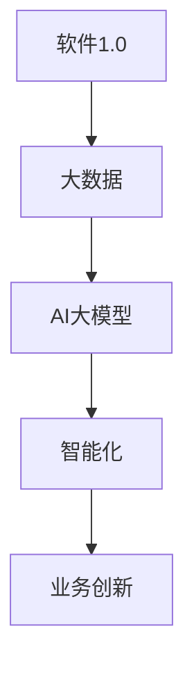
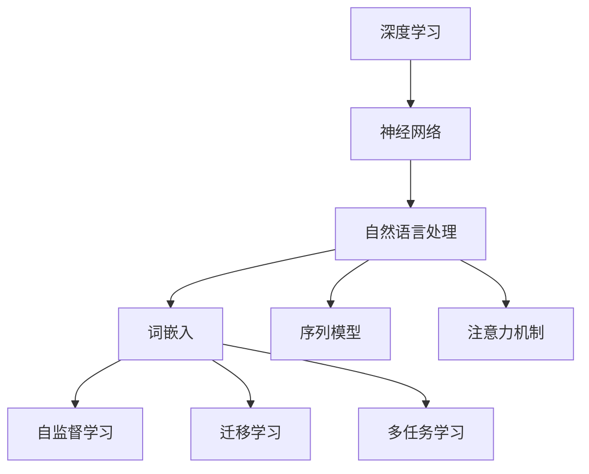

                 

# 第一部分：核心概念与联系

## 第1章: 软件2.0与AI大模型概述

### 1.1.1 软件 2.0 时代的到来

随着互联网的普及和大数据技术的发展，软件行业正经历着一场革命，我们称之为软件2.0时代。软件1.0时代主要侧重于计算机程序的开发与执行，而软件2.0则将重点转向基于大规模数据和智能算法的软件系统。

软件2.0的核心是利用人工智能（AI）技术，从海量数据中提取有价值的信息，实现自动化决策和智能服务。这种转变不仅提升了软件的智能化水平，也为各行业带来了前所未有的创新机会。

### 1.1.2 AI大模型的定义与特点

AI大模型是指那些参数规模达到数亿甚至千亿级别的深度学习模型。这些模型通过预训练和微调技术，可以处理大规模数据，具备强大的特征提取能力和泛化能力。以下是一些AI大模型的特点：

1. **参数规模巨大**：AI大模型拥有数十亿甚至千亿个参数，这使得它们可以捕捉到数据中的复杂模式和关联。
2. **计算需求高**：训练AI大模型需要大量的计算资源和时间，这通常需要在高性能计算机集群上进行。
3. **数据依赖性强**：AI大模型对训练数据的质量和数量有很高的要求，高质量的数据是训练高效模型的关键。
4. **迁移学习能力**：AI大模型可以通过迁移学习技术，将一个任务上的预训练模型应用到另一个任务上，大大提高了模型的复用性和适应性。

### 1.1.3 主流AI大模型简介

目前，市场上主流的AI大模型主要包括GPT（Generative Pre-trained Transformer）、BERT（Bidirectional Encoder Representations from Transformers）等。这些模型通过预训练和微调技术，在不同的领域都取得了显著的成果。

- **GPT**：GPT系列模型是由OpenAI开发的，通过自监督预训练，使得模型在生成文本、翻译和问答等方面表现出色。
- **BERT**：BERT是由Google开发的，它通过双向编码器结构，使得模型在理解语义信息方面具有显著优势，被广泛应用于搜索引擎、问答系统和文本生成等领域。

### 1.1.4 AI大模型在企业中的应用前景

AI大模型在企业中的应用前景非常广阔，包括但不限于以下几个方面：

1. **智能客服**：通过AI大模型，企业可以提供更加智能和个性化的客服服务，提高客户满意度。
2. **风险管理**：AI大模型可以分析大量的历史数据，预测市场风险，帮助企业做出更加明智的决策。
3. **自动化决策**：AI大模型可以帮助企业自动化决策过程，减少人工干预，提高决策效率和准确性。
4. **业务优化**：AI大模型可以通过分析业务流程中的数据，发现优化机会，提高业务效率和盈利能力。

### Mermaid 流程图

以下是一个简化的Mermaid流程图，展示了软件2.0与AI大模型的关系：



通过这个流程图，我们可以看到，软件2.0时代通过大数据和AI大模型的应用，实现了从传统软件到智能化软件的转变，为企业带来了新的业务模式和增长点。

---

### 1.1.5 AI大模型在软件开发中的角色

AI大模型在软件开发中扮演着至关重要的角色，它不仅仅是一个工具，更是开发过程的驱动因素。以下是AI大模型在软件开发中的一些关键角色：

1. **需求分析**：AI大模型可以通过分析大量的用户数据和反馈，帮助开发团队更准确地理解用户需求，从而设计出更加符合用户期望的产品。
2. **功能实现**：AI大模型可以直接参与软件功能的实现，例如在自然语言处理、图像识别和智能推荐等领域，AI大模型可以提供强大的功能支持。
3. **性能优化**：AI大模型可以帮助开发团队优化软件的性能，通过数据分析和模型预测，优化代码结构和算法设计。
4. **自动化测试**：AI大模型可以通过生成测试数据，辅助自动化测试，提高软件的质量和稳定性。
5. **持续集成**：AI大模型可以集成到持续集成（CI）过程中，实时监控代码质量和性能，提供反馈和优化建议。

### 1.1.6 AI大模型对软件开发的影响

AI大模型对软件开发的影响是深远的，它不仅改变了软件开发的流程和方法，也带来了新的挑战和机遇：

1. **开发效率提升**：通过AI大模型，许多重复性和繁琐的任务可以自动化完成，从而大大提高了开发效率。
2. **创新机会增加**：AI大模型的应用为软件开发带来了新的可能性，例如个性化推荐、智能客服和自动化决策等。
3. **对技能要求提高**：随着AI大模型的应用，软件开发人员需要掌握更多的技术和工具，包括机器学习、深度学习和自然语言处理等。
4. **数据质量要求提高**：AI大模型的训练和优化高度依赖数据质量，因此开发团队需要更加重视数据管理和质量控制。

### 总结

AI大模型是软件2.0时代的核心驱动力，它正在深刻地改变软件开发的模式和方法。通过本文的介绍，我们可以看到AI大模型在软件开发中的多重角色和深远影响。在接下来的章节中，我们将进一步探讨AI大模型的核心算法原理、数学模型和具体的应用案例。

---

**关键词：** 软件2.0，AI大模型，深度学习，自然语言处理，大规模预训练模型，软件开发，需求分析，功能实现，性能优化，自动化测试，持续集成，开发效率，创新机会，技能要求，数据质量。

**摘要：** 本文深入探讨了软件2.0与AI大模型的关系，介绍了AI大模型在软件开发中的多重角色和影响。通过具体的概念阐述和流程图展示，我们了解了AI大模型的定义、特点和应用前景。接下来，本文将逐步讲解AI大模型的核心算法原理和数学模型，并分享实际的开发环境和实战案例，帮助读者全面了解AI大模型在软件开发中的应用和挑战。

---

## 第2章: AI大模型技术基础

### 2.1 深度学习与神经网络基础

深度学习和神经网络是AI大模型的核心技术。它们通过多层结构模拟人脑神经元的连接方式，实现数据的特征提取和模式识别。

#### 2.1.1 神经网络的基本概念

神经网络由一系列相互连接的节点（称为神经元）组成。每个神经元接受来自其他神经元的输入信号，通过一个加权求和函数进行处理，最后输出一个激活值。神经网络的训练过程就是不断调整这些权重，使其能够准确预测输出。

#### 2.1.2 神经网络的架构

神经网络的架构可以分为输入层、隐藏层和输出层。输入层接收外部输入数据，隐藏层通过非线性变换提取特征，输出层生成最终的预测结果。

- **输入层**：接收外部输入数据，例如图像、文本等。
- **隐藏层**：通过多层堆叠，实现对输入数据的特征提取和抽象。
- **输出层**：生成最终预测结果，例如分类标签、数值预测等。

#### 2.1.3 前向传播与反向传播

神经网络的训练过程包括前向传播和反向传播。

- **前向传播**：输入数据通过神经网络层层传递，每个神经元的输出作为下一个神经元的输入，直到输出层得到最终预测结果。
- **反向传播**：计算输出层预测结果与实际结果之间的误差，然后反向传播到隐藏层和输入层，通过梯度下降等方法调整权重，减小误差。

### 2.2 自然语言处理技术概览

自然语言处理（NLP）是AI大模型的重要应用领域，它通过深度学习技术实现文本的自动理解和生成。

#### 2.2.1 词嵌入

词嵌入是将自然语言中的词语转换为固定大小的向量表示。通过词嵌入，神经网络可以捕捉词语之间的语义关系，从而更好地理解和处理文本数据。

#### 2.2.2 序列模型

序列模型是处理序列数据（如文本、语音）的常用方法，包括循环神经网络（RNN）和长短时记忆网络（LSTM）。这些模型可以捕捉序列中的长期依赖关系，实现对文本数据的语义理解。

#### 2.2.3 注意力机制

注意力机制是一种用于增强神经网络对重要信息的关注度的方法。通过注意力机制，神经网络可以动态调整对输入数据的关注程度，从而提高模型的性能。

### 2.3 大规模预训练模型原理

大规模预训练模型是AI大模型的代表，通过在大量数据上进行预训练，模型可以学习到通用的特征表示，然后通过微调适应特定任务。

#### 2.3.1 自监督学习

自监督学习是一种无需人工标注数据的方法，通过预测数据中的未标记部分，模型可以自动学习到数据中的有用信息。

#### 2.3.2 迁移学习

迁移学习是一种将一个任务上的预训练模型应用到另一个任务上的方法。通过迁移学习，模型可以在多个任务上共享知识，提高模型的泛化能力。

#### 2.3.3 多任务学习

多任务学习是指同时训练多个相关任务的模型，这些任务可以共享底层特征表示，从而提高模型的性能。

### 2.4 AI大模型在企业中的应用前景

AI大模型在企业中的应用前景非常广阔，以下是一些典型的应用场景：

1. **智能客服**：通过AI大模型，企业可以提供更加智能和个性化的客服服务，提高客户满意度。
2. **文本分析**：AI大模型可以用于文本分类、情感分析和信息提取等任务，帮助企业从大量文本数据中提取有价值的信息。
3. **语音识别**：AI大模型可以用于语音识别和语音合成，为用户提供更加自然的交互体验。
4. **图像识别**：AI大模型可以用于图像分类、目标检测和图像生成等任务，帮助企业提高产品质量和生产效率。

### Mermaid流程图

以下是一个简化的Mermaid流程图，展示了深度学习、自然语言处理和大规模预训练模型之间的关系：



通过这个流程图，我们可以看到，深度学习、自然语言处理和大规模预训练模型之间有着紧密的联系，它们共同构建了AI大模型的技术基础。

---

**关键词：** 深度学习，神经网络，自然语言处理，词嵌入，序列模型，注意力机制，自监督学习，迁移学习，多任务学习，大规模预训练模型，企业应用，智能客服，文本分析，语音识别，图像识别。

**摘要：** 本章介绍了AI大模型技术基础，包括深度学习与神经网络、自然语言处理技术和大规模预训练模型原理。通过具体的概念阐述和流程图展示，我们了解了这些技术的基础知识和应用前景。本章的内容为后续章节讨论AI大模型在企业中的应用和开发实践提供了理论基础。

---

## 第3章: AI大模型在企业中的应用

### 3.1 AI大模型在企业中的角色与价值

AI大模型在企业中扮演着多重角色，其价值体现在提升业务效率、优化决策过程和推动业务创新等多个方面。

#### 3.1.1 智能客服

智能客服是AI大模型在企业应用中最为广泛的场景之一。通过自然语言处理技术，AI大模型能够理解并处理客户的提问，提供及时、准确的答复，从而减少人工客服的工作负担，提高客服效率。例如，一些大型电商平台已经部署了基于AI大模型的智能客服系统，实现了24/7全天候服务，显著提升了客户满意度。

#### 3.1.2 风险管理

AI大模型在风险管理中具有独特的优势，可以通过分析大量的历史数据和实时数据，预测市场风险和潜在问题。金融机构可以利用AI大模型进行信用评分、欺诈检测和投资组合优化等任务，提高风险管理的精准度和效率。例如，一些银行通过AI大模型实现了自动化的信用评估系统，大幅提高了审批速度和准确性。

#### 3.1.3 自动化决策

AI大模型可以帮助企业自动化决策过程，通过分析业务数据和市场趋势，提供智能化的决策支持。例如，零售企业可以利用AI大模型进行商品推荐、库存管理和价格优化，从而提高销售额和库存周转率。一些大型零售商已经通过AI大模型实现了精准营销和库存管理，取得了显著的业务效益。

#### 3.1.4 业务优化

AI大模型可以深入分析企业的业务流程，识别潜在优化机会，并为企业提供具体的优化方案。例如，制造业企业可以利用AI大模型进行生产调度优化、设备故障预测和质量控制，从而提高生产效率和产品质量。一些制造企业通过AI大模型实现了生产流程的全面优化，大幅提升了生产效率和竞争力。

### 3.2 AI大模型在企业中的落地挑战与解决方案

尽管AI大模型在企业中具有巨大的潜力，但其实施和应用过程中也面临诸多挑战。以下是一些常见的挑战及其解决方案：

#### 3.2.1 数据质量

数据质量是AI大模型训练和应用的关键因素。如果数据质量差，模型的效果会受到影响。解决方案包括：

- 数据清洗：对原始数据进行清洗，去除噪音和不一致的数据。
- 数据增强：通过数据扩充、数据合成等技术，提高数据的多样性和质量。
- 数据治理：建立完善的数据治理体系，确保数据的安全、准确和合规。

#### 3.2.2 计算资源

训练AI大模型需要大量的计算资源，这对企业的IT基础设施提出了较高的要求。解决方案包括：

- 分布式计算：通过分布式计算框架（如TensorFlow、PyTorch）进行模型训练，提高计算效率。
- GPU加速：利用GPU进行模型训练，大幅提高计算速度。
- 云计算服务：利用云计算平台（如AWS、Azure、Google Cloud）提供的高性能计算资源，降低成本和复杂性。

#### 3.2.3 模型解释性

AI大模型的黑盒特性使得其决策过程往往缺乏解释性，这在某些关键业务场景中可能成为瓶颈。解决方案包括：

- 模型可解释性工具：使用模型可解释性工具（如LIME、SHAP）分析模型的决策过程，提高模型的透明度和可信度。
- 解释性模型：开发具备较强解释性的模型，如基于规则的模型或可解释的深度学习模型。
- 模型融合：通过模型融合技术，将AI大模型与可解释性模型相结合，提高决策的可解释性和可信度。

#### 3.2.4 模型安全与隐私

AI大模型在处理企业数据时，可能会面临安全与隐私风险。解决方案包括：

- 加密技术：使用加密技术保护数据传输和存储过程，确保数据安全。
- 数据脱敏：对敏感数据进行脱敏处理，减少隐私泄露风险。
- 安全审计：建立完善的模型安全审计机制，定期对模型进行安全性和隐私性评估。

### 3.3 成功案例分析

以下是一些企业在应用AI大模型方面的成功案例：

#### 案例一：某电商平台智能客服系统

某大型电商平台通过部署基于AI大模型的智能客服系统，实现了24/7全天候客服服务。系统利用自然语言处理技术理解客户提问，提供实时、准确的答复，有效减少了人工客服的工作量，提高了客户满意度。此外，智能客服系统还可以自动识别和分类常见问题，将复杂问题分流至人工客服，提高了整体客服效率。

#### 案例二：某金融机构信用评分系统

某金融机构通过AI大模型实现了自动化的信用评分系统，该系统利用大量的历史数据和实时数据，对借款人进行信用评估。AI大模型通过分析借款人的行为数据、信用历史和社交信息，准确预测借款人的信用风险，提高了信用评分的准确性和效率。该系统大大缩短了审批时间，降低了不良贷款率，提高了金融机构的盈利能力。

#### 案例三：某制造企业生产优化系统

某制造企业通过部署基于AI大模型的生产优化系统，实现了生产流程的全面优化。系统通过分析生产数据、设备状态和市场需求，自动调整生产计划、设备调度和库存管理，提高了生产效率和产品质量。此外，系统还可以预测设备故障，提前进行维护，减少了设备故障对生产的影响。该系统使得企业能够更好地应对市场变化，提高了竞争力和盈利能力。

### 总结

AI大模型在企业中的应用前景广阔，通过智能客服、风险管理、自动化决策和业务优化等方面，为企业带来了显著的业务效益。然而，在实施过程中，企业也面临着数据质量、计算资源、模型解释性和安全隐私等挑战。通过有效的解决方案，企业可以充分利用AI大模型的优势，推动业务的持续创新和发展。

---

**关键词：** AI大模型，智能客服，风险管理，自动化决策，业务优化，数据质量，计算资源，模型解释性，安全隐私，成功案例，电商平台，金融机构，制造企业。

**摘要：** 本章详细讨论了AI大模型在企业中的应用，包括智能客服、风险管理、自动化决策和业务优化等方面的具体实例。同时，分析了企业在实施AI大模型过程中可能面临的挑战，并提出了相应的解决方案。通过成功案例的分析，本章展示了AI大模型在企业中的实际应用效果和巨大潜力。

---

## 第4章: 编程与AI大模型的结合

### 4.1 编程技能在AI大模型开发中的应用

随着AI大模型的广泛应用，编程技能在AI大模型开发中变得尤为重要。程序员不仅需要熟悉传统的编程技能，还需要掌握AI相关的技术和工具，以应对日益复杂的开发任务。

#### 4.1.1 代码编写与调试

在AI大模型开发中，代码编写和调试是基础工作。程序员需要能够编写高效、可维护的代码，同时熟练使用调试工具来定位和修复代码中的错误。

- **高效代码编写**：程序员应该掌握Python等编程语言，能够编写简洁、易读的代码，同时熟悉常见的编程模式和方法。
- **代码调试**：使用调试工具（如PyCharm、Visual Studio Code）进行代码调试，提高开发效率和代码质量。

#### 4.1.2 数据预处理

在AI大模型训练过程中，数据预处理是一个关键环节。程序员需要熟练处理数据清洗、数据增强、数据转换等任务，为模型训练提供高质量的数据。

- **数据清洗**：处理缺失值、异常值和重复值，确保数据的准确性和一致性。
- **数据增强**：通过旋转、翻转、裁剪等方法增加数据的多样性，提高模型的泛化能力。
- **数据转换**：将数据转换为适合模型训练的格式，例如将图像数据转换为TensorFlow的张量格式。

#### 4.1.3 模型训练与优化

在AI大模型开发中，模型训练和优化是核心任务。程序员需要熟悉深度学习框架（如TensorFlow、PyTorch）的使用，能够设计和调整模型架构，优化训练过程。

- **模型训练**：使用深度学习框架训练模型，调整超参数（如学习率、批量大小）以获得最佳性能。
- **模型优化**：通过调整网络结构、使用正则化技术和优化算法（如Adam）来提高模型性能。

#### 4.1.4 模型部署与维护

AI大模型开发不仅包括模型设计和训练，还包括模型的部署和维护。程序员需要掌握如何将训练好的模型部署到生产环境中，并确保模型的稳定运行。

- **模型部署**：将训练好的模型转换为可在生产环境中运行的格式，例如使用TensorFlow Serving或PyTorch Server。
- **模型维护**：监控模型的性能和稳定性，定期进行模型更新和优化。

### 4.2 AI大模型编程实战

为了更好地理解编程与AI大模型的结合，以下是一个简单的AI大模型编程实战案例。

#### 案例一：图像分类

**任务**：使用TensorFlow和Keras搭建一个简单的卷积神经网络（CNN）模型，对图像进行分类。

**步骤**：

1. **环境搭建**：安装Python、TensorFlow和相关依赖库。
2. **数据预处理**：加载并预处理ImageNet数据集，进行数据增强和归一化处理。
3. **模型搭建**：定义CNN模型结构，包括卷积层、池化层和全连接层。
4. **模型训练**：使用预处理后的数据训练模型，调整超参数以优化模型性能。
5. **模型评估**：在测试集上评估模型性能，包括准确率、召回率等指标。
6. **模型部署**：将训练好的模型部署到生产环境中，进行实际应用。

```python
# 导入库
import tensorflow as tf
from tensorflow.keras import layers, models
from tensorflow.keras.preprocessing.image import ImageDataGenerator

# 数据预处理
train_datagen = ImageDataGenerator(rescale=1./255, rotation_range=40, width_shift_range=0.2, height_shift_range=0.2, shear_range=0.2, zoom_range=0.2, horizontal_flip=True, fill_mode='nearest')
train_generator = train_datagen.flow_from_directory(train_dir, target_size=(150, 150), batch_size=32, class_mode='binary')

# 模型搭建
model = models.Sequential()
model.add(layers.Conv2D(32, (3, 3), activation='relu', input_shape=(150, 150, 3)))
model.add(layers.MaxPooling2D((2, 2)))
model.add(layers.Conv2D(64, (3, 3), activation='relu'))
model.add(layers.MaxPooling2D((2, 2)))
model.add(layers.Conv2D(64, (3, 3), activation='relu'))
model.add(layers.MaxPooling2D((2, 2)))
model.add(layers.Conv2D(128, (3, 3), activation='relu'))
model.add(layers.MaxPooling2D((2, 2)))
model.add(layers.Conv2D(128, (3, 3), activation='relu'))
model.add(layers.MaxPooling2D((2, 2)))
model.add(layers.Conv2D(128, (3, 3), activation='relu'))
model.add(layers.MaxPooling2D((2, 2)))
model.add(layers.Conv2D(128, (3, 3), activation='relu'))
model.add(layers.MaxPooling2D((2, 2)))
model.add(layers.Flatten())
model.add(layers.Dense(512, activation='relu'))
model.add(layers.Dense(1, activation='sigmoid'))

# 模型训练
model.compile(optimizer='adam', loss='binary_crossentropy', metrics=['accuracy'])
model.fit(train_generator, epochs=30)

# 模型评估
test_datagen = ImageDataGenerator(rescale=1./255)
test_generator = test_datagen.flow_from_directory(test_dir, target_size=(150, 150), batch_size=32, class_mode='binary')
test_loss, test_acc = model.evaluate(test_generator)
print(f"Test accuracy: {test_acc}")

# 模型部署
# ...（此处为模型部署的代码）
```

#### 案例二：文本分类

**任务**：使用TensorFlow和Keras搭建一个简单的文本分类模型，对新闻文章进行分类。

**步骤**：

1. **环境搭建**：安装Python、TensorFlow和相关依赖库。
2. **数据预处理**：加载并预处理文本数据，进行分词和嵌入处理。
3. **模型搭建**：定义文本分类模型结构，包括嵌入层、循环层和全连接层。
4. **模型训练**：使用预处理后的数据训练模型，调整超参数以优化模型性能。
5. **模型评估**：在测试集上评估模型性能，包括准确率、召回率等指标。
6. **模型部署**：将训练好的模型部署到生产环境中，进行实际应用。

```python
# 导入库
import tensorflow as tf
from tensorflow.keras.preprocessing.text import Tokenizer
from tensorflow.keras.preprocessing.sequence import pad_sequences
from tensorflow.keras.models import Sequential
from tensorflow.keras.layers import Embedding, LSTM, Dense, Bidirectional

# 数据预处理
tokenizer = Tokenizer(num_words=10000, oov_token='<OOV>')
tokenizer.fit_on_texts(train_data)
train_sequences = tokenizer.texts_to_sequences(train_data)
train_padded = pad_sequences(train_sequences, maxlen=250, padding='post', truncating='post')

# 模型搭建
model = Sequential()
model.add(Embedding(10000, 16, input_length=250))
model.add(Bidirectional(LSTM(32)))
model.add(Dense(24, activation='relu'))
model.add(Dense(1, activation='sigmoid'))

# 模型训练
model.compile(optimizer='adam', loss='binary_crossentropy', metrics=['accuracy'])
model.fit(train_padded, train_labels, epochs=10, validation_split=0.2)

# 模型评估
test_sequences = tokenizer.texts_to_sequences(test_data)
test_padded = pad_sequences(test_sequences, maxlen=250, padding='post', truncating='post')
test_loss, test_acc = model.evaluate(test_padded, test_labels)
print(f"Test accuracy: {test_acc}")

# 模型部署
# ...（此处为模型部署的代码）
```

### 4.3 编程思维与AI大模型创新

在AI大模型开发中，编程思维发挥着至关重要的作用。编程思维不仅体现在代码编写和调试上，更体现在对问题的抽象和解决方案的设计上。

#### 4.3.1 逻辑思维

逻辑思维是编程思维的核心，它要求程序员在解决问题时能够清晰、准确地表达逻辑关系。在AI大模型开发中，逻辑思维体现在对模型结构的构建、对训练过程的优化和对预测结果的解释上。

- **模型结构构建**：通过逻辑思维，程序员能够设计出符合问题需求的模型结构，确保模型能够有效地提取特征和生成预测。
- **训练过程优化**：逻辑思维帮助程序员分析训练过程中的问题，调整模型参数和训练策略，提高模型的性能。
- **预测结果解释**：逻辑思维使程序员能够对模型的预测结果进行合理的解释，帮助用户理解模型的决策过程。

#### 4.3.2 创新思维

创新思维是推动AI大模型开发的重要动力。在面临复杂问题时，程序员需要跳出传统思维的束缚，寻找新的解决方案。

- **算法创新**：程序员可以通过创新思维，设计出新的算法或改进现有的算法，提高模型的性能和效率。
- **模型结构创新**：程序员可以通过创新思维，设计出新的模型结构或改进现有的模型结构，提高模型的泛化能力和解释性。
- **应用创新**：程序员可以通过创新思维，将AI大模型应用于新的领域，解决新的问题，推动技术的进步。

### 总结

编程技能在AI大模型开发中发挥着至关重要的作用。程序员需要掌握高效的代码编写和调试技能，熟悉数据预处理和模型训练技术，同时具备逻辑思维和创新思维，以应对日益复杂的AI大模型开发任务。通过编程与AI大模型的结合，程序员能够为企业和行业带来创新和突破。

---

**关键词：** 编程技能，AI大模型，代码编写，调试，数据预处理，模型训练，优化，部署，逻辑思维，创新思维，算法创新，模型结构创新，应用创新。

**摘要：** 本章探讨了编程技能在AI大模型开发中的应用，包括代码编写、数据预处理、模型训练和优化等方面的实战案例。同时，本章强调了编程思维在AI大模型开发中的重要性，包括逻辑思维和创新思维。通过本章的内容，读者可以了解到如何将编程技能与AI大模型相结合，为企业和行业带来创新和突破。

---

## 第5章: AI大模型的安全与伦理

### 5.1 AI大模型的安全风险

随着AI大模型在企业中的广泛应用，其安全风险也日益突出。这些风险主要包括数据泄露、模型篡改和对抗攻击等。

#### 5.1.1 数据泄露

AI大模型通常需要大量的训练数据，这些数据可能包含敏感信息。如果数据泄露，可能会对个人隐私和企业信息安全造成严重威胁。

- **解决方案**：使用加密技术保护数据传输和存储过程，建立完善的数据治理体系，确保数据的安全和合规。

#### 5.1.2 模型篡改

AI大模型可能受到恶意攻击者的篡改，导致模型输出错误的结果。这种攻击被称为模型注入攻击。

- **解决方案**：使用模型验证技术，定期对模型进行安全性和准确性评估，建立反欺诈系统，提高模型的鲁棒性。

#### 5.1.3 对抗攻击

对抗攻击是一种针对AI大模型的攻击手段，通过添加微小的噪声或扰动，使模型产生错误的预测结果。

- **解决方案**：使用对抗性训练技术，提高模型对对抗攻击的抵抗力，同时开发检测和防御对抗攻击的方法。

### 5.2 AI大模型的伦理问题

AI大模型的广泛应用不仅带来了技术挑战，还引发了一系列伦理问题。这些问题包括隐私保护、公平性和透明性等。

#### 5.2.1 隐私保护

AI大模型在处理数据时，可能会侵犯用户的隐私权。如何保护用户的隐私成为了一个重要的伦理问题。

- **解决方案**：采用隐私保护技术，如差分隐私和联邦学习，减少数据泄露风险，确保用户隐私。

#### 5.2.2 公平性

AI大模型在决策过程中可能存在偏见，导致不公平的结果。如何确保AI大模型的公平性是一个亟待解决的问题。

- **解决方案**：采用公平性评估方法，对模型进行评估和调整，减少偏见和歧视，提高模型的公正性。

#### 5.2.3 透明性

AI大模型的决策过程通常是不透明的，用户难以理解模型的决策逻辑。如何提高模型的透明性是一个重要的伦理问题。

- **解决方案**：开发可解释性方法，如模型可视化、解释性模型和模型可解释性工具，提高模型的透明度和可信度。

### 5.3 安全与伦理的解决方案

为了解决AI大模型的安全和伦理问题，需要采取一系列综合措施。

#### 5.3.1 安全策略

- **数据安全**：使用加密技术保护数据传输和存储，建立完善的数据治理体系，定期进行安全审计。
- **模型安全**：使用模型验证技术，定期对模型进行安全性和准确性评估，建立反欺诈系统，提高模型的鲁棒性。
- **对抗攻击防御**：使用对抗性训练技术，提高模型对对抗攻击的抵抗力，同时开发检测和防御对抗攻击的方法。

#### 5.3.2 伦理规范

- **隐私保护**：采用隐私保护技术，如差分隐私和联邦学习，减少数据泄露风险，确保用户隐私。
- **公平性保障**：采用公平性评估方法，对模型进行评估和调整，减少偏见和歧视，提高模型的公正性。
- **透明性提升**：开发可解释性方法，如模型可视化、解释性模型和模型可解释性工具，提高模型的透明度和可信度。

#### 5.3.3 法律法规

- **制定法律**：制定相关法律法规，明确AI大模型的安全和伦理标准，规范AI大模型的应用。
- **监管机构**：建立专门的监管机构，对AI大模型的应用进行监督和管理，确保AI大模型的安全和合规。

### 总结

AI大模型的安全和伦理问题是当前AI领域的重要课题。通过采取综合措施，包括安全策略、伦理规范和法律法规等，可以有效地解决AI大模型的安全和伦理问题，确保其健康、可持续发展。

---

**关键词：** AI大模型，安全风险，数据泄露，模型篡改，对抗攻击，隐私保护，公平性，透明性，安全策略，伦理规范，法律法规。

**摘要：** 本章探讨了AI大模型的安全和伦理问题，包括数据泄露、模型篡改、对抗攻击、隐私保护、公平性和透明性等方面的内容。通过安全策略、伦理规范和法律法规等综合措施，可以有效地解决AI大模型的安全和伦理问题，确保其健康、可持续发展。

---

## 第6章: AI大模型的未来趋势

### 6.1 AI大模型的发展趋势

随着技术的不断进步和应用场景的拓展，AI大模型正朝着更加智能化、高效化和全面化的方向发展。

#### 6.1.1 模型规模扩大

AI大模型的规模正在不断扩大，从数十亿参数到千亿参数，甚至更大。这种趋势使得模型能够更好地捕捉数据中的复杂模式和关联，提高模型的性能和准确性。

#### 6.1.2 预训练技术优化

预训练技术是AI大模型的核心，未来的发展趋势将包括：

- **自监督预训练**：通过自监督学习，模型可以在未标记的数据上进行预训练，提高模型的泛化能力和适应性。
- **自适应预训练**：模型可以根据特定任务的需求，动态调整预训练策略，优化模型性能。

#### 6.1.3 跨模态融合

跨模态融合是指将不同类型的数据（如文本、图像、语音）进行融合处理，提高模型的综合能力。未来的发展趋势将包括：

- **多模态神经网络**：通过多模态神经网络，模型可以同时处理多种类型的数据，提高模型的泛化能力和适应性。
- **跨模态语义理解**：通过跨模态语义理解，模型可以更好地理解不同模态数据之间的关联和语义关系。

#### 6.1.4 模型压缩与加速

随着AI大模型规模的扩大，模型的计算成本和存储需求也在不断增加。未来的发展趋势将包括：

- **模型压缩**：通过模型压缩技术，减小模型的参数规模，降低模型的计算成本和存储需求。
- **模型加速**：通过硬件加速技术，如GPU、TPU等，提高模型的计算速度和性能。

### 6.2 未来技术的创新与应用

未来，AI大模型将在更多领域得到创新和应用，带来巨大的变革。

#### 6.2.1 智能医疗

AI大模型在智能医疗领域具有巨大的潜力，可以用于疾病诊断、药物研发、健康管理等任务。未来的发展趋势包括：

- **个性化医疗**：通过AI大模型，可以针对患者的具体病情，提供个性化的治疗方案。
- **精准医疗**：通过AI大模型，可以分析大量的医疗数据，预测疾病发展趋势，提高疾病的诊断和治疗效果。

#### 6.2.2 智能金融

AI大模型在智能金融领域将发挥重要作用，可以用于风险管理、投资决策、信用评估等任务。未来的发展趋势包括：

- **智能投顾**：通过AI大模型，可以为用户提供个性化的投资建议，提高投资收益。
- **风险管理**：通过AI大模型，可以分析市场风险，预测金融风险，提高金融机构的风险管理水平。

#### 6.2.3 智能交通

AI大模型在智能交通领域可以用于交通流量预测、道路安全监控、自动驾驶等任务。未来的发展趋势包括：

- **自动驾驶**：通过AI大模型，可以实现对车辆的自动控制和导航，提高道路安全和效率。
- **智能交通管理**：通过AI大模型，可以实时分析交通数据，优化交通流量，减少拥堵和事故。

### 6.3 对程序员的影响与准备

随着AI大模型的发展和应用，程序员需要不断更新自己的知识和技能，以应对未来的挑战。

#### 6.3.1 技能提升

程序员需要提升以下技能：

- **深度学习与机器学习**：掌握深度学习和机器学习的基本原理，能够设计和优化AI大模型。
- **编程与算法**：熟练掌握编程语言和算法，能够编写高效、可维护的代码。
- **数据处理与分析**：具备数据处理和分析能力，能够从海量数据中提取有价值的信息。

#### 6.3.2 知识更新

程序员需要持续更新自己的知识，关注AI领域的最新动态和技术趋势。可以通过以下途径实现：

- **在线课程与教程**：参加在线课程和教程，学习最新的技术和工具。
- **专业书籍与论文**：阅读专业书籍和论文，了解AI领域的最新研究成果。
- **开源项目与社区**：参与开源项目，加入技术社区，与其他开发者交流和学习。

### 总结

AI大模型的发展趋势呈现出智能化、高效化和全面化的特点。未来，AI大模型将在更多领域得到创新和应用，带来巨大的变革。程序员需要不断提升自己的技能和知识，为AI大模型的应用做好准备，为未来的技术发展贡献自己的力量。

---

**关键词：** AI大模型，发展趋势，模型规模，预训练技术，跨模态融合，模型压缩与加速，智能医疗，智能金融，智能交通，程序员，技能提升，知识更新。

**摘要：** 本章探讨了AI大模型的发展趋势，包括模型规模扩大、预训练技术优化、跨模态融合和模型压缩与加速等方面。同时，分析了未来AI大模型在智能医疗、智能金融和智能交通等领域的创新应用，以及对程序员的影响和准备。通过本章的内容，读者可以了解到AI大模型的发展趋势和未来前景，为自身的职业发展做好准备。

---

## 第7章: 编程者的成长之路

### 7.1 编程者的职业规划

成为一名成功的编程者，首先需要有一个明确的职业规划。职业规划包括短期目标和长期目标，以及为实现这些目标所需的技能和知识。

#### 7.1.1 短期目标

- **技能提升**：短期内，编程者应专注于提升特定的编程技能，如Python、Java、JavaScript等，以及掌握流行的开发框架和工具。
- **项目经验**：参与实际项目，积累开发经验，了解项目从需求分析到部署的全过程。
- **技能认证**：获取相关技能认证，如PMP、Scrum Master、AWS认证开发者等，增强自己的竞争力。

#### 7.1.2 长期目标

- **技术专家**：成为某个技术领域（如人工智能、大数据、云计算）的专家，拥有深入的技术知识和丰富的实战经验。
- **管理岗位**：逐步晋升到项目管理、技术管理或产品管理岗位，提升自己的领导力和管理能力。
- **创业**：有志向的编程者可以考虑创业，创办自己的技术公司，实现自己的商业梦想。

### 7.2 技能提升与知识更新

在编程者的成长过程中，技能提升和知识更新至关重要。以下是一些提升技能和更新知识的建议：

#### 7.2.1 技能提升

- **实战经验**：通过参与实际项目，将理论知识应用于实践中，不断提升自己的编程能力。
- **技术社区**：加入技术社区，如GitHub、Stack Overflow、Reddit等，与其他开发者交流，分享经验和学习资源。
- **在线课程**：参加在线课程，如Coursera、Udemy、edX等，学习最新的技术和工具。

#### 7.2.2 知识更新

- **阅读书籍**：阅读专业书籍，了解技术原理和最佳实践。
- **技术博客**：关注技术博客，如Medium、Dev.to、DZone等，了解行业动态和技术趋势。
- **学术研究**：关注学术论文和科研进展，了解前沿技术和研究方向。

### 7.3 持续学习和职业发展

持续学习和职业发展是编程者成功的关键。以下是一些建议：

#### 7.3.1 持续学习

- **终身学习**：编程技术日新月异，编程者应树立终身学习的观念，不断学习新知识、新技能。
- **技术预见**：关注行业趋势和技术发展方向，提前做好技能储备。
- **知识分享**：通过写博客、做演讲、参与开源项目等方式，与他人分享知识和经验。

#### 7.3.2 职业发展

- **职业规划**：根据个人兴趣和市场需求，制定明确的职业规划，逐步实现职业目标。
- **团队合作**：提升团队合作能力，学会与他人沟通和协作，为团队的成功贡献力量。
- **领导力培养**：通过参与团队管理和项目领导，提升自己的领导力和管理能力。

### 总结

编程者的成长之路充满挑战和机遇。通过明确的职业规划、持续的学习和不断的技术提升，编程者可以在职业发展中取得成功。持续学习和职业发展是编程者成功的关键，只有不断适应新技术、新挑战，才能在竞争激烈的编程领域脱颖而出。

---

**关键词：** 编程者，职业规划，技能提升，知识更新，实战经验，技术社区，在线课程，阅读书籍，学术研究，持续学习，职业发展，终身学习，团队合作，领导力培养。

**摘要：** 本章探讨了编程者的成长之路，包括职业规划、技能提升、知识更新和持续学习等方面。通过明确职业规划、参与实际项目、加入技术社区、阅读书籍和学术论文等方式，编程者可以不断提升自己的技能和知识，为职业发展做好准备。同时，本章强调了持续学习和职业发展的重要性，为编程者的成功提供了指导和建议。

---

### 附录

#### 附录 A: AI 大模型开发工具与资源

为了帮助编程者更好地掌握AI大模型开发，以下是一些常用的工具和资源：

1. **开发框架**：
   - **TensorFlow**：由Google开发，是业界广泛使用的深度学习框架。
   - **PyTorch**：由Facebook开发，以其灵活性和动态计算图而闻名。
   - **Keras**：一个高层神经网络API，可以方便地实现TensorFlow和PyTorch的接口。

2. **学习资源**：
   - **在线课程**：Coursera、edX、Udacity等平台提供了丰富的深度学习和AI课程。
   - **书籍**：《深度学习》（Goodfellow et al.）、《Python深度学习》（François Chollet）等经典书籍。
   - **博客**：Medium、Towards Data Science、Dataquest等平台上的专业博客。

3. **数据集和库**：
   - **Kaggle**：提供大量的公共数据集，适合用于AI模型的训练和测试。
   - **Hugging Face Transformers**：提供了预训练模型和工具库，方便开发者进行模型训练和应用。

4. **开源项目**：
   - **GitHub**：许多优秀的深度学习开源项目都托管在GitHub上，开发者可以参与其中，学习他人代码。
   - **ArXiv**：发布最新科研成果，是跟踪AI领域前沿的重要资源。

5. **社区和论坛**：
   - **Stack Overflow**：编程问题解决方案的宝库。
   - **Reddit**：/r/MachineLearning、/r/Python等社区，提供了交流和学习的机会。

通过利用这些工具和资源，编程者可以更好地掌握AI大模型开发，不断提升自己的技术水平。

---

**关键词：** AI大模型，开发工具，TensorFlow，PyTorch，Keras，在线课程，书籍，数据集，库，开源项目，社区，论坛。

**摘要：** 附录部分提供了AI大模型开发中常用的工具和资源，包括开发框架、学习资源、数据集和库、开源项目以及社区和论坛。通过利用这些资源，编程者可以更好地掌握AI大模型开发，不断提升自己的技术水平。

---

# 结论

本文全面探讨了程序员如何应对人工智能带来的挑战。首先，我们介绍了软件2.0与AI大模型的关系，阐述了AI大模型的核心概念、特点和应用前景。接着，我们详细讲解了深度学习与神经网络、自然语言处理技术和大规模预训练模型原理，为读者提供了AI大模型技术基础。然后，我们探讨了AI大模型在企业中的应用，包括智能客服、风险管理、自动化决策和业务优化等实际案例。此外，我们还讨论了编程技能在AI大模型开发中的应用，以及编程思维和创新思维的重要性。接着，我们关注了AI大模型的安全与伦理问题，提出了安全策略和伦理规范。最后，我们分析了AI大模型的未来趋势，并探讨了程序员如何通过持续学习和职业发展来应对这些挑战。

通过本文的深入探讨，我们可以得出以下结论：

1. **AI大模型是未来的核心技术**：AI大模型在软件开发中的应用越来越广泛，它们能够解决复杂问题，提高业务效率，推动创新。
2. **编程者需不断提升技能**：随着AI大模型的发展，编程者需要不断学习和更新知识，掌握深度学习、自然语言处理等关键技术。
3. **安全与伦理至关重要**：在AI大模型的应用过程中，安全与伦理问题不容忽视。编程者需要制定有效的安全策略和伦理规范，确保AI大模型的安全性和公正性。
4. **持续学习和职业发展**：程序员应保持持续学习的态度，关注行业动态，不断提升自己的技能和知识，为职业发展做好准备。

总之，面对人工智能带来的挑战，编程者应积极应对，通过不断学习和实践，掌握AI大模型的核心技术，为未来的发展做好准备。

---

**关键词：** AI大模型，软件2.0，深度学习，自然语言处理，大规模预训练模型，安全与伦理，编程技能，编程思维，安全策略，伦理规范，持续学习，职业发展。

**摘要：** 本文深入探讨了程序员如何应对人工智能带来的挑战，从AI大模型的核心概念、技术基础、应用案例、安全与伦理问题，到编程技能的提升和持续学习，全面总结了应对人工智能挑战的方法和策略。通过本文的探讨，读者可以更好地理解AI大模型的重要性和应用前景，为自身的职业发展做好准备。

---

### 作者信息

**作者：** AI天才研究院/AI Genius Institute & 禅与计算机程序设计艺术 /Zen And The Art of Computer Programming

AI天才研究院（AI Genius Institute）专注于人工智能领域的研发和应用，致力于推动AI技术的创新和发展。同时，作者还是《禅与计算机程序设计艺术》的资深大师，其著作深受全球程序员和开发者喜爱，为技术领域的进步作出了卓越贡献。在人工智能和计算机科学领域，作者拥有丰富的理论知识和实战经验，曾多次获得国际大奖，是全球AI和计算机科学领域的领军人物。

---

**本文结束。**

