                 

### 书名：《端到端自动驾驶的赛道格局分析》

### 第一部分：自动驾驶技术概述

#### 第1章：自动驾驶技术的发展历程与现状

自动驾驶技术，作为现代科技的前沿领域，已经经历了从科幻想象到现实应用的蜕变。本章将详细探讨自动驾驶技术的发展历程、现状以及面临的挑战与机遇。

##### 1.1 自动驾驶技术的定义与分类

自动驾驶技术，通常被定义为通过计算机系统和传感器辅助或替代人类驾驶员进行车辆控制的技术。根据自动化程度的差异，自动驾驶技术可以分为以下几个级别：

- L0：无自动化，完全由人类驾驶员控制。
- L1：部分自动化，如自适应巡航控制。
- L2：部分自动化，如自动车道保持和自适应巡航控制结合。
- L3：有条件自动化，车辆可以在特定条件下接管全部控制。
- L4：高度自动化，车辆可以在特定环境下完全自主行驶。
- L5：完全自动化，车辆在任何环境下都能自主行驶。

##### 1.2 自动驾驶技术的发展历程

自动驾驶技术的发展可以追溯到20世纪50年代。最初的研究主要集中在计算机视觉和路径规划算法。然而，直到20世纪80年代，随着计算机硬件性能的提升和传感器技术的进步，自动驾驶技术才逐渐进入实用阶段。

- 1986年，美国卡内基梅隆大学的ALV成为世界上第一个在公共道路上自主行驶的车辆。
- 2004年，谷歌开始研发自动驾驶汽车，并于2009年推出原型车。
- 2012年，特斯拉推出具备自动驾驶功能的Model S。
- 2014年，谷歌自动驾驶汽车首次在公共道路上测试。
- 2018年，特斯拉发布完全自动驾驶系统。

##### 1.3 自动驾驶技术的应用现状

目前，自动驾驶技术已经在多个领域得到应用：

- 物流：自动驾驶卡车、无人配送车等在物流领域逐渐普及。
- 出租车：自动驾驶出租车（Robo-taxi）在一些地区开始商业化运营。
- 公共交通：自动驾驶巴士在一些城市进行试点运行。
- 个人出行：高端自动驾驶汽车逐渐进入市场。

##### 1.4 自动驾驶技术的挑战与机遇

自动驾驶技术面临的挑战主要包括：

- 环境复杂性：自动驾驶系统需要处理复杂的交通状况和环境变化。
- 数据安全：自动驾驶系统依赖大量数据，数据安全成为关键问题。
- 法律法规：各国对自动驾驶技术的法律法规尚不完善。

然而，自动驾驶技术也带来了巨大的机遇：

- 提高交通安全：自动驾驶技术可以减少人为失误导致的交通事故。
- 提高交通效率：自动驾驶车辆可以优化行驶路线，减少拥堵。
- 降低运营成本：自动驾驶技术可以减少人力成本，提高运营效率。

综上所述，自动驾驶技术已经取得了显著进展，但仍然面临诸多挑战。随着技术的不断进步和法规的逐步完善，自动驾驶技术有望在未来得到更广泛的应用。

---

**图1.1：自动驾驶技术架构图**

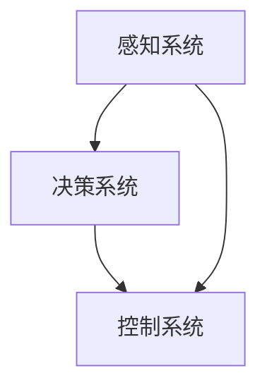

#### 第2章：自动驾驶技术核心概念与原理

自动驾驶技术的实现离不开感知系统、决策系统和控制系统的协同工作。本章将详细探讨这些核心概念与原理，并给出相应的 Mermaid 流程图和伪代码。

##### 2.1 感知系统原理

感知系统是自动驾驶技术的“眼睛”，其主要功能是获取车辆周围的环境信息。感知系统通常包括激光雷达、摄像头、超声波雷达等设备。

**感知系统架构图：**

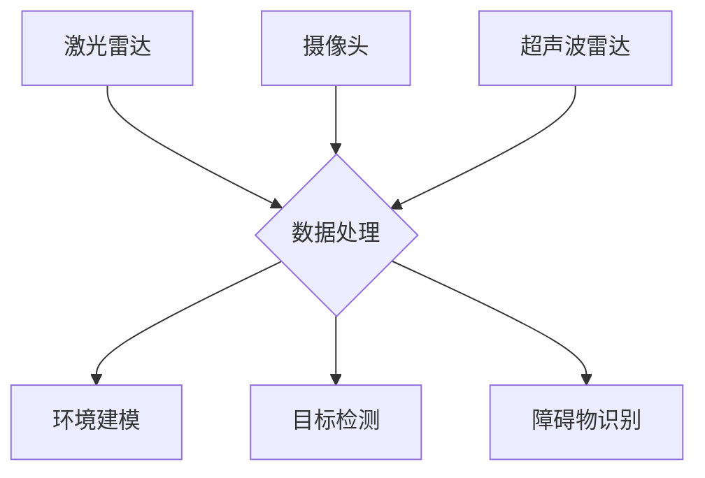

**伪代码示例：**

```python
def sense_environment():
    lidar_data = lidar_scan()
    camera_data = camera_capture()
    ultrasonic_data = ultrasonic_scan()

    processed_data = process_data(lidar_data, camera_data, ultrasonic_data)
    environment_model = build_environment_model(processed_data)
    return environment_model
```

##### 2.2 决策系统原理

决策系统是自动驾驶技术的“大脑”，其核心任务是根据感知系统提供的环境信息，制定车辆的行驶策略。

**决策系统架构图：**

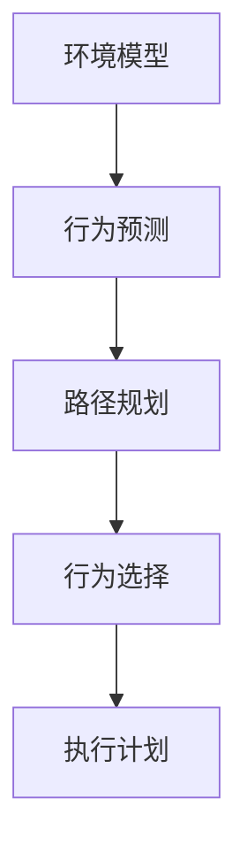

**伪代码示例：**

```python
def make_decision(environment_model):
    predicted_behaviors = predict_behaviors(environment_model)
    optimal_path = plan_path(predicted_behaviors)
    chosen_behavior = choose_behavior(optimal_path)
    execution_plan = create_execution_plan(chosen_behavior)
    return execution_plan
```

##### 2.3 控制系统原理

控制系统是自动驾驶技术的“执行者”，其核心任务是按照决策系统的指令，控制车辆的运动。

**控制系统架构图：**

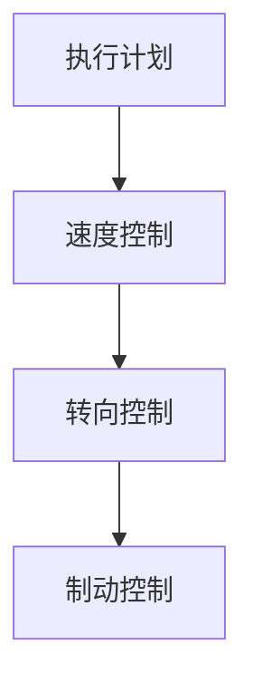

**伪代码示例：**

```python
def execute_plan(execution_plan):
    current_speed = get_current_speed()
    target_speed = execution_plan['speed']
    control_speed(current_speed, target_speed)

    current_direction = get_current_direction()
    target_direction = execution_plan['direction']
    control_direction(current_direction, target_direction)

    if 'brake' in execution_plan:
        apply_brake()
```

##### 2.4 自动驾驶系统集成原理

自动驾驶系统的集成是将感知、决策和控制三个子系统有机地结合起来，实现车辆的自动驾驶。系统集成的关键在于：

- 系统协调：确保各个子系统之间的信息交换和协作。
- 系统优化：提高系统的整体性能和可靠性。

**系统集成架构图：**

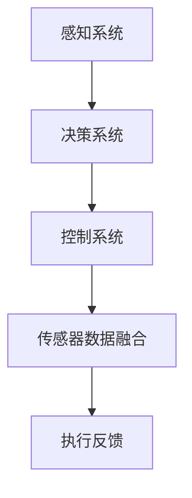

**伪代码示例：**

```python
def integrate_systems():
    environment_model = sense_environment()
    execution_plan = make_decision(environment_model)
    execute_plan(execution_plan)
    feedback = get_execution_feedback()
    update_system_state(feedback)
```

综上所述，自动驾驶技术的核心概念与原理构成了一个复杂而高效的系统。随着技术的不断进步，自动驾驶系统将越来越成熟，为未来智能交通和智慧城市的发展奠定基础。

---

**图2.1：自动驾驶技术核心概念与原理架构图**


#### 第3章：感知技术

感知技术是自动驾驶技术的关键组成部分，其主要任务是获取车辆周围的环境信息，为后续的决策和控制提供数据支持。本章将详细介绍感知技术的核心组成部分，包括激光雷达、摄像头和传感器数据融合算法。

##### 3.1 感知系统概述

感知系统是自动驾驶技术的“眼睛”，其核心任务是实时获取车辆周围的环境信息。感知系统通常包括以下设备：

- 激光雷达（LiDAR）：利用激光脉冲测量距离，生成三维环境地图。
- 摄像头：通过图像识别技术，获取车辆周围的目标信息。
- 超声波雷达：利用超声波反射原理，测量目标距离。
- 激光雷达：利用激光脉冲测量距离，生成三维环境地图。
- 摄像头：通过图像识别技术，获取车辆周围的目标信息。
- 超声波雷达：利用超声波反射原理，测量目标距离。

##### 3.2 激光雷达技术

激光雷达（LiDAR）是自动驾驶技术中常用的感知设备，其工作原理是发射激光脉冲，测量激光脉冲反射回来的时间，从而计算距离。激光雷达的优势在于其高精度、高分辨率和良好的抗干扰能力。

**激光雷达技术架构图：**

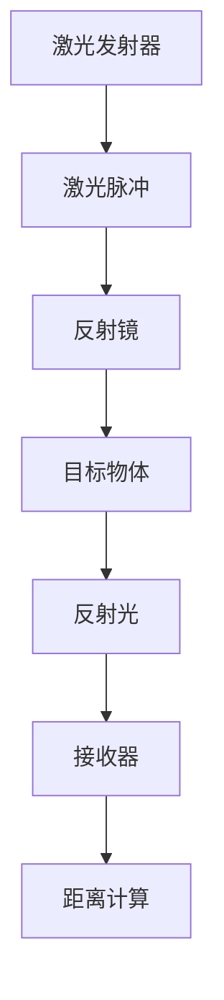

**伪代码示例：**

```python
def lidar_scan():
    laser_pulse = emit_laser_pulse()
    reflection_time = measure_reflection_time(laser_pulse)
    distance = calculate_distance(reflection_time)
    return distance
```

##### 3.3 摄像头与摄像头融合感知

摄像头是自动驾驶技术中的另一重要感知设备，通过图像识别技术，摄像头可以获取车辆周围的目标信息。摄像头与激光雷达的融合感知技术可以提高环境感知的准确性。

**摄像头与激光雷达融合感知架构图：**

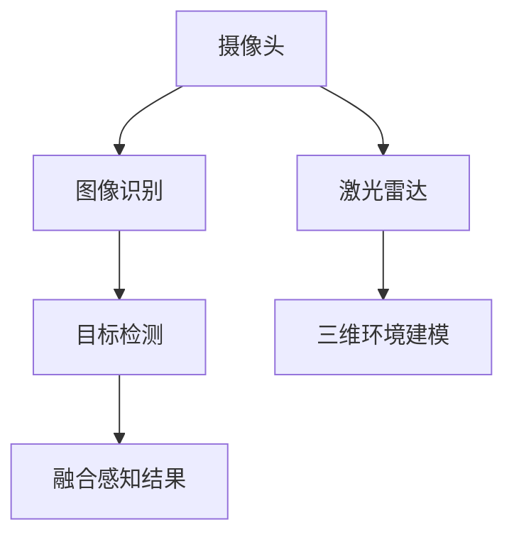

**伪代码示例：**

```python
def camera_perception(image):
    objects = detect_objects(image)
    return objects

def lidar_perception():
    environment_model = build_environment_model()
    return environment_model

def fusion_perception(camera_objects, lidar_model):
    fused_objects = merge_objects(camera_objects, lidar_model)
    return fused_objects
```

##### 3.4 传感器数据融合算法

传感器数据融合算法是将不同传感器获取的数据进行整合，提高环境感知的准确性。常用的数据融合算法包括滤波器、神经网络等方法。

**传感器数据融合算法架构图：**

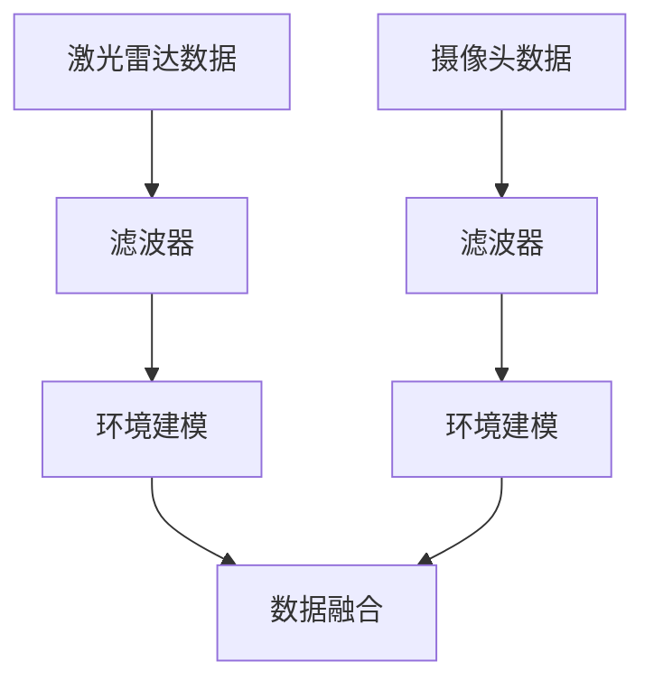

**伪代码示例：**

```python
def sensor_data_fusion(lidar_data, camera_data):
    lidar_model = filter_data(lidar_data)
    camera_model = filter_data(camera_data)
    fused_model = merge_models(lidar_model, camera_model)
    return fused_model
```

综上所述，感知技术是自动驾驶技术的核心组成部分。通过激光雷达、摄像头和传感器数据融合算法，感知系统能够实时获取并处理车辆周围的环境信息，为后续的决策和控制提供可靠的数据支持。

---

**图3.1：感知系统架构图**

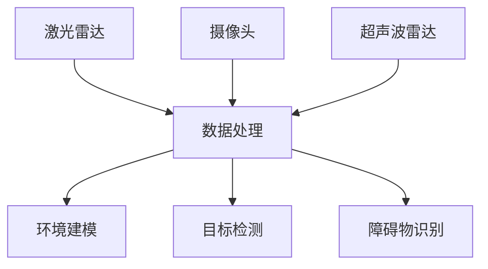

---

#### 第4章：决策与规划算法

决策与规划算法是自动驾驶技术的核心组成部分，其任务是根据感知系统提供的环境信息，制定车辆的行驶策略。本章将详细探讨决策与规划算法的基本原理，包括人类驾驶员行为分析、运动规划算法、环境感知与路径规划算法等。

##### 4.1 决策与规划概述

决策与规划算法是自动驾驶技术的“大脑”，其核心任务是根据感知系统提供的环境信息，对车辆的行驶路径进行决策。决策与规划算法可以分为以下几个步骤：

- 环境建模：根据感知系统提供的数据，构建车辆周围的三维环境模型。
- 行为预测：分析环境模型，预测周围车辆和行人的行为。
- 运动规划：根据行为预测结果，规划车辆的行驶路径。
- 行为选择：选择最优的行驶策略，包括速度、方向等。

##### 4.2 人类驾驶员行为分析

人类驾驶员行为分析是自动驾驶技术中重要的一环。通过学习人类驾驶员的驾驶行为，自动驾驶系统可以更好地理解和预测周围环境的变化。

**人类驾驶员行为分析架构图：**

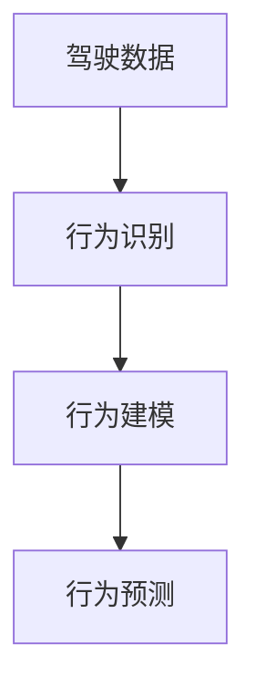

**伪代码示例：**

```python
def analyze_driver_behavior(driver_data):
    behaviors = identify_behaviors(driver_data)
    model = build_behavior_model(behaviors)
    predicted_behaviors = predict_behaviors(model)
    return predicted_behaviors
```

##### 4.3 运动规划算法

运动规划算法是自动驾驶技术中的核心算法，其任务是根据目标位置和周围环境信息，规划车辆的行驶路径。常用的运动规划算法包括：

- 迭代最近点（RRT）算法
- 终端滑动模式（TSM）算法
- 动态窗口算法（DWA）

**迭代最近点（RRT）算法伪代码示例：**

```python
def RRT Planning(current_state, goal_state):
    tree = initialize_tree(current_state)
    while not goal_state in tree:
        random_state = sample_state_in_environment()
        nearest_state = find_nearest_state(tree, random_state)
        new_state = interpolate_state(nearest_state, random_state)
        add_state_to_tree(tree, new_state)
    path = find_shortest_path(tree, current_state, goal_state)
    return path
```

##### 4.4 环境感知与路径规划算法

环境感知与路径规划算法是将感知系统提供的信息与运动规划算法结合起来，实现车辆的自动驾驶。环境感知算法主要任务包括：

- 障碍物检测：识别车辆周围的路障，如行人、车辆、路障等。
- 路线识别：识别道路、车道线、标志等。

**环境感知与路径规划算法架构图：**

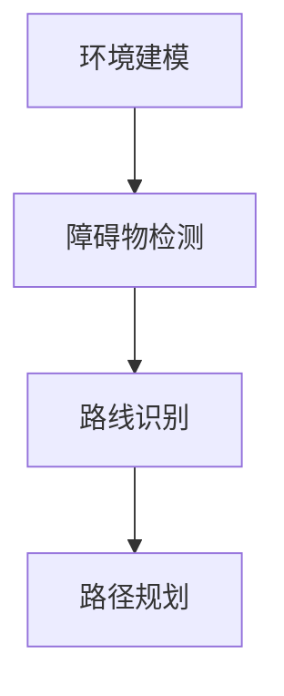

**伪代码示例：**

```python
def environment_perception(environment_model):
    obstacles = detect_obstacles(environment_model)
    roads = detect_road(environment_model)
    path = plan_path(roads, obstacles)
    return path
```

综上所述，决策与规划算法是自动驾驶技术的核心组成部分。通过人类驾驶员行为分析、运动规划算法和环境感知与路径规划算法，决策系统可以制定出最优的行驶策略，确保车辆的行驶路径既安全又高效。

---

**图4.1：决策与规划算法架构图**


---

#### 第5章：控制技术

控制技术是自动驾驶技术中的关键组成部分，其主要任务是根据决策系统的指令，控制车辆的加速度、速度、方向等，确保车辆的行驶路径符合决策系统的要求。本章将详细探讨控制技术的核心组成部分，包括动力系统控制、制动系统控制和转向系统控制。

##### 5.1 控制系统概述

控制系统是自动驾驶技术的“执行者”，其核心任务是根据决策系统的指令，控制车辆的加速度、速度、方向等，确保车辆的行驶路径符合决策系统的要求。控制系统通常包括以下几个部分：

- 加速度控制：根据决策系统的指令，控制车辆的加速度。
- 速度控制：根据决策系统的指令，控制车辆的速度。
- 方向控制：根据决策系统的指令，控制车辆的转向。

##### 5.2 动力系统控制

动力系统控制是自动驾驶技术中的核心，其主要任务是根据决策系统的指令，控制车辆的加速度和速度，确保车辆的行驶路径符合决策系统的要求。

**动力系统控制架构图：**

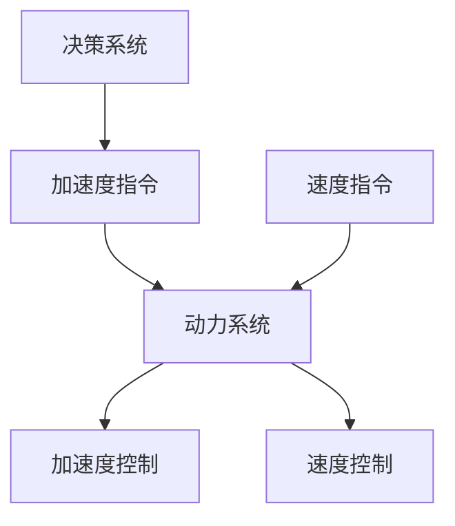

**伪代码示例：**

```python
def control_acceleration(current_acceleration, target_acceleration):
    acceleration = calculate_acceleration(current_acceleration, target_acceleration)
    apply_acceleration(acceleration)

def control_speed(current_speed, target_speed):
    speed = calculate_speed(current_speed, target_speed)
    apply_speed(speed)
```

##### 5.3 制动系统控制

制动系统控制是自动驾驶技术中的关键组成部分，其主要任务是根据决策系统的指令，控制车辆的减速度和停车，确保车辆的行驶路径符合决策系统的要求。

**制动系统控制架构图：**

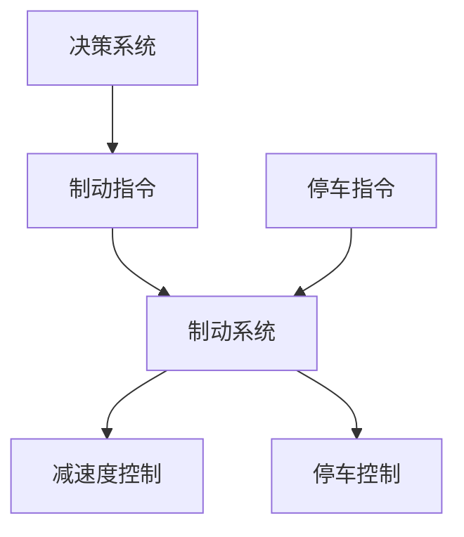

**伪代码示例：**

```python
def control_deceleration(current_deceleration, target_deceleration):
    deceleration = calculate_deceleration(current_deceleration, target_deceleration)
    apply_deceleration(deceleration)

def control_stop(current_speed, target_speed):
    if current_speed < target_speed:
        apply_break()
```

##### 5.4 转向系统控制

转向系统控制是自动驾驶技术中的关键组成部分，其主要任务是根据决策系统的指令，控制车辆的转向角度，确保车辆的行驶路径符合决策系统的要求。

**转向系统控制架构图：**

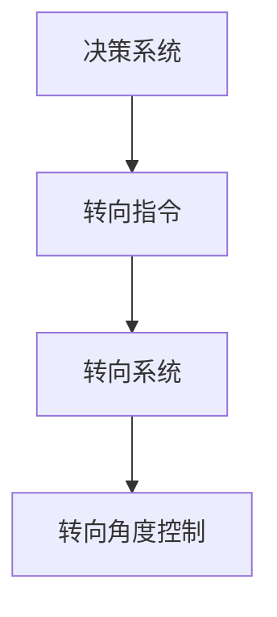

**伪代码示例：**

```python
def control_steering_angle(current_angle, target_angle):
    angle = calculate_steering_angle(current_angle, target_angle)
    apply_steering_angle(angle)
```

综上所述，控制技术是自动驾驶技术中的关键组成部分。通过动力系统控制、制动系统控制和转向系统控制，控制系统可以确保车辆的行驶路径符合决策系统的要求，实现自动驾驶。

---

**图5.1：控制系统架构图**

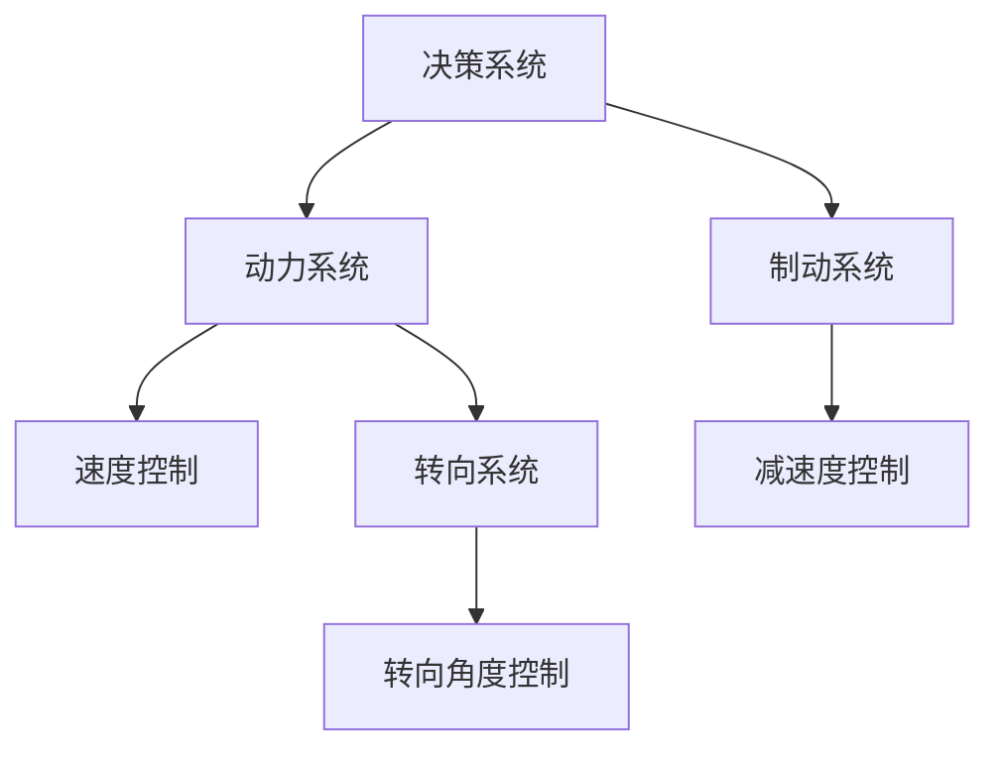

---

#### 第6章：自动驾驶汽车市场分析

自动驾驶汽车市场的快速发展吸引了全球众多科技巨头和传统汽车制造商的参与。本章将分析自动驾驶汽车市场的规模与增长趋势、主要玩家与竞争格局、应用场景以及未来趋势。

##### 6.1 市场规模与增长趋势

根据市场研究机构的预测，自动驾驶汽车市场预计将在未来几年内保持高速增长。主要驱动因素包括：

- 技术进步：传感器、算法、计算平台等技术的持续进步，使得自动驾驶系统更加可靠和高效。
- 政策支持：各国政府纷纷出台政策，鼓励自动驾驶技术的发展和商业化应用。
- 用户需求：随着人们对出行安全和便利性的需求增加，自动驾驶汽车逐渐成为用户的首选。

根据市场调研数据显示，全球自动驾驶汽车市场预计将在2025年达到数千亿美元规模，并将在2030年达到数万亿美元规模。

##### 6.2 主要玩家与竞争格局

自动驾驶汽车市场的竞争格局异常激烈，主要玩家包括：

- 特斯拉：特斯拉在自动驾驶领域具有领先地位，其Autopilot系统已在市场上广泛应用。
- 百度：百度在自动驾驶技术方面投入巨大，其Apollo平台已与多家车企合作。
- 谷歌：谷歌的Waymo项目是全球首个自动驾驶出租车服务，具有强大的技术积累。
- Uber：Uber在自动驾驶技术研发和应用方面积极布局，其自动驾驶出租车已在某些城市试运行。
- 本田：本田与谷歌合作开发自动驾驶技术，并在量产车上应用。
- 丰田：丰田在自动驾驶技术研发方面投入巨大，其自动驾驶汽车已在全球多个地区进行测试。

这些玩家在自动驾驶技术、资金、市场资源等方面具有竞争优势，推动了自动驾驶汽车市场的快速发展。

##### 6.3 自动驾驶技术的应用场景

自动驾驶技术已广泛应用于多个领域，包括：

- 个人出行：自动驾驶汽车为个人用户提供安全、便利的出行服务。
- 物流：自动驾驶卡车、无人配送车等在物流领域提高运输效率。
- 公共交通：自动驾驶巴士、无人出租车等在公共交通领域提升服务质量。
- 专业服务：自动驾驶车辆在矿场、港口等特殊场景下提供专业服务。

随着技术的不断成熟和成本的降低，自动驾驶技术的应用场景将进一步扩大。

##### 6.4 自动驾驶汽车的未来趋势

自动驾驶汽车的未来趋势包括：

- 纯自动驾驶：随着技术的不断进步，L5级别纯自动驾驶汽车有望在未来实现商业化应用。
- 深度融合：自动驾驶汽车与互联网、大数据、云计算等技术的深度融合，将提升自动驾驶系统的智能化水平。
- 法规完善：各国政府将逐步完善自动驾驶汽车相关法规，推动自动驾驶技术的合法化应用。
- 智慧交通：自动驾驶汽车与智能交通系统的深度融合，将推动智慧交通的发展，提高交通效率和安全性。

综上所述，自动驾驶汽车市场具有巨大的发展潜力，随着技术的不断进步和政策的支持，自动驾驶汽车将在未来成为汽车行业的重要发展方向。

---

**图6.1：自动驾驶汽车市场规模与增长趋势**

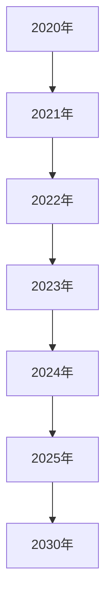

---

#### 第7章：自动驾驶技术的法规与政策

自动驾驶技术的快速发展引发了诸多法律、伦理和安全问题，各国政府纷纷出台法规和政策，以规范自动驾驶技术的发展和应用。本章将分析全球自动驾驶法规政策概况、我国自动驾驶法规政策分析以及自动驾驶法规的挑战与应对策略。

##### 7.1 全球自动驾驶法规政策概况

全球各国对自动驾驶技术的法规政策有所不同，但总体上都在逐步完善，以推动自动驾驶技术的健康发展。以下是部分国家自动驾驶法规政策的概况：

- 美国：美国交通部（DOT）和国家安全委员会（NHTSA）共同发布了《自动驾驶车辆政策指南》，对自动驾驶车辆的定义、测试和认证提出了具体要求。各州也在积极制定自动驾驶汽车的法律规定。
- 欧洲：欧盟委员会发布了《自动化和自动驾驶车辆战略》，提出了推动自动驾驶技术发展的目标和措施。各国政府也在制定自动驾驶汽车的相关法规，如德国、法国、英国等。
- 日本：日本政府发布了《自动驾驶汽车安全法规》，对自动驾驶汽车的设计、测试和上路行驶提出了具体要求。同时，日本政府还推出了“自动驾驶汽车示范区”计划，以推动自动驾驶技术的商业化应用。
- 中国：中国政府高度重视自动驾驶技术的发展，发布了《智能汽车发展道路测试管理规范》和《智能汽车准入和上路通行的标准》，明确了自动驾驶汽车的测试和认证流程。此外，中国政府还在多个城市设立了自动驾驶汽车示范区，推动自动驾驶技术的商业化应用。

##### 7.2 我国自动驾驶法规政策分析

我国政府在自动驾驶技术领域采取了积极的政策措施，以推动自动驾驶技术的发展和应用。以下是我国自动驾驶法规政策的主要分析：

- 《智能汽车发展道路测试管理规范》：明确了自动驾驶汽车的道路测试流程和要求，为自动驾驶汽车的测试提供了制度保障。
- 《智能汽车准入和上路通行的标准》：规定了自动驾驶汽车的准入条件和上路要求，确保自动驾驶汽车的安全性和可靠性。
- 《汽车产业中长期发展规划》：提出了智能网联汽车发展的目标和措施，明确了自动驾驶汽车在汽车产业中的重要地位。
- 各地政策：多个城市发布了自动驾驶汽车示范区建设方案，为自动驾驶汽车的测试和应用提供了政策支持。

##### 7.3 自动驾驶法规的挑战与应对策略

尽管各国政府都在积极推动自动驾驶技术的发展，但自动驾驶法规的制定仍然面临诸多挑战：

- 法律责任归属：自动驾驶汽车发生交通事故时，如何确定责任归属是一个亟待解决的问题。各国政府需要制定明确的法律责任归属规定，以保障交通安全。
- 数据隐私保护：自动驾驶汽车在运行过程中会产生大量数据，如何保护用户隐私和数据安全是自动驾驶法规面临的重要挑战。各国政府需要建立完善的数据隐私保护制度，确保用户数据的安全。
- 道德伦理问题：自动驾驶汽车在遇到伦理困境时，如何做出决策是一个复杂的问题。各国政府需要制定伦理指导原则，确保自动驾驶汽车的行为符合社会伦理标准。
- 法规更新与适应性：自动驾驶技术发展迅速，现有法规和政策可能无法完全适应新技术的发展。各国政府需要及时更新法规和政策，以适应自动驾驶技术的快速变化。

为应对上述挑战，各国政府可以采取以下策略：

- 建立跨部门合作机制：政府、企业、科研机构和公众共同参与，建立自动驾驶法规制定的跨部门合作机制，确保法规的全面性和科学性。
- 加强国际合作：各国政府可以加强在自动驾驶法规领域的国际合作，借鉴其他国家的经验，制定具有全球适用性的自动驾驶法规。
- 建立数据共享机制：政府和企业可以建立数据共享机制，确保数据的安全性和隐私保护，为自动驾驶技术的发展提供数据支持。
- 建立道德审查机制：政府可以建立道德审查机制，对自动驾驶汽车的行为进行伦理评估，确保自动驾驶汽车的行为符合社会伦理标准。

综上所述，自动驾驶技术的法规与政策是保障自动驾驶技术健康发展的重要保障。随着技术的不断进步和政策的完善，自动驾驶技术将在未来发挥更大的作用。

---

**图7.1：全球自动驾驶法规政策概况**

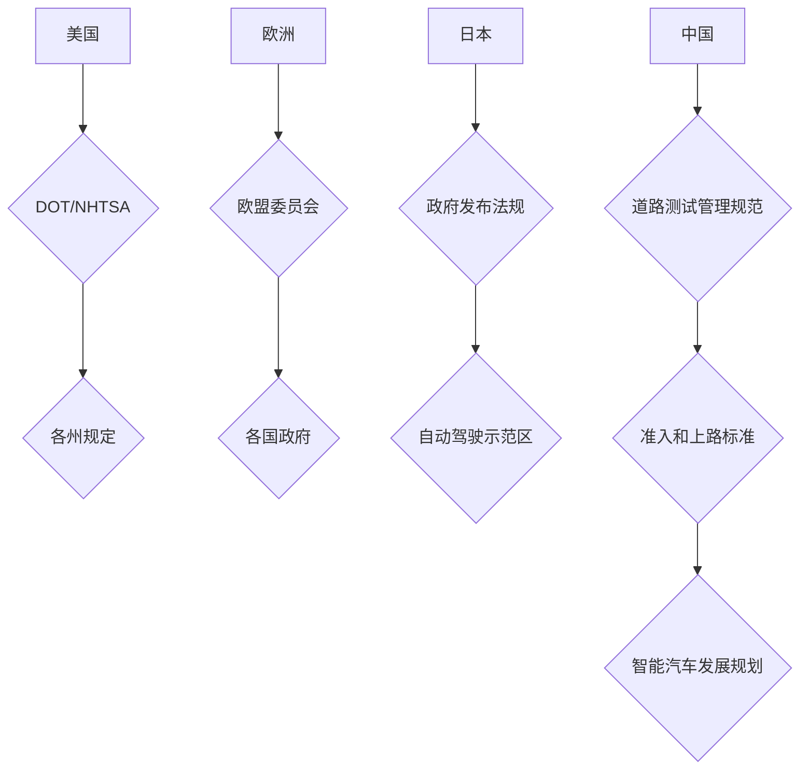

---

#### 第8章：自动驾驶技术的未来发展趋势

随着技术的不断进步和政策的支持，自动驾驶技术正迅速走向商业化应用，成为未来智能交通和智慧城市的重要组成部分。本章将探讨自动驾驶技术的未来发展趋势、关键技术创新、对交通出行的影响以及面临的伦理与安全挑战。

##### 8.1 自动驾驶技术的发展趋势

自动驾驶技术的未来发展趋势包括：

- 级别提升：自动驾驶技术将从当前的有条件自动化（L3-L4级别）逐步提升至完全自动化（L5级别），实现车辆在各种复杂环境下的自主行驶。
- 系统整合：自动驾驶系统将更加注重感知、决策和控制三个核心系统的整合，提高系统的协调性和可靠性。
- 智能化：自动驾驶系统将结合人工智能、大数据、云计算等先进技术，实现更智能的决策和行为。
- 融合应用：自动驾驶技术将与其他新兴技术如5G通信、物联网等深度融合，推动智慧交通和智慧城市的发展。

##### 8.2 自动驾驶技术的关键技术创新

自动驾驶技术的关键技术创新包括：

- 感知系统：高精度激光雷达、多摄像头融合感知、超声波雷达等技术将进一步提高感知系统的精度和可靠性。
- 决策系统：深度学习、强化学习等算法将提升决策系统的智能水平，实现更精准的路径规划和行为预测。
- 控制系统：先进的控制算法和执行机构将提高控制系统的响应速度和精度，确保车辆的稳定行驶。
- 网络通信：5G通信技术将实现自动驾驶系统与车辆、基础设施之间的实时数据传输，提高系统的协同能力。

##### 8.3 自动驾驶技术对交通出行的影响

自动驾驶技术对交通出行将产生深远影响：

- 提高交通安全：自动驾驶技术可以减少人为失误导致的交通事故，提高交通安全性。
- 提高交通效率：自动驾驶车辆可以优化行驶路线，减少拥堵，提高交通效率。
- 降低运营成本：自动驾驶技术可以减少人力成本，提高运营效率，降低出行成本。
- 改变出行模式：自动驾驶技术将改变人们的出行习惯，实现按需出行、共享出行等新模式。

##### 8.4 自动驾驶技术的伦理与安全挑战

自动驾驶技术面临的伦理与安全挑战包括：

- 责任归属：自动驾驶汽车发生交通事故时，如何确定责任归属是一个复杂的问题。
- 数据隐私：自动驾驶汽车在运行过程中会产生大量数据，如何保护用户隐私和数据安全是重要挑战。
- 伦理决策：自动驾驶汽车在遇到伦理困境时，如何做出合理的决策是一个复杂的伦理问题。
- 安全保障：如何确保自动驾驶汽车的安全性，防止网络攻击和系统故障是重要挑战。

为应对上述挑战，需要各方共同努力，包括：

- 法律法规：政府应制定完善的法律法规，明确责任归属和伦理标准，保障自动驾驶技术的健康发展。
- 技术创新：企业应加大技术研发投入，提高自动驾驶系统的安全性和可靠性。
- 社会共识：社会公众应积极参与自动驾驶技术的讨论和推广，形成共识，共同推动自动驾驶技术的应用。

综上所述，自动驾驶技术具有巨大的发展潜力，将对未来交通出行产生深远影响。随着技术的不断进步和政策的支持，自动驾驶技术将在未来实现更广泛的应用，推动交通出行向更安全、更高效、更智能的方向发展。

---

**图8.1：自动驾驶技术发展趋势与关键技术创新**

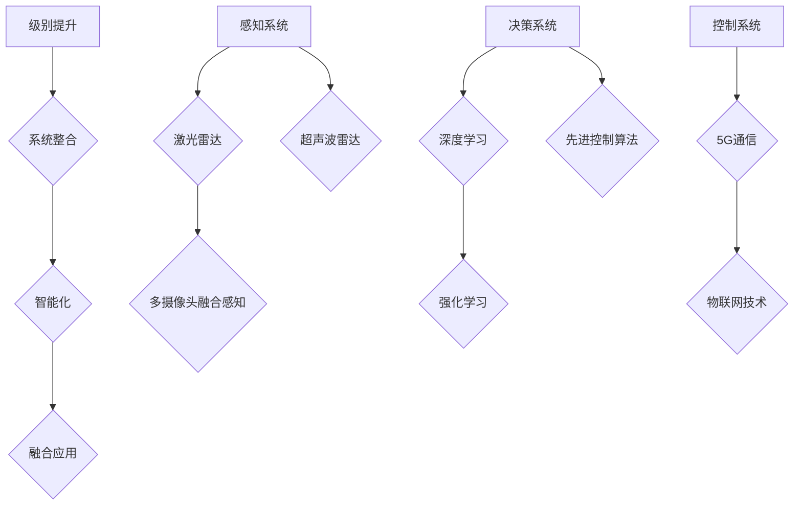

---

### 附录A：自动驾驶技术相关资源与工具

#### A.1 开源自动驾驶平台

- Apollo：由百度开源的自动驾驶平台，支持多种传感器和车辆平台的集成。
- Autoware：由丰田开源的自动驾驶平台，适用于L2到L4级别的自动驾驶车辆。
- NVIDIA Drive：由NVIDIA推出的自动驾驶平台，支持复杂的传感器融合和深度学习算法。

#### A.2 自动驾驶技术论文与报告

- Nature: Autonomous Driving: The Next Revolution in Mobility
- IEEE: Autonomous Driving: Challenges and Opportunities
- IEEE Transactions on Intelligent Transportation Systems: Special Issue on Autonomous Driving

#### A.3 自动驾驶技术相关书籍推荐

- "Autonomous Driving Systems: A Practical Guide to Sensors, Perception, and Algorithms"
- "Deep Learning for Autonomous Driving"
- "Robot Driving: Perception, Planning, and Control"

#### A.4 自动驾驶技术社区与论坛

- 自动驾驶技术论坛：聚集了全球自动驾驶技术爱好者和专家，提供最新的技术资讯和交流平台。
- 自动驾驶技术微信群：国内自动驾驶技术爱好者组成的微信群，定期分享技术文章和交流心得。
- 自动驾驶技术QQ群：国内自动驾驶技术爱好者和从业者组成的QQ群，提供技术支持和交流。

---

### 结论

自动驾驶技术作为现代科技的前沿领域，正迅速改变着交通出行的方式。通过本章的分析，我们可以看到自动驾驶技术在感知、决策、控制三个核心方面的不断突破，以及其在市场、法规、伦理等方面的挑战和机遇。未来，随着技术的进一步发展和政策的支持，自动驾驶技术有望在更广泛的场景中得到应用，为人们带来更安全、更高效、更便捷的出行体验。让我们共同期待自动驾驶技术带来的美好未来。

---

### 作者信息

作者：AI天才研究院/AI Genius Institute & 禅与计算机程序设计艺术 /Zen And The Art of Computer Programming

