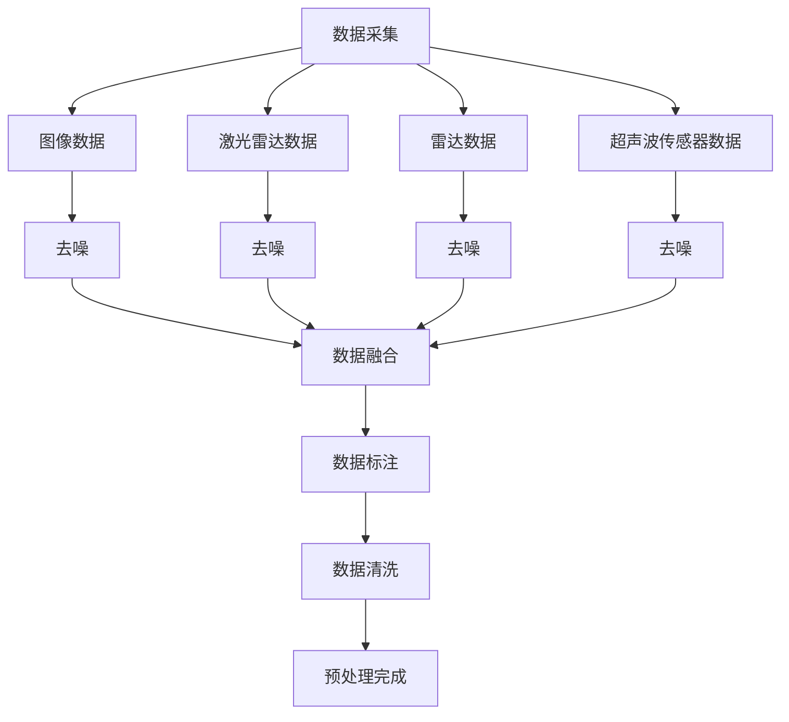
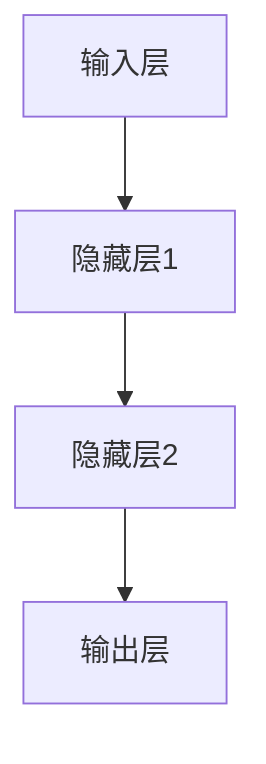
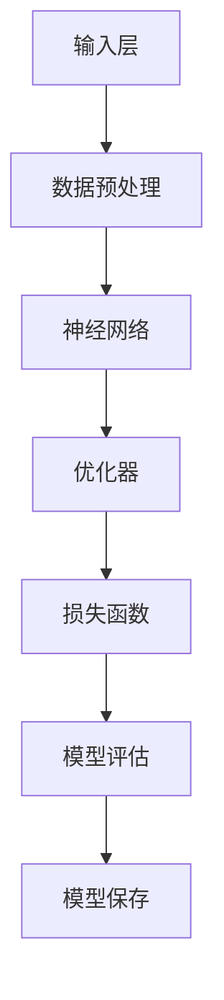

                 

# 端到端自动驾驶系统的安全性挑战

## 关键词
- 端到端自动驾驶
- 安全性挑战
- 数据质量
- 算法可靠性
- 软件安全
- 硬件安全
- 安全性分析方法
- 安全性增强技术
- 法规与标准

## 摘要
随着自动驾驶技术的迅速发展，端到端自动驾驶系统已成为汽车行业的热门话题。然而，安全性问题成为制约其广泛应用的关键因素。本文将深入探讨端到端自动驾驶系统的安全性挑战，包括数据质量、算法可靠性、软件安全和硬件安全等方面的挑战。同时，本文还将介绍安全性分析方法、安全性增强技术以及法规与标准，为端到端自动驾驶系统的安全发展提供参考。

## 目录大纲设计

### 第1章 引言
- **1.1** 书籍背景与目标
- **1.2** 端到端自动驾驶系统的概念
- **1.3** 安全性的重要性

### 第2章 端到端自动驾驶系统概述
- **2.1** 自动驾驶技术的发展历程
- **2.2** 自动驾驶系统的架构
- **2.3** 自动驾驶系统的层级

### 第3章 端到端自动驾驶系统的核心技术
- **3.1** 数据采集与预处理
  - **3.1.1** 数据来源
  - **3.1.2** 数据预处理方法
  - **3.1.3** Mermaid流程图：数据采集与预处理流程
- **3.2** 深度学习算法
  - **3.2.1** 神经网络基础
    - **3.2.1.1** 神经元与神经网络
    - **3.2.1.2** 前向传播与反向传播算法（伪代码）
  - **3.2.2** 深度学习框架介绍（Mermaid图）
- **3.3** 迁移学习与微调技术

### 第4章 端到端自动驾驶系统的安全挑战
- **4.1** 系统安全的定义与重要性
- **4.2** 安全性挑战的来源
  - **4.2.1** 数据质量
  - **4.2.2** 算法可靠性
  - **4.2.3** 软件安全
  - **4.2.4** 硬件安全
- **4.3** 安全性分析方法

### 第5章 端到端自动驾驶系统的测试与验证
- **5.1** 测试与验证的目的
- **5.2** 测试与验证的方法
  - **5.2.1** 自动驾驶系统的功能测试
  - **5.2.2** 自动驾驶系统的安全测试
- **5.3** 测试与验证案例分析

### 第6章 端到端自动驾驶系统的安全性增强技术
- **6.1** 离线安全增强技术
  - **6.1.1** 错误注入技术
  - **6.1.2** 强化学习技术
- **6.2** 在线安全增强技术
  - **6.2.1** 实时监控与异常检测
  - **6.2.2** 隔离与恢复技术

### 第7章 端到端自动驾驶系统的安全性法规与标准
- **7.1** 当前法规与标准的概述
- **7.2** 法规与标准的发展趋势
- **7.3** 自动驾驶系统安全法规案例分析

### 第8章 端到端自动驾驶系统的未来发展趋势
- **8.1** 未来安全性的挑战
- **8.2** 未来安全性的技术发展方向
- **8.3** 端到端自动驾驶系统在社会中的应用前景

### 附录
- **附录 A** 自动驾驶系统开发资源与工具

## 第1章 引言

### 1.1 书籍背景与目标

随着人工智能技术的不断进步，自动驾驶系统在近几年取得了显著的成果。从最初的辅助驾驶系统发展到如今的端到端自动驾驶系统，自动驾驶技术正逐渐改变着我们的出行方式。然而，随着自动驾驶系统的普及，其安全性问题也越来越受到关注。本文旨在深入探讨端到端自动驾驶系统的安全性挑战，分析其面临的各类安全风险，并提出相应的解决方案，为自动驾驶技术的安全发展提供指导。

### 1.2 端到端自动驾驶系统的概念

端到端（End-to-End）自动驾驶系统是一种基于深度学习的自动驾驶技术，其核心思想是将原始数据直接映射到控制信号，从而实现车辆自主行驶。在这种系统中，自动驾驶算法通过大量训练数据学习环境感知、路径规划、控制执行等任务，最终实现车辆的安全行驶。

端到端自动驾驶系统的优点在于能够更好地处理复杂的交通场景，提高行驶稳定性，降低人为错误。然而，这也带来了新的挑战，尤其是在安全性方面。由于系统直接从原始数据中学习，数据质量和算法可靠性对系统的安全性有着重要影响。

### 1.3 安全性的重要性

端到端自动驾驶系统的安全性至关重要，其直接关系到乘客和行人的生命安全。一个不安全的自动驾驶系统可能会引发交通事故，造成严重的人员伤亡和财产损失。此外，安全性问题还可能影响自动驾驶系统的普及和推广，阻碍技术的进一步发展。

本文将从以下几个方面展开探讨：

1. 端到端自动驾驶系统的核心技术，包括数据采集与预处理、深度学习算法和迁移学习技术。
2. 端到端自动驾驶系统面临的安全性挑战，包括数据质量、算法可靠性、软件安全和硬件安全等方面的挑战。
3. 安全性分析方法，包括功能测试、安全测试和测试与验证案例分析。
4. 安全性增强技术，包括离线安全增强技术和在线安全增强技术。
5. 安全性法规与标准，以及未来发展趋势。

通过本文的探讨，希望读者能够对端到端自动驾驶系统的安全性问题有更深入的理解，为自动驾驶技术的安全发展提供有益的参考。接下来，我们将详细讨论端到端自动驾驶系统的核心技术，为后续内容打下基础。

## 第2章 端到端自动驾驶系统概述

### 2.1 自动驾驶技术的发展历程

自动驾驶技术的研究可以追溯到20世纪50年代。当时，科学家们开始探索自动驾驶车辆的可能性，并提出了一些早期概念。20世纪80年代，随着计算机技术和传感器技术的进步，自动驾驶技术开始进入实际应用阶段。例如，美国国防部高级研究计划局（DARPA）发起了多次自动驾驶汽车挑战赛，推动了自动驾驶技术的发展。

进入21世纪，随着人工智能技术的崛起，自动驾驶技术取得了显著的突破。特别是在深度学习算法的推动下，自动驾驶系统的性能得到了大幅提升。传统的自动驾驶系统主要依赖于规则和符号推理，而深度学习算法则通过从大量数据中学习，能够更好地处理复杂的场景。

近年来，端到端自动驾驶系统成为研究的热点。与传统自动驾驶系统不同，端到端自动驾驶系统直接从原始数据中学习，避免了繁琐的特征工程和规则制定过程。这一技术突破使得自动驾驶系统在处理复杂场景时具有更高的灵活性和鲁棒性。

### 2.2 自动驾驶系统的架构

端到端自动驾驶系统的架构通常包括感知、规划和控制三个主要模块。每个模块在不同层面上处理车辆行驶过程中的信息，协同工作以实现自动驾驶功能。

1. **感知模块**：
   感知模块负责收集车辆周围环境的信息，包括图像、激光雷达（LiDAR）数据、雷达数据和超声波传感器数据等。这些数据通过多种传感器融合，形成一个全面的环境感知模型。感知模块的核心任务是识别车辆周围的道路、行人、车辆和其他物体，并对其进行分类和跟踪。

2. **规划模块**：
   规划模块基于感知模块提供的信息，制定车辆的行驶策略。规划模块需要考虑车辆的目标、道路状况、交通规则和其他车辆的动态行为。常见的规划算法包括路径规划、行为规划和轨迹规划。路径规划旨在找到从起点到终点的最优路径；行为规划则关注如何与其他车辆和行人互动；轨迹规划则负责确定车辆的瞬时速度和方向。

3. **控制模块**：
   控制模块负责将规划模块生成的行驶策略转换为实际的控制信号，以控制车辆的加速、转向和制动。控制模块通常采用PID控制器、模糊控制器或基于机器学习的控制器。这些控制器通过接收感知模块和规划模块提供的信息，实时调整车辆的行驶状态，以确保车辆安全、稳定地行驶。

### 2.3 自动驾驶系统的层级

自动驾驶系统根据其自动化程度，通常被分为不同的层级，从0级（完全手动驾驶）到5级（完全自动驾驶）。以下是对不同层级的简要描述：

1. **0级（无自动化）**：
   车辆完全由驾驶员控制，所有驾驶任务均由人类完成。

2. **1级（驾驶员辅助）**：
   系统可以控制单一驾驶任务，如加速、制动或转向。驾驶员需时刻保持警惕，并在系统失效时接管控制。

3. **2级（部分自动驾驶）**：
   系统可以同时控制两个驾驶任务，如加速和制动。在某些特定条件下，如高速公路上，车辆可以实现自动驾驶。

4. **3级（有条件自动驾驶）**：
   系统可以在特定条件下实现完全自动驾驶，如高速公路上的自动驾驶。驾驶员无需始终监控驾驶任务，但在系统请求时需立即接管控制。

5. **4级（高度自动驾驶）**：
   系统可以在特定区域内实现完全自动驾驶，无需驾驶员干预。驾驶员可以在车内休息，但在特定情况下需能够接管控制。

6. **5级（完全自动驾驶）**：
   系统在任何条件下都能实现完全自动驾驶，无需驾驶员干预。车辆可以自主完成所有驾驶任务，包括城市交通和复杂的路况。

端到端自动驾驶系统通常属于4级或5级自动驾驶系统，其目标是实现完全自动驾驶，从而消除人为错误，提高交通安全性。然而，实现这一目标面临着诸多挑战，包括数据质量、算法可靠性、软件安全和硬件安全等。

在接下来的章节中，我们将详细探讨端到端自动驾驶系统的核心技术，分析其面临的各类安全挑战，并提出相应的解决方案。希望通过本文的探讨，能够为自动驾驶技术的安全发展提供有益的参考。

## 第3章 端到端自动驾驶系统的核心技术

### 3.1 数据采集与预处理

数据采集是端到端自动驾驶系统的基础，其质量直接影响系统的性能和可靠性。为了确保系统具备良好的环境感知能力，必须从多个来源收集丰富的数据，包括图像、激光雷达（LiDAR）数据、雷达数据和超声波传感器数据等。

#### 3.1.1 数据来源

1. **图像数据**：
   图像数据是自动驾驶系统中最常用的数据类型，它提供了丰富的视觉信息。图像数据可以从摄像头获取，摄像头安装在车辆的前方、后方和周围，以全方位捕捉车辆周围的环境。

2. **激光雷达（LiDAR）数据**：
   激光雷达通过发射激光束并测量反射回来的光信号，生成周围环境的3D点云数据。LiDAR数据具有高分辨率和实时性，能够精确地捕捉环境中的物体和地形。

3. **雷达数据**：
   雷达通过发射无线电波并测量反射回来的信号，可以检测车辆周围的运动物体。雷达数据具有较好的抗干扰能力和探测距离，常用于检测远距离的物体。

4. **超声波传感器数据**：
   超声波传感器通过发射超声波并测量其反射时间，可以检测车辆周围的近程物体。超声波传感器常用于检测车辆之间的距离和障碍物的位置。

#### 3.1.2 数据预处理方法

收集到的原始数据通常包含噪声、冗余信息和不一致性。为了提高数据的质量，必须进行预处理，包括以下步骤：

1. **去噪**：
   去噪是数据预处理的重要步骤，目的是去除原始数据中的噪声，提高数据的可靠性。常用的去噪方法包括滤波、阈值处理和图像增强等。

2. **数据融合**：
   数据融合是将来自不同传感器数据融合成一个统一的环境模型。数据融合可以采用传感器融合算法，如卡尔曼滤波和粒子滤波等。数据融合可以提高环境模型的准确性，减少单个传感器数据的误差。

3. **数据标注**：
   数据标注是数据预处理的关键步骤，目的是为自动驾驶系统提供训练数据。标注人员需要对图像、点云和雷达数据中的物体进行分类和标注，例如识别车辆、行人、道路等。

4. **数据清洗**：
   数据清洗是去除数据中的错误和冗余信息。数据清洗可以包括去除重复数据、修复缺失数据和纠正错误数据等。

#### 3.1.3 Mermaid流程图：数据采集与预处理流程

以下是一个简化的Mermaid流程图，展示了端到端自动驾驶系统的数据采集与预处理流程：



### 3.2 深度学习算法

深度学习算法在端到端自动驾驶系统中发挥着核心作用，通过从大量数据中学习，实现车辆的环境感知、路径规划和控制任务。以下将介绍深度学习算法的基本原理和常见应用。

#### 3.2.1 神经网络基础

1. **神经元与神经网络**：

神经网络由大量简单的计算单元（神经元）组成，每个神经元接收多个输入信号，通过加权求和后，通过激活函数输出一个结果。一个典型的神经元可以表示为：

$$
y = \text{激活函数}(z)
$$

其中，$z = \sum_{i=1}^{n} w_i x_i + b$，$w_i$ 是输入信号的权重，$x_i$ 是输入信号，$b$ 是偏置。

神经网络通过堆叠多个这样的神经元层，形成深度神经网络（DNN），如图：



2. **前向传播与反向传播算法（伪代码）**：

前向传播是将输入信号从输入层传递到输出层的过程，计算每个神经元的输出。反向传播则是根据输出误差，更新神经元的权重和偏置，以优化模型的性能。

**伪代码：前向传播**

```
function forward(input, weights, biases, activation_function):
    output = activation_function(sum(input * weights + biases)
    return output
```

**伪代码：反向传播**

```
function backward(output, target, weights, biases, activation_derivative):
    error = output - target
    delta = error * activation_derivative(output)
    weights -= learning_rate * (input * delta)
    biases -= learning_rate * delta
    return error
```

#### 3.2.2 深度学习框架介绍（Mermaid图）

深度学习框架如TensorFlow、PyTorch等，提供了丰富的工具和库，方便开发者构建和训练深度学习模型。以下是一个简化的Mermaid图，展示了深度学习框架的基本结构：



### 3.3 迁移学习与微调技术

迁移学习（Transfer Learning）是深度学习领域的重要技术，通过利用预训练模型在特定任务上的知识，可以快速提升新任务的性能。微调（Fine-Tuning）是迁移学习的一种常见方法，通过在预训练模型的基础上，针对新任务进行少量训练，以适应特定任务的需求。

#### 3.3.1 迁移学习的基本原理

迁移学习的基本思想是，在新的任务上，利用在相关任务上已经训练好的模型，通过微调或再训练，使其在新任务上也能取得良好的性能。迁移学习的关键在于模型参数的共享，即新任务和预训练任务共享部分参数，从而利用预训练任务的知识迁移到新任务上。

#### 3.3.2 微调技术的实现

微调技术通常包括以下步骤：

1. **加载预训练模型**：从预训练任务中加载已经训练好的模型参数。
2. **选择微调层**：确定在微调过程中需要训练的层数。通常选择靠近输入层的几层进行微调，以保留预训练模型在特征提取方面的优势。
3. **冻结底层参数**：在微调过程中，冻结底层参数（靠近输入层的参数），仅训练上层参数（靠近输出层的参数），以防止预训练模型的知识被破坏。
4. **微调训练**：在新的数据集上进行微调训练，更新上层参数，以优化模型在新任务上的性能。
5. **评估与调整**：在微调过程中，不断评估模型在新任务上的性能，根据评估结果调整训练策略，如调整学习率、训练轮次等。

通过迁移学习和微调技术，端到端自动驾驶系统可以在短时间内实现良好的性能，降低模型训练的难度和成本。迁移学习和微调技术在自动驾驶系统中的应用，不仅提高了系统的稳定性，还有助于缩短研发周期，加快自动驾驶技术的商业化进程。

## 第4章 端到端自动驾驶系统的安全挑战

### 4.1 系统安全的定义与重要性

系统安全是指确保自动驾驶系统在各种运行环境下能够持续、稳定、可靠地执行其任务，同时保护系统免受各种潜在威胁的能力。具体来说，系统安全包括以下三个方面：

1. **可靠性**：系统在给定条件下能够正确、稳定地执行任务的能力。端到端自动驾驶系统需要具备高可靠性，以确保在复杂交通环境中不出现故障或误操作。

2. **可用性**：系统在需要时能够正常运行并提供服务的程度。自动驾驶系统必须在各种情况下保持高可用性，以避免因系统故障导致的交通事故。

3. **完整性**：系统数据和信息的完整性，防止未经授权的访问、篡改或泄露。保护系统数据安全是确保自动驾驶系统安全的关键环节。

系统安全对于端到端自动驾驶系统至关重要。首先，安全性直接关系到乘客和行人的生命安全。一个不安全的自动驾驶系统可能会导致严重的交通事故，造成重大人员伤亡和财产损失。其次，安全性问题可能影响自动驾驶系统的声誉和普及程度。在自动驾驶技术日益普及的今天，用户对安全性的担忧是制约其广泛应用的主要因素。因此，确保自动驾驶系统的安全性对于推动自动驾驶技术的商业化进程具有重要意义。

### 4.2 安全性挑战的来源

端到端自动驾驶系统面临多种安全挑战，这些挑战可能来自数据质量、算法可靠性、软件安全和硬件安全等多个方面。

#### 4.2.1 数据质量

数据质量是端到端自动驾驶系统的基石。数据质量差会导致系统在复杂场景下出现误判和错误决策。以下是数据质量可能引发的安全问题：

1. **数据噪声**：传感器采集的数据中可能包含噪声，如图像中的噪声点和雷达数据的干扰信号。这些噪声会影响环境感知的准确性，导致系统误判。

2. **数据缺失**：传感器可能由于遮挡、距离过远等原因无法获取完整的观测数据，导致数据缺失。数据缺失会影响系统的决策，特别是在复杂场景下。

3. **数据标注错误**：在数据预处理过程中，标注人员的错误可能导致训练数据中的标签错误。这些错误标签将影响系统的训练效果，导致系统在真实场景中表现不佳。

#### 4.2.2 算法可靠性

算法可靠性是端到端自动驾驶系统的关键因素。算法的可靠性能否确保系统在各种复杂场景下做出正确决策。以下是算法可靠性可能引发的安全问题：

1. **泛化能力不足**：深度学习模型在训练过程中依赖于大量数据。如果训练数据集不够全面或存在偏差，模型可能在真实场景中表现不佳，导致误判和错误决策。

2. **过拟合**：过拟合是指模型在训练数据上表现良好，但在新的数据上表现较差。过拟合可能导致模型无法适应新的场景，降低系统的可靠性。

3. **鲁棒性不足**：鲁棒性是指模型在遇到异常输入时仍能保持稳定的表现。端到端自动驾驶系统需要在各种环境下运行，包括恶劣天气、交通拥堵等复杂场景。如果模型鲁棒性不足，可能导致系统在异常情况下出现故障。

#### 4.2.3 软件安全

软件安全是确保自动驾驶系统安全的关键环节。软件中的漏洞和缺陷可能被恶意攻击者利用，导致系统失控。以下是软件安全可能引发的安全问题：

1. **代码漏洞**：编程人员在编写代码时可能引入漏洞，如缓冲区溢出、未初始化变量等。这些漏洞可能被攻击者利用，执行恶意代码，导致系统失控。

2. **越权访问**：自动驾驶系统中的数据可能包含敏感信息，如行驶路线、位置信息等。如果系统存在越权访问漏洞，可能导致数据泄露或滥用。

3. **代码混淆**：为了防止恶意攻击者分析软件，开发者可能对代码进行混淆。然而，过度混淆可能导致代码难以维护和调试，增加安全风险。

#### 4.2.4 硬件安全

硬件安全是端到端自动驾驶系统的另一个重要方面。硬件故障或攻击可能导致系统失效或行为异常。以下是硬件安全可能引发的安全问题：

1. **硬件故障**：传感器、控制器等硬件设备可能因制造缺陷、老化或环境因素（如高温、湿度等）导致故障。硬件故障可能导致系统失去部分功能或完全失控。

2. **硬件攻击**：攻击者可能通过恶意硬件（如植入恶意固件或硬件设备）攻击自动驾驶系统。这些攻击可能导致系统数据泄露、行为异常甚至失控。

3. **物理安全**：自动驾驶系统需要确保其物理安全，防止物理攻击。例如，攻击者可能通过干扰传感器信号、破坏通信设备等方式破坏系统的正常运行。

### 4.3 安全性分析方法

为了确保端到端自动驾驶系统的安全性，必须采用系统化的安全性分析方法。以下是一些常用的安全性分析方法：

1. **功能安全分析**：功能安全分析旨在确保系统在各种运行条件下都能执行预定功能。常用的方法包括故障树分析（FTA）和失效模式与影响分析（FMEA）。

2. **代码审查**：代码审查是一种通过人工检查代码来发现潜在漏洞和缺陷的方法。代码审查可以识别编程错误、代码冗余和安全漏洞。

3. **静态分析**：静态分析是一种不执行代码而通过分析代码结构和语义来发现潜在问题的方法。常见的静态分析方法包括符号执行、抽象解释和模型检查。

4. **动态分析**：动态分析是在代码执行过程中进行监测和分析的方法。通过模拟系统运行，动态分析可以检测运行时的异常行为和漏洞。

5. **安全测试**：安全测试是一种通过实际操作来验证系统安全性的方法。常见的安全测试方法包括渗透测试、模糊测试和反编译测试。

通过采用这些安全性分析方法，可以识别和消除端到端自动驾驶系统中的安全漏洞，提高系统的安全性。在下一章中，我们将探讨如何对端到端自动驾驶系统进行测试与验证，以确保其安全性和可靠性。

## 第5章 端到端自动驾驶系统的测试与验证

### 5.1 测试与验证的目的

测试与验证是确保端到端自动驾驶系统安全性和可靠性的关键环节。其目的是通过一系列的测试方法，验证自动驾驶系统在各种运行条件下能否正确、稳定地执行任务。具体来说，测试与验证的目的包括以下几个方面：

1. **验证功能完整性**：确保自动驾驶系统具备所需的所有功能，如感知、规划、控制和通信等。
2. **评估系统性能**：测试系统在不同场景和条件下，如高速行驶、交通拥堵、恶劣天气等，能否满足性能指标。
3. **发现潜在漏洞**：通过测试发现系统中的潜在漏洞和缺陷，如代码漏洞、算法错误和硬件故障等。
4. **验证安全性**：确保自动驾驶系统在各种威胁下，如网络攻击、硬件故障和恶意软件等，能够保持安全运行。
5. **提供改进建议**：通过测试结果，为系统设计和开发提供改进建议，以提高系统的可靠性和安全性。

### 5.2 测试与验证的方法

端到端自动驾驶系统的测试与验证方法包括功能测试、安全测试和测试与验证案例分析。以下将详细描述这些方法。

#### 5.2.1 自动驾驶系统的功能测试

功能测试是验证自动驾驶系统是否按照设计要求正常工作的过程。其主要包括以下方面：

1. **感知功能测试**：
   感知模块是自动驾驶系统的核心组成部分，负责收集和处理车辆周围环境的信息。感知功能测试包括：
   - **图像处理测试**：测试摄像头是否能够正确捕捉和处理图像，包括亮度、对比度和颜色等。
   - **点云处理测试**：测试激光雷达数据是否能够被准确识别和分类，包括物体的位置、大小和形状等。
   - **雷达数据测试**：测试雷达是否能够准确检测和跟踪车辆周围的物体，包括物体的距离、速度和方向等。

2. **规划功能测试**：
   规划模块负责根据感知模块提供的信息，生成车辆的行驶策略。规划功能测试包括：
   - **路径规划测试**：测试系统是否能够生成从起点到终点的最优路径，包括避让障碍物、遵守交通规则等。
   - **行为规划测试**：测试系统是否能够合理应对各种交通状况，如拥堵、交叉路口等。

3. **控制功能测试**：
   控制模块将规划模块生成的行驶策略转换为实际的控制信号，以控制车辆的加速、转向和制动等。控制功能测试包括：
   - **控制信号测试**：测试控制模块是否能够根据规划策略生成正确的控制信号，如加速、减速和转向等。
   - **实时响应测试**：测试系统在遇到突发情况时，如突然刹车或转向，是否能够快速响应。

#### 5.2.2 自动驾驶系统的安全测试

安全测试是验证自动驾驶系统在各种威胁下能否保持安全运行的过程。其主要包括以下方面：

1. **代码安全测试**：
   代码安全测试旨在发现系统中的潜在漏洞和缺陷，如缓冲区溢出、未初始化变量和越权访问等。常见的代码安全测试方法包括：
   - **静态代码分析**：通过分析代码结构和语义，发现潜在的安全漏洞。
   - **动态代码分析**：通过实际执行代码，监测运行时的异常行为和漏洞。
   - **代码混淆测试**：测试代码混淆技术是否能够有效防止恶意攻击。

2. **网络安全测试**：
   自动驾驶系统通常通过网络与其他车辆、基础设施和云平台进行通信。网络安全测试旨在发现网络通信中的潜在漏洞，如数据泄露、拒绝服务攻击和中间人攻击等。常见的网络安全测试方法包括：
   - **渗透测试**：模拟攻击者行为，测试系统是否能够抵御网络攻击。
   - **模糊测试**：通过输入大量随机数据，测试系统是否能够正确处理异常输入。
   - **通信加密测试**：测试系统是否能够正确加密和解密通信数据，确保数据传输安全。

3. **硬件安全测试**：
   自动驾驶系统依赖于各种硬件设备，如传感器、控制器和通信模块等。硬件安全测试旨在发现硬件设备的潜在漏洞，如硬件故障、恶意硬件和物理攻击等。常见的硬件安全测试方法包括：
   - **硬件故障测试**：通过模拟硬件故障，测试系统是否能够正确处理故障，确保系统稳定运行。
   - **硬件篡改测试**：通过检查硬件设备是否被篡改，确保系统的物理安全。

#### 5.2.3 测试与验证案例分析

以下是一个简化的测试与验证案例分析，展示了如何对端到端自动驾驶系统进行全面的测试与验证。

**案例背景**：
某自动驾驶公司开发了一款端到端自动驾驶系统，计划在公开道路进行测试。该公司需要确保系统在各种交通场景和条件下能够稳定运行，并满足安全性和可靠性要求。

**测试与验证过程**：

1. **功能测试**：
   - **感知功能测试**：该公司在实验室环境中模拟了多种交通场景，包括城市道路、高速公路和交叉路口等。通过对比实际感知结果和预期结果，验证感知模块的准确性和鲁棒性。
   - **规划功能测试**：在模拟环境中，该公司测试了系统的路径规划和行为规划能力，确保系统能够在不同交通状况下生成合理的行驶策略。
   - **控制功能测试**：在测试环境中，该公司通过实时控制车辆，验证系统是否能够根据规划策略生成正确的控制信号，并确保车辆在复杂场景下稳定行驶。

2. **安全测试**：
   - **代码安全测试**：该公司使用静态代码分析和动态代码分析工具，对自动驾驶系统代码进行全面检查，发现并修复了多个潜在的安全漏洞。
   - **网络安全测试**：该公司模拟了多种网络攻击，如拒绝服务攻击和中间人攻击等，测试系统在网络攻击下的稳定性和安全性。
   - **硬件安全测试**：该公司通过检查硬件设备，确保其未受到篡改，并模拟硬件故障，测试系统在硬件故障下的稳定性和恢复能力。

3. **测试与验证结果**：
   - 功能测试结果显示，系统在多种交通场景下均能够稳定运行，满足功能完整性要求。
   - 安全测试结果显示，系统在多种攻击下能够保持安全运行，满足安全性要求。
   - 综合评估结果表明，系统性能和安全性均达到预期目标，该公司决定将系统推向市场。

**结论**：
通过全面的测试与验证，该公司确保了端到端自动驾驶系统的安全性和可靠性。这一案例展示了如何通过系统化的测试与验证方法，发现和解决潜在的安全漏洞和缺陷，提高系统的整体性能。

在下一章中，我们将探讨如何增强端到端自动驾驶系统的安全性，提出离线安全增强技术和在线安全增强技术的具体方案。

## 第6章 端到端自动驾驶系统的安全性增强技术

为了应对端到端自动驾驶系统面临的各种安全挑战，必须采取有效的安全性增强技术。这些技术可以分为离线安全增强技术和在线安全增强技术。以下将详细描述这两种技术的原理、实现方法及其在自动驾驶系统中的应用。

### 6.1 离线安全增强技术

离线安全增强技术主要在自动驾驶系统的开发阶段和测试阶段应用，通过模拟和测试潜在的安全威胁，提升系统的鲁棒性和可靠性。以下是一些常见的离线安全增强技术：

#### 6.1.1 错误注入技术

错误注入技术是一种通过在系统中注入错误数据或故障，测试系统在异常条件下的响应能力的手段。具体步骤如下：

1. **错误数据生成**：根据系统的工作原理和预期故障模式，生成错误数据。这些数据可以是噪声、缺失值、异常值或恶意数据。
2. **系统注入**：将错误数据注入到自动驾驶系统的各个环节，如感知模块、规划模块和控制模块。
3. **系统响应分析**：观察系统在注入错误数据后的响应，分析系统的稳定性和鲁棒性。通过对比正常数据和错误数据下的系统行为，可以发现系统的潜在问题。
4. **优化与改进**：根据测试结果，对系统进行优化和改进，增强其鲁棒性和可靠性。

错误注入技术可以帮助开发者识别系统的弱点，从而采取相应的措施进行修复和改进。

#### 6.1.2 强化学习技术

强化学习（Reinforcement Learning，RL）是一种通过不断试错和反馈，优化系统行为的方法。在离线安全增强技术中，强化学习可用于优化自动驾驶系统的决策策略，提高其在复杂环境下的适应性。

1. **强化学习模型**：建立一个基于强化学习算法的模型，用于生成自动驾驶系统的决策策略。常见的强化学习算法包括Q学习、深度Q网络（DQN）和策略梯度（PG）等。
2. **模拟环境**：创建一个模拟环境，用于测试和训练强化学习模型。模拟环境可以模拟各种交通场景和条件，如不同天气、交通流量和路况等。
3. **策略优化**：在模拟环境中，通过不断试错和反馈，优化强化学习模型的决策策略。通过反复训练和测试，模型将逐渐学会在复杂环境下做出正确的决策。
4. **策略应用**：将优化后的策略应用到实际系统中，提高系统的鲁棒性和适应性。

强化学习技术有助于提高自动驾驶系统在复杂环境下的决策能力，从而提升其整体安全性。

### 6.2 在线安全增强技术

在线安全增强技术主要用于自动驾驶系统的实际运行过程中，通过实时监控和异常检测，确保系统在运行时能够及时发现和应对潜在的安全威胁。以下是一些常见的在线安全增强技术：

#### 6.2.1 实时监控与异常检测

实时监控与异常检测技术通过持续监控系统的运行状态，识别异常行为和潜在故障，从而确保系统的安全性和稳定性。具体步骤如下：

1. **数据采集**：从自动驾驶系统的各个模块收集运行数据，如传感器数据、控制信号和通信数据等。
2. **状态监测**：对采集到的数据进行实时分析和监测，识别系统的正常行为和异常行为。常见的异常检测方法包括统计方法（如高斯分布、自回归模型等）和机器学习方法（如支持向量机、神经网络等）。
3. **告警与响应**：当检测到异常行为时，系统会发出告警，并采取相应的应对措施，如停止自动驾驶、启动紧急预案等。

实时监控与异常检测技术可以帮助系统及时发现和应对潜在的安全威胁，从而提高系统的鲁棒性和安全性。

#### 6.2.2 隔离与恢复技术

隔离与恢复技术旨在确保当系统发生故障或异常时，能够迅速将故障部分从系统中隔离，并恢复正常运行。具体步骤如下：

1. **故障识别**：通过实时监控和异常检测技术，识别系统的故障点。
2. **隔离故障**：将故障部分从系统中隔离，以防止故障扩散。隔离方法包括硬件隔离（如关闭故障模块）、软件隔离（如停止故障进程）等。
3. **故障诊断**：对隔离的故障部分进行诊断，确定故障原因和修复方案。
4. **系统恢复**：根据故障诊断结果，对系统进行修复和恢复。常见的恢复方法包括重启系统、更新软件和硬件维修等。

隔离与恢复技术可以帮助系统在故障发生时迅速恢复，从而确保系统的连续性和稳定性。

通过采用离线安全增强技术和在线安全增强技术，端到端自动驾驶系统可以显著提高其安全性和可靠性。这些技术不仅有助于发现和修复系统中的潜在问题，还可以在系统运行过程中实时监控和应对安全威胁，确保系统在各种条件下都能稳定、安全地运行。

在下一章中，我们将探讨端到端自动驾驶系统的安全性法规与标准，了解当前的安全法规框架，分析其发展趋势，并探讨典型案例，以期为自动驾驶技术的安全发展提供指导。

## 第7章 端到端自动驾驶系统的安全性法规与标准

### 7.1 当前法规与标准的概述

随着自动驾驶技术的快速发展，各国政府和企业纷纷制定了一系列法规与标准，以规范自动驾驶系统的研发、测试和商业化应用。这些法规与标准涵盖了多个方面，包括安全性、隐私保护、数据传输和操作规范等。

1. **国际法规与标准**：
   - **国际标准化组织（ISO）**：ISO 26262《道路车辆—功能安全》是自动驾驶系统功能安全的重要标准。该标准规定了从设计到生产、测试和维护的全过程安全要求。
   - **国际电信联盟（ITU）**：ITU-R M.2185《自动驾驶车辆通用要求》提出了自动驾驶车辆的技术要求和测试方法。

2. **美国法规与标准**：
   - **美国国家公路交通安全管理局（NHTSA）**：NHTSA发布了《自动驾驶车辆政策指南》，明确了自动驾驶车辆的分类、测试要求和责任分配。
   - **美国汽车工程师协会（SAE）**：SAE J3016《自动驾驶车辆系统功能定义》为自动驾驶车辆的功能划分提供了参考。

3. **欧洲法规与标准**：
   - **欧洲新车评价程序（NCAP）**：NCAP制定了《自动驾驶车辆测试指南》，对自动驾驶车辆的安全性进行了评估。
   - **欧洲标准化组织（CEN）**：CEN发布了一系列与自动驾驶相关的标准，如CEN/TS 16556《自动驾驶车辆的网络安全》。

4. **中国法规与标准**：
   - **中国工业和信息化部**：发布了《智能网联汽车道路测试管理规范》，规定了自动驾驶车辆在公开道路测试的条件和要求。
   - **中国国家标准（GB）**：GB 7258《机动车运行安全技术条件》对自动驾驶车辆的安全性提出了具体要求。

### 7.2 法规与标准的发展趋势

随着自动驾驶技术的不断成熟，法规与标准也在不断更新和完善。以下是一些发展趋势：

1. **功能安全法规**：
   - **增加安全等级**：随着自动驾驶系统复杂性的增加，法规对功能安全的要求也在不断提高。例如，ISO 26262标准已经从ASIL A提高到ASIL D，以应对更高的安全风险。
   - **覆盖更多场景**：现有的法规与标准主要针对特定场景（如高速公路、城市道路等），未来将扩展到更多复杂场景（如极端天气、复杂交通环境等）。

2. **网络安全法规**：
   - **数据加密与传输**：为了保护自动驾驶车辆的数据安全和隐私，法规将加强对数据传输和存储的加密要求。
   - **实时监控与异常检测**：法规将要求自动驾驶系统具备实时监控和异常检测能力，确保系统在遇到安全威胁时能够及时应对。

3. **责任分配法规**：
   - **明确责任主体**：法规将明确自动驾驶车辆制造商、运营商和用户的法律责任，以规范各方行为，降低交通事故责任纠纷。
   - **保险与赔偿机制**：为了保障用户和第三方的权益，法规将建立相应的保险和赔偿机制。

4. **法规协调与互认**：
   - **国际协调**：随着全球自动驾驶技术的发展，各国法规与标准将逐步实现协调与互认，推动自动驾驶技术的全球普及。
   - **区域合作**：如欧盟、北美和亚洲等地区将加强合作，共同制定适用于本地区的法规与标准。

### 7.3 自动驾驶系统安全法规案例分析

以下是对中国自动驾驶系统安全法规的一个案例分析：

**案例背景**：
某中国汽车制造商计划在国内推出一款端到端自动驾驶车辆，该车辆具备高速公路和城市道路的自动驾驶功能。为确保车辆的安全性和合规性，该公司需遵守中国工业和信息化部发布的《智能网联汽车道路测试管理规范》。

**案例分析**：

1. **道路测试申请**：
   - **测试主体资质**：该公司需具备智能网联汽车道路测试主体资质，包括车辆制造、测试能力等方面的要求。
   - **测试方案**：该公司需提交详细的测试方案，包括测试环境、测试内容、测试方法和测试结果等。
   - **审批流程**：工业和信息化部对提交的测试方案进行审核，确认符合要求后，方可进行道路测试。

2. **道路测试执行**：
   - **测试过程监控**：测试过程中，需对车辆进行实时监控，确保测试数据的真实性和完整性。
   - **数据记录与分析**：测试过程中，需记录车辆的各项运行数据，如传感器数据、控制信号和通信数据等，并进行实时分析。
   - **异常处理**：在测试过程中，如发现异常情况，需立即停止测试，并对异常情况进行调查和分析。

3. **测试结果评估**：
   - **测试结果报告**：测试结束后，该公司需提交详细的测试结果报告，包括测试内容、测试结果和问题分析等。
   - **合规性评估**：工业和信息化部对测试结果进行评估，确认车辆符合法规要求后，方可进行商业化应用。

**结论**：
通过遵守中国工业和信息化部发布的《智能网联汽车道路测试管理规范》，该公司确保了自动驾驶车辆的安全性和合规性。这一案例展示了如何通过法规与标准的规范，推动自动驾驶技术的安全发展。

在下一章中，我们将探讨端到端自动驾驶系统的未来发展趋势，分析未来安全性面临的挑战，展望技术发展方向，并探讨其在社会中的应用前景。

## 第8章 端到端自动驾驶系统的未来发展趋势

随着自动驾驶技术的不断成熟，端到端自动驾驶系统正在逐步从实验室走向实际应用。然而，未来安全性依然面临诸多挑战，需要持续的技术创新和政策支持。

### 8.1 未来安全性的挑战

1. **技术复杂性**：随着自动驾驶系统的功能不断完善，其技术复杂性不断增加。这要求系统具备更高的可靠性、鲁棒性和安全性，以确保在各种复杂环境下稳定运行。

2. **隐私保护**：自动驾驶系统在运行过程中会收集大量个人隐私数据，如位置信息、行驶路线等。如何保护用户隐私，避免数据泄露和滥用，成为未来安全性的重要挑战。

3. **网络攻击**：随着自动驾驶系统与外部网络和云平台的连接日益密切，网络攻击的风险也在增加。如何确保系统在遭受网络攻击时能够保持稳定运行，成为未来安全性的关键问题。

4. **法律法规**：随着自动驾驶技术的发展，现有的法律法规体系可能无法完全适应新兴技术的需求。如何制定和完善相关法律法规，确保自动驾驶系统的合规性和安全性，成为未来发展的关键。

### 8.2 未来安全性的技术发展方向

1. **增强现实感知技术**：未来自动驾驶系统将结合增强现实（AR）技术，实现更精准的环境感知。通过将虚拟信息和现实环境融合，系统能够更好地识别和应对复杂交通场景。

2. **边缘计算与云计算结合**：未来自动驾驶系统将采用边缘计算和云计算相结合的方式，实现实时数据分析和处理。这不仅能提高系统响应速度，还能降低网络带宽压力，提高数据安全性。

3. **分布式系统架构**：分布式系统架构可以增强自动驾驶系统的容错性和鲁棒性。通过将系统分解为多个模块，各个模块可以独立运行，提高系统在故障发生时的恢复能力。

4. **人工智能与强化学习**：人工智能和强化学习技术将进一步提升自动驾驶系统的智能化水平。通过不断学习和优化决策策略，系统能够在复杂环境下做出更准确的决策。

### 8.3 端到端自动驾驶系统在社会中的应用前景

1. **城市交通**：自动驾驶系统可以优化交通流量，提高道路利用率，减少交通事故，提高交通效率。在未来，自动驾驶车辆将成为城市交通的重要组成部分。

2. **物流运输**：自动驾驶系统在物流运输领域的应用，可以实现高效的运输管理，降低运输成本，提高运输安全性。未来，自动驾驶货车和配送机器人将在物流运输中发挥重要作用。

3. **共享出行**：自动驾驶系统与共享出行相结合，将改变人们的出行方式。自动驾驶出租车和共享汽车将成为城市出行的新选择，提高出行便捷性和舒适性。

4. **公共交通**：自动驾驶系统在公共交通领域的应用，可以提高公共交通的运行效率和安全性。自动驾驶公交车和轨道交通车辆将成为未来公共交通的重要组成部分。

总之，端到端自动驾驶系统具有广泛的应用前景，未来将深刻改变人们的出行方式和生活方式。然而，安全性问题依然是制约其广泛应用的关键因素。通过持续的技术创新和政策支持，我们有理由相信，端到端自动驾驶系统的安全性将不断提升，最终实现全面普及和应用。

## 附录

### 附录 A 自动驾驶系统开发资源与工具

在自动驾驶系统的开发过程中，开发者可以利用多种资源与工具，以提高开发效率、优化系统性能和确保系统安全性。以下是一些常用的资源与工具：

1. **开发框架**：
   - **TensorFlow**：由Google开发的开源深度学习框架，支持多种深度学习模型的训练和部署。
   - **PyTorch**：由Facebook开发的开源深度学习框架，提供了灵活的动态计算图和强大的数据抽象能力。
   - **Keras**：基于Theano和TensorFlow的高级神经网络API，简化了深度学习模型的构建和训练。

2. **数据集**：
   - **KITTI**：开源自动驾驶数据集，包含大量图像、激光雷达和雷达数据，广泛用于自动驾驶系统的研发和测试。
   - **CityScapes**：城市场景图像数据集，包含多种交通场景和标签，适用于视觉感知和规划算法的研究。
   - **Waymo**：谷歌Waymo公司提供的大型自动驾驶数据集，包含详细的交通场景和行驶轨迹，有助于提高系统的实际应用能力。

3. **测试工具**：
   - **C++Test**：用于自动化测试的C++库，支持功能测试、性能测试和安全测试。
   - **GitLab**：基于Git的持续集成和持续部署（CI/CD）平台，支持代码审查、自动化测试和部署。
   - **UnitTesting++**：用于C++单元测试的库，支持各种测试模式，如测试套件、测试组等。

4. **仿真平台**：
   - **CARLA**：开源的自动驾驶仿真平台，支持多种传感器和车辆模型，适用于自动驾驶系统的开发和测试。
   - **AirSim**：开源的多传感器仿真平台，支持飞行器、机器人等仿真，可用于自动驾驶系统的测试和验证。
   - **AirSim**：开源的多传感器仿真平台，支持飞行器、机器人等仿真，可用于自动驾驶系统的测试和验证。

5. **硬件设备**：
   - **NVIDIA Drive**：NVIDIA推出的自动驾驶计算平台，支持高性能的深度学习和视觉处理。
   - **Intel IoT Platform**：Intel推出的物联网开发平台，支持多种传感器和边缘计算，适用于自动驾驶系统的开发。
   - **Raspberry Pi**：低成本的开源硬件平台，适用于自动驾驶系统的原型开发和测试。

6. **开源项目**：
   - **Waymo的深度学习算法**：谷歌Waymo开源的一系列深度学习算法，包括行人检测、物体分类等，有助于提高自动驾驶系统的性能。
   - **Autoware**：开源的自动驾驶系统框架，包括感知、规划和控制等模块，适用于自动驾驶系统的开发和测试。
   - **Apollo**：百度开源的自动驾驶平台，支持车辆感知、规划和控制，适用于自动驾驶系统的研发和应用。

通过充分利用这些资源与工具，开发者可以加速自动驾驶系统的开发，提高系统性能和安全性，为自动驾驶技术的广泛应用奠定基础。作者：AI天才研究院/AI Genius Institute & 禅与计算机程序设计艺术 /Zen And The Art of Computer Programming。

