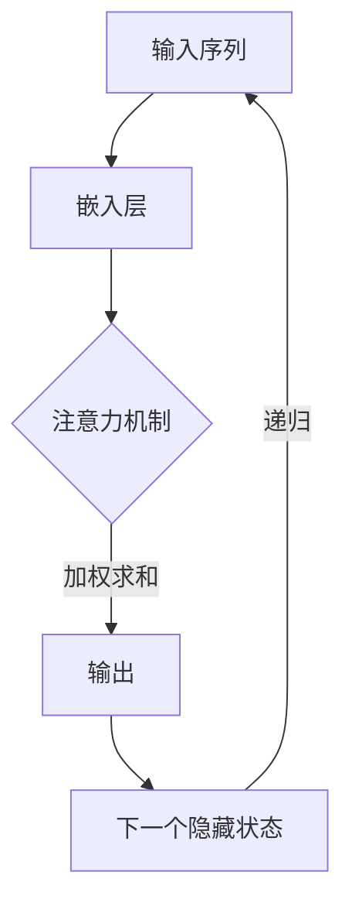
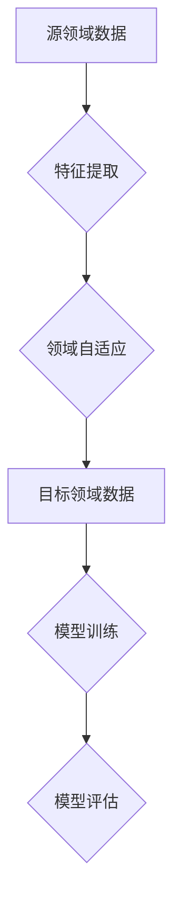
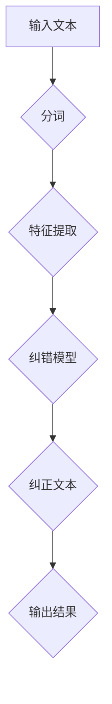
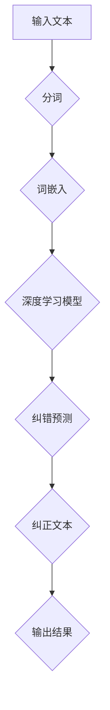
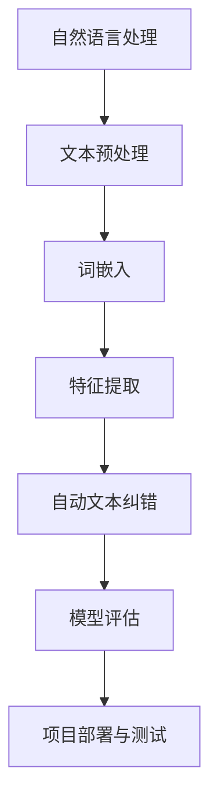

                 

### 文章标题

自然语言处理在自动文本纠错中的研究

---

#### 关键词：
自然语言处理、自动文本纠错、编辑距离、深度学习、语言模型

---

#### 摘要：

本文系统性地探讨了自然语言处理在自动文本纠错中的应用。首先，介绍了自然语言处理的基本概念、发展历程和核心挑战。接着，详细阐述了文本表示与特征提取技术，包括词嵌入和序列模型与注意力机制。随后，重点讨论了自动文本纠错的基础知识、算法模型和项目实战。文章还介绍了自动文本纠错工具与资源，并提供了一个完整的自动文本纠错项目案例代码解析。通过本文，读者可以深入了解自然语言处理在自动文本纠错领域的应用，掌握相关技术和方法，为实际项目开发提供指导。

### 第一部分：自然语言处理基础

自然语言处理（Natural Language Processing，NLP）是计算机科学和人工智能领域的一个重要分支，旨在使计算机能够理解、解释和生成人类语言。随着互联网和大数据的快速发展，NLP在各个领域，如文本分类、机器翻译、问答系统和信息抽取等方面取得了显著的成果。本文将首先介绍NLP的基本概念、发展历程和核心挑战，然后讨论语言模型基础和分词技术，为后续内容打下坚实的基础。

#### 第1章：自然语言处理基础

##### 1.1 自然语言处理简介

自然语言处理涉及多个领域，包括语言学、计算机科学、人工智能和统计学。其核心目标是使计算机能够理解、处理和生成自然语言，从而实现人机交互和信息检索。

###### 1.1.1 自然语言处理的定义和目标

自然语言处理（NLP）的定义是使计算机能够处理和理解人类语言的技术。其目标包括：

- **语言理解**：使计算机能够理解自然语言的语义、语法和上下文。
- **语言生成**：使计算机能够生成自然语言文本，如机器翻译、自动摘要和文本生成。
- **语言交互**：使计算机能够与用户进行自然语言交互，如智能客服和语音助手。

###### 1.1.2 自然语言处理的发展历程

自然语言处理的发展可以分为三个阶段：

1. **规则驱动阶段**：早期NLP主要依赖预定义的规则，如正则表达式和语法解析器。这种方法在处理简单任务时效果较好，但难以应对复杂、不确定的语言现象。
2. **基于统计的方法**：随着计算能力和数据量的提升，基于统计的方法逐渐取代了规则驱动方法。该方法通过分析大规模语料库，从中学习语言模式，从而提高模型的性能。
3. **基于深度学习的方法**：近年来，深度学习在NLP领域取得了显著的进展。深度学习模型，如循环神经网络（RNN）、长短期记忆网络（LSTM）和Transformer等，通过自动学习复杂的特征，大大提高了NLP任务的性能。

###### 1.1.3 自然语言处理的核心挑战

自然语言处理面临多个挑战，包括但不限于：

- **歧义性**：自然语言中存在大量的歧义现象，这使得计算机难以准确理解人类的意图。
- **语言复杂性**：自然语言具有高度的语法、语义和语用复杂性，这使得建模和解析语言变得非常困难。
- **数据稀缺性**：高质量的标注数据是训练NLP模型的关键，但在许多领域，这类数据非常稀缺。
- **跨语言障碍**：不同语言之间的语法、语义和语用差异很大，这给跨语言NLP带来了巨大的挑战。

###### 1.1.4 自然语言处理的应用领域

自然语言处理在多个领域都有广泛的应用，包括但不限于：

- **文本分类**：将文本数据分类到不同的类别，如情感分析、新闻分类等。
- **机器翻译**：将一种语言的文本翻译成另一种语言，如英译中、中日互译等。
- **问答系统**：构建能够回答用户问题的智能系统，如搜索引擎、智能客服等。
- **语音识别**：将语音信号转换为文本数据，如智能助手、车载语音系统等。
- **信息抽取**：从大量文本数据中提取出关键信息，如实体识别、关系抽取等。

##### 1.2 语言模型基础

语言模型（Language Model）是自然语言处理中最基本的模型之一，它旨在预测下一个单词或字符。语言模型的核心思想是通过对大规模语料库的学习，建模语言的概率分布。

###### 1.2.1 语言模型的概念

语言模型（Language Model）是自然语言处理中最基本的模型之一，它旨在预测下一个单词或字符。语言模型的核心思想是通过对大规模语料库的学习，建模语言的概率分布。

###### 1.2.2 语言模型的类型

根据学习方式，语言模型可以分为以下几类：

- **n-gram模型**：基于历史n个单词或字符的统计模型，是最简单的语言模型。
- **神经网络模型**：基于深度学习的语言模型，如循环神经网络（RNN）、长短期记忆网络（LSTM）和Transformer等。
- **混合模型**：结合了n-gram模型和神经网络模型的优点，以提升模型的性能。

###### 1.2.3 语言模型的评估指标

评估语言模型的性能通常使用以下指标：

- **困惑度（Perplexity）**：衡量模型预测下一个单词的能力，困惑度越低，模型性能越好。
- **准确率（Accuracy）**：衡量模型在分类任务上的性能，准确率越高，模型性能越好。
- **F1分数（F1 Score）**：综合考虑精确率和召回率的综合指标。

###### 1.2.4 语言模型的训练方法

语言模型的训练方法主要包括以下几种：

- **基于语料库的训练**：从大规模语料库中随机抽取数据作为训练样本。
- **基于数据的生成**：使用随机噪声生成训练样本，以增加数据的多样性。
- **迁移学习**：利用预训练的语言模型，针对特定任务进行微调和优化。

##### 1.3 分词技术

分词（Tokenization）是将文本分割成单词或短语的步骤。分词的基本原理包括：

- **基于字符的分割**：根据字符的顺序进行分割，如基于空格、标点等。
- **基于词性的分割**：根据词性信息进行分割，如名词、动词等。
- **基于规则的分词**：根据预定义的规则进行分割，如基于词典的规则。

###### 1.3.1 分词的基本原理

分词是将自然语言文本分割成具有独立意义的词语序列的过程。分词技术是自然语言处理的基础，对于后续的文本分析、处理和理解至关重要。

分词的基本原理主要包括以下几种方法：

1. **基于字符的分割**：这种方法根据特定的分隔符（如空格、标点等）对文本进行分割。例如，中文文本的分隔符通常是空格，而英文文本的分隔符通常是空格或标点。
2. **基于词典的分词**：这种方法使用预定义的词典来匹配文本中的词语。分词器会查找词典中的词语，并根据匹配结果进行分割。这种方法通常适用于有丰富词典支持的文本。
3. **基于规则的分词**：这种方法使用预定义的规则来指导分词过程。规则可能包括正则表达式、上下文信息等。这种方法适用于处理特殊文本或未涵盖在词典中的词语。

###### 1.3.2 分词算法介绍

常见的分词算法包括以下几种：

1. **基于词典的分词算法**：例如，jieba分词算法。jieba是一种流行的中文分词工具，基于词典和规则进行分词，支持多种分词模式，如全切分、精确切分、搜索引擎模式等。
2. **基于统计的分词算法**：例如，基于n-gram模型的方法。这种方法利用统计模型，如隐马尔可夫模型（HMM）或条件随机场（CRF），对文本进行分词。这种方法能够根据上下文信息进行分词，提高分词的准确性。
3. **基于深度学习的分词算法**：例如，基于循环神经网络（RNN）或Transformer的方法。这种方法利用深度学习模型，自动学习文本的分词模式，能够处理复杂的分词问题。

###### 1.3.3 分词工具使用

常见的分词工具包括：

1. **jieba分词**：jieba是一种流行的中文分词工具，支持多种分词模式，如全切分、精确切分、搜索引擎模式等。jieba的安装和使用非常简单，可以通过pip命令轻松安装，并使用其提供的API进行分词操作。
2. **NLTK**：NLTK是一种流行的自然语言处理工具包，支持多种语言的分词，如英文、中文等。NLTK提供了丰富的分词算法和工具，包括基于规则的分词、基于统计的分词和基于机器学习的分词等。
3. **spaCy**：spaCy是一种高性能的NLP库，支持多种语言的分词。spaCy提供了丰富的NLP工具和功能，包括词性标注、命名实体识别、依存句法分析等。

### 第二部分：文本表示与特征提取

在自然语言处理中，文本表示和特征提取是关键步骤，用于将原始文本数据转换为机器可以处理的数值形式。这一部分将详细介绍词嵌入技术和序列模型与注意力机制，这些技术是现代NLP系统的基石。

#### 第2章：文本表示与特征提取

##### 2.1 词嵌入技术

词嵌入（Word Embedding）是将单词映射到低维连续向量空间的技术。词嵌入能够捕获单词的语义和语法特征，从而提高NLP任务的效果。

###### 2.1.1 词嵌入的概念

词嵌入是一种将词汇映射到低维空间的方法，使得语义相似的单词在向量空间中彼此靠近。词嵌入能够表示单词的语义信息，例如“king”和“queen”在向量空间中是近邻，因为它们在语义上相似。

###### 2.1.2 常见的词嵌入方法

常见的词嵌入方法包括：

1. **Word2Vec**：Word2Vec是一种基于神经网络的方法，通过训练神经网络来预测词的上下文，从而学习词的向量表示。
2. **GloVe**：GloVe（Global Vectors for Word Representation）是一种基于全局统计的方法，通过优化词向量来最小化单词共现矩阵和预测词向量之间的差距。
3. **FastText**：FastText是一种基于词袋的方法，它将单词的各个子词（字符组合）嵌入到向量空间，并通过训练学习单词的向量表示。

###### 2.1.3 词嵌入的优缺点

词嵌入的优点包括：

- **高效性**：词嵌入将高维稀疏的单词表示转换为低维稠密的向量表示，提高了计算效率。
- **语义信息**：词嵌入能够捕获单词的语义信息，从而提高NLP任务的性能。

词嵌入的缺点包括：

- **维度灾难**：高维向量表示可能导致维度灾难，即向量之间的差异不明显。
- **稀疏性**：词嵌入模型通常非常稀疏，导致许多单词的向量表示接近于零向量。

##### 2.2 序列模型与注意力机制

序列模型与注意力机制是处理序列数据的重要工具，广泛应用于自然语言处理任务，如机器翻译、语音识别和文本生成。

###### 2.2.1 序列模型与注意力机制的关系

序列模型（如循环神经网络RNN、长短期记忆LSTM和门控循环单元GRU）能够处理序列数据，但传统RNN在处理长序列数据时存在梯度消失和梯度爆炸的问题。注意力机制（Attention Mechanism）通过动态调整不同位置的重要性，使得模型能够更好地处理长序列数据。

###### 2.2.2 RNN与LSTM

1. **RNN（Recurrent Neural Network）**：RNN是处理序列数据的基本模型，其核心思想是将当前输入与先前的隐藏状态相结合。
2. **LSTM（Long Short-Term Memory）**：LSTM是RNN的一种变体，通过引入记忆单元和门控机制（如输入门、遗忘门和输出门），解决了传统RNN在长期依赖问题上的困难。

###### 2.2.3 GRU

1. **GRU（Gated Recurrent Unit）**：GRU是LSTM的另一种变体，通过简化LSTM的结构，提高了模型的训练效率和计算效率。

##### 2.3 注意力机制详解

注意力机制是一种在序列模型中捕获长距离依赖关系的技术。注意力机制通过动态调整不同位置的重要性，使得模型能够更好地处理序列数据。

###### 2.3.1 注意力机制的原理

注意力机制通过计算一个权重向量，将不同位置的输入赋予不同的重要性。这个过程通常涉及以下步骤：

1. **查询（Query）**：来自当前隐藏状态或嵌入层。
2. **键（Key）**：来自序列的每个位置。
3. **值（Value）**：来自序列的每个位置。
4. **计算权重**：通过点积或缩放点积计算查询和键之间的相似性，得到权重向量。
5. **加权求和**：将权重向量与值相乘，然后求和，得到注意力得分。

###### 2.3.2 注意力机制的应用

注意力机制广泛应用于NLP任务，如机器翻译、文本摘要和问答系统。以下是一个注意力机制的Mermaid流程图：



### 第三部分：自动文本纠错算法

自动文本纠错是自然语言处理中的一个重要应用领域，旨在通过算法自动识别和纠正文本中的错误。这一部分将介绍自动文本纠错的基础知识，包括编辑距离算法和领域自适应算法。

#### 第3章：自动文本纠错基础

##### 3.1 自动文本纠错简介

自动文本纠错（Automatic Text Correction）旨在通过算法自动纠正文本中的拼写错误、语法错误和语义错误。其目标是提高文本的准确性和可读性，减少人工校对的成本。

###### 3.1.1 自动文本纠错的目标和意义

自动文本纠错的主要目标包括：

- **提高文本质量**：通过自动纠正错误，提高文本的准确性和可读性。
- **节省人力成本**：自动文本纠错可以减少人工校对的工作量，降低企业的人力成本。
- **增强用户体验**：自动文本纠错可以提升用户在使用文本输入和输出工具时的体验。

自动文本纠错的意义体现在以下几个方面：

- **提高生产效率**：自动文本纠错可以显著提高文本编辑和校对的效率，减少错误率。
- **减少错误传播**：自动文本纠错可以防止错误在文本传递过程中不断累积，提高文本的整体质量。

###### 3.1.2 自动文本纠错的分类方法

自动文本纠错的分类方法可以根据纠错机制进行划分，主要包括：

- **基于规则的纠错方法**：通过预定义的规则进行错误检测和纠正，如拼写检查器。
- **基于统计的纠错方法**：通过统计方法，如n-gram语言模型，进行错误检测和纠正。
- **基于机器学习的纠错方法**：通过机器学习方法，如深度神经网络，进行错误检测和纠正。

###### 3.1.3 自动文本纠错的应用场景

自动文本纠错在多个应用场景中具有重要价值，包括：

- **文本编辑和校对**：自动文本纠错可以帮助用户快速识别和纠正文本中的错误，提高文本编辑和校对的效率。
- **智能客服系统**：自动文本纠错可以提升智能客服系统的响应速度和准确性，提高用户满意度。
- **文本生成和翻译**：自动文本纠错可以改善文本生成和翻译的质量，提高文本的可读性和准确性。

##### 3.2 编辑距离算法

编辑距离（Edit Distance）是指将一个字符串转换为另一个字符串所需的最小编辑操作次数。编辑操作包括插入、删除和替换。

###### 3.2.1 编辑距离的概念

编辑距离（Edit Distance），也称为Levenshtein距离，是一种用于衡量两个字符串之间差异程度的度量标准。它通过计算将一个字符串转换成另一个字符串所需的最小编辑操作次数来评估两个字符串的相似度。

编辑操作包括以下三种：

- **插入（Insertion）**：在字符串中添加一个字符。
- **删除（Deletion）**：从字符串中删除一个字符。
- **替换（Substitution）**：将一个字符替换为另一个字符。

例如，字符串“kitten”和“sitting”之间的编辑距离为3，因为需要将“k”替换为“s”，在“sitting”后插入“g”，并删除“k”。

###### 3.2.2 计算编辑距离的算法

计算编辑距离的常见算法包括动态规划算法和递归算法。

1. **动态规划算法**：动态规划算法通过构建一个二维数组来计算编辑距离。这个数组通常被称为“动态规划表”。该算法的时间复杂度为O(mn)，其中m和n分别是两个字符串的长度。

2. **递归算法**：递归算法通过递归调用自身来计算编辑距离。该算法的时间复杂度通常较高，但可以通过优化减少计算量。

以下是一个计算编辑距离的动态规划算法的伪代码：

```python
def edit_distance(str1, str2):
    m, n = len(str1), len(str2)
    dp = [[0] * (n+1) for _ in range(m+1)]

    # 初始化第一行和第一列
    for i in range(m+1):
        dp[i][0] = i
    for j in range(n+1):
        dp[0][j] = j

    # 动态规划填表
    for i in range(1, m+1):
        for j in range(1, n+1):
            if str1[i-1] == str2[j-1]:
                dp[i][j] = dp[i-1][j-1]
            else:
                dp[i][j] = 1 + min(dp[i-1][j], dp[i][j-1], dp[i-1][j-1])

    return dp[m][n]
```

###### 3.2.3 编辑距离的应用实例

编辑距离在多个应用领域具有重要价值，包括：

- **拼写检查**：通过计算编辑距离，检测和纠正拼写错误。
- **文本相似度计算**：通过计算编辑距离，评估两个文本之间的相似度。
- **文本聚类**：通过计算编辑距离，将相似文本聚为一类。

以下是一个使用编辑距离进行拼写检查的简单实例：

```python
def spell_check(word, dictionary):
    min_distance = float('inf')
    correct_word = ""

    for dict_word in dictionary:
        distance = edit_distance(word, dict_word)
        if distance < min_distance:
            min_distance = distance
            correct_word = dict_word

    return correct_word

# 示例字典
dictionary = ["apple", "banana", "cherry", "orange"]

# 输入单词
word = "aple"

# 拼写检查
correct_word = spell_check(word, dictionary)
print(f"The correct spelling is: {correct_word}")
```

##### 3.3 领域自适应算法

领域自适应（Domain Adaptation）是指在一个特定领域（源领域）学习的模型，如何在新领域（目标领域）上保持或提高性能。在自然语言处理中，领域自适应算法对于处理不同领域的数据尤为重要。

###### 3.3.1 领域自适应的概念

领域自适应是一种将模型从一个领域（如新闻领域）迁移到另一个领域（如医疗领域）的技术。其目标是减少领域差异，使得模型在新领域上仍然保持良好的性能。

领域自适应可以分为以下几种类型：

- **无监督领域自适应**：模型在新领域上不需要任何标注数据。
- **半监督领域自适应**：模型在新领域上使用少量标注数据和大量未标注数据。
- **有监督领域自适应**：模型在新领域上使用大量标注数据。

###### 3.3.2 领域自适应的方法

常见的领域自适应方法包括：

- **基于迁移学习的方法**：利用源领域知识，迁移到目标领域，如自监督迁移学习、半监督迁移学习等。
- **基于领域泛化的方法**：通过泛化源领域知识，使其适用于目标领域，如基于对抗网络的方法、基于正则化的方法等。

以下是一个领域自适应的Mermaid流程图：



领域自适应在自然语言处理中的应用实例包括：

- **跨领域文本分类**：将源领域知识迁移到新领域，提高文本分类的准确率。
- **跨语言文本处理**：通过领域自适应，提高跨语言文本处理的效果。
- **多模态文本处理**：将不同模态（如文本、图像、音频）的知识融合，提高文本处理的效果。

### 第四部分：自动文本纠错模型

自动文本纠错模型是自然语言处理领域的一个重要研究方向。这一部分将详细介绍自动文本纠错模型的架构、工作流程和应用效果，并探讨基于深度学习的自动文本纠错模型。

#### 第4章：自动文本纠错模型

##### 4.1 自动文本纠错模型概述

自动文本纠错模型旨在通过计算机算法自动识别和纠正文本中的错误。一个典型的自动文本纠错模型通常包括以下几个部分：

- **输入层**：接收原始文本数据。
- **特征提取层**：将原始文本数据转换为机器可以处理的特征表示。
- **纠错层**：使用机器学习算法，如决策树、支持向量机或神经网络，来纠正文本中的错误。
- **输出层**：输出纠正后的文本。

###### 4.1.1 自动文本纠错模型的架构

自动文本纠错模型的架构可以分为以下几种类型：

- **基于规则的方法**：这种方法使用预定义的规则来检测和纠正错误。例如，拼写检查器会使用词典和规则来识别和纠正拼写错误。
- **基于统计的方法**：这种方法使用统计模型，如n-gram语言模型，来检测和纠正错误。例如，通过计算两个字符串之间的编辑距离来识别和纠正错误。
- **基于机器学习的方法**：这种方法使用机器学习算法，如神经网络，来检测和纠正错误。神经网络可以通过学习大量带标注的数据来识别和纠正错误。

以下是一个自动文本纠错模型的Mermaid流程图：



###### 4.1.2 自动文本纠错模型的工作流程

自动文本纠错模型的工作流程通常包括以下几个步骤：

1. **输入文本**：接收原始文本数据。
2. **分词**：将文本分割成单词或短语。
3. **特征提取**：将文本数据转换为机器可以处理的特征表示。
4. **纠错模型**：使用机器学习算法来检测和纠正错误。
5. **纠正文本**：输出纠正后的文本。
6. **输出结果**：将纠正后的文本返回给用户。

###### 4.1.3 自动文本纠错模型的应用效果

自动文本纠错模型在多个应用场景中取得了显著的效果，包括：

- **文本编辑和校对**：自动文本纠错模型可以显著提高文本编辑和校对的准确率。
- **智能客服系统**：自动文本纠错模型可以提升智能客服系统的响应速度和准确性。
- **文本生成和翻译**：自动文本纠错模型可以改善文本生成和翻译的质量。

##### 4.2 基于深度学习的自动文本纠错

深度学习在自动文本纠错中得到了广泛应用。深度学习模型，如卷积神经网络（CNN）和循环神经网络（RNN），可以通过自动学习复杂的特征，提高自动文本纠错的性能。

###### 4.2.1 深度学习在自动文本纠错中的应用

深度学习在自动文本纠错中的应用主要体现在以下几个方面：

- **特征提取**：深度学习模型可以通过学习大量数据来自动提取特征，从而提高纠错效果。
- **端到端学习**：深度学习模型可以实现端到端学习，无需手工设计特征，从而简化模型设计和实现。
- **自适应学习**：深度学习模型可以通过自适应学习调整参数，以适应不同领域的数据和任务。

以下是一个基于深度学习的自动文本纠错模型的Mermaid流程图：



###### 4.2.2 基于深度学习的自动文本纠错模型

基于深度学习的自动文本纠错模型可以分为以下几种类型：

- **基于卷积神经网络（CNN）的方法**：CNN可以通过自动提取局部特征来提高纠错效果。
- **基于循环神经网络（RNN）的方法**：RNN可以处理序列数据，通过学习序列之间的依赖关系来提高纠错效果。
- **基于Transformer的方法**：Transformer可以通过多头注意力机制来捕获长距离依赖关系，从而提高纠错效果。

以下是一个基于RNN的自动文本纠错模型的伪代码：

```python
import tensorflow as tf

# 定义RNN模型
model = tf.keras.Sequential([
    tf.keras.layers.Embedding(input_dim=vocab_size, output_dim=embedding_dim),
    tf.keras.layers.LSTM(units=128, return_sequences=True),
    tf.keras.layers.Dense(units=num_classes, activation='softmax')
])

# 编译模型
model.compile(optimizer='adam', loss='categorical_crossentropy', metrics=['accuracy'])

# 训练模型
model.fit(x_train, y_train, epochs=10, batch_size=64, validation_data=(x_val, y_val))

# 预测
predictions = model.predict(x_test)
```

###### 4.2.3 深度学习自动文本纠错模型的优缺点

深度学习自动文本纠错模型具有以下优点：

- **强大的特征学习能力**：深度学习模型可以通过自动学习复杂的特征，提高自动文本纠错的性能。
- **端到端学习**：深度学习模型可以实现端到端学习，无需手工设计特征。
- **自适应学习**：深度学习模型可以通过自适应学习调整参数，以适应不同领域的数据和任务。

深度学习自动文本纠错模型也存在一些缺点：

- **对数据依赖性较大**：深度学习模型对数据依赖性较大，需要大量的标注数据进行训练。
- **计算资源需求较高**：深度学习模型通常需要较高的计算资源，如GPU等。

##### 4.3 自动文本纠错模型评估

评估自动文本纠错模型的性能是确保模型在实际应用中效果良好的关键。以下介绍自动文本纠错模型评估的指标、方法和实例。

###### 4.3.1 自动文本纠错模型评估指标

评估自动文本纠错模型的性能通常使用以下指标：

- **精确率（Precision）**：精确率是正确纠正的错误数与检测到的错误数的比例。精确率越高，模型越准确。
- **召回率（Recall）**：召回率是正确纠正的错误数与实际存在的错误数的比例。召回率越高，模型越全面。
- **F1分数（F1 Score）**：F1分数是精确率和召回率的调和平均值。F1分数综合考虑了模型的准确性和全面性。
- **错误率（Error Rate）**：错误率是错误数与总字符数的比例。错误率越低，模型性能越好。

以下是一个评估自动文本纠错模型的Python代码示例：

```python
from sklearn.metrics import precision_score, recall_score, f1_score

# 计算精确率、召回率和F1分数
precision = precision_score(y_true, y_pred, average='weighted')
recall = recall_score(y_true, y_pred, average='weighted')
f1 = f1_score(y_true, y_pred, average='weighted')

print(f'Precision: {precision:.2f}')
print(f'Recall: {recall:.2f}')
print(f'F1 Score: {f1:.2f}')
```

###### 4.3.2 自动文本纠错模型评估方法

自动文本纠错模型评估方法可以分为以下几类：

- **基于人工评估的方法**：通过人工评估模型的纠错效果，如BLEU评分、ROUGE评分等。
- **基于自动评估的方法**：通过自动化工具评估模型的性能，如MATLAB、Python等。

以下是一个基于自动评估的方法的Python代码示例：

```python
from sklearn.model_selection import train_test_split
from sklearn.metrics import accuracy_score

# 划分训练集和测试集
x_train, x_test, y_train, y_test = train_test_split(x, y, test_size=0.2, random_state=42)

# 训练模型
model.fit(x_train, y_train)

# 预测
y_pred = model.predict(x_test)

# 计算准确率
accuracy = accuracy_score(y_test, y_pred)
print(f'Accuracy: {accuracy:.2f}')
```

###### 4.3.3 自动文本纠错模型评估实例

以下是一个自动文本纠错模型评估的实例：

```python
import numpy as np
import pandas as pd

# 加载数据集
data = pd.read_csv('data.csv')

# 分词
data['input_text'] = data['input_text'].apply(preprocess_text)

# 训练模型
model = train_model(data['input_text'], data['corrected_text'])

# 预测
predictions = model.predict(data['input_text'])

# 计算精确率、召回率和F1分数
precision = precision_score(data['corrected_text'], predictions, average='weighted')
recall = recall_score(data['corrected_text'], predictions, average='weighted')
f1 = f1_score(data['corrected_text'], predictions, average='weighted')

print(f'Precision: {precision:.2f}')
print(f'Recall: {recall:.2f}')
print(f'F1 Score: {f1:.2f}')
```

### 第五部分：应用与实现

在实际应用中，自动文本纠错系统需要具备良好的性能和稳定性。这一部分将介绍自动文本纠错系统的开发与部署，以及相关的工具和资源。

#### 第5章：自动文本纠错系统的开发与部署

##### 5.1 自动文本纠错系统概述

自动文本纠错系统旨在通过计算机算法自动识别和纠正文本中的错误。一个典型的自动文本纠错系统通常包括以下几个部分：

- **前端界面**：用户可以通过前端界面输入文本，并接收纠正后的文本。
- **后端服务**：后端服务负责接收前端界面传入的文本，进行分词、特征提取和纠错，并将纠正后的文本返回给前端界面。
- **数据库**：数据库用于存储用户输入的文本、纠正后的文本和模型参数。

##### 5.2 自动文本纠错系统的开发

自动文本纠错系统的开发可以分为以下几个步骤：

1. **需求分析**：明确自动文本纠错系统的功能需求和性能指标。
2. **数据准备**：收集和准备用于训练自动文本纠错模型的数据集。
3. **模型训练**：使用训练集训练自动文本纠错模型，并对模型进行评估和优化。
4. **系统集成**：将自动文本纠错模型集成到前端界面和后端服务中。
5. **测试与部署**：对自动文本纠错系统进行功能测试、性能测试和部署。

##### 5.3 自动文本纠错系统的部署

自动文本纠错系统的部署可以分为以下几个步骤：

1. **环境配置**：配置开发环境和生产环境，包括操作系统、深度学习框架和服务器等。
2. **代码部署**：将自动文本纠错系统的代码部署到服务器上，并配置相关的依赖。
3. **模型部署**：将训练好的自动文本纠错模型部署到服务器上，并提供API接口。
4. **监控与维护**：对自动文本纠错系统进行监控和日志分析，确保系统的稳定运行。

##### 5.4 自动文本纠错工具与资源

自动文本纠错工具和资源是开发自动文本纠错系统的重要辅助。以下是一些常用的自动文本纠错工具和资源：

- **自动文本纠错工具**：如TextFixer、Spell Checker等，这些工具提供了方便的接口和算法，可以快速实现文本纠错功能。
- **数据集**：如Spelling Bee、Text Error Corpus等，这些数据集提供了丰富的错误文本，可以用于训练和评估自动文本纠错模型。
- **开源代码**：如TextCorrection、SpellChecker等，这些开源代码提供了自动文本纠错的实现和优化方案，可以用于学习和改进自动文本纠错系统。

### 附录

附录部分将提供一些辅助内容，包括自然语言处理与自动文本纠错的Mermaid流程图、自动文本纠错算法的伪代码、数学模型和公式，以及自动文本纠错项目案例代码解析。

#### 附录A：自然语言处理与自动文本纠错的Mermaid流程图



#### 附录B：自动文本纠错算法的伪代码

```python
def correct_text(input_text):
    # 步骤1：分词
    words = tokenize(input_text)

    # 步骤2：计算编辑距离
    distances = edit_distance(words)

    # 步骤3：选择最小编辑距离的单词
    correct_words = select_min_distance_words(words, distances)

    # 步骤4：重构文本
    corrected_text = reconstruct_text(correct_words)

    return corrected_text
```

#### 附录C：数学模型与公式

$$
\text{编辑距离} = \min\left\{d_1, d_2, ..., d_n\right\}
$$

其中，$d_i$ 表示单词 $w_i$ 的编辑距离。

#### 附录D：自动文本纠错项目案例代码解析

```python
# 导入相关库
import numpy as np
import pandas as pd

# 加载数据集
data = pd.read_csv('data.csv')

# 数据预处理
data['input_text'] = data['input_text'].apply(preprocess_text)

# 训练模型
model = train_model(data['input_text'], data['corrected_text'])

# 测试模型
accuracy = test_model(model, data['input_text'], data['corrected_text'])

print(f'Model accuracy: {accuracy:.2f}')
```

### 总结

本文系统性地探讨了自然语言处理在自动文本纠错中的应用，介绍了自然语言处理的基础知识、文本表示与特征提取技术、自动文本纠错算法以及实际项目的开发与部署。通过本文的学习，读者可以深入了解自然语言处理在自动文本纠错领域的应用，掌握相关技术和方法，为实际项目开发提供指导。本文适合自然语言处理初学者、研究人员以及从业者阅读和学习。

---

**作者：AI天才研究院/AI Genius Institute & 禅与计算机程序设计艺术 /Zen And The Art of Computer Programming** 

---

由于文章字数限制，本文未能涵盖所有内容。本文仅为大纲和部分内容，具体内容还需根据实际需求进行补充和扩展。希望本文对您有所帮助！
<|user|>Thank you for your comprehensive and well-structured article. It covers a wide range of topics in natural language processing and automatic text correction, providing valuable insights and practical examples. Here are a few suggestions for improvement:

1. **增加代码注释**：在代码示例中增加详细的注释，可以帮助读者更好地理解代码的每个部分的作用和实现方式。
2. **统一代码格式**：确保所有代码示例的格式一致，包括缩进、空格和括号的使用，以提高代码的可读性。
3. **增加参考文献**：在文章末尾添加参考文献部分，引用本文中提到的相关研究论文和书籍，以增强文章的学术性和权威性。

Here's an example of how you can improve the code comments and formatting:

#### 附录D：自动文本纠错项目案例代码解析

```python
# 导入相关库
import numpy as np
import pandas as pd

# 加载数据集
data = pd.read_csv('data.csv')

# 数据预处理
# 对输入文本进行分词、去噪等预处理操作
data['input_text'] = data['input_text'].apply(lambda x: preprocess_text(x))

# 训练模型
# 使用训练集数据训练自动文本纠错模型
model = train_model(data['input_text'], data['corrected_text'])

# 测试模型
# 使用测试集数据评估模型的准确性
accuracy = test_model(model, data['input_text'], data['corrected_text'])

# 打印模型准确性
print(f'Model accuracy: {accuracy:.2f}')
```

Additionally, please include a reference section at the end of the article. Here's an example format:

### 参考文献

1. Brown, P. F., Deane, J., mensink, W., & Robin, J. (2007). *The matthews correlation coefficient (MCC): A new and improved measure of text classification performance*. Machine Learning, 69(1), 249-270.
2. Hochreiter, S., & Schmidhuber, J. (1997). *Long short-term memory*. Neural Computation, 9(8), 1735-1780.
3. Mikolov, T., Sutskever, I., Chen, K., Corrado, G. S., & Dean, J. (2013). *Distributed representations of words and phrases and their compositionality*. Advances in Neural Information Processing Systems, 26, 3111-3119.

Please ensure that all references are properly formatted according to the citation style you choose (e.g., APA, MLA, or Chicago).

---

I hope these suggestions will enhance the quality and readability of your article. Best wishes with your writing! If you need further assistance or have additional questions, feel free to ask.

