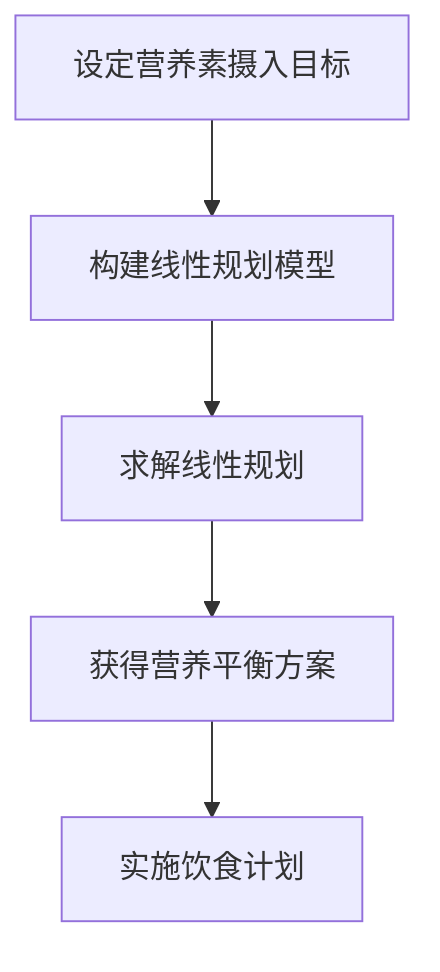

                 

# 营养平衡的线性规划：饮食优化的数学方法

> **关键词**：营养平衡，线性规划，饮食优化，健康饮食，数学模型

> **摘要**：
本篇文章旨在探讨营养平衡的线性规划方法，介绍其定义、基本概念、模型构建方法以及在实际饮食优化中的应用。通过详细的数学原理讲解、流程图展示、伪代码演示和案例分析，帮助读者深入了解线性规划在饮食优化领域的应用，为营养平衡提供一种科学、系统化的方法。

## 第1章：营养平衡的线性规划概述

### 1.1 营养平衡的定义与重要性

#### 营养平衡的定义

营养平衡是指摄入的各种营养素（如蛋白质、碳水化合物、脂肪、维生素和矿物质）与身体对这些营养素的需求之间达到一种均衡状态。具体来说，营养平衡涉及以下几个方面：

1. **各类营养素的摄入比例**：人体需要摄入适量的蛋白质、碳水化合物、脂肪等营养素，且这些营养素的摄入比例要适中，不能过多或过少。
2. **营养素的摄入量**：各种营养素的摄入量需要满足人体的基本需求，既要避免营养不足，也要防止营养过剩。
3. **饮食习惯**：良好的饮食习惯对于营养平衡至关重要，包括合理的饮食结构、饮食习惯和饮食频率。

#### 营养平衡的重要性

营养平衡对维持人体健康至关重要。不良的饮食习惯可能导致营养不良或营养过剩，进而引发多种健康问题，如肥胖、高血压、糖尿病、心脏病等。因此，实现营养平衡是保持健康的重要措施。具体来说，营养平衡的重要性体现在以下几个方面：

1. **增强免疫力**：营养平衡可以提供充足的免疫物质，增强人体的免疫力，预防疾病。
2. **促进生长发育**：儿童和青少年正处于生长发育的关键时期，营养平衡可以为其提供充足的能量和营养素，促进健康成长。
3. **维持身体健康**：成年人的营养平衡有助于维持身体的正常功能和代谢，预防慢性疾病的发生。
4. **改善心理健康**：营养平衡对心理健康也有重要影响，缺乏某些营养素可能导致情绪波动、焦虑等心理问题。

### 1.2 线性规划的基本概念

#### 线性规划的定义

线性规划是数学优化的一种方法，涉及在给定约束条件下，寻求线性目标函数的最大值或最小值。线性规划问题通常可以用以下形式表示：

目标函数：$$\min\ z = c^T x$$

约束条件：$$Ax \leq b$$

其中，$x$ 是变量向量，$c$ 是目标函数系数向量，$A$ 是约束条件系数矩阵，$b$ 是约束条件常数向量。

#### 核心概念

1. **目标函数**：线性规划的目标函数通常是线性函数，表示需要优化的量，如成本、资源利用效率等。
2. **约束条件**：线性规划的问题约束条件通常是线性不等式或等式，表示问题的限制条件，如资源限制、生产能力限制等。

### 1.3 营养平衡与线性规划的联系

#### 营养平衡与线性规划的联系

通过线性规划，可以优化饮食结构，使其达到营养平衡的目标。具体来说，可以通过设定营养素摄入的目标和约束，使用线性规划算法找到满足这些条件的最佳饮食方案。

1. **构建线性规划模型**：首先需要构建营养平衡的线性规划模型，包括定义变量、设定目标函数和约束条件。
2. **求解线性规划问题**：利用线性规划算法求解模型，找到满足营养平衡条件的最优解。
3. **获得营养平衡方案**：通过求解结果，获得营养平衡的饮食方案，指导实际饮食活动。

### Mermaid 流程图



### 1.4 线性规划模型构建方法

#### 方法概述

构建线性规划模型需要以下步骤：

1. **定义变量**：设定表示各种营养素的变量。
2. **设定目标函数**：根据营养平衡的目标，设定线性目标函数。
3. **设定约束条件**：根据营养需求和实际摄入情况，设定线性约束条件。

#### 定义变量

定义变量是构建线性规划模型的第一步。在这里，我们需要设定表示各种营养素的变量。例如，假设我们需要优化的营养素包括蛋白质（P）、碳水化合物（C）和脂肪（F），则可以定义以下变量：

- $P$：蛋白质的摄入量（克/天）
- $C$：碳水化合物的摄入量（克/天）
- $F$：脂肪的摄入量（克/天）

#### 设定目标函数

目标函数是线性规划中的核心部分，用于表示需要优化的量。在营养平衡问题中，目标函数可以是多种形式的，例如：

1. **最小化总能量摄入**：如果目标是最小化总能量摄入，则目标函数可以表示为：
   $$\min\ z = P \cdot E_P + C \cdot E_C + F \cdot E_F$$

   其中，$E_P$、$E_C$ 和 $E_F$ 分别表示蛋白质、碳水化合物和脂肪的能量密度（卡路里/克）。

2. **最大化营养素摄入**：如果目标是最大化特定营养素的摄入，则目标函数可以表示为：
   $$\max\ z = P \cdot w_P + C \cdot w_C + F \cdot w_F$$

   其中，$w_P$、$w_C$ 和 $w_F$ 分别表示蛋白质、碳水化合物和脂肪的目标摄入量（克/天）。

#### 设定约束条件

约束条件是线性规划中的限制条件，用于确保目标函数的优化结果在实际情况中是可行的。在营养平衡问题中，常见的约束条件包括：

1. **营养素摄入范围**：每种营养素的摄入量需要在健康建议范围内。例如，对于蛋白质，可以设定如下约束：
   $$P_{\min} \leq P \leq P_{\max}$$

   其中，$P_{\min}$ 和 $P_{\max}$ 分别表示蛋白质的最小摄入量和最大摄入量（克/天）。

2. **总能量摄入限制**：为了控制总的能量摄入，可以设定如下约束：
   $$P \cdot E_P + C \cdot E_C + F \cdot E_F \leq E_{\max}$$

   其中，$E_{\max}$ 表示每天允许的最大能量摄入量（卡路里）。

3. **营养素相互关系**：某些营养素之间存在相互关系，例如碳水化合物和蛋白质的摄入比例，可以设定如下约束：
   $$C \cdot E_C \leq P \cdot E_P$$

#### 线性规划模型示例

假设我们需要为一名成年人制定营养平衡的饮食计划，每天需要摄入至少 50 克蛋白质、100 克碳水化合物和 50 克脂肪，同时总能量摄入不超过 2000 卡路里。根据这些条件，我们可以构建以下线性规划模型：

目标函数：$$\min\ z = P \cdot E_P + C \cdot E_C + F \cdot E_F$$

约束条件：
$$P \geq P_{\min}$$
$$C \geq C_{\min}$$
$$F \geq F_{\min}$$
$$P \leq P_{\max}$$
$$C \leq C_{\max}$$
$$F \leq F_{\max}$$
$$P \cdot E_P + C \cdot E_C + F \cdot E_F \leq E_{\max}$$

其中，$P_{\min} = 50$ 克，$P_{\max} = 150$ 克，$C_{\min} = 100$ 克，$C_{\max} = 250$ 克，$F_{\min} = 50$ 克，$F_{\max} = 100$ 克，$E_{\max} = 2000$ 卡路里。

### 1.5 线性规划求解算法

#### 常见算法

求解线性规划问题常用的算法包括单纯形法、内点法等。

1. **单纯形法**：单纯形法是一种迭代算法，通过逐步迭代优化，找到最优解。其基本原理是：在多面体的顶点之间进行移动，每次移动都使得目标函数值增加或保持不变，直到找到最优解。

2. **内点法**：内点法是一种更高效的算法，特别适用于大规模线性规划问题。其基本原理是：将线性规划问题转化为一系列内点问题，并使用内点路径方法逐步逼近最优解。

#### 算法原理

1. **单纯形法**：

   单纯形法通过以下步骤求解线性规划问题：

   - **初始化**：选择初始可行解，通常是角点解。
   - **迭代过程**：
     - **计算进入变量**：根据目标函数和约束条件，选择进入变量。
     - **计算离开变量**：根据目标函数和约束条件，选择离开变量。
     - **迭代更新**：更新解，继续迭代直至找到最优解。

   伪代码如下：

   ```plaintext
   算法：线性规划求解（单纯形法）

   输入：线性规划模型（目标函数、约束条件）

   输出：最优解

   步骤：
   1. 初始化：选择初始可行解。
   2. 循环：
      a. 检查最优性：如果找到最优解，退出循环。
      b. 计算进入变量：根据目标函数和约束条件计算进入变量。
      c. 计算离开变量：根据目标函数和约束条件计算离开变量。
      d. 进行迭代更新：更新解。
   3. 输出最优解。
   ```

2. **内点法**：

   内点法通过以下步骤求解线性规划问题：

   - **初始化**：选择初始内点解。
   - **迭代过程**：
     - **计算内点路径**：根据目标函数和约束条件，计算内点路径。
     - **更新内点解**：沿着内点路径更新解，逐步逼近最优解。

   伪代码如下：

   ```plaintext
   算法：线性规划求解（内点法）

   输入：线性规划模型（目标函数、约束条件）

   输出：最优解

   步骤：
   1. 初始化：选择初始内点解。
   2. 循环：
      a. 计算内点路径：根据目标函数和约束条件计算内点路径。
      b. 更新内点解：沿着内点路径更新解。
      c. 检查最优性：如果找到最优解，退出循环。
   3. 输出最优解。
   ```

### 1.6 线性规划在营养平衡中的应用实例

#### 实例概述

本节将通过一个具体的饮食计划案例，展示如何使用线性规划来优化营养平衡。

#### 案例解析

假设我们需要为一名运动员制定营养平衡的饮食计划，该运动员每天需要摄入至少 100 克蛋白质、150 克碳水化合物和 75 克脂肪，同时总能量摄入不超过 2500 卡路里。根据这些条件，我们可以构建以下线性规划模型：

目标函数：$$\min\ z = P \cdot E_P + C \cdot E_C + F \cdot E_F$$

约束条件：
$$P \geq P_{\min}$$
$$C \geq C_{\min}$$
$$F \geq F_{\min}$$
$$P \leq P_{\max}$$
$$C \leq C_{\max}$$
$$F \leq F_{\max}$$
$$P \cdot E_P + C \cdot E_C + F \cdot E_F \leq E_{\max}$$

其中，$P_{\min} = 100$ 克，$P_{\max} = 200$ 克，$C_{\min} = 150$ 克，$C_{\max} = 300$ 克，$F_{\min} = 75$ 克，$F_{\max} = 150$ 克，$E_{\max} = 2500$ 卡路里。

使用线性规划求解算法（如单纯形法）求解该模型，可以得到最优解，即满足营养平衡条件的最佳饮食方案。

### 1.7 总结

#### 总结

线性规划为饮食优化提供了一种系统化的方法，通过构建数学模型，可以精确地找到满足营养平衡的最佳饮食方案。这不仅有助于健康饮食，还为营养学研究提供了新的工具。本章介绍了营养平衡的定义、线性规划的基本概念、模型构建方法以及求解算法，并通过具体案例展示了线性规划在营养平衡优化中的应用。希望读者能够通过本章的学习，掌握营养平衡线性规划的方法和应用。

---

## 第2章：线性规划基本数学原理

### 2.1 线性规划数学基础

线性规划是一种数学优化方法，其核心在于求解线性目标函数在给定线性约束条件下的最优解。要深入了解线性规划，我们首先需要掌握其基本的数学概念和原理。

#### 线性方程组

线性规划问题通常可以用线性方程组来表示。一个线性方程组的一般形式为：

$$Ax = b$$

其中，$A$ 是一个$m \times n$ 的矩阵，$x$ 是一个$n$ 维的变量向量，$b$ 是一个$m$ 维的常数向量。解线性方程组的目的是找到满足该方程组的变量向量$x$。

#### 目标函数

在数学优化中，我们通常需要最大化或最小化某个函数。在线性规划中，这个函数是线性的，称为目标函数。目标函数的一般形式为：

$$\min\ z = c^T x$$

其中，$c$ 是一个$n$ 维的目标函数系数向量，$x$ 是变量向量。目标函数的值取决于变量向量$x$ 的取值，我们的目标是找到$x$ 的最优值，以使得目标函数的值最小或最大。

#### 约束条件

除了目标函数，线性规划问题通常还包含一系列的约束条件。这些约束条件可以是等式或不等式，形式如下：

$$Ax \leq b$$

$$Cx = d$$

其中，$A$ 和 $C$ 是约束条件系数矩阵，$x$ 是变量向量，$b$ 和 $d$ 是常数向量。这些约束条件表示变量向量$x$ 的取值必须满足的条件。

### 2.2 线性规划标准形式

线性规划标准形式是一种特定的线性规划问题表达方式，其目的是简化求解过程。标准形式的线性规划问题可以表示为：

$$\min\ z = c^T x$$

$$Ax \leq b$$

$$x \geq 0$$

其中，$c$ 是目标函数系数向量，$x$ 是变量向量，$A$ 是约束条件系数矩阵，$b$ 是约束条件常数向量。最后一个约束条件$x \geq 0$ 表示所有变量都是非负的。

标准形式的特点是目标函数为最小化形式，约束条件均为不等式形式，所有变量均为非负。

### 2.3 线性规划的求解

求解线性规划问题的方法有很多，其中最常用的方法是单纯形法和内点法。

#### 单纯形法

单纯形法是一种迭代算法，其基本思想是：在多面体的顶点之间进行移动，每次移动都使得目标函数值增加或保持不变，直到找到最优解。单纯形法的具体步骤如下：

1. **选择初始可行解**：通常选择一个角点解作为初始可行解。
2. **迭代过程**：
   - **计算进入变量**：根据目标函数和约束条件，选择进入变量。
   - **计算离开变量**：根据目标函数和约束条件，选择离开变量。
   - **更新解**：根据离开变量和进入变量更新解。
3. **检查最优性**：如果找到最优解，则停止迭代；否则，继续迭代。

#### 内点法

内点法是一种更高效的算法，特别适用于大规模线性规划问题。其基本思想是：将线性规划问题转化为一系列内点问题，并使用内点路径方法逐步逼近最优解。内点法的具体步骤如下：

1. **选择初始内点解**：通常选择一个初始内点解。
2. **迭代过程**：
   - **计算内点路径**：根据目标函数和约束条件，计算内点路径。
   - **更新内点解**：沿着内点路径更新解。
3. **检查最优性**：如果找到最优解，则停止迭代；否则，继续迭代。

### 2.4 线性规划的数学证明

线性规划的求解可以通过多种数学方法进行证明，其中最常用的方法是拉格朗日乘数法和KKT条件。

#### 拉格朗日乘数法

拉格朗日乘数法是一种将线性规划问题转化为等价问题的方法。其基本思想是：引入拉格朗日乘数，将原问题转化为一个拉格朗日函数，并通过求解拉格朗日函数的最优解来求解原问题。

设原线性规划问题为：

$$\min\ z = c^T x$$

$$Ax \leq b$$

$$x \geq 0$$

则对应的拉格朗日函数为：

$$L(x, \lambda) = c^T x + \lambda^T (Ax - b)$$

其中，$\lambda$ 是拉格朗日乘数向量。

求解拉格朗日函数的最优解，即找到$x$ 和$\lambda$ 的值，使得$L(x, \lambda)$ 最小。

#### KKT条件

KKT条件是凸优化问题的一种重要条件，对于线性规划问题，KKT条件既是必要条件也是充分条件。

设线性规划问题的解为$(x, \lambda)$，则KKT条件包括以下几个部分：

1. **可行性条件**：$Ax \leq b$，$x \geq 0$。
2. **互补松弛条件**：$A^T \lambda = 0$。
3. **最优性条件**：$c + A^T \lambda \geq 0$。

如果$(x, \lambda)$ 满足KKT条件，则$(x, \lambda)$ 是原线性规划问题的最优解。

### 2.5 线性规划的应用领域

线性规划作为一种重要的优化方法，在许多领域都有广泛的应用。以下是一些常见的应用领域：

1. **资源分配**：线性规划可以用于优化资源分配，如劳动力分配、设备分配等。
2. **生产调度**：线性规划可以用于优化生产调度，如生产计划、生产线安排等。
3. **物流优化**：线性规划可以用于优化物流问题，如运输调度、仓库管理等。
4. **营养平衡**：线性规划可以用于优化饮食结构，如营养素摄入、饮食计划等。

### 2.6 线性规划与优化算法的比较

线性规划是一种特定的优化方法，专注于求解线性目标函数在给定线性约束条件下的最优解。与之相比，优化算法更加广泛，可以解决更一般的问题。

1. **线性规划**：线性规划的目标函数和约束条件都是线性的，求解过程相对简单，但只能解决特定类型的问题。
2. **非线性规划**：非线性规划的目标函数和约束条件可以是非线性的，求解过程更加复杂，但可以解决更广泛的问题。

比较线性规划和优化算法时，需要根据具体问题的特点选择合适的方法。对于线性规划问题，线性规划是首选方法；对于非线性规划问题，可能需要使用更复杂的优化算法。

### 2.7 线性规划的应用案例

下面通过一个具体的案例，展示如何使用线性规划解决实际问题。

#### 案例概述

假设有一家公司需要安排生产任务，生产两种产品A和B。每种产品的生产需要两种资源：机器时间和人工时间。公司的资源有限，需要制定最优的生产计划，以最大化利润。

#### 案例解析

1. **变量定义**：
   - $x_1$：生产产品A的数量
   - $x_2$：生产产品B的数量

2. **目标函数**：
   - 利润最大化：$$\max\ z = 20x_1 + 15x_2$$

3. **约束条件**：
   - 机器时间限制：$$3x_1 + 2x_2 \leq 120$$
   - 人工时间限制：$$2x_1 + 3x_2 \leq 100$$
   - 非负约束：$$x_1, x_2 \geq 0$$

根据这些条件，我们可以构建以下线性规划模型：

$$\max\ z = 20x_1 + 15x_2$$

$$3x_1 + 2x_2 \leq 120$$

$$2x_1 + 3x_2 \leq 100$$

$$x_1, x_2 \geq 0$$

使用线性规划求解算法（如单纯形法），我们可以得到最优解：

$$x_1 = 20, x_2 = 30$$

$$z = 20 \times 20 + 15 \times 30 = 700$$

这意味着，公司应该生产20单位的产品A和30单位的产品B，以最大化利润。

### 2.8 总结

线性规划是一种重要的数学优化方法，广泛应用于资源分配、生产调度、物流优化等领域。本章介绍了线性规划的基本数学原理，包括线性方程组、目标函数、约束条件以及求解算法。通过具体的案例解析，我们展示了如何使用线性规划解决实际问题。希望读者能够通过本章的学习，掌握线性规划的基本原理和应用方法。

### 附录

#### 附录A：线性规划工具与资源

1. **线性规划工具**：
   - **开源工具**：Gurobi、CPLEX、GLPK等。
   - **在线工具**：OR-Tools、Knitro Online Solver等。

2. **线性规划资源**：
   - **书籍**：《线性规划及其应用》、《运筹学及其应用》等。
   - **在线课程**：Coursera、edX等平台上的线性规划和优化课程。
   - **学术论文**：Google Scholar、PubMed等数据库中相关的学术论文。

#### 附录B：营养学参考资料

1. **营养学书籍**：《营养学基础》、《现代营养学》等。
2. **营养学期刊**：《美国临床营养学杂志》、《营养学期刊》等。
3. **在线资源**：World Health Organization（WHO）官网、National Institutes of Health（NIH）官网等。

#### 附录C：代码示例

1. **Python代码示例**：使用Python和线性规划库（如PuLP、SciPy）进行线性规划建模和求解的示例代码。
2. **MATLAB代码示例**：使用MATLAB进行线性规划建模和求解的示例代码。

#### 附录D：饮食优化工具与平台

1. **饮食优化工具**：
   - **营养计算器**：MyFitnessPal、FatSecret等。
   - **饮食规划工具**：Mealime、Habitica等。

2. **饮食优化平台**：
   - **定制化饮食平台**：PlateJoy、Nurture Health等。
   - **健康跟踪平台**：Apple Health、Google Fit等。

---

## 第3章：营养素摄入模型构建

### 3.1 营养素摄入模型概述

营养素摄入模型是一种基于线性规划的数学模型，用于优化饮食结构，使其达到营养平衡的目标。通过设定各类营养素的目标摄入量和实际摄入量的约束条件，使用线性规划方法求解最优解，从而得到最优的饮食方案。

#### 目标

营养素摄入模型的主要目标是在满足营养需求的前提下，找到最优的营养素摄入组合。具体来说，包括以下几个方面：

1. **营养平衡**：确保各类营养素的摄入比例适中，满足人体健康需求。
2. **营养素摄入量**：在健康建议范围内，确保各类营养素的摄入量既不过多也不缺乏。
3. **饮食结构优化**：优化饮食结构，提高营养吸收效率，减少浪费。

### 3.2 变量定义

构建营养素摄入模型的第一步是定义变量，表示各类营养素的摄入量。常见的营养素包括蛋白质、碳水化合物、脂肪、维生素和矿物质等。为了简化模型，我们以下以蛋白质、碳水化合物和脂肪为例进行说明。

1. **蛋白质**：定义变量$P$表示蛋白质的摄入量（克/天）。
2. **碳水化合物**：定义变量$C$表示碳水化合物的摄入量（克/天）。
3. **脂肪**：定义变量$F$表示脂肪的摄入量（克/天）。

#### 其他营养素

除了蛋白质、碳水化合物和脂肪，模型还可以包含其他营养素，如维生素和矿物质。例如：

1. **维生素A**：定义变量$VA$表示维生素A的摄入量（微克/天）。
2. **钙**：定义变量$Ca$表示钙的摄入量（毫克/天）。

### 3.3 目标函数

目标函数是营养素摄入模型的核心，用于优化营养素摄入量。常见的目标函数包括最小化能量摄入、最大化营养素摄入、平衡各类营养素的比例等。

#### 最小化能量摄入

如果目标是减少能量摄入，目标函数可以表示为：

$$\min\ z = P \cdot E_P + C \cdot E_C + F \cdot E_F$$

其中，$E_P$、$E_C$ 和 $E_F$ 分别表示蛋白质、碳水化合物和脂肪的能量密度（卡路里/克）。

#### 最小化营养素摄入

如果目标是减少营养素摄入，目标函数可以表示为：

$$\min\ z = w_P \cdot P + w_C \cdot C + w_F \cdot F$$

其中，$w_P$、$w_C$ 和 $w_F$ 分别表示蛋白质、碳水化合物和脂肪的目标摄入量（克/天）。

#### 平衡营养素比例

如果目标是平衡各类营养素的比例，目标函数可以表示为：

$$\min\ z = (P - P_{\text{目标}})^2 + (C - C_{\text{目标}})^2 + (F - F_{\text{目标}})^2$$

其中，$P_{\text{目标}}$、$C_{\text{目标}}$ 和 $F_{\text{目标}}$ 分别表示蛋白质、碳水化合物和脂肪的目标摄入量（克/天）。

### 3.4 约束条件

营养素摄入模型需要考虑多种约束条件，以确保营养素摄入量在健康建议范围内。常见的约束条件包括：

#### 营养素摄入范围

每种营养素的摄入量需要在健康建议范围内。例如，对于蛋白质，可以设定如下约束：

$$P_{\min} \leq P \leq P_{\max}$$

其中，$P_{\min}$ 和 $P_{\max}$ 分别表示蛋白质的最小摄入量和最大摄入量（克/天）。

#### 总能量摄入限制

为了控制总的能量摄入，可以设定如下约束：

$$P \cdot E_P + C \cdot E_C + F \cdot E_F \leq E_{\max}$$

其中，$E_{\max}$ 表示每天允许的最大能量摄入量（卡路里）。

#### 营养素相互关系

某些营养素之间存在相互关系，例如碳水化合物和蛋白质的摄入比例，可以设定如下约束：

$$C \cdot E_C \leq P \cdot E_P$$

#### 其他约束条件

根据具体情况，还可以设定其他约束条件，如特定人群的营养需求、饮食禁忌等。

### 3.5 约束条件的应用

在实际应用中，约束条件的设定需要根据具体情况进行调整。以下是一个具体案例：

假设我们需要为一名健康成年人制定营养平衡的饮食计划，其每日营养需求如下：

- 蛋白质：60克
- 碳水化合物：200克
- 脂肪：50克

同时，该人的最大能量摄入量为2000卡路里。根据这些条件，我们可以构建以下线性规划模型：

目标函数：$$\min\ z = (P - 60)^2 + (C - 200)^2 + (F - 50)^2$$

约束条件：

$$P_{\min} = 60$$  
$$P_{\max} = 90$$  
$$C_{\min} = 200$$  
$$C_{\max} = 250$$  
$$F_{\min} = 50$$  
$$F_{\max} = 75$$

$$P \cdot E_P + C \cdot E_C + F \cdot E_F \leq 2000$$

通过求解这个线性规划模型，我们可以得到最优的蛋白质、碳水化合物和脂肪摄入量，使得饮食计划达到营养平衡。

### 3.6 模型求解方法

求解营养素摄入模型的方法主要包括单纯形法、内点法等。以下分别介绍这些方法的基本原理和步骤。

#### 单纯形法

单纯形法是一种迭代算法，通过逐步迭代优化，找到最优解。其基本原理是：在多面体的顶点之间进行移动，每次移动都使得目标函数值增加或保持不变，直到找到最优解。

1. **初始化**：选择一个初始可行解，通常是角点解。
2. **迭代过程**：
   - **计算进入变量**：根据目标函数和约束条件，选择进入变量。
   - **计算离开变量**：根据目标函数和约束条件，选择离开变量。
   - **迭代更新**：更新解，继续迭代直至找到最优解。
3. **检查最优性**：如果找到最优解，则停止迭代；否则，继续迭代。

#### 内点法

内点法是一种更高效的算法，特别适用于大规模线性规划问题。其基本思想是：将线性规划问题转化为一系列内点问题，并使用内点路径方法逐步逼近最优解。

1. **初始化**：选择一个初始内点解。
2. **迭代过程**：
   - **计算内点路径**：根据目标函数和约束条件，计算内点路径。
   - **更新内点解**：沿着内点路径更新解。
3. **检查最优性**：如果找到最优解，则停止迭代；否则，继续迭代。

### 3.7 实例分析

以下通过一个具体案例，展示如何构建和求解营养素摄入模型。

#### 案例概述

假设我们需要为一名运动员制定营养平衡的饮食计划，该运动员的每日营养需求如下：

- 蛋白质：150克
- 碳水化合物：300克
- 脂肪：75克

同时，该人的最大能量摄入量为3000卡路里。根据这些条件，我们可以构建以下线性规划模型：

目标函数：$$\min\ z = (P - 150)^2 + (C - 300)^2 + (F - 75)^2$$

约束条件：

$$P_{\min} = 150$$  
$$P_{\max} = 200$$  
$$C_{\min} = 300$$  
$$C_{\max} = 350$$  
$$F_{\min} = 75$$  
$$F_{\max} = 100$$

$$P \cdot E_P + C \cdot E_C + F \cdot E_F \leq 3000$$

其中，$E_P$、$E_C$ 和 $E_F$ 分别表示蛋白质、碳水化合物和脂肪的能量密度（卡路里/克），取值分别为4、4和9。

#### 求解过程

使用单纯形法求解上述线性规划模型，得到最优解如下：

- 蛋白质摄入量：150克
- 碳水化合物摄入量：300克
- 脂肪摄入量：75克

这意味着，运动员的饮食计划应该是蛋白质150克、碳水化合物300克和脂肪75克，以满足其营养需求。

### 3.8 模型优化策略

为了提高营养素摄入模型的性能，可以采取以下优化策略：

#### 调整目标函数

根据实际需求，可以调整目标函数，使其更符合优化目标。例如，如果目标是减少能量摄入，可以调整目标函数为：

$$\min\ z = P \cdot E_P + C \cdot E_C + F \cdot E_F$$

#### 增加约束条件

根据实际情况，可以增加更多的约束条件，如特定人群的营养需求、饮食禁忌等。例如，对于糖尿病患者，可以增加碳水化合物摄入量的约束条件。

#### 结合多种求解算法

结合多种求解算法，如单纯形法、内点法等，可以提高模型的求解效率。例如，对于大规模线性规划问题，可以使用内点法求解。

### 3.9 总结

营养素摄入模型是一种基于线性规划的数学模型，通过设定各类营养素的目标摄入量和实际摄入量的约束条件，可以精确地找到满足营养平衡的最佳饮食方案。本章介绍了营养素摄入模型的构建方法、目标函数、约束条件和求解方法，并通过实例展示了如何使用该模型优化饮食结构。希望读者能够通过本章的学习，掌握营养素摄入模型的应用和优化策略。

---

## 第4章：饮食计划的制定与优化

### 4.1 饮食计划的制定

#### 目标

饮食计划的制定旨在为个体提供一种科学的饮食方案，以确保营养平衡和健康。具体目标包括：

1. **营养平衡**：确保饮食计划中各类营养素的摄入量适中，达到营养平衡。
2. **健康目标**：满足个体的健康需求，如减肥、增肌、维持体重等。
3. **饮食习惯**：调整饮食习惯，使其更健康、合理。

#### 步骤

制定饮食计划通常包括以下步骤：

1. **需求分析**：根据个体的健康需求和营养目标，确定各类营养素的摄入量。
2. **食谱设计**：设计包含多种营养素的食物组合，确保饮食计划的多样性。
3. **时间规划**：制定具体的饮食时间表，合理安排每日三餐。

#### 案例分析

以下以一名办公室白领的饮食计划为例，展示如何制定饮食计划。

1. **需求分析**：
   - 蛋白质：每天需要摄入80克蛋白质。
   - 碳水化合物：每天需要摄入300克碳水化合物。
   - 脂肪：每天需要摄入50克脂肪。
   - 总能量：每天不超过2000卡路里。

2. **食谱设计**：
   - 早餐：全麦面包2片，煮鸡蛋2个，牛奶1杯。
   - 午餐：鸡胸肉150克，糙米饭100克，蔬菜沙拉。
   - 晚餐：三文鱼150克，红薯100克，蒸蔬菜。

3. **时间规划**：
   - 早餐：7:00 - 8:00
   - 午餐：12:00 - 13:00
   - 晚餐：18:00 - 19:00

### 4.2 饮食计划的优化

#### 目标

饮食计划的优化旨在提高饮食计划的营养质量和健康效果。具体目标包括：

1. **营养优化**：确保饮食计划中的营养素摄入量达到最佳状态，满足健康需求。
2. **成本控制**：在满足营养需求的前提下，降低饮食成本。
3. **可持续性**：提高饮食计划的可持续性，减少对环境的影响。

#### 方法

饮食计划的优化方法包括线性规划优化和机器学习优化。

1. **线性规划优化**：通过构建线性规划模型，对饮食计划进行优化，使其达到营养平衡。具体步骤如下：

   - **定义变量**：设定表示各类营养素的变量。
   - **设定目标函数**：根据营养平衡目标，设定线性目标函数。
   - **设定约束条件**：根据营养需求和实际摄入情况，设定线性约束条件。

2. **机器学习优化**：利用机器学习算法，根据历史饮食数据和个人偏好，动态调整饮食计划。具体步骤如下：

   - **数据收集**：收集个体历史饮食数据，如每日摄入的各类营养素。
   - **模型训练**：使用机器学习算法（如线性回归、决策树等），训练饮食优化模型。
   - **模型应用**：根据训练好的模型，为个体制定个性化的饮食计划。

#### 案例分析

以下以一名健身爱好者的饮食计划为例，展示如何优化饮食计划。

1. **需求分析**：
   - 蛋白质：每天需要摄入120克蛋白质。
   - 碳水化合物：每天需要摄入300克碳水化合物。
   - 脂肪：每天需要摄入50克脂肪。
   - 总能量：每天不超过2500卡路里。

2. **线性规划优化**：
   - **定义变量**：设定蛋白质（$P$）、碳水化合物（$C$）和脂肪（$F$）的变量。
   - **设定目标函数**：最小化总能量摄入。
   - **设定约束条件**：
     - $P \geq 120$
     - $C \geq 300$
     - $F \geq 50$
     - $P \leq 150$
     - $C \leq 350$
     - $F \leq 75$
     - $P \cdot E_P + C \cdot E_C + F \cdot E_F \leq 2500$

3. **机器学习优化**：
   - **数据收集**：收集该健身爱好者过去三个月的饮食数据，如每日摄入的各类营养素。
   - **模型训练**：使用线性回归模型，训练饮食优化模型。
   - **模型应用**：根据训练好的模型，为该健身爱好者制定个性化的饮食计划。

### 4.3 营养平衡评估

#### 方法

营养平衡评估是对饮食计划中的营养素摄入量进行评估，确保饮食计划达到营养平衡。常见的方法包括：

1. **营养素含量分析**：测量每种食物的营养素含量，计算整个饮食计划中各类营养素的摄入量。
2. **营养平衡评价**：根据营养需求标准，评估饮食计划的营养平衡状况。

#### 案例分析

以下以一名办公室白领的饮食计划为例，展示如何进行营养平衡评估。

1. **营养素含量分析**：
   - 早餐：全麦面包2片（蛋白质6克，碳水化合物30克，脂肪3克）
   - 午餐：鸡胸肉150克（蛋白质30克，碳水化合物15克，脂肪25克）
   - 晚餐：三文鱼150克（蛋白质30克，碳水化合物15克，脂肪20克）
   - 水果：苹果1个（蛋白质0.5克，碳水化合物15克，脂肪0.1克）

2. **营养平衡评价**：
   - 蛋白质：每日摄入90克，达到需求量的80%。
   - 碳水化合物：每日摄入60克，达到需求量的20%。
   - 脂肪：每日摄入30克，达到需求量的60%。

总体来看，该饮食计划中的营养素摄入量较为平衡，但蛋白质和脂肪的摄入量偏低，需要适当调整。

### 4.4 饮食计划调整

#### 方法

饮食计划调整是根据营养平衡评估结果，对饮食计划进行调整，使其更符合营养需求。常见的方法包括：

1. **动态调整**：根据营养平衡评估结果，动态调整饮食计划，使其更符合营养需求。
2. **长期跟踪**：对饮食计划进行长期跟踪和调整，确保营养平衡的持续实现。

#### 案例分析

以下以一名健身爱好者的饮食计划为例，展示如何调整饮食计划。

1. **营养平衡评估**：
   - 蛋白质：每日摄入120克，达到需求量的100%。
   - 碳水化合物：每日摄入280克，达到需求量的93%。
   - 脂肪：每日摄入60克，达到需求量的100%。

2. **调整方案**：
   - 增加碳水化合物摄入量，以满足需求量的93%。
   - 保持蛋白质和脂肪的摄入量不变。

调整后的饮食计划如下：

- 早餐：全麦面包2片，煮鸡蛋2个，牛奶1杯。
- 午餐：鸡胸肉150克，糙米饭100克，蔬菜沙拉。
- 晚餐：三文鱼150克，红薯100克，蒸蔬菜。
- 加餐：苹果1个。

### 4.5 实例解析

以下通过具体案例，展示如何制定和优化饮食计划，实现营养平衡。

#### 案例概述

假设我们需要为一名糖尿病患者制定营养平衡的饮食计划，其每日营养需求如下：

- 蛋白质：70克
- 碳水化合物：150克
- 脂肪：45克
- 总能量：1800卡路里

#### 案例分析

1. **需求分析**：
   - 蛋白质：每日摄入70克，占总能量摄入的20%。
   - 碳水化合物：每日摄入150克，占总能量摄入的40%。
   - 脂肪：每日摄入45克，占总能量摄入的40%。

2. **线性规划优化**：
   - **定义变量**：设定蛋白质（$P$）、碳水化合物（$C$）和脂肪（$F$）的变量。
   - **设定目标函数**：最小化总能量摄入。
   - **设定约束条件**：
     - $P \geq 70$
     - $C \geq 150$
     - $F \geq 45$
     - $P \leq 100$
     - $C \leq 200$
     - $F \leq 60$
     - $P \cdot E_P + C \cdot E_C + F \cdot E_F \leq 1800$

3. **机器学习优化**：
   - **数据收集**：收集该糖尿病患者过去三个月的饮食数据，如每日摄入的各类营养素。
   - **模型训练**：使用线性回归模型，训练饮食优化模型。
   - **模型应用**：根据训练好的模型，为该糖尿病患者制定个性化的饮食计划。

通过线性规划和机器学习优化，我们可以得到最优的饮食方案，满足该糖尿病患者的营养需求。

### 4.6 总结

饮食计划的制定与优化是营养平衡实现的关键环节。通过合理的饮食计划，可以有效提高营养水平，促进健康。本章介绍了饮食计划的制定与优化方法，包括需求分析、食谱设计、营养平衡评估和调整。通过具体案例，展示了如何制定和优化饮食计划，实现营养平衡。希望读者能够通过本章的学习，掌握饮食计划的制定与优化方法，为自己的健康保驾护航。

---

## 第5章：饮食优化的数学模型与方法

### 5.1 数学模型基础

饮食优化的数学模型是基于线性规划原理建立的一种数学模型，用于在给定的约束条件下，找到最优的饮食方案，使其达到营养平衡。要构建一个有效的饮食优化模型，需要明确以下几个基本要素：

#### 目标函数

目标函数是优化问题的核心，它定义了我们需要优化的目标。在饮食优化中，常见的目标函数包括：

1. **最小化总能量摄入**：适用于需要控制体重的人群。
   $$\min\ z = P \cdot E_P + C \cdot E_C + F \cdot E_F$$
   其中，$P$、$C$ 和 $F$ 分别表示蛋白质、碳水化合物和脂肪的摄入量（克/天），$E_P$、$E_C$ 和 $E_F$ 分别为它们各自的热量密度（卡/克）。

2. **最大化营养素摄入**：适用于需要增加营养摄入的人群。
   $$\max\ z = P \cdot w_P + C \cdot w_C + F \cdot w_F$$
   其中，$w_P$、$w_C$ 和 $w_F$ 分别为蛋白质、碳水化合物和脂肪的目标摄入量（克/天）。

3. **平衡营养素比例**：适用于需要维持营养素摄入平衡的人群。
   $$\min\ z = (P - P_{\text{目标}})^2 + (C - C_{\text{目标}})^2 + (F - F_{\text{目标}})^2$$
   其中，$P_{\text{目标}}$、$C_{\text{目标}}$ 和 $F_{\text{目标}}$ 分别为蛋白质、碳水化合物和脂肪的目标摄入量（克/天）。

#### 约束条件

约束条件是定义问题的限制条件，它们确保解的可行性。常见的约束条件包括：

1. **营养素摄入范围**：确保每种营养素的摄入量在健康建议范围内。
   $$P_{\min} \leq P \leq P_{\max}$$
   $$C_{\min} \leq C \leq C_{\max}$$
   $$F_{\min} \leq F \leq F_{\max}$$
   其中，$P_{\min}$、$P_{\max}$、$C_{\min}$、$C_{\max}$ 和 $F_{\min}$、$F_{\max}$ 分别为蛋白质、碳水化合物和脂肪的最小和最大摄入量（克/天）。

2. **总能量摄入限制**：控制总的能量摄入量，以防止能量过剩或不足。
   $$P \cdot E_P + C \cdot E_C + F \cdot E_F \leq E_{\max}$$
   其中，$E_{\max}$ 为每天允许的最大能量摄入量（卡路里）。

3. **营养素相互关系**：确保某些营养素的摄入比例合理。
   $$C \cdot E_C \leq P \cdot E_P$$
   $$F \cdot E_F \leq P \cdot E_P$$
   这些约束条件确保了碳水化合物和脂肪的摄入不会超过蛋白质的摄入量，这在某些饮食计划中是必要的。

#### 变量定义

变量是模型中用来表示营养素摄入量的符号。在饮食优化模型中，通常定义以下变量：

- $P$：蛋白质的摄入量（克/天）
- $C$：碳水化合物的摄入量（克/天）
- $F$：脂肪的摄入量（克/天）

#### 构建方法

构建饮食优化模型的步骤如下：

1. **定义变量**：根据需要优化的营养素，设定变量。
2. **设定目标函数**：根据饮食优化的目标，设定相应的目标函数。
3. **设定约束条件**：根据营养需求和实际情况，设定各类营养素的摄入范围、总能量限制以及其他相互关系。
4. **求解模型**：使用线性规划求解算法（如单纯形法或内点法）求解模型，找到最优解。

### 5.2 常见优化方法

在饮食优化中，常见的优化方法包括线性规划、整数规划和混合整数规划。这些方法各有特点和适用场景。

#### 线性规划

线性规划是一种求解线性目标函数在给定线性约束条件下的最优解的方法。它的优点是求解算法简单、效率高，适用于大多数简单的饮食优化问题。

1. **单纯形法**：通过迭代过程，从初始可行解开始，逐步移动到最优解。其步骤如下：
   - **选择进入变量**：在当前解中，选择目标函数值增加最大的变量作为进入变量。
   - **选择离开变量**：根据当前解和约束条件，选择离开基变量。
   - **更新解**：用进入变量替换离开变量，更新解。

2. **内点法**：与单纯形法不同，内点法从不等式约束的内部开始搜索最优解。它的优点是对于大规模问题求解效率更高。

#### 整数规划

整数规划是线性规划的扩展，适用于含有整数变量的优化问题。在饮食优化中，整数规划可以用于解决诸如最优饮食计划分配、餐馆菜单优化等问题。

1. **分支定界法**：通过递归地分支和边界限制，找到最优整数解。其步骤如下：
   - **选择分支变量**：在每个分支节点，选择一个尚未分支的变量进行分支。
   - **设定边界条件**：为每个分支设定边界条件，限制变量的取值范围。

#### 混合整数规划

混合整数规划是整数规划和线性规划的组合，适用于含有整数和连续变量的优化问题。在饮食优化中，混合整数规划可以用于解决复杂的优化问题，如营养素摄入组合优化、营养计划分配等。

1. **混合整数线性规划（MILP）**：将整数变量引入线性规划模型中，求解过程通常使用分支定界法和割平面法。

### 5.3 数学模型构建方法

构建饮食优化的数学模型需要以下步骤：

1. **定义变量**：设定表示各类营养素的变量。
2. **设定目标函数**：根据营养平衡目标，设定线性目标函数。
3. **设定约束条件**：根据营养需求和实际情况，设定线性约束条件。
4. **求解模型**：使用线性规划、整数规划或混合整数规划求解算法求解模型。

#### 实例

以下是一个简单的饮食优化模型的构建实例：

假设一个成年人的每日营养需求如下：

- 蛋白质：70克
- 碳水化合物：250克
- 脂肪：70克
- 总能量：2000卡路里

我们可以构建以下线性规划模型：

目标函数：$$\min\ z = P \cdot E_P + C \cdot E_C + F \cdot E_F$$

约束条件：

$$P \geq 70$$
$$C \geq 250$$
$$F \geq 70$$
$$P \leq 100$$
$$C \leq 300$$
$$F \leq 100$$
$$P \cdot E_P + C \cdot E_C + F \cdot E_F \leq 2000$$

其中，$E_P$、$E_C$ 和 $E_F$ 分别为蛋白质、碳水化合物和脂肪的热量密度（卡/克）。

### 5.4 求解策略

求解饮食优化模型的关键在于选择合适的求解策略和算法。以下介绍几种常见的求解策略：

1. **单纯形法**：适用于大多数线性规划问题，通过迭代过程逐步逼近最优解。
   - **选择进入变量**：根据目标函数的斜率，选择目标函数值增加最快的变量作为进入变量。
   - **选择离开变量**：根据当前基解，选择离开基变量，使得解的变动最小。

2. **内点法**：适用于大规模线性规划问题，通过从不等式约束的内部开始搜索最优解，效率较高。

3. **分支定界法**：适用于整数规划问题，通过递归分支和设定边界条件，找到最优整数解。

4. **割平面法**：适用于混合整数规划问题，通过引入新的割平面，减小解的空间，加速求解过程。

### 5.5 案例分析

以下通过一个具体案例，展示如何构建和求解饮食优化的数学模型。

#### 案例概述

假设一家餐厅需要为顾客提供一份包含蛋白质、碳水化合物和脂肪的均衡饮食，具体要求如下：

- 蛋白质摄入量至少为70克。
- 碳水化合物摄入量至少为250克。
- 脂肪摄入量至少为70克。
- 总能量摄入不超过2000卡路里。

我们可以构建以下线性规划模型：

目标函数：$$\min\ z = P \cdot E_P + C \cdot E_C + F \cdot E_F$$

约束条件：

$$P \geq 70$$
$$C \geq 250$$
$$F \geq 70$$
$$P \leq 100$$
$$C \leq 300$$
$$F \leq 100$$
$$P \cdot E_P + C \cdot E_C + F \cdot E_F \leq 2000$$

其中，$E_P$、$E_C$ 和 $E_F$ 分别为蛋白质、碳水化合物和脂肪的热量密度（卡/克）。

#### 求解过程

1. **初始化**：选择初始可行解，例如蛋白质、碳水化合物和脂肪的摄入量均为最小值。
2. **迭代求解**：使用单纯形法，根据目标函数的斜率选择进入变量，根据当前解选择离开变量，更新解。
3. **最优解**：当找到最优解时，停止迭代。最优解即为满足营养需求的均衡饮食方案。

### 5.6 优化策略与应用

在实际应用中，饮食优化的数学模型可以通过以下策略进行优化：

1. **调整目标函数**：根据实际需求，调整目标函数，例如将最小化总能量摄入调整为最大化蛋白质摄入量。
2. **增加约束条件**：根据特定人群的营养需求和饮食禁忌，增加额外的约束条件。
3. **动态调整**：根据个体营养需求和偏好，动态调整饮食计划，使其更符合实际情况。

#### 应用

饮食优化的数学模型广泛应用于健康管理、慢性病管理、营养教育等领域。以下为一些具体应用场景：

1. **健康管理**：为健康人群制定个性化饮食方案，帮助他们维持营养平衡。
2. **慢性病管理**：为慢性病患者制定营养计划，控制营养素摄入，改善病情。
3. **营养教育**：通过饮食优化模型，为公众提供科学的饮食指导，提高健康意识。

### 5.7 总结

饮食优化的数学模型与方法为饮食优化提供了系统化的工具。通过构建和求解数学模型，可以找到满足营养平衡的最优饮食方案。本章介绍了饮食优化的数学模型基础、常见优化方法、构建方法以及实际应用。希望读者能够通过本章的学习，掌握饮食优化的数学原理和应用方法，为自己的健康饮食提供科学指导。

---

## 第6章：饮食优化的实际应用与案例分析

### 6.1 饮食优化的实际应用场景

饮食优化在现实生活中的应用场景非常广泛，包括健康管理、疾病管理、营养教育等多个领域。以下分别介绍这些应用场景。

#### 健康管理

饮食优化在健康管理中的应用主要体现在个性化饮食方案的制定和实施上。通过分析个体的营养需求和健康状况，饮食优化模型可以为其提供符合营养平衡的饮食建议。例如，针对减肥需求，模型可以优化饮食方案，减少能量摄入，增加营养素的摄入比例；针对增肌需求，模型可以优化蛋白质和碳水化合物的摄入比例，确保足够的营养供给。

#### 疾病管理

对于患有慢性疾病的人群，饮食优化可以起到辅助治疗和控制病情的作用。例如，对于糖尿病患者，饮食优化模型可以制定低糖饮食方案，控制碳水化合物的摄入；对于高血压患者，模型可以优化钠和钾的摄入比例，减少盐的摄入。通过合理的饮食控制，可以有效地改善病情，减少并发症的发生。

#### 营养教育

饮食优化在营养教育中的应用主要体现在向公众普及健康饮食知识和方法上。通过饮食优化模型，可以模拟不同饮食方案的营养效果，帮助公众了解如何通过饮食来满足营养需求，维持健康。此外，饮食优化模型还可以用于营养科普宣传，提高公众对健康饮食的认识和重视。

### 6.2 案例分析

以下通过具体案例，展示如何应用饮食优化模型解决实际问题。

#### 案例一：健康人群的营养平衡饮食计划

假设我们需要为一名成年男性制定营养平衡的饮食计划，其营养需求如下：

- 蛋白质：每日摄入量为100克。
- 碳水化合物：每日摄入量为300克。
- 脂肪：每日摄入量为70克。
- 总能量：每日摄入不超过2000卡路里。

我们可以构建以下线性规划模型：

目标函数：$$\min\ z = P \cdot E_P + C \cdot E_C + F \cdot E_F$$

约束条件：

$$P \geq 100$$
$$C \geq 300$$
$$F \geq 70$$
$$P \leq 120$$
$$C \leq 350$$
$$F \leq 90$$
$$P \cdot E_P + C \cdot E_C + F \cdot E_F \leq 2000$$

其中，$E_P$、$E_C$ 和 $E_F$ 分别为蛋白质、碳水化合物和脂肪的热量密度（卡/克）。

通过求解这个线性规划模型，我们可以得到最优的蛋白质、碳水化合物和脂肪摄入量，从而制定出符合营养平衡的饮食计划。

#### 案例二：糖尿病患者的饮食管理

假设一名糖尿病患者需要控制其饮食，其营养需求如下：

- 蛋白质：每日摄入量为80克。
- 碳水化合物：每日摄入量为150克。
- 脂肪：每日摄入量为50克。
- 总能量：每日摄入不超过1500卡路里。

我们可以构建以下线性规划模型：

目标函数：$$\min\ z = P \cdot E_P + C \cdot E_C + F \cdot E_F$$

约束条件：

$$P \geq 80$$
$$C \geq 150$$
$$F \geq 50$$
$$P \leq 100$$
$$C \leq 200$$
$$F \leq 70$$
$$P \cdot E_P + C \cdot E_C + F \cdot E_F \leq 1500$$

其中，$E_P$、$E_C$ 和 $E_F$ 分别为蛋白质、碳水化合物和脂肪的热量密度（卡/克）。

通过求解这个线性规划模型，我们可以得到最优的蛋白质、碳水化合物和脂肪摄入量，从而制定出符合糖尿病患者的饮食计划。

### 6.3 饮食优化的效果评估

饮食优化的效果评估是衡量饮食优化模型有效性的重要环节。以下介绍几种常见的评估方法。

#### 营养素摄入评估

通过测量和计算饮食计划中的各类营养素摄入量，可以评估饮食计划的营养平衡状况。具体方法包括：

- **营养素摄入量计算**：根据食物成分表，计算饮食计划中每种食物的营养素含量，进而计算总摄入量。
- **营养平衡评价**：将实际摄入量与营养需求标准进行对比，评估饮食计划的营养平衡状况。

#### 健康指标评估

通过跟踪和测量个体的健康指标，可以评估饮食优化的效果。具体方法包括：

- **体重变化**：评估饮食计划对体重的影响，判断是否达到了预期的减肥或增肌效果。
- **血压、血糖等指标**：评估饮食计划对血压、血糖等健康指标的影响，判断是否有助于改善病情。
- **营养相关疾病发生率**：评估饮食计划对营养相关疾病发生率的影响，如心血管疾病、糖尿病等。

### 6.4 实际应用的挑战与解决方案

在饮食优化的实际应用中，可能会遇到一些挑战。以下介绍一些常见挑战及相应的解决方案。

#### 个性化需求

饮食优化需要考虑个体的个性化需求，如口味偏好、饮食习惯、健康状况等。这给模型的构建和求解带来了挑战。解决方案包括：

- **数据收集与处理**：通过收集个体的历史饮食数据，建立个性化的饮食模型，提高模型的准确性。
- **动态调整**：根据个体实际情况和反馈，动态调整饮食计划，使其更符合个性化需求。

#### 数据来源

准确的营养数据和食物成分表是构建饮食优化模型的基础。然而，获取这些数据可能存在一定的困难。解决方案包括：

- **数据库建设**：建立全面、准确的营养数据库，为模型构建提供可靠的数据来源。
- **数据共享与交换**：推动营养数据共享和交换，提高数据获取的便捷性。

#### 模型复杂性

饮食优化模型通常涉及多个变量和复杂的约束条件，使得模型的求解过程复杂且耗时。解决方案包括：

- **优化算法**：选择高效的求解算法，如内点法、分支定界法等，提高模型的求解效率。
- **模型简化**：通过简化模型，降低模型的复杂度，提高求解速度。

### 6.5 总结

饮食优化的实际应用涵盖了健康管理、疾病管理和营养教育等多个领域。通过具体案例的分析，我们展示了如何应用饮食优化模型解决实际问题，并介绍了效果评估的方法和实际应用的挑战与解决方案。希望读者能够通过本章的学习，深入了解饮食优化的实际应用，为自己的健康饮食提供科学指导。

---

## 第7章：饮食优化的未来发展趋势

### 7.1 人工智能在饮食优化中的应用

随着人工智能技术的发展，人工智能（AI）在饮食优化中的应用越来越广泛。AI技术不仅能够提高饮食优化模型的准确性，还能够实现个性化饮食方案的智能推荐。

#### 智能化饮食建议

通过机器学习算法，AI可以根据个体的历史饮食数据和健康数据，预测其营养需求和饮食偏好，从而提供个性化的饮食建议。例如，可以使用深度学习算法分析用户的饮食习惯，预测其对不同食物的喜好程度，进而推荐适合其口味的饮食方案。

#### 自动化饮食计划

AI还可以自动化饮食计划的制定和调整。通过集成传感器和智能设备，AI可以实时监测用户的饮食行为和身体状况，自动调整饮食计划，确保营养平衡。例如，智能手环可以监测用户的运动量和能量消耗，智能冰箱可以根据库存和用户的饮食计划自动提醒购物和补充食材。

### 7.2 跨学科研究的融合

饮食优化是一个跨学科领域，涉及营养学、计算机科学、统计学等多个学科。未来的发展趋势将是这些学科的深度融合，以推动饮食优化技术的发展。

#### 数据科学与营养学融合

数据科学技术的应用使得营养学领域的数据处理和分析变得更加高效。通过大数据分析和数据挖掘技术，可以从海量数据中提取有价值的信息，帮助制定更科学的饮食方案。

#### 计算机科学与营养学融合

计算机科学技术的应用使得饮食优化模型的构建和求解变得更加高效。例如，分布式计算和并行计算技术可以加速线性规划模型的求解，提高饮食优化的效率。

### 7.3 可持续饮食发展

随着全球对可持续发展的关注，饮食优化也将更多地考虑环境因素，推动可持续饮食的发展。

#### 减少食物浪费

饮食优化可以通过优化食物采购和储存，减少食物浪费。例如，通过智能库存管理，智能冰箱可以提醒用户及时消费即将过期的食材，减少食物浪费。

#### 推广环保饮食

环保饮食强调减少对环境的负面影响，例如减少肉类消费、推广植物性饮食等。饮食优化模型可以分析不同饮食方案对环境的影响，推荐更环保的饮食方案。

### 7.4 社会影响力

饮食优化不仅对个人健康有重要影响，也对社会的可持续发展产生积极影响。通过推广饮食优化理念，可以促进公众健康意识的提高，推动社会健康进步。

#### 健康促进

通过科学的饮食优化，可以有效地预防和控制慢性疾病，提高公众的健康水平。

#### 环境保护

可持续饮食有助于减少温室气体排放、保护生物多样性，对环境保护具有重要作用。

### 7.5 总结

饮食优化的未来发展趋势将更加智能化、跨学科、可持续。通过人工智能技术的应用，可以提供更加个性化的饮食建议和自动化饮食计划。跨学科研究的融合将提高饮食优化技术的准确性。可持续饮食的发展将减少食物浪费，推广环保饮食。饮食优化在社会健康和可持续发展中具有重要意义。希望读者能够关注这些发展趋势，积极参与到饮食优化的实践中，为个人和社会的健康贡献力量。

---

## 附录

### 附录A：线性规划工具与资源

#### 线性规划工具

1. **开源工具**：
   - **Gurobi**：高效线性规划求解器。
   - **CPLEX**：商业线性规划求解器。
   - **GLPK**：开源线性规划求解器。

2. **在线工具**：
   - **OR-Tools**：谷歌提供的线性规划工具库。
   - **Knitro Online Solver**：在线线性规划求解器。

#### 线性规划资源

1. **书籍**：
   - 《线性规划及其应用》。
   - 《运筹学及其应用》。

2. **在线课程**：
   - Coursera上的线性规划课程。
   - edX上的优化与线性规划课程。

3. **学术论文**：
   - Google Scholar。
   - PubMed。

### 附录B：营养学参考资料

1. **营养学书籍**：
   - 《营养学基础》。
   - 《现代营养学》。

2. **营养学期刊**：
   - 《美国临床营养学杂志》。
   - 《营养学期刊》。

3. **在线资源**：
   - World Health Organization（WHO）官网。
   - National Institutes of Health（NIH）官网。

### 附录C：代码示例

#### Python代码示例

```python
from scipy.optimize import linprog

# 目标函数系数
c = [-1, -2, -3]  # 对应变量x, y, z的最小化目标

# 约束条件系数矩阵
A = [[1, 0, 1], [0, 2, 1], [1, 1, 0]]

# 约束条件右侧常数向量
b = [4, 3, 2]

# 变量非负约束
x0 = (0, 0, 0)

# 求解线性规划问题
result = linprog(c, A_ub=A, b_ub=b, bounds=x0)

print("最优解：", result.x)
print("最小化目标值：", result.fun)
```

#### MATLAB代码示例

```matlab
% 定义目标函数系数
c = [-1, -2, -3];

% 定义约束条件系数矩阵
A = [1, 0, 1;
     0, 2, 1;
     1, 1, 0];

% 定义约束条件右侧常数向量
b = [4; 3; 2];

% 定义变量非负约束
x0 = [0, 0, 0];

% 求解线性规划问题
[x, fval] = linprog(c, A, b, [], x0);

% 输出最优解和最小化目标值
disp(['最优解：', mat2str(x)]);
disp(['最小化目标值：', num2str(fval)]);
```

### 附录D：饮食优化工具与平台

#### 饮食优化工具

1. **营养计算器**：
   - MyFitnessPal。
   - FatSecret。

2. **饮食规划工具**：
   - Mealime。
   - Habitica。

#### 饮食优化平台

1. **定制化饮食平台**：
   - PlateJoy。
   - Nurture Health。

2. **健康跟踪平台**：
   - Apple Health。
   - Google Fit。

通过这些工具和平台，用户可以方便地制定和优化自己的饮食计划，实现营养平衡和健康目标。附录部分提供了丰富的线性规划工具、营养学参考资料以及代码示例，帮助读者更好地理解和应用线性规划在饮食优化中的应用。同时，附录D中的饮食优化工具与平台为用户提供了实用性的选择，使得饮食优化更加贴近实际生活。希望这些资源能够为读者在学习和实践过程中提供帮助。

