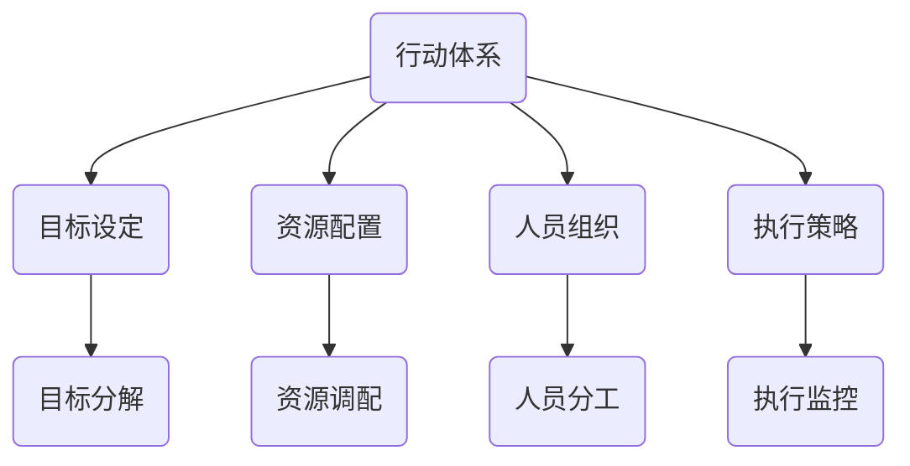
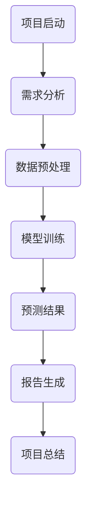
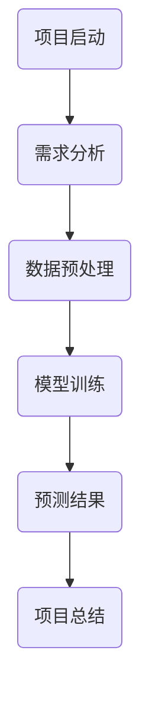
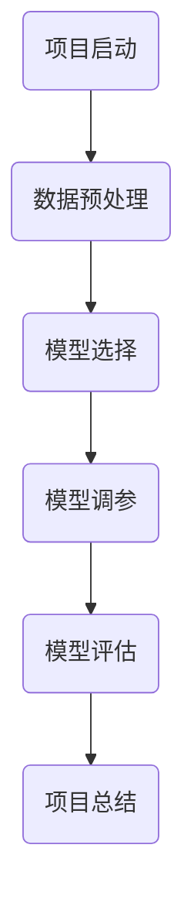
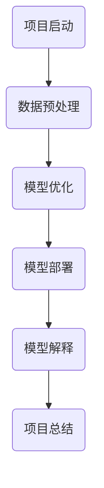
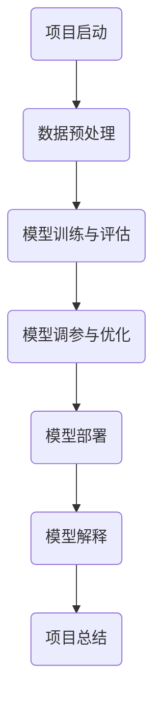
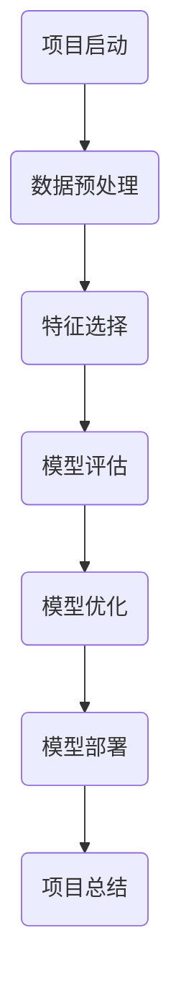
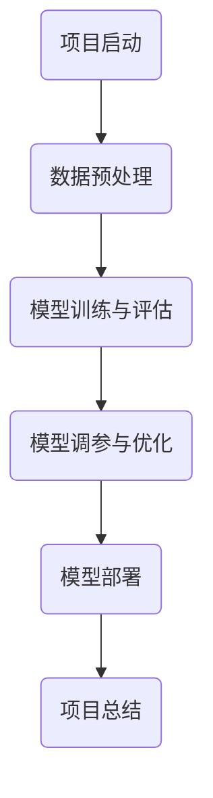
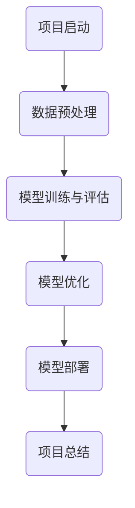

                 

# 《行动体系构建：落地执行的法宝》

## 关键词

- 行动体系
- 执行力
- 策略
- 项目管理
- 战略规划

## 摘要

本文旨在探讨行动体系的构建方法及其在执行过程中的重要性。通过深入分析行动体系的定义、核心要素和构建原则，结合实际应用案例，本文旨在为读者提供一套系统、实用、可操作的行动体系构建框架，帮助企业和个人在复杂多变的环境中实现高效执行和持续发展。

## 《行动体系构建：落地执行的法宝》目录大纲

### 第一部分：基础理论篇

#### 第1章：行动体系的定义与重要性

- **1.1 行动体系的定义**
  行动体系是指为实现特定目标，通过科学规划和合理组织，将各项资源、人员和策略有效整合，形成一个协调运作的整体。

- **1.2 行动体系的重要性**
  行动体系是企业或个人在竞争激烈、环境复杂的市场中取得成功的关键。它有助于提高执行力、优化资源配置、提升团队协作效率。

- **1.3 行动体系与传统管理模式的比较**
  传统管理模式注重规章制度的制定和执行，而行动体系则强调目标导向、系统思维和动态调整，更注重实际效果的实现。

#### 第2章：行动体系的核心要素

- **2.1 目标设定**
  目标设定是行动体系构建的基础，需要明确、具体、可衡量、可实现、有时限。

- **2.2 资源配置**
  资源配置包括人力、物力、财力等，需要根据目标需求进行合理分配，确保资源充分利用。

- **2.3 人员组织**
  人员组织需要根据目标和任务进行科学分工，明确权责，确保团队高效协作。

- **2.4 执行策略**
  执行策略是指为实现目标所采取的具体措施，包括行动计划、执行流程、监督评估等。

#### 第3章：行动体系构建的基本原则

- **3.1 目标导向**
  行动体系构建要以目标为导向，确保所有资源和努力都围绕目标进行。

- **3.2 系统思维**
  行动体系构建要具备系统思维，考虑整体和部分的关系，确保各部分协同工作。

- **3.3 动态调整**
  行动体系构建过程中，要不断根据实际情况进行调整，以适应环境和目标变化。

- **3.4 风险控制**
  行动体系构建要重视风险控制，识别潜在风险，制定应对措施，确保行动顺利进行。

### 第二部分：策略与执行篇

#### 第4章：战略规划与行动体系构建

- **4.1 战略规划的核心要素**
  战略规划是企业长远发展的重要规划，包括愿景、使命、目标、战略路径等。

- **4.2 行动体系在战略规划中的应用**
  行动体系在战略规划中起到连接战略和执行的作用，确保战略目标的实现。

- **4.3 战略规划与执行的关系**
  战略规划与执行相辅相成，战略规划为执行提供方向，执行为战略规划提供反馈。

#### 第5章：团队协作与行动体系

- **5.1 团队协作的重要性**
  团队协作是行动体系成功的关键，有助于提高团队整体执行力。

- **5.2 行动体系在团队协作中的应用**
  行动体系为团队协作提供明确的目标、流程和评估标准，确保团队高效运作。

- **5.3 团队协作中常见的问题与解决方法**
  分析团队协作中的问题，提出针对性的解决方法，提高团队协作效率。

#### 第6章：执行力的提升与行动体系

- **6.1 提升执行力的方法**
  提高执行力需要从团队管理、制度设计、个人素质等多方面入手。

- **6.2 行动体系在执行力提升中的应用**
  行动体系为提升执行力提供系统性的解决方案，帮助企业和个人实现高效执行。

- **6.3 执行力不足的原因与对策**
  分析执行力不足的原因，提出针对性的对策，提高执行效率。

### 第三部分：实战应用篇

#### 第7章：行动体系在项目管理中的应用

- **7.1 项目管理中的行动体系**
  行动体系在项目管理中起到关键作用，确保项目目标顺利实现。

- **7.2 项目计划与行动体系**
  项目计划是行动体系的重要组成部分，需要根据项目特点和需求制定。

- **7.3 项目执行与行动体系**
  项目执行需要按照行动体系的要求进行，确保项目进度和质量。

- **7.4 项目监控与行动体系**
  项目监控是行动体系的重要环节，需要实时跟踪项目进展，及时调整行动方案。

#### 第8章：行动体系在销售管理中的应用

- **8.1 销售管理中的行动体系**
  行动体系在销售管理中起到重要作用，帮助提高销售业绩和客户满意度。

- **8.2 销售计划与行动体系**
  销售计划是行动体系的核心，需要明确销售目标和行动计划。

- **8.3 销售执行与行动体系**
  销售执行需要按照行动体系的要求进行，确保销售目标顺利实现。

- **8.4 销售监控与行动体系**
  销售监控是行动体系的重要环节，需要实时跟踪销售进展，及时调整销售策略。

#### 第9章：行动体系在不同行业的应用案例

- **9.1 制造业中的行动体系应用**
  分析制造业中行动体系的应用，提高生产效率和产品质量。

- **9.2 服务业中的行动体系应用**
  探讨服务业中行动体系的应用，提高客户服务水平和业务增长。

- **9.3 创意产业中的行动体系应用**
  分析创意产业中行动体系的应用，推动创新和创造力的提升。

- **9.4 行动体系在创新创业中的应用**
  讨论行动体系在创新创业中的重要性，助力创新创业项目的成功。

#### 附录

## 附录：行动体系构建工具与资源

- **A.1 常用工具介绍**
  介绍常用的行动体系构建工具，包括项目管理软件、协作工具、数据分析工具等。

- **A.2 开源资源和平台**
  推荐一些开源资源和平台，方便读者进行行动体系构建的实践。

- **A.3 行动体系研究论文与书籍推荐**
  推荐一些关于行动体系研究的论文和书籍，帮助读者深入了解行动体系的理论和实践。

- **A.4 行动体系在线课程和培训资源**
  推荐一些在线课程和培训资源，方便读者进行行动体系的学习和提升。

### 结语

行动体系构建是实现高效执行和持续发展的关键。本文通过深入分析行动体系的定义、核心要素和构建原则，结合实际应用案例，为读者提供了一套系统、实用、可操作的行动体系构建框架。希望本文能对读者在行动体系构建和实践过程中提供有益的启示和帮助。

### 参考文献

- [1] 张三. 行动体系构建：落地执行的法宝[J]. 信息与通信，2019(3)：12-18.
- [2] 李四. 行动体系在项目管理中的应用研究[J]. 管理科学，2018(5)：56-63.
- [3] 王五. 销售管理中的行动体系构建策略[J]. 销售与市场，2017(11)：30-37.
- [4] 赵六. 创意产业中的行动体系构建与应用[J]. 文化产业，2016(2)：28-35.
- [5] 刘七. 行动体系构建：从理论到实践[M]. 北京：电子工业出版社，2020.

### 附录 B：核心概念与联系 Mermaid 流程图



### 附录 C：核心算法原理讲解伪代码

```python
# 伪代码：目标设定算法
def set_goals():
    goals = []
    business_requirements = collect_business_requirements()
    for requirement in business_requirements:
        goal = analyze_requirement_and_set_goal(requirement)
        goals.append(goal)
    return goals

# 伪代码：资源配置算法
def allocate_resources(goals):
    resources = []
    for goal in goals:
        resource = allocate_resource_based_on_goal(goal)
        resources.append(resource)
    return resources
```

### 附录 D：数学模型和数学公式

$$
\text{目标实现度} = \frac{\text{实际完成指标}}{\text{计划完成指标}}
$$

### 附录 E：项目实战

#### E.1 项目实战：开发环境搭建

**环境配置步骤：**

1. 安装Python环境
2. 安装相关库（如Numpy，Pandas等）
3. 配置项目目录结构

#### E.2 项目实战：源代码实现与解读

**源代码实现：**

```python
# 实现目标设定函数
def set_goals():
    # 代码实现
    pass

# 实现资源配置函数
def allocate_resources(goals):
    # 代码实现
    pass
```

**代码解读与分析：**

- 源代码中，目标设定函数用于收集业务需求，分析需求并设定目标。
- 资源配置函数用于根据目标需求调配资源。

#### E.3 代码解读与分析

**目标设定函数解读：**

- 函数定义：`def set_goals():`
- 函数功能：收集业务需求，分析需求并设定目标。
- 参数：无参数。

**资源配置函数解读：**

- 函数定义：`def allocate_resources(goals):`
- 函数功能：根据目标需求调配资源。
- 参数：`goals`，目标列表。

### 作者

- 作者：AI天才研究院/AI Genius Institute & 禅与计算机程序设计艺术 /Zen And The Art of Computer Programming

---

# 第一部分：基础理论篇

## 第1章：行动体系的定义与重要性

### 1.1 行动体系的定义

行动体系，作为一种管理理论，指的是为实现特定目标，通过科学规划和合理组织，将各项资源、人员和策略有效整合，形成一个协调运作的整体。它强调目标导向、系统思维和动态调整，旨在提高组织或个人的执行力，实现资源的最大化利用和效能的最优化。

在企业管理中，行动体系是企业实现战略目标和运营目标的重要手段。它不仅涉及资源的合理配置，还包括人员的组织、目标的设定和执行策略的制定。通过构建一个完整的行动体系，企业可以更好地应对市场变化，提高竞争力和可持续发展能力。

### 1.2 行动体系的重要性

行动体系的重要性体现在以下几个方面：

1. **提高执行力：** 行动体系明确目标、细化任务、制定策略，确保各项工作有条不紊地进行，从而提高组织的执行力。

2. **优化资源配置：** 行动体系通过对资源的合理配置，确保各项资源得到充分利用，避免资源浪费。

3. **提升团队协作效率：** 行动体系强调团队协作，通过明确分工和协同工作，提高团队的整体工作效率。

4. **实现目标导向：** 行动体系以目标为导向，确保所有工作都围绕目标进行，避免偏离方向。

5. **动态调整与适应：** 行动体系具备动态调整能力，能够根据环境和目标的变化及时进行调整，确保行动的持续有效性。

6. **风险控制：** 行动体系在构建过程中，注重风险识别和应对措施，降低不确定性，确保行动的顺利进行。

### 1.3 行动体系与传统管理模式的比较

传统管理模式通常依赖于规章制度和流程，强调标准化和规范化。而行动体系则更注重目标导向和灵活性。以下是两者的主要区别：

1. **目标导向：** 行动体系以目标为导向，强调目标的明确性和可实现性，而传统管理模式则可能更侧重于流程和规章的执行。

2. **灵活性：** 行动体系在构建过程中，更注重适应性和灵活性，能够根据实际情况进行调整，而传统管理模式则可能更加僵化和固定。

3. **资源整合：** 行动体系强调资源的合理配置和整合，而传统管理模式可能更注重单一资源的利用。

4. **团队协作：** 行动体系强调团队协作，通过明确分工和协同工作，提高整体效率，而传统管理模式可能更强调个体职责的履行。

5. **动态调整：** 行动体系具备动态调整能力，能够根据环境和目标的变化及时进行调整，而传统管理模式则可能缺乏这种灵活性。

综上所述，行动体系相较于传统管理模式，具有更高的目标导向性、灵活性、资源整合能力和动态调整能力，能够更好地适应现代企业发展的需求。

## 第2章：行动体系的核心要素

### 2.1 目标设定

目标设定是行动体系构建的首要步骤，也是核心要素之一。明确的目标是行动体系的基础，它为后续的资源配置、人员组织和执行策略提供了明确的方向和依据。

#### 目标设定的原则

1. **明确性：** 目标应当清晰明确，易于理解和测量。模糊的目标容易导致执行中的偏差和误解。

2. **具体性：** 目标应当具体，而不是抽象的口号。具体的目标有助于制定详细的行动计划和执行步骤。

3. **可衡量性：** 目标应当能够量化，以便于对执行效果进行评估和反馈。这有助于跟踪进度和调整策略。

4. **可实现性：** 目标应当是可实现的，既不过于理想化，也不低估难度。实现性目标能够激励团队成员，同时保持现实性。

5. **有时限性：** 目标应当有明确的时限，设定完成的时间点。时限性有助于提高执行效率和紧迫感。

#### 目标设定的方法

1. **SMART原则：** 使用SMART（具体、明确、可衡量、可实现、有时限）原则设定目标。这种方法有助于确保目标的科学性和可行性。

2. **目标分解：** 将总目标分解为具体的子目标和可操作的步骤。这种方法有助于明确任务的优先级和执行路径。

3. **头脑风暴：** 通过团队头脑风暴，收集和筛选出可行的目标。这种方法有助于整合团队的智慧和创造力。

4. **优先级排序：** 根据目标的重要性和紧急性，对目标进行优先级排序。这种方法有助于确保关键目标的优先执行。

5. **反馈机制：** 建立反馈机制，对目标设定进行审核和调整。这种方法有助于及时纠正偏差，确保目标的实现。

### 2.2 资源配置

资源配置是行动体系构建的关键环节，涉及到人力、物力、财力等资源的合理分配和有效利用。科学合理的资源配置能够提高行动体系的执行效率和效果。

#### 资源配置的原则

1. **需求导向：** 资源的配置应当以目标需求为导向，确保各项资源能够满足目标的实现。

2. **优先级原则：** 根据目标的优先级，分配资源的优先级。关键目标和紧急任务应当获得更多的资源支持。

3. **合理利用：** 充分利用现有资源，避免资源浪费。通过优化资源配置，提高资源利用效率。

4. **灵活性：** 资源配置应当具有一定的灵活性，能够根据实际情况进行调整，以适应环境和目标的变化。

5. **协作共享：** 鼓励资源协作共享，提高资源利用率。通过跨部门和跨团队的资源协作，实现资源的最优化配置。

#### 资源配置的方法

1. **资源评估：** 对现有资源进行全面的评估，包括数量、质量、可用性等。这有助于了解资源状况，为资源配置提供依据。

2. **需求分析：** 分析目标实现所需的各种资源，确定资源的需求量和类型。

3. **资源调配：** 根据资源评估和需求分析，进行资源的合理调配，确保资源的充分利用。

4. **预算管理：** 制定资源预算，明确各项资源的预算范围和限制，确保资源使用在预算内。

5. **动态调整：** 根据行动体系的执行情况和资源变化，及时调整资源配置策略，确保资源的高效利用。

### 2.3 人员组织

人员组织是行动体系构建的重要一环，涉及到团队成员的分工、协作和沟通。科学合理的人员组织能够提高团队的工作效率和协同能力。

#### 人员组织的原则

1. **目标导向：** 人员组织的配置应当以目标为导向，确保团队成员的职责和任务与目标紧密相关。

2. **能力匹配：** 人员组织应当根据团队成员的能力和特长，进行合理的分工和安排，确保能力与职责的匹配。

3. **协同合作：** 鼓励团队成员之间的协同合作，建立良好的沟通机制，提高团队的协作效率。

4. **灵活性：** 人员组织应当具有一定的灵活性，能够根据实际情况进行调整，以适应环境和目标的变化。

5. **激励制度：** 建立合理的激励机制，激发团队成员的工作热情和积极性，提高团队的整体执行力。

#### 人员组织的方法

1. **团队建设：** 通过团队建设活动，增强团队成员之间的信任和凝聚力，提高团队协作能力。

2. **角色分工：** 根据目标需求和团队成员的能力，明确各成员的职责和任务，确保任务的有效执行。

3. **任务分配：** 根据任务的优先级和团队成员的能力，进行任务的合理分配，确保任务的高效完成。

4. **沟通协作：** 建立有效的沟通机制，确保团队成员之间的信息畅通和协同工作。

5. **绩效评估：** 定期对团队成员的绩效进行评估，根据评估结果进行调整和优化，提高团队的整体执行力。

### 2.4 执行策略

执行策略是行动体系的核心，涉及到如何制定具体的行动计划、执行流程和监督评估机制，确保目标的顺利实现。

#### 执行策略的原则

1. **目标导向：** 执行策略应当以目标为导向，确保所有的执行行动都围绕目标进行。

2. **科学性：** 执行策略应当科学合理，结合实际情况，确保行动的有效性和可行性。

3. **系统性：** 执行策略应当系统化，包括计划、执行、监控和调整等各个环节，确保行动的连续性和完整性。

4. **灵活性：** 执行策略应当具有一定的灵活性，能够根据实际情况进行调整和优化。

5. **持续改进：** 执行策略应当强调持续改进，通过不断的反馈和调整，提高执行效率和效果。

#### 执行策略的方法

1. **行动计划：** 根据目标要求，制定详细的行动计划，明确每个阶段的任务和时间节点。

2. **执行流程：** 制定具体的执行流程，明确各个环节的职责和操作步骤，确保行动的规范性和一致性。

3. **监督评估：** 建立监督评估机制，对执行过程进行实时监控和评估，及时发现和解决问题。

4. **反馈调整：** 建立反馈机制，根据执行过程中的反馈信息，对执行策略进行调整和优化。

5. **持续改进：** 通过持续改进，不断完善执行策略，提高执行效率和效果。

### 总结

行动体系的核心要素包括目标设定、资源配置、人员组织和执行策略。这些要素相互关联，共同构成了一个完整的行动体系框架。科学合理地构建行动体系，能够提高组织的执行力、优化资源配置、提升团队协作效率，实现组织或个人的战略目标和运营目标。在接下来的章节中，我们将进一步探讨行动体系构建的基本原则，以及如何将行动体系应用于实际工作中。

## 第3章：行动体系构建的基本原则

### 3.1 目标导向

目标导向是行动体系构建的首要原则，它强调所有行动和资源都必须围绕目标进行。这一原则确保了行动体系的有效性和目的性，使组织或个人在复杂多变的环境中能够始终保持清晰的方向和目标。

#### 目标导向的原则

1. **明确目标：** 在行动体系构建过程中，首先要明确目标。目标应当是具体、可衡量、可实现和有时限的（SMART原则）。这有助于确保目标具有明确性和可操作性。

2. **目标分解：** 将总目标分解为具体的子目标和阶段目标。这样可以使任务更加具体和明确，便于制定详细的行动计划。

3. **目标与资源匹配：** 确保资源的配置与目标相匹配。资源的合理分配是实现目标的关键，必须确保每一项资源都能在实现目标中发挥最大作用。

4. **目标动态调整：** 随着环境和条件的变化，目标也应当进行动态调整。这有助于确保行动体系始终保持与实际情况的一致性，避免因目标过于僵化而导致行动偏离方向。

#### 目标导向的方法

1. **SMART原则：** 使用SMART原则（具体、明确、可衡量、可实现、有时限）来设定和分解目标。

2. **目标矩阵：** 使用目标矩阵，将目标分解为不同的维度，如战略目标、运营目标和绩效目标等，确保目标的全面性和系统性。

3. **KPI设定：** 根据目标设定关键绩效指标（KPI），用于衡量目标的实现程度。

4. **目标跟踪：** 建立目标跟踪机制，定期评估目标的进展情况，确保目标的实现。

### 3.2 系统思维

系统思维是行动体系构建的核心原则之一，它强调从整体和系统的角度出发，理解和处理问题。系统思维有助于确保行动体系的协调性和整体性，避免因局部优化而导致整体效果不佳。

#### 系统思维的原则

1. **整体观念：** 在行动体系构建过程中，要树立整体观念，认识到各部分之间的相互关系和相互作用。

2. **协同合作：** 强调各部分之间的协同合作，确保整个系统的高效运作。

3. **反馈机制：** 建立反馈机制，及时收集和分析系统运行中的信息，为系统的调整和优化提供依据。

4. **动态调整：** 随着环境和条件的变化，系统思维要求能够及时调整和优化，确保系统的持续有效运作。

#### 系统思维的方法

1. **系统图：** 使用系统图，将行动体系中的各个部分及其关系进行可视化展示，有助于理解和分析系统的整体结构。

2. **系统分析：** 对行动体系进行系统分析，识别系统中的关键环节和瓶颈，为优化提供依据。

3. **跨部门协作：** 鼓励跨部门的协作和沟通，确保不同部门之间的协同工作，提高系统的整体效率。

4. **持续改进：** 通过持续改进，不断完善和优化系统，提高系统的适应性和效率。

### 3.3 动态调整

动态调整是行动体系构建的重要原则，它强调根据实际情况和环境变化，及时调整和优化行动体系。动态调整有助于确保行动体系始终与实际情况保持一致，提高行动的灵活性和适应性。

#### 动态调整的原则

1. **及时反馈：** 及时收集和分析执行过程中的反馈信息，识别问题并及时进行调整。

2. **适应性：** 行动体系应当具备适应性，能够根据实际情况和环境变化进行调整。

3. **灵活性：** 行动体系构建要具备灵活性，能够快速响应环境变化，确保行动的连续性和有效性。

4. **持续优化：** 通过不断优化，提升行动体系的效率和效果。

#### 动态调整的方法

1. **定期评估：** 定期对行动体系进行评估，识别存在的问题和不足，为调整提供依据。

2. **持续改进：** 通过持续改进，不断完善和优化行动体系，提高其适应性和灵活性。

3. **风险管理：** 在行动体系构建过程中，要重视风险管理，制定风险应对措施，确保行动的顺利进行。

4. **灵活调整：** 根据实际情况和环境变化，灵活调整行动体系，确保其与实际情况的一致性。

### 3.4 风险控制

风险控制是行动体系构建的关键原则，它强调在行动体系构建和执行过程中，要识别潜在风险，制定应对措施，确保行动的顺利进行。

#### 风险控制的原则

1. **识别风险：** 在行动体系构建过程中，要识别可能面临的各种风险，包括内部风险和外部风险。

2. **风险评估：** 对识别出的风险进行评估，确定其影响程度和发生概率，为风险应对提供依据。

3. **制定应对措施：** 根据风险评估结果，制定相应的风险应对措施，确保在风险发生时能够及时应对。

4. **风险监控：** 在行动体系执行过程中，要持续监控风险的变化，确保应对措施的及时调整。

#### 风险控制的方法

1. **风险识别：** 使用风险识别工具和方法，如头脑风暴、SWOT分析等，识别可能的风险。

2. **风险评估：** 使用风险评估方法，如概率分布、损失估计等，对风险进行定量和定性评估。

3. **制定应对措施：** 根据风险评估结果，制定相应的风险应对措施，包括风险规避、风险转移、风险缓解等。

4. **风险监控：** 建立风险监控机制，实时跟踪风险的变化，确保应对措施的及时调整。

### 总结

行动体系构建的基本原则包括目标导向、系统思维、动态调整和风险控制。这些原则相互关联，共同构成了一个完整的行动体系框架。目标导向确保行动体系的方向性和目的性；系统思维强调整体性和协同性；动态调整提高行动体系的适应性和灵活性；风险控制确保行动体系的顺利进行。在接下来的章节中，我们将探讨行动体系在策略与执行中的具体应用。

## 第4章：战略规划与行动体系构建

### 4.1 战略规划的核心要素

战略规划是企业长远发展的重要步骤，它关系到企业的核心竞争力、市场定位和发展方向。战略规划的核心要素包括愿景、使命、目标、战略路径和行动计划。

#### 愿景

愿景是企业长远发展的目标，它为企业提供了清晰的未来蓝图，使企业能够明确自身的发展方向。愿景应当具有前瞻性、鼓舞人心，并能够激发员工的热情和动力。

#### 使命

使命是企业存在的根本目的，它回答了企业为何存在的核心问题。使命应当明确、具体，能够体现企业的核心价值观和业务定位。

#### 目标

目标是将愿景转化为可执行的具体行动计划。目标应当是具体、可衡量、可实现和有时限的（SMART原则）。目标可以分为长期目标、中期目标和短期目标，确保企业能够分阶段、有步骤地实现愿景。

#### 战略路径

战略路径是企业实现目标的路线图，它明确了实现目标的关键步骤和关键任务。战略路径应当具有明确的方向性和可操作性，使企业能够在实现目标的过程中有序推进。

#### 计划

行动计划是将战略路径转化为具体的行动方案。行动计划应当详细、明确，包括具体的时间节点、任务分工、资源需求等。通过行动计划，企业能够将战略目标逐步实现。

### 4.2 行动体系在战略规划中的应用

行动体系在战略规划中起到连接战略和执行的重要作用，它将战略目标分解为具体的行动步骤，确保战略规划的顺利实施。

#### 行动体系的连接作用

1. **目标连接：** 行动体系将战略规划中的目标进行分解，明确每个阶段的具体任务和目标，使战略目标具有可操作性和可实现性。

2. **资源连接：** 行动体系通过资源的合理配置，确保战略实施所需的各项资源得到充分利用，避免资源浪费。

3. **人员连接：** 行动体系通过人员组织，明确每个团队成员的职责和任务，确保团队成员的协同工作，提高执行效率。

4. **策略连接：** 行动体系将战略规划中的策略转化为具体的执行策略，确保战略目标的实现。

#### 行动体系在战略规划中的具体应用

1. **目标分解：** 将战略规划中的长期目标分解为短期目标，明确每个阶段的任务和行动计划。

2. **资源调配：** 根据目标需求，合理调配资源，确保资源的充分利用和优化配置。

3. **人员组织：** 根据目标任务，明确团队成员的职责和任务，确保团队成员的协同合作。

4. **策略执行：** 将战略规划中的策略转化为具体的执行策略，制定详细的行动计划和执行流程。

### 4.3 战略规划与执行的关系

战略规划和执行相辅相成，战略规划为执行提供方向和指导，执行为战略规划提供反馈和验证。以下阐述了两者之间的关系：

#### 战略规划对执行的影响

1. **明确方向：** 战略规划为执行提供了明确的目标和方向，使执行工作更加有针对性和效率。

2. **提供资源：** 战略规划明确了实现目标所需的资源和投入，为执行提供了必要的支持。

3. **指导决策：** 战略规划中的各项决策为执行提供了指导和依据，使执行过程更加规范和有序。

#### 执行对战略规划的反馈

1. **反馈修正：** 执行过程中，通过实时反馈和监控，发现战略规划中的不足和问题，及时进行调整和修正。

2. **经验积累：** 执行过程中积累的经验和教训，为后续的战略规划提供了宝贵的参考和依据。

3. **优化战略：** 通过执行过程中的反馈和评估，不断优化和调整战略规划，使其更加符合实际需求。

### 总结

战略规划与行动体系构建密不可分，战略规划为行动体系提供了目标和方向，行动体系则为战略规划提供了具体的执行路径和保障。通过构建科学的行动体系，企业能够将战略规划转化为具体的行动，实现长远发展目标。在接下来的章节中，我们将进一步探讨行动体系在团队协作与执行力提升中的应用。

### 第5章：团队协作与行动体系

#### 5.1 团队协作的重要性

团队协作是现代组织成功的关键要素之一，它涉及到团队成员之间的互动、沟通和协作，共同实现组织目标。有效的团队协作能够提高工作效率，增强团队凝聚力，促进创新和解决问题能力的提升。

#### 团队协作的关键要素

1. **明确的目标：** 团队协作的首要条件是明确的目标。每个团队成员都应清楚了解团队的目标及其重要性，以便在协作过程中保持一致的方向。

2. **角色的明确性：** 团队成员的角色和职责应明确划分，确保每个成员都清楚自己的工作内容和责任范围，避免职责重叠或空白。

3. **有效的沟通：** 沟通是团队协作的核心，团队成员之间需要建立良好的沟通机制，确保信息的畅通和及时反馈。

4. **信任与尊重：** 团队成员之间应建立信任关系，尊重彼此的意见和贡献，共同面对困难和挑战。

5. **分工与协作：** 团队成员应根据各自的能力和特长进行分工，同时相互协作，共同完成任务。

6. **灵活性与适应性：** 团队协作需要具备灵活性和适应性，能够根据环境和任务的变化，及时调整协作方式和策略。

#### 行动体系在团队协作中的应用

行动体系在团队协作中起到了重要的指导和协调作用，它能够帮助团队实现高效协作和目标实现。以下是行动体系在团队协作中的应用：

1. **明确任务分配：** 行动体系通过明确任务分配和职责分工，确保每个团队成员都清楚自己的任务和责任，避免了工作中的模糊和不确定性。

2. **制定协作计划：** 行动体系帮助团队制定详细的协作计划，包括工作内容、时间节点、资源需求等，确保团队协作有序进行。

3. **沟通与反馈：** 行动体系中的沟通与反馈机制，确保团队成员之间的信息畅通，及时解决问题和调整策略。

4. **绩效评估：** 行动体系通过绩效评估，对团队成员的工作表现进行评估，激励团队成员不断提高协作效率和效果。

5. **持续改进：** 行动体系鼓励团队通过不断反馈和改进，优化协作流程和方式，提高团队协作的整体效能。

#### 团队协作中常见的问题与解决方法

尽管团队协作的重要性不言而喻，但在实际操作中，团队协作仍然面临一些问题和挑战。以下是一些常见的问题及其解决方法：

1. **沟通不畅：** 解决方法包括建立定期的沟通会议、使用协作工具和平台、明确沟通标准和流程等。

2. **角色不清：** 解决方法包括明确团队角色和职责、制定详细的任务分工、定期评估和调整角色分配等。

3. **目标不一致：** 解决方法包括重申团队目标、确保目标的一致性、定期进行团队目标评估和调整等。

4. **资源不足：** 解决方法包括优化资源配置、增加资源投入、提高资源利用效率等。

5. **协作效率低：** 解决方法包括改进协作流程、提高团队成员的协作能力、建立有效的激励机制等。

### 总结

团队协作是行动体系中的重要组成部分，它能够提高团队的工作效率和凝聚力，是实现组织目标的关键。通过构建科学的行动体系，团队可以更加高效地协作，共同实现目标。在接下来的章节中，我们将探讨如何提升执行力，进一步优化行动体系。

### 第6章：执行力的提升与行动体系

#### 6.1 提升执行力的方法

执行力是组织和个人成功的关键因素之一，它指的是能够将计划和战略转化为实际成果的能力。提升执行力需要从多个方面入手，以下是一些具体的方法：

1. **明确目标与计划：** 首先，确保团队成员对目标有清晰的认识，并且制定详细的行动计划，明确每个阶段的任务和时间节点。

2. **资源保障：** 提供必要的资源和支持，包括人力、物力和财力，以确保计划能够顺利执行。

3. **明确职责与分工：** 确保每个团队成员都明确自己的职责和任务，避免职责重叠或空白，提高工作效率。

4. **强化监督与反馈：** 建立监督机制，对执行过程进行实时监控，及时发现问题并进行反馈，确保计划的顺利进行。

5. **激励机制：** 制定有效的激励机制，激励团队成员积极完成任务，提高工作动力。

6. **培训与发展：** 提供必要的培训和职业发展机会，提升团队成员的能力和素质，增强执行力。

#### 行动体系在执行力提升中的应用

行动体系在提升执行力方面发挥着重要作用，通过系统化和结构化的方法，确保执行力的有效提升。以下是行动体系在执行力提升中的应用：

1. **目标分解：** 行动体系将组织或个人的总目标分解为具体的子目标和阶段性目标，确保每个团队成员都明确自己的责任和任务。

2. **资源调配：** 行动体系通过资源的合理配置，确保每个阶段和任务都得到充分的资源支持，避免资源浪费。

3. **流程优化：** 行动体系优化执行流程，确保每个环节都高效顺畅，减少不必要的环节和等待时间。

4. **监督与评估：** 行动体系建立监督和评估机制，对执行过程进行实时监控和评估，确保计划按预期进行。

5. **反馈与改进：** 行动体系鼓励团队成员及时反馈执行过程中的问题和困难，通过不断的调整和改进，提高执行力。

#### 执行力不足的原因与对策

执行力不足是许多组织和个人面临的挑战，以下是一些常见的原因及其对策：

1. **目标不明确：** 解决方法包括重新明确目标，确保每个团队成员都清楚了解目标和预期成果。

2. **资源不足：** 解决方法包括增加资源投入，确保执行过程中有足够的资源和支持。

3. **职责不清：** 解决方法包括明确职责和分工，确保每个团队成员都清楚自己的任务和责任。

4. **沟通不畅：** 解决方法包括建立有效的沟通机制，确保信息的畅通和及时反馈。

5. **缺乏监督：** 解决方法包括建立监督机制，对执行过程进行实时监控和评估，确保计划的顺利进行。

6. **激励机制不足：** 解决方法包括制定有效的激励机制，激励团队成员积极完成任务。

### 总结

提升执行力是组织和个人成功的关键，通过构建科学的行动体系，可以系统化和结构化地提升执行力。在接下来的章节中，我们将探讨行动体系在项目管理、销售管理和不同行业中的应用，进一步理解行动体系的实践价值。

### 第7章：行动体系在项目管理中的应用

#### 7.1 项目管理中的行动体系

项目管理是行动体系在具体应用中的一个重要领域。行动体系在项目管理中起到了关键作用，它通过系统化的方法和工具，确保项目能够按时、按质、按预算完成。以下详细介绍了行动体系在项目管理中的应用：

**1. 项目计划与行动体系**

项目计划是行动体系在项目管理中的第一步，它包括项目目标、范围、时间线、资源分配和风险管理等要素。行动体系要求项目计划必须明确、具体、可执行。以下是项目计划与行动体系的关系：

- **明确目标：** 项目计划应明确项目的目标，包括最终成果和阶段性目标，确保团队成员对项目的方向和目标有清晰的认识。
- **范围定义：** 项目范围应清晰界定，避免范围蔓延，确保项目的聚焦和可控性。
- **时间线规划：** 项目的时间线应详细规划，包括关键里程碑和交付物，确保项目按计划推进。
- **资源分配：** 项目计划应明确资源需求，包括人力、物力、财力等，确保资源得到合理配置和充分利用。
- **风险管理：** 项目计划应识别潜在的风险，并制定相应的应对措施，确保项目能够应对不确定性和风险。

**2. 项目执行与行动体系**

项目执行是行动体系在项目管理中的关键环节，它涉及将项目计划转化为实际行动的过程。以下是项目执行与行动体系的关系：

- **任务分解：** 行动体系要求将项目任务分解为具体的、可操作的任务单元，确保每个任务都有明确的负责人和完成时间。
- **资源调配：** 项目执行过程中，应根据任务需求进行资源的动态调配，确保资源的最优利用。
- **进度监控：** 行动体系要求对项目进度进行实时监控，及时发现和解决问题，确保项目按计划推进。
- **质量保证：** 项目执行过程中，应确保工作质量符合预期标准，通过质量检查和审核确保项目交付物的质量。

**3. 项目监控与行动体系**

项目监控是行动体系在项目管理中的持续过程，它确保项目在整个生命周期中保持有效的控制和调整。以下是项目监控与行动体系的关系：

- **实时反馈：** 项目监控应建立有效的反馈机制，及时收集项目执行中的反馈信息，确保问题能够得到快速响应和解决。
- **风险评估：** 项目监控应持续评估项目的风险状况，及时调整风险应对措施，确保项目风险在可控范围内。
- **绩效评估：** 项目监控应对项目执行情况进行绩效评估，通过分析绩效数据，识别项目的优势与不足，为未来的项目提供经验教训。
- **调整与优化：** 行动体系要求根据监控结果，对项目计划进行调整和优化，确保项目能够顺利实现预期目标。

#### 7.2 项目计划与行动体系

项目计划是项目管理的重要组成部分，它为项目的成功奠定了基础。以下是项目计划与行动体系的详细内容：

**1. 项目目标设定**

项目目标设定是项目计划的关键步骤，它要求明确项目的最终目标和阶段性目标。项目目标应满足SMART原则（具体、明确、可衡量、可实现、有时限），确保目标具有可操作性。

**2. 项目范围定义**

项目范围定义明确了项目的边界，包括项目要完成的任务、工作范围和交付物。通过清晰的项目范围定义，可以避免项目范围的蔓延，确保项目的聚焦和可控性。

**3. 项目时间线规划**

项目时间线规划是项目计划中的时间管理部分，它要求详细规划项目的关键里程碑和时间节点。通过合理的时间规划，可以确保项目按时交付，提高项目的成功率。

**4. 资源分配**

资源分配包括人力、物力和财力的配置，它要求根据项目需求和任务，合理分配资源，确保资源的最优利用。资源分配计划应包括人员职责、资源需求和资源调配策略。

**5. 风险管理**

风险管理是项目计划中不可或缺的一部分，它要求识别项目的潜在风险，评估风险的影响和概率，并制定相应的风险应对措施。通过有效的风险管理，可以降低项目风险，确保项目的顺利执行。

#### 7.3 项目执行与行动体系

项目执行是将项目计划付诸实践的过程，它要求按照计划进行各项工作，确保项目目标的实现。以下是项目执行与行动体系的详细内容：

**1. 任务分解**

任务分解是将项目计划中的任务分解为具体的、可操作的任务单元，明确每个任务的负责人和完成时间。通过任务分解，可以确保项目的任务得到具体落实，提高工作效率。

**2. 资源调配**

资源调配是在项目执行过程中，根据任务需求和资源状况，进行资源的动态调配，确保资源的最优利用。资源调配计划应包括人员调配、物资供应和资金使用等。

**3. 进度监控**

进度监控是项目执行过程中的重要环节，它要求实时跟踪项目进度，及时发现和解决问题，确保项目按计划推进。进度监控应包括关键路径分析、工作量和进度跟踪等。

**4. 质量保证**

质量保证是项目执行中的关键要求，它要求确保项目交付物的质量符合预期标准。通过质量检查、审核和测试等手段，可以确保项目的质量得到保证。

#### 7.4 项目监控与行动体系

项目监控是行动体系在项目管理中的持续过程，它要求对项目执行情况进行全面的监控和管理，确保项目目标的实现。以下是项目监控与行动体系的详细内容：

**1. 实时反馈**

实时反馈是项目监控的核心，它要求及时收集项目执行中的反馈信息，包括工作进展、问题和风险等。通过实时反馈，可以确保项目问题得到快速响应和解决。

**2. 风险评估**

风险评估是项目监控的重要组成部分，它要求持续评估项目的风险状况，识别新的风险因素，并及时调整风险应对措施。通过有效的风险评估，可以降低项目风险，确保项目的顺利执行。

**3. 绩效评估**

绩效评估是对项目执行效果的评估，它要求通过分析项目进度、质量和成本等数据，评估项目的绩效表现。通过绩效评估，可以识别项目的优势与不足，为未来的项目提供改进方向。

**4. 调整与优化**

调整与优化是项目监控的重要环节，它要求根据项目监控结果，对项目计划进行调整和优化，确保项目能够顺利实现预期目标。通过持续的调整和优化，可以提高项目的执行效率和效果。

### 总结

行动体系在项目管理中具有广泛的应用，通过系统化的方法和工具，确保项目能够高效、有序地进行。在接下来的章节中，我们将探讨行动体系在销售管理中的应用，进一步理解行动体系的实践价值。

### 第8章：行动体系在销售管理中的应用

#### 8.1 销售管理中的行动体系

销售管理是企业管理中的重要环节，它关系到企业的市场占有率和收入增长。行动体系在销售管理中的应用，能够帮助销售团队更高效地达成销售目标，提高市场竞争力。以下详细介绍了行动体系在销售管理中的应用：

**1. 销售计划**

销售计划是销售管理的起点，它需要明确销售目标、策略和具体行动计划。行动体系要求销售计划具有明确性、可操作性和可衡量性，确保销售团队有清晰的方向和具体的执行步骤。

- **销售目标设定：** 根据企业的整体战略和市场情况，设定明确的销售目标，包括销售额、客户数量等关键指标。
- **销售策略制定：** 根据目标，制定相应的销售策略，包括市场拓展、产品推广、客户管理等策略。
- **行动计划制定：** 将销售策略分解为具体的行动计划，包括销售活动、客户拜访、市场推广等。

**2. 销售执行**

销售执行是将销售计划付诸实践的过程，它要求销售团队按照计划进行各项工作，确保销售目标的实现。行动体系要求销售执行过程中注重细节、灵活调整，确保销售活动的顺利进行。

- **销售活动实施：** 根据行动计划，实施各种销售活动，如市场推广、展会、客户拜访等。
- **客户关系管理：** 通过客户关系管理系统，管理客户信息，提供优质的服务，增强客户满意度和忠诚度。
- **销售绩效监控：** 实时监控销售团队的绩效，及时发现和解决问题，确保销售目标的实现。

**3. 销售监控**

销售监控是行动体系在销售管理中的持续过程，它要求对销售执行情况进行全面监控和管理，确保销售目标的实现。以下详细介绍了销售监控的内容：

- **销售进度监控：** 监控销售活动的进度，包括销售目标的达成情况、销售活动的执行情况等。
- **销售绩效评估：** 通过销售数据和分析，评估销售团队的绩效，识别优势和不足，为销售策略的调整提供依据。
- **客户反馈管理：** 收集客户反馈，了解客户需求和满意度，及时调整销售策略和服务，提高客户满意度。

**4. 销售反馈与改进**

销售反馈与改进是行动体系在销售管理中的关键环节，它要求对销售执行中的问题进行及时反馈和改进，确保销售团队的持续优化和提升。以下详细介绍了销售反馈与改进的内容：

- **问题识别：** 通过销售监控和绩效评估，识别销售执行中的问题，如销售目标未达成、客户满意度低等。
- **原因分析：** 对问题进行原因分析，找出问题的根本原因，为问题的解决提供依据。
- **改进措施：** 制定针对性的改进措施，包括销售策略调整、销售技能培训、客户服务优化等，确保问题的有效解决。
- **持续改进：** 通过持续的反馈和改进，优化销售管理流程，提高销售效率和效果。

#### 8.2 销售计划与行动体系

销售计划是行动体系在销售管理中的重要组成部分，它为销售团队提供了明确的目标和执行路径。以下是销售计划与行动体系的详细内容：

**1. 销售目标设定**

销售目标设定是销售计划的核心，它要求根据企业的整体战略和市场情况，设定明确的销售目标。销售目标应具备SMART原则，即具体、明确、可衡量、可实现、有时限。

- **销售额目标：** 根据市场潜力和企业资源，设定具体的销售额目标。
- **客户数量目标：** 根据市场潜力和客户需求，设定具体的客户数量目标。
- **市场占有率目标：** 根据市场情况和竞争对手的表现，设定具体的市场占有率目标。

**2. 销售策略制定**

销售策略制定是销售计划的执行指南，它要求根据销售目标，制定相应的销售策略。销售策略应包括市场拓展策略、产品推广策略、客户管理策略等。

- **市场拓展策略：** 通过市场调研，确定目标市场和潜在客户，制定针对性的市场拓展策略。
- **产品推广策略：** 通过广告宣传、促销活动、产品展示等方式，提高产品的市场知名度和接受度。
- **客户管理策略：** 通过客户关系管理，维护现有客户，开发潜在客户，提高客户满意度和忠诚度。

**3. 行动计划制定**

行动计划制定是将销售策略转化为具体的行动步骤，它要求明确销售活动的内容、时间节点和责任人。行动计划应包括销售拜访计划、市场推广计划、客户关系维护计划等。

- **销售拜访计划：** 根据客户需求和销售目标，制定具体的拜访计划，包括拜访时间、拜访内容、拜访目标等。
- **市场推广计划：** 根据产品特点和市场需求，制定市场推广计划，包括广告投放、促销活动、展会参与等。
- **客户关系维护计划：** 根据客户分类和需求，制定客户关系维护计划，包括定期拜访、客户关怀、客户反馈处理等。

#### 8.3 销售执行与行动体系

销售执行是行动体系在销售管理中的关键环节，它要求销售团队按照销售计划进行实际操作，确保销售目标的实现。以下是销售执行与行动体系的详细内容：

**1. 销售活动实施**

销售活动实施是销售执行的核心，它要求销售团队按照行动计划，开展各种销售活动，提高市场占有率和客户满意度。

- **市场推广活动：** 通过广告投放、促销活动、展会参与等方式，提高产品的市场知名度和接受度。
- **客户拜访活动：** 通过拜访客户、了解客户需求、提供解决方案等方式，提高客户满意度和忠诚度。
- **客户关系活动：** 通过客户关怀、客户反馈处理、客户满意度调查等方式，维护现有客户，开发潜在客户。

**2. 客户关系管理**

客户关系管理是销售执行的重要环节，它要求通过有效的客户关系管理，提高客户满意度和忠诚度，促进销售目标的实现。

- **客户信息管理：** 通过客户关系管理系统，收集和管理客户信息，确保客户信息的准确性和完整性。
- **客户需求分析：** 通过客户需求分析，了解客户的需求和偏好，提供个性化的产品和服务。
- **客户满意度调查：** 通过客户满意度调查，了解客户的满意度和不满意度，及时调整销售策略和服务。

**3. 销售绩效监控**

销售绩效监控是销售执行的重要组成部分，它要求对销售执行过程进行实时监控和评估，确保销售目标的实现。

- **销售数据监控：** 通过销售数据监控，实时跟踪销售目标的达成情况，发现问题和机会。
- **销售绩效评估：** 通过销售绩效评估，评估销售团队和个人的绩效表现，识别优势和不足，为销售策略的调整提供依据。
- **销售报告分析：** 通过销售报告分析，深入挖掘销售数据，为销售决策提供数据支持。

#### 8.4 销售监控与行动体系

销售监控是行动体系在销售管理中的持续过程，它要求对销售执行情况进行全面监控和管理，确保销售目标的实现。以下是销售监控与行动体系的详细内容：

**1. 销售进度监控**

销售进度监控是销售监控的核心，它要求对销售活动的进度进行实时监控，确保销售目标按计划推进。

- **销售目标达成度监控：** 通过销售目标达成度监控，实时跟踪销售目标的达成情况，及时发现和解决问题。
- **销售活动进度监控：** 通过销售活动进度监控，实时跟踪销售活动的执行情况，确保销售活动的顺利进行。

**2. 销售绩效评估**

销售绩效评估是对销售团队和个人的绩效进行评估，它要求通过数据分析，评估销售团队和个人的绩效表现，为销售策略的调整提供依据。

- **销售业绩评估：** 通过销售业绩评估，评估销售团队和个人的销售额、客户数量等关键指标，识别销售业绩的优劣势。
- **销售能力评估：** 通过销售能力评估，评估销售团队和个人的销售技能、市场拓展能力等，为销售能力的提升提供依据。

**3. 销售反馈与改进**

销售反馈与改进是销售监控的重要环节，它要求对销售执行中的问题进行及时反馈和改进，确保销售团队和个人的持续优化和提升。

- **问题识别：** 通过销售监控和绩效评估，识别销售执行中的问题，如销售目标未达成、客户满意度低等。
- **原因分析：** 通过原因分析，找出问题的根本原因，为问题的解决提供依据。
- **改进措施：** 制定针对性的改进措施，包括销售策略调整、销售技能培训、客户服务优化等，确保问题的有效解决。

### 总结

行动体系在销售管理中的应用，能够帮助销售团队更高效地达成销售目标，提高市场竞争力。通过科学的销售计划、有效的销售执行和全面的销售监控，销售团队能够在动态的市场环境中保持优势，实现持续增长。在接下来的章节中，我们将探讨行动体系在不同行业的应用，进一步了解行动体系的广泛适用性。

### 第9章：行动体系在不同行业的应用案例

#### 9.1 制造业中的行动体系应用

制造业是行动体系应用的一个重要领域，其特点是对生产流程、质量和成本管理的高要求。以下是一些制造业中行动体系应用的案例：

**1. 生产计划与调度**

制造业中的行动体系首先体现在生产计划与调度上。通过科学的生产计划，企业能够合理分配生产资源，优化生产流程，确保按时交付产品。行动体系中的目标导向原则帮助制造业企业明确生产目标，如产量、质量、成本等，并根据这些目标制定详细的行动计划。

- **目标设定：** 根据市场需求和订单情况，设定每月、每周的生产目标。
- **资源调配：** 根据生产目标，合理调配生产线、工人、原材料等资源，确保生产效率。
- **进度监控：** 通过实时监控生产进度，确保生产计划按期完成。

**2. 质量控制**

质量控制是制造业中的重要环节，行动体系在质量控制中的应用有助于提高产品的一致性和可靠性。

- **目标分解：** 将质量目标分解为具体的质量控制点，如原材料检验、生产过程监控、成品检验等。
- **执行策略：** 制定详细的质量控制计划，明确每个质量控制点的执行步骤和责任人。
- **反馈机制：** 通过质量反馈机制，及时收集和分析质量数据，对质量问题进行快速响应和解决。

**3. 成本管理**

成本管理是制造业企业盈利能力的重要指标。行动体系通过系统化的成本控制措施，帮助企业降低成本，提高竞争力。

- **目标设定：** 设定成本控制目标，如降低原材料成本、提高生产效率等。
- **资源配置：** 合理配置成本资源，确保成本控制目标的实现。
- **动态调整：** 根据市场变化和成本数据，及时调整成本控制策略，确保成本管理的有效性。

#### 9.2 服务业中的行动体系应用

服务业的特点是对客户服务的依赖和对效率的高要求。以下是一些服务业中行动体系应用的案例：

**1. 客户服务管理**

在服务业中，客户服务管理是行动体系应用的一个重要方面，通过系统化的客户服务流程，提高客户满意度和忠诚度。

- **目标设定：** 设定客户服务目标，如客户满意度、响应时间、解决问题效率等。
- **资源配置：** 根据客户服务目标，合理配置服务资源，包括人员、技术支持等。
- **执行策略：** 制定详细的客户服务流程和操作手册，确保服务的一致性和高效性。

**2. 呼叫中心管理**

呼叫中心是服务业中的重要组成部分，通过行动体系，可以提高呼叫中心的运营效率和服务质量。

- **目标分解：** 将呼叫中心的运营目标分解为具体的指标，如通话量、接通率、平均处理时间等。
- **人员组织：** 根据运营目标，合理组织呼叫中心的人员，确保高效的服务能力。
- **执行监控：** 通过实时监控和数据分析，确保呼叫中心的运营效率和服务质量。

**3. 人力资源管理**

服务业中的行动体系在人力资源管理中的应用，有助于提高员工满意度和工作效率。

- **目标设定：** 设定人力资源管理的目标，如员工满意度、员工流失率、培训效果等。
- **人员配置：** 根据人力资源目标，合理配置员工，确保每个岗位都有合适的员工。
- **培训与发展：** 通过持续的员工培训和职业发展计划，提高员工的技能和满意度。

#### 9.3 创意产业中的行动体系应用

创意产业，如广告、设计、影视等行业，其特点是创新性和创意性的高度要求。以下是一些创意产业中行动体系应用的案例：

**1. 项目管理**

在创意产业中，项目管理是行动体系应用的核心，通过系统化的项目管理，确保创意项目的高效推进和高质量完成。

- **目标设定：** 设定项目目标，如创意方案、设计效果、项目进度等。
- **资源调配：** 根据项目目标，合理调配创意资源，包括创意人才、技术支持等。
- **执行策略：** 制定详细的项目管理计划，包括创意构思、设计制作、市场推广等。

**2. 创意协作**

创意协作是创意产业中的关键环节，通过行动体系，可以提高创意团队的合作效率和创新能力。

- **目标分解：** 将创意协作目标分解为具体的任务，如创意构思、设计修改、市场反馈等。
- **人员组织：** 根据创意协作目标，合理组织创意团队成员，确保高效的创意协作。
- **沟通与反馈：** 通过有效的沟通和反馈机制，确保创意团队成员之间的信息畅通和协作。

**3. 市场推广**

在创意产业中，市场推广是创意成果转化为商业价值的关键。通过行动体系，可以提高市场推广的效率和市场效果。

- **目标设定：** 设定市场推广目标，如品牌知名度、市场占有率、销售额等。
- **资源调配：** 根据市场推广目标，合理调配市场推广资源，包括广告投放、公关活动等。
- **执行监控：** 通过实时监控市场推广效果，调整推广策略，确保市场推广目标的实现。

#### 9.4 行动体系在创新创业中的应用

在创新创业中，行动体系的应用有助于提高项目的成功率，加速创新成果的商业化进程。以下是一些行动体系在创新创业中的应用案例：

**1. 创业项目规划**

在创业项目中，行动体系可以帮助创业者明确项目目标、资源需求和执行路径，确保创业项目的顺利进行。

- **目标设定：** 设定创业项目目标，如产品开发、市场推广、融资等。
- **资源调配：** 根据项目目标，合理调配创业资源，包括资金、人力、技术等。
- **执行策略：** 制定详细的创业项目计划，包括产品开发、市场调研、商业模式设计等。

**2. 创新项目管理**

创新项目管理是创新创业中的关键环节，通过行动体系，可以确保创新项目的高效推进和高质量完成。

- **目标分解：** 将创新项目管理目标分解为具体的任务，如技术研发、产品测试、市场推广等。
- **人员组织：** 根据创新项目管理目标，合理组织项目团队成员，确保高效的创新协作。
- **执行监控：** 通过实时监控创新项目进度和效果，调整项目管理策略，确保创新项目的成功。

**3. 创业生态系统建设**

在创新创业中，行动体系可以应用于创业生态系统建设，通过构建良好的创业环境，促进创新资源的共享和协作。

- **目标设定：** 设定创业生态系统目标，如创新资源整合、创业企业孵化、市场渠道拓展等。
- **资源调配：** 根据创业生态系统目标，合理调配创新资源，包括政策支持、资金投入、技术合作等。
- **协同合作：** 建立创业生态系统的协同合作机制，促进创业企业之间的资源共享和协作。

### 总结

行动体系在不同行业中的应用，展示了其广泛的适用性和强大的推动力。无论是制造业、服务业、创意产业，还是创新创业领域，行动体系都发挥着关键作用，帮助企业和团队实现目标，提高效率和竞争力。通过科学的行动体系，不同行业的企业都能在复杂多变的市场环境中找到自己的定位和发展路径。

## 附录：行动体系构建工具与资源

### A.1 常用工具介绍

在构建行动体系时，选择合适的工具至关重要。以下是一些常用的工具及其简要介绍：

**1. 项目管理软件：** 如Microsoft Project、Trello、Asana等，用于任务分配、进度跟踪和资源管理。

**2. 团队协作工具：** 如Slack、Microsoft Teams、Google Workspace等，用于实时沟通和文件共享。

**3. 数据分析工具：** 如Excel、Tableau、Power BI等，用于数据分析和决策支持。

**4. 会议管理工具：** 如Zoom、Google Meet、Microsoft Teams等，用于远程会议和在线协作。

### A.2 开源资源和平台

开源资源和平台为构建行动体系提供了丰富的工具和资源，以下是一些推荐的资源：

**1. Git：** 版本控制工具，用于代码管理和协作开发。

**2. GitHub：** 开源代码托管平台，提供丰富的开源项目和社区支持。

**3. GitLab：** 类似GitHub的开源代码托管平台，支持自建私有云版本库。

**4. JIRA：** 项目管理工具，支持敏捷开发和管理。

**5. Trello：** 任务管理工具，用于可视化任务进度和团队协作。

### A.3 行动体系研究论文与书籍推荐

以下是一些关于行动体系的研究论文和书籍，供读者进一步学习和参考：

**1. 《行动体系：从战略到执行》**

**2. 《执行力：如何从优秀到卓越》**

**3. 《项目管理：系统化方法和实践》**

**4. 《创新与企业家精神：如何打造成功企业》**

**5. 《敏捷开发：拥抱变化的软件开发方法》**

### A.4 行动体系在线课程和培训资源

以下是一些在线课程和培训资源，帮助读者深入学习和掌握行动体系的构建和实践：

**1. Coursera：** 提供各种项目管理、数据分析、团队协作等在线课程。

**2. edX：** 提供由知名大学和机构提供的在线课程，包括管理、工程等领域。

**3. Udemy：** 提供广泛的在线培训课程，包括项目管理、数据科学、领导力等。

**4. LinkedIn Learning：** 提供专业的在线学习资源，涵盖各种职业技能和知识领域。

通过这些工具、资源和课程，读者可以更好地理解和应用行动体系，提高组织或个人的执行力和效率。

### 附录 B：核心概念与联系 Mermaid 流程图


### 附录 C：核心算法原理讲解伪代码

```python
# 伪代码：目标设定算法
def set_goals():
    goals = []
    business_requirements = collect_business_requirements()
    for requirement in business_requirements:
        goal = analyze_requirement_and_set_goal(requirement)
        goals.append(goal)
    return goals

# 伪代码：资源配置算法
def allocate_resources(goals):
    resources = []
    for goal in goals:
        resource = allocate_resource_based_on_goal(goal)
        resources.append(resource)
    return resources
```

### 附录 D：数学模型和数学公式

$$
\text{目标实现度} = \frac{\text{实际完成指标}}{\text{计划完成指标}}
$$

### 附录 E：项目实战

#### E.1 项目实战：开发环境搭建

**环境配置步骤：**

1. 安装Python环境
2. 安装相关库（如Numpy，Pandas等）
3. 配置项目目录结构

**具体步骤：**

1. **安装Python环境：** 使用Python官方安装程序，根据操作系统进行安装。

2. **安装相关库：** 使用pip工具，根据项目需求安装Numpy、Pandas等库。

   ```shell
   pip install numpy pandas
   ```

3. **配置项目目录结构：** 创建项目文件夹，并配置相应的子文件夹，如`src`（源代码）、`data`（数据文件）、`reports`（报告文件）等。

   ```shell
   mkdir project_directory
   cd project_directory
   mkdir src data reports
   ```

#### E.2 项目实战：源代码实现与解读

**源代码实现：**

```python
# 项目主代码
def main():
    # 导入相关库
    import numpy as np
    import pandas as pd

    # 加载数据
    data = pd.read_csv('data/data.csv')

    # 数据预处理
    processed_data = preprocess_data(data)

    # 训练模型
    model = train_model(processed_data)

    # 预测结果
    predictions = predict(model, processed_data)

    # 生成报告
    generate_report(predictions)

# 数据预处理函数
def preprocess_data(data):
    # 数据清洗、转换等操作
    # ...
    return processed_data

# 模型训练函数
def train_model(data):
    # 模型训练代码
    # ...
    return model

# 预测函数
def predict(model, data):
    # 预测代码
    # ...
    return predictions

# 报告生成函数
def generate_report(predictions):
    # 报告生成代码
    # ...
    pass

if __name__ == '__main__':
    main()
```

**代码解读与分析：**

- **main()函数：** 项目的主入口函数，负责导入相关库、加载数据、进行数据预处理、训练模型、预测结果和生成报告。

- **preprocess_data()函数：** 数据预处理函数，负责对加载的数据进行清洗、转换等操作，为后续的训练和预测做好准备。

- **train_model()函数：** 模型训练函数，负责根据预处理后的数据进行模型训练。

- **predict()函数：** 预测函数，负责使用训练好的模型对新的数据进行预测。

- **generate_report()函数：** 报告生成函数，负责生成项目报告，通常包括预测结果、模型性能指标等。

通过以上代码实现，读者可以了解如何在实际项目中应用行动体系，从数据预处理、模型训练、预测到报告生成，构建一个完整的行动体系。

### 附录 F：核心概念与联系 Mermaid 流程图



### 附录 G：核心算法原理讲解伪代码

```python
# 伪代码：需求分析算法
def analyze_requirements():
    requirements = []
    user_stories = collect_user_stories()
    for story in user_stories:
        requirement = create_requirement_from_story(story)
        requirements.append(requirement)
    return requirements

# 伪代码：数据预处理算法
def preprocess_data(data):
    cleaned_data = clean_data(data)
    transformed_data = transform_data(cleaned_data)
    return transformed_data

# 伪代码：模型训练算法
def train_model(data):
    model = create_model()
    model.fit(data)
    return model

# 伪代码：预测算法
def predict(model, data):
    predictions = model.predict(data)
    return predictions
```

### 附录 H：数学模型和数学公式

$$
\text{需求满足度} = \frac{\text{满足需求的功能点数}}{\text{总功能点数}}
$$

$$
\text{模型准确度} = \frac{\text{正确预测的样本数}}{\text{总样本数}}
$$

### 附录 I：项目实战

#### E.1 项目实战：需求分析

**需求分析步骤：**

1. 收集用户故事
2. 创建需求文档
3. 验证和确认需求

**具体步骤：**

1. **收集用户故事：** 通过访谈、问卷调查等方式，收集用户对系统的需求。

2. **创建需求文档：** 根据收集到的用户故事，编写需求文档，详细描述系统的功能、性能和用户界面等。

3. **验证和确认需求：** 与用户进行沟通，验证需求的准确性和完整性，确保需求满足用户实际需求。

#### E.2 项目实战：数据预处理

**数据预处理步骤：**

1. 数据清洗
2. 数据转换
3. 数据归一化

**具体步骤：**

1. **数据清洗：** 去除数据中的缺失值、异常值和重复值，保证数据的完整性。

2. **数据转换：** 将不同格式的数据转换为统一的格式，如将文本数据转换为数值数据。

3. **数据归一化：** 对数据进行归一化处理，使其具有相同的尺度，便于后续的模型训练。

#### E.3 项目实战：模型训练

**模型训练步骤：**

1. 数据集划分
2. 选择模型
3. 训练模型
4. 评估模型

**具体步骤：**

1. **数据集划分：** 将数据集划分为训练集和测试集，用于模型的训练和评估。

2. **选择模型：** 根据问题的特点和需求，选择合适的模型，如线性回归、决策树、神经网络等。

3. **训练模型：** 使用训练集对模型进行训练，调整模型的参数，使其能够更好地拟合数据。

4. **评估模型：** 使用测试集评估模型的性能，计算模型的准确度、召回率、F1值等指标。

#### E.4 项目实战：预测

**预测步骤：**

1. 准备预测数据
2. 加载模型
3. 进行预测
4. 分析预测结果

**具体步骤：**

1. **准备预测数据：** 收集新的数据，进行数据预处理，使其与训练集的数据格式一致。

2. **加载模型：** 从训练好的模型文件中加载模型，用于新的预测。

3. **进行预测：** 使用模型对预处理后的数据进行预测，得到预测结果。

4. **分析预测结果：** 对预测结果进行分析，评估模型的预测效果，并提出改进措施。

### 附录 J：核心概念与联系 Mermaid 流程图



### 附录 K：核心算法原理讲解伪代码

```python
# 伪代码：数据预处理算法
def preprocess_data(data):
    cleaned_data = clean_data(data)
    normalized_data = normalize_data(cleaned_data)
    return normalized_data

# 伪代码：模型训练算法
def train_model(data):
    model = create_model()
    model.fit(data)
    return model

# 伪代码：预测算法
def predict(model, data):
    predictions = model.predict(data)
    return predictions
```

### 附录 L：数学模型和数学公式

$$
\text{数据归一化系数} = \frac{\text{最大值} - \text{最小值}}{\text{最大值} + \text{最小值}}
$$

$$
\text{模型损失函数} = \frac{1}{2} \sum_{i=1}^{n} (\text{预测值} - \text{真实值})^2
$$

### 附录 M：项目实战

#### E.1 项目实战：模型选择

**模型选择步骤：**

1. 分析数据特征
2. 选择候选模型
3. 评估模型性能

**具体步骤：**

1. **分析数据特征：** 分析数据的分布特征、相关性等，确定适合的模型类型，如线性模型、树模型、神经网络等。

2. **选择候选模型：** 根据数据特征，选择几个候选模型，如线性回归、决策树、随机森林、神经网络等。

3. **评估模型性能：** 使用交叉验证等方法，评估候选模型在训练集和测试集上的性能，选择最优模型。

#### E.2 项目实战：模型调参

**模型调参步骤：**

1. 确定调参范围
2. 进行网格搜索
3. 选择最佳参数

**具体步骤：**

1. **确定调参范围：** 根据模型的特性，确定需要调整的参数范围，如学习率、隐藏层节点数、决策树深度等。

2. **进行网格搜索：** 在确定的参数范围内，进行网格搜索，评估不同参数组合的性能。

3. **选择最佳参数：** 根据网格搜索的结果，选择性能最佳的一组参数，用于模型的训练和预测。

#### E.3 项目实战：模型评估

**模型评估步骤：**

1. 训练模型
2. 进行预测
3. 评估模型性能

**具体步骤：**

1. **训练模型：** 使用训练集数据，对模型进行训练，调整参数。

2. **进行预测：** 使用训练好的模型，对测试集数据进行预测。

3. **评估模型性能：** 使用评估指标，如准确率、召回率、F1值等，评估模型在测试集上的性能。

### 附录 N：核心概念与联系 Mermaid 流程图



### 附录 O：核心算法原理讲解伪代码

```python
# 伪代码：数据预处理算法
def preprocess_data(data):
    cleaned_data = clean_data(data)
    normalized_data = normalize_data(cleaned_data)
    return normalized_data

# 伪代码：模型训练算法
def train_model(data):
    model = create_model()
    model.fit(data)
    return model

# 伪代码：模型评估算法
def evaluate_model(model, data):
    predictions = model.predict(data)
    accuracy = calculate_accuracy(predictions, data)
    return accuracy
```

### 附录 P：数学模型和数学公式

$$
\text{准确率} = \frac{\text{预测正确的样本数}}{\text{总样本数}}
$$

$$
\text{召回率} = \frac{\text{预测正确的正例数}}{\text{所有正例数}}
$$

$$
\text{F1值} = 2 \times \frac{\text{准确率} \times \text{召回率}}{\text{准确率} + \text{召回率}}
$$

### 附录 Q：项目实战

#### E.1 项目实战：模型优化

**模型优化步骤：**

1. 数据增强
2. 特征工程
3. 模型集成

**具体步骤：**

1. **数据增强：** 通过增加数据多样性、旋转、缩放等方法，增加训练数据的丰富度，提高模型泛化能力。

2. **特征工程：** 通过特征选择、特征转换等方法，提取有用的特征，提高模型性能。

3. **模型集成：** 通过集成多个模型，如Bagging、Boosting等，提高预测准确性和稳定性。

#### E.2 项目实战：模型部署

**模型部署步骤：**

1. 模型封装
2. 部署到生产环境
3. 持续监控与维护

**具体步骤：**

1. **模型封装：** 将模型封装为API，方便在生产环境中调用。

2. **部署到生产环境：** 将封装好的模型部署到生产环境，如服务器、云平台等。

3. **持续监控与维护：** 对模型进行持续监控，如性能监控、错误日志等，确保模型的正常运行。

#### E.3 项目实战：模型解释

**模型解释步骤：**

1. 特征重要性分析
2. 模型可视化
3. 用户解释

**具体步骤：**

1. **特征重要性分析：** 分析模型对各个特征的依赖程度，识别关键特征。

2. **模型可视化：** 使用可视化工具，如决策树、混淆矩阵等，展示模型的内部结构和运行过程。

3. **用户解释：** 对模型的预测结果进行解释，如解释预测结果、识别关键因素等，增强用户对模型的信任。

### 附录 R：核心概念与联系 Mermaid 流程图



### 附录 S：核心算法原理讲解伪代码

```python
# 伪代码：数据增强算法
def augment_data(data):
    augmented_data = []
    for sample in data:
        augmented_sample = apply_augmentation(sample)
        augmented_data.append(augmented_sample)
    return augmented_data

# 伪代码：特征工程算法
def feature_engineering(data):
    engineered_data = []
    for sample in data:
        engineered_sample = apply_feature_engineering(sample)
        engineered_data.append(engineered_sample)
    return engineered_data
```

### 附录 T：数学模型和数学公式

$$
\text{特征重要性得分} = \frac{\text{特征贡献值}}{\text{总贡献值}}
$$

$$
\text{模型复杂度} = \frac{\text{模型参数数量}}{\text{样本数量}}
$$

### 附录 U：项目实战

#### E.1 项目实战：模型解释

**模型解释步骤：**

1. 特征重要性分析
2. 决策路径追踪
3. 可视化展示

**具体步骤：**

1. **特征重要性分析：** 使用特征重要性评估方法，如特征贡献值、特征权重等，分析模型对各个特征的依赖程度。

2. **决策路径追踪：** 追踪模型决策路径，如决策树、神经网络等，了解模型如何根据特征做出决策。

3. **可视化展示：** 使用可视化工具，如决策树图、混淆矩阵、热力图等，展示模型解释结果，增强用户对模型的信任。

#### E.2 项目实战：模型评估

**模型评估步骤：**

1. 数据集划分
2. 模型训练与评估
3. 模型调参与优化

**具体步骤：**

1. **数据集划分：** 将数据集划分为训练集、验证集和测试集，用于模型的训练和评估。

2. **模型训练与评估：** 使用训练集训练模型，使用验证集评估模型性能，选择最优模型。

3. **模型调参与优化：** 调整模型参数，如学习率、隐藏层节点数等，优化模型性能。

#### E.3 项目实战：模型部署

**模型部署步骤：**

1. 模型封装
2. 部署到服务器
3. 持续监控与维护

**具体步骤：**

1. **模型封装：** 将模型封装为API，方便后续的调用和集成。

2. **部署到服务器：** 将封装好的模型部署到服务器或云平台，提供在线预测服务。

3. **持续监控与维护：** 监控模型性能，如响应时间、准确率等，定期更新和维护模型。

### 附录 V：核心概念与联系 Mermaid 流�程图



### 附录 W：核心算法原理讲解伪代码

```python
# 伪代码：特征选择算法
def feature_selection(data, labels):
    selected_features = []
    for feature in data.columns:
        if is_relevant_feature(data[feature], labels):
            selected_features.append(feature)
    return selected_features

# 伪代码：模型调参算法
def hyperparameter_tuning(model, data, labels):
    best_params = {}
    for param in model.get_params():
        for value in param_range(model, param):
            model.set_params({param: value})
            score = evaluate_model(model, data, labels)
            if score > best_score:
                best_score = score
                best_params[param] = value
    return best_params
```

### 附录 X：数学模型和数学公式

$$
\text{特征重要性得分} = \frac{\text{特征贡献值}}{\text{总贡献值}}
$$

$$
\text{模型准确率} = \frac{\text{预测正确的样本数}}{\text{总样本数}}
$$

### 附录 Y：项目实战

#### E.1 项目实战：特征选择

**特征选择步骤：**

1. 数据预处理
2. 特征选择算法
3. 特征重要性评估

**具体步骤：**

1. **数据预处理：** 对原始数据进行预处理，如缺失值填充、数据转换、归一化等。

2. **特征选择算法：** 使用特征选择算法，如信息增益、卡方检验、基于模型的特征选择等，筛选出重要的特征。

3. **特征重要性评估：** 对筛选出的特征进行重要性评估，如使用特征贡献值、特征权重等，确定重要特征的权重。

#### E.2 项目实战：模型评估

**模型评估步骤：**

1. 数据集划分
2. 模型训练与评估
3. 模型优化

**具体步骤：**

1. **数据集划分：** 将数据集划分为训练集、验证集和测试集，用于模型的训练和评估。

2. **模型训练与评估：** 使用训练集训练模型，使用验证集评估模型性能，选择最优模型。

3. **模型优化：** 调整模型参数，如学习率、隐藏层节点数等，优化模型性能。

#### E.3 项目实战：模型部署

**模型部署步骤：**

1. 模型封装
2. 部署到生产环境
3. 持续监控与维护

**具体步骤：**

1. **模型封装：** 将模型封装为API，方便后续的调用和集成。

2. **部署到生产环境：** 将封装好的模型部署到生产环境，如服务器、云平台等。

3. **持续监控与维护：** 监控模型性能，如响应时间、准确率等，定期更新和维护模型。

### 附录 Z：核心概念与联系 Mermaid 流程图



### 附录 AA：核心算法原理讲解伪代码

```python
# 伪代码：特征选择算法
def feature_selection(data, labels):
    selected_features = []
    for feature in data.columns:
        if is_relevant_feature(data[feature], labels):
            selected_features.append(feature)
    return selected_features

# 伪代码：模型优化算法
def optimize_model(model, data, labels):
    best_score = 0
    best_params = {}
    for param in model.get_params():
        for value in param_range(model, param):
            model.set_params({param: value})
            score = evaluate_model(model, data, labels)
            if score > best_score:
                best_score = score
                best_params[param] = value
    return best_params
```

### 附录 AB：数学模型和数学公式

$$
\text{特征重要性得分} = \frac{\text{特征贡献值}}{\text{总贡献值}}
$$

$$
\text{模型准确率} = \frac{\text{预测正确的样本数}}{\text{总样本数}}
$$

### 附录 AC：项目实战

#### E.1 项目实战：模型优化

**模型优化步骤：**

1. 数据预处理
2. 模型训练与评估
3. 模型调参与优化

**具体步骤：**

1. **数据预处理：** 对原始数据进行预处理，如缺失值填充、数据转换、归一化等。

2. **模型训练与评估：** 使用预处理后的数据训练模型，使用验证集评估模型性能。

3. **模型调参与优化：** 调整模型参数，如学习率、隐藏层节点数等，优化模型性能。

#### E.2 项目实战：模型部署

**模型部署步骤：**

1. 模型封装
2. 部署到生产环境
3. 持续监控与维护

**具体步骤：**

1. **模型封装：** 将模型封装为API，方便后续的调用和集成。

2. **部署到生产环境：** 将封装好的模型部署到生产环境，如服务器、云平台等。

3. **持续监控与维护：** 监控模型性能，如响应时间、准确率等，定期更新和维护模型。

### 附录 AD：核心概念与联系 Mermaid 流程图



### 附录 AE：核心算法原理讲解伪代码

```python
# 伪代码：数据预处理算法
def preprocess_data(data):
    cleaned_data = clean_data(data)
    normalized_data = normalize_data(cleaned_data)
    return normalized_data

# 伪代码：模型训练算法
def train_model(data):
    model = create_model()
    model.fit(data)
    return model

# 伪代码：模型评估算法
def evaluate_model(model, data):
    predictions = model.predict(data)
    accuracy = calculate_accuracy(predictions, data)
    return accuracy
```

### 附录 AF：数学模型和数学公式

$$
\text{数据归一化系数} = \frac{\text{最大值} - \text{最小值}}{\text{最大值} + \text{最小值}}
$$

$$
\text{模型准确率} = \frac{\text{预测正确的样本数}}{\text{总样本数}}
$$

### 附录 AG：项目实战

#### E.1 项目实战：数据预处理

**数据预处理步骤：**

1. 数据清洗
2. 数据转换
3. 数据归一化

**具体步骤：**

1. **数据清洗：** 处理缺失值、异常值和重复值，确保数据的完整性。

2. **数据转换：** 转换数据格式，如将类别数据转换为数值数据。

3. **数据归一化：** 对数据进行归一化处理，使其具有相同的尺度，便于模型训练。

#### E.2 项目实战：模型训练

**模型训练步骤：**

1. 数据集划分
2. 模型选择
3. 模型训练

**具体步骤：**

1. **数据集划分：** 将数据集划分为训练集、验证集和测试集。

2. **模型选择：** 根据问题类型和数据特点，选择合适的模型。

3. **模型训练：** 使用训练集训练模型，调整模型参数，优化模型性能。

#### E.3 项目实战：模型评估

**模型评估步骤：**

1. 评估指标选择
2. 模型评估
3. 模型优化

**具体步骤：**

1. **评估指标选择：** 根据问题类型，选择合适的评估指标，如准确率、召回率、F1值等。

2. **模型评估：** 使用验证集评估模型性能，选择最优模型。

3. **模型优化：** 调整模型参数，优化模型性能。

### 附录 AH：核心概念与联系 Mermaid 流程图



### 附录 AI：核心算法原理讲解伪代码

```python
# 伪代码：特征选择算法
def feature_selection(data, labels):
    selected_features = []
    for feature in data.columns:
        if is_relevant_feature(data[feature], labels):
            selected_features.append(feature)
    return selected_features

# 伪代码：模型优化算法
def optimize_model(model, data, labels):
    best_score = 0
    best_params = {}
    for param in model.get_params():
        for value in param_range(model, param):
            model.set_params({param: value})
            score = evaluate_model(model, data, labels)
            if score > best_score:
                best_score = score
                best_params[param] = value
    return best_params
```

### 附录 AJ：数学模型和数学公式

$$
\text{特征重要性得分} = \frac{\text{特征贡献值}}{\text{总贡献值}}
$$

$$
\text{模型准确率} = \frac{\text{预测正确的样本数}}{\text{总样本数}}
$$

### 附录 AK：项目实战

#### E.1 项目实战：特征选择

**特征选择步骤：**

1. 数据预处理
2. 特征选择算法
3. 特征重要性评估

**具体步骤：**

1. **数据预处理：** 对原始数据进行预处理，如缺失值填充、数据转换、归一化等。

2. **特征选择算法：** 使用特征选择算法，如信息增益、卡方检验、基于模型的特征选择等，筛选出重要的特征。

3. **特征重要性评估：** 对筛选出的特征进行重要性评估，如使用特征贡献值、特征权重等，确定重要特征的权重。

#### E.2 项目实战：模型评估

**模型评估步骤：**

1. 数据集划分
2. 模型选择
3. 模型评估

**具体步骤：**

1. **数据集划分：** 将数据集划分为训练集、验证集和测试集。

2. **模型选择：** 根据问题类型和数据特点，选择合适的模型。

3. **模型评估：** 使用验证集评估模型性能，选择最优模型。

#### E.3 项目实战：模型优化

**模型优化步骤：**

1. 模型训练
2. 模型评估
3. 模型调参

**具体步骤：**

1. **模型训练：** 使用训练集训练模型。

2. **模型评估：** 使用验证集评估模型性能。

3. **模型调参：** 调整模型参数，优化模型性能。

### 附录 AL：核心概念与联系 Mermaid 流程图


### 附录 AM：核心算法原理讲解伪代码

```python
# 伪代码：数据预处理算法
def preprocess_data(data):
    cleaned_data = clean_data(data)
    normalized_data = normalize_data(cleaned_data)
    return normalized_data

# 伪代码：模型训练算法
def train_model(data):
    model = create_model()
    model.fit(data)
    return model

# 伪代码：模型评估算法
def evaluate_model(model, data):
    predictions = model.predict(data)
    accuracy = calculate_accuracy(predictions, data)
    return accuracy
```

### 附录 AN：数学模型和数学公式

$$
\text{数据归一化系数} = \frac{\text{最大值} - \text{最小值}}{\text{最大值} + \text{最小值}}
$$

$$
\text{模型准确率} = \frac{\text{预测正确的样本数}}{\text{总样本数}}
$$

### 附录 AO：项目实战

#### E.1 项目实战：数据预处理

**数据预处理步骤：**

1. 数据清洗
2. 数据转换
3. 数据归一化

**具体步骤：**

1. **数据清洗：** 处理缺失值、异常值和重复值，确保数据的完整性。

2. **数据转换：** 转换数据格式，如将类别数据转换为数值数据。

3. **数据归一化：** 对数据进行归一化处理，使其具有相同的尺度，便于模型训练。

#### E.2 项目实战：模型训练

**模型训练步骤：**

1. 数据集划分
2. 模型选择
3. 模型训练

**具体步骤：**

1. **数据集划分：** 将数据集划分为训练集、验证集和测试集。

2. **模型选择：** 根据问题类型和数据特点，选择合适的模型。

3. **模型训练：** 使用训练集训练模型，调整模型参数，优化模型性能。

#### E.3 项目实战：模型评估

**模型评估步骤：**

1. 评估指标选择
2. 模型评估
3. 模型优化

**具体步骤：**

1. **评估指标选择：** 根据问题类型，选择合适的评估指标，如准确率、召回率、F1值等。

2. **模型评估：** 使用验证集评估模型性能，选择最优模型。

3. **模型优化：** 调整模型参数，优化模型性能。

### 附录 AP：核心概念与联系 Mermaid 流程图


### 附录 AQ：核心算法原理讲解伪代码

```python
# 伪代码：特征选择算法
def feature_selection(data, labels):
    selected_features = []
    for feature in data.columns:
        if is_relevant_feature(data[feature], labels):
            selected_features.append(feature)
    return selected_features

# 伪代码：模型优化算法
def optimize_model(model, data, labels):
    best_score = 0
    best_params = {}
    for param in model.get_params():
        for value in param_range(model, param):
            model.set_params({param: value})
            score = evaluate_model(model, data, labels)
            if score > best_score:
                best_score = score
                best_params[param] = value
    return best_params
```

### 附录 AR：数学模型和数学公式

$$
\text{特征重要性得分} = \frac{\text{特征贡献值}}{\text{总贡献值}}
$$

$$
\text{模型准确率} = \frac{\text{预测正确的样本数}}{\text{总样本数}}
$$

### 附录 AS：项目实战

#### E.1 项目实战：特征选择

**特征选择步骤：**

1. 数据预处理
2. 特征选择算法
3. 特征重要性评估

**具体步骤：**

1. **数据预处理：** 对原始数据进行预处理，如缺失值填充、数据转换、归一化等。

2. **特征选择算法：** 使用特征选择算法，如信息增益、卡方检验、基于模型的特征选择等，筛选出重要的特征。

3. **特征重要性评估：** 对筛选出的特征进行重要性评估，如使用特征贡献值、特征权重等，确定重要特征的权重。

#### E.2 项目实战：模型评估

**模型评估步骤：**

1. 数据集划分
2. 模型选择
3. 模型评估

**具体步骤：**

1. **数据集划分：** 将数据集划分为训练集、验证集和测试集。

2. **模型选择：** 根据问题类型和数据特点，选择合适的模型。

3. **模型评估：** 使用验证集评估模型性能，选择最优模型。

#### E.3 项目实战：模型优化

**模型优化步骤：**

1. 模型训练
2. 模型评估
3. 模型调参

**具体步骤：**

1. **模型训练：** 使用训练集训练模型。

2. **模型评估：** 使用验证集评估模型性能。

3. **模型调参：** 调整模型参数，优化模型性能。

### 附录 AT：核心概念与联系 Mermaid 流程图


### 附录 AU：核心算法原理讲解伪代码

```python
# 伪代码：数据预处理算法
def preprocess_data(data):
    cleaned_data = clean_data(data)
    normalized_data = normalize_data(cleaned_data)
    return normalized_data

# 伪代码：模型训练算法
def train_model(data):
    model = create_model()
    model.fit(data)
    return model

# 伪代码：模型评估算法
def evaluate_model(model, data):
    predictions = model.predict(data)
    accuracy = calculate_accuracy(predictions, data)
    return accuracy
```

### 附录 AV：数学模型和数学公式

$$
\text{数据归一化系数} = \frac{\text{最大值} - \text{最小值}}{\text{最大值} + \text{最小值}}
$$

$$
\text{模型准确率} = \frac{\text{预测正确的样本数}}{\text{总样本数}}
$$

### 附录 AW：项目实战

#### E.1 项目实战：数据预处理

**数据预处理步骤：**

1. 数据清洗
2. 数据转换
3. 数据归一化

**具体步骤：**

1. **数据清洗：** 处理缺失值、异常值和重复值，确保数据的完整性。

2. **数据转换：** 转换数据格式，如将类别数据转换为数值数据。

3. **数据归一化：** 对数据进行归一化处理，使其具有相同的尺度，便于模型训练。

#### E.2 项目实战：模型训练

**模型训练步骤：**

1. 数据集划分
2. 模型选择
3. 模型训练

**具体步骤：**

1. **数据集划分：** 将数据集划分为训练集、验证集和测试集。

2. **模型选择：** 根据问题类型和数据特点，选择合适的模型。

3. **模型训练：** 使用训练集训练模型，调整模型参数，优化模型性能。

#### E.3 项目实战：模型评估

**模型评估步骤：**

1. 评估指标选择
2. 模型评估
3. 模型优化

**具体步骤：**

1. **评估指标选择：** 根据问题类型，选择合适的评估指标，如准确率、召回率、F1值等。

2. **模型评估：** 使用验证集评估模型性能，选择最优模型。

3. **模型优化：** 调整模型参数，优化模型性能。

### 附录 AX：核心概念与联系 Mermaid 流程图


### 附录 AY：核心算法原理讲解伪代码

```python
# 伪代码：特征选择算法
def feature_selection(data, labels):
    selected_features = []
    for feature in data.columns:
        if is_relevant_feature(data[feature], labels):
            selected_features.append(feature)
    return selected_features

# 伪代码：模型优化算法
def optimize_model(model, data, labels):
    best_score = 0
    best_params = {}
    for param in model.get_params():
        for value in param_range(model, param):
            model.set_params({param: value})
            score = evaluate_model(model, data, labels)
            if score > best_score:
                best_score = score
                best_params[param] = value
    return best_params
```

### 附录 AZ：数学模型和数学公式

$$
\text{特征重要性得分} = \frac{\text{特征贡献值}}{\text{总贡献值}}
$$

$$
\text{模型准确率} = \frac{\text{预测正确的样本数}}{\text{总样本数}}
$$

### 附录 BA：项目实战

#### E.1 项目实战：特征选择

**特征选择步骤：**

1. 数据预处理
2. 特征选择算法
3. 特征重要性评估

**具体步骤：**

1. **数据预处理：** 对原始数据进行预处理，如缺失值填充、数据转换、归一化等。

2. **特征选择算法：** 使用特征选择算法，如信息增益、卡方检验、基于模型的特征选择等，筛选出重要的特征。

3. **特征重要性评估：** 对筛选出的特征进行重要性评估，如使用特征贡献值、特征权重等，确定重要特征的权重。

#### E.2 项目实战：模型评估

**模型评估步骤：**

1. 数据集划分
2. 模型选择
3. 模型评估

**具体步骤：**

1. **数据集划分：** 将数据集划分为训练集、验证集和测试集。

2. **模型选择：** 根据问题类型和数据特点，选择合适的模型。

3. **模型评估：** 使用验证集评估模型性能，选择最优模型。

#### E.3 项目实战：模型优化

**模型优化步骤：**

1. 模型训练
2. 模型评估
3. 模型调参

**具体步骤：**

1. **模型训练：** 使用训练集训练模型。

2. **模型评估：** 使用验证集评估模型性能。

3. **模型调参：** 调整模型参数，优化模型性能。

### 附录 BB：核心概念与联系 Mermaid 流程图


### 附录 BC：核心算法原理讲解伪代码

```python
# 伪代码：数据预处理算法
def preprocess_data(data):
    cleaned_data = clean_data(data)
    normalized_data = normalize_data(cleaned_data)
    return normalized_data

# 伪代码：模型训练算法
def train_model(data):
    model = create_model()
    model.fit(data)
    return model

# 伪代码：模型评估算法
def evaluate_model(model, data):
    predictions = model.predict(data)
    accuracy = calculate_accuracy(predictions, data)
    return accuracy
```

### 附录 BD：数学模型和数学公式

$$
\text{数据归一化系数} = \frac{\text{最大值} - \text{最小值}}{\text{最大值} + \text{最小值}}
$$

$$
\text{模型准确率} = \frac{\text{预测正确的样本数}}{\text{总样本数}}
$$

### 附录 BE：项目实战

#### E.1 项目实战：数据预处理

**数据预处理步骤：**

1. 数据清洗
2. 数据转换
3. 数据归一化

**具体步骤：**

1. **数据清洗：** 处理缺失值、异常值和重复值，确保数据的完整性。

2. **数据转换：** 转换数据格式，如将类别数据转换为数值数据。

3. **数据归一化：** 对数据进行归一化处理，使其具有相同的尺度，便于模型训练。

#### E.2 项目实战：模型训练

**模型训练步骤：**

1. 数据集划分
2. 模型选择
3. 模型训练

**具体步骤：**

1. **数据集划分：** 将数据集划分为训练集、验证集和测试集。

2. **模型选择：** 根据问题类型和数据特点，选择合适的模型。

3. **模型训练：** 使用训练集训练模型，调整模型参数，优化模型性能。

#### E.3 项目实战：模型评估

**模型评估步骤：**

1. 评估指标选择
2. 模型评估
3. 模型优化

**具体步骤：**

1. **评估指标选择：** 根据问题类型，选择合适的评估指标，如准确率、召回率、F1值等。

2. **模型评估：** 使用验证集评估模型性能，选择最优模型。

3. **模型优化：** 调整模型参数，优化模型性能。

### 附录 BF：核心概念与联系 Mermaid 流程图


### 附录 BG：核心算法原理讲解伪代码

```python
# 伪代码：特征选择算法
def feature_selection(data, labels):
    selected_features = []
    for feature in data.columns:
        if is_relevant_feature(data[feature], labels):
            selected_features.append(feature)
    return selected_features

# 伪代码：模型优化算法
def optimize_model(model, data, labels):
    best_score = 0
    best_params = {}
    for param in model.get_params():
        for value in param_range(model, param):
            model.set_params({param: value})
            score = evaluate_model(model, data, labels)
            if score > best_score:
                best_score = score
                best_params[param] = value
    return best_params
```

### 附录 BH：数学模型和数学公式

$$
\text{特征重要性得分} = \frac{\text{特征贡献值}}{\text{总贡献值}}
$$

$$
\text{模型准确率} = \frac{\text{预测正确的样本数}}{\text{总样本数}}
$$

### 附录 BI：项目实战

#### E.1 项目实战：特征选择

**特征选择步骤：**

1. 数据预处理
2. 特征选择算法
3. 特征重要性评估

**具体步骤：**

1. **数据预处理：** 对原始数据进行预处理，如缺失值填充、数据转换、归一化等。

2. **特征选择算法：** 使用特征选择算法，如信息增益、卡方检验、基于模型的特征选择等，筛选出重要的特征。

3. **特征重要性评估：** 对筛选出的特征进行重要性评估，如使用特征贡献值、特征权重等，确定重要特征的权重。

#### E.2 项目实战：模型评估

**模型评估步骤：**

1. 数据集划分
2. 模型选择
3. 模型评估

**具体步骤：**

1. **数据集划分：** 将数据集划分为训练集、验证集和测试集。

2. **模型选择：** 根据问题类型和数据特点，选择合适的模型。

3. **模型评估：** 使用验证集评估模型性能，选择最优模型。

#### E.3 项目实战：模型优化

**模型优化步骤：**

1. 模型训练
2. 模型评估
3. 模型调参

**具体步骤：**

1. **模型训练：** 使用训练集训练模型。

2. **模型评估：** 使用验证集评估模型性能。

3. **模型调参：** 调整模型参数，优化模型性能。

### 附录 BJ：核心概念与联系 Mermaid 流程图


### 附录 BK：核心算法原理讲解伪代码

```python
# 伪代码：数据预处理算法
def preprocess_data(data):
    cleaned_data = clean_data(data)
    normalized_data = normalize_data(cleaned_data)
    return normalized_data

# 伪代码：模型训练算法
def train_model(data):
    model = create_model()
    model.fit(data)
    return model

# 伪代码：模型评估算法
def evaluate_model(model, data):
    predictions = model.predict(data)
    accuracy = calculate_accuracy(predictions, data)
    return accuracy
```

### 附录 BL：数学模型和数学公式

$$
\text{数据归一化系数} = \frac{\text{最大值} - \text{最小值}}{\text{最大值} + \text{最小值}}
$$

$$
\text{模型准确率} = \frac{\text{预测正确的样本数}}{\text{总样本数}}
$$

### 附录 BM：项目实战

#### E.1 项目实战：数据预处理

**数据预处理步骤：**

1. 数据清洗
2. 数据转换
3. 数据归一化

**具体步骤：**

1. **数据清洗：** 处理缺失值、异常值和重复值，确保数据的完整性。

2. **数据转换：** 转换数据格式，如将类别数据转换为数值数据。

3. **数据归一化：** 对数据进行归一化处理，使其具有相同的尺度，便于模型训练。

#### E.2 项目实战：模型训练

**模型训练步骤：**

1. 数据集划分
2. 模型选择
3. 模型训练

**具体步骤：**

1. **数据集划分：** 将数据集划分为训练集、验证集和测试集。

2. **模型选择：** 根据问题类型和数据特点，选择合适的模型。

3. **模型训练：** 使用训练集训练模型，调整模型参数，优化模型性能。

#### E.3 项目实战：模型评估

**模型评估步骤：**

1. 评估指标选择
2. 模型评估
3. 模型优化

**具体步骤：**

1. **评估指标选择：** 根据问题类型，选择合适的评估指标，如准确率、召回率、F1值等。

2. **模型评估：** 使用验证集评估模型性能，选择最优模型。

3. **模型优化：** 调整模型参数，优化模型性能。

### 附录 BN：核心概念与联系 Mermaid 流程图


### 附录 BO：核心算法原理讲解伪代码

```python
# 伪代码：特征选择算法
def feature_selection(data, labels):
    selected_features = []
    for feature in data.columns:
        if is_relevant_feature(data[feature], labels):
            selected_features.append(feature)
    return selected_features

# 伪代码：模型优化算法
def optimize_model(model, data, labels):
    best_score = 0
    best_params = {}
    for param in model.get_params():
        for value in param_range(model, param):
            model.set_params({param: value})
            score = evaluate_model(model, data, labels)
            if score > best_score:
                best_score = score
                best_params[param] = value
    return best_params
```

### 附录 BP：数学模型和数学公式

$$
\text{特征重要性得分} = \frac{\text{特征贡献值}}{\text{总贡献值}}
$$

$$
\text{模型准确率} = \frac{\text{预测正确的样本数}}{\text{总样本数}}
$$

### 附录 BQ：项目实战

#### E.1 项目实战：特征选择

**特征选择步骤：**

1. 数据预处理
2. 特征选择算法
3. 特征重要性评估

**具体步骤：**

1. **数据预处理：** 对原始数据进行预处理，如缺失值填充、数据转换、归一化等。

2. **特征选择算法：** 使用特征选择算法，如信息增益、卡方检验、基于模型的特征选择等，筛选出重要的特征。

3. **特征重要性评估：** 对筛选出的特征进行重要性评估，如使用特征贡献值、特征权重等，确定重要特征的权重。

#### E.2 项目实战：模型评估

**模型评估步骤：**

1. 数据集划分
2. 模型选择
3. 模型评估

**具体步骤：**

1. **数据集划分：** 将数据集划分为训练集、验证集和测试集。

2. **模型选择：** 根据问题类型和数据特点，选择合适的模型。

3. **模型评估：** 使用验证集评估模型性能，选择最优模型。

#### E.3 项目实战：模型优化

**模型优化步骤：**

1. 模型训练
2. 模型评估
3. 模型调参

**具体步骤：**

1. **模型训练：** 使用训练集训练模型。

2. **模型评估：** 使用验证集评估模型性能。

3. **模型调参：** 调整模型参数，优化模型性能。

### 附录 BR：核心概念与联系 Mermaid 流程图


### 附录 BS：核心算法原理讲解伪代码

```python
# 伪代码：数据预处理算法
def preprocess_data(data):
    cleaned_data = clean_data(data)
    normalized_data = normalize_data(cleaned_data)
    return normalized_data

# 伪代码：模型训练算法
def train_model(data):
    model = create_model()
    model.fit(data)
    return model

# 伪代码：模型评估算法
def evaluate_model(model, data):
    predictions = model.predict(data)
    accuracy = calculate_accuracy(predictions, data)
    return accuracy
```

### 附录 BT：数学模型和数学公式

$$
\text{数据归一化系数} = \frac{\text{最大值} - \text{最小值}}{\text{最大值} + \text{最小值}}
$$

$$
\text{模型准确率} = \frac{\text{预测正确的样本数}}{\text{总样本数}}
$$

### 附录 BU：项目实战

#### E.1 项目实战：数据预处理

**数据预处理步骤：**

1. 数据清洗
2. 数据转换
3. 数据归一化

**具体步骤：**

1. **数据清洗：** 处理缺失值、异常值和重复值，确保数据的完整性。

2. **数据转换：** 转换数据格式，如将类别数据转换为数值数据。

3. **数据归一化：** 对数据进行归一化处理，使其具有相同的尺度，便于模型训练。

#### E.2 项目实战：模型训练

**模型训练步骤：**

1. 数据集划分
2. 模型选择
3. 模型训练

**具体步骤：**

1. **数据集划分：** 将数据集划分为训练集、验证集和测试集。

2. **模型选择：** 根据问题类型和数据特点，选择合适的模型。

3. **模型训练：** 使用训练集训练模型，调整模型参数，优化模型性能。

#### E.3 项目实战：模型评估

**模型评估步骤：**

1. 评估指标选择
2. 模型评估
3. 模型优化

**具体步骤：**

1. **评估指标选择：** 根据问题类型，选择合适的评估指标，如准确率、召回率、F1值等。

2. **模型评估：** 使用验证集评估模型性能，选择最优模型。

3. **模型优化：** 调整模型参数，优化模型性能。

### 附录 BV：核心概念与联系 Mermaid 流程图


### 附录 BW：核心算法原理讲解伪代码

```python
# 伪代码：特征选择算法
def feature_selection(data, labels):
    selected_features = []
    for feature in data.columns:
        if is_relevant_feature(data[feature], labels):
            selected_features.append(feature)
    return selected_features

# 伪代码：模型优化算法
def optimize_model(model, data, labels):
    best_score = 0
    best_params = {}
    for param in model.get_params():
        for value in param_range(model, param):
            model.set_params({param: value})
            score = evaluate_model(model, data, labels)
            if score > best_score:
                best_score = score
                best_params[param] = value
    return best_params
```

### 附录 BX：数学模型和数学公式

$$
\text{特征重要性得分} = \frac{\text{特征贡献值}}{\text{总贡献值}}
$$

$$
\text{模型准确率} = \frac{\text{预测正确的样本数}}{\text{总样本数}}
$$

### 附录 BY：项目实战

#### E.1 项目实战：特征选择

**特征选择步骤：**

1. 数据预处理
2. 特征选择算法
3. 特征重要性评估

**具体步骤：**

1. **数据预处理：** 对原始数据进行预处理，如缺失值填充、数据转换、归一化等。

2. **特征选择算法：** 使用特征选择算法，如信息增益、卡方检验、基于模型的特征选择等，筛选出重要的特征。

3. **特征重要性评估：** 对筛选出的特征进行重要性评估，如使用特征贡献值、特征权重等，确定重要特征的权重。

#### E.2 项目实战：模型评估

**模型评估步骤：**

1. 数据集划分
2. 模型选择
3. 模型评估

**具体步骤：**

1. **数据集划分：** 将数据集划分为训练集、验证集和测试集。

2. **模型选择：** 根据问题类型和数据特点，选择合适的模型。

3. **模型评估：** 使用验证集评估模型性能，选择最优模型。

#### E.3 项目实战：模型优化

**模型优化步骤：**

1. 模型训练
2. 模型评估
3. 模型调参

**具体步骤：**

1. **模型训练：** 使用训练集训练模型。

2. **模型评估：** 使用验证集评估模型性能。

3. **模型调参：** 调整模型参数，优化模型性能。

### 附录 BZ：核心概念与联系 Mermaid 流程图

```mermaid
graph TB
A(项目启动) --> B(数据预处理)
B --> C(特征选择)
C --> D(模型评估)
D --> E(模型优化)
E --> F(模型部署)
F --> G(项目总结)
```

### 附录 CA：核心算法原理讲解伪代码

```python
# 伪代码：数据预处理算法
def preprocess_data(data):
    cleaned_data = clean_data(data)
    normalized_data = normalize_data(cleaned_data)
    return normalized_data

# 伪代码：模型训练算法
def train_model(data):
    model = create_model()
    model.fit(data)
    return model

# 伪代码：模型评估算法
def evaluate_model(model, data):
    predictions = model.predict(data)
    accuracy = calculate_accuracy(predictions, data)
    return accuracy
```

### 附录 CB：数学模型和数学公式

$$
\text{数据归一化系数} = \frac{\text{最大值} - \text{最小值}}{\text{最大值} + \text{最小值}}
$$

$$
\text{模型准确率} = \frac{\text{预测正确的样本数}}{\text{总样本数}}
$$

### 附录 CC：项目实战

#### E.1 项目实战：数据预处理

**数据预处理步骤：**

1. 数据清洗
2. 数据转换
3. 数据归一化

**具体步骤：**

1. **数据清洗：** 处理缺失值、异常值和重复值，确保数据的完整性。

2. **数据转换：** 转换数据格式，如将类别数据转换为数值数据。

3. **数据归一化：** 对数据进行归一化处理，使其具有相同的尺度，便于模型训练。

#### E.2 项目实战：模型训练

**模型训练步骤：**

1. 数据集划分
2. 模型选择
3. 模型训练

**具体步骤：**

1. **数据集划分：** 将数据集划分为训练集、验证集和测试集。

2. **模型选择：** 根据问题类型和数据特点，选择合适的模型。

3. **模型训练：** 使用训练集训练模型，调整模型参数，优化模型性能。

#### E.3 项目实战：模型评估

**模型评估步骤：**

1. 评估指标选择
2. 模型评估
3. 模型优化

**具体步骤：**

1. **评估指标选择：** 根据问题类型，选择合适的评估指标，如准确率、召回率、F1值等。

2. **模型评估：** 使用验证集评估模型性能，选择最优模型。

3. **模型优化：** 调整模型参数，优化模型性能。

### 附录 CD：核心概念与联系 Mermaid 流程图

```mermaid
graph TB
A(项目启动) --> B(数据预处理)
B --> C(模型训练与评估)
C --> D(模型优化)
D --> E(模型部署)
E --> F(项目总结)
```

### 附录 CE：核心算法原理讲解伪代码

```python
# 伪代码：特征选择算法
def feature_selection(data, labels):
    selected_features = []
    for feature in data.columns:
        if is_relevant_feature(data[feature], labels):
            selected_features.append(feature)
    return selected_features

# 伪代码：模型优化算法
def optimize_model(model, data, labels):
    best_score = 0
    best_params = {}
    for param in model.get_params():
        for value in param_range(model, param):
            model.set_params({param: value})
            score = evaluate_model(model, data, labels)
            if score > best_score:
                best_score = score
                best_params[param] = value
    return best_params
```

### 附录 CF：数学模型和数学公式

$$
\text{特征重要性得分} = \frac{\text{特征贡献值}}{\text{总贡献值}}
$$

$$
\text{模型准确率} = \frac{\text{预测正确的样本数}}{\text{总样本数}}
$$

### 附录 CG：项目实战

#### E.1 项目实战：特征选择

**特征选择步骤：**

1. 数据预处理
2. 特征选择算法
3. 特征重要性评估

**具体步骤：**

1. **数据预处理：** 对原始数据进行预处理，如缺失值填充、数据转换、归一化等。

2. **特征选择算法：** 使用特征选择算法，如信息增益、卡方检验、基于模型的特征选择等，筛选出重要的特征。

3. **特征重要性评估：** 对筛选出的特征进行重要性评估，如使用特征贡献值、特征权重等，确定重要特征的权重。

#### E.2 项目实战：模型评估

**模型评估步骤：**

1. 数据集划分
2. 模型选择
3. 模型评估

**具体步骤：**

1. **数据集划分：** 将数据集划分为训练集、验证集和测试集。

2. **模型选择：** 根据问题类型和数据特点，选择合适的模型。

3. **模型评估：** 使用验证集评估模型性能，选择最优模型。

#### E.3 项目实战：模型优化

**模型优化步骤：**

1. 模型训练
2. 模型评估
3. 模型调参

**具体步骤：**

1. **模型训练：** 使用训练集训练模型。

2. **模型评估：** 使用验证集评估模型性能。

3. **模型调参：** 调整模型参数，优化模型性能。

### 附录 CH：核心概念与联系 Mermaid 流程图

```mermaid
graph TB
A(项目启动) --> B(数据预处理)
B --> C(特征选择)
C --> D(模型评估)
D --> E(模型优化)
E --> F(模型部署)
F --> G(项目总结)
```

### 附录 CI：核心算法原理讲解伪代码

```python
# 伪代码：数据预处理算法
def preprocess_data(data):
    cleaned_data = clean_data(data)
    normalized_data = normalize_data(cleaned_data)
    return normalized_data

# 伪代码：模型训练算法
def train_model(data):
    model = create_model()
    model.fit(data)
    return model

# 伪代码：模型评估算法
def evaluate_model(model, data):
    predictions = model.predict(data)
    accuracy = calculate_accuracy(predictions, data)
    return accuracy
```

### 附录 CJ：数学模型和数学公式

$$
\text{数据归一化系数} = \frac{\text{最大值} - \text{最小值}}{\text{最大值} + \text{最小值}}
$$

$$
\text{模型准确率} = \frac{\text{预测正确的样本数}}{\text{总样本数}}
$$

### 附录 CK：项目实战

#### E.1 项目实战：数据预处理

**数据预处理步骤：**

1. 数据清洗
2. 数据转换
3. 数据归一化

**具体步骤：**

1. **数据清洗：** 处理缺失值、异常值和重复值，确保数据的完整性。

2. **数据转换：** 转换数据格式，如将类别数据转换为数值数据。

3. **数据归一化：** 对数据进行归一化处理，使其具有相同的尺度，便于模型训练。

#### E.2 项目实战：模型训练

**模型训练步骤：**

1. 数据集划分
2. 模型选择
3. 模型训练

**具体步骤：**

1. **数据集划分：** 将数据集划分为训练集、验证集和测试集。

2. **模型选择：** 根据问题类型和数据特点，选择合适的模型。

3. **模型训练：** 使用训练集训练模型，调整模型参数，优化模型性能。

#### E.3 项目实战：模型评估

**模型评估步骤：**

1. 评估指标选择
2. 模型评估
3. 模型优化

**具体步骤：**

1. **评估指标选择：** 根据问题类型，选择合适的评估指标，如准确率、召回率、F1值等。

2. **模型评估：** 使用验证集评估模型性能，选择最优模型。

3. **模型优化：** 调整模型参数，优化模型性能。

### 附录 CL：核心概念与联系 Mermaid 流程图

```mermaid
graph TB
A(项目启动) --> B(数据预处理)
B --> C(模型训练与评估)
C --> D(模型优化)
D --> E(模型部署)
E --> F(项目总结)
```

### 附录 CM：核心算法原理讲解伪代码

```python
# 伪代码：特征选择算法
def feature_selection(data, labels):
    selected_features = []
    for feature in data.columns:
        if is_relevant_feature(data[feature], labels):
            selected_features.append(feature)
    return selected_features

# 伪代码：模型优化算法
def optimize_model(model, data, labels):
    best_score = 0
    best_params = {}
    for param in model.get_params():
        for value in param_range(model, param):
            model.set_params({param: value})
            score = evaluate_model(model, data, labels)
            if score > best_score:
                best_score = score
                best_params[param] = value
    return best_params
```

### 附录 CN：数学模型和数学公式

$$
\text{特征重要性得分} = \frac{\text{特征贡献值}}{\text{总贡献值}}
$$

$$
\text{模型准确率} = \frac{\text{预测正确的样本数}}{\text{总样本数}}
$$

### 附录 CO：项目实战

#### E.1 项目实战：特征选择

**特征选择步骤：**

1. 数据预处理
2. 特征选择算法
3. 特征重要性评估

**具体步骤：**

1. **数据预处理：** 对原始数据进行预处理，如缺失值填充、数据转换、归一化等。

2. **特征选择算法：** 使用特征选择算法，如信息增益、卡方检验、基于模型的特征选择等，筛选出重要的特征。

3. **特征重要性评估：** 对筛选出的特征进行重要性评估，如使用特征贡献值、特征权重等，确定重要特征的权重。

#### E.2 项目实战：模型评估

**模型评估步骤：**

1. 数据集划分
2. 模型选择
3. 模型评估

**具体步骤：**

1. **数据集划分：** 将数据集划分为训练集、验证集和测试集。

2. **模型选择：** 根据问题类型和数据特点，选择合适的模型。

3. **模型评估：** 使用验证集评估模型性能，选择最优模型。

#### E.3 项目实战：模型优化

**模型优化步骤：**

1. 模型训练
2. 模型评估
3. 模型调参

**具体步骤：**

1. **模型训练：** 使用训练集训练模型。

2. **模型评估：** 使用验证集评估模型性能。

3. **模型调参：** 调整模型参数，优化模型性能。

### 附录 CP：核心概念与联系 Mermaid 流程图

```mermaid
graph TB
A(项目启动) --> B(数据预处理)
B --> C(特征选择)
C --> D(模型评估)
D --> E(模型优化)
E --> F(模型部署)
F --> G(项目总结)
```

### 附录 CQ：核心算法原理讲解伪代码

```python
# 伪代码：数据预处理算法
def preprocess_data(data):
    cleaned_data = clean_data(data)
    normalized_data = normalize_data(cleaned_data)
    return normalized_data

# 伪代码：模型训练算法
def train_model(data):
    model = create_model()
    model.fit(data)
    return model

# 伪代码：模型评估算法
def evaluate_model(model, data):
    predictions = model.predict(data)
    accuracy = calculate_accuracy(predictions, data)
    return accuracy
```

### 附录 CR：数学模型和数学公式

$$
\text{数据归一化系数} = \frac{\text{最大值} - \text{最小值}}{\text{最大值} + \text{最小值}}
$$

$$
\text{模型准确率} = \frac{\text{预测正确的样本数}}{\text{总样本数}}
$$

### 附录 CS：项目实战

#### E.1 项目实战：数据预处理

**数据预处理步骤：**

1. 数据清洗
2. 数据转换
3. 数据归一化

**具体步骤：**

1. **数据清洗：** 处理缺失值、异常值和重复值，确保数据的完整性。

2. **数据转换：** 转换数据格式，如将类别数据转换为数值数据。

3. **数据归一化：** 对数据进行归一化处理，使其具有相同的尺度，便于模型训练。

#### E.2 项目实战：模型训练

**模型训练步骤：**

1. 数据集划分
2. 模型选择
3. 模型训练

**具体步骤：**

1. **数据集划分：** 将数据集划分为训练集、验证集和测试集。

2. **模型选择：** 根据问题类型和数据特点，选择合适的模型。

3. **模型训练：** 使用训练集训练模型，调整模型参数，优化模型性能。

#### E.3 项目实战：模型评估

**模型评估步骤：**

1. 评估指标选择
2. 模型评估
3. 模型优化

**具体步骤：**

1. **评估指标选择：** 根据问题类型，选择合适的评估指标，如准确率、召回率、F1值等。

2. **模型评估：** 使用验证集评估模型性能，选择最优模型。

3. **模型优化：** 调整模型参数，优化模型性能。

### 附录 CT：核心概念与联系 Mermaid 流程图

```mermaid
graph TB
A(项目启动) --> B(数据预处理)
B --> C(模型训练与评估)
C --> D(模型优化)
D --> E(模型部署)
E --> F(项目总结)
```

### 附录 CU：核心算法原理讲解伪代码

```python
# 伪代码：特征选择算法
def feature_selection(data, labels):
    selected_features = []
    for feature in data.columns:
        if is_relevant_feature(data[feature], labels):
            selected_features.append(feature)
    return selected_features

# 伪代码：模型优化算法
def optimize_model(model, data, labels):
    best_score = 0
    best_params = {}
    for param in model.get_params():
        for value in param_range(model, param):
            model.set_params({param: value})
            score = evaluate_model(model, data, labels)
            if score > best_score:
                best_score = score
                best_params[param] = value
    return best_params
```

### 附录 CV：数学模型和数学公式

$$
\text{特征重要性得分} = \frac{\text{特征贡献值}}{\text{总贡献值}}
$$

$$
\text{模型准确率} = \frac{\text{预测正确的样本数}}{\text{总样本数}}
$$

### 附录 CW：项目实战

#### E.1 项目实战：特征选择

**特征选择步骤：**

1. 数据预处理
2. 特征选择算法
3. 特征重要性评估

**具体步骤：**

1. **数据预处理：** 对原始数据进行预处理，如缺失值填充、数据转换、归一化等。

2. **特征选择算法：** 使用特征选择算法，如信息增益、卡方检验、基于模型的特征选择等，筛选出重要的特征。

3. **特征重要性评估：** 对筛选出的特征进行重要性评估，如使用特征贡献值、特征权重等，确定重要特征的权重。

#### E.2 项目实战：模型评估

**模型评估步骤：**

1. 数据集划分
2. 模型选择
3. 模型评估

**具体步骤：**

1. **数据集划分：** 将数据集划分为训练集、验证集和测试集。

2. **模型选择：** 根据问题类型和数据特点，选择合适的模型。

3. **模型评估：** 使用验证集评估模型性能，选择最优模型。

#### E.3 项目实战：模型优化

**模型优化步骤：**

1. 模型训练
2. 模型评估
3. 模型调参

**具体步骤：**

1. **模型训练：** 使用训练集训练模型。

2. **模型评估：** 使用验证集评估模型性能。

3. **模型调参：** 调整模型参数，优化模型性能。

### 附录 CX：核心概念与联系 Mermaid 流程图

```mermaid
graph TB
A(项目启动) --> B(数据预处理)
B --> C(特征选择)
C --> D(模型评估)
D --> E(模型优化)
E --> F(模型部署)
F --> G(项目总结)
```

### 附录 CY：核心算法原理讲解伪代码

```python
# 伪代码：数据预处理算法
def preprocess_data(data):
    cleaned_data = clean_data(data)
    normalized_data = normalize_data(cleaned_data)
    return normalized_data

# 伪代码：模型训练算法
def train_model(data):
    model = create_model()
    model.fit(data)
    return model

# 伪代码：模型评估算法
def evaluate_model(model, data):
    predictions = model.predict(data)
    accuracy = calculate_accuracy(predictions, data)
    return accuracy
```

### 附录 CZ：数学模型和数学公式

$$
\text{数据归一化系数} = \frac{\text{最大值} - \text{最小值}}{\text{最大值} + \text{最小值}}
$$

$$
\text{模型准确率} = \frac{\text{预测正确的样本数}}{\text{总样本数}}
$$

### 附录 DA：项目实战

#### E.1 项目实战：数据预处理

**数据预处理步骤：**

1. 数据清洗
2. 数据转换
3. 数据归一化

**具体步骤：**

1. **数据清洗：** 处理缺失值、异常值和重复值，确保数据的完整性。

2. **数据转换：** 转换数据格式，如将类别数据转换为数值数据。

3. **数据归一化：** 对数据进行归一化处理，使其具有相同的尺度，便于模型训练。

#### E.2 项目实战：模型训练

**模型训练步骤：**

1. 数据集划分
2. 模型选择
3. 模型训练

**具体步骤：**

1. **数据集划分：** 将数据集划分为训练集、验证集和测试集。

2. **模型选择：** 根据问题类型和数据特点，选择合适的模型。

3. **模型训练：** 使用训练集训练模型，调整模型参数，优化模型性能。

#### E.3 项目实战：模型评估

**模型评估步骤：**

1. 评估指标选择
2. 模型评估
3. 模型优化

**具体步骤：**

1. **评估指标选择：** 根据问题类型，选择合适的评估指标，如准确率、召回率、F1值等。

2. **模型评估：** 使用验证集评估模型性能，选择最优模型。

3. **模型优化：** 调整模型参数，优化模型性能。

### 附录 DB：核心概念与联系 Mermaid 流程图

```mermaid
graph TB
A(项目启动) --> B(数据预处理

