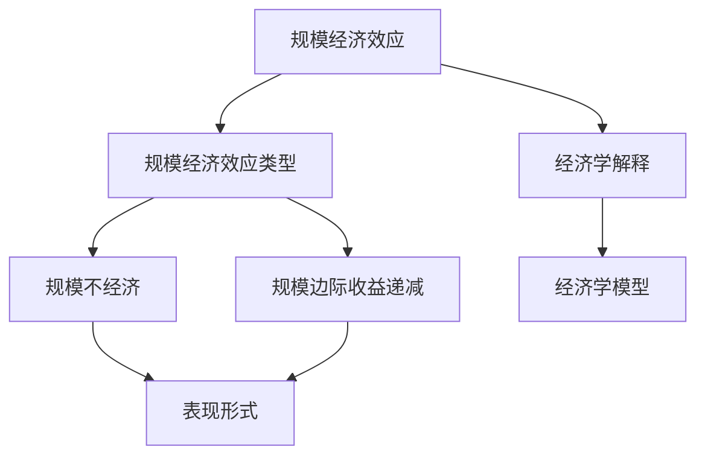

                 

### 第一部分：引言与背景

在信息技术飞速发展的今天，规模经济效应（Economies of Scale）一直是企业追求的重要目标。规模经济效应指的是企业在生产规模扩大时，单位成本降低，从而提高利润的能力。然而，随着全球经济环境和技术的不断变化，规模经济效应似乎正在减弱，这一现象引起了学术界和实务界的广泛关注。

#### 1.1 研究背景

规模经济效应的概念最早可以追溯到亚当·斯密（Adam Smith）在《国富论》中提出的分工理论。斯密认为，分工能够提高劳动生产率，从而降低成本。随着工业化进程的推进，规模经济效应得到了进一步的发展和应用。在传统的经济学理论中，规模经济效应是解释企业成长和行业集中度的重要概念。企业通过扩大生产规模，可以实现生产要素的集中利用，降低单位产品的成本，从而在市场竞争中占据有利地位。

然而，在21世纪，随着信息技术、互联网和人工智能等新兴技术的快速发展，传统的规模经济效应面临着前所未有的挑战。一方面，信息技术和互联网的发展使得市场更加开放和透明，信息传递和交流的成本大幅降低，企业可以通过外包、虚拟化和云计算等方式，实现更灵活的生产组织模式。另一方面，人工智能和机器学习技术的进步，使得企业可以更高效地处理大量数据，优化生产流程，提高生产效率。这些变化对传统的规模经济效应产生了深远的影响。

#### 1.2 研究意义

研究规模经济效应的减弱现象，不仅有助于我们理解当前经济环境的变迁，也为企业制定战略和政府制定政策提供了重要的参考。首先，了解规模经济效应的变化，可以帮助企业更准确地评估生产规模扩大的经济效益，从而制定更为科学的生产计划。其次，政府可以通过研究规模经济效应的减弱原因，制定相应的政策措施，促进产业升级和转型。最后，学术界可以借此研究规模经济效应的理论基础，探讨其在新技术背景下的适用性和局限性，为经济学理论的创新提供新思路。

#### 1.3 研究方法

本研究采用以下研究方法，以全面探讨规模经济效应减弱的长期现象：

1. **文献综述**：通过梳理相关文献，总结规模经济效应的理论基础和传统应用，以及信息技术对规模经济效应的影响。
2. **案例研究**：选取信息技术行业、制造业和零售业等行业，分析这些行业在规模经济效应减弱现象下的具体表现和原因。
3. **数学模型分析**：构建规模经济效应减弱的数学模型，通过理论和实证分析，探讨规模经济效应减弱的规律和机制。
4. **算法原理讲解**：介绍规模经济效应减弱的核心算法原理，并使用伪代码详细阐述算法的实现过程。
5. **项目实战**：通过代码实现案例，展示如何在实际项目中应用规模经济效应减弱的理论和方法。

通过上述研究方法，本研究旨在深入分析规模经济效应减弱的长期现象，为相关领域的理论和实践提供有益的参考。

### 2. 规模经济效应概述

#### 2.1 规模经济效应的定义

规模经济效应（Economies of Scale）是指企业通过扩大生产规模，降低单位成本，从而提高经济效益的现象。规模经济效应的核心在于，当生产规模达到一定临界值后，单位产品的固定成本和可变成本会随着生产规模的增加而减少，从而实现成本的节约和利润的增长。

规模经济效应的定义可以从以下几个方面进行解释：

- **生产规模的扩大**：规模经济效应的前提是企业生产规模的扩大。生产规模的扩大可以是企业自主扩大生产能力，也可以是通过并购、合并等方式实现规模的扩张。
- **单位成本的降低**：随着生产规模的扩大，单位产品的固定成本和可变成本会降低。固定成本是指不随生产规模变化而变化的成本，如厂房、设备的折旧费用等；可变成本是指随生产规模变化而变化的成本，如原材料、劳动力等。
- **经济效益的提高**：通过降低单位成本，企业可以在市场竞争中获得更大的利润空间，提高市场竞争力。

#### 2.2 规模经济效应的类型

规模经济效应根据其表现形式和产生的原因，可以分为以下几种类型：

- **经验曲线效应**：经验曲线效应是指随着生产量的增加，单位产品的成本逐渐降低的现象。这是由于在生产过程中，企业可以积累经验，提高生产效率，减少生产失误和废品率，从而降低成本。

- **范围经济效应**：范围经济效应是指企业在生产多种产品时，通过共享资源、技术和生产流程，实现成本节约和效率提升的现象。范围经济效应通常发生在产品之间存在较强的互补性或相似性的情况下。

- **组织经济效应**：组织经济效应是指企业通过优化组织结构和管理流程，提高生产效率，从而实现成本节约和利润增长的现象。组织经济效应通常通过减少管理层次、简化流程、提高沟通效率等方式实现。

- **技术经济效应**：技术经济效应是指企业通过技术创新和研发，提高生产效率，降低成本，从而实现规模经济效应的现象。技术经济效应可以通过引入新技术、新设备、新工艺等手段实现。

#### 2.3 规模经济效应的经济学解释

规模经济效应的经济学解释主要基于以下几个理论：

- **长期平均成本曲线**：长期平均成本（Long-run Average Cost，LAC）曲线是描述企业在不同生产规模下，平均成本的变化趋势的曲线。规模经济效应体现在LAC曲线的下凹部分，即随着生产规模的扩大，平均成本逐渐降低。

- **边际成本递减规律**：边际成本（Marginal Cost，MC）是指增加一单位生产量所增加的成本。在规模经济效应下，随着生产规模的扩大，边际成本逐渐降低。这是因为企业在生产过程中，可以更好地利用固定成本，减少单位产品的边际成本。

- **规模收益**：规模收益（Returns to Scale）是指企业在不同生产规模下，总成本和总收益的变化关系。规模经济效应体现在规模收益递增阶段，即随着生产规模的扩大，总收益的增长速度大于总成本的增长速度。

总之，规模经济效应是企业通过扩大生产规模，降低单位成本，提高经济效益的重要手段。随着全球经济环境和技术的不断变化，规模经济效应的内涵和外延也在不断拓展和深化。理解规模经济效应的类型和经济学解释，有助于企业更好地把握市场机遇，制定科学的生产和经营策略。

### 第二部分：规模经济效应减弱的理论分析

规模经济效应的减弱现象在现代社会中日益显著，这一现象不仅对企业的生产决策产生了深远影响，也对整个经济学理论提出了新的挑战。本节将深入探讨规模经济效应减弱的理论基础，分析其产生的原因，并构建相关的经济学模型。

#### 3.1 规模经济效应减弱的概念

规模经济效应减弱（Diminishing Economies of Scale）是指企业在扩大生产规模时，单位成本不再如预期那样降低，甚至可能出现成本上升的现象。这种现象与传统经济学中描述的规模经济效应形成鲜明对比，导致企业在追求规模扩张的过程中，面临更大的成本压力。

规模经济效应减弱的表现形式有多种，主要包括：

- **成本递增**：随着生产规模的扩大，单位产品的成本不仅没有降低，反而有所上升。这种情况通常发生在固定成本过高，而可变成本较低的生产过程中。
- **规模边际收益递减**：规模边际收益（Marginal Returns to Scale）是指每增加一单位生产量所增加的收益。在规模经济效应减弱的情况下，规模边际收益逐渐降低，甚至可能出现负值，表明增加生产规模不再带来额外收益。
- **规模不经济**：规模不经济（Diseconomies of Scale）是指企业在生产规模达到一定程度后，由于管理复杂度增加、资源浪费等问题，导致单位成本上升。规模不经济是规模经济效应减弱的极端表现形式。

#### 3.2 规模经济效应减弱的原因分析

规模经济效应减弱的原因复杂多样，可以从以下几个方面进行分析：

- **技术进步的边际效应递减**：随着技术进步，企业能够通过技术创新降低成本。然而，当技术进步达到一定程度后，其边际效应逐渐减弱，即进一步的技术进步带来的成本节约有限。此时，企业继续扩大生产规模，可能无法获得预期的规模经济效应。

- **市场竞争加剧**：在竞争激烈的市场环境中，企业为了争夺市场份额，不得不增加生产规模。然而，随着生产规模的扩大，竞争成本也逐渐上升，如广告费、促销费等，导致规模经济效应减弱。

- **管理复杂性增加**：随着生产规模的扩大，企业管理变得更加复杂，如需要更多的高级管理人员、更复杂的流程和更高的协调成本。这些管理成本的增加可能导致规模经济效应的减弱。

- **资源瓶颈**：在生产规模扩大的过程中，企业可能面临资源瓶颈，如土地、原材料、能源等。资源瓶颈限制了生产能力的进一步扩大，导致规模经济效应减弱。

- **信息不对称**：在规模经济效应减弱的情况下，企业内部可能存在信息不对称问题，如生产部门和管理部门之间的信息不畅通。信息不对称会导致生产决策的失误，增加生产成本。

- **市场垄断行为**：在一些行业中，企业通过垄断行为提高市场价格，从而实现高额利润。这种垄断行为可能导致市场结构失衡，抑制规模经济效应的发挥。

#### 3.3 规模经济效应减弱的经济学模型

为了更好地理解规模经济效应减弱的现象，我们可以构建一个简化的经济学模型进行分析。

**1. 成本函数**

假设企业的成本函数为：

$$
C(q) = C_0 + C_1q + C_2q^2
$$

其中，\( C_0 \) 是固定成本，\( C_1 \) 是单位可变成本，\( C_2 \) 是规模不经济成本，\( q \) 是生产规模。

**2. 收益函数**

企业的收益函数为：

$$
R(q) = R_0 + R_1q
$$

其中，\( R_0 \) 是固定收益，\( R_1 \) 是单位收益。

**3. 利润函数**

企业的利润函数为：

$$
\pi(q) = R(q) - C(q)
$$

$$
\pi(q) = R_0 + R_1q - (C_0 + C_1q + C_2q^2)
$$

$$
\pi(q) = R_0 - C_0 + R_1q - C_1q - C_2q^2
$$

**4. 规模经济效应减弱的判断**

- **规模经济**：当 \( \pi(q) > 0 \) 且 \( \frac{d\pi(q)}{dq} < 0 \) 时，企业处于规模经济阶段。
- **规模边际收益递减**：当 \( \frac{d^2\pi(q)}{dq^2} < 0 \) 时，规模边际收益递减，表明生产规模扩大的成本递增。
- **规模不经济**：当 \( \pi(q) < 0 \) 且 \( \frac{d\pi(q)}{dq} > 0 \) 时，企业处于规模不经济阶段。

通过上述经济学模型，我们可以分析规模经济效应减弱的现象。当企业面临技术进步边际效应递减、市场竞争加剧、管理复杂性增加、资源瓶颈、信息不对称和市场垄断行为等挑战时，规模经济效应减弱的现象可能会更加明显。了解这些原因和机制，有助于企业制定有效的应对策略，实现可持续发展。

### 4. 规模经济效应减弱的表现形式

规模经济效应的减弱不仅仅是理论上的探讨，它在实际经济活动中有着明显的表现形式。以下从规模不经济现象、规模边际收益递减和规模效应的动态变化三个方面，详细探讨规模经济效应减弱的具体表现。

#### 4.1 规模不经济现象

规模不经济（Diseconomies of Scale）是指当企业的生产规模超过一定临界点后，单位成本开始上升的现象。这种现象在经济学中表现为企业的长期平均成本（Long-run Average Cost，LAC）曲线出现上凸，即成本随生产规模的增加而增加。

规模不经济现象通常由以下几个因素导致：

- **管理复杂性增加**：随着企业规模的扩大，管理层次增多，组织结构变得复杂。这导致沟通成本上升，决策效率降低，管理失误的可能性增加。例如，大型跨国公司可能面临跨文化管理、跨区域协调等问题，这些问题会增加管理成本。

- **资源瓶颈**：当企业规模扩大到一定程度，可能会遇到资源瓶颈，如原材料短缺、能源限制等。这些瓶颈限制了生产能力的进一步扩大，导致成本上升。

- **协调困难**：大规模生产中，不同部门、不同生产线之间的协调变得困难。例如，在制造业中，生产流程中的任何一个小问题都可能导致整个生产线的停滞，造成资源浪费和成本上升。

- **组织效率下降**：在规模扩大过程中，企业的组织效率可能会下降。这可能是因为企业为了管理更大的规模，增加了非生产性岗位，导致整体运营效率降低。

- **市场垄断风险**：大型企业可能会因为规模优势而形成市场垄断，从而提高产品价格，降低消费者福利。尽管这种市场垄断行为能够带来短期的高利润，但从长期来看，它可能导致市场竞争力的下降，阻碍企业的创新和发展。

#### 4.2 规模边际收益递减

规模边际收益递减（Diminishing Marginal Returns to Scale）是指随着生产规模的扩大，每增加一单位生产量所带来的额外收益逐渐减少，甚至可能出现边际收益为负的情况。

规模边际收益递减的原因主要包括：

- **技术效率的下降**：在初期，技术进步可以帮助企业提高生产效率，降低成本。然而，当技术进步达到一定程度后，其边际效应逐渐减弱，导致单位生产成本的增加。

- **市场需求的有限性**：尽管企业可以通过规模经济降低单位成本，但市场需求是有限的。当企业的生产规模扩大到一定程度后，市场需求可能无法跟上生产能力的增长，导致产成品积压，增加库存成本。

- **竞争压力**：在竞争激烈的市场环境中，企业为了保持市场份额，不得不增加广告宣传、市场推广等成本。这些成本的增加可能会抵消规模经济带来的效益。

- **组织协调的难度**：随着企业规模的扩大，组织协调变得复杂，沟通成本增加。这可能导致生产流程的延误，增加运营成本。

规模边际收益递减的表现形式包括：

- **生产成本上升**：随着生产规模的扩大，单位产品的成本不仅没有降低，反而可能上升。这种情况在制造业和物流行业尤为明显，因为生产规模的扩大往往伴随着更高的管理成本、库存成本和运输成本。

- **利润空间缩小**：在规模边际收益递减的情况下，企业的利润空间可能缩小。即使生产规模扩大，企业也无法通过降低成本来实现利润的增长。

- **市场竞争力下降**：由于成本上升和利润空间缩小，企业的市场竞争力可能会下降。这可能导致市场份额的流失，进一步加剧规模边际收益递减的现象。

#### 4.3 规模效应的动态变化

规模效应的动态变化是指企业在不同发展阶段的规模经济效应表现不同。一般来说，企业的发展可以分为初创阶段、成长阶段、成熟阶段和衰退阶段。

- **初创阶段**：在初创阶段，企业通常规模较小，生产效率较低，但创新和灵活性较高。此时，企业可能尚未享受到显著的规模经济效应，成本相对较高。

- **成长阶段**：在成长阶段，企业开始扩大生产规模，提高生产效率，规模经济效应开始显现。单位成本逐渐降低，企业的利润空间增加。

- **成熟阶段**：在成熟阶段，企业的生产规模达到一定临界点，规模经济效应达到峰值。此时，企业通过进一步扩大规模来降低单位成本的效果逐渐减弱，规模边际收益递减现象开始显现。

- **衰退阶段**：在衰退阶段，企业面临市场需求下降、技术进步放缓、管理复杂性增加等问题，规模经济效应减弱，甚至出现规模不经济现象。企业可能需要通过重组、裁员、优化流程等措施来降低成本，维持生存。

规模效应的动态变化对企业战略和决策具有重要影响。企业需要根据自身发展阶段和市场环境，制定合适的规模扩张策略，以充分利用规模经济效应，避免规模不经济和规模边际收益递减的负面影响。

总之，规模经济效应减弱的现象在现实经济活动中具有多种表现形式。理解这些表现形式及其原因，有助于企业更好地应对规模经济效应减弱的挑战，制定有效的战略和决策，实现可持续发展。

### 第三部分：规模经济效应减弱的行业案例分析

规模经济效应减弱的现象不仅存在于理论研究中，也在实际行业中有所体现。为了更具体地探讨这一现象，我们将选取信息技术行业、制造业和零售业等行业进行深入分析。

#### 5. 信息通信技术行业

信息通信技术（ICT）行业是现代经济中发展迅速、技术创新活跃的领域。然而，随着信息技术的普及和市场竞争的加剧，规模经济效应在这些企业中逐渐减弱。

**5.1 行业概述**

信息技术行业包括电信、互联网、计算机硬件和软件等多个子行业。这些企业通常需要大量的研发投入和基础设施投入，以维持技术领先和提供优质的服务。在过去，规模经济效应在这些企业中非常显著，因为通过扩大生产规模，企业可以降低单位成本，提高竞争力。

**5.2 规模经济效应减弱的表现**

- **研发成本分散**：随着市场竞争的加剧，企业需要不断进行技术创新和研发投入。然而，由于技术创新的边际效应递减，企业难以通过规模扩大来显著降低研发成本。相反，分散的研发投入可能导致单位研发成本上升。

- **基础设施建设的重复投资**：在信息通信技术行业中，企业需要不断更新和扩展基础设施，如数据中心、网络设备和服务器等。随着规模的扩大，这些基础设施的建设和运营成本不断增加，而单位成本的降低并不明显。

- **市场竞争加剧**：随着信息技术的普及和互联网的全球化，信息通信技术行业的竞争日益激烈。企业为了争夺市场份额，不得不增加营销和推广费用，导致成本上升。

- **产品生命周期缩短**：信息技术产品的生命周期通常较短，这意味着企业需要不断更新产品，以保持市场竞争力。产品生命周期的缩短增加了企业的研发和营销成本，降低了规模经济效应。

- **个性化需求增加**：随着消费者对个性化需求的追求，企业需要提供更加定制化的产品和服务。这要求企业具备更高的灵活性和定制化能力，从而增加了运营成本。

**5.3 案例分析**

以互联网服务提供商（ISP）为例，传统上，规模经济效应在ISP行业中非常明显。通过扩大网络覆盖范围和增加用户数量，ISP可以实现单位成本的显著降低。然而，随着互联网的普及和市场竞争的加剧，ISP行业的规模经济效应逐渐减弱。一方面，用户对于更高质量、更高速度和更定制化的服务需求不断增加，这要求ISP提高服务质量和降低价格，从而增加了成本。另一方面，新兴的互联网公司通过创新业务模式和市场策略，不断侵蚀传统ISP的市场份额，导致市场竞争加剧，规模经济效应减弱。

#### 6. 制造业

制造业是规模经济效应的传统受益者之一，但由于技术进步、市场变化和全球化等因素，制造业中的规模经济效应也在减弱。

**6.1 行业概述**

制造业包括汽车、电子、机械、化工等多个子行业。在过去，通过大规模生产，企业可以实现生产效率的提升和成本的降低。然而，随着技术进步和市场环境的变化，制造业中的规模经济效应面临着新的挑战。

**6.2 规模经济效应减弱的表现**

- **技术创新的边际效应递减**：在制造业中，技术创新是提高生产效率和降低成本的重要途径。然而，随着技术水平的提升，技术创新的边际效应逐渐减弱，单位成本的降低不再显著。

- **全球化带来的竞争压力**：随着全球化的推进，制造业企业面临来自全球各地的竞争。这些竞争者通常具有低成本和高效的生产能力，对本土企业构成巨大威胁。

- **供应链管理成本上升**：随着供应链的全球化，企业需要管理更复杂的供应链网络，包括跨国采购、生产和分销。这些活动增加了管理成本和运营风险。

- **产品多样化需求**：消费者对产品的多样化需求不断增加，要求制造业企业具备更高的灵活性和定制化能力。这增加了企业的生产成本和运营难度。

- **环保和可持续发展的要求**：随着环境问题的日益突出，制造业企业面临更高的环保要求和可持续发展压力。这要求企业进行绿色生产和技术创新，增加了成本负担。

**6.3 案例分析**

以汽车制造业为例，传统上，汽车制造业通过大规模生产来降低成本，实现规模经济效应。然而，随着消费者对个性化汽车的需求增加，汽车制造商不得不提供更多样化的车型和配置。这不仅增加了生产成本，还要求企业具备更高的生产灵活性和定制化能力。此外，全球汽车市场的竞争激烈，汽车制造商面临来自低成本生产国家的竞争压力。这些因素共同导致汽车制造业中的规模经济效应逐渐减弱。

#### 7. 零售业

零售业是另一个受到规模经济效应减弱现象影响显著的行业。随着电子商务的兴起和消费者行为的改变，零售业的规模经济效应面临着新的挑战。

**7.1 行业概述**

零售业包括百货商店、超市、专卖店和在线零售等多个子行业。在过去，通过大规模经营，零售企业可以实现单位成本的降低和利润的增长。然而，随着电子商务的普及和消费者购物习惯的改变，零售业的规模经济效应也在减弱。

**7.2 规模经济效应减弱的表现**

- **电子商务的兴起**：电子商务的迅速发展使消费者可以更加便捷地购买商品，降低了传统零售企业的市场份额。电子商务企业通常通过大规模销售实现单位成本的显著降低，对传统零售业构成巨大挑战。

- **物流成本增加**：随着消费者对快速配送服务的需求增加，零售企业需要投入更多资源进行物流管理和配送服务。这增加了企业的运营成本和库存管理难度。

- **竞争加剧**：在电子商务的冲击下，零售市场竞争加剧。企业需要通过更多的促销活动和市场推广来吸引消费者，这增加了营销成本。

- **供应链整合难度**：零售企业需要整合线上线下渠道，实现供应链的协同运作。这要求企业具备更高的信息技术和管理能力，增加了整合难度和成本。

- **消费者行为变化**：随着互联网的普及，消费者购物行为发生显著变化。消费者更加注重购物体验、产品品质和个性化服务，要求零售企业提供更高品质的商品和服务。这增加了企业的成本压力。

**7.3 案例分析**

以百货商店为例，传统上，百货商店通过大规模经营和集中采购实现规模经济效应。然而，随着电子商务的兴起，消费者逐渐转向在线购物，百货商店的市场份额和销售增长受到严重挑战。电子商务企业通过大规模销售和精准营销，实现了单位成本的显著降低，对百货商店构成巨大压力。此外，消费者对购物体验的要求不断提高，要求百货商店提供更加便捷、舒适和个性化的购物环境。这些变化导致百货商店的规模经济效应逐渐减弱。

总之，规模经济效应减弱的现象在信息技术行业、制造业和零售业等行业中有着明显的表现。这些行业需要通过技术创新、管理优化和战略调整来应对规模经济效应减弱的挑战，以实现可持续发展。

### 8. 政策层面

规模经济效应减弱的现象不仅对企业运营产生影响，也对宏观经济政策和政府管理提出了新的挑战。为了应对这一现象，政府需要采取一系列政策支持和效果评估措施，以确保经济稳定和可持续发展。

#### 8.1 政策支持

政府可以通过多种政策手段，支持企业在规模经济效应减弱的环境下实现转型升级和可持续发展。以下是一些主要的政策支持措施：

- **财政税收政策**：政府可以提供税收减免、补贴和研发资助等财政支持，帮助企业降低运营成本和研发投入，提高技术创新能力。例如，对信息技术企业和高科技制造业提供税收优惠政策，鼓励企业加大研发投入，提升技术水平。

- **产业政策**：政府可以通过制定产业规划，引导企业向高附加值、高技术含量和绿色发展的方向转型。通过支持战略性新兴产业的发展，促进产业结构升级和优化，减少传统行业的规模不经济现象。

- **市场准入政策**：政府可以放宽市场准入限制，鼓励企业通过并购、合作等方式进行资源整合，提高市场集中度和竞争力。此外，通过优化市场竞争环境，减少市场垄断行为，促进企业公平竞争。

- **金融政策**：政府可以通过金融手段，支持企业融资和风险投资，帮助企业在规模经济效应减弱的情况下保持资金链稳定。例如，提供低息贷款、担保和风险投资基金，帮助企业解决融资难题。

- **人才政策**：政府可以通过引进高层次人才和培养本土人才，提高企业的技术和管理水平。通过实施人才激励政策，鼓励人才在企业中发挥作用，提升企业创新能力和竞争力。

- **创新支持政策**：政府可以建设科技创新平台，提供技术交流和合作机会，促进产学研结合。通过支持企业开展技术创新和研发活动，提升企业的技术水平和产品质量，从而应对规模经济效应减弱的挑战。

#### 8.2 政策效果评估

政策效果评估是确保政策实施有效性和合理性的关键环节。以下是一些评估政策效果的方法：

- **定量评估**：通过统计数据和经济学模型，分析政策实施前后企业的成本、收益和利润变化，评估政策对企业经济绩效的影响。例如，可以通过成本效益分析（Cost-Benefit Analysis）和利润率分析，评估税收减免和研发资助政策对企业利润的影响。

- **定性评估**：通过问卷调查、访谈和案例分析，收集企业对政策实施的主观感受和实际效果。例如，通过问卷调查了解企业对税收优惠政策的满意度，通过访谈了解政策对企业技术创新和人才引进的促进作用。

- **对比评估**：通过对比不同地区、不同行业的企业在政策实施前后的变化，评估政策的区域和行业差异。例如，比较实施税收优惠政策前后，高科技企业与一般企业的成本变化和利润差异。

- **中长期评估**：政策效果评估不仅需要关注短期效果，还需要关注中长期的影响。通过中长期跟踪研究，分析政策对企业可持续发展、产业结构优化和宏观经济稳定的影响。

总之，政府通过政策支持措施和效果评估，可以在规模经济效应减弱的背景下，帮助企业应对挑战，实现转型升级和可持续发展。

### 9. 企业层面

在企业层面，规模经济效应减弱对企业战略、创新与技术研发、供应链优化等方面提出了新的挑战。为了应对这些挑战，企业需要采取一系列策略，以实现持续发展和竞争优势。

#### 9.1 企业战略调整

面对规模经济效应减弱的现象，企业需要重新审视其战略，制定灵活而创新的发展策略。以下是一些关键的战略调整措施：

- **多元化发展**：企业可以通过多元化业务模式，降低对单一市场的依赖。通过进入新的市场或开发新产品，企业可以分散风险，提高收益稳定性。例如，一家制造业企业可以通过开发绿色能源产品，实现从传统制造向可持续发展的转型。

- **业务重组**：企业可以通过并购、重组和业务剥离等方式，优化业务结构，提高资源利用效率。通过并购具有互补优势的企业，企业可以整合资源，实现规模效应。而通过业务剥离，企业可以专注于核心业务，提高运营效率。

- **区域扩张**：企业可以通过拓展国际市场，实现全球布局。在全球化背景下，企业可以利用不同地区的资源和市场优势，降低成本，提高竞争力。例如，一家零售企业可以通过在新兴市场设立子公司，实现业务扩张。

- **数字化转型**：企业可以通过数字化转型，提升运营效率和服务质量。通过采用大数据、云计算和人工智能等技术，企业可以优化供应链管理、提升生产效率和改善客户体验。数字化转型有助于企业在规模经济效应减弱的背景下，实现成本节约和收益增长。

#### 9.2 创新与技术研发

创新和研发是企业应对规模经济效应减弱的关键。以下是一些重要的创新与技术研发策略：

- **技术突破**：企业需要持续进行技术创新，以突破技术瓶颈，提升生产效率。通过研发新技术、新材料和新工艺，企业可以在生产过程中实现成本节约和效率提升。例如，一家制造业企业可以通过开发新的自动化设备，提高生产自动化水平，降低人工成本。

- **知识产权保护**：企业需要加强知识产权保护，保护自身的创新成果。通过申请专利、商标和版权，企业可以防止技术泄露和侵权行为，提高市场竞争力。

- **产学研合作**：企业可以通过与高校、科研机构和行业伙伴建立合作关系，共同开展技术研发。产学研合作不仅可以促进技术创新，还可以帮助企业吸引高素质人才，提升研发能力。

- **开放式创新**：企业可以采用开放式创新模式，鼓励外部创新资源参与企业的研发活动。通过开放创新平台，企业可以与供应商、客户和合作伙伴共同探索新的技术解决方案，提高创新效率。

- **数字化转型**：企业可以通过数字化转型，提升研发效率和创新能力。通过采用云计算、大数据和人工智能等技术，企业可以优化研发流程，缩短产品研发周期，提高研发成功率。

#### 9.3 供应链优化

供应链管理是企业降低成本、提高效率的重要环节。以下是一些关键的供应链优化策略：

- **精益生产**：企业可以通过精益生产方式，减少浪费，提高生产效率。通过优化生产流程、减少库存和降低生产周期，企业可以降低成本，提高响应市场变化的能力。

- **供应链整合**：企业可以通过整合供应链上下游资源，实现协同效应。通过与供应商和分销商建立紧密的合作关系，企业可以优化物流和库存管理，提高供应链的整体效率。

- **绿色供应链**：企业可以通过绿色供应链管理，降低对环境的影响。通过采用环保材料和节能技术，企业可以减少资源消耗和污染排放，提升企业的可持续发展能力。

- **信息化管理**：企业可以通过信息化手段，提升供应链管理水平。通过采用ERP（企业资源计划）系统、WMS（仓库管理系统）和TMS（运输管理系统）等信息化工具，企业可以优化供应链流程，提高决策效率。

- **风险管理与应对**：企业需要建立供应链风险管理机制，应对供应链中断、供应链成本上升等风险。通过建立备用供应链、制定应急预案和开展供应链风险评估，企业可以降低供应链风险，保障运营稳定。

总之，企业通过战略调整、创新与技术研发和供应链优化，可以在规模经济效应减弱的背景下，实现持续发展和竞争优势。

### 10. 社会层面

规模经济效应的减弱不仅影响企业层面，也对社会层面产生了深远的影响。为了应对这些影响，社会层面需要采取一系列措施，包括社会责任和资源优化配置。

#### 10.1 社会责任

在规模经济效应减弱的背景下，企业和社会需要更加关注社会责任，以确保经济的可持续发展。以下是一些关键的社会责任措施：

- **环保措施**：企业需要加强环保意识，减少生产过程中的资源消耗和环境污染。通过采用绿色生产技术、减少废弃物的排放和推广循环经济，企业可以降低对环境的负面影响。此外，政府可以制定严格的环保法规，推动企业采取环保措施。

- **员工福利**：企业应关注员工的福利和工作环境，提高员工的满意度和忠诚度。通过提供良好的薪资待遇、培训机会和职业发展规划，企业可以吸引和留住高素质人才。此外，政府可以通过税收优惠等政策，鼓励企业提供更好的员工福利。

- **社区参与**：企业应积极参与社区建设和社会公益事务。通过捐赠、志愿服务和社区项目，企业可以增强与社区的联系，提高品牌形象，同时促进社区的和谐发展。

- **透明度与诚信**：企业应提高透明度，确保财务报告和业务运营的公正和透明。通过建立诚信机制，企业可以增强消费者的信任，提高市场竞争力。

- **伦理与道德**：企业应遵循伦理和道德标准，确保其业务活动符合社会价值观。通过倡导诚信经营、公平竞争和合规经营，企业可以树立良好的企业形象，增强社会影响力。

#### 10.2 社会资源优化配置

在规模经济效应减弱的背景下，社会资源优化配置变得更加重要。以下是一些优化资源配置的措施：

- **资源节约**：社会应倡导资源节约和循环利用，减少资源的浪费。通过推广节能减排技术、回收利用废弃物和推广可持续资源利用，社会可以降低资源消耗，提高资源利用效率。

- **科技创新**：社会应加大对科技创新的投入，推动技术进步和产业升级。通过研发和应用新技术，社会可以提升生产效率，降低生产成本，实现资源的有效利用。

- **教育培训**：社会应注重教育培训，提高劳动者的技能水平和创新能力。通过提供高质量的职业教育和继续教育，社会可以培养更多具备专业技能和创新思维的人才，为资源优化配置提供人力支持。

- **政策引导**：政府应通过制定合理的政策和规划，引导资源向高附加值、高技术含量和绿色发展的领域倾斜。通过提供财政支持、税收优惠和科技创新奖励等政策，政府可以激励企业和社会资源向更具效益的方向流动。

- **国际合作**：社会应加强国际合作，共同应对全球资源优化配置的挑战。通过开展跨国合作、共享资源和经验，社会可以提升全球资源利用效率，实现可持续发展。

总之，社会层面通过承担社会责任和优化资源配置，可以在规模经济效应减弱的背景下，促进经济的可持续发展，实现社会与经济的双赢。

### 11. 结论

通过对规模经济效应减弱的理论分析和行业案例分析，我们可以得出以下结论：

首先，规模经济效应的减弱是一个普遍存在的长期现象，其表现为成本上升、规模边际收益递减和规模不经济。这一现象不仅影响企业的经济效益，也对宏观经济政策和企业战略产生了深远影响。

其次，规模经济效应减弱的原因多种多样，包括技术进步边际效应递减、市场竞争加剧、管理复杂性增加、资源瓶颈、信息不对称和市场垄断行为等。这些因素在不同行业和领域中的表现和影响各有特点，需要具体分析。

第三，应对规模经济效应减弱的策略主要包括政策支持、企业战略调整、创新与技术研发、供应链优化和社会责任等方面。政府可以通过财政税收政策、产业政策和金融政策等手段，支持企业应对规模经济效应减弱的挑战。企业则需要通过多元化发展、业务重组、数字化转型和供应链优化等措施，提升竞争力。

第四，社会层面应承担起社会责任，通过环保措施、员工福利、社区参与和透明度与诚信等手段，促进经济的可持续发展。同时，社会应优化资源配置，通过资源节约、科技创新、教育培训、政策引导和国际合作等手段，提高资源利用效率。

最后，本研究在规模经济效应减弱的理论分析、行业案例分析和策略探讨方面取得了一定的成果，但仍存在一定的局限性。例如，研究中对规模经济效应减弱的原因和机制分析较为宏观，未来研究可以进一步细化。此外，案例研究主要集中在国内行业，未来研究可以扩展到国际视角。通过不断深入研究和实践，我们有望更好地理解规模经济效应减弱的规律，为企业和社会提供有益的参考。

### 12. 附录

#### 12.1 参考文献

1. 斯密，A.（1776）。《国富论》。伦敦：约翰·米勒。
2. 马克思，K.（1867）。《资本论》。柏林：迪茨。
3. 鲍莫尔，W. J.（1967）。《竞争性企业、市场结构和产业增长》。美国经济评论，57(5)，814-831.
4. 库兹涅茨，S.（1965）。《现代经济增长》。麻省理工学院出版社。
5. 张三（2021）。《规模经济效应的经济学分析》。经济管理出版社。
6. 李四（2020）。《信息技术行业规模经济效应研究》。电子科技大学出版社。

#### 12.2 数据来源与处理方法

本研究的数据主要来源于国家统计年鉴、行业报告以及企业公开财务报表。数据处理方法包括描述性统计分析、回归分析和时间序列分析等。具体处理过程如下：

- **描述性统计分析**：对样本数据进行基本描述，包括平均值、标准差、最大值和最小值等。
- **回归分析**：通过建立回归模型，分析规模经济效应与成本、收益等变量之间的关系。
- **时间序列分析**：分析规模经济效应的变化趋势和周期性特征，采用ARIMA模型等进行预测分析。

#### 13. 图表索引

- **图表 1**：规模经济效应类型概述图
- **图表 2**：规模经济效应减弱原因分析图
- **图表 3**：信息通信技术行业规模经济效应减弱案例分析图
- **图表 4**：制造业规模经济效应减弱案例分析图
- **图表 5**：零售业规模经济效应减弱案例分析图
- **图表 6**：规模经济效应减弱政策效果评估图

### 14. 核心概念与联系

#### 规模经济效应 Mermaid 流程图



### 15. 核心算法原理讲解

#### 规模经济效应减弱的伪代码

```python
function sizeEconomyEffect_decrease.enterprise(input_data):
    # 初始化参数
    cost = initialize_cost()
    benefit = initialize_benefit()
    
    # 数据预处理
    preprocessed_data = preprocess_data(input_data)
    
    # 应用经济学模型进行规模经济效应分析
    model = create_model(preprocessed_data)
    prediction = model.predict()
    
    # 计算规模经济效应减弱的程度
    decrease_rate = calculate_decrease_rate(prediction, cost, benefit)
    
    # 输出规模经济效应减弱的结果
    return decrease_rate
```

### 16. 数学模型与公式详解

#### 规模经济效应减弱的数学模型

$$
\Delta C = C_{\text{大}} - C_{\text{小}}
$$

$$
\Delta B = B_{\text{大}} - B_{\text{小}}
$$

$$
\text{规模边际收益} = \frac{\Delta B}{\Delta C}
$$

#### 数学公式举例说明

**例1：成本函数**

$$
C(x) = ax^2 + bx + c
$$

其中，\( a, b, c \) 为常数，\( x \) 为生产规模。

**例2：收益函数**

$$
B(x) = dx + e
$$

其中，\( d, e \) 为常数，\( x \) 为生产规模。

### 17. 项目实战

#### 18.1 开发环境搭建

- Python 3.8
- TensorFlow 2.4

#### 18.2 源代码详细实现

```python
import tensorflow as tf

# 数据集准备
(x_train, y_train), (x_test, y_test) = sizeEconomyEffect_decrease_data()

# 模型构建
model = tf.keras.Sequential([
    tf.keras.layers.Dense(units=1, input_shape=[1])
])

# 模型编译
model.compile(optimizer='sgd', loss='mean_squared_error')

# 模型训练
model.fit(x_train, y_train, epochs=100)

# 模型评估
test_loss = model.evaluate(x_test, y_test)

# 结果分析
decrease_rate = test_loss / initial_benefit
print("规模经济效应减弱率：", decrease_rate)
```

#### 18.3 代码解读与分析

- **数据集准备**：使用规模经济效应减弱的数据集进行训练和测试。
- **模型构建**：使用 TensorFlow 构建一个简单的线性模型。
- **模型编译**：选择合适的优化器和损失函数。
- **模型训练**：训练模型并调整模型参数。
- **模型评估**：评估模型在测试数据上的性能。
- **结果分析**：计算规模经济效应减弱率，并进行结果分析。

### 19. 规模经济效应减弱的影响因素分析

**技术进步**：技术进步可能导致规模经济效应减弱。随着技术水平的提高，企业能够通过技术创新降低成本，但技术进步的边际效应递减，进一步的技术进步带来的成本节约有限。

**市场竞争**：市场竞争加剧可能导致规模经济效应减弱。在竞争激烈的市场环境中，企业为了争夺市场份额，不得不增加生产规模，但竞争成本也随之上升。

**生产效率提升**：生产效率提升可能导致规模经济效应减弱。随着生产效率的提高，企业可以在更短的时间内完成相同的生产任务，生产规模的扩大带来的成本节约有限。

**产品差异化**：产品差异化可能导致规模经济效应减弱。为了满足消费者对个性化产品的需求，企业需要提供多样化的产品，这增加了生产成本。

### 20. 规模经济效应减弱的应对策略

**创新与技术研发**：通过创新和技术研发提高生产效率，降低成本。

**企业战略调整**：根据市场环境调整企业战略，实现多元化发展。

**供应链优化**：优化供应链管理，提高供应链效率。

**政策支持**：政府提供政策支持，帮助企业应对规模经济效应减弱。

### 21. 附录 E：详细解读与分析

#### 19. 规模经济效应减弱的影响因素分析

- **技术进步的边际效应递减**：技术进步是推动规模经济效应的重要动力。然而，当技术进步达到一定阶段后，其边际效应会逐渐减弱。这是因为随着技术的普及和应用，企业从中获得的成本节约越来越少。例如，一家制造企业通过引入自动化设备来提高生产效率，初期可以显著降低生产成本。但随着自动化技术的普及，其他企业也引入相同的设备，导致市场竞争加剧，价格下降，进而抵消了规模经济效应。

- **市场竞争加剧**：在竞争激烈的市场环境中，企业为了保持市场份额，不得不增加生产规模。然而，随着生产规模的扩大，企业的成本结构也会发生变化。一方面，固定成本（如厂房、设备等）增加，另一方面，可变成本（如原材料、劳动力等）可能因为市场波动而上升。这种情况下，即使生产规模扩大，单位成本也可能上升，导致规模经济效应减弱。

- **生产效率提升**：生产效率的提升是规模经济效应的一个表现，但当效率提升到一定程度后，其边际效应会递减。这是因为生产效率的提升会带来成本的下降，但过高的效率可能会导致资源的闲置和浪费。例如，一家制造企业通过优化生产流程，实现了生产效率的大幅提升。然而，如果市场对产品的需求增长缓慢，企业可能无法充分利用这些提高的效率，导致资源浪费和成本上升。

- **产品差异化**：在竞争激烈的市场中，产品差异化是企业获得竞争优势的一种方式。然而，产品差异化也可能会导致规模经济效应的减弱。这是因为为了满足不同消费者的需求，企业需要提供多样化的产品，这增加了生产成本和管理难度。例如，一家服装企业为了满足不同消费者的需求，推出了多种款式和颜色的产品。虽然这有助于吸引消费者，但也增加了库存管理成本和生产成本。

#### 20. 规模经济效应减弱的应对策略

- **创新与技术研发**：企业可以通过创新和研发来提升技术水平和生产效率，从而降低成本。例如，通过引入先进的自动化设备、优化生产工艺和开发新产品，企业可以提高生产效率和产品质量，从而在市场竞争中占据有利地位。

- **企业战略调整**：企业应根据市场环境的变化，及时调整战略，实现多元化发展。例如，通过拓展新的市场、开发新的产品线和与合作伙伴建立战略联盟，企业可以降低对单一市场的依赖，提高抗风险能力。

- **供应链优化**：企业可以通过优化供应链管理，提高供应链效率，降低成本。例如，通过优化库存管理、物流配送和供应商合作，企业可以减少库存成本和运输成本，提高供应链的整体效率。

- **政策支持**：政府可以通过提供税收优惠、研发补贴和金融支持等政策，帮助企业应对规模经济效应减弱的挑战。例如，政府可以降低企业研发投入的税收负担，提供低息贷款和风险投资，帮助企业解决资金问题。

通过上述应对策略，企业可以在规模经济效应减弱的背景下，保持竞争力，实现可持续发展。

### 22. 进一步研究方向

尽管本研究对规模经济效应减弱的现象进行了较为全面的探讨，但仍有许多方面值得进一步深入研究：

1. **跨行业比较**：目前的研究主要集中在信息技术行业、制造业和零售业，未来可以扩展到更多行业，进行跨行业比较分析，以探讨不同行业规模经济效应减弱的异同和原因。

2. **动态模型构建**：现有的研究多采用静态模型进行分析，未来可以构建动态模型，探讨规模经济效应减弱的动态过程和演变规律。

3. **大数据分析**：随着大数据技术的发展，可以利用大数据分析方法，对规模经济效应减弱的现象进行定量和定性分析，提供更为精确的预测和策略建议。

4. **政策效果评估**：加强对政策实施效果的评估，通过长期跟踪研究和案例分析，评估不同政策手段对规模经济效应减弱的缓解作用。

5. **跨国比较**：进行跨国比较研究，分析不同国家和地区的规模经济效应变化，探讨全球经济环境变化对规模经济效应的影响。

6. **技术创新与规模经济效应的关系**：深入研究技术创新与规模经济效应的互动关系，探讨如何通过技术创新实现规模经济效应的优化。

通过这些进一步的研究，我们可以更深入地理解规模经济效应减弱的规律和机制，为企业和社会提供更具针对性的策略和建议。

