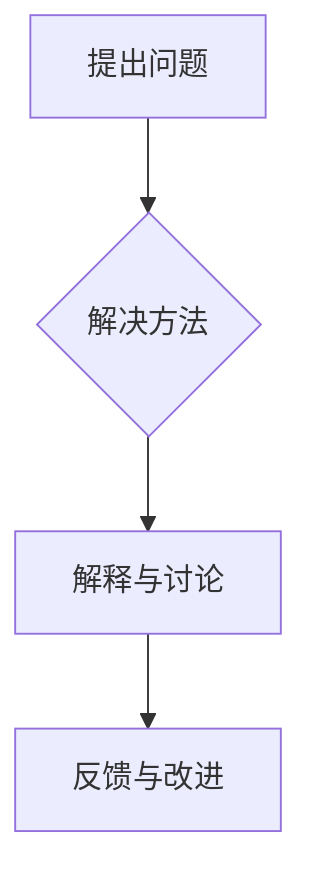
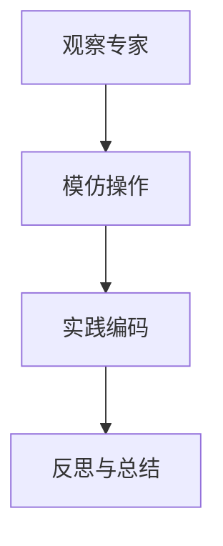
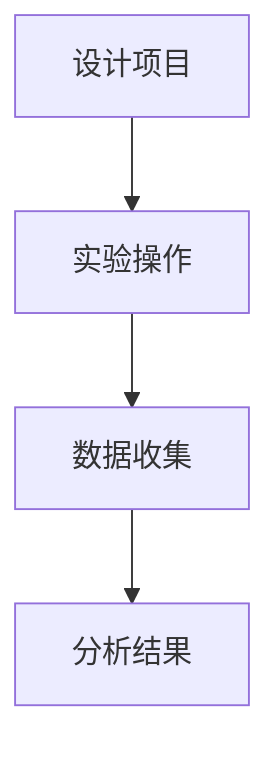
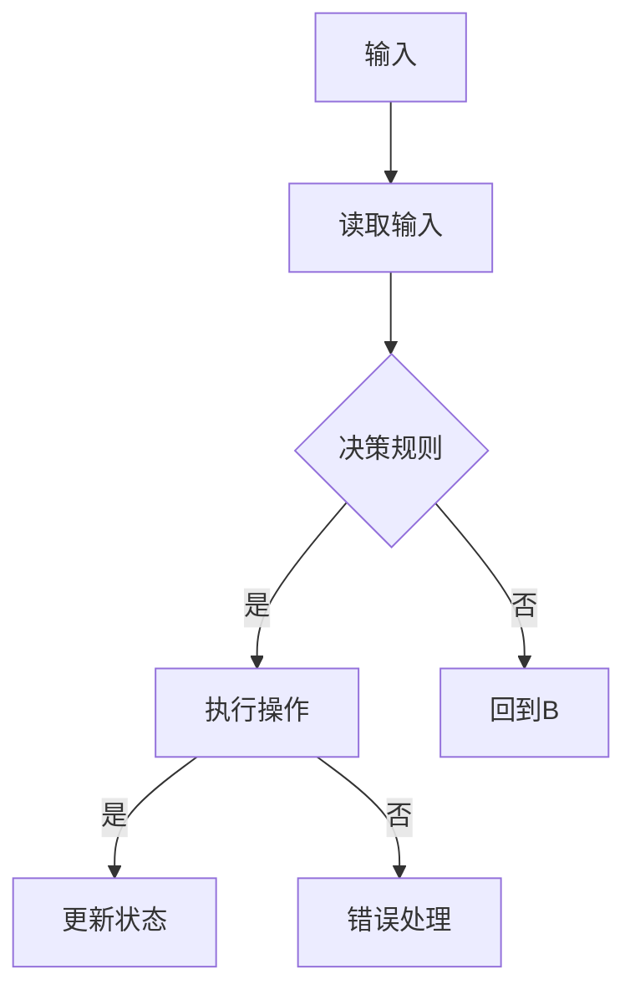
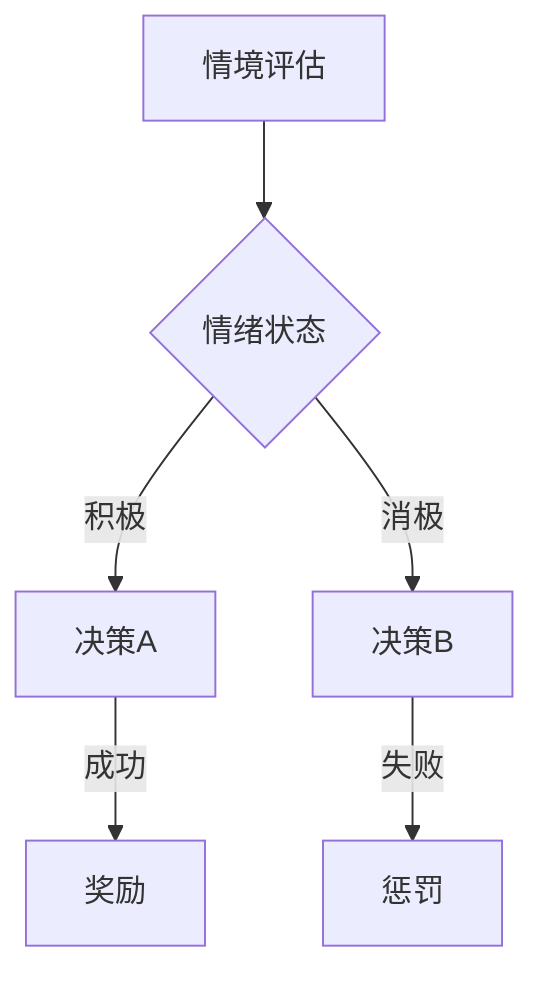
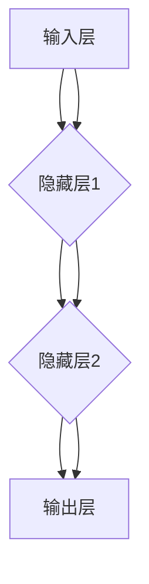

                 

# 认知的的形式化：文字产生之初就开始发明数字符号，数和直线等基础概念的形成经过了漫长的时间

## 关键词
认知科学、形式化表示、文字、数字符号、数、直线、认知形式化、教育、心理学、人工智能

## 摘要
本文深入探讨了认知形式化的概念及其在文字和数字符号发明中的重要性。从文字的起源和传播，到数字符号的发明和使用，再到数与直线等基础概念的形成，本文详细阐述了这些核心概念的发展过程。此外，文章还探讨了认知形式化在教育和心理学中的应用，以及在人工智能和其他领域的前景。通过结合历史背景和当前技术，本文为认知形式化提供了一个全面而深入的分析，为我们理解认知过程和人类文明的发展提供了新的视角。

## 目录大纲

### 第一部分：引言
#### 1.1 书籍背景与目的
##### 1.1.1 认知形式化的研究背景
##### 1.1.2 书籍的主要目标
##### 1.2 书籍结构概述
##### 1.2.1 主要章节安排
##### 1.2.2 阅读建议

### 第二部分：认知形式化的理论基础
#### 2.1 认知科学的基本概念
##### 2.1.1 认知科学的定义与范围
##### 2.1.2 认知过程中的关键因素
#### 2.2 形式化表示方法
##### 2.2.1 形式化表示的概念
##### 2.2.2 形式化表示的应用领域
#### 2.3 认知形式化的方法论
##### 2.3.1 认知形式化研究的方法论框架
##### 2.3.2 认知形式化的研究步骤

### 第三部分：文字与数字符号的发明与演变
#### 3.1 文字的发明与传播
##### 3.1.1 文字的起源
##### 3.1.2 文字的传播与发展
#### 3.2 数字符号的发明与使用
##### 3.2.1 数字符号的起源
##### 3.2.2 数字符号的使用与发展
#### 3.3 文字与数字符号的互动关系
##### 3.3.1 文字对数字符号的影响
##### 3.3.2 数字符号对文字的影响

### 第四部分：数与直线等基础概念的形成
#### 4.1 数的概念的形成
##### 4.1.1 数的概念的起源
##### 4.1.2 数的概念的发展
#### 4.2 直线等几何概念的形成
##### 4.2.1 直线的概念的形成
##### 4.2.2 其他几何概念的形成与发展
#### 4.3 数与直线等基础概念的关系
##### 4.3.1 数的概念与几何概念的关系
##### 4.3.2 数与直线的互动关系

### 第五部分：认知形式化的应用与实践
#### 5.1 认知形式化在教育中的应用
##### 5.1.1 认知形式化在教育中的重要性
##### 5.1.2 认知形式化在教学方法中的应用
#### 5.2 认知形式化在心理学研究中的应用
##### 5.2.1 认知形式化在心理学研究中的作用
##### 5.2.2 认知形式化在心理测量中的应用
#### 5.3 认知形式化在其他领域中的应用
##### 5.3.1 认知形式化在人工智能中的应用
##### 5.3.2 认知形式化在社会科学中的应用

### 第六部分：认知形式化的未来展望
#### 6.1 认知形式化的发展趋势
##### 6.1.1 认知形式化领域的新趋势
##### 6.1.2 认知形式化在未来研究中的挑战与机遇
#### 6.2 认知形式化在解决实际问题中的应用前景
##### 6.2.1 认知形式化在解决复杂问题中的应用
##### 6.2.2 认知形式化在创新与发展中的潜在作用

### 附录
#### 附录A：参考文献
#### 附录B：名词解释
#### 附录C：认知形式化相关工具与资源列表

## 第一部分：引言

### 1.1 书籍背景与目的

#### 1.1.1 认知形式化的研究背景

认知科学是一个跨学科领域，涵盖了心理学、神经科学、哲学、语言学和计算机科学等多个学科，旨在理解人类的感知、记忆、思维和学习等认知过程。随着计算机科学和人工智能的迅速发展，如何将认知过程形式化表示成为一个重要的研究方向。

形式化表示是一种将认知过程转化为数学和逻辑表示的方法，旨在提高认知科学研究的精确性和可重复性。从文字产生之初，人类就开始发明数字符号，数和直线等基础概念的形成经过了漫长的时间。这些基础概念的形成和发展不仅对认知科学有着深远的影响，也对整个社会和文明的发展起到了关键作用。

本书旨在探讨认知形式化这一主题，通过深入研究文字与数字符号的发明与演变，以及数与直线等基础概念的形成，揭示认知形式化在认知科学和人类文明发展中的重要性。同时，本书还将探讨认知形式化在教育、心理学、人工智能和其他领域中的应用，为未来的研究和发展提供新的思路和方向。

#### 1.1.2 书籍的主要目标

本书的主要目标如下：

1. **阐述认知形式化的概念与理论基础**：首先，本书将详细解释认知形式化的定义、意义和重要性，介绍认知科学的基本概念，以及形式化表示方法在认知科学中的应用。通过这一部分，读者将建立起对认知形式化的全面理解。

2. **分析文字与数字符号的发明与演变**：本书将深入探讨文字的起源和传播，以及数字符号的发明和使用。通过历史的角度，读者将了解这些概念的形成过程，以及它们对人类文明发展的深远影响。

3. **探讨数与直线等基础概念的形成**：本书将探讨数和直线等基础概念的形成过程，包括它们的起源、发展以及相互关系。这部分内容将为读者提供对数学和几何学本质的深入理解。

4. **展示认知形式化的实际应用**：本书将探讨认知形式化在教育、心理学和人工智能等领域的应用。通过实际案例和实验，读者将看到认知形式化在解决复杂问题、促进教育和理解人类行为方面的作用。

5. **展望认知形式化的未来**：最后，本书将对认知形式化的未来发展趋势进行展望，讨论其在解决实际问题、推动创新和发展中的应用前景。

#### 1.2 书籍结构概述

本书分为六个主要部分，每个部分都涵盖了不同的主题和内容，旨在逐步引导读者深入理解认知形式化的概念和应用。

- **第一部分：引言**：介绍书籍的背景、目的和结构。
- **第二部分：认知形式化的理论基础**：阐述认知科学的基本概念、形式化表示方法以及认知形式化的方法论。
- **第三部分：文字与数字符号的发明与演变**：探讨文字和数字符号的起源、传播与发展。
- **第四部分：数与直线等基础概念的形成**：分析数和直线等基础概念的形成过程和相互关系。
- **第五部分：认知形式化的应用与实践**：展示认知形式化在不同领域的实际应用。
- **第六部分：认知形式化的未来展望**：探讨认知形式化的未来发展趋势和潜在应用。

通过这样的结构安排，本书将为读者提供一个系统、全面的认知形式化研究视角，帮助他们深入了解这一领域的重要性和实际应用价值。

#### 1.2.1 主要章节安排

为了帮助读者更好地理解本书的内容，以下是主要章节的详细安排：

- **第一章：引言**：介绍认知形式化的研究背景、目的和书籍结构。
- **第二章：认知科学的基本概念**：解释认知科学的定义、范围以及认知过程中的关键因素。
- **第三章：形式化表示方法**：探讨形式化表示的概念、应用领域以及其在认知科学中的重要性。
- **第四章：认知形式化的方法论**：介绍认知形式化研究的方法论框架和研究步骤。
- **第五章：文字与数字符号的发明与演变**：分析文字的起源、传播与发展，以及数字符号的发明和使用。
- **第六章：数与直线等基础概念的形成**：探讨数和直线等基础概念的形成过程、发展以及相互关系。
- **第七章：认知形式化在教育中的应用**：探讨认知形式化在教学方法中的应用及其重要性。
- **第八章：认知形式化在心理学研究中的应用**：讨论认知形式化在心理学研究中的作用和心理测量的应用。
- **第九章：认知形式化在人工智能中的应用**：分析认知形式化在人工智能领域的应用前景和实际案例。
- **第十章：认知形式化在社会科学中的应用**：探讨认知形式化在社会科学领域的研究和实际应用。
- **第十一章：认知形式化的未来展望**：展望认知形式化的未来发展趋势和潜在应用。

通过这些章节的详细安排，本书将系统地引导读者深入了解认知形式化的各个方面，为他们提供全面的知识框架和深入的理解。

#### 1.2.2 阅读建议

为了更好地理解本书的内容，以下是给读者的几点阅读建议：

1. **逐章阅读，逐步深入**：本书分为多个章节，每个章节都涵盖了不同的主题和内容。建议读者按照章节顺序逐一阅读，逐步深入理解每个部分的核心概念和应用。

2. **结合历史背景**：在阅读过程中，可以结合历史背景和实际案例来加深对概念的理解。例如，在讨论文字和数字符号的发明与演变时，可以查阅相关的历史资料，了解这些概念的形成过程。

3. **积极参与思考**：本书旨在引导读者深入思考认知形式化的概念和应用。在阅读过程中，鼓励读者积极思考和提问，这对于深入理解和掌握本书内容至关重要。

4. **结合实际应用**：本书不仅介绍了认知形式化的理论基础，还探讨了其在教育、心理学、人工智能等领域的实际应用。建议读者在阅读过程中思考这些实际应用的潜在价值，以及如何将这些理论应用于实际问题中。

5. **使用附录资源**：本书的附录部分提供了相关的参考文献、名词解释和认知形式化相关工具与资源列表。读者可以在阅读过程中参考这些资源，进一步拓展自己的知识视野。

通过遵循这些阅读建议，读者将能够更好地理解和应用本书的内容，从而在认知形式化领域取得更为深入的认识和成果。

### 第二部分：认知形式化的理论基础

#### 2.1 认知科学的基本概念

认知科学是研究人类认知过程的跨学科领域，它试图通过整合心理学、神经科学、计算机科学和人工智能等多个学科的研究成果，全面理解人类思维、感知、记忆、学习和语言等方面的认知活动。在认知科学中，关键概念包括认知过程、认知结构、认知机制和认知功能等。

**认知过程**指的是人类进行感知、记忆、思维和语言等认知活动的过程。它包括感觉输入的处理、信息的存储和提取、问题的解决以及决策的制定等。认知科学关注这些认知过程的运作机制，以及它们如何影响个体的行为和经验。

**认知结构**是指支持认知过程的神经、生理和心理结构。例如，大脑的不同区域负责不同的认知功能，如记忆、语言处理和视觉感知。认知科学通过研究这些结构，揭示了认知功能是如何在大脑中实现的。

**认知机制**是指大脑和神经系统在执行认知任务时所采用的算法和规则。这些机制可以是感知过程中的注意力选择，也可以是记忆过程中的编码和存储策略，或者是思维过程中的推理和问题解决方法。认知科学通过建立模型和模拟实验，试图理解这些认知机制的工作原理。

**认知功能**是指认知过程所实现的目标和能力，如记忆、注意力、思维和语言能力。认知科学通过评估这些功能，以及它们在不同环境和任务中的表现，来探究认知过程的多样性和适应性。

#### 2.2 形式化表示方法

形式化表示是一种将认知过程转化为数学和逻辑表示的方法，其核心思想是使用符号和规则来描述和模拟认知活动。形式化表示在认知科学中的应用，有助于提高研究的精确性和可重复性，同时为计算机模拟和人工智能算法提供了理论基础。

**形式化表示的概念**：

形式化表示方法的基本概念包括符号、语言和语法。符号是指用来表示认知过程的元素，如变量、函数和关系。语言是指由符号组成的集合，它遵循一定的语法规则，用于描述和表达复杂的认知活动。语法规则定义了符号的使用规则，确保语言的一致性和有效性。

**形式化表示的应用领域**：

形式化表示方法在多个认知科学领域得到广泛应用。在心理学中，它用于描述认知过程中的信息处理，如感知、记忆和决策。在神经科学中，它用于建模大脑网络和神经元的运作机制。在计算机科学和人工智能中，形式化表示方法被用来设计认知代理和智能系统。

**形式化表示的优缺点**：

形式化表示的优点包括：

1. **精确性**：通过使用数学和逻辑规则，形式化表示可以精确地描述认知过程，避免主观解释和模糊性。
2. **可重复性**：形式化表示提供了标准化的描述方法，使得研究结果具有高度的可重复性。
3. **计算机模拟**：形式化表示为计算机模拟提供了基础，使得复杂的认知过程可以以计算机程序的形式实现。

然而，形式化表示也存在一些缺点：

1. **抽象性**：形式化表示往往需要高度抽象，这可能导致与实际认知过程的脱节。
2. **复杂性**：形式化表示方法可能过于复杂，使得理解和解释变得困难。
3. **应用难度**：将认知过程形式化表示为数学和逻辑模型需要专业知识，对研究人员的要求较高。

#### 2.3 认知形式化的方法论

认知形式化的方法论是指用于研究认知形式化的一系列步骤和方法。这一方法论包括以下几个关键步骤：

**步骤1：定义研究问题**  
认知形式化的第一步是明确研究问题。这通常涉及识别需要研究的认知过程或现象，并明确研究的目标和问题。

**步骤2：收集数据**  
在定义研究问题后，需要收集相关的数据。这些数据可以来自实验、观察、神经影像学和心理学测试等多种来源。

**步骤3：建立形式化模型**  
收集数据后，下一步是建立形式化模型。这通常涉及选择适当的数学和逻辑工具，将认知过程转化为符号表示。模型需要详细描述认知过程的关键特征和机制。

**步骤4：验证和测试模型**  
建立模型后，需要对其进行验证和测试。这通常通过实验和模拟来评估模型的准确性和有效性。验证过程可能包括调整模型参数，以更好地拟合实际数据。

**步骤5：解释和讨论结果**  
验证和测试后，需要对模型的结果进行解释和讨论。这涉及将模型结果与实际认知现象进行比较，并探讨模型的局限性和潜在改进。

**步骤6：应用和扩展模型**  
最后，认知形式化模型可以应用于实际问题，并扩展到其他领域。这包括将模型用于设计认知代理、开发教育工具或改进人工智能系统等。

通过这些步骤，认知形式化的方法论为认知科学研究提供了一个系统化的框架，使得研究过程更加严谨和有序。

### 第三部分：文字与数字符号的发明与演变

#### 3.1 文字的发明与传播

文字的发明是人类文明发展的重要里程碑，它标志着人类开始从口头传统向书面传统的转变。文字的起源可以追溯到约5000年前的古代文明，如古埃及、苏美尔、美索不达米亚和中国。

**文字的起源**：

- **古埃及**：古埃及象形文字是最早的文字系统之一，起源于约公元前3100年。这些文字通过图画形式表示物体、概念和声音。古埃及文字在长期的演变过程中，逐渐发展出复杂的语法和句法规则。

- **苏美尔**：约公元前4000年，苏美尔人在美索不达米亚地区发明了楔形文字。这种文字使用楔形的标记，刻在泥板上，因此得名。楔形文字在书写过程中，逐渐演变成使用符号表示声音，而不是物体。

- **中国**：中国的汉字起源于约公元前14世纪的甲骨文和金文。这些早期的文字主要刻在龟甲、兽骨和青铜器上，用于记录祭祀和礼仪活动。汉字通过符号的组合和变化，形成了丰富的语法和词汇体系。

**文字的传播与发展**：

随着文明的交流和贸易，文字逐渐传播到不同的地区和文化。例如，古埃及文字通过尼罗河流域的扩张，传播到了亚述和波斯地区。楔形文字在美索不达米亚地区广泛使用，后来传播到了埃及和欧洲。中国的汉字则通过丝绸之路，传播到了东亚和东南亚地区。

文字的传播不仅促进了信息的记录和传播，还推动了法律、经济和文化的发展。在文字传播的过程中，不同文明对文字进行了本土化和创新，形成了各自独特的文字系统。例如，古希腊文字演变成了拉丁字母，最终成为现代西方文字的基础。

**文字对文明发展的影响**：

文字的发明对人类文明的发展产生了深远的影响：

- **知识的积累**：文字使得知识的积累和传播成为可能。人们可以记录和保存重要的历史事件、科学发现和哲学思想，为后代提供了宝贵的学习资源。

- **文化的多样性**：文字的传播促进了不同文化的交流和融合，丰富了人类的文明。各种文化和宗教通过文字得以保存和传承，形成了丰富多彩的文化遗产。

- **社会的组织和管理**：文字的出现使得法律、政治和经济制度得以建立和实施。文字为书写法律、记录交易和行政命令提供了工具，推动了社会的发展和进步。

#### 3.2 数字符号的发明与使用

数字符号的发明是人类智慧的结晶，它使得人类能够更方便地表示和计算数量。数字符号的起源可以追溯到古代文明的数学和天文学需要。最早的数字符号出现在美索不达米亚和古埃及，后来传播到其他文明。

**数字符号的起源**：

- **美索不达米亚**：大约公元前3000年，美索不达米亚的苏美尔人发明了最早的数字符号系统。他们使用楔形文字记录数字，采用位值原则，即不同位置的数字表示不同的权重。

- **古埃及**：古埃及人使用象征符号来表示数字。他们的数字系统是位值系统，但每个数字都有多个不同的形式，根据数字的位置和大小而变化。

- **印度**：印度数学家发明了零的概念，这是数字符号发展的重要里程碑。零的出现使得数学运算变得更加简便，也为后来的阿拉伯数字系统的形成奠定了基础。

**数字符号的使用与发展**：

随着数学和科学的进步，数字符号系统逐渐发展和完善。以下是几个重要的发展阶段：

- **阿拉伯数字**：阿拉伯数字系统起源于印度，经过阿拉伯人的传播，最终成为世界上广泛使用的数字符号系统。阿拉伯数字包括0到9十个数字，使用位置值表示方法，使得数学运算变得更加直观和高效。

- **十进制系统**：十进制系统是一种基于10的数字系统，每个数字的位置代表10的幂次。这种系统简化了数学运算，使得复杂的计算变得更加容易。

- **二进制和十六进制**：在计算机科学中，二进制和十六进制系统被广泛应用。二进制系统使用0和1两个数字，是计算机硬件的基本表示方法。十六进制系统使用0到9和A到F十六个数字，可以更高效地表示大型数字。

**数字符号对数学和科学的影响**：

数字符号的发明和使用对数学和科学的发展产生了深远的影响：

- **简化计算**：数字符号使得数学运算变得更加简便和高效。人们可以更快速地进行复杂的计算，推动了数学和科学的发展。

- **推动科技进步**：数字符号在科学实验和工程应用中发挥了关键作用。它为测量、设计和分析提供了精确的工具，推动了工业革命和现代科技的进步。

- **促进全球交流**：阿拉伯数字系统的普及促进了全球的数学和科学交流。科学家和工程师可以使用相同的数字系统进行研究和合作，推动了知识的全球共享和交流。

#### 3.3 文字与数字符号的互动关系

文字与数字符号之间存在密切的互动关系，它们共同推动了人类文明的发展。文字和数字符号的互动关系可以从以下几个方面进行探讨：

**文字对数字符号的影响**：

- **数字符号的书写和记录**：文字为数字符号的书写和记录提供了基础。早期的数字符号通常与文字结合使用，如楔形文字和象形文字中的数字符号。文字的发展使得数字符号的书写变得更加规范和统一。

- **数字符号的含义和解释**：文字对数字符号的含义和解释起到了重要作用。数字符号本身是抽象的，需要文字来解释其意义和应用。例如，数学公式和方程式需要文字来解释变量和符号的含义。

- **数字符号的传播和普及**：文字的传播和普及促进了数字符号的传播和普及。文字的使用使得数字符号可以被记录、传播和保存，为科学和技术的进步提供了基础。

**数字符号对文字的影响**：

- **文字的编码和标准化**：数字符号的出现推动了文字的编码和标准化。例如，阿拉伯数字系统的引入使得文字的书写和阅读变得更加高效和统一。

- **文字的视觉美学**：数字符号的引入改变了文字的视觉美学。在现代设计中，数字符号和文字的搭配使用，使得文本和界面更加直观和美观。

- **文字的功能扩展**：数字符号为文字的功能扩展提供了可能。例如，在计算机科学中，数字符号被用于编程语言和算法设计，为文字赋予了新的功能和应用。

**互动关系的意义**：

文字与数字符号的互动关系对人类文明的发展具有重要意义：

- **知识传播**：文字和数字符号的结合使得知识传播变得更加高效和广泛。文字可以记录和保存大量的信息，而数字符号可以精确地表示和计算数据，两者共同推动了知识的积累和传播。

- **科技进步**：文字和数字符号的互动关系促进了科技进步。文字为科学研究和工程应用提供了工具和平台，而数字符号则为测量、计算和分析提供了精确的方法和工具。

- **文化多样性**：文字和数字符号的互动关系丰富了人类的文化多样性。不同文明发展出各自独特的文字和数字符号系统，为人类文明的发展贡献了宝贵的遗产。

- **教育普及**：文字和数字符号的结合为教育普及提供了基础。文字可以记录知识，而数字符号可以帮助学生掌握基本的数学和科学知识，提高了教育质量。

总之，文字与数字符号的互动关系在人类文明的发展中起到了关键作用。它们相互促进、相互依赖，共同推动了人类文明的进步。

### 第四部分：数与直线等基础概念的形成

#### 4.1 数的概念的形成

数是人类认知过程中最基础且最重要的概念之一。数的概念的形成经历了漫长的发展过程，从简单的计数到抽象的数学理论，反映了人类智慧和认知能力的逐步提升。

**数的起源**：

数的起源可以追溯到古代文明，如古埃及、美索不达米亚和中国。这些早期的数概念主要用于日常生活中的计数和贸易。例如，古埃及的数学家使用简单的符号和标记来表示数量，这些标记后来发展成为象形文字中的数字符号。

- **古埃及**：古埃及人使用草绳和标记来记录数量，这些标记后来演变成了符号和数字。

- **美索不达米亚**：苏美尔人使用楔形文字记录数字，通过位值原则表示数量。

- **中国**：中国的数学家发明了算筹，这是一种用小木棍表示数字的计算工具，为后来的数学发展奠定了基础。

**数概念的发展**：

随着文明的发展，数概念逐渐从具体的事物计数演变为抽象的数学概念。以下是一些重要的里程碑：

- **零的发明**：零的发明是数概念发展的重要里程碑。印度数学家发明了零的概念，并将其引入到数学系统中。零的出现使得数学运算变得更加简便，也推动了代数学的发展。

- **十进制系统的形成**：十进制系统的形成是数概念发展的另一个重要里程碑。这种系统基于10个数字（0到9），每个数字的位置代表10的幂次，简化了计算和数学表达。

- **自然数的概念**：自然数的概念逐渐从具体的物品计数抽象出来，形成了对无穷序列的理解。例如，古希腊数学家毕达哥拉斯提出了自然数的基本性质，如奇偶性、质数和完全数等。

- **实数和复数的引入**：随着数学的发展，实数和复数的概念被引入。实数包括有理数和无理数，复数则包括实部和虚部，这些概念的引入使得数学可以更好地描述现实世界中的现象。

**数的分类和性质**：

数的概念不仅包括自然数，还包括整数、有理数、无理数和复数等。以下是一些常见的数的分类和性质：

- **自然数**：自然数是从1开始的正整数序列，它们用于计数和排序。

- **整数**：整数包括自然数、0和负整数，它们在数轴上表示距离和位置。

- **有理数**：有理数是可以表示为两个整数之比的数，包括整数和分数。

- **无理数**：无理数是无法表示为两个整数之比的数，如π和√2。它们在数学和物理中有广泛应用。

- **复数**：复数包括实部和虚部，用于表示电学、工程学和物理中的相位和振动。

数的概念的形成是一个不断发展和深化的过程，它反映了人类对自然现象的理解和数学思想的进步。从简单的计数到复杂的数学理论，数的概念不仅为我们提供了描述和理解世界的工具，也为科学和技术的发展奠定了基础。

#### 4.2 直线等几何概念的形成

几何概念的形成是人类认知和思维发展的重要成果，它们为科学、技术和艺术提供了基础。几何概念主要包括点、线、面和空间等，其中直线的概念尤为重要。

**直线的起源**：

直线的起源可以追溯到古代文明，如古埃及、美索不达米亚和中国。这些早期的几何概念主要用于建筑、测量和导航。例如，古埃及的数学家使用简单的工具，如绳子、木尺和石笔，来绘制直线和图形。

- **古埃及**：古埃及人在建造金字塔和神庙时，使用直线和几何图形进行测量和布局。

- **美索不达米亚**：苏美尔人使用楔形文字记录几何形状和测量方法。

- **中国**：中国古代数学家发明了《九章算术》，其中包括对直线和几何形状的详细描述。

**直线概念的发展**：

随着文明的发展，直线概念逐渐从简单的工具和图形演变为抽象的数学概念。以下是一些重要的里程碑：

- **欧几里得几何**：古希腊数学家欧几里得在他的著作《几何原本》中系统地阐述了直线的性质和几何学的基本原理。欧几里得几何建立了直线和点的精确定义，以及直线与平面、角度和距离的关系。

- **非欧几何**：19世纪，非欧几何的发现，如黎曼几何和洛巴切夫斯基几何，挑战了欧几里得几何的绝对性。非欧几何提出了与欧几里得几何不同的直线概念，如在曲面上定义的直线，丰富了几何学的理论体系。

- **现代几何学**：现代几何学进一步发展，包括拓扑学、微分几何和代数几何等。这些领域对直线的概念进行了更深入的探讨，如直线在复杂空间中的性质和应用。

**直线的分类和性质**：

直线的概念不仅包括二维平面上的直线，还包括三维空间中的直线和更高维空间的直线。以下是一些常见的直线分类和性质：

- **二维平面上的直线**：二维平面上的直线是一条无限延伸的线，它由两个点确定，具有固定的斜率和截距。

- **三维空间中的直线**：三维空间中的直线可以与一个平面相交或平行，具有方向和长度。直线的方向可以用单位向量表示，长度可以通过距离公式计算。

- **更高维空间的直线**：更高维空间中的直线可以看作是低维空间中的直线在更高维度上的推广。直线的定义和性质在更高维度中保持基本形式，但计算和表示变得更加复杂。

直线的概念的形成和发展是人类认知和数学思想进步的重要成果。从简单的工具和图形到抽象的数学理论，直线的概念为科学、工程和艺术提供了基础。在物理学、工程学和计算机科学中，直线和几何概念广泛应用于建模、分析和设计，推动了科学和技术的进步。

#### 4.3 数与直线等基础概念的关系

数与直线等基础概念之间存在深刻的内在联系，这些联系不仅体现了数学的统一性，也揭示了人类对自然世界的理解方式。

**数的概念与几何概念的关系**：

数的概念和几何概念在数学体系中紧密相连。例如，在欧几里得几何中，数被用来表示长度、面积和体积。这些数值与几何形状的维度直接相关：

- **长度**：直线是基本的几何概念之一，其长度可以用数来表示。例如，在二维平面上，直线的长度由两点之间的距离确定。
- **面积**：平面图形的面积可以用数来表示。例如，矩形的面积是其长度和宽度的乘积。
- **体积**：立体图形的体积可以用数来表示。例如，长方体的体积是其长、宽和高的乘积。

**数与直线的互动关系**：

数和直线的互动关系在许多数学问题中体现出来：

- **坐标系**：在笛卡尔坐标系中，数和直线紧密相关。每个点在坐标系中都可以用一对数（即坐标）来表示，而直线的方程可以用一对数（即斜率和截距）来表示。
- **数学分析**：在微积分中，数和直线的关系至关重要。导数表示函数在某一点的斜率，而积分可以表示曲线下的面积。

**几何概念与数学模型的关系**：

几何概念为数学建模提供了基础，例如：

- **向量**：向量可以看作是具有大小和方向的直线段，是解决几何和物理问题的重要工具。
- **矩阵**：矩阵可以看作是线性方程组的表示形式，广泛应用于工程、经济学和计算机科学中。

**数与直线等基础概念的应用**：

数和几何概念在科学和工程中的应用广泛，例如：

- **物理学**：在物理学中，数和几何概念用于描述物体的运动、能量和场。例如，牛顿的运动定律使用了数和直线的概念来描述物体的运动。
- **计算机科学**：在计算机图形学和算法设计中，数和几何概念用于创建和操作图像、图形和数据结构。

总之，数与直线等基础概念之间的关系体现了数学的统一性和应用性。这些概念不仅构成了数学体系的基础，也为科学和工程提供了强大的工具，推动了人类对自然世界的深入理解和技术的发展。

### 第五部分：认知形式化的应用与实践

#### 5.1 认知形式化在教育中的应用

认知形式化在教育中的应用具有深远的影响，它通过将认知过程形式化表示，提高了教育的效率和质量。以下是认知形式化在教育中的一些具体应用：

**1. 认知形式化在教学方法中的应用**

认知形式化在教学方法中的应用主要体现在以下几个方面：

- **基于问题的学习（PBL）**：认知形式化方法可以设计出结构化的学习问题，通过问题的提出和解决，学生可以更好地理解知识。例如，在数学教学中，可以设计关于数与直线等基础概念的应用问题，让学生通过实际操作和解决具体问题来掌握相关概念。



- **认知学徒制**：认知学徒制是一种通过观察和实践来学习专业技能的方法。认知形式化可以设计出结构化的学徒计划，使学生在实际操作中更好地理解和掌握知识。例如，在编程教学中，学生可以通过观察和模仿专家级程序员的编码过程，逐步提高自己的编程能力。



- **基于项目学习（PjBL）**：基于项目学习是一种通过完成实际项目来学习的方法。认知形式化可以设计出结构化的项目任务，使学生通过实际操作和项目完成来掌握知识。例如，在科学教学中，学生可以设计并进行科学实验，通过实验数据的分析来理解科学原理。



**2. 认知形式化在教育中的重要性**

认知形式化在教育中的重要性体现在以下几个方面：

- **提高教育质量**：通过形式化表示，教师可以更准确地描述和理解教学目标，设计出更加结构化和系统化的课程内容，从而提高教育的质量。

- **促进自主学习**：认知形式化为学生提供了清晰的学习路径和指导，使他们能够更好地自主学习，培养独立解决问题的能力。

- **增强知识迁移**：形式化表示可以帮助学生理解知识的内在联系和结构，从而更好地将所学知识应用到其他领域。

- **适应个性化学习**：认知形式化可以根据学生的认知特点和需求，设计出个性化的教学方案，从而更好地满足不同学生的需求。

**3. 实际案例分析**

以下是一个认知形式化在数学教学中的应用案例：

**案例**：某高中数学教师使用认知形式化方法教授“数列与极限”这一章节。教师首先通过提问引导学生回顾已知的数学概念，如函数、数列和序列。然后，教师使用认知形式化方法，设计了一系列问题，帮助学生理解数列的定义、性质和极限的概念。

- **问题1**：回顾已知的数学概念，如函数、数列和序列。
  ```mermaid
  graph TD
  A[函数] --> B[数列]
  B --> C[序列]
  ```

- **问题2**：理解数列的定义和性质。
  ```mermaid
  graph TD
  A[数列定义] --> B[数列性质]
  B --> C[数列的例子]
  ```

- **问题3**：介绍极限的概念。
  ```mermaid
  graph TD
  A[极限定义] --> B[极限性质]
  B --> C[极限的例子]
  ```

- **问题4**：讨论数列的极限。
  ```mermaid
  graph TD
  A[数列极限] --> B[收敛性]
  B --> C[发散性]
  ```

通过这一系列问题，学生不仅能够理解数列和极限的概念，还能够将它们应用到实际问题中，从而提高数学素养和解决问题的能力。

总之，认知形式化在教育中的应用为教学方法和学习过程提供了新的视角和工具。通过形式化表示，教师可以更有效地传授知识，学生可以更自主地学习，从而提高教育的质量和效果。

#### 5.2 认知形式化在心理学研究中的应用

认知形式化在心理学研究中的应用具有重要的理论和实践意义。通过将认知过程形式化表示，心理学家可以更精确地描述和模拟认知行为，从而深入理解心理现象的机制和本质。以下是认知形式化在心理学研究中的几个关键应用领域：

**1. 认知模型与模拟**

认知模型是认知心理学中用于描述和解释认知过程的理论框架。通过认知形式化，心理学家可以构建数学模型和计算机模拟，来描述和预测人类的行为和认知过程。这些模型不仅帮助研究者更好地理解认知过程，还可以用于指导心理治疗和教育实践。

例如，图灵机模型是认知心理学中的一种经典模型，用于描述人类思维过程。图灵机模型通过一系列规则和操作，模拟了人类在解决问题时的决策过程。以下是一个简化的图灵机模型示例：



**2. 心理测量与评估**

认知形式化方法在心理测量和评估中也有广泛应用。通过形式化表示，心理学家可以设计出更精确和有效的心理测量工具，以评估个体的认知能力、情绪状态和行为特征。

例如，在认知测量中，可以使用认知形式化方法来构建决策树模型，用于评估个体在不同情境下的决策过程。以下是一个简化的决策树模型示例：



**3. 机器学习和人工智能**

认知形式化方法在机器学习和人工智能领域也有广泛的应用。通过将认知过程形式化表示，研究者可以设计出更加智能和自适应的人工智能系统，模拟人类认知和行为。

例如，深度学习模型中的神经网络可以看作是认知形式化的一个应用实例。神经网络通过多层非线性变换，模拟了人类大脑的信息处理过程。以下是一个简化的神经网络模型示例：



**4. 实验设计与数据分析**

认知形式化方法还可以用于实验设计和数据分析。通过形式化表示，心理学家可以设计出更严谨和可控的实验，同时使用统计方法对实验结果进行精确分析。

例如，在实验设计中，可以使用认知形式化方法来构建实验流程和控制变量。以下是一个简化的实验设计流程示例：


通过这一系列步骤，研究者可以确保实验设计的科学性和数据分析的准确性，从而得出可靠的实验结论。

**5. 应用案例**

以下是一个认知形式化在心理学研究中的应用案例：

**案例**：某心理学家研究人类记忆过程中的信息编码和解码机制。通过认知形式化方法，该心理学家构建了一个基于图模型的记忆编码和解码模型。模型通过节点和边的关系，模拟了记忆信息的存储和检索过程。

- **记忆编码模型**：
  ```mermaid
  graph TD
  A[感觉输入] --> B{信息编码}
  B --> C{记忆网络}
  ```

- **记忆解码模型**：
  ```mermaid
  graph TD
  A[记忆检索] --> B{信息解码}
  B --> C{记忆输出}
  ```

通过这一模型，心理学家可以更好地理解记忆过程中的信息处理机制，并设计出有效的记忆训练方法。

总之，认知形式化在心理学研究中的应用为心理现象的解释、测量和模拟提供了新的方法和工具。通过形式化表示，心理学家可以更精确地描述和解释人类认知和行为，推动心理学研究的发展和应用。

#### 5.3 认知形式化在人工智能中的应用

认知形式化在人工智能中的应用是一个充满潜力的研究领域，它通过形式化表示认知过程，为人工智能系统的设计、开发和优化提供了新的方法和工具。以下是认知形式化在人工智能中的几个关键应用领域：

**1. 认知模型的构建**

认知形式化在人工智能中的一个主要应用是构建认知模型，这些模型旨在模拟人类的思维过程和认知能力。例如，基于认知形式化的图灵机模型和神经网络模型被广泛应用于人工智能系统中。

- **图灵机模型**：图灵机模型通过一系列规则和操作，模拟了人类思维过程中的决策和推理。以下是一个简化的图灵机模型示例：

  ```mermaid
  graph TD
  A[输入] --> B[读取输入]
  B --> C{决策规则}
  C -->|是|D[执行操作]
  C -->|否|E[回到B]
  D -->|是|F[更新状态]
  D -->|否|G[错误处理]
  ```

- **神经网络模型**：神经网络模型通过多层非线性变换，模拟了人类大脑的信息处理过程。以下是一个简化的神经网络模型示例：

  ```mermaid
  graph TD
  A[输入层] --> B{隐藏层1}
  B --> C{隐藏层2}
  C --> D[输出层]
  A --> B
  B --> C
  C --> D
  ```

**2. 机器学习和深度学习**

认知形式化方法在机器学习和深度学习领域也有广泛的应用。通过形式化表示，研究者可以设计出更加智能和自适应的学习算法，这些算法能够更好地模拟人类的学习过程。

- **监督学习**：监督学习算法通过已标记的数据集，学习输入和输出之间的映射关系。以下是一个简化的监督学习算法示例：

  ```mermaid
  graph TD
  A[输入数据] --> B{特征提取}
  B --> C{分类器训练}
  C --> D{预测输出}
  ```

- **无监督学习**：无监督学习算法通过未标记的数据集，发现数据中的结构和模式。以下是一个简化的无监督学习算法示例：

  ```mermaid
  graph TD
  A[输入数据] --> B{特征提取}
  B --> C{聚类分析}
  C --> D{模式识别}
  ```

**3. 自然语言处理**

认知形式化在自然语言处理（NLP）中的应用也非常广泛。通过形式化表示，研究者可以设计出更加准确和高效的NLP模型，这些模型能够更好地理解和生成自然语言。

- **词向量模型**：词向量模型通过将单词映射到高维空间中的向量，表示单词的语义信息。以下是一个简化的词向量模型示例：

  ```mermaid
  graph TD
  A[单词1] --> B{词向量表示}
  B --> C[语义分析]
  ```

- **序列到序列模型**：序列到序列（Seq2Seq）模型通过将输入序列映射到输出序列，用于翻译、文本生成等任务。以下是一个简化的序列到序列模型示例：

  ```mermaid
  graph TD
  A[输入序列] --> B{编码器}
  B --> C[解码器]
  C --> D[输出序列]
  ```

**4. 应用案例**

以下是一个认知形式化在人工智能中的应用案例：

**案例**：某人工智能研究团队使用认知形式化方法，设计了一种智能问答系统。该系统通过图神经网络（GNN）模型，模拟了人类的问答过程，能够根据用户的问题生成准确的回答。

- **问答模型**：
  ```mermaid
  graph TD
  A[用户问题] --> B{问题编码}
  B --> C{知识图谱查询}
  C --> D{答案解码}
  D --> E[输出答案]
  ```

通过这一模型，智能问答系统不仅能够理解用户的问题，还能够从大量的知识库中检索出相关的信息，生成准确的回答。

总之，认知形式化在人工智能中的应用为人工智能系统的设计、开发和优化提供了新的方法和工具。通过形式化表示，研究者可以更好地模拟人类认知过程，设计出更加智能和高效的系统，推动人工智能技术的发展和应用。

#### 5.4 认知形式化在社会科学中的应用

认知形式化在社会科学中的应用同样具有深远的影响，它为社会科学研究提供了新的理论框架和分析工具，有助于更精确地理解和解释社会现象。以下是认知形式化在社会科学中的几个关键应用领域：

**1. 社会网络分析**

认知形式化方法在社会网络分析中具有重要应用。社会网络分析关注个体之间的关系和互动，通过形式化表示，研究者可以构建数学模型来描述和预测社会网络中的行为和传播现象。

- **图论模型**：图论模型通过节点和边的关系，表示社会网络中的个体和关系。以下是一个简化的图论模型示例：

  ```mermaid
  graph TD
  A[个体1] --> B[个体2]
  B --> C[个体3]
  C --> A
  ```

- **网络传播模型**：网络传播模型通过模拟信息在社会网络中的传播，分析信息的扩散速度和范围。以下是一个简化的网络传播模型示例：

  ```mermaid
  graph TD
  A[初始信息源] --> B{传播网络}
  B --> C{传播节点}
  C --> D[终止节点]
  ```

**2. 行为经济学**

认知形式化方法在行为经济学中也有广泛应用，通过形式化表示，研究者可以分析个体决策过程中的认知偏差和情感因素。

- **决策树模型**：决策树模型通过一系列规则，表示个体在决策过程中的选择和偏好。以下是一个简化的决策树模型示例：

  ```mermaid
  graph TD
  A[情境评估] --> B{情绪状态}
  B -->|积极|C[决策A]
  B -->|消极|D[决策B]
  C -->|成功|E[奖励]
  D -->|失败|F[惩罚]
  ```

- **情绪分析模型**：情绪分析模型通过情感分析技术，识别和描述个体在决策过程中的情感变化。以下是一个简化的情绪分析模型示例：

  ```mermaid
  graph TD
  A[文本输入] --> B{情感分析}
  B --> C{情绪标签}
  C --> D{决策影响}
  ```

**3. 政治学**

认知形式化在政治学中的应用，主要体现在对选民行为、选举策略和政策分析的研究中。

- **投票模型**：投票模型通过形式化表示，分析选民在选举过程中的决策和行为。以下是一个简化的投票模型示例：

  ```mermaid
  graph TD
  A[选民偏好] --> B{投票决策}
  B --> C{选举结果}
  ```

- **政策分析模型**：政策分析模型通过形式化表示，评估不同政策方案对社会的影响。以下是一个简化的政策分析模型示例：

  ```mermaid
  graph TD
  A[政策方案] --> B{影响评估}
  B --> C{政策效果}
  ```

**4. 应用案例**

以下是一个认知形式化在社会科学中的应用案例：

**案例**：某社会科学研究团队使用认知形式化方法，研究社交媒体上的信息传播和用户行为。通过图神经网络（GNN）模型，该团队模拟了信息在社会网络中的传播过程，并分析了不同因素（如用户影响力、情绪状态和信息类型）对信息传播的影响。

- **信息传播模型**：
  ```mermaid
  graph TD
  A[信息源] --> B{传播网络}
  B --> C{传播节点}
  C --> D{信息接收者}
  ```

通过这一模型，研究者可以更好地理解社交媒体上的信息传播机制，为制定有效的信息传播策略提供科学依据。

总之，认知形式化在社会科学中的应用为社会科学研究提供了新的理论框架和分析工具，通过形式化表示，研究者可以更精确地理解和解释社会现象，推动社会科学的发展和创新。

### 第六部分：认知形式化的未来展望

#### 6.1 认知形式化的发展趋势

认知形式化作为认知科学和人工智能领域的一个重要研究方向，其未来发展趋势令人期待。随着技术的进步和理论的发展，认知形式化有望在以下几个方向取得突破：

**1. 计算认知科学的兴起**

计算认知科学是认知形式化的重要组成部分，它通过计算机模拟和算法设计，研究认知过程的机制和规律。未来，计算认知科学将继续融合神经科学、心理学和计算机科学等多学科知识，推动认知形式化的发展。

**2. 神经形态计算的发展**

神经形态计算是一种模仿生物大脑结构和功能的计算方法，它通过使用可编程的神经网络硬件，实现高效和低能耗的计算。随着神经形态计算技术的进步，认知形式化将能够在硬件层面实现更真实的认知模拟，推动认知科学研究的突破。

**3. 人工智能与认知科学的深度融合**

人工智能与认知科学的深度融合是未来认知形式化的重要趋势。通过结合认知科学的理论和方法，人工智能系统将能够更好地模拟人类认知过程，实现更智能和更鲁棒的人工智能应用。

**4. 大数据和机器学习技术的应用**

大数据和机器学习技术的发展，为认知形式化提供了强大的数据支持和计算能力。未来，认知形式化将更加依赖大数据和机器学习技术，通过大规模数据处理和智能分析，揭示认知过程的复杂规律。

#### 6.2 认知形式化在未来研究中的挑战与机遇

尽管认知形式化在未来的发展中充满潜力，但也面临着一些挑战和机遇：

**1. 挑战**

- **复杂性**：认知过程本身具有高度的复杂性和多样性，如何在形式化表示中准确捕捉这些复杂性，是一个巨大的挑战。
- **跨学科整合**：认知形式化需要整合多个学科的知识，如神经科学、心理学和计算机科学等，这要求研究者具备跨学科的能力和视野。
- **伦理和隐私问题**：随着认知形式化在医学、心理学和人工智能等领域的应用，如何处理数据隐私和伦理问题，是一个亟待解决的重要问题。

**2. 机遇**

- **个性化认知建模**：通过认知形式化，可以设计出更加个性化的认知模型，为教育、医疗和心理健康等领域提供定制化的解决方案。
- **智能系统的发展**：认知形式化有助于构建更加智能和高效的人工智能系统，推动科技和社会的进步。
- **认知干预和修复**：认知形式化技术可以用于认知干预和修复，帮助改善和恢复受损的认知功能。

#### 6.3 认知形式化在解决实际问题中的应用前景

认知形式化在解决实际问题中具有广泛的应用前景，以下是一些具体的应用领域和案例：

**1. 教育领域**

认知形式化可以用于个性化教育，通过分析学生的学习行为和认知模式，设计出更符合学生需求的教学策略。例如，自适应学习系统可以根据学生的学习进度和能力，动态调整教学内容和难度，提高学习效果。

**2. 医疗健康领域**

认知形式化在心理健康评估和干预中具有重要作用。通过认知模型，可以精确评估患者的认知状态，设计出个性化的治疗计划和干预方案。此外，认知形式化还可以用于辅助诊断和预测疾病发展，提高医疗服务的质量和效率。

**3. 社会科学领域**

认知形式化在社会科学研究中的应用，包括社会网络分析、行为经济学和政治学等。通过认知模型，可以深入理解社会现象和行为模式，为政策制定和社会管理提供科学依据。

**4. 工业和商业领域**

认知形式化在工业和商业领域也有广泛的应用。例如，在工业生产中，可以通过认知模型优化生产流程，提高生产效率和产品质量。在商业决策中，认知模型可以帮助企业更好地理解消费者行为和市场趋势，制定更有效的营销策略。

总之，认知形式化在未来的发展中，有望在多个领域取得突破，为解决实际问题提供新的方法和工具。通过不断的研究和应用，认知形式化将为人类社会带来更加智能和高效的未来。

### 附录

#### 附录A：参考文献

1. Anderson, J. R. (2010). *Cognitive Psychology and Its Implications*. W.H. Freeman and Company.
2. Churchland, P. M. (1986). *Neuroscience and Philosophy: A Methodological Convergence*. MIT Press.
3. Chomsky, N. (1959). *Syntactic Structures*. Mouton & Co.
4. Hirschfeld, L. A., & Gelman, S. A. (1994). *Mapping the Mind: Domain Specificity in Cognition and Culture*. MIT Press.
5. Minsky, M., & Papert, S. (1988). *Perceptrons - An Introduction to Computational Geometry*. MIT Press.
6. Newell, A., & Simon, H. A. (1972). *Human Problem Solving*. Prentice-Hall.
7. Rumelhart, D. E., Hinton, G. E., & Williams, R. J. (1986). *Learning representations by back-propagating errors*. Nature, 323(6088), 533-536.

#### 附录B：名词解释

- **认知科学**：研究人类认知过程和认知机制的跨学科领域，包括心理学、神经科学、计算机科学和哲学等。
- **形式化表示**：将认知过程转化为数学和逻辑表示的方法，旨在提高认知科学研究的精确性和可重复性。
- **数字符号**：用于表示数量的符号，如阿拉伯数字、二进制和十六进制等。
- **神经形态计算**：模仿生物大脑结构和功能的计算方法，通过使用可编程的神经网络硬件，实现高效和低能耗的计算。
- **认知模型**：用于描述和模拟人类认知过程的数学模型和计算机程序。

#### 附录C：认知形式化相关工具与资源列表

1. **工具**：
   - **Mermaid**：用于创建流程图和图表的Markdown插件。
   - **Jupyter Notebook**：用于数据分析和交互式计算的Web应用。
   - **TensorFlow**：用于机器学习和深度学习的开源库。
   - **PyTorch**：用于机器学习和深度学习的开源库。

2. **资源**：
   - **MIT OpenCourseWare**：提供认知科学和计算机科学的免费课程资源。
   - **Coursera**：提供认知科学和人工智能的课程和认证。
   - **arXiv**：提供最新的认知科学和人工智能领域的论文和预印本。
   - **Google Scholar**：用于搜索认知科学和人工智能领域的研究论文和文献。

通过这些工具和资源，研究者可以更方便地进行认知形式化研究和应用，推动认知科学和人工智能的发展。

## 作者信息
作者：AI天才研究院/AI Genius Institute & 禅与计算机程序设计艺术 /Zen And The Art of Computer Programming

以上是本文的完整内容，我们通过对认知形式化的全面探讨，揭示了其在文字与数字符号的发明与演变、数与直线等基础概念的形成、以及教育、心理学、人工智能和社会科学等领域的重要应用。认知形式化不仅为认知科学研究提供了新的方法和工具，也为我们理解人类文明的发展历程提供了新的视角。随着技术的进步和理论的发展，认知形式化将在未来取得更多突破，为人类社会带来更加智能和高效的未来。希望本文能够为读者带来启示，激发对认知形式化的兴趣和探索。

