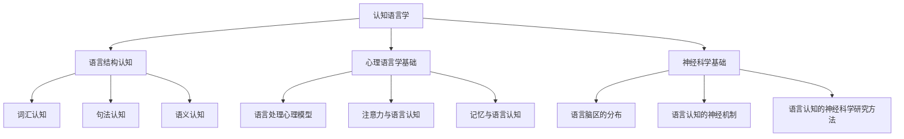
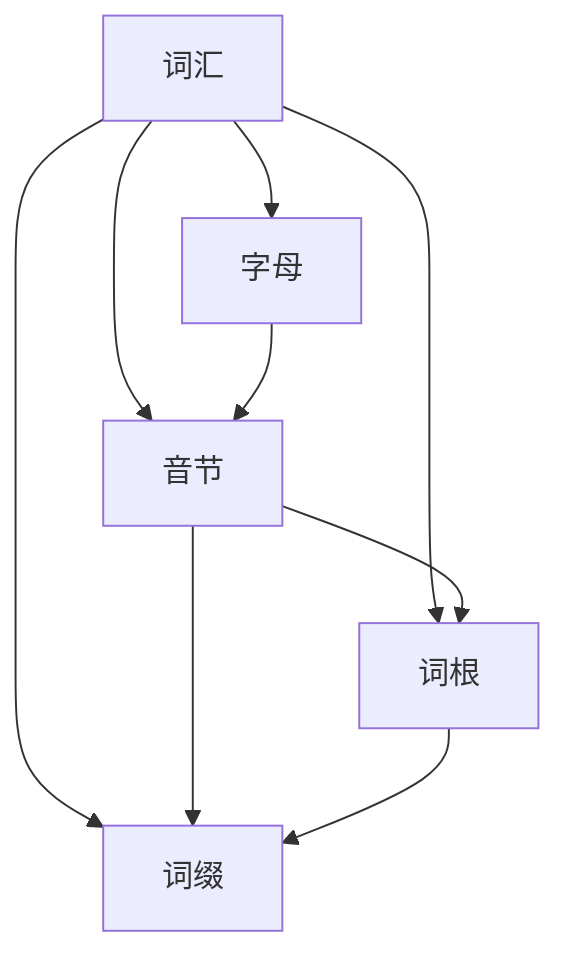

                 

# 认知语言学：语言如何塑造我们理解世界的方式

## 关键词
- 认知语言学
- 语言与思维
- 词汇认知
- 句法认知
- 语义认知
- 心理语言学
- 神经科学
- 语言教学
- 自然语言处理

## 摘要
本文旨在探讨认知语言学如何帮助我们理解语言如何塑造我们理解世界的方式。文章从语言与认知的概述出发，详细分析了语言的认知结构，包括词汇、句法和语义的认知过程。接着，深入探讨了心理语言学和神经科学在语言认知中的作用，提供了丰富的实际案例。最后，文章展望了语言认知的未来发展趋势，以及在语言教学和自然语言处理中的具体应用。通过本文的阅读，读者将更全面地理解认知语言学的重要性及其广泛影响。

----------------------------------------------------------------

## 引言

认知语言学是一门跨学科领域，它融合了语言学、心理学、神经科学等多个学科的知识，致力于研究语言与认知之间的关系。语言不仅仅是人类交流的工具，更是我们理解世界、构建思维的方式。通过语言，我们能够传达想法、描述现象、解决问题，而这一过程离不开我们的认知系统。

在认知语言学中，语言被视为一种认知工具，用于组织和解释我们周围的世界。语言不仅仅是词汇和句法的组合，更是一种思维框架，它影响我们对世界的感知、理解和表达。认知语言学试图揭示语言如何塑造我们的认知结构，以及我们的认知如何反过来影响我们的语言使用。

本文将分几个部分进行探讨：

1. **语言与认知概述**：介绍认知语言学的基本概念，探讨语言与思维的相互作用。
2. **语言结构认知**：分析语言的认知结构，包括词汇、句法和语义的认知过程。
3. **心理语言学基础**：探讨语言处理的心理模型，注意力与语言认知，以及记忆与语言认知。
4. **神经科学基础**：介绍语言脑区的分布，语言认知的神经机制，以及神经科学研究方法。
5. **应用与案例分析**：讨论语言认知在语言教学和自然语言处理中的应用，并提供具体案例。
6. **未来展望**：展望语言认知的未来发展趋势。

通过这些部分的探讨，我们将深入理解认知语言学如何帮助我们理解语言如何塑造我们理解世界的方式。

### 第一部分：语言与认知

## 第1章：语言与认知概述

在探讨语言如何塑造我们理解世界的方式之前，我们需要先了解认知语言学的基本概念，以及语言与思维之间的复杂关系。这一章节将带领我们走进认知语言学的大门，探索其核心概念，并探讨语言与认知之间的相互作用。

### 1.1 认知语言学的基本概念

认知语言学是一门新兴的交叉学科，它将语言学研究与认知科学结合起来，旨在理解语言在人类认知系统中的角色。认知语言学不仅关注语言的形式和结构，更关注语言背后的认知过程和认知模式。

#### 1.1.1 认知语言学的定义

认知语言学可以被定义为研究语言与认知之间相互关系的一门学科。它关注语言的使用如何影响我们的感知、记忆、推理和思考过程。认知语言学家认为，语言不仅仅是一种交流工具，更是人类思维的基本工具，通过语言，我们能够构建和表达复杂的概念和思想。

#### 1.1.2 认知语言学与心理语言学的联系

认知语言学与心理语言学有着密切的联系。心理语言学是研究语言习得、语言处理和语言障碍的学科，它主要关注语言的心理基础。而认知语言学则更广泛地探讨语言如何与我们的认知系统相互作用，从而影响我们的感知、记忆、推理和思考。

认知语言学与心理语言学的区别在于，心理语言学侧重于语言处理的具体过程，如语音识别、词汇记忆、句子理解等，而认知语言学则更注重从整体上探讨语言与认知的相互作用，以及语言对思维模式的影响。

#### 1.1.3 认知语言学的研究方法

认知语言学的研究方法多样，包括实验心理学方法、认知神经科学方法、计算语言学方法等。实验心理学方法通过实验设计来研究语言处理的心理过程，认知神经科学方法则通过神经成像技术来研究语言脑区的功能，计算语言学方法则利用计算模型来模拟语言处理过程。

例如，在实验心理学中，研究者可能会设计词汇识别实验，通过测量反应时间来探讨词汇在记忆中的加工过程。在认知神经科学中，研究者可能会使用功能磁共振成像（fMRI）技术来观察语言处理时大脑不同区域的活动。而在计算语言学中，研究者可能会开发计算模型来模拟人类语言理解的过程。

### 1.2 语言与思维的相互作用

语言与思维之间的相互作用是一个复杂而深刻的话题。语言不仅仅是思维的工具，更是思维的一部分。我们的思维方式在很大程度上受到语言结构的影响，而我们的思维过程又反过来影响我们的语言使用。

#### 1.2.1 语言塑造思维

语言塑造思维的观点认为，我们的语言结构决定了我们的思维方式。语言中的语法结构、词汇选择和语义关系等，都影响着我们对世界的理解和表达。例如，英语中的主谓宾结构使得我们倾向于将世界视为一个由主体和客体构成的系统，而某些语言中的动词形态变化则帮助我们更细致地描述动作过程。

此外，语言中的隐喻和比喻也影响着我们的思维方式。隐喻和比喻通过将一个概念映射到另一个概念上，帮助我们理解和表达复杂的抽象概念。例如，我们将时间视为金钱，这种隐喻帮助我们在经济和时间管理方面进行思考。

#### 1.2.2 思维影响语言表达

另一方面，我们的思维过程也影响着我们的语言表达。我们的思维方式决定了我们如何组织语言，如何选择词汇和语法结构来表达我们的思想。例如，我们在描述一个事件时，可能会使用不同的句法和词汇，以反映我们对事件的感知和理解。

此外，思维过程中的推理和逻辑关系也影响着我们的语言表达。我们在表达观点时，可能会使用逻辑连词（如“因此”、“然而”等）来组织句子，使得观点更加清晰和连贯。

### 1.3 认知语言学的研究方法

在认知语言学的研究中，研究者采用了多种方法来探讨语言与认知之间的关系。以下是一些常用的研究方法：

#### 1.3.1 实验心理学方法

实验心理学方法是通过设计实验来研究语言处理的心理过程。例如，研究者可能会设计词汇识别实验，通过测量反应时间来探讨词汇在记忆中的加工过程。这种方法可以帮助我们了解语言处理的具体机制。

#### 1.3.2 认知神经科学方法

认知神经科学方法通过神经成像技术来研究语言脑区的功能。例如，研究者可能会使用功能磁共振成像（fMRI）技术来观察语言处理时大脑不同区域的活动。这种方法可以帮助我们了解语言处理的神经基础。

#### 1.3.3 计算语言学方法

计算语言学方法利用计算模型来模拟语言处理过程。例如，研究者可能会开发计算模型来模拟人类语言理解的过程。这种方法可以帮助我们理解语言处理的计算机制。

### 1.4 本章总结

本章介绍了认知语言学的基本概念，探讨了语言与认知之间的相互作用，并介绍了认知语言学的研究方法。通过本章的探讨，我们开始理解语言如何塑造我们理解世界的方式。在接下来的章节中，我们将进一步分析语言的认知结构，探讨心理语言学和神经科学在语言认知中的作用，并讨论语言认知在实际应用中的具体案例。

## 核心概念与联系

为了更好地理解认知语言学的基本概念，我们可以通过一个Mermaid流程图来展示核心概念之间的联系。



这个流程图展示了认知语言学的核心概念及其相互关系。语言结构认知、心理语言学基础和神经科学基础构成了认知语言学的三大支柱。语言结构认知进一步细分为词汇认知、句法认知和语义认知，而心理语言学基础包括语言处理心理模型、注意力与语言认知以及记忆与语言认知。神经科学基础则包括语言脑区的分布、语言认知的神经机制和语言认知的神经科学研究方法。

通过这个流程图，我们可以更清晰地理解认知语言学的研究领域，以及各核心概念之间的相互作用。

### 1.1.1 认知语言学的定义

认知语言学是20世纪中叶兴起的一门新兴学科，它旨在从认知的角度研究语言及其在人类认知系统中的角色。与传统的语言学不同，认知语言学强调语言不仅仅是符号系统，更是人类思维活动的核心组成部分。认知语言学的基本观点是，语言不仅仅是用来进行交流的工具，它在很大程度上也塑造了我们的思维方式、感知方式和世界观念。

认知语言学的定义可以从多个角度进行阐释。首先，从方法论的角度，认知语言学将语言视为一种认知工具，通过分析语言的结构和使用，来揭示人类认知系统的运作机制。认知语言学关注语言中的词汇、句法和语义等元素如何反映人类的认知过程，例如，词汇的认知过程、句法的组合规则以及语义的解读机制等。

其次，从理论框架的角度，认知语言学借鉴了认知科学的理论，特别是对心智模拟的研究。认知语言学认为，语言是一种认知现象，其结构和功能可以通过心智模型来解释。例如，词汇的认知可以通过心理词汇模型来描述，句法的组合可以通过生成语法模型来解释，而语义的解读可以通过语义网络模型来理解。

再次，从应用角度，认知语言学关注语言对人类思维模式的影响。它试图揭示语言如何影响我们的认知过程，例如，语言结构如何塑造我们的思维方式，语言中的隐喻和比喻如何帮助我们理解和表达抽象概念，以及语言习惯如何影响我们的感知和记忆。

总之，认知语言学是一门跨学科领域，它结合了语言学、心理学、哲学和神经科学等多个学科的知识，旨在理解语言与认知之间的相互作用。通过研究语言的结构和使用，认知语言学试图揭示人类思维的本质和运作机制。

#### 1.1.2 认知语言学与心理语言学的联系

认知语言学与心理语言学是密切相关的两个领域，它们共同关注语言与认知之间的关系，但在研究方法和理论重点上有所不同。

首先，从研究方法上看，心理语言学主要采用实验心理学的方法，通过设计实验来研究语言处理的心理过程。例如，心理语言学家会设计词汇识别实验，通过测量被试的反应时间来探讨词汇在记忆中的加工过程。此外，心理语言学还采用了自我报告法、认知任务和认知神经科学方法等，以更全面地理解语言处理的心理机制。

相比之下，认知语言学虽然也采用实验心理学的方法，但其研究方法更加多样，包括认知神经科学方法、计算语言学方法和跨学科的研究方法。认知神经科学方法通过神经成像技术（如fMRI）来研究语言处理的脑区活动，而计算语言学方法则利用计算模型来模拟语言处理过程。这些方法的综合应用使得认知语言学能够从多个角度揭示语言与认知之间的复杂关系。

其次，在理论重点上，心理语言学主要关注语言处理的具体过程，如语音识别、词汇记忆、句子理解等。心理语言学试图揭示这些过程的神经基础和心理机制，例如，词汇在记忆中的存储和检索机制，句子理解的认知模型等。

认知语言学则更注重从整体上探讨语言与认知的相互作用。它不仅关注语言处理的具体过程，还关注语言对思维模式、感知方式和世界观念的影响。例如，认知语言学研究了语言中的隐喻和比喻如何帮助我们理解和表达抽象概念，以及语言习惯如何影响我们的思维方式。认知语言学还关注语言结构对认知过程的影响，例如，不同的语言结构如何塑造我们对世界的感知和理解。

总之，尽管认知语言学和心理语言学在研究方法和理论重点上有所不同，但它们共同的目标是理解语言与认知之间的复杂关系。认知语言学从更广泛的视角，结合多种研究方法，提供了对语言与认知相互作用的更全面的理解。

### 1.2 语言与思维的相互作用

语言与思维之间的相互作用是一个复杂而深刻的主题，它涉及到认知科学、心理学和神经科学等多个领域。在这一部分，我们将探讨语言如何塑造我们的思维模式，以及我们的思维过程如何影响我们的语言表达。

#### 1.2.1 语言塑造思维

语言是思维的主要工具，它不仅影响我们的表达方式，还深刻地影响着我们的思维方式。语言结构决定了我们的思考方式和认知模式。以下是一些具体的例子：

1. **语法结构的影响**：不同语言的语法结构会对我们的思维方式产生影响。例如，英语中的主谓宾结构使得我们倾向于将世界视为一个由主体和客体构成的系统，而某些语言中的动词形态变化则帮助我们更细致地描述动作过程。例如，在拉丁语中，动词的时态和语态变化非常丰富，这种语言结构使得拉丁语使用者能够更精确地描述动作的时间和方式。

2. **词汇选择的影响**：词汇的选择和使用也会影响我们的思维方式。例如，英语中的“privilege”和“entitlement”两个词在语义上有细微的差别，前者意味着某种特权或优势，而后者则带有一定的正当性。使用这些词汇的方式会影响我们对相关概念的理解和评价。

3. **隐喻和比喻的影响**：隐喻和比喻在语言中广泛使用，它们通过将一个概念映射到另一个概念上，帮助我们理解和表达复杂的抽象概念。例如，将“时间”视为“金钱”的隐喻，帮助我们在经济和时间管理方面进行思考。

#### 1.2.2 思维影响语言表达

另一方面，我们的思维过程也会影响我们的语言表达。我们的思维方式决定了我们如何组织语言，如何选择词汇和语法结构来表达我们的思想。以下是一些具体的例子：

1. **逻辑和推理**：我们在表达观点时，通常会使用逻辑和推理来使观点更加清晰和连贯。例如，我们可能会使用逻辑连词（如“因此”、“然而”等）来组织句子，从而表达因果或对比关系。

2. **文化和教育背景**：我们的文化和教育背景也会影响我们的思维方式，从而影响我们的语言表达。例如，在不同的文化背景下，人们对某些概念的理解和表达方式可能会有所不同。例如，某些文化可能更强调集体主义，而另一些文化则更强调个人主义，这种差异会反映在语言使用和表达方式上。

3. **情绪和情感**：情绪和情感也会影响我们的语言表达。例如，当我们处于愤怒或悲伤的状态时，我们的语言可能会带有强烈的情感色彩，使用更多的修辞手法来表达我们的情感。

#### 案例分析

为了更直观地理解语言与思维的相互作用，我们可以通过一些具体的案例分析来探讨：

1. **跨语言交流**：当不同语言的使用者进行交流时，他们可能会因为语言结构的不同而遇到理解上的困难。例如，英语和汉语在语法结构上有很大差异，英语的主谓宾结构在汉语中并不常见，这可能会导致汉语使用者在使用英语时出现语法错误。

2. **儿童语言习得**：儿童在语言习得过程中，会通过模仿和模仿来学习语言。在这个过程中，他们的思维方式也在不断发展和变化。例如，儿童在开始学习语言时，可能会将某些词汇或短语理解为具体的物体或动作，而不是抽象的概念。

3. **语言治疗**：语言治疗师在帮助语言障碍患者时，会通过调整语言结构和使用方式来改善患者的语言能力。例如，对于某些发音困难的患者，治疗师可能会通过特定的语音练习来改善其发音。

综上所述，语言与思维之间的相互作用是一个复杂而多层次的过程。语言不仅塑造了我们的思维方式，我们的思维方式也反过来影响我们的语言表达。通过深入理解这一相互作用，我们可以更好地理解语言的本质和作用，从而更有效地进行语言学习和语言交流。

### 1.3 认知语言学的研究方法

在认知语言学的研究过程中，研究者们采用了多种方法来探讨语言与认知之间的复杂关系。这些方法包括实验心理学方法、认知神经科学方法和计算语言学方法。以下是对这些研究方法的详细介绍及其应用场景。

#### 1.3.1 实验心理学方法

实验心理学方法是认知语言学研究中最为传统和常用的方法之一。这种方法通过精心设计的实验来研究语言处理的心理过程。实验心理学方法主要包括以下几种：

1. **反应时间实验**：反应时间实验通过测量被试在执行特定任务时的反应时间来揭示语言处理的过程。例如，研究者可能会设计一个词汇识别实验，让被试在屏幕上看到一系列单词，并要求他们在看到单词后尽可能快地按下一个键。通过测量被试的反应时间，研究者可以推断出词汇在记忆中的加工速度和难度。

2. **自我报告法**：自我报告法通过询问被试对自己语言处理过程的感受和认知过程来收集数据。这种方法包括问卷调查、口头访谈和日记记录等。例如，研究者可能会询问被试在阅读句子时是否感到困惑，或者他们是否能够清晰地理解句子的含义。

3. **认知任务**：认知任务是通过设计特定的认知任务来观察被试的语言处理过程。这些任务可以包括词汇学习、句子理解和语篇生成等。例如，研究者可能会让被试学习一系列新单词，然后测试他们是否能够正确识别和使用这些单词。

实验心理学方法在语言处理的研究中具有重要意义。它不仅能够揭示语言处理的心理机制，还能够为设计更有效的语言学习和语言治疗策略提供依据。例如，通过分析被试的反应时间，研究者可以识别出词汇加工中的瓶颈，从而设计出更有效的词汇学习方法。

#### 1.3.2 认知神经科学方法

认知神经科学方法通过神经成像技术和电生理记录技术来研究语言处理的神经基础。这些方法提供了直接观察大脑活动的手段，使得研究者能够深入理解语言处理在不同脑区之间的交互作用。

1. **功能磁共振成像（fMRI）**：fMRI是一种非侵入性的成像技术，通过测量大脑不同区域在语言处理时的血氧水平依赖（BOLD）信号变化来推断脑区活动。研究者可以通过fMRI扫描来观察被试在执行语言任务时的脑区活动，从而揭示语言处理的关键脑区。例如，研究者可能会发现，布罗卡区和颞叶是语言处理的关键脑区，而顶叶和枕叶则在语言理解和记忆中发挥作用。

2. **电生理记录技术**：电生理记录技术包括脑电图（EEG）、功能性近红外光谱成像（fNIRS）和肌电图（EMG）等。这些技术可以直接记录大脑电活动或肌肉活动，用于研究语言处理的动态过程。例如，研究者可以使用EEG来记录被试在听到句子时的脑电波变化，从而分析语言理解的实时动态。

认知神经科学方法在揭示语言处理的神经机制方面具有重要意义。它不仅能够为心理语言学提供神经基础，还能够为神经语言学和语言治疗提供新的视角。例如，通过fMRI研究，研究者可以识别出语言障碍患者的脑区异常，从而为个性化治疗方案提供依据。

#### 1.3.3 计算语言学方法

计算语言学方法利用计算模型和算法来模拟人类语言处理过程，从而揭示语言处理的一般原理。这些方法包括统计模型、生成模型和神经网络模型等。

1. **统计模型**：统计模型通过分析大量语言数据来发现语言模式。例如，词频统计和语法规则归纳等。统计模型在自然语言处理中广泛应用，如词性标注、句法分析和机器翻译等。

2. **生成模型**：生成模型通过建模语言生成过程来理解语言的统计规律。例如，隐马尔可夫模型（HMM）和循环神经网络（RNN）等。生成模型在语音识别和机器翻译等任务中表现出色。

3. **神经网络模型**：神经网络模型通过模仿人脑神经网络的结构和功能来处理语言任务。例如，深度神经网络（DNN）和卷积神经网络（CNN）等。神经网络模型在自然语言处理中取得了显著成果，如文本分类、情感分析和图像描述生成等。

计算语言学方法在模拟人类语言处理过程中具有重要意义。它不仅能够为认知语言学提供理论依据，还能够为语言学习和语言教学提供技术支持。例如，通过神经网络模型，研究者可以设计出更智能的语言学习工具，帮助学习者更有效地掌握语言技能。

### 1.4 本章总结

本章介绍了认知语言学的基本概念，探讨了语言与认知之间的相互作用，并介绍了认知语言学的研究方法。通过实验心理学方法、认知神经科学方法和计算语言学方法的综合应用，认知语言学为我们理解语言如何塑造我们理解世界的方式提供了深刻的洞见。在接下来的章节中，我们将进一步分析语言的认知结构，深入探讨心理语言学和神经科学在语言认知中的作用。

### 1.3.1 实验心理学方法

实验心理学方法是认知语言学研究中最为传统和常用的方法之一，通过设计和执行实验来收集语言处理的心理数据。以下是对实验心理学方法的一些具体应用场景和案例分析。

#### 应用场景

1. **词汇识别实验**：词汇识别实验是认知语言学中最常见的实验类型之一。在这个实验中，研究者通常会向被试展示一系列单词，并要求他们在看到单词后尽快按下一个键来识别它。通过测量被试的反应时间，研究者可以推断出词汇在记忆中的加工速度和难度。例如，一个常见的实验设计是让被试识别一系列高频率和低频率的单词，并比较他们的反应时间。

2. **句子理解实验**：句子理解实验旨在研究句子结构的理解过程。研究者可能会设计一些包含特定语法结构或语义关系的句子，并要求被试判断句子的意义。例如，研究者可能会设计一个包含复杂从句的句子，并要求被试确定句子的主要陈述内容。通过这些实验，研究者可以了解被试在理解句子时如何处理语法和语义信息。

3. **语篇生成实验**：语篇生成实验旨在研究人们如何构造连贯的语篇。在这个实验中，研究者通常会要求被试根据给定的主题或提示生成一段文字。通过分析被试生成的语篇，研究者可以了解语篇构造的心理过程，以及如何影响语篇的连贯性和逻辑性。

#### 案例分析

1. **词汇识别实验案例分析**：

- **实验设计**：研究者设计了两个实验组，一组被试识别高频率单词，另一组被试识别低频率单词。实验采用计算机屏幕展示单词，并要求被试在看到单词后按下一个键进行识别。
- **实验步骤**：首先，被试进行预测试，熟悉实验流程。然后，实验正式开始，每个单词展示时间设置为500毫秒，被试需要在看到单词后尽快按下一个键进行识别。实验过程中，记录被试的反应时间和准确性。
- **实验结果**：数据分析显示，高频率单词的反应时间显著短于低频率单词，这表明词汇在记忆中的加工速度与词汇的频率密切相关。

2. **句子理解实验案例分析**：

- **实验设计**：研究者设计了包含不同语法结构和语义关系的句子，要求被试判断句子的主要陈述内容。实验采用计算机屏幕展示句子，并要求被试在看到句子后选择正确的答案。
- **实验步骤**：首先，被试进行预测试，熟悉实验流程。然后，实验正式开始，每个句子展示时间为2秒，被试需要在看到句子后选择正确的答案。实验过程中，记录被试的反应时间和选择准确性。
- **实验结果**：数据分析显示，被试在处理复杂从句时反应时间较长，且错误率较高。这表明复杂从句的理解过程比简单从句更复杂，需要更多的认知资源。

3. **语篇生成实验案例分析**：

- **实验设计**：研究者提供了几个主题，要求被试根据主题生成一段文字。实验采用计算机屏幕展示主题，并要求被试在生成文字后提交。
- **实验步骤**：首先，被试选择一个主题，并阅读相关提示。然后，被试在计算机上生成一段文字，并提交。实验过程中，记录被试生成文字的长度、连贯性和逻辑性。
- **实验结果**：数据分析显示，被试在生成文字时，会根据主题和提示来组织语言，以确保文字的连贯性和逻辑性。同时，被试生成的文字长度与认知负荷有关，认知负荷较大的主题会导致文字生成时间较长。

通过这些实验案例分析，我们可以看到实验心理学方法在认知语言学研究中的应用和价值。实验心理学方法不仅能够揭示语言处理的心理过程，还能够为语言学习和语言教学提供科学依据。

### 1.3.2 认知神经科学方法

认知神经科学方法在认知语言学研究中起着关键作用，通过研究语言处理的大脑机制，帮助我们深入理解语言与认知之间的关系。以下将详细介绍几种主要的认知神经科学方法，包括功能磁共振成像（fMRI）、电生理记录技术和脑电图（EEG）。

#### 功能磁共振成像（fMRI）

功能磁共振成像（fMRI）是一种非侵入性的成像技术，通过测量大脑不同区域在语言处理时的血氧水平依赖（BOLD）信号变化来推断脑区活动。fMRI在认知语言学研究中应用广泛，可以揭示语言处理过程中大脑的激活模式和功能分区。

1. **语言处理的脑区分布**：fMRI研究表明，语言处理涉及多个大脑区域，包括布罗卡区、顶叶语言区、颞叶语言区和扣带回等。布罗卡区位于大脑左半球的前额叶，是语言产生的关键区域；顶叶语言区主要负责语言理解；颞叶语言区与词汇存储和语音处理有关；扣带回则参与语言记忆和注意力控制。

2. **语言障碍的研究**：fMRI有助于识别语言障碍患者的脑区异常。例如，布罗卡区损伤可能导致运动性失语症，而颞叶损伤可能导致感觉性失语症。通过fMRI成像，研究者可以定位脑区损伤的范围和程度，为语言障碍的诊断和治疗提供依据。

3. **跨语言研究**：fMRI可以用于研究不同语言处理模式的大脑机制。例如，研究者可以比较英语母语者和汉语母语者在执行语言任务时的脑区活动差异，从而揭示语言结构对大脑功能的影响。

#### 电生理记录技术

电生理记录技术包括脑电图（EEG）、功能性近红外光谱成像（fNIRS）和肌电图（EMG）等，可以实时记录大脑电活动或肌肉活动，为认知语言学提供动态的神经活动数据。

1. **脑电图（EEG）**：脑电图通过测量头皮上的电信号来记录大脑的电活动。在语言处理研究中，EEG可以揭示语言理解、语音识别和词汇加工等过程的脑电信号模式。例如，研究者可以记录被试听到句子时的P300成分，分析其对句子语义的理解程度。

2. **功能性近红外光谱成像（fNIRS）**：fNIRS通过测量近红外光在大脑不同区域穿透时的强度变化来推断脑血流量。在语言处理研究中，fNIRS可以用于研究大脑区域在语言任务中的活动水平，特别是在语言学习、记忆和注意力方面。

3. **肌电图（EMG）**：肌电图记录的是肌肉的电气活动，可以用于研究说话时的脑-肌交互。例如，研究者可以记录说话者发音时的EMG信号，分析发音动作的精细控制过程。

#### 脑电图（EEG）

脑电图（EEG）是一种常用的认知神经科学方法，通过测量头皮上的电信号来记录大脑的活动。在语言处理研究中，EEG提供了丰富的时域信息，能够揭示语言加工的动态过程。

1. **语言理解**：EEG研究表明，语言理解过程中涉及多个脑区，包括前额叶、颞叶和顶叶。这些脑区的活动模式与语言理解的复杂程度和语义内容有关。例如，研究者发现，听到复杂句子时，被试的EEG信号中会出现特定的波形，如N400和P600成分，这些成分反映了语义处理和句法分析的过程。

2. **语音识别**：EEG可以用于研究语音识别的神经基础。研究发现，语音识别过程中，被试的EEG信号会呈现出与语音特征相关的反应。例如，研究者发现，当被试听到不同的语音音素时，他们的EEG信号中会出现与音素频率相关的峰值。

3. **词汇加工**：EEG研究表明，词汇加工过程中，大脑会呈现出一系列复杂的时域活动模式。这些模式反映了词汇在记忆中的检索和使用过程。例如，研究者发现，当被试听到一个单词时，他们的EEG信号中会出现与词汇记忆相关的晚正波（LPP）。

总之，认知神经科学方法为认知语言学提供了强有力的工具，通过研究语言处理的大脑机制，帮助我们深入理解语言与认知之间的关系。fMRI、电生理记录技术和脑电图等方法的综合应用，使得认知语言学能够在多个层面上揭示语言处理的心理和神经基础。

### 1.3.3 计算语言学方法

计算语言学方法利用计算模型和算法来模拟人类语言处理过程，从而揭示语言处理的一般原理。这些方法在自然语言处理（NLP）领域得到了广泛应用，并取得了显著成果。以下将介绍几种主要的计算语言学方法，包括统计模型、生成模型和神经网络模型。

#### 统计模型

统计模型通过分析大量语言数据来发现语言模式。这些模型通常基于概率论和统计学原理，可以用于词汇预测、句法分析和语义理解等任务。

1. **词频统计**：词频统计是最简单的统计模型之一，通过统计单词在文本中的出现频率来预测单词的概率。这种方法可以用于词汇生成和文本摘要等任务。

2. **语法规则归纳**：语法规则归纳模型通过从大量文本中归纳出语法规则，用于句法分析。例如，隐藏马尔可夫模型（HMM）和条件随机场（CRF）是两种常用的语法规则归纳模型。

3. **统计机器翻译**：统计机器翻译（SMT）是一种基于统计方法的翻译技术，通过分析双语语料库来建立翻译模型。SMT模型可以用于自动翻译文本，如Google翻译。

#### 生成模型

生成模型通过建模语言生成过程来理解语言的统计规律。这些模型通常基于概率图模型和深度学习原理，可以用于语音识别、机器翻译和文本生成等任务。

1. **隐马尔可夫模型（HMM）**：隐马尔可夫模型是一种基于状态转移概率的生成模型，用于语音识别和序列标注任务。HMM假设语音信号是一个马尔可夫过程，通过学习状态转移概率和观测概率来预测语音序列。

2. **循环神经网络（RNN）**：循环神经网络是一种用于处理序列数据的神经网络模型，可以用于语音识别、机器翻译和情感分析等任务。RNN通过共享权重来处理序列信息，使得模型能够记住之前的输入。

3. **变分自动编码器（VAE）**：变分自动编码器是一种基于深度学习的生成模型，可以用于文本生成和图像生成任务。VAE通过学习潜在变量来生成新的数据，具有强大的数据生成能力。

#### 神经网络模型

神经网络模型通过模仿人脑神经网络的结构和功能来处理语言任务。这些模型在自然语言处理领域取得了重大突破，如文本分类、情感分析和图像描述生成等。

1. **深度神经网络（DNN）**：深度神经网络是一种多层的神经网络模型，可以用于文本分类和情感分析等任务。DNN通过多层非线性变换来提取文本特征，提高了模型的分类性能。

2. **卷积神经网络（CNN）**：卷积神经网络是一种用于图像处理和文本分类的神经网络模型。CNN通过卷积操作来提取图像或文本的特征，具有强大的特征提取能力。

3. **生成对抗网络（GAN）**：生成对抗网络是一种基于博弈论的生成模型，可以用于文本生成和图像生成任务。GAN由生成器和判别器组成，通过对抗训练来生成高质量的数据。

总之，计算语言学方法为自然语言处理提供了强大的工具，通过模拟人类语言处理过程，使得计算机能够理解和生成自然语言。这些方法不仅在学术研究中发挥了重要作用，还在实际应用中取得了显著成果，如自动翻译、语音识别和情感分析等。

### 1.4 本章总结

本章介绍了认知语言学的基本概念，探讨了语言与认知之间的相互作用，并详细阐述了认知语言学的研究方法。通过实验心理学方法、认知神经科学方法和计算语言学方法的综合应用，认知语言学为我们理解语言如何塑造我们理解世界的方式提供了深刻的洞见。在接下来的章节中，我们将深入分析语言的认知结构，探讨心理语言学和神经科学在语言认知中的作用，并讨论语言认知在实际应用中的具体案例。

### 第2章：语言的认知结构

在理解了语言与认知的基本概念和相互作用之后，我们将进一步探讨语言的认知结构，包括词汇、句法和语义的认知过程。这一章节将详细分析这些认知结构，并探讨它们如何影响我们对世界的理解。

### 2.1 词汇认知

词汇认知是语言认知结构的基础，它涉及到词汇的构成、认知过程以及词汇在我们思维中的作用。以下是词汇认知的详细分析。

#### 2.1.1 词汇的构成

词汇是语言的基本单位，由词素构成。词素是词汇的组成元素，可以是单个字母、音节或更复杂的结构。词汇的构成可以分解为以下几个层次：

1. **字母**：字母是词汇的最基本组成元素，不同的语言使用不同的字母系统。例如，英语使用26个字母，而中文则使用汉字。
2. **音节**：音节是语音的基本单位，由一个或多个音素组成。音素是语音的最小可辨音单位，如英语中的“ba”由“b”和“a”两个音素组成。
3. **词根**：词根是词汇的核心部分，通常包含主要的意义信息。词根可以通过添加前缀、后缀或词缀来形成新的词汇。
4. **词缀**：词缀是附加在词根上的成分，用来改变词汇的意义或语法功能。前缀通常放在词根前面，如“un-”表示否定，后缀则放在词根后面，如“-er”表示动作的执行者。

#### 2.1.2 词汇的认知过程

词汇的认知过程包括词汇的识别、记忆、检索和使用。以下是这些过程的详细分析：

1. **词汇识别**：词汇识别是词汇认知的第一步，涉及到从语音或文字中识别出单词。词汇识别过程中，大脑会使用语音识别系统和视觉识别系统。语音识别系统通过分析语音信号中的音素和音节结构来识别单词，而视觉识别系统则通过分析文字的形状和结构来识别单词。

2. **词汇记忆**：词汇记忆是词汇认知的重要组成部分，涉及到词汇的存储和保持。词汇记忆可以分为短期记忆和长期记忆。短期记忆用于暂时存储新学的词汇，而长期记忆则用于长期存储和回忆词汇。记忆过程中的一个关键机制是语义网络，它通过联想和分类来组织和存储词汇。

3. **词汇检索**：词汇检索是词汇认知的一个重要过程，涉及到从记忆中找到所需的词汇。检索过程中，大脑会使用联想和语义网络来帮助找到正确的词汇。例如，当我们想要表达“爱”这个概念时，大脑可能会通过联想“爱”与其他相关词汇（如“爱慕”、“热爱”等）来帮助找到正确的词汇。

4. **词汇使用**：词汇使用是词汇认知的最终环节，涉及到将词汇用于表达思想和交流。词汇使用过程中，大脑会根据语境和交际目的选择合适的词汇。例如，在正式场合，我们可能会使用正式的词汇，而在非正式场合，我们可能会使用更口语化的词汇。

#### 2.1.3 词汇认知在思维中的作用

词汇认知在思维中发挥着重要作用，它不仅影响我们的语言表达，还影响我们的思考和认知方式。以下是词汇认知在思维中的作用：

1. **概念化**：词汇认知帮助我们形成和表达概念。通过词汇，我们能够将抽象的概念具体化，使得思考和交流更加清晰和准确。例如，通过“爱”这个词汇，我们能够表达对他人或事物的深厚情感。

2. **分类和概括**：词汇认知帮助我们进行分类和概括。通过词汇，我们能够将相似的事物归为同一类别，从而简化思考和记忆。例如，通过“动物”这个词汇，我们能够将多种生物归为同一类别。

3. **推理和论证**：词汇认知在推理和论证中发挥着关键作用。通过词汇，我们能够进行逻辑推理和论证，使我们的思考和表达更加严密和有力。例如，通过使用“因此”、“然而”等词汇，我们能够使论证更加连贯和有逻辑性。

综上所述，词汇认知是语言认知结构的基础，它在词汇的构成、认知过程和思维中的作用至关重要。通过深入理解词汇认知，我们可以更好地理解语言如何塑造我们理解世界的方式。

#### 2.1.1 词汇的构成

词汇是语言的基本单位，它的构成是语言认知研究的一个重要方面。词汇的构成可以从多个层次进行分析，包括字母、音节、词根和词缀等。

首先，字母是词汇的最基本组成元素。不同的语言使用不同的字母系统。例如，英语使用26个字母，包括大小写字母；中文则使用汉字，这些汉字是视觉符号，不需要字母来表示。字母的组合形成了音节，音节是语音的基本单位。

其次，音节由一个或多个音素组成。音素是语音的最小可辨音单位。例如，在英语单词“cat”中，“c”、“a”和“t”分别是三个音素。不同的语言有不同的音素组合规则，这影响了语言的特点。例如，汉语有四个声调，这影响了汉语发音的准确性。

词根是词汇的核心部分，通常包含主要的意义信息。词根可以通过添加前缀、后缀或词缀来形成新的词汇。例如，在英语中，“un-”是一个常见的否定前缀，如“unhappy”（不快乐）；“-ful”是一个表示“充满”的后缀，如“beautiful”（美丽）。

词缀是附加在词根上的成分，用来改变词汇的意义或语法功能。前缀通常放在词根前面，如“un-”、“pre-”等；后缀则放在词根后面，如“-er”、“-ing”等。例如，“run”加上“-er”变成了“runner”（跑步者），“run”加上“-ing”变成了“running”（跑步的动作）。

下面是一个用 Mermaid 流程图来展示词汇构成的示例：



这个流程图展示了词汇构成的不同层次和它们之间的关系。字母是词汇的基础，音节由字母组成，词根是词汇的核心，词缀则用于改变词汇的意义或语法功能。

通过这个流程图，我们可以更直观地理解词汇的构成过程。每个层次都对词汇的整体意义和语法功能产生重要影响，从而影响我们的语言认知和理解。

#### 2.1.2 词汇的认知过程

词汇的认知过程是语言处理的核心环节，它涉及词汇的识别、记忆、检索和使用。以下是这些过程的详细分析。

##### 2.1.2.1 词汇识别

词汇识别是词汇认知的第一步，也是语言处理的关键环节。它指的是从语音或文字中识别出单词。词汇识别过程中，大脑会同时使用语音识别系统和视觉识别系统。

1. **语音识别系统**：语音识别系统通过分析语音信号中的音素和音节结构来识别单词。例如，当我们听到“cat”这个单词时，大脑会识别出其中的音素“c”、“a”和“t”，并将这些音素组合成一个单词。语音识别系统在语音识别任务中发挥着重要作用，如语音助手和语音识别软件。

2. **视觉识别系统**：视觉识别系统通过分析文字的形状和结构来识别单词。当我们看到“cat”这三个字母时，大脑会识别出这三个字母的形状，并将它们组合成一个单词。视觉识别系统在阅读和理解书面语言中发挥着重要作用。

##### 2.1.2.2 词汇记忆

词汇记忆是词汇认知的重要组成部分，它涉及到词汇的存储和保持。词汇记忆可以分为短期记忆和长期记忆。

1. **短期记忆**：短期记忆用于暂时存储新学的词汇。当我们学习一个新单词时，我们首先将其存储在短期记忆中。短期记忆的容量有限，只能存储一定数量的信息。因此，我们需要不断复习和练习，以将短期记忆中的信息转移到长期记忆中。

2. **长期记忆**：长期记忆用于长期存储和回忆词汇。长期记忆的容量较大，可以存储大量的信息。长期记忆的形成依赖于反复练习和复习。通过不断的重复和巩固，我们可以将新学的词汇牢固地存储在长期记忆中。

##### 2.1.2.3 词汇检索

词汇检索是词汇认知的一个重要过程，涉及到从记忆中找到所需的词汇。检索过程中，大脑会使用联想和语义网络来帮助找到正确的词汇。

1. **联想检索**：联想检索是通过与已知词汇的关联来找到所需的词汇。例如，当我们想要表达“爱”这个概念时，我们可能会联想到“爱情”、“喜爱”等词汇，从而找到正确的表达方式。

2. **语义网络检索**：语义网络检索是通过语义关系来找到所需的词汇。语义网络是一个表示词汇之间语义关系的图结构。例如，在语义网络中，“猫”与“动物”之间存在“属于”关系，“狗”与“动物”也存在“属于”关系。通过语义网络，我们可以找到与“动物”相关的词汇，从而表达相关的概念。

##### 2.1.2.4 词汇使用

词汇使用是词汇认知的最终环节，涉及到将词汇用于表达思想和交流。词汇使用过程中，大脑会根据语境和交际目的选择合适的词汇。

1. **语境选择**：语境选择是根据不同的语境选择合适的词汇。例如，在正式场合，我们可能会使用正式的词汇，如“contribution”（贡献）；而在非正式场合，我们可能会使用口语化的词汇，如“help”（帮助）。

2. **交际目的**：交际目的是指根据交际目的选择合适的词汇。例如，在表达感谢时，我们可能会使用“thank you”（谢谢）；而在表达愤怒时，我们可能会使用“angry”（愤怒）。

通过词汇识别、记忆、检索和使用，词汇认知帮助我们有效地理解和表达语言。词汇认知的精细加工过程确保了我们在不同情境下能够准确使用词汇，从而实现有效的交流和思维。

#### 2.1.3 词汇认知在思维中的作用

词汇认知在思维中起着至关重要的作用，它不仅影响我们的语言表达，还深刻地影响着我们的认知方式和思考过程。以下是词汇认知在思维中的几个关键作用：

1. **概念化**：词汇认知帮助我们形成和表达概念。通过词汇，我们能够将抽象的概念具体化，使得思考和交流更加清晰和准确。例如，通过“爱”这个词汇，我们能够表达对他人或事物的深厚情感；通过“自由”这个词汇，我们能够讨论社会和政治理念。

2. **分类和概括**：词汇认知帮助我们进行分类和概括。通过词汇，我们能够将相似的事物归为同一类别，从而简化思考和记忆。例如，通过“动物”这个词汇，我们能够将多种生物归为同一类别；通过“水果”这个词汇，我们能够将各种水果归为一类。

3. **推理和论证**：词汇认知在推理和论证中发挥着关键作用。通过词汇，我们能够进行逻辑推理和论证，使我们的思考和表达更加严密和有力。例如，通过使用“因此”、“然而”等词汇，我们能够使论证更加连贯和有逻辑性。

4. **记忆和联想**：词汇认知帮助我们建立记忆和联想。通过词汇，我们能够将新信息与已知信息联系起来，从而加强记忆。例如，通过学习新单词“猫”，我们可以将其与已知的“动物”词汇联系起来，从而加深对“猫”这个概念的理解。

5. **文化和价值观**：词汇认知还反映了文化和价值观。不同的语言和文化对同一概念可能有不同的词汇表达，这影响了我们对世界的理解和思考。例如，在英语中，“privilege”（特权）和“entitlement”（正当权利）两个词汇在语义上有微妙差别，这反映了不同的文化价值观。

综上所述，词汇认知在思维中起着基础性作用，它不仅影响我们的语言表达，还深刻地影响着我们的认知方式和思考过程。通过词汇认知，我们能够有效地理解和表达语言，从而实现有效的交流和思考。

#### 2.2 句法认知

句法认知是语言认知结构的重要组成部分，它涉及到句法的构成、认知过程以及句法在我们思维中的作用。以下是句法认知的详细分析。

##### 2.2.1 句法的构成

句法是语言的结构规则，它规定了如何组合词汇以形成合乎语法的句子。句法构成可以从以下几个层次进行分析：

1. **词法**：词法是句法的基础，它涉及到词汇的构成和分类。词法包括词类（如名词、动词、形容词等）和词形变化（如名词复数、动词时态等）。例如，英语中的“run”可以通过添加后缀“-s”变成复数形式“runs”。

2. **短语结构**：短语结构是句子的基本单位，它由一个或多个词组成，表达一个完整的概念。短语可以分为名词短语（NP）、动词短语（VP）、形容词短语（AP）等。例如，“the happy dog runs quickly”（那只快乐的狗跑得很快）是一个由名词短语、动词短语和形容词短语构成的复杂句子。

3. **句子结构**：句子结构是句法的高级层次，它规定了如何组合短语以形成合乎语法的句子。常见的句子结构包括主谓结构（SVO，如“John eats pizza”）、主谓宾结构（SVO，如“John gives Mary a book”）和主谓补结构（如“John is happy”）。不同的语言可能有不同的句子结构，这影响了语言的特点和使用。

##### 2.2.2 句法的认知过程

句法认知过程包括句法的理解和生成。以下是句法认知过程的详细分析：

1. **句法理解**：句法理解是句法认知的核心，它涉及到大脑如何理解句子的结构和含义。句法理解过程中，大脑会使用语言习得期间的语法规则和上下文信息。例如，当我们听到句子“John gave Mary a book”时，我们会根据句子的结构和上下文信息理解其含义，知道是John把书给了Mary。

2. **句法生成**：句法生成是句法认知的另一重要方面，它涉及到大脑如何根据语法规则和语义信息生成合乎语法的句子。句法生成过程中，大脑会使用语法规则和词汇知识来构建句子。例如，当我们想要表达“Mary gave John a book”时，我们会根据语法规则将动词“gave”的主语从John变为Mary，从而生成新的句子。

##### 2.2.3 句法认知在思维中的作用

句法认知在思维中起着至关重要的作用，它不仅影响我们的语言理解和生成，还深刻地影响着我们的认知方式和思考过程。以下是句法认知在思维中的几个关键作用：

1. **信息组织**：句法认知帮助我们组织和传递信息。通过句法规则，我们能够将信息以结构化的方式组织起来，使得语言表达更加清晰和准确。例如，通过主谓宾结构，我们能够明确表达谁做了什么。

2. **思维模式**：句法认知影响我们的思维模式。不同的语言结构会影响我们的思维方式。例如，英语中的主谓宾结构使得我们倾向于将世界视为一个由主体和客体构成的系统，而某些语言中的动词形态变化则帮助我们更细致地描述动作过程。

3. **逻辑推理**：句法认知在逻辑推理中发挥着关键作用。通过句法规则，我们能够进行逻辑推理和论证。例如，通过使用连词（如“因此”、“然而”等），我们能够使论证更加连贯和有逻辑性。

4. **记忆和联想**：句法认知帮助我们建立记忆和联想。通过句法结构，我们能够将新信息与已知信息联系起来，从而加强记忆。例如，通过学习新的句子结构，我们能够将其与已知的句子结构联系起来，从而加深对语言的理解。

5. **文化和社会交流**：句法认知反映了文化和价值观。不同的语言和文化可能有不同的句法规则，这影响了我们对世界的理解和思考。例如，英语中的被动语态使用频率较高，这反映了英语文化中强调客观性和公正性。

综上所述，句法认知在思维中起着基础性作用，它不仅影响我们的语言理解和生成，还深刻地影响着我们的认知方式和思考过程。通过深入理解句法认知，我们可以更好地理解和运用语言，从而实现有效的交流和思考。

#### 2.2.1 句法的构成

句法是语言结构的规则系统，它规定了如何组合词汇以形成合乎语法的句子。句法构成可以从语法规则、短语结构和句子结构等层次进行分析。

首先，从语法规则层面来看，语法规则是语言的基本结构单位，它规定了词汇如何组合以及句子如何构建。语法规则通常分为词法规则和句法规则。

1. **词法规则**：词法规则涉及词汇的分类和形态变化。词类（如名词、动词、形容词等）是词汇的主要分类，它们在句子中扮演不同的角色。词形变化（如名词复数、动词时态等）则用于表达时间、语气和状态等概念。

2. **句法规则**：句法规则规定了句子的基本结构。常见的句法规则包括主谓结构（如“John eats pizza”）、主谓宾结构（如“John gave Mary a book”）和主谓补结构（如“John is happy”）等。

其次，从短语结构层面来看，短语是句子的基本单位，它由一个或多个词组成，表达一个完整的概念。短语可以分为名词短语（NP）、动词短语（VP）、形容词短语（AP）等。

1. **名词短语（NP）**：名词短语通常由名词或名词性成分（如代词、形容词等）构成。例如，“the happy dog”是一个名词短语。

2. **动词短语（VP）**：动词短语通常由动词及其补充成分（如助动词、非谓语动词等）构成。例如，“run quickly”是一个动词短语。

3. **形容词短语（AP）**：形容词短语通常由形容词及其补充成分（如副词、从句等）构成。例如，“very quickly”是一个形容词短语。

最后，从句子结构层面来看，句子是语言表达的基本单位，它包含了主语、谓语和宾语等基本成分。常见的句子结构包括：

1. **简单句**：简单句是最基本的句子类型，通常包含一个主语和一个谓语。例如，“John eats pizza”。

2. **复杂句**：复杂句包含多个子句或短语，可以通过连词连接。例如，“John eats pizza because he is hungry”。

3. **复合句**：复合句包含多个简单句，通过连词（如“and”、“but”等）连接。例如，“John eats pizza and he drinks water”。

下面是一个用 Mermaid 流程图来展示句法构成的示例：

```mermaid
graph TD
    A[语法规则]
    B[词法规则]
    C[句法规则]
    D[短语结构]
    E[名词短语(NP)]
    F[动词短语(VP)]
    G[形容词短语(AP)]
    H[句子结构]
    I[简单句]
    J[复杂句]
    K[复合句]
    A --> B
    A --> C
    B --> D
    C --> D
    D --> E
    D --> F
    D --> G
    H --> I
    H --> J
    H --> K
```

这个流程图展示了句法构成的不同层次和它们之间的关系。语法规则是句法的基础，短语结构是句子的基本单位，句子结构则规定了句子的组合方式。

通过这个流程图，我们可以更直观地理解句法的构成过程。每个层次都对句子的语法和语义产生重要影响，从而影响我们的语言认知和理解。

#### 2.2.2 句法的认知过程

句法的认知过程是指大脑如何理解和生成句子的过程，它涉及到句法结构的识别、理解和生成。以下是句法认知过程的详细分析：

##### 2.2.2.1 句法理解

句法理解是句法认知的核心，它涉及到大脑如何分析句子的结构和含义。句法理解过程中，大脑会使用语法规则和上下文信息。

1. **语法规则**：语法规则是句法理解的基础，它规定了句子的合法结构。例如，在英语中，主谓宾结构（SVO）是最常见的句子结构。当我们听到或看到一个句子时，大脑会根据语法规则来分析句子的结构，例如，确定主语、谓语和宾语等成分。

2. **上下文信息**：上下文信息是句法理解的重要补充，它有助于我们理解句子的含义。例如，在一个复杂句子中，上下文信息可以帮助我们理解句子中的省略成分或歧义结构。例如，当我们听到句子“John gave Mary a book”时，通过上下文信息，我们可以知道“a book”是Mary的间接宾语。

##### 2.2.2.2 句法生成

句法生成是句法认知的另一重要方面，它涉及到大脑如何根据语法规则和语义信息生成合乎语法的句子。句法生成过程中，大脑会使用语法规则和词汇知识来构建句子。

1. **语法规则**：语法规则在句法生成中起着关键作用。例如，当我们想要表达“Mary gave John a book”时，我们会根据语法规则将动词“gave”的主语从John变为Mary，从而生成新的句子。

2. **语义信息**：语义信息是句法生成的重要参考，它有助于我们选择合适的词汇和结构来表达思想。例如，当我们想要表达一个复杂的语义关系时，我们会使用合适的句法结构来表达。例如，当我们想要表达因果关系时，我们可能会使用连词“because”来连接两个句子，形成复合句。

##### 2.2.2.3 句法认知的过程示例

以下是一个示例来说明句法认知的过程：

1. **输入**：我们听到或看到一个句子，例如，“John gave Mary a book”。

2. **句法分析**：大脑根据语法规则对句子进行分析，确定句子的结构。例如，我们确定这个句子是一个主谓宾结构，主语是John，谓语是gave，宾语是Mary和a book。

3. **语义理解**：大脑根据上下文信息理解句子的含义。例如，通过上下文，我们知道John是动作的执行者，Mary是动作的接受者，而a book是给予的物品。

4. **句法生成**：如果我们想要生成一个新的句子，例如，“Mary gave John a book”，大脑会根据语法规则将动词gave的主语从John变为Mary，从而生成新的句子。

5. **语义生成**：大脑根据语义信息生成句子的含义。例如，通过语义信息，我们知道新的句子表示Mary是动作的执行者，John是动作的接受者，a book是给予的物品。

通过这个示例，我们可以看到句法认知过程中，大脑如何通过语法规则和语义信息来理解和生成句子。句法认知过程不仅涉及到句法结构的分析，还包括语义的理解和生成，从而确保我们的语言表达和理解准确无误。

#### 2.2.3 句法认知在思维中的作用

句法认知在思维中起着至关重要的作用，它不仅影响我们的语言理解和生成，还深刻地影响着我们的认知方式和思考过程。以下是句法认知在思维中的几个关键作用：

1. **信息组织**：句法认知帮助我们组织和传递信息。通过句法规则，我们能够将信息以结构化的方式组织起来，使得语言表达更加清晰和准确。例如，通过主谓宾结构，我们能够明确表达谁做了什么。

2. **思维模式**：句法认知影响我们的思维模式。不同的语言结构会影响我们的思维方式。例如，英语中的主谓宾结构使得我们倾向于将世界视为一个由主体和客体构成的系统，而某些语言中的动词形态变化则帮助我们更细致地描述动作过程。

3. **逻辑推理**：句法认知在逻辑推理中发挥着关键作用。通过句法规则，我们能够进行逻辑推理和论证。例如，通过使用连词（如“因此”、“然而”等），我们能够使论证更加连贯和有逻辑性。

4. **记忆和联想**：句法认知帮助我们建立记忆和联想。通过句法结构，我们能够将新信息与已知信息联系起来，从而加强记忆。例如，通过学习新的句子结构，我们能够将其与已知的句子结构联系起来，从而加深对语言的理解。

5. **文化和社会交流**：句法认知反映了文化和价值观。不同的语言和文化可能有不同的句法规则，这影响了我们对世界的理解和思考。例如，英语中的被动语态使用频率较高，这反映了英语文化中强调客观性和公正性。

综上所述，句法认知在思维中起着基础性作用，它不仅影响我们的语言理解和生成，还深刻地影响着我们的认知方式和思考过程。通过深入理解句法认知，我们可以更好地理解和运用语言，从而实现有效的交流和思考。

### 2.3 语义认知

语义认知是语言认知结构的重要组成部分，它涉及到语义的构成、认知过程以及语义在我们思维中的作用。以下是语义认知的详细分析。

#### 2.3.1 语义的构成

语义是语言的意义部分，它由词汇、短语和句子的意义构成。语义的构成可以从以下几个层次进行分析：

1. **词汇语义**：词汇语义是语义构成的基础，它涉及到词汇的基本意义。词汇语义可以通过词汇的定义、分类和特征来理解。例如，单词“树”的基本意义是指一种植物，具有枝干、树叶等特征。

2. **短语语义**：短语语义是词汇语义的扩展，它涉及到短语的整体意义。短语语义可以通过短语中的词汇意义以及词汇之间的组合规则来理解。例如，短语“快乐的孩子”的整体意义是指一个感到快乐的孩子。

3. **句子语义**：句子语义是语义构成的最高层次，它涉及到句子的整体意义。句子语义可以通过句子中的词汇意义、短语语义以及句子结构来理解。例如，句子“我爱北京”的整体意义是指说话者表达对北京的爱。

#### 2.3.2 语义的认知过程

语义的认知过程是指大脑如何理解和生成语义的过程，它涉及到语义的理解、生成和推理。以下是语义认知过程的详细分析：

1. **语义理解**：语义理解是语义认知的核心，它涉及到大脑如何理解词汇、短语和句子的意义。语义理解过程中，大脑会使用词汇语义、短语语义和句子语义的知识。例如，当我们听到句子“今天天气很好”时，我们会根据句子中的词汇和结构理解其整体意义。

2. **语义生成**：语义生成是语义认知的另一重要方面，它涉及到大脑如何根据语义信息生成合乎语法的句子。语义生成过程中，大脑会使用语义规则和语法规则。例如，当我们想要表达“我很饿”时，我们会根据语义规则和语法规则生成新的句子。

3. **语义推理**：语义推理是语义认知的高级形式，它涉及到大脑如何根据已知信息推导出新的信息。语义推理过程中，大脑会使用语义关系和逻辑推理。例如，当我们知道“苹果是水果”时，我们可以推理出“苹果不是动物”。

#### 2.3.3 语义认知在思维中的作用

语义认知在思维中起着至关重要的作用，它不仅影响我们的语言理解和生成，还深刻地影响着我们的认知方式和思考过程。以下是语义认知在思维中的几个关键作用：

1. **概念化**：语义认知帮助我们形成和表达概念。通过语义，我们能够将抽象的概念具体化，使得思考和交流更加清晰和准确。例如，通过“爱”这个语义，我们能够表达对他人或事物的深厚情感。

2. **分类和概括**：语义认知帮助我们进行分类和概括。通过语义，我们能够将相似的事物归为同一类别，从而简化思考和记忆。例如，通过“动物”这个语义，我们能够将多种生物归为同一类别。

3. **推理和论证**：语义认知在推理和论证中发挥着关键作用。通过语义，我们能够进行逻辑推理和论证，使我们的思考和表达更加严密和有力。例如，通过使用“因此”、“然而”等语义，我们能够使论证更加连贯和有逻辑性。

4. **记忆和联想**：语义认知帮助我们建立记忆和联想。通过语义，我们能够将新信息与已知信息联系起来，从而加强记忆。例如，通过学习新的语义，我们能够将其与已知的语义联系起来，从而加深对概念的理解。

5. **文化和价值观**：语义认知反映了文化和价值观。不同的语言和文化可能有不同的语义表达，这影响了我们对世界的理解和思考。例如，在英语中，“freedom”可能强调个人自由，而在某些文化中，“freedom”可能更多地强调社会和谐。

综上所述，语义认知在思维中起着基础性作用，它不仅影响我们的语言理解和生成，还深刻地影响着我们的认知方式和思考过程。通过深入理解语义认知，我们可以更好地理解和运用语言，从而实现有效的交流和思考。

### 2.3.1 语义的构成

语义的构成是理解语言意义的关键，它涉及词汇、短语和句子等语言单位的意义。以下是语义构成的详细分析：

#### 2.3.1.1 词汇语义

词汇语义是语义构成的基础，它是单个单词所承载的意义。词汇语义可以通过以下几个层次进行分析：

1. **基本意义**：基本意义是词汇最直接和最常见的形式，通常由词典定义。例如，“tree”的基本意义是指一种植物。

2. **扩展意义**：扩展意义是词汇在特定语境中产生的意义，它可能比基本意义更具体或更抽象。例如，“run”的基本意义是指奔跑的动作，但在某些语境中也可以指长期坚持做某事。

3. **隐喻意义**：隐喻意义是词汇通过隐喻或比喻产生的意义，它通常与词汇的基本意义不同。例如，“time”隐喻为金钱，表示时间的珍贵和有限。

#### 2.3.1.2 短语语义

短语语义是词汇语义的扩展，它涉及由多个词汇组合而成的短语的意义。短语语义可以通过以下层次进行分析：

1. **组合语义**：组合语义是指短语中各个词汇意义的组合。例如，“happy dog”的组合语义是指一只快乐的狗。

2. **功能语义**：功能语义是指短语在句子中的作用。例如，“to be”在“he is happy”中是连系动词，用于连接主语和表语。

3. **语境语义**：语境语义是指短语在特定语境中的意义。例如，“take”在不同的语境中可能有不同的意义，如“take a book”表示拿书，而“take a break”表示休息。

#### 2.3.1.3 句子语义

句子语义是语义构成的最高层次，它涉及整个句子的意义。句子语义可以通过以下层次进行分析：

1. **结构语义**：结构语义是指句子结构对意义的影响。例如，主谓宾结构强调主语和宾语的关系。

2. **语义关系**：语义关系是指句子中不同成分之间的意义联系。例如，因果关系通过“because”等连词表达。

3. **语境语义**：语境语义是指句子在特定语境中的意义。例如，一个简单的句子在不同的语境中可能有不同的解释。

通过词汇语义、短语语义和句子语义的分析，我们可以更全面地理解语义的构成。语义的这些层次相互交织，共同构成了语言的整体意义，从而影响我们的认知和思考。

#### 2.3.2 语义的认知过程

语义的认知过程是指大脑如何理解、生成和推理语义的过程，它是语言理解的核心。以下是语义认知过程的详细分析：

##### 2.3.2.1 语义理解

语义理解是语义认知的基础，它涉及到大脑如何解释词汇、短语和句子的意义。以下是语义理解的具体步骤：

1. **词汇识别**：首先，大脑会识别词汇的语音或视觉信号，并将其转换为相应的词汇意义。这个过程依赖于词汇记忆和语音识别系统。
2. **短语组合**：接着，大脑会组合短语中的词汇意义，形成短语的整体意义。这个过程涉及到语法规则，确保短语组合符合语言的语法结构。
3. **句子整合**：最后，大脑会将短语整合成句子的整体意义。句子整合不仅依赖于短语的意义，还需要考虑上下文信息和语境。

##### 2.3.2.2 语义生成

语义生成是语义认知的另一关键方面，它涉及到大脑如何根据语义信息生成合乎语法的句子。以下是语义生成的具体步骤：

1. **语义规划**：首先，大脑会规划句子的整体意义，确定主语、谓语和宾语等基本成分。这个过程涉及到语义组合和逻辑推理。
2. **语法构建**：接着，大脑会根据语法规则将语义信息转化为语法结构。这个过程涉及到句法规则和词汇选择。
3. **句子表达**：最后，大脑会将语法结构转化为具体的句子表达，生成合乎语法的句子。

##### 2.3.2.3 语义推理

语义推理是语义认知的高级形式，它涉及到大脑如何根据已知信息推导出新的信息。以下是语义推理的具体步骤：

1. **语义关联**：首先，大脑会建立词汇和短语之间的语义关联，形成语义网络。这个过程涉及到语义分类和关系识别。
2. **逻辑推理**：接着，大脑会使用逻辑推理从已知信息推导出新的信息。这个过程涉及到语义关系（如因果关系、时间关系等）的运用。
3. **语境调整**：最后，大脑会根据上下文信息调整语义推理的结果，确保语义的准确性和一致性。

##### 案例分析

为了更好地理解语义认知过程，我们可以通过以下案例分析来探讨：

1. **语义理解案例**：假设我们听到句子“她喜欢读书”。首先，大脑会识别词汇“她”、“喜欢”和“读书”的语音信号，并将其转换为相应的词汇意义。接着，大脑会组合这些词汇的意义，形成句子的整体意义，即一个女性喜欢阅读书籍。
2. **语义生成案例**：假设我们想要表达“我喜欢读书”。首先，大脑会规划句子的整体意义，确定主语“我”和谓语“喜欢”以及宾语“读书”。接着，大脑会根据语法规则将这些词汇组合成句子，生成“我喜欢读书”。
3. **语义推理案例**：假设我们知道“她喜欢读书”和“她不喜欢看电影”。根据语义推理，我们可以推断出“她喜欢阅读而不喜欢观看电影”。

通过这些案例分析，我们可以看到语义认知过程是如何通过词汇识别、语义组合、逻辑推理和语境调整来实现的。语义认知不仅帮助我们理解和生成语言，还使我们能够进行有效的语义推理和语言表达。

#### 2.3.3 语义认知在思维中的作用

语义认知在思维中扮演着至关重要的角色，它不仅影响我们的语言理解，还深刻地影响着我们的思考和认知过程。以下是语义认知在思维中的几个关键作用：

1. **概念化**：语义认知帮助我们形成和表达概念。通过语义，我们能够将抽象的概念具体化，使得思考和交流更加清晰和准确。例如，通过“爱”这个语义，我们能够表达对他人或事物的深厚情感；通过“自由”这个语义，我们能够讨论社会和政治理念。

2. **分类和概括**：语义认知帮助我们进行分类和概括。通过语义，我们能够将相似的事物归为同一类别，从而简化思考和记忆。例如，通过“动物”这个语义，我们能够将多种生物归为同一类别；通过“水果”这个语义，我们能够将各种水果归为一类。

3. **推理和论证**：语义认知在推理和论证中发挥着关键作用。通过语义，我们能够进行逻辑推理和论证，使我们的思考和表达更加严密和有力。例如，通过使用“因此”、“然而”等语义，我们能够使论证更加连贯和有逻辑性。

4. **记忆和联想**：语义认知帮助我们建立记忆和联想。通过语义，我们能够将新信息与已知信息联系起来，从而加强记忆。例如，通过学习新的语义，我们能够将其与已知的语义联系起来，从而加深对概念的理解。

5. **文化和价值观**：语义认知反映了文化和价值观。不同的语言和文化可能有不同的语义表达，这影响了我们对世界的理解和思考。例如，在英语中，“freedom”可能强调个人自由，而在某些文化中，“freedom”可能更多地强调社会和谐。

综上所述，语义认知在思维中起着基础性作用，它不仅影响我们的语言理解和生成，还深刻地影响着我们的认知方式和思考过程。通过深入理解语义认知，我们可以更好地理解和运用语言，从而实现有效的交流和思考。

### 第3章：心理语言学基础

在理解了语言的认知结构之后，我们接下来将探讨心理语言学基础，这包括语言处理的心理模型、注意力与语言认知、记忆与语言认知。这些心理机制对我们理解语言的使用和影响至关重要。

#### 3.1 语言处理的心理模型

语言处理的心理模型是心理语言学研究的核心内容，它试图模拟人类大脑在处理语言时的内部过程。以下是几种主要的心理模型：

##### 3.1.1 生成语法模型

生成语法模型是早期语言处理的理论框架，由诺姆·乔姆斯基（Noam Chomsky）提出。生成语法模型假设人类大脑内置了一套语法规则，这些规则用于生成和理解语言。以下是生成语法模型的基本原理：

1. **短语结构规则**：短语结构规则规定了如何组合词汇以形成短语和句子。这些规则可以表示为产生式（productions），例如，S → NP VP 表示句子（S）由名词短语（NP）和动词短语（VP）组成。
2. **转换规则**：转换规则用于改变句子的结构形式。例如，被动句的生成可以通过应用转换规则将主动句转换为被动句。
3. **普遍语法**：生成语法模型假设存在一套普遍语法规则，这些规则适用于所有自然语言。

生成语法模型为我们理解语言结构的生成和理解提供了理论基础，但它忽略了语言处理过程中的具体认知机制。

##### 3.1.2 假设检验模型

假设检验模型是近年来在认知科学和心理学中受到关注的语言处理模型。该模型基于概率理论，假设语言处理是一个不断进行假设检验和验证的过程。以下是假设检验模型的基本原理：

1. **假设生成**：在语言处理过程中，大脑会生成一系列可能的假设来解释输入的语言数据。
2. **假设验证**：大脑会根据现有的语言知识和上下文信息对每个假设进行验证，选择最符合输入数据的假设。
3. **概率计算**：假设检验模型使用概率计算来确定每个假设的可信度，选择概率最高的假设作为最终解释。

假设检验模型强调了语言处理的动态性和概率性，为我们理解语言理解的灵活性和适应性提供了新的视角。

#### 3.2 注意力与语言认知

注意力是语言认知过程中不可或缺的一部分，它决定了我们在语言处理过程中关注什么信息，忽略什么信息。以下是注意力在语言认知中的作用：

##### 3.2.1 注意力的定义

注意力是一种心理资源，用于处理和解释输入的信息。它是一种有限的资源，决定了我们感知和认知信息的质量和效率。

##### 3.2.2 注意力在语言认知中的作用

1. **词汇选择**：在语言理解过程中，注意力决定了我们关注哪些词汇。例如，当我们听到一个句子时，注意力会集中在关键词汇上，如主语、谓语和宾语，从而帮助我们理解句子的核心意义。
2. **上下文感知**：注意力帮助我们感知和理解上下文信息。通过注意力的分配，我们能够更好地理解句子在更大语境中的含义，例如，理解句子中的隐喻和双关语。
3. **语言习得**：在语言学习过程中，注意力决定了我们关注哪些语言特征。通过有意识地关注特定语言结构或词汇，我们能够更快地习得语言。

##### 3.2.3 注意力的分配策略

1. **优先原则**：优先原则指导我们在处理语言时，根据信息的重要性、紧急性和相关性来分配注意力。例如，在紧急情况下，我们可能会优先关注安全相关的语言信息。
2. **分散策略**：分散策略是指我们在处理复杂语言任务时，将注意力分散到不同的语言特征上，以提高处理效率。例如，在阅读长篇文章时，我们可能会同时关注文章的主旨、结构和细节。

#### 3.3 记忆与语言认知

记忆是语言认知的重要基础，它涉及词汇记忆、句子记忆和语篇记忆等多个层面。以下是记忆在语言认知中的作用：

##### 3.3.1 记忆的类型

1. **短期记忆**：短期记忆用于暂时存储和处理信息。在语言处理过程中，短期记忆帮助我们存储和检索词汇和句子结构。
2. **长期记忆**：长期记忆用于长期存储和回忆信息。在语言习得和语言使用过程中，长期记忆帮助我们存储和回忆词汇、句法和语义信息。

##### 3.3.2 记忆在语言认知中的作用

1. **词汇记忆**：词汇记忆是语言认知的基础，它决定了我们能否快速识别和理解词汇。良好的词汇记忆有助于提高语言理解和表达能力。
2. **句子记忆**：句子记忆涉及到我们对句子的理解和回忆。通过句子记忆，我们能够更好地理解复杂句子，并有效地进行语言表达。
3. **语篇记忆**：语篇记忆涉及到我们对语篇（如文章、段落等）的理解和回忆。良好的语篇记忆有助于提高阅读理解和写作能力。

##### 3.3.3 提高记忆的策略

1. **重复练习**：通过重复练习，我们可以加深对词汇、句法和语义信息的记忆。重复是记忆的重要手段，有助于将短期记忆转化为长期记忆。
2. **联想记忆**：通过联想记忆，我们能够将新信息与已知信息联系起来，从而提高记忆效率。例如，通过将新单词与已有单词进行联想，我们可以更好地记忆新单词。
3. **分散记忆**：分散记忆是指我们在学习过程中将学习任务分散到多个时间点，以提高记忆效果。通过分散记忆，我们能够避免一次性学习过多信息导致的记忆负担。

### 3.1 语言处理的心理模型

语言处理的心理模型是理解人类语言理解和生成机制的关键。其中，生成语法模型和假设检验模型是两个重要的理论框架。以下是对这两种模型的详细解释和对比。

#### 3.1.1 生成语法模型

生成语法模型起源于诺姆·乔姆斯基（Noam Chomsky）的工作，是认知科学和心理学领域的一个经典理论。该模型的基本观点是，人类大脑内嵌了一套普遍语法规则，这些规则能够生成和理解所有自然语言。

1. **短语结构规则**：生成语法模型的核心是短语结构规则（Phrase Structure Rules，PSR），这些规则规定了如何将词汇组合成短语和句子。短语结构规则通常用产生式（productions）来表示。例如，一个简单的产生式可以是：
   ```mermaid
   S -> NP VP
   ```
   这表示一个句子（S）由一个名词短语（NP）和一个动词短语（VP）组成。

2. **转换规则**：生成语法模型还包括转换规则（Transformational Rules），这些规则用于改变句子的结构形式。例如，通过转换规则，可以将一个主动句转换为被动句：
   ```mermaid
   S' -> VP (by NP)
   ```
   这表示句子中的动词（VP）后跟一个“by”加名词短语（NP），形成被动句。

3. **普遍语法**：生成语法模型假设存在一套普遍语法规则，这些规则是所有自然语言的共同特征。例如，所有语言都遵循主谓宾的基本结构，尽管具体的表达方式可能有所不同。

#### 3.1.2 假设检验模型

假设检验模型是近年来在认知科学和心理学中受到关注的另一种语言处理模型。该模型基于概率理论和信息论，认为语言理解是一个不断进行假设检验和验证的过程。

1. **假设生成**：在语言处理过程中，大脑会生成一系列可能的假设来解释输入的语言数据。例如，当我们听到一个句子时，大脑可能会生成多个假设来解释句子的含义。

2. **假设验证**：大脑会根据现有的语言知识和上下文信息对每个假设进行验证。这个过程涉及到概率计算和信息论原理，选择最符合输入数据的假设。

3. **概率计算**：假设检验模型使用概率计算来确定每个假设的可信度。例如，如果一个假设在过去的语言经验中出现的频率较高，那么它被选中的概率也较高。

#### 3.1.3 生成语法模型与假设检验模型的对比

生成语法模型和假设检验模型在理论基础和应用方面有所不同：

1. **理论基础**：生成语法模型基于生成论（generative theory），强调语法规则在语言生成和理解中的作用。而假设检验模型基于概率论和信息论，强调假设的生成和验证过程。

2. **应用范围**：生成语法模型主要用于解释语言生成和理解的基本原理，如句法结构和语义解释。而假设检验模型则更广泛地应用于语言理解的任务，如机器翻译、文本分类和问答系统。

3. **灵活性与适应性**：生成语法模型相对僵化，一旦确定了语法规则，就很难适应新的语言现象。而假设检验模型则更灵活，可以根据新的输入数据和上下文信息不断调整假设。

总之，生成语法模型和假设检验模型提供了不同的视角来理解语言处理的心理机制。生成语法模型为我们提供了关于语法规则和结构的深刻洞察，而假设检验模型则强调了语言处理的动态性和适应性。通过结合这两种模型，我们可以更全面地理解人类语言处理的心理过程。

### 3.1.1 生成语法模型

生成语法模型是心理语言学中的一个重要理论框架，由诺姆·乔姆斯基（Noam Chomsky）提出，旨在解释人类语言生成和理解的过程。以下是生成语法模型的基本原理和关键组成部分：

#### 3.1.1.1 短语结构规则

生成语法模型的核心是短语结构规则（Phrase Structure Rules，PSR）。短语结构规则用于规定如何将词汇组合成短语和句子。短语结构规则通常用产生式（productions）来表示。例如，一个简单的产生式可以是：

- \(S \rightarrow NP VP\)

这个产生式表示句子（S）由一个名词短语（NP）和一个动词短语（VP）组成。这里的 \(NP\) 代表名词短语，\(VP\) 代表动词短语。短语结构规则定义了句子的基本结构，为语言生成和理解提供了框架。

#### 3.1.1.2 转换规则

生成语法模型还包括转换规则（Transformational Rules），这些规则用于改变句子的结构形式。转换规则可以在短语结构规则的基础上生成不同的句子形式。例如，通过转换规则，可以将一个主动句转换为被动句：

- \(S' \rightarrow VP (by NP)\)

这个转换规则表示句子中的动词（VP）后跟一个“by”加名词短语（NP），形成被动句。转换规则扩展了短语结构规则，使得语言表达更加多样化和丰富。

#### 3.1.1.3 普遍语法

生成语法模型假设存在一套普遍语法规则，这些规则是所有自然语言的共同特征。普遍语法规则包括句法、语义和语音等方面的规则，它们决定了人类语言的通用结构和机制。例如，所有语言都遵循主谓宾的基本结构，尽管具体的表达方式可能有所不同。

#### 3.1.1.4 案例分析

为了更好地理解生成语法模型，我们可以通过一个简单的例子来分析句子的生成过程。

假设我们要生成句子“John eats pizza”。

1. **短语结构规则**：首先，我们使用短语结构规则来确定句子的基本结构。根据产生式 \(S \rightarrow NP VP\)，句子由一个名词短语和一个动词短语组成。

2. **生成名词短语**：名词短语由名词或名词性成分（如代词、形容词等）构成。在这个例子中，我们选择“John”作为主语，所以名词短语为“John”。

3. **生成动词短语**：动词短语由动词及其补充成分（如助动词、非谓语动词等）构成。在这个例子中，我们选择“eats”作为谓语动词，所以动词短语为“eats”。

4. **生成完整句子**：将名词短语和动词短语组合起来，我们得到句子“John eats”。

通过生成语法模型，我们可以看到句子的生成是一个系统化和规则化的过程。生成语法模型为我们理解语言生成和理解提供了理论框架，使我们能够分析和解释人类语言行为。

### 3.1.2 假设检验模型

假设检验模型是认知科学和心理学中用于解释语言处理的一种理论框架，它基于概率理论和信息论。该模型认为语言理解是一个不断进行假设检验和验证的过程，通过选择最符合输入数据的假设来解释语言。以下是假设检验模型的基本原理和关键组成部分：

#### 3.1.2.1 假设生成

在假设检验模型中，大脑在处理语言时会生成一系列可能的假设来解释输入的语言数据。这些假设可以是关于词汇、短语和句子的不同组合和解释。例如，当我们听到一个句子时，大脑可能会生成多个假设来解释句子的含义。这些假设通常基于先前的语言经验和知识。

#### 3.1.2.2 假设验证

生成假设后，大脑会根据现有的语言知识和上下文信息对每个假设进行验证。这个过程涉及到概率计算和信息论原理。大脑会评估每个假设的可信度，选择最符合输入数据的假设作为最终解释。例如，如果一个假设在过去的语言经验中出现的频率较高，那么它被选中的概率也较高。

#### 3.1.2.3 概率计算

假设检验模型使用概率计算来确定每个假设的可信度。概率计算基于贝叶斯定理，它将假设出现的频率和先验概率结合起来，计算每个假设的后验概率。后验概率最高的假设被选中作为最终解释。例如，假设有两个假设A和B，先验概率分别为0.5和0.5，且A在过去的语言经验中出现的频率是B的两倍，那么A的后验概率将是0.667，B的后验概率是0.333。因此，A被选中的概率更高。

#### 3.1.2.4 案例分析

为了更好地理解假设检验模型，我们可以通过一个简单的例子来分析句子的理解过程。

假设我们听到一个句子“John hit the ball”。

1. **假设生成**：大脑可能会生成多个假设来解释句子的含义。例如，假设A是“John 打中了球”，假设B是“John 打向了球”，假设C是“球打中了John”。

2. **假设验证**：大脑会根据上下文信息和语言知识对每个假设进行验证。例如，如果我们在一个棒球比赛中听到这句话，那么假设A（John 打中了球）可能更符合上下文信息，因为这是一个常见的棒球动作。假设B（John 打向了球）和假设C（球打中了John）则可能不太符合上下文信息。

3. **概率计算**：根据假设出现的频率和先验概率，大脑会计算每个假设的可信度。例如，假设A在过去的语言经验中出现的频率是假设B和假设C的两倍，那么假设A的后验概率将是0.667，而假设B和假设C的后验概率是0.333。因此，假设A被选中的概率最高。

通过假设检验模型，我们可以看到语言理解是一个动态和灵活的过程。大脑通过生成假设、验证假设和计算概率，选择最符合输入数据的假设作为最终解释。这个过程使我们能够准确理解和解释复杂的语言输入。

### 3.2 注意力与语言认知

注意力是语言认知过程中的关键因素，它决定了我们在语言处理中关注什么信息，忽略什么信息。注意力不仅影响语言理解，还影响语言生成和语言学习。以下是注意力在语言认知中的具体作用和分配策略。

#### 3.2.1 注意力的定义

注意力是一种心理资源，用于处理和解释输入的信息。它是一种有限的资源，决定了我们感知和认知信息的质量和效率。注意力的分配决定了我们在特定时刻关注哪些信息，从而影响我们的认知过程。

#### 3.2.2 注意力在语言认知中的作用

1. **词汇选择**：在语言理解过程中，注意力决定了我们关注哪些词汇。例如，当我们听到一个句子时，注意力会集中在关键词汇上，如主语、谓语和宾语，从而帮助我们理解句子的核心意义。

2. **上下文感知**：注意力帮助我们感知和理解上下文信息。通过注意力的分配，我们能够更好地理解句子在更大语境中的含义，例如，理解句子中的隐喻和双关语。

3. **语言习得**：在语言学习过程中，注意力决定了我们关注哪些语言特征。通过有意识地关注特定语言结构或词汇，我们能够更快地习得语言。

#### 3.2.3 注意力的分配策略

1. **优先原则**：优先原则指导我们在处理语言时，根据信息的重要性、紧急性和相关性来分配注意力。例如，在紧急情况下，我们可能会优先关注安全相关的语言信息。

2. **分散策略**：分散策略是指我们在处理复杂语言任务时，将注意力分散到不同的语言特征上，以提高处理效率。例如，在阅读长篇文章时，我们可能会同时关注文章的主旨、结构和细节。

#### 案例分析

为了更直观地理解注意力在语言认知中的作用，我们可以通过以下案例进行分析：

1. **听力理解**：假设我们在听一个讲座。在讲座中，注意力会集中在讲师的关键点、重要数据和关键论据上。通过优先原则，我们会忽略与讲座主题无关的背景噪音或其他干扰信息。分散策略则帮助我们在理解复杂讲座时，同时关注多个方面的信息。

2. **阅读理解**：在阅读一篇文章时，注意力会集中在文章的主要论点、重要论据和关键细节上。通过优先原则，我们能够迅速抓住文章的核心内容。分散策略则帮助我们同时关注文章的结构、风格和逻辑关系。

3. **语言学习**：在学习一门新语言时，注意力会集中在词汇、语法结构和发音上。通过优先原则，我们能够更有效地学习语言中的关键部分。分散策略则帮助我们同时练习多个语言技能，如听力、口语、阅读和写作。

通过这些案例分析，我们可以看到注意力在语言认知中的关键作用和分配策略。注意力的合理分配不仅有助于提高语言理解和语言学习效率，还能提高我们在语言环境中的适应能力。

### 3.3 记忆与语言认知

记忆是语言认知过程中的核心组成部分，它涉及词汇记忆、句子记忆和语篇记忆等多个层面。良好的记忆有助于提高语言理解和表达能力。以下是记忆在语言认知中的具体作用和提升策略。

#### 3.3.1 记忆的类型

1. **短期记忆**：短期记忆用于暂时存储和处理信息。在语言处理过程中，短期记忆帮助我们存储和检索词汇和句子结构。短期记忆的容量有限，通常只能存储少量信息，因此需要不断地复习和更新。

2. **长期记忆**：长期记忆用于长期存储和回忆信息。在语言习得和语言使用过程中，长期记忆帮助我们存储和回忆词汇、句法和语义信息。长期记忆的容量较大，可以存储大量的信息，但需要通过反复练习和复习来巩固。

#### 3.3.2 记忆在语言认知中的作用

1. **词汇记忆**：词汇记忆是语言认知的基础，它决定了我们能否快速识别和理解词汇。良好的词汇记忆有助于提高语言理解和表达能力。例如，在学习一门新语言时，通过记忆新词汇，我们能够更快速地掌握语言的基本概念。

2. **句子记忆**：句子记忆涉及到我们对句子的理解和回忆。通过句子记忆，我们能够更好地理解复杂句子，并有效地进行语言表达。例如，在学习语法规则时，通过记忆不同句型的结构，我们能够更准确地构造句子。

3. **语篇记忆**：语篇记忆涉及到我们对语篇（如文章、段落等）的理解和回忆。良好的语篇记忆有助于提高阅读理解和写作能力。例如，在写作时，通过回忆相关的语篇结构，我们能够更有效地组织和表达思想。

#### 3.3.3 提高记忆的策略

1. **重复练习**：通过重复练习，我们可以加深对词汇、句法和语义信息的记忆。重复是记忆的重要手段，有助于将短期记忆转化为长期记忆。例如，在学习新词汇时，通过反复朗读和书写，我们可以更好地记忆这些词汇。

2. **联想记忆**：通过联想记忆，我们能够将新信息与已知信息联系起来，从而提高记忆效率。例如，通过将新单词与已有的单词进行联想，我们可以更容易地记忆新单词。例如，将“pen”（钢笔）与“pin”（针）进行联想，从而记住“pen”的意思。

3. **分散记忆**：分散记忆是指我们在学习过程中将学习任务分散到多个时间点，以提高记忆效果。通过分散记忆，我们能够避免一次性学习过多信息导致的记忆负担。例如，在学习一篇文章时，我们可以将其分成几个部分，在多个时间点分别学习。

4. **情境记忆**：情境记忆是指通过将信息与特定情境联系起来，以提高记忆效果。例如，在学习新词汇时，我们可以将其与一个具体的情境联系起来，如通过想象一个场景来记忆新词汇。

5. **视觉辅助**：通过使用视觉辅助工具，如图表、思维导图和闪卡等，我们可以更好地记忆信息。视觉辅助工具可以帮助我们将抽象的信息转化为直观的视觉图像，从而提高记忆效果。

通过这些记忆策略，我们可以提高语言认知过程中的记忆能力，从而更有效地学习和运用语言。

### 3.3.1 短期记忆的类型

短期记忆，也称为工作记忆，是一种临时存储和加工信息的认知系统，对语言认知起着至关重要的作用。短期记忆可以分为几种不同类型的记忆：

1. **声像记忆**：声像记忆是指对声音和视觉信息的临时存储。在语言处理中，声像记忆帮助我们识别和存储语音和视觉符号，例如，当我们听到一个句子时，我们的声像记忆会暂时存储这个句子的语音信号。声像记忆的容量相对较小，通常只能存储几个语音或视觉符号。

2. **图像记忆**：图像记忆是指对视觉信息的临时存储。在语言处理中，图像记忆帮助我们识别和存储视觉符号，如字母、单词和句子。图像记忆的容量也相对较小，但相比声像记忆，它可以存储更多细节和结构化的信息。

3. **语义记忆**：语义记忆是指对意义和概念的临时存储。在语言处理中，语义记忆帮助我们理解句子的含义和表达思想。语义记忆通常与长期记忆紧密相关，因为我们对信息的理解和记忆往往涉及到对意义和概念的理解。

#### 案例分析

为了更好地理解短期记忆的类型，我们可以通过以下案例分析：

1. **电话号码记忆**：当我们接听电话时，电话号码的语音信号会被我们的声像记忆暂时存储。声像记忆使我们能够快速识别和重复电话号码，以便与对方进行沟通。

2. **阅读理解**：在阅读一篇文章时，我们的图像记忆会暂时存储文章中的视觉符号，如单词和句子。图像记忆使我们能够理解文章的内容和结构，并在需要时回忆文章的关键点。

3. **讨论中的表达**：在讨论中，我们的语义记忆会暂时存储讨论中的观点和论据。语义记忆使我们能够理解讨论的语境，并在需要时引用或反驳这些观点。

这些案例分析展示了短期记忆在不同情境中的具体应用，从而帮助我们更深入地理解短期记忆的类型和功能。通过合理利用短期记忆，我们可以提高语言理解和语言表达的能力。

### 3.3.2 长期记忆的类型

长期记忆是一种持久存储和回忆信息的认知系统，对语言认知和语言学习至关重要。长期记忆可以分为几种不同类型的记忆：

1. **语义记忆**：语义记忆是指对事实和概念的理解和记忆。它涉及对知识、事实和概念的存储，如数学公式、历史事件和地理知识等。在语言学习中，语义记忆帮助我们记住单词的含义、语法规则和语言习惯。

2. **程序记忆**：程序记忆是指对技能和过程的理解和记忆。它涉及对如何执行特定任务或操作的存储，如骑自行车、打字和做饭等。在语言学习中，程序记忆帮助我们掌握发音、书写和语法结构等语言技能。

3. **情景记忆**：情景记忆是指对特定时间和地点的事件的记忆。它涉及对个人经历和事件的存储，如假期旅行、生日聚会和重要会议等。在语言学习中，情景记忆帮助我们通过实际应用来巩固语言技能，例如，通过模拟对话来练习口语。

#### 案例分析

为了更好地理解长期记忆的类型，我们可以通过以下案例分析：

1. **语义记忆案例**：假设我们学习了一个新单词“evolution”（进化）。通过语义记忆，我们能够记住这个单词的含义，并在需要时使用它。例如，在写作或讨论时，我们可以引用“evolution”这个单词来描述生物学上的进化过程。

2. **程序记忆案例**：假设我们学习了一项新的语言技能，如法语发音。通过程序记忆，我们能够记住发音规则和音调变化，并在实际对话中正确地发音。通过反复练习，我们可以将程序记忆转化为自动化的语言技能。

3. **情景记忆案例**：假设我们参加了一场英语辩论赛。通过情景记忆，我们能够回忆起比赛中的对话、观点和论据。在未来的辩论中，这些情景记忆可以帮助我们更好地准备和应对。

这些案例分析展示了长期记忆在不同类型的学习和情境中的应用，从而帮助我们更深入地理解长期记忆的类型和功能。通过有效利用长期记忆，我们可以提高语言学习和语言应用的能力。

### 3.3.3 提高记忆的策略

为了提高记忆效果，我们可以采用以下几种策略，这些策略适用于不同类型的记忆，包括词汇记忆、句子记忆和语篇记忆。

#### 3.3.3.1 重复练习

重复练习是提高记忆效果的基本策略。通过反复练习，我们可以加深对词汇、句法和语义信息的记忆。具体方法包括：

1. **词汇记忆**：通过反复朗读和书写新学的词汇，可以帮助我们记忆单词的发音和拼写。例如，每天抽出一定时间，背诵新学的单词，并尝试在不同的语境中使用它们。
2. **句子记忆**：通过反复阅读和复述复杂的句子，可以帮助我们理解和记忆句子的结构。例如，在阅读文章或教材时，选择一些重要的句子进行复述，从而加深对句子结构的理解。

#### 3.3.3.2 联想记忆

联想记忆通过将新信息与已知信息联系起来，从而提高记忆效果。具体方法包括：

1. **词汇联想**：通过将新单词与已有的单词或概念进行联想，可以帮助我们记忆新单词。例如，将“pen”（钢笔）与“pin”（针）进行联想，从而记住“pen”的意思。
2. **句子联想**：通过将句子与具体的情境或故事进行联想，可以帮助我们记忆句子的结构和含义。例如，将一个复杂的句子与一个具体的场景联系起来，从而更容易记住这个句子。

#### 3.3.3.3 分散记忆

分散记忆是指将学习任务分散到多个时间点，以提高记忆效果。具体方法包括：

1. **分散学习**：将学习任务分成多个小部分，在多个时间段进行学习。例如，将学习一篇文章分成几个部分，在每个部分学习后进行复习。
2. **分散复习**：定期复习已经学习过的内容，以巩固记忆。例如，每天复习前一天的单词和句子，每周复习一周的学习内容。

#### 3.3.3.4 视觉辅助

使用视觉辅助工具，如图表、思维导图和闪卡等，可以帮助我们更好地记忆信息。具体方法包括：

1. **图表**：通过绘制图表来总结和展示复杂的信息，如语法规则或词汇列表。图表可以帮助我们视觉化信息，从而提高记忆效果。
2. **思维导图**：通过绘制思维导图来组织和展示信息，如单词的含义和关联。思维导图可以帮助我们理解信息之间的联系，从而提高记忆效果。
3. **闪卡**：通过制作和复习闪卡来记忆词汇和句子。闪卡是一种简化的卡片，正面写有单词或句子，背面写有解释或翻译。通过快速翻阅闪卡，我们可以提高记忆效果。

通过这些策略，我们可以提高记忆效果，从而更有效地学习和运用语言。

### 3.4 本章总结

本章探讨了心理语言学基础，包括语言处理的心理模型、注意力与语言认知以及记忆与语言认知。通过生成语法模型和假设检验模型，我们理解了语言生成和理解的心理过程。注意力在语言认知中起着关键作用，它决定了我们在处理语言时关注什么信息。记忆是语言认知的基础，它涉及短期记忆和长期记忆。本章通过详细分析这些基础概念，帮助我们更深入地理解语言如何影响我们的思维和认知。

### 第4章：语言认知的神经基础

在理解了心理语言学基础后，我们将进一步探讨语言认知的神经基础。语言认知的神经基础涉及到大脑中特定脑区的分布、语言认知的神经机制以及神经科学研究方法。通过这些研究，我们可以更深入地理解语言处理在大脑中的运作机制。

#### 4.1 语言脑区的分布

语言处理在大脑中涉及多个脑区，这些脑区协同工作以实现语言的生成、理解和表达。以下是几个关键语言脑区的分布和功能：

##### 4.1.1 布罗卡区

布罗卡区位于大脑左半球的前额叶，是语言产生的重要脑区。布罗卡区主要负责语音和句法的生成。研究表明，布罗卡区的活动与发音、语音连贯性和句法结构有关。当人们进行口语表达时，布罗卡区会激活，以生成和理解语音和句子。

##### 4.1.2 顶叶语言区

顶叶语言区位于大脑顶叶的后部，主要负责语言理解。该区域的活动与词汇识别、语义理解和句子理解有关。顶叶语言区包括布罗卡区和韦尼克区，这两个区域共同作用，使人们能够理解复杂的语言信息。

##### 4.1.3 颞叶语言区

颞叶语言区位于大脑颞叶，主要负责词汇存储和语音处理。颞叶语言区包括韦尼克区，该区域的活动与词汇识别和语音理解有关。颞叶语言区的损伤可能导致失语症，如感觉性失语症和运动性失语症。

##### 4.1.4 扣带回

扣带回是大脑中一个重要的连接区域，它连接多个语言脑区，参与语言处理和认知控制。扣带回的活动与语言的记忆、注意和情感有关。扣带回的损伤可能导致语言功能的紊乱，如语言流畅性和理解能力的下降。

#### 4.2 语言认知的神经机制

语言认知的神经机制涉及到大脑中不同脑区之间的协同作用和神经信号传递。以下是几个关键神经机制：

##### 4.2.1 大脑的连接性与功能分区

大脑的连接性是指不同脑区之间的神经网络连接。语言认知的神经机制依赖于大脑中的功能分区，这些功能分区负责特定的语言任务。例如，布罗卡区负责语音生成，顶叶语言区负责语义理解，颞叶语言区负责词汇存储。

##### 4.2.2 大脑的可塑性

大脑的可塑性是指大脑结构和功能的适应性变化。语言认知的神经机制依赖于大脑的可塑性，这意味着大脑可以适应新的语言环境和任务。通过学习和练习，大脑可以调整神经网络的连接方式，以提高语言处理能力。

##### 4.2.3 神经信号传递

神经信号传递是指神经元之间通过电化学信号进行通信的过程。在语言认知中，神经信号传递涉及神经元之间的兴奋和抑制。这些信号传递机制决定了语言信息的编码、传输和解码过程。

#### 4.3 语言认知的神经科学研究方法

语言认知的神经科学研究方法包括功能磁共振成像（fMRI）、电生理记录技术和脑电图（EEG）等。以下是这些方法的具体应用：

##### 4.3.1 功能磁共振成像（fMRI）

功能磁共振成像（fMRI）是一种非侵入性的成像技术，通过测量大脑不同区域在语言处理时的血氧水平依赖（BOLD）信号变化来推断脑区活动。fMRI可以用于研究语言处理过程中的脑区激活模式，揭示语言认知的神经基础。

##### 4.3.2 电生理记录技术

电生理记录技术包括脑电图（EEG）、功能性近红外光谱成像（fNIRS）和肌电图（EMG）等，可以实时记录大脑电活动或肌肉活动。这些技术可以用于研究语言处理过程中的动态神经活动，如词汇识别、语音生成和句子理解。

##### 4.3.3 脑电图（EEG）

脑电图（EEG）通过测量头皮上的电信号来记录大脑的活动。EEG可以用于研究语言处理过程中的时域活动模式，如P300成分和晚正波（LPP）。这些脑电信号反映了语言理解的认知过程。

通过语言脑区的分布、语言认知的神经机制和神经科学研究方法的综合研究，我们可以深入理解语言认知的神经基础。这为我们理解语言如何影响我们的思维和认知提供了重要的科学依据。

#### 4.1 语言脑区的分布

语言处理在大脑中涉及多个脑区，这些脑区的分布和功能对于理解语言认知的神经基础至关重要。以下是几个关键语言脑区的分布和功能：

##### 4.1.1 布罗卡区

布罗卡区是语言处理的关键脑区，位于大脑左半球的前额叶，靠近大脑外侧裂。布罗卡区的主要功能是语言生成，它负责语音和句法的产生。具体来说，布罗卡区参与语音的调音、节奏和语调的形成，同时也与句法结构的构建有关。当人们说话或写作时，布罗卡区的活动显著增加。

##### 4.1.2 顶叶语言区

顶叶语言区位于大脑顶叶的后部，与布罗卡区和颞叶语言区密切相连。顶叶语言区主要负责语言理解，包括词汇识别、语义理解和句子解析。该区域的活动与语言处理中的认知控制和注意资源管理有关。例如，当人们听到或阅读句子时，顶叶语言区会激活，帮助理解句子的结构和意义。

##### 4.1.3 颞叶语言区

颞叶语言区主要位于大脑颞叶，包括韦尼克区和颞叶后部。韦尼克区主要负责词汇存储和语音理解，它是语言处理中的听觉中枢。颞叶语言区的活动与语音识别、词汇记忆和语音处理有关。该区域的损伤可能导致失语症，如感觉性失语症和运动性失语症。

##### 4.1.4 扣带回

扣带回是大脑中一个重要的连接区域，它位于大脑皮层的内侧部分。扣带回与多个语言脑区相连，参与语言处理中的记忆、注意和情感调节。扣带回的活动与语言学习、语言记忆和语言理解的情感色彩有关。例如，当我们学习新单词时，扣带回的激活程度可以反映我们对新单词的记忆和掌握程度。

通过这些脑区的分布和功能，我们可以看到语言处理是一个多脑区协同工作的复杂过程。不同的脑区在语言生成、理解和表达中扮演着不同的角色，共同构成了我们复杂而丰富的语言认知系统。

### 4.2 语言认知的神经机制

语言认知的神经机制涉及大脑中不同区域之间的协同作用，以及神经信号如何在大脑中传递和编码。以下是几个关键神经机制：

##### 4.2.1 大脑的连接性与功能分区

大脑的连接性是指不同脑区之间的神经网络连接。这些连接决定了大脑如何处理和整合信息。在语言认知中，大脑的连接性表现在多个方面：

1. **布罗卡区与顶叶语言区的连接**：布罗卡区与顶叶语言区之间存在紧密的神经连接。布罗卡区产生的语音和句法信息通过这些连接传递到顶叶语言区，以进行进一步的加工和理解。

2. **颞叶语言区与扣带回的连接**：颞叶语言区与扣带回之间的连接对于语言记忆和情感处理至关重要。通过这些连接，颞叶语言区的词汇和语音信息可以与情感和记忆进行整合。

##### 4.2.2 大脑的可塑性

大脑的可塑性是指大脑结构和功能的适应性变化。这种适应性使得大脑能够适应新的环境和任务。在语言认知中，大脑的可塑性表现在以下几个方面：

1. **语言学习**：通过不断的语言学习和练习，大脑可以调整神经网络的连接方式，以优化语言处理能力。例如，学习一门新语言时，大脑会调整布罗卡区和颞叶语言区的连接，以更好地处理新的语音和词汇。

2. **神经修复**：大脑的可塑性有助于神经修复。例如，在失语症患者中，大脑的其他区域可能会接管受损脑区的功能，以恢复语言能力。

##### 4.2.3 神经信号传递

神经信号传递是指神经元之间通过电化学信号进行通信的过程。在语言认知中，神经信号传递涉及以下方面：

1. **电信号传递**：神经元通过电信号进行通信。这些电信号可以触发其他神经元的激活，从而传递信息。例如，在语言生成过程中，布罗卡区的神经元会产生电信号，传递给顶叶语言区，以生成语音和句子。

2. **化学信号传递**：神经元之间的电信号会触发神经递质的释放，这些神经递质作为化学信号在神经元之间传递信息。例如，在语言理解过程中，顶叶语言区的神经元会产生神经递质，传递给颞叶语言区，以识别和理解词汇和句子。

通过大脑的连接性与功能分区、大脑的可塑性和神经信号传递，我们可以看到语言认知是一个复杂而动态的过程。这些神经机制共同作用，使我们能够理解和表达语言，从而实现有效的交流和认知。

### 4.3 语言认知的神经科学研究方法

为了深入研究语言认知的神经机制，研究者们采用了多种神经科学研究方法。这些方法不仅帮助揭示语言处理的大脑机制，还为理解语言障碍和开发语言相关技术提供了重要依据。以下是几种主要的神经科学研究方法及其应用：

#### 4.3.1 功能磁共振成像（fMRI）

功能磁共振成像（fMRI）是一种非侵入性的成像技术，通过测量大脑不同区域在语言处理时的血氧水平依赖（BOLD）信号变化来推断脑区活动。fMRI在语言认知研究中应用广泛，可以揭示语言处理过程中的脑区激活模式。

1. **研究语言脑区激活**：研究者使用fMRI来观察在语言处理任务中哪些脑区会激活。例如，通过fMRI扫描，研究者发现布罗卡区在语言生成时活跃，而顶叶语言区在语言理解时活跃。

2. **研究语言障碍**：fMRI可以帮助识别语言障碍患者的脑区异常。例如，在失语症患者中，fMRI可以揭示布罗卡区或颞叶语言区的损伤，从而为诊断和治疗提供依据。

3. **跨语言研究**：fMRI可以用于比较不同语言处理模式的大脑机制。例如，研究者通过fMRI扫描发现，说不同语言的人在执行相同语言任务时，脑区的激活模式有所不同，这反映了语言结构对大脑功能的影响。

#### 4.3.2 电生理记录技术

电生理记录技术包括脑电图（EEG）、功能性近红外光谱成像（fNIRS）和肌电图（EMG）等，可以实时记录大脑电活动或肌肉活动。这些技术在语言认知研究中提供了丰富的动态信息。

1. **脑电图（EEG）**：EEG通过测量头皮上的电信号来记录大脑的活动。在语言处理研究中，EEG可以用于分析语言理解、语音识别和词汇加工等过程的脑电信号模式。例如，研究者发现，语言理解过程中会出现特定的脑电成分，如P300和N400。

2. **功能性近红外光谱成像（fNIRS）**：fNIRS通过测量近红外光在大脑不同区域穿透时的强度变化来推断脑血流量。在语言认知研究中，fNIRS可以用于研究大脑区域在语言学习、记忆和注意力方面的活动水平。

3. **肌电图（EMG）**：EMG记录的是肌肉的电气活动，可以用于研究说话时的脑-肌交互。例如，研究者通过EMG记录发现，说话时不同音节的发音动作会产生不同的肌肉活动模式。

#### 4.3.3 脑成像技术

脑成像技术如结构磁共振成像（sMRI）和正电子发射断层扫描（PET）也在语言认知研究中发挥着重要作用。

1. **结构磁共振成像（sMRI）**：sMRI通过测量大脑的结构特征来研究语言脑区的形态变化。例如，研究者通过sMRI发现，语言习得和练习可以导致布罗卡区和颞叶语言区的体积变化。

2. **正电子发射断层扫描（PET）**：PET通过测量大脑对放射性示踪剂（如葡萄糖）的摄取来研究大脑功能。在语言认知研究中，PET可以用于研究大脑区域的代谢活动和功能连接。

通过这些神经科学研究方法，研究者们能够深入理解语言认知的神经机制，揭示语言处理在大脑中的复杂过程。这些方法不仅为学术研究提供了强有力的工具，还为临床应用和语言技术发展提供了重要支持。

### 4.3.1 功能磁共振成像（fMRI）

功能磁共振成像（fMRI）是一种非侵入性的成像技术，通过测量大脑不同区域在语言处理时的血氧水平依赖（BOLD）信号变化来推断脑区活动。fMRI在语言认知研究中具有广泛的应用，以下是其主要应用领域：

#### 4.3.1.1 研究语言脑区激活

fMRI可以用于研究语言处理过程中哪些脑区会激活。例如，研究者可以通过fMRI扫描来观察布罗卡区、顶叶语言区和颞叶语言区等关键语言脑区在语言生成、理解和表达时的活动模式。例如，一项研究发现，当被试阅读句子时，布罗卡区会显著激活，这表明布罗卡区在语言理解中发挥着重要作用。

#### 4.3.1.2 研究语言障碍

fMRI可以帮助研究者识别语言障碍患者的脑区异常。例如，在失语症患者中，fMRI可以揭示布罗卡区或颞叶语言区的损伤。通过fMRI成像，研究者可以发现这些患者脑区的活动异常，从而为诊断和治疗提供依据。例如，研究发现，布罗卡区损伤可能导致运动性失语症，而颞叶语言区损伤可能导致感觉性失语症。

#### 4.3.1.3 跨语言研究

fMRI可以用于比较不同语言处理模式的大脑机制。例如，研究者可以通过fMRI扫描来比较英语母语者和汉语母语者在执行相同语言任务时的脑区激活模式。研究发现，不同语言背景的人在执行语言任务时，脑区的激活模式存在差异。例如，一项研究发现，汉语母语者在阅读时，颞叶语言区的活动比英语母语者更显著，这反映了语言结构对大脑功能的影响。

#### 4.3.1.4 语言学习研究

fMRI可以用于研究语言学习过程中的大脑变化。例如，研究者可以通过fMRI扫描来观察被试在学习新语言时的脑区活动变化。研究发现，在学习过程中，布罗卡区和颞叶语言区的活动会增加，这表明这些区域在语言习得中发挥着重要作用。此外，fMRI还可以用于研究不同语言学习策略对大脑功能的影响。

通过fMRI的应用，研究者能够深入理解语言处理的神经机制，揭示语言障碍的成因，并开发新的治疗方法和语言学习工具。

### 4.3.2 电生理记录技术

电生理记录技术包括脑电图（EEG）、功能性近红外光谱成像（fNIRS）和肌电图（EMG）等，这些技术在语言认知研究中提供了实时和动态的信息。以下是这些技术的具体应用：

#### 4.3.2.1 脑电图（EEG）

脑电图（EEG）通过测量头皮上的电信号来记录大脑的活动。在语言认知研究中，EEG主要用于分析语言处理过程中的时域信号模式。

1. **语言理解**：研究者可以通过EEG观察语言理解过程中的脑电活动。例如，当被试听到一个句子时，EEG信号中会出现特定的波形，如P300和N400成分。P300反映了被试对句子语义的理解，而N400则反映了词汇加工和语义理解。

2. **语音识别**：EEG可以用于研究语音识别的过程。例如，通过分析EEG信号，研究者可以发现被试在识别不同语音音素时的脑电变化。这些变化可以揭示语音处理的时间进程和认知过程。

3. **词汇加工**：EEG可以用于研究词汇加工的过程。通过分析EEG信号，研究者可以了解被试在识别和回忆词汇时的认知活动。例如，研究发现，词汇加工过程中会出现晚正波（LPP），这表明大脑在处理词汇时需要进行复杂的认知加工。

#### 4.3.2.2 功能性近红外光谱成像（fNIRS）

功能性近红外光谱成像（fNIRS）通过测量近红外光在大脑不同区域穿透时的强度变化来推断脑血流量。fNIRS在语言认知研究中的应用主要包括：

1. **语言学习**：研究者可以通过fNIRS观察被试在学习新语言时的脑区活动。例如，研究发现，在学习过程中，布罗卡区和颞叶语言区的活动会增加，这表明这些区域在语言习得中发挥着重要作用。

2. **语言记忆**：fNIRS可以用于研究语言记忆的过程。例如，通过fNIRS观察，研究者可以发现被试在回忆语言信息时的脑区活动变化。这些变化可以帮助理解语言记忆的神经基础。

3. **注意力**：fNIRS可以用于研究注意力在语言认知中的作用。通过观察脑血流量变化，研究者可以了解被试在处理语言任务时的注意力分配情况。

#### 4.3.2.3 肌电图（EMG）

肌电图（EMG）记录的是肌肉的电气活动，可以用于研究说话时的脑-肌交互。

1. **语音生成**：研究者可以通过EMG记录被试说话时的肌肉活动。例如，通过分析EMG信号，研究者可以了解被试在发音过程中不同音节的肌肉活动模式。

2. **语音调控**：EMG可以用于研究语音生成过程中的调控机制。例如，通过分析EMG信号，研究者可以了解被试在发音时如何调整呼吸和发音力度，以生成不同的语音效果。

3. **语言障碍**：EMG可以用于研究语言障碍患者的语音生成问题。例如，通过分析EMG信号，研究者可以了解语言障碍患者发音时的肌肉活动异常，从而为诊断和治疗提供依据。

通过电生理记录技术的应用，研究者能够深入理解语言认知的动态过程，揭示语言处理和语言障碍的神经基础。

### 4.3.3 脑电图（EEG）

脑电图（EEG）是一种通过测量头皮上的电信号来记录大脑活动的技术，在语言认知研究中具有广泛应用。以下是脑电图在语言认知研究中的应用：

#### 4.3.3.1 语言理解

在语言理解过程中，EEG可以揭示脑电信号的变化，从而帮助研究者了解语言理解的动态过程。例如，当被试听到一个句子时，EEG信号中会出现特定的波形，如P300和N400。

1. **P300**：P300是一种晚正波，通常在句子理解过程中出现。它反映了大脑对句子语义的理解程度。通过分析P300的振幅和潜伏期，研究者可以评估被试对句子语义的理解能力。

2. **N400**：N400是一种晚负波，通常在词汇加工过程中出现。它反映了大脑对词汇语义的理解。当被试听到一个句子中的某个词汇时，N400的振幅会随着词汇语义的抽象性增加而减小。这表明大脑在处理抽象词汇时需要更多的认知资源。

#### 4.3.3.2 语音识别

EEG也可以用于研究语音识别的过程。通过分析EEG信号，研究者可以了解被试在识别不同语音音素时的脑电变化。

1. **音素加工**：在语音识别过程中，EEG信号中会出现与特定音素相关的波形。例如，研究者可以通过分析EEG信号来识别被试在识别不同音素（如“ba”、“pa”）时的脑电变化。

2. **语音处理时间进程**：EEG可以揭示语音处理的时间进程。通过分析EEG信号的潜伏期，研究者可以了解被试在处理语音信号时的反应时间，从而评估语音识别的速度和准确性。

#### 4.3.3.3 词汇加工

词汇加工是语言理解的一个重要环节，EEG可以用于研究词汇加工的过程。

1. **词汇识别**：在词汇识别过程中，EEG信号中会出现与词汇识别相关的波形。例如，研究者可以通过分析EEG信号来识别被试在识别单词（如“cat”、“dog”）时的脑电变化。

2. **词汇记忆**：EEG可以用于研究词汇记忆的过程。通过分析EEG信号，研究者可以了解被试在回忆词汇（如“自由”、“正义”）时的脑电变化，从而评估词汇记忆的效果。

通过EEG的应用，研究者能够深入理解语言认知的动态过程，揭示语言理解、语音识别和词汇加工的神经基础。

### 4.4 本章总结

本章探讨了语言认知的神经基础，包括语言脑区的分布、语言认知的神经机制以及神经科学研究方法。通过了解布罗卡区、顶叶语言区、颞叶语言区和扣带回等关键语言脑区的分布和功能，我们能够更好地理解语言处理在大脑中的运作机制。此外，本章还详细介绍了大脑的连接性、可塑性和神经信号传递等关键神经机制。最后，通过介绍功能磁共振成像（fMRI）、电生理记录技术和脑电图（EEG）等神经科学研究方法，我们能够更深入地了解语言认知的神经基础。这些研究成果不仅有助于揭示语言处理的心理机制，还为语言障碍的诊断和治疗提供了科学依据。

### 第5章：语言认知在语言教学中的应用

语言教学是认知语言学研究的重要应用领域，通过理解语言认知的原理，我们可以开发出更有效的教学方法和策略，以提升学生的语言能力和语言学习效果。以下是语言认知在语言教学中的应用，包括第二语言习得和语言治疗。

#### 5.1 语言认知与第二语言习得

第二语言习得（SLA）是语言教学中的一个重要课题，它涉及到如何通过认知语言学的原理来提高学习效果。以下是一些基于认知语言学的第二语言习得策略：

##### 5.1.1 语言认知对第二语言习得的影响

1. **词汇认知**：词汇是语言学习的基础。认知语言学研究表明，词汇学习不仅仅是记忆单词的意思，还需要理解词汇之间的语义关系。例如，通过理解“猫”（cat）和“狗”（dog）之间的语义关系，学习者可以更快速地掌握新的动物词汇。

2. **句法认知**：句法认知涉及到句子结构的理解和生成。学习者需要通过认知语言学的方法来理解不同语言中的句子结构差异。例如，英语的主谓宾结构（SVO）和汉语的主谓结构（SOV）在句子结构上存在差异，通过认知语言学的教学，学习者可以更好地适应不同的语言结构。

3. **语义认知**：语义认知涉及到对语言意义和概念的理解。学习者需要通过认知语言学的方法来理解不同语言中的语义差异。例如，通过理解英语中的隐喻和比喻，学习者可以更有效地理解抽象概念。

##### 5.1.2 第二语言习得策略

1. **输入假说**：输入假说是第二语言习得的重要理论，它强调语言输入的质量和量对学习效果的影响。通过提供丰富、有意义的语言输入，学习者可以更好地理解和习得语言。

2. **互动假说**：互动假说强调语言互动在第二语言习得中的重要性。通过与母语者和其他学习者的互动，学习者可以练习语言，提高语言表达能力。

3. **认知负荷假说**：认知负荷假说认为，学习者的认知资源是有限的，过多的语言输入会导致认知负荷过重，从而影响学习效果。通过合理安排语言输入，避免认知负荷过重，可以提高学习效果。

##### 5.1.3 实践案例

以下是一个第二语言习得的实践案例：

- **案例背景**：一位英语学习者希望提高自己的英语口语能力。
- **策略应用**：通过认知语言学的方法，学习者可以采用以下策略：
  - **词汇认知**：通过学习词汇的语义关系，如“猫”（cat）和“狗”（dog），学习者可以更快地掌握新的动物词汇。
  - **句法认知**：通过练习不同类型的句子结构，如陈述句、疑问句和祈使句，学习者可以更好地掌握英语的语法规则。
  - **语义认知**：通过学习英语中的隐喻和比喻，如“time is money”，学习者可以更深入地理解英语的文化和思维方式。
- **效果评估**：通过持续的学习和实践，学习者的英语口语能力得到了显著提高，能够更自信地使用英语进行交流。

#### 5.2 语言认知与语言治疗

语言认知不仅在第二语言习得中发挥作用，还在语言治疗中有着重要的应用。语言治疗旨在帮助语言障碍患者恢复或提高语言能力，认知语言学的方法为语言治疗提供了新的视角和策略。

##### 5.2.1 语言认知对语言障碍的影响

1. **词汇障碍**：词汇障碍是语言障碍患者常见的症状，包括词汇遗忘、词汇混淆和词汇生成困难。认知语言学的方法可以帮助治疗师识别和解决这些问题，如通过词汇联想和语义网络来提高患者的词汇记忆。

2. **句法障碍**：句法障碍涉及句子结构的理解和生成困难。认知语言学的方法可以帮助治疗师通过句法分析和结构练习来提高患者的句子理解能力。

3. **语义障碍**：语义障碍涉及对语言意义的理解和表达困难。认知语言学的方法可以帮助治疗师通过语义网络和概念地图来提高患者的语义理解能力。

##### 5.2.2 语言治疗的理论与实践

1. **康复训练**：语言治疗通过一系列康复训练来帮助患者提高语言能力。这些训练包括词汇练习、句子构造练习和语义理解练习等。

2. **个案研究**：通过个案研究，治疗师可以评估患者的语言障碍程度，并制定个性化的康复计划。例如，对于一位患有运动性失语症的患者，治疗师可以通过语音练习和句法重构来提高其口语能力。

3. **认知康复**：认知康复是一种基于认知语言学的治疗方法，通过认知训练来提高患者的记忆、注意力和执行功能。例如，通过认知训练，患者可以提高其词汇记忆和句子理解能力。

##### 5.2.3 实践案例

以下是一个语言治疗的实践案例：

- **案例背景**：一位患有严重失语症的患者，导致其口语和听力理解严重受损。
- **治疗方法**：
  - **词汇认知**：通过词汇联想和语义网络，治疗师帮助患者回忆和识别熟悉的词汇。
  - **句法认知**：通过句法重构和句子构造练习，治疗师帮助患者理解句子结构和语法规则。
  - **语义认知**：通过语义网络和概念地图，治疗师帮助患者理解语言的意义和概念。
- **效果评估**：经过一系列认知语言学的治疗，患者的口语能力和听力理解得到了显著提高，能够更好地进行日常交流。

通过语言认知在第二语言习得和语言治疗中的应用，我们可以更有效地提升学生的语言能力和语言学习效果，帮助语言障碍患者恢复或提高语言能力。

### 5.1.1 语言认知对第二语言习得的影响

在第二语言习得（SLA）过程中，语言认知起着至关重要的作用。通过理解语言认知的原理，学习者可以更有效地习得新语言。以下是语言认知对第二语言习得影响的几个关键方面：

1. **词汇认知**：词汇是语言学习的基础。认知语言学研究表明，词汇学习不仅仅是记忆单词的意思，还需要理解词汇之间的语义关系。例如，通过理解“猫”（cat）和“狗”（dog）之间的语义关系，学习者可以更快速地掌握新的动物词汇。认知语言学提供了一种方法，通过语义网络来理解词汇之间的关联，从而帮助学习者建立词汇记忆的框架。

2. **句法认知**：句法认知涉及到句子结构的理解和生成。在学习新语言时，学习者需要通过认知语言学的方法来理解不同语言中的句子结构差异。例如，英语的主谓宾结构（SVO）和汉语的主谓结构（SOV）在句子结构上存在差异。通过认知语言学的方法，学习者可以更好地适应这些差异，从而更准确地理解和生成句子。

3. **语义认知**：语义认知涉及到对语言意义和概念的理解。学习者需要通过认知语言学的方法来理解不同语言中的语义差异。例如，通过理解英语中的隐喻和比喻，如“time is money”，学习者可以更深入地理解英语的文化和思维方式。语义认知帮助学习者不仅理解字面意义，还能理解隐含的语义和语境意义。

4. **语言习得策略**：认知语言学提供了一系列策略来帮助学习者更有效地习得第二语言。例如，通过注意语言输入的质量和量（输入假说），学习者可以获得足够的语言输入来提高语言能力。通过互动和语言实践（互动假说），学习者可以在实际交流中不断练习和提高语言技能。通过合理安排学习任务，避免认知负荷过重（认知负荷假说），学习者可以更好地处理和吸收语言信息。

5. **案例分析**：

   **案例背景**：小明是一位初学者，正在学习英语。
   
   **策略应用**：
   - **词汇认知**：小明通过学习词汇的语义关系，如“cat”和“dog”，更快地掌握新的动物词汇。
   - **句法认知**：通过练习英语的句子结构，小明能够更准确地构造句子，如理解“John reads a book”和“a book is read by John”的区别。
   - **语义认知**：通过理解英语中的隐喻和比喻，如“time

