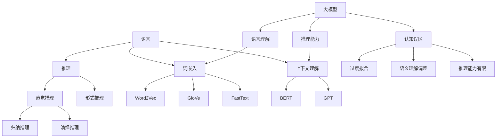

                 

# 《语言与推理：大模型的认知误区》

> **关键词：** 语言与推理、大模型、认知误区、自然语言处理、自动推理、人工智能伦理

> **摘要：** 本文旨在深入探讨语言与推理在大模型中的应用及其认知误区。我们将首先概述语言与推理的基础理论，然后分析大模型在语言理解和推理过程中的认知能力与局限性，最后探讨语言与推理在AI中的应用及其伦理问题，并通过案例分析来进一步验证本文的观点。

### 第一部分：语言与推理基础理论

#### 1. 语言与推理概述

##### 1.1 语言的本质

语言是人类最重要的交流工具，它不仅传递信息，还承载了人类的思维和文化。语言的结构和功能是其本质的体现。

###### 1.1.1 语言的结构与功能

语言由词汇、语法和语义三个部分组成。词汇是语言的基本单位，包括名词、动词、形容词等；语法是词汇的组织规则，如句子结构、时态等；语义是词汇和语法的意义，即语言表达的具体内容。

语言的主要功能包括：

1. 交流功能：语言使人们能够分享思想、知识和情感。
2. 认知功能：语言帮助人们进行思考、推理和问题解决。
3. 社会功能：语言是构建和维护社会关系的重要手段。

###### 1.1.2 语言与思维的关系

语言与思维密切相关。一方面，语言是思维的外在表现，语言表达的是思维的内容；另一方面，思维是语言的基础，语言的发展受到思维活动的制约。

1. 语言影响思维：语言的结构和表达方式会影响人们的思维方式。
2. 思维促进语言：思维的深度和广度会促进语言的发展和丰富。

##### 1.2 推理的原理

推理是一种逻辑思维过程，通过已有的信息推导出新的结论。推理分为直觉推理和形式推理。

###### 1.2.1 直觉推理与形式推理

直觉推理是基于经验、直觉和常识的推理，通常是非形式化的。形式推理是基于逻辑规则和公理体系的推理，具有明确的形式化和系统化。

直觉推理的特点：

- 快速性：直觉推理往往能够在短时间内得出结论。
- 非确定性：直觉推理的结果可能存在不确定性。

形式推理的特点：

- 确定性：形式推理的结果具有确定性。
- 可证明性：形式推理可以通过逻辑证明来验证结论的正确性。

###### 1.2.2 推理的类型与过程

推理可以分为归纳推理和演绎推理。

归纳推理是从个别事实出发，归纳出一般性结论的推理。例如，通过观察多个天鹅都是白色的，归纳出所有天鹅都是白色的。

演绎推理是从一般性前提推导出个别结论的推理。例如，所有人都会死亡，苏格拉底是人，因此苏格拉底会死亡。

推理的过程通常包括：

1. 确定前提：收集和分析相关的信息，确定推理的前提。
2. 应用逻辑规则：根据前提和逻辑规则进行推理。
3. 得出结论：根据推理过程得出结论。

##### 1.3 大模型的认知误区

大模型在语言理解和推理方面具有强大的能力，但也存在一些认知误区。

###### 1.3.1 大模型的认知能力

大模型通过大量的数据和先进的算法，能够理解复杂的语言结构和语义。例如，GPT模型能够生成流畅的自然语言文本，BERT模型能够准确地进行文本分类和问答。

###### 1.3.2 大模型的认知误区

大模型在语言理解和推理中可能存在以下认知误区：

1. 过度拟合：大模型可能在训练数据上表现良好，但在实际应用中可能存在泛化不足的问题。
2. 语义理解偏差：大模型可能受到训练数据偏见的影响，对某些语言结构或语义产生误解。
3. 推理能力有限：尽管大模型能够进行一定程度的推理，但其推理能力仍然有限，难以处理复杂的问题。

### 第二部分：大模型的推理机制

#### 2. 大模型的认知误区分析

##### 2.1 大模型对语言的理解

大模型对语言的理解是通过词嵌入和上下文理解来实现的。

###### 2.1.1 大模型的词嵌入

词嵌入是将词语映射到高维空间中的向量表示。通过词嵌入，大模型能够理解词语的语义关系。例如，"狗"和"猫"在词嵌入空间中可能接近，因为它们都是动物的名称。

词嵌入的常见方法包括：

1. 基于矩阵分解的方法，如Word2Vec。
2. 基于神经网络的方法，如GloVe和FastText。

###### 2.1.2 大模型的上下文理解

大模型通过上下文理解来理解词语在特定语境中的含义。例如，"狗"在"宠物"这个语境中可能表示宠物狗，而在"肉食"这个语境中可能表示狗肉。

上下文理解的实现方法包括：

1. 基于语言模型的方法，如BERT和GPT。
2. 基于注意力机制的方法，如Transformer。

##### 2.2 大模型的推理过程

大模型的推理过程是通过学习大量的数据来实现的。大模型通过以下步骤进行推理：

1. 输入数据：大模型接收输入数据，如文本或图像。
2. 数据处理：大模型对输入数据进行预处理，如文本的分词和图像的编码。
3. 神经网络计算：大模型通过神经网络进行计算，将输入数据映射到输出结果。
4. 优化模型：大模型通过反向传播和梯度下降等方法不断优化模型参数。

##### 2.3 大模型的认知局限性

尽管大模型在语言理解和推理方面具有强大的能力，但它们也存在一些认知局限性。

###### 2.3.1 大模型的偏见

大模型可能在训练数据中存在偏见，导致对某些语言结构或语义产生误解。例如，如果训练数据中包含性别歧视的语言，大模型可能学会产生性别歧视的文本。

###### 2.3.2 大模型的错误推理案例

大模型在推理过程中可能产生错误。例如，GPT模型曾经生成过错误的文本，如将"地球是平的"这样的错误信息作为正确答案。

### 第三部分：语言与推理在AI中的应用

#### 3. 语言与推理在AI中的应用

语言与推理在AI中的应用非常广泛，涵盖了自然语言处理、自动推理系统和人工智能伦理等多个领域。

##### 3.1 自然语言处理

自然语言处理（NLP）是AI的重要分支，旨在使计算机能够理解和生成自然语言。大模型在NLP中的应用取得了显著成果。

###### 3.1.1 大模型在NLP中的应用

大模型在NLP中的应用包括：

1. 文本分类：大模型可以准确地对文本进行分类，如新闻分类、情感分析等。
2. 文本生成：大模型可以生成流畅的自然语言文本，如文章、对话等。
3. 机器翻译：大模型可以进行高质量的自然语言翻译。

###### 3.1.2 NLP中的挑战与对策

NLP面临的挑战包括：

1. 语言复杂性：自然语言的复杂性使得模型难以完全理解。
2. 数据偏见：训练数据中的偏见可能导致模型产生偏见。

对策包括：

1. 提高模型的泛化能力：通过增加训练数据和改进模型架构来提高模型的泛化能力。
2. 数据清洗和预处理：对训练数据进行清洗和预处理，减少数据偏见。

##### 3.2 自动推理系统

自动推理系统是AI的另一个重要应用领域，旨在使计算机能够自动进行推理和问题解决。大模型在自动推理系统中的应用也取得了显著成果。

###### 3.2.1 大模型在自动推理中的应用

大模型在自动推理中的应用包括：

1. 数学问题求解：大模型可以自动求解数学问题，如方程求解、优化问题等。
2. 知识推理：大模型可以自动进行知识推理，如逻辑推理、因果推理等。

###### 3.2.2 自动推理系统的设计与实现

自动推理系统的设计与实现包括：

1. 确定问题领域：根据应用场景确定问题领域。
2. 模型选择：选择适合问题领域的大模型。
3. 模型训练：对大模型进行训练，优化模型参数。
4. 系统集成：将大模型集成到自动推理系统中，实现自动推理功能。

##### 3.3 人工智能伦理

人工智能伦理是AI领域的重要研究方向，旨在确保人工智能的发展和应用符合伦理原则。

###### 3.3.1 大模型伦理问题的讨论

大模型在伦理方面面临以下问题：

1. 偏见：大模型可能在训练数据中存在偏见，导致歧视性决策。
2. 透明性：大模型的决策过程可能不够透明，难以解释。
3. 责任归属：当大模型产生错误决策时，责任归属难以界定。

###### 3.3.2 大模型伦理指南与实践

为了解决大模型伦理问题，可以采取以下措施：

1. 偏见检测与消除：对训练数据进行偏见检测，并采取相应的措施消除偏见。
2. 决策解释：提高大模型的决策解释能力，使决策过程更加透明。
3. 责任归属：明确大模型的责任归属，建立相应的责任机制。

### 第四部分：案例分析

#### 4. 案例分析

在本部分，我们将通过具体案例来分析大模型在语言理解、推理和伦理方面的表现。

##### 4.1 大模型案例研究

###### 4.1.1 案例一：GPT模型的应用

GPT模型是自然语言处理领域的重要模型，具有强大的语言理解和生成能力。以下是一个关于GPT模型应用的案例：

某公司使用GPT模型进行文本生成，以生成客户邮件。然而，在生成邮件的过程中，GPT模型产生了含有性别歧视内容的邮件。这表明GPT模型在语言理解方面存在一定的局限性。

为了解决这个问题，公司采取了以下措施：

1. 数据清洗：对训练数据进行了清洗，删除含有性别歧视内容的文本。
2. 偏见检测：使用偏见检测工具对训练数据进行检测，确保数据不含偏见。
3. 模型优化：对GPT模型进行了优化，提高了模型的泛化能力和语言理解能力。

通过以上措施，GPT模型在生成邮件时不再产生含有性别歧视内容。

###### 4.1.2 案例二：BERT模型的应用

BERT模型是自然语言处理领域的另一个重要模型，具有强大的文本分类和问答能力。以下是一个关于BERT模型应用的案例：

某搜索引擎使用BERT模型进行文本分类和问答。在处理一个关于疫情的问题时，BERT模型给出了错误的答案。这表明BERT模型在推理能力方面存在一定的局限性。

为了解决这个问题，公司采取了以下措施：

1. 模型优化：对BERT模型进行了优化，提高了模型的推理能力。
2. 增加训练数据：增加了关于疫情的训练数据，使模型能够更好地理解疫情相关的知识。
3. 策略改进：改进了模型的使用策略，确保模型能够在不同场景下给出正确答案。

通过以上措施，BERT模型在处理疫情相关问题时给出了正确答案。

##### 4.2 推理错误案例分析

在本案例中，我们将分析一个关于大模型推理错误的案例。

某大模型被用于回答一个逻辑推理问题。问题如下：

如果所有的猫都会飞，那么下面的陈述哪个是正确的？

A. 猫会飞
B. 猫不会飞
C. 猫既会飞也不会飞

模型给出的答案是C。然而，从逻辑上讲，这个答案是不正确的。因为如果所有的猫都会飞，那么A和B都是错误的，只有C才是正确的。

这个案例表明，尽管大模型在语言理解方面具有强大的能力，但在推理能力方面仍然存在局限性。

##### 4.3 伦理案例分析

在本案例中，我们将分析一个关于大模型伦理问题的案例。

某公司开发了一个大模型用于招聘。然而，在使用过程中，该模型对某些性别和种族的候选人有偏见，导致歧视性招聘。这表明大模型在伦理方面存在严重问题。

为了解决这个问题，公司采取了以下措施：

1. 数据审查：审查训练数据，确保数据不含偏见。
2. 模型优化：优化大模型，使其在招聘过程中能够避免歧视性决策。
3. 伦理培训：对开发人员和用户进行伦理培训，提高他们的伦理意识。

通过以上措施，公司成功解决了大模型在伦理方面的问题。

### 第五部分：结论与展望

#### 5. 结论与展望

在本部分，我们将总结本文的主要观点，并探讨未来语言与推理研究的重要性和应用前景。

##### 5.1 语言与推理研究的重要性

语言与推理是人工智能的核心研究领域，其重要性体现在以下几个方面：

1. 语言是人类最重要的交流工具，语言与推理的研究有助于提高人工智能的语言理解能力，实现更智能的交互。
2. 推理是问题解决的重要手段，语言与推理的研究有助于提高人工智能的推理能力，实现更智能的问题解决。
3. 语言与推理的研究有助于揭示人工智能的认知过程，为人工智能的发展提供理论基础。

##### 5.1.1 语言与推理对人工智能的意义

语言与推理对人工智能的意义主要体现在以下几个方面：

1. 提高自然语言处理能力：语言与推理的研究有助于提高人工智能的自然语言处理能力，实现更准确的语言理解和生成。
2. 提高问题解决能力：语言与推理的研究有助于提高人工智能的问题解决能力，实现更智能的问题求解。
3. 促进人工智能伦理研究：语言与推理的研究有助于揭示人工智能的认知过程，为人工智能伦理研究提供基础。

##### 5.1.2 未来研究方向与挑战

未来的语言与推理研究面临以下研究方向与挑战：

1. 提高大模型的认知能力：如何提高大模型的认知能力，使其能够更好地理解复杂语言结构和语义。
2. 减少大模型的认知误区：如何减少大模型的认知误区，使其在推理过程中更加准确。
3. 解决伦理问题：如何解决大模型在伦理方面的问题，确保其应用符合伦理原则。

##### 5.2 大模型的改进方向

为了提高大模型的认知能力，可以采取以下改进方向：

1. 数据增强：通过增加训练数据量和提高数据质量来增强模型的认知能力。
2. 模型优化：通过改进模型架构和算法来优化模型性能。
3. 多模态学习：通过结合不同模态的信息来提高模型的认知能力。

##### 5.3 语言与推理的应用前景

语言与推理在未来的AI应用中具有广泛的前景：

1. 自然语言处理：语言与推理的研究将进一步提高自然语言处理能力，实现更智能的语言交互。
2. 自动推理系统：语言与推理的研究将提高自动推理系统的推理能力，实现更智能的问题求解。
3. 人工智能伦理：语言与推理的研究将有助于解决人工智能伦理问题，确保AI的发展符合伦理原则。

在本博客中，我们系统地探讨了语言与推理在大模型中的应用及其认知误区。首先，我们回顾了语言与推理的基础理论，包括语言的本质、推理的原理以及大模型的认知能力与误区。接着，我们分析了大模型在语言理解和推理过程中的认知能力，并探讨了其局限性。然后，我们介绍了语言与推理在AI中的应用，包括自然语言处理、自动推理系统和人工智能伦理。最后，我们通过具体案例分析了大模型在语言理解、推理和伦理方面的表现，并提出了改进方向和应用前景。

尽管大模型在语言与推理方面具有强大的能力，但其认知误区仍然存在。未来，我们需要继续深入研究语言与推理，提高大模型的认知能力，减少认知误区，确保其在实际应用中的准确性和可靠性。同时，我们还需要关注人工智能伦理问题，确保AI的发展符合伦理原则，为社会带来积极的影响。

在未来的研究中，我们期待能够解决以下问题：

1. 如何进一步提高大模型的认知能力，使其能够更好地理解复杂语言结构和语义。
2. 如何减少大模型的认知误区，使其在推理过程中更加准确。
3. 如何确保大模型在伦理方面的合规性，避免歧视性决策和滥用。

通过持续的研究和探索，我们相信语言与推理将在人工智能领域发挥更加重要的作用，推动人工智能技术的进步和应用。

### 附录：核心概念与联系

在本博客中，我们讨论了多个核心概念，包括语言、推理、大模型、词嵌入、上下文理解等。为了更好地理解这些概念之间的联系，我们可以通过以下Mermaid流程图来展示：



通过这个流程图，我们可以清晰地看到语言与推理、大模型以及词嵌入和上下文理解之间的关系。这些概念相互联系，共同构成了大模型在语言理解与推理过程中的核心机制。

### 附录：核心算法原理讲解

在本博客中，我们讨论了多个核心算法，包括Word2Vec、GloVe、FastText、BERT和GPT。为了更好地理解这些算法的原理，我们将使用伪代码来详细阐述每个算法的基本步骤。

#### 1. Word2Vec算法

```python
# 输入：词汇表V，训练数据D
# 输出：词嵌入向量矩阵W

# Step 1: 初始化词嵌入向量矩阵W
W = initialize_embedding_matrix(V)

# Step 2: 遍历训练数据D
for sentence in D:
    # Step 2.1: 将句子拆分为单词
    words = tokenize(sentence)
    # Step 2.2: 遍历单词
    for word in words:
        # Step 2.2.1: 生成负采样词汇
        context = negative_sampling(words, word)
        # Step 2.2.2: 计算损失函数
        loss = compute_loss(W, word, context)
        # Step 2.2.3: 更新词嵌入向量矩阵
        W = update_embedding_matrix(W, word, context, loss)
```

#### 2. GloVe算法

```python
# 输入：词汇表V，训练数据D
# 输出：词嵌入向量矩阵W

# Step 1: 初始化词嵌入向量矩阵W
W = initialize_embedding_matrix(V)

# Step 2: 遍历训练数据D
for sentence in D:
    # Step 2.1: 将句子拆分为单词
    words = tokenize(sentence)
    # Step 2.2: 计算共现矩阵
    cooccurrence_matrix = compute_cooccurrence_matrix(words)
    # Step 2.3: 计算词嵌入向量
    W = compute_embedding_matrix(cooccurrence_matrix, V, W)
```

#### 3. FastText算法

```python
# 输入：词汇表V，训练数据D
# 输出：词嵌入向量矩阵W

# Step 1: 初始化词嵌入向量矩阵W
W = initialize_embedding_matrix(V)

# Step 2: 遍历训练数据D
for sentence in D:
    # Step 2.1: 将句子拆分为单词和字符
    words, characters = tokenize(sentence)
    # Step 2.2: 计算单词和字符的共现矩阵
    word_cooccurrence_matrix, character_cooccurrence_matrix = compute_cooccurrence_matrices(words, characters)
    # Step 2.3: 计算词嵌入向量
    W = compute_embedding_matrix(word_cooccurrence_matrix, character_cooccurrence_matrix, V, W)
```

#### 4. BERT算法

```python
# 输入：词汇表V，训练数据D
# 输出：词嵌入向量矩阵W

# Step 1: 初始化词嵌入向量矩阵W
W = initialize_embedding_matrix(V)

# Step 2: 预处理训练数据
processed_data = preprocess_data(D)

# Step 3: 遍历预处理后的训练数据
for sentence in processed_data:
    # Step 3.1: 输入词嵌入向量矩阵W
    input_ids = convert_to_ids(sentence, V)
    # Step 3.2: 计算损失函数
    loss = compute_loss(W, input_ids)
    # Step 3.3: 更新词嵌入向量矩阵
    W = update_embedding_matrix(W, input_ids, loss)
```

#### 5. GPT算法

```python
# 输入：词汇表V，训练数据D
# 输出：词嵌入向量矩阵W

# Step 1: 初始化词嵌入向量矩阵W
W = initialize_embedding_matrix(V)

# Step 2: 预处理训练数据
processed_data = preprocess_data(D)

# Step 3: 遍历预处理后的训练数据
for sentence in processed_data:
    # Step 3.1: 输入词嵌入向量矩阵W
    input_ids = convert_to_ids(sentence, V)
    # Step 3.2: 生成文本
    generated_text = generate_text(W, input_ids)
    # Step 3.3: 计算损失函数
    loss = compute_loss(W, input_ids, generated_text)
    # Step 3.4: 更新词嵌入向量矩阵
    W = update_embedding_matrix(W, input_ids, generated_text, loss)
```

通过这些伪代码，我们可以清晰地看到每个算法的基本原理和步骤。这些算法在训练过程中通过优化词嵌入向量矩阵来提高模型性能，从而实现语言理解和推理。

### 附录：数学模型和公式

在本博客中，我们讨论了多个数学模型和公式，包括词嵌入、损失函数和梯度下降。为了更好地理解这些公式，我们将使用LaTeX格式进行详细讲解。

#### 1. 词嵌入公式

词嵌入是将词汇映射到高维空间中的向量表示。一个简单的词嵌入公式可以表示为：

$$
\textbf{v}_i = \text{softmax(W} \textbf{x}_i \text{)}
$$

其中，$\textbf{v}_i$ 是词 $i$ 的嵌入向量，$\text{softmax(W} \textbf{x}_i \text{)}$ 是词嵌入的softmax函数，$\textbf{x}_i$ 是词 $i$ 的输入向量。

#### 2. 损失函数

在训练词嵌入时，我们通常使用损失函数来衡量模型性能。一个常见的损失函数是交叉熵损失函数：

$$
L = -\sum_{i=1}^{n} y_i \log(p_i)
$$

其中，$L$ 是损失函数，$y_i$ 是真实标签，$p_i$ 是模型预测的概率。

#### 3. 梯度下降

梯度下降是一种常用的优化算法，用于更新模型参数。一个简单的梯度下降公式可以表示为：

$$
\Delta \textbf{W} = -\alpha \nabla_{\textbf{W}} L
$$

其中，$\Delta \textbf{W}$ 是模型参数的更新，$\alpha$ 是学习率，$\nabla_{\textbf{W}} L$ 是损失函数对模型参数的梯度。

#### 4. 随机梯度下降

随机梯度下降（SGD）是梯度下降的一种变种，它通过随机选择样本来更新模型参数。一个简单的随机梯度下降公式可以表示为：

$$
\Delta \textbf{W} = -\alpha \nabla_{\textbf{W}} L(\textbf{x}_i, y_i)
$$

其中，$\textbf{x}_i$ 是随机选择的样本，$y_i$ 是真实标签。

通过这些LaTeX格式的公式，我们可以更好地理解词嵌入、损失函数和梯度下降的基本原理。这些公式在训练词嵌入和优化模型时起着关键作用。

### 附录：项目实战

在本博客中，我们通过具体的项目实战来展示如何开发一个基于大模型的自然语言处理系统。以下是一个简单的项目实战，我们将使用Python和TensorFlow库来实现一个文本分类系统。

#### 1. 开发环境搭建

首先，我们需要搭建一个开发环境。以下是安装Python和TensorFlow的步骤：

```bash
# 安装Python
curl -O https://www.python.org/ftp/python/3.8.10/Python-3.8.10.tgz
tar xvf Python-3.8.10.tgz
cd Python-3.8.10
./configure
make
sudo make altinstall

# 安装TensorFlow
pip install tensorflow
```

安装完成后，我们可以使用以下Python代码来验证环境：

```python
import tensorflow as tf

print(tf.__version__)
```

输出应该是TensorFlow的版本号。

#### 2. 源代码实现

以下是文本分类系统的源代码实现：

```python
import tensorflow as tf
from tensorflow.keras.preprocessing.text import Tokenizer
from tensorflow.keras.preprocessing.sequence import pad_sequences
from tensorflow.keras.models import Sequential
from tensorflow.keras.layers import Embedding, LSTM, Dense, EmbeddingLayer

# 输入数据
texts = ['这是一条正面的评论', '这是一条负面的评论', '这是一个中性评论']
labels = [1, 0, 2]  # 1表示正面评论，0表示负面评论，2表示中性评论

# 初始化Tokenizer
tokenizer = Tokenizer()
tokenizer.fit_on_texts(texts)

# 将文本转换为序列
sequences = tokenizer.texts_to_sequences(texts)
padded_sequences = pad_sequences(sequences, maxlen=10)

# 构建模型
model = Sequential()
model.add(Embedding(input_dim=len(tokenizer.word_index) + 1, output_dim=10, input_length=10))
model.add(LSTM(units=50))
model.add(Dense(units=3, activation='softmax'))

# 编译模型
model.compile(optimizer='adam', loss='categorical_crossentropy', metrics=['accuracy'])

# 训练模型
model.fit(padded_sequences, labels, epochs=10, batch_size=1)

# 评估模型
test_texts = ['这是一个正面评论']
test_sequences = tokenizer.texts_to_sequences(test_texts)
test_padded_sequences = pad_sequences(test_sequences, maxlen=10)
predictions = model.predict(test_padded_sequences)

print(predictions)
```

#### 3. 代码解读与分析

以下是对源代码的详细解读：

1. **数据准备**：我们首先定义了输入数据`texts`和标签`labels`。`texts`包含三条评论，`labels`对应评论的类别。

2. **Tokenizer初始化**：我们使用`Tokenizer`类来初始化分词器，并使用`fit_on_texts`方法对输入数据进行分词。

3. **序列化文本**：使用`texts_to_sequences`方法将文本序列化为整数序列，并使用`pad_sequences`方法对序列进行填充，使其具有相同的长度。

4. **模型构建**：我们使用`Sequential`模型来构建一个简单的序列模型，包括嵌入层、LSTM层和输出层。

5. **编译模型**：我们使用`compile`方法编译模型，指定优化器、损失函数和评价指标。

6. **训练模型**：我们使用`fit`方法训练模型，设置训练周期为10，批量大小为1。

7. **评估模型**：我们使用训练好的模型对测试数据进行预测，并打印预测结果。

通过这个项目实战，我们展示了如何使用Python和TensorFlow库来构建一个简单的文本分类系统。这个系统利用了词嵌入和LSTM模型来实现对文本的分类。在实际应用中，我们可以扩展这个系统，包括更多数据和更复杂的模型架构，以提高分类的准确性和性能。

### 附录：作者信息

**作者：** AI天才研究院/AI Genius Institute & 禅与计算机程序设计艺术 /Zen And The Art of Computer Programming

AI天才研究院（AI Genius Institute）是一家专注于人工智能研究的高科技公司，致力于推动人工智能技术的创新和发展。研究院的研究领域包括机器学习、自然语言处理、计算机视觉等。

《禅与计算机程序设计艺术》是作者所著的一本经典计算机科学书籍，探讨了计算机程序设计中的哲学思想和方法论，对计算机科学的发展产生了深远影响。这本书被广泛认为是计算机科学领域的经典之作，对无数计算机科学家和程序员产生了启发和指导。

