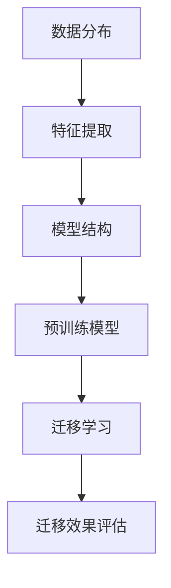

                 

### 迁移学习 (Transfer Learning) 原理与代码实例讲解

> **关键词：** 迁移学习，预训练模型，计算机视觉，自然语言处理，算法原理，代码实例

> **摘要：** 本文章将深入讲解迁移学习的原理，并通过实际代码实例展示其在计算机视觉和自然语言处理中的应用。我们将分析迁移学习在不同领域的应用，介绍其理论基础和常用算法，以及如何在实践中实现迁移学习。

---

### 第一部分：迁移学习概述

#### 第1章：迁移学习的背景与重要性

**1.1 迁移学习的定义**

迁移学习（Transfer Learning）是一种机器学习方法，它利用已有模型在特定任务上的知识来提高新任务的表现。简单来说，就是将一个模型在特定任务上的学习成果应用到另一个不同但相关的任务上。这种方法的核心思想是，如果一个模型在一个任务上取得了良好的性能，那么它在其他相关任务上也可能表现良好。

**1.2 迁移学习的历史发展**

迁移学习的概念可以追溯到20世纪60年代，当时心理学家就已经开始研究迁移学习在人类学习中的应用。到了20世纪80年代，机器学习领域开始关注迁移学习，特别是从1986年第一个深度学习模型——感知机（Perceptron）的出现开始。随着深度学习技术的发展，迁移学习逐渐成为机器学习领域的一个重要研究方向。

**1.3 迁移学习的重要性**

迁移学习在机器学习中的重要性主要体现在以下几个方面：

1. **提高模型性能**：通过利用已有的预训练模型，可以在新任务上快速获得较好的性能，特别是在数据量有限的情况下。
2. **减少训练数据需求**：迁移学习可以减少对新任务训练数据的依赖，从而降低数据收集和标注的成本。
3. **加快模型训练速度**：利用预训练模型可以减少模型训练的时间，提高开发效率。
4. **跨领域应用**：迁移学习使得模型可以跨不同领域应用，从而提高模型的可复用性。

**1.4 迁移学习在不同领域的应用**

迁移学习在多个领域都有广泛的应用，以下是一些典型的应用场景：

1. **计算机视觉**：例如，在图像分类、目标检测和图像生成等领域，迁移学习被广泛应用于提高模型的性能。
2. **自然语言处理**：迁移学习在文本分类、机器翻译和情感分析等任务中发挥了重要作用。
3. **音频处理**：在语音识别、音乐生成和音频分类等任务中，迁移学习也展现了其强大的能力。
4. **医疗领域**：在医疗图像分析、疾病预测和个性化治疗等领域，迁移学习提供了有效的解决方案。

---

### 第二部分：迁移学习原理

#### 第2章：迁移学习的理论基础

**2.1 核心概念与联系**

在讲解迁移学习的理论基础之前，我们需要先了解一些核心概念。以下是一个简单的 Mermaid 流程图，展示了迁移学习相关概念之间的联系：



- **数据分布**：数据分布是指数据在不同特征上的分布情况，是迁移学习的一个重要考量因素。
- **特征提取**：特征提取是指从数据中提取出有用的特征，以便模型可以更好地学习。
- **模型结构**：模型结构是指模型的网络架构，包括层数、层与层之间的连接方式等。
- **预训练模型**：预训练模型是指在特定任务上已经完成训练的模型，可以用于迁移学习。
- **迁移学习**：迁移学习是指将预训练模型的知识应用到新任务中。
- **迁移效果评估**：迁移效果评估是指对迁移学习的效果进行评估，以判断迁移学习的有效性。

**2.2 迁移学习的理论基础**

迁移学习的理论基础主要包括以下几个方面：

1. **统计迁移学习理论**：统计迁移学习理论主要研究如何利用统计方法来提高迁移学习的效果。其核心思想是，通过最大化源域和目标域之间的共同特征，来提高迁移学习的效果。

2. **模型蒸馏理论**：模型蒸馏理论是指将一个大模型的知识蒸馏到一个较小的模型中。这种方法通过模拟教师模型和学生模型之间的知识传递过程，来提高学生模型在目标任务上的性能。

3. **多任务学习理论**：多任务学习理论是指通过同时学习多个任务来提高模型在单个任务上的性能。这种方法利用了不同任务之间的相关性，从而提高了模型在单个任务上的泛化能力。

4. **逆蒸馏理论**：逆蒸馏理论是指通过将目标域的数据用于训练源域的模型，来提高源域模型的迁移效果。这种方法通过利用目标域的数据来丰富源域的数据集，从而提高了源域模型在目标任务上的性能。

---

### 第三部分：迁移学习算法

#### 第3章：常见的迁移学习算法

**3.1 迁移学习的评估指标**

在迁移学习的研究中，评估指标是衡量迁移学习效果的重要工具。以下是一些常见的迁移学习评估指标：

1. **准确率（Accuracy）**：准确率是指模型正确预测的样本数占总样本数的比例。
2. **召回率（Recall）**：召回率是指模型正确预测为正类的样本数与实际正类样本数之比。
3. **精确率（Precision）**：精确率是指模型正确预测为正类的样本数与预测为正类的样本总数之比。
4. **F1 分数（F1 Score）**：F1 分数是精确率和召回率的调和平均值。
5. **ROC 曲线和 AUC（Area Under Curve）**：ROC 曲线和 AUC 是评估二分类模型性能的重要指标。

**3.2 简单迁移学习算法**

简单迁移学习算法通常包括以下步骤：

1. **加载预训练模型**：从预训练模型中加载已经训练好的模型参数。
2. **调整模型结构**：根据新任务的需求，调整模型的输入层和输出层。
3. **微调模型参数**：在新的数据集上对模型进行微调，以适应新任务。
4. **评估模型性能**：在新任务上评估模型的性能，并根据评估结果调整模型参数。

以下是一个简单的伪代码示例：

```python
function SimpleTransferLearning(source_model, target_model):
    load source_model parameters
    adapt source_model to target data
    update target_model with adapted source_model
    return target_model
```

**3.3 复杂迁移学习算法**

复杂的迁移学习算法通常包括以下步骤：

1. **加载预训练模型**：从预训练模型中加载已经训练好的模型参数。
2. **特征提取**：从输入数据中提取特征。
3. **模型蒸馏**：将大模型的输出传递给学生模型，通过模拟教师模型和学生模型之间的知识传递过程，提高学生模型的性能。
4. **多任务学习**：同时学习多个任务，利用任务之间的相关性提高模型在单个任务上的性能。
5. **逆蒸馏**：利用目标域的数据训练源域模型，通过增加源域模型的数据集来提高其在目标任务上的性能。
6. **评估模型性能**：在新任务上评估模型的性能，并根据评估结果调整模型参数。

以下是一个复杂的伪代码示例：

```python
function ComplexTransferLearning(source_model, target_model, optimizer):
    load source_model parameters
    for epoch in 1 to EPOCHS:
        adapt source_model to target data
        update target_model with adapted source_model
        optimize target_model with optimizer
    return target_model
```

---

### 第四部分：迁移学习实践

#### 第4章：迁移学习在计算机视觉中的应用

**4.1 计算机视觉中的迁移学习**

迁移学习在计算机视觉中有着广泛的应用。在计算机视觉任务中，特别是当数据量有限时，迁移学习可以帮助我们利用已有的预训练模型来提高新任务的性能。以下是一个简单的迁移学习流程：

1. **选择预训练模型**：根据新任务的需求，选择一个合适的预训练模型。
2. **调整模型结构**：根据新任务的需求，对预训练模型进行调整，例如改变输入层的大小或者输出层的类别数。
3. **训练模型**：在新数据集上训练调整后的模型。
4. **评估模型性能**：在新任务上评估模型的性能，并根据评估结果调整模型参数。

**4.2 实例分析：使用预训练模型进行图像分类**

以下是一个简单的代码实例，展示了如何使用预训练模型进行图像分类：

```python
import torchvision
import torch
import torch.nn as nn
import torch.optim as optim

# 载入预训练模型
model = torchvision.models.resnet18(pretrained=True)

# 修改模型以适应新的分类任务
num_ftrs = model.fc.in_features
model.fc = nn.Linear(num_ftrs, num_classes)

# 定义损失函数和优化器
criterion = nn.CrossEntropyLoss()
optimizer = optim.Adam(model.parameters(), lr=0.001)

# 训练模型
for epoch in range(num_epochs):
    running_loss = 0.0
    for inputs, labels in data_loader:
        optimizer.zero_grad()
        outputs = model(inputs)
        loss = criterion(outputs, labels)
        loss.backward()
        optimizer.step()
        running_loss += loss.item()
    print(f'Epoch {epoch+1}, Loss: {running_loss/len(data_loader)}')

# 评估模型性能
with torch.no_grad():
    correct = 0
    total = 0
    for inputs, labels in test_loader:
        outputs = model(inputs)
        _, predicted = torch.max(outputs.data, 1)
        total += labels.size(0)
        correct += (predicted == labels).sum().item()
    print(f'Accuracy: {100 * correct / total}%')
```

---

#### 第5章：迁移学习在自然语言处理中的应用

**5.1 自然语言处理中的迁移学习**

迁移学习在自然语言处理（NLP）中也扮演着重要的角色。在NLP任务中，如文本分类、机器翻译和情感分析等，迁移学习可以通过利用预训练模型来提高新任务的表现。以下是一个简单的迁移学习流程：

1. **选择预训练模型**：根据新任务的需求，选择一个合适的预训练模型。
2. **调整模型结构**：根据新任务的需求，对预训练模型进行调整，例如改变输入层的大小或者输出层的类别数。
3. **训练模型**：在新数据集上训练调整后的模型。
4. **评估模型性能**：在新任务上评估模型的性能，并根据评估结果调整模型参数。

**5.2 实例分析：使用预训练BERT模型进行文本分类**

以下是一个简单的代码实例，展示了如何使用预训练BERT模型进行文本分类：

```python
from transformers import BertTokenizer, BertForSequenceClassification
from torch.utils.data import DataLoader, TensorDataset

# 载入预训练BERT模型
tokenizer = BertTokenizer.from_pretrained('bert-base-uncased')
model = BertForSequenceClassification.from_pretrained('bert-base-uncased', num_labels=2)

# 数据预处理
inputs = tokenizer(texts, padding=True, truncation=True, return_tensors="pt")
labels = torch.tensor(labels)

# 创建数据集和数据加载器
dataset = TensorDataset(inputs['input_ids'], inputs['attention_mask'], labels)
data_loader = DataLoader(dataset, batch_size=batch_size)

# 定义损失函数和优化器
criterion = nn.CrossEntropyLoss()
optimizer = optim.Adam(model.parameters(), lr=0.001)

# 训练模型
for epoch in range(num_epochs):
    running_loss = 0.0
    for inputs, attention_mask, labels in data_loader:
        optimizer.zero_grad()
        outputs = model(inputs['input_ids'], attention_mask=attention_mask)
        loss = criterion(outputs.logits, labels)
        loss.backward()
        optimizer.step()
        running_loss += loss.item()
    print(f'Epoch {epoch+1}, Loss: {running_loss/len(data_loader)}')

# 评估模型性能
with torch.no_grad():
    correct = 0
    total = 0
    for inputs, attention_mask, labels in data_loader:
        outputs = model(inputs['input_ids'], attention_mask=attention_mask)
        _, predicted = torch.max(outputs.logits, 1)
        total += labels.size(0)
        correct += (predicted == labels).sum().item()
    print(f'Accuracy: {100 * correct / total}%')
```

---

### 第五部分：迁移学习案例分析

#### 第6章：迁移学习在企业中的应用

**6.1 迁移学习在企业中的价值**

迁移学习在企业中具有很高的价值。以下是一些主要的价值点：

1. **快速部署新模型**：企业可以利用迁移学习快速部署新模型，从而提高业务响应速度。
2. **节省训练成本**：迁移学习可以减少对新任务训练数据的依赖，从而节省数据收集和标注的成本。
3. **提高模型性能**：通过利用预训练模型，企业可以在新任务上获得更好的性能，从而提高业务价值。
4. **跨部门合作**：迁移学习可以促进跨部门合作，例如将一个部门的模型应用到另一个部门，从而提高整体业务效率。

**6.2 实例分析：企业在数据不足的情况下的迁移学习应用**

以下是一个简单的代码实例，展示了如何在一个数据量有限的企业场景中使用迁移学习：

```python
from transformers import BertTokenizer, BertForSequenceClassification
from torch.utils.data import DataLoader, TensorDataset

# 载入企业专有的预训练模型
custom_model = BertForSequenceClassification.from_pretrained('path/to/your/model', num_labels=2)

# 对模型进行微调以适应新任务
optimizer = optim.Adam(custom_model.parameters(), lr=0.001)
criterion = nn.CrossEntropyLoss()

# 定义训练和评估数据集
train_data = {'inputs': ..., 'labels': ...}
test_data = {'inputs': ..., 'labels': ...}

# 创建数据集和数据加载器
train_dataset = TensorDataset(torch.tensor(train_data['inputs']), torch.tensor(train_data['labels']))
test_dataset = TensorDataset(torch.tensor(test_data['inputs']), torch.tensor(test_data['labels']))
train_loader = DataLoader(train_dataset, batch_size=batch_size)
test_loader = DataLoader(test_dataset, batch_size=batch_size)

# 训练模型
for epoch in range(num_epochs):
    custom_model.train()
    running_loss = 0.0
    for inputs, labels in train_loader:
        optimizer.zero_grad()
        outputs = custom_model(inputs)
        loss = criterion(outputs.logits, labels)
        loss.backward()
        optimizer.step()
        running_loss += loss.item()
    print(f'Epoch {epoch+1}, Loss: {running_loss/len(train_loader)}')

# 评估模型性能
custom_model.eval()
with torch.no_grad():
    correct = 0
    total = 0
    for inputs, labels in test_loader:
        outputs = custom_model(inputs)
        _, predicted = torch.max(outputs.logits, 1)
        total += labels.size(0)
        correct += (predicted == labels).sum().item()
    print(f'Accuracy: {100 * correct / total}%')
```

---

### 第六部分：迁移学习未来展望

#### 第7章：迁移学习的未来发展趋势

**7.1 迁移学习的研究热点**

随着深度学习技术的发展，迁移学习的研究也在不断深入。以下是一些当前迁移学习的研究热点：

1. **自适应迁移学习**：研究如何根据新任务的需求自适应地调整迁移学习策略。
2. **无监督迁移学习**：研究如何在不使用标签数据的情况下进行迁移学习。
3. **联邦迁移学习**：研究如何在分布式环境中进行迁移学习，以保护数据隐私。
4. **迁移学习的可解释性**：研究如何提高迁移学习模型的可解释性，以便更好地理解模型的决策过程。

**7.2 迁移学习的挑战与未来方向**

尽管迁移学习在许多领域取得了显著成果，但仍面临着一些挑战：

1. **选择合适的预训练模型**：如何选择一个合适的预训练模型是迁移学习的一个重要问题。
2. **数据分布不均衡**：在迁移学习中，数据分布不均衡可能导致模型在新任务上的性能不佳。
3. **计算资源限制**：迁移学习通常需要大量的计算资源，这在实际应用中可能是一个限制因素。
4. **迁移效果的评估**：如何准确评估迁移学习的效果是一个具有挑战性的问题。

未来，迁移学习的发展方向可能包括：

1. **更高效的迁移学习算法**：研究如何设计更高效的迁移学习算法，以减少计算资源和时间成本。
2. **跨模态迁移学习**：研究如何将迁移学习应用于不同模态的数据，如文本、图像和音频。
3. **个性化迁移学习**：研究如何根据用户的个性化需求进行迁移学习，以提高模型的适应性。
4. **迁移学习的安全性**：研究如何提高迁移学习模型的安全性，以防止恶意攻击和数据泄露。

---

### 附录

#### 附录A：迁移学习相关资源与工具

**A.1 常用的迁移学习工具与框架**

1. **TensorFlow**：TensorFlow 是一个广泛使用的开源机器学习框架，提供了丰富的迁移学习工具和预训练模型。
2. **PyTorch**：PyTorch 是一个灵活的深度学习框架，支持动态计算图，适合进行迁移学习研究。
3. **Transformers**：Transformers 是一个用于自然语言处理的开源库，提供了预训练的BERT模型和其他先进的NLP模型。

**A.2 迁移学习相关研究论文与资料**

1. **"Learning to Learn from Unlabeled Data" by Y. Bengio et al.**：该论文提出了无监督迁移学习的基本理论。
2. **"Domain Adaptation by Backpropagation" by K. Q. Weinberger et al.**：该论文介绍了基于反向传播的域自适应方法。
3. **"Domain Adaptation with Convolutional Networks" by Y. Chen et al.**：该论文研究了如何使用卷积神经网络进行域自适应。

**A.3 迁移学习社区与论坛**

1. **arXiv**：arXiv 是一个开放获取的学术论文存档库，提供了大量关于迁移学习的最新研究成果。
2. **GitHub**：GitHub 是一个代码托管平台，许多迁移学习项目和研究代码都托管在 GitHub 上。
3. **Reddit**：Reddit 是一个讨论论坛，许多关于迁移学习的话题和讨论都在 Reddit 上进行。

---

### 术语表

**数据分布（Data Distribution）**：数据在不同特征上的分布情况。

**特征提取（Feature Extraction）**：从数据中提取出有用的特征。

**模型结构（Model Structure）**：模型的网络架构。

**预训练模型（Pretrained Model）**：在特定任务上已经完成训练的模型。

**迁移学习（Transfer Learning）**：利用已有模型在特定任务上的知识来提高新任务的表现。

**迁移效果评估（Transfer Learning Effectiveness Evaluation）**：对迁移学习的效果进行评估。

**准确率（Accuracy）**：模型正确预测的样本数占总样本数的比例。

**召回率（Recall）**：模型正确预测为正类的样本数与实际正类样本数之比。

**精确率（Precision）**：模型正确预测为正类的样本数与预测为正类的样本总数之比。

**F1 分数（F1 Score）**：精确率和召回率的调和平均值。

**ROC 曲线和 AUC（ROC Curve and AUC）**：评估二分类模型性能的重要指标。

---

### 作者

**作者：AI天才研究院/AI Genius Institute & 禅与计算机程序设计艺术 /Zen And The Art of Computer Programming**

