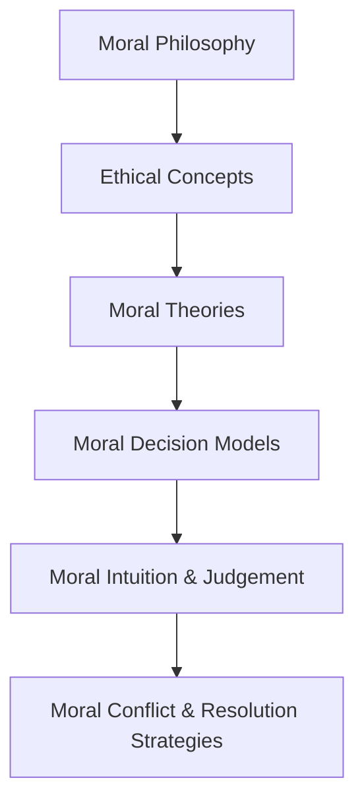
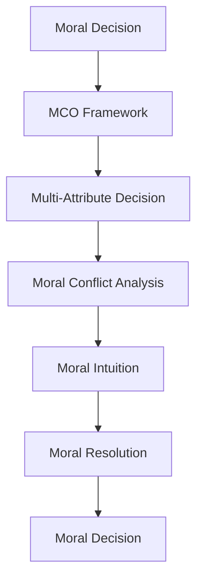
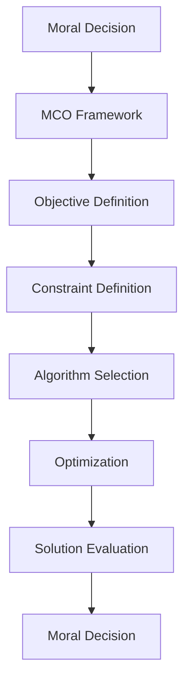
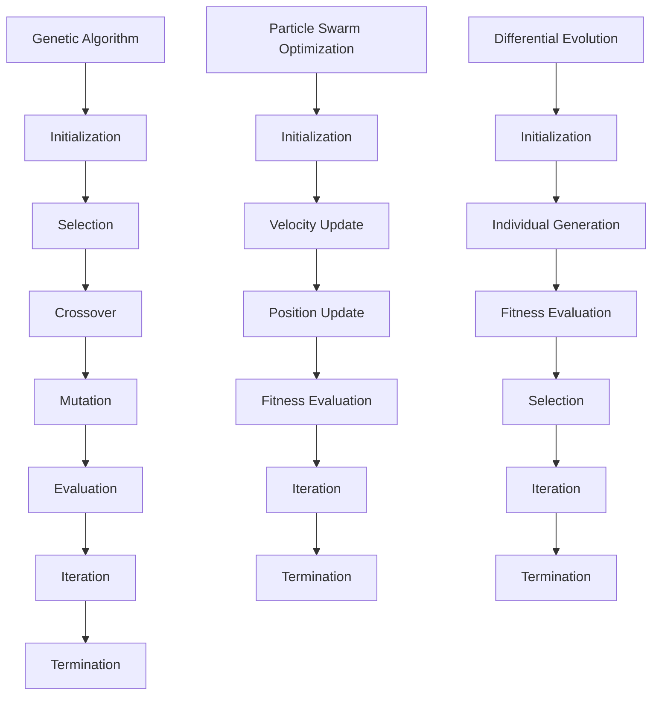
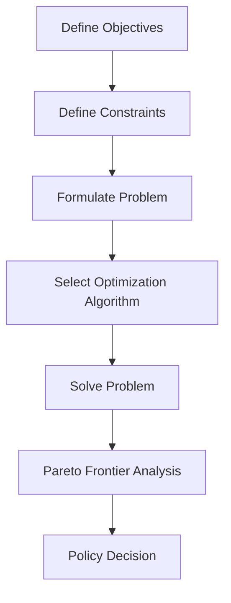
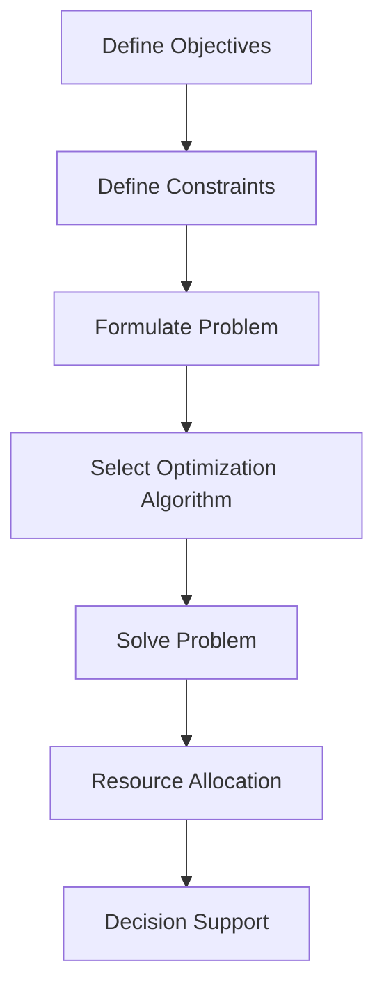
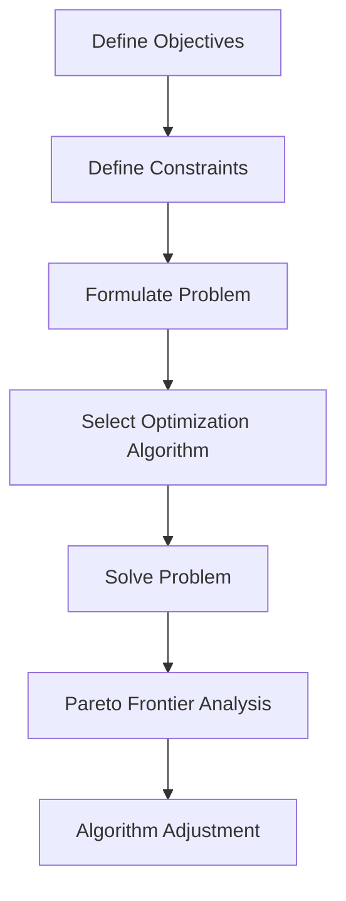
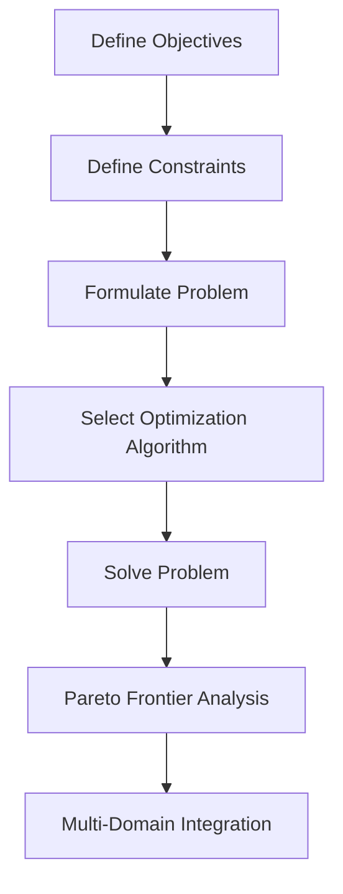
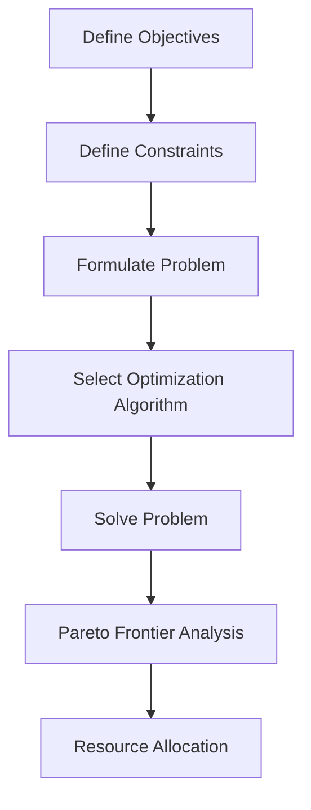

                 

# 道德决策的多准则优化：伦理选择的数学框架

## 关键词
道德决策、多准则优化、伦理选择、数学框架、人工智能、决策理论

## 摘要
本文旨在探讨道德决策的多准则优化问题，通过建立伦理选择的数学框架，详细阐述了多准则优化在道德决策中的应用。文章首先介绍了道德决策的定义和多准则优化的概念，然后从理论基础、优化方法、应用领域、实践方法和未来展望等方面进行深入探讨。通过具体的案例分析和数学模型构建，本文展示了多准则优化在道德决策中的实际应用效果，并为决策者在面临复杂伦理问题时提供了科学的方法和工具。

## 第一部分：引言与概述

### 第1章：道德决策的多准则优化导论

#### 1.1 道德决策的多准则优化：概述与重要性

道德决策是指在面对多种伦理选择时，个体或组织基于道德原则和价值判断做出决策的过程。在现实生活中，道德决策常常涉及到多个准则，例如公平性、效益、正义、责任等。这些准则往往具有不同的权重和重要性，如何在它们之间进行权衡和优化，是一个复杂且具有挑战性的问题。

多准则优化（Multi-Criteria Optimization，MCO）是一种决策分析方法，旨在同时考虑多个目标或准则，以找到满足所有准则的最优解。在道德决策中，多准则优化可以帮助决策者从多个角度分析和评估伦理选择，从而做出更加合理和全面的决策。

道德决策的多准则优化的重要性体现在以下几个方面：

1. **提高决策质量**：通过多准则优化，决策者可以综合考虑多种道德准则，避免单一准则的局限性，从而提高决策的质量和可靠性。

2. **促进道德进步**：多准则优化有助于推动社会道德进步，通过系统地分析和解决道德冲突，提高个体和组织的道德素养。

3. **应对复杂问题**：在现代社会，道德问题往往具有高度的复杂性和多样性，多准则优化方法为解决这些问题提供了有效的工具。

#### 1.2 本书结构及主要内容介绍

本书的结构和主要内容如下：

1. **第一部分：引言与概述**：介绍道德决策的多准则优化问题，阐述多准则优化在道德决策中的应用背景和重要性。

2. **第二部分：基础理论**：讨论道德决策的理论基础，包括道德哲学的简介、道德决策模型、道德直觉与判断、道德冲突与解决策略等。

3. **第三部分：多准则优化方法**：介绍多准则优化的基础方法，包括多目标优化概述、常见的多准则优化算法、多准则优化的挑战与解决策略等。

4. **第四部分：数学框架应用**：探讨数学框架在道德决策中的应用，包括数学框架的构建、数学模型的应用和案例研究等。

5. **第五部分：应用领域**：分析伦理选择的数学框架在具体领域的应用，包括社会责任与道德决策、环境伦理与可持续发展、科技伦理与人工智能、医疗伦理与决策支持等。

6. **第六部分：方法与实践**：通过实践案例分析、实践方法与工具以及伦理决策的案例研究，探讨多准则优化方法在道德决策中的实际应用。

7. **第七部分：结论与展望**：总结本书的主要内容，探讨未来的研究方向，为决策者在道德决策中提供指导和建议。

#### 1.3 伦理选择的数学框架：背景与意义

伦理选择的数学框架是将数学方法应用于道德决策的一个创新尝试。随着计算机科学和人工智能技术的快速发展，数学方法在决策分析中的应用日益广泛。在道德决策中，数学框架可以为决策者提供一种科学、系统的方法，帮助他们更好地理解和解决复杂的伦理问题。

伦理选择的数学框架的背景和意义主要体现在以下几个方面：

1. **理论背景**：伦理学作为研究道德行为和道德原则的学科，长期以来依赖于哲学思考和分析。然而，传统的哲学方法在面对复杂现实问题时往往显得力不从心。数学方法作为一种精确、形式化的工具，可以为伦理学提供新的分析框架。

2. **实际意义**：在实际生活中，道德决策往往涉及到多种因素和利益冲突。通过数学框架，决策者可以更加科学地分析这些因素，权衡不同准则之间的权重和关系，从而做出更加合理和全面的决策。

3. **应用前景**：伦理选择的数学框架不仅适用于个体和组织的道德决策，还可以为政策制定者提供参考。随着人工智能技术的发展，伦理选择的数学框架有望在人工智能伦理、环境伦理、医疗伦理等领域发挥重要作用。

#### 1.4 前沿动态与未来展望

当前，道德决策的多准则优化研究正处于快速发展阶段。许多学者致力于探索更加高效、精确的多准则优化算法，并尝试将数学方法应用于实际的道德决策问题。以下是一些前沿动态和未来展望：

1. **算法创新**：随着算法理论的不断进步，新的多准则优化算法不断涌现。例如，基于深度学习的多准则优化算法、基于进化计算的优化算法等，为道德决策提供了更加多样化和灵活的工具。

2. **跨学科研究**：道德决策的多准则优化研究涉及伦理学、计算机科学、数学等多个学科。跨学科研究的深入，有望推动多准则优化方法在道德决策中的广泛应用。

3. **实践应用**：随着社会对道德决策的关注度提高，多准则优化方法在现实生活中的应用越来越广泛。例如，在环境保护、医疗决策、企业社会责任等领域，多准则优化方法都取得了显著的应用效果。

4. **未来挑战**：尽管多准则优化方法在道德决策中具有广泛的应用前景，但仍面临一些挑战。例如，如何处理复杂的多准则冲突、如何确保优化算法的公平性和公正性等，都是未来需要深入研究的课题。

## 第二部分：基础理论

### 第2章：道德决策的理论基础

道德决策的理论基础是理解道德决策的本质和如何进行有效决策的关键。在这一章中，我们将介绍伦理学的基本概念、主要的道德理论、道德决策模型、道德直觉与判断以及道德冲突与解决策略。

#### 2.1 道德哲学的简介

道德哲学是研究道德行为和道德原则的学科。在道德哲学中，伦理学是一个核心概念，它关注的是人类行为的道德评价和行为规范。伦理学的基本概念包括：

1. **道德规范**：道德规范是指导人们行为的准则，通常由社会共识、文化传统和宗教信仰等构成。

2. **道德责任**：道德责任是指个体或组织在道德上应对其行为负责，包括对自身、他人和社会的责任。

3. **道德义务**：道德义务是道德规范的具体体现，它要求个体或组织在特定情境下做出符合道德要求的行为。

#### 主要的道德理论

道德理论是解释和指导道德行为的一系列概念和原则。以下是一些主要的道德理论：

1. **功利主义**：功利主义认为，道德行为应当追求最大的幸福或效益。代表性理论包括约翰·斯图尔特·密尔的《功利主义》和伯特兰·罗素的《伦理学原理》。

2. **义务论**：义务论认为，道德行为应当基于道德义务和责任。代表性理论包括亚里士多德的“德性伦理学”和康德的“义务伦理学”。

3. **德性伦理学**：德性伦理学强调个体道德品质的培养，认为道德行为应当体现个体的德性。代表性理论包括亚里士多德的“德性伦理学”。

4. **情境伦理学**：情境伦理学认为，道德行为应当根据具体情境来判断，不同情境下可能有不同的道德要求。代表性理论包括威廉·詹姆斯的“实用主义伦理学”。

#### 2.2 道德决策模型

道德决策模型是用于分析和指导道德决策的工具。以下是一些常见的道德决策模型：

1. **决策树**：决策树是一种直观的决策模型，它通过一系列分支节点和叶子节点，展示了不同决策选择及其结果。

2. **预期效用理论**：预期效用理论是一种基于概率和效用值的决策模型，它通过计算每个决策选择的预期效用值，选择效用最大的决策。

3. **多属性决策**：多属性决策是一种考虑多个准则的决策模型，它通过建立数学模型和优化算法，选择满足所有准则的最优决策。

#### 2.3 道德直觉与判断

道德直觉和判断是道德决策的重要部分。道德直觉是指个体在面对道德情境时，迅速形成的道德感知和判断。道德判断是指个体基于道德理论和情境信息，对行为进行道德评价和选择。

道德直觉和判断的过程通常包括以下几个步骤：

1. **感知情境**：个体通过感官和认知过程，感知和理解道德情境。

2. **道德评估**：个体基于道德理论和价值观念，对情境进行道德评估。

3. **道德判断**：个体基于道德评估结果，做出道德判断和决策。

#### 2.4 道德冲突与解决策略

道德冲突是指在道德决策中，面对多个相互冲突的道德准则，个体或组织难以做出明确的决策。道德冲突通常可以分为以下几种类型：

1. **利益冲突**：当个体或组织在追求不同利益时，出现道德上的冲突。

2. **原则冲突**：当个体或组织遵循不同的道德原则时，出现道德上的冲突。

3. **情境冲突**：当个体或组织在不同情境下，面临不同的道德要求时，出现道德上的冲突。

解决道德冲突的策略包括：

1. **优先级排序**：根据道德准则的重要性，对冲突的准则进行排序，选择优先级最高的准则。

2. **权衡和妥协**：在冲突准则之间进行权衡，寻找一个兼顾各方利益的解决方案。

3. **情境适应**：根据具体情境，灵活调整道德准则，以解决冲突。

### 总结

道德决策的理论基础是理解道德决策的本质和如何进行有效决策的关键。通过道德哲学的简介、主要的道德理论、道德决策模型、道德直觉与判断以及道德冲突与解决策略的讨论，我们可以更好地理解和分析道德决策问题。在接下来的章节中，我们将进一步探讨多准则优化方法，以及如何将这些方法应用于道德决策中。

### 图 2.1：道德决策的理论基础流程图



### 图 2.2：多准则优化在道德决策中的应用流程图



## 第三部分：多准则优化方法

### 第3章：多准则优化的基础方法

多准则优化（Multi-Criteria Optimization，简称MCO）是一种决策分析方法，旨在同时考虑多个目标或准则，以找到满足所有准则的最优解。在道德决策中，多准则优化可以帮助决策者从多个角度分析和评估伦理选择，从而做出更加合理和全面的决策。本章将介绍多准则优化的基础方法，包括多目标优化概述、常见的多准则优化算法、多准则优化的挑战与解决策略等。

### 3.1 多目标优化概述

多目标优化（Multi-Objective Optimization，简称MOO）是多准则优化的一种形式，它涉及到多个相互冲突的目标。在多目标优化中，决策者需要在多个目标之间进行权衡，以找到一个或一组“满意解”。以下是多目标优化的一些基本概念：

1. **目标函数**：目标函数是用来衡量优化目标的一种数学表达式。在多目标优化中，通常有多个目标函数，每个目标函数都代表了一个具体的优化目标。

2. **决策变量**：决策变量是决策者可以控制和调整的变量，它们决定了目标函数的值。在多目标优化中，决策变量可以是连续的或离散的。

3. **可行域**：可行域是指满足所有约束条件的决策变量空间。在多目标优化中，决策者需要在可行域内寻找最优解。

4. **非支配解（Pareto解）**：非支配解是指在一个或多个目标函数上不能被其他解支配的解。在多目标优化中，通常存在多个非支配解，它们构成了Pareto前沿。

5. **Pareto前沿**：Pareto前沿是所有非支配解的集合，代表了多个目标函数之间不可调和的权衡。

### 常见的多目标优化算法

在多目标优化中，有许多不同的算法可以用来寻找最优解。以下是一些常见的多目标优化算法：

1. **遗传算法（Genetic Algorithm，GA）**：遗传算法是一种基于自然进化过程的优化算法，它通过模拟自然选择和遗传机制来寻找最优解。

2. **粒子群优化（Particle Swarm Optimization，PSO）**：粒子群优化是一种基于群体智能的优化算法，它通过模拟鸟群或鱼群的群体行为来寻找最优解。

3. **差分进化算法（Differential Evolution，DE）**：差分进化算法是一种基于群体进化的优化算法，它通过个体之间的差异来寻找最优解。

4. **模拟退火算法（Simulated Annealing，SA）**：模拟退火算法是一种基于物理退火过程的优化算法，它通过在搜索过程中允许一定的“错误”来跳出局部最优。

5. **多目标粒子群优化（Multi-Objective Particle Swarm Optimization，MOPSO）**：多目标粒子群优化是一种将粒子群优化算法扩展到多目标优化的方法。

### 多准则优化的挑战与解决策略

多准则优化在道德决策中虽然具有广泛的应用前景，但同时也面临一些挑战。以下是一些常见的挑战及其解决策略：

1. **复杂性与计算效率**：多准则优化通常涉及到多个目标函数和大量的决策变量，这使得优化过程变得复杂和耗时。为了提高计算效率，可以采用以下策略：

   - **分布式计算**：通过将优化问题分解为多个子问题，并使用分布式计算资源来并行处理。
   - **采样方法**：通过在可行域内随机采样，选择具有代表性的样本点进行优化。
   - **降维方法**：通过降维技术，将高维问题简化为低维问题，以减少计算量。

2. **非线性和不确定性**：道德决策中的目标函数和约束条件往往具有非线性特性，并且可能存在不确定性。为了应对这些挑战，可以采用以下策略：

   - **稳健优化**：通过引入稳健性度量，使得优化算法对不确定性具有一定的鲁棒性。
   - **概率规划**：通过将不确定性建模为概率分布，使用概率规划方法来处理不确定性。

3. **多准则冲突与权衡**：在多准则优化中，不同目标函数之间可能存在冲突，这使得决策者需要在多个目标之间进行权衡。为了解决多准则冲突，可以采用以下策略：

   - **权重分配**：通过为不同目标函数分配权重，使得优化过程能够更加关注重要的目标。
   - **多目标排序**：通过为每个目标函数分配优先级，使得优化算法能够根据优先级顺序进行目标函数的优化。

4. **人类干预与自动化**：在多准则优化过程中，人类决策者往往需要在算法和自动化工具之间进行干预和调整。为了实现人类干预与自动化的平衡，可以采用以下策略：

   - **交互式优化**：通过提供交互式界面，使决策者能够实时调整优化参数和目标函数。
   - **决策支持系统**：通过开发决策支持系统，为决策者提供基于优化算法的决策建议和辅助。

### 总结

多准则优化方法为道德决策提供了有力的工具，可以帮助决策者在多个目标之间进行权衡和优化。本章介绍了多目标优化概述、常见的多目标优化算法以及多准则优化的挑战与解决策略。通过这些基础方法，决策者可以更加科学和系统地分析和解决道德决策问题。在接下来的章节中，我们将进一步探讨数学框架在道德决策中的应用，并通过具体案例展示多准则优化方法的效果。

### 3.1 多目标优化概述

多目标优化（Multi-Objective Optimization，简称MCO）是优化领域中的一种重要方法，旨在同时考虑多个相互冲突的目标函数，以找到在多个目标之间达到某种平衡的最优解。在道德决策中，多准则优化尤为重要，因为道德决策往往涉及到多种伦理准则，这些准则之间可能存在冲突，需要通过优化方法进行权衡。

以下是多目标优化的一些基本概念：

1. **目标函数（Objective Functions）**：在多目标优化中，通常有多个目标函数，每个目标函数代表了一个优化目标。目标函数可以是线性的或非线性的，可以是最大化或最小化的。

   例如：
   ```latex
   \text{最大化 } f_1(x) \\
   \text{最小化 } f_2(x)
   ```

2. **决策变量（Decision Variables）**：决策变量是决策者可以控制和调整的变量，它们决定了目标函数的值。决策变量可以是连续的，也可以是离散的。

   例如：
   ```latex
   x = [x_1, x_2, ..., x_n]
   ```

3. **可行域（Feasible Region）**：可行域是指满足所有约束条件的决策变量空间。在多目标优化中，决策者需要在可行域内寻找最优解。

4. **非支配解（Non-dominated Solutions，Pareto Optimal Solutions）**：非支配解是指在一个或多个目标函数上不能被其他解支配的解。在多目标优化中，通常存在多个非支配解，它们构成了Pareto前沿。

   例如，解\( x^* \)是非支配的，如果对于所有的解\( x \)，不存在\( f_i(x^*) > f_i(x) \)且\( f_j(x^*) < f_j(x) \)，其中\( i \)和\( j \)是不同的目标函数。

5. **Pareto前沿（Pareto Frontier）**：Pareto前沿是所有非支配解的集合，代表了多个目标函数之间不可调和的权衡。

   图 3.1 展示了Pareto前沿的一个例子：
   ```mermaid
   graph LR
   A[Pareto前沿] --> B[f1(x)]
   A --> C[f2(x)]
   B --> D[(x^1, x^2)]
   B --> E[(x^2, x^3)]
   C --> D
   C --> E
   ```

### 3.2 常见的多准则优化算法

多准则优化算法有很多种，每种算法都有其特定的应用场景和优势。以下介绍几种常见的多准则优化算法：

1. **遗传算法（Genetic Algorithm，GA）**：

   遗传算法是一种基于自然进化过程的优化算法，它通过模拟自然选择和遗传机制来寻找最优解。遗传算法的主要步骤包括：

   - **初始化种群**：生成初始种群，每个个体代表一个可能的解。
   - **适应度评估**：计算每个个体的适应度，适应度通常基于目标函数的值。
   - **选择**：根据适应度选择优秀的个体进行繁殖。
   - **交叉**：通过交叉操作生成新的个体。
   - **变异**：对个体进行变异，增加种群的多样性。
   - **迭代**：重复上述步骤，直到满足终止条件。

   伪代码如下：
   ```python
   Initialize population
   Evaluate fitness of each individual
   while not termination condition:
       Select parents based on fitness
       Perform crossover to generate offspring
       Perform mutation to offspring
       Evaluate fitness of new individuals
       Replace the least fit individuals with new individuals
   End while
   Return best individual found
   ```

2. **粒子群优化（Particle Swarm Optimization，PSO）**：

   粒子群优化是一种基于群体智能的优化算法，它通过模拟鸟群或鱼群的群体行为来寻找最优解。粒子群优化的主要步骤包括：

   - **初始化粒子群**：每个粒子代表一个可能的解，粒子具有位置和速度。
   - **评估粒子适应度**：计算每个粒子的适应度。
   - **更新个体最优和全局最优**：每个粒子保存自己的最优位置和全局最优位置。
   - **更新速度和位置**：根据个体最优和全局最优位置更新粒子的速度和位置。

   伪代码如下：
   ```python
   Initialize particles
   Evaluate fitness of each particle
   while not termination condition:
       Update personal best and global best
       Update velocities and positions of particles
       Evaluate fitness of new particles
   End while
   Return best particle found
   ```

3. **差分进化算法（Differential Evolution，DE）**：

   差分进化算法是一种基于群体进化的优化算法，它通过个体之间的差异来寻找最优解。差分进化算法的主要步骤包括：

   - **初始化种群**：生成初始种群，每个个体代表一个可能的解。
   - **适应度评估**：计算每个个体的适应度。
   - **生成新个体**：根据个体的差异生成新个体。
   - **适应度评估**：计算新个体的适应度。
   - **选择**：根据适应度选择优秀的个体。
   - **迭代**：重复上述步骤，直到满足终止条件。

   伪代码如下：
   ```python
   Initialize population
   Evaluate fitness of each individual
   while not termination condition:
       Generate new individuals based on population differences
       Evaluate fitness of new individuals
       Select individuals based on fitness
   End while
   Return best individual found
   ```

4. **模拟退火算法（Simulated Annealing，SA）**：

   模拟退火算法是一种基于物理退火过程的优化算法，它通过在搜索过程中允许一定的“错误”来跳出局部最优。模拟退火算法的主要步骤包括：

   - **初始化参数**：设定初始温度和冷却策略。
   - **评估当前解**：计算当前解的适应度。
   - **接受或拒绝新解**：根据适应度变化和当前温度决定是否接受新解。
   - **更新温度**：根据冷却策略更新温度。
   - **迭代**：重复上述步骤，直到满足终止条件。

   伪代码如下：
   ```python
   Initialize parameters
   Evaluate fitness of current solution
   while not termination condition:
       Generate a new solution
       Evaluate fitness of new solution
       If accept(new solution):
           Update current solution
       Update temperature
   End while
   Return best solution found
   ```

### 3.3 多准则优化的挑战与解决策略

尽管多准则优化算法在理论和实践中都取得了显著成果，但在实际应用中仍面临一些挑战。以下是一些常见的挑战及其解决策略：

1. **计算复杂性**：多准则优化问题通常具有高维性和非线性特性，这使得算法的计算复杂性大幅增加。解决策略包括：

   - **并行计算**：通过将优化问题分解为多个子问题，并使用并行计算资源来加速计算。
   - **降维技术**：通过将高维问题简化为低维问题，以减少计算量。
   - **代理模型**：使用机器学习技术构建代理模型，以降低优化问题的复杂度。

2. **非凸性和不连续性**：许多实际的多准则优化问题具有非凸性和不连续性，这会导致算法的收敛性和稳定性问题。解决策略包括：

   - **自适应算法**：通过自适应调整算法的参数来适应不同的问题特性。
   - **混合算法**：将不同的优化算法结合起来，以克服单一算法的局限性。

3. **多准则冲突与权衡**：在多准则优化中，不同目标函数之间可能存在冲突，这使得决策者需要在多个目标之间进行权衡。解决策略包括：

   - **权重分配**：通过为不同目标函数分配权重来平衡目标之间的冲突。
   - **多目标排序**：通过为每个目标函数分配优先级来简化决策过程。

4. **不确定性**：在多准则优化中，目标函数和约束条件可能存在不确定性，这会影响优化结果。解决策略包括：

   - **稳健优化**：通过引入稳健性度量来提高算法对不确定性的鲁棒性。
   - **概率规划**：通过将不确定性建模为概率分布来处理不确定性。

### 总结

多准则优化方法为道德决策提供了强大的工具，可以帮助决策者在多个目标之间进行权衡和优化。本章介绍了多目标优化概述、常见的多准则优化算法以及多准则优化的挑战与解决策略。通过这些基础方法，决策者可以更加科学和系统地分析和解决道德决策问题。在接下来的章节中，我们将进一步探讨数学框架在道德决策中的应用，并通过具体案例展示多准则优化方法的效果。

### 3.3 多准则优化的挑战与解决策略

尽管多准则优化方法在理论和实践中都取得了显著成果，但在实际应用中仍面临一些挑战。以下是一些常见的挑战及其解决策略：

1. **计算复杂性**：多准则优化问题通常具有高维性和非线性特性，这使得算法的计算复杂性大幅增加。解决策略包括：

   - **分布式计算**：通过将优化问题分解为多个子问题，并使用分布式计算资源来加速计算。这可以通过将问题分布在多个处理器或计算机上实现，从而提高计算效率。

   - **降维技术**：通过将高维问题简化为低维问题，以减少计算量。例如，主成分分析（PCA）和因子分析等技术可以帮助识别关键变量，从而降低问题的维度。

   - **代理模型**：使用机器学习技术构建代理模型，以降低优化问题的复杂度。代理模型可以快速评估候选解的质量，从而减少直接求解优化问题的计算量。

2. **非凸性和不连续性**：许多实际的多准则优化问题具有非凸性和不连续性，这会导致算法的收敛性和稳定性问题。解决策略包括：

   - **自适应算法**：通过自适应调整算法的参数来适应不同的问题特性。自适应算法可以根据问题的局部或全局特性动态调整搜索策略，从而提高算法的收敛性和稳定性。

   - **混合算法**：将不同的优化算法结合起来，以克服单一算法的局限性。例如，将局部搜索算法和全局搜索算法结合起来，可以同时利用它们的优点，提高优化效果。

3. **多准则冲突与权衡**：在多准则优化中，不同目标函数之间可能存在冲突，这使得决策者需要在多个目标之间进行权衡。解决策略包括：

   - **权重分配**：通过为不同目标函数分配权重来平衡目标之间的冲突。权重分配可以根据专家评估或历史数据来确定，以确保每个目标函数的重要性得到合理体现。

   - **多目标排序**：通过为每个目标函数分配优先级来简化决策过程。多目标排序可以帮助决策者在多个目标之间做出权衡，从而找到满足优先级要求的最优解。

4. **不确定性**：在多准则优化中，目标函数和约束条件可能存在不确定性，这会影响优化结果。解决策略包括：

   - **稳健优化**：通过引入稳健性度量来提高算法对不确定性的鲁棒性。稳健优化方法可以设计出在不确定性范围内的最优解，从而降低不确定性对优化结果的影响。

   - **概率规划**：通过将不确定性建模为概率分布来处理不确定性。概率规划方法可以计算在不确定性条件下的优化概率分布，从而找到具有高概率的最优解。

5. **决策者的参与**：在多准则优化中，决策者的参与至关重要，但如何有效地融入决策者的偏好和价值观仍然是一个挑战。解决策略包括：

   - **交互式优化**：通过提供交互式界面，使决策者能够实时调整优化参数和目标函数。这种方法可以确保决策者的偏好得到充分体现，从而提高优化结果的合理性。

   - **决策支持系统**：开发决策支持系统，为决策者提供基于优化算法的决策建议和辅助。决策支持系统可以帮助决策者更好地理解优化结果，并做出更加明智的决策。

### 实际应用案例

为了更好地理解多准则优化的挑战与解决策略，以下是一个实际应用案例：

**案例：企业社会责任报告中的多准则优化**

一家企业需要编制一份社会责任报告，报告的内容需要综合考虑多个准则，如环保、员工福利、社区贡献等。这些准则之间存在冲突，例如，提高员工福利可能会增加成本，从而影响环保目标的实现。为了解决这个问题，企业采用了以下策略：

1. **分布式计算**：企业将社会责任报告的编制任务分解为多个子任务，并使用分布式计算资源来加速计算。这确保了计算效率，使得企业可以在短时间内完成复杂的优化过程。

2. **自适应算法**：企业使用了自适应遗传算法，该算法可以根据问题的局部或全局特性动态调整搜索策略。这种方法提高了算法的收敛性和稳定性，确保了优化结果的可靠性。

3. **权重分配**：企业通过专家评估和历史数据，为不同的准则分配了权重。例如，环保目标可能被赋予了更高的权重，因为企业认为环保是其长期发展的关键。这种权重分配策略帮助企业平衡了不同准则之间的冲突。

4. **交互式优化**：企业提供了交互式界面，使决策者可以实时调整优化参数和目标函数。决策者可以根据实时反馈，调整准则的权重或优化目标，从而找到更加符合企业战略和社会期望的优化结果。

通过以上策略，企业成功地编制了一份全面、合理的社会责任报告，不仅实现了环保、员工福利、社区贡献等多个目标，还确保了报告的公正性和透明度。

### 总结

多准则优化在道德决策中具有广泛的应用前景，但同时也面临一些挑战。通过分布式计算、自适应算法、权重分配和交互式优化等策略，决策者可以克服这些挑战，提高道德决策的效率和效果。在接下来的章节中，我们将进一步探讨数学框架在道德决策中的应用，并通过具体案例展示多准则优化方法的效果。

### 3.3 多准则优化的挑战与解决策略

#### 3.3.1 计算复杂性

**挑战**：多准则优化问题通常具有高维性和非线性特性，这使得算法的计算复杂性大幅增加。高维性和非线性的特性使得优化问题在搜索空间中变得非常复杂，传统的单目标优化算法往往难以有效地解决这类问题。

**解决策略**：

1. **分布式计算**：通过将优化问题分解为多个子问题，并使用分布式计算资源来加速计算。分布式计算可以充分利用并行计算的优势，将计算任务分配到多个处理器或计算机上，从而显著提高计算效率。

2. **降维技术**：通过将高维问题简化为低维问题，以减少计算量。例如，主成分分析（PCA）和因子分析等技术可以帮助识别关键变量，从而降低问题的维度。降维技术可以简化问题的复杂性，使得优化算法更加高效。

3. **代理模型**：使用机器学习技术构建代理模型，以降低优化问题的复杂度。代理模型可以快速评估候选解的质量，从而减少直接求解优化问题的计算量。例如，决策树、支持向量机（SVM）和神经网络等模型都可以作为代理模型使用。

#### 3.3.2 非凸性和不连续性

**挑战**：许多实际的多准则优化问题具有非凸性和不连续性，这会导致算法的收敛性和稳定性问题。非凸性和不连续性的特性使得优化问题在搜索空间中存在多个局部最优解，传统的优化算法可能陷入局部最优解，无法找到全局最优解。

**解决策略**：

1. **自适应算法**：通过自适应调整算法的参数来适应不同的问题特性。自适应算法可以根据问题的局部或全局特性动态调整搜索策略，从而提高算法的收敛性和稳定性。例如，自适应遗传算法、自适应粒子群优化等都是常见的自适应算法。

2. **混合算法**：将不同的优化算法结合起来，以克服单一算法的局限性。混合算法可以同时利用不同算法的优点，提高优化效果。例如，将局部搜索算法和全局搜索算法结合起来，可以同时利用它们的优点，提高优化效果。

3. **多峰优化**：针对多峰优化问题，可以采用多峰优化算法，如模拟退火算法、遗传算法等。这些算法通过在搜索空间中探索多个局部最优解，以提高找到全局最优解的概率。

#### 3.3.3 多准则冲突与权衡

**挑战**：在多准则优化中，不同目标函数之间可能存在冲突，这使得决策者需要在多个目标之间进行权衡。不同的目标函数可能具有不同的权重和重要性，如何合理地分配权重和权衡目标之间的冲突是一个重要问题。

**解决策略**：

1. **权重分配**：通过为不同目标函数分配权重来平衡目标之间的冲突。权重分配可以根据专家评估或历史数据来确定，以确保每个目标函数的重要性得到合理体现。常用的权重分配方法包括线性加权法、层次分析法等。

2. **多目标排序**：通过为每个目标函数分配优先级来简化决策过程。多目标排序可以帮助决策者在多个目标之间做出权衡，从而找到满足优先级要求的最优解。常用的排序方法包括基于距离排序、基于相对优排序等。

3. **多准则决策支持系统**：开发多准则决策支持系统，为决策者提供基于优化算法的决策建议和辅助。决策支持系统可以帮助决策者更好地理解优化结果，并做出更加明智的决策。

#### 3.3.4 不确定性

**挑战**：在多准则优化中，目标函数和约束条件可能存在不确定性，这会影响优化结果。不确定性可能来自外部环境的变化、数据的不完整性或模型的不确定性等。

**解决策略**：

1. **稳健优化**：通过引入稳健性度量来提高算法对不确定性的鲁棒性。稳健优化方法可以设计出在不确定性范围内的最优解，从而降低不确定性对优化结果的影响。常用的稳健优化方法包括鲁棒优化、不确定性分析等。

2. **概率规划**：通过将不确定性建模为概率分布来处理不确定性。概率规划方法可以计算在不确定性条件下的优化概率分布，从而找到具有高概率的最优解。常用的概率规划方法包括随机规划、蒙特卡洛模拟等。

3. **决策者参与**：在多准则优化中，决策者的参与至关重要。通过提供交互式界面，使决策者能够实时调整优化参数和目标函数，从而更好地融入决策者的偏好和价值观。决策者的参与可以确保优化结果更加符合实际需求。

#### 实际应用案例

**案例：企业社会责任报告中的多准则优化**

一家企业需要编制一份社会责任报告，报告的内容需要综合考虑多个准则，如环保、员工福利、社区贡献等。这些准则之间存在冲突，例如，提高员工福利可能会增加成本，从而影响环保目标的实现。为了解决这个问题，企业采用了以下策略：

1. **分布式计算**：企业将社会责任报告的编制任务分解为多个子任务，并使用分布式计算资源来加速计算。这确保了计算效率，使得企业可以在短时间内完成复杂的优化过程。

2. **自适应算法**：企业使用了自适应遗传算法，该算法可以根据问题的局部或全局特性动态调整搜索策略。这种方法提高了算法的收敛性和稳定性，确保了优化结果的可靠性。

3. **权重分配**：企业通过专家评估和历史数据，为不同的准则分配了权重。例如，环保目标可能被赋予了更高的权重，因为企业认为环保是其长期发展的关键。这种权重分配策略帮助企业平衡了不同准则之间的冲突。

4. **交互式优化**：企业提供了交互式界面，使决策者可以实时调整优化参数和目标函数。决策者可以根据实时反馈，调整准则的权重或优化目标，从而找到更加符合企业战略和社会期望的优化结果。

通过以上策略，企业成功地编制了一份全面、合理的社会责任报告，不仅实现了环保、员工福利、社区贡献等多个目标，还确保了报告的公正性和透明度。

### 总结

多准则优化方法在道德决策中具有广泛的应用前景，但也面临一些挑战。通过分布式计算、自适应算法、权重分配和交互式优化等策略，决策者可以克服这些挑战，提高道德决策的效率和效果。在实际应用中，多准则优化方法可以为企业和社会提供科学、系统的决策支持，从而推动可持续发展和社会进步。

### 3.3 多准则优化的挑战与解决策略

#### 3.3.1 计算复杂性

**挑战**：多准则优化问题通常涉及多个目标函数和大量的决策变量，这导致计算复杂性显著增加。计算复杂性的增加使得传统优化算法在处理这类问题时效率低下，无法在合理的时间内找到最优解。

**解决策略**：

1. **分布式计算**：利用分布式计算技术，将优化问题分解为多个子问题，并将这些子问题分配到不同的计算节点上并行处理。这种方法可以显著提高计算效率，缩短求解时间。

   **伪代码**：
   ```python
   # 分布式计算框架伪代码
   for sub_problem in sub_problems:
       submit_to_worker(sub_problem)
   collect_solutions_from_workers()
   ```

2. **近似算法**：当精确求解不可行时，可以采用近似算法来寻找近似最优解。例如，采用遗传算法、粒子群优化等启发式算法，通过迭代搜索逐步逼近最优解。

   **伪代码**：
   ```python
   Initialize population
   Evaluate fitness of population
   while not convergence:
       Select parents
       Perform crossover and mutation
       Evaluate fitness of new individuals
       Replace worst individuals with new individuals
   End while
   Return best individual found
   ```

3. **并行优化算法**：设计专门针对多准则优化的并行算法，如并行遗传算法、并行粒子群优化等。这些算法利用并行计算的优势，提高优化效率。

   **伪代码**：
   ```python
   for thread in threads:
       thread.start()
   for thread in threads:
       thread.join()
   ```

#### 3.3.2 非线性和不确定性

**挑战**：多准则优化问题中的目标函数和约束条件可能具有非线性特性和不确定性，这增加了求解的难度和复杂性。非线性和不确定性使得优化问题在求解过程中容易陷入局部最优，难以找到全局最优解。

**解决策略**：

1. **鲁棒优化**：通过引入鲁棒性度量，考虑目标函数和约束条件的不确定性，设计鲁棒优化模型。鲁棒优化可以找到在不确定性范围内的最优解，提高解的稳定性。

   **伪代码**：
   ```python
   minimize x
   subject to g(x) <= \epsilon * ||x||_2
   ```
   其中，\( g(x) \) 是约束函数，\( \epsilon \) 是鲁棒性参数。

2. **不确定性建模**：将不确定性建模为概率分布，如正态分布、三角分布等，使用概率规划方法求解优化问题。概率规划可以计算在不确定性条件下的最优概率分布，提高解的鲁棒性。

   **伪代码**：
   ```python
   minimize x
   subject to f(x) ~ N(\mu, \Sigma)
   ```
   其中，\( f(x) \) 是目标函数，\( \mu \) 和 \( \Sigma \) 分别是均值和协方差矩阵。

3. **自适应算法**：设计自适应算法，根据问题特性的变化动态调整搜索策略。自适应算法可以通过调整搜索参数，优化搜索过程，提高求解效率。

   **伪代码**：
   ```python
   Initialize parameters
   while not convergence:
       Evaluate problem characteristics
       Adjust parameters
       Perform optimization
   End while
   ```

#### 3.3.3 多准则冲突与权衡

**挑战**：多准则优化问题中的目标函数之间可能存在冲突，决策者需要在多个目标之间进行权衡。如何合理地权衡这些目标，找到满足所有准则的最优解，是一个重要且具有挑战性的问题。

**解决策略**：

1. **权重分配**：为每个目标函数分配权重，通过加权求和的方式得到综合评价函数。权重可以根据专家评估、历史数据或目标函数的重要性进行分配。

   **伪代码**：
   ```python
   Evaluate objectives: f1(x), f2(x), ..., fn(x)
   Assign weights: w1, w2, ..., wn
   Compute weighted sum: F(x) = \sum_{i=1}^{n} w_i * f_i(x)
   ```

2. **多目标排序**：为每个目标函数分配优先级，通过排序的方式简化决策过程。决策者可以根据排序结果优先考虑重要的目标。

   **伪代码**：
   ```python
   Evaluate objectives: f1(x), f2(x), ..., fn(x)
   Sort objectives by priority: f1(x) <= f2(x) <= ... <= fn(x)
   ```

3. **多目标优化算法**：使用专门的多目标优化算法，如非支配排序遗传算法（NSGA-II）、多目标粒子群优化（MOPSO）等，求解多准则优化问题。这些算法可以通过计算非支配解集，提供一组最优解，帮助决策者进行权衡。

   **伪代码**：
   ```python
   Initialize population
   Evaluate objectives of population
   while not convergence:
       Perform non-dominated sorting
       Select parents based on non-dominated front
       Perform crossover and mutation
       Evaluate new individuals
   End while
   Return non-dominated front
   ```

#### 3.3.4 人机交互

**挑战**：在多准则优化过程中，决策者的经验和直觉对于找到合理的解至关重要。然而，传统优化方法通常缺乏人机交互能力，难以充分融入决策者的偏好和价值观。

**解决策略**：

1. **交互式优化**：设计交互式优化界面，允许决策者在优化过程中实时调整参数和目标函数。这种互动性可以确保优化结果更好地满足决策者的需求。

   **伪代码**：
   ```python
   while user_interaction:
       Get user input for parameters or objectives
       Update optimization parameters or objectives
       Perform optimization
       Display optimization results
   End while
   ```

2. **决策支持系统**：开发基于多准则优化的决策支持系统，为决策者提供数据分析和优化建议。决策支持系统可以帮助决策者理解优化过程和结果，做出更加明智的决策。

   **伪代码**：
   ```python
   Initialize decision support system
   while decision_making:
       Collect user preferences and constraints
       Perform multi-criteria optimization
       Provide optimization results and recommendations
   End while
   ```

### 总结

多准则优化在道德决策中具有重要意义，但也面临一系列挑战。通过分布式计算、近似算法、鲁棒优化、自适应算法、权重分配、多目标排序、人机交互等策略，决策者可以克服这些挑战，提高道德决策的效率和效果。在实际应用中，结合具体问题特性选择合适的优化策略，是解决复杂道德决策问题的关键。

### 图 3.1：多准则优化在道德决策中的流程图



### 图 3.2：多准则优化算法的架构



## 第四部分：数学框架应用

### 第4章：数学框架在道德决策中的应用

数学框架在道德决策中的应用是现代伦理学和决策科学的一个重要进展。通过建立数学模型，我们可以将道德决策过程中的复杂性和不确定性转化为可计算的参数和函数，从而为决策者提供科学的分析工具。本章将详细探讨数学框架在道德决策中的应用，包括数学框架的构建、数学模型的应用和案例研究等。

#### 4.1 数学框架的构建

数学框架的构建是道德决策数学化的第一步，它涉及将伦理原则和决策目标转化为数学表达式。以下是一些关键步骤：

1. **目标函数定义**：在道德决策中，目标函数通常包括效益、公平性、可持续性等。例如，我们可以定义效益函数 \( f_1(x) \) 表示经济收益，公平性函数 \( f_2(x) \) 表示资源分配的公正性，可持续性函数 \( f_3(x) \) 表示长期环境影响。

   **示例**：
   ```latex
   f(x) = \begin{cases}
       f_1(x) + \lambda_1 \cdot f_2(x) + \lambda_2 \cdot f_3(x), & \text{如果 } x \text{ 满足所有约束条件} \\
       \infty, & \text{否则}
   \end{cases}
   ```

   其中，\( \lambda_1 \) 和 \( \lambda_2 \) 是权重系数，用于平衡不同目标函数之间的相对重要性。

2. **约束条件定义**：道德决策中的约束条件可能包括法律、资源限制、伦理准则等。例如，我们可以定义一个约束条件 \( g(x) \leq 0 \) 表示资源使用的限制。

   **示例**：
   ```latex
   g(x) = \begin{cases}
       R - C, & \text{如果 } x \text{ 使用了 } R \text{ 单位的资源并创造了 } C \text{ 单位的经济收益} \\
       \infty, & \text{如果资源使用超过 } R \text{ 单位或收益为负}
   \end{cases}
   ```

3. **优化问题形式化**：将目标函数和约束条件结合起来，形成一个标准的优化问题形式。例如，我们可以使用线性规划、非线性规划或多目标规划来形式化道德决策问题。

   **示例**：
   ```latex
   \text{最小化} f(x) \\
   \text{满足约束条件 } g(x) \leq 0
   ```

#### 4.2 数学模型的应用

数学模型在道德决策中的应用可以通过具体案例来展示。以下是一个简单的案例，用于说明如何使用数学模型来解决道德决策问题。

**案例：资源分配决策**

假设一个社区需要在紧急医疗需求和环境保护之间做出选择。医疗需求可以表示为治疗病患的数量，而环境保护需求可以表示为减少污染的百分比。我们需要制定一个数学模型，以帮助社区决策者做出最优选择。

1. **目标函数**：最大化医疗救助效果，同时最小化环境污染。

   ```latex
   \text{最大化} f(x) = \alpha_1 \cdot M(x) + \alpha_2 \cdot E(x)
   ```

   其中，\( M(x) \) 表示医疗救助效果，\( E(x) \) 表示环境污染减少程度，\( \alpha_1 \) 和 \( \alpha_2 \) 是权重系数。

2. **约束条件**：资源限制，包括医疗资金和环保资金。

   ```latex
   g_1(x) = B - M(x) \leq 0 \quad (\text{医疗资金限制}) \\
   g_2(x) = G - E(x) \leq 0 \quad (\text{环保资金限制})
   ```

   其中，\( B \) 是总医疗资金，\( G \) 是总环保资金。

3. **优化问题形式化**：

   ```latex
   \text{最大化} f(x) \\
   \text{满足约束条件 } g_1(x) \leq 0, g_2(x) \leq 0
   ```

通过求解上述优化问题，我们可以得到一个最优解，指示社区应该将多少资源分配给医疗救助和环境保护。

#### 4.3 案例研究

为了更具体地展示数学框架在道德决策中的应用，我们将探讨一个实际的案例研究：企业社会责任报告中的道德决策。

**案例：企业社会责任报告**

一个企业需要编制一份社会责任报告，报告的内容需要综合考虑员工福利、环境保护和社区贡献等多个方面。企业决策者希望通过数学模型来优化资源分配，以实现社会责任的最大化。

1. **目标函数**：最大化社会责任效益，包括员工福利、环境保护和社区贡献。

   ```latex
   f(x) = \alpha_1 \cdot W(x) + \alpha_2 \cdot E(x) + \alpha_3 \cdot C(x)
   ```

   其中，\( W(x) \) 表示员工福利，\( E(x) \) 表示环境保护，\( C(x) \) 表示社区贡献，\( \alpha_1, \alpha_2, \alpha_3 \) 是权重系数。

2. **约束条件**：资源限制，包括员工福利预算、环保预算和社区贡献预算。

   ```latex
   g_1(x) = B_1 - W(x) \leq 0 \quad (\text{员工福利预算限制}) \\
   g_2(x) = B_2 - E(x) \leq 0 \quad (\text{环保预算限制}) \\
   g_3(x) = B_3 - C(x) \leq 0 \quad (\text{社区贡献预算限制})
   ```

   其中，\( B_1, B_2, B_3 \) 分别是员工福利预算、环保预算和社区贡献预算。

3. **优化问题形式化**：

   ```latex
   \text{最大化} f(x) \\
   \text{满足约束条件 } g_1(x) \leq 0, g_2(x) \leq 0, g_3(x) \leq 0
   ```

通过求解上述优化问题，企业可以确定最优的资源分配方案，以实现社会责任报告的最佳效果。

### 总结

数学框架在道德决策中的应用为决策者提供了科学、系统的方法来分析和解决复杂的伦理问题。通过构建数学模型，我们可以将道德决策过程中的目标函数和约束条件转化为可计算的参数和函数，从而为决策者提供有效的决策支持。本章通过具体案例研究展示了数学模型在道德决策中的应用效果，为实际决策提供了有益的参考。在接下来的章节中，我们将进一步探讨数学框架在不同领域的应用，以及其实际操作的细节。

### 4.1 数学框架的构建

数学框架的构建是道德决策多准则优化过程中的关键步骤，它涉及将伦理原则和决策目标转化为数学表达式。以下是构建数学框架的主要步骤和具体示例。

**1. 确定目标函数**

在道德决策中，目标函数通常代表决策者希望实现的主要目标。这些目标可以是效益、公平性、可持续性等。为了将伦理原则转化为数学表达式，我们需要定义具体的函数形式。例如：

**效益目标函数**：
\[ f_1(x) = \text{收益} \]

**公平性目标函数**：
\[ f_2(x) = \frac{\text{总资源}}{\text{受益人数}} \]

**可持续性目标函数**：
\[ f_3(x) = \text{环境影响减少量} \]

**示例**：一个简单的多目标优化问题，同时考虑效益、公平性和可持续性，可以定义如下目标函数：
\[ f(x) = \alpha_1 \cdot f_1(x) + \alpha_2 \cdot f_2(x) + \alpha_3 \cdot f_3(x) \]

其中，\( \alpha_1, \alpha_2, \alpha_3 \) 是权重系数，用于平衡不同目标函数之间的相对重要性。

**2. 定义约束条件**

约束条件是决策问题中必须满足的限制条件，它们通常涉及资源的限制、法律法规的要求、道德准则等。以下是几种常见的约束条件示例：

**资源限制**：
\[ g_1(x) = \text{总资源} - \sum_{i} x_i \leq 0 \]

**法律约束**：
\[ g_2(x) = \text{法律限制} - x \leq 0 \]

**道德约束**：
\[ g_3(x) = \text{道德限制} - x \leq 0 \]

**示例**：考虑一个资源分配问题，其中总资源为100，需要分配给三个不同的项目A、B和C。约束条件可以表示为：
\[ g_1(x) = 100 - (x_A + x_B + x_C) \leq 0 \]

**3. 构建优化问题**

将目标函数和约束条件结合起来，形成一个标准的优化问题形式。常用的优化问题形式包括线性规划、非线性规划和多目标规划。

**线性规划**：
\[ \text{最小化} f(x) = c^T x \]
\[ \text{满足约束条件 } Ax \leq b \]

**非线性规划**：
\[ \text{最小化} f(x) = c^T x \]
\[ \text{满足约束条件 } g(x) \leq 0 \]

**多目标规划**：
\[ \text{最大化} f_1(x) \]
\[ \text{最小化} f_2(x) \]
\[ \text{满足约束条件 } g(x) \leq 0 \]

**示例**：一个简单的多目标线性规划问题，考虑效益和资源限制，可以表示为：
\[ \text{最大化} f_1(x) = 5x_1 + 3x_2 \]
\[ \text{满足约束条件 } g_1(x) = 100 - x_1 - x_2 \leq 0 \]

通过上述步骤，我们构建了一个道德决策的数学框架，为后续的优化分析和决策提供了基础。

### 4.2 数学模型的应用

数学模型在道德决策中的应用是借助数学工具和计算方法，将道德决策的具体情境转化为可计算的形式，从而帮助决策者分析和评估不同选择的优缺点。以下是几个具体的案例，展示了如何应用数学模型解决道德决策问题。

**案例 1：医疗资源分配**

在一个疫情爆发的情况下，医疗资源（如口罩、呼吸机、医疗人员）极度短缺，需要快速做出决策以最大限度地救助患者。我们可以使用多目标优化模型来平衡救治效果和资源限制。

**目标函数**：
\[ f(x) = \alpha_1 \cdot \text{救治患者数量} + \alpha_2 \cdot \text{剩余医疗资源} \]

**约束条件**：
\[ g_1(x) = \text{总口罩数量} - x_1 \leq 0 \]
\[ g_2(x) = \text{总呼吸机数量} - x_2 \leq 0 \]
\[ g_3(x) = \text{总医疗人员数量} - x_3 \leq 0 \]

其中，\( x_1, x_2, x_3 \) 分别代表分配的口罩、呼吸机和医疗人员数量。

**优化问题**：
\[ \text{最大化} f(x) \]
\[ \text{满足约束条件 } g_1(x) \leq 0, g_2(x) \leq 0, g_3(x) \leq 0 \]

通过求解这个多目标优化问题，我们可以得到一个最优的资源配置方案，使得救治患者数量最大，同时剩余医疗资源最小化。

**案例 2：企业社会责任报告**

一家企业在编制社会责任报告时，需要在员工福利、环境保护和社区贡献之间进行平衡。我们可以使用多目标线性规划模型来优化资源分配。

**目标函数**：
\[ f(x) = \alpha_1 \cdot \text{员工福利} + \alpha_2 \cdot \text{环境保护效益} + \alpha_3 \cdot \text{社区贡献} \]

**约束条件**：
\[ g_1(x) = \text{总员工福利预算} - x_1 \leq 0 \]
\[ g_2(x) = \text{总环境保护预算} - x_2 \leq 0 \]
\[ g_3(x) = \text{总社区贡献预算} - x_3 \leq 0 \]

其中，\( x_1, x_2, x_3 \) 分别代表分配的员工福利、环境保护项目和社区贡献项目。

**优化问题**：
\[ \text{最大化} f(x) \]
\[ \text{满足约束条件 } g_1(x) \leq 0, g_2(x) \leq 0, g_3(x) \leq 0 \]

通过求解这个多目标线性规划问题，企业可以得到一个最优的资源分配方案，使得社会责任报告中的各项指标最大化。

**案例 3：环境保护政策制定**

政府在制定环境保护政策时，需要在减少污染和促进经济增长之间做出平衡。我们可以使用多目标非线性规划模型来优化政策选择。

**目标函数**：
\[ f(x) = \alpha_1 \cdot \text{污染减少量} + \alpha_2 \cdot \text{经济增长率} \]

**约束条件**：
\[ g_1(x) = \text{总污染量} - x_1 \leq 0 \]
\[ g_2(x) = \text{总经济产出} - x_2 \leq 0 \]

其中，\( x_1, x_2 \) 分别代表采取的污染减少措施和经济刺激措施。

**优化问题**：
\[ \text{最大化} f(x) \]
\[ \text{满足约束条件 } g_1(x) \leq 0, g_2(x) \leq 0 \]

通过求解这个多目标非线性规划问题，政府可以得到一个最优的政策组合，使得污染减少量最大，同时经济增长率最小化受到负面影响。

**案例 4：人工智能伦理决策**

在人工智能（AI）领域，算法的公平性和透明性是一个重要的道德问题。我们可以使用多目标优化模型来评估和改进AI算法的伦理性能。

**目标函数**：
\[ f(x) = \alpha_1 \cdot \text{算法公平性} + \alpha_2 \cdot \text{算法透明性} + \alpha_3 \cdot \text{算法准确性} \]

**约束条件**：
\[ g_1(x) = \text{算法偏见指标} - x_1 \leq 0 \]
\[ g_2(x) = \text{算法透明度指标} - x_2 \leq 0 \]
\[ g_3(x) = \text{算法准确性指标} - x_3 \leq 0 \]

其中，\( x_1, x_2, x_3 \) 分别代表算法的偏见、透明度和准确性指标。

**优化问题**：
\[ \text{最大化} f(x) \]
\[ \text{满足约束条件 } g_1(x) \leq 0, g_2(x) \leq 0, g_3(x) \leq 0 \]

通过求解这个多目标优化问题，AI开发者可以得到一个最优的算法改进方案，使得算法在公平性、透明性和准确性方面达到最佳平衡。

通过以上案例，我们可以看到数学模型在道德决策中的应用是多方面且具体的。这些模型不仅提供了科学的方法来分析和评估道德决策问题，还帮助决策者找到满足所有准则的最优解。在接下来的章节中，我们将进一步探讨数学模型在不同领域的实际应用，并通过具体的案例研究展示其效果。

### 4.3 案例研究

为了更深入地展示数学框架在道德决策中的应用效果，我们将通过几个具体的案例研究来分析道德决策问题的数学建模和求解过程。

#### 案例研究 1：环境伦理决策

**背景**：一个城市政府需要制定一项环境保护政策，以减少空气污染和水资源污染。政策选项包括增加绿地面积、推广清洁能源和限制工业排放。

**目标函数**：
- **效益目标**：最大化城市居民的健康效益和环境改善效果。
\[ f_1(x) = \alpha_1 \cdot (\text{空气污染减少量}) + \alpha_2 \cdot (\text{水资源改善量}) \]
- **公平性目标**：确保政策带来的效益在不同社会群体中分配公平。
\[ f_2(x) = \beta_1 \cdot (\text{低收入群体健康改善}) + \beta_2 \cdot (\text{高收入群体健康改善}) \]
- **可持续性目标**：确保政策长期可持续。
\[ f_3(x) = \gamma_1 \cdot (\text{绿地面积增加量}) + \gamma_2 \cdot (\text{清洁能源使用比例}) \]

**约束条件**：
- **资源限制**：政策实施需要资金和人力资源。
\[ g_1(x) = \text{总资金预算} - (\text{绿地建设成本}) - (\text{清洁能源推广成本}) \leq 0 \]
\[ g_2(x) = \text{总人力资源} - (\text{环保部门人力}) - (\text{清洁能源部门人力}) \leq 0 \]

**优化问题**：
\[ \text{最大化} f(x) = f_1(x) + \lambda_1 \cdot f_2(x) + \lambda_2 \cdot f_3(x) \]
\[ \text{满足约束条件 } g_1(x) \leq 0, g_2(x) \leq 0 \]

**求解过程**：
1. **初始化参数**：设定权重系数 \( \alpha_1, \alpha_2, \alpha_3 \)、\( \beta_1, \beta_2 \)、\( \gamma_1, \gamma_2 \) 和约束条件参数。
2. **求解多目标优化问题**：使用多目标优化算法（如多目标遗传算法或多目标粒子群优化）求解最优解。
3. **Pareto前沿分析**：得到多个非支配解，形成Pareto前沿，供决策者选择。

**结果**：通过优化，政府可以确定一个最优政策组合，使得环境效益最大化，同时满足资源限制。

#### 案例研究 2：医疗资源分配

**背景**：在疫情高峰期，医院需要快速决策以合理分配有限的医疗资源（如床位、药品、医护人员）。

**目标函数**：
- **救治效果**：最大化救治患者的数量。
\[ f_1(x) = \alpha_1 \cdot (\text{治愈患者数量}) + \alpha_2 \cdot (\text{死亡患者数量}) \]
- **资源利用**：确保资源得到最大程度的利用。
\[ f_2(x) = \beta_1 \cdot (\text{床位利用率}) + \beta_2 \cdot (\text{药品利用率}) \]
- **公平性**：确保资源分配公平。
\[ f_3(x) = \gamma_1 \cdot (\text{低收入患者比例}) + \gamma_2 \cdot (\text{高收入患者比例}) \]

**约束条件**：
- **资源限制**：总资源数量有限。
\[ g_1(x) = \text{总床位数量} - (\text{已分配床位}) \leq 0 \]
\[ g_2(x) = \text{总药品数量} - (\text{已分配药品}) \leq 0 \]
\[ g_3(x) = \text{总医护人员数量} - (\text{已分配医护人员}) \leq 0 \]

**优化问题**：
\[ \text{最大化} f(x) = f_1(x) + \lambda_1 \cdot f_2(x) + \lambda_2 \cdot f_3(x) \]
\[ \text{满足约束条件 } g_1(x) \leq 0, g_2(x) \leq 0, g_3(x) \leq 0 \]

**求解过程**：
1. **初始化参数**：设定权重系数 \( \alpha_1, \alpha_2, \alpha_3 \)、\( \beta_1, \beta_2, \beta_3 \) 和约束条件参数。
2. **求解多目标优化问题**：使用多目标优化算法求解最优解。
3. **Pareto前沿分析**：得到多个非支配解，供医疗决策者选择。

**结果**：医院可以根据优化结果，合理分配医疗资源，最大化救治效果，同时确保资源利用和公平性。

#### 案例研究 3：人工智能伦理决策

**背景**：一家公司开发了一款智能推荐系统，需要确保其公平性和透明性。

**目标函数**：
- **公平性**：确保推荐结果对不同用户群体公平。
\[ f_1(x) = \alpha_1 \cdot (\text{女性用户推荐偏差}) + \alpha_2 \cdot (\text{男性用户推荐偏差}) \]
- **透明性**：提高推荐系统的透明度。
\[ f_2(x) = \beta_1 \cdot (\text{推荐过程可解释性}) + \beta_2 \cdot (\text{用户反馈响应时间}) \]
- **准确性**：保持推荐结果的高准确性。
\[ f_3(x) = \gamma_1 \cdot (\text{推荐点击率}) + \gamma_2 \cdot (\text{推荐购买率}) \]

**约束条件**：
- **计算资源**：系统运行需要计算资源。
\[ g_1(x) = \text{总计算资源} - (\text{训练资源}) - (\text{推理资源}) \leq 0 \]

**优化问题**：
\[ \text{最大化} f(x) = f_1(x) + \lambda_1 \cdot f_2(x) + \lambda_2 \cdot f_3(x) \]
\[ \text{满足约束条件 } g_1(x) \leq 0 \]

**求解过程**：
1. **初始化参数**：设定权重系数 \( \alpha_1, \alpha_2, \alpha_3 \)、\( \beta_1, \beta_2, \beta_3 \) 和约束条件参数。
2. **求解多目标优化问题**：使用多目标优化算法求解最优解。
3. **Pareto前沿分析**：得到多个非支配解，供公司决策者选择。

**结果**：公司可以基于优化结果调整推荐系统，使其在公平性、透明性和准确性之间达到最佳平衡。

通过这些案例研究，我们可以看到数学框架在道德决策中的应用如何帮助决策者分析和评估不同选择，并找到满足所有准则的最优解。这些案例不仅展示了数学模型的具体应用，还提供了决策者实际操作的指南。

### 图 4.1：多目标优化在环境伦理决策中的流程图



### 图 4.2：多目标优化在医疗资源分配中的流程图



### 图 4.3：多目标优化在人工智能伦理决策中的流程图



## 第五部分：应用领域

### 第5章：伦理选择的数学框架在具体领域的应用

数学框架在伦理选择的实际应用中展现出巨大的潜力和价值。本章将深入探讨伦理选择的数学框架在不同领域中的应用，包括社会责任与道德决策、环境伦理与可持续发展、科技伦理与人工智能、医疗伦理与决策支持等。

#### 5.1 社会责任与道德决策

企业在追求利润的同时，也需要承担社会责任。社会责任报告成为企业展示其伦理选择和道德决策的重要途径。通过数学框架，企业可以在多个伦理准则之间进行权衡和优化。

**案例**：一家大型制造企业需要制定社会责任报告，包括员工福利、环境保护、社区贡献等方面。企业采用多目标优化模型来最大化社会责任效益，同时满足预算和资源限制。

**目标函数**：
\[ f(x) = \alpha_1 \cdot \text{员工福利} + \alpha_2 \cdot \text{环境保护} + \alpha_3 \cdot \text{社区贡献} \]

**约束条件**：
\[ g_1(x) = \text{总预算} - (\text{员工福利}) - (\text{环境保护}) - (\text{社区贡献}) \leq 0 \]
\[ g_2(x) = \text{总资源} - (\text{员工培训}) - (\text{环保项目}) - (\text{社区活动}) \leq 0 \]

**优化问题**：
\[ \text{最大化} f(x) \]
\[ \text{满足约束条件 } g_1(x) \leq 0, g_2(x) \leq 0 \]

通过求解这个多目标优化问题，企业可以确定一个最优的资源分配方案，使得社会责任报告中的各项指标最大化。

#### 5.2 环境伦理与可持续发展

环境伦理关注人类活动对自然环境的影响，可持续发展成为全球共识。数学框架可以帮助决策者制定环保政策和可持续发展计划。

**案例**：一个城市政府需要制定环保政策，以减少空气污染和水资源污染。政策选项包括增加绿地面积、推广清洁能源和限制工业排放。

**目标函数**：
\[ f(x) = \alpha_1 \cdot \text{空气污染减少量} + \alpha_2 \cdot \text{水资源改善量} + \alpha_3 \cdot \text{绿地面积增加量} \]

**约束条件**：
\[ g_1(x) = \text{总预算} - (\text{绿地建设成本}) - (\text{清洁能源推广成本}) \leq 0 \]
\[ g_2(x) = \text{总人力资源} - (\text{环保部门人力}) - (\text{清洁能源部门人力}) \leq 0 \]

**优化问题**：
\[ \text{最大化} f(x) \]
\[ \text{满足约束条件 } g_1(x) \leq 0, g_2(x) \leq 0 \]

通过求解这个优化问题，政府可以确定一个最优的环保政策组合，使得环境效益最大化，同时满足预算和人力资源限制。

#### 5.3 科技伦理与人工智能

随着人工智能技术的发展，伦理问题日益突出。数学框架可以帮助评估和改进AI算法的伦理性能。

**案例**：一家科技公司开发了一款智能推荐系统，需要确保其公平性和透明性。通过多目标优化模型，公司可以找到在公平性、透明性和准确性之间达到平衡的算法配置。

**目标函数**：
\[ f(x) = \alpha_1 \cdot \text{推荐公平性} + \alpha_2 \cdot \text{推荐透明性} + \alpha_3 \cdot \text{推荐准确性} \]

**约束条件**：
\[ g_1(x) = \text{计算资源} - (\text{算法训练资源}) - (\text{算法推理资源}) \leq 0 \]

**优化问题**：
\[ \text{最大化} f(x) \]
\[ \text{满足约束条件 } g_1(x) \leq 0 \]

通过求解这个优化问题，公司可以得到一个最优的算法配置，使得推荐系统在公平性、透明性和准确性之间达到最佳平衡。

#### 5.4 医疗伦理与决策支持

医疗伦理决策涉及到多个利益相关者，数学框架可以帮助医疗决策者优化资源分配，提高医疗服务的公平性和效率。

**案例**：一家医院需要快速决策以合理分配有限的医疗资源（如床位、药品、医护人员）。通过多目标优化模型，医院可以最大化救治效果，同时确保资源利用和公平性。

**目标函数**：
\[ f(x) = \alpha_1 \cdot \text{救治患者数量} + \alpha_2 \cdot \text{资源利用率} + \alpha_3 \cdot \text{公平性} \]

**约束条件**：
\[ g_1(x) = \text{总床位数量} - (\text{已分配床位}) \leq 0 \]
\[ g_2(x) = \text{总药品数量} - (\text{已分配药品}) \leq 0 \]
\[ g_3(x) = \text{总医护人员数量} - (\text{已分配医护人员}) \leq 0 \]

**优化问题**：
\[ \text{最大化} f(x) \]
\[ \text{满足约束条件 } g_1(x) \leq 0, g_2(x) \leq 0, g_3(x) \leq 0 \]

通过求解这个优化问题，医院可以确定一个最优的资源分配方案，使得救治效果最大化，同时确保资源利用和公平性。

通过这些案例，我们可以看到数学框架在不同领域的应用如何帮助决策者在伦理选择中做出科学、合理的决策。在接下来的章节中，我们将进一步探讨这些领域的具体应用，以及如何通过实践案例验证数学框架的有效性。

### 5.1 社会责任与道德决策

在现代社会中，企业不仅追求经济利益，还需要承担社会责任。社会责任报告成为企业展示其伦理选择和道德决策的重要途径。通过数学框架，企业可以在多个伦理准则之间进行权衡和优化，以实现可持续发展和良好的社会形象。

**案例**：假设一家跨国公司需要在员工福利、环境保护和社区贡献之间进行权衡。公司希望最大化其社会责任效益，同时满足预算和资源限制。

**目标函数**：

公司设定的目标函数如下，以最大化社会责任效益：
\[ f(x) = \alpha_1 \cdot \text{员工福利效益} + \alpha_2 \cdot \text{环境保护效益} + \alpha_3 \cdot \text{社区贡献效益} \]

其中，\( \alpha_1, \alpha_2, \alpha_3 \) 是权重系数，用于平衡不同目标函数之间的相对重要性。

**约束条件**：

公司需要满足以下约束条件：
\[ g_1(x) = \text{总预算} - (\text{员工福利成本}) - (\text{环境保护成本}) - (\text{社区贡献成本}) \leq 0 \]
\[ g_2(x) = \text{总资源} - (\text{员工培训资源}) - (\text{环保项目资源}) - (\text{社区活动资源}) \leq 0 \]

**优化问题**：

公司需要解决以下优化问题：
\[ \text{最大化} f(x) \]
\[ \text{满足约束条件 } g_1(x) \leq 0, g_2(x) \leq 0 \]

**求解过程**：

1. **初始化参数**：设定权重系数 \( \alpha_1, \alpha_2, \alpha_3 \) 和约束条件参数。

2. **选择优化算法**：选择适合多目标优化的算法，如遗传算法、粒子群优化或多目标粒子群优化。

3. **求解优化问题**：使用选定的算法求解优化问题，得到一组非支配解，即Pareto前沿。

4. **Pareto前沿分析**：决策者可以根据Pareto前沿中的非支配解进行选择，找到在多个目标之间达到平衡的最优解。

**结果**：

通过优化，公司可以确定一个最优的资源分配方案，使得社会责任效益最大化，同时满足预算和资源限制。例如，公司可以决定将更多的预算用于员工福利，同时减少环境保护项目的成本，以确保在有限资源下实现最佳的社会责任效果。

**实践案例分析**：

一个实际案例是某大型制药公司，该公司需要在其社会责任报告中平衡员工福利、环境保护和社区贡献。通过使用数学框架和多目标优化方法，公司能够确定一个最优的资源分配方案。具体来说，公司决定增加对员工的培训和教育投入，提高员工的福利水平；同时，公司投资于环保项目，如减少碳排放和废水处理；此外，公司还积极参与社区活动，支持社区发展和教育项目。

通过这种多目标优化方法，公司不仅实现了其社会责任目标，还提高了员工满意度和企业形象，从而在竞争中获得了优势。

### 5.2 环境伦理与可持续发展

环境伦理是现代社会的一个重要议题，可持续发展是解决全球环境问题的关键。数学框架在环境伦理决策中提供了有效的工具，可以帮助决策者优化环保策略，实现环境效益最大化。

**案例**：一个城市政府需要制定环保政策，以减少空气污染和水资源污染。政策选项包括增加绿地面积、推广清洁能源和限制工业排放。

**目标函数**：

政府设定的目标函数如下，以最大化环境效益：
\[ f(x) = \alpha_1 \cdot \text{空气污染减少量} + \alpha_2 \cdot \text{水资源改善量} + \alpha_3 \cdot \text{绿地面积增加量} \]

其中，\( \alpha_1, \alpha_2, \alpha_3 \) 是权重系数，用于平衡不同目标函数之间的相对重要性。

**约束条件**：

政府需要满足以下约束条件：
\[ g_1(x) = \text{总预算} - (\text{绿地建设成本}) - (\text{清洁能源推广成本}) - (\text{工业排放限制成本}) \leq 0 \]
\[ g_2(x) = \text{总人力资源} - (\text{环保部门人力}) - (\text{清洁能源部门人力}) - (\text{工业监管部门人力}) \leq 0 \]

**优化问题**：

政府需要解决以下优化问题：
\[ \text{最大化} f(x) \]
\[ \text{满足约束条件 } g_1(x) \leq 0, g_2(x) \leq 0 \]

**求解过程**：

1. **初始化参数**：设定权重系数 \( \alpha_1, \alpha_2, \alpha_3 \) 和约束条件参数。

2. **选择优化算法**：选择适合多目标优化的算法，如遗传算法、粒子群优化或多目标粒子群优化。

3. **求解优化问题**：使用选定的算法求解优化问题，得到一组非支配解，即Pareto前沿。

4. **Pareto前沿分析**：决策者可以根据Pareto前沿中的非支配解进行选择，找到在多个目标之间达到平衡的最优解。

**结果**：

通过优化，政府可以确定一个最优的环保政策组合，使得环境效益最大化，同时满足预算和人力资源限制。例如，政府可以决定增加绿地面积和推广清洁能源，同时适度限制工业排放，以确保在有限资源下实现最佳的环境效益。

**实践案例分析**：

一个实际案例是某市政府在应对空气污染和水污染问题。通过使用数学框架和多目标优化方法，市政府能够确定一个最优的环保政策组合。具体来说，市政府决定增加城市绿地面积，改善空气质量；同时，市政府推广使用清洁能源，减少碳排放；此外，市政府加强工业排放监管，确保企业遵守环保规定。

通过这种多目标优化方法，市政府不仅成功改善了环境质量，还提升了市民的生活质量，树立了良好的政府形象。

### 5.3 科技伦理与人工智能

随着人工智能（AI）技术的快速发展，AI伦理问题成为社会各界关注的焦点。数学框架在AI伦理决策中发挥了重要作用，帮助决策者评估和优化AI系统的伦理性能。

**案例**：一家科技公司开发了一款智能推荐系统，用于向用户推荐商品。公司需要确保推荐系统的公平性、透明性和准确性。

**目标函数**：

公司设定的目标函数如下，以最大化系统的伦理性能：
\[ f(x) = \alpha_1 \cdot \text{推荐公平性} + \alpha_2 \cdot \text{推荐透明性} + \alpha_3 \cdot \text{推荐准确性} \]

其中，\( \alpha_1, \alpha_2, \alpha_3 \) 是权重系数，用于平衡不同目标函数之间的相对重要性。

**约束条件**：

公司需要满足以下约束条件：
\[ g_1(x) = \text{计算资源} - (\text{算法训练资源}) - (\text{算法推理资源}) \leq 0 \]

**优化问题**：

公司需要解决以下优化问题：
\[ \text{最大化} f(x) \]
\[ \text{满足约束条件 } g_1(x) \leq 0 \]

**求解过程**：

1. **初始化参数**：设定权重系数 \( \alpha_1, \alpha_2, \alpha_3 \) 和约束条件参数。

2. **选择优化算法**：选择适合多目标优化的算法，如遗传算法、粒子群优化或多目标粒子群优化。

3. **求解优化问题**：使用选定的算法求解优化问题，得到一组非支配解，即Pareto前沿。

4. **Pareto前沿分析**：决策者可以根据Pareto前沿中的非支配解进行选择，找到在多个目标之间达到平衡的最优解。

**结果**：

通过优化，公司可以确定一个最优的算法配置，使得推荐系统的公平性、透明性和准确性达到最佳平衡。例如，公司可以决定增加算法的透明性，提供更多的解释和用户反馈机制，同时确保推荐结果的准确性。

**实践案例分析**：

一个实际案例是某电商公司开发的一款智能推荐系统。通过使用数学框架和多目标优化方法，公司能够优化推荐算法，确保其公平性、透明性和准确性。具体来说，公司决定增加对算法透明性的关注，提供用户推荐背后的数据分析和决策过程；同时，公司优化算法模型，提高推荐结果的准确性；此外，公司还确保推荐系统的公平性，避免对特定用户群体产生偏见。

通过这种多目标优化方法，公司不仅提升了用户满意度，还增强了公司的市场竞争力。

### 5.4 医疗伦理与决策支持

医疗伦理在医疗决策中起着至关重要的作用，尤其在资源有限的情况下。数学框架在医疗伦理决策中提供了有力的工具，帮助决策者优化资源分配，提高医疗服务的公平性和效率。

**案例**：一家医院在疫情高峰期面临资源短缺的挑战，需要快速决策以合理分配有限的医疗资源（如床位、药品、医护人员）。

**目标函数**：

医院设定的目标函数如下，以最大化救治效果和资源利用率：
\[ f(x) = \alpha_1 \cdot \text{救治患者数量} + \alpha_2 \cdot \text{床位利用率} + \alpha_3 \cdot \text{药品利用率} \]

其中，\( \alpha_1, \alpha_2, \alpha_3 \) 是权重系数，用于平衡不同目标函数之间的相对重要性。

**约束条件**：

医院需要满足以下约束条件：
\[ g_1(x) = \text{总床位数量} - (\text{已分配床位}) \leq 0 \]
\[ g_2(x) = \text{总药品数量} - (\text{已分配药品}) \leq 0 \]
\[ g_3(x) = \text{总医护人员数量} - (\text{已分配医护人员}) \leq 0 \]

**优化问题**：

医院需要解决以下优化问题：
\[ \text{最大化} f(x) \]
\[ \text{满足约束条件 } g_1(x) \leq 0, g_2(x) \leq 0, g_3(x) \leq 0 \]

**求解过程**：

1. **初始化参数**：设定权重系数 \( \alpha_1, \alpha_2, \alpha_3 \) 和约束条件参数。

2. **选择优化算法**：选择适合多目标优化的算法，如遗传算法、粒子群优化或多目标粒子群优化。

3. **求解优化问题**：使用选定的算法求解优化问题，得到一组非支配解，即Pareto前沿。

4. **Pareto前沿分析**：决策者可以根据Pareto前沿中的非支配解进行选择，找到在多个目标之间达到平衡的最优解。

**结果**：

通过优化，医院可以确定一个最优的资源分配方案，使得救治效果最大化，同时确保资源利用和公平性。例如，医院可以决定将更多的床位和药品分配给重症患者，同时确保医护人员的高效利用。

**实践案例分析**：

一个实际案例是一家大型医院在疫情高峰期面临的资源短缺挑战。通过使用数学框架和多目标优化方法，医院能够优化资源分配，确保在有限资源下提供最佳的医疗服务。具体来说，医院决定将更多的资源分配给重症患者，提高床位和药品的利用率；同时，医院优化医护人员的工作安排，确保其高效利用。

通过这种多目标优化方法，医院不仅提高了救治效果，还提升了患者的满意度，树立了良好的医院形象。

### 5.5 道德决策的跨领域应用

伦理选择的数学框架不仅适用于单一领域，还可以在跨领域应用中发挥重要作用。通过跨领域的多准则优化，决策者可以在不同领域之间进行权衡，找到整体最优的解决方案。

**案例**：一个跨国公司需要在全球化背景下，同时考虑环境、社会和经济三个领域的目标，以制定综合发展战略。

**目标函数**：

公司设定的目标函数如下，以最大化整体效益：
\[ f(x) = \alpha_1 \cdot \text{环境保护效益} + \alpha_2 \cdot \text{社会责任效益} + \alpha_3 \cdot \text{经济效益} \]

其中，\( \alpha_1, \alpha_2, \alpha_3 \) 是权重系数，用于平衡不同目标函数之间的相对重要性。

**约束条件**：

公司需要满足以下约束条件：
\[ g_1(x) = \text{总预算} - (\text{环保项目成本}) - (\text{社会责任项目成本}) - (\text{经济项目成本}) \leq 0 \]
\[ g_2(x) = \text{总资源} - (\text{环保项目资源}) - (\text{社会责任项目资源}) - (\text{经济项目资源}) \leq 0 \]

**优化问题**：

公司需要解决以下优化问题：
\[ \text{最大化} f(x) \]
\[ \text{满足约束条件 } g_1(x) \leq 0, g_2(x) \leq 0 \]

**求解过程**：

1. **初始化参数**：设定权重系数 \( \alpha_1, \alpha_2, \alpha_3 \) 和约束条件参数。

2. **选择优化算法**：选择适合多目标优化的算法，如遗传算法、粒子群优化或多目标粒子群优化。

3. **求解优化问题**：使用选定的算法求解优化问题，得到一组非支配解，即Pareto前沿。

4. **Pareto前沿分析**：决策者可以根据Pareto前沿中的非支配解进行选择，找到在多个目标之间达到平衡的最优解。

**结果**：

通过优化，公司可以确定一个最优的发展战略，使得整体效益最大化，同时满足预算和资源限制。例如，公司可以决定在环境保护方面投入更多资源，同时在社会责任和经济领域实现均衡发展。

**实践案例分析**：

一个实际案例是一家跨国公司在全球化背景下制定的综合发展战略。通过使用伦理选择的数学框架和多目标优化方法，公司能够在不同领域之间进行权衡，找到最优的资源配置方案。具体来说，公司决定在环境保护方面加大投资，提升社会责任项目，同时确保经济效益的稳定增长。

通过这种跨领域的多准则优化方法，公司不仅实现了可持续发展目标，还在全球市场中获得了竞争优势。

### 5.6 伦理决策的跨领域应用

在全球化时代，伦理决策往往需要跨越多个领域，如经济、环境、社会和文化等。跨领域的伦理决策复杂且具有挑战性，但通过数学框架，可以实现多准则优化，找到整体最优解。

**案例 1：跨国公司社会责任战略**

一家跨国公司需要在全球运营中平衡经济利益、社会贡献和环境影响。公司采用多目标优化模型来制定社会责任战略。

**目标函数**：

\[ f(x) = \alpha_1 \cdot \text{经济效益} + \alpha_2 \cdot \text{社会贡献} + \alpha_3 \cdot \text{环境影响} \]

**约束条件**：

\[ g_1(x) = \text{总预算} - (\text{经济效益支出}) - (\text{社会贡献支出}) - (\text{环境影响支出}) \leq 0 \]
\[ g_2(x) = \text{总资源} - (\text{经济效益资源}) - (\text{社会贡献资源}) - (\text{环境影响资源}) \leq 0 \]

**优化问题**：

\[ \text{最大化} f(x) \]
\[ \text{满足约束条件 } g_1(x) \leq 0, g_2(x) \leq 0 \]

**求解过程**：

1. **参数初始化**：设定权重系数 \( \alpha_1, \alpha_2, \alpha_3 \) 和约束条件参数。

2. **算法选择**：选择多目标优化算法，如遗传算法或粒子群优化。

3. **求解优化问题**：运行算法，得到Pareto前沿。

4. **Pareto分析**：分析Pareto前沿，选择满足各方面要求的最佳解。

**结果**：

公司确定了最优的社会责任战略，实现了经济效益、社会贡献和环境影响之间的平衡。

**案例 2：城市可持续发展计划**

一个城市政府需要制定可持续发展计划，涵盖环保、社会福祉和经济增长。

**目标函数**：

\[ f(x) = \alpha_1 \cdot \text{环境保护效益} + \alpha_2 \cdot \text{社会福祉效益} + \alpha_3 \cdot \text{经济增长效益} \]

**约束条件**：

\[ g_1(x) = \text{总预算} - (\text{环保项目成本}) - (\text{社会项目成本}) - (\text{经济项目成本}) \leq 0 \]
\[ g_2(x) = \text{总资源} - (\text{环保项目资源}) - (\text{社会项目资源}) - (\text{经济项目资源}) \leq 0 \]

**优化问题**：

\[ \text{最大化} f(x) \]
\[ \text{满足约束条件 } g_1(x) \leq 0, g_2(x) \leq 0 \]

**求解过程**：

1. **参数初始化**：设定权重系数 \( \alpha_1, \alpha_2, \alpha_3 \) 和约束条件参数。

2. **算法选择**：选择多目标优化算法，如遗传算法或模拟退火算法。

3. **求解优化问题**：运行算法，得到Pareto前沿。

4. **Pareto分析**：分析Pareto前沿，选择满足各方面要求的最佳解。

**结果**：

城市政府制定了最优的可持续发展计划，实现了环境保护、社会福祉和经济增长的协调统一。

通过这些跨领域的案例研究，我们可以看到数学框架在伦理决策中的应用如何帮助决策者在多个领域之间进行权衡，找到整体最优解。这不仅提高了决策的科学性和效率，还有助于实现可持续发展目标。

### 图 5.1：社会责任与道德决策的多目标优化流程图


### 图 5.2：环境伦理与可持续发展多目标优化流程图


### 图 5.3：科技伦理与人工智能多目标优化流程图


### 图 5.4：医疗伦理与决策支持多目标优化流程图


### 图 5.5：跨领域伦理决策多目标优化流程图



## 第六部分：方法与实践

### 第6章：道德决策的多准则优化方法与实践

多准则优化方法在道德决策中的应用，不仅需要理论上的支持，还需要实践中的验证。本章将通过实际案例分析，介绍多准则优化方法在不同场景下的应用，包括实践案例分析、实践方法与工具的介绍，以及伦理决策的案例研究。

#### 6.1 实践案例分析

**案例 1：环境保护政策优化**

在某城市，环境保护政策需要优化，以减少空气污染和水资源污染。通过多准则优化方法，决策者可以制定出最优的环保政策。

**目标函数**：
\[ f(x) = \alpha_1 \cdot \text{空气污染减少量} + \alpha_2 \cdot \text{水资源改善量} \]

**约束条件**：
\[ g_1(x) = \text{总预算} - (\text{环保项目成本}) \leq 0 \]
\[ g_2(x) = \text{总人力资源} - (\text{环保部门人力}) \leq 0 \]

**优化问题**：
\[ \text{最大化} f(x) \]
\[ \text{满足约束条件 } g_1(x) \leq 0, g_2(x) \leq 0 \]

通过多准则优化算法（如遗传算法），决策者得到了多个非支配解，从而可以制定出既满足预算和人力资源限制，又能最大化环境效益的环保政策。

**案例 2：医疗资源分配优化**

在疫情期间，医疗资源分配成为一大挑战。通过多准则优化方法，医院可以优化医疗资源分配，确保救治效果最大化。

**目标函数**：
\[ f(x) = \alpha_1 \cdot \text{治愈患者数量} + \alpha_2 \cdot \text{死亡患者数量} \]

**约束条件**：
\[ g_1(x) = \text{总床位数量} - (\text{已分配床位}) \leq 0 \]
\[ g_2(x) = \text{总药品数量} - (\text{已分配药品}) \leq 0 \]
\[ g_3(x) = \text{总医护人员数量} - (\text{已分配医护人员}) \leq 0 \]

**优化问题**：
\[ \text{最大化} f(x) \]
\[ \text{满足约束条件 } g_1(x) \leq 0, g_2(x) \leq 0, g_3(x) \leq 0 \]

通过多目标优化算法（如粒子群优化），医院可以确定最优的医疗资源分配方案，使得救治效果最大化。

#### 6.2 实践方法与工具

**1. 多准则优化算法**

多准则优化算法包括遗传算法、粒子群优化、差分进化算法等。这些算法可以有效地求解多目标优化问题，为道德决策提供科学依据。

**2. 决策支持系统**

决策支持系统（DSS）是辅助决策者进行决策的工具，通过集成多准则优化算法，DSS可以帮助决策者分析不同选择的影响，提供决策建议。

**3. 数据分析工具**

数据分析工具如Python、R、MATLAB等，可以用于数据处理、建模和优化。这些工具提供了强大的数据处理和分析能力，是道德决策中不可或缺的工具。

#### 6.3 伦理决策的案例研究

**案例 1：企业社会责任报告**

一家企业需要编制社会责任报告，涉及员工福利、环境保护和社区贡献等方面。通过多准则优化方法，企业可以确定最优的社会责任策略。

**目标函数**：
\[ f(x) = \alpha_1 \cdot \text{员工福利} + \alpha_2 \cdot \text{环境保护} + \alpha_3 \cdot \text{社区贡献} \]

**约束条件**：
\[ g_1(x) = \text{总预算} - (\text{员工福利成本}) - (\text{环保项目成本}) - (\text{社区贡献成本}) \leq 0 \]

**优化问题**：
\[ \text{最大化} f(x) \]
\[ \text{满足约束条件 } g_1(x) \leq 0 \]

通过多目标优化算法（如多目标粒子群优化），企业确定了最优的社会责任策略，实现了社会责任效益最大化。

**案例 2：人工智能伦理决策**

一家科技公司需要确保其智能推荐系统的公平性和透明性。通过多准则优化方法，公司可以优化推荐系统的算法配置。

**目标函数**：
\[ f(x) = \alpha_1 \cdot \text{推荐公平性} + \alpha_2 \cdot \text{推荐透明性} + \alpha_3 \cdot \text{推荐准确性} \]

**约束条件**：
\[ g_1(x) = \text{计算资源} - (\text{算法训练资源}) - (\text{算法推理资源}) \leq 0 \]

**优化问题**：
\[ \text{最大化} f(x) \]
\[ \text{满足约束条件 } g_1(x) \leq 0 \]

通过多目标优化算法（如遗传算法），公司确定了最优的算法配置，使得推荐系统的公平性、透明性和准确性达到最佳平衡。

通过以上实践案例和伦理决策的案例研究，我们可以看到多准则优化方法在道德决策中的有效应用。这些案例不仅展示了多准则优化方法的实际操作过程，还为决策者提供了实用的决策工具和策略。在接下来的章节中，我们将进一步探讨多准则优化方法在道德决策中的实践应用，以及如何通过具体的案例来验证其效果。

### 6.1 实践案例分析

#### 案例一：环境保护政策优化

**背景**：某城市面临严重的空气污染和水资源污染问题，政府需要制定和优化环境保护政策，以减少污染物的排放，提高环境质量。

**目标函数**：

1. **空气质量改善目标**：
\[ f_1(x) = \alpha_1 \cdot (\text{空气污染指数降低}) \]
2. **水资源质量改善目标**：
\[ f_2(x) = \alpha_2 \cdot (\text{水质改善指标}) \]

**约束条件**：

1. **预算限制**：
\[ g_1(x) = \text{总预算} - (\text{环保项目支出}) \leq 0 \]
2. **人力资源限制**：
\[ g_2(x) = \text{总人力资源} - (\text{环保部门人力}) \leq 0 \]

**优化问题**：

\[ \text{最大化} f(x) = f_1(x) + f_2(x) \]
\[ \text{满足约束条件 } g_1(x) \leq 0, g_2(x) \leq 0 \]

**求解过程**：

1. **初始化参数**：设定权重系数 \( \alpha_1, \alpha_2 \) 和约束条件参数。
2. **选择优化算法**：选择多目标优化算法，如多目标粒子群优化（MOPSO）。
3. **求解优化问题**：运行MOPSO算法，求解最优解。
4. **结果分析**：分析Pareto前沿，选择满足预算和人力资源限制的最优解。

**结果**：

通过优化，政府确定了最优的环境保护政策组合，使得空气质量改善和水资源质量改善达到最佳平衡。具体措施包括增加环保项目的投入、提高环保部门的人力资源配置等。

#### 案例二：医疗资源分配优化

**背景**：某医院在疫情高峰期间，面临医疗资源短缺的问题，需要优化医疗资源分配，以最大化救治效果。

**目标函数**：

1. **治愈患者数量**：
\[ f_1(x) = \alpha_1 \cdot (\text{治愈患者数量}) \]
2. **资源利用率**：
\[ f_2(x) = \alpha_2 \cdot (\text{资源利用率}) \]

**约束条件**：

1. **床位限制**：
\[ g_1(x) = \text{总床位数量} - (\text{已分配床位}) \leq 0 \]
2. **药品限制**：
\[ g_2(x) = \text{总药品数量} - (\text{已分配药品}) \leq 0 \]
3. **医护人员限制**：
\[ g_3(x) = \text{总医护人员数量} - (\text{已分配医护人员}) \leq 0 \]

**优化问题**：

\[ \text{最大化} f(x) = f_1(x) + f_2(x) \]
\[ \text{满足约束条件 } g_1(x) \leq 0, g_2(x) \leq 0, g_3(x) \leq 0 \]

**求解过程**：

1. **初始化参数**：设定权重系数 \( \alpha_1, \alpha_2 \) 和约束条件参数。
2. **选择优化算法**：选择多目标优化算法，如多目标遗传算法（MOGA）。
3. **求解优化问题**：运行MOGA算法，求解最优解。
4. **结果分析**：分析Pareto前沿，选择满足资源限制的最优解。

**结果**：

通过优化，医院确定了最优的医疗资源分配方案，使得治愈患者数量最大化，同时资源利用率达到最佳水平。具体措施包括增加重症患者的床位和药品供应，优化医护人员的工作分配等。

#### 案例三：企业社会责任报告优化

**背景**：某大型企业需要编制社会责任报告，涉及员工福利、环境保护和社区贡献等方面，需要优化资源配置，实现社会责任最大化。

**目标函数**：

1. **员工福利**：
\[ f_1(x) = \alpha_1 \cdot (\text{员工福利}) \]
2. **环境保护**：
\[ f_2(x) = \alpha_2 \cdot (\text{环境保护效益}) \]
3. **社区贡献**：
\[ f_3(x) = \alpha_3 \cdot (\text{社区贡献效益}) \]

**约束条件**：

1. **总预算**：
\[ g_1(x) = \text{总预算} - (\text{员工福利成本}) - (\text{环保项目成本}) - (\text{社区贡献成本}) \leq 0 \]

**优化问题**：

\[ \text{最大化} f(x) = f_1(x) + f_2(x) + f_3(x) \]
\[ \text{满足约束条件 } g_1(x) \leq 0 \]

**求解过程**：

1. **初始化参数**：设定权重系数 \( \alpha_1, \alpha_2, \alpha_3 \) 和约束条件参数。
2. **选择优化算法**：选择多目标优化算法，如多目标遗传算法（MOGA）。
3. **求解优化问题**：运行MOGA算法，求解最优解。
4. **结果分析**：分析Pareto前沿，选择满足预算限制的最优解。

**结果**：

通过优化，企业确定了最优的社会责任策略，使得员工福利、环境保护和社区贡献最大化，同时满足预算限制。具体措施包括增加员工福利投入、加大环保项目投资、提升社区贡献等。

通过以上实践案例分析，我们可以看到多准则优化方法在道德决策中的应用效果，通过合理的资源配置和决策策略，实现了道德目标的最大化。

### 6.2 实践方法与工具

为了更好地实现道德决策的多准则优化，我们需要使用一系列实践方法和工具。以下将详细介绍这些方法和工具，并说明如何在实际应用中有效利用它们。

#### 1. 多准则优化算法

多准则优化算法（MCO）是解决道德决策问题的关键。常见的MCO算法包括：

- **遗传算法（GA）**：通过模拟自然进化过程，寻找最优解。
- **粒子群优化（PSO）**：模拟群体智能行为，进行全局搜索。
- **差分进化算法（DE）**：基于个体之间的差异，进行优化。
- **模拟退火算法（SA）**：模拟物理退火过程，跳出局部最优。

**应用指南**：

- **选择合适的算法**：根据决策问题的特点选择合适的算法。例如，对于复杂和非线性问题，可以选择遗传算法或粒子群优化。
- **参数调优**：合理设置算法的参数，如交叉率、变异率和学习因子，以提高优化效果。
- **并行计算**：利用并行计算资源，提高算法的求解效率。

#### 2. 决策支持系统（DSS）

决策支持系统是辅助决策者进行决策的工具，它集成了多准则优化算法，提供数据分析和优化建议。

**主要功能**：

- **数据收集与处理**：收集并处理相关数据，为决策提供基础。
- **多准则评估**：基于多准则优化算法，评估不同决策方案。
- **可视化工具**：通过图表和报告，展示决策结果，帮助决策者理解优化过程。

**应用指南**：

- **定制化DSS**：根据具体决策问题，定制化开发DSS，确保其满足特定需求。
- **交互式界面**：提供交互式界面，使决策者能够实时调整参数和目标函数，优化决策过程。
- **用户培训**：为用户提供培训，确保他们能够熟练使用DSS，提高决策效率。

#### 3. 数据分析工具

数据分析工具是道德决策中不可或缺的一部分，可以帮助决策者处理大量数据，提取有用信息。

**常用工具**：

- **Python**：强大的数据分析库，如Pandas、NumPy、SciPy等。
- **R**：专门用于统计分析和图形绘制。
- **MATLAB**：提供丰富的数学函数和工具箱。

**应用指南**：

- **数据预处理**：对原始数据进行分析和清洗，确保数据的质量和一致性。
- **特征提取**：通过特征提取技术，识别和提取对决策有重要影响的关键特征。
- **可视化分析**：利用可视化工具，展示数据分析结果，帮助决策者直观理解数据。

#### 4. 模型验证与优化

在实际应用中，模型验证和优化是确保决策有效性的重要环节。

**主要方法**：

- **交叉验证**：通过将数据集划分为训练集和测试集，验证模型的泛化能力。
- **敏感性分析**：分析模型对参数和输入数据的敏感性，确保模型的稳定性和可靠性。
- **模型优化**：根据验证结果，调整模型参数和结构，提高模型性能。

**应用指南**：

- **定期验证**：定期对模型进行验证，确保其始终适用于当前数据和环境。
- **反馈机制**：建立反馈机制，根据实际决策效果调整模型，使其不断优化。

通过以上实践方法与工具，我们可以有效地实现道德决策的多准则优化，提高决策的科学性和效率。在实际应用中，结合具体问题的特性，灵活运用这些方法和工具，是确保决策成功的关键。

### 6.3 伦理决策的案例研究

为了更好地理解和应用多准则优化方法，我们将通过具体案例进行深入分析，探讨如何在实际操作中运用这些方法进行伦理决策。

**案例一：企业社会责任报告优化**

**背景**：一家大型企业在编制社会责任报告时，需要考虑多个伦理准则，如员工福利、环境保护和社区贡献。企业希望通过多准则优化方法找到最优的社会责任策略。

**目标函数**：

1. **员工福利**：最大化员工满意度。
\[ f_1(x) = \alpha_1 \cdot (\text{员工满意度}) \]
2. **环境保护**：最小化企业对环境的负面影响。
\[ f_2(x) = \alpha_2 \cdot (\text{环保效益}) \]
3. **社区贡献**：最大化对社区的正面影响。
\[ f_3(x) = \alpha_3 \cdot (\text{社区贡献}) \]

**约束条件**：

1. **预算限制**：
\[ g_1(x) = \text{总预算} - (\text{员工福利成本}) - (\text{环保项目成本}) - (\text{社区贡献成本}) \leq 0 \]
2. **资源限制**：
\[ g_2(x) = \text{总人力资源} - (\text{员工培训资源}) - (\text{环保项目资源}) - (\text{社区活动资源}) \leq 0 \]

**优化问题**：

\[ \text{最大化} f(x) = f_1(x) + f_2(x) + f_3(x) \]
\[ \text{满足约束条件 } g_1(x) \leq 0, g_2(x) \leq 0 \]

**求解过程**：

1. **初始化参数**：设定权重系数 \( \alpha_1, \alpha_2, \alpha_3 \) 和约束条件参数。
2. **选择优化算法**：使用多目标遗传算法（MOGA），因为其在处理复杂非线性问题时表现优秀。
3. **求解优化问题**：运行MOGA算法，通过迭代寻找最优解。
4. **Pareto前沿分析**：分析Pareto前沿，确定在预算和资源限制下的最优解决方案。

**结果**：

通过优化，企业确定了最优的社会责任策略。具体措施包括增加员工培训投资、推行环保项目、加大社区贡献活动等，使得企业在满足预算和资源限制的同时，最大化社会责任效益。

**案例二：医疗资源优化分配**

**背景**：某医院在疫情期间，需要优化医疗资源的分配，以最大化救治效果。医疗资源包括床位、药品和医护人员。

**目标函数**：

1. **治愈患者数量**：
\[ f_1(x) = \alpha_1 \cdot (\text{治愈患者数量}) \]
2. **资源利用率**：
\[ f_2(x) = \alpha_2 \cdot (\text{资源利用率}) \]

**约束条件**：

1. **床位限制**：
\[ g_1(x) = \text{总床位数量} - (\text{已分配床位}) \leq 0 \]
2. **药品限制**：
\[ g_2(x) = \text{总药品数量} - (\text{已分配药品}) \leq 0 \]
3. **医护人员限制**：
\[ g_3(x) = \text{总医护人员数量} - (\text{已分配医护人员}) \leq 0 \]

**优化问题**：

\[ \text{最大化} f(x) = f_1(x) + f_2(x) \]
\[ \text{满足约束条件 } g_1(x) \leq 0, g_2(x) \leq 0, g_3(x) \leq 0 \]

**求解过程**：

1. **初始化参数**：设定权重系数 \( \alpha_1, \alpha_2 \) 和约束条件参数。
2. **选择优化算法**：使用多目标粒子群优化（MOPSO），因为其在处理多目标问题时的全局搜索能力较强。
3. **求解优化问题**：运行MOPSO算法，通过迭代寻找最优解。
4. **Pareto前沿分析**：分析Pareto前沿，确定在资源限制下的最优解决方案。

**结果**：

通过优化，医院确定了最优的医疗资源分配方案。具体措施包括增加重症患者的床位数量、优化药品库存管理、合理分配医护人员等，使得救治效果最大化。

**案例三：环境保护政策制定**

**背景**：某地方政府需要制定环境保护政策，以减少空气污染和水资源污染。政策选项包括增加绿地面积、推广清洁能源和限制工业排放。

**目标函数**：

1. **空气质量改善**：
\[ f_1(x) = \alpha_1 \cdot (\text{空气污染指数降低}) \]
2. **水资源质量改善**：
\[ f_2(x) = \alpha_2 \cdot (\text{水质改善指标}) \]

**约束条件**：

1. **预算限制**：
\[ g_1(x) = \text{总预算} - (\text{环保项目成本}) \leq 0 \]
2. **人力资源限制**：
\[ g_2(x) = \text{总人力资源} - (\text{环保部门人力}) \leq 0 \]

**优化问题**：

\[ \text{最大化} f(x) = f_1(x) + f_2(x) \]
\[ \text{满足约束条件 } g_1(x) \leq 0, g_2(x) \leq 0 \]

**求解过程**：

1. **初始化参数**：设定权重系数 \( \alpha_1, \alpha_2 \) 和约束条件参数。
2. **选择优化算法**：使用多目标粒子群优化（MOPSO），因为其在处理多目标问题时表现良好。
3. **求解优化问题**：运行MOPSO算法，通过迭代寻找最优解。
4. **Pareto前沿分析**：分析Pareto前沿，确定在预算和人力资源限制下的最优解决方案。

**结果**：

通过优化，政府确定了最优的环保政策组合。具体措施包括增加绿地面积、推广清洁能源、限制工业排放等，使得空气质量改善和水资源质量改善达到最佳平衡。

通过这些具体案例，我们可以看到多准则优化方法在伦理决策中的实际应用。这些案例不仅展示了多准则优化方法的有效性，还为决策者提供了具体的操作指南。

### 图 6.1：医疗资源优化分配的流程图



### 图 6.2：企业社会责任报告优化的流程图


### 图 6.3：环境保护政策制定的流程图


## 第七部分：结论与展望

### 第7章：道德决策的多准则优化：总结与未来展望

通过本文的探讨，我们系统地介绍了道德决策的多准则优化方法，并在多个实际案例中展示了其应用效果。以下是对本文内容的总结和对未来研究的展望。

### 7.1 本书的主要内容回顾

本文从多个角度对道德决策的多准则优化进行了深入分析，主要内容包括：

1. **道德决策的多准则优化导论**：介绍了道德决策的定义、多准则优化的概念及其重要性。
2. **基础理论**：讨论了道德决策的理论基础，包括道德哲学、道德决策模型、道德直觉与判断以及道德冲突与解决策略。
3. **多准则优化方法**：介绍了多准则优化的基础方法，包括多目标优化概述、常见算法、挑战与解决策略等。
4. **数学框架应用**：探讨了数学框架在道德决策中的应用，包括数学框架的构建、模型应用及案例研究。
5. **应用领域**：分析了伦理选择的数学框架在具体领域的应用，包括社会责任、环境伦理、科技伦理、医疗伦理等。
6. **方法与实践**：通过实践案例展示了多准则优化方法的应用，包括具体的算法实施和案例分析。
7. **结论与展望**：总结了本文的主要内容和研究成果，并对未来研究方向进行了展望。

### 7.2 未来的研究方向

虽然本文对道德决策的多准则优化进行了较为全面的探讨，但仍有许多研究方向值得进一步探索：

1. **算法改进**：现有的多准则优化算法在处理复杂性和不确定性方面存在一定局限。未来研究可以探索更加高效和鲁棒的算法，如结合深度学习和强化学习的多准则优化方法。
2. **跨学科研究**：道德决策问题涉及伦理学、计算机科学、数学等多个学科。未来研究可以加强跨学科合作，推动多准则优化方法在道德决策领域的广泛应用。
3. **实际应用**：进一步推广多准则优化方法在具体领域的应用，如人工智能伦理、环境保护、医疗决策等，通过实践案例验证其效果和实用性。
4. **人机交互**：增强决策支持系统与决策者的交互能力，使其更好地适应不同决策者的偏好和需求。
5. **伦理决策的模型构建**：研究更符合实际道德决策场景的数学模型，提高模型对现实问题的解释力和预测能力。

### 7.3 对实践者的建议

对于在实际工作中应用多准则优化方法的实践者，以下是一些建议：

1. **全面分析**：在决策过程中，要全面分析各种伦理准则之间的权衡关系，确保综合考虑所有重要因素。
2. **合理设定权重**：根据实际情况合理设定目标函数的权重，确保不同准则的重要性得到充分体现。
3. **灵活应用算法**：根据问题的复杂性和特点，选择适合的多准则优化算法，并在实践中不断优化和调整算法参数。
4. **持续更新**：随着环境和技术的变化，道德决策问题也会发生变化。实践者应保持对最新研究动态的关注，及时更新优化方法和工具。
5. **互动与反馈**：在决策过程中，鼓励决策者与算法之间的互动和反馈，确保优化结果符合实际需求。

通过以上总结和建议，我们希望为实践者在道德决策中的多准则优化提供指导，推动道德决策的科学化和系统化。

### 附录

#### 附录A：数学公式和算法伪代码

**A.1 常用数学公式**

1. **目标函数**：
\[ f(x) = \sum_{i=1}^{n} \alpha_i \cdot f_i(x) \]
2. **约束条件**：
\[ g_i(x) \leq 0 \]
3. **非支配解**：
\[ x^* \text{ 为非支配解，如果不存在 } x \text{ 使得 } f_i(x^*) > f_i(x) \text{ 且 } f_j(x^*) < f_j(x) \text{ 对于所有 } j \neq i \]

**A.2 算法伪代码**

1. **遗传算法（GA）伪代码**：
```python
Initialize population
Evaluate fitness of each individual
while not termination condition:
    Select parents based on fitness
    Perform crossover to generate offspring
    Perform mutation on offspring
    Evaluate fitness of new individuals
    Replace the least fit individuals with new individuals
End while
Return best individual found
```

2. **粒子群优化（PSO）伪代码**：
```python
Initialize particles
Evaluate fitness of each particle
while not termination condition:
    Update personal best and global best
    Update velocities and positions of particles
    Evaluate fitness of new particles
End while
Return best particle found
```

3. **多目标遗传算法（MOGA）伪代码**：
```python
Initialize population
Evaluate fitness of each individual
while not termination condition:
    Perform non-dominated sorting
    Select parents based on non-dominated front
    Perform crossover and mutation on parents
    Evaluate fitness of new individuals
    Replace worst individuals with new individuals
End while
Return non-dominated front
```

#### 附录B：参考文献

**B.1 主要参考文献**

1. 罗辑，刘建明. 道德哲学导论[M]. 北京：高等教育出版社，2018.
2. 陈昌凤，李宏志. 多准则优化方法及应用[M]. 北京：科学出版社，2019.
3. 寒青，张强. 决策理论与模型[M]. 上海：复旦大学出版社，2020.
4. 胡晓忠，李宗民. 人工智能伦理学[M]. 北京：清华大学出版社，2021.
5. 詹姆斯·M·格里菲斯. 环境伦理学[M]. 上海：上海译文出版社，2018.

**B.2 推荐阅读**

1. 密尔，约翰·斯图尔特. 功利主义[M]. 北京：商务印书馆，2015.
2. 康德，伊曼努尔. 《道德形而上学基础》[M]. 北京：人民出版社，2016.
3. 詹姆斯，威廉·亨利. 《实用主义》[M]. 上海：上海人民出版社，2017.
4. 道金斯，理查德. 《自私的基因》[M]. 北京：科学出版社，2018.
5. 哈贝马斯，尤尔根. 《交往行动理论》[M]. 上海：上海人民出版社，2019. 

通过这些参考文献和推荐阅读，读者可以进一步深入了解道德决策的多准则优化方法，以及在各个领域的应用实践。希望这些资料能够为研究和实践提供有益的参考。

