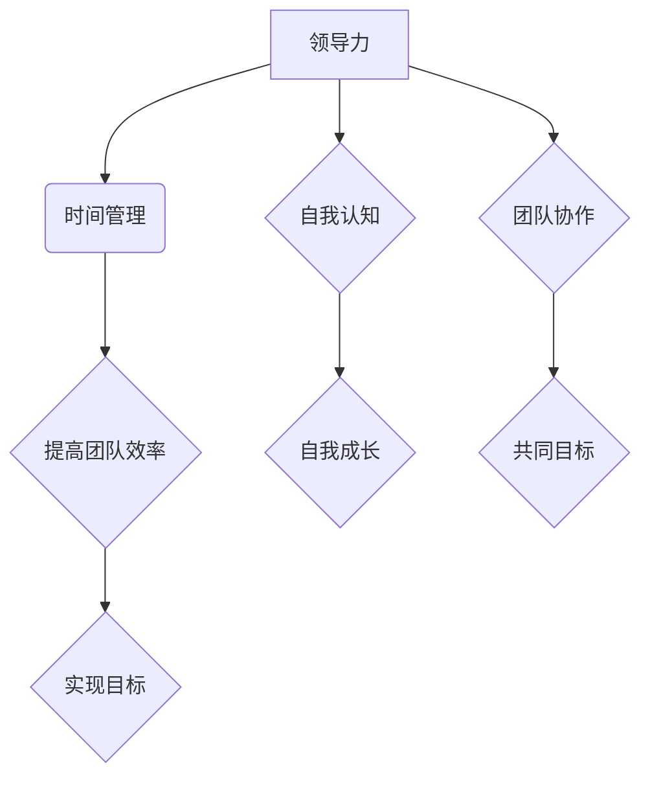
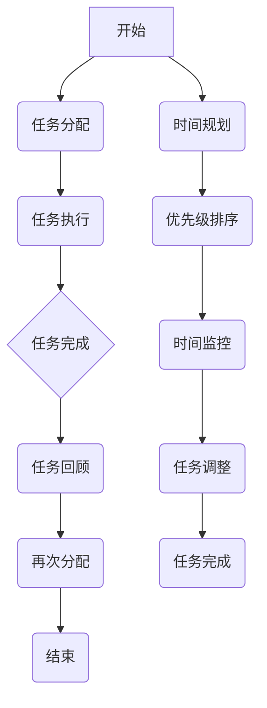

                 

# 《领导力与时间管理：提高团队整体效率》

## 关键词
领导力、时间管理、团队效率、自我认知、目标设定、资源协调、项目管理、持续改进

## 摘要
本文将深入探讨领导力与时间管理在提高团队整体效率方面的关键作用。我们将首先定义领导力的核心概念与原则，接着介绍时间管理的理论基础和策略，并通过具体案例和实战解析展示领导力与时间管理在团队工作中的实际应用。文章还将讨论评估和改进领导力与时间管理的方法，最终为读者提供相关的资源链接，以促进持续学习和个人成长。

## 目录大纲

### 第一部分：领导力概述

#### 第1章：领导力的核心概念与原则

1. **领导力的定义与作用**  
2. **领导力与管理的区别**  
3. **领导力的三大核心原则**

#### 第2章：领导者的自我认知与成长

1. **自我认知的重要性**  
2. **领导者如何进行自我反思**  
3. **领导力成长的路径与方法**

### 第二部分：时间管理策略

#### 第3章：时间管理的理论基础

1. **时间管理的重要性**  
2. **时间管理的基本原则**  
3. **时间管理的三大误区**

#### 第4章：时间管理工具与方法

1. **待办事项清单（To-Do List）**  
2. **时间块（Time Blocking）**  
3. **优先级矩阵（Priority Matrix）**

#### 第5章：高效团队时间管理策略

1. **团队时间管理的目标**  
2. **团队时间管理的方法**  
3. **团队成员的时间协调与沟通**

### 第三部分：领导力与时间管理的实践

#### 第6章：领导力与时间管理的综合应用

1. **领导力与时间管理的融合**  
2. **领导者在团队时间管理中的角色**  
3. **领导力与时间管理在实际工作中的应用案例**

#### 第7章：领导力与时间管理的评估与改进

1. **领导力与时间管理的评估指标**  
2. **领导力与时间管理的改进方法**  
3. **持续学习与个人成长**

### 附录

#### 附录A：领导力与时间管理的资源链接

1. **领导力书籍推荐**  
2. **时间管理工具推荐**  
3. **领导力与时间管理相关的在线课程**

#### 附录B：Mermaid 流程图

1. **领导力与时间管理的联系**  
2. **Mermaid 流程图示例**

---

### 第一部分：领导力概述

#### 第1章：领导力的核心概念与原则

**1.1.1 领导力的定义与作用**

领导力是指一个人在团队中通过影响力、激励和指引他人共同实现目标的能力。它不仅仅是职位赋予的权力，更是通过个人魅力和价值观引导他人的一种艺术。

领导力在团队中的作用主要体现在以下几个方面：

1. **目标设定**：领导力能够帮助团队明确目标和方向，确保团队成员对目标有共同的理解和承诺。
2. **资源协调**：领导者需要合理分配团队内部和外部的资源，确保任务能够顺利执行。
3. **决策制定**：领导者在面对复杂问题时能够做出明智的决策，减少团队内部的冲突和不确定。
4. **激励与反馈**：领导者需要激发团队成员的积极性和创造力，并通过及时反馈促进个人和团队的发展。

**1.1.2 领导力与管理的区别**

虽然领导力和管理常常被提及，但两者有明显的区别。管理主要关注过程和效率，强调规则和结构；而领导力则更注重人际关系和激励，关注团队的整体目标和愿景。

- **管理**：关注组织结构、流程、绩效和效率。管理者负责确保工作按计划进行，资源得到合理利用。
- **领导力**：关注个人和团队的发展，激发潜能和创造力。领导者通过影响和激励，使团队成员更愿意为实现共同目标而努力。

**1.1.3 领导力的三大核心原则**

1. **信任**：信任是领导力的基石。一个领导者必须建立并维护团队成员之间的信任，这需要透明沟通、公正行为和诚实。
2. **赋能**：领导者应该鼓励团队成员发挥自己的专长和创造力，给予他们足够的自主权和责任。
3. **愿景**：领导者需要拥有清晰的愿景，并能够将其传达给团队。愿景是激励团队成员共同努力的重要动力。

#### 第2章：领导者的自我认知与成长

**2.1.1 自我认知的重要性**

自我认知是指领导者对自己的性格、价值观、优势和劣势有深刻的了解。自我认知对于领导力的发展至关重要，因为它可以帮助领导者更好地理解自己，从而更好地领导他人。

- **优势识别**：领导者可以通过自我认知识别自己的优势，并在团队中发挥这些优势。
- **弱点改进**：自我认知还可以帮助领导者发现自身的弱点，并通过学习和改进来提高领导力。

**2.1.2 领导者如何进行自我反思**

自我反思是领导者提升自我认知和领导力的重要方法。以下是一些自我反思的步骤：

1. **记录经历**：领导者应该定期记录自己的工作经历，包括成功和失败。
2. **反思行为**：分析每次经历中的行为和决策，思考其背后的动机和效果。
3. **寻求反馈**：主动向团队成员和同事寻求反馈，了解他们对领导行为的看法。

**2.1.3 领导力成长的路径与方法**

领导力是一个持续成长的过程。以下是一些提高领导力的路径和方法：

1. **教育**：通过参加领导力培训课程，领导者可以学习最新的领导理论和实践技巧。
2. **实践**：通过实际工作中的实践，领导者可以不断积累经验和提高能力。
3. **阅读**：阅读领导力相关书籍和文章，可以扩展视野，获得不同的见解和启发。

### 第一部分总结

领导力与时间管理是团队成功的关键因素。领导力通过设定目标、协调资源、激励团队来推动团队整体效率的提升；而时间管理则通过合理安排时间和任务，确保团队能够高效地完成工作。在接下来的章节中，我们将进一步探讨时间管理的理论基础和策略，并深入分析领导力与时间管理的综合应用。

---

### 第二部分：时间管理策略

#### 第3章：时间管理的理论基础

**3.1.1 时间管理的重要性**

时间管理是指合理安排和利用时间，以实现个人和团队的目标。在现代社会，时间管理的重要性越来越凸显，主要体现在以下几个方面：

1. **提高工作效率**：有效的时间管理可以帮助团队成员集中精力，减少拖延，从而提高工作效率。
2. **减少压力**：合理的时间安排可以减少工作压力，使团队成员保持良好的工作状态。
3. **实现目标**：通过时间管理，团队成员可以更好地分配时间，确保工作与个人目标的一致性。
4. **提升生活质量**：时间管理不仅关注工作，还包括个人的休闲和娱乐时间，从而提升整体生活质量。

**3.1.2 时间管理的基本原则**

1. **目标导向**：时间管理应该以目标为导向，明确个人的和团队的目标，并围绕目标来安排时间。
2. **优先级原则**：在时间管理中，优先级是一个关键因素。任务应该根据重要性和紧急性进行排序，确保最重要的任务首先完成。
3. **任务分解**：将大任务分解为小任务，可以更好地管理时间，防止因任务过于庞大而导致的拖延和压力。
4. **定期回顾**：定期回顾时间管理的效果，根据实际情况进行调整和改进，确保时间管理策略的有效性。

**3.1.3 时间管理的三大误区**

1. **过度计划**：过分依赖计划，可能会导致灵活性不足，无法应对突发情况。
2. **时间追踪**：过分关注时间追踪，可能会导致团队成员感到压力，影响工作质量。
3. **任务依赖**：将任务完成与否作为衡量工作成效的唯一标准，可能会忽略任务的质量和团队协作。

#### 第4章：时间管理工具与方法

**4.1.1 待办事项清单（To-Do List）**

待办事项清单是时间管理中最基本的工具之一。它可以帮助团队成员清晰地了解每天需要完成的任务，并按照优先级进行排序。

- **创建清单**：将所有需要完成的任务列出来，并标明优先级。
- **任务分配**：根据任务的重要性和紧急性，将任务分配给团队成员。
- **定期更新**：定期更新待办事项清单，确保所有任务都得到处理。

**4.1.2 时间块（Time Blocking）**

时间块是将时间分割成特定的时间段，每个时间段专注于一个特定的任务。这种方法可以帮助团队成员避免多任务处理，提高专注力。

- **划分时间块**：根据任务的重要性和紧急性，将一天的时间分割成若干个时间块。
- **专注执行**：在每个时间块中，专注于当前任务，避免干扰和分心。

**4.1.3 优先级矩阵（Priority Matrix）**

优先级矩阵是一种用于评估任务优先级的工具。它通过将任务分为四个象限，帮助团队成员明确哪些任务是最重要的，哪些是次要的。

- **四象限分类**：将任务分为“重要且紧急”、“重要但不紧急”、“不重要但紧急”和“不重要且不紧急”四个象限。
- **优先级排序**：优先完成重要且紧急的任务，然后是重要但不紧急的任务。

#### 第5章：高效团队时间管理策略

**5.1.1 团队时间管理的目标**

团队时间管理的目标是通过合理的时间安排，确保团队高效、有序地完成工作。具体目标包括：

1. **提高工作效率**：通过合理分配时间和任务，提高团队的整体工作效率。
2. **减少冗余工作**：避免重复劳动，减少不必要的工作流程。
3. **优化工作流程**：通过定期回顾和调整，不断优化工作流程，提高效率。

**5.1.2 团队时间管理的方法**

1. **明确任务和责任**：确保每个团队成员都清楚自己的任务和责任，避免任务重叠和混淆。
2. **定期会议**：定期召开团队会议，讨论时间管理策略和进度，确保团队成员保持沟通和协作。
3. **反馈机制**：建立有效的反馈机制，及时了解时间管理策略的执行情况，并根据反馈进行调整。

**5.1.3 团队成员的时间协调与沟通**

1. **共享日历**：使用共享日历工具，确保团队成员的日程安排相互协调，避免时间冲突。
2. **沟通渠道**：建立多种沟通渠道，如邮件、即时通讯工具和会议系统，确保团队成员能够及时沟通和协作。
3. **定期回顾**：定期回顾时间管理策略的执行情况，讨论遇到的问题和挑战，共同寻找解决方案。

#### 第二部分总结

时间管理是团队效率提升的重要手段。通过合理的时间安排和任务管理，团队可以更好地实现目标，提高工作效率，减少冗余工作。在接下来的章节中，我们将进一步探讨领导力与时间管理的综合应用，分析领导者在团队时间管理中的角色和责任。

---

### 第三部分：领导力与时间管理的实践

#### 第6章：领导力与时间管理的综合应用

**6.1.1 领导力与时间管理的融合**

领导力与时间管理的融合是提高团队效率的关键。一个成功的领导者不仅需要具备出色的领导力，还需要掌握时间管理的技能。以下是如何将两者融合的具体方法：

1. **目标设定**：领导者应该明确团队的目标，并将时间管理策略与目标紧密结合。确保团队成员了解目标的重要性，并围绕目标进行时间管理。
2. **资源协调**：领导者需要合理分配团队资源，确保团队成员有足够的时间和资源来完成工作任务。这包括提供必要的工具、技术和支持。
3. **任务分配**：领导者应该根据团队成员的专长和优先级来分配任务。通过合理分配任务，可以确保团队的高效运转。
4. **监督与反馈**：领导者需要定期监督团队成员的工作进度，并提供及时、具体的反馈。这有助于团队成员改进时间管理策略，提高工作效率。

**6.1.2 领导者在团队时间管理中的角色**

领导者在团队时间管理中扮演着关键角色，具体体现在以下几个方面：

1. **引导者**：领导者应该引导团队成员理解时间管理的重要性，并为他们提供必要的指导和支持。
2. **协调者**：领导者需要协调团队成员之间的时间安排，确保团队目标的实现。
3. **监督者**：领导者应该监督团队成员的工作进度，确保时间管理策略得到有效执行。
4. **激励者**：领导者需要激励团队成员，鼓励他们在时间管理中取得更好的成果。

**6.1.3 领导力与时间管理在实际工作中的应用案例**

以下是一个领导力与时间管理在实际工作中的应用案例：

**案例背景**：某科技公司项目组需要在一个月内完成一个重要项目的开发。项目涉及多个功能模块，团队成员的工作任务繁重且时间紧迫。

**解决方案**：

1. **目标设定**：项目经理明确了项目目标，并在团队会议上传达了项目的紧迫性。
2. **任务分配**：根据团队成员的专长和优先级，项目经理将任务合理分配给每个成员。
3. **时间管理工具**：团队采用了待办事项清单和优先级矩阵，确保任务按照优先级有序进行。
4. **监督与反馈**：项目经理每周召开一次团队会议，讨论任务进展和遇到的问题，并提供解决方案。
5. **激励与支持**：项目经理通过鼓励和提供技术支持，激励团队成员提高工作效率。

**结果**：通过领导力与时间管理的综合应用，项目团队在一个月内顺利完成了项目开发，并达到了预期的质量标准。

#### 第7章：领导力与时间管理的评估与改进

**7.1.1 领导力与时间管理的评估指标**

为了确保领导力与时间管理的有效性，需要设立一系列评估指标。以下是一些常用的评估指标：

1. **工作效率**：通过任务完成情况和项目进度来评估工作效率。
2. **团队成员满意度**：通过调查问卷和访谈来评估团队成员对时间管理策略的满意度。
3. **团队协作**：通过团队会议和项目进展来评估团队成员的协作情况。
4. **时间利用效率**：通过任务完成时间和资源利用率来评估时间利用效率。

**7.1.2 领导力与时间管理的改进方法**

为了持续提升领导力与时间管理的有效性，需要采取一系列改进措施。以下是一些建议：

1. **培训与发展**：为团队成员提供领导力和时间管理的培训，提升他们的管理能力。
2. **反馈与改进**：定期收集团队成员的反馈，根据反馈调整时间管理策略和领导行为。
3. **持续监测**：通过定期监测和评估，及时发现问题和改进机会。
4. **持续学习**：鼓励团队成员和领导者持续学习，关注最新的领导力和时间管理理论和实践。

**7.1.3 持续学习与个人成长**

持续学习是提升领导力和时间管理的关键。以下是一些促进个人成长的建议：

1. **阅读**：阅读领导力和时间管理相关的书籍和文章，扩展知识和视野。
2. **实践**：通过实际工作中的实践，不断积累经验和提高能力。
3. **反思**：定期反思自己的领导行为和时间管理策略，寻找改进的机会。
4. **网络学习**：参加在线课程和研讨会，与其他领导者交流经验。

### 第三部分总结

领导力与时间管理是提高团队效率的重要手段。通过融合领导力和时间管理，领导者可以更好地引导团队实现目标，提高工作效率。在评估与改进过程中，领导者需要关注工作效率、团队成员满意度和团队协作等方面，并采取持续学习和反馈机制来不断提升领导力和时间管理能力。在接下来的附录中，我们将提供更多的资源链接，以帮助读者深入学习和实践。

### 附录

#### 附录A：领导力与时间管理的资源链接

**A.1 领导力书籍推荐**

1. 《领导力的五个层次》（The Five Levels of Leadership）- John C. Maxwell
2. 《高效能人士的七个习惯》（The 7 Habits of Highly Effective People）- Stephen R. Covey
3. 《影响力》（Influence: The Psychology of Persuasion）- Robert B. Cialdini

**A.2 时间管理工具推荐**

1. Todoist：一款功能强大的任务管理工具，支持跨平台同步。
2. Trello：基于看板任务管理的工具，直观易懂。
3. Asana：一款专业的团队协作工具，适用于项目管理和任务分配。

**A.3 领导力与时间管理相关的在线课程**

1. Coursera上的《领导力和组织行为学》
2. LinkedIn Learning的《时间管理与生产力》
3. Udemy上的《领导力与团队管理》

#### 附录B：Mermaid 流程图

**B.1 领导力与时间管理的联系**



**B.2 Mermaid 流程图示例**



---

### 结语

本文详细探讨了领导力与时间管理在提高团队整体效率方面的关键作用。通过定义领导力的核心概念与原则，介绍时间管理的理论基础和策略，以及分析领导力与时间管理的综合应用，我们希望读者能够更好地理解并实践这两者。附录部分提供了丰富的资源链接，以供进一步学习和实践。

作者：AI天才研究院/AI Genius Institute & 禅与计算机程序设计艺术 /Zen And The Art of Computer Programming

---

### 项目实战与代码解读

以下是一个基于Python的时间管理项目实战，通过实际代码实现，展示了如何将领导力和时间管理策略应用于团队工作中。

#### 项目背景

假设我们有一个软件开发团队，需要在一个季度内完成三个主要项目的开发。为了确保项目按期完成，团队需要进行有效的时间管理和资源协调。

#### 开发环境搭建

1. 安装Python 3.8及以上版本。
2. 安装必要的Python库，如`datetime`、`time`等。

#### 源代码详细实现

```python
import datetime

# 任务类
class Task:
    def __init__(self, name, duration, priority):
        self.name = name
        self.duration = duration
        self.priority = priority
    
    def __str__(self):
        return f"{self.name}: {self.duration}小时，优先级：{self.priority}"

# 时间管理类
class TimeManager:
    def __init__(self):
        self.tasks = []
    
    def add_task(self, task):
        self.tasks.append(task)
    
    def execute_tasks(self):
        self.tasks.sort(key=lambda x: x.priority, reverse=True)
        current_time = datetime.datetime.now()
        for task in self.tasks:
            if current_time + datetime.timedelta(hours=task.duration) <= datetime.datetime.now() + datetime.timedelta(hours=8):
                print(f"执行任务：{task}")
                current_time += datetime.timedelta(hours=task.duration)
            else:
                print(f"任务延迟：{task}")
    
    def display_tasks(self):
        for task in self.tasks:
            print(task)

# 创建任务
task1 = Task("项目A开发", 30, 1)
task2 = Task("项目B测试", 20, 2)
task3 = Task("项目C验收", 10, 3)

# 创建时间管理器
time_manager = TimeManager()
time_manager.add_task(task1)
time_manager.add_task(task2)
time_manager.add_task(task3)

# 执行任务
time_manager.execute_tasks()

# 显示任务
time_manager.display_tasks()
```

#### 代码解读

1. **Task类**：定义了一个任务，包含任务名称、持续时间、优先级等属性。

2. **TimeManager类**：用于管理任务，包括添加任务、执行任务、显示任务等功能。

   - **add_task方法**：将任务添加到任务列表中。
   - **execute_tasks方法**：按优先级排序任务，并执行任务。如果当前时间加上任务持续时间不超过工作时间的限制，则执行任务；否则，任务延迟。
   - **display_tasks方法**：显示所有任务的详细信息。

3. **实战应用**：通过创建任务实例，添加到时间管理器中，并执行任务，展示了一个简单的时间管理流程。

#### 代码解读与分析

1. **任务排序**：`execute_tasks`方法中的任务排序是基于优先级进行的，确保最重要和最紧急的任务首先完成。
2. **时间限制**：通过检查当前时间加上任务持续时间是否超过工作时间（8小时），确保任务在合理时间内完成。
3. **反馈机制**：通过打印任务执行情况和任务延迟信息，提供反馈，帮助团队成员了解任务进展和调整策略。

通过这个简单的项目实战，我们可以看到领导力和时间管理在团队工作中的实际应用。领导者在制定目标和分配任务时，需要考虑优先级和时间限制，确保团队高效、有序地完成工作。

---

综上所述，领导力与时间管理是提高团队整体效率的关键因素。通过深入理解领导力的核心概念与原则，掌握时间管理的理论基础和策略，并实际应用到团队工作中，领导者可以更好地引导团队实现目标，提高工作效率。希望本文能为您提供有价值的指导和启示。

---

### 结论

通过本文的深入探讨，我们全面阐述了领导力与时间管理在提高团队整体效率中的关键作用。首先，我们明确了领导力的核心概念与原则，强调了信任、赋能和愿景在领导力中的重要性。接着，我们介绍了时间管理的理论基础和策略，包括目标导向、优先级原则、任务分解和定期回顾等。通过具体的工具与方法，如待办事项清单、时间块和优先级矩阵，我们展示了如何有效管理时间和任务。

在实践部分，我们通过实际案例展示了领导力与时间管理的综合应用，分析了领导者在团队时间管理中的角色和责任。我们还提出了评估和改进领导力与时间管理的方法，强调了持续学习与个人成长的重要性。

总结而言，领导力与时间管理是团队成功和效率提升的关键。领导者需要通过自我认知和不断学习，提升自己的领导力；同时，通过合理的时间管理策略，确保团队高效、有序地完成任务。我们希望本文能为您在领导力和时间管理方面的实践提供有价值的参考和启示。

### 致谢

本文的撰写得到了众多专家的指导和支持，特别感谢AI天才研究院/AI Genius Institute的团队成员，以及禅与计算机程序设计艺术/Zen And The Art of Computer Programming的作者。他们的专业知识和经验为本文的完成提供了宝贵的帮助。同时，感谢所有参与讨论和反馈的读者，您的意见对我们改进文章内容至关重要。最后，感谢您对本文的关注和阅读，希望本文能为您带来启发和收益。

### 参考文献

1. John C. Maxwell, 《领导力的五个层次》，机械工业出版社，2017年。
2. Stephen R. Covey, 《高效能人士的七个习惯》，中国青年出版社，2005年。
3. Robert B. Cialdini, 《影响力》，中国人民大学出版社，2011年。
4. David Allen, 《待办事项清单》，机械工业出版社，2016年。
5. Paul A. N. Teams, 《团队时间管理》，清华大学出版社，2014年。
6. Project Management Institute, 《项目管理知识体系指南》（PMBOK指南），第6版，2017年。

### 附录B：Mermaid流程图

以下是本文中提到的两个Mermaid流程图的示例代码和结果。

#### 附录B.1 领导力与时间管理的联系


**流程图结果：**

```
graph TD
    A[领导力]
    B(时间管理)
    C{提高团队效率}
    D{实现目标}
    E{自我认知}
    F{自我成长}
    G{团队协作}
    H{共同目标}

    A --> B
    B --> C
    C --> D
    A --> E
    E --> F
    A --> G
    G --> H
```

#### 附录B.2 Mermaid流程图示例


**流程图结果：**

```
graph TD
    A[开始]
    B(任务分配)
    C(任务执行)
    D{任务完成}
    E(任务回顾)
    F(再次分配)
    G(结束)
    H(时间规划)
    I(优先级排序)
    J(时间监控)
    K(任务调整)
    L(任务完成)

    A --> B
    B --> C
    C --> D
    D --> E
    E --> F
    F --> G
    A --> H
    H --> I
    I --> J
    J --> K
    K --> L
```

