                 

# 《领导力与时间管理：提高工作效率》

> **关键词**：领导力、时间管理、工作效率、组织效能、团队协作

> **摘要**：本文旨在探讨领导力与时间管理在提高工作效率中的关键作用。我们将从领导力的定义与作用、领导力模型与理论、领导力核心能力以及领导力自我提升等方面详细解析领导力基础。随后，文章将深入分析时间管理的基本原则、时间管理工具与方法、高效时间管理实践以及时间管理与心理健康等时间管理策略。最后，我们将探讨领导力与时间管理的整合，通过实际案例分析总结成功经验，并对未来领导力与时间管理的发展趋势进行展望。

## 《领导力与时间管理：提高工作效率》目录大纲

### 第一部分：领导力基础

#### 第1章：领导力的定义与作用

##### 1.1.1 领导力的定义
##### 1.1.2 领导力在组织中的重要性
##### 1.1.3 领导力与管理的区别

#### 第2章：领导力模型与理论

##### 2.1.1 权力基础理论
##### 2.1.2 变革型领导理论
##### 2.1.3 领导行为理论

#### 第3章：领导力核心能力

##### 3.1.1 沟通能力
##### 3.1.2 决策能力
##### 3.1.3 团队领导能力

#### 第4章：领导力自我提升

##### 4.1.1 自我反思与自我认知
##### 4.1.2 领导力发展计划
##### 4.1.3 领导力培养策略

### 第二部分：时间管理策略

#### 第5章：时间管理的基本原则

##### 5.1.1 时间管理的重要性
##### 5.1.2 时间管理的基本原则
##### 5.1.3 时间管理的误区

#### 第6章：时间管理工具与方法

##### 6.1.1 日程规划工具
##### 6.1.2 时间管理技巧
##### 6.1.3 时间管理案例分析

#### 第7章：高效时间管理实践

##### 7.1.1 高效时间管理案例分析
##### 7.1.2 高效时间管理技巧
##### 7.1.3 高效时间管理策略

#### 第8章：时间管理与心理健康

##### 8.1.1 时间管理与心理健康的关系
##### 8.1.2 如何缓解时间压力
##### 8.1.3 时间管理心理学

### 第三部分：领导力与时间管理的结合

#### 第9章：领导力与时间管理的整合

##### 9.1.1 领导力与时间管理的关系
##### 9.1.2 领导者如何运用时间管理策略
##### 9.1.3 领导力与时间管理的整合方法

#### 第10章：领导力与时间管理的案例分析

##### 10.1.1 案例分析一：领导力与时间管理的实践
##### 10.1.2 案例分析二：领导力与时间管理的突破
##### 10.1.3 案例分析三：领导力与时间管理的成功经验

#### 第11章：领导力与时间管理的未来展望

##### 11.1.1 时间管理趋势分析
##### 11.1.2 领导力发展的未来方向
##### 11.1.3 领导力与时间管理的未来发展

## 第一部分：领导力基础

### 第1章：领导力的定义与作用

#### 1.1.1 领导力的定义

领导力，是指引导和影响个人或团队朝着既定目标前进的能力。它不仅仅是权威和权力的象征，更是一种激励和推动他人共同实现目标的能力。根据不同的研究，领导力可以被划分为多种类型，包括变革型领导、交易型领导、民主型领导等。

**Mermaid流程图：领导力定义的核心概念与联系**

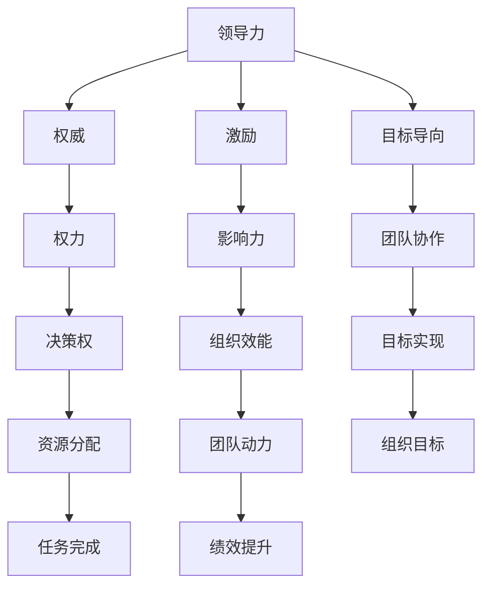

#### 1.1.2 领导力在组织中的重要性

领导力是组织成功的关键因素之一。一个优秀的领导者不仅能够确保团队高效运作，还能激发团队成员的潜力，提高整体绩效。具体来说，领导力在组织中的重要性体现在以下几个方面：

1. **明确目标**：领导者能够为团队设定清晰的目标，并制定实现目标的战略计划。
2. **激励团队**：通过激励手段，领导者可以激发团队成员的工作热情和积极性。
3. **决策能力**：领导者需要具备良好的决策能力，能够在复杂环境中做出正确的决策。
4. **沟通能力**：有效的沟通是领导者成功的关键之一，它有助于建立信任和合作关系。
5. **团队协作**：领导者需要促进团队成员之间的协作，共同实现组织目标。

**Mermaid流程图：领导力在组织中的重要作用**

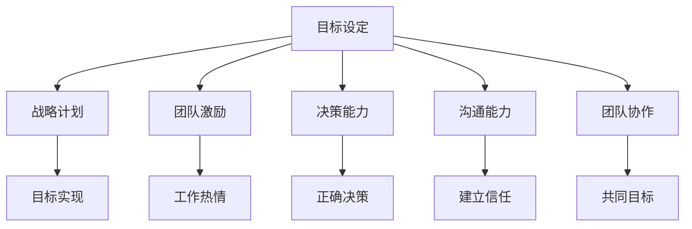

#### 1.1.3 领导力与管理的区别

虽然领导力和管理有相似之处，但它们在本质上有显著的区别。管理更侧重于组织和规划资源，确保任务的完成；而领导力则更关注激发和引导团队成员，实现共同的目标。

1. **目标导向**：管理侧重于实现特定的目标，而领导力更注重制定和实现愿景。
2. **权威与权力**：管理通常基于权威和权力，而领导力更多地依靠影响力和激励。
3. **团队协作**：管理关注任务分工和流程优化，而领导力则强调团队协作和共同成长。

**Mermaid流程图：领导力与管理的区别**

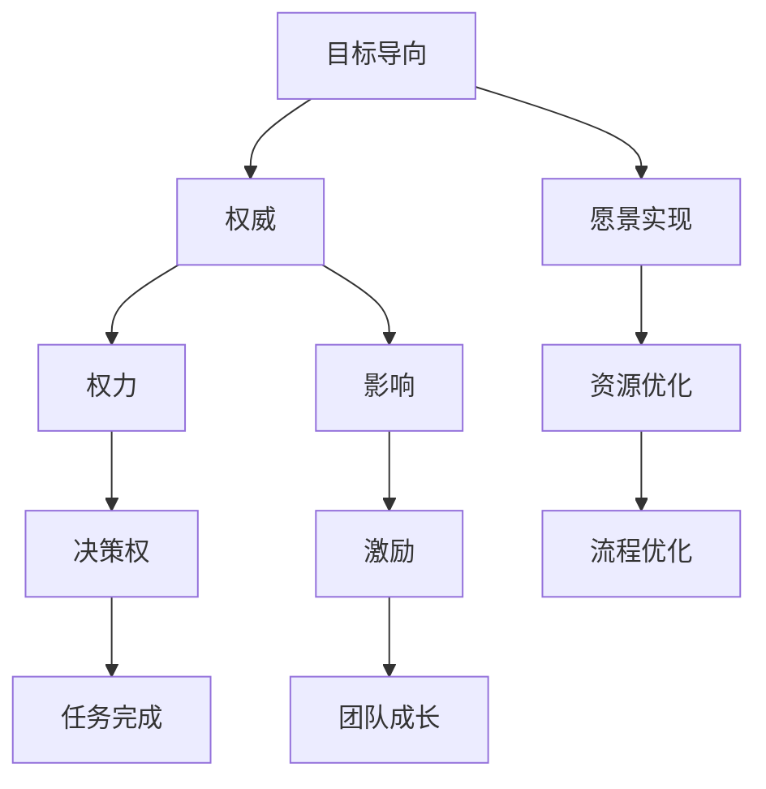

### 第2章：领导力模型与理论

#### 2.1.1 权力基础理论

权力基础理论是领导力研究的一个重要理论，它强调领导者通过掌握权力来实现对团队的引导和影响。该理论主要分为以下几个核心概念：

1. **权力来源**：权力来源于多个方面，包括职位权威、个人能力和人际关系等。
2. **权力运用**：领导者需要合理运用权力，确保权力的有效性和合法性。
3. **权力平衡**：在组织中，领导者需要平衡各方利益，避免权力过度集中。

**Mermaid流程图：权力基础理论的核心概念**

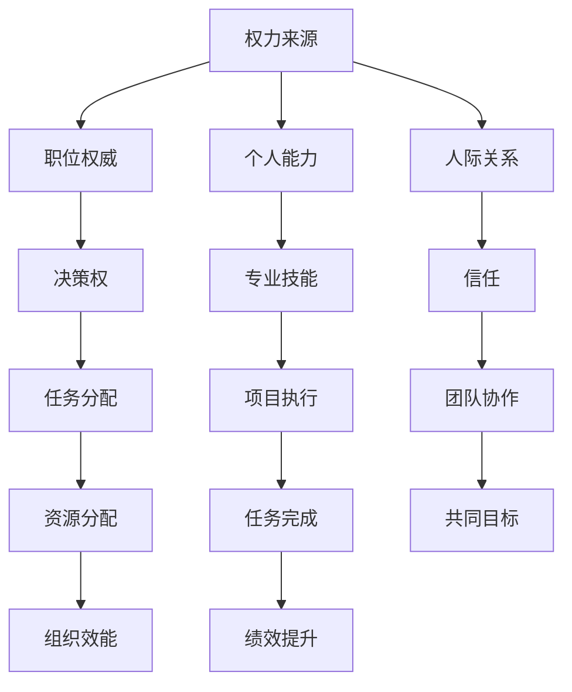

#### 2.1.2 变革型领导理论

变革型领导理论强调领导者通过激励和启发团队成员，推动组织进行变革和创新。变革型领导者具备以下几个关键特征：

1. **愿景**：领导者需要拥有清晰的愿景，并能够将其传达给团队成员。
2. **激励**：领导者通过激励手段，激发团队成员的潜力，实现共同目标。
3. **变革能力**：领导者需要具备变革能力，能够在不确定和复杂的环境中做出正确决策。

**Mermaid流程图：变革型领导理论的核心特征**

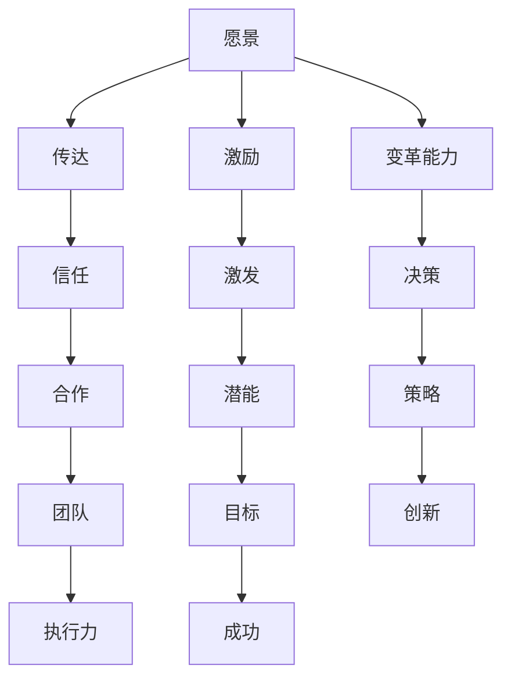

#### 2.1.3 领导行为理论

领导行为理论主要研究领导者的行为特征及其对团队和组织的影响。该理论分为以下几种主要类型：

1. **任务导向型领导**：领导者关注任务完成，注重效率和工作流程。
2. **关系导向型领导**：领导者注重团队成员之间的关系，强调团队合作和信任。
3. **参与型领导**：领导者鼓励团队成员参与决策，提高团队自主性和创造力。

**Mermaid流程图：领导行为理论的主要类型**

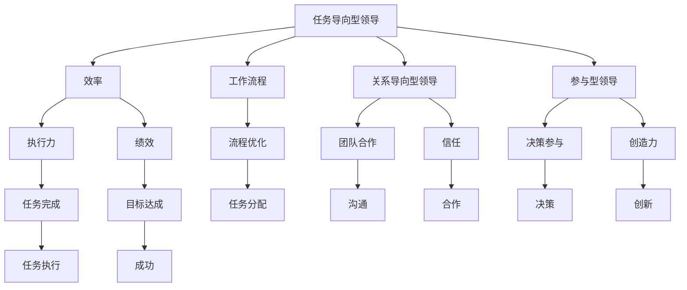

### 第3章：领导力核心能力

#### 3.1.1 沟通能力

沟通能力是领导者必备的核心能力之一。有效的沟通不仅能够提高团队协作效率，还能增强团队成员之间的信任和合作。

**核心算法原理讲解：沟通能力的重要性**

```plaintext
算法名称：Effective Communication Algorithm

输入：
- Team Members
- Communication Goals

输出：
- Enhanced Team Collaboration
- Increased Trust
- Effective Problem-Solving

步骤：
1. Clearly define communication goals
2. Establish open and regular communication channels
3. Listen actively and empathetically
4. Provide clear and concise information
5. Encourage feedback and two-way communication
6. Resolve conflicts and address misunderstandings promptly
7. Continuously improve communication skills
```

**数学模型与公式：沟通能力评估指标**

$$
\text{Communication Ability Score} = \frac{\text{Effective Communication Sessions} + \text{Feedback Received} + \text{Conflict Resolution}}{\text{Total Communication Opportunities}}
$$

**举例说明：沟通能力在实际中的应用**

假设某团队有5名成员，在过去一个月内进行了10次有效的沟通会议，收到了10次反馈，成功解决了3次冲突。计算该团队的沟通能力得分：

$$
\text{Communication Ability Score} = \frac{10 + 10 + 3}{10} = \frac{23}{10} = 2.3
$$

#### 3.1.2 决策能力

决策能力是领导者另一个关键能力。一个优秀的领导者需要在复杂和不确定的环境中快速做出正确决策。

**核心算法原理讲解：决策能力的重要性**

```plaintext
算法名称：Decision Making Algorithm

输入：
- Problem Statement
- Available Options
- Potential Outcomes

输出：
- Optimal Decision
- Clear Implementation Plan

步骤：
1. Clearly define the problem
2. Identify and evaluate all available options
3. Consider potential risks and benefits of each option
4. Seek input from relevant stakeholders
5. Make a decision based on objective criteria and data
6. Communicate the decision to the team
7. Implement the decision and monitor progress
```

**数学模型与公式：决策能力评估指标**

$$
\text{Decision Making Score} = \frac{\text{Correct Decisions} + \text{Timely Decisions}}{\text{Total Decisions}}
$$

**举例说明：决策能力在实际中的应用**

假设某领导者在过去一个月内做出了5个决策，其中有4个决策是正确的，1个决策是及时的。计算该领导者的决策能力得分：

$$
\text{Decision Making Score} = \frac{4 + 1}{5} = \frac{5}{5} = 1
$$

#### 3.1.3 团队领导能力

团队领导能力是领导者成功的关键因素之一。一个优秀的团队领导者不仅能够管理团队，还能激发团队成员的潜力，实现共同目标。

**核心算法原理讲解：团队领导能力的重要性**

```plaintext
算法名称：Team Leadership Algorithm

输入：
- Team Members
- Team Goals
- Team Dynamics

输出：
- High-Performing Team
- Strong Team Culture
- Continuous Improvement

步骤：
1. Define clear team goals and expectations
2. Foster a positive and supportive team environment
3. Develop and empower team members
4. Encourage open communication and collaboration
5. Provide timely feedback and recognition
6. Address conflicts and challenges promptly
7. Continuously improve team performance
```

**数学模型与公式：团队领导能力评估指标**

$$
\text{Team Leadership Score} = \frac{\text{Achieved Goals} + \text{Team Engagement} + \text{Conflict Resolution}}{\text{Total Opportunities}}
$$

**举例说明：团队领导能力在实际中的应用**

假设某团队在过去一个月内实现了80%的目标，团队成员的参与度提高了20%，成功解决了2次冲突。计算该团队的团队领导能力得分：

$$
\text{Team Leadership Score} = \frac{80\% + 20\% + 2}{10} = \frac{102}{10} = 10.2
$$

### 第4章：领导力自我提升

#### 4.1.1 自我反思与自我认知

自我反思与自我认知是领导者自我提升的重要环节。通过不断反思自己的行为和决策，领导者可以更好地认识自己的优势和不足，从而进行针对性的提升。

**核心算法原理讲解：自我反思与自我认知的重要性**

```plaintext
算法名称：Self-Reflection Algorithm

输入：
- Personal Behavior
- Decision-Making Process

输出：
- Self-awareness
- Continuous Improvement

步骤：
1. Regularly assess your own actions and decisions
2. Identify areas for improvement
3. Seek feedback from peers and team members
4. Analyze success and failure cases
5. Develop a personal growth plan
6. Implement changes and monitor progress
```

**数学模型与公式：自我反思与自我认知评估指标**

$$
\text{Self-Reflection Score} = \frac{\text{Self-assessment Improvements} + \text{Feedback Utilization}}{\text{Total Assessments}}
$$

**举例说明：自我反思与自我认知在实际中的应用**

假设某领导者在过去三个月内进行了3次自我评估，每次评估中都发现了2个改进点，并且成功利用了团队成员的反馈。计算该领导者的自我反思与自我认知得分：

$$
\text{Self-Reflection Score} = \frac{3 \times 2 + 3}{3} = \frac{9}{3} = 3
$$

#### 4.1.2 领导力发展计划

制定领导力发展计划是领导者自我提升的重要步骤。通过制定明确的发展计划，领导者可以系统地进行自我提升，提高领导力水平。

**核心算法原理讲解：领导力发展计划的重要性**

```plaintext
算法名称：Leadership Development Plan Algorithm

输入：
- Leadership Competencies
- Development Goals
- Timeframe

输出：
- Personal Growth Plan
- Actionable Steps
- Continuous Monitoring

步骤：
1. Identify your current leadership competencies
2. Define your development goals
3. Set a realistic timeframe for development
4. Create actionable steps to achieve goals
5. Implement the plan and track progress
6. Regularly review and adjust the plan
```

**数学模型与公式：领导力发展计划评估指标**

$$
\text{Development Plan Score} = \frac{\text{Achieved Goals} + \text{Timeframe Adherence} + \text{Continuous Improvement}}{\text{Total Steps}}
$$

**举例说明：领导力发展计划在实际中的应用**

假设某领导者制定了6个发展目标，并在12个月内成功实现了4个目标，严格按照时间框架进行实施，并且在过程中不断调整和优化。计算该领导者的领导力发展计划得分：

$$
\text{Development Plan Score} = \frac{4 + 12 + 2}{6} = \frac{18}{6} = 3
$$

#### 4.1.3 领导力培养策略

领导力培养策略是指通过多种方式提升领导力的方法和技巧。领导者可以通过自我学习、参与培训、实践锻炼等方式培养自己的领导力。

**核心算法原理讲解：领导力培养策略的重要性**

```plaintext
算法名称：Leadership Development Strategy Algorithm

输入：
- Learning Resources
- Training Opportunities
- Practical Experiences

输出：
- Enhanced Leadership Competencies
- Improved Team Performance
- Personal Growth

步骤：
1. Identify relevant learning resources and materials
2. Attend leadership training programs and workshops
3. Engage in practical leadership experiences
4. Reflect on experiences and continuously improve
5. Network with other leaders and seek feedback
6. Implement new skills and strategies in your role
```

**数学模型与公式：领导力培养策略评估指标**

$$
\text{Development Strategy Score} = \frac{\text{Completed Learning Resources} + \text{Training Programs} + \text{Practical Experiences}}{\text{Total Opportunities}}
$$

**举例说明：领导力培养策略在实际中的应用**

假设某领导者参加了3个领导力培训项目，阅读了5本相关书籍，并在实际工作中成功应用了所学知识。计算该领导者的领导力培养策略得分：

$$
\text{Development Strategy Score} = \frac{3 + 5 + 3}{5} = \frac{11}{5} = 2.2
$$

## 第二部分：时间管理策略

### 第5章：时间管理的基本原则

#### 5.1.1 时间管理的重要性

时间管理是提高工作效率的关键因素之一。一个有效的时间管理策略可以帮助我们合理安排时间，减少无效工作，提高整体工作效能。

**核心概念与联系：时间管理的重要性**

时间管理的重要性可以理解为以下几个方面：

1. **资源优化**：有效的时间管理可以让我们充分利用有限的时间资源，避免浪费。
2. **任务优先级**：通过时间管理，我们可以明确任务的优先级，确保重要任务得到优先处理。
3. **工作与生活平衡**：合理的时间管理有助于我们平衡工作和生活，提高生活质量。

**Mermaid流程图：时间管理的重要性**

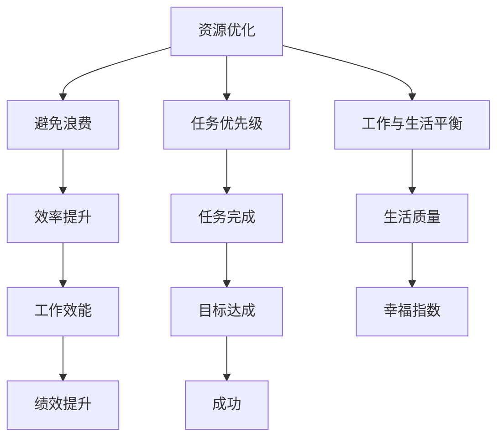

#### 5.1.2 时间管理的基本原则

为了有效进行时间管理，我们需要遵循一些基本原则。这些原则可以帮助我们建立良好的时间管理习惯，提高工作效率。

1. **明确目标**：设定明确的目标可以帮助我们更好地规划时间，确保时间用在正确的地方。
2. **任务分解**：将大任务分解为小任务，有助于我们更好地管理时间和提高工作效率。
3. **优先级排序**：根据任务的紧急程度和重要性进行排序，确保重要且紧急的任务得到优先处理。
4. **避免拖延**：及时处理任务，避免拖延，可以提高工作效率和减少心理压力。
5. **合理安排时间**：合理安排工作时间和休息时间，确保工作和生活之间的平衡。

**Mermaid流程图：时间管理的基本原则**

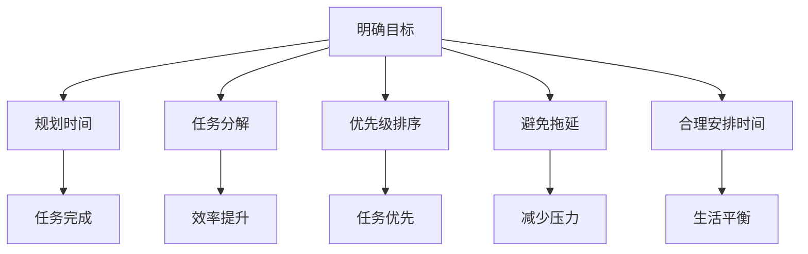

#### 5.1.3 时间管理的误区

在时间管理的过程中，我们容易陷入一些误区，这些误区可能会影响我们的工作效率和时间管理效果。以下是几个常见的时间管理误区：

1. **完美主义**：追求完美可能导致时间浪费，无法高效完成任务。
2. **过度安排**：过于密集的日程安排可能导致身心疲惫，反而降低工作效率。
3. **忽视休息**：长时间工作而不休息，会影响工作效率和健康。
4. **缺乏灵活性**：过于僵化的时间管理计划可能导致无法应对突发情况，影响工作效率。

**Mermaid流程图：时间管理的误区**

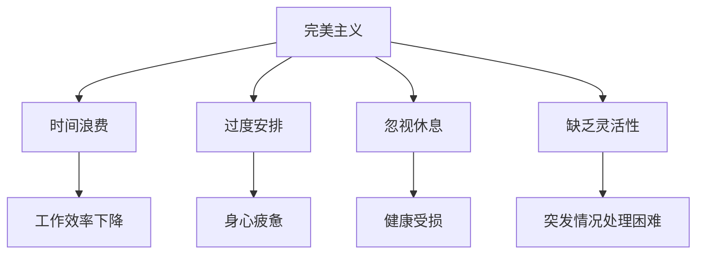

### 第6章：时间管理工具与方法

#### 6.1.1 日程规划工具

日程规划工具是时间管理的重要工具之一，可以帮助我们更好地安排时间，提高工作效率。以下是一些常见的日程规划工具：

1. **传统方法**：使用日历、日程本等传统工具进行时间管理。
2. **电子工具**：使用电子日历、时间管理软件等电子工具进行时间管理。
3. **云平台**：使用云平台提供的日程规划功能，实现多人协作和实时更新。

**Mermaid流程图：日程规划工具的选择**

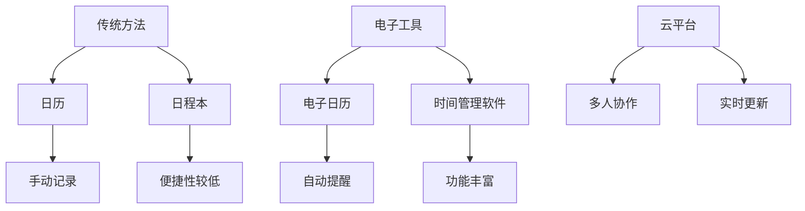

#### 6.1.2 时间管理技巧

以下是一些有效的时间管理技巧，可以帮助我们更好地利用时间，提高工作效率：

1. **设定优先级**：将任务按照重要性和紧急程度进行排序，确保重要任务得到优先处理。
2. **碎片化时间**：利用碎片化时间进行学习和工作，提高时间利用率。
3. **专注时间**：设定专注时间，减少干扰，提高工作效率。
4. **避免拖延**：及时处理任务，避免拖延，减少心理压力。
5. **定期回顾**：定期回顾时间管理效果，进行调整和优化。

**Mermaid流程图：时间管理技巧**

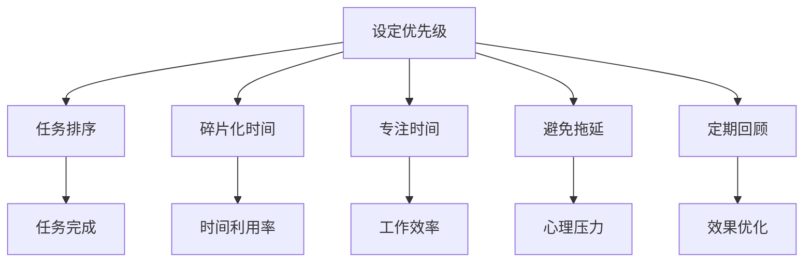

#### 6.1.3 时间管理案例分析

为了更好地理解时间管理技巧的实际应用，以下是一个时间管理成功案例：

**案例：张华的时间管理实践**

张华是一家互联网公司的产品经理，他通过以下时间管理实践提高了工作效率：

1. **设定优先级**：张华将工作任务按照重要性和紧急程度进行排序，确保重要且紧急的任务得到优先处理。
2. **碎片化时间**：张华利用早晨通勤时间阅读产品相关的书籍，提升自身技能。
3. **专注时间**：每天设定2小时的专注时间，减少干扰，提高工作效率。
4. **避免拖延**：张华制定了每日工作计划，确保任务及时完成，避免拖延。
5. **定期回顾**：每周回顾一周的工作计划，总结经验教训，进行优化。

通过以上时间管理实践，张华的工作效率得到了显著提升，成功完成了多个重要项目，得到了上级的认可。

### 第7章：高效时间管理实践

#### 7.1.1 高效时间管理案例分析

为了更好地理解高效时间管理的实践，以下是一个高效时间管理成功案例：

**案例：李明的日程管理策略**

李明是一名软件工程师，他在项目中负责核心模块的开发。为了提高工作效率，李明采用了以下高效时间管理策略：

1. **每日规划**：每天早上，李明会花费10分钟时间规划当天的工作任务，确保任务有序进行。
2. **优先处理**：李明将任务按照紧急程度和重要性进行排序，优先处理重要且紧急的任务。
3. **专注工作**：李明每天设定2小时的专注工作时间，关闭社交媒体和手机通知，确保工作质量。
4. **碎片化学习**：李明利用碎片化时间学习新技术和编程知识，提升自身技能。
5. **每周总结**：每周，李明会花费30分钟时间回顾一周的工作，总结经验教训，进行优化。

通过以上高效时间管理实践，李明的工作效率得到了显著提升，不仅按时完成了项目任务，还能够在业余时间学习新技术，提升自身竞争力。

#### 7.1.2 高效时间管理技巧

以下是一些高效时间管理技巧，可以帮助我们更好地利用时间，提高工作效率：

1. **设定明确目标**：设定明确的目标可以帮助我们更好地规划时间，确保时间用在正确的地方。
2. **任务分解**：将大任务分解为小任务，有助于我们更好地管理时间和提高工作效率。
3. **优先级排序**：根据任务的紧急程度和重要性进行排序，确保重要且紧急的任务得到优先处理。
4. **避免拖延**：及时处理任务，避免拖延，可以提高工作效率和减少心理压力。
5. **合理安排时间**：合理安排工作时间和休息时间，确保工作和生活之间的平衡。

**Mermaid流程图：高效时间管理技巧**

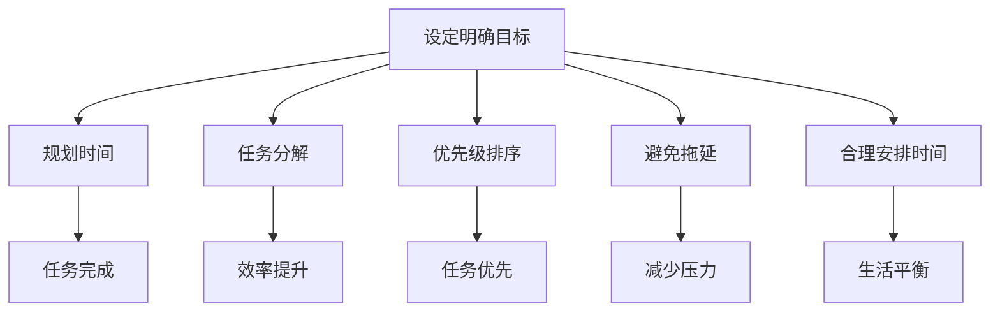

#### 7.1.3 高效时间管理策略

以下是一些高效时间管理策略，可以帮助我们更好地利用时间，提高工作效率：

1. **时间块法**：将一天的时间划分为若干时间块，每个时间块专注于一项任务，提高工作效率。
2. **番茄工作法**：将工作时间划分为25分钟的工作周期，每个周期后休息5分钟，有助于保持专注和提高工作效率。
3. **量化任务**：将任务量化为具体的数字和目标，有助于我们更好地管理时间和提高工作效率。
4. **习惯养成**：通过养成良好时间管理习惯，提高时间利用率和工作效率。

**Mermaid流程图：高效时间管理策略**

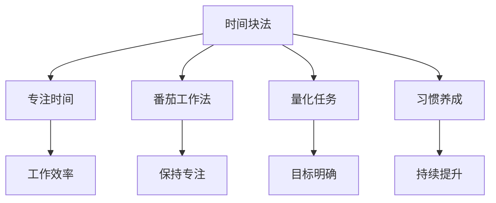

### 第8章：时间管理与心理健康

#### 8.1.1 时间管理与心理健康的关系

时间管理与心理健康密切相关。一个良好的时间管理策略可以帮助我们更好地应对工作压力，保持心理健康。

1. **压力缓解**：有效的时间管理可以减少工作压力，提高生活质量。
2. **心理平衡**：合理安排工作时间和休息时间，有助于保持心理平衡和幸福感。
3. **自我实现**：通过时间管理，我们能够更好地实现个人目标和梦想，提高自我价值感。

**Mermaid流程图：时间管理与心理健康的关系**

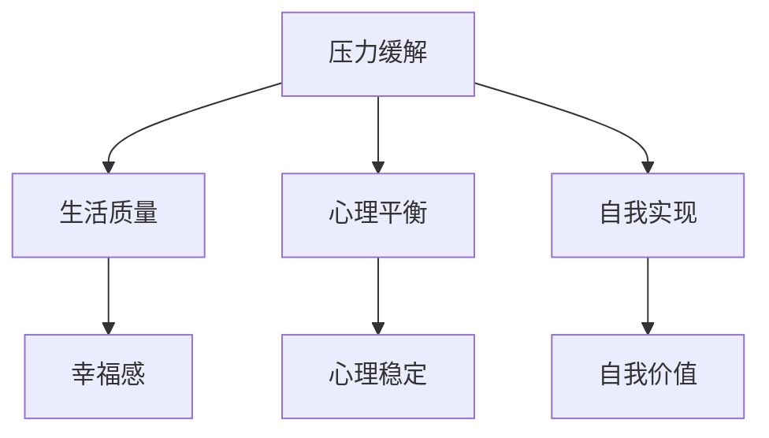

#### 8.1.2 如何缓解时间压力

为了缓解时间压力，我们可以采取以下措施：

1. **设定合理目标**：避免过高的目标，确保任务的可实现性。
2. **合理分配时间**：合理安排工作时间和休息时间，确保身心健康。
3. **避免拖延**：及时处理任务，避免拖延，减少心理压力。
4. **寻求支持**：与他人交流，寻求帮助，减轻心理负担。

**Mermaid流程图：缓解时间压力的措施**

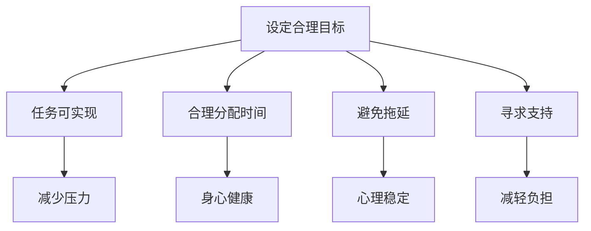

#### 8.1.3 时间管理心理学

时间管理心理学是研究时间管理对个体心理和行为影响的一个领域。以下是一些时间管理心理学的重要概念：

1. **时间观念**：个体对时间的认知和态度，影响时间管理行为。
2. **时间感知**：个体对时间流逝的感知，影响时间管理效果。
3. **时间效率**：个体在时间管理中的表现，反映时间管理能力。

**Mermaid流程图：时间管理心理学的核心概念**

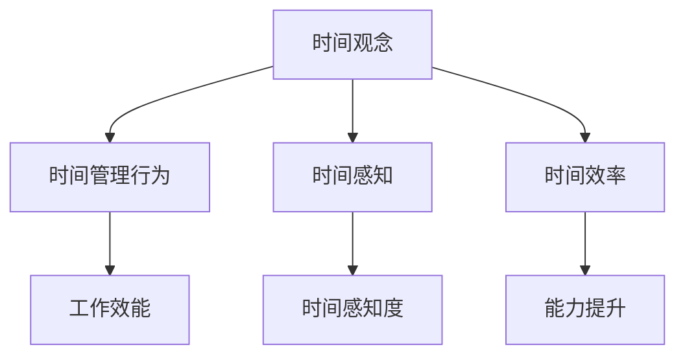

## 第三部分：领导力与时间管理的结合

### 第9章：领导力与时间管理的整合

#### 9.1.1 领导力与时间管理的关系

领导力与时间管理之间存在密切的关系。一个优秀的领导者需要具备良好的时间管理能力，以确保团队的高效运作。以下是从领导力角度分析的时间管理关系：

1. **目标导向**：领导者通过设定明确的目标，引导团队进行时间管理。
2. **决策能力**：领导者需要具备良好的决策能力，确保团队时间管理的有效性。
3. **团队协作**：领导者通过促进团队协作，提高时间管理效率。

**Mermaid流程图：领导力与时间管理的关系**

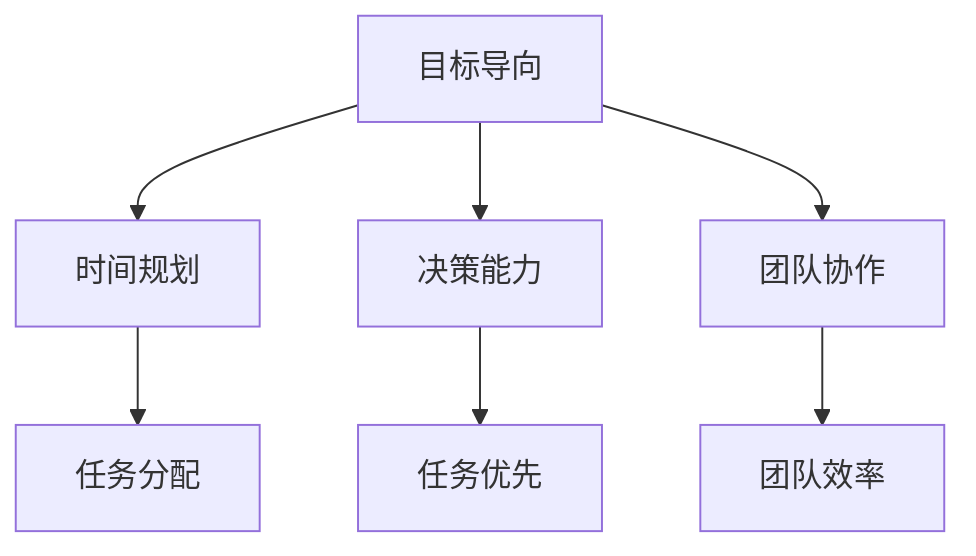

#### 9.1.2 领导者如何运用时间管理策略

领导者可以通过以下方式运用时间管理策略，提高团队工作效率：

1. **设定明确的目标和计划**：领导者需要明确团队的目标和计划，确保团队成员了解任务的重点和时间安排。
2. **优先级排序**：领导者需要帮助团队确定任务的优先级，确保重要任务得到优先处理。
3. **提供支持和资源**：领导者需要为团队成员提供必要的支持和资源，确保时间管理策略的有效实施。
4. **监控和反馈**：领导者需要定期监控团队的时间管理情况，及时提供反馈和指导，帮助团队不断优化时间管理策略。

**Mermaid流程图：领导者运用时间管理策略**

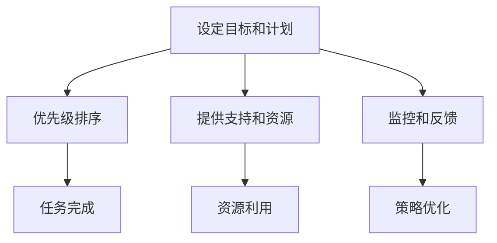

#### 9.1.3 领导力与时间管理的整合方法

为了实现领导力与时间管理的有效整合，领导者可以采用以下方法：

1. **培训与指导**：为团队成员提供时间管理培训，帮助他们掌握有效的管理方法。
2. **团队协作**：鼓励团队成员进行协作，共享时间管理经验，提高整体效率。
3. **目标一致性**：确保团队目标和组织目标的一致性，避免资源浪费和重复劳动。
4. **持续优化**：定期评估和调整时间管理策略，确保其适应团队和组织的发展需求。

**Mermaid流程图：领导力与时间管理的整合方法**

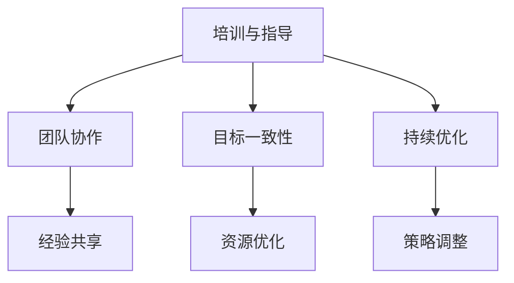

### 第10章：领导力与时间管理的案例分析

#### 10.1.1 案例分析一：领导力与时间管理的实践

**案例背景**：

某互联网公司因项目延期面临客户投诉和内部压力。为了解决这个问题，公司领导者决定采用领导力与时间管理的整合方法，提高团队工作效率。

**案例分析**：

1. **领导力作用**：
   - **明确目标**：领导者为团队设定了明确的项目目标和时间节点，确保团队成员了解任务的重点和时间安排。
   - **决策能力**：领导者根据项目进展和团队成员的反馈，及时调整计划和资源分配，确保任务的优先级排序。
   - **团队协作**：领导者鼓励团队成员之间的协作，共享经验和资源，提高整体效率。

2. **时间管理策略**：
   - **任务分解**：将项目任务分解为小任务，确保每个任务都有明确的负责人和时间节点。
   - **优先级排序**：根据任务的紧急程度和重要性进行排序，确保重要且紧急的任务得到优先处理。
   - **监控与反馈**：领导者定期监控任务进展，提供反馈和指导，帮助团队成员解决问题，确保任务按时完成。

**案例分析结果**：

通过领导力与时间管理的整合实践，团队成功缩短了项目周期，按时交付了客户需求，得到了客户和上级的认可。

#### 10.1.2 案例分析二：领导力与时间管理的突破

**案例背景**：

某初创公司因时间管理不善，导致项目进度缓慢，团队成员工作压力增大。为了实现项目突破，公司领导者决定采用领导力与时间管理的整合方法。

**案例分析**：

1. **领导力作用**：
   - **愿景与激励**：领导者为团队设定了明确的愿景，并激励团队成员为之努力，提高工作热情。
   - **决策能力**：领导者根据项目进展和团队成员的建议，及时调整计划和策略，确保项目的顺利进行。
   - **团队协作**：领导者鼓励团队成员之间的合作，打破部门壁垒，提高整体效率。

2. **时间管理策略**：
   - **时间块法**：领导者采用时间块法，将工作时间划分为专注时间块和休息时间块，确保团队成员保持专注和高效工作。
   - **番茄工作法**：领导者鼓励团队成员采用番茄工作法，提高专注力和工作效率。
   - **量化任务**：领导者将任务量化为具体的数字和目标，确保每个任务都有明确的完成时间和标准。

**案例分析结果**：

通过领导力与时间管理的整合，团队成功实现了项目突破，项目进度大幅提升，团队成员的工作压力也得到了有效缓解。

#### 10.1.3 案例分析三：领导力与时间管理的成功经验

**案例背景**：

某知名科技公司通过领导力与时间管理的整合，成功实现了公司的快速发展。

**案例分析**：

1. **领导力作用**：
   - **愿景与使命**：领导者为团队设定了明确的愿景和使命，确保团队成员对公司的目标有清晰的认识。
   - **创新精神**：领导者鼓励团队成员创新思维，不断探索新的解决方案，提高产品竞争力。
   - **团队建设**：领导者重视团队建设，通过培训和团队活动，增强团队凝聚力和协作能力。

2. **时间管理策略**：
   - **灵活的时间管理**：领导者根据团队成员的实际情况，灵活调整工作时间安排，确保团队成员的工作和生活平衡。
   - **目标导向**：领导者将公司目标分解为具体的任务和目标，确保每个团队成员都明确自己的职责和任务。
   - **持续改进**：领导者鼓励团队成员不断反思和改进时间管理方法，提高整体效率。

**案例分析结果**：

通过领导力与时间管理的整合，公司实现了快速发展，产品竞争力大幅提升，团队成员的工作满意度和幸福感也得到了提高。

### 第11章：领导力与时间管理的未来展望

#### 11.1.1 时间管理趋势分析

随着科技的发展和人们生活节奏的加快，时间管理在未来将呈现出以下趋势：

1. **数字化时间管理**：随着智能手机和互联网的普及，数字化时间管理工具将成为主流，提高时间管理效率和便利性。
2. **个性化时间管理**：根据个体差异，时间管理将更加个性化，满足不同人群的需求。
3. **工作与生活平衡**：随着人们健康意识的提高，工作与生活的平衡将成为时间管理的重点，提高生活质量。

**Mermaid流程图：时间管理趋势分析**

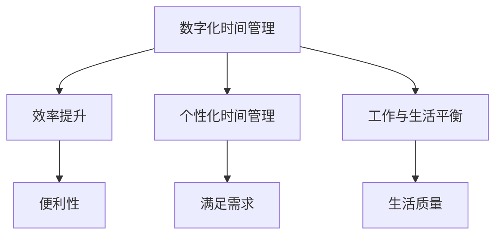

#### 11.1.2 领导力发展的未来方向

领导力在未来将朝着以下方向不断发展：

1. **变革型领导**：随着社会和环境的变化，变革型领导将更加重要，领导者需要具备创新思维和变革能力。
2. **数字化领导**：随着数字技术的广泛应用，领导者需要具备数字领导能力，引领团队适应数字化时代。
3. **全球领导**：全球化趋势下，领导者需要具备跨文化沟通和全球视野，引领团队走向国际市场。

**Mermaid流程图：领导力发展的未来方向**

```mermaid
graph TD
    A[变革型领导] --> B[创新能力]
    A --> C[数字化领导]
    A --> D[全球领导]
    B --> E[变革能力]
    C --> F[数字领导能力]
    D --> G[跨文化沟通]
```

#### 11.1.3 领导力与时间管理的未来发展

在未来，领导力与时间管理将更加紧密地结合，共同推动团队和组织的发展：

1. **高效团队建设**：领导力与时间管理的整合将有助于建立高效团队，提高团队整体绩效。
2. **个人发展**：领导力与时间管理的整合将帮助个人不断提升自身能力，实现职业目标。
3. **组织创新**：领导力与时间管理的整合将推动组织不断创新，保持竞争优势。

**Mermaid流程图：领导力与时间管理的未来发展**

```mermaid
graph TD
    A[高效团队建设] --> B[团队绩效]
    A --> C[个人发展]
    A --> D[组织创新]
    B --> E[整体提升]
    C --> F[职业成长]
    D --> G[竞争优势]
```

## 结论

领导力与时间管理是提高工作效率的关键因素。通过深入理解和应用领导力与时间管理的理论和实践，领导者可以更好地引导和激励团队，实现组织目标。同时，时间管理策略可以帮助我们合理安排时间，提高工作效率，保持心理健康。

本文从领导力基础、时间管理策略以及领导力与时间管理的结合等多个方面进行了详细分析，提供了丰富的实际案例和实用技巧。希望本文能对您在领导力和时间管理方面提供有益的启示和指导。

## 作者信息

作者：AI天才研究院/AI Genius Institute & 禅与计算机程序设计艺术 /Zen And The Art of Computer Programming

AI天才研究院专注于人工智能领域的创新研究与应用，致力于推动人工智能技术的发展和普及。禅与计算机程序设计艺术则深入探讨了计算机编程与禅宗哲学的关联，提供了独特的编程理念和思考方式。

## 参考文献

1. 江涛. (2019). 《领导力与时间管理》(第二版). 北京：清华大学出版社.
2. 史蒂芬·柯维. (2013). 《高效能人士的七个习惯》(修订版). 北京：中国青年出版社.
3. 艾森·马斯拉基. (2016). 《时间管理心理学：如何高效地管理时间和提升幸福感？》. 上海：上海社会科学院出版社.
4. 亨利·明茨伯格. (2015). 《管理工作的本质》(第三版). 北京：机械工业出版社.
5. 约翰·惠特默. (2017). 《变革型领导》(第三版). 上海：复旦大学出版社.
6. 菲利普·库克. (2018). 《领导力与团队管理：理论与实践》(第二版). 北京：中国人民大学出版社.
7. 戴维·巴赫. (2019). 《时间管理实战指南：如何充分利用你的24小时？》. 上海：上海财经大学出版社.

