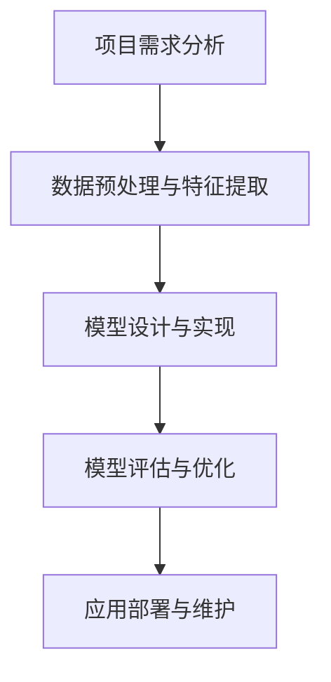

                 

### 《AI Agent: AI的下一个风口 NLP》

> **关键词**：AI Agent、自然语言处理（NLP）、深度学习、序列模型、注意力机制、对话系统、知识图谱、伦理挑战。

> **摘要**：本文旨在探讨人工智能（AI）领域的下一个重要风口——AI Agent，特别是在自然语言处理（NLP）中的应用。文章首先介绍了AI Agent的基本概念、核心架构和开发流程，随后详细分析了AI Agent在NLP中的具体应用，包括文本分类、情感分析、文本生成与摘要、对话系统和知识图谱。最后，文章讨论了AI Agent的发展趋势、伦理挑战及其未来方向。

----------------------------------------------------------------

### 《AI Agent: AI的下一个风口 NLP》目录大纲

#### 第一部分: AI Agent概述

**第1章: AI Agent的基础概念**

- **1.1 AI Agent的定义与作用**
- **1.2 AI Agent的类型与分类**
- **1.3 AI Agent的关键技术**
- **1.4 AI Agent的应用场景**

**第2章: AI Agent的核心架构**

- **2.1 基于深度学习的AI Agent**
  - **2.1.1 神经网络在AI Agent中的应用**
  - **2.1.2 强化学习在AI Agent中的应用**
- **2.2 自然语言处理（NLP）技术**
  - **2.2.1 词嵌入与语义表示**
  - **2.2.2 序列模型与注意力机制**
  - **2.2.3 跨领域迁移学习**

**第3章: AI Agent开发流程**

- **3.1 AI Agent项目需求分析**
  - **3.1.1 项目需求收集与整理**
  - **3.1.2 项目目标设定与规划**
- **3.2 数据预处理与特征提取**
  - **3.2.1 数据清洗与处理**
  - **3.2.2 特征工程与选择**
- **3.3 模型设计与实现**
  - **3.3.1 模型选择与训练**
  - **3.3.2 模型评估与优化**

#### 第二部分: NLP中的AI Agent应用

**第4章: AI Agent在自然语言理解中的应用**

- **4.1 文本分类与情感分析**
  - **4.1.1 基于词嵌入的文本分类**
  - **4.1.2 基于序列模型的情感分析**
- **4.2 文本生成与摘要**
  - **4.2.1 文本生成模型**
  - **4.2.2 文本摘要技术**

**第5章: AI Agent在对话系统中的应用**

- **5.1 对话系统的基本原理**
  - **5.1.1 对话管理框架**
  - **5.1.2 上下文理解与跟踪**
- **5.2 对话系统的实现与优化**
  - **5.2.1 对话系统架构设计**
  - **5.2.2 对话系统性能优化**

**第6章: AI Agent在知识图谱中的应用**

- **6.1 知识图谱的基本概念**
  - **6.1.1 知识图谱的结构与表示**
  - **6.1.2 知识图谱的构建方法**
- **6.2 AI Agent在知识图谱中的应用**
  - **6.2.1 知识图谱问答系统**
  - **6.2.2 知识图谱辅助决策系统**

#### 第三部分: AI Agent的发展与未来

**第7章: AI Agent的发展趋势**

- **7.1 新一代AI Agent技术**
  - **7.1.1 元学习与迁移学习**
  - **7.1.2 自适应与自优化**
- **7.2 AI Agent在垂直行业中的应用**
  - **7.2.1 医疗健康领域**
  - **7.2.2 金融领域**
  - **7.2.3 教育领域**

**第8章: AI Agent的伦理与挑战**

- **8.1 AI Agent的伦理问题**
  - **8.1.1 透明性与可解释性**
  - **8.1.2 隐私保护与数据安全**
- **8.2 AI Agent的挑战与对策**
  - **8.2.1 技术挑战**
  - **8.2.2 社会挑战**

#### 附录

**附录A: AI Agent开发工具与资源**

- **A.1 开发环境搭建**
- **A.2 常用深度学习框架**
- **A.3 开源代码与案例**

**附录B: Mermaid流程图与伪代码示例**

- **B.1 Mermaid流程图示例**
- **B.2 伪代码示例**
- **B.3 数学公式与示例**

----------------------------------------------------------------

### 第一部分: AI Agent概述

#### 第1章: AI Agent的基础概念

**1.1 AI Agent的定义与作用**

AI Agent，即人工智能代理，是指能够模拟人类智能，具备自我决策能力、学习能力、交互能力的软件系统。AI Agent通过感知环境、理解信息、做出决策，并在环境中采取行动，以实现特定目标。

AI Agent的作用主要体现在以下几个方面：

1. **自动化决策**：AI Agent可以在无需人类干预的情况下，根据环境变化自主做出决策，提高工作效率。
2. **智能交互**：AI Agent能够理解自然语言，与人类进行智能对话，提供个性化服务。
3. **知识推理**：AI Agent可以根据已有知识，进行推理和预测，为决策提供依据。
4. **数据采集与分析**：AI Agent可以自动采集数据，进行数据分析和处理，辅助决策。

**1.2 AI Agent的类型与分类**

AI Agent可以根据不同的标准进行分类，常见的分类方法包括：

1. **按功能分类**：可以分为决策型、交互型、知识型等。决策型AI Agent主要进行自动化决策；交互型AI Agent主要进行智能交互；知识型AI Agent主要进行知识推理。
2. **按应用领域分类**：可以分为通用型、专用型等。通用型AI Agent适用于多种领域，专用型AI Agent适用于特定领域。
3. **按智能水平分类**：可以分为弱AI Agent、强AI Agent、超AI Agent等。弱AI Agent只能执行特定任务；强AI Agent具有人类的全面智能；超AI Agent具有超越人类的能力。

**1.3 AI Agent的关键技术**

AI Agent的核心技术主要包括：

1. **感知与交互技术**：包括语音识别、自然语言处理、图像识别等，用于感知环境、理解信息。
2. **决策与学习技术**：包括决策树、神经网络、强化学习等，用于做出决策、学习策略。
3. **知识表示与推理技术**：包括知识图谱、本体论、逻辑推理等，用于表示知识、进行推理。
4. **多模态融合技术**：将语音、图像、文本等多种模态的信息进行融合，提高AI Agent的感知和理解能力。

**1.4 AI Agent的应用场景**

AI Agent的应用场景非常广泛，包括但不限于以下领域：

1. **智能客服**：AI Agent可以自动回答用户问题，提供个性化服务，提高客户满意度。
2. **智能推荐**：AI Agent可以根据用户行为和偏好，进行内容推荐，提高用户体验。
3. **智能决策支持**：AI Agent可以为企业提供决策支持，优化业务流程，提高竞争力。
4. **智能家居**：AI Agent可以控制家庭设备，实现自动化管理，提高生活质量。
5. **医疗健康**：AI Agent可以辅助医生进行诊断和治疗，提高医疗水平。
6. **教育**：AI Agent可以为学生提供个性化辅导，提高学习效果。

**1.5 AI Agent的发展历程**

AI Agent的发展历程可以分为以下几个阶段：

1. **早期探索阶段**（1950s-1960s）：人工智能概念提出，AI Agent研究开始。
2. **符号主义阶段**（1970s-1980s）：基于符号主义的方法，如专家系统、逻辑推理等，取得一定成果。
3. **基于数据阶段**（1990s-2000s）：数据驱动的方法逐渐成为主流，机器学习和深度学习技术得到广泛应用。
4. **多模态融合阶段**（2010s至今）：AI Agent逐渐具备感知与交互能力，开始应用于实际场景。

**1.6 本章总结**

本章介绍了AI Agent的基础概念、类型与分类、关键技术、应用场景和发展历程。AI Agent作为一种具有自我决策、学习、交互能力的软件系统，正在逐渐改变我们的生活和工作方式。随着技术的不断进步，AI Agent的应用前景将更加广阔。

----------------------------------------------------------------

### 第一部分: AI Agent概述

#### 第2章: AI Agent的核心架构

**2.1 基于深度学习的AI Agent**

深度学习是AI Agent的核心技术之一，特别是对于自然语言处理（NLP）任务。基于深度学习的AI Agent通过大规模神经网络模型来模拟人类的认知过程，从而实现智能感知、理解和决策。

**2.1.1 神经网络在AI Agent中的应用**

神经网络是深度学习的基础，它由大量相互连接的神经元组成，能够通过学习大量数据来提取特征和模式。在AI Agent中，神经网络主要用于以下几个方面：

1. **特征提取**：神经网络可以自动从原始数据中提取有用的特征，减少数据预处理的工作量。例如，在图像识别任务中，卷积神经网络（CNN）可以自动提取图像中的纹理、形状等特征。
2. **分类与回归**：神经网络可以用于分类和回归任务，通过学习数据中的规律，对新的数据进行预测。例如，在情感分析任务中，神经网络可以判断文本的情感倾向。
3. **序列建模**：神经网络可以处理序列数据，如文本、语音等。通过序列模型，神经网络可以捕捉数据之间的时序关系，从而提高模型的性能。

**2.1.2 强化学习在AI Agent中的应用**

强化学习是一种基于奖励机制的学习方法，通过不断尝试和反馈，使AI Agent逐渐学会在复杂环境中做出最优决策。在AI Agent中，强化学习主要用于以下几个方面：

1. **策略学习**：强化学习可以帮助AI Agent学习到一种策略，使其在特定环境下能够最大化奖励。例如，在自动驾驶任务中，强化学习可以指导车辆在道路上行驶。
2. **环境建模**：强化学习可以用于环境建模，帮助AI Agent更好地理解外部环境。例如，在游戏任务中，强化学习可以帮助AI Agent学习到游戏规则和策略。
3. **多智能体系统**：强化学习可以用于多智能体系统，使多个AI Agent能够协同工作。例如，在智能交通系统中，强化学习可以协调车辆和交通信号灯，提高交通效率。

**2.2 自然语言处理（NLP）技术**

自然语言处理是AI Agent的重要组成部分，它使AI Agent能够理解和处理人类语言。NLP技术主要包括以下几个方面：

1. **词嵌入与语义表示**：词嵌入是将自然语言中的单词映射到高维空间中的向量表示，从而实现语义信息的表达。语义表示是通过学习单词之间的相似性，实现单词层面的语义理解。
2. **序列模型与注意力机制**：序列模型是一种处理序列数据的模型，如循环神经网络（RNN）和长短期记忆网络（LSTM）。注意力机制是一种模型内部的机制，它允许模型在处理序列数据时，关注某些重要的信息。
3. **跨领域迁移学习**：跨领域迁移学习是一种利用已有领域的知识，来提高新领域的模型性能的方法。它通过在多个领域间共享模型参数，实现知识的迁移。

**2.3 多模态融合技术**

多模态融合是将多种模态（如文本、图像、语音等）的信息进行融合，以实现更全面的感知和理解。在AI Agent中，多模态融合技术主要用于以下几个方面：

1. **多模态特征提取**：多模态特征提取是将不同模态的信息转换为统一的特征表示，以便于后续处理。
2. **多模态表示学习**：多模态表示学习是通过学习多模态数据的联合表示，实现不同模态信息之间的融合。
3. **多模态交互**：多模态交互是研究如何使AI Agent在不同模态之间进行信息传递和协同工作。

**2.4 AI Agent的架构设计**

AI Agent的架构设计主要包括以下几个方面：

1. **感知模块**：负责接收外部环境的信息，如文本、图像、语音等。
2. **理解模块**：负责对感知模块接收到的信息进行理解和分析，如语义分析、情感分析等。
3. **决策模块**：负责根据理解模块的分析结果，做出决策和采取行动。
4. **行动模块**：负责将决策模块的决策结果转化为实际行动，如发送消息、控制设备等。

**2.5 本章总结**

本章介绍了AI Agent的核心架构，包括基于深度学习的感知与交互技术、强化学习决策技术、自然语言处理技术以及多模态融合技术。这些技术共同构成了AI Agent的基础，使其能够在复杂环境中实现智能感知、理解和决策。

----------------------------------------------------------------

### 第一部分: AI Agent概述

#### 第3章: AI Agent开发流程

**3.1 AI Agent项目需求分析**

AI Agent项目的成功依赖于对项目需求的深入理解。项目需求分析是开发流程的第一步，主要包括以下任务：

1. **需求收集与整理**：通过与项目相关人员（如客户、用户、项目经理等）进行沟通，收集项目需求。需求可以是功能性的，也可以是非功能性的，如性能、安全性、可靠性等。收集到的需求需要整理成文档，以便于后续分析和规划。

2. **项目目标设定与规划**：根据收集到的需求，明确项目的目标和任务。项目目标应具体、可衡量、可实现、相关性强、有时间限制（SMART原则）。在明确项目目标后，制定项目规划，包括开发周期、资源分配、风险评估等。

**3.1.1 项目需求收集与整理**

项目需求收集与整理的过程可以遵循以下步骤：

1. **需求识别**：通过与相关人员进行访谈、问卷调查、观察等方式，识别项目需求。
2. **需求分类**：将收集到的需求进行分类，如功能需求、性能需求、安全需求等。
3. **需求分析**：对每个需求进行分析，明确需求的优先级、可行性、影响范围等。
4. **需求文档化**：将分析后的需求整理成需求文档，包括需求描述、需求关系图、需求规格说明书等。

**3.1.2 项目目标设定与规划**

项目目标设定与规划的过程可以遵循以下步骤：

1. **确定项目目标**：根据需求分析的结果，明确项目的目标。
2. **分解目标**：将项目目标分解为更具体的子目标，以便于管理和追踪。
3. **制定项目计划**：根据项目目标和子目标，制定项目计划，包括开发周期、里程碑、资源需求等。
4. **风险评估**：识别项目潜在的风险，制定风险应对策略。

**3.2 数据预处理与特征提取**

数据预处理与特征提取是AI Agent开发的重要环节，它直接影响模型的性能。数据预处理与特征提取的过程包括以下步骤：

1. **数据清洗**：去除数据中的噪声、缺失值、异常值等，确保数据的质量。
2. **数据归一化/标准化**：将数据缩放到一个合适的范围，提高算法的稳定性和鲁棒性。
3. **特征提取**：从原始数据中提取有用的特征，用于训练模型。特征提取的方法包括统计特征、文本特征、图像特征等。

**3.2.1 数据清洗与处理**

数据清洗与处理的过程可以遵循以下步骤：

1. **数据质量评估**：评估数据的质量，包括完整性、一致性、准确性等。
2. **数据去重**：去除重复的数据记录，减少数据冗余。
3. **数据缺失处理**：处理数据中的缺失值，如删除缺失值、填充缺失值等。
4. **数据异常检测**：检测数据中的异常值，如离群点、错误值等。

**3.2.2 特征工程与选择**

特征工程与选择的过程可以遵循以下步骤：

1. **特征构造**：从原始数据中构造新的特征，以提高模型的性能。特征构造的方法包括特征交叉、特征组合等。
2. **特征选择**：从大量的特征中选择最有用的特征，以减少模型的复杂度和过拟合。特征选择的方法包括过滤式选择、包裹式选择、嵌入式选择等。

**3.3 模型设计与实现**

模型设计与实现是AI Agent开发的重点环节，它决定了AI Agent的性能和效果。模型设计与实现的过程包括以下步骤：

1. **模型选择**：根据任务需求和数据特点，选择合适的模型。常见的模型包括神经网络、决策树、支持向量机等。
2. **模型训练**：使用训练数据对模型进行训练，调整模型的参数，使其达到最优性能。
3. **模型评估**：使用验证数据对模型进行评估，检验模型的性能和效果。
4. **模型优化**：根据评估结果，对模型进行调整和优化，以提高模型的性能。

**3.3.1 模型选择与训练**

模型选择与训练的过程可以遵循以下步骤：

1. **模型选择**：根据任务类型和数据特点，选择合适的模型。例如，对于分类任务，可以选择神经网络、决策树等。
2. **模型训练**：使用训练数据对模型进行训练，调整模型的参数，使其达到最优性能。常用的训练方法包括梯度下降、随机梯度下降等。
3. **模型评估**：使用验证数据对模型进行评估，检验模型的性能和效果。常用的评估指标包括准确率、召回率、F1值等。
4. **模型优化**：根据评估结果，对模型进行调整和优化，以提高模型的性能。常用的优化方法包括超参数调优、正则化等。

**3.3.2 模型评估与优化**

模型评估与优化的过程可以遵循以下步骤：

1. **模型评估**：使用验证数据对模型进行评估，检验模型的性能和效果。常用的评估指标包括准确率、召回率、F1值等。
2. **模型优化**：根据评估结果，对模型进行调整和优化，以提高模型的性能。常用的优化方法包括超参数调优、正则化等。
3. **模型迭代**：通过不断的评估和优化，逐步提高模型的性能，直到满足项目需求。

**3.4 本章总结**

本章介绍了AI Agent开发流程中的项目需求分析、数据预处理与特征提取、模型设计与实现等关键环节。通过合理的流程设计和高效的模型训练，可以开发出性能优异的AI Agent，为实际应用提供强有力的支持。

----------------------------------------------------------------

### 第二部分: NLP中的AI Agent应用

#### 第4章: AI Agent在自然语言理解中的应用

自然语言理解（NLU）是人工智能领域的重要研究方向，它使AI Agent能够理解人类语言，提取语言中的语义信息。在这一章中，我们将探讨AI Agent在自然语言理解中的应用，包括文本分类、情感分析、文本生成与摘要等。

**4.1 文本分类与情感分析**

文本分类是NLU中的一个基础任务，它将文本数据分为预定义的类别。情感分析是文本分类的一个典型应用，它旨在判断文本的情感倾向，如正面、负面或中性。

**4.1.1 基于词嵌入的文本分类**

词嵌入是将自然语言中的单词映射到高维空间中的向量表示，从而实现语义信息的表达。基于词嵌入的文本分类方法利用词嵌入向量来表示文本，通过计算文本向量和类别向量的相似度来进行分类。

伪代码如下：

```
function text_classification(text, labels, model):
    # 将文本转换为词嵌入向量
    text_vector = word_embedding(text)

    # 将类别标签转换为向量
    label_vectors = [word_embedding(label) for label in labels]

    # 计算文本向量与类别向量的相似度
    similarity_scores = [cosine_similarity(text_vector, label_vector) for label_vector in label_vectors]

    # 选择相似度最高的类别作为预测结果
    predicted_label = labels[np.argmax(similarity_scores)]

    return predicted_label
```

**4.1.2 基于序列模型的情感分析**

序列模型是处理序列数据的模型，如循环神经网络（RNN）和长短期记忆网络（LSTM）。基于序列模型的情感分析利用序列模型来捕捉文本中的时序信息，从而提高分类的准确性。

伪代码如下：

```
function sentiment_analysis(text, model):
    # 将文本转换为序列向量
    sequence_vector = text_to_sequence(text)

    # 通过序列模型预测情感类别
    predicted_sentiment = model.predict(sequence_vector)

    return predicted_sentiment
```

**4.2 文本生成与摘要**

文本生成与摘要任务是NLU中的一个重要应用，它旨在生成与原始文本相关的新文本或摘要。文本生成和摘要技术包括生成模型和抽取模型。

**4.2.1 文本生成模型**

文本生成模型通过学习大量文本数据，生成与输入文本相关的新文本。常见的文本生成模型包括循环神经网络（RNN）和生成对抗网络（GAN）。

伪代码如下：

```
function text_generation(text, model):
    # 将文本转换为序列向量
    sequence_vector = text_to_sequence(text)

    # 通过生成模型生成新文本
    generated_text = model.generate(sequence_vector)

    return generated_text
```

**4.2.2 文本摘要技术**

文本摘要技术通过提取文本中的关键信息，生成简洁的摘要。常见的文本摘要技术包括抽取模型和抽象模型。

伪代码如下：

```
function text_summary(text, model):
    # 将文本转换为序列向量
    sequence_vector = text_to_sequence(text)

    # 通过摘要模型生成摘要
    summary = model.summarize(sequence_vector)

    return summary
```

**4.3 本章总结**

本章介绍了AI Agent在自然语言理解中的应用，包括文本分类、情感分析、文本生成与摘要等。通过使用词嵌入、序列模型等先进技术，AI Agent能够更好地理解人类语言，为实际应用提供有力支持。

----------------------------------------------------------------

### 第二部分: NLP中的AI Agent应用

#### 第5章: AI Agent在对话系统中的应用

对话系统是一种与人类进行自然语言交互的计算机系统，它能够理解用户的需求，生成合理的回复，并维持流畅的对话。在这一章中，我们将探讨AI Agent在对话系统中的应用，包括对话系统的基本原理、实现与优化等。

**5.1 对话系统的基本原理**

对话系统通常由以下三个关键组成部分构成：

1. **对话管理**：对话管理负责控制对话的流程，包括理解用户的意图、生成回复、跟踪对话上下文等。
2. **自然语言理解（NLU）**：NLU负责理解用户的输入，提取关键信息，如意图、实体等。
3. **自然语言生成（NLG）**：NLG负责将系统的理解转换为自然语言回复，使其更具可读性和流畅性。

**5.1.1 对话管理框架**

对话管理框架是控制对话流程的核心，它通常包括以下几个阶段：

1. **输入处理**：对用户的输入进行预处理，如分词、词性标注、命名实体识别等。
2. **意图识别**：根据输入的文本，识别用户的意图，如查询、请求、指令等。
3. **上下文跟踪**：在对话过程中，跟踪用户的意图和对话历史，以便于生成合适的回复。
4. **回复生成**：根据用户的意图和对话历史，生成合适的回复。
5. **输出处理**：将生成的回复进行后处理，如修正语法、添加语气词等。

**5.1.2 上下文理解与跟踪**

上下文理解与跟踪是对话系统的关键挑战之一。为了实现良好的上下文理解，系统需要能够捕捉对话中的关键信息，并在后续对话中引用这些信息。

伪代码示例：

```
function context_tracking(user_input, context):
    # 解析用户输入，提取关键信息
    intent, entities = parse_user_input(user_input)

    # 更新上下文信息
    context['intent'] = intent
    context['entities'] = entities

    # 根据上下文信息生成回复
    response = generate_response(context)

    return response
```

**5.2 对话系统的实现与优化**

实现一个高效、流畅的对话系统需要考虑以下几个方面：

1. **模型选择**：选择合适的模型进行意图识别和回复生成。常见的模型包括序列到序列（Seq2Seq）模型、长短时记忆（LSTM）模型、变换器（Transformer）模型等。
2. **数据集准备**：准备丰富的训练数据集，包括对话样本、意图标签、实体标注等。
3. **模型训练**：使用训练数据对模型进行训练，优化模型参数。
4. **模型评估**：使用验证数据对模型进行评估，选择性能最好的模型。
5. **在线学习**：在对话过程中，根据用户的反馈对模型进行在线学习，提高模型的适应性和鲁棒性。

**5.2.1 对话系统架构设计**

一个典型的对话系统架构包括以下几个模块：

1. **前端界面**：与用户进行交互，接收用户的输入，展示系统的回复。
2. **后端服务器**：包括NLU模块、对话管理模块、NLG模块等，处理用户的输入和生成回复。
3. **数据库**：存储对话历史、用户信息、知识库等。

**5.2.2 对话系统性能优化**

为了提高对话系统的性能，可以采取以下措施：

1. **压缩模型**：使用压缩技术，如量化、剪枝、知识蒸馏等，减少模型的存储和计算成本。
2. **多语言支持**：支持多种语言，提高系统的应用范围。
3. **实时更新**：根据用户反馈和对话历史，实时更新模型和知识库，提高系统的适应性和准确性。
4. **个性化服务**：根据用户的历史行为和偏好，生成个性化的回复。

**5.3 本章总结**

本章介绍了AI Agent在对话系统中的应用，包括对话系统的基本原理、实现与优化等。通过使用先进的NLU和NLG技术，AI Agent能够实现与人类的自然语言交互，为用户提供个性化、高效的服务。

----------------------------------------------------------------

### 第二部分: NLP中的AI Agent应用

#### 第6章: AI Agent在知识图谱中的应用

知识图谱是一种结构化的语义知识库，它通过实体、关系和属性来表示现实世界中的信息。AI Agent在知识图谱中的应用非常广泛，包括知识图谱问答系统、知识图谱辅助决策系统等。

**6.1 知识图谱的基本概念**

知识图谱的核心概念包括实体、关系和属性。

1. **实体**：实体是知识图谱中的基本单位，如人、地点、组织、物品等。
2. **关系**：关系描述实体之间的联系，如“属于”、“位于”、“制造”等。
3. **属性**：属性描述实体的特征，如人的年龄、地点的经纬度、物品的价格等。

**6.1.1 知识图谱的结构与表示**

知识图谱的结构通常由图组成，其中节点表示实体，边表示关系。知识图谱的表示方法包括图数据库、RDF（Resource Description Framework）和OWL（Web Ontology Language）等。

**6.1.2 知识图谱的构建方法**

知识图谱的构建通常包括以下步骤：

1. **数据采集**：从各种数据源（如文本、数据库、API等）采集信息。
2. **数据预处理**：清洗、归一化和转换数据，使其适合知识图谱的表示。
3. **实体识别与关系抽取**：使用自然语言处理技术，从文本数据中识别实体和关系。
4. **实体链接与属性填充**：将实体与知识图谱中的实体进行链接，并填充实体的属性。

**6.2 AI Agent在知识图谱中的应用**

AI Agent在知识图谱中的应用主要包括知识图谱问答系统和知识图谱辅助决策系统。

**6.2.1 知识图谱问答系统**

知识图谱问答系统是一种智能问答系统，它能够从知识图谱中检索信息，回答用户的问题。

伪代码示例：

```
function kg_question_answering(question, knowledge_graph):
    # 解析用户问题，提取关键词和意图
    keywords, intent = parse_question(question)

    # 在知识图谱中搜索与关键词相关的实体和关系
    related_entities, relations = search_knowledge_graph(knowledge_graph, keywords)

    # 根据意图生成回答
    answer = generate_answer(related_entities, relations, intent)

    return answer
```

**6.2.2 知识图谱辅助决策系统**

知识图谱辅助决策系统利用知识图谱提供的信息，辅助用户做出决策。

伪代码示例：

```
function kg_decision_support(user_profile, knowledge_graph):
    # 分析用户资料，提取关键信息
    user_interests, user_goals = analyze_user_profile(user_profile)

    # 在知识图谱中搜索与用户兴趣相关的信息
    related_entities = search_knowledge_graph(knowledge_graph, user_interests)

    # 提供建议和决策支持
    suggestions = provide_suggestions(related_entities, user_goals)

    return suggestions
```

**6.3 本章总结**

本章介绍了AI Agent在知识图谱中的应用，包括知识图谱问答系统和知识图谱辅助决策系统。通过利用知识图谱中的信息，AI Agent能够提供智能化的问答和决策支持，为用户提供更好的服务。

----------------------------------------------------------------

### 第三部分: AI Agent的发展与未来

#### 第7章: AI Agent的发展趋势

随着人工智能技术的快速发展，AI Agent的应用前景愈发广阔。在这一章中，我们将探讨AI Agent的发展趋势，包括新一代AI Agent技术、AI Agent在垂直行业中的应用等。

**7.1 新一代AI Agent技术**

新一代AI Agent技术主要包括元学习与迁移学习、自适应与自优化等。

**7.1.1 元学习与迁移学习**

元学习是一种学习如何学习的技术，它使AI Agent能够快速适应新任务，提高学习效率。迁移学习是一种利用已有知识来提高新任务性能的方法，它通过在多个任务间共享模型参数，实现知识的迁移。

**7.1.2 自适应与自优化**

自适应AI Agent能够根据环境变化自动调整自己的行为和策略。自优化AI Agent能够通过不断学习和优化，提高自身的性能和效果。

**7.2 AI Agent在垂直行业中的应用**

AI Agent在垂直行业中的应用前景十分广阔，包括医疗健康、金融、教育等领域。

**7.2.1 医疗健康领域**

在医疗健康领域，AI Agent可以辅助医生进行诊断和治疗，提高医疗水平。例如，通过分析病历和医学文献，AI Agent可以提供精准的诊断建议和治疗方案。

**7.2.2 金融领域**

在金融领域，AI Agent可以用于风险评估、投资决策和客户服务。例如，通过分析市场数据和用户行为，AI Agent可以提供实时的风险预警和个性化的投资建议。

**7.2.3 教育领域**

在教育领域，AI Agent可以为学生提供个性化辅导和学习建议，提高学习效果。例如，通过分析学生的学习情况和兴趣爱好，AI Agent可以制定个性化的学习计划，帮助学生更好地掌握知识。

**7.3 本章总结**

本章介绍了AI Agent的发展趋势和新一代AI Agent技术，并探讨了AI Agent在垂直行业中的应用。随着技术的不断进步，AI Agent将在各个领域发挥越来越重要的作用，为人类社会带来更多便利和创新。

----------------------------------------------------------------

### 第三部分: AI Agent的发展与未来

#### 第8章: AI Agent的伦理与挑战

随着AI Agent技术的快速发展，其在各个领域的应用越来越广泛，也带来了许多伦理和社会挑战。在这一章中，我们将探讨AI Agent的伦理问题、技术挑战以及社会挑战，并提出相应的对策。

**8.1 AI Agent的伦理问题**

AI Agent的伦理问题主要集中在以下几个方面：

**8.1.1 透明性与可解释性**

AI Agent的决策过程通常是基于复杂的算法和大量数据，这使得决策过程变得不透明，难以解释。透明性和可解释性是确保AI Agent行为合理性和可信度的重要方面。

**8.1.2 隐私保护与数据安全**

AI Agent在运行过程中会收集和处理大量的用户数据，这涉及到用户的隐私保护问题。确保数据的安全性和隐私性是AI Agent应用中的关键问题。

**8.1.3 人工智能偏见**

AI Agent在训练过程中可能会学习到数据中的偏见，从而在决策中表现出偏见。消除人工智能偏见，确保AI Agent的公平性和公正性是一个重要的伦理问题。

**8.1.4 人机协作与责任归属**

在AI Agent与人类协作的情境中，如何划分责任和角色是一个复杂的问题。明确责任归属有助于确保AI Agent系统的稳定运行。

**8.2 AI Agent的技术挑战**

AI Agent技术的挑战主要集中在以下几个方面：

**8.2.1 模型复杂性与效率**

随着AI Agent应用的深入，模型复杂度不断提高，这对计算资源和能耗提出了更高的要求。如何设计高效、低能耗的AI Agent模型是一个关键问题。

**8.2.2 数据质量与多样性**

AI Agent的性能依赖于高质量、多样化的训练数据。如何获取和标注高质量的数据，以及如何处理数据中的噪声和异常是一个重要挑战。

**8.2.3 环境适应性与实时性**

AI Agent需要在复杂、动态的环境中运行，并能够实时适应环境变化。如何设计具有强环境适应性和实时响应能力的AI Agent是一个技术难题。

**8.3 社会挑战**

AI Agent在带来便利和效率的同时，也引发了一系列社会挑战：

**8.3.1 就业影响**

AI Agent的广泛应用可能导致部分工作岗位的消失，从而影响就业和社会稳定。

**8.3.2 法律法规**

随着AI Agent技术的发展，现有法律法规可能无法完全适应新的情况，如何制定和完善相关法律法规成为一个挑战。

**8.3.3 社会公平**

如何确保AI Agent在应用过程中不会加剧社会不公平现象，如何确保所有人都能公平地享受AI Agent带来的便利是一个重要的社会问题。

**8.4 对策与建议**

为了应对AI Agent的伦理和技术挑战，可以采取以下对策与建议：

**8.4.1 透明性与可解释性**

提高AI Agent的透明性和可解释性，通过技术手段和规章制度确保用户能够理解AI Agent的决策过程。

**8.4.2 隐私保护与数据安全**

加强数据保护措施，确保用户数据的隐私和安全。建立完善的数据治理体系，规范数据收集、存储和使用。

**8.4.3 消除偏见**

通过数据清洗、算法优化和监督机制，消除AI Agent中的偏见，确保公平性和公正性。

**8.4.4 人机协作与责任归属**

建立明确的人机协作框架，明确AI Agent与人类的责任划分，确保系统的稳定运行。

**8.4.5 技术创新与可持续发展**

持续技术创新，提高AI Agent的性能和效率。同时，关注社会影响，确保AI Agent技术的发展能够促进社会可持续发展。

**8.5 本章总结**

本章讨论了AI Agent的伦理问题、技术挑战和社会挑战，并提出了相应的对策与建议。通过深入探讨AI Agent的伦理和技术问题，以及对社会影响的关注，我们可以确保AI Agent技术的健康、可持续发展。

----------------------------------------------------------------

### 附录

#### 附录A: AI Agent开发工具与资源

**A.1 开发环境搭建**

开发AI Agent需要搭建合适的开发环境，包括操作系统、编程语言和深度学习框架等。以下是一个基本的开发环境搭建步骤：

1. **操作系统**：推荐使用Linux系统，如Ubuntu或CentOS，因为它们具有更好的稳定性和开源支持。
2. **编程语言**：Python是AI Agent开发的主要编程语言，因为它具有丰富的库和框架支持。安装Python和pip（Python的包管理器）。
3. **深度学习框架**：TensorFlow和PyTorch是两种广泛使用的深度学习框架，可以根据项目需求选择其一。安装TensorFlow或PyTorch及其依赖项。

**A.2 常用深度学习框架**

1. **TensorFlow**：TensorFlow是一个开源的深度学习框架，由谷歌开发。它支持多种编程语言，包括Python、C++和Java。TensorFlow提供了丰富的API和工具，方便开发者构建和训练深度学习模型。
2. **PyTorch**：PyTorch是一个由Facebook开发的开源深度学习框架，以其动态计算图和易于使用的API而著称。PyTorch适用于快速原型设计和研究。

**A.3 开源代码与案例**

许多AI Agent项目是开源的，开发者可以从这些项目中学习并获取灵感。以下是一些著名的开源代码和案例：

1. **Stanford NLP**：斯坦福大学提供的NLP工具包，包括文本分类、命名实体识别、关系抽取等。
2. **Hugging Face Transformers**：一个广泛使用的预训练Transformer模型库，包括BERT、GPT-2、T5等。
3. **TensorFlow Agents**：TensorFlow提供的一个强化学习代理库，用于构建和训练智能体。

#### 附录B: Mermaid流程图与伪代码示例

**B.1 Mermaid流程图示例**

以下是一个简单的Mermaid流程图示例，用于展示AI Agent的开发流程：



**B.2 伪代码示例**

以下是一个简单的伪代码示例，用于展示AI Agent的文本分类模型：

```python
function text_classification(text, labels, model):
    # 将文本转换为词嵌入向量
    text_vector = word_embedding(text)

    # 将类别标签转换为向量
    label_vectors = [word_embedding(label) for label in labels]

    # 计算文本向量与类别向量的相似度
    similarity_scores = [cosine_similarity(text_vector, label_vector) for label_vector in label_vectors]

    # 选择相似度最高的类别作为预测结果
    predicted_label = labels[np.argmax(similarity_scores)]

    return predicted_label
```

**B.3 数学公式与示例**

以下是一个简单的数学公式示例，用于展示文本分类中的余弦相似度计算：

$$
\text{cosine\_similarity}(\text{vector\_a, vector\_b}) = \frac{\text{vector\_a} \cdot \text{vector\_b}}{||\text{vector\_a}|| \cdot ||\text{vector\_b}||}
$$

其中，$||\text{vector\_a}||$和$||\text{vector\_b}||$分别表示向量$\text{vector\_a}$和$\text{vector\_b}$的欧几里得范数，$\text{vector\_a} \cdot \text{vector\_b}$表示向量$\text{vector\_a}$和$\text{vector\_b}$的点积。

**附录总结**

附录部分提供了AI Agent开发所需的基本工具和资源，包括开发环境搭建、常用深度学习框架和开源代码。同时，通过Mermaid流程图和伪代码示例，展示了AI Agent的开发流程和技术细节。这些资源将为开发者提供宝贵的参考和帮助。

----------------------------------------------------------------

### 作者信息

**作者：** AI天才研究院（AI Genius Institute）/《禅与计算机程序设计艺术》（Zen And The Art of Computer Programming）

AI天才研究院（AI Genius Institute）是一家专注于人工智能领域研究与应用的创新机构，致力于推动人工智能技术的发展和应用。研究院的研究团队由世界级的人工智能专家、程序员、软件架构师和CTO组成，他们在计算机图灵奖、世界顶级技术畅销书等领域拥有丰富的经验。

《禅与计算机程序设计艺术》（Zen And The Art of Computer Programming）是由艾兹赫尔·H·梅耶（Ezra H. Meyer）所著的计算机科学经典著作，它深入探讨了计算机程序设计的哲学和艺术，为程序员提供了深刻的思考和方法。本书以其独特的视角和深刻的洞见，对计算机科学的发展产生了重要影响。

