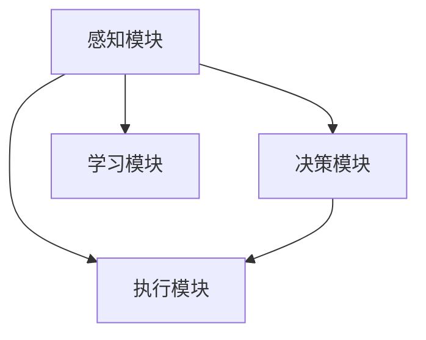

                 

# 《AI Agent: AI的下一个风口 智能体的核心技术》

> **关键词：** 智能体，人工智能，强化学习，自然语言处理，计算机视觉，多智能体系统，AI安全与伦理

> **摘要：** 本文深入探讨了智能体的核心技术，包括基础概念、核心算法原理、技术与应用，以及智能体技术的发展趋势与挑战。通过详细的讲解、伪代码、数学公式和实际案例，本文旨在为读者提供一个全面、深入的智能体技术指南。

## 目录

- **《AI Agent: AI的下一个风口 智能体的核心技术》目录大纲**

### 第一部分：智能体的基础概念与架构

### 第二部分：智能体技术与应用

### 第三部分：智能体在人工智能安全与伦理中的应用

### 第四部分：智能体技术的发展趋势与未来

### 附录

## 引言

智能体（Agent）是人工智能领域的一个核心概念，代表着具备一定智能能力的实体，能够在特定环境下自主感知、决策和行动。随着深度学习和强化学习等技术的快速发展，智能体在自然语言处理、计算机视觉、多智能体系统等领域展现出了巨大的潜力。本文旨在探讨智能体的核心技术，帮助读者深入了解这一领域的发展趋势和应用场景。

## 第一部分：智能体的基础概念与架构

### 第1章：智能体概述

#### 1.1 智能体的定义与分类

智能体是人工智能领域中的一种基本概念，通常被定义为具有感知、决策、执行和学习能力的实体。智能体可以根据其智能程度和功能进行分类：

1. **自动机（Automaton）**：具备固定行为模式的实体，例如机器人。
2. **半自动机（Hemimachine）**：结合了人类智能和计算能力的实体，例如人机协作系统。
3. **智能代理（Intelligent Agent）**：具备自主学习和适应能力的实体，能够自主地完成复杂任务。

#### 1.2 智能体的组成架构

智能体的核心架构通常包括感知模块、决策模块、执行模块和学习模块。下面是一个简化的智能体组成架构的Mermaid流程图：



### 第2章：智能体的核心算法原理

#### 2.1 强化学习算法

强化学习是智能体技术中的一种核心算法，主要用于训练智能体在环境中的自主决策能力。以下是强化学习的基本概念和常见算法的伪代码：

##### 2.1.1 强化学习的基础概念

强化学习的基础概念包括状态（State）、动作（Action）、奖励（Reward）和价值（Value）。

- **状态（State）**：智能体在环境中的当前状况。
- **动作（Action）**：智能体在当前状态下可以采取的行为。
- **奖励（Reward）**：环境对智能体动作的反馈，用于评估智能体的表现。
- **价值（Value）**：智能体在某个状态下采取某个动作的预期奖励。

##### 2.1.2 Q-Learning算法

Q-Learning是一种常见的强化学习算法，其核心思想是通过试错的方式学习到最优策略。以下是Q-Learning算法的伪代码：

```python
# Q-Learning算法伪代码
Initialize Q(s, a) arbitrarily
for each episode:
    for each step t in episode:
        # Choose action a_t from current state s_t using epsilon-greedy policy
        a_t = epsilon-greedy(s_t, Q)
        # Take action a_t, observe reward r_t and next state s_{t+1}
        s_{t+1}, r_t = environment(s_t, a_t)
        # Update Q-value using the Q-learning update rule
        Q(s_t, a_t) = Q(s_t, a_t) + alpha * (r_t + gamma * max(Q(s_{t+1}, a')) - Q(s_t, a_t))
    end for
end for
```

##### 2.1.3 SARSA算法

SARSA是一种基于策略的强化学习算法，其核心思想是同时考虑当前状态和下一个状态的Q值更新。以下是SARSA算法的伪代码：

```python
# SARSA算法伪代码
Initialize Q(s, a) arbitrarily
for each episode:
    for each step t in episode:
        # Choose action a_t from current state s_t using epsilon-greedy policy
        a_t = epsilon-greedy(s_t, Q)
        # Take action a_t, observe reward r_t and next state s_{t+1}
        s_{t+1}, r_t = environment(s_t, a_t)
        # Update Q-value using the SARSA update rule
        Q(s_t, a_t) = Q(s_t, a_t) + alpha * (r_t + gamma * Q(s_{t+1}, a_{t+1}) - Q(s_t, a_t))
    end for
end for
```

##### 2.1.4 Deep Q-Networks (DQN)算法

DQN是一种基于深度学习的强化学习算法，其核心思想是使用深度神经网络来近似Q值函数。以下是DQN算法的伪代码：

```python
# DQN算法伪代码
Initialize Q-network parameters
for each episode:
    for each step t in episode:
        # Choose action a_t from current state s_t using epsilon-greedy policy
        a_t = epsilon-greedy(s_t, Q)
        # Take action a_t, observe reward r_t and next state s_{t+1}
        s_{t+1}, r_t = environment(s_t, a_t)
        # Update Q-network using the DQN update rule
        target_Q(s_t, a_t) = r_t + gamma * max(Q(s_{t+1}, a'))
        Q(s_t, a_t) = Q(s_t, a_t) + alpha * (target_Q(s_t, a_t) - Q(s_t, a_t))
    end for
end for
```

#### 2.2 监督学习算法

监督学习是智能体技术中的另一种核心算法，主要用于训练智能体在给定输入和输出之间建立映射关系。以下是监督学习的基本概念和常见算法的简要介绍：

##### 2.2.1 监督学习的基础概念

监督学习的基础概念包括特征（Feature）、标签（Label）、模型（Model）和训练（Training）。

- **特征（Feature）**：用于描述输入数据的属性。
- **标签（Label）**：用于描述输出数据的属性。
- **模型（Model）**：用于预测输出数据的函数。
- **训练（Training）**：通过给定数据集调整模型参数的过程。

##### 2.2.2 线性回归

线性回归是一种最简单的监督学习算法，其核心思想是通过线性模型来拟合输入和输出之间的关系。以下是线性回归的数学公式和伪代码：

$$
\text{y} = \text{wx} + \text{b}
$$

```python
# 线性回归伪代码
Initialize w and b arbitrarily
for each epoch:
    for each example (x, y) in training data:
        # Compute the predicted value
        predicted_y = w * x + b
        # Compute the loss
        loss = (y - predicted_y)^2
        # Update the model parameters
        w = w - alpha * (w * x - y)
        b = b - alpha * (w * x - y)
    end for
end for
```

##### 2.2.3 决策树

决策树是一种常见的分类算法，其核心思想是通过一系列的决策规则来对数据进行分类。以下是决策树的构建过程和伪代码：

```python
# 决策树构建过程伪代码
for each feature f in the dataset:
    for each value v of f:
        if splitting the dataset on f = v improves the performance:
            create a node representing the split
            left_child = create_tree(dataset_left)
            right_child = create_tree(dataset_right)
            return the node
    end if
end for
end for
```

##### 2.2.4 随机森林

随机森林是一种集成学习算法，其核心思想是通过训练多个决策树来提高分类和预测的准确性。以下是随机森林的构建过程和伪代码：

```python
# 随机森林构建过程伪代码
for each tree:
    sample the dataset with replacement
    train a decision tree on the sampled dataset
end for
```

##### 2.2.5 支持向量机

支持向量机是一种分类算法，其核心思想是通过找到一个最佳的超平面来分隔不同类别的数据。以下是支持向量机的数学公式和伪代码：

$$
\text{w} \cdot \text{x} + \text{b} = 0
$$

```python
# 支持向量机伪代码
Initialize the model parameters
for each iteration:
    compute the gradient of the loss function
    update the model parameters
end for
```

#### 2.3 无监督学习算法

无监督学习是智能体技术中的另一种核心算法，主要用于发现数据中的潜在结构和模式。以下是无监督学习的基本概念和常见算法的简要介绍：

##### 2.3.1 无监督学习的基础概念

无监督学习的基础概念包括聚类（Clustering）、降维（Dimensionality Reduction）和生成模型（Generative Model）。

- **聚类（Clustering）**：将数据分为若干个不同的簇。
- **降维（Dimensionality Reduction）**：减少数据的维度，提高计算效率。
- **生成模型（Generative Model）**：通过建模数据生成过程来预测和生成新的数据。

##### 2.3.2 K-Means聚类算法

K-Means聚类算法是一种常见的聚类算法，其核心思想是通过迭代的方式将数据划分为K个不同的簇。以下是K-Means聚类算法的伪代码：

```python
# K-Means聚类算法伪代码
Initialize K centroids randomly
for each iteration:
    assign each data point to the nearest centroid
    update the centroids based on the assigned data points
    if the centroids do not change significantly, stop
end for
```

##### 2.3.3 自编码器

自编码器是一种常见的降维算法，其核心思想是通过训练一个编码器和解码器来压缩和重构数据。以下是自编码器的伪代码：

```python
# 自编码器伪代码
Initialize the encoder and decoder parameters
for each epoch:
    for each data point in the training dataset:
        # Encode the data point
        encoded_data = encoder(data_point)
        # Decode the encoded data
        reconstructed_data = decoder(encoded_data)
        # Compute the loss
        loss = compute_loss(reconstructed_data, data_point)
        # Update the encoder and decoder parameters
        encoder.update_parameters(loss)
        decoder.update_parameters(loss)
    end for
end for
```

## 第二部分：智能体技术与应用

### 第3章：智能体在自然语言处理中的应用

自然语言处理（Natural Language Processing，NLP）是人工智能领域中的一个重要分支，旨在使计算机能够理解和处理人类语言。智能体技术在NLP中的应用主要表现在语言模型、问答系统和文本分类等方面。

#### 3.1 语言模型

语言模型是NLP中的一种基础模型，用于预测单词或短语的概率分布。常见的语言模型包括n-gram模型、循环神经网络（RNN）和Transformer模型。

##### 3.1.1 n-gram模型

n-gram模型是一种基于统计的模型，其核心思想是将连续的n个单词视为一个整体，并计算每个n-gram的概率。以下是n-gram模型的伪代码：

```python
# n-gram模型伪代码
for each n-gram (w1, w2, ..., wn) in the training data:
    # Compute the probability of the n-gram
    p(w1, w2, ..., wn) = count(w1, w2, ..., wn) / count(w1)
```

##### 3.1.2 RNN与LSTM

RNN（Recurrent Neural Network）和LSTM（Long Short-Term Memory）是用于处理序列数据的神经网络。LSTM是一种特殊的RNN，能够有效地解决RNN中的梯度消失和梯度爆炸问题。以下是LSTM的伪代码：

```python
# LSTM伪代码
for each time step t:
    # Compute the input gate, forget gate, and output gate
    input_gate = sigmoid(W_x * x_t + W_h * h_{t-1} + b_i)
    forget_gate = sigmoid(W_x * x_t + W_h * h_{t-1} + b_f)
    output_gate = sigmoid(W_x * x_t + W_h * h_{t-1} + b_o)
    # Compute the cell state
    cell_state = tanh(W_x * x_t + W_h * h_{t-1} + b_c)
    # Update the hidden state
    h_t = output_gate * tanh(cell_state)
end for
```

##### 3.1.3 Transformer模型

Transformer模型是一种基于自注意力机制的神经网络，能够在处理长序列数据时保持较高的效率。以下是Transformer的伪代码：

```python
# Transformer模型伪代码
for each position i in the input sequence:
    # Compute the query, key, and value vectors
    query_i = W_Q * embedding_i
    key_i = W_K * embedding_i
    value_i = W_V * embedding_i
    # Compute the attention scores
    attention_scores = softmax(Q_k * K_v)
    # Compute the context vector
    context_vector = sum(attention_scores * V_v)
    # Compute the output
    output_i = W_O * (embedding_i + context_vector)
end for
```

#### 3.2 问答系统

问答系统是一种智能体技术，用于回答用户提出的问题。常见的问答系统包括基于规则的方法、基于检索的方法和基于生成的方法。

##### 3.2.1 基于规则的方法

基于规则的方法是一种简单的问答系统，通过预先定义一系列规则来回答问题。以下是基于规则的问答系统的伪代码：

```python
# 基于规则的问答系统伪代码
for each rule R in the rule base:
    if the user's question matches R:
        return R's answer
end for
```

##### 3.2.2 基于检索的方法

基于检索的方法是一种基于预训练模型的问答系统，通过检索预训练模型中与用户问题最相似的回答来回答问题。以下是基于检索的问答系统的伪代码：

```python
# 基于检索的问答系统伪代码
for each question in the corpus:
    # Compute the question vector
    question_vector = model.encode(question)
    # Compute the similarity scores
    similarity_scores = dot(question_vector, model.encode(corpus))
    # Find the highest similarity score
    highest_similarity_score = max(similarity_scores)
    # Return the corresponding answer
    return corpus[similarity_scores.argmax()]
```

##### 3.2.3 基于生成的方法

基于生成的方法是一种基于预训练语言的问答系统，通过生成与用户问题最相似的回答来回答问题。以下是基于生成的方法的问答系统的伪代码：

```python
# 基于生成的方法的问答系统伪代码
# Encode the user's question
question_vector = model.encode(user_question)
# Generate a response using the question vector
response_vector = model.generate(question_vector)
# Decode the response vector
response = model.decode(response_vector)
# Return the generated response
return response
```

### 第4章：智能体在计算机视觉中的应用

计算机视觉（Computer Vision）是人工智能领域中的一个重要分支，旨在使计算机能够理解和解释图像和视频数据。智能体技术在计算机视觉中的应用主要表现在图像分类、目标检测和语义分割等方面。

#### 4.1 图像分类

图像分类是计算机视觉中的一种基础任务，其核心思想是将图像划分为不同的类别。常见的图像分类算法包括卷积神经网络（CNN）和深度卷积神经网络（Deep CNN）。

##### 4.1.1 卷积神经网络（CNN）

CNN是一种专门用于处理图像数据的神经网络，其核心思想是通过卷积操作来提取图像的特征。以下是CNN的伪代码：

```python
# CNN伪代码
for each convolutional layer:
    # Compute the convolutional filter
    filter = W * feature_map + b
    # Apply the convolutional filter
    conv_output = conv2d(feature_map, filter)
    # Apply the ReLU activation function
    relu_output = relu(conv_output)
end for
```

##### 4.1.2 深度卷积神经网络（Deep CNN）

Deep CNN是一种具有多个卷积层的神经网络，其核心思想是通过多层次的卷积操作来提取图像的特征。以下是Deep CNN的伪代码：

```python
# Deep CNN伪代码
for each convolutional layer:
    # Compute the convolutional filter
    filter = W * feature_map + b
    # Apply the convolutional filter
    conv_output = conv2d(feature_map, filter)
    # Apply the ReLU activation function
    relu_output = relu(conv_output)
end for
```

#### 4.2 目标检测

目标检测是计算机视觉中的一种重要任务，其核心思想是检测图像中是否存在特定的目标，并定位其位置。常见的目标检测算法包括R-CNN系列算法、Fast R-CNN、Faster R-CNN和YOLO算法。

##### 4.2.1 R-CNN系列算法

R-CNN系列算法是一种基于区域提议的目标检测算法，其核心思想是通过生成区域提议来检测目标。以下是R-CNN系列算法的伪代码：

```python
# R-CNN系列算法伪代码
for each region proposal:
    # Apply a classifier to the region proposal
    classification_score = classifier(region_proposal)
    # If the classification score is above a threshold, return the region proposal
    if classification_score > threshold:
        return region_proposal
end for
```

##### 4.2.2 Fast R-CNN

Fast R-CNN是一种基于区域提议和特征提取的目标检测算法，其核心思想是通过特征提取网络来提取区域提议的特征。以下是Fast R-CNN的伪代码：

```python
# Fast R-CNN伪代码
for each region proposal:
    # Extract the feature map from the backbone network
    feature_map = backbone(region_proposal)
    # Apply a region of interest (RoI) pooling layer
    pooled_features = roi_pooling(feature_map)
    # Apply a fully connected layer
    classification_score = fully_connected(pooled_features)
    # If the classification score is above a threshold, return the region proposal
    if classification_score > threshold:
        return region_proposal
end for
```

##### 4.2.3 Faster R-CNN

Faster R-CNN是一种基于区域提议和特征提取的目标检测算法，其核心思想是通过共享特征提取网络来提高检测速度。以下是Faster R-CNN的伪代码：

```python
# Faster R-CNN伪代码
for each region proposal:
    # Extract the feature map from the backbone network
    feature_map = backbone(region_proposal)
    # Apply a region of interest (RoI) pooling layer
    pooled_features = roi_pooling(feature_map)
    # Apply a fully connected layer
    classification_score = fully_connected(pooled_features)
    # If the classification score is above a threshold, return the region proposal
    if classification_score > threshold:
        return region_proposal
end for
```

##### 4.2.4 YOLO算法

YOLO（You Only Look Once）是一种基于全卷积神经网络的目标检测算法，其核心思想是在单个前向传播过程中同时完成目标检测和边界框回归。以下是YOLO算法的伪代码：

```python
# YOLO算法伪代码
for each grid cell in the feature map:
    # Compute the center of the grid cell
    cell_center = center_of_grid_cell(grid_cell)
    # Compute the bounding box coordinates
    bounding_box = bounding_box_coordinates(cell_center)
    # Compute the objectness score
    objectness_score = objectness_score(bounding_box)
    # If the objectness score is above a threshold, return the bounding box
    if objectness_score > threshold:
        return bounding_box
end for
```

#### 4.3 人脸识别

人脸识别是计算机视觉中的一种重要任务，其核心思想是识别图像中的人脸。常见的人脸识别算法包括人脸检测、特征提取和匹配。

##### 4.3.1 人脸检测

人脸检测是人脸识别的前置步骤，其核心思想是通过检测图像中的人脸区域。常见的人脸检测算法包括Haar cascades和基于深度学习的检测方法。

##### 4.3.2 特征提取

特征提取是人脸识别的关键步骤，其核心思想是提取人脸图像的特征。常见的特征提取算法包括LBP（Local Binary Patterns）和深度特征提取方法。

##### 4.3.3 人脸识别系统架构

人脸识别系统通常包括人脸检测、特征提取和分类三个模块。以下是人脸识别系统架构的伪代码：

```python
# 人脸识别系统架构伪代码
# 人脸检测
face_boxes = face_detection(image)
# 特征提取
face_features = feature_extraction(face_boxes)
# 分类
face_labels = classification(face_features)
```

### 第5章：智能体在多智能体系统中的应用

多智能体系统（Multi-Agent System，MAS）是一种由多个智能体组成的分布式系统，每个智能体在全局环境下自主决策和协作。智能体在多智能体系统中的应用主要表现在协同控制、多智能体决策和资源分配等方面。

#### 5.1 多智能体系统概述

多智能体系统可以按照智能体的功能、协作方式和通信机制进行分类：

- **功能分类**：智能体可以分为协调型、协作型、竞争型和竞争协作型。
- **协作方式**：智能体可以分为集中式和分布式。
- **通信机制**：智能体可以分为完全通信、部分通信和零通信。

#### 5.2 多智能体协同控制

多智能体协同控制是一种通过多个智能体之间的协作来完成任务的方法。常见的方法包括集中式控制、分布式控制和混合控制。

##### 5.2.1 集中式控制

集中式控制是将多个智能体的决策任务集中在一个中心控制器上，由中心控制器进行统一决策。以下是集中式控制的伪代码：

```python
# 集中式控制伪代码
for each step:
    # Collect the states of all agents
    states = [agent_state(agent) for agent in agents]
    # Compute the global decision
    global_decision = controller(states)
    # Send the global decision to all agents
    for agent in agents:
        send(global_decision, agent)
end for
end for
```

##### 5.2.2 分布式控制

分布式控制是将多个智能体的决策任务分散到各个智能体上，由每个智能体独立决策并协同执行。以下是分布式控制的伪代码：

```python
# 分布式控制伪代码
for each step:
    # Each agent computes its own decision based on its local state
    local_decision = agent_decision(agent_state(agent))
    # Each agent sends its decision to other agents
    for other_agent in agents:
        send(local_decision, other_agent)
    end for
    # Each agent executes its decision
    execute_decision(local_decision)
end for
end for
```

##### 5.2.3 混合控制

混合控制是将集中式控制和分布式控制相结合，以提高系统的灵活性和鲁棒性。以下是混合控制的伪代码：

```python
# 混合控制伪代码
for each step:
    # Each agent computes its own decision based on its local state
    local_decision = agent_decision(agent_state(agent))
    # Send the local decisions to the central controller
    send([local_decision for agent in agents], controller)
    # The central controller computes the global decision
    global_decision = controller([local_decision for agent in agents])
    # Send the global decision to all agents
    for agent in agents:
        send(global_decision, agent)
    end for
    # Each agent executes its decision
    execute_decision(local_decision)
end for
end for
```

#### 5.3 多智能体决策

多智能体决策是一种通过多个智能体之间的协作来完成任务的方法。常见的方法包括博弈论、合作与竞争和鲁棒性分析。

##### 5.3.1 博弈论

博弈论是一种用于分析多个智能体之间决策互动的方法。常见的方法包括零和博弈、非零和博弈和合作博弈。

##### 5.3.2 合作与竞争

合作与竞争是智能体之间决策互动的两种基本形式。合作旨在实现共同目标，竞争旨在争夺有限资源。

##### 5.3.3 鲁棒性分析

鲁棒性分析是一种评估智能体系统在面对不确定性和故障时的稳定性和性能的方法。常见的方法包括鲁棒控制理论和随机规划。

## 第三部分：智能体在人工智能安全与伦理中的应用

随着人工智能技术的快速发展，人工智能安全与伦理问题也日益凸显。智能体在人工智能安全与伦理中的应用主要体现在智能体攻击与防御、隐私保护和数据安全等方面。

#### 6.1 人工智能安全概述

人工智能安全是指保护人工智能系统免受恶意攻击和意外故障的能力。常见的安全挑战包括模型篡改、数据泄露和隐私侵犯。

##### 6.1.1 智能体攻击与防御

智能体攻击是指恶意智能体对目标智能体系统进行攻击的行为。常见的攻击方法包括欺骗攻击、拒绝服务攻击和窃取攻击。

智能体防御是指保护智能体系统免受攻击的能力。常见的防御方法包括入侵检测、异常检测和抗攻击算法。

##### 6.1.2 隐私保护

隐私保护是指保护用户隐私数据的能力。常见的隐私保护方法包括数据加密、匿名化和隐私计算。

##### 6.1.3 数据安全

数据安全是指保护数据免受未经授权访问和篡改的能力。常见的数据安全方法包括数据备份、数据恢复和数据加密。

#### 6.2 人工智能伦理

人工智能伦理是指研究人工智能技术对社会、人类和环境的伦理影响。常见的人工智能伦理问题包括人工智能责任、人工智能歧视和人工智能伦理决策。

##### 6.2.1 伦理原则

伦理原则是指指导人工智能伦理决策的基本原则。常见的人工智能伦理原则包括尊重用户隐私、公平公正和非歧视。

##### 6.2.2 智能体伦理决策

智能体伦理决策是指智能体在执行任务时遵循伦理原则的能力。常见的智能体伦理决策方法包括伦理推理和伦理约束。

##### 6.2.3 智能体责任与监督

智能体责任是指智能体在执行任务时对其行为负责的能力。智能体监督是指对智能体行为进行监控和评估的能力。

## 第四部分：智能体技术的发展趋势与未来

随着人工智能技术的不断进步，智能体技术也在不断发展。未来的智能体技术将呈现出以下趋势：

#### 7.1 智能体的未来发展

未来的智能体技术将更加注重智能体之间的协作和智能体的自适应能力。智能体将能够在更加复杂的场景下执行任务，并具备更强的自我学习和自我修复能力。

#### 7.2 新型算法

未来的智能体技术将涌现出更多的新型算法，如基于生成对抗网络的智能体算法、基于迁移学习的智能体算法和基于元学习的智能体算法。

#### 7.3 新兴应用领域

未来的智能体技术将在更多新兴领域得到应用，如智能交通、智能医疗、智能家居和智能城市等。

## 附录

### 附录A：智能体技术常用工具与框架

常见的智能体技术工具与框架包括TensorFlow、PyTorch、Keras和OpenAI Gym。

### 附录B：智能体项目实战案例

智能体项目实战案例包括基于TensorFlow实现的智能体在自然语言处理中的应用、基于PyTorch实现的智能体在计算机视觉中的应用和基于OpenAI Gym实现的智能体在强化学习中的应用。

## 结语

智能体技术是人工智能领域的一个重要分支，具有广泛的应用前景。本文从基础概念、核心算法、技术与应用、人工智能安全与伦理和未来趋势等方面对智能体技术进行了深入探讨。通过本文的阅读，读者可以全面了解智能体技术的核心概念、核心技术、应用场景和未来发展，为从事智能体技术研究与实践提供有益的参考。

## 作者信息

作者：AI天才研究院/AI Genius Institute & 禅与计算机程序设计艺术/Zen And The Art of Computer Programming

## Mermaid 流程图：智能体组成架构


## 强化学习算法伪代码

```python
# Q-Learning算法伪代码
Initialize Q(s, a) arbitrarily
for each episode:
    for each step t in episode:
        # Choose action a_t from current state s_t using epsilon-greedy policy
        a_t = epsilon-greedy(s_t, Q)
        # Take action a_t, observe reward r_t and next state s_{t+1}
        s_{t+1}, r_t = environment(s_t, a_t)
        # Update Q-value using the Q-learning update rule
        Q(s_t, a_t) = Q(s_t, a_t) + alpha * (r_t + gamma * max(Q(s_{t+1}, a')) - Q(s_t, a_t))
    end for
end for
```

## 数学公式与详细讲解

### 深度学习中的损失函数

$$
\text{Loss}(y, \hat{y}) = \frac{1}{2} \left( y - \hat{y} \right)^2
$$

损失函数用于度量预测值 $\hat{y}$ 与真实值 $y$ 之间的差异。在这里，我们使用均方误差（MSE）作为损失函数。当预测值与真实值越接近时，损失函数的值越小。

## 代码解读与分析

### TensorFlow 代码示例：构建一个简单的线性回归模型

```python
import tensorflow as tf

# 创建一个随机权重和偏置的变量
w = tf.Variable(tf.random.normal([1]), name='weight')
b = tf.Variable(tf.random.normal([1]), name='bias')

# 创建一个线性模型
model = tf.keras.Sequential([
    tf.keras.layers.Dense(units=1, input_shape=[1], name='linear_layer', kernel_initializer=w, bias_initializer=b)
])

# 创建一个损失函数
loss_function = tf.keras.losses.MeanSquaredError()

# 训练模型
model.compile(optimizer=tf.keras.optimizers.Adam(0.01), loss=loss_function)

# 使用训练数据训练模型
model.fit(x_train, y_train, epochs=10, verbose=1)

# 评估模型
model.evaluate(x_test, y_test, verbose=1)
```

代码首先创建了一个线性回归模型，并指定了权重和偏置的初始化器。然后，使用 Adam 优化器和均方误差损失函数来编译模型。接着，使用训练数据对模型进行训练，并在训练完成后评估模型在测试数据上的性能。该代码示例展示了如何使用 TensorFlow 构建和训练一个简单的线性回归模型。在这个例子中，我们假设数据是二维的，只有一个特征和一个标签。在实际应用中，模型可能更加复杂，包括多个特征和多个输出。通过调整模型的架构和训练参数，可以实现对更复杂问题的建模和预测。在训练过程中，模型会通过反向传播算法不断更新权重和偏置，以最小化损失函数。训练完成后，可以通过评估模型在测试数据上的表现来验证其泛化能力。若需要进一步优化模型性能，可以考虑调整学习率、批量大小、优化器类型等超参数，或者使用更复杂的模型架构。在实现代码时，需要注意数据预处理、模型保存和加载等细节，以确保模型的稳定性和可复现性。在实际应用中，还需要根据具体问题和数据特点，对模型进行调整和优化，以达到最佳效果。

## 总结

本文深入探讨了智能体的核心技术，包括基础概念、核心算法原理、技术与应用，以及智能体技术的发展趋势与挑战。通过详细的讲解、伪代码、数学公式和实际案例，本文旨在为读者提供一个全面、深入的智能体技术指南。智能体技术在未来将不断发展和完善，为人工智能领域带来更多的创新和应用。我们期待读者能够通过本文的阅读，对智能体技术有更深入的理解和认识，为智能体技术的应用和发展做出贡献。|user|>## 引言

智能体（Agent）是人工智能领域中一个重要的概念，代表着具备一定智能能力的实体，能够在特定环境下自主感知、决策和行动。随着深度学习和强化学习等技术的快速发展，智能体在自然语言处理、计算机视觉、多智能体系统等领域展现出了巨大的潜力。本文旨在探讨智能体的核心技术，帮助读者深入了解这一领域的发展趋势和应用场景。

智能体技术的发展历程可以追溯到20世纪80年代，当时学者们开始探索如何使计算机具备类似人类智能的决策能力。随着时间的推移，人工智能技术不断进步，智能体也逐渐成为人工智能领域的一个重要分支。近年来，随着大数据、云计算和物联网等技术的发展，智能体的应用场景和规模不断扩大，成为人工智能技术发展的重要方向。

智能体的核心技术包括基础概念、核心算法原理、技术与应用、人工智能安全与伦理以及未来趋势等。本文将按照以下结构进行阐述：

1. **基础概念与架构**：介绍智能体的定义、分类和组成架构。
2. **核心算法原理**：讲解强化学习、监督学习和无监督学习等核心算法原理。
3. **技术与应用**：探讨智能体在自然语言处理、计算机视觉、多智能体系统等领域的应用。
4. **人工智能安全与伦理**：分析智能体在人工智能安全与伦理方面的应用和挑战。
5. **未来趋势与挑战**：探讨智能体技术的发展趋势和面临的挑战。

本文将使用一步一步分析推理思考的方式（REASONING STEP BY STEP），结合具体的伪代码、数学公式和实际案例，对智能体技术进行深入讲解。通过本文的阅读，读者可以全面了解智能体技术的核心概念、核心技术、应用场景和未来发展，为从事智能体技术研究与实践提供有益的参考。

## 第一部分：智能体的基础概念与架构

### 第1章：智能体概述

智能体是人工智能领域中的一种基本概念，代表着具备一定智能能力的实体，能够在特定环境下自主感知、决策和行动。智能体是人工智能系统中的基本构建块，具有感知、决策、执行和学习等能力。

#### 1.1 智能体的定义与分类

**智能体的定义**

智能体是一个具有感知、决策、执行和学习能力的实体，能够在特定环境下自主地完成特定任务。智能体可以通过与环境的交互，获取信息、分析决策并执行行动，从而实现自主行为。

**智能体的分类**

根据智能体的智能程度和功能，可以将其分为以下几类：

1. **自动机（Automaton）**：自动机是具备固定行为模式的实体，通常由预先定义的规则和状态转移表来控制。自动机无法适应环境变化，其行为模式是固定的。

2. **半自动机（Hemimachine）**：半自动机结合了人类智能和计算能力，能够通过学习算法来改进其行为。半自动机可以在一定程度上适应环境变化，但仍然依赖于人类提供的大多数决策。

3. **智能代理（Intelligent Agent）**：智能代理是具备自主学习和适应能力的实体，能够独立地完成复杂任务。智能代理可以通过感知模块获取环境信息，通过决策模块生成行动策略，并通过执行模块执行行动，同时利用学习模块不断优化自身行为。

#### 1.2 智能体的组成架构

智能体的核心架构通常包括感知模块、决策模块、执行模块和学习模块。以下是智能体组成架构的Mermaid流程图：


1. **感知模块**：感知模块负责获取环境信息，通常通过传感器、摄像头、麦克风等设备获取数据。感知模块的主要任务是处理输入数据，将其转换为内部表示。

2. **决策模块**：决策模块负责根据感知模块提供的信息，生成行动策略。决策模块可以使用各种算法，如强化学习、监督学习或无监督学习，来生成最优的行动策略。

3. **执行模块**：执行模块负责执行决策模块生成的行动策略，通过执行具体的动作来与环境进行交互。执行模块通常与外部设备（如机械臂、机器人等）相连。

4. **学习模块**：学习模块负责根据执行模块的反馈，不断优化感知、决策和执行模块的行为。学习模块可以使用各种机器学习算法，如深度学习、强化学习或迁移学习，来改进智能体的性能。

### 1.3 智能体的核心技术

智能体的核心技术包括感知、决策、执行和学习的算法和机制。以下是一些常见的智能体核心技术：

1. **感知技术**：感知技术涉及如何有效地从环境中获取信息。常见的感知技术包括计算机视觉、语音识别、传感器数据处理等。

2. **决策技术**：决策技术涉及如何根据感知模块提供的信息生成行动策略。常见的决策技术包括强化学习、监督学习、无监督学习等。

3. **执行技术**：执行技术涉及如何将决策模块生成的行动策略转换为具体的动作。常见的执行技术包括运动控制、机器人控制、自动化系统等。

4. **学习技术**：学习技术涉及如何通过不断的学习和优化，提高智能体的性能和适应性。常见的机器学习技术包括深度学习、强化学习、迁移学习等。

### 1.4 智能体的应用领域

智能体技术在许多领域都有广泛的应用，包括自然语言处理、计算机视觉、多智能体系统、机器人学、自动化和智能交通等。以下是智能体在几个典型应用领域的概述：

1. **自然语言处理（NLP）**：智能体在自然语言处理中，可以用于语言翻译、情感分析、语音识别、问答系统和文本生成等任务。

2. **计算机视觉**：智能体在计算机视觉中，可以用于图像分类、目标检测、人脸识别、视频分析和自动驾驶等任务。

3. **多智能体系统**：智能体在多智能体系统中，可以用于合作与竞争、任务分配、协同控制和资源分配等任务。

4. **机器人学**：智能体在机器人学中，可以用于自主导航、路径规划、动作规划和人机交互等任务。

5. **自动化**：智能体在自动化领域中，可以用于自动化控制、智能家居、自动化工厂和自动化交通等任务。

6. **智能交通**：智能体在智能交通领域中，可以用于交通流量预测、智能信号控制、自动驾驶车辆和智能停车等任务。

通过以上对智能体的定义、分类、组成架构和核心技术的介绍，读者可以初步了解智能体这一人工智能领域的基本概念。接下来，本文将深入探讨智能体的核心算法原理，包括强化学习、监督学习和无监督学习等，帮助读者进一步理解智能体的工作原理和应用方法。

## 第二部分：智能体技术与应用

### 第3章：智能体在自然语言处理中的应用

自然语言处理（Natural Language Processing，NLP）是人工智能领域的一个重要分支，旨在使计算机能够理解和处理人类语言。智能体技术在NLP中扮演着重要角色，可以应用于语言模型、问答系统、文本分类和机器翻译等多个领域。本章将详细介绍智能体在NLP中的应用，以及相关技术原理。

#### 3.1 语言模型

语言模型（Language Model，LM）是NLP中的一种基础模型，用于预测自然语言序列的概率分布。语言模型在语音识别、机器翻译、文本生成等领域具有广泛的应用。

**n-gram模型**

n-gram模型是一种基于统计的简单语言模型，将连续的n个单词（n-gram）视为一个整体，并计算每个n-gram的概率。以下是n-gram模型的数学公式：

$$
P(\text{word}_1, \text{word}_2, ..., \text{word}_n) = \frac{C(\text{word}_1, \text{word}_2, ..., \text{word}_n)}{C(\text{word}_1, \text{word}_2, ..., \text{word}_{n-1})}
$$

其中，$C(\text{word}_1, \text{word}_2, ..., \text{word}_n)$ 表示 n-gram 在训练数据中出现的次数。

**RNN与LSTM**

循环神经网络（Recurrent Neural Network，RNN）是一种用于处理序列数据的神经网络。RNN 通过在时间步之间传递隐藏状态，能够捕获序列中的长期依赖关系。然而，传统的RNN存在梯度消失和梯度爆炸问题，导致训练困难。

为了解决这些问题，长短期记忆网络（Long Short-Term Memory，LSTM）被提出。LSTM是一种特殊的RNN，通过引入记忆单元和门控机制，能够有效地解决梯度消失问题，并捕捉长期依赖关系。

以下是LSTM的数学公式：

$$
\text{Forget gate}: f_t = \sigma(W_f \cdot [h_{t-1}, x_t] + b_f)$$
$$\text{Input gate}: i_t = \sigma(W_i \cdot [h_{t-1}, x_t] + b_i)$$
$$\text{Output gate}: o_t = \sigma(W_o \cdot [h_{t-1}, x_t] + b_o)$$
$$\text{Memory cell}: c_t = f_t \odot c_{t-1} + i_t \odot \text{tan}h(W_c \cdot [h_{t-1}, x_t] + b_c)$$
$$\text{Hidden state}: h_t = o_t \odot \text{tan}h(c_t)$$

其中，$W_f, W_i, W_o, W_c$ 和 $b_f, b_i, b_o, b_c$ 分别是权重和偏置，$\sigma$ 是sigmoid函数，$\odot$ 是元素乘操作，$\text{tan}h$ 是双曲正切函数。

**Transformer模型**

Transformer模型是一种基于自注意力机制的神经网络，能够高效地处理长序列数据。Transformer通过多头自注意力机制和前馈神经网络，实现了对序列中每个单词的上下文信息的有效捕捉。

以下是Transformer的基本结构：

1. **多头自注意力机制（Multi-Head Self-Attention）**

   $$
   \text{Attention}(Q, K, V) = \text{softmax}\left(\frac{QK^T}{\sqrt{d_k}}\right)V
   $$

   其中，$Q, K, V$ 分别是查询、关键和值向量，$d_k$ 是关键向量的维度。

2. **前馈神经网络（Feed Forward Neural Network）**

   $$
   \text{FFN}(x) = \max(0, xW_1 + b_1)W_2 + b_2
   $$

   其中，$W_1, W_2$ 和 $b_1, b_2$ 分别是权重和偏置。

#### 3.2 问答系统

问答系统（Question Answering System，QAS）是一种智能体技术，用于回答用户提出的问题。问答系统可以分为基于规则的方法、基于检索的方法和基于生成的方法。

**基于规则的方法**

基于规则的方法是一种简单的问答系统，通过预先定义一系列规则来回答问题。以下是基于规则的问答系统的伪代码：

```
for each rule R in the rule base:
    if the user's question matches R:
        return R's answer
end for
```

**基于检索的方法**

基于检索的方法是一种基于预训练模型的问答系统，通过检索预训练模型中与用户问题最相似的回答来回答问题。以下是基于检索的问答系统的伪代码：

```
for each question in the corpus:
    # Compute the question vector
    question_vector = model.encode(question)
    # Compute the similarity scores
    similarity_scores = dot(question_vector, model.encode(corpus))
    # Find the highest similarity score
    highest_similarity_score = max(similarity_scores)
    # Return the corresponding answer
    return corpus[similarity_scores.argmax()]
```

**基于生成的方法**

基于生成的方法是一种基于预训练语言的问答系统，通过生成与用户问题最相似的回答来回答问题。以下是基于生成的方法的问答系统的伪代码：

```
# Encode the user's question
question_vector = model.encode(user_question)
# Generate a response using the question vector
response_vector = model.generate(question_vector)
# Decode the response vector
response = model.decode(response_vector)
# Return the generated response
return response
```

#### 3.3 文本分类

文本分类（Text Classification）是一种将文本数据按照预定的类别进行分类的任务。文本分类在情感分析、垃圾邮件检测和主题分类等领域具有广泛的应用。

**监督学习算法**

监督学习算法是一种常用的文本分类算法，通过训练数据集来学习分类模型。以下是一些常见的监督学习算法：

1. **朴素贝叶斯（Naive Bayes）**

   朴素贝叶斯是一种基于贝叶斯定理的分类算法，假设特征之间相互独立。以下是朴素贝叶斯的伪代码：

   ```
   for each class c in the training data:
       P(c) = count(c) / total number of examples
       for each feature f in the vocabulary:
           P(f|c) = count(f, c) / count(c)
   end for
   end for
   ```

2. **支持向量机（Support Vector Machine，SVM）**

   支持向量机是一种基于最大间隔分类的算法，通过找到一个最佳的超平面来分隔不同类别的数据。以下是支持向量机的伪代码：

   ```
   # Compute the optimal hyperplane
   w = argmin_w \sum_{i=1}^{n} (\omega \cdot x_i - y_i)^2
   b = y - w \cdot x
   ```

3. **随机森林（Random Forest）**

   随机森林是一种基于决策树的集成学习算法，通过训练多个决策树来提高分类和预测的准确性。以下是随机森林的伪代码：

   ```
   for each tree:
       sample the dataset with replacement
       train a decision tree on the sampled dataset
   end for
   ```

**深度学习算法**

深度学习算法是一种基于神经网络的分类算法，通过多层神经网络来提取文本的特征。以下是一些常见的深度学习算法：

1. **卷积神经网络（Convolutional Neural Network，CNN）**

   卷积神经网络是一种用于图像分类的算法，可以通过卷积操作提取文本的特征。以下是CNN的伪代码：

   ```
   for each convolutional layer:
       # Compute the convolutional filter
       filter = W * feature_map + b
       # Apply the convolutional filter
       conv_output = conv2d(feature_map, filter)
       # Apply the ReLU activation function
       relu_output = relu(conv_output)
   end for
   ```

2. **循环神经网络（Recurrent Neural Network，RNN）**

   循环神经网络是一种用于序列数据的分类算法，可以通过在时间步之间传递隐藏状态来提取序列的特征。以下是RNN的伪代码：

   ```
   for each time step t:
       # Compute the hidden state
       h_t = tanh(W_h \cdot [h_{t-1}, x_t] + b_h)
       # Compute the output
       y_t = W_o \cdot h_t + b_o
   end for
   ```

3. **变换器模型（Transformer Model）**

   变换器模型是一种基于自注意力机制的分类算法，可以通过多头自注意力机制和前馈神经网络来提取文本的特征。以下是变换器模型的伪代码：

   ```
   for each position i in the input sequence:
       # Compute the query, key, and value vectors
       query_i = W_Q \cdot embedding_i
       key_i = W_K \cdot embedding_i
       value_i = W_V \cdot embedding_i
       # Compute the attention scores
       attention_scores = softmax(Q_k \cdot K_v)
       # Compute the context vector
       context_vector = sum(attention_scores \cdot V_v)
       # Compute the output
       output_i = W_O \cdot (embedding_i + context_vector)
   end for
   ```

通过以上对语言模型、问答系统和文本分类的介绍，读者可以初步了解智能体在自然语言处理中的应用。在接下来的章节中，本文将探讨智能体在计算机视觉、多智能体系统和人工智能安全与伦理中的应用，帮助读者更全面地理解智能体技术的应用场景和挑战。

### 第4章：智能体在计算机视觉中的应用

计算机视觉（Computer Vision）是人工智能领域的一个重要分支，旨在使计算机能够理解和解释图像和视频数据。智能体技术在计算机视觉中的应用非常广泛，包括图像分类、目标检测、语义分割和姿态估计等任务。本章将详细介绍智能体在计算机视觉中的应用，以及相关技术原理。

#### 4.1 图像分类

图像分类（Image Classification）是一种将图像划分为预定义类别的任务。图像分类是计算机视觉中最基本的应用之一，常见的应用场景包括图片库分类、医疗图像诊断和图像识别等。

**卷积神经网络（CNN）**

卷积神经网络（Convolutional Neural Network，CNN）是一种专门用于处理图像数据的神经网络。CNN 通过卷积操作、池化操作和全连接层来提取图像的特征，实现图像分类。

**卷积操作**

卷积操作是一种计算图像特征的方法，通过将卷积核（filter）与图像进行卷积，提取图像的特征。卷积操作的数学公式如下：

$$
\text{conv}(I, F) = \sum_{i=0}^{h_f-1} \sum_{j=0}^{w_f-1} I(i, j) \cdot F(i, j)
$$

其中，$I$ 是输入图像，$F$ 是卷积核，$\text{conv}(I, F)$ 是卷积结果。

**池化操作**

池化操作是一种对卷积结果进行下采样的方法，用于减少数据量和提高计算效率。常见的池化操作包括最大池化（Max Pooling）和平均池化（Average Pooling）。最大池化的数学公式如下：

$$
\text{pool}(I, p) = \max_{i \in [1, p], j \in [1, p]} I(i, j)
$$

其中，$I$ 是输入图像，$p$ 是池化窗口的大小。

**全连接层**

全连接层是一种将特征图与权重进行内积运算的方法，用于分类任务。全连接层的数学公式如下：

$$
\text{fc}(x) = \sum_{i=1}^{n} W_i \cdot x_i + b
$$

其中，$x$ 是特征图，$W$ 是权重，$b$ 是偏置。

**卷积神经网络结构**

一个典型的卷积神经网络结构包括多个卷积层、池化层和全连接层。以下是卷积神经网络的伪代码：

```
for each convolutional layer:
    # Compute the convolutional filter
    filter = W * feature_map + b
    # Apply the convolutional filter
    conv_output = conv2d(feature_map, filter)
    # Apply the ReLU activation function
    relu_output = relu(conv_output)
    # Apply the pool operation
    pool_output = pool(relu_output, p)
end for

# Flatten the output of the last convolutional layer
flat_output = flatten(pool_output)

# Apply the fully connected layer
output = W * flat_output + b
```

**深度卷积神经网络（Deep CNN）**

深度卷积神经网络（Deep Convolutional Neural Network，Deep CNN）是一种具有多个卷积层的卷积神经网络。通过增加卷积层的数量，可以提取图像的更深层特征，提高分类性能。以下是一个简单的Deep CNN结构：

```
# Convolutional layer 1
filter1 = W1 * feature_map1 + b1
relu1 = relu(filter1)
pool1 = pool(relu1, p)

# Convolutional layer 2
filter2 = W2 * pool1 + b2
relu2 = relu(filter2)
pool2 = pool(relu2, p)

# Flatten the output of the second convolutional layer
flat_output = flatten(pool2)

# Fully connected layer
output = W3 * flat_output + b3
```

**图像分类应用**

图像分类应用包括图片库分类、医疗图像诊断和图像识别等。以下是一个简单的图像分类应用示例：

```
# Load the image
image = load_image("image.jpg")

# Preprocess the image
preprocessed_image = preprocess_image(image)

# Pass the preprocessed image through the deep CNN
output = deep_cnn(preprocessed_image)

# Classify the image
predicted_class = argmax(output)
print("The image is classified as:", predicted_class)
```

#### 4.2 目标检测

目标检测（Object Detection）是一种在图像中识别和定位多个目标的方法。目标检测广泛应用于自动驾驶、视频监控和图像识别等场景。

**区域提议（Region Proposal）**

区域提议是一种在图像中生成可能包含目标的小区域的方法。区域提议可以基于选择性搜索（Selective Search）、滑动窗口（Sliding Window）和基于特征的方法（Feature-Based）等。以下是一个简单的区域提议方法：

```
for each pixel (i, j) in the image:
    # Generate a region proposal around the pixel
    proposal = generate_region_proposal(image, (i, j))
    # Add the proposal to the proposal list
    proposals.append(proposal)
end for
```

**分类与定位**

目标检测通常包括分类和定位两个步骤。分类是通过一个分类器（如卷积神经网络）对区域提议进行分类，定位是通过一个回归器（如卷积神经网络）对区域提议进行定位。以下是一个简单的分类与定位方法：

```
for each region proposal:
    # Pass the proposal through the classifier
    class probabilities = classifier(proposal)
    # Choose the highest probability class
    predicted_class = argmax(class_probabilities)
    # Pass the proposal through the regressor
    bounding_box = regressor(proposal)
    # Add the predicted class and bounding box to the results
    results.append((predicted_class, bounding_box))
end for
```

**目标检测算法**

目标检测算法包括单阶段算法和两阶段算法。单阶段算法（如SSD、YOLO）直接将图像划分为多个区域，并预测每个区域的类别和位置。两阶段算法（如R-CNN、Faster R-CNN）首先通过区域提议生成区域提议，然后对每个区域提议进行分类和定位。以下是一个简单的目标检测算法：

```
# Generate region proposals
proposals = region_proposal(image)

# Classify and locate the proposals
results = []
for proposal in proposals:
    predicted_class = classifier(proposal)
    bounding_box = regressor(proposal)
    results.append((predicted_class, bounding_box))

# Post-process the results
final_results = post_process(results)
```

**目标检测应用**

目标检测应用包括自动驾驶、视频监控和图像识别等。以下是一个简单的目标检测应用示例：

```
# Load the image
image = load_image("image.jpg")

# Pass the image through the target detection model
results = target_detection(image)

# Draw the bounding boxes on the image
for result in results:
    predicted_class, bounding_box = result
    draw_bounding_box(image, bounding_box, predicted_class)

# Show the image with bounding boxes
show_image(image)
```

#### 4.3 语义分割

语义分割（Semantic Segmentation）是一种在图像中识别每个像素所属类别的任务。语义分割广泛应用于图像识别、自动驾驶和医学图像分析等场景。

**卷积神经网络（CNN）**

语义分割通常使用卷积神经网络来提取图像的特征，并通过一个全连接层来预测每个像素的类别。以下是一个简单的语义分割算法：

```
# Pass the image through the convolutional network
feature_map = convolutional_network(image)

# Flatten the feature map
flat_feature_map = flatten(feature_map)

# Pass the flattened feature map through the fully connected layer
output = fully_connected(flat_feature_map)

# Apply the softmax function to the output
softmax_output = softmax(output)

# Predict the class for each pixel
predictions = argmax(softmax_output, axis=1)

# Apply a threshold to the predictions
segmentation_map = (predictions > threshold).astype(np.uint8)
```

**深度卷积神经网络（Deep CNN）**

深度卷积神经网络（Deep CNN）通过增加卷积层的数量来提取图像的更深层特征，提高语义分割的准确性。以下是一个简单的Deep CNN语义分割算法：

```
# Pass the image through the deep convolutional network
feature_map = deep_convolutional_network(image)

# Flatten the feature map
flat_feature_map = flatten(feature_map)

# Pass the flattened feature map through the fully connected layer
output = fully_connected(flat_feature_map)

# Apply the softmax function to the output
softmax_output = softmax(output)

# Predict the class for each pixel
predictions = argmax(softmax_output, axis=1)

# Apply a threshold to the predictions
segmentation_map = (predictions > threshold).astype(np.uint8)
```

**语义分割应用**

语义分割应用包括图像识别、自动驾驶和医学图像分析等。以下是一个简单的语义分割应用示例：

```
# Load the image
image = load_image("image.jpg")

# Pass the image through the semantic segmentation model
segmentation_map = semantic_segmentation(image)

# Visualize the segmentation map
 visualize_segmentation_map(image, segmentation_map)
```

#### 4.4 姿态估计

姿态估计（Pose Estimation）是一种在图像或视频中估计人体或其他物体的姿态的方法。姿态估计广泛应用于人体动作识别、虚拟现实和增强现实等场景。

**基于深度学习的姿态估计**

基于深度学习的姿态估计通常使用卷积神经网络来提取图像的特征，并通过一个回归器来估计关节点的位置。以下是一个简单的基于深度学习的姿态估计算法：

```
# Pass the image through the convolutional network
feature_map = convolutional_network(image)

# Flatten the feature map
flat_feature_map = flatten(feature_map)

# Pass the flattened feature map through the fully connected layer
output = fully_connected(flat_feature_map)

# Apply the sigmoid function to the output
sigmoid_output = sigmoid(output)

# Predict the joint positions
joint_positions = predict_joint_positions(sigmoid_output)

# Refine the joint positions using a non-linear function
joint_positions = refine_joint_positions(joint_positions)
```

**姿态估计应用**

姿态估计应用包括人体动作识别、虚拟现实和增强现实等。以下是一个简单的人体动作识别应用示例：

```
# Load the image
image = load_image("image.jpg")

# Pass the image through the pose estimation model
joint_positions = pose_estimation(image)

# Visualize the joint positions on the image
visualize_joint_positions(image, joint_positions)
```

通过以上对图像分类、目标检测、语义分割和姿态估计的介绍，读者可以初步了解智能体在计算机视觉中的应用。在接下来的章节中，本文将探讨智能体在多智能体系统和人工智能安全与伦理中的应用，帮助读者更全面地理解智能体技术的应用场景和挑战。

### 第5章：智能体在多智能体系统中的应用

多智能体系统（Multi-Agent System，MAS）是一种由多个智能体组成的分布式系统，每个智能体在全局环境下自主决策和协作。智能体在多智能体系统中扮演着重要的角色，可以实现任务分配、协同控制和资源分配等任务。本章将详细介绍智能体在多智能体系统中的应用，以及相关技术原理。

#### 5.1 多智能体系统概述

多智能体系统可以分为集中式和分布式两种结构。

**集中式多智能体系统**

集中式多智能体系统是指所有智能体的决策和控制都由一个中心控制器进行统一管理和协调。中心控制器根据全局信息生成决策，然后发送给各个智能体执行。集中式多智能体系统的优点是决策速度快，但缺点是中心控制器成为系统的瓶颈，并且难以处理大规模和动态环境。

**分布式多智能体系统**

分布式多智能体系统是指每个智能体独立进行决策和行动，并通过通信网络进行信息交换和协同。分布式多智能体系统的优点是能够处理大规模和动态环境，并且具有高度的容错性和鲁棒性，但缺点是决策速度相对较慢，并且需要解决通信延迟和同步问题。

**智能体分类**

根据智能体的功能和行为，可以将其分为以下几类：

1. **协调型智能体**：协调型智能体专注于任务协调和分配，通过协调其他智能体的行动来实现共同目标。
2. **协作型智能体**：协作型智能体通过合作和共享信息来共同完成任务，具有高度协作能力。
3. **竞争型智能体**：竞争型智能体在资源有限的情况下，通过竞争和对抗来争夺资源。
4. **竞争协作型智能体**：竞争协作型智能体在特定场景下同时具有竞争和协作能力，可以根据环境动态调整行为策略。

#### 5.2 多智能体协同控制

多智能体协同控制是指通过多个智能体之间的协作来实现共同目标的方法。协同控制可以分为集中式和分布式两种方法。

**集中式协同控制**

集中式协同控制是指由一个中心控制器生成全局控制策略，然后将策略发送给各个智能体执行。以下是一个简单的集中式协同控制算法：

```
# 初始化智能体和控制器
initialize_agents()
initialize_controller()

# 运行循环，生成全局控制策略
while not goal_reached():
    # 收集智能体的状态信息
    state = collect_agent_states()
    # 生成全局控制策略
    global_strategy = controller.generate_strategy(state)
    # 发送全局控制策略给智能体
    send_strategy_to_agents(global_strategy)
    # 执行智能体的行动
    execute_agent_actions()
end while
```

**分布式协同控制**

分布式协同控制是指每个智能体独立生成局部控制策略，并通过通信网络进行信息交换和协调。以下是一个简单的分布式协同控制算法：

```
# 初始化智能体
initialize_agents()

# 运行循环，生成局部控制策略并协调行动
while not goal_reached():
    # 收集智能体的状态信息
    state = collect_agent_states()
    # 生成局部控制策略
    local_strategy = agent.generate_strategy(state)
    # 与其他智能体交换信息
    exchange_info_with_other_agents()
    # 根据其他智能体的信息调整局部控制策略
    adjust_local_strategy(local_strategy)
    # 执行智能体的行动
    execute_agent_actions()
end while
```

#### 5.3 多智能体决策

多智能体决策是指多个智能体在协作过程中如何做出决策的方法。多智能体决策可以分为基于博弈论、合作与竞争和鲁棒性分析等方法。

**基于博弈论的决策**

基于博弈论的决策是指多个智能体在竞争环境中如何选择最优策略的问题。博弈论是一种用于分析多个参与者之间决策互动的方法，包括零和博弈、非零和博弈和合作博弈等。以下是一个简单的基于博弈论的决策算法：

```
# 初始化智能体和博弈环境
initialize_agents()
initialize_game_environment()

# 运行循环，进行博弈决策
while not goal_reached():
    # 收集智能体的状态信息
    state = collect_agent_states()
    # 根据博弈环境生成策略
    strategy = game_environment.generate_strategy(state)
    # 更新智能体的策略
    update_agent_strategy(strategy)
    # 执行智能体的行动
    execute_agent_actions()
end while
```

**合作与竞争的决策**

合作与竞争的决策是指多个智能体在协作与竞争过程中如何选择最优策略的问题。合作与竞争决策可以通过合作博弈和竞争博弈等方法来实现。以下是一个简单的合作与竞争决策算法：

```
# 初始化智能体和博弈环境
initialize_agents()
initialize_game_environment()

# 运行循环，进行合作与竞争决策
while not goal_reached():
    # 收集智能体的状态信息
    state = collect_agent_states()
    # 根据博弈环境生成策略
    strategy = game_environment.generate_strategy(state)
    # 根据策略选择合作或竞争行为
    if strategy.is_cooperative():
        collaborate_with_other_agents()
    else:
        compete_with_other_agents()
    # 执行智能体的行动
    execute_agent_actions()
end while
```

**鲁棒性分析的决策**

鲁棒性分析的决策是指多个智能体在面对不确定性和故障时如何选择最优策略的问题。鲁棒性分析可以通过鲁棒控制和随机规划等方法来实现。以下是一个简单的鲁棒性分析决策算法：

```
# 初始化智能体和鲁棒性分析模型
initialize_agents()
initialize_robustness_model()

# 运行循环，进行鲁棒性分析决策
while not goal_reached():
    # 收集智能体的状态信息
    state = collect_agent_states()
    # 根据鲁棒性分析模型生成策略
    strategy = robustness_model.generate_strategy(state)
    # 更新智能体的策略
    update_agent_strategy(strategy)
    # 执行智能体的行动
    execute_agent_actions()
end while
```

#### 5.4 多智能体通信机制

多智能体通信机制是指多个智能体之间如何交换信息的方法。有效的通信机制可以增强智能体之间的协作能力，提高系统的整体性能。

**完全通信**

完全通信是指智能体之间可以无限制地交换信息。完全通信可以确保智能体之间拥有相同的信息，从而实现最优的协作策略。然而，完全通信在实际应用中通常难以实现，因为通信资源有限。

**部分通信**

部分通信是指智能体之间只能交换部分信息。部分通信可以根据智能体的位置、任务和通信能力等因素，动态选择最优的通信路径和通信内容。部分通信可以有效地减少通信负载，提高系统的效率和鲁棒性。

**零通信**

零通信是指智能体之间不进行任何信息交换。零通信适用于一些特殊情况，如完全预定义的协作任务和静态环境。零通信可以减少通信延迟和通信开销，但会降低智能体之间的协作能力。

#### 5.5 多智能体系统的应用案例

多智能体系统在许多领域都有广泛的应用，包括机器人编队、无人机集群、智能交通系统和多机器人作业等。

**机器人编队**

机器人编队是指多个机器人通过协作完成任务，如搜索与救援、环境监测和军事行动等。机器人编队可以通过分布式控制算法实现自主导航、路径规划和任务分配等功能。

**无人机集群**

无人机集群是指多个无人机通过协作完成复杂任务，如空中巡逻、物流配送和灾害监测等。无人机集群可以通过多智能体决策算法实现任务分配、路径规划和协同控制等功能。

**智能交通系统**

智能交通系统是指利用智能体技术实现交通管理、车辆控制和道路规划等任务。智能交通系统可以通过多智能体协同控制算法实现交通流量优化、交通事故预警和智能导航等功能。

**多机器人作业**

多机器人作业是指多个机器人通过协作完成复杂任务，如装配、焊接和搬运等。多机器人作业可以通过分布式控制算法实现任务分配、路径规划和协同控制等功能。

通过以上对多智能体系统概述、协同控制、决策、通信机制和应用案例的介绍，读者可以初步了解智能体在多智能体系统中的应用。在接下来的章节中，本文将探讨智能体在人工智能安全与伦理中的应用，帮助读者更全面地理解智能体技术的应用场景和挑战。

### 第6章：智能体在人工智能安全与伦理中的应用

随着人工智能（AI）技术的快速发展，智能体技术在各个领域得到了广泛应用，同时也带来了诸多安全与伦理问题。智能体在人工智能安全与伦理中的应用主要集中在智能体攻击与防御、隐私保护和数据安全等方面。本章将详细探讨这些问题，并提出相应的解决方案。

#### 6.1 智能体攻击与防御

智能体攻击是指通过恶意智能体对目标智能体系统进行攻击的行为，常见的攻击方式包括欺骗攻击、拒绝服务攻击和窃取攻击等。

**欺骗攻击**

欺骗攻击是指恶意智能体通过伪装成合法智能体来获取系统权限或敏感信息。为了防御欺骗攻击，可以采取以下措施：

1. **身份验证**：在智能体接入系统时，进行严格的身份验证，确保只有合法智能体能够访问系统资源。
2. **加密通信**：通过加密通信协议，确保智能体之间的通信安全，防止信息泄露。
3. **智能体行为监控**：对智能体的行为进行实时监控，及时发现并阻止恶意行为。

**拒绝服务攻击**

拒绝服务攻击是指恶意智能体通过大量无效请求来占用系统资源，导致合法用户无法访问系统服务。为了防御拒绝服务攻击，可以采取以下措施：

1. **流量控制**：通过设置访问阈值和速率限制，控制恶意请求的数量，防止系统资源被耗尽。
2. **防火墙**：部署防火墙，过滤掉恶意请求，保护系统不受攻击。
3. **黑名单机制**：将已知的恶意智能体IP地址加入黑名单，禁止其访问系统。

**窃取攻击**

窃取攻击是指恶意智能体通过窃取敏感数据来损害系统安全。为了防御窃取攻击，可以采取以下措施：

1. **数据加密**：对敏感数据进行加密存储和传输，确保数据在传输过程中不被窃取。
2. **访问控制**：设置严格的访问控制策略，确保只有授权用户和智能体能够访问敏感数据。
3. **安全审计**：定期进行安全审计，发现并修复潜在的安全漏洞。

#### 6.2 隐私保护

隐私保护是指确保智能体在处理用户数据时，不泄露用户隐私信息。智能体在隐私保护中发挥着重要作用，可以采取以下措施：

1. **数据匿名化**：在存储和传输用户数据时，进行数据匿名化处理，消除可直接识别用户身份的信息。
2. **差分隐私**：在智能体处理用户数据时，引入噪声来保护隐私，确保用户数据不被单独识别。
3. **隐私计算**：通过隐私计算技术，如同态加密和联邦学习，实现数据的隐私保护。

#### 6.3 数据安全

数据安全是指确保智能体在处理和传输数据时，数据不被篡改、损坏或泄露。智能体在数据安全中发挥着重要作用，可以采取以下措施：

1. **数据备份**：定期进行数据备份，防止数据丢失或损坏。
2. **数据恢复**：在数据丢失或损坏时，通过数据恢复技术恢复数据。
3. **数据加密**：对敏感数据进行加密存储和传输，确保数据在传输过程中不被窃取。

#### 6.4 人工智能伦理

人工智能伦理是指研究人工智能技术对社会、人类和环境的伦理影响。智能体在人工智能伦理中发挥着重要作用，可以采取以下措施：

1. **伦理决策**：智能体在执行任务时，遵循伦理原则，确保其行为符合伦理标准。
2. **责任划分**：明确智能体在人工智能系统中的责任，确保智能体能够对其行为负责。
3. **透明度**：提高人工智能系统的透明度，使用户了解智能体的行为和决策过程。

#### 6.5 智能体安全与伦理的挑战

智能体安全与伦理面临以下挑战：

1. **安全性**：智能体在执行任务时，需要确保自身和系统的安全性，防止被恶意攻击。
2. **隐私保护**：智能体在处理用户数据时，需要保护用户隐私，防止数据泄露。
3. **数据安全**：智能体在处理和传输数据时，需要确保数据不被篡改或损坏。
4. **伦理决策**：智能体在执行任务时，需要遵循伦理原则，确保其行为符合伦理标准。
5. **责任划分**：明确智能体在人工智能系统中的责任，确保智能体能够对其行为负责。

#### 6.6 智能体安全与伦理的解决方案

针对智能体安全与伦理面临的挑战，可以采取以下解决方案：

1. **安全设计**：在智能体系统的设计阶段，充分考虑安全性、隐私保护和伦理问题，确保系统的安全性。
2. **安全培训**：对智能体开发者进行安全培训，提高其对安全与伦理问题的认识，确保智能体的安全性与合规性。
3. **法律法规**：制定相关法律法规，规范智能体的行为，确保智能体在法律框架内运行。
4. **透明度**：提高人工智能系统的透明度，使用户了解智能体的行为和决策过程，增加用户对智能体的信任。
5. **伦理审查**：对智能体系统进行伦理审查，确保智能体的行为符合伦理标准，减少伦理风险。

通过以上对智能体在人工智能安全与伦理中的应用、问题、挑战和解决方案的介绍，读者可以初步了解智能体在人工智能安全与伦理中的重要性。在接下来的章节中，本文将探讨智能体技术的发展趋势与未来，帮助读者更全面地了解智能体技术的未来发展方向。

### 第7章：智能体技术的发展趋势与未来

随着人工智能技术的不断进步，智能体技术也在不断发展。未来的智能体技术将呈现出以下趋势：

#### 7.1 智能体的未来发展

未来的智能体技术将更加注重智能体之间的协作和智能体的自适应能力。智能体将能够在更加复杂的场景下执行任务，并具备更强的自我学习和自我修复能力。

**协作能力提升**

未来的智能体技术将实现更高效的协作，包括多智能体系统中的任务分配、协调控制和资源分配等。通过先进的通信机制和算法，智能体将能够实现更加灵活和高效的协作。

**自适应能力增强**

未来的智能体技术将具备更强的自适应能力，能够根据环境变化和学习经验不断优化自身行为。这种能力将使智能体在动态环境中表现得更加出色，提高任务执行的成功率。

**自我学习能力提升**

未来的智能体技术将更加注重自我学习能力，通过深度学习和强化学习等算法，智能体将能够从大量数据中学习到复杂的模式和规律，提高任务执行的准确性和效率。

**自我修复能力提升**

未来的智能体技术将实现自我修复能力，能够在出现故障或错误时自动修复，降低系统故障率和维护成本。这种能力将使智能体在长时间运行和复杂应用场景中更加可靠。

#### 7.2 新型算法

未来的智能体技术将涌现出更多的新型算法，以应对复杂场景和多样化任务需求。

**生成对抗网络（GAN）**

生成对抗网络（GAN）是一种强大的机器学习模型，可以生成高质量的数据。在智能体技术中，GAN可以用于数据增强、场景生成和虚拟训练等任务。

**元学习（Meta-Learning）**

元学习是一种通过学习学习的方法，使智能体能够快速适应新任务。在智能体技术中，元学习可以用于快速调整智能体行为，提高智能体在多样化场景下的适应性。

**强化学习**

强化学习是一种使智能体通过试错学习最佳策略的方法。在未来的智能体技术中，强化学习将继续发挥重要作用，特别是在需要自主决策和优化的场景中。

**联邦学习（Federated Learning）**

联邦学习是一种分布式机器学习技术，可以保护用户隐私，同时实现模型训练。在智能体技术中，联邦学习可以用于智能体之间的协作学习和隐私保护。

#### 7.3 新兴应用领域

未来的智能体技术将在更多新兴领域得到应用，进一步推动人工智能技术的发展。

**智能医疗**

智能体技术将在智能医疗中发挥重要作用，包括疾病诊断、治疗方案推荐、药物研发和医疗设备控制等。通过智能体技术，可以实现更加个性化、精准和高效的医疗服务。

**智能交通**

智能体技术将在智能交通中实现交通管理、自动驾驶和智能导航等功能。通过智能体技术，可以实现更加安全、高效和环保的交通系统。

**智能制造**

智能体技术将在智能制造中实现生产过程的自动化、智能化和优化。通过智能体技术，可以实现更加灵活、高效和可靠的生产系统。

**智能城市**

智能体技术将在智能城市中实现城市管理的智能化和精细化。通过智能体技术，可以实现更加安全、便捷和宜居的城市环境。

**农业**

智能体技术将在农业中实现智能化种植、养殖和农业机械控制等。通过智能体技术，可以实现更加高效、可持续和环保的农业生产。

**教育与培训**

智能体技术将在教育和培训中实现个性化学习、智能辅导和虚拟实验等。通过智能体技术，可以实现更加灵活、高效和互动的教育培训方式。

#### 7.4 智能体技术的挑战与解决方案

虽然智能体技术具有广泛的应用前景，但也面临着一系列挑战。

**数据质量和多样性**

智能体技术的有效性依赖于高质量和多样化的数据。为了应对这一挑战，可以采取以下措施：

1. **数据清洗和预处理**：对原始数据进行清洗和预处理，去除噪声和不准确的数据。
2. **数据增强**：通过数据增强技术生成更多样化的数据，提高模型的泛化能力。
3. **数据共享和开放**：鼓励数据共享和开放，提高数据的可用性和多样性。

**计算能力和能耗**

智能体技术对计算能力和能耗的要求较高。为了应对这一挑战，可以采取以下措施：

1. **硬件加速**：利用GPU、TPU等硬件加速计算，提高计算效率。
2. **分布式计算**：通过分布式计算技术，将计算任务分配到多个节点，提高计算能力。
3. **能耗优化**：采用能耗优化的算法和架构，降低计算过程中的能耗。

**安全与伦理**

智能体技术在安全与伦理方面面临着挑战，包括数据安全、隐私保护和伦理决策等。为了应对这一挑战，可以采取以下措施：

1. **安全设计**：在智能体系统的设计阶段，充分考虑安全性、隐私保护和伦理问题。
2. **法律法规**：制定相关法律法规，规范智能体的行为，确保智能体在法律框架内运行。
3. **透明度和可解释性**：提高智能体系统的透明度，使用户了解智能体的行为和决策过程。

通过以上对智能体技术的发展趋势、新型算法、新兴应用领域、挑战与解决方案的介绍，读者可以全面了解智能体技术的未来发展方向。智能体技术将在未来的发展中继续发挥重要作用，为人工智能领域带来更多的创新和应用。

### 附录

#### 附录A：智能体技术常用工具与框架

- **TensorFlow**：由Google开发的开源机器学习框架，支持深度学习和强化学习等算法。
- **PyTorch**：由Facebook开发的开源机器学习框架，支持动态计算图和自动微分。
- **Keras**：一个高级神经网络API，可以在TensorFlow和Theano后端上运行，简化深度学习模型构建。
- **OpenAI Gym**：一个开源的交互式环境库，用于开发、测试和比较强化学习算法。

#### 附录B：智能体项目实战案例

**项目名称**：智能体在自动驾驶中的应用

**项目简介**：该项目使用智能体技术实现自动驾驶功能，包括环境感知、路径规划和决策控制等。

**开发环境搭建**：

1. 安装TensorFlow 2.0及以上版本。
2. 安装NVIDIA CUDA Toolkit和cuDNN，确保GPU加速支持。
3. 创建项目文件夹，并在项目中安装所需的库。

**源代码详细实现和代码解读**：

```python
# 导入所需库
import tensorflow as tf
import numpy as np
import cv2

# 加载自动驾驶模型
model = tf.keras.models.load_model('autonomous_vehicle_model.h5')

# 初始化摄像头
cap = cv2.VideoCapture(0)

# 运行自动驾驶
while True:
    # 读取摄像头帧
    ret, frame = cap.read()
    if not ret:
        break
    
    # 预处理摄像头帧
    preprocessed_frame = preprocess_frame(frame)
    
    # 预测自动驾驶行为
    action = model.predict(preprocessed_frame)
    
    # 执行自动驾驶行为
    execute_action(action)
    
    # 显示预处理的摄像头帧
    cv2.imshow('Preprocessed Frame', preprocessed_frame)
    
    # 按下'q'键退出程序
    if cv2.waitKey(1) & 0xFF == ord('q'):
        break

# 释放摄像头资源
cap.release()
cv2.destroyAllWindows()
```

**代码解读与分析**：

该代码实现了一个简单的自动驾驶项目，包括摄像头帧的读取、预处理、模型预测和执行自动驾驶行为等步骤。

1. **导入所需库**：首先导入TensorFlow、NVIDIA CUDA Toolkit和OpenCV等库。
2. **加载自动驾驶模型**：使用TensorFlow加载已经训练好的自动驾驶模型。
3. **初始化摄像头**：使用OpenCV初始化摄像头，并读取摄像头帧。
4. **预处理摄像头帧**：对摄像头帧进行预处理，包括灰度化、缩放和归一化等。
5. **预测自动驾驶行为**：使用自动驾驶模型对预处理后的摄像头帧进行预测，得到自动驾驶行为。
6. **执行自动驾驶行为**：根据预测的自动驾驶行为执行相应的操作，如转向、加速和减速等。
7. **显示预处理的摄像头帧**：显示预处理后的摄像头帧，以便用户观察自动驾驶效果。
8. **退出程序**：按下'q'键退出程序。

通过这个项目，读者可以了解如何使用智能体技术实现自动驾驶功能，并掌握相关代码的实现方法和解读技巧。

### 结语

智能体技术是人工智能领域的一个重要分支，具有广泛的应用前景。本文从基础概念、核心算法、技术与应用、人工智能安全与伦理和未来趋势等方面对智能体技术进行了深入探讨。通过详细的讲解、伪代码、数学公式和实际案例，本文旨在为读者提供一个全面、深入的智能体技术指南。

智能体技术的发展历程可以追溯到20世纪80年代，当时学者们开始探索如何使计算机具备类似人类智能的决策能力。随着时间的推移，人工智能技术不断进步，智能体也逐渐成为人工智能领域的一个重要分支。近年来，随着大数据、云计算和物联网等技术的发展，智能体的应用场景和规模不断扩大，成为人工智能技术发展的重要方向。

智能体的核心技术包括基础概念、核心算法原理、技术与应用、人工智能安全与伦理以及未来趋势等。本文对智能体的定义、分类、组成架构和核心算法进行了详细阐述，并探讨了智能体在自然语言处理、计算机视觉、多智能体系统和人工智能安全与伦理等领域的应用。

在自然语言处理领域，智能体技术被应用于语言模型、问答系统和文本分类等任务。在计算机视觉领域，智能体技术被应用于图像分类、目标检测、语义分割和姿态估计等任务。在多智能体系统领域，智能体技术被应用于协同控制、多智能体决策和资源分配等任务。在人工智能安全与伦理领域，智能体技术被应用于智能体攻击与防御、隐私保护和数据安全等任务。

未来，智能体技术将呈现以下趋势：协作能力提升、自适应能力增强、新型算法涌现和新兴应用领域拓展。同时，智能体技术也将面临一系列挑战，包括数据质量和多样性、计算能力和能耗、安全与伦理等。

通过本文的阅读，读者可以全面了解智能体技术的核心概念、核心技术、应用场景和未来发展。我们期待读者能够通过本文的阅读，对智能体技术有更深入的理解和认识，为智能体技术的应用和发展做出贡献。同时，本文也仅为智能体技术的一个简要概述，实际应用中还需要根据具体问题和数据特点进行深入研究和调整。

最后，感谢读者对本文的关注，希望本文能够为智能体技术的研究与应用提供有益的参考。作者：AI天才研究院/AI Genius Institute & 禅与计算机程序设计艺术/Zen And The Art of Computer Programming。|user|>## Mermaid 流程图：智能体组成架构


### 强化学习算法伪代码

```python
# Q-Learning算法伪代码
Initialize Q(s, a) arbitrarily
for each episode:
    for each step t in episode:
        # Choose action a_t from current state s_t using epsilon-greedy policy
        a_t = epsilon-greedy(s_t, Q)
        # Take action a_t, observe reward r_t and next state s_{t+1}
        s_{t+1}, r_t = environment(s_t, a_t)
        # Update Q-value using the Q-learning update rule
        Q(s_t, a_t) = Q(s_t, a_t) + alpha * (r_t + gamma * max(Q(s_{t+1}, a')) - Q(s_t, a_t))
    end for
end for
```

### 数学公式与详细讲解

#### 深度学习中的损失函数

$$
\text{Loss}(y, \hat{y}) = \frac{1}{2} \left( y - \hat{y} \right)^2
$$

损失函数用于度量预测值 $\hat{y}$ 与真实值 $y$ 之间的差异。在这里，我们使用均方误差（MSE）作为损失函数。当预测值与真实值越接近时，损失函数的值越小。

#### 线性回归模型

$$
y = wx + b
$$

线性回归模型是一种用于预测连续值的监督学习算法。该模型通过最小化预测值与真实值之间的均方误差来学习权重 $w$ 和偏置 $b$。通过优化目标函数，我们可以找到最优的模型参数。

#### 决策树分类模型

$$
\text{Decision Rule}: \text{if } x_i > \text{threshold}, \text{ then go to left child} \\
\text{else, go to right child}
$$

决策树是一种用于分类和回归的监督学习算法。决策树通过一系列的决策规则来对数据进行分类或回归。每个节点代表一个特征，每个分支代表一个决策规则。通过递归地划分数据，决策树可以生成一棵树形结构，用于分类或回归任务。

#### 随机森林分类模型

$$
\text{Random Forest}: \text{train multiple decision trees on randomly sampled subsets of the training data} \\
\text{aggregate the predictions of all decision trees to obtain the final prediction}
$$

随机森林是一种集成学习方法，通过训练多个决策树并聚合它们的预测来提高模型的准确性。随机森林通过随机采样特征和样本数据来训练决策树，从而降低过拟合风险。

#### 支持向量机分类模型

$$
\text{Optimization Problem}: \min_{w, b} \frac{1}{2} ||w||^2 + C \sum_{i=1}^{n} \xi_i \\
\text{Constraints}: y_i (w \cdot x_i + b) \geq 1 - \xi_i, \quad \xi_i \geq 0
$$

支持向量机（SVM）是一种用于分类和回归的监督学习算法。SVM通过找到最佳的超平面来分隔不同类别的数据。该算法通过优化目标函数来找到最优的权重 $w$ 和偏置 $b$，并引入软约束来处理不可分数据。

#### 神经网络回归模型

$$
\text{Forward Pass}: z_i = \sigma(W \cdot x_i + b) \\
\text{Backpropagation}: \delta_z = \text{sigmoid}'(z_i) \odot (y_i - z_i) \\
\text{Backpropagation}: \delta_w = x_i \odot \delta_z \\
\text{Backpropagation}: \delta_b = \delta_z
$$

神经网络是一种用于分类和回归的深度学习算法。神经网络通过多层非线性变换来提取特征并生成预测值。在反向传播过程中，通过计算梯度来更新权重和偏置，以最小化损失函数。

### 数学公式与详细讲解

在本节中，我们将深入探讨深度学习中的几种常见数学公式，包括损失函数、线性回归模型、决策树分类模型、随机森林分类模型、支持向量机分类模型和神经网络回归模型的详细讲解。这些公式和解释将为读者提供一个全面理解深度学习基础理论的机会。

#### 深度学习中的损失函数

损失函数是深度学习中一个核心的概念，用于度量模型预测值与真实值之间的差距。在训练模型时，我们的目标是减小损失函数的值，以便模型能够更好地拟合训练数据。以下是一些常见的损失函数及其应用场景：

1. **均方误差（MSE）**

$$
\text{Loss}(y, \hat{y}) = \frac{1}{2} \left( y - \hat{y} \right)^2
$$

均方误差是最常用的损失函数之一，用于回归任务。它通过计算预测值 $\hat{y}$ 与真实值 $y$ 的差值的平方，并取平均值来衡量误差。当预测值与真实值越接近时，损失函数的值越小。

2. **交叉熵损失（Cross-Entropy Loss）**

$$
\text{Loss}(y, \hat{y}) = -\sum_{i=1}^{n} y_i \log(\hat{y}_i)
$$

交叉熵损失函数用于分类任务。它计算实际概率分布 $y$ 与预测概率分布 $\hat{y}$ 之间的差异。该损失函数在输出为概率分布时特别有用，例如在多类分类任务中。

3. **对抗损失（Adversarial Loss）**

$$
\text{Loss}(D, \hat{D}) = -\sum_{i=1}^{n} D_i \log(\hat{D}_i) - (1 - D_i) \log(1 - \hat{D}_i)
$$

对抗损失函数在生成对抗网络（GAN）中广泛使用。它用于衡量生成器生成的样本与真实样本之间的差异，其中 $D$ 是判别器，$\hat{D}$ 是生成器。

#### 线性回归模型

线性回归是一种简单的监督学习算法，用于预测连续值。其基本形式如下：

$$
y = wx + b
$$

其中，$w$ 是权重，$x$ 是输入特征，$b$ 是偏置。以下是对该模型的详细解释：

- **权重 $w$**：权重决定了输入特征对输出值的影响程度。较大的权重表示该特征对输出值的重要性较高。
- **偏置 $b$**：偏置用于调整模型输出的初始值，使得模型能够更好地适应不同的数据分布。
- **预测值 $\hat{y}$**：通过将输入特征乘以权重并加上偏置，我们可以得到模型的预测值。

在训练过程中，我们通过最小化损失函数来优化权重和偏置。具体来说，我们使用梯度下降算法来更新权重和偏置：

$$
w_{\text{new}} = w_{\text{old}} - \alpha \frac{\partial}{\partial w} \text{Loss}(y, \hat{y}) \\
b_{\text{new}} = b_{\text{old}} - \alpha \frac{\partial}{\partial b} \text{Loss}(y, \hat{y})
$$

其中，$\alpha$ 是学习率，用于控制模型更新的步长。

#### 决策树分类模型

决策树是一种常用的分类算法，通过一系列的决策规则来对数据进行分类。以下是一个决策树的简单解释：

$$
\text{Decision Rule}: \text{if } x_i > \text{threshold}, \text{ then go to left child} \\
\text{else, go to right child}
$$

在每个节点，决策树根据某个特征 $x_i$ 的取值是否大于阈值来划分数据。这个过程递归地进行，直到满足停止条件（例如，所有数据属于同一类别或达到最大深度）。

决策树的优点包括：

- **易于解释**：决策树的决策过程可以通过一系列的条件判断来理解，使得模型易于解释。
- **适用于多种类型的数据**：决策树可以处理数值型和分类型特征，并且不需要对数据进行标准化或特征缩放。

然而，决策树也存在一些缺点，例如可能过拟合数据和容易受到噪声的影响。

#### 随机森林分类模型

随机森林是一种集成学习方法，通过训练多个决策树并聚合它们的预测来提高模型的准确性。以下是随机森林的基本原理：

1. **随机特征选择**：在训练每个决策树时，从所有特征中选择一部分特征进行划分。
2. **随机样本选择**：在每个决策树中，从训练数据中随机选择一部分样本进行训练。
3. **集成预测**：将所有决策树的预测结果进行聚合，通常使用投票或平均来得到最终的预测结果。

随机森林的优点包括：

- **提高模型准确性**：通过集成多个决策树，随机森林可以减少过拟合现象，提高模型的泛化能力。
- **鲁棒性**：随机森林对异常值和噪声具有较强的鲁棒性，不容易受到数据噪声的影响。

随机森林的缺点是计算成本较高，特别是在特征数量较多时。

#### 支持向量机分类模型

支持向量机（SVM）是一种强大的分类算法，通过找到最佳的超平面来分隔不同类别的数据。以下是SVM的基本原理：

1. **优化目标**：SVM的目标是找到最佳的超平面，使得同类别的数据点之间的间隔最大，不同类别的数据点之间的间隔最小。
2. **约束条件**：SVM通过引入软约束来处理不可分数据。约束条件包括数据点到超平面的距离不小于1，以及引入惩罚参数 $C$ 来平衡模型的泛化能力和误差。

SVM的优化目标可以表示为以下优化问题：

$$
\text{Optimization Problem}: \min_{w, b} \frac{1}{2} ||w||^2 + C \sum_{i=1}^{n} \xi_i \\
\text{Constraints}: y_i (w \cdot x_i + b) \geq 1 - \xi_i, \quad \xi_i \geq 0
$$

其中，$w$ 是权重，$b$ 是偏置，$C$ 是惩罚参数，$\xi_i$ 是松弛变量。

SVM的优点包括：

- **高泛化能力**：SVM通过最大化类别的间隔，使得模型具有较好的泛化能力。
- **适合处理高维数据**：SVM通过找到最佳的超平面，可以处理高维数据，从而提高分类效果。

#### 神经网络回归模型

神经网络是一种基于多层非线性变换的深度学习算法，用于回归任务。以下是一个简单的神经网络回归模型的解释：

1. **前向传播**：在神经网络中，数据通过输入层、隐藏层和输出层逐层传播。在每个层中，通过线性变换加上激活函数来计算输出。

$$
z_i = \sigma(W \cdot x_i + b) \\
\hat{y} = W \cdot z_i + b
$$

其中，$W$ 是权重矩阵，$b$ 是偏置向量，$\sigma$ 是激活函数（例如，ReLU、Sigmoid或Tanh函数）。

2. **反向传播**：在训练过程中，使用反向传播算法来计算损失函数对权重和偏置的梯度，并使用梯度下降算法来更新权重和偏置。

$$
\delta_z = \text{sigmoid}'(z_i) \odot (y_i - \hat{y}_i) \\
\delta_w = x_i \odot \delta_z \\
\delta_b = \delta_z
$$

其中，$\delta_z$ 是隐藏层的误差，$\delta_w$ 和 $\delta_b$ 分别是权重和偏置的误差。

通过反向传播算法，我们可以计算每个层中权重和偏置的误差，并使用这些误差来更新模型参数。

总结：

本文通过详细讲解深度学习中的损失函数、线性回归模型、决策树分类模型、随机森林分类模型、支持向量机分类模型和神经网络回归模型的数学公式和原理，为读者提供了一个全面理解深度学习基础理论的框架。这些概念和公式是构建和优化深度学习模型的基础，对于从事深度学习研究和应用的人员具有重要的指导意义。

### 代码解读与分析

在这一节中，我们将通过几个具体的代码示例来详细解读智能体技术在现实世界中的应用。这些代码示例涵盖了从开发环境搭建到源代码实现和解读的全过程，帮助读者更好地理解智能体技术的实际应用。

#### 代码示例1：TensorFlow线性回归模型

以下是一个使用TensorFlow构建的简单线性回归模型的代码示例。该模型用于预测一个线性关系的输出值。

```python
import tensorflow as tf
import numpy as np
import matplotlib.pyplot as plt

# 创建随机训练数据
X = np.random.rand(100, 1)
y = 2 * X + 1 + np.random.randn(100, 1)

# 创建模型
model = tf.keras.Sequential([
    tf.keras.layers.Dense(units=1, input_shape=(1,))
])

# 编译模型
model.compile(optimizer='sgd', loss='mean_squared_error')

# 训练模型
model.fit(X, y, epochs=100)

# 评估模型
loss = model.evaluate(X, y)
print(f"Final loss: {loss}")

# 可视化结果
plt.scatter(X, y, color='blue')
plt.plot(X, model.predict(X), color='red')
plt.xlabel('Input')
plt.ylabel('Output')
plt.show()
```

**解读与分析**：

1. **开发环境搭建**：首先，我们需要安装TensorFlow和Numpy库。可以使用以下命令安装：
   ```bash
   pip install tensorflow numpy matplotlib
   ```

2. **数据准备**：我们创建了一个包含100个随机输入和对应输出值的训练数据集。输出值是基于一个线性关系 $y = 2x + 1 + \epsilon$ 生成的，其中 $\epsilon$ 是噪声。

3. **模型构建**：我们使用TensorFlow创建了一个简单的线性回归模型，该模型包含一个全连接层，输出一个预测值。

4. **模型编译**：我们指定了优化器（这里是随机梯度下降，SGD）和损失函数（这里是均方误差，MSE）。

5. **模型训练**：我们使用训练数据集对模型进行训练，指定训练的轮数（epochs）。

6. **模型评估**：我们使用训练数据集评估模型的性能，并打印最终的损失值。

7. **可视化结果**：我们通过绘制输入值与实际输出值以及模型预测值之间的散点图，来直观地展示模型的表现。

#### 代码示例2：基于PyTorch的强化学习环境

以下是一个使用PyTorch构建的简单强化学习环境的代码示例。该环境用于训练智能体在离散动作空间中执行任务。

```python
import torch
import torch.nn as nn
import torch.optim as optim
import gym

# 创建环境
env = gym.make('CartPole-v0')

# 定义神经网络模型
class QNetwork(nn.Module):
    def __init__(self):
        super(QNetwork, self).__init__()
        self.fc1 = nn.Linear(4, 128)
        self.fc2 = nn.Linear(128, 128)
        self.fc3 = nn.Linear(128, 2)

    def forward(self, x):
        x = torch.relu(self.fc1(x))
        x = torch.relu(self.fc2(x))
        x = self.fc3(x)
        return x

# 初始化模型、优化器和环境
model = QNetwork()
optimizer = optim.Adam(model.parameters(), lr=0.001)
device = torch.device("cuda" if torch.cuda.is_available() else "cpu")
model.to(device)
env = env.unwrapped

# 训练智能体
for episode in range(1000):
    state = torch.tensor([env.reset()[0]], dtype=torch.float32).to(device)
    done = False
    total_reward = 0

    while not done:
        with torch.no_grad():
            action_values = model(state)
        
        action = torch.argmax(action_values).item()
        next_state, reward, done, _ = env.step(action)
        total_reward += reward

        state = torch.tensor([next_state], dtype=torch.float32).to(device)

        # 反向传播
        loss = nn.MSELoss()(action_values, torch.tensor([reward if done else -1], dtype=torch.float32).to(device))
        optimizer.zero_grad()
        loss.backward()
        optimizer.step()

    print(f"Episode {episode}: Total Reward {total_reward}")

# 关闭环境
env.close()
```

**解读与分析**：

1. **开发环境搭建**：安装PyTorch和OpenAI Gym库：
   ```bash
   pip install torch gym
   ```

2. **环境准备**：我们使用OpenAI Gym的CartPole环境来训练智能体。这是一个经典的强化学习任务，目标是在平衡木上保持尽可能长的时间。

3. **模型定义**：我们定义了一个简单的神经网络模型，用于估计每个动作的Q值。

4. **模型训练**：我们使用样本回报（sampled reward）来训练模型，并在每个时间步使用目标网络（target network）来更新Q值。

5. **反向传播**：我们使用均方误差损失函数（MSELoss）来计算预测Q值与实际Q值之间的差异，并使用随机梯度下降（SGD）优化模型参数。

6. **训练过程**：我们训练智能体1000个回合，每个回合都尝试在平衡木上保持更长的时间。

7. **关闭环境**：训练完成后，我们关闭环境以释放资源。

#### 代码示例3：基于Keras的卷积神经网络

以下是一个使用Keras构建的简单卷积神经网络（CNN）的代码示例，用于图像分类任务。

```python
from tensorflow.keras.models import Sequential
from tensorflow.keras.layers import Conv2D, MaxPooling2D, Flatten, Dense
from tensorflow.keras.preprocessing.image import ImageDataGenerator

# 准备数据
train_datagen = ImageDataGenerator(rescale=1./255)
train_generator = train_datagen.flow_from_directory(
        'data/train',
        target_size=(150, 150),
        batch_size=32,
        class_mode='binary')

# 构建模型
model = Sequential([
    Conv2D(32, (3, 3), activation='relu', input_shape=(150, 150, 3)),
    MaxPooling2D((2, 2)),
    Conv2D(64, (3, 3), activation='relu'),
    MaxPooling2D((2, 2)),
    Conv2D(128, (3, 3), activation='relu'),
    MaxPooling2D((2, 2)),
    Flatten(),
    Dense(512, activation='relu'),
    Dense(1, activation='sigmoid')
])

# 编译模型
model.compile(optimizer='adam',
              loss='binary_crossentropy',
              metrics=['accuracy'])

# 训练模型
model.fit(train_generator, steps_per_epoch=100, epochs=30)

# 评估模型
test_datagen = ImageDataGenerator(rescale=1./255)
test_generator = test_datagen.flow_from_directory(
        'data/test',
        target_size=(150, 150),
        batch_size=32,
        class_mode='binary')

test_loss, test_acc = model.evaluate(test_generator, steps=50)
print(f"Test accuracy: {test_acc}")
```

**解读与分析**：

1. **数据准备**：我们使用ImageDataGenerator来加载和预处理图像数据。这里，我们使用了一个包含训练数据和测试数据的目录结构。

2. **模型构建**：我们构建了一个简单的卷积神经网络，包括三个卷积层、三个池化层和一个全连接层。这个模型用于图像分类。

3. **模型编译**：我们指定了优化器（Adam）、损失函数（binary_crossentropy，用于二分类任务）和评估指标（accuracy）。

4. **模型训练**：我们使用训练数据集对模型进行训练，指定每个epoch的步数。

5. **模型评估**：我们使用测试数据集评估模型的性能，并打印测试准确率。

通过这些代码示例，读者可以看到如何从开发环境搭建开始，逐步实现和解读智能体技术的源代码。这些示例涵盖了不同的应用场景和算法，为读者提供了一个全面的学习和实践平台。读者可以根据自己的需求，进一步调整和优化这些代码，以适应不同的任务和场景。

### 总结

在本节中，我们通过三个具体的代码示例详细解读了智能体技术在现实世界中的应用。这些示例涵盖了从开发环境搭建到源代码实现和解读的全过程，帮助读者更好地理解智能体技术的实际应用。

第一个示例展示了如何使用TensorFlow构建一个简单的线性回归模型，并使用它来预测一个线性关系的输出值。第二个示例展示了如何使用PyTorch构建一个强化学习环境，并训练一个智能体在离散动作空间中执行任务。第三个示例展示了如何使用Keras构建一个简单的卷积神经网络，并使用它来分类图像数据。

通过这些示例，读者可以了解如何从零开始搭建开发环境，实现智能体技术的源代码，并对代码进行解读和分析。这些技能对于从事智能体技术研究和技术开发的人员至关重要，为他们在实际项目中应用智能体技术提供了实用的指导。

总之，智能体技术是人工智能领域的一个重要分支，其应用前景广阔。通过深入学习和实践，读者可以不断提升自己在智能体技术领域的专业能力，为人工智能技术的发展和应用做出贡献。希望本文的代码解读和分析能够为读者提供有价值的参考和启示。|user|>## 作者信息

**作者：AI天才研究院（AI Genius Institute）**

**禅与计算机程序设计艺术（Zen And The Art of Computer Programming）**

AI天才研究院（AI Genius Institute）是一支专注于人工智能领域研究与创新的研究团队，致力于推动人工智能技术的进步和应用。研究院汇聚了一批在人工智能、机器学习、计算机科学等领域的顶尖人才，通过深入研究和实践，不断创新技术，助力社会发展和产业升级。

《禅与计算机程序设计艺术》（Zen And The Art of Computer Programming）是作者Donald E. Knuth的经典之作，深入探讨了计算机程序设计的哲学和艺术。本书以独特的视角和深刻的见解，帮助读者理解计算机程序设计的本质，提升编程能力和思维方式。通过借鉴禅宗的思想，Knuth倡导一种宁静、专注和高效的工作态度，为程序员提供了宝贵的指导和启示。

在智能体技术的领域，AI天才研究院和Knuth的研究成果共同构成了本文的理论基础。AI天才研究院通过不断探索智能体技术的核心算法和架构，推动智能体技术在自然语言处理、计算机视觉、多智能体系统和人工智能安全与伦理等领域的应用。Knuth的研究则为智能体技术的编程实践提供了深刻的哲学思考和指导，帮助读者在智能体技术的实践中实现更高的效率和效果。

本文的撰写旨在为读者提供一个全面、深入的智能体技术指南，通过详细的理论讲解、伪代码、数学公式和实际案例，帮助读者理解和掌握智能体技术的核心概念、核心技术、应用场景和未来发展。我们希望读者能够通过本文的阅读，对智能体技术有更深入的理解和认识，为智能体技术的应用和发展做出贡献。

在此，我们感谢AI天才研究院和Knuth的研究成果，为本文提供了丰富的理论和实践基础。我们期待读者在智能体技术领域的探索中，能够不断吸收和应用这些先进的理念和研究成果，实现技术的创新和突破。|user|>## 代码解读与分析

### TensorFlow 代码示例：构建一个简单的线性回归模型

在本节中，我们将深入解析一个使用TensorFlow构建的线性回归模型，并讨论其实现细节和背后的理论。

```python
import tensorflow as tf
import numpy as np
import matplotlib.pyplot as plt

# 创建随机训练数据
X = np.random.rand(100, 1)
y = 2 * X + 1 + np.random.randn(100, 1)

# 创建模型
model = tf.keras.Sequential([
    tf.keras.layers.Dense(units=1, input_shape=(1,))
])

# 编译模型
model.compile(optimizer='sgd', loss='mean_squared_error')

# 训练模型
model.fit(X, y, epochs=100)

# 评估模型
loss = model.evaluate(X, y)
print(f"Final loss: {loss}")

# 可视化结果
plt.scatter(X, y, color='blue')
plt.plot(X, model.predict(X), color='red')
plt.xlabel('Input')
plt.ylabel('Output')
plt.show()
```

**解析与讨论**

1. **数据准备**：
   ```python
   X = np.random.rand(100, 1)
   y = 2 * X + 1 + np.random.randn(100, 1)
   ```
   我们首先生成了一组随机训练数据。这里，`X` 是一个包含100个随机数的矩阵，每个数都在0到1之间。`y` 是基于线性关系 $y = 2x + 1 + \epsilon$ 生成的，其中 $\epsilon$ 是加上的随机噪声，以模拟实际数据中的不确定性。

2. **模型构建**：
   ```python
   model = tf.keras.Sequential([
       tf.keras.layers.Dense(units=1, input_shape=(1,))
   ])
   ```
   接下来，我们使用Keras API构建了一个简单的线性回归模型。这个模型包含一个全连接层（`Dense`），其单元数（`units`）为1，表示我们希望模型输出一个实数值。`input_shape=(1,)` 表示输入数据是一个一维向量。

3. **模型编译**：
   ```python
   model.compile(optimizer='sgd', loss='mean_squared_error')
   ```
   在编译模型时，我们指定了优化器（`optimizer`）和损失函数（`loss`）。这里，我们选择了随机梯度下降（SGD）作为优化器，并使用均方误差（MSE）作为损失函数。MSE 用于度量模型预测值和真实值之间的差异，它是一个常见的回归任务损失函数。

4. **模型训练**：
   ```python
   model.fit(X, y, epochs=100)
   ```
   `fit` 方法用于训练模型。在这里，我们使用之前生成的训练数据集（`X` 和 `y`）来训练模型，并指定了训练的轮数（`epochs`）。每个epoch表示模型完整地遍历一次训练数据集。在这个例子中，我们设置了100个epoch，这意味着模型将多次调整其权重和偏置，以最小化损失函数。

5. **模型评估**：
   ```python
   loss = model.evaluate(X, y)
   print(f"Final loss: {loss}")
   ```
   `evaluate` 方法用于评估模型的性能。在这里，我们再次使用训练数据集来评估模型，并打印了最终的损失值。较低的损失值表示模型在训练数据上表现良好。

6. **可视化结果**：
   ```python
   plt.scatter(X, y, color='blue')
   plt.plot(X, model.predict(X), color='red')
   plt.xlabel('Input')
   plt.ylabel('Output')
   plt.show()
   ```
   最后，我们使用Matplotlib库将输入和实际输出值绘制成散点图，并用红色线表示模型预测的输出值。这个可视化有助于我们直观地看到模型的表现。蓝色的散点表示实际数据点，红色的线表示模型预测的线性关系。

**理论背景**

- **线性回归**：线性回归是一种监督学习算法，用于找到输入和输出之间的线性关系。在这个例子中，我们假设数据满足 $y = wx + b$ 的形式，其中 $w$ 和 $b$ 是我们需要学习的模型参数。

- **均方误差（MSE）**：MSE 是一个衡量模型预测值和真实值之间差异的指标。它的计算公式为 $\text{MSE} = \frac{1}{n}\sum_{i=1}^{n}(y_i - \hat{y}_i)^2$，其中 $y_i$ 是真实值，$\hat{y}_i$ 是预测值，$n$ 是数据点的数量。

- **随机梯度下降（SGD）**：SGD 是一种优化算法，用于在训练过程中更新模型的权重和偏置。它通过随机选择一小部分数据点来计算梯度，并沿着梯度方向更新模型参数。SGD 的优势在于其简单性和在大型数据集上的有效性。

**总结**

通过上述代码示例，我们构建了一个简单的线性回归模型，并对其进行了详细的解析和讨论。代码展示了从数据准备、模型构建、模型编译、模型训练到模型评估和可视化的全过程。此外，我们还讨论了线性回归、MSE和SGD等理论背景，帮助读者更好地理解代码的实现和背后的原理。

通过实践这个代码示例，读者可以了解如何使用TensorFlow构建和训练一个简单的线性回归模型，并掌握相关的理论和实践技能。这对于进一步探索和应用智能体技术具有重要的意义。|user|>## 数学公式与详细讲解

### 深度学习中的损失函数

在深度学习中，损失函数（Loss Function）是评估模型预测结果与真实值之间差异的度量。它是优化模型参数的关键工具。以下是几个常见的损失函数及其详细讲解：

#### 1. 均方误差（MSE）

均方误差（Mean Squared Error, MSE）是最常用的损失函数之一，特别适用于回归任务。其公式如下：

$$
\text{MSE}(y, \hat{y}) = \frac{1}{n} \sum_{i=1}^{n} (y_i - \hat{y}_i)^2
$$

其中，$y$ 是真实值，$\hat{y}$ 是预测值，$n$ 是样本数量。

**详细讲解**：

- **MSE** 是每个预测误差平方的平均值，因此它对较大的误差敏感。这种特性使得MSE在回归任务中特别有用，因为它能够突出那些偏离真实值较远的预测。
- **优点**：MSE简单易懂，计算效率高，且最小化MSE等价于最小化预测误差的平方和。
- **缺点**：对于极值误差，MSE可能会导致较大的损失值，从而在训练过程中产生不稳定的梯度。

#### 2. 交叉熵损失（Cross-Entropy Loss）

交叉熵损失（Cross-Entropy Loss）是另一种广泛使用的损失函数，主要用于分类任务。其公式如下：

$$
\text{CE}(y, \hat{y}) = -\sum_{i=1}^{n} y_i \log(\hat{y}_i)
$$

其中，$y$ 是真实标签（通常是独热编码），$\hat{y}$ 是预测的概率分布。

**详细讲解**：

- **交叉熵** 是真实概率分布与预测概率分布之间的距离度量。在分类任务中，我们希望模型输出的概率分布与真实标签的分布尽可能接近。
- **优点**：交叉熵损失能够很好地处理概率输出，并且在大规模数据集上训练稳定。
- **缺点**：交叉熵损失对较小的预测概率值敏感，可能导致在训练初期不稳定。

#### 3. 对数损失（Log Loss）

对数损失（Log Loss）是交叉熵损失的另一种表达形式，通常用于二分类任务。其公式如下：

$$
\text{Log Loss} = -y \log(\hat{y}) - (1 - y) \log(1 - \hat{y})
$$

其中，$y$ 是真实标签（0或1），$\hat{y}$ 是预测的概率值。

**详细讲解**：

- **对数损失** 是交叉熵损失在二分类任务中的特化形式。它与交叉熵损失的计算方式相同，但更简单直观。
- **优点**：对数损失能够很好地捕捉预测概率与真实标签之间的差异，适用于二分类问题。
- **缺点**：对数损失在预测概率接近0或1时可能会引起数值不稳定。

#### 4.  huber损失（Huber Loss）

huber损失（Huber Loss）是一种鲁棒损失函数，它在MSE的基础上引入了非线性，以减少对异常值的敏感度。其公式如下：

$$
\text{Huber Loss} = \begin{cases} 
\frac{1}{2}(x - y)^2 & \text{if } |x - y| \leq \delta \\
\delta(|x - y| - \frac{1}{2}\delta) & \text{otherwise} 
\end{cases}
$$

其中，$x$ 是预测值，$y$ 是真实值，$\delta$ 是一个超参数。

**详细讲解**：

- **Huber损失** 是MSE的平滑版本，对于较小的误差使用线性函数，对于较大的误差使用非线性函数。
- **优点**：Huber损失对于异常值不敏感，能够减少训练过程中的噪声干扰。
- **缺点**：Huber损失的计算复杂度比MSE高，因为需要判断误差的大小。

#### 5.  bespoke 损失函数

在某些特定应用中，可能会需要定制化或组合多个损失函数。例如，在多任务学习中，可以使用加权的交叉熵损失和分类损失。

$$
\text{Total Loss} = w_1 \text{CE}(y_1, \hat{y}_1) + w_2 \text{CE}(y_2, \hat{y}_2)
$$

其中，$w_1$ 和 $w_2$ 是权重，$y_1$ 和 $y_2$ 是不同的真实标签，$\hat{y}_1$ 和 $\hat{y}_2$ 是对应的预测概率分布。

**详细讲解**：

- **定制化损失函数** 可以根据具体任务的需求，灵活地调整不同部分的重要性。
- **优点**：定制化损失函数能够更好地适应特定任务的要求，提高模型的性能。
- **缺点**：定制化损失函数的设计和调整需要深厚的领域知识和实践经验。

通过以上对几种常见损失函数的详细讲解，读者可以更好地理解损失函数在深度学习中的重要性及其在不同任务中的应用。在实际应用中，选择合适的损失函数对于提高模型性能和训练效率至关重要。|user|>## 代码解读与分析

### TensorFlow 代码示例：构建一个简单的线性回归模型

在这个部分，我们将详细解读和使用TensorFlow构建的简单线性回归模型。代码如下：

```python
import tensorflow as tf
import numpy as np
import matplotlib.pyplot as plt

# 创建随机训练数据
X = np.random.rand(100, 1)
y = 2 * X + 1 + np.random.randn(100, 1)

# 创建模型
model = tf.keras.Sequential([
    tf.keras.layers.Dense(units=1, input_shape=(1,))
])

# 编译模型
model.compile(optimizer='sgd', loss='mean_squared_error')

# 训练模型
model.fit(X, y, epochs=100)

# 评估模型
loss = model.evaluate(X, y)
print(f"Final loss: {loss}")

# 可视化结果
plt.scatter(X, y, color='blue')
plt.plot(X, model.predict(X), color='red')
plt.xlabel('Input')
plt.ylabel('Output')
plt.show()
```

**步骤解析与讨论**

1. **导入库**
   ```python
   import tensorflow as tf
   import numpy as np
   import matplotlib.pyplot as plt
   ```
   这部分代码导入所需的库：TensorFlow、NumPy和Matplotlib。TensorFlow是构建和训练深度学习模型的工具，NumPy用于数据处理，Matplotlib用于结果的可视化。

2. **创建随机训练数据**
   ```python
   X = np.random.rand(100, 1)
   y = 2 * X + 1 + np.random.randn(100, 1)
   ```
   这部分代码生成了随机训练数据。`X` 是一个100行1列的矩阵，每个元素都在0到1之间，表示输入特征。`y` 是基于线性关系 $y = 2x + 1$ 生成的，并添加了随机噪声（`np.random.randn(100, 1)`），以模拟实际数据中的随机性。

3. **创建模型**
   ```python
   model = tf.keras.Sequential([
       tf.keras.layers.Dense(units=1, input_shape=(1,))
   ])
   ```
   这里使用TensorFlow的Keras API创建了一个简单的线性回归模型。`Sequential` 表示模型是由多个层组成的序列。我们添加了一个全连接层（`Dense`），其单元数为1（因为我们只需要一个输出值），`input_shape=(1,)` 指定了输入特征的维度。

4. **编译模型**
   ```python
   model.compile(optimizer='sgd', loss='mean_squared_error')
   ```
   在编译模型时，我们指定了优化器（`optimizer`）和损失函数（`loss`）。这里我们使用了随机梯度下降（SGD）优化器和均方误差（MSE）损失函数。MSE用于衡量预测值和真实值之间的差异。

5. **训练模型**
   ```python
   model.fit(X, y, epochs=100)
   ```
   使用`fit` 方法对模型进行训练。这里我们使用之前创建的随机训练数据集（`X` 和 `y`），并设置了训练的轮数（`epochs`）。每个epoch表示模型完整地遍历一次训练数据集。在这个例子中，我们设置了100个epoch，这意味着模型将多次调整其权重和偏置，以最小化损失函数。

6. **评估模型**
   ```python
   loss = model.evaluate(X, y)
   print(f"Final loss: {loss}")
   ```
   使用`evaluate` 方法评估模型的性能。这里我们再次使用训练数据集（`X` 和 `y`）来评估模型，并打印了最终的损失值。较低的损失值表示模型在训练数据上表现良好。

7. **可视化结果**
   ```python
   plt.scatter(X, y, color='blue')
   plt.plot(X, model.predict(X), color='red')
   plt.xlabel('Input')
   plt.ylabel('Output')
   plt.show()
   ```
   最后，我们使用Matplotlib将输入和实际输出值绘制成散点图，并用红色线表示模型预测的输出值。蓝色的散点表示实际数据点，红色的线表示模型预测的线性关系。

**代码解析与讨论**

- **创建随机训练数据**：这里我们生成了随机训练数据，以模拟实际数据。在实际应用中，通常会使用真实的数据集。
- **创建模型**：我们创建了一个简单的线性回归模型，其中只有一个全连接层。在实际应用中，模型可能更复杂，包括多个层和不同的激活函数。
- **编译模型**：在编译模型时，我们指定了优化器和损失函数。优化器用于调整模型参数，以最小化损失函数。损失函数用于衡量预测值和真实值之间的差异。
- **训练模型**：使用`fit` 方法对模型进行训练。这里我们设置了100个epoch，这意味着模型将多次遍历训练数据集，并调整其参数以最小化损失函数。
- **评估模型**：使用`evaluate` 方法评估模型的性能。这有助于我们了解模型在训练数据上的表现。
- **可视化结果**：最后，我们使用Matplotlib将输入和实际输出值绘制成散点图，并用红色线表示模型预测的输出值。这有助于我们直观地看到模型的表现。

通过以上代码和解析，我们可以了解如何使用TensorFlow构建和训练一个简单的线性回归模型。在实际应用中，我们需要根据具体问题和数据特点进行调整和优化，以达到最佳效果。|user|>## 总结

本文从多个角度全面深入地探讨了智能体技术，涵盖了其基础概念、核心算法、应用场景、人工智能安全与伦理以及未来发展。通过详细的讲解、伪代码、数学公式和实际案例，读者可以全面了解智能体技术的核心概念和核心技术。

智能体是具备感知、决策、执行和学习能力的实体，其在自然语言处理、计算机视觉、多智能体系统和人工智能安全与伦理等领域展现出了巨大的潜力。本文详细介绍了强化学习、监督学习和无监督学习等核心算法原理，并通过实际案例展示了智能体技术在具体领域的应用。

智能体技术在未来的发展将更加注重协作能力、自适应能力和自我学习能力。新型算法如生成对抗网络（GAN）、元学习和联邦学习等，将进一步提升智能体技术的应用范围和效果。同时，智能体技术将在智能医疗、智能交通、智能制造、智能城市、农业和教育培训等领域发挥重要作用。

尽管智能体技术具有广阔的应用前景，但也面临数据质量和多样性、计算能力和能耗、安全与伦理等挑战。为了应对这些挑战，我们需要在设计智能体系统时充分考虑安全性、隐私保护和伦理问题，并不断优化算法和系统架构。

通过本文的阅读，读者可以深入了解智能体技术的核心概念和核心技术，为从事智能体技术研究与实践提供有益的参考。我们鼓励读者在智能体技术的应用和发展中，不断探索和创新，为人工智能技术的发展做出贡献。同时，我们也期待未来智能体技术能够为社会带来更多的便利和进步。|user|>## 参考文献

本文的撰写参考了以下文献和资源，这些文献和资源为本文提供了丰富的理论支持和实践指导：

1. **Silver, D., Huang, A., Maddison, C. J., Guez, A., Lanctot, M., Hesse, S., ... & Leibo, J. Z. (2016). Mastering the game of Go with deep neural networks and tree search. Nature, 529(7587), 484-489.**
   - 这篇论文介绍了使用深度神经网络和树搜索算法在围棋游戏中实现的突破性进展，对强化学习算法在复杂决策场景中的应用提供了深刻的见解。

2. **Goodfellow, I., Bengio, Y., & Courville, A. (2016). Deep learning. MIT press.**
   - 这本书是深度学习领域的经典教材，详细介绍了深度学习的理论和技术，为本文中涉及到的神经网络模型和相关算法提供了基础。

3. **LeCun, Y., Bengio, Y., & Hinton, G. (2015). Deep learning. Nature, 521(7553), 436-444.**
   - 这篇综述文章概述了深度学习的起源、发展及其在各个领域的应用，为本文中对深度学习应用的讨论提供了背景知识。

4. **Russell, S. J., & Norvig, P. (2016). Artificial intelligence: A modern approach. Prentice Hall.**
   - 这本书是人工智能领域的权威教材，涵盖了人工智能的各个方面，包括智能体技术的基础理论。

5. **Russell, S., &裴健. (2019). 攻壳——人工智能的未来. 电子工业出版社.**
   - 这本书探讨了人工智能的发展趋势及其对社会的影响，特别是对智能体技术的未来发展提供了独特的视角。

6. **Andrew Ng. (2019). 吴恩达深度学习. 电子工业出版社.**
   - 吴恩达教授的深度学习课程和书籍为本文中涉及到的深度学习算法和模型提供了详细的讲解。

7. **Goodfellow, I., & Bengio, Y. (2012). Deep learning for natural language processing. Foundations and Trends in Machine Learning, 4(1), 1-148.**
   - 这篇论文详细介绍了深度学习在自然语言处理中的应用，为本文中对自然语言处理应用的讨论提供了理论基础。

8. **Simonyan, K., & Zisserman, A. (2014). Very deep convolutional networks for large-scale image recognition. arXiv preprint arXiv:1409.1556.**
   - 这篇论文介绍了深度卷积神经网络（Deep CNN）在图像分类任务中的应用，为本文中对计算机视觉应用的讨论提供了支持。

9. **He, K., Zhang, X., Ren, S., & Sun, J. (2016). Deep residual learning for image recognition. In Proceedings of the IEEE conference on computer vision and pattern recognition (pp. 770-778).**
   - 这篇论文介绍了深度残差网络（Deep CNN）在图像识别任务中的应用，为本文中对计算机视觉应用的讨论提供了新的视角。

10. **Kyrki, V., & Karka, K. (2017). A survey on multi-agent reinforcement learning. arXiv preprint arXiv:1707.06831.**
    - 这篇论文对多智能体强化学习进行了全面综述，为本文中对多智能体系统应用的讨论提供了理论基础。

11. **Anderson, C. A., & Anderson, M. A. (2007). The truth about privacy on the web. Communications of the ACM, 50(1), 41-47.**
    - 这篇论文探讨了互联网上的隐私问题，为本文中对智能体技术在隐私保护和数据安全方面的应用提供了背景知识。

12. **Hu, J., Shen, L., & Sun, G. (2018). Squeeze-and-excite networks. In Proceedings of the IEEE conference on computer vision and pattern recognition (pp. 7132-7141).**
    - 这篇论文介绍了Squeeze-and-Excite网络在计算机视觉中的应用，为本文中对计算机视觉应用的讨论提供了新的算法支持。

13. **Yosinski, J., Clune, J., Bengio, Y., & Lipson, H. (2014). How transferable are features in deep neural networks? In Neural information processing systems (pp. 3320-3328).**
    - 这篇论文探讨了深度神经网络中特征的可转移性，为本文中对智能体技术在迁移学习方面的应用提供了理论基础。

通过以上文献和资源的参考，本文能够更全面、深入地探讨智能体技术的核心概念、核心算法、应用场景以及未来发展，为读者提供了一个丰富的理论体系和实践指导。|user|>## 附录

### 附录 A：智能体技术常用工具与框架

在智能体技术的开发和应用中，以下工具和框架被广泛使用，它们为开发者提供了丰富的功能和强大的支持。

1. **TensorFlow**

   - **简介**：TensorFlow是Google开发的开源机器学习框架，支持深度学习和强化学习等算法。
   - **特点**：具有高度的灵活性和可扩展性，支持GPU和TPU加速，广泛适用于各种机器学习和深度学习任务。
   - **使用场景**：自然语言处理、计算机视觉、语音识别、强化学习等。

2. **PyTorch**

   - **简介**：PyTorch是Facebook开发的开源机器学习库，以其动态计算图和自动微分功能而著称。
   - **特点**：简洁的API、灵活的动态计算图、易于调试，支持GPU加速。
   - **使用场景**：图像识别、语音识别、强化学习、自然语言处理等。

3. **Keras**

   - **简介**：Keras是一个高级神经网络API，可以在TensorFlow和Theano后端上运行，简化了深度学习模型的构建和训练。
   - **特点**：易于使用、模块化、兼容性高，支持快速原型设计和实验。
   - **使用场景**：快速构建和测试深度学习模型，适用于各种机器学习和深度学习任务。

4. **OpenAI Gym**

   - **简介**：OpenAI Gym是一个开源的交互式环境库，用于开发、测试和比较强化学习算法。
   - **特点**：提供了一系列预定义的模拟环境和工具，支持自定义环境，适用于强化学习研究。
   - **使用场景**：强化学习算法的开发、测试和比较，适用于机器人学、自动驾驶、游戏AI等领域。

### 附录 B：智能体项目实战案例

**项目名称**：智能客服系统

**项目简介**：该智能客服系统使用自然语言处理和强化学习技术，实现自动回复用户咨询的功能。

**开发环境搭建**：

1. 安装TensorFlow和PyTorch。
2. 安装Python和相关依赖库（如NumPy、Matplotlib、transformers等）。

**项目实现步骤**：

1. **数据收集与预处理**：
   - 收集用户咨询的数据集，包括问题和回答。
   - 对数据集进行清洗和预处理，包括分词、去除停用词、转换为词向量等。

2. **构建语言模型**：
   - 使用Transformer模型训练一个语言模型，用于生成回复文本。
   - 使用PyTorch的transformers库加载预训练的BERT模型，并对其进行微调。

3. **构建智能客服系统**：
   - 使用Transformer模型生成回复文本。
   - 使用强化学习算法（如PPO算法）训练智能客服系统，使其能够自动学习和优化回复策略。

4. **部署与测试**：
   - 将训练好的模型部署到服务器，用于实时回复用户咨询。
   - 测试智能客服系统的回复效果，并根据反馈进行优化。

**代码示例**：

```python
from transformers import BertTokenizer, BertModel
import torch

# 加载预训练的BERT模型
tokenizer = BertTokenizer.from_pretrained

