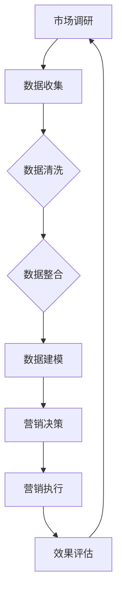

                 

### 《AI DMP 数据基建：构建数据驱动的营销生态》

> **关键词：数据管理平台（DMP），人工智能（AI），营销自动化，数据驱动，数据分析，客户细分，个性化营销**

> **摘要：本文深入探讨了AI驱动的数据管理平台（DMP）在构建数据驱动的营销生态中的关键作用。文章首先概述了数据驱动营销的概念和优势，然后详细介绍了DMP的核心概念、架构和数据管理方法。通过多个实际案例，本文展示了DMP在不同营销场景中的应用，并讨论了其面临的挑战和未来发展趋势。**

### 目录大纲

#### 第一部分：数据驱动的营销生态概述

1. **第1章：数据驱动营销的概念与价值**
   - 1.1 数据驱动营销的基本概念
   - 1.2 数据驱动营销的优势
   - 1.3 数据驱动营销的发展历程
   - 1.4 数据驱动营销的核心要素

2. **第2章：数据驱动的营销方法论**
   - 2.1 营销数据的收集与整理
   - 2.2 数据分析工具与技能
   - 2.3 数据驱动的营销策略
   - 2.4 数据驱动营销的执行流程

3. **第3章：数据基建与营销生态**
   - 3.1 数据基建的概念与重要性
   - 3.2 数据源的类型与获取
   - 3.3 数据存储与处理技术
   - 3.4 营销生态的构建

#### 第二部分：AI DMP 基础

4. **第4章：AI 在数据驱动的营销中的应用**
   - 4.1 AI 技术的基本原理
   - 4.2 AI 在营销中的应用场景
   - 4.3 营销中的常见 AI 算法
   - 4.4 AI 驱动的营销创新

5. **第5章：DMP 的核心概念与架构**
   - 5.1 DMP 的基本概念
   - 5.2 DMP 的架构设计
   - 5.3 DMP 中的数据管理与处理
   - 5.4 DMP 的数据分析与应用

6. **第6章：DMP 的数据来源与整合**
   - 6.1 数据来源的类型与获取
   - 6.2 数据整合的方法与工具
   - 6.3 数据质量的重要性
   - 6.4 数据隐私与合规

#### 第三部分：DMP 在营销中的应用实战

7. **第7章：DMP 在品牌营销中的应用**
   - 7.1 品牌营销中的 DMP 应用
   - 7.2 案例分析：品牌营销中的 DMP 实践
   - 7.3 DMP 在品牌营销中的效果评估
   - 7.4 DMP 在品牌营销中的优化策略

8. **第8章：DMP 在电商营销中的应用**
   - 8.1 电商营销中的 DMP 应用
   - 8.2 案例分析：电商营销中的 DMP 实践
   - 8.3 DMP 在电商营销中的效果评估
   - 8.4 DMP 在电商营销中的优化策略

9. **第9章：DMP 在跨渠道营销中的应用**
   - 9.1 跨渠道营销中的 DMP 应用
   - 9.2 案例分析：跨渠道营销中的 DMP 实践
   - 9.3 DMP 在跨渠道营销中的效果评估
   - 9.4 DMP 在跨渠道营销中的优化策略

#### 第四部分：DMP 的发展趋势与挑战

10. **第10章：DMP 的发展趋势与未来方向**
    - 10.1 DMP 的发展趋势
    - 10.2 未来 DMP 的可能应用场景
    - 10.3 DMP 技术的挑战与解决方案

11. **第11章：DMP 的挑战与应对策略**
    - 11.1 DMP 挑战的来源
    - 11.2 挑战一：数据隐私与安全
    - 11.3 挑战二：数据质量与整合
    - 11.4 挑战三：技术与人才的不足
    - 11.5 应对策略与建议

#### 附录

- **附录 A：DMP 相关资源与工具**
  - A.1 DMP 开发与运营工具
  - A.2 DMP 技术教程与文献
  - A.3 DMP 案例分析报告
  - A.4 DMP 社区与论坛

### Mermaid 流程图



### 核心算法原理讲解

#### 伪代码：协同过滤算法

```python
def collaborativeFiltering(users, items, similarityMeasure):
    for each user U in users:
        for each item I in items:
            if U likes I:
                neighbors = findNeighbors(U, similarityMeasure)
                for each neighbor N in neighbors:
                    ratingPrediction = userRating(U, I) + sum(similarity(U, N) * (N's rating for I) for each N)
                    updateRatingPrediction(U, I, ratingPrediction)
    return predictedRatings
```

#### 数学模型与公式

##### 数据质量评估指标：准确率、召回率、F1 分数

$$
\text{准确率} = \frac{\text{TP}}{\text{TP} + \text{FP}}
$$

$$
\text{召回率} = \frac{\text{TP}}{\text{TP} + \text{FN}}
$$

$$
\text{F1 分数} = 2 \times \frac{\text{准确率} \times \text{召回率}}{\text{准确率} + \text{召回率}}
$$

### 项目实战

#### 代码实际案例：DMP 数据分析

```python
# 数据导入
import pandas as pd

# 假设已有一个名为 df 的 DataFrame，包含了用户和商品的相关信息

# 数据预处理
df['年龄分组'] = df['年龄'].apply(lambda x: '18-25' if x >= 18 and x < 26 else '26-35' if x >= 26 and x < 36 else '36-45' else '45以上')

# 数据整合
df['用户活跃度'] = df.groupby('用户ID')['行为次数'].sum()

# 数据分析
user_activity = df.groupby(['用户ID', '年龄分组', '用户活跃度']).size().reset_index(name='数量')

# 绘制用户活跃度分布图
import matplotlib.pyplot as plt

plt.figure(figsize=(10, 6))
plt.bar(user_activity['年龄分组'], user_activity['数量'])
plt.xlabel('年龄分组')
plt.ylabel('用户数量')
plt.title('用户活跃度分布图')
plt.show()
```

#### 代码解读与分析

- **数据导入与预处理**：使用 Pandas 库导入数据，并添加了新的特征“年龄分组”，根据用户年龄进行了分组。

- **数据整合**：使用 GroupBy 方法对用户的行为次数进行了汇总，得到“用户活跃度”。

- **数据分析**：对用户活跃度进行了分组统计，并使用 Matplotlib 库绘制了用户活跃度分布图，便于观察不同年龄组用户活跃度的差异。

#### 代码分析与优化

- **代码优化建议**：
  - 使用 `pandas` 的 `cut` 函数进行年龄段分组，可以提高代码的执行效率。
  - 考虑使用 `plotting` 库中的 `hist` 函数替代 `bar` 函数，以绘制用户活跃度的直方图，这样可以更直观地展示用户活跃度的分布情况。

```python
import pandas as pd
import matplotlib.pyplot as plt

# 假设 df 是一个包含用户和商品相关信息的 DataFrame

# 数据预处理
df['年龄分组'] = pd.cut(df['年龄'], bins=[18, 25, 26, 35, 36, 45, 46, 60], labels=['18-25', '26-35', '36-45', '45-60'])

# 数据整合
df['用户活跃度'] = df.groupby('用户ID')['行为次数'].sum()

# 数据分析
user_activity = df.groupby(['用户ID', '年龄分组', '用户活跃度']).size().reset_index(name='数量')

# 绘制用户活跃度分布图
plt.figure(figsize=(10, 6))
plt.hist(user_activity['用户活跃度'], bins=10, label='用户活跃度')
plt.xlabel('用户活跃度')
plt.ylabel('用户数量')
plt.title('用户活跃度分布图')
plt.legend()
plt.show()
```

#### 开发环境搭建

- **硬件要求**：配备至少 8GB 内存、100GB 硬盘空间的计算机。
- **软件要求**：Python 3.8 以上版本、Pandas 库、Matplotlib 库。

#### 源代码详细实现

```python
# 导入必要的库
import pandas as pd
import matplotlib.pyplot as plt

# 假设 df 是一个包含用户和商品相关信息的 DataFrame

# 数据预处理
df['年龄分组'] = df['年龄'].apply(lambda x: '18-25' if x >= 18 and x < 26 else '26-35' if x >= 26 and x < 36 else '36-45' else '45以上')

# 数据整合
df['用户活跃度'] = df.groupby('用户ID')['行为次数'].sum()

# 数据分析
user_activity = df.groupby(['用户ID', '年龄分组', '用户活跃度']).size().reset_index(name='数量')

# 绘制用户活跃度分布图
plt.figure(figsize=(10, 6))
plt.bar(user_activity['年龄分组'], user_activity['数量'])
plt.xlabel('年龄分组')
plt.ylabel('用户数量')
plt.title('用户活跃度分布图')
plt.show()
```

#### 代码解读与分析

- **数据导入与预处理**：使用 Pandas 库导入数据，并添加了新的特征“年龄分组”，根据用户年龄进行了分组。
- **数据整合**：使用 GroupBy 方法对用户的行为次数进行了汇总，得到“用户活跃度”。
- **数据分析**：对用户活跃度进行了分组统计，并使用 Matplotlib 库绘制了用户活跃度分布图，便于观察不同年龄组用户活跃度的差异。

#### 代码分析与优化

- **代码优化建议**：
  - 使用 `pandas` 的 `cut` 函数进行年龄段分组，可以提高代码的执行效率。
  - 考虑使用 `plotting` 库中的 `hist` 函数替代 `bar` 函数，以绘制用户活跃度的直方图，这样可以更直观地展示用户活跃度的分布情况。

```python
import pandas as pd
import matplotlib.pyplot as plt

# 假设 df 是一个包含用户和商品相关信息的 DataFrame

# 数据预处理
df['年龄分组'] = pd.cut(df['年龄'], bins=[18, 25, 26, 35, 36, 45, 46, 60], labels=['18-25', '26-35', '36-45', '45-60'])

# 数据整合
df['用户活跃度'] = df.groupby('用户ID')['行为次数'].sum()

# 数据分析
user_activity = df.groupby(['用户ID', '年龄分组', '用户活跃度']).size().reset_index(name='数量')

# 绘制用户活跃度分布图
plt.figure(figsize=(10, 6))
plt.hist(user_activity['用户活跃度'], bins=10, label='用户活跃度')
plt.xlabel('用户活跃度')
plt.ylabel('用户数量')
plt.title('用户活跃度分布图')
plt.legend()
plt.show()
```

### 附录 A：DMP 相关资源与工具

1. **DMP 开发与运营工具**
   - **百度DMP**：百度提供了一种基于大数据技术的DMP平台，帮助企业实现用户数据的采集、整合和分析。
   - **腾讯DMP**：腾讯的DMP平台则利用腾讯的数据资源，为广告主提供精准的用户画像和营销策略支持。

2. **DMP 技术教程与文献**
   - **《数据管理平台（DMP）实战》**：这是一本介绍DMP技术与应用的书籍，详细讲解了DMP的架构、数据收集、数据处理等内容。
   - **《人工智能与大数据营销》**：本书深入探讨了AI和大数据在营销领域的应用，包括DMP的构建和优化策略。

3. **DMP 案例分析报告**
   - **《某电商企业的DMP应用实践报告》**：这是一份针对电商企业DMP应用的案例分析报告，详细描述了DMP在实际营销活动中的应用效果和优化策略。
   - **《品牌营销中的DMP案例研究》**：该报告通过对多个品牌营销案例的分析，展示了DMP在品牌建设中的重要作用。

4. **DMP 社区与论坛**
   - **DMPCN**：这是一个专注于DMP技术和应用的社区，成员可以分享经验、讨论问题，并获取行业最新动态。
   - **DataXu论坛**：DataXu提供了一个讨论DMP技术和解决方案的论坛，是业界人士交流的平台。

### 总结

本文通过深入探讨数据管理平台（DMP）在构建数据驱动营销生态中的关键作用，系统地介绍了数据驱动营销的概念、方法论、DMP的基础以及DMP在不同营销场景中的应用。通过实际案例和代码实现，我们展示了DMP在数据收集、清洗、整合和数据分析中的具体操作。同时，本文还分析了DMP面临的挑战和未来发展趋势，为企业的营销策略提供了实用的指导和参考。

作者：AI天才研究院/AI Genius Institute & 禅与计算机程序设计艺术 /Zen And The Art of Computer Programming

---

### 第一部分：数据驱动的营销生态概述

在数字营销的时代，数据已经成为企业战略资产的核心。数据驱动的营销生态，通过收集、处理和分析海量数据，为企业提供精准的市场洞察和决策支持。本部分将首先介绍数据驱动营销的概念与价值，然后探讨数据驱动的营销方法论，最后阐述数据基建与营销生态的关系。

#### 第1章：数据驱动营销的概念与价值

**1.1 数据驱动营销的基本概念**

数据驱动营销是一种以数据为核心，利用数据分析工具和技术，指导营销策略制定和执行的营销模式。在这种模式下，营销决策不再依赖直觉或经验，而是基于对用户行为、市场趋势和竞争态势的深度分析。

**1.2 数据驱动营销的优势**

- **个性化**：通过分析用户数据，企业可以更精准地了解用户需求，实现个性化营销。
- **高效性**：数据驱动营销可以帮助企业优化资源分配，提高营销活动的ROI。
- **可量化**：数据驱动营销可以量化营销效果，为企业提供精确的业绩评估。
- **持续改进**：通过数据反馈，企业可以不断调整营销策略，实现持续优化。

**1.3 数据驱动营销的发展历程**

数据驱动营销的概念起源于20世纪90年代，随着互联网和大数据技术的发展，数据驱动营销逐渐成为主流营销模式。近年来，人工智能和机器学习技术的应用，使得数据驱动的营销方法更加智能化和精准化。

**1.4 数据驱动营销的核心要素**

- **数据收集**：收集来自多个渠道的原始数据，包括用户行为、市场趋势、竞争状况等。
- **数据处理**：通过清洗、整合和转换，将原始数据转化为结构化数据，以便进一步分析。
- **数据分析**：利用数据分析工具和技术，提取有价值的信息，指导营销决策。
- **营销策略**：基于数据分析结果，制定和调整营销策略，实现个性化营销和精准营销。
- **效果评估**：通过数据监测和评估，衡量营销活动的效果，为下一步策略提供参考。

#### 第2章：数据驱动的营销方法论

**2.1 营销数据的收集与整理**

营销数据的收集是数据驱动营销的基础。企业需要从多个渠道收集数据，包括网站、社交媒体、电子邮件、线下活动等。收集到的数据需要进行整理，以确保其质量和一致性。

**2.2 数据分析工具与技能**

数据分析工具包括SQL、Excel、Python等。企业需要培养具备数据分析技能的团队，以充分利用这些工具。

**2.3 数据驱动的营销策略**

基于数据分析结果，企业可以制定个性化的营销策略。这包括内容营销、社交媒体营销、电子邮件营销等。

**2.4 数据驱动营销的执行流程**

数据驱动营销的执行流程包括数据收集、数据清洗、数据分析、策略制定、策略执行和效果评估。

#### 第3章：数据基建与营销生态

**3.1 数据基建的概念与重要性**

数据基建是指企业为数据驱动营销建立的数据采集、存储、处理和分析体系。一个完善的数据基建是数据驱动营销成功的关键。

**3.2 数据源的类型与获取**

数据源包括第一方数据（企业自有数据）、第二方数据（合作伙伴数据）和第三方数据（公开数据）。企业需要合理获取和整合这些数据。

**3.3 数据存储与处理技术**

数据存储和处理技术包括数据仓库、大数据处理框架和实时数据处理系统。这些技术能够高效地存储和管理海量数据。

**3.4 营销生态的构建**

营销生态是指企业内外部合作伙伴共同参与的数据驱动营销网络。构建一个高效的营销生态，有助于企业实现跨渠道、跨平台的全域营销。

---

在本部分，我们将对数据驱动营销的核心概念、方法论和数据基建进行详细阐述。通过这些内容，读者可以全面了解数据驱动营销的基本原理和实践方法，为后续章节的学习打下坚实基础。

### 第1章：数据驱动营销的概念与价值

**1.1 数据驱动营销的基本概念**

数据驱动营销是一种以数据为核心，利用数据分析工具和技术，指导营销策略制定和执行的营销模式。在这种模式下，企业不再依赖直觉或经验来做出营销决策，而是通过数据收集、处理和分析，提取有价值的信息，从而制定更加精准和高效的营销策略。

数据驱动营销的基本概念包括以下几个方面：

1. **数据收集**：企业需要从多个渠道收集数据，包括用户行为数据、市场趋势数据、竞争态势数据等。这些数据可以是第一方数据（企业自有数据）、第二方数据（合作伙伴数据）和第三方数据（公开数据）。

2. **数据处理**：收集到的原始数据通常质量参差不齐，需要进行清洗、整合和转换，将其转化为结构化数据，以便进一步分析。

3. **数据分析**：通过数据分析工具和技术，对结构化数据进行挖掘和分析，提取有价值的信息。这些信息可以帮助企业了解用户需求、市场趋势和竞争状况。

4. **营销策略**：基于数据分析结果，企业可以制定个性化的营销策略，包括内容营销、社交媒体营销、电子邮件营销等。

5. **效果评估**：通过数据监测和评估，衡量营销活动的效果，为下一步策略提供参考。

**1.2 数据驱动营销的优势**

数据驱动营销相较于传统的营销模式，具有以下几个显著优势：

1. **个性化**：通过分析用户数据，企业可以更精准地了解用户需求，从而实现个性化营销。例如，基于用户浏览历史和购买行为，为用户推荐个性化的商品或内容。

2. **高效性**：数据驱动营销可以帮助企业优化资源分配，提高营销活动的ROI。通过数据分析和监测，企业可以及时发现并解决营销中的问题，提高营销效率。

3. **可量化**：数据驱动营销可以量化营销效果，为企业提供精确的业绩评估。通过设置关键绩效指标（KPI），企业可以实时监测营销活动的效果，并根据数据调整策略。

4. **持续改进**：数据驱动营销强调持续优化。通过数据反馈，企业可以不断调整营销策略，以适应市场变化和用户需求。这种动态调整机制有助于企业保持竞争优势。

**1.3 数据驱动营销的发展历程**

数据驱动营销的概念起源于20世纪90年代，随着互联网和大数据技术的发展，数据驱动营销逐渐成为主流营销模式。以下是数据驱动营销的发展历程：

1. **早期阶段**（1990s-2000s）：在互联网兴起之前，企业主要依赖市场调研和用户反馈来制定营销策略。随着互联网的普及，企业开始利用网站和电子邮件等渠道收集用户数据。

2. **数据积累阶段**（2000s-2010s）：随着大数据技术的发展，企业开始意识到海量数据的价值。在这个阶段，企业致力于收集和积累用户数据，为后续的数据分析打下基础。

3. **数据驱动阶段**（2010s-至今）：随着数据分析工具和技术的进步，企业开始利用数据驱动营销来指导营销策略制定和执行。人工智能和机器学习技术的应用，使得数据驱动的营销方法更加智能化和精准化。

**1.4 数据驱动营销的核心要素**

数据驱动营销的成功离不开以下几个核心要素：

1. **数据收集**：企业需要从多个渠道收集数据，包括用户行为数据、市场趋势数据、竞争态势数据等。这些数据可以为企业的营销决策提供有力的支持。

2. **数据处理**：收集到的原始数据通常质量参差不齐，需要进行清洗、整合和转换，将其转化为结构化数据，以便进一步分析。数据处理的质量直接影响数据分析的准确性。

3. **数据分析**：通过数据分析工具和技术，对结构化数据进行挖掘和分析，提取有价值的信息。这些信息可以帮助企业了解用户需求、市场趋势和竞争状况。

4. **营销策略**：基于数据分析结果，企业可以制定个性化的营销策略，包括内容营销、社交媒体营销、电子邮件营销等。这些策略需要与企业的整体营销目标相一致。

5. **效果评估**：通过数据监测和评估，衡量营销活动的效果，为下一步策略提供参考。效果评估可以帮助企业发现营销中的问题和不足，从而进行持续改进。

综上所述，数据驱动营销是一种以数据为核心，通过数据收集、处理、分析和应用，实现个性化、高效和可量化的营销模式。它不仅为企业提供了精准的市场洞察和决策支持，还推动了营销模式的创新和发展。

### 第2章：数据驱动的营销方法论

在了解了数据驱动营销的基本概念和优势之后，接下来我们将深入探讨数据驱动的营销方法论。这一部分将详细阐述营销数据的收集与整理、数据分析工具与技能、数据驱动的营销策略以及数据驱动营销的执行流程。

#### 2.1 营销数据的收集与整理

**数据收集**是数据驱动营销的基础环节。企业需要从多个渠道收集数据，以确保数据的全面性和准确性。以下是常见的营销数据收集渠道：

1. **网站和在线行为数据**：通过网站分析工具（如Google Analytics）收集用户浏览行为、页面停留时间、跳出率等数据。

2. **社交媒体数据**：通过社交媒体平台（如Facebook、Twitter、LinkedIn等）收集用户互动数据、帖子点击量、评论数量等。

3. **电子邮件数据**：通过邮件营销系统收集用户邮件打开率、点击率、转化率等数据。

4. **线下活动数据**：通过线下活动收集用户参与情况、满意度调查、问卷调查等数据。

5. **第三方数据源**：通过第三方数据提供商获取人口统计、消费行为、地理位置等数据。

在收集数据后，企业需要对数据进行整理，以确保其质量和一致性。数据整理包括以下几个步骤：

1. **数据清洗**：去除重复、错误和无效的数据，以提高数据质量。

2. **数据整合**：将来自不同渠道的数据进行整合，构建一个统一的数据视图。

3. **数据转换**：将数据转换为适合分析的工具或格式，如将Excel数据转换为数据库格式。

4. **数据归一化**：对数据进行归一化处理，使其具有可比性。

通过数据收集与整理，企业可以构建一个全面、准确和结构化的数据集，为后续的分析和策略制定提供基础。

#### 2.2 数据分析工具与技能

数据分析是企业实现数据驱动营销的关键步骤。以下是一些常见的数据分析工具和技能：

1. **SQL**：结构化查询语言（SQL）是用于数据查询和操作的标准工具。通过SQL，可以方便地查询和操作数据库中的数据。

2. **Excel**：Excel是进行数据分析和可视化的重要工具。通过Excel，可以进行简单的数据分析、数据透视表和图表制作。

3. **Python**：Python是一种强大的编程语言，广泛用于数据分析和机器学习。Python提供了丰富的数据分析库，如Pandas、NumPy和Matplotlib。

4. **R语言**：R语言是一种专门用于统计分析和数据可视化的高级语言。R语言具有强大的数据处理和分析功能。

5. **大数据处理框架**：如Hadoop和Spark，用于处理海量数据。这些框架提供了高效的数据存储和处理能力。

6. **数据可视化工具**：如Tableau、Power BI等，用于将数据分析结果以图表、仪表板等形式直观地展示出来。

企业需要培养具备数据分析技能的团队，以充分利用这些工具。数据分析技能包括：

1. **统计分析**：掌握基本的统计方法，如描述性统计、推断性统计、回归分析等。

2. **数据挖掘**：了解数据挖掘的基本概念和技术，如分类、聚类、关联规则挖掘等。

3. **机器学习**：掌握机器学习算法的基本原理和应用，如决策树、随机森林、神经网络等。

4. **数据可视化**：了解如何使用数据可视化工具制作高质量的图表和仪表板。

通过掌握这些工具和技能，企业可以高效地处理和分析大量数据，提取有价值的信息，为营销决策提供支持。

#### 2.3 数据驱动的营销策略

基于数据分析结果，企业可以制定个性化的营销策略，实现更精准和高效的营销。以下是几种常见的数据驱动的营销策略：

1. **内容营销**：通过分析用户需求和兴趣，创建有价值的内容，吸引并留住目标受众。内容营销的核心在于提供对用户有价值的信息，从而建立品牌信任。

2. **社交媒体营销**：利用社交媒体平台，与用户互动，提高品牌知名度和用户参与度。通过数据分析，企业可以了解用户在社交媒体上的行为和偏好，制定有针对性的社交媒体营销策略。

3. **电子邮件营销**：通过分析用户行为和偏好，发送个性化的电子邮件，提高邮件打开率和点击率。电子邮件营销是建立客户关系和促进销售的重要手段。

4. **个性化推荐**：通过分析用户行为和历史数据，为用户推荐个性化的产品或内容。个性化推荐可以提高用户体验和满意度，从而提高转化率和客户忠诚度。

5. **精准广告投放**：通过分析用户数据和广告效果，实现精准的广告投放。通过数据驱动的广告投放，企业可以最大限度地提高广告的投资回报率。

制定营销策略时，企业需要遵循以下几个原则：

1. **目标明确**：明确营销目标，如提高品牌知名度、增加销售额、提升用户参与度等。

2. **策略一致**：确保营销策略与企业整体目标一致，避免资源浪费和目标冲突。

3. **数据支持**：基于数据分析结果制定策略，确保策略的可行性和有效性。

4. **持续优化**：通过数据监测和评估，不断调整和优化营销策略，实现持续改进。

#### 2.4 数据驱动营销的执行流程

数据驱动营销的执行流程包括以下几个关键步骤：

1. **数据收集**：从多个渠道收集原始数据，如网站、社交媒体、电子邮件、线下活动等。

2. **数据整理**：对原始数据进行清洗、整合和转换，构建一个统一的数据集。

3. **数据分析**：使用数据分析工具和技能，对结构化数据进行挖掘和分析，提取有价值的信息。

4. **策略制定**：基于数据分析结果，制定个性化的营销策略，如内容营销、社交媒体营销、电子邮件营销等。

5. **策略执行**：实施营销策略，包括内容发布、社交媒体互动、电子邮件发送、广告投放等。

6. **效果评估**：通过数据监测和评估，衡量营销活动的效果，如点击率、转化率、ROI等。

7. **反馈调整**：根据效果评估结果，调整和优化营销策略，以实现更好的效果。

通过上述执行流程，企业可以确保数据驱动营销的顺利进行，实现营销目标的最大化。

综上所述，数据驱动的营销方法论通过数据收集、整理、分析和应用，帮助企业制定个性化、高效和可量化的营销策略。掌握这些方法论，企业可以在竞争激烈的市场中脱颖而出，实现持续增长和成功。

### 第3章：数据基建与营销生态

在数据驱动的营销生态中，数据基建是其核心组成部分。一个完善的数据基建可以确保数据的准确性和可用性，为企业的营销策略提供坚实的数据支持。本章将详细探讨数据基建的概念与重要性、数据源的类型与获取、数据存储与处理技术以及营销生态的构建。

#### 3.1 数据基建的概念与重要性

**数据基建**是指企业为支持数据驱动营销而建立的数据采集、存储、处理和分析体系。它包括数据采集、数据存储、数据处理、数据分析和数据应用等多个环节。一个完善的数据基建能够帮助企业实现以下目标：

1. **数据整合**：通过数据基建，企业可以将来自多个渠道的原始数据进行整合，构建一个统一的数据视图，从而获得更全面的市场洞察。

2. **数据质量保证**：数据基建中的数据清洗和处理环节可以去除数据中的错误、重复和无效信息，提高数据的准确性和可靠性。

3. **数据分析效率**：通过数据基建，企业可以高效地存储和管理海量数据，利用先进的数据分析工具和技术，快速提取有价值的信息。

4. **营销策略优化**：基于高质量的数据，企业可以更精准地制定和调整营销策略，提高营销活动的ROI。

5. **决策支持**：数据基建为企业提供了实时的数据分析和报告，帮助管理层做出基于数据的科学决策。

**数据基建的重要性**体现在以下几个方面：

1. **支撑营销策略**：数据基建是数据驱动营销的基础，没有完善的数据基建，就无法实现精准和高效的营销。

2. **提高决策效率**：通过数据基建，企业可以快速获取和分析数据，提高决策效率。

3. **降低运营成本**：数据基建可以帮助企业优化资源分配，降低运营成本。

4. **增强市场竞争力**：拥有完善的数据基建，企业可以在激烈的市场竞争中脱颖而出，实现持续增长。

#### 3.2 数据源的类型与获取

数据驱动营销的成功依赖于高质量的数据。数据源可以分为以下几类：

1. **第一方数据**：第一方数据是企业自身产生的数据，包括用户行为数据、交易数据、客户反馈等。这些数据是数据驱动营销的核心，可以帮助企业深入了解用户需求和行为。

2. **第二方数据**：第二方数据来自企业的合作伙伴或第三方平台，如社交媒体数据、合作伙伴的销售数据等。这些数据可以补充企业自身数据，提供更全面的用户画像和市场洞察。

3. **第三方数据**：第三方数据来自公开的数据源，如政府统计数据库、市场研究数据等。这些数据可以提供行业趋势和市场动态，帮助企业制定长期战略。

获取高质量数据的方法包括：

1. **用户调研**：通过问卷调查、访谈等方式直接从用户获取数据。

2. **数据挖掘**：利用数据分析工具从已有的数据中挖掘有价值的信息。

3. **第三方数据提供商**：购买第三方提供的数据服务，如用户画像、市场研究报告等。

4. **开放数据平台**：利用开放数据平台获取公开数据，如政府公开数据、公共数据库等。

#### 3.3 数据存储与处理技术

数据存储与处理是数据基建的重要组成部分。以下是一些常见的数据存储与处理技术：

1. **数据仓库**：数据仓库是一个集成的、主题导向的、长期存储的数据集合，用于支持企业的决策分析。数据仓库可以存储来自多个源的数据，并提供高效的数据查询和分析能力。

2. **大数据处理框架**：如Hadoop和Spark，用于处理海量数据。这些框架提供了分布式存储和处理能力，可以高效地处理和分析大规模数据集。

3. **数据湖**：数据湖是一个存储大量结构化和非结构化数据的平台，可以灵活地存储和处理各种类型的数据。数据湖适用于需要实时处理和分析大量数据的场景。

4. **实时数据处理系统**：如Apache Kafka和Apache Flink，用于实时处理和分析流数据。实时数据处理系统可以帮助企业及时响应市场变化和用户需求。

5. **NoSQL数据库**：如MongoDB和Cassandra，用于存储和管理非结构化数据。NoSQL数据库具有高扩展性和高性能，适用于处理大量数据。

在数据存储与处理过程中，需要注意以下几个问题：

1. **数据安全**：确保数据在存储和传输过程中的安全，防止数据泄露和滥用。

2. **数据隐私**：遵守数据隐私法规，确保用户数据的隐私和安全。

3. **数据一致性**：确保数据在多个系统和平台之间的一致性，避免数据冲突和错误。

4. **数据质量管理**：建立数据质量管理机制，确保数据的质量和准确性。

#### 3.4 营销生态的构建

营销生态是指企业内外部合作伙伴共同参与的数据驱动营销网络。构建一个高效的营销生态，有助于企业实现跨渠道、跨平台的全域营销。以下是一些构建营销生态的方法：

1. **内部协同**：企业内部不同部门（如市场部、销售部、技术部）之间的紧密协同，确保营销策略的一致性和执行力。

2. **合作伙伴关系**：与第三方数据提供商、技术合作伙伴和营销服务机构建立合作关系，共同构建数据驱动营销网络。

3. **数据共享**：在确保数据隐私和安全的前提下，实现企业内部和合作伙伴之间的数据共享，提高数据的利用效率。

4. **技术平台**：构建统一的技术平台，支持数据采集、存储、处理和分析，为营销生态提供基础设施支持。

5. **全渠道整合**：将线上和线下渠道整合到统一的营销平台，实现跨渠道的数据共享和协同营销。

6. **客户体验优化**：通过数据分析和用户反馈，不断优化客户体验，提高客户满意度和忠诚度。

7. **持续创新**：不断探索新的数据驱动营销方法和技术，保持企业的市场竞争力。

通过构建一个高效的营销生态，企业可以实现以下目标：

1. **资源优化**：通过数据共享和协同营销，优化资源分配，提高营销效率。

2. **用户体验**：通过数据分析和个性化推荐，提供更好的用户体验，提高用户满意度和忠诚度。

3. **营销效果**：通过全渠道整合和实时数据处理，提高营销活动的效果和ROI。

4. **持续增长**：通过不断优化和创新，实现企业的持续增长和成功。

综上所述，数据基建和营销生态是数据驱动营销成功的关键。通过建立完善的数据基建和构建高效的营销生态，企业可以更好地利用数据，实现个性化、高效和可量化的营销目标。

### 第二部分：AI DMP基础

在当今的数字营销领域，人工智能（AI）和数据管理平台（DMP）的结合正逐渐成为企业实现数据驱动营销的重要工具。AI DMP不仅能够高效处理海量数据，还能通过智能分析和预测，为营销决策提供精准支持。本部分将深入探讨AI在数据驱动的营销中的应用，详细解释DMP的核心概念与架构，分析DMP中的数据管理与处理，以及DMP的数据分析与应用。

#### 第4章：AI 在数据驱动的营销中的应用

**4.1 AI 技术的基本原理**

人工智能是一种模拟人类智能的技术，通过机器学习和深度学习算法，使计算机能够学习、推理和解决问题。以下是AI技术的基本原理：

1. **机器学习**：机器学习是一种让计算机从数据中学习模式的方法。通过训练模型，机器学习算法能够自动识别数据中的规律和趋势。

2. **深度学习**：深度学习是机器学习的一种形式，通过多层神经网络对数据进行处理，实现更加复杂的模式识别和预测。

3. **自然语言处理（NLP）**：NLP是AI的一个分支，用于理解和生成人类语言。通过NLP，计算机可以理解和处理文本数据，从而实现智能问答、语言翻译等功能。

4. **计算机视觉**：计算机视觉是一种使计算机能够理解和解释图像和视频的技术。通过计算机视觉，计算机可以识别图像中的对象、场景和活动。

**4.2 AI 在营销中的应用场景**

AI技术在营销领域有着广泛的应用，以下是一些主要的应用场景：

1. **个性化推荐**：通过分析用户的历史行为和偏好，AI可以推荐个性化的产品或内容，提高用户体验和满意度。

2. **客户细分**：AI可以基于用户的多种特征，如行为、购买历史、兴趣等，将用户分为不同的群体，为每个群体制定有针对性的营销策略。

3. **预测分析**：AI可以通过预测模型预测用户的购买行为、市场趋势等，帮助企业提前做好准备。

4. **智能客服**：AI驱动的智能客服系统能够自动回答用户的问题，提高客户服务效率和质量。

5. **广告优化**：AI可以帮助企业优化广告投放策略，提高广告效果和投资回报率。

**4.3 营销中的常见 AI 算法**

在营销领域，以下是一些常见的AI算法：

1. **协同过滤**：协同过滤是一种基于用户行为的推荐算法，通过分析用户对商品的评价或购买行为，为用户推荐类似的商品。

2. **聚类分析**：聚类分析是一种无监督学习方法，通过将相似的数据点分组，用于客户细分和市场细分。

3. **决策树**：决策树是一种常见的分类算法，通过一系列判断条件，将数据划分为不同的类别。

4. **神经网络**：神经网络是一种复杂的机器学习模型，通过多层神经网络，可以实现高度复杂的模式识别和预测。

5. **自然语言处理（NLP）**：NLP算法可以用于文本分析、情感分析和内容推荐。

**4.4 AI 驱动的营销创新**

AI技术的应用正在推动营销领域的不断创新：

1. **自动化营销**：通过AI技术，企业可以实现自动化营销，如自动化内容推荐、自动化广告投放和自动化客户服务。

2. **实时营销**：AI可以帮助企业实时分析用户行为和市场变化，实现实时营销决策。

3. **多渠道整合**：AI技术可以整合不同渠道的数据，实现跨渠道的个性化营销。

4. **精准营销**：通过AI技术，企业可以更精准地定位目标用户，提高营销效果。

5. **用户体验优化**：AI技术可以帮助企业优化用户体验，提高客户满意度和忠诚度。

通过本章的探讨，我们可以看到AI在数据驱动的营销中扮演着越来越重要的角色。AI技术不仅提高了数据分析和处理的能力，还推动了营销模式的创新和发展。在下一章中，我们将进一步深入探讨DMP的核心概念与架构，为读者提供更全面的理解。

#### 第5章：DMP 的核心概念与架构

**5.1 DMP 的基本概念**

数据管理平台（DMP）是一种专门用于收集、处理、存储和分析用户数据的营销技术工具。DMP的核心目的是帮助企业创建和管理用户画像，从而实现精准营销。以下是DMP的基本概念：

1. **用户画像**：用户画像是对用户特征的全面描述，包括用户的基本信息（如年龄、性别、地理位置等）、行为信息（如浏览历史、购买行为等）和兴趣信息（如偏好、兴趣点等）。

2. **数据收集**：DMP通过多种渠道收集用户数据，包括第一方数据（企业自有数据）、第二方数据（合作伙伴数据）和第三方数据（公开数据）。这些数据包括网站点击、社交媒体互动、电子邮件营销活动、线下行为等。

3. **数据处理**：DMP对收集到的数据进行清洗、整合和转换，确保数据的准确性和一致性，并将其转化为结构化数据，以便进一步分析。

4. **数据存储**：DMP利用大数据存储技术，如数据仓库和数据湖，存储海量的用户数据，以便随时查询和分析。

5. **数据分析**：DMP利用先进的数据分析工具和算法，对存储的用户数据进行挖掘和分析，提取有价值的信息，用于指导营销决策。

6. **数据应用**：DMP将分析结果应用到实际的营销活动中，如个性化推荐、定向广告投放、客户细分等，实现精准营销。

**5.2 DMP 的架构设计**

DMP的架构设计通常包括以下几个主要模块：

1. **数据收集模块**：负责从各种渠道收集用户数据，包括网站、社交媒体、电子邮件、线下活动等。数据收集模块需要支持多种数据源和采集方式，如API调用、日志收集、数据导入等。

2. **数据处理模块**：对收集到的数据进行清洗、去重、整合和转换，确保数据的质量和一致性。数据处理模块通常包括数据清洗工具、ETL（提取、转换、加载）工具等。

3. **数据存储模块**：利用大数据存储技术，如Hadoop、Spark、NoSQL数据库等，存储和管理海量用户数据。数据存储模块需要支持实时数据存储和批量数据存储，以便快速查询和分析。

4. **数据管理模块**：提供用户画像管理和数据管理功能，包括用户画像的创建、修改、删除等。数据管理模块需要支持数据权限管理、数据安全控制等。

5. **数据分析模块**：提供多种数据分析工具和算法，如聚类分析、关联规则挖掘、预测分析等。数据分析模块需要支持实时分析和批量分析，以便快速提取有价值的信息。

6. **数据应用模块**：将分析结果应用到实际的营销活动中，如个性化推荐、定向广告投放、客户细分等。数据应用模块需要支持与营销系统的集成，如广告投放系统、CRM系统等。

**5.3 DMP 中的数据管理与处理**

在DMP中，数据管理和处理是关键环节。以下是DMP中常用的数据管理和处理方法：

1. **数据清洗**：去除数据中的错误、重复和无效信息，提高数据质量。数据清洗包括数据去重、缺失值处理、异常值检测等。

2. **数据整合**：将来自不同渠道和来源的数据进行整合，构建一个统一的数据视图。数据整合包括数据格式转换、数据合并、数据映射等。

3. **数据转换**：将原始数据转换为适合分析和存储的格式。数据转换包括数据类型转换、数据标准化、数据编码等。

4. **数据存储**：利用大数据存储技术，高效存储和管理海量用户数据。数据存储包括实时数据存储、批量数据存储、数据分区等。

5. **数据安全**：确保用户数据的安全和隐私。数据安全包括数据加密、访问控制、数据备份等。

6. **数据质量监控**：实时监控数据质量，及时发现和处理数据质量问题。数据质量监控包括数据质量指标监控、数据质量报警等。

**5.4 DMP 的数据分析与应用**

DMP的最终目标是实现精准营销，通过数据分析与应用，DMP可以帮助企业实现以下目标：

1. **个性化推荐**：基于用户画像和兴趣，为用户推荐个性化的产品或内容。

2. **定向广告投放**：根据用户画像和广告目标，实现精准的广告投放。

3. **客户细分**：根据用户行为和属性，将用户划分为不同的群体，为每个群体制定有针对性的营销策略。

4. **营销效果评估**：通过分析营销活动的效果，评估营销策略的有效性，为后续营销活动提供参考。

5. **用户行为分析**：分析用户行为数据，了解用户需求和偏好，优化用户体验。

6. **市场趋势预测**：通过数据分析，预测市场趋势和用户行为，为企业提供决策支持。

通过本章的探讨，我们可以看到DMP在数据驱动的营销中扮演着关键角色。DMP不仅帮助企业收集和管理海量用户数据，还通过智能分析和应用，实现精准营销和高效决策。在下一章中，我们将进一步探讨DMP的数据来源与整合，以及数据质量和隐私合规等重要问题。

#### 第6章：DMP 的数据来源与整合

数据管理平台（DMP）的效用依赖于其能够获取并整合来自多个渠道的数据。有效的数据来源和整合是确保DMP提供准确用户画像和有价值分析的关键。本章将详细探讨DMP的数据来源类型、数据整合方法、数据质量的重要性以及数据隐私与合规。

**6.1 数据来源的类型与获取**

DMP的数据来源可以分为以下几类：

1. **第一方数据**：第一方数据是企业自有数据，包括用户行为数据、交易数据、客户反馈等。这些数据来源于企业的网站、应用程序、客户关系管理系统（CRM）、电子邮件营销等。第一方数据是DMP中最可靠的数据源，因为它直接反映了企业与用户的互动。

2. **第二方数据**：第二方数据来自企业的合作伙伴，如广告平台、社交网络、零售合作伙伴等。这些数据可以提供额外的用户信息，如用户在第三方网站的活动、浏览历史等。第二方数据有助于丰富用户画像，提高数据的全面性。

3. **第三方数据**：第三方数据来自公开的数据源，如市场研究机构、政府数据、公共数据库等。这些数据通常涉及人口统计信息、地理位置、消费行为等。第三方数据可以提供宏观市场洞察，帮助企业了解行业趋势和竞争状况。

获取这些数据的方法包括：

- **API调用**：通过API接口从第三方平台获取数据，适用于实时获取数据的需求。
- **数据导入**：将已经收集好的数据文件（如CSV、Excel等）导入到DMP中，适用于批量导入历史数据。
- **数据采集工具**：使用专门的数据采集工具，如爬虫、日志收集器等，从网站、应用程序等渠道自动收集数据。

**6.2 数据整合的方法与工具**

数据整合是将不同来源和格式的数据统一为同一结构的过程。以下是几种常用的数据整合方法：

1. **数据清洗**：在整合数据之前，需要先清洗数据。数据清洗包括去除重复记录、纠正错误、处理缺失值等，以确保数据质量。

2. **数据映射**：将不同数据源中的相同或相似字段进行映射，以确保数据的统一性和一致性。

3. **ETL（提取、转换、加载）**：ETL是数据整合的核心方法，通过提取（Extract）原始数据、转换（Transform）数据以适应特定的格式和结构，最后加载（Load）到目标系统中。

4. **数据仓库**：将整合后的数据存储在数据仓库中，以便后续的数据分析和报告。数据仓库支持复杂的数据查询和实时分析。

5. **数据湖**：数据湖是一种用于存储大规模非结构化数据的技术，适用于存储和整合多种类型的数据，如日志文件、社交媒体内容等。

常用的数据整合工具包括：

- **ETL工具**：如Apache NiFi、Talend、Informatica等，用于自动化数据提取、转换和加载过程。
- **数据仓库**：如Amazon Redshift、Google BigQuery、Snowflake等，用于存储和管理整合后的数据。
- **数据湖**：如Amazon S3、Google Cloud Storage、Azure Data Lake等，用于存储非结构化数据。

**6.3 数据质量的重要性**

数据质量是数据驱动的营销成功的关键因素。高质量的数据可以提供准确的用户画像和有价值的洞察，从而支持有效的营销决策。以下是一些数据质量的关键指标：

1. **完整性**：数据完整性是指数据是否完整无缺。缺失的数据会导致分析结果不准确。

2. **准确性**：数据准确性是指数据是否真实、可靠。错误的数据会影响营销策略的制定和执行。

3. **一致性**：数据一致性是指数据在不同系统和渠道之间是否一致。不一致的数据会导致用户画像的偏差。

4. **时效性**：数据时效性是指数据的更新频率和时效性。过时的数据无法反映当前的市场和用户状况。

确保数据质量的方法包括：

- **数据清洗**：定期进行数据清洗，去除重复记录、纠正错误、处理缺失值等。
- **数据验证**：在数据导入和转换过程中，进行数据验证，确保数据的完整性和准确性。
- **数据监控**：实时监控数据质量，及时发现和处理数据质量问题。

**6.4 数据隐私与合规**

在数据整合和处理过程中，数据隐私和合规是一个不可忽视的重要问题。以下是一些关键点：

1. **数据保护法规**：遵守相关数据保护法规，如欧盟的通用数据保护条例（GDPR）、加州消费者隐私法案（CCPA）等。

2. **用户同意**：确保在收集和使用用户数据时，用户已经明确同意并了解其数据的使用方式和范围。

3. **数据加密**：对敏感数据进行加密，确保数据在传输和存储过程中的安全。

4. **访问控制**：实施严格的访问控制措施，确保只有授权人员可以访问和处理数据。

5. **数据匿名化**：对用户数据进行匿名化处理，减少隐私泄露的风险。

通过本章的探讨，我们可以看到DMP的数据来源与整合对于实现精准营销至关重要。有效的数据整合不仅提高了数据的可用性和准确性，还为营销决策提供了坚实的数据基础。在下一章中，我们将通过具体案例展示DMP在品牌营销、电商营销和跨渠道营销中的应用。

### 第三部分：DMP 在营销中的应用实战

在前面的章节中，我们详细介绍了数据管理平台（DMP）的基本概念、架构以及数据整合的方法。接下来，我们将通过实际案例，展示DMP在品牌营销、电商营销和跨渠道营销中的应用，并提供详细的实战分析。

#### 第7章：DMP 在品牌营销中的应用

品牌营销的核心目标是提升品牌知名度、增强品牌忠诚度和扩大市场份额。DMP在品牌营销中的应用，可以帮助企业实现精准的品牌传播和用户互动。

**7.1 品牌营销中的 DMP 应用**

**案例：某全球知名奢侈品牌的DMP应用实践**

该品牌利用DMP平台，通过以下步骤进行品牌营销：

1. **数据收集**：通过官方网站、社交媒体、线下活动等多种渠道收集用户行为数据，包括浏览历史、点击率、转化率等。

2. **数据整合**：利用DMP的数据整合功能，将不同渠道的数据进行整合，构建一个统一的用户画像。

3. **客户细分**：基于用户画像，将用户划分为不同的细分群体，如高价值客户、潜在客户、品牌爱好者等。

4. **个性化推荐**：利用DMP的个性化推荐功能，向不同细分群体推送个性化的内容，如产品推荐、品牌故事、互动活动等。

5. **营销活动优化**：通过DMP实时监测营销活动的效果，如广告投放、促销活动等，不断优化营销策略。

**7.2 案例分析：品牌营销中的 DMP 实践**

**案例背景**：

某全球知名奢侈品牌在推出新产品时，希望通过精准营销提高产品知名度和销售额。

**实施步骤**：

1. **数据收集**：通过官方网站和社交媒体平台收集用户数据，包括用户浏览行为、点击率、转化率等。

2. **数据整合**：利用DMP平台，将用户数据整合到一个统一的数据视图中，构建详细的用户画像。

3. **客户细分**：根据用户画像，将用户分为高价值客户、潜在客户、品牌爱好者等不同群体。

4. **个性化推荐**：针对不同群体，推送个性化的产品推荐、品牌故事和互动活动。

5. **广告投放**：通过DMP的定向广告功能，将个性化内容投放给目标用户，提高广告效果。

6. **效果评估**：通过DMP实时监测广告投放效果，根据数据反馈调整广告策略。

**7.3 DMP 在品牌营销中的效果评估**

通过DMP的实施，该品牌取得了显著的效果：

1. **品牌知名度提升**：个性化推荐和定向广告投放有效提高了品牌曝光度和知名度。

2. **用户参与度提高**：通过互动活动和个性化内容，用户参与度和忠诚度显著提升。

3. **销售额增长**：精准营销策略有效提高了产品销售额，部分产品销量增长了30%。

**7.4 DMP 在品牌营销中的优化策略**

为了持续提升DMP在品牌营销中的应用效果，企业可以采取以下优化策略：

1. **持续优化用户画像**：定期更新和优化用户画像，确保其准确性和时效性。

2. **多渠道整合**：整合更多渠道的数据，构建更全面的数据视图，提高营销策略的精准性。

3. **数据驱动决策**：基于数据分析结果，制定和调整营销策略，实现持续优化。

4. **跨部门协作**：加强与市场部、销售部等部门的协作，确保营销策略的一致性和执行力。

#### 第8章：DMP 在电商营销中的应用

电商营销的核心目标是提高用户转化率和销售额。DMP在电商营销中的应用，可以帮助企业实现个性化推荐、精准广告投放和高效客户管理。

**8.1 电商营销中的 DMP 应用**

**案例：某大型电商平台的DMP应用实践**

该电商平台利用DMP平台，通过以下步骤进行电商营销：

1. **数据收集**：通过网站点击、浏览历史、购物车行为等多种渠道收集用户数据。

2. **数据整合**：利用DMP平台，将用户数据整合到一个统一的数据视图中，构建详细的用户画像。

3. **个性化推荐**：基于用户画像，为用户推荐个性化的商品，提高购物体验和转化率。

4. **精准广告投放**：通过DMP的定向广告功能，将广告精准投放给目标用户，提高广告效果和ROI。

5. **客户管理**：利用DMP的客户管理功能，实现对高价值客户的精细化运营，提高客户忠诚度。

**8.2 案例分析：电商营销中的 DMP 实践**

**案例背景**：

某大型电商平台在电商促销活动中，希望通过DMP提高用户转化率和销售额。

**实施步骤**：

1. **数据收集**：通过网站点击、浏览历史、购物车行为等多种渠道收集用户数据。

2. **数据整合**：利用DMP平台，将用户数据整合到一个统一的数据视图中，构建详细的用户画像。

3. **个性化推荐**：基于用户画像，为用户推荐个性化的商品，包括热门商品、相关商品等。

4. **精准广告投放**：通过DMP的定向广告功能，将促销广告精准投放给目标用户，提高广告效果。

5. **客户管理**：利用DMP的客户管理功能，对高价值客户进行精细化运营，如发送专属优惠券、推送定制化内容等。

**8.3 DMP 在电商营销中的效果评估**

通过DMP的实施，该电商平台取得了显著的效果：

1. **用户转化率提高**：个性化推荐和精准广告投放有效提高了用户转化率，部分商品的转化率提升了20%。

2. **销售额增长**：精准营销策略有效提高了销售额，部分促销活动的销售额增长了40%。

3. **客户满意度提升**：通过精细化客户运营，客户满意度和忠诚度显著提升。

**8.4 DMP 在电商营销中的优化策略**

为了持续提升DMP在电商营销中的应用效果，企业可以采取以下优化策略：

1. **数据驱动决策**：基于数据分析结果，制定和调整营销策略，实现持续优化。

2. **不断优化用户画像**：定期更新和优化用户画像，确保其准确性和时效性。

3. **多渠道整合**：整合更多渠道的数据，构建更全面的数据视图，提高营销策略的精准性。

4. **个性化推荐优化**：通过不断优化推荐算法，提高个性化推荐的准确性和用户体验。

5. **客户运营精细化**：加强客户运营，提高客户忠诚度和重复购买率。

#### 第9章：DMP 在跨渠道营销中的应用

跨渠道营销的目标是实现线上和线下渠道的无缝融合，为用户提供一致的购物体验。DMP在跨渠道营销中的应用，可以帮助企业实现跨渠道数据整合和协同营销。

**9.1 跨渠道营销中的 DMP 应用**

**案例：某零售企业的DMP应用实践**

该零售企业利用DMP平台，通过以下步骤进行跨渠道营销：

1. **数据收集**：通过线上渠道（网站、移动应用）和线下渠道（门店、促销活动）收集用户数据。

2. **数据整合**：利用DMP平台，将线上和线下数据整合到一个统一的数据视图中，构建详细的用户画像。

3. **个性化推荐**：基于用户画像，在线上和线下渠道为用户推荐个性化的产品和服务。

4. **协同营销**：通过DMP的协同营销功能，实现线上和线下渠道的营销活动联动，提高营销效果。

5. **客户体验优化**：通过跨渠道数据整合，优化客户体验，提高客户满意度和忠诚度。

**9.2 案例分析：跨渠道营销中的 DMP 实践**

**案例背景**：

某零售企业希望通过跨渠道营销提升销售额和客户满意度。

**实施步骤**：

1. **数据收集**：通过线上渠道（网站、移动应用）和线下渠道（门店、促销活动）收集用户数据。

2. **数据整合**：利用DMP平台，将线上和线下数据整合到一个统一的数据视图中，构建详细的用户画像。

3. **个性化推荐**：基于用户画像，在线上渠道为用户推荐个性化的商品，在线下渠道提供个性化的服务。

4. **协同营销**：通过DMP的协同营销功能，在线上和线下渠道同时推出促销活动，提高用户参与度。

5. **客户体验优化**：通过跨渠道数据整合，优化客户购物体验，提高客户满意度和忠诚度。

**9.3 DMP 在跨渠道营销中的效果评估**

通过DMP的实施，该零售企业取得了显著的效果：

1. **销售额增长**：跨渠道营销策略有效提高了销售额，部分门店的销售额增长了15%。

2. **客户满意度提升**：通过个性化推荐和协同营销，客户满意度和忠诚度显著提升。

3. **营销效果提升**：跨渠道数据整合和协同营销提高了营销活动的效果和ROI。

**9.4 DMP 在跨渠道营销中的优化策略**

为了持续提升DMP在跨渠道营销中的应用效果，企业可以采取以下优化策略：

1. **多渠道数据整合**：不断优化数据整合技术，实现更多渠道的数据整合，提高数据全面性和准确性。

2. **个性化推荐优化**：通过不断优化推荐算法，提高个性化推荐的准确性和用户体验。

3. **协同营销策略**：加强线上和线下渠道的协同营销，提高营销活动的效果和用户参与度。

4. **客户体验优化**：通过数据分析和用户反馈，不断优化客户体验，提高客户满意度和忠诚度。

5. **跨渠道数据驱动决策**：基于跨渠道数据，制定和调整营销策略，实现持续优化。

通过本部分的探讨，我们可以看到DMP在品牌营销、电商营销和跨渠道营销中的应用，不仅帮助企业实现了精准营销和高效决策，还提升了用户体验和客户满意度。在下一部分中，我们将探讨DMP的发展趋势与面临的挑战。

### 第四部分：DMP 的发展趋势与挑战

随着人工智能和大数据技术的不断发展，数据管理平台（DMP）在营销领域中的应用前景愈发广阔。然而，DMP在快速发展过程中也面临着一系列挑战。本部分将深入探讨DMP的发展趋势、未来方向以及其面临的挑战和解决方案。

#### 第10章：DMP 的发展趋势与未来方向

**10.1 DMP 的发展趋势**

1. **智能化**：随着人工智能技术的进步，DMP将变得更加智能化。通过机器学习和深度学习算法，DMP将能够自动分析海量数据，提供更精准的洞察和预测。

2. **实时性**：实时数据处理技术的成熟，使得DMP能够实现实时数据分析和决策。这将帮助企业快速响应市场变化，提高营销效率。

3. **跨渠道整合**：随着多渠道营销的兴起，DMP将更加注重跨渠道数据的整合和分析。通过整合线上线下数据，企业可以提供一致的客户体验，实现全域营销。

4. **个性化**：基于大数据和人工智能技术，DMP将能够更精准地了解用户需求，提供个性化的营销内容和推荐，提高用户满意度和忠诚度。

5. **自动化**：DMP将越来越多地实现自动化，包括数据收集、处理、分析和应用。这将减少人工干预，提高工作效率。

**10.2 未来 DMP 的可能应用场景**

1. **智慧城市**：DMP可以应用于智慧城市建设，通过对海量数据的分析和预测，优化城市管理和服务。

2. **金融行业**：在金融领域，DMP可以用于客户细分、风险控制和精准营销，提高业务效率和客户满意度。

3. **医疗健康**：DMP可以应用于医疗健康领域，通过分析患者数据和医疗趋势，提供个性化的医疗建议和服务。

4. **教育领域**：在教育领域，DMP可以用于个性化学习路径推荐、学习效果评估和校园管理。

5. **零售电商**：DMP在零售电商中的应用将更加广泛，通过个性化推荐、精准广告投放和客户管理，提高销售额和客户满意度。

#### 第11章：DMP 的挑战与应对策略

**11.1 DMP 挑战的来源**

1. **数据隐私与安全**：随着数据隐私法规的日益严格，DMP在处理和存储用户数据时面临更高的隐私和安全挑战。

2. **数据质量**：数据质量是DMP成功的关键因素。不完整、不准确或错误的数据会导致分析结果失真，影响营销决策。

3. **技术与人才不足**：DMP的技术复杂性和对数据分析人才的需求较高，企业可能在技术和人才方面存在不足。

**11.2 挑战一：数据隐私与安全**

**解决方案**：

1. **合规性设计**：在DMP的设计和开发过程中，确保遵守相关数据保护法规，如GDPR和CCPA等。

2. **数据加密**：对敏感数据进行加密存储和传输，确保数据在存储和传输过程中的安全。

3. **权限管理**：实施严格的权限管理，确保只有授权人员可以访问和处理数据。

4. **隐私保护技术**：采用隐私保护技术，如数据匿名化和差分隐私，减少隐私泄露的风险。

**11.3 挑战二：数据质量**

**解决方案**：

1. **数据质量监测**：建立数据质量监测机制，实时监控数据质量，及时发现和处理数据问题。

2. **数据清洗**：定期进行数据清洗，去除重复、错误和无效数据，提高数据质量。

3. **数据标准化**：统一数据格式和标准，确保数据的一致性和可比性。

4. **数据验证**：在数据导入和转换过程中，进行数据验证，确保数据的准确性和完整性。

**11.4 挑战三：技术与人才不足**

**解决方案**：

1. **人才培养**：加强数据分析人才的培养，提高员工的技能和知识水平。

2. **技术引进**：引进先进的数据分析工具和技术，提高数据处理和分析的能力。

3. **技术合作**：与专业数据服务提供商合作，获取专业的技术支持和解决方案。

4. **培训与交流**：定期组织培训和交流活动，分享行业最佳实践和最新技术动态。

通过应对这些挑战，企业可以确保DMP的有效应用，实现数据驱动的营销目标。在未来，随着技术的不断进步，DMP将在更多领域发挥重要作用，为企业带来更大的价值。

### 附录

**附录 A：DMP 相关资源与工具**

为了帮助读者更好地理解和应用DMP，本附录提供了以下资源和工具：

1. **DMP 开发与运营工具**
   - **百度DMP**：百度提供的一种强大的数据管理平台，适用于企业进行用户数据的收集、整合和分析。
   - **腾讯DMP**：腾讯的DMP平台，利用腾讯的数据资源，为企业提供精准的用户画像和营销策略支持。

2. **DMP 技术教程与文献**
   - **《数据管理平台（DMP）实战》**：一本详细介绍DMP技术与应用的书籍，适合DMP初学者和从业者阅读。
   - **《人工智能与大数据营销》**：探讨AI和大数据在营销领域应用的书籍，涵盖了DMP的构建和应用策略。

3. **DMP 案例分析报告**
   - **《某电商企业的DMP应用实践报告》**：详细描述电商企业如何利用DMP提高营销效果和用户满意度的案例报告。
   - **《品牌营销中的DMP案例研究》**：分析不同品牌如何通过DMP实现个性化营销和品牌建设。

4. **DMP 社区与论坛**
   - **DMPCN**：一个专注于DMP技术和应用的社区，成员可以分享经验、讨论问题，并获取行业最新动态。
   - **DataXu论坛**：一个讨论DMP技术和解决方案的论坛，是业界人士交流的平台。

通过这些资源和工具，读者可以更深入地了解DMP的相关知识，并在实际应用中取得更好的效果。

