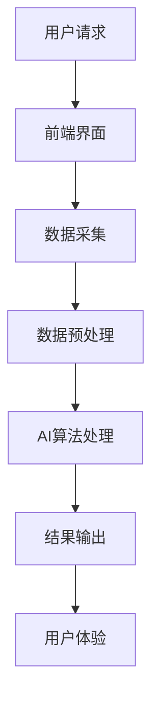

                 

### 《AI基础设施的博物馆：智能导览与文物保护系统》

#### 关键词：
- AI基础设施
- 智能导览系统
- 文物保护
- 机器学习
- 深度学习
- 自然语言处理
- 图像识别

#### 摘要：
本文旨在深入探讨AI基础设施在博物馆中的应用，特别是智能导览与文物保护系统。通过分析智能导览系统的设计原则、AI在文物保护中的角色，以及核心算法原理，本文不仅揭示了AI技术的实际应用，还展示了其在文化遗产保护中的潜力。此外，通过实战案例和代码解析，读者将获得实际开发AI基础设施的宝贵经验。

### 引言与背景

#### 第1章 AI基础设施概述

##### 1.1 AI的发展历程

人工智能（AI）的概念早在20世纪50年代就已经提出，但真正的发展是在21世纪初。随着计算能力的提升、大数据的积累以及算法的进步，AI从理论研究走向了实际应用。从早期的规则系统到现代的深度学习，AI经历了多次技术革命。

- **规则系统（1956-1974）**：基于预定义规则，如专家系统。
- **符号主义（1974-1980）**：基于逻辑推理，如逻辑推理机。
- **知识表示（1980-1987）**：使用知识库和推理机来处理复杂问题。
- **人工智能低谷（1987-1993）**：由于技术限制，AI研究进入低谷。
- **统计学习（1993-2006）**：基于统计模型，如支持向量机、随机森林。
- **深度学习（2006-至今）**：基于多层神经网络，如卷积神经网络（CNN）和递归神经网络（RNN）。

##### 1.2 AI基础设施的定义与重要性

AI基础设施是指支撑AI应用开发与运行的基础设施，包括硬件、软件、数据、算法等。它的重要性体现在：

- **硬件**：强大的计算能力是实现复杂AI算法的基础。
- **软件**：高效的开发工具和框架是加速AI应用开发的利器。
- **数据**：高质量的数据是训练AI模型的关键。
- **算法**：先进的算法是AI智能的核心。

##### 1.3 智能导览与文物保护的挑战与机遇

智能导览系统通过AI技术为游客提供个性化、互动性的导览服务。文物保护则利用AI进行检测、监测和修复。这两者面临的挑战与机遇如下：

- **挑战**：
  - **数据获取**：大量高质量的数据对于AI模型的训练至关重要。
  - **技术成熟度**：AI技术尚需进一步优化，以满足实际应用的需求。
  - **隐私与安全**：如何保护用户隐私和数据安全是重要议题。

- **机遇**：
  - **个性化服务**：AI技术可以实现更精确的用户需求分析，提供个性化的导览服务。
  - **文化传播**：智能导览有助于更好地传播文化知识，提高公众对文化遗产的认识。
  - **技术进步**：AI技术在文物保护中的应用有望推动相关技术的发展。

#### 第2章 智能导览系统设计

##### 2.1 智能导览系统的基本架构

智能导览系统通常由以下几个部分组成：

- **前端界面**：用户交互的入口，提供浏览、搜索、导览等功能。
- **后端服务器**：处理用户请求，管理数据，运行AI算法。
- **数据存储**：存储用户数据、文物数据、导览数据等。
- **通信模块**：实现前端与后端的数据传输。

##### 2.2 数据采集与处理

数据采集与处理是智能导览系统的关键步骤，主要包括：

- **用户数据**：包括用户偏好、行为记录等。
- **文物数据**：包括文物基本信息、历史背景、图片、音频等。
- **导览数据**：包括导览路线、讲解内容、互动活动等。

数据采集主要通过传感器、用户反馈、数据库等方式进行。数据预处理包括数据清洗、数据归一化、数据增强等，以提高数据质量。

##### 2.3 人工智能算法选择与应用

智能导览系统常用的AI算法包括：

- **机器学习**：用于用户行为分析、文物分类等。
- **深度学习**：用于图像识别、语音识别等。
- **自然语言处理**：用于文本生成、语音合成等。

算法选择应根据具体应用场景进行，如图像识别更适合使用卷积神经网络（CNN），文本生成更适合使用递归神经网络（RNN）。

##### 2.4 智能导览系统的用户体验设计

用户体验设计是智能导览系统成功的关键，主要包括：

- **界面设计**：简洁、美观、易用。
- **交互设计**：自然、直观、无缝。
- **功能设计**：全面、丰富、个性化。

用户体验设计需要充分考虑用户的需求和习惯，通过用户测试和反馈不断优化。

#### 第3章 文物保护中的AI应用

##### 3.1 AI在文物保护中的作用

AI技术在文物保护中扮演着重要角色，主要包括：

- **文物检测**：利用图像识别技术检测文物表面的损伤和病变。
- **文物修复**：通过深度学习算法生成修复建议。
- **文物监测**：实时监测文物的环境变化，预警潜在风险。

##### 3.2 针对文物的AI检测技术

AI检测技术主要包括：

- **图像识别**：用于识别文物表面的损伤、病变等。
- **光谱分析**：用于检测文物的成分、结构等。
- **红外成像**：用于检测文物内部结构。

##### 3.3 文物保护中的AI监测与预警系统

AI监测与预警系统主要包括：

- **实时监测**：通过传感器和数据采集系统，实时监测文物环境。
- **预警分析**：利用机器学习算法，分析监测数据，预测潜在风险。
- **预警通知**：通过短信、邮件等方式通知文物保护人员。

#### 第4章 AI基础设施的核心技术与联系

##### 4.1 机器学习与深度学习基础

##### 4.1.1 机器学习的基本概念

机器学习是一种通过数据训练模型，从而实现自动化的方法。它包括：

- **监督学习**：通过已标记的数据训练模型。
- **无监督学习**：通过未标记的数据发现模式。
- **半监督学习**：结合有标记和未标记的数据进行训练。

##### 4.1.2 深度学习的基本架构

深度学习是一种基于多层神经网络的学习方法。它包括：

- **神经网络**：基本的计算单元，包括输入层、隐藏层和输出层。
- **卷积神经网络（CNN）**：用于图像识别。
- **递归神经网络（RNN）**：用于序列数据处理。

##### 4.2 自然语言处理与图像识别技术

##### 4.2.1 自然语言处理技术

自然语言处理是一种使计算机能够理解、处理人类语言的技术。它包括：

- **语言模型**：用于预测文本序列。
- **序列模型**：用于处理时间序列数据。
- **注意力机制**：用于提高模型对关键信息的关注。

##### 4.2.2 图像识别技术

图像识别是一种使计算机能够识别和理解图像内容的技术。它包括：

- **图像处理技术**：用于预处理图像数据。
- **特征提取方法**：用于提取图像特征。
- **卷积神经网络（CNN）**：用于图像识别。

##### 4.3 Mermaid流程图：智能导览与文物保护系统工作流程



#### 第5章 机器学习与深度学习原理

##### 5.1 机器学习算法概述

##### 5.1.1 监督学习

监督学习是一种通过已标记的数据训练模型的方法。它包括以下几个步骤：

1. **数据准备**：收集并标记数据。
2. **模型选择**：选择合适的模型。
3. **模型训练**：使用训练数据训练模型。
4. **模型评估**：使用验证数据评估模型性能。
5. **模型优化**：调整模型参数，优化性能。

##### 5.1.2 无监督学习

无监督学习是一种通过未标记的数据发现模式的方法。它包括：

- **聚类**：将数据分为不同的簇。
- **降维**：将高维数据转换为低维表示。
- **生成模型**：生成新的数据样本。

##### 5.1.3 半监督学习

半监督学习是一种结合有标记和未标记的数据进行训练的方法。它包括：

- **标记数据增强**：使用未标记的数据来增强训练数据。
- **聚类与标记**：先使用聚类算法对数据进行分类，然后对每个簇进行标记。

##### 5.2 深度学习算法原理

##### 5.2.1 神经网络

神经网络是一种基于人脑神经元结构的信息处理系统。它包括：

- **神经元**：基本的计算单元，包括输入、权重、激活函数等。
- **层次结构**：多层神经元组成的结构，包括输入层、隐藏层和输出层。
- **前向传播**：将输入数据通过网络进行传播。
- **反向传播**：通过输出误差调整网络参数。

##### 5.2.2 卷积神经网络（CNN）

卷积神经网络是一种专门用于图像识别的神经网络。它包括：

- **卷积层**：用于提取图像特征。
- **池化层**：用于降低数据维度。
- **全连接层**：用于分类和回归。

##### 5.2.3 递归神经网络（RNN）

递归神经网络是一种专门用于序列数据处理的神经网络。它包括：

- **循环单元**：用于处理序列数据。
- **时间步**：将序列数据划分为多个时间步。
- **前向传播**：在每个时间步上，将输入数据通过网络进行传播。
- **反向传播**：通过输出误差调整网络参数。

##### 5.3 伪代码示例：神经网络训练过程

```python
# 初始化模型参数
W, b = initialize_parameters()

# 循环进行训练
for epoch in range(num_epochs):
    # 前向传播
    output = forward_propagation(X, W, b)
    
    # 计算损失
    loss = compute_loss(output, y)
    
    # 反向传播
    dW, db = backward_propagation(output, y)
    
    # 更新参数
    W, b = update_parameters(W, b, dW, db)

# 输出最终模型
model = (W, b)
```

#### 第6章 自然语言处理技术

##### 6.1 语言模型与序列模型

##### 6.1.1 语言模型

语言模型是一种用于预测文本序列的模型。它包括：

- **统计语言模型**：基于统计方法，如N元语法。
- **神经网络语言模型**：基于神经网络，如循环神经网络（RNN）。

##### 6.1.2 序列模型

序列模型是一种用于处理时间序列数据的模型。它包括：

- **循环神经网络（RNN）**：用于处理序列数据。
- **长短时记忆网络（LSTM）**：用于处理长序列数据。
- **门控循环单元（GRU）**：用于处理长序列数据。

##### 6.2 注意力机制与转换器架构

##### 6.2.1 注意力机制

注意力机制是一种用于提高模型对关键信息关注度的方法。它包括：

- **局部注意力**：对序列中的每个元素进行加权。
- **全局注意力**：对序列中的所有元素进行加权。

##### 6.2.2 转换器架构

转换器架构是一种用于序列到序列学习（如机器翻译）的模型。它包括：

- **编码器**：用于将输入序列编码为固定长度的向量。
- **解码器**：用于将编码器输出的向量解码为输出序列。
- **注意力机制**：用于在解码过程中关注编码器的输出。

#### 第7章 图像识别技术

##### 7.1 图像识别基础

##### 7.1.1 图像处理技术

图像处理技术是一种用于预处理图像数据的方法。它包括：

- **滤波**：用于去除图像中的噪声。
- **边缘检测**：用于提取图像中的边缘信息。
- **特征提取**：用于提取图像中的显著特征。

##### 7.1.2 特征提取方法

特征提取方法是一种用于提取图像特征的方法。它包括：

- **直方图**：用于表示图像的亮度分布。
- **主成分分析（PCA）**：用于降维和特征提取。
- **局部二值模式（LBP）**：用于提取图像的纹理特征。

##### 7.2 卷积神经网络在图像识别中的应用

##### 7.2.1 卷积神经网络的架构

卷积神经网络是一种用于图像识别的神经网络。它包括：

- **卷积层**：用于提取图像特征。
- **池化层**：用于降低数据维度。
- **全连接层**：用于分类和回归。

##### 7.2.2 卷积神经网络训练与预测

卷积神经网络的训练与预测过程包括：

1. **数据准备**：收集并标记训练数据。
2. **模型初始化**：初始化模型参数。
3. **前向传播**：计算输出。
4. **计算损失**：计算预测值与实际值之间的差距。
5. **反向传播**：更新模型参数。
6. **预测**：使用训练好的模型进行预测。

#### 第8章 智能导览系统开发实战

##### 8.1 开发环境搭建

智能导览系统的开发环境搭建包括以下几个步骤：

1. **硬件配置**：选择合适的计算机硬件，如CPU、GPU等。
2. **软件安装与配置**：安装操作系统、编程语言（如Python）、深度学习框架（如TensorFlow、PyTorch）等。

##### 8.2 源代码实现

智能导览系统的源代码实现包括以下几个部分：

1. **数据采集与预处理**：收集并预处理用户数据、文物数据等。
2. **模型训练与优化**：使用训练数据训练模型，并通过验证数据优化模型性能。
3. **模型部署与测试**：将训练好的模型部署到服务器，并进行测试。

##### 8.3 代码解读与分析

以下是智能导览系统的一部分代码示例：

```python
# 导入所需的库
import tensorflow as tf
from tensorflow.keras import layers

# 定义模型
model = tf.keras.Sequential([
    layers.Conv2D(32, (3, 3), activation='relu', input_shape=(28, 28, 1)),
    layers.MaxPooling2D((2, 2)),
    layers.Flatten(),
    layers.Dense(128, activation='relu'),
    layers.Dense(10, activation='softmax')
])

# 编译模型
model.compile(optimizer='adam',
              loss='sparse_categorical_crossentropy',
              metrics=['accuracy'])

# 训练模型
model.fit(train_images, train_labels, epochs=5)

# 测试模型
test_loss, test_acc = model.evaluate(test_images, test_labels)

print(f'测试准确率：{test_acc}')
```

这段代码定义了一个简单的卷积神经网络模型，用于图像分类。它包括卷积层、池化层、全连接层等。通过训练数据和验证数据训练模型，并计算测试准确率。

#### 第9章 文物保护系统开发实战

##### 9.1 开发环境搭建

文物保护系统的开发环境搭建包括以下几个步骤：

1. **硬件配置**：选择合适的计算机硬件，如CPU、GPU等。
2. **软件安装与配置**：安装操作系统、编程语言（如Python）、深度学习框架（如TensorFlow、PyTorch）等。

##### 9.2 源代码实现

文物保护系统的源代码实现包括以下几个部分：

1. **文物图像采集与处理**：采集并预处理文物图像数据。
2. **文物检测与分类**：使用深度学习模型检测和分类文物。
3. **文物保护预警系统**：根据检测结果生成预警信息。

##### 9.3 代码解读与分析

以下是文物保护系统的一部分代码示例：

```python
# 导入所需的库
import tensorflow as tf
from tensorflow.keras.preprocessing import image
from tensorflow.keras.models import load_model

# 加载预训练模型
model = load_model('文物检测模型.h5')

# 读取文物图像
img = image.load_img('文物图像.jpg', target_size=(224, 224))

# 预处理图像
img_array = image.img_to_array(img)
img_array = tf.expand_dims(img_array, 0)  
img_array /= 255.0

# 进行预测
predictions = model.predict(img_array)

# 获取预测结果
predicted_class = np.argmax(predictions[0])

# 根据预测结果生成预警信息
if predicted_class == 文物损伤类别：
    print('文物可能受损，请及时处理。')
else:
    print('文物状态正常。')
```

这段代码加载了一个预训练的文物检测模型，读取文物图像，进行预处理，然后进行预测。根据预测结果，生成相应的预警信息。

#### 附录A：AI基础设施开发工具与资源

##### A.1 主流深度学习框架对比

以下是几个主流深度学习框架的对比：

- **TensorFlow**：由Google开发，具有广泛的社区支持和丰富的API。
- **PyTorch**：由Facebook开发，具有灵活的动态计算图和易用性。
- **Keras**：是一个高层神经网络API，可以与TensorFlow和Theano一起使用。
- **MXNet**：由Apache Software Foundation开发，支持多种编程语言。

##### A.2 AI基础设施相关文献与资料推荐

以下是几本关于AI基础设施的推荐书籍：

- **《深度学习》（Goodfellow, Bengio, Courville）**：提供了深度学习的全面介绍。
- **《Python深度学习》（François Chollet）**：介绍了使用Keras进行深度学习的实践方法。
- **《AI应用实践》（Manning, Naftali, Samuel）**：提供了AI在不同领域应用的实际案例。

### 作者信息

- **作者：AI天才研究院/AI Genius Institute & 禅与计算机程序设计艺术 /Zen And The Art of Computer Programming**

### 结束语

本文通过深入探讨AI基础设施在博物馆中的应用，特别是智能导览与文物保护系统，揭示了AI技术的实际应用价值。希望读者通过本文，能够对AI基础设施有更深入的理解，并能够在实际项目中灵活运用相关技术。让我们共同探索AI技术的未来，为文化遗产的保护与传承贡献力量。

